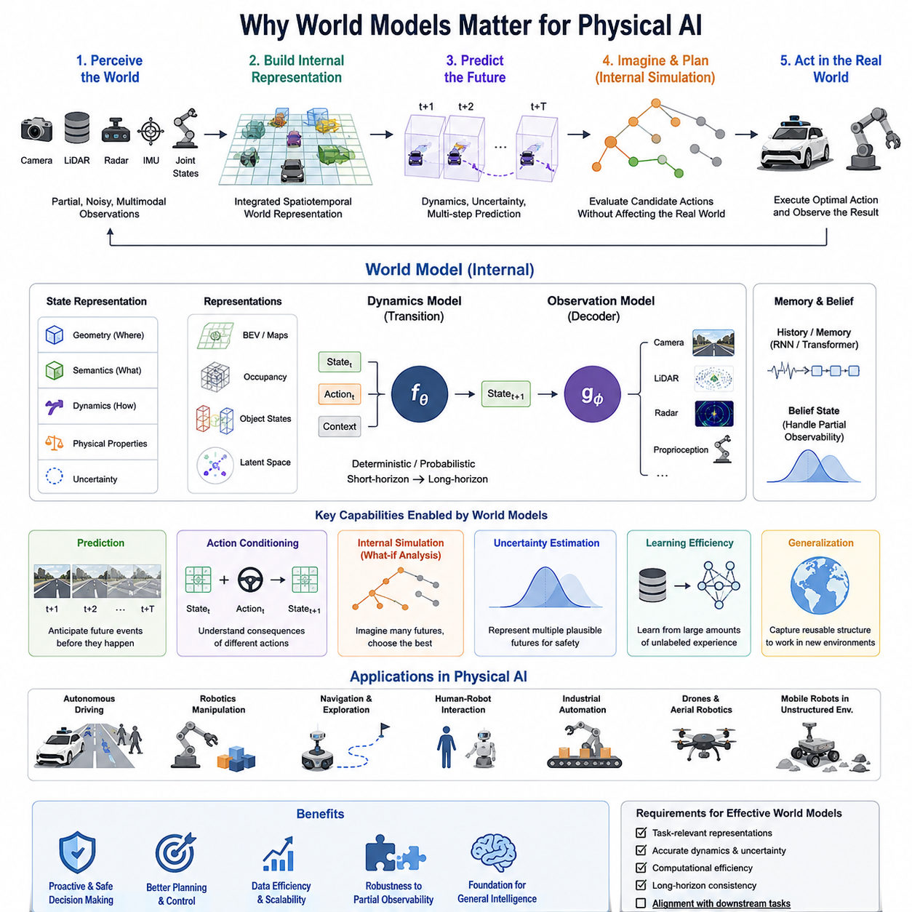
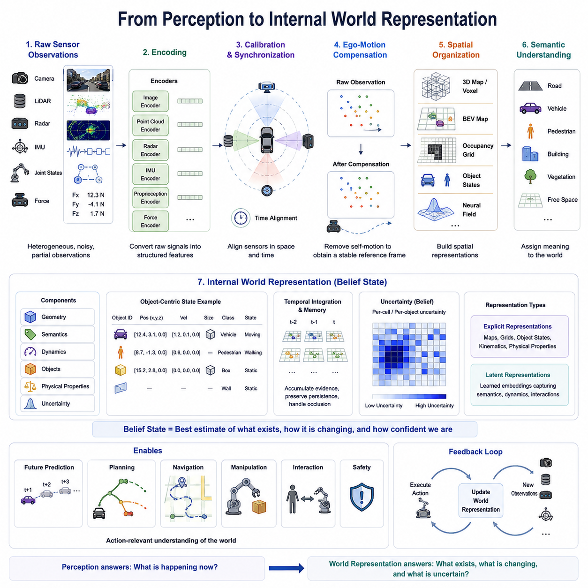
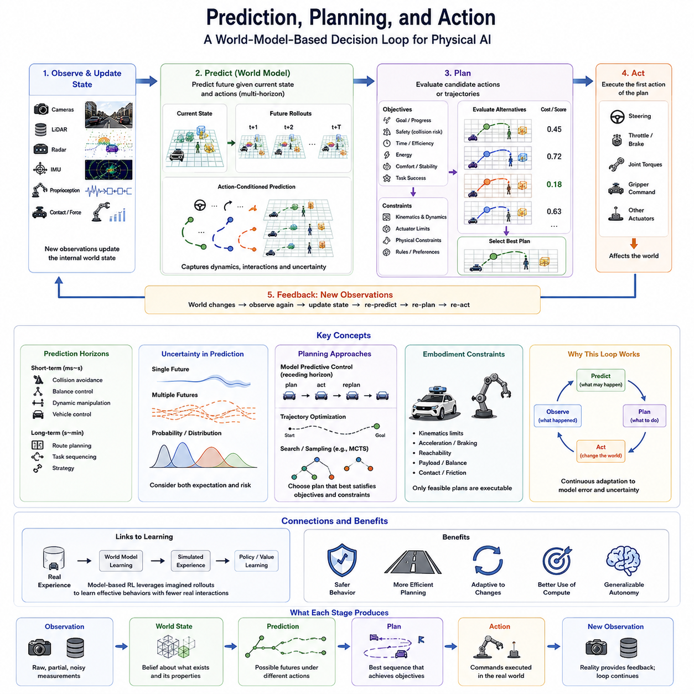
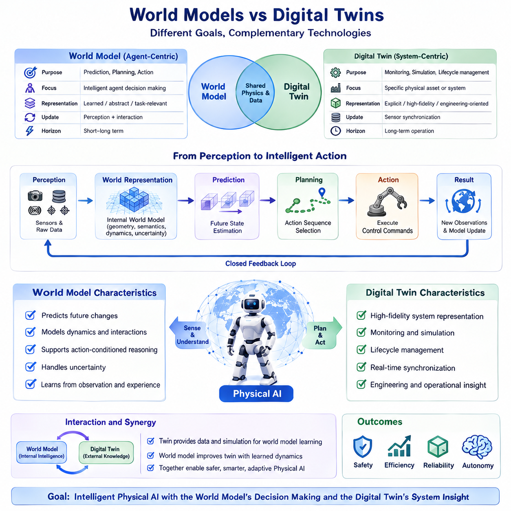
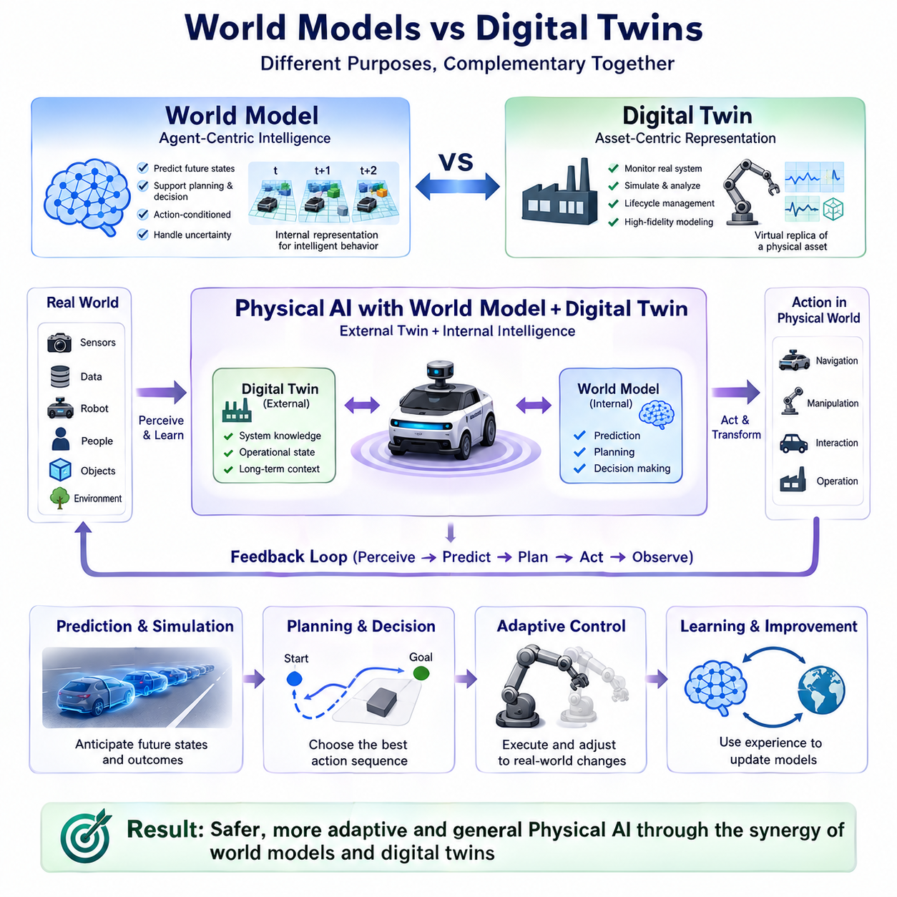
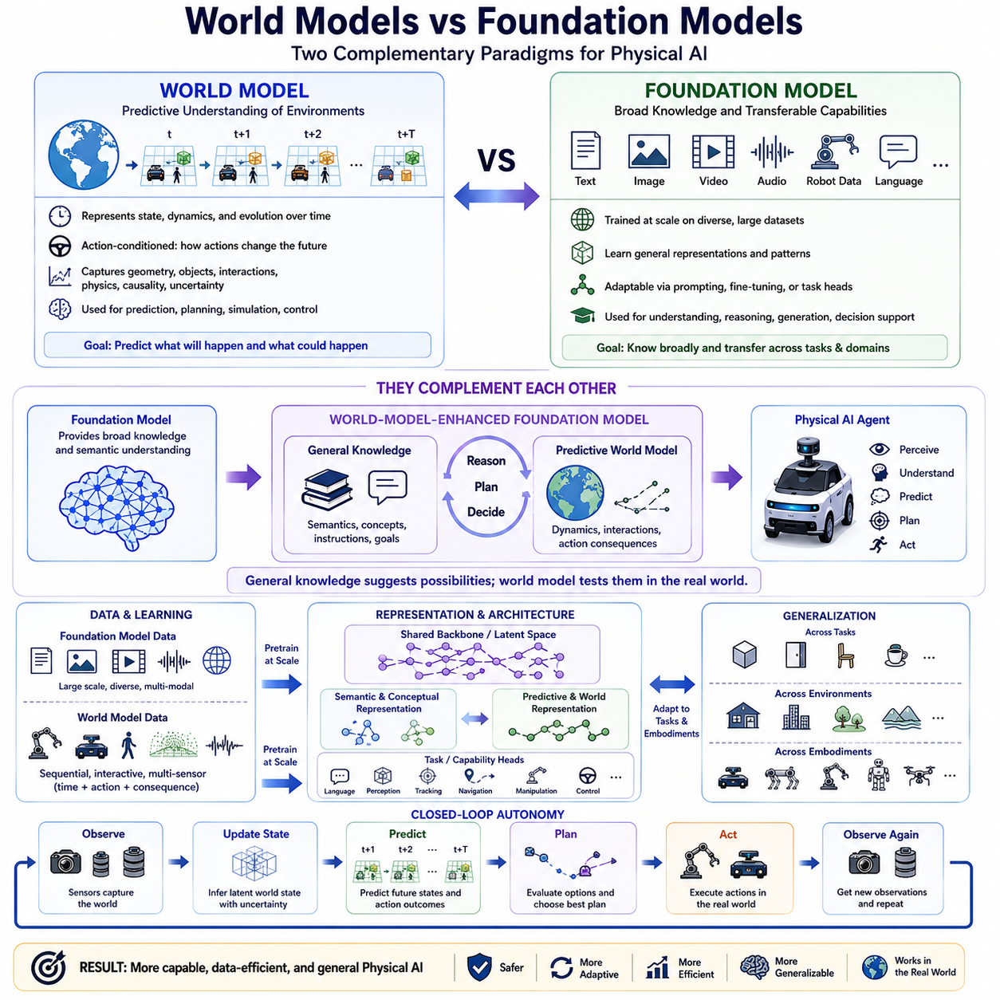
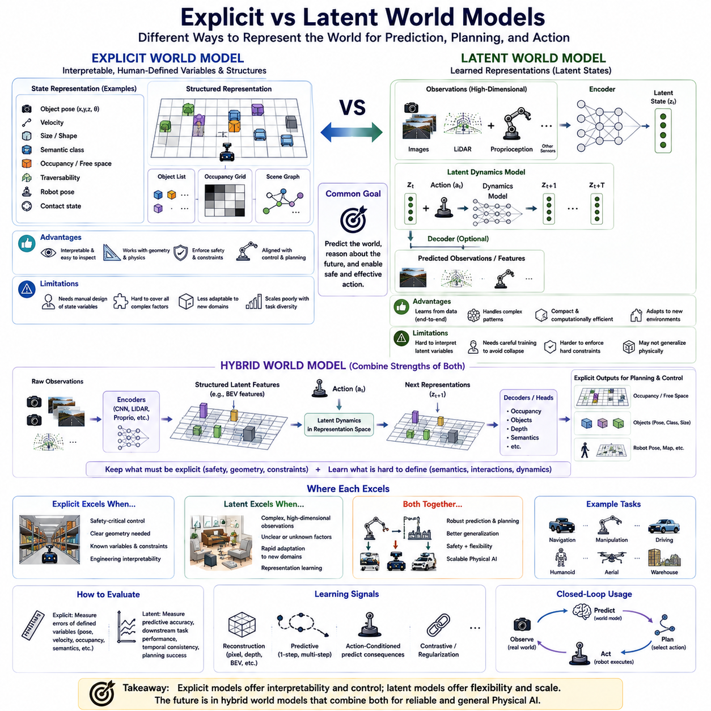
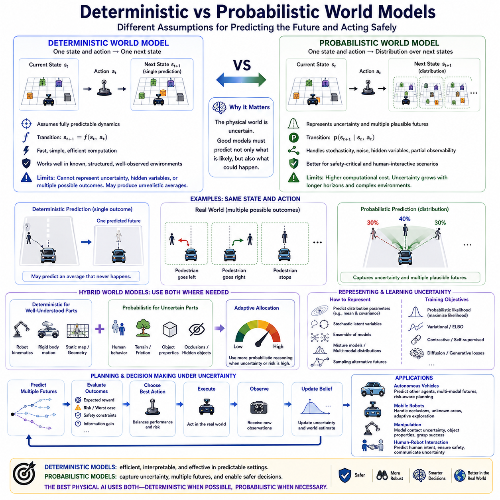
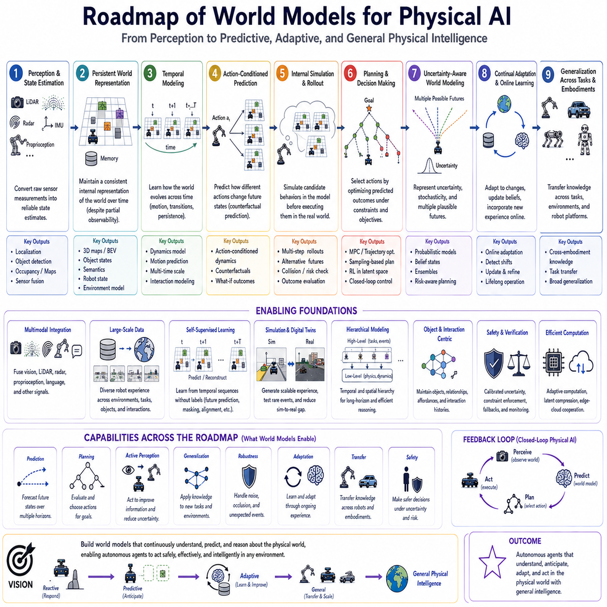

**Volume 07. World Models for Physical AI**

# Chapter 00. Introduction

## 00.01. Why World Models Matter for Physical AI

{width="7.268055555555556in" height="7.268055555555556in"}

물리 인공지능(Physical AI)은 연속적이고 동적이며 부분적으로 관찰 가능하고 물리적 제약의 지배를 받는 환경에서 작동한다. 정적인 정보나 기호적 표현을 기반으로 추론할 수 있는 디지털 인공지능(Digital AI)과 달리, 물리적 에이전트(physical agent)는 주변 세계가 시간에 따라 어떻게 변화하는지를 이해해야 한다. 월드 모델(world model)은 이러한 변화하는 조건을 표현하고 지각(perception)을 지능적 행동(action)과 연결하는 데 필요한 내부 구조를 제공한다.

로봇은 물리 세계(physical world) 전체를 직접 관찰할 수 없다. 카메라(camera)는 투영된 영상을 제공하고, 라이다(LiDAR)는 희소한 기하학적 표면을 측정하며, 레이더(radar)는 거리와 속도를 추정하고, 고유수용성 센서(proprioceptive sensor)는 로봇 자체의 움직임을 설명한다. 이러한 관측(observation)은 불완전하며 때로는 잡음이 포함된다. 월드 모델(world model)은 이들을 통합하여 개별 센서 측정을 넘어 환경의 근본적인 상태를 근사하는 내부 표현(internal representation)을 구성한다.

이러한 내부 표현(internal representation)이 특히 중요한 이유는 물리 지능(physical intelligence)이 시간적 연속성(temporal continuity)을 필요로 하기 때문이다. 로봇은 현재 관찰하는 것을 직전에 관찰했던 것과 연결하고, 다음에 어떤 일이 발생할지를 예측해야 한다. 이동 차량, 보행자, 매니퓰레이터(manipulator), 문, 지형, 심지어 로봇 자체도 시간에 따라 변화한다. 따라서 월드 모델(world model)은 개별적인 관측을 상태(state), 운동(motion), 상호작용(interaction), 가능한 미래 변화에 대한 구조화된 추정으로 변환한다.

예측(prediction)은 월드 모델(world model)이 물리 인공지능(Physical AI)에서 중요한 핵심 이유 중 하나이다. 반응형 시스템(reactive system)은 주로 현재의 센서 입력에 대응하지만, 예측형 시스템(predictive system)은 미래 상태가 발생하기 전에 이를 추정할 수 있다. 이동 로봇이 보행자가 자신의 경로로 진입할 것을 예측하거나, 매니퓰레이터(manipulator)가 접촉 이후 물체가 미끄러질 것을 예측한다면 바람직하지 않은 상황을 피할 수 없게 되기 전에 행동을 수정할 수 있다.

월드 모델(world model)은 또한 에이전트(agent)가 자신의 행동이 초래할 결과를 추론할 수 있도록 한다. 물리적 행동(physical action)은 환경을 변화시키기 때문에 지각(perception)과 제어(control)는 서로 분리될 수 없다. 조향은 미래의 카메라 시야를 변화시키고, 가속은 충돌 위험을 변화시키며, 파지(grasping)는 물체의 배치를 변화시킨다. 행동 조건부 월드 모델(action-conditioned world model)은 서로 다른 후보 행동이 미래 상태를 어떻게 변화시킬지를 추정함으로써 로봇이 실제 행동을 수행하기 전에 대안을 비교할 수 있도록 한다.

이러한 능력은 일종의 내부 시뮬레이션(internal simulation)을 가능하게 한다. 에이전트(agent)는 모든 가능성을 현실 세계에서 직접 시험하는 대신 모델 내부에서 예측 궤적(predicted trajectory)이나 잠재 상태 전이(latent state transition)를 생성할 수 있다. 후보 행동은 환경에 즉각적인 영향을 미치지 않은 상태에서 상상되고, 평가되고, 거부되거나 개선될 수 있다. 이러한 내부 롤아웃(internal rollout)은 예측에서 계획(planning), 모델 예측 제어(Model Predictive Control), 모델 기반 강화학습(model-based reinforcement learning)으로 연결되는 중요한 계산적 가교를 제공한다.

월드 모델(world model)은 부분 관찰 가능성(partial observability)을 처리하는 데에도 매우 중요하다. 물체가 장애물 뒤로 사라질 수 있고, 센서가 일시적으로 고장 날 수 있으며, 중요한 환경 특성을 직접 측정하지 못할 수도 있다. 시스템은 기억(memory)과 숨겨진 상태(hidden state)에 대한 믿음(belief)을 유지함으로써 시간에 걸쳐 정보를 보존할 수 있다. 따라서 로봇은 현재 보이는 것뿐만 아니라 축적된 경험을 통해 존재할 가능성이 높다고 판단되는 것까지 고려하여 행동한다.

물리 인공지능(Physical AI)에 유용한 세계 표현(world representation)은 단순한 기하학(geometry) 이상의 정보를 포착해야 한다. 공간 구조(spatial structure)는 사물이 어디에 있는지를 나타내고, 의미 정보(semantic information)는 그것이 무엇인지를 나타내며, 동역학(dynamics)은 어떻게 움직이는지를 설명하고, 물리적 특성(physical property)은 어떻게 상호작용하는지를 결정한다. 작업과 로봇의 신체적 구현(embodiment)에 따라 주행 가능성(traversability), 접촉(contact), 마찰(friction), 지지(support), 속도(velocity), 물체 영속성(object permanence), 자유 공간(free space), 점유(occupancy), 불확실성(uncertainty) 등이 내부 상태의 중요한 구성 요소가 될 수 있다.

이러한 요구사항은 월드 모델링(world modeling)이 다양한 표현 형태를 가질 수 있는 이유를 설명한다. 일부 시스템은 명시적 지도(explicit map), 객체 상태(object state), 점유 필드(occupancy field), 조감도 표현(Bird's-Eye-View representation)을 사용하는 반면, 다른 시스템은 환경을 학습된 잠재 변수(latent variable)로 인코딩한다. 적절한 표현은 예측과 행동에 필요한 정보에 따라 결정된다. 월드 모델(world model)은 관찰 가능한 모든 세부 정보를 반드시 재구성할 필요는 없으며, 효과적인 물리적 추론(physical reasoning)을 지원하는 정보를 보존해야 한다.

효율적인 추상화(efficient abstraction)는 물리 인공지능(Physical AI) 시스템이 제한된 연산 자원, 전력, 메모리, 지연시간(latency) 조건에서 작동하기 때문에 특히 중요하다. 모든 미래 픽셀(pixel)을 전체 해상도로 예측하는 것은 제어와 무관한 세부 사항을 표현하면서도 상당한 자원을 소비할 수 있다. 잠재 예측 접근법(latent predictive approach)은 작업과 관련된 구조를 인코딩하고 표현 공간(representation space)에서 변화를 예측함으로써 완전한 감각 관측을 재생성하지 않고도 미래 상황을 추론할 수 있도록 한다.

물리 환경(physical environment)에는 단순히 모델의 용량을 증가시키는 것만으로 제거할 수 없는 불확실성(uncertainty)도 존재한다. 센서는 완벽하지 않고, 인간의 미래 행동은 모호하며, 지형 특성은 알려지지 않을 수 있고, 여러 미래 결과가 동시에 가능할 수 있다. 따라서 유용한 월드 모델(world model)은 하나의 확신에 찬 예측만 생성하기보다 불확실성을 표현하는 메커니즘을 갖추어야 한다. 이는 예측 결과가 충돌 회피(collision avoidance), 조작(manipulation), 내비게이션(navigation), 기타 안전 관련 의사결정에 사용될 때 특히 중요하다.

월드 모델(world model)은 물리적 경험의 상당 부분이 명시적인 인간의 레이블(label) 없이도 유용한 구조를 포함하기 때문에 학습 효율성도 향상시킬 수 있다. 시간적 시퀀스(temporal sequence)는 장면이 어떻게 변화하고, 행동이 관측에 어떤 영향을 주며, 어떤 특성이 안정적으로 유지되는지를 자연스럽게 보여준다. 자기지도 예측 학습(self-supervised predictive learning)은 수작업으로 레이블링된 데이터셋에만 의존하지 않고 공간, 시간, 모달리티(modality), 행동 간의 관계를 학습함으로써 대규모 로봇 센서 데이터를 활용할 수 있다.

멀티모달 통합(multimodal integration)은 이러한 능력을 더욱 강화한다. 물리 로봇은 일반적으로 카메라(camera), 라이다(LiDAR), 레이더(radar), 관성측정장치(IMU), 관절 상태(joint state), 힘 센싱(force sensing), 위치 측정 시스템(positioning system) 등의 정보를 결합한다. 각 모달리티(modality)는 현실의 서로 다른 측면을 포착하며 서로 다른 방식으로 실패할 수 있다. 멀티모달 월드 모델(multimodal world model)은 이러한 신호를 공유된 시공간 표현(spatiotemporal representation)에 정렬하여 상호 보완적인 관측을 통해 환경과 로봇 상태를 더욱 강건하게 추정할 수 있도록 한다.

로봇이 구조화된 시설에서 개방된 환경(open environment)으로 이동할수록 월드 모델(world model)의 중요성은 더욱 커진다. 창고는 비교적 안정적인 기하 구조와 예측 가능한 이동 규칙을 제공하지만, 도로, 건설 현장, 농장, 재난 지역, 야외 지형에는 변화하는 표면, 불확실한 객체, 날씨의 영향, 새로운 상황이 존재한다. 환경의 다양성과 상호작용의 복잡성이 증가할수록 고정된 규칙(fixed rule)만으로 대응하는 방식은 점점 한계를 드러낸다.

따라서 일반화(generalization)는 에이전트(agent)가 물리 환경이 어떻게 작동하는지에 관한 재사용 가능한 구조를 학습했는지에 부분적으로 좌우된다. 관측과 행동 사이의 상관관계만을 암기하는 방식은 익숙한 데이터 분포에서는 작동할 수 있지만 조건이 변하면 실패할 수 있다. 월드 모델(world model)은 운동, 지속성(persistence), 인과성(causality), 기하학, 상호작용, 물리적 제약과 관련된 더욱 전이 가능한 규칙을 포착하여 특정 훈련 상황을 넘어 행동할 수 있는 표현을 제공하고자 한다.

이는 월드 모델(world model)과 시뮬레이션(simulation) 사이에도 중요한 연결 관계를 형성한다. 전통적인 시뮬레이터(simulator)는 사람이 명시한 물리 법칙에서 시작하여 그 규칙으로부터 궤적을 생성하는 반면, 학습된 월드 모델(learned world model)은 데이터로부터 유용한 상태 전이 구조를 추론한다. 하이브리드 접근법(hybrid approach)은 해석적 물리학(analytical physics)과 학습된 잔차 동역학(learned residual dynamics)을 결합하여 알려진 제약조건으로 구조를 제공하면서 명시적으로 모델링하기 어려운 효과를 데이터 기반 구성 요소가 학습하도록 할 수 있다.

계획(planning)의 관점에서 월드 모델(world model)의 가치는 궁극적으로 그 예측이 의사결정을 얼마나 향상시키는지에 달려 있다. 시각적으로 인상적인 미래 예측이라도 안전한 제어에 필요한 정보를 누락한다면 충분하지 않다. 따라서 물리 인공지능(Physical AI)은 표현과 동역학이 다운스트림 작업(downstream task)에 정렬된 월드 모델을 필요로 한다. 예측 품질, 불확실성, 계산 비용, 시간적 예측 범위(temporal horizon), 계획 유용성(planning utility)을 서로 독립적인 목표가 아니라 함께 고려해야 한다.

월드 모델(world model)은 점점 더 일반적인 로봇 지능(general robot intelligence)을 위한 기반도 제공한다. 작업, 환경, 센서 구성, 신체적 구현(embodiment)을 가로질러 표현을 학습할 수 있다면, 월드 모델은 특정 작업 중심의 예측 시스템에서 보다 광범위한 물리 파운데이션 모델(physical foundation model)로 발전할 수 있다. 공유 모델(shared model)은 객체, 자유 공간, 운동, 접촉, 지지, 어포던스(affordance), 행동 결과와 같은 재사용 가능한 개념을 포착하고, 특화된 태스크 헤드(task head)를 통해 개별 로봇 플랫폼에 이러한 표현을 적용할 수 있다.

이러한 의미에서 월드 모델(world model)은 물리 인공지능(Physical AI) 아키텍처의 중심적인 위치를 차지한다. 지각(perception)은 현재를 추정하고, 기억(memory)은 과거를 연결하며, 예측 동역학(predictive dynamics)은 가능한 미래를 구성하고, 계획(planning)은 이러한 미래를 평가하며, 제어(control)는 선택된 가능성을 실제 물리적 행동으로 전환한다. 월드 모델은 이러한 기능들이 서로 상호작용할 수 있는 내부 계산 공간(internal computational space)을 제공하며, 반응형 자동화(reactive automation)에서 예측적이고 적응적이며 점점 더 일반화된 물리 지능으로 발전하기 위한 핵심 메커니즘이 된다.

## 00.02. From Perception to Internal World Representation

{width="7.268055555555556in" height="7.268055555555556in"}

물리 인공지능(Physical AI)은 지각(perception)을 통해 세계와 상호작용하기 시작하지만, 지각 자체만으로 이해(understanding)가 이루어지는 것은 아니다. 센서는 이미지, 포인트 클라우드(point cloud), 거리, 관성 측정값, 힘, 관절 상태(joint state) 등의 신호를 지속적으로 생성한다. 이러한 측정값은 특정 순간의 환경 일부만을 나타낸다. 지능적인 행동을 지원하려면 이러한 정보가 지속적으로 유지되는 세계의 내부 표현(internal world representation)으로 변환되어야 한다.

관측(observation)과 세계 상태(world state)의 구분은 매우 중요하다. 관측은 센서가 현재 측정하는 것이지만, 세계 상태는 에이전트(agent)가 환경에 존재한다고 판단하는 것을 나타낸다. 카메라는 물체의 한쪽 면만 관찰할 수 있지만, 내부 표현(internal representation)은 물체가 일시적으로 보이지 않더라도 추정된 위치, 정체성, 크기, 움직임, 이전에 관찰된 특성을 유지할 수 있다.

이러한 변환은 감각 인코딩(sensory encoding)에서 시작된다. 원시 카메라 픽셀, 라이다(LiDAR) 포인트, 레이더(radar) 반사 신호, 오디오 신호, 관성 측정값, 고유수용성 상태(proprioceptive state)는 서로 다른 수학적 공간과 해상도로 존재한다. 인코더(encoder)는 이러한 이질적인 신호를 구조화된 특징(feature)이나 잠재 표현(latent representation)으로 변환한다. 목적은 단순한 압축이 아니라 기하학, 의미, 운동, 물리적 상호작용, 미래 행동을 이해하는 데 유용한 정보를 추출하는 것이다.

물리 인공지능(Physical AI)은 일반적으로 하나의 센서만으로 현실을 완전하게 설명할 수 없기 때문에 멀티모달 지각(multimodal perception)을 필요로 한다. 카메라는 풍부한 외형과 의미 정보를 제공하지만 기하학적 정보는 간접적이다. 라이다(LiDAR)는 정확한 공간 구조를 측정하지만 외형 정보는 제한적이다. 레이더(radar)는 강건한 거리와 속도 정보를 제공하며, 관성측정장치(IMU)와 고유수용감각(proprioception)은 에이전트 자체의 움직임을 설명한다. 이들을 결합하면 세계에 대한 더욱 완전한 추정이 가능해진다.

따라서 센서 융합(sensor fusion)은 지각(perception)에서 세계 표현(world representation)으로 전환되는 중요한 단계이다. 서로 다른 센서의 측정값이 하나의 공통된 물리 장면을 설명하려면 공간적·시간적으로 정렬되어야 한다. 보정(calibration)은 센서 좌표계 사이의 관계를 설정하고, 동기화(synchronization)는 거의 동일한 시간에 발생한 측정값을 연결한다. 이러한 관계가 없다면 서로 다른 센서의 관측이 동일한 환경에 대해 서로 일치하지 않는 설명을 만들 수 있다.

로봇은 또한 환경 자체의 변화와 자신의 움직임 때문에 발생하는 변화를 구분해야 한다. 이동 로봇이 회전하면 주변 물체가 정지해 있더라도 거의 모든 카메라 픽셀과 라이다(LiDAR) 포인트가 움직일 수 있다. 자기 운동 추정(ego-motion estimation)을 이용하면 관측을 일관된 기준 좌표계(reference frame)로 변환할 수 있다. 자기 운동(self-motion)과 환경 운동(environmental motion)의 분리는 동적인 물리 장면에 대한 안정적인 표현을 구성하는 데 필수적이다.

관측이 정렬되면 시스템은 이를 공간 표현(spatial representation)으로 구성할 수 있다. 응용 분야에 따라 미터법 지도(metric map), 조감도 표현(Bird's-Eye-View representation), 점유 격자(occupancy grid), 3차원 복셀 구조(3D voxel structure), 객체 중심 상태(object-centric state), 신경 필드(neural field), 잠재 공간 임베딩(latent spatial embedding) 등이 사용될 수 있다. 각 표현은 현실의 서로 다른 측면을 보존하며, 적절한 표현은 이후의 예측, 계획, 제어에서 무엇이 필요한지에 따라 결정된다.

그러나 기하학(geometry)만으로는 지능적인 물리적 상호작용을 수행하기에 충분하지 않다. 시스템은 공간 구조를 의미적 정보(semantic meaning)와 점차 연결해야 한다. 하나의 기하학적 영역은 벽, 도로, 보행자, 차량, 팔레트, 출입구, 테이블, 도구 또는 조작 가능한 물체에 해당할 수 있다. 의미 표현(semantic representation)은 익명의 물리 구조를 의미를 가진 객체와 영역으로 변환하여 내비게이션, 상호작용, 작업 계획, 안전 의사결정에 영향을 미칠 수 있도록 한다.

객체 중심 표현(object-centric representation)은 또 다른 유용한 추상화 수준을 제공한다. 세계 전체를 픽셀이나 격자 셀(grid cell)로만 처리하는 대신 에이전트(agent)는 위치, 자세, 크기, 속도, 범주, 상호작용 상태 등의 속성을 가진 지속적인 객체(entity)로 세계를 표현할 수 있다. 많은 물리적 작업은 개별 센서 측정값 사이의 관계보다 객체, 에이전트, 표면, 로봇 사이의 관계를 다루기 때문에 이러한 표현은 추론(reasoning)을 단순화할 수 있다.

세계 표현(world representation)은 동역학(dynamics)도 포함해야 한다. 물리 환경은 정적인 지도가 아니라 객체가 움직이고, 에이전트가 행동하며, 상호작용이 미래 조건을 변화시키는 진화하는 시스템이다. 속도, 가속도, 궤적(trajectory), 관절 운동(articulation), 접촉(contact) 등의 동적 특성을 추정하면 내부 모델이 현재 존재하는 상태와 그 상태가 어떻게 변화하고 있는지를 구분할 수 있다. 이러한 구분은 미래 상태 예측(future-state prediction)을 위한 표현의 기반을 마련한다.

따라서 시간적 통합(temporal integration)은 지각(perception)에서 월드 모델(world model)로 전환되는 핵심 요소이다. 하나의 관측은 모호할 수 있지만 연속된 관측은 지속성과 움직임에 대한 정보를 제공한다. 시간적 기억(temporal memory)은 여러 프레임에 걸쳐 증거를 축적하고 일시적인 센서 잡음에 대한 민감도를 줄이며 가려진 객체에 관한 정보를 보존한다. 그 결과 내부 표현(internal representation)은 개별 관측보다 더욱 안정적인 상태를 유지할 수 있다.

이러한 과정은 자연스럽게 믿음 상태(belief state)의 개념으로 이어진다. 물리 세계는 부분적으로만 관찰 가능하기 때문에 내부 상태를 항상 현실에 대한 완벽한 설명으로 간주할 수는 없다. 대신 내부 상태는 현재 측정값, 이전 관측, 학습된 동역학(learned dynamics), 불확실성(uncertainty)을 기반으로 에이전트(agent)가 구성한 최선의 추정치를 나타낸다. 믿음 상태는 추정된 특성뿐만 아니라 그러한 특성이 얼마나 정확한지에 대한 신뢰도(confidence)도 포함할 수 있다.

따라서 불확실성(uncertainty)은 지각 과정 이후에 단순히 추가되는 오류가 아니라 표현 자체의 일부이다. 센서 잡음, 가림(occlusion), 모호한 분류, 알려지지 않은 지형, 예측하기 어려운 에이전트는 세계 상태의 각 부분에 서로 다른 수준의 신뢰도를 만든다. 이러한 불확실성을 표현하면 이후의 계획 시스템(planning system)이 충분히 관측된 자유 공간과 제대로 관측되지 않은 영역을 구분하고, 예측 가능한 움직임과 여러 미래 가능성을 가진 행동을 구별할 수 있다.

학습된 잠재 표현(learned latent representation)은 세계 상태의 모든 구성 요소를 명시적으로 정의하는 방식에 대한 대안을 제공한다. 신경망 인코더(neural encoder)는 고차원 관측을 예측이나 제어에 유용한 정보를 보존하는 압축된 잠재 변수(latent variable)로 변환할 수 있다. 이러한 표현은 사람이 직접 설계하기 어려운 관계를 포착할 수 있으며, 학습된 표현 공간에서 미래 상태를 직접 예측함으로써 계산 비용을 줄일 수도 있다.

명시적 표현(explicit representation)과 잠재 표현(latent representation)은 반드시 서로 경쟁하는 접근법은 아니다. 물리 인공지능(Physical AI) 아키텍처는 점유(occupancy)나 조감도(BEV) 지도와 같은 해석 가능한 기하학적 구조를 유지하면서 의미, 동역학 또는 상호작용 패턴을 인코딩하는 잠재 특징(latent feature)을 동시에 학습할 수 있다. 하이브리드 표현(hybrid representation)은 명시적 상태의 투명성과 물리적 기반을 학습된 잠재 공간의 유연성 및 표현 능력과 결합할 수 있다.

내부 표현(internal representation)의 품질은 궁극적으로 감각 입력을 얼마나 완전하게 재구성하는지가 아니라 실제로 얼마나 유용한지에 따라 평가되어야 한다. 미래 예측, 충돌 회피, 내비게이션, 조작, 상호작용에 필요한 정보는 보존되어야 하지만 관련성이 낮은 세부 정보는 제거될 수 있다. 이러한 원리는 모델이 물리 환경의 모든 특성을 동일한 정밀도로 인코딩할 필요 없이 세계 표현을 작업 인식형(task-aware)으로 구성할 수 있도록 한다.

행동(action) 역시 세계가 어떻게 표현되어야 하는지에 영향을 미친다. 로봇은 환경을 수동적으로 관찰하기만 하는 것이 아니라 이동과 상호작용을 통해 자신의 관측과 주변 환경을 변화시킨다. 따라서 물리 인공지능(Physical AI)을 지원하는 내부 상태는 행동의 결과를 예측하는 데 도움이 되는 변수를 보존해야 한다. 위치, 속도, 접촉 상태, 주행 가능성(traversability), 객체 어포던스(object affordance), 물리적 제약은 가능한 행동이 세계를 어떻게 변화시킬지를 결정하기 때문에 중요한 정보가 된다.

표현이 장기간에 걸쳐 축적되면 즉각적인 지각을 넘어 세계 기억(world memory)으로 확장될 수 있다. 지역적 관측은 이전에 방문했던 장소, 지속적으로 존재하는 객체, 학습된 환경 구조, 반복되는 상호작용 패턴과 연결될 수 있다. 이러한 기억은 로봇이 현재 센서의 관측 범위를 넘어 추론할 수 있도록 하며, 단기 지각(short-term perception), 공간 지도화(spatial mapping), 일화적 경험(episodic experience), 장기 지식(long-term knowledge) 사이에 연속성을 형성한다.

따라서 지각(perception)에서 내부 세계 표현(internal world representation)으로의 전환은 원시 측정값을 구조화되고 시간적으로 일관되며 행동과 관련된 현실에 대한 믿음으로 점진적으로 변환하는 과정으로 이해할 수 있다. 인코딩(encoding)은 특징을 추출하고, 융합(fusion)은 여러 모달리티를 결합하며, 공간 추론(spatial reasoning)은 기하학을 구성하고, 의미론(semantics)은 의미를 부여하며, 기억(memory)은 연속성을 유지하고, 불확실성(uncertainty)은 아직 알 수 없는 것을 표현한다. 이러한 과정이 결합되어 예측과 계획이 작동할 수 있는 내부 상태를 형성한다.

물리 인공지능(Physical AI)에서 이러한 내부 표현(internal representation)은 세계를 감지하는 것과 세계에 대해 추론하는 것 사이의 경계가 된다. 지각(perception)은 현재 무엇이 일어나고 있는 것처럼 보이는지를 설명하지만, 세계 표현(world representation)은 무엇이 존재하고, 무엇이 지속되어 왔으며, 무엇이 변화하고 있고, 무엇이 여전히 불확실한지를 설명하려 한다. 이러한 표현이 구축되면 시스템은 단순한 인식을 넘어 미래 상태를 예측하고, 가능한 행동을 평가하며, 물리 세계에서 수행할 행동을 선택하는 단계로 발전할 수 있다.

## 00.03. Prediction Planning and Action

{width="7.268055555555556in" height="7.268055555555556in"}

물리 인공지능(Physical AI)은 세계에 대한 내부 표현(internal representation)을 지능적인 행동(intelligent behavior)으로 전환할 수 있을 때 비로소 실질적인 가치를 갖게 된다. 표현을 구축하는 것은 에이전트(agent)가 현재 상황을 어떻게 인식하고 있는지를 설명하지만, 자율적인 작동을 위해서는 세계가 앞으로 어떻게 변화할지를 예상하고 다음에 무엇을 해야 하는지를 결정하는 추가적인 능력이 필요하다. 따라서 예측(prediction), 계획(planning), 행동(action)은 월드 모델(world model)을 기반으로 하는 연속적인 의사결정 루프(decision loop)를 형성한다.

예측(prediction)은 내부 상태(internal state)를 현재에서 가능한 미래로 확장한다. 현재 상태, 최근의 이력, 환경적 맥락(environmental context), 그리고 필요한 경우 행동(action)이 주어지면 월드 모델(world model)은 관련 변수들이 시간에 따라 어떻게 변화할지를 추정한다. 이러한 변수에는 객체의 위치, 속도, 점유(occupancy), 의미 상태(semantic state), 접촉 상태(contact condition), 로봇의 움직임 또는 학습된 잠재 특징(latent feature) 등이 포함될 수 있다. 예측 범위(prediction horizon)는 몇 분의 1초에서 수 초 또는 그 이상까지 확장될 수 있다.

단기 예측(short-horizon prediction)은 빠른 물리적 상호작용에서 특히 중요하다. 충돌 회피(collision avoidance), 균형 제어(balance control), 동적 조작(dynamic manipulation), 차량 운동(vehicle motion)은 아주 짧은 시간 이후에 발생할 사건을 예측해야 할 수 있다. 장기 예측(long-horizon prediction)은 경로 선택, 작업 순서 결정, 상호작용 계획, 전략적 행동을 지원한다. 따라서 물리 인공지능(Physical AI)은 즉각적인 동역학을 표현하면서 더 먼 미래의 의사결정을 위한 충분한 구조를 유지하는 다중 시간 범위 모델(multi-horizon model)을 통해 이점을 얻을 수 있다.

예측(prediction)은 행동을 조건으로 할 때 더욱 강력해진다. 로봇 자체가 물리 시스템의 일부이기 때문에 미래는 로봇의 행동과 독립적으로 변화하지 않는다. 이동 플랫폼(mobile platform)은 가속하거나 감속하고 조향할 수 있으며, 매니퓰레이터(manipulator)는 접근하고 파지하고 밀거나 놓을 수 있다. 행동 조건부 월드 모델(action-conditioned world model)은 특정 행동이나 일련의 행동이 수행되었을 때 환경과 로봇 상태가 어떻게 변화할지를 추정한다.

이러한 능력을 통해 에이전트(agent)는 계획의 근본적인 질문인 "내가 이것을 하면 어떤 일이 일어날 것인가?"를 고려할 수 있다. 서로 다른 후보 행동(candidate action)을 월드 모델(world model)을 통해 전개하여 대안적인 미래 궤적(future trajectory)을 생성할 수 있다. 하나의 조향 명령은 자유 공간으로 이어질 수 있고, 다른 명령은 장애물에 접근하게 만들 수 있으며, 또 다른 명령은 과도한 위험을 발생시킬 수 있다. 계획(planning)은 현재 관측만으로 행동을 선택하는 대신 이렇게 예측된 결과를 비교할 수 있다.

이러한 예측 롤아웃(predictive rollout)은 내부 시뮬레이션(internal simulation) 과정을 형성한다. 로봇은 각각의 후보 행동이 유망한지를 판단하기 위해 모든 행동을 실제로 수행할 필요가 없다. 대신 가능한 미래를 월드 모델(world model) 내부에서 생성하고, 목표와 제약조건에 따라 평가하며, 안전하지 않거나 비효율적으로 판단되는 미래를 제거할 수 있다. 따라서 내부 시뮬레이션은 물리적인 시행착오(physical trial and error)에 수반되는 비용과 위험을 줄일 수 있다.

계획(planning)은 예측된 미래를 의사결정으로 변환한다. 계획기(planner)는 후보 궤적, 행동 시퀀스(action sequence), 정책(policy)을 정의하고 작업 목표에 따라 이를 평가한다. 시스템에 따라 목표까지의 거리, 이동 시간, 에너지 소비, 충돌 확률, 조작 성공률, 안정성, 승차감, 안전 여유(safety margin), 기대 보상(expected reward) 등이 평가에 포함될 수 있다. 선택된 계획은 관련된 목표와 제약조건을 가장 적절하게 만족시키는 미래 행동을 나타낸다.

모델 예측 제어(Model Predictive Control)는 이러한 관계를 직접적으로 보여주는 대표적인 사례이다. 시스템은 제한된 시간 범위(finite horizon)에서 여러 제어 시퀀스(control sequence)의 결과를 예측하고, 바람직한 시퀀스를 선택한 후, 그중 즉각적으로 필요한 부분만 실행한다. 이후 새로운 관측을 이용하여 이 과정을 반복한다. 이러한 반복적인 재계획(replanning)은 예측이 완벽하지 않거나 예상하지 못한 환경 변화가 발생하더라도 에이전트가 적응할 수 있도록 한다.

잠재 공간 계획(latent-space planning)은 동일한 원리를 학습된 표현(learned representation)으로 확장한다. 모든 미래 센서 측정값을 예측하는 대신 모델은 작업과 관련된 정보를 인코딩한 압축된 잠재 상태(latent state)를 미래로 전개할 수 있다. 이후 후보 행동을 이러한 표현 공간(representation space)에서 평가한다. 잠재 상태가 기하학, 동역학, 의미, 행동 결과를 충분히 보존한다면 계획 과정의 계산 효율성을 크게 향상시킬 수 있다.

물리적 계획(physical planning)은 미래가 하나의 확정된 궤적으로 표현되는 경우가 드물기 때문에 불확실성(uncertainty)을 고려해야 한다. 보행자는 계속 걸어갈 수도 있고, 멈추거나 방향을 바꿀 수도 있다. 파지된 물체는 안정적으로 유지되거나 미끄러질 수 있으며, 지형은 불확실한 마찰력을 제공할 수 있다. 확률적 월드 모델(probabilistic world model)은 여러 개의 가능한 미래 또는 미래 상태에 대한 확률 분포를 표현하여 계획 과정에서 기대 결과와 관련 위험을 함께 고려할 수 있도록 한다.

위험 인식 계획(risk-aware planning)은 예측 오류가 물리적 결과를 초래할 수 있을 때 특히 중요해진다. 디지털 시스템(digital system)은 잘못된 출력이 발생해도 비교적 적은 비용으로 복구할 수 있지만, 로봇은 장비와 충돌하거나 물체를 손상시키고, 사람을 다치게 하거나, 스스로 불안정한 상태에 빠질 수 있다. 따라서 물리 인공지능(Physical AI)은 가장 가능성이 높은 예측 결과만 최적화하기보다 여러 개의 가능한 미래에서도 허용 가능한 상태를 유지하는 행동을 선호해야 한다.

계획(planning)은 또한 신체적 구현(embodiment)에 의해 제약을 받는다. 예측된 경로가 기하학적으로는 통과 가능하더라도 특정 로봇에게는 물리적으로 실행 불가능할 수 있다. 바퀴의 조향 한계, 가속도, 제동 거리, 매니퓰레이터의 도달 가능성(reachability), 관절 한계(joint limit), 페이로드(payload), 균형, 접촉력(contact force), 액추에이터 동역학(actuator dynamics)은 어떤 미래를 실제로 구현할 수 있는지를 결정한다. 따라서 효과적인 월드 모델 기반 계획(world-model-based planning)은 환경 예측을 물리적 몸체의 능력 및 제약조건과 연결해야 한다.

계획이 선택되면 행동(action)은 내부 계산을 실제 물리적 변화로 전환한다. 상위 수준의 의사결정은 궁극적으로 궤적, 속도, 토크(torque), 조향각(steering angle), 파지 명령(grasp command) 또는 기타 액추에이터 수준의 신호로 변환되어야 한다. 제어 시스템(control system)은 외란(disturbance)과 모델링 오류를 보상하면서 이러한 명령을 실행한다. 따라서 행동은 지능의 종착점이 아니라 내부 예측이 현실 세계의 실제 동역학과 만나는 지점이다.

모든 행동(action)은 새로운 관측(observation)을 생성한다. 로봇이 이동한 후 카메라는 다른 장면을 관찰하고, 라이다(LiDAR)는 새로운 기하학적 정보를 생성하며, 고유수용성 센서(proprioceptive sensor)는 갱신된 움직임을 보고하고, 접촉 센서(contact sensor)는 예상하지 못한 상호작용을 감지할 수 있다. 이러한 관측은 내부 세계 표현(internal world representation)을 갱신하고 이전 예측이 정확했는지 판단할 수 있는 증거를 제공한다. 따라서 예측, 계획, 행동은 단방향 파이프라인이 아니라 폐쇄형 피드백 루프(closed feedback loop)로 작동한다.

예측 오류(prediction error)는 내부 모델과 현실 사이의 불일치를 보여주기 때문에 특히 중요한 정보를 제공한다. 세계가 예상과 다르게 변화한다면 시스템은 상태 추정(state estimate)을 갱신하고, 동역학 모델(dynamics model)을 수정하거나, 불확실성을 증가시키고, 향후 행동을 조정할 수 있다. 따라서 반복적인 상호작용은 월드 모델(world model)을 실제 환경에 더욱 잘 정렬시키는 동시에 계획기가 남아 있는 모델의 불완전성을 보완할 수 있도록 한다.

이러한 피드백 구조(feedback structure)는 적응형 자율성(adaptive autonomy)을 지원한다. 로봇은 지속적으로 세계를 관측하고, 내부 상태를 갱신하며, 가능한 미래를 상상하고, 행동을 선택하고, 이를 실행한 다음 그 결과를 관찰할 수 있다. 이 순환 과정은 아키텍처의 여러 계층에서 서로 다른 주기로 작동할 수 있다. 저수준 제어(low-level control)는 매우 빠르게 작동하고, 지역 계획(local planning)은 중간 주기로 실행되며, 상위 수준 작업 추론(high-level task reasoning)은 더 긴 시간 간격으로 수행될 수 있다. 이들은 함께 계층적인 예측 의사결정 과정(hierarchical predictive decision process)을 형성한다.

동일한 프레임워크는 월드 모델(world model)을 모델 기반 강화학습(model-based reinforcement learning)과 자연스럽게 연결한다. 관측에서 행동으로 직접 매핑하는 방법만 학습하는 대신 에이전트(agent)는 환경의 동역학을 학습하고, 학습된 모델을 사용하여 행동을 평가할 수 있다. 모델 내부에서 생성된 시뮬레이션 경험(simulated experience)은 실제 경험을 보완할 수 있으며, 효과적인 정책(policy)을 학습하는 데 필요한 비용이 높은 물리적 상호작용의 횟수를 줄일 가능성이 있다.

그러나 예측 정확도(prediction accuracy)가 높다고 해서 반드시 성공적인 계획이 보장되는 것은 아니다. 모델은 시각적으로 사실적인 미래를 재구성하면서도 충돌 경계(collision boundary), 접촉 상태, 마찰, 객체 움직임과 같이 작지만 의사결정에 결정적인 특성을 보존하지 못할 수 있다. 따라서 물리 인공지능(Physical AI)을 위한 월드 모델(world model)은 생성된 관측의 시각적 또는 통계적 충실도만이 아니라 실제 의사결정을 얼마나 효과적으로 지원하는지를 기준으로 최적화하고 평가해야 한다.

계획(planning)은 엄격한 지연시간(latency) 제약 아래에서 많은 가능한 미래를 평가해야 하는 경우가 많기 때문에 계산 효율성(computational efficiency) 역시 중요하다. 예측 모델은 표현의 풍부함, 예측 범위, 불확실성 추정, 추론 비용(inference cost) 사이에서 균형을 유지해야 한다. 계층적 접근법(hierarchical approach)은 가까운 사건이나 안전에 중요한 사건에는 상세한 계산을 할당하고, 먼 미래에는 보다 추상적인 예측을 사용함으로써 제한된 계산 자원을 의사결정 가치가 가장 높은 정보에 집중할 수 있다.

예측(prediction), 계획(planning), 행동(action)은 궁극적으로 월드 모델 기반 물리 인공지능(world-model-based Physical AI) 시스템의 작동 핵심을 형성한다. 예측은 무엇이 일어날 수 있는지를 답하고, 계획은 어떤 미래를 추구해야 하는지를 결정하며, 행동은 물리 세계를 선택된 미래의 방향으로 변화시킨다. 이후 새로운 관측이 내부 모델을 수정하면서 다시 순환이 시작된다. 이러한 연속적인 루프를 통해 로봇은 현재 입력에 단순히 반응하는 수준을 넘어 예상되는 결과를 고려하여 행동하는 단계로 발전한다.

따라서 지각(perception)에서 표현(representation), 예측(prediction), 계획(planning), 행동(action)으로 이어지는 과정은 더욱 발전된 물리 인공지능(Physical AI)을 위한 기본적인 아키텍처를 설명한다. 월드 모델(world model)은 가능한 미래가 실제 물리 세계에서 실현되기 전에 이를 구성하고 평가할 수 있는 내부 환경(internal environment)의 역할을 한다. 이러한 모델이 더욱 정확하고, 불확실성을 인식하며, 행동 조건부(action-conditioned)이고, 계산 효율적으로 발전할수록 더욱 안전하고 적응적이며 일반화된 자율 행동을 지원할 수 있다.

## 00.04. World Models vs Digital Twins

{width="7.268055555555556in" height="7.268055555555556in"}

{width="7.268055555555556in" height="7.268055555555556in"}

월드 모델(world model)과 디지털 트윈(digital twin)은 모두 물리 세계(physical world)에 대한 계산적 표현(computational representation)을 생성하지만, 서로 다른 목적을 위해 설계된다. 디지털 트윈은 일반적으로 특정 물리 자산, 프로세스, 시설 또는 시스템을 모니터링, 시뮬레이션, 엔지니어링, 수명주기 관리(lifecycle management)에 충분한 충실도(fidelity)로 표현한다. 반면 월드 모델은 지능형 에이전트(intelligent agent)가 예측, 계획, 행동을 수행하는 데 필요한 방식으로 환경을 표현한다.

디지털 트윈(digital twin)은 일반적으로 현실 세계의 대응 대상(real-world counterpart)과 명시적인 관계를 유지한다. 공장 생산라인, 로봇, 차량, 건물, 터빈 또는 생산 시스템은 기하학, 구성, 운영 매개변수, 센서 측정값, 과거 정보를 포함하는 대응 디지털 표현(digital representation)을 가질 수 있다. 그 목적은 특정 물리 시스템의 전체 운영 수명주기 동안 분석을 지원할 수 있도록 동기화된 가상 표현(virtual representation)을 유지하는 데 있다.

월드 모델(world model)은 중심적인 목적이 다르다. 주요 목적은 특정 물리 자산을 반드시 정확하게 복제하는 것이 아니라, 지능적인 행동을 수행하기에 충분한 내부 표현(internal representation)을 에이전트(agent)에게 제공하는 것이다. 모델은 무엇이 존재하고, 관련 객체가 어떻게 변화하고 있으며, 다음에 어떤 일이 발생할 수 있고, 가능한 행동이 미래 상태에 어떤 영향을 미칠지를 포착해야 한다. 따라서 예측(prediction)과 의사결정 유용성(decision utility)이 핵심적인 설계 요구사항이 된다.

이러한 차이는 관점(perspective)을 통해 이해할 수 있다. 디지털 트윈(digital twin)은 일반적으로 시스템 중심(system-centric) 또는 자산 중심(asset-centric)인 반면, 월드 모델(world model)은 대체로 에이전트 중심(agent-centric)이다. 디지털 트윈은 특정 물리 시스템이 어떻게 구성되어 있고 어떻게 동작하는지를 질문한다. 월드 모델은 자율 에이전트(autonomous agent)가 결과를 예측하고, 목표를 달성하며, 물리 환경과 안전하게 상호작용하기 위해 자신과 주변 환경에 대해 무엇을 알아야 하는지를 질문한다.

표현(representation) 방식에서도 상당한 차이가 존재한다. 디지털 트윈(digital twin)은 CAD 기하학(CAD geometry), 운동학 모델(kinematic model), 물리 매개변수, 장비 계층 구조, 프로세스 모델, 유지보수 기록, 센서 데이터베이스와 같은 명시적 엔지니어링 구조(explicit engineering structure)에 의존하는 경우가 많다. 월드 모델도 명시적인 구조를 사용할 수 있지만, 잠재 상태(latent state), 신경 점유 필드(neural occupancy field), 조감도 특징(BEV feature), 객체 임베딩(object embedding), 경험으로부터 직접 학습된 멀티모달 표현(multimodal representation)과 같은 학습된 표현을 점점 더 많이 사용한다.

지식의 출처(source of knowledge) 역시 중요한 차이를 만든다. 디지털 트윈(digital twin)은 엔지니어링 사양, 물리 방정식, 시스템 식별(system identification), 운영 데이터베이스, 센서 텔레메트리(sensor telemetry)를 기반으로 구축될 수 있다. 따라서 상당한 구조가 실제 운영이 시작되기 전에 정의될 수 있다. 반면 학습된 월드 모델(learned world model)은 지도학습(supervised learning), 자기지도학습(self-supervised learning), 예측 학습(predictive learning), 강화학습(reinforcement learning)을 통해 관측 및 상호작용 데이터로부터 표현과 동역학의 상당 부분을 습득할 수 있다.

현실과의 동기화(synchronization)는 두 접근법 모두에서 중요하지만 그 의미는 다르다. 디지털 트윈(digital twin)은 특정 시스템의 최신 가상 인스턴스(virtual instance)를 유지하기 위해 측정된 매개변수를 물리적 대응 대상과 지속적으로 동기화하는 경우가 많다. 월드 모델(world model)은 자율 에이전트가 부분 관찰 가능성(partial observability) 아래에서 작동하기 때문에 관측을 통해 내부 믿음 상태(belief state)를 지속적으로 갱신한다. 따라서 단순히 알려진 변수를 동기화하는 것을 넘어 지각, 기억, 예측, 불확실성을 결합해야 한다.

예측(prediction)은 두 기술 모두에 존재하지만 서로 다른 운영 목표를 지원한다. 디지털 트윈(digital twin)은 부품 열화(component degradation), 에너지 소비, 열적 거동, 생산 처리량, 구조적 반응, 유지보수 요구사항 등을 예측할 수 있다. 월드 모델(world model)은 객체 움직임, 점유 변화, 접촉 결과, 주행 가능성(traversability), 미래 관측 또는 후보 행동의 결과와 같이 에이전트의 미래 상호작용과 직접적으로 관련된 정보를 예측한다.

따라서 행동 조건화(action conditioning)는 월드 모델(world model)에서 특히 중요하다. 물리 인공지능(Physical AI)은 환경이 자연적으로 어떻게 변화하는지만이 아니라 로봇의 행동에 따라 어떻게 다르게 변화할 수 있는지를 추정해야 한다. 좌회전, 제동, 물체 파지, 문 밀기 또는 속도 변경은 서로 다른 미래를 만들어낸다. 월드 모델은 이러한 반사실적 가능성(counterfactual possibility)을 표현하여 계획기(planner)가 실제 행동을 수행하기 전에 이를 평가할 수 있도록 한다.

디지털 트윈(digital twin) 역시 가상 시나리오 분석(what-if simulation), 최적화, 제어를 지원할 수 있으므로 이러한 차이를 절대적인 경계로 이해해서는 안 된다. 고급 디지털 트윈은 동적 시뮬레이션(dynamic simulation), 머신러닝(machine learning), 최적화, 폐쇄 루프 제어(closed-loop control)를 포함할 수 있다. 마찬가지로 월드 모델도 명시적인 물리 법칙과 상세한 기하학적 표현을 포함할 수 있다. 두 기술 모두 데이터 기반, 예측형, 실시간 물리 시스템과 연결되는 방향으로 발전하면서 서로 겹치는 영역이 증가하고 있다.

두 개념의 차이는 충실도(fidelity)를 고려하면 더욱 명확해진다. 디지털 트윈(digital twin)은 분석 대상이 되는 특정 엔지니어링 변수에 대해 높은 충실도를 요구할 수 있다. 구조 디지털 트윈(structural twin)은 정확한 하중과 재료 특성이 필요할 수 있고, 제조 디지털 트윈(manufacturing twin)은 상세한 공정 상태를 보존해야 할 수 있다. 반면 월드 모델(world model)은 예측, 계획, 안전, 제어에 필요한 변수를 유지할 수 있다면 에이전트와 관련 없는 정보를 의도적으로 제거할 수 있다.

이는 물리적 충실도(physical fidelity)와 의사결정 관련 충실도(decision-relevant fidelity) 사이의 중요한 차이를 만든다. 자율 이동 로봇(autonomous mobile robot)의 작업에 자유 공간, 장애물, 동적 에이전트, 주행 가능성, 위치 추정 기준, 작업 관련 의미 정보만 필요하다면 창고의 모든 세부 정보를 재구성할 필요는 없다. 따라서 월드 모델(world model)은 추상화된 표현이라도 올바른 예측과 유용한 의사결정을 지원한다면 충분히 효과적일 수 있다.

시간적 범위(temporal scale)에서도 차이가 나타날 수 있다. 디지털 트윈(digital twin)은 시운전에서 유지보수와 폐기에 이르기까지 장기간에 걸쳐 운영 정보를 축적하며 전체 수명주기 분석을 지원하는 경우가 많다. 월드 모델(world model)은 훨씬 빠른 의사결정 시간 규모에서 작동하면서 몇 분의 1초 또는 수 초 이후의 상황을 지속적으로 예측할 수 있다. 그러나 세계 기억(world memory)은 장기간으로 확장될 수도 있으므로 물리 인공지능 시스템은 즉각적인 동역학과 지속적인 환경 지식을 결합할 수 있다.

불확실성(uncertainty)은 자율 월드 모델링(autonomous world modeling)에서 특히 중요한 역할을 한다. 에이전트(agent)는 주변 환경에 대한 완전한 정보를 갖는 경우가 거의 없으며 여러 미래가 동시에 가능할 수 있다. 따라서 월드 모델은 관측, 숨겨진 상태(hidden state), 동역학, 미래 결과의 불확실성을 표현할 필요가 있다. 디지털 트윈 역시 불확실성을 정량화할 수 있지만, 전통적인 구현 방식에서는 비교적 잘 정의된 엔지니어링 모델과 계측된 시스템 상태에서 시작하는 경우가 많다.

또 다른 차이는 일반화(generalization)와 관련된다. 디지털 트윈(digital twin)은 특정 자산이나 특정 종류의 엔지니어링 시스템과 긴밀하게 연결되는 경우가 많다. 반면 월드 모델(world model)은 환경, 작업, 심지어 서로 다른 로봇 신체적 구현(embodiment) 사이에서 지식을 전이하도록 학습될 수 있다. 충분히 일반적인 모델은 하나의 물리적 대응 대상만을 설명하는 대신 다양한 플랫폼에 적용할 수 있는 운동, 기하학, 접촉, 객체, 어포던스(affordance), 물리적 상호작용에 대한 재사용 가능한 개념을 학습할 수 있다.

시뮬레이션(simulation)과 현실 사이의 관계 역시 개념적으로 다르다. 디지털 트윈(digital twin)은 엔지니어가 실제 시스템의 동작을 검사하고 시험하고 최적화하거나 예측할 수 있는 가상 대응물(virtual counterpart)을 제공하는 경우가 많다. 월드 모델(world model)은 자율 에이전트를 위한 내부 예측 환경(internal predictive environment)에 더 가깝게 작동한다. 에이전트는 주변 환경에 대한 완전한 엔지니어링 복제본을 명시적으로 구축하지 않고도 이를 사용하여 가능한 미래를 상상하고 후보 행동을 평가하며 행동을 선택할 수 있다.

이러한 차이에도 불구하고 디지털 트윈(digital twin)은 월드 모델(world model)을 개발하는 데 중요한 기반을 제공할 수 있다. 고품질 디지털 트윈은 시뮬레이션 궤적(simulated trajectory), 물리적 상호작용, 고장 시나리오, 합성 센서 데이터(synthetic sensor data)를 생성할 수 있다. 이러한 경험은 동등한 현실 데이터를 수집하는 것이 비용이 많이 들거나 위험하거나 드문 경우에 월드 모델의 사전학습(pretraining)과 평가를 지원할 수 있다. 따라서 디지털 트윈은 내부 모델을 학습하기 위한 외부 학습 환경(external learning environment)으로 작동할 수 있다.

반대 방향의 관계도 가능하다. 학습된 월드 모델(learned world model)은 알려지지 않은 동역학을 추정하고, 모델링 오류를 수정하고, 복잡한 상호작용을 예측하거나, 해석적으로 공식화하기 어려운 현상을 표현함으로써 디지털 트윈(digital twin)을 향상시킬 수 있다. 하이브리드 시스템(hybrid system)은 명시적 시뮬레이션과 학습된 잔차 모델(learned residual model)을 결합하여 엔지니어링 지식이 알려진 구조를 정의하고 머신러닝이 기존 모델링으로 충분히 표현하기 어려운 효과를 학습하도록 할 수 있다.

따라서 물리 인공지능(Physical AI)을 위한 강력한 아키텍처는 두 기술 중 하나를 선택하기보다 두 기술을 함께 사용할 수 있다. 디지털 트윈(digital twin)은 로봇, 시설, 로봇 군집(fleet), 운영 환경에 대한 외부의 지속적인 표현(external persistent representation)을 제공하고, 각각의 자율 에이전트는 실시간 예측과 의사결정에 최적화된 내부 월드 모델(internal world model)을 유지할 수 있다. 두 표현이 완전히 동일할 필요 없이 서로 정보를 교환할 수 있다.

예를 들어 로봇 군집(robot fleet)에서는 시설 수준 디지털 트윈(facility-level digital twin)이 지속적인 지도, 인프라 상태, 운영 제약조건, 로봇 위치, 과거 정보를 유지할 수 있다. 개별 로봇은 즉각적인 관측, 동적 객체, 불확실성, 예측 궤적, 후보 행동의 결과를 포함하는 지역 월드 모델(local world model)을 유지할 수 있다. 공유된 정보는 더 광범위한 디지털 트윈을 갱신하고, 디지털 트윈은 다시 개별 에이전트에게 상황적 지식(contextual knowledge)을 제공할 수 있다.

이러한 구분은 물리 인공지능(Physical AI)이 개별 로봇에서 복잡한 사이버 물리 시스템(cyber-physical system)으로 확장될수록 더욱 중요해진다. 디지털 트윈(digital twin)은 엔지니어링 연속성(engineering continuity), 시스템 수준 가시성(system-level visibility), 지속적인 외부 표현을 제공하는 반면, 월드 모델(world model)은 불확실성 아래에서 행동하는 에이전트에게 적응적인 내부 지능(adaptive internal intelligence)을 제공한다. 두 기술을 결합하면 장기적인 시스템 지식과 단기적인 자율 예측 및 제어를 연결할 수 있다.

따라서 월드 모델(world model)과 디지털 트윈(digital twin)은 기술적으로 겹치는 부분이 존재하지만 주요 목적이 서로 다른 상호보완적 개념(complementary concept)으로 이해해야 한다. 디지털 트윈은 주로 물리적 대응 대상을 어떻게 표현하고, 모니터링하고, 시뮬레이션하고, 관리할 것인지를 다룬다. 월드 모델은 지능적인 물리 에이전트가 효과적인 행동을 선택하기 위해 무엇을 표현하고 예측해야 하는지를 다룬다. 이러한 차이를 이해하면 고도화된 물리 인공지능 아키텍처에서 두 기술이 서로 다르면서도 중요한 역할을 담당하는 이유를 명확하게 파악할 수 있다.

## 00.05. World Models vs Foundation Models

{width="7.268055555555556in" height="7.268055555555556in"}

월드 모델(world model)과 파운데이션 모델(foundation model)은 현대 인공지능(Artificial Intelligence)의 두 가지 중요하지만 서로 구별되는 발전 방향을 나타낸다. 파운데이션 모델은 대규모의 다양한 데이터셋에서 학습된 광범위한 지식과 전이 가능한 능력(transferable capability)을 강조하는 반면, 월드 모델은 환경과 그 환경이 시간에 따라 변화하는 과정에 대한 구조화된 표현(structured representation)을 강조한다. 물리 인공지능(Physical AI)에서는 두 접근법의 차이와 상호보완성을 이해하는 것이 점점 더 일반화된 자율 시스템을 구축하는 데 필수적이다.

파운데이션 모델(foundation model)은 일반적으로 학습된 표현이 다양한 다운스트림 작업(downstream task)을 지원할 수 있도록 대규모로 훈련된다. 각각의 응용 분야마다 별도의 모델을 처음부터 개발하는 대신 공통의 사전학습 모델(pretrained model)을 프롬프팅(prompting), 미세조정(fine-tuning), 작업별 헤드(task-specific head), 추가 학습 등을 통해 적용할 수 있다. 이러한 패러다임은 언어와 비전 분야를 크게 변화시켰으며, 점차 멀티모달(multimodal) 및 로봇 지능(robotic intelligence)으로 확장되고 있다.

월드 모델(world model)의 핵심적인 특성은 다르다. 월드 모델은 환경의 상태(state), 동역학(dynamics), 가능한 변화 과정을 표현하려 한다. 시간에 따른 관측(observation)을 서로 연결하고 현재 조건이 미래 상태로 어떻게 전이되는지를 추정할 수 있다. 신체를 가진 에이전트(embodied agent)의 경우 행동이 이러한 전이를 어떻게 변화시키는지 추가적으로 모델링함으로써 실제 행동을 수행하기 전에 가능한 결과를 추론할 수 있다.

따라서 이러한 차이는 일반 지식(general knowledge)과 예측적 환경 구조(predictive environmental structure)의 차이로 표현할 수 있다. 파운데이션 모델(foundation model)은 다양한 작업, 도메인 또는 모달리티(modality)에서 재사용할 수 있는 표현을 추구한다. 월드 모델(world model)은 세계가 어떻게 변화하는지를 이해하고 예측하는 데 필요한 정보를 보존하는 표현을 추구한다. 두 목표는 서로 겹치지만 하나가 다른 하나를 자동으로 보장하지는 않는다. 광범위하게 사전학습된 모델이라고 해서 반드시 물리 동역학을 예측하는 모델인 것은 아니다.

대규모 언어 모델(Large Language Model)은 이러한 차이를 명확하게 보여준다. 대규모 언어 모델은 텍스트에서 습득한 방대한 의미적, 개념적, 절차적 지식을 인코딩할 수 있지만, 텍스트 능력만으로는 접촉(contact), 마찰(friction), 물체 영속성(object permanence), 로봇 동역학(robot dynamics), 주행 가능성(traversability), 센서 불확실성(sensor uncertainty)에 대한 충분히 현실에 기반한 모델을 제공하지 못한다. 물리 인공지능(Physical AI)은 현실에 대한 설명뿐만 아니라 관측, 행동, 물리적 결과와 연결된 지식을 필요로 한다.

로봇 파운데이션 모델(robot foundation model)은 파운데이션 모델 패러다임을 신체를 가진 시스템(embodied system)으로 확장한다. 여러 작업, 환경, 로봇, 시연(demonstration), 이미지, 언어 명령, 행동 궤적(action trajectory)에서 수집된 데이터를 이용하여 사전학습할 수 있다. 그 목적은 다양한 작업으로 전이할 수 있는 표현과 정책(policy)을 습득하는 것이다. 비전-언어-행동 모델(Vision-Language-Action model)은 시각 관측, 언어 명령, 로봇 행동을 하나의 통합된 학습 아키텍처 안에서 더욱 직접적으로 연결한다.

월드 모델(world model)은 이러한 파운데이션 모델(foundation model)의 중요한 구성 요소가 될 수 있다. 일반적인 로봇 모델은 관측에서 행동으로 직접 매핑하는 대신 내부 상태(internal state)를 유지하고, 미래 표현을 예측하며, 행동의 결과를 추정하고, 이러한 예측을 추론이나 계획에 활용할 수 있다. 이를 통해 광범위하게 사전학습된 시스템에 예측 구조(predictive structure)를 도입하고 일반 지식과 물리 동역학을 연결할 수 있다.

반대 방향의 관계도 가능하다. 월드 모델(world model) 자체를 파운데이션 모델 규모(foundation-model scale)로 학습할 수 있다. 하나의 로봇이나 환경에 대한 동역학만 학습하는 대신 대규모 사전학습(large-scale pretraining)을 통해 다양한 환경, 작업, 센서 구성, 신체적 구현(embodiment)의 데이터를 결합할 수 있다. 이렇게 만들어진 파운데이션 월드 모델(foundation world model)은 기하학, 운동, 객체, 상호작용, 인과성(causality), 물리적 제약에 관한 재사용 가능한 규칙을 학습할 수 있다.

이러한 발전은 월드 모델(world model)의 전통적인 역할을 변화시킨다. 초기 모델은 비교적 작은 상태 공간(state space)과 특정 제어 작업을 가진 제한된 환경을 위해 설계되는 경우가 많았다. 현대의 표현 학습(representation learning)은 고차원 감각 관측을 학습된 잠재 상태(latent state)로 인코딩할 수 있으며, 트랜스포머(transformer)와 기타 시퀀스 아키텍처(sequence architecture)는 긴 시간적 맥락을 모델링할 수 있다. 따라서 대규모 데이터셋은 물리 환경에 대한 점점 더 일반화된 예측 표현을 지원할 수 있다.

데이터 요구사항에서도 중요한 차이가 나타난다. 파운데이션 모델(foundation model)은 광범위한 전이를 위해 다양한 개념과 상황을 경험해야 하므로 일반적으로 데이터의 규모와 다양성에서 이점을 얻는다. 월드 모델(world model)은 이에 추가하여 시간적 구조와 상호작용 구조를 필요로 한다. 독립적인 이미지는 시각적 개념을 학습할 수 있지만, 시퀀스(sequence)는 움직임과 지속성을 보여주며 행동-관측 궤적(action-observation trajectory)은 에이전트의 행동이 환경에 어떻게 변화를 일으키는지를 보여준다.

이러한 이유로 로봇 경험(robot experience)은 두 패러다임을 결합하는 데 특히 중요하다. 카메라 스트림(camera stream), 라이다(LiDAR) 시퀀스, 고유수용감각(proprioception), 힘 측정(force measurement), 언어 명령, 작업 결과, 제어 행동(control action)은 의미적, 기하학적, 시간적, 인과적 정보를 함께 제공할 수 있다. 따라서 대규모 멀티모달 로봇 데이터셋(multimodal robot dataset)은 파운데이션 모델의 사전학습과 예측적 세계 동역학(predictive world dynamics)의 학습을 동시에 지원할 수 있다.

표현 학습의 목표(representation objective) 역시 다를 수 있다. 파운데이션 모델(foundation model)은 인식, 언어 이해, 검색, 추론, 행동 생성에 유용한 특징을 학습할 수 있다. 월드 모델(world model)은 시간적 예측에서도 유용성을 유지하는 표현을 필요로 한다. 중요한 특성이 잠재 상태(latent state)를 통해 지속적으로 보존되어야 미래 구성과 행동의 결과를 추정할 수 있다. 따라서 예측(prediction)은 표현이 어떤 정보를 보존해야 하는지에 대한 추가적인 제약조건으로 작용한다.

이는 잠재 예측 아키텍처(latent predictive architecture)가 중요한 이유를 설명한다. 물리 시스템은 앞으로 어떤 일이 발생할지를 이해하기 위해 모든 미래 픽셀을 반드시 생성할 필요가 없다. 대신 표현 공간(representation space)에서 작업과 관련된 특징을 예측할 수 있다. 이러한 접근법을 대규모 사전학습과 결합하면 광범위한 의미 지식을 보유하면서 물리 동역학에 대한 효율적인 예측 표현을 유지하는 파운데이션 모델로 발전할 가능성이 있다.

일반화(generalization)는 두 접근법 모두의 핵심 목표이지만 서로 다른 형태로 나타난다. 파운데이션 모델(foundation model)은 다운스트림 작업과 도메인 사이의 전이를 추구하는 반면, 월드 모델(world model)은 변화하는 상태와 환경에서도 예측의 유효성(predictive validity)을 유지하는 것을 추구한다. 물리 인공지능(Physical AI)에서 더 강력한 목표는 이 두 가지를 동시에 달성하는 것이다. 즉, 광범위하게 전이되는 재사용 가능한 표현을 가지면서도 익숙하지 않은 조건에서 물리적으로 의미 있는 결과를 계속 예측할 수 있어야 한다.

교차 신체 전이 학습(cross-embodiment learning)은 이러한 과제를 더욱 중요하게 만든다. 바퀴형 로봇, 4족 보행 로봇(quadruped), 휴머노이드(humanoid), 매니퓰레이터(manipulator), 비행 로봇(aerial vehicle)은 서로 다른 행동 공간(action space)과 물리적 제약을 갖지만 동일한 근본적인 물리 세계와 상호작용한다. 충분히 일반적인 세계 표현(world representation)은 공유되는 환경 구조를 인코딩하고, 신체별 구성 요소(embodiment-specific component)는 각 플랫폼이 그 구조 안에서 어떻게 행동할 수 있는지를 설명할 수 있다.

태스크 헤드(task head)는 이러한 분리를 구현하는 하나의 실용적인 아키텍처를 제공한다. 대규모 사전학습 표현은 공통 백본(common backbone)의 역할을 하고, 특화된 헤드는 점유 예측(occupancy prediction), 객체 추적(object tracking), 내비게이션, 조작, 가치 추정(value estimation), 제어 등을 수행할 수 있다. 월드 모델 동역학(world-model dynamics)은 공유 잠재 상태에서 작동하고, 신체별 행동 모델은 각 플랫폼의 능력을 예측된 상태 전이와 실행 가능한 행동으로 변환할 수 있다.

언어(language)는 의미적 추상화(semantic abstraction)와 작업 맥락(task context)을 제공함으로써 이러한 아키텍처를 더욱 확장할 수 있다. 로봇은 깨지기 쉬운 물체를 안전한 위치로 이동하라는 명령을 이해할 수 있지만, 언어만으로 특정 파지가 안정적으로 유지될지 또는 특정 경로를 물리적으로 주행할 수 있는지를 결정할 수는 없다. 파운데이션 모델(foundation model)은 의미적 추론을 제공하고, 월드 모델(world model)은 후보 의사결정을 예측된 물리적 결과에 기반하도록 만들 수 있다.

월드 모델(world model)과 파운데이션 모델(foundation model)의 통합은 더욱 강력한 물리적 추론(physical reasoning)으로 발전할 수 있는 가능성도 제공한다. 일반 지식은 가능한 전략, 객체, 관계, 목표를 제안할 수 있으며, 예측 동역학(predictive dynamics)은 이러한 가능성이 현재 환경과 물리적으로 호환되는지를 시험할 수 있다. 따라서 에이전트(agent)는 개념적으로 무엇이 가능할지에 대한 지식과 실제로 어떤 일이 발생할 가능성이 높은지에 대한 시뮬레이션을 결합할 수 있다.

이러한 통합은 파운데이션 모델(foundation model)이 목표, 하위 목표(subgoal), 후보 행동을 제안하고 월드 모델(world model)이 그 예측 결과를 평가하는 계획 아키텍처(planning architecture)를 지원할 수 있다. 안전하지 않거나 도달할 수 없거나 효과적이지 않은 가능성은 실제 실행 전에 제거될 수 있다. 반대로 월드 모델의 예측은 추론 모델(reasoning model)에 구조화된 맥락을 다시 제공하여 상위 수준의 의사결정이 변화하는 물리적 조건에 적응하도록 할 수 있다.

그러나 두 시스템의 계산 요구사항(computational requirement)은 신중하게 고려해야 한다. 매우 큰 파운데이션 모델(foundation model)을 엣지 로봇(edge robot)에서 지속적으로 실행하는 것은 높은 계산 비용을 요구할 수 있으며, 예측 월드 모델(predictive world model)은 실시간 주기로 빈번하게 갱신되어야 할 수 있다. 따라서 물리 인공지능(Physical AI) 아키텍처는 상대적으로 느린 상위 수준 의미 추론과 빠른 세계 상태 추정, 예측, 계획, 제어를 분리하면서 이러한 계층 사이에 정보가 흐르도록 구성할 수 있다.

궁극적으로 월드 모델(world model)과 파운데이션 모델(foundation model)은 서로 경쟁하는 대안으로 간주해서는 안 된다. 파운데이션 모델은 규모(scale), 전이 가능한 표현, 광범위한 지식, 재사용 가능한 능력을 제공하는 반면, 월드 모델은 시간적 구조, 환경 동역학, 행동의 결과, 예측적 기반(predictive grounding)을 제공한다. 각각의 강점은 지능적인 물리 시스템의 서로 다른 요구사항을 해결하며, 하나의 공통 아키텍처 안에서 통합될 때 특히 강력해질 수 있다.

따라서 물리 인공지능(Physical AI)의 장기적인 발전 방향 중 하나는 광범위한 멀티모달 지식과 물리 환경에 대한 예측적 이해를 결합하는 파운데이션 규모 월드 모델(foundation-scale world model)을 개발하는 것이다. 이러한 시스템은 객체와 상황이 무엇을 의미하는지만 학습하는 것이 아니라 그것들이 어떻게 변화하고, 상호작용하며, 행동에 반응하는지도 학습하게 된다. 이러한 융합은 점점 더 다양한 작업, 환경, 신체적 구현(embodiment)에서 지각하고, 예측하고, 추론하고, 계획하고, 행동할 수 있는 로봇을 위한 기반을 제공할 수 있다.

## 00.06. Explicit vs Latent World Models

{width="7.268055555555556in" height="7.268055555555556in"}

월드 모델(world model)은 예측(prediction), 계획(planning), 행동(action)을 지원할 수 있을 만큼 환경에 대한 충분한 정보를 표현해야 하지만, 이러한 정보는 근본적으로 서로 다른 방식으로 구성될 수 있다. 명시적 월드 모델(explicit world model)은 관련 속성을 해석 가능한 변수와 구조를 통해 표현하는 반면, 잠재 월드 모델(latent world model)은 이를 학습된 표현(learned representation) 내부에 인코딩한다. 두 접근법 모두 물리 인공지능(Physical AI)에 중요한 능력을 제공하며 하이브리드 아키텍처(hybrid architecture)에서 결합될 수도 있다.

명시적 월드 모델(explicit world model)은 의미가 직접 정의되거나 해석 가능한 변수를 사용하여 환경 상태(environmental state)를 표현한다. 여기에는 객체의 위치, 방향, 속도, 크기, 의미 범주(semantic class), 점유(occupancy), 자유 공간(free space), 지형 특성, 로봇 자세(robot pose), 접촉 상태(contact state) 등이 포함될 수 있다. 이러한 값은 인식 가능한 물리적 개념과 대응하기 때문에 엔지니어와 다운스트림 알고리즘(downstream algorithm)이 직접 검사하고, 제약하고, 수정하며, 추론할 수 있다.

전통적인 로보틱스(robotics)는 명시적 표현(explicit representation)에 크게 의존해 왔다. 위치 추정 시스템(localization system)은 로봇 자세를 추정하고, 지도화 시스템(mapping system)은 기하학적 지도를 구축하며, 추적 시스템(tracking system)은 객체 상태를 유지하고, 모션 플래너(motion planner)는 장애물과 주행 가능한 영역을 기반으로 동작한다. 점유 격자(occupancy grid), 포인트 클라우드 지도(point-cloud map), 객체 목록(object list), 장면 그래프(scene graph), 운동학적 상태(kinematic state), 조감도 표현(BEV representation) 등은 모두 물리 세계 표현의 명시적 구성 요소가 될 수 있다.

명시적 표현(explicit representation)의 가장 큰 장점은 해석 가능성(interpretability)이다. 점유 셀(occupancy cell)에 장애물이 존재하거나 예측된 객체 궤적이 로봇의 경로와 교차하기 때문에 계획기(planner)가 특정 궤적을 거부했다면 그 판단 과정을 비교적 직접적으로 확인할 수 있다. 또한 명시적 변수는 기하학적 알고리즘, 물리적 제약, 안전 규칙, 제어 이론(control theory), 기존 엔지니어링 지식과 자연스럽게 연결될 수 있다.

명시적 월드 모델(explicit world model)은 중요한 상태 변수를 사전에 알고 있는 경우 특히 유용하다. 내비게이션(navigation)에는 자세, 자유 공간, 장애물 기하학, 주행 가능성이 필요할 수 있으며, 조작(manipulation)에는 객체 자세, 형상, 접촉, 그리퍼 구성(gripper configuration)이 필요할 수 있다. 이러한 값을 직접 정의함으로써 설계자는 계획과 제어에 필요한 물리적 변수에 밀접하게 정렬된 표현을 구성할 수 있다.

그러나 명시적 표현(explicit representation)을 사용하려면 상태(state)에 무엇을 포함해야 하는지를 결정해야 한다. 복잡한 물리 환경에는 잠재적으로 관련된 엄청난 수의 변수, 상호작용, 숨겨진 속성이 존재한다. 사람이 설계한 상태(hand-designed state)는 나중에 중요해지는 정보를 누락할 수 있으며, 작업의 다양성이 증가하면 점점 더 복잡한 구조를 요구할 수 있다. 지각 시스템이 사람이 직접 정의하기 어려운 추상적인 관계까지 추론해야 하는 경우 이러한 문제는 더욱 커진다.

잠재 월드 모델(latent world model)은 데이터로부터 직접 내부 표현(internal representation)을 학습함으로써 이러한 한계를 해결하고자 한다. 인코더(encoder)는 이미지, 포인트 클라우드(point cloud), 고유수용성 측정값(proprioceptive measurement), 멀티모달 센서 스트림(multimodal sensor stream)과 같은 고차원 관측을 압축된 잠재 상태(latent state)로 변환한다. 이러한 상태는 사람이 정의한 물리 변수와 반드시 일대일로 대응하지 않지만 예측, 재구성, 계획, 제어에 유용한 통계적·구조적 정보를 보존할 수 있다.

모든 미래 관측을 직접 예측하는 대신 잠재 동역학 모델(latent dynamics model)은 잠재 상태가 시간에 따라 어떻게 변화하는지를 예측할 수 있다. 현재의 잠재 상태, 행동(action), 상황 정보(contextual information)를 전이 모델(transition model)이 처리하여 미래의 잠재 상태를 추정할 수 있다. 이후 다단계 롤아웃(multi-step rollout)을 통해 예측된 표현의 시퀀스를 생성함으로써 매 단계에서 전체 감각 세계를 재구성하지 않고도 내부 예측 과정을 형성할 수 있다.

잠재 표현(latent representation)은 원시 물리 관측이 매우 고차원이기 때문에 계산적인 측면에서도 매력적일 수 있다. 여러 대의 카메라, 라이다(LiDAR) 스캔, 레이더 측정, 로봇 상태를 결합하면 매 시간 단계마다 수백만 개의 값이 생성될 수 있다. 이러한 관측을 작업 관련 잠재 상태(task-relevant latent state)로 압축하면 시간적 예측의 계산 부담을 줄이고 더욱 압축된 표현 공간에서 계획을 수행할 수 있다.

또 다른 장점은 표현의 유연성(representational flexibility)이다. 학습된 잠재 상태(learned latent state)는 각 요소를 사람이 직접 정의하지 않고도 기하학, 의미, 움직임, 상호작용 패턴, 물리적 특성의 조합을 인코딩할 수 있다. 충분히 다양한 학습 데이터와 적절한 학습 목표가 제공되면 잠재 모델(latent model)은 특히 복잡하고 시각적으로 풍부한 환경에서 고정된 엔지니어링 변수만으로 포착하기 어려운 예측 구조를 발견할 수 있다.

주요 한계는 잠재 상태(latent state)를 해석하기 어려운 경우가 많다는 점이다. 학습된 표현의 특정 차원이나 특징이 사람이 이해할 수 있는 물리량과 대응하지 않을 수 있다. 이는 디버깅(debugging), 검증(validation), 안전 분석(safety analysis), 강제 제약조건(hard constraint)의 적용을 어렵게 만들 수 있다. 또한 모델이 익숙하지 않은 조건에서 신뢰할 수 있는 행동에 필요한 물리적 구조를 학습하는 대신 학습 데이터에서 유용한 상관관계만 보존할 가능성도 있다.

표현 붕괴(representation collapse)는 잠재 모델링(latent modeling)의 또 다른 과제이다. 학습 목표가 충분한 정보를 가진 상태를 요구하지 않는다면 인코더(encoder)는 중요한 차이를 제거하거나 정보가 부족한 특징으로 수렴하는 표현을 학습할 수 있다. 정규화(regularization), 대조 학습 목표(contrastive objective), 재구성(reconstruction), 예측 손실(predictive loss), 아키텍처 제약, 신중하게 설계된 목표 표현(target representation)은 잠재 상태가 변화하는 환경에 대한 유용한 정보를 유지하도록 도울 수 있다.

예측 목표(prediction target)는 잠재 표현(latent representation)이 무엇을 학습하는지에도 영향을 준다. 픽셀 재구성(pixel reconstruction)은 시각적 세부 정보의 보존을 유도하는 반면, 미래 특징 예측(future-feature prediction)은 시간적 일관성에 유용한 정보를 강조한다. 행동 조건부 예측(action-conditioned prediction)은 제어 가능한 동역학과 상호작용 결과에 관한 정보를 상태가 보존하도록 유도한다. 따라서 학습 목표(training objective)는 물리 세계의 어떤 측면이 잠재 표현에 인코딩될지를 결정하는 데 중요한 역할을 한다.

명시적 월드 모델(explicit world model)과 잠재 월드 모델(latent world model)은 불확실성(uncertainty)을 처리하는 방식에서도 차이를 보인다. 명시적 모델은 해석 가능한 변수에 확률 분포, 공분산 추정(covariance estimate), 신뢰도(confidence), 점유 확률(occupancy probability)을 연결할 수 있다. 잠재 모델은 확률적 잠재 변수(stochastic latent variable), 확률적 전이 분포(probabilistic transition distribution), 앙상블(ensemble), 여러 개의 예측 미래를 통해 불확실성을 표현할 수 있다. 두 경우 모두 관측이 불완전하거나 환경의 변화가 모호할 때 불확실성은 필수적이다.

명시적 모델과 잠재 모델의 구분을 엄격한 이분법(binary choice)으로 이해해서는 안 된다. 실제 물리 인공지능(Physical AI) 시스템의 상당수는 이미 두 가지 형태를 결합하고 있다. 카메라와 라이다(LiDAR) 인코더가 학습된 특징을 생성하고 이를 명시적인 조감도 표현(BEV representation)에 투영할 수 있다. 신경망(neural network)이 점유, 객체, 주행 가능성을 추정한 이후 기존 계획 알고리즘(conventional planning algorithm)이 이러한 해석 가능한 출력을 사용할 수도 있다.

하이브리드 월드 모델(hybrid world model)은 안전, 기하학 또는 물리적 제약이 요구되는 정보에는 명시적 구조를 유지하면서 사람이 직접 설계하기 어려운 복잡한 패턴에는 잠재 표현(latent representation)을 사용할 수 있다. 로봇 자세, 충돌 기하학(collision geometry), 운동학적 한계(kinematic limit)는 명시적으로 유지하면서 의미적 맥락, 상호작용 패턴 또는 불확실한 환경 동역학은 학습된 잠재 특징으로 표현할 수 있다.

객체 중심 모델(object-centric model)은 두 접근법 사이의 흥미로운 중간 형태를 제공한다. 객체는 지속적으로 존재하는 개체(entity)로 명시적으로 표현하면서 개별 객체의 속성이나 상호작용 상태는 학습된 임베딩(learned embedding)으로 인코딩할 수 있다. 이를 통해 조합적 구조(compositional structure)와 객체의 정체성(identity)을 유지하면서 사전에 정의된 소수의 변수만으로 표현하기 어려운 특성을 신경망 표현으로 포착할 수 있다.

조감도(BEV)와 점유 표현(occupancy representation) 역시 두 패러다임을 연결할 수 있다. 위치가 물리 환경의 실제 공간과 대응하기 때문에 공간적 구성은 명시적이지만 각 셀(cell)이나 복셀(voxel)은 사전에 정의된 의미 레이블만이 아니라 학습된 잠재 특징을 포함할 수 있다. 이러한 구조화된 잠재 표현(structured latent representation)은 기하학적 기반(geometric grounding)을 유지하면서 멀티모달 감각 데이터로부터 풍부한 정보를 학습할 수 있도록 한다.

적절한 표현은 자율주행 스택(autonomy stack)의 어느 단계에서 사용되는지에 따라서도 달라진다. 빠르고 안전이 중요한 제어(safety-critical control)는 물리적 의미가 명확하게 정의된 압축된 명시적 변수의 이점을 얻을 수 있는 반면, 상위 수준의 예측과 추론은 더욱 풍부한 잠재 상태의 이점을 얻을 수 있다. 따라서 계층적 아키텍처(hierarchical architecture)는 여러 표현을 동시에 유지하면서 해석 가능한 물리 상태와 학습된 추상 표현 사이에서 정보가 이동하도록 할 수 있다.

평가(evaluation) 역시 이러한 차이를 반영해야 한다. 명시적 월드 모델(explicit world model)은 위치, 속도, 점유, 의미 또는 기타 정의된 물리량의 오차를 이용하여 평가할 수 있다. 잠재 모델(latent model)은 항상 각각의 차원을 직접 평가할 수 있는 것은 아니므로 예측 정확도, 다운스트림 작업 성능, 계획 유용성(planning utility), 선형 프로빙(linear probing), 시간적 일관성(temporal consistency), 제어에 필요한 정보를 보존하는 능력 등을 통해 표현의 품질을 평가할 수 있다.

따라서 물리 인공지능(Physical AI)의 핵심 질문은 명시적 표현(explicit representation)과 잠재 표현(latent representation) 가운데 어느 하나가 보편적으로 더 우수한가가 아니다. 중요한 것은 어떤 정보가 해석 가능하고 물리적으로 기반을 둔 상태로 유지되어야 하는지, 어떤 정보를 효율적으로 학습할 수 있는지, 그리고 이러한 표현이 예측과 행동을 어떻게 지원하는지이다. 로봇의 종류, 환경, 계산 자원, 안전 요구사항에 따라 두 접근법 사이의 적절한 균형은 달라질 수 있다.

장기적인 발전 방향은 점점 더 구조화된 하이브리드 월드 모델(structured hybrid world model)을 활용하는 형태가 될 가능성이 높다. 명시적 기하학, 물리적 제약, 객체 정체성, 안전 중요 상태(safety-critical state)는 물리적 기반을 제공하고, 학습된 잠재 표현은 복잡한 의미, 상호작용, 예측 동역학을 포착할 수 있다. 이러한 계층들을 연결함으로써 물리 인공지능(Physical AI) 시스템은 엔지니어링 해석 가능성과 다양한 현실 환경에서 작동하는 데 필요한 표현적 유연성을 동시에 확보할 수 있다.

## 00.07. Deterministic vs Probabilistic World Models

{width="7.268055555555556in" height="7.268055555555556in"}

결정론적 월드 모델(deterministic world model)은 주어진 상태(state)와 행동(action)이 하나의 특정한 미래 상태(future state)로 이어진다고 가정한다. 동일한 조건이 반복적으로 주어지면 모델은 동일한 상태 전이(transition)를 생성한다. 이러한 방식은 개념적으로 단순하고 계산적으로 효율적이지만, 실제 물리 환경에는 불확실성(uncertainty), 숨겨진 변수(hidden variable), 센서 잡음(sensor noise), 여러 개의 가능한 결과가 존재하므로 하나의 결정론적 예측만으로는 이를 충분히 표현하기 어려운 경우가 많다.

수학적인 관점에서 결정론적 동역학(deterministic dynamics)은 현재 상태와 행동으로부터 다음 상태로 직접 전이되는 형태로 표현할 수 있다. 모델은 현재 표현(present representation)과 선택된 행동을 하나의 미래 표현(future representation)으로 매핑하는 함수(function)를 학습한다. 이러한 구조는 시스템 동역학을 충분히 예측할 수 있고, 관측의 신뢰성이 높으며, 유사한 작동 조건에서 행동의 결과가 크게 달라지지 않는 경우에 유용하다.

많은 전통적인 로보틱스(robotics) 모델은 대부분 결정론적 방식으로 구성되어 있다. 운동학 방정식(kinematic equation)은 명령된 속도로부터 로봇의 움직임을 예측하고, 강체 모델(rigid-body model)은 힘과 토크(torque)를 기반으로 물리적 상태 전이를 추정하며, 궤적 계획기(trajectory planner)는 사전에 정의된 동역학에 따라 상태를 전개한다. 환경이 구조화되어 있고 모델 매개변수가 정확하게 알려져 있다면 결정론적 예측은 빠르고 해석 가능하며 계획과 제어에 매우 효과적인 기반을 제공할 수 있다.

결정론적 모델(deterministic model)은 일반적으로 각 후보 행동(candidate action)에 대해 하나의 예측 궤적(predicted trajectory)만 생성하면 되기 때문에 실시간 물리 인공지능(real-time Physical AI)에 특히 매력적이다. 이는 계산 복잡도(computational complexity)를 낮추고 최적화, 모델 예측 제어(Model Predictive Control), 궤적 계획과 비교적 쉽게 통합할 수 있도록 한다. 짧은 예측 범위(prediction horizon)와 충분히 관측된 환경에서는 이러한 근사가 신뢰할 수 있는 자율 행동을 수행하기에 충분히 정확할 수 있다.

그러나 모델이 결정론적이라고 해서 실제 물리 세계까지 결정론적인 것은 아니다. 겉으로 동일하게 보이는 두 상황도 중요한 변수가 숨겨져 있거나 불완전하게 측정되기 때문에 서로 다르게 변화할 수 있다. 타이어 마찰력은 지형에 따라 달라질 수 있고, 물체의 질량 분포는 알려지지 않을 수 있으며, 사람은 갑작스럽게 방향을 바꿀 수 있고, 조작 결과는 센서가 직접 관측할 수 없는 접촉 특성(contact property)에 따라 달라질 수 있다.

여러 개의 가능한 미래(plausible future)를 마주한 결정론적 예측기(deterministic predictor)는 흔히 대표적인 값이나 평균적인 예측을 생성하는 경향이 있다. 하지만 평균값 자체가 물리적으로 현실적이지 않을 수 있다는 문제가 발생한다. 예를 들어 보행자가 왼쪽 또는 오른쪽으로 이동할 수 있다면 그 두 가능성의 중간 궤적을 예측하는 것은 실제로는 발생하지 않는 행동을 표현할 수 있다. 따라서 다중모드 미래(multimodal future)는 단일 출력 예측(single-output prediction)의 근본적인 한계를 보여준다.

확률적 월드 모델(probabilistic world model)은 미래 상태를 하나의 고정된 결과가 아니라 확률 분포(probability distribution)로 표현함으로써 이러한 문제를 해결하고자 한다. 현재 상태와 행동이 주어졌을 때 모델은 가능한 다음 상태 또는 궤적에 대한 확률 분포를 추정한다. 이를 통해 내부 표현은 어떤 일이 발생할 가능성이 높은지뿐만 아니라 예측이 얼마나 불확실한지도 표현할 수 있으며, 의사결정에 더욱 풍부한 정보를 제공한다.

불확실성(uncertainty)은 여러 원인에서 발생할 수 있다. 우연적 불확실성(aleatoric uncertainty)은 관측과 환경 행동에 내재된 변동성 또는 무작위성을 의미하며, 인식론적 불확실성(epistemic uncertainty)은 모델이 가진 지식의 한계를 의미한다. 로봇은 인간의 움직임을 예측할 때 우연적 불확실성을 경험할 수 있으며, 학습 경험과 크게 다른 낯선 표면이나 객체를 만났을 때 인식론적 불확실성을 경험할 수 있다.

부분 관찰 가능성(partial observability)은 확률적 모델링(probabilistic modeling)이 필요한 또 다른 주요 이유이다. 로봇은 미래 동역학에 영향을 미치는 모든 변수를 직접 관찰할 수 없다. 장애물 뒤에 있는 객체는 여러 가능한 위치에 존재할 수 있으며, 교차로에서 가려진 차량은 존재할 수도 있고 존재하지 않을 수도 있다. 믿음 상태(belief state)는 이러한 숨겨진 조건에 대한 확률을 표현하고 새로운 증거가 들어올 때 이를 갱신할 수 있다.

확률적 월드 모델(probabilistic world model)은 여러 메커니즘을 통해 불확실성을 표현할 수 있다. 확률 분포의 매개변수를 예측하거나, 확률적 잠재 변수(stochastic latent variable)를 유지하거나, 가능한 미래의 앙상블(ensemble)을 생성하거나, 혼합 모델(mixture model)을 사용하거나, 대안적인 궤적을 샘플링할 수 있다. 현대적인 생성 접근법(generative approach)은 가능한 미래의 수와 구조를 단순한 가우시안 가정(Gaussian assumption)만으로 충분히 표현할 수 없을 때 복잡한 다중모드 분포(multimodal distribution)를 표현할 수도 있다.

확률적 잠재 동역학(stochastic latent dynamics)은 학습된 월드 모델(learned world model)에서 특히 유용하다. 미래의 모든 변동을 하나의 결정론적 잠재 전이(deterministic latent transition)에 강제로 포함하는 대신 모델은 상태 변화에 영향을 미치는 불확실한 요인을 나타내는 확률적 잠재 변수를 도입한다. 서로 다른 잠재 변수를 샘플링하면 동일한 현재 조건에서도 서로 다른 가능한 미래를 생성할 수 있으며, 내부 시뮬레이션(internal simulation)을 통해 환경이 변화할 수 있는 여러 대안을 탐색할 수 있다.

확률적 예측(probabilistic prediction)은 불확실성 아래의 계획(planning under uncertainty)에서 중요한 가치를 갖는다. 하나의 예측된 미래만을 대상으로 궤적을 최적화하는 대신 계획기(planner)는 여러 가능한 결과에 걸쳐 후보 행동을 평가할 수 있다. 어떤 행동은 가장 가능성이 높은 상황에서는 좋은 성능을 보이지만 가능성이 낮은 다른 상황에서는 심각한 결과를 발생시킬 수 있다. 따라서 위험 인식 계획(risk-aware planning)은 기대 성능과 함께 불확실성 및 잠재적인 실패의 심각성을 고려할 수 있다.

이러한 차이는 안전 중요 물리 인공지능(safety-critical Physical AI)에서 특히 중요하다. 자율주행차, 이동 로봇, 매니퓰레이터(manipulator), 인간 상호작용 시스템(human-interactive system)은 가장 가능성이 높은 예측이 항상 실제로 발생한다고 가정할 수 없다. 여러 개의 가능한 미래를 유지하면 시스템은 안전 여유(safety margin)를 확보하고, 속도를 줄이고, 추가 정보를 수집하거나, 환경의 변화가 주요 예측과 다르게 진행되더라도 허용 가능한 행동을 선택할 수 있다.

확률적 모델(probabilistic model)은 능동적 정보 수집(active information gathering)도 가능하게 한다. 세계에 대한 불확실성이 의사결정에 영향을 준다면 로봇은 그 불확실성을 줄이기 위한 목적으로 행동을 선택할 수 있다. 이동 로봇은 가려진 영역을 확인하기 위해 관측 위치(viewpoint)를 변경할 수 있고, 매니퓰레이터는 물체의 특성을 추정하기 위해 탐색적 접촉(exploratory contact)을 수행할 수 있다. 따라서 행동은 작업 수행뿐만 아니라 내부 세계 추정(internal world estimate)을 개선하는 역할도 수행할 수 있다.

확률적 모델링(probabilistic modeling)의 장점에는 추가적인 계산 비용(computational cost)이 따른다. 확률 분포를 표현하고, 여러 샘플을 생성하고, 앙상블을 유지하거나, 여러 미래 분기를 평가하는 것은 하나의 궤적을 생성하는 것보다 훨씬 많은 연산을 요구할 수 있다. 이는 예측이 엄격한 지연시간(latency), 메모리, 전력, 열적 제약(thermal constraint) 아래에서 작동해야 하는 엣지 물리 인공지능(edge Physical AI) 시스템에서 중요한 절충 관계(tradeoff)를 만든다.

예측 범위(prediction horizon)가 길어지면 이러한 문제는 더욱 커진다. 일반적으로 예측이 먼 미래로 확장될수록 불확실성이 증가하기 때문이다. 현재 상태나 동역학의 작은 오차가 반복적인 상태 전이를 거치며 누적되어 점점 더 다양한 가능한 결과를 만들어낼 수 있다. 따라서 장기 확률적 예측(long-horizon probabilistic prediction)은 모든 가능한 미래를 완전히 시뮬레이션하기보다 계층적 추상화(hierarchical abstraction), 불확실성 전파(uncertainty propagation), 선택적 분기(selective branching), 주기적 재계획(periodic replanning)을 필요로 할 수 있다.

결정론적 접근법(deterministic approach)과 확률적 접근법(probabilistic approach)은 서로 배타적인 방식으로 볼 필요가 없다. 월드 모델(world model)은 잘 이해된 로봇 동역학에는 결정론적 상태 전이를 사용하면서 불확실한 인간 행동이나 지형 상호작용에는 확률적 표현을 사용할 수 있다. 마찬가지로 중심적인 예측은 결정론적으로 유지하면서 모호성이 중요해지는 상태에서만 불확실성 추정이나 대안적인 궤적을 생성할 수도 있다.

하이브리드 모델(hybrid model)은 의사결정 관련성(decision relevance)에 따라 확률적 추론(probabilistic reasoning)을 선택적으로 할당할 수 있다. 안정적인 자유 공간에서의 이동은 많은 불확실성 모델링을 필요로 하지 않을 수 있지만, 가려진 교차로, 동적인 군중, 불안정한 파지, 익숙하지 않은 지형에서는 더욱 풍부한 확률적 예측이 필요할 수 있다. 이러한 적응형 계산(adaptive computation)은 예측 가능한 상황에서는 자원을 절약하면서 불확실성이 행동 선택에 실질적인 영향을 미칠 때 추론 자원을 증가시킬 수 있다.

학습 목표(training objective)는 불확실성을 어떻게 처리할 것인지를 반영해야 한다. 표준 회귀 손실(standard regression loss)은 모델이 조건부 평균(conditional average)을 예측하도록 유도하는 경우가 많지만, 확률적 우도 목표(probabilistic likelihood objective)는 예측이 분포를 표현하도록 할 수 있다. 혼합 밀도 방법(mixture-density method), 변분 목적함수(variational objective), 앙상블 학습(ensemble training), 확산 기반 예측(diffusion-based prediction), 기타 생성 기법(generative technique)은 여러 결과가 물리적으로 가능한 경우 점점 더 복잡한 미래 분포를 포착할 수 있다.

평가(evaluation) 역시 평균 예측 오차(average prediction error)를 넘어 확장되어야 한다. 확률적 월드 모델(probabilistic world model)은 보정(calibration), 불확실성의 품질, 가능한 미래의 포괄 범위(coverage), 실제 관측 결과의 우도(likelihood), 다운스트림 의사결정(downstream decision)에 대한 유용성 등을 기준으로 평가해야 한다. 평균 궤적의 정확도가 약간 낮더라도 위험한 불확실성을 정확하게 식별하는 모델은 평균 오차는 낮지만 지나치게 확신하는 모델보다 물리 인공지능에 더 유용할 수 있다.

결정론적 모델링(deterministic modeling)과 확률적 모델링(probabilistic modeling) 가운데 어떤 방식을 선택할지는 궁극적으로 환경의 구조, 예측 범위, 계산 자원, 불확실성이 초래하는 결과에 따라 달라진다. 결정론적 모델은 동역학을 예측하기 쉬운 환경에서 효율성과 단순성을 제공하는 반면, 확률적 모델은 숨겨진 상태, 모호성, 확률적 행동, 다중모드 미래가 의사결정에 실질적인 영향을 미치는 환경에서 더욱 풍부한 표현을 제공한다.

고도화된 물리 인공지능(Physical AI)은 불확실성 인식 예측 아키텍처(uncertainty-aware predictive architecture) 안에서 두 접근법을 결합할 가능성이 높다. 결정론적 계산은 안정적이고 충분히 모델링된 동역학을 효율적으로 처리하고, 확률적 추론은 환경에서 불확실하고 안전에 중요한 부분에 집중할 수 있다. 목표는 가능한 모든 미래를 동일한 수준으로 예측하는 것이 아니라, 현실이 예상과 다르게 변화하더라도 로봇이 효과적인 행동을 선택할 수 있을 만큼 충분한 불확실성을 표현하는 것이다.

## 00.08. Roadmap of World Models for Physical AI

{width="7.268055555555556in" height="7.268055555555556in"}

물리 인공지능(Physical AI)을 위한 월드 모델(world model)의 로드맵은 반응형 지각(reactive perception)에서 예측적이고 적응적이며 점점 더 일반화된 물리 지능(physical intelligence)으로 발전하는 과정으로 이해할 수 있다. 초기 로봇 시스템은 주로 현재 상태를 추정하고 사전에 정의된 제어 정책(control policy)을 실행했지만, 고도화된 시스템은 미래 상태를 예상하고, 대안적인 행동을 평가하며, 물리 세계와의 상호작용을 통해 자신의 이해를 지속적으로 갱신하는 내부 표현(internal representation)을 유지한다.

이러한 발전의 첫 번째 단계는 신뢰할 수 있는 지각(perception)과 상태 추정(state estimation)이다. 로봇은 카메라, 라이다(LiDAR), 레이더(radar), 관성측정장치(IMU), 고유수용감각(proprioception), 힘 센서(force sensor), 위치 측정 시스템(positioning system)의 원시 측정값을 자신과 주변 환경에 대한 일관된 추정으로 변환해야 한다. 보정(calibration), 동기화(synchronization), 위치 추정(localization), 객체 탐지(object detection), 추적(tracking), 점유 추정(occupancy estimation), 센서 융합(sensor fusion)은 더욱 발전된 세계 표현을 구축하기 위한 관측 기반을 제공한다.

다음 단계에서는 지속적인 내부 세계 표현(persistent internal world representation)이 도입된다. 시스템은 각각의 센서 프레임을 독립적으로 처리하는 대신 시간에 걸쳐 정보를 통합하고 객체, 자유 공간(free space), 기하학, 의미 정보(semantics), 로봇 상태, 환경 조건에 대한 추정치를 유지한다. 물리 환경은 부분 관찰 가능(partially observable)하며 관련 객체가 직접적인 센서 관측에서 일시적으로 사라진 이후에도 중요할 수 있기 때문에 기억(memory)이 필수적인 요소가 된다.

시간적 모델링(temporal modeling)은 지속적인 표현을 예측적 표현(predictive representation)으로 변환한다. 시스템은 환경 상태가 시간에 따라 어떻게 변화하는지를 학습함으로써 움직임, 상태 전이(state transition), 객체 지속성(object persistence), 미래 구성을 추정할 수 있다. 초기에는 짧은 예측 범위와 비교적 결정론적인 동역학에 집중할 수 있지만, 점차 발전된 모델은 여러 시간 범위로 예측을 확장하고 로봇, 객체, 사람, 환경 구조 사이의 상호작용을 표현할 수 있다.

행동 조건부 예측(action-conditioned prediction)은 자율 에이전트(autonomous agent)를 위한 진정한 월드 모델링(world modeling)으로 전환하는 중요한 단계이다. 모델은 더 이상 환경이 자연적으로 어떻게 변화할지만 예측하는 것이 아니라 서로 다른 로봇 행동이 미래 상태를 어떻게 변화시키는지도 추정한다. 조향, 가속, 파지, 밀기, 보행 또는 객체 조작은 서로 다른 예측 결과를 생성할 수 있다. 이러한 능력은 반사실적 추론(counterfactual reasoning)과 모델 기반 계획(model-based planning)을 위한 내부 기반을 형성한다.

행동의 결과를 예측할 수 있게 되면 월드 모델(world model)은 내부 시뮬레이션(internal simulation)을 지원할 수 있다. 후보 행동은 실제로 수행되기 전에 학습된 모델 내부에서 미래로 전개될 수 있다. 시스템은 대안적인 궤적을 비교하고, 작업 성공 가능성을 추정하며, 잠재적인 충돌을 감지하고, 바람직하지 않은 결과를 제거할 수 있다. 이를 통해 물리 인공지능(Physical AI)은 관측에서 행동으로 직접 연결되는 방식에서 벗어나 현실 세계에서 행동하기 전에 가능한 미래를 평가하는 아키텍처로 발전한다.

다음 단계에서는 계획(planning)이 예측(prediction)과 더욱 긴밀하게 통합된다. 모델 예측 제어(Model Predictive Control), 궤적 최적화(trajectory optimization), 샘플링 기반 계획(sampling-based planning), 모델 기반 강화학습(model-based reinforcement learning), 잠재 공간 계획(latent-space planning)은 모두 예측된 미래 상태를 이용하여 행동을 선택할 수 있다. 고도화된 아키텍처에서는 지각, 예측, 계획을 서로 분리된 모듈로만 다루지 않고 다운스트림 의사결정(downstream decision)과 물리 제어에 대한 유용성을 기준으로 표현을 공동 최적화할 수 있다.

불확실성 인식 월드 모델링(uncertainty-aware world modeling)은 로드맵의 또 다른 필수 단계이다. 실제 환경에는 센서 잡음, 가림(occlusion), 알려지지 않은 속성, 예측하기 어려운 에이전트, 여러 개의 가능한 미래가 존재한다. 확률적 표현(probabilistic representation), 믿음 상태(belief state), 확률적 잠재 동역학(stochastic latent dynamics), 앙상블(ensemble), 다중모드 예측(multimodal prediction)은 시스템이 불확실성을 명시적으로 표현할 수 있도록 한다. 이를 통해 계획 과정은 기대되는 결과뿐만 아니라 가능성이 낮지만 잠재적으로 위험한 결과와 관련된 위험까지 고려할 수 있다.

로드맵은 또한 명시적 표현(explicit representation)에서 점점 더 학습된 표현과 하이브리드 표현(hybrid representation)을 활용하는 방향으로 발전한다. 전통적인 기하학, 지도, 객체 상태, 물리적 제약은 해석 가능성과 물리적 기반을 제공하기 때문에 여전히 중요하다. 학습된 잠재 표현(learned latent representation)은 복잡한 의미와 동역학을 인코딩하는 유연성을 제공한다. 하이브리드 모델(hybrid model)은 명시적 기하학과 안전 중요 변수(safety-critical variable)를 잠재 예측 특징(latent predictive feature)과 결합하여 엔지니어링 신뢰성과 풍부한 표현 능력을 동시에 확보할 수 있다.

멀티모달 월드 모델링(multimodal world modeling)은 다양한 감각 및 정보 모달리티(modality)의 정보를 통합함으로써 이러한 능력을 확장한다. 카메라는 외형과 의미 정보를 제공하고, 라이다(LiDAR)는 기하학 정보를 제공하며, 레이더는 거리와 속도 정보를 추가하고, 고유수용감각(proprioception)은 로봇의 신체 상태를 설명하며, 언어(language)는 목표나 상황적 지식을 제공할 수 있다. 미래의 월드 모델은 이러한 이질적인 신호를 물리 환경에 대한 통합된 추론을 지원하는 공유 표현(shared representation)으로 점점 더 조직화할 것이다.

데이터 규모의 확장(data scaling)은 로드맵의 또 다른 중요한 축이다. 소규모 작업별 데이터셋은 제한된 월드 모델을 지원할 수 있지만, 일반적인 물리 인공지능(Physical AI)은 다양한 환경, 작업, 객체, 상호작용, 신체적 구현(embodiment)에 걸친 경험을 필요로 한다. 대규모 시간적 및 행동 조건부 로봇 데이터는 단순한 관측뿐만 아니라 행동이 어떻게 물리적 변화를 일으키는지에 대한 정보를 포함하기 때문에 특히 가치가 있다. 시뮬레이션(simulation)과 합성 데이터(synthetic data)는 비용이 높은 현실 세계 경험을 보완할 수 있다.

데이터 규모가 증가할수록 자기지도학습(self-supervised learning)은 더욱 중요한 역할을 담당하게 된다. 대부분의 로봇 경험에는 상세한 인간 주석(human annotation)이 존재하지 않지만, 시간적 시퀀스 자체가 자연스럽게 학습 신호(supervisory signal)를 제공한다. 모델은 미래 표현 예측, 마스킹된 관측(masked observation) 복원, 센서 모달리티 정렬, 움직임 추정, 지속적인 구조 식별 등을 통해 학습할 수 있다. 이를 통해 대량의 레이블이 없는 물리적 경험(unlabeled physical experience)을 월드 모델 학습에 직접 활용할 수 있다.

시뮬레이션(simulation)과 디지털 트윈(digital twin)은 경험을 생성할 수 있는 제어 가능한 환경을 제공하여 이러한 발전을 가속할 수 있다. 시뮬레이터(simulator)는 현실 세계의 위험 없이 에이전트에게 희귀 사건, 고장, 비정상적인 지형, 위험한 상호작용을 경험시킬 수 있다. 디지털 트윈은 특정 로봇이나 시설에 더욱 특화된 시스템 표현을 제공할 수 있다. 월드 모델은 이러한 환경에서 학습하고 현실 데이터를 사용하여 시뮬레이션과 현실 사이의 격차(sim-to-real gap)를 보정할 수 있다.

그다음 단계는 지속 학습 및 온라인 적응(continual and online adaptation)이다. 물리 환경은 배치(deployment) 이후에도 변화하며 어떤 학습 데이터셋도 로봇이 만나게 될 모든 조건을 표현할 수 없다. 따라서 월드 모델(world model)은 분포 변화(distribution shift)를 감지하고, 불확실한 믿음을 갱신하며, 새로운 관측을 통합하고, 이전에 학습한 지식을 치명적으로 망각(catastrophic forgetting)하지 않으면서 적응해야 한다. 효율적인 적응은 개방형 환경에서 장기간 작동하는 자율 시스템에 특히 중요하다.

계층적 월드 모델(hierarchical world model)은 더욱 긴 예측 범위(prediction horizon)로 발전하기 위한 방법을 제공한다. 저수준 모델(low-level model)은 높은 시간 해상도로 빠른 물리 동역학을 표현하고, 상위 수준 모델(high-level model)은 더 긴 시간 간격에서 객체, 사건, 작업 또는 의미적 상태 전이를 표현할 수 있다. 이러한 시간적 추상화(temporal abstraction)는 먼 미래를 추론할 때 모든 저수준 세부 정보를 시뮬레이션할 필요를 줄이고 의사결정의 시간 규모에 따라 계산 자원을 할당할 수 있도록 한다.

공간적 계층(spatial hierarchy) 역시 중요하다. 로봇은 가까운 장애물과 접촉 표면에 대해서는 상세한 표현이 필요하지만 먼 영역에 대해서는 보다 추상적인 정보만 유지할 수 있다. 지역 월드 모델(local world model)은 즉각적인 제어를 지원하고, 영역 수준 표현(regional representation)은 내비게이션을 지원하며, 전역 표현(global representation)은 지속적인 환경 지식을 유지할 수 있다. 따라서 계층적 공간 추론(hierarchical spatial reasoning)은 반응형 안전(reactive safety)과 장거리 계획(long-range planning)을 연결할 수 있다.

또 다른 중요한 방향은 객체 중심 및 상호작용 중심 월드 모델링(object-centric and interaction-centric world modeling)이다. 환경을 픽셀이나 밀집 공간 필드(dense spatial field)만으로 표현하는 대신 모델은 지속적인 개체(entity)와 관계를 유지할 수 있다. 객체, 에이전트, 표면, 도구, 영역은 정체성(identity), 속성, 어포던스(affordance), 상호작용 이력(interaction history)을 가질 수 있다. 이러한 구조화된 표현은 조합적 추론(compositional reasoning)을 지원하고 익숙한 물리적 관계가 새로운 구성으로 나타날 때 일반화를 향상시킬 수 있다.

교차 신체 학습(cross-embodiment learning)은 로드맵의 더욱 발전된 단계를 나타낸다. 서로 다른 로봇은 센서, 행동 공간(action space), 동역학, 물리적 제약이 서로 다르지만 동일한 물리 현실에서 작동한다. 일반적인 월드 모델(world model)은 신체에 독립적인 환경 구조(embodiment-independent environmental structure)와 신체별 행동 동역학(embodiment-specific action dynamics)을 분리할 수 있다. 이를 통해 매니퓰레이터(manipulator), 이동 로봇, 4족 보행 로봇(quadruped), 휴머노이드(humanoid), 자율주행차에서 학습된 지식을 플랫폼 사이에서 부분적으로 전이할 수 있다.

이러한 발전은 자연스럽게 월드 모델(world model)과 파운데이션 모델(foundation model)을 연결한다. 대규모 멀티모달 사전학습(multimodal pretraining)은 의미적 지식과 재사용 가능한 표현을 제공하고, 월드 모델 학습 목표는 시간적 동역학, 물리적 상호작용, 행동의 결과를 추가한다. 따라서 파운데이션 규모 월드 모델(foundation-scale world model)은 광범위한 지식과 예측적 기반(predictive grounding)을 결합하여 에이전트가 객체와 상황의 의미뿐만 아니라 물리적 상호작용에 따라 그것들이 어떻게 변화할 가능성이 있는지도 이해할 수 있도록 한다.

더 높은 수준의 능력에서는 월드 모델(world model)이 능동적 지각(active perception)과 정보 탐색 행동(information-seeking behavior)을 지원할 수 있다. 로봇은 불확실성을 수동적으로 받아들일 필요가 없으며 센서를 움직이고, 관측 위치(viewpoint)를 변경하고, 알려지지 않은 영역을 탐색하거나, 내부 추정치를 개선하기 위해 객체와 상호작용할 수 있다. 계획(planning)은 작업 진행과 정보 이득(information gain)을 함께 고려하게 되며, 이를 통해 지각 자체가 지능적 행동의 의도적인 구성 요소로 전환된다.

예측 능력이 발전함에 따라 안전(safety)과 검증(verification) 역시 함께 발전해야 한다. 물리 제어에 사용되는 월드 모델은 보정된 불확실성(calibrated uncertainty), 익숙하지 않은 상황의 탐지, 제약조건 적용, 폴백 행동(fallback behavior), 예측 결과와 실제 관측 결과의 지속적인 비교를 필요로 한다. 환경의 상당 부분이 학습된 잠재 상태로 인코딩되더라도 안전에 중요한 변수는 명시적으로 유지할 수 있으며, 이를 통해 검증된 물리적 경계 안에서 학습이 이루어지는 아키텍처를 구성할 수 있다.

계산 효율성(computational efficiency)은 로드맵 전체에서 핵심적인 제약조건으로 남는다. 물리 로봇은 가능한 모든 미래를 최대 해상도로 예측하는 데 무제한의 자원을 사용할 수 없다. 적응형 계산(adaptive computation)은 안정적인 상황에서는 예측 연산량을 줄이고, 새로움(novelty), 불확실성, 상호작용 복잡성 또는 위험이 증가할 때 추가 자원을 할당할 수 있다. 효율적인 잠재 표현, 계층적 예측, 선택적 분기(selective branching), 엣지-클라우드 협력(edge-cloud cooperation)은 실질적인 능력을 더욱 확장할 수 있다.

장기적인 목표는 현실을 완벽하게 재구성하는 것이 아니라 지능적인 행동을 지원할 만큼 충분히 정확하고, 효율적이며, 일반화 가능하고, 불확실성을 인식하는 내부 모델(internal model)을 구축하는 것이다. 이러한 모델은 지각과 기억을 지속적으로 통합하고, 여러 개의 가능한 미래를 예측하며, 행동의 결과를 평가하고, 다양한 시간 규모에서 계획을 수행하며, 경험을 통해 적응하고, 작업과 환경 사이에서 유용한 물리적 지식을 전이할 수 있어야 한다.

따라서 물리 인공지능(Physical AI)을 위한 월드 모델(world model)의 로드맵은 지각(perception)에서 지속적인 표현(persistent representation)으로, 표현에서 예측(prediction)으로, 예측에서 행동 조건부 시뮬레이션(action-conditioned simulation)으로, 그리고 시뮬레이션에서 불확실성 인식 계획(uncertainty-aware planning)과 지속적 적응(continual adaptation)으로 발전하는 과정이다. 이러한 능력이 데이터, 모달리티, 작업, 신체적 구현(embodiment)을 가로질러 확장됨에 따라 월드 모델은 특화된 예측 구성 요소에서 점점 더 일반적인 자율 물리 지능을 위한 핵심 인지 인프라(cognitive infrastructure)로 발전할 수 있다.
