**Volume 07. World Models for Physical AI**

# Chapter 01. World Model Fundamentals

## 01.01. Definition of a World Model

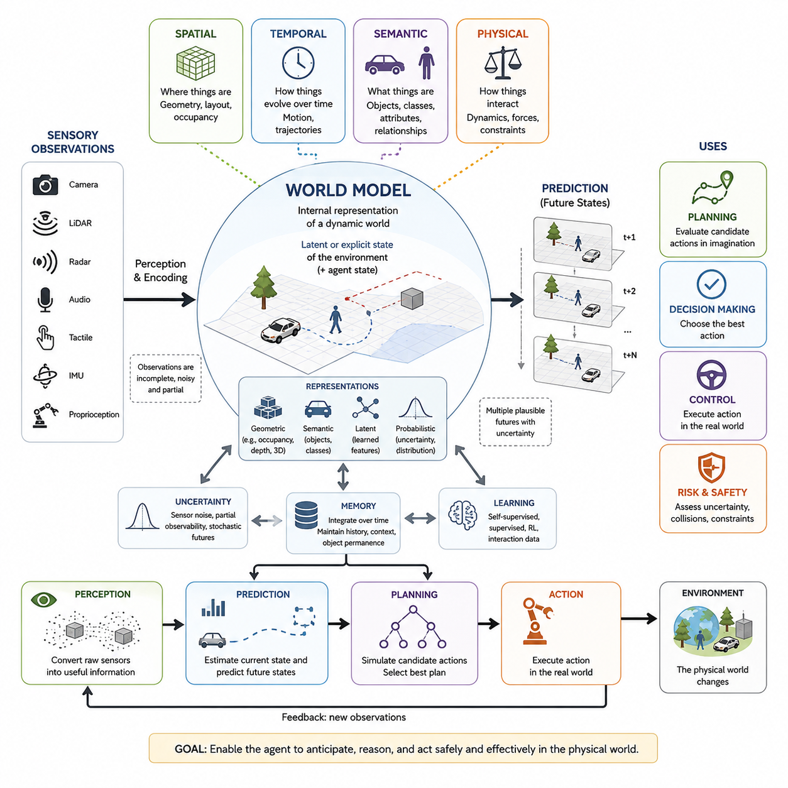{width="7.268055555555556in" height="7.268055555555556in"}

A world model is an internal computational representation through which an intelligent agent organizes what it knows about its environment and anticipates how that environment may change. Rather than reacting independently to every incoming sensor measurement, the agent maintains an internal state that summarizes relevant aspects of the physical world, including objects, geometry, motion, relationships, and conditions that may influence future behavior.

For Physical AI, a world model is more than a static description of a scene. It represents a world that evolves over time and is affected by both external events and the agent's own actions. A robot therefore needs to understand not only what currently exists around it, but also how objects may move, how physical interactions may unfold, and how its own movement or manipulation can transform the state of the environment.

A useful conceptual distinction exists between observation and world state. Cameras, LiDAR, radar, microphones, tactile sensors, inertial sensors, and proprioceptive measurements provide observations, but these measurements are incomplete and often noisy. The world model transforms such observations into a structured or latent internal representation that attempts to capture the underlying state responsible for producing the available sensory evidence.

This distinction is essential because an intelligent system rarely observes the complete physical environment directly. Objects may be occluded, sensors may temporarily fail, and relevant properties such as velocity, friction, intent, or future motion may not be immediately measurable. A world model allows the agent to infer hidden information from previous observations, accumulated memory, physical constraints, and learned regularities in the environment.

At its simplest, a world model can be viewed as a mechanism that estimates the current state and predicts how that state changes. If the current internal state is represented by (s_t), an action by (a_t), and the next state by (s_{t+1}), the model attempts to learn or encode a transition relationship between them. In Physical AI, this relationship provides the foundation for reasoning about the consequences of movement before executing that movement in the real world.

The internal state does not have to reproduce every physical detail of reality. A useful world model preserves information that matters for perception, prediction, decision making, planning, and control while discarding irrelevant complexity. An autonomous mobile robot, for example, may need accurate information about free space, obstacles, terrain, moving agents, traversability, and possible collisions without explicitly modeling every visual texture or microscopic property of its surroundings.

World models can therefore exist at different levels of abstraction. Some models represent explicit geometric quantities such as position, velocity, occupancy, depth, object boundaries, or three-dimensional structure. Others represent semantic concepts such as object categories, functional regions, human activities, or task-relevant relationships. Modern learning systems can also encode much of the environment in latent representations whose individual dimensions may not have directly interpretable physical meanings.

A world model becomes particularly powerful when spatial, temporal, semantic, and physical information are integrated. Spatial information describes where entities are located and how they are arranged. Temporal information captures how states evolve. Semantic information describes what entities are and what roles they may play, while physical information constrains possible interactions through properties such as motion, contact, mass, geometry, friction, and kinematic feasibility.

Prediction is consequently one of the defining capabilities of a practical world model. Given the current state and recent history, the model can estimate possible future states. When actions are included, it can predict different futures corresponding to different candidate behaviors. The agent can then internally evaluate alternatives such as moving left, slowing down, grasping an object, waiting for a pedestrian, or selecting another route before committing to an irreversible physical action.

This ability to generate or estimate possible futures creates an important connection between world modeling and planning. Instead of relying only on stimulus-response behavior, the agent can use its internal model as a computational environment in which candidate actions are mentally simulated. Planning can then be interpreted as repeated interaction with predicted future states: imagine possible actions, estimate their consequences, evaluate outcomes, and select an action that best satisfies the current objective and constraints.

A world model should not be confused with a complete simulator of reality. A simulator attempts to reproduce environmental behavior according to predefined or learned rules, whereas a world model is primarily an agent-centered representation optimized for useful inference and action. It may contain explicit physics, learned dynamics, probabilistic predictions, neural latent states, symbolic structures, or combinations of these approaches depending on the requirements of the Physical AI system.

Similarly, a world model is not identical to a map. A map primarily describes spatial structure, while a world model may additionally represent dynamic objects, temporal evolution, hidden states, uncertainty, action consequences, semantic relationships, and physical interactions. A map can form one component of a world model, but an autonomous agent operating in changing environments requires an internal representation capable of continuously updating as the physical world evolves.

Memory is also closely connected to world modeling because the current observation alone is often insufficient to determine the true environmental state. Information gathered several seconds or minutes earlier may remain relevant even when it is no longer visible. By integrating observations over time, the world model can preserve object permanence, estimate trajectories, maintain spatial context, infer changes, and distinguish temporary sensor disappearance from actual changes in the environment.

Uncertainty is another fundamental property of realistic world models. The physical future is rarely deterministic from the perspective of an autonomous agent. A pedestrian may choose several directions, terrain properties may be uncertain, and sensor measurements may contain noise. Instead of representing only one predicted future, advanced world models can represent distributions or multiple plausible futures, enabling planning systems to consider both expected outcomes and associated risks.

Learning a world model can occur through supervised, weakly supervised, self-supervised, reinforcement-based, or hybrid approaches. Large quantities of unlabeled sensory sequences are especially valuable because temporal data naturally provide learning signals: earlier observations contain information that can be used to predict later states. Through repeated exposure to physical interactions, a model can gradually acquire regularities concerning motion, persistence, geometry, causality, and action-dependent environmental change.

For robotics, the agent's own body must also be represented within the modeled world. Joint positions, velocities, actuator states, wheel motion, contact conditions, battery or resource constraints, and other proprioceptive information interact with external environmental states. The boundary between modeling the robot and modeling the environment is therefore intentionally permeable, because meaningful predictions require understanding how the embodied agent and its surroundings jointly evolve.

The required world representation depends strongly on embodiment and task. An autonomous vehicle emphasizes roads, lanes, traffic participants, occupancy, motion, and collision risk. A manipulator emphasizes object pose, contact, graspability, geometry, and force interactions. A quadruped may emphasize terrain shape, foothold stability, body dynamics, and traversability. A general Physical AI system ultimately requires representations flexible enough to support multiple embodiments and environments.

World models also provide a bridge between perception and intelligence. Perception converts raw sensory signals into useful information, but world modeling organizes that information into a persistent internal structure. Reasoning operates over this structure, prediction extends it into possible futures, planning searches among those futures, and control converts selected plans into physical actions. The world model therefore occupies a central position within the perception--prediction--planning--action loop.

From this perspective, the quality of a world model should not be judged only by reconstruction accuracy or visual realism. A model can generate impressive images while failing to preserve information necessary for safe action. Conversely, a compact latent representation may appear less interpretable but provide highly accurate predictions of collision, traversability, object motion, or action consequences. For Physical AI, usefulness for prediction, planning, and control is ultimately more important than appearance alone.

A sufficiently capable world model functions as an internal predictive interface between an embodied agent and physical reality. It compresses experience into state, maintains information beyond immediate observation, predicts how situations may evolve, and estimates how actions can alter those situations. In this sense, world modeling transforms Physical AI from reactive sensor processing into anticipatory intelligence capable of reasoning about what exists, what may happen next, and what the agent should do about it.

## 01.02. Agent Environment and Internal Model

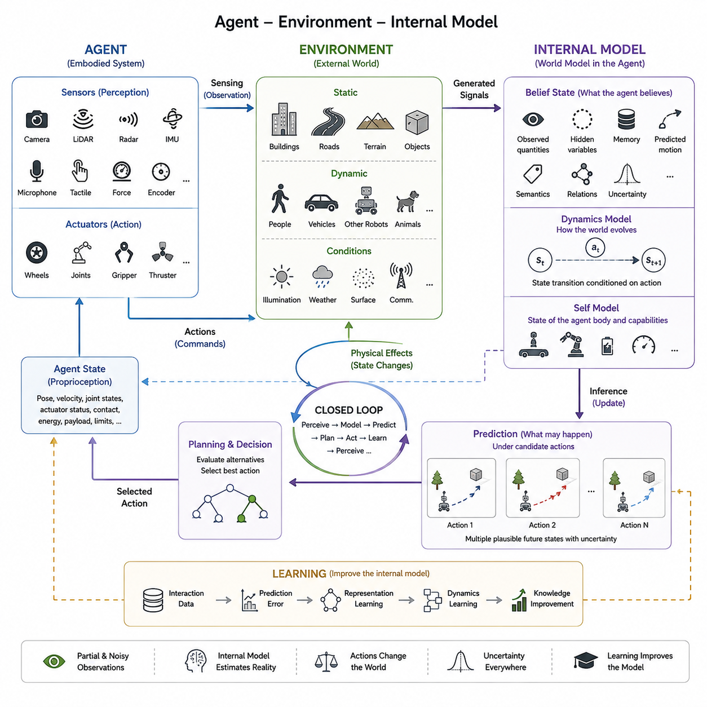{width="7.268055555555556in" height="7.268055555555556in"}

An intelligent physical system can be understood through three closely connected elements: the agent, the environment, and the internal model maintained by the agent. The agent is the entity that perceives and acts, the environment is the external world in which those actions have consequences, and the internal model is the computational structure that allows the agent to interpret observations, preserve knowledge, and anticipate environmental change.

In Physical AI, the agent is not an abstract decision-making process separated from the world. It is an embodied system whose sensors, actuators, physical dimensions, mobility, computational resources, and mechanical capabilities determine what it can observe and what actions it can perform. A mobile robot, manipulator, autonomous vehicle, quadruped, humanoid, or aerial robot therefore experiences the same environment differently because each embodiment provides different sensing and action possibilities.

The environment contains everything outside the agent that may influence its observations, decisions, or actions. This can include static structures such as walls, roads, shelves, buildings, and terrain, as well as dynamic entities such as people, vehicles, animals, machines, and other robots. Environmental conditions such as illumination, weather, surface properties, visibility, friction, and communication availability may also affect how reliably the agent perceives and interacts with the physical world.

Interaction between the agent and environment forms a continuous closed loop. The environment generates physical signals that are measured by sensors and converted into observations. The agent processes these observations, updates its internal representation, selects an action, and sends commands to actuators. The resulting physical action changes either the environment, the state of the agent within it, or both, producing new observations that begin the next iteration of the loop.

The agent cannot normally access the true environmental state directly. Instead, it receives partial observations through cameras, LiDAR, radar, inertial sensors, microphones, tactile devices, encoders, force sensors, and other sensing systems. Every sensor has limitations involving range, resolution, noise, occlusion, latency, and operating conditions. Consequently, the agent must construct an estimate of reality rather than assuming that its current measurements provide a complete description of the world.

The internal model provides this estimated description. It integrates available observations with previous states, accumulated experience, learned representations, and assumptions about how the world evolves. Information that disappears from immediate sensor view does not necessarily disappear from the internal model. A pedestrian temporarily hidden behind a vehicle, for example, may remain represented because the agent has evidence that the pedestrian probably continues to exist despite the temporary absence of visual measurements.

This capability creates a fundamental separation between observation and belief about the world. An observation represents what the sensors currently measure, whereas the internal state represents what the agent currently believes to be relevant about the environment. The internal state may contain directly observed quantities, inferred hidden variables, remembered information, predicted motion, semantic properties, uncertainty estimates, and relationships among entities that cannot be obtained from any single sensor measurement.

An internal model must also represent the agent itself. Physical interaction depends on the relationship between the state of the environment and the state of the embodied system. Robot position, orientation, velocity, joint configuration, actuator conditions, contact states, available energy, payload, and mechanical limits can influence which actions are feasible. Effective world modeling therefore combines exteroceptive information about the surrounding world with proprioceptive information describing the agent's own physical condition.

The boundary between agent and environment is conceptually useful but operationally dynamic. A robot carrying an object, towing equipment, or manipulating a tool changes the effective physical properties of the agent. A grasped object may initially belong to the environment but temporarily become part of the controlled system. For this reason, advanced Physical AI must model not merely isolated objects but changing relationships among the body, tools, payloads, surrounding structures, and other agents.

Actions provide another essential connection between the agent and its internal model. The model should not only describe what the environment currently looks like but also estimate how different actions could alter it. Moving forward changes the robot's position relative to obstacles. Turning changes sensor viewpoints. Applying force may move an object. Accelerating changes future stopping distance. The internal model therefore becomes useful for control when its state transitions are conditioned on candidate actions.

This action-conditioned perspective enables counterfactual reasoning. Before executing a command, an agent can evaluate hypothetical questions such as what may happen if it turns left instead of right, accelerates instead of braking, or grasps an object from a different direction. The internal model provides a computational space in which alternative actions and their consequences can be compared without physically performing every possibility, reducing risk and improving planning efficiency.

Time is equally important because agent--environment interaction is inherently sequential. The meaning of a current observation often depends on previous observations and actions. A single image may show where an object is, while a sequence can reveal its velocity and direction. By maintaining temporal information, the internal model can estimate motion, recognize persistent entities, detect changes, distinguish moving objects from ego-motion, and predict how the environment may evolve over future time horizons.

The internal model may be explicit, latent, or hybrid. Explicit representations can include maps, occupancy grids, object lists, poses, velocities, semantic labels, and geometric structures whose meanings are directly interpretable. Latent models encode relevant information in learned feature spaces optimized for prediction or control. Hybrid systems can combine interpretable physical quantities with learned latent representations, allowing engineered structure and data-driven learning to contribute to the same predictive process.

No internal model can represent the complete physical world with perfect accuracy. The agent therefore needs mechanisms for representing uncertainty and continuously correcting its beliefs. New observations may confirm previous predictions or reveal that they were wrong. The internal state should consequently be updated through an ongoing process of prediction and correction, allowing the model to adapt when objects move unexpectedly, environmental conditions change, or previous assumptions become invalid.

The relationship among agent, environment, and internal model also determines what information should be retained. A world model designed for navigation may emphasize free space, obstacles, terrain, moving agents, and traversability, whereas a manipulation model may emphasize object pose, geometry, contact, graspability, and force. The internal representation should therefore preserve information according to its usefulness for the agent's embodiment, objectives, actions, and required prediction horizon.

Different agents operating in the same physical environment may consequently construct different internal models. An autonomous vehicle may represent lanes, traffic participants, road boundaries, and predicted trajectories, while a delivery robot may emphasize sidewalks, ramps, doors, pedestrians, and traversable surfaces. A manipulator observing the same scene may focus instead on reachable objects, grasp configurations, collision geometry, and contact relationships. World representation is therefore inherently connected to action capability.

In multi-agent environments, the internal model must additionally distinguish the controlled agent from other independently acting entities. Other robots, vehicles, or humans possess their own states, objectives, and possible actions, creating futures that cannot be determined solely from the controlled agent's commands. The world model must therefore combine predictions of self-induced state transitions with predictions of externally generated changes and interactions among multiple agents.

Learning strengthens this relationship by allowing the internal model to improve from repeated agent--environment interaction. Sensor sequences reveal how scenes evolve, while action sequences reveal how the agent influences those changes. Prediction errors provide signals for updating representations and dynamics. Over time, accumulated interaction data can teach the model regularities concerning motion, object persistence, physical constraints, action consequences, and recurring patterns of environmental behavior.

The internal model ultimately acts as an information bridge between sensing and action. Raw observations enter from the environment, are transformed into an estimated internal state, and are combined with memory and learned dynamics. Possible future states can then be predicted under candidate actions, allowing planning and decision-making systems to evaluate alternatives. Selected actions return to the environment through the physical body, closing the perception--model--prediction--action loop.

Physical intelligence emerges from the quality of this continuous relationship rather than from perception, modeling, or control in isolation. The agent must repeatedly observe the environment, update its internal model, anticipate future changes, act through its embodiment, and learn from the resulting consequences. A capable world model therefore serves as the agent's evolving internal interface to physical reality, enabling behavior based not only on what sensors currently detect, but on what the agent believes, remembers, predicts, and can physically influence.

## 01.03. State Observation Action and Transition

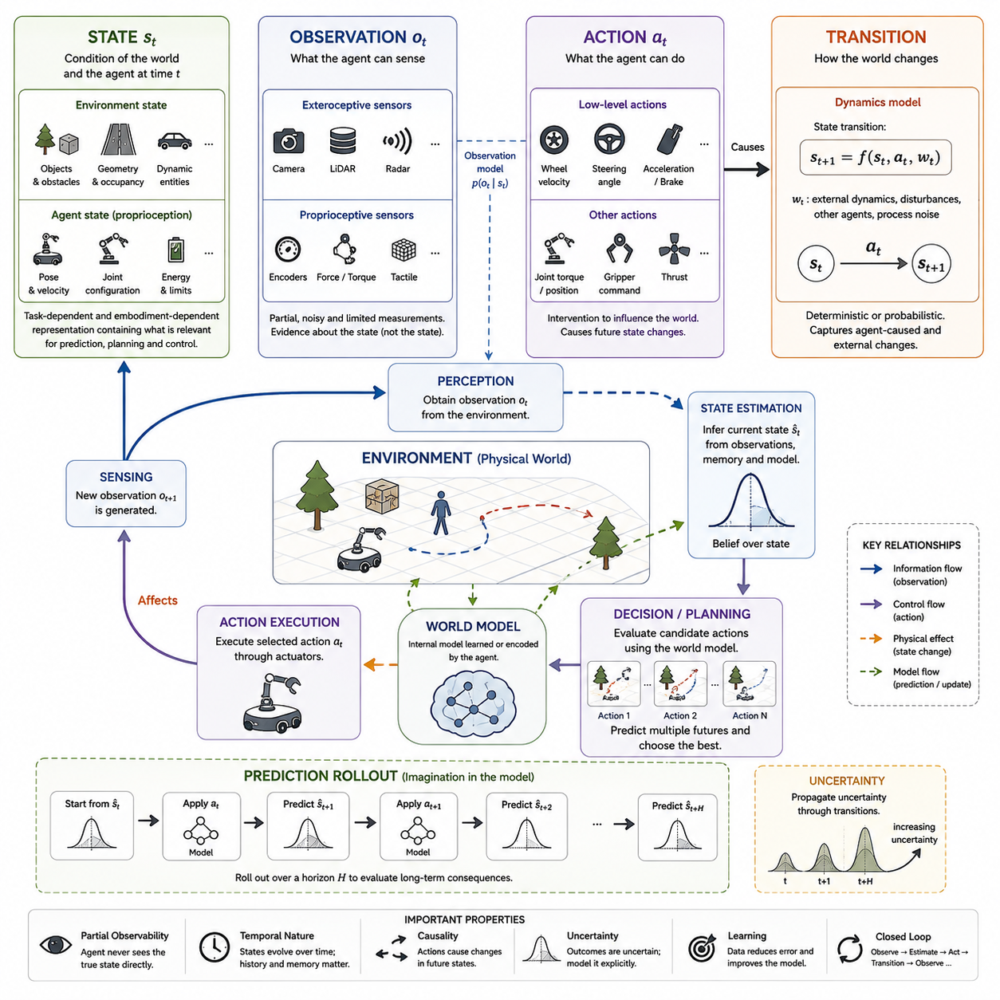{width="7.268055555555556in" height="7.268055555555556in"}

A world model can be described through four fundamental concepts: state, observation, action, and transition. Together they provide a compact language for explaining how an intelligent agent represents a physical environment and reasons about change over time. State describes the condition of the world, observation describes what the agent can sense, action describes what the agent can do, and transition describes how one state evolves into another.

The state, commonly written as (s_t), represents relevant information about the world and the agent at time (t). Depending on the task, it may include positions, orientations, velocities, object identities, occupancy, terrain properties, robot joint configurations, contact conditions, or other variables. A useful state does not need to reproduce reality completely; it needs to preserve information required for prediction, planning, and control.

For a mobile robot, the state might contain robot pose and velocity together with nearby obstacles, traversable regions, moving objects, and their estimated motion. For a manipulator, it may instead emphasize joint states, end-effector pose, object geometry, contact, and grasp relationships. State representation is therefore task-dependent and embodiment-dependent, because different physical agents require different information to predict the consequences of their actions.

The true physical state is usually unavailable to the agent. Instead, sensors produce an observation, often represented as (o_t). An observation may contain camera images, LiDAR point clouds, radar returns, IMU measurements, tactile signals, joint encoders, force measurements, or combinations of multiple modalities. Observations are evidence about the world rather than the world state itself, and confusing these two concepts can lead to fragile models.

Observations are limited by sensor range, field of view, resolution, noise, latency, occlusion, and environmental conditions. A camera cannot directly observe an object hidden behind a wall, while LiDAR measurements may be sparse or degraded by certain surfaces and weather. The agent must therefore infer a useful internal state from incomplete measurements, often by combining current observations with previous observations, actions, memory, and learned environmental regularities.

This relationship can be expressed conceptually through an observation model connecting state (s_t) to observation (o_t). The physical state generates measurable sensory consequences, while the perception system attempts to infer information about that state from those consequences. In learned world models, an encoder may transform high-dimensional observations into a compact latent state (z_t), allowing prediction to occur in a representation space rather than directly in raw sensor space.

Action, typically represented by (a_t), describes an intervention performed by the agent. Actions can include wheel velocity commands, steering angles, acceleration, braking, joint torques, target positions, gripper commands, thrust, or higher-level commands such as moving toward a waypoint. The form of the action space depends on embodiment, actuator architecture, control hierarchy, and the temporal resolution at which the world model operates.

Actions are fundamentally different from observations because they can causally influence future states. A sensor measurement provides information about the environment, whereas an actuator command attempts to change it. When a robot accelerates, turns, pushes an object, closes a gripper, or places a foot on terrain, its action alters subsequent physical conditions. Modeling this causal connection is essential for a world model intended to support planning and control.

The transition describes how the world changes from state (s_t) to state (s_{t+1}). In an action-conditioned model, this relationship can be expressed conceptually as (s_{t+1}=f(s_t,a_t)), where the transition function (f) captures relevant dynamics. More realistic systems may represent this probabilistically because the same current state and action can produce different future outcomes due to uncertainty, disturbances, hidden variables, or actions of other agents.

A transition model must capture both changes caused by the controlled agent and changes occurring independently in the environment. A vehicle moves because of steering and acceleration commands, but pedestrians and other vehicles also move according to their own behavior. Wind can affect an aerial robot, terrain can influence wheel slip, and an object may fall because of gravity. World dynamics therefore combine controllable, external, and partially unpredictable processes.

State transitions occur continuously in the physical world, although computational models usually discretize them into time steps. At each step, the agent maintains an estimated state, executes or considers an action, and predicts the resulting next state. Repeating this operation creates a rollout such as (s_t, s_{t+1}, s_{t+2}, \\ldots), which allows the world model to reason beyond the immediate future and examine possible trajectories over a prediction horizon.

Multi-step prediction introduces an important challenge because small transition errors can accumulate. A slightly inaccurate velocity estimate may cause a minor error one step ahead but a large positional error after many predicted steps. Long-horizon world modeling therefore requires temporal consistency, robust state representations, uncertainty estimation, memory, and mechanisms that prevent prediction errors from growing uncontrollably as imagined futures extend farther from observed reality.

The state--action--transition relationship enables counterfactual prediction. From the same estimated state, the agent can evaluate several candidate actions and obtain different predicted futures. A mobile robot may compare continuing straight, slowing down, or changing direction. A manipulator may compare alternative grasp trajectories. The world model thereby becomes an internal predictive environment in which actions can be tested computationally before they are executed physically.

Observation then closes the loop between prediction and reality. After an action is executed, new sensor measurements provide evidence about the actual resulting state. The predicted state can be compared with the newly inferred state, and the difference becomes a prediction error. This error can be used to correct the current internal estimate and, during learning, improve the representation or transition model so that future predictions become more accurate.

The complete process can therefore be understood as a recurring cycle rather than a one-way pipeline. The agent observes the environment, estimates its current state, chooses an action, predicts the transition, executes the action, receives a new observation, and updates its internal state. This cycle continuously connects perception, world modeling, prediction, decision making, and control while keeping the agent's internal representation synchronized with changing physical reality.

In partially observable environments, the estimated state must contain information beyond the current observation. A person who temporarily disappears behind an obstacle may still need to be represented, and a robot may need to remember terrain or objects that have moved outside its sensor field. Historical observations and previous actions can therefore be integrated into a belief state or latent memory that summarizes information relevant to future prediction.

State can also contain uncertainty rather than a single definite estimate. The robot may be uncertain about its exact position, an object's velocity, surface friction, another agent's intention, or whether an occluded region contains an obstacle. A probabilistic state representation allows the transition model to propagate these uncertainties forward, producing multiple plausible future states instead of assuming that one deterministic trajectory must occur.

For Physical AI, state representation should also include the relationship between external conditions and the agent's own body. Robot velocity, joint configuration, payload, contact, energy state, actuator limits, and other proprioceptive variables affect possible transitions. The same command may produce different outcomes depending on terrain, payload, battery condition, mechanical configuration, or contact state, making embodied state information essential for reliable physical prediction.

The four concepts are therefore tightly coupled. Observations provide evidence used to estimate state; actions express the agent's ability to intervene; transitions describe how states evolve under actions and external dynamics; and subsequent observations reveal what actually occurred. A world model learns or encodes these relationships so that an agent can move from simply recognizing the present toward anticipating how the physical world may evolve.

This formulation also provides the foundation for more advanced world-model architectures. Latent dynamics models compress observations into predictive states, action-conditioned models explicitly incorporate control commands, probabilistic models represent uncertain transitions, and planning systems repeatedly roll the model forward under alternative actions. Despite differences in architecture, these systems retain the same underlying problem: representing state and using observations and actions to understand transitions through time.

State, observation, action, and transition consequently form the basic grammar of predictive interaction between an embodied agent and its environment. Together they explain how sensory evidence becomes an internal estimate, how physical intervention changes possible futures, and how new evidence corrects previous beliefs. Building reliable relationships among these elements is one of the fundamental requirements for world models capable of supporting adaptive, predictive, and autonomous Physical AI.

## 01.04. Partial Observability and Belief State

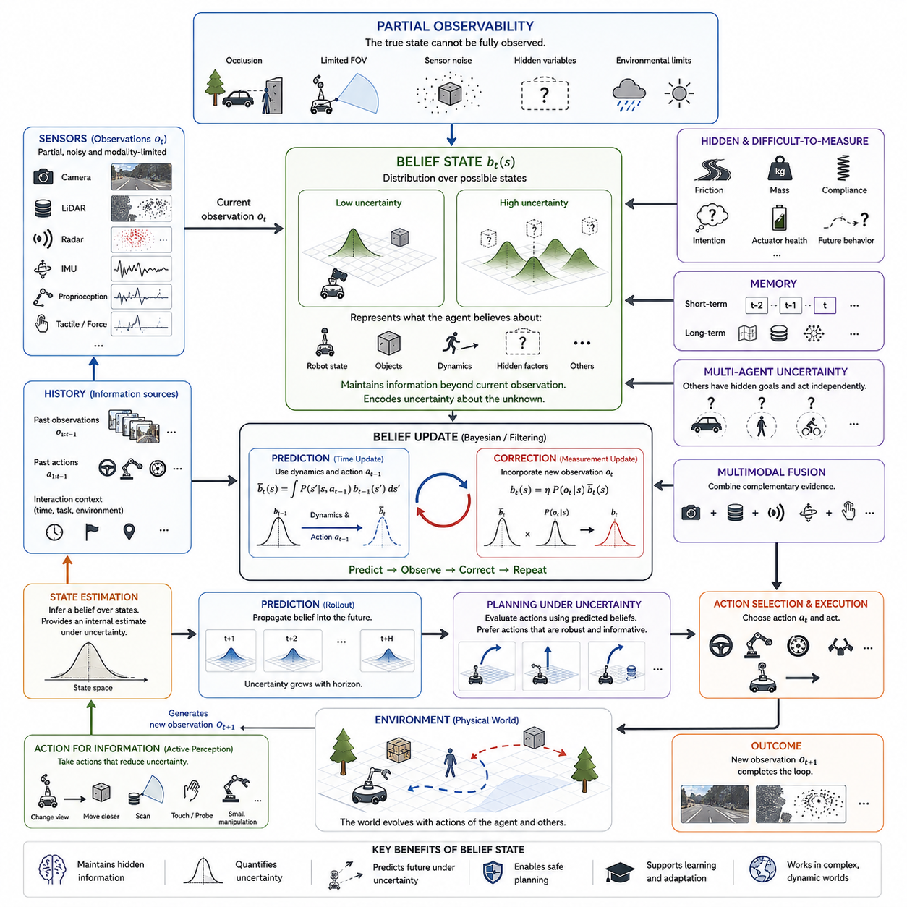{width="7.268055555555556in" height="7.268055555555556in"}

Physical AI systems almost never have direct access to the complete state of the world. Sensors observe only limited portions of the environment, measurements contain noise, objects become occluded, and many important physical properties cannot be measured directly. This condition is called partial observability, and it makes internal state estimation a fundamental requirement for any world model intended to operate reliably in complex physical environments.

Partial observability means that the current observation cannot uniquely determine the true state of the environment. Two different physical situations may produce similar sensor measurements, while important information may remain outside the sensor field of view. A robot entering an intersection, for example, may see an empty region while a vehicle hidden behind an obstacle is approaching. What is currently visible is therefore not necessarily equivalent to what actually exists.

Sensor limitations create partial observability even in apparently simple environments. Cameras are affected by illumination, occlusion, motion blur, and limited viewing angles. LiDAR provides geometric measurements but cannot observe through solid obstacles and may produce sparse returns. Radar, tactile sensing, microphones, IMUs, and proprioceptive sensors each reveal different aspects of reality. No individual sensing modality normally provides a complete description of the physical world.

Some important variables are intrinsically hidden rather than merely outside sensor range. Surface friction, object mass, mechanical compliance, human intention, actuator degradation, or another agent's future behavior may not be directly observable. The world model must infer such properties from their effects over time. A robot can estimate friction from wheel slip, for example, or infer object mass from how the object responds when force is applied.

For this reason, a Physical AI system requires an internal estimate that extends beyond the current observation. This estimate is commonly described as a belief state. Instead of representing only what sensors detect at the present instant, the belief state summarizes what the agent currently believes about relevant aspects of the world based on observations, previous actions, memory, learned dynamics, and uncertainty about information that remains unknown.

Conceptually, a belief state can be represented as (b_t(s)), a distribution expressing the agent's belief about possible states (s) at time (t). When uncertainty is low, this distribution may be concentrated around a small range of states. When observations are ambiguous or information is missing, the distribution may become broader or multimodal, representing several different physical situations that remain plausible given the available evidence.

Not every practical world model must explicitly maintain a mathematical probability distribution. Neural systems may encode belief implicitly within recurrent hidden states, latent representations, temporal tokens, or memory features. What matters is that the internal representation preserves information needed to reason under incomplete observation. A deterministic feature vector can therefore function as an approximate belief representation even when probabilities are not explicitly calculated.

Belief formation depends strongly on history. Suppose a pedestrian is observed walking toward a crossing and then becomes hidden behind a parked vehicle. A purely reactive perception system may lose the pedestrian when visual evidence disappears. A world model with temporal memory can maintain the hypothesis that the pedestrian still exists, estimate the likely hidden trajectory, and preserve the possibility that the person may soon reappear in the robot's path.

Previous actions are also important because they help explain how the current situation was reached. If a robot has just turned, accelerated, manipulated an object, or opened a door, those actions affect the interpretation of subsequent observations. Belief-state estimation therefore uses an interaction history rather than only a sequence of passive sensor measurements. The agent's own interventions provide information about both its state and the dynamics of the surrounding environment.

Belief updating can be understood as alternating prediction and correction. First, the world model predicts how the current belief may evolve according to dynamics and the action performed by the agent. When a new observation arrives, the predicted belief is corrected according to how consistent the observation is with possible states. This repeated predict--observe--correct process allows the internal model to remain synchronized with a world that cannot be completely observed.

Memory is therefore a central component of reasoning under partial observability. Short-term memory can preserve recent motion, sensor history, and action context, while longer-term memory can retain maps, object locations, environmental properties, or recurring patterns. Effective memory does not simply store every previous observation. It compresses history into information that remains useful for estimating the current state and predicting future physical developments.

Object permanence provides a clear example of this requirement. Physical objects generally continue to exist when they leave the sensor field of view. A capable world model should therefore distinguish disappearance from observation from disappearance from reality. Maintaining persistent object hypotheses allows an autonomous system to reason about hidden vehicles, people behind obstacles, objects inside containers, or equipment temporarily outside the current camera or LiDAR coverage.

Partial observability also introduces ambiguity. A distant sensor return may correspond to several possible object types, an occluded region may contain an obstacle or free space, and another agent may have multiple possible intentions. Rather than prematurely committing to a single interpretation, a belief state can preserve competing hypotheses. Future observations can then reduce ambiguity as additional evidence becomes available and inconsistent hypotheses are eliminated.

This uncertainty becomes especially important when the agent must predict future states. Uncertainty in the present belief propagates through the transition model, producing uncertainty about future trajectories and outcomes. If the location or intention of another vehicle is uncertain, its predicted future motion will also be uncertain. Long-horizon predictions therefore generally become less certain as both current ambiguity and transition uncertainty accumulate over time.

For planning, the belief state is often more useful than a single estimated state because actions should account for what the agent does not know. A robot approaching an occluded corner may reduce speed even when no obstacle is currently visible because its belief assigns some probability to hidden hazards. Safe planning therefore considers uncertainty itself as actionable information rather than treating missing observations as evidence that the environment is empty or harmless.

Actions can also be selected to reduce uncertainty. A robot may change viewpoint to inspect an occluded region, move closer to an object, rotate a sensor, touch a surface, or perform a small manipulation to discover physical properties. Such behavior is often described as active perception or information gathering. The agent acts not only to accomplish an external task but also to improve its belief about the state of the world before making a more consequential decision.

Multimodal sensing can reduce partial observability because different sensors provide complementary evidence. A camera may supply semantic and appearance information, LiDAR may provide geometry, radar may detect motion under difficult visibility, and proprioception may describe the robot's own movement. Sensor fusion does not eliminate uncertainty, but it can produce a stronger belief state by combining observations that constrain different aspects of the same underlying physical situation.

Belief states are particularly important in dynamic multi-agent environments. Humans, vehicles, and other robots may possess hidden goals and make independent decisions. Their internal intentions cannot normally be observed directly, so the world model must infer them from motion, interaction history, context, and behavior. Multiple future hypotheses may need to remain active because different plausible intentions can produce substantially different trajectories and risks.

In learned world models, temporal architectures provide several mechanisms for constructing belief-like representations. Recurrent networks can maintain hidden states, state-space models can recursively update latent variables, and transformers can integrate information across observation and action histories. Regardless of architecture, the objective is similar: compress past evidence into an internal state that contains information useful for estimating hidden conditions and predicting what may happen next.

The quality of a belief state should ultimately be evaluated by its usefulness for prediction and action. An internal representation is valuable when it helps the agent maintain relevant hidden information, quantify ambiguity, anticipate hazards, and choose robust actions despite incomplete sensing. Perfect reconstruction of every unobserved detail is neither possible nor necessary. The model should instead preserve uncertainty and hidden information at the level required for the physical task.

Partial observability therefore changes the fundamental question faced by a world model. The problem is not simply "What does the agent see now?" but "Given everything observed, remembered, and done so far, what states of the world are currently plausible?" The belief state provides the internal answer to that question, allowing Physical AI to reason beyond immediate sensory input and act intelligently in a world that is always only partially visible.

## 01.05. State Representation for Physical AI

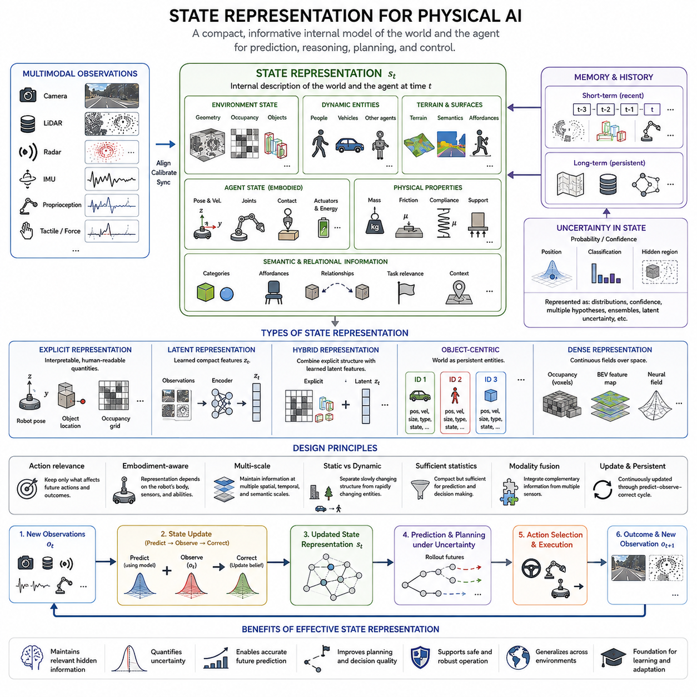{width="7.268055555555556in" height="7.268055555555556in"}

State representation is the mechanism by which a Physical AI system converts the continuously changing physical world into an internal form suitable for prediction, reasoning, planning, and control. Because raw sensor streams are too large, incomplete, and task-dependent to serve directly as a complete world description, the agent must construct a compact representation containing the information that is relevant to its future actions and expected environmental changes.

A useful state representation must describe both the external environment and the embodied agent operating within it. Environmental state can include geometry, free space, occupancy, objects, terrain, semantic properties, and dynamic entities, while agent state can include pose, velocity, joint configuration, contact, actuator condition, payload, and energy. Physical intelligence depends on predicting how these two categories of state interact and evolve together.

Spatial information forms one major component of state. A robot needs to represent where objects, obstacles, surfaces, people, and other agents are located relative to itself and to the surrounding environment. Depending on the application, spatial state may be encoded using coordinates, maps, point clouds, voxels, occupancy grids, bird's-eye-view representations, object-centric structures, or learned spatial features that preserve relationships needed for navigation and interaction.

Temporal information is equally important because the physical world is dynamic rather than a collection of independent snapshots. State should capture motion, velocity, trajectories, persistence, and recent changes so that the agent can distinguish stationary structure from moving entities and estimate future evolution. Temporal representations may integrate multiple observations through recurrent memory, state-space models, temporal feature aggregation, attention mechanisms, or explicit tracking of objects and motion.

Semantic information adds meaning to geometric and temporal structure. Knowing that a region is occupied is useful, but knowing whether it contains a wall, pedestrian, vehicle, movable box, staircase, or traversable surface can substantially change the appropriate action. Semantic state may therefore encode object identity, category, affordance, functional role, relationships, task relevance, and contextual information that helps the agent interpret what physical structures mean for behavior.

Physical state representation must also capture properties that influence interaction and dynamics. Geometry alone cannot explain whether an object can be pushed, whether terrain is slippery, whether a surface can support the robot, or whether a grasp will remain stable. Mass, friction, compliance, contact, force, support relationships, kinematic constraints, and dynamic properties may therefore become important state variables whenever the agent must reason about physical consequences.

Not all state variables need to be explicitly interpretable. Modern world models often transform high-dimensional observations into a latent state (z_t), where learned features encode information useful for future prediction. A latent representation can compress images, point clouds, proprioception, and other modalities into a smaller computational space. Its effectiveness depends less on whether every feature has a human-readable meaning and more on whether relevant future states and action consequences can be predicted reliably.

Explicit representations remain valuable because they provide interpretable quantities that can connect naturally with classical robotics and control. Robot pose, velocity, object location, occupancy, joint angles, and collision geometry can be directly consumed by localization, planning, optimization, or safety modules. Explicit state also makes debugging and verification easier because engineers can inspect whether the world model contains physically meaningful estimates rather than relying entirely on opaque internal features.

Hybrid state representations combine explicit and latent information. A Physical AI system might maintain an explicit BEV occupancy structure and tracked object states while simultaneously learning latent features that capture appearance, interaction patterns, uncertain dynamics, or contextual information. Such architectures can preserve the interpretability and physical structure of engineered representations while exploiting neural networks to model aspects of the environment that are difficult to specify manually.

Object-centric representation provides another useful abstraction. Instead of treating the entire environment as a uniform grid or feature tensor, the world can be represented as persistent entities with properties such as position, velocity, size, category, state, and relationships. Object-centric states are particularly useful when planning depends on interactions among identifiable entities, although they may be less suitable for amorphous structures such as vegetation, fluids, deformable terrain, or complex free space.

Dense representations provide complementary advantages by describing the environment continuously over space. Occupancy grids, voxel fields, semantic occupancy, neural fields, and BEV feature maps can represent both recognized and unrecognized structures without requiring every element to be assigned an object identity. For navigation and collision avoidance, this can be crucial because an obstacle remains physically relevant even when the perception system cannot confidently classify what the obstacle is.

The representation must also distinguish static and dynamic information. Buildings, walls, terrain, and permanent infrastructure often change slowly, while people, vehicles, manipulable objects, and the robot itself may change rapidly. Separating these temporal characteristics can improve computational efficiency and prediction quality. Slowly changing world memory can provide stable context, while rapidly updated dynamic states support short-horizon prediction and reactive control.

Multimodal state representation is essential because Physical AI typically receives information from several sensing systems. Cameras provide appearance and semantic cues, LiDAR provides geometry, radar contributes motion information, IMUs estimate body dynamics, and proprioceptive sensors describe the robot itself. A world model must align these observations spatially and temporally before integrating them into a coherent state that represents one physical world rather than disconnected sensor-specific descriptions.

Uncertainty should be considered part of the state rather than merely an error attached after estimation. Object position, velocity, classification, terrain properties, hidden regions, and future intentions may all be uncertain. A state representation can encode probability distributions, confidence values, multiple hypotheses, ensembles, or latent uncertainty. Preserving this information allows downstream prediction and planning systems to distinguish reliable knowledge from assumptions that require caution.

Partial observability further requires state to contain memory. The current sensor input cannot describe objects that are temporarily occluded, locations outside the field of view, or hidden physical properties inferred from earlier interaction. State representation must therefore summarize relevant historical information so that knowledge persists beyond immediate observation. In this sense, a useful state is not simply an encoding of the present sensor frame but an accumulated estimate of the physical situation.

Action relevance provides an important criterion for determining what information belongs in the state. A representation designed for navigation should preserve information affecting traversability, collision, motion, and route selection. A manipulation state should emphasize reachability, object pose, graspability, contact, and force. State representations should therefore be sufficient for the decisions an agent must make without attempting to model every measurable property of the environment with equal precision.

Embodiment changes state requirements even when different robots operate in the same environment. A wheeled robot may need slope, wheel slip, clearance, and traversability, while a quadruped may additionally require foothold geometry, contact stability, body orientation, and terrain support. A manipulator needs joint limits and reachable configurations. State representation is consequently not independent of the physical body; it reflects what the particular agent can sense, predict, and control.

State dimensionality creates an important engineering tradeoff. A representation containing too little information may omit variables required for accurate prediction, while an excessively detailed representation increases memory, computation, communication, and learning requirements. Effective world models therefore seek sufficient statistics: compact internal states that preserve information relevant to future evolution and decision making while removing redundancy and task-irrelevant detail from raw observations.

Hierarchical representations can address this tradeoff by maintaining information at several spatial, temporal, and semantic scales. Fine local geometry may support immediate collision avoidance, while coarser maps support long-range navigation. Fast dynamic states can represent nearby moving objects, while slower semantic memory preserves persistent environmental knowledge. Different prediction horizons can therefore operate on different levels of the same structured world representation.

The representation must also be continuously updated as the robot interacts with the world. New observations can add objects, modify geometry, correct localization, reduce uncertainty, or invalidate previous assumptions. Actions may change both the agent state and external state. A useful representation is therefore not a static database but a dynamic computational memory that undergoes repeated estimation, prediction, observation, and correction throughout autonomous operation.

For world-model learning, representation quality should be evaluated according to downstream utility as well as reconstruction accuracy. A representation that reconstructs sensor pixels accurately may still discard variables needed for control, while a compact latent state may preserve exactly the dynamics required for successful planning. Evaluation should therefore consider whether state supports accurate future prediction, action-conditioned transitions, uncertainty estimation, generalization, and robust physical decision making.

State representation ultimately determines what a Physical AI system is capable of understanding about its world. It defines what the agent remembers, what it considers relevant, what dynamics it can predict, and which alternatives it can evaluate before acting. A strong representation integrates spatial, temporal, semantic, physical, embodied, and uncertain information into an actionable internal state, forming the computational foundation upon which predictive world models and autonomous physical intelligence are built.

## 01.06. Dynamics and Transition Models

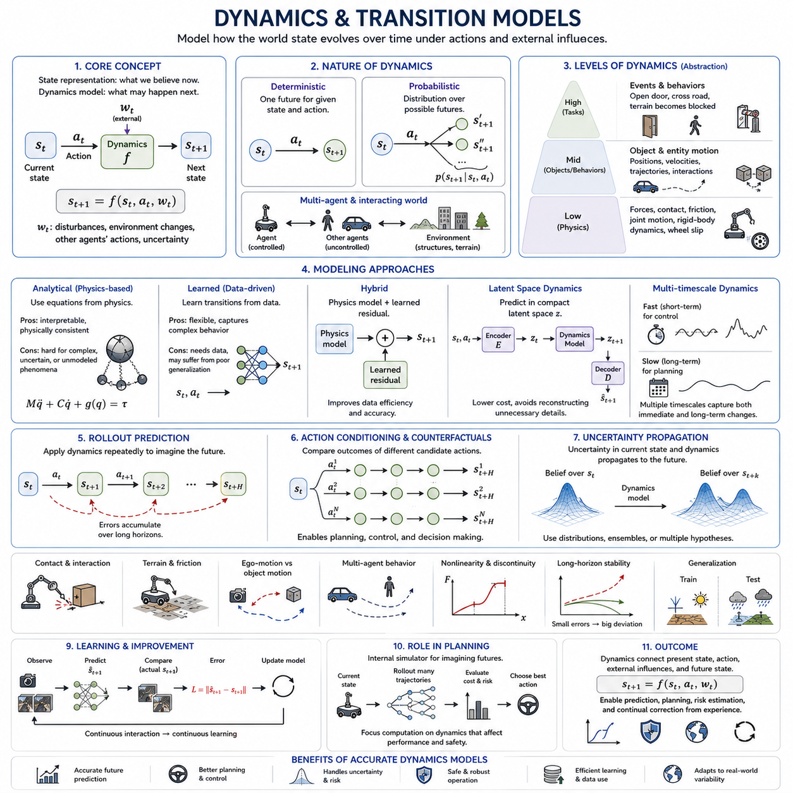{width="7.268055555555556in" height="7.268055555555556in"}

Dynamics and transition models describe how the internal state of a world model evolves through time. If state representation answers the question of what the agent currently believes about the physical world, the dynamics model addresses what may happen next. It captures regularities governing motion, interaction, environmental change, and the consequences of actions, making temporal prediction possible within a Physical AI system.

A transition is commonly expressed as a relationship from the current state (s_t) to a future state (s_{t+1}). In an action-conditioned formulation, this can be written conceptually as (s_{t+1}=f(s_t,a_t)), where (a_t) represents the agent's action and (f) represents the dynamics. The model therefore predicts how the combination of the current situation and an intervention produces a new physical situation.

Real environments contain influences beyond the controlled action, so practical transition models often include external variables, disturbances, or stochastic effects. A more general formulation may be expressed as (s_{t+1}=f(s_t,a_t,w_t)), where (w_t) represents factors such as wind, wheel slip, sensor-independent environmental changes, or actions performed by other agents. This makes transition modeling fundamentally a problem of predicting interacting causes rather than merely reproducing commanded motion.

Dynamics can be deterministic or probabilistic. A deterministic model predicts one future state for a given state and action, which can be appropriate when physical behavior is highly predictable. A probabilistic transition model instead represents (p(s_{t+1}\|s_t,a_t)), allowing several outcomes to remain possible. This is important when hidden variables, uncertain physical properties, environmental disturbances, or independent agents can cause different futures from apparently similar conditions.

Physical dynamics exist at many levels of abstraction. Low-level dynamics may describe forces, torques, acceleration, contact, wheel slip, joint motion, or rigid-body behavior. Higher-level transitions may describe an object moving from one region to another, a pedestrian crossing a path, a door changing from closed to open, or terrain becoming non-traversable. A useful world model selects the level of dynamics appropriate to its prediction and planning requirements.

Classical robotics frequently uses analytical dynamics derived from physical principles. Equations based on rigid-body mechanics, kinematics, friction, contact, and actuator characteristics can provide accurate predictions when system parameters and operating conditions are sufficiently known. Such models offer interpretability and physical consistency, but their accuracy can deteriorate when the real environment contains complex contacts, uncertain parameters, deformable materials, or unmodeled interactions.

Learned dynamics models provide an alternative by estimating transition behavior directly from data. Neural networks can learn mappings between states, actions, and future states from recorded interaction sequences without requiring every physical relationship to be manually specified. This approach is valuable for complex systems whose dynamics are difficult to model analytically, although prediction quality depends strongly on training coverage, representation quality, and generalization beyond observed conditions.

Hybrid dynamics combine analytical knowledge with learned components. A known kinematic or physical model can provide the primary prediction, while a learned residual model estimates systematic errors caused by friction, actuator behavior, terrain, payload, or other effects that are difficult to describe precisely. This approach can improve data efficiency and physical plausibility while retaining the flexibility required to adapt to real-world behavior.

Transition models may operate directly in an explicit state space or within a learned latent space. Explicit models predict interpretable variables such as position, velocity, occupancy, or object pose. Latent dynamics instead predict (z_{t+1}) from (z_t) and (a_t), where (z_t) is a compact learned representation. Latent prediction can reduce computational cost and avoid reconstructing unnecessary sensory detail while preserving information relevant to future decisions.

Temporal resolution strongly influences what a dynamics model learns. At short time intervals, transitions may represent small changes in position, velocity, joint configuration, or contact. At longer intervals, the model may focus on higher-level events and behavioral changes. Physical AI systems can therefore benefit from multi-timescale dynamics in which fast models support immediate control while slower models capture longer-term environmental evolution and task-level consequences.

Multi-step prediction is obtained by repeatedly applying the transition model. Starting from (s_t), the model predicts (s_{t+1}), then uses that prediction to estimate (s_{t+2}), continuing over a future horizon. Such rollouts allow an agent to imagine trajectories before executing them. However, errors introduced at one step become inputs to later steps, creating accumulated prediction error that can significantly degrade long-horizon accuracy.

Stable long-horizon prediction therefore requires more than accurate one-step transitions. The model must preserve temporal consistency, maintain important state variables, handle uncertainty, and avoid drifting into physically impossible states. Training objectives can explicitly include multi-step prediction, consistency constraints, physical priors, or trajectory-level losses so that the learned dynamics remain useful when recursively rolled forward beyond the immediate next state.

Action conditioning is essential when the model is intended for planning or control. Without actions, a dynamics model may predict how a scene typically evolves but cannot distinguish futures caused by different interventions. By conditioning transitions on steering, acceleration, joint commands, grasp actions, or higher-level decisions, the world model can answer counterfactual questions and compare the consequences of alternative actions before the robot physically commits to one.

Dynamics modeling must also distinguish ego-motion from environmental motion. A camera image may change because the robot moves, because objects move, or because both occur simultaneously. Accurate prediction therefore requires representing the agent's own motion together with independently evolving environmental entities. This separation is especially important for mobile robots, autonomous vehicles, aerial systems, and other embodied agents whose sensors continuously move through the environment.

Contact and interaction create some of the most difficult transitions in Physical AI. Pushing, grasping, walking, collision, deformation, and tool use can introduce discontinuities and strongly nonlinear behavior. Small differences in contact position or friction may produce substantially different outcomes. Dynamics models intended for manipulation or locomotion therefore require representations capable of capturing contact state, physical constraints, and interaction-dependent transitions.

Terrain interaction provides a similar challenge for mobile robots. The same wheel command can produce different displacement on dry pavement, loose soil, mud, gravel, snow, or slopes. Payload and tire conditions can further change the response. A world model that represents terrain properties and embodied state can condition its transition predictions on these factors, allowing the robot to anticipate slip, reduced mobility, instability, or increased stopping distance.

In multi-agent environments, transition models must predict both controlled and uncontrolled behavior. The agent knows its own candidate actions but does not directly control pedestrians, vehicles, humans, or other robots. Their future behavior may therefore require probabilistic or multimodal prediction. The resulting world transition is produced by interactions among the controlled agent, other agents, static structures, and environmental dynamics rather than by a single action alone.

Uncertainty should propagate through dynamics rather than disappear during prediction. If the current state contains uncertainty about position, velocity, friction, object identity, or another agent's intention, future states should reflect that uncertainty. Transition uncertainty can also accumulate independently. Probabilistic rollouts therefore provide distributions or multiple plausible trajectories, allowing planning algorithms to reason about both expected outcomes and low-probability but dangerous possibilities.

Dynamics models can be learned through passive observation, active interaction, simulation, or combinations of these sources. Video and sensor sequences reveal natural environmental evolution, while robot actions provide stronger information about causal relationships between interventions and outcomes. Simulation can generate large quantities of controlled interaction data, while real-world experience is necessary to identify discrepancies between simulated and actual physical behavior.

Prediction error provides an important learning signal for transition models. The model predicts a future state, observes what actually occurs, and compares the two. Differences can be used to update model parameters or estimate residual dynamics. Repeated interaction therefore creates a continuous learning loop in which the agent gradually improves its understanding of motion, action effects, environmental variability, and physical relationships encountered during operation.

For planning, the transition model acts as an internal simulator that need not reproduce every detail of reality. Its purpose is to preserve the consequences that matter for decision making. A navigation model must accurately predict collision, motion, and traversability, while a manipulation model must preserve contact and object movement. Computational resources should therefore be concentrated on dynamics that can alter the quality or safety of future actions.

Dynamics and transition models ultimately transform a static representation of the world into a predictive one. They connect present state, agent action, external influence, and future state through learned or engineered temporal relationships. By repeatedly applying these relationships, a Physical AI system can imagine alternative futures, estimate risks, select actions, and continuously correct its predictions from new experience, providing the temporal engine at the core of an operational world model.

## 01.07. Observation and Decoder Models

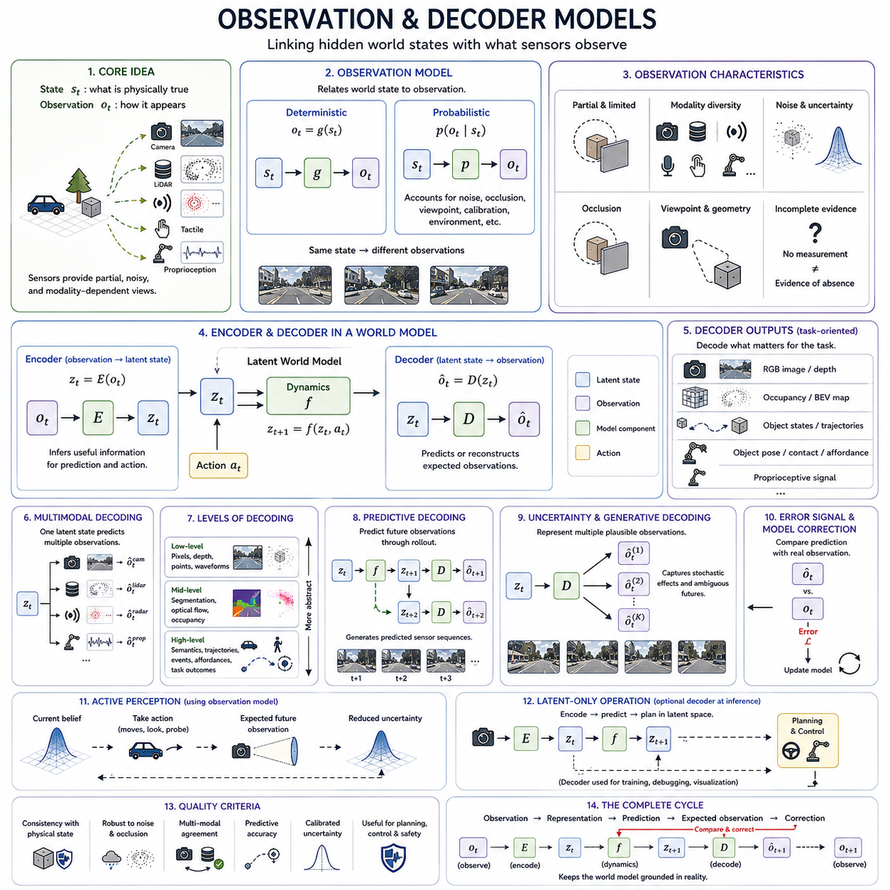{width="7.268055555555556in" height="7.268055555555556in"}

Observation models describe the relationship between the underlying state of the world and the sensory information available to an agent. If the state represents what is physically occurring, the observation represents how that reality appears through cameras, LiDAR, radar, tactile sensors, proprioception, or other sensing channels. This distinction is essential because Physical AI systems must reason from measurements rather than directly accessing reality.

Conceptually, an observation model relates a world state (s_t) to an observation (o_t). A deterministic formulation may be written as (o_t=g(s_t)), while a probabilistic formulation can be expressed as (p(o_t\|s_t)). The latter recognizes that identical physical states can produce different measurements because of sensor noise, environmental conditions, viewpoint, calibration uncertainty, occlusion, and other factors affecting the sensing process.

Observation models are closely connected to partial observability. A sensor captures only selected properties of the environment and usually only within a limited spatial and temporal range. A camera records projected appearance rather than complete three-dimensional structure, while LiDAR samples geometry from visible surfaces. Consequently, observations should be interpreted as incomplete evidence generated by an underlying physical state rather than as complete representations of that state.

Different sensing modalities produce fundamentally different observation spaces. Images contain dense appearance, texture, color, and semantic cues; LiDAR produces sparse geometric measurements; radar provides range and motion-related information; microphones capture acoustic signals; tactile sensors describe contact; and proprioceptive sensors measure the agent itself. A Physical AI world model must therefore accommodate heterogeneous observations that describe complementary aspects of the same physical situation.

The encoder and observation model can be viewed from opposite directions. An encoder transforms observation (o_t) into an internal representation such as latent state (z_t), attempting to infer information useful for prediction and action. The observation or decoder model works in the reverse direction by relating an internal state to expected sensory evidence. Together, these mappings connect high-dimensional sensor space with the compact internal state space used by a learned world model.

A decoder can be represented conceptually as (\\hat{o}_t=D(z_t)), where (D) maps a latent state into a reconstructed or predicted observation. Depending on the application, the decoded output may be an RGB image, depth map, semantic map, occupancy representation, point cloud, proprioceptive signal, or another task-relevant quantity. The decoder therefore provides a way to interpret what information the latent state preserves about observable reality.

Reconstruction is one important role of decoder models. During learning, an encoder compresses an observation into a latent representation, and the decoder attempts to reconstruct the original or relevant portions of that observation. Differences between the observed and reconstructed outputs provide a training signal. This encourages the latent state to retain information that explains sensory data, although accurate reconstruction alone does not guarantee that the representation is useful for prediction or control.

Predictive decoding extends this idea from reconstruction of the present to generation of future observations. A dynamics model predicts a future latent state (z_{t+1}), and a decoder converts that state into an expected observation (\\hat{o}_{t+1}). Repeating this process can generate predicted sensor sequences. Such outputs allow the model to visualize or evaluate how the physical scene may appear if the environment evolves or the agent performs particular actions.

However, a world model does not always need to decode complete sensor observations. Reconstructing every image pixel or LiDAR point can consume substantial computation while preserving details irrelevant to action. A model designed for navigation may instead decode occupancy, traversability, object trajectories, or collision risk. A manipulation model may decode object pose, contact, or affordances. Decoder targets should therefore reflect the information required by downstream tasks.

This distinction leads to task-oriented decoding. Rather than asking whether the internal state can reproduce everything the sensors observed, the system asks whether it can recover information necessary for decision making. A compact state that cannot reconstruct visual texture may still be highly effective if it accurately predicts obstacle motion, free space, terrain properties, or grasp outcomes. Physical usefulness can therefore be more important than sensory realism.

Observation models must account for sensor geometry. Camera measurements depend on projection, viewpoint, field of view, and occlusion, while LiDAR measurements depend on beam geometry and surface visibility. The same physical scene can generate substantially different observations when the robot changes position or orientation. Modeling the relationship between agent pose, environmental structure, and expected observations is therefore important for active perception and state estimation.

Sensor noise and uncertainty are also central to observation modeling. Measurements may vary because of electronic noise, calibration error, lighting, weather, reflective surfaces, motion, or interference. A probabilistic observation model represents how likely a measurement is given a hypothesized state. This allows an agent to compare competing state hypotheses and determine which are most consistent with the evidence while avoiding excessive confidence in imperfect measurements.

Occlusion creates a particularly important observation problem. An object may exist in the internal state while producing no current camera or LiDAR evidence because another structure blocks the sensor. A robust observation model should therefore distinguish between absence of measurement and evidence of absence. This distinction enables world models to preserve object permanence and maintain belief about hidden entities until new observations provide information that confirms or rejects those hypotheses.

Multimodal observation models can exploit complementary sensing characteristics. An object that is visually ambiguous may have clear geometric structure in LiDAR, while radar may provide motion information under poor visibility. Combining modalities can reduce ambiguity and improve robustness, but successful fusion requires spatial calibration, temporal synchronization, uncertainty handling, and representations capable of aligning measurements generated through very different sensing mechanisms.

Decoder models can likewise be multimodal. A shared latent state may be decoded into several expected observations, such as image features, depth, occupancy, object states, and proprioceptive measurements. If one latent representation can predict multiple modalities consistently, it is encouraged to capture underlying physical factors shared among them. Cross-modal prediction can therefore provide a powerful learning signal for constructing representations that describe more than any single sensor stream.

Decoding can occur at different levels of abstraction. Low-level decoders may reconstruct pixels, depth values, point coordinates, or waveforms. Intermediate decoders may predict segmentation, optical flow, occupancy, or object features. Higher-level decoders may output semantic states, trajectories, affordances, events, or task outcomes. A hierarchical world model can support several decoding levels simultaneously, connecting detailed perception with abstract prediction and planning.

Generative decoder models become valuable when one internal state corresponds to multiple plausible observations or futures. Instead of producing a single average prediction, probabilistic or generative decoders can represent alternative outcomes. This is particularly useful when future scenes depend on uncertain human behavior, hidden objects, stochastic dynamics, or ambiguous environmental conditions. Multiple plausible predictions preserve uncertainty that deterministic reconstruction might otherwise conceal.

Observation prediction can also support anomaly detection and model correction. If the world model predicts what a sensor should observe but the actual measurement differs significantly, the discrepancy may indicate an unexpected environmental event, inaccurate state estimate, sensor failure, or incorrect dynamics prediction. Prediction error therefore provides information not only for learning but also for continuously checking whether the internal model remains consistent with physical reality.

Active perception uses observation models in the opposite direction: the agent reasons about which action will produce the most informative future observation. Moving around an obstacle may reveal a hidden region, rotating a camera may reduce uncertainty about an object, and touching a surface may reveal material properties. The world model can therefore predict both how actions change the physical state and how those changes alter what the agent will subsequently be able to observe.

In latent world models, the decoder may even be optional during deployment. A system can encode observations into latent states, predict future latent states, and perform planning directly in latent space without reconstructing raw sensory data. Decoders may still be valuable during training, debugging, interpretation, or auxiliary prediction. This separation can reduce inference cost while allowing the internal model to focus its capacity on information directly relevant to action.

The quality of an observation or decoder model should therefore be judged according to its role within the complete Physical AI system. Pixel-level reconstruction quality may be important for some applications but insufficient as a general measure. More meaningful criteria can include consistency with physical state, robustness to noise and occlusion, multimodal agreement, predictive accuracy, uncertainty calibration, and the usefulness of decoded information for planning, control, and safety.

Observation and decoder models ultimately connect internal world representations with measurable physical evidence. Observation models explain how hidden physical states generate sensor measurements, while decoders reconstruct or predict observable consequences from internal states. Together with encoders and dynamics models, they form a cycle linking observation, representation, temporal prediction, expected sensory evidence, and correction from reality, enabling a world model to remain grounded in the physical world.

## 01.08. Representation vs Prediction

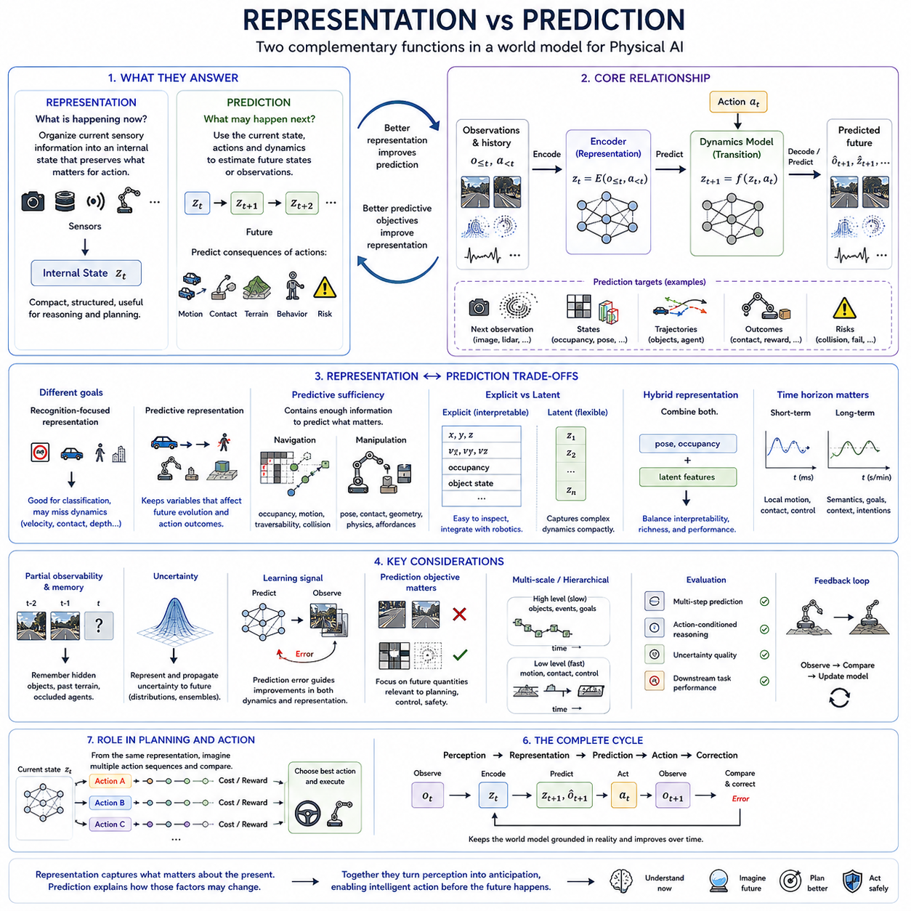{width="7.268055555555556in" height="7.268055555555556in"}

Representation and prediction are two complementary functions at the core of a world model. Representation determines how an intelligent agent organizes information about the current world into an internal state, while prediction determines how that state may evolve over time. A useful Physical AI system requires both: without representation there is no structured basis for reasoning, and without prediction the representation remains largely descriptive rather than anticipatory.

Representation addresses the question, "What should the agent know about the current situation?" Raw observations from cameras, LiDAR, radar, proprioception, and other sensors contain enormous amounts of information, but not all of it is relevant to action. A representation compresses these observations into variables or features that preserve useful properties such as geometry, objects, motion, semantics, physical relationships, uncertainty, and the state of the embodied agent.

Prediction addresses a different question: "Given what the agent currently knows, what may happen next?" A predictive model uses the represented state, recent history, actions, and environmental dynamics to estimate future states or observations. It may predict object motion, robot displacement, contact outcomes, terrain interaction, human behavior, collision risk, or other task-relevant consequences over one or multiple future time steps.

The distinction can be expressed conceptually through a state (z_t) and a transition model (f). An encoder constructs (z_t=E(o_{\\leq t},a_{\<t})) from available observations and interaction history, while prediction estimates (z_{t+1}=f(z_t,a_t)). Representation therefore determines the information available to the predictor, and prediction tests whether that information is sufficient to describe the dynamics relevant to future behavior.

A representation can be useful for perception without necessarily being useful for prediction. For example, features optimized for recognizing object categories may accurately distinguish cars, pedestrians, and buildings while discarding precise velocity, depth, contact, or physical interaction information. Such representations may perform well on static recognition benchmarks yet provide insufficient information for predicting how a physical scene will evolve under actions.

Conversely, a predictive representation does not need to preserve every observable detail. The color pattern on a wall may be visually distinctive but irrelevant to robot motion, while the slope of the floor may appear less visually important yet strongly affect traversability. Prediction encourages the internal state to preserve variables that influence future evolution and action consequences rather than treating all sensory information as equally valuable.

This leads to the concept of predictive sufficiency. An internal representation is useful when it contains enough information to predict the aspects of the future required by the agent's task. For navigation, this may include occupancy, motion, traversability, and collision relationships. For manipulation, it may include object pose, contact, geometry, and physical properties. The appropriate representation therefore depends on what the system must predict and control.

Prediction can also act as a learning objective for representation. Instead of manually specifying every state variable, a model can learn an internal representation by attempting to predict future observations, latent states, actions, or task outcomes. Features that consistently help predict future events are retained, while unpredictable or irrelevant details may receive less emphasis. Self-supervised temporal prediction therefore provides a natural mechanism for learning useful world representations from large sensory datasets.

However, prediction alone does not automatically produce an ideal representation. A model trained to predict raw video may allocate substantial capacity to textures, lighting, background motion, and other visually predictable details that contribute little to physical decision making. The prediction target matters. World-model learning should therefore emphasize future quantities whose accuracy is relevant to planning, control, safety, interaction, or understanding physical dynamics.

Representation and prediction can operate in explicit or latent spaces. Explicit representations use interpretable quantities such as position, velocity, occupancy, object state, or terrain class, allowing future values of those variables to be predicted directly. Latent representations instead encode information into learned vectors or feature maps. Latent prediction can capture complex dynamics without requiring every relevant physical variable to be manually defined.

Explicit prediction offers interpretability and convenient integration with conventional robotics. Engineers can inspect predicted trajectories, velocities, occupancy, collision probabilities, or robot states and connect them directly to planning algorithms. Its limitation is that predefined variables may omit important information. Latent prediction offers greater representational flexibility but can make it more difficult to determine what the model knows and why a particular future was predicted.

Hybrid representations provide a practical compromise. A world model can explicitly represent quantities that are important for safety and control while maintaining latent features for complex contextual or physical information. For example, a robot might explicitly represent pose, occupancy, tracked objects, and uncertainty while using latent features to encode terrain appearance, interaction patterns, or hidden environmental properties that improve transition prediction.

The relationship between representation and prediction becomes especially important under partial observability. The current observation may not contain enough information to predict the future accurately. The representation must therefore integrate memory from previous observations and actions. A temporarily occluded pedestrian, previously observed terrain, or hidden object can remain encoded in the internal state even when it is absent from the current sensor measurements.

Prediction can test the quality of this memory. If the internal representation preserves relevant historical information, future observations and events should remain predictable despite temporary sensory loss. If predictions fail whenever an object becomes occluded or leaves the field of view, the representation may be too dependent on immediate observation. Temporal prediction therefore encourages the model to develop persistent state rather than frame-by-frame descriptions.

Uncertainty must also connect representation and prediction. The current state may contain uncertainty about object position, terrain friction, another agent's intention, or hidden regions. Prediction should propagate that uncertainty into future states rather than collapsing it prematurely into one deterministic outcome. A strong representation therefore encodes not only what the model believes but also what remains ambiguous, allowing prediction to produce multiple plausible futures when necessary.

Prediction horizon changes what information a representation must preserve. Very short-term prediction may depend mainly on local motion and dynamics, whereas longer-term prediction may require semantic context, goals, interaction history, environmental structure, and higher-level behavior. A representation optimized only for the next few milliseconds may therefore differ significantly from one intended to support planning several seconds or minutes into the future.

Hierarchical world models can address this by combining representations and predictions at multiple scales. Fast low-level states can model motion, contact, and immediate control, while slower higher-level states represent objects, events, intentions, routes, or task progress. Predictions can then occur at corresponding temporal resolutions, allowing detailed short-term dynamics and abstract long-term evolution to coexist within the same world-model architecture.

Prediction error creates a feedback mechanism for improving representation. When the predicted future differs from what is later observed, the problem may lie in the dynamics model, the state representation, or both. Repeated errors can reveal that important variables are missing from the internal state. A robot that repeatedly mispredicts wheel motion on different terrain, for example, may need to represent surface properties or slip conditions more explicitly.

Representation quality should therefore not be judged only by reconstruction or classification accuracy. A visually detailed internal representation may fail to preserve causal information needed for action, while a compact representation may support highly accurate predictions of physical consequences. For world models, evaluation should consider whether the represented state enables stable multi-step prediction, action-conditioned reasoning, uncertainty estimation, and effective downstream planning.

Likewise, prediction quality should not be judged independently of decision relevance. Perfect prediction of irrelevant visual details may contribute little to autonomous behavior. The most useful predictor preserves accuracy for state changes that can alter decisions, safety, or task success. This principle encourages selective modeling: computational resources should be devoted to future information whose uncertainty or evolution matters to the embodied agent.

Representation and prediction also interact with planning. Planning requires a state from which alternative actions can be evaluated and a predictive mechanism that estimates their consequences. Starting from the same representation, the model can roll forward different action sequences and compare predicted outcomes. Representation provides the starting point and relevant variables, while prediction creates the imagined futures through which candidate behaviors can be evaluated.

The relationship is therefore circular rather than one-directional. Better representations improve prediction because important causal and temporal information is preserved. Better predictive objectives improve representation because they encourage the model to encode information that matters for future evolution. Planning further shapes both by defining which future consequences are behaviorally important. World-model design should consequently treat representation, prediction, and action as a jointly optimized system.

For Physical AI, the ultimate objective is not to build the richest possible description of the present or the most visually impressive prediction of the future. The objective is to construct an internal state that captures what matters and a predictive process that explains how those relevant factors may change under actions and external influences. Representation tells the agent what world it is currently in; prediction allows it to reason about the worlds it may encounter next.

A capable world model therefore emerges from the balance between representation and prediction. Representation compresses sensory experience into persistent, actionable knowledge, while prediction transforms that knowledge into possible future trajectories and consequences. Together they convert perception from passive description into anticipatory intelligence, enabling an embodied agent to understand the present in terms of what it implies for the future and what actions should be taken before that future becomes reality.

## 01.09. Spatial Temporal and Semantic State

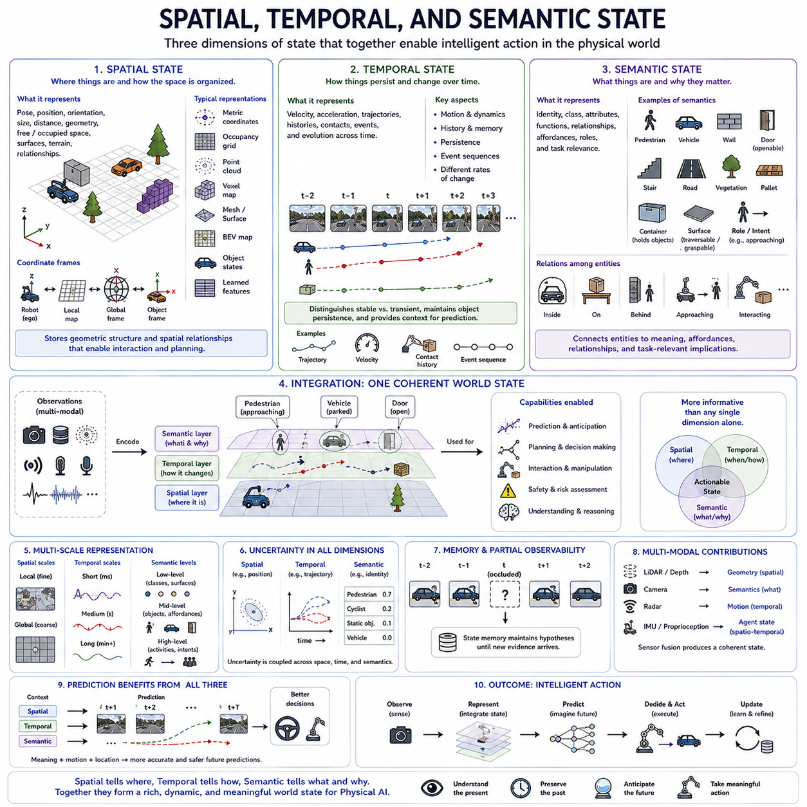{width="7.268055555555556in" height="7.268055555555556in"}

Spatial, temporal, and semantic state form three complementary dimensions through which a world model can organize physical reality. Spatial state describes where entities and structures are located, temporal state describes how they persist and change through time, and semantic state describes what those entities mean. Physical AI requires their integration because intelligent action depends simultaneously on location, evolution, and meaning.

Spatial state represents the geometric organization of the environment and the embodied agent within it. It may contain robot pose, object position, orientation, size, distance, free space, occupied regions, surfaces, terrain, and relationships among entities. Depending on the application, these properties can be represented through metric coordinates, occupancy grids, point clouds, voxels, meshes, bird's-eye-view maps, object states, or learned spatial features.

A useful spatial representation must establish reference frames that determine how positions and motions are interpreted. Information may be expressed relative to the robot, a local map, a global coordinate system, or individual objects. Transformations among these frames allow observations from moving sensors to be integrated consistently. Without such alignment, measurements collected at different positions and times cannot reliably describe one persistent physical environment.

Spatial representation is not limited to geometric reconstruction. For Physical AI, geometry becomes useful when it supports interaction. The system must distinguish free space from occupied space, reachable areas from inaccessible areas, and stable surfaces from hazardous terrain. Clearance, connectivity, visibility, collision relationships, support regions, and traversability can therefore become part of spatial state when they influence possible actions.

Temporal state adds persistence and change to this spatial description. A single observation provides only a snapshot, whereas autonomous behavior requires understanding what existed previously, what is moving now, and what may happen next. Temporal state can contain velocity, acceleration, trajectories, object histories, contact duration, event sequences, and other variables that describe how physical conditions evolve across multiple time steps.

Temporal representation also allows the model to distinguish permanent structure from transient conditions. A building or fixed wall may remain stable over long periods, while pedestrians, vehicles, movable objects, weather effects, and robot configurations can change rapidly. Representing these different rates of change helps the world model allocate computation appropriately and prevents temporary observations from unnecessarily modifying persistent environmental knowledge.

Object persistence is a particularly important temporal property. An object does not normally cease to exist when it becomes occluded or leaves the sensor field of view. By associating observations across time, the world model can maintain persistent entities and update their estimated states as new evidence becomes available. This continuity allows reasoning about hidden objects, reappearing agents, movement history, and interactions extending beyond a single sensor frame.

Temporal state is closely related to prediction because motion and history provide evidence about future evolution. A pedestrian's current position alone may provide limited information, while several seconds of trajectory can reveal direction and speed. Similarly, recent wheel slip can indicate changing terrain interaction. Temporal context therefore transforms isolated spatial measurements into dynamic state estimates that support forecasting, planning, and anticipatory control.

Semantic state describes what elements of the represented world are and why they matter. Geometry may indicate that a region contains a three-dimensional structure, but semantics can identify it as a pedestrian, vehicle, wall, door, pallet, staircase, road, or vegetation. Such distinctions affect behavior because physically similar structures may have very different implications for navigation, manipulation, interaction, and safety.

Semantic representation can extend beyond categorical labels. It may encode properties, functions, relationships, affordances, roles, and task relevance. A door can be represented not merely as a door but as an openable passage; a container may be recognized as capable of holding objects; a surface may be identified as traversable or graspable. Semantics therefore connect perceived entities with possible actions and expected physical consequences.

Relationships among entities provide another important semantic structure. A person may be inside a vehicle, an object may rest on a table, a robot may approach a doorway, or one object may block access to another. Representing relations such as inside, on, behind, connected to, supporting, approaching, or interacting can transform isolated object descriptions into a structured model of the situation.

Spatial, temporal, and semantic information should not be treated as independent layers. Consider a pedestrian near a mobile robot. Spatial state describes the pedestrian's position relative to the robot, temporal state describes motion and recent trajectory, and semantic state identifies the entity as a person with behaviorally relevant properties. Together these dimensions provide substantially more information than any one of them could provide independently.

Their integration is especially important for prediction. Knowing that an occupied region exists provides limited predictive information. Knowing that the region contains a pedestrian moving toward a crossing creates a much stronger basis for anticipating future occupancy. Semantic identity constrains plausible behavior, temporal information describes current evolution, and spatial information determines whether the predicted behavior will intersect the robot's future path.

The same principle applies to manipulation. Spatial state can represent an object's pose and geometry, temporal state can describe movement and contact history, and semantic state can describe object type, function, and affordances. A robot deciding how to grasp or move an object benefits from all three because successful manipulation depends on where the object is, how it is behaving, and what kinds of interactions are appropriate.

Dense spatial representations and object-centric semantic representations can coexist within the same world model. Occupancy or BEV features can describe continuous free space and unclassified obstacles, while persistent object states describe recognized entities. Temporal mechanisms can update both forms. This hybrid organization avoids requiring every physical structure to receive a semantic identity before it can influence planning or collision avoidance.

Semantic state can also operate at multiple levels of abstraction. Low-level semantics may describe surface classes and object categories, while higher-level semantics may represent activities, intentions, events, or situations. A vehicle can be represented as an object, but its behavior may additionally be interpreted as parking, yielding, overtaking, or approaching. Higher-level meaning can substantially improve longer-horizon prediction and decision making.

Temporal abstraction can similarly span multiple scales. Millisecond-level state may describe actuator response and body motion, second-level state may represent trajectories and interactions, and longer timescales may describe navigation progress, task phases, or recurring environmental patterns. A hierarchical world model can maintain these timescales simultaneously rather than forcing all physical processes into one uniform update frequency.

Spatial abstraction also benefits from multiple scales. Fine local geometry is important for immediate collision avoidance, foothold selection, and manipulation, whereas larger-scale maps support route planning and environmental context. The world model can therefore maintain detailed state around the agent while using progressively coarser representations farther away or for longer prediction horizons, balancing computational cost against decision relevance.

Uncertainty should be represented across all three dimensions. Spatial uncertainty may concern position or geometry, temporal uncertainty may concern motion and future trajectory, and semantic uncertainty may concern identity, intention, or affordance. These uncertainties are often coupled. Uncertainty about whether an observed entity is a pedestrian or static object, for example, directly changes the range of plausible future motions that should be considered.

Partial observability makes this integrated state inherently dependent on memory. Spatial regions can become hidden, temporal trajectories can be interrupted, and semantic identity can remain ambiguous. Historical observations allow the system to preserve hypotheses until additional evidence becomes available. The resulting state is therefore not merely a description of the current sensor input but a temporally accumulated interpretation of the surrounding world.

Multimodal sensing contributes different information to these dimensions. LiDAR and depth sensing provide strong geometric evidence, cameras contribute rich semantic cues, radar can improve motion estimation, and proprioceptive sensors describe the robot's own spatial and temporal state. Sensor fusion should integrate these complementary signals into a coherent representation rather than maintaining unrelated descriptions for each sensing modality.

For embodied intelligence, the agent itself must also be represented spatially, temporally, and semantically. Its pose and geometry determine spatial relationships, its velocity and action history define temporal evolution, and its capabilities, constraints, goals, and role determine what environmental features are behaviorally meaningful. The same environment can therefore produce different actionable world states for robots with different embodiments and tasks.

The appropriate state representation should ultimately preserve information that changes future decisions. Spatial detail is valuable when it affects movement or interaction, temporal detail is valuable when it improves prediction, and semantic detail is valuable when meaning changes possible behavior. Excessive representation of irrelevant information increases computational cost without necessarily improving intelligence, while missing critical information can make prediction and planning unreliable.

Spatial, temporal, and semantic state together transform sensory measurements into a structured understanding of a dynamic physical world. Spatial representation establishes where things are, temporal representation explains how they persist and change, and semantic representation identifies what they are and what they imply for action. Their integration provides the foundation for a world model that can understand the present, preserve the past, anticipate the future, and select physically meaningful actions.

## 01.10. Short vs Long Horizon Prediction

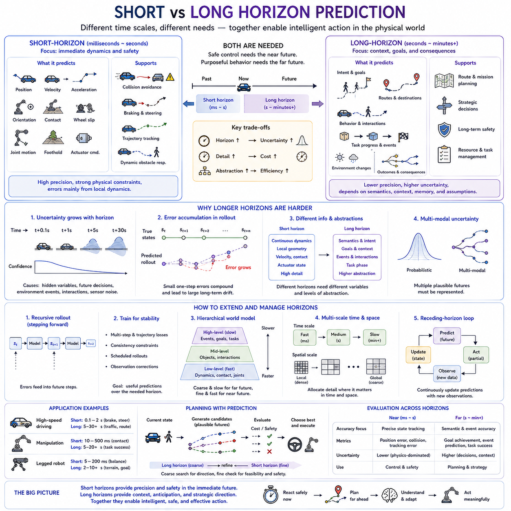{width="7.268055555555556in" height="7.268055555555556in"}

Prediction horizon determines how far into the future a world model attempts to estimate the evolution of its internal state. Short-horizon prediction focuses on immediate changes occurring over milliseconds or seconds, while long-horizon prediction extends reasoning toward more distant states, events, and consequences. Physical AI requires both because safe control depends on immediate dynamics, whereas purposeful autonomous behavior requires anticipation beyond the next few moments.

Short-horizon prediction is closely connected to local physical dynamics. At this scale, the model may estimate changes in position, velocity, acceleration, orientation, joint configuration, contact, wheel slip, or nearby object motion. Because relatively little time separates the current state from the predicted state, immediate physical constraints strongly determine possible outcomes, and predictions can often remain comparatively precise.

For a mobile robot, short-horizon prediction may estimate where the robot and surrounding objects will be within the next fraction of a second or several seconds. Such predictions support collision avoidance, braking, steering correction, local trajectory tracking, and dynamic obstacle response. For manipulation or locomotion, the same horizon may describe contact transitions, joint motion, grasp stability, foothold interaction, or the immediate consequences of actuator commands.

Long-horizon prediction addresses a different class of questions. Instead of asking only where an object will be at the next time step, the model may estimate how a situation, interaction, route, or task will develop over many future steps. Relevant variables can include behavioral intent, destination, task progress, environmental changes, interaction outcomes, and higher-level events that cannot be inferred reliably from instantaneous dynamics alone.

The distinction between short and long horizons is therefore not simply a difference in the number of predicted time steps. Different horizons can require different information, abstractions, and models. Short-term prediction often emphasizes continuous physical dynamics, while longer-term prediction increasingly depends on semantics, goals, context, memory, interaction patterns, and assumptions about how agents and environments behave over extended periods.

Prediction uncertainty generally increases with horizon. A vehicle's position one tenth of a second into the future can often be estimated accurately from its current motion, but its position many seconds later may depend on turns, braking, traffic conditions, or decisions that have not yet occurred. As predictions extend farther from current observations, uncertainty from state estimation, transition dynamics, hidden variables, and future decisions accumulates.

This growth of uncertainty makes deterministic long-horizon prediction problematic. A single predicted trajectory can falsely suggest confidence when several futures remain plausible. Probabilistic or multimodal prediction is therefore especially important at longer horizons. Instead of predicting one future, a world model can represent multiple possible trajectories, events, or state sequences together with uncertainty about which alternative will eventually occur.

Short-horizon prediction can also be uncertain, particularly during contact, rapid maneuvering, terrain interaction, or sensor degradation. Small changes in friction, force, latency, or contact geometry may rapidly alter outcomes. The difference is that short-term uncertainty is often dominated by physical state and dynamics, whereas long-term uncertainty increasingly includes decisions, intentions, environmental events, and branching interactions among multiple agents.

Recursive rollout provides a straightforward way to extend prediction horizon. A model predicts (s_{t+1}) from (s_t), then uses the predicted state to estimate (s_{t+2}), and continues recursively. However, each prediction contains some error, and that error becomes part of the input to subsequent predictions. Even a highly accurate one-step model can therefore drift significantly when repeatedly applied across a long horizon.

Error accumulation is one of the central challenges of long-horizon world modeling. Small errors in position, velocity, object identity, terrain properties, or hidden state can compound over time. Eventually the predicted state may enter a region that was rarely encountered during training, causing further degradation. Long rollouts must therefore address both numerical accumulation and distribution shift between states observed from reality and states generated by the model itself.

Training only for one-step accuracy may consequently be insufficient. A model can perform well when every prediction begins from a true observed state yet fail when its own previous predictions become inputs. Multi-step training, trajectory-level objectives, consistency constraints, scheduled rollout strategies, and periodic correction from observations can help improve stability. The objective is not merely to predict the next state accurately but to maintain useful predictions over the required horizon.

Representation requirements also change with prediction horizon. Immediate prediction may rely on detailed local geometry, velocity, contact, and actuator state. Longer prediction may benefit from more abstract variables such as road structure, destination, object function, human intention, task phase, or environmental context. A single representation operating at one level of detail may therefore be inefficient for predicting across widely different temporal scales.

Hierarchical world models provide a natural solution. A fast dynamics layer can predict fine-grained physical changes at high frequency, while slower layers predict objects, interactions, events, goals, or task-level transitions. Rather than recursively predicting every millisecond far into the future, the system can gradually shift toward coarser temporal and semantic abstractions as the prediction horizon increases.

Temporal abstraction can substantially reduce computational requirements. Predicting ten seconds ahead at one-millisecond resolution would require ten thousand sequential transitions, many of which may contain unnecessary detail for high-level planning. A hierarchical system could instead use fine resolution for the immediate future, medium resolution for local behavior, and coarse event-level transitions for distant futures, allocating computation according to decision relevance.

Spatial resolution can change with horizon as well. Immediate collision avoidance requires precise geometry around the robot, whereas distant planning may require only approximate routes, regions, or object groups. Maintaining the same geometric precision everywhere and across every future time step can be prohibitively expensive. Multi-scale representations therefore allow prediction fidelity to decrease selectively where fine detail does not affect current decisions.

Semantic information becomes increasingly valuable at longer horizons. Short-term motion may often be extrapolated from velocity, but long-term behavior depends on what an entity is and what it is likely to do. Knowing that an observed object is a pedestrian, vehicle, door, or autonomous robot constrains possible future behavior. Higher-level semantic interpretation can therefore compensate for the decreasing usefulness of simple motion extrapolation over longer periods.

Intent and goal estimation are particularly important for long-horizon prediction in multi-agent environments. Two pedestrians with similar current positions and velocities may eventually move in different directions because they have different destinations. Vehicles may turn, stop, yield, or overtake. A long-horizon world model must therefore represent alternative intentions rather than assuming that current motion continues indefinitely.

Action conditioning connects prediction horizon directly to planning. Short-horizon models can evaluate immediate control commands such as steering, acceleration, braking, joint motion, or foothold selection. Long-horizon models can evaluate sequences of actions, routes, strategies, or task decisions. As the number of possible action sequences grows rapidly with horizon, prediction and planning must avoid exhaustively simulating every possible future.

This combinatorial growth motivates selective imagination. A world model can generate a limited set of plausible or promising future trajectories rather than evaluating all possibilities. Planning algorithms can progressively refine these candidates, using coarse long-horizon prediction to identify useful directions and detailed short-horizon prediction to verify immediate feasibility and safety. Prediction fidelity can therefore be matched to the stage of decision making.

Observation updates provide another important difference between real operation and open-loop imagination. During execution, the robot continuously receives new sensory evidence that can correct predictions before errors become excessive. Long-horizon predictions should therefore not necessarily be interpreted as fixed forecasts. They can function as provisional futures that guide current decisions and are repeatedly revised as new observations reveal which possibilities remain plausible.

This creates a receding-horizon process. The agent predicts forward, selects an action, executes only part of the planned sequence, observes the resulting world, updates its internal state, and predicts again. Model Predictive Control and related approaches use this principle explicitly. World models can extend it beyond classical dynamics by incorporating learned environmental behavior, semantic state, uncertainty, and multimodal future prediction.

The appropriate prediction horizon depends on the task and embodiment. High-speed vehicles may require several seconds of accurate anticipation because large stopping distances make distant hazards immediately relevant. Manipulators performing contact-rich tasks may require extremely precise short-horizon predictions. Slow mobile robots may combine local collision prediction with much longer route-level reasoning. There is therefore no universally optimal horizon for Physical AI.

Evaluation should likewise distinguish between horizons. One-step accuracy does not demonstrate long-horizon stability, while long-horizon semantic correctness does not guarantee precise immediate control. Metrics may examine displacement error, collision prediction, trajectory consistency, event accuracy, uncertainty calibration, task success, or planning performance at different future intervals. A capable world model should be evaluated according to the temporal scales at which it is expected to support decisions.

Short- and long-horizon prediction should ultimately operate as complementary capabilities rather than competing alternatives. Short horizons provide precision, responsiveness, and grounding in immediate physics, while long horizons provide context, anticipation, strategic direction, and awareness of delayed consequences. Hierarchical representations, uncertainty-aware prediction, continual observation updates, and multi-scale planning allow these capabilities to coexist within one world model.

A mature Physical AI system therefore does not attempt to predict every future moment with equal detail or confidence. It predicts the near future precisely where physical consequences are immediate, represents increasingly uncertain alternatives as the horizon expands, and shifts toward higher-level abstractions when detailed simulation becomes inefficient or unreliable. By connecting immediate dynamics with longer-term possibilities, the world model enables the agent to react safely now while acting in ways that remain effective in the future.

## 01.11. World Model Memory

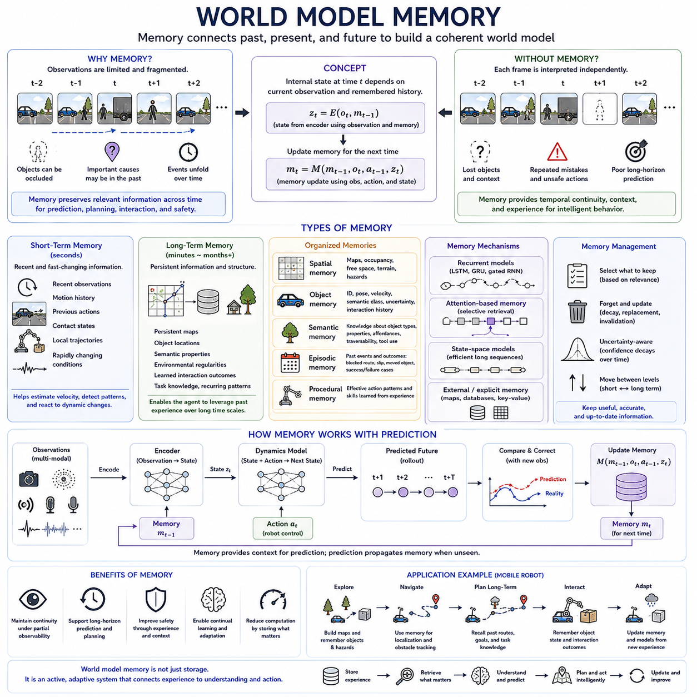{width="7.268055555555556in" height="7.268055555555556in"}

Memory is a fundamental component of a world model because the current observation rarely contains everything an embodied agent needs to understand its situation. Sensors reveal only a limited portion of the physical world at each moment, while objects may become occluded, events unfold over time, and important causes may belong to the past. World model memory preserves relevant information beyond the immediate observation so that the agent can maintain a coherent internal world.

Without memory, a Physical AI system would repeatedly interpret each sensor frame as if it were encountering the environment for the first time. A pedestrian disappearing behind a vehicle could effectively vanish from the internal representation, a previously detected obstacle outside the current field of view could be forgotten, and earlier interaction outcomes could not influence later decisions. Memory provides temporal continuity across these fragmented observations.

World model memory is more than the storage of raw historical sensor data. Retaining every camera frame, LiDAR scan, control command, and internal activation indefinitely would be computationally expensive and often unnecessary. A useful memory system selectively preserves information that remains relevant to prediction, planning, interaction, and safety while compressing or discarding details whose future value is low.

Short-term memory maintains information needed across relatively brief temporal intervals. It can preserve recent observations, motion history, previous actions, contact states, local trajectories, and rapidly changing environmental conditions. Such memory helps estimate velocity, detect temporal patterns, track moving entities, and distinguish changes caused by the robot\'s own motion from changes caused by independently moving objects.

Long-term memory preserves information that remains useful over substantially longer periods. It may include persistent maps, object locations, semantic properties, environmental regularities, previously learned interaction outcomes, task knowledge, and recurring patterns. Long-term memory allows an agent to benefit from earlier experience rather than reconstructing every aspect of its environment and behavior from immediate observations during each encounter.

The boundary between short-term and long-term memory is not fixed. Different Physical AI systems operate at different temporal scales, and information can gradually move between memory levels. A temporary observation may initially remain in short-term state, become persistent if repeatedly confirmed, and eventually contribute to long-term knowledge. Conversely, stored information may lose relevance when the physical environment changes.

Memory is particularly important under partial observability. The internal state at time (t) can be understood conceptually as a function of the current observation and remembered history, such as (z_t=E(o_t,m_{t-1})), where (m_{t-1}) summarizes information from previous observations and actions. The memory update then determines what historical information should persist into (m_t) for future prediction and decision making.

Recurrent neural networks provide one classical mechanism for maintaining learned memory. A hidden state is repeatedly updated as new observations arrive, allowing information from previous time steps to influence current processing. Long Short-Term Memory and gated recurrent architectures were developed to preserve useful dependencies over longer sequences, although very long histories and high-dimensional multimodal observations can still challenge recurrent representations.

Attention-based architectures provide another approach by allowing the model to retrieve relevant information from a collection of previous representations. Instead of compressing all history into one recurrent hidden state, attention can selectively access different past observations or memory tokens according to the current context. This can improve long-range reasoning, although computation and memory requirements increase as the retained context becomes larger.

State-space models offer mechanisms for propagating compact internal states across long sequences while maintaining computational efficiency. They can summarize temporal information through structured state transitions rather than repeatedly attending to every historical observation. For continuously operating Physical AI systems, such approaches are attractive because world model memory must often process long sensor streams without allowing computational cost to grow indefinitely with operating time.

External or explicit memory can complement learned hidden states. A robot may maintain geometric maps, semantic maps, occupancy structures, object databases, episodic records, or key-value memories outside the neural dynamics model. These structures can preserve interpretable information for long periods and allow targeted retrieval. Hybrid systems can therefore combine neural memory for implicit patterns with structured memory for persistent physical facts.

Spatial memory is especially important for embodied agents. When a robot moves, much of the environment leaves the current sensor field of view but remains physically relevant. Maps, object locations, free-space estimates, terrain properties, and previously observed hazards can be retained in spatial memory. Localization then allows current observations to be aligned with remembered environmental structure, creating a persistent representation extending beyond immediate perception.

Object memory provides another useful organization. Instead of storing only complete scenes, the world model can maintain persistent records for individual entities. An object record may contain identity, location, velocity, semantic class, uncertainty, interaction history, and last observation time. When the object disappears because of occlusion, its state can continue to be predicted until new evidence confirms, updates, or invalidates the stored hypothesis.

Semantic memory represents more general knowledge that is not tied to one particular event. It can encode regularities such as what types of objects exist, what properties they usually possess, which surfaces are traversable, or how certain tools and structures can be used. Such knowledge helps the world model interpret unfamiliar observations by relating them to patterns accumulated across previous experience.

Episodic memory instead preserves information about particular experiences. A robot may remember that a specific route was blocked, that wheel slip occurred at a certain location, that an object was moved during an earlier interaction, or that a previous action sequence failed. Episodic information can provide context for later decisions when the agent encounters similar situations or returns to the same environment.

Procedural information can also interact with world model memory. Repeated experience may reveal how particular actions affect specific objects, terrains, or situations. Rather than remembering only what was observed, the agent can preserve knowledge about effective interaction patterns. This connects memory with dynamics learning because stored experience can improve predictions of what will happen when similar actions are attempted in the future.

Memory must include mechanisms for forgetting as well as remembering. Physical environments change, objects move, temporary obstacles disappear, and previously correct information can become obsolete. If a world model retains every historical belief indefinitely, stale information can conflict with current evidence. Forgetting, decay, confidence reduction, replacement, and explicit invalidation are therefore necessary for maintaining an accurate internal world.

The importance of stored information can be determined by several factors. Recent information may deserve higher priority when environmental conditions change rapidly, while unusual or safety-critical events may remain important for much longer. Information associated with prediction error can also be valuable because unexpected outcomes reveal weaknesses in the current model. Memory management should therefore depend on relevance rather than time alone.

Uncertainty is essential when maintaining memory. A remembered object location should not remain perfectly certain after the object has been unobserved for an extended period. As time passes, its possible location may expand according to plausible motion. Similarly, confidence in remembered terrain conditions or environmental configurations may decrease. Memory should therefore preserve both information and uncertainty about whether that information remains valid.

Prediction and memory form a tightly coupled system. Memory provides the historical context needed to predict future states, while prediction allows remembered states to be propagated through periods without direct observation. When an object becomes hidden, the world model can use its previous state and learned dynamics to predict its likely current state. New observations then correct the prediction and update memory, forming a continuous temporal estimation loop.

Memory also supports long-horizon prediction because distant futures often depend on information that cannot be extracted from the current observation alone. Goals, previous interactions, route history, persistent environmental structure, and behavioral patterns may influence what happens many steps later. A world model that forgets these factors too quickly may perform well at immediate prediction while failing to maintain coherent longer-term forecasts.

Hierarchical memory can organize information according to temporal and semantic scale. Fast memory may preserve recent sensor dynamics and contact states, intermediate memory may maintain objects and ongoing interactions, and slower memory may store maps, task context, semantic knowledge, and recurring patterns. Different memory levels can be updated at different frequencies, reducing computation while preserving information over appropriate horizons.

Memory retrieval is as important as memory storage. An autonomous system may accumulate enormous amounts of experience, but only a small fraction will be relevant to the current situation. Retrieval mechanisms should identify memories based on spatial proximity, semantic similarity, task context, predicted relevance, or uncertainty. Efficient retrieval allows large memories to support reasoning without requiring the entire history to be processed for every decision.

Memory can also enable continual adaptation. Prediction errors and interaction outcomes accumulated during operation can reveal new terrain characteristics, changing object behavior, sensor drift, or previously unseen environmental patterns. Selected experiences can be used to update models or calibrate predictions. The world model can therefore evolve from a fixed pretrained system toward an adaptive model that incorporates useful evidence from continued physical experience.

However, continual memory introduces stability challenges. New experiences should improve adaptation without causing the system to overwrite important previously learned knowledge. Memory selection, replay, consolidation, parameter isolation, and related continual-learning mechanisms can help balance plasticity and stability. This is particularly important for Physical AI systems expected to operate for months or years across changing environments.

A mature world model therefore requires memory at multiple scales and in multiple forms. It must remember recent dynamics, persistent spatial structure, individual objects, significant episodes, semantic regularities, and useful interaction experience while continuously deciding what should be updated, compressed, retrieved, or forgotten. Memory is not simply an archive attached to the model; it is an active component of state estimation and prediction.

Ultimately, world model memory connects the past, present, and future of an embodied agent. It transforms disconnected observations into persistent experience, allows hidden states to survive temporary loss of sensory evidence, and provides historical context for prediction and planning. Combined with representation and dynamics, memory enables Physical AI to understand the current world not only from what it sees now, but also from what it has previously observed, inferred, learned, and experienced.

## 01.12. Minimal World Model [w/Code]

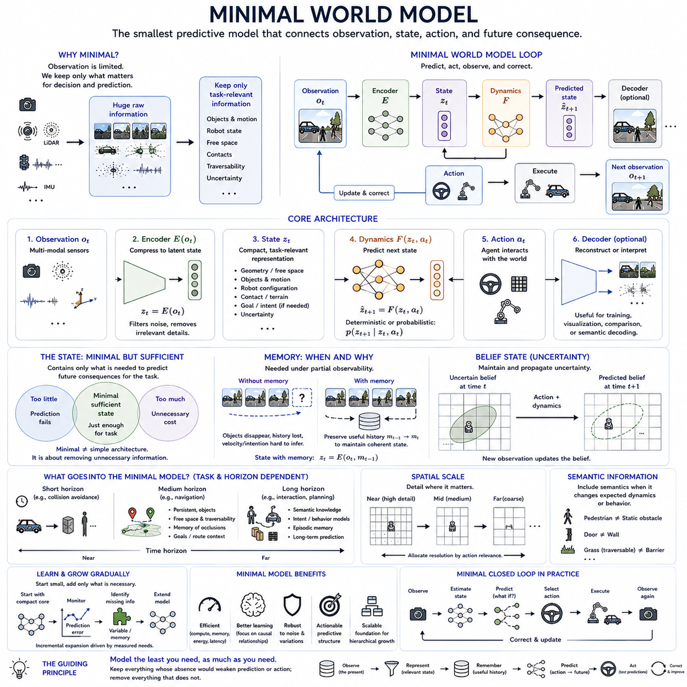{width="7.268055555555556in" height="7.268055555555556in"}

A minimal world model is the smallest internal predictive structure that allows an agent to represent its current situation, anticipate relevant changes, and select actions accordingly. It does not attempt to reconstruct every detail of the physical world. Instead, it preserves only the information required to connect observation, internal state, action, transition, and future consequence in a coherent predictive loop.

The idea of minimality is important because a complete representation of reality is neither necessary nor computationally practical. A robot receives enormous streams of visual, geometric, acoustic, proprioceptive, and control information, yet only a fraction of this information affects a particular decision. A minimal world model therefore seeks the smallest sufficient state that preserves what matters for prediction and action.

At its simplest, the model can be described through four elements: observation (o_t), internal state (z_t), action (a_t), and a transition mechanism that estimates the next state. An encoder forms (z_t=E(o_t)), while a dynamics model predicts (\\hat{z}_{t+1}=F(z_t,a_t)). This basic structure already provides an internal mechanism for asking what may happen if the agent performs a particular action.

The internal state is the central component of this architecture. Raw sensor observations are usually too high-dimensional, redundant, and noisy to serve directly as an efficient predictive state. The encoder compresses them into a representation containing task-relevant information. Depending on the application, this state may describe geometry, motion, objects, robot configuration, contact conditions, free space, or learned latent features.

A minimal state should satisfy predictive sufficiency rather than descriptive completeness. It does not need to reproduce everything visible to the sensors. It needs to contain enough information to predict the consequences relevant to the agent. For a mobile robot, precise wall texture may be unnecessary, while obstacle position, relative motion, traversability, and robot velocity may be essential for determining safe future movement.

Action must be included because Physical AI interacts with the environment rather than merely observing it. The future depends not only on the current state but also on what the agent does. A transition model conditioned on action can represent this relationship as (p(z_{t+1}\|z_t,a_t)). This converts the world model from a passive forecasting mechanism into an actionable predictive model capable of supporting control and planning.

The transition model represents the smallest useful notion of dynamics. It predicts how relevant state variables change from one time step to the next under an action. The model may be deterministic when future evolution is sufficiently predictable or probabilistic when multiple outcomes are possible. Even a compact transition model can provide significant intelligence if it captures the physical relationships that matter for behavior.

A decoder is useful but is not always required in the minimal operational model. If the agent plans directly in latent state space, it may encode observations, predict future latent states, and evaluate them without reconstructing camera images or other raw sensor signals. A decoder becomes valuable when predicted states must be interpreted, reconstructed, visualized, compared with observations, or trained using reconstruction-based objectives.

Memory is similarly conditional rather than universally required at the simplest conceptual level. In a fully observable environment, the current observation may provide enough information to determine the relevant state. Physical environments, however, are usually partially observable. Objects become occluded, sensor coverage is limited, and velocity or intention often requires temporal context. In such cases, memory becomes part of the minimal sufficient model.

With memory, the state estimator can be written conceptually as (z_t=E(o_t,m_{t-1})), where (m_{t-1}) summarizes relevant historical information. The memory update preserves information required beyond the current observation. This does not imply storing the complete past. Minimal memory should retain only those historical variables whose absence would significantly reduce prediction, state estimation, planning, or safety performance.

A belief state provides a probabilistic extension of the minimal model when the true physical state cannot be observed directly. Instead of assuming that (z_t) is perfectly known, the system maintains uncertainty over possible states. New observations update this belief, and the transition model propagates it forward. The minimal world model can therefore expand naturally from deterministic state prediction toward uncertainty-aware reasoning.

Prediction horizon also influences what qualifies as minimal. A model designed only for immediate collision avoidance may require position, velocity, obstacle geometry, and short-term dynamics. A model supporting longer navigation or interaction may additionally require persistent objects, semantic context, goals, memory, and behavioral hypotheses. Minimality is therefore relative to the temporal horizon and decisions the agent must support.

The same principle applies to spatial scale. Immediate local control may require detailed geometry only near the robot, while distant regions can be represented more coarsely. A minimal world model should avoid maintaining uniformly detailed representations of the entire environment when such precision does not influence current or foreseeable decisions. Representation resolution can therefore be allocated according to expected action relevance.

Semantic information should also be included selectively. A robot does not necessarily need semantic labels for every visible structure. However, semantic identity becomes important when it changes expected dynamics or appropriate behavior. Distinguishing a pedestrian from a static obstacle, a door from a wall, or traversable vegetation from a rigid barrier can substantially alter prediction and planning even when their immediate geometry appears similar.

The minimal model can therefore be understood as task-dependent rather than architecture-dependent. One application may use explicit state variables, another may use a learned latent vector, and another may combine occupancy, object states, and neural features. What makes the model minimal is not a particular neural network design but whether unnecessary information and mechanisms can be removed without degrading the required predictive and decision capability.

This perspective provides a useful distinction between a minimal world model and a complete world simulator. A simulator may attempt to reproduce detailed physical appearance, dynamics, and interactions across many possible conditions. A minimal world model instead represents only the subset of reality required by the embodied agent. Its objective is not maximal realism but sufficient predictive structure for intelligent behavior.

Minimal models are attractive for edge-based Physical AI because computational resources, memory bandwidth, energy, and latency are limited. Predicting every pixel of multiple high-resolution cameras far into the future may consume substantial computation without proportionate benefit. Compact latent or structured state prediction can reduce inference cost while preserving information needed for navigation, manipulation, control, and safety.

Minimality can also improve learning efficiency. When the prediction objective focuses on relevant state changes rather than every sensory detail, the model can devote capacity to causal and dynamic relationships that affect action. This can reduce the burden of learning unpredictable textures, illumination changes, sensor artifacts, or background variation that may have little influence on physical outcomes.

However, excessive compression creates its own risk. If the representation removes information that later becomes important, the transition model cannot recover it. A state that is sufficient for straight-road navigation may become insufficient when terrain changes, humans enter the scene, or manipulation becomes necessary. Designing a minimal model therefore requires careful identification of which variables can safely be discarded and which must remain available.

One practical strategy is to begin with a compact core state and add information only when prediction errors or task failures demonstrate that something important is missing. Repeated wheel-motion errors may indicate that terrain or slip must be represented. Failure to predict hidden pedestrians may reveal a need for object memory. This creates an incremental path from a minimal model toward a richer architecture justified by measurable requirements.

Prediction error provides an important diagnostic signal in this process. If the model repeatedly fails under particular conditions, the failure may indicate insufficient representation, inadequate memory, incorrect dynamics, or missing uncertainty. Rather than automatically increasing model size, designers can determine which missing information caused the failure and extend the world model selectively.

A minimal world model can also support planning through imagined rollouts. Starting from the estimated current state, the model applies candidate actions and predicts their consequences over a limited horizon. A planner compares these predicted futures according to safety, progress, energy, task success, or another objective. Even a relatively small predictive model can therefore transform perception into anticipatory decision making.

Observation closes the loop between prediction and physical reality. After an action is executed, new sensor measurements reveal what actually occurred. The system compares this evidence with its predicted state, corrects the internal representation, and begins another prediction cycle. The minimal operational loop can therefore be summarized as observation, state estimation, action-conditioned prediction, action selection, execution, and correction.

This closed-loop structure is more important than model complexity. A very large generative model that produces realistic futures but cannot reliably support state correction or action selection may be less useful for robotics than a compact model that continuously predicts and corrects task-relevant physical state. Physical grounding emerges from repeated interaction between internal prediction and external observation.

Minimal world models also provide a useful foundation for hierarchical expansion. A compact fast model can handle immediate dynamics and safety, while additional modules introduce semantic reasoning, longer memory, multimodal prediction, or long-horizon planning when required. The architecture can therefore grow from a small predictive core instead of requiring every capability to operate at maximum complexity continuously.

Ultimately, a minimal world model contains the least information and machinery required to maintain a useful internal state, predict action-conditioned change, and correct itself from new observations. Its exact contents depend on embodiment, environment, task, uncertainty, and prediction horizon. The guiding principle is not to model everything that can be observed, but to preserve everything whose absence would materially weaken prediction or action.

For Physical AI, this principle provides a practical starting point for building scalable world models. Observation establishes evidence about the present, representation compresses that evidence into relevant state, memory preserves necessary history, dynamics predict possible change, and action tests those predictions against reality. From this minimal closed loop, increasingly sophisticated spatial, temporal, semantic, and predictive capabilities can be added only where they provide measurable value.
