**Volume 07. World Models for Physical AI**

# Chapter 02. Predictive World Models

## 02.01. Prediction as the Core of World Models

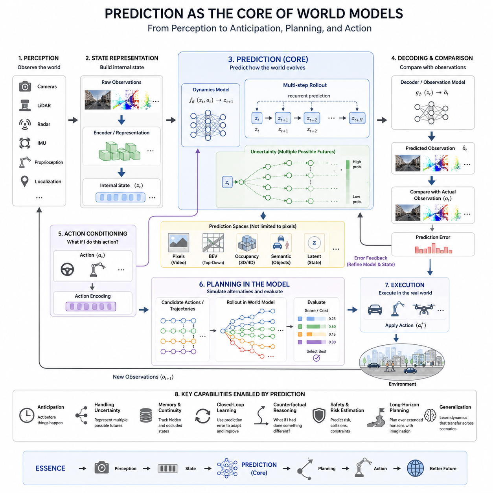{width="7.268055555555556in" height="7.268055555555556in"}

예측(Prediction)은 월드 모델(World Model)을 환경(Environment)에 대한 수동적인 표현(Passive Representation)에서 환경이 어떻게 변화할 수 있는지를 능동적으로 추론하는 모델(Active Model)로 전환하는 핵심 계산 기능(Computational Function)이다. 피지컬 AI(Physical AI) 시스템은 현재 순간에 무엇이 존재하는지를 추정하는 것뿐만 아니라 다음에 어떤 일이 발생할 가능성이 있는지도 예상해야 한다. 따라서 예측(Prediction)은 현재 세계에 대한 인식(Perception)과 가능한 미래 상태(Future States)에 대한 추론(Reasoning)을 연결한다.

월드 모델(World Model)은 환경의 한 상태(State)가 다른 상태로 어떻게 전이(Transition)되는지를 추정하는 내부 메커니즘(Internal Mechanism)으로 이해할 수 있다. 현재의 내부 상태(Internal State)가 주어지면 모델은 학습된 동역학(Learned Dynamics), 물리적 제약(Physical Constraints), 맥락 정보(Contextual Information), 그리고 궁극적으로 에이전트(Agent)의 행동(Action)을 기반으로 미래 상태(Future State)를 예측한다. 이러한 전이 중심 관점(Transition-Oriented View)은 예측형 월드 모델링(Predictive World Modeling)을 정적인 장면 이해(Scene Understanding), 매핑(Mapping), 객체 인식(Object Recognition)과 구별한다.

예측(Prediction)은 피지컬 AI(Physical AI)에서 특히 중요하다. 실제 행동(Action)을 실행하는 데에는 시간이 필요하기 때문이다. 이동 로봇(Mobile Robot)은 장애물이 이미 경로에 진입한 이후에야 회피를 판단해서는 안 되며, 매니퓰레이터(Manipulator) 역시 물체의 현재 자세(Pose)만 고려해서는 안정적으로 제어할 수 없다. 시스템은 관측(Observation), 의사결정(Decision), 물리적 실행(Physical Execution) 사이의 시간 동안 객체, 에이전트, 표면, 힘, 그리고 자신의 몸체가 어떻게 변화할지를 추정해야 한다.

예측 과정(Predictive Process)은 일반적으로 카메라(Camera), 라이다(LiDAR), 레이더(Radar), 관성 측정 장치(IMU), 고유수용성 센서(Proprioceptive Sensors), 위치추정 시스템(Localization Systems) 또는 기타 센싱 모달리티(Sensing Modalities)에서 얻어진 관측(Observations)으로 시작한다. 이러한 관측은 미래의 변화에 관련된 정보를 포함하는 내부 상태 표현(Internal State Representation)으로 변환된다. 이후 예측은 각각의 센서 측정값을 독립적인 사건으로 처리하는 대신 이러한 표현을 기반으로 수행되며, 이를 통해 시간적 관계(Temporal Relationships)가 모델링된 세계의 일부가 된다.

관측 가능한 모든 세부 정보를 동일한 정밀도로 예측할 필요는 없다. 지능적 행동(Intelligent Action)에 가장 유용한 예측은 객체 움직임(Object Motion), 점유 상태(Occupancy), 주행 가능성(Traversability), 충돌 위험(Collision Risk), 접촉(Contact), 에이전트 행동(Agent Behavior), 의미적 상태 전이(Semantic State Transitions)처럼 과업(Task)과 관련된 변화를 설명하는 경우가 많다. 따라서 월드 모델(World Model)은 미래 행동에 거의 기여하지 않는 세부 사항을 억제하면서 예측 가능하고 의사결정에 중요한 구조를 보존하는 표현(Representation)을 학습하는 것이 유리하다.

예측(Prediction)은 또한 방대한 인간 라벨링(Human Annotation)을 요구하지 않고 의미 있는 표현(Meaningful Representation)을 학습하는 메커니즘을 제공한다. 모델이 이전 관측으로부터 누락된 정보나 미래 정보를 추론하도록 학습되면 공간과 시간에 걸쳐 지속되는 규칙성(Regularities)을 발견해야 한다. 시간적 시퀀스(Temporal Sequences)에 반복적으로 노출되면서 객체 영속성(Object Permanence), 움직임 패턴(Motion Patterns), 환경 구조(Environmental Structure), 상호작용 효과(Interaction Effects)와 같이 사람이 직접 명시하기 어려운 잠재적 속성(Latent Properties)을 학습할 수 있다.

예측형 월드 모델(Predictive World Model)이 반드시 미래의 카메라 영상을 생성해야 하는 것은 아니다. 예측은 픽셀 공간(Pixel Space), 기하학적 공간(Geometric Space), 의미 공간(Semantic Space), 점유 공간(Occupancy Space), 구조화된 상태 공간(Structured State Space), 또는 학습된 잠재 표현(Learned Latent Representation)에서 수행될 수 있다. 피지컬 AI(Physical AI)에서는 미래 환경의 모든 시각적 세부 사항을 복원하기보다 추론과 제어에 필요한 정보에 계산 자원을 집중할 수 있다는 점에서 잠재 예측(Latent Prediction)과 구조화된 예측(Structured Prediction)이 특히 유용하다.

예측 지평(Prediction Horizon)은 모델이 무엇을 학습해야 하는지에 큰 영향을 준다. 매우 짧은 지평의 예측(Short-Horizon Prediction)은 주로 국소적 움직임(Local Motion)과 즉각적인 상태 전이(State Transition)를 포착하지만, 장기 지평(Long Horizon)은 누적된 동역학(Accumulated Dynamics), 상호작용(Interactions), 의도(Intentions), 대안적 결과(Alternative Outcomes)에 대한 추론을 요구한다. 예측 지평이 길어질수록 현재 상태의 작은 불확실성이 매우 다른 미래 궤적(Future Trajectories)으로 발전할 수 있기 때문에 일반적으로 불확실성(Uncertainty)도 증가한다.

이러한 불확실성(Uncertainty)은 예측을 항상 하나의 정확한 미래를 생성하는 과정으로 해석해서는 안 된다는 것을 의미한다. 물리적 환경(Physical Environment)에서는 여러 개의 미래가 동시에 가능할 수 있다. 보행자(Pedestrian)는 계속 걷거나 멈추거나 방향을 변경할 수 있으며, 물체는 접촉 후 미끄러지거나 현재 위치에 안정적으로 남을 수도 있다. 따라서 충분히 표현력이 높은 월드 모델(World Model)은 환경 변화가 완전히 결정론적(Deterministic)이라고 가정하기보다 가능한 미래 상태와 그 가능성(Likelihood)을 표현해야 한다.

예측(Prediction)은 행동(Action)을 조건으로 사용할 때 특히 강력해진다. 자율 에이전트(Autonomous Agent)에게 중요한 질문은 단순히 "다음에 무엇이 일어날 것인가?"가 아니라 "내가 이 행동을 수행하면 무엇이 일어날 것인가?"이다. 현재 상태(Current State), 후보 행동(Candidate Action), 그리고 그 결과로 발생하는 미래 상태(Future State)의 관계를 모델링함으로써 월드 모델(World Model)은 에이전트가 실제 물리적 행동을 수행하기 전에 여러 대안적 행동을 비교할 수 있는 내부 예측 시뮬레이터(Internal Predictive Simulator)가 된다.

이러한 능력은 월드 모델링(World Modeling)과 계획(Planning)을 직접 연결한다. 후보 행동(Candidate Actions)이나 궤적(Trajectories)을 예측 모델 내부에서 미래 방향으로 전개(Rollout)하여 가상의 미래 상태(Imagined Future States)를 생성하고, 이를 목표(Goals), 안전 제약(Safety Constraints), 보상(Rewards), 에너지 소비(Energy Consumption), 충돌 확률(Collision Probability) 등의 기준으로 평가할 수 있다. 결과적으로 계획은 여러 대안을 예측하고, 그 결과를 평가하며, 바람직한 미래와 연결된 행동을 선택하는 과정이 된다.

예측(Prediction)은 예측된 결과를 이후의 실제 관측(Observation)과 지속적으로 비교할 수 있기 때문에 폐루프 제어(Closed-Loop Control)도 지원한다. 관측된 환경이 예측된 환경과 다르면 그 차이에서 발생하는 예측 오차(Prediction Error)는 상태 추정(State Estimation), 동역학(Dynamics), 환경 가정(Environmental Assumptions), 센서 해석(Sensor Interpretation)의 부정확성에 대한 정보를 제공한다. 이러한 차이는 적응(Adaptation)을 유도하고 시스템이 내부 표현과 전이 모델(Transition Model)을 지속적으로 개선하도록 도울 수 있다.

로보틱스(Robotics)에서 예측은 외부 환경(External Environment)의 동역학뿐만 아니라 몸체를 가진 에이전트(Embodied Agent) 자체의 동역학도 고려해야 한다. 휠 슬립(Wheel Slip), 액추에이터 지연(Actuator Delay), 페이로드 변화(Payload Variation), 지형 특성(Terrain Properties), 접촉력(Contact Forces), 관절 동역학(Joint Dynamics), 센서 지연(Sensor Latency)은 명령의 결과를 변화시킬 수 있다. 따라서 유용한 피지컬 AI 월드 모델(Physical AI World Model)은 외부 사건뿐 아니라 로봇, 환경, 그리고 이들 사이의 상호작용이 결합되어 변화하는 과정까지 예측해야 한다.

동일한 원리는 다른 자율 또는 지능형 에이전트(Intelligent Agents)가 존재하는 환경으로 자연스럽게 확장된다. 인간(Humans), 차량(Vehicles), 로봇(Robots), 동물(Animals)은 단순한 기계적 외삽(Mechanical Extrapolation)만으로 충분히 설명하기 어려운 행동을 보인다. 이들의 미래 상태는 목표(Goals), 사회적 상호작용(Social Interactions), 관습(Conventions), 그리고 로봇 자체에 대한 반응에 따라 달라질 수 있다. 따라서 공유 환경(Shared Environment)에서 동작하는 예측 모델은 물리적 동역학(Physical Dynamics)과 행동적·맥락적 패턴(Behavioral and Contextual Patterns)을 함께 고려해야 한다.

예측 모델(Predictive Model)은 시간적 메모리(Temporal Memory)의 기반도 제공한다. 현재 관측은 가림(Occlusion), 제한된 센서 범위(Limited Sensor Range), 노이즈(Noise), 부분 관측 가능성(Partial Observability) 때문에 불완전할 수 있다. 이전 관측을 통합하고 숨겨진 상태(Hidden States)가 어떻게 변화하는지를 예측함으로써 월드 모델은 일시적으로 보이지 않는 객체나 환경 속성에 대한 가설을 유지할 수 있다. 따라서 예측은 매 순간 센서가 직접 관측하는 범위를 넘어 세계의 연속성(Continuity)을 유지하는 데 기여한다.

주요 과제 중 하나는 장기 롤아웃(Long Rollout) 과정에서 예측 오차(Prediction Error)가 누적되는 것을 방지하는 것이다. 하나의 예측 상태에서 발생한 작은 오류가 다음 예측의 입력으로 사용되면서 가상의 궤적(Imagined Trajectory)을 실제 환경에서 점차 멀어지게 할 수 있다. 따라서 효과적인 월드 모델(World Model)은 시간적 일관성(Temporal Consistency), 강건한 표현(Robust Representation), 불확실성 추정(Uncertainty Estimation), 관측을 통한 보정(Corrective Observations), 그리고 모델 자체의 예측 오류 결과를 학습 과정에서 경험하게 하는 훈련 전략(Training Strategies)을 필요로 한다.

따라서 예측(Prediction)은 미래 관측과의 수치적 유사성(Numerical Similarity)만으로 평가되어서는 안 되며, 후속 행동(Downstream Behavior)에 얼마나 유용한지도 평가해야 한다. 시각적으로 정확한 미래를 생성하는 모델이라도 충돌 경계(Collision Boundaries)나 객체 움직임(Object Motion)을 잘못 표현한다면 제어(Control)에는 부적합할 수 있다. 반대로 간결한 잠재 예측(Latent Prediction)이라도 내비게이션(Navigation), 조작(Manipulation), 안전성 평가(Safety Assessment), 의사결정(Decision Making)에 필요한 동역학을 보존한다면 매우 높은 가치를 가질 수 있다.

시스템 수준(System Level)에서 예측(Prediction)은 센싱(Sensing)을 예상(Anticipation)으로 전환한다. 인식(Perception)은 현재 환경을 추정하고, 메모리(Memory)는 관련된 과거 정보를 보존하며, 예측은 이러한 내부 상태를 가능한 미래로 확장한다. 이후 계획(Planning)과 제어(Control)는 사건이 발생한 이후에만 반응하는 대신 예측된 미래를 기반으로 동작할 수 있다. 이러한 반응(Reaction)에서 예상(Anticipation)으로의 전환은 월드 모델이 제공하는 핵심 능력 중 하나이다.

피지컬 AI(Physical AI)에서 예측(Prediction)은 궁극적으로 이해(Understanding)와 개입(Intervention)을 연결하는 계산적 다리(Computational Bridge)의 역할을 한다. 몸체를 가진 에이전트(Embodied Agent)는 세계가 무엇인지 지속적으로 추론하고, 세계가 어떻게 변화하고 있는지를 추정하며, 자신의 행동이 그 변화를 어떻게 바꿀지를 예상하고, 현실이 예상과 다를 때 자신의 믿음(Belief)을 수정해야 한다. 월드 모델(World Model)은 예측을 통해 내부 표현이 이러한 지속적인 인식--예측--행동 루프(Perception--Prediction--Action Loop)에 직접 참여할 수 있기 때문에 실질적인 가치를 갖는다.

예측 능력(Predictive Capability)이 향상될수록 내부 모델(Internal Model)은 더욱 정교한 형태의 물리적 추론(Physical Reasoning)을 지원할 수 있다. 단기 상태 예측(Short-Term State Forecasting)은 다단계 시뮬레이션(Multi-Step Simulation), 대안적 미래 탐색(Alternative-Future Exploration), 반사실적 추론(Counterfactual Reasoning), 위험 추정(Risk Estimation), 장기 계획(Long-Horizon Planning)으로 발전할 수 있다. 이러한 의미에서 예측은 월드 모델을 구성하는 여러 요소 중 하나에 불과한 것이 아니라, 모델에 시간적 의미(Temporal Meaning)를 부여하고 상상된 미래(Imagined Futures)를 지능적 행동에 실질적으로 활용할 수 있게 만드는 핵심 메커니즘(Core Mechanism)이다.

## 02.02. Next State Prediction

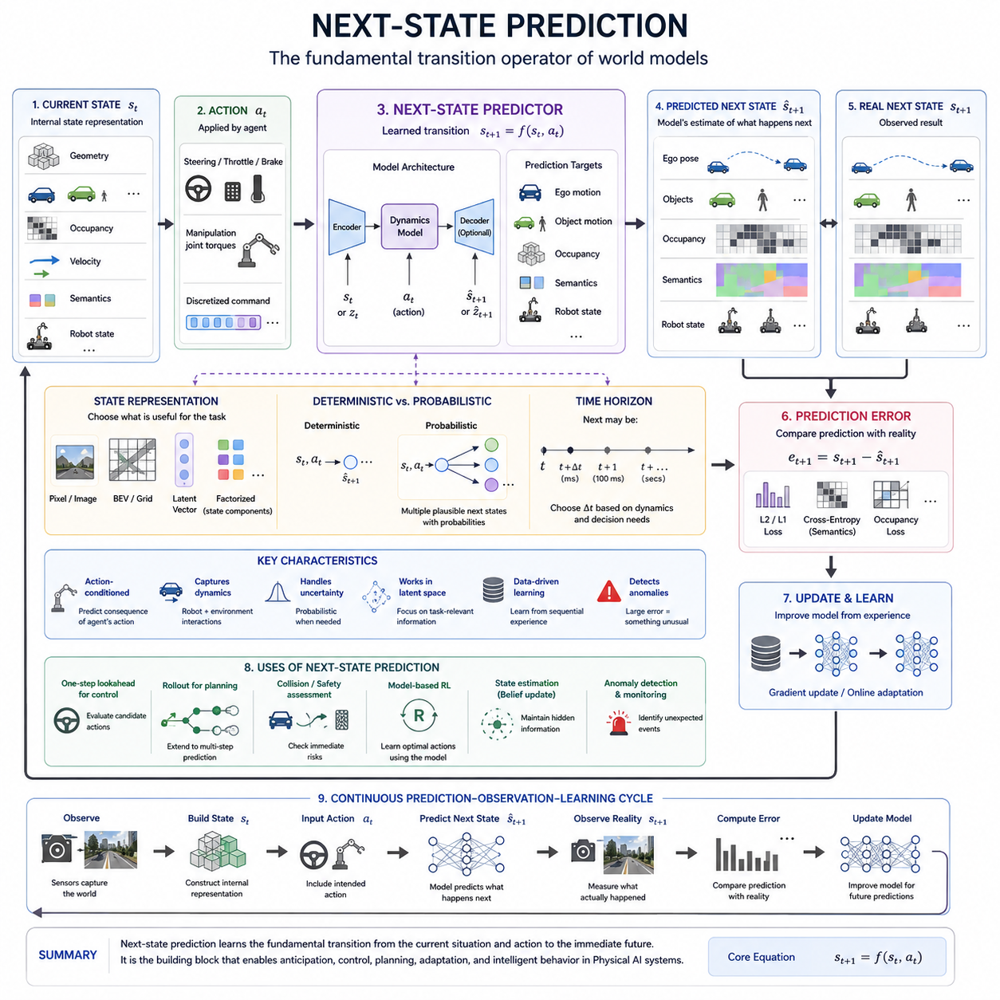{width="7.268055555555556in" height="7.268055555555556in"}

​

​

​

​

​

​

​

​

​

​

​

​

​

​

​

​

​

​

​

​

다음 상태 예측(Next-State Prediction)은 예측형 월드 모델(Predictive World Model)의 가장 기본적인 시간적 연산(Temporal Operation)이다. 현재 상태(Current State)에 대한 추정값이 주어지면 모델은 다음의 의미 있는 시간 단계(Time Step)에 존재할 상태를 추론한다. 겉보기에는 단순하지만, 이러한 과정은 이후 다단계 예측(Multi-Step Forecasting), 상상 롤아웃(Imagined Rollouts), 계획(Planning), 모델 기반 제어(Model-Based Control), 그리고 더욱 정교한 물리적 추론(Physical Reasoning)을 구축하기 위한 기본적인 전이 메커니즘(Transition Mechanism)을 형성한다.

기본적인 관계는 현재 상태 s

에서 다음 상태 s

로의 전이(Transition)로 표현할 수 있다. 체화 시스템(Embodied System)에서 이러한 전이는 일반적으로 상태 자체뿐만 아니라 에이전트(Agent)가 수행한 행동 a

에도 의존한다. 따라서 예측 모델(Predictive Model)은 s

)와 유사한 매핑(Mapping)을 학습하며, 여기에서 함수는 행동과 환경 동역학(Environmental Dynamics)에 따라 상태가 어떻게 변화하는지에 대한 학습된 지식을 나타낸다.

이러한 구성에서 상태(State)는 원시 센서 측정값(Raw Sensor Measurements)에 직접 대응할 필요가 없다. 상태에는 기하학적 구조(Geometric Structure), 객체 속성(Object Properties), 점유 상태(Occupancy), 속도(Velocities), 의미 정보(Semantic Information), 로봇 구성(Robot Configuration), 접촉 조건(Contact Conditions), 또는 학습된 잠재 특징(Learned Latent Features)이 포함될 수 있다. 적절한 상태 표현(State Representation)은 과업(Task)에 따라 달라지며, 내비게이션 시스템(Navigation System)은 자유 공간과 움직임을 강조하는 반면 조작(Manipulation)은 객체 자세, 접촉, 그리퍼 구성, 국소적인 물리적 상호작용에 관한 정보를 필요로 한다.

다음 상태 예측(Next-State Prediction)은 단순한 관측 외삽(Observation Extrapolation)과 다르다. 그 목적이 단순히 다음 센서 프레임(Sensor Frame)의 모습을 재현하는 것이 아니라 의미 있는 상태 전이(State Transition)를 포착하는 것이기 때문이다. 다음 카메라 영상(Camera Image)을 예측하는 것도 유용할 수 있지만, 피지컬 AI(Physical AI) 시스템에서는 행동과 더욱 직접적으로 연결된 정보가 필요한 경우가 많다. 따라서 모델은 미래 점유 상태(Future Occupancy), 객체 움직임(Object Motion), 로봇 자세(Robot Pose), 의미적 변화(Semantic Changes), 잠재 상태(Latent State), 또는 이러한 표현의 조합을 예측할 수 있다.

시간 해상도(Temporal Resolution)는 여기에서 "다음(Next)"이 무엇을 의미하는지를 결정한다. 고주파 제어 모델(High-Frequency Control Model)의 다음 상태는 현재 상태로부터 불과 수 밀리초 후일 수 있지만, 내비게이션 중심 월드 모델(Navigation-Oriented World Model)은 수백 밀리초 또는 수 초 이후를 예측할 수 있다. 선택되는 시간 간격은 시스템 동역학(System Dynamics)과 예측을 사용하는 의사결정에 대응해야 한다. 지나치게 짧은 간격은 전략적 정보를 거의 제공하지 못할 수 있으며, 반대로 긴 간격은 불확실성과 상태 전이의 복잡성을 증가시킨다.

환경의 정적인 부분(Static Components)에 대한 다음 상태 예측은 주로 시간에 걸쳐 정보를 유지하는 역할을 할 수 있다. 벽, 고정된 기반 시설, 안정적인 지형은 대체로 변화하지 않을 것으로 예상된다. 반면 동적인 구성 요소(Dynamic Components)는 움직임과 상호작용에 대한 명시적인 모델링이 필요하다. 차량, 보행자, 매니퓰레이터, 이동 장비, 문, 움직일 수 있는 물체, 그리고 로봇 자체는 연속적인 상태 사이에서 위치, 속도, 방향, 구성 또는 의미적 조건(Semantic Condition)이 변화할 수 있다.

에이전트 자신의 행동(Action)은 특히 중요하다. 피지컬 AI(Physical AI)는 자신이 예측하는 상태 전이에 직접 참여하기 때문이다. 조향(Steering)은 이동 로봇의 미래 자세를 변화시키고, 휠 토크(Wheel Torque)는 속도에 영향을 주며, 매니퓰레이터 명령(Manipulator Commands)은 관절 구성과 접촉 상태를 변화시킨다. 따라서 다음 상태는 부분적으로 에이전트에 의해 발생한다. 행동 조건부 예측(Action-Conditioned Prediction)은 이러한 관계를 표현하고 대안적인 제어 명령(Control Commands)의 결과를 추론하기 위한 기반을 제공한다.

환경 동역학(Environmental Dynamics)은 명령된 행동과 독립적으로도 상태 전이에 영향을 준다. 로봇이 전진 명령을 수행하더라도 휠 슬립(Wheel Slip)으로 실제 이동 거리가 감소할 수 있으며, 물체는 관성(Momentum)에 의해 계속 움직이거나 다른 에이전트가 예상하지 못하게 장면에 진입할 수도 있다. 따라서 유용한 다음 상태 예측기(Next-State Predictor)는 로봇과 관련된 제어 가능한 동역학(Controllable Dynamics)과 주변 세계에서 발생하는 외부 동역학(External Dynamics)을 모두 학습해야 한다.

센서 관측(Sensor Observations)은 실제 물리적 상태(True Physical State)를 완전하게 설명하는 경우가 거의 없다. 가림(Occlusion), 노이즈(Noise), 제한된 시야각(Limited Field of View), 비동기 센싱(Asynchronous Sensing), 모호한 측정값(Ambiguous Measurements)은 부분 관측 가능성(Partial Observability)을 발생시킨다. 따라서 다음 상태 예측은 이전 관측의 정보를 통합하는 추정 내부 상태(Estimated Internal State) 또는 신념 표현(Belief Representation)을 기반으로 수행되는 경우가 많다. 메모리(Memory)는 현재 관측만으로 신뢰성 있게 추론할 수 없는 숨겨진 객체와 동역학에 대한 정보를 유지할 수 있다.

다음 상태 모델(Next-State Model)은 관측 공간(Observation Space)에서 직접 작동할 수도 있지만, 학습된 잠재 공간(Learned Latent Space)은 보다 압축된 대안을 제공한다. 인코더(Encoder)는 관측을 잠재 상태 z

로 변환하고, 동역학 모델(Dynamics Model)은 z

을 예측하며, 선택적인 디코더(Decoder)는 과업과 관련된 출력을 복원한다. 이러한 구조는 행동과 무관할 수 있는 모든 텍스처(Texture), 조명 변화(Illumination Variation), 센서 세부 정보를 재현하는 데 모델 용량을 소비하는 대신 시간적으로 의미 있는 구조에 예측 능력을 집중하도록 한다.

예측 대상(Prediction Target)은 여러 구성 요소로 분해(Factorization)될 수도 있다. 하나의 거대한 상태 벡터(State Vector)를 예측하는 대신 시스템은 미래의 자차 움직임(Ego Motion), 동적 객체 움직임(Dynamic-Object Motion), 점유 상태(Occupancy), 의미 상태(Semantic State), 접촉 조건(Contact Conditions) 및 기타 변수들을 전문화된 예측 헤드(Prediction Heads)를 통해 추정할 수 있다. 이러한 분해는 내부 모델의 학습과 평가를 쉽게 하며 서로 다른 물리량에 각각의 특성에 적합한 표현과 손실 함수(Loss)를 적용할 수 있게 한다.

결정론적 다음 상태 예측(Deterministic Next-State Prediction)은 현재 정보가 본질적으로 하나의 미래 상태를 결정한다고 가정한다. 이러한 근사는 짧은 시간 간격과 강하게 제약된 동역학에서는 효과적일 수 있다. 그러나 실제 환경은 불확실성(Uncertainty)을 포함한다. 센서의 모호성, 관측되지 않은 힘, 확률적 상호작용(Stochastic Interactions), 예측하기 어려운 에이전트는 여러 개의 가능한 다음 상태를 발생시킬 수 있다. 따라서 확률적 모델(Probabilistic Models)은 하나의 결과에 성급하게 고정하는 대신 확률 분포(Distributions) 또는 여러 대안적 가설(Alternative Hypotheses)을 예측할 수 있다.

다음 상태 모델(Next-State Model)을 학습하려면 시간적으로 순서가 있는 경험(Temporally Ordered Experience)이 필요하다. 연속적인 관측은 현재와 미래 상태의 쌍을 제공하며, 로봇 로그(Robot Logs)는 그 사이에 실행된 행동 정보도 추가로 제공할 수 있다. 모델은 이러한 상태 전이에 반복적으로 노출되면서 움직임의 연속성(Motion Continuity), 행동 효과(Action Effects), 상호작용 패턴(Interaction Patterns), 환경 지속성(Environmental Persistence)과 같은 규칙성을 학습한다. 따라서 대규모 로봇, 차량, 시뮬레이션 또는 비디오 시퀀스 데이터는 모든 상태 변수를 사람이 직접 라벨링하지 않아도 예측 학습(Predictive Learning)을 지원할 수 있다.

학습 목적 함수(Training Objective)는 예측되는 표현의 종류에 따라 달라진다. 위치나 속도 같은 연속적인 물리량(Continuous Quantities)에는 회귀 손실(Regression Loss)을 사용할 수 있으며, 범주형 의미 상태(Categorical Semantic States)에는 분류 목적 함수(Classification Objectives)를 적용할 수 있다. 점유 상태 예측에는 공간 손실(Spatial Loss)이 필요할 수 있으며, 잠재 예측(Latent Prediction)은 예측 임베딩(Predicted Embedding)과 목표 임베딩(Target Embedding)을 비교할 수 있다. 실제 월드 모델에서는 여러 목적 함수를 결합하여 기하학적, 동적, 의미적, 표현 수준의 일관성을 동시에 학습할 수 있다.

예측 오차(Prediction Error)는 중요한 학습 신호(Learning Signal)를 제공한다. 모델이 다음 상태를 추정한 이후 실제 후속 관측(Actual Subsequent Observation)이 입력되면 이를 예측 결과와 비교할 수 있다. 두 상태의 차이는 학습된 동역학 또는 내부 표현에서 어떤 부분이 부정확했는지를 나타낸다. 이러한 예측과 보정(Prediction and Correction)을 반복하면 모델을 점진적으로 개선할 수 있으므로 다음 상태 예측은 체화 시스템의 지속적 적응(Continual Adaptation)을 위한 자연스러운 구성 요소가 된다.

정확한 다음 상태 예측(Next-State Prediction)은 이상 탐지(Anomaly Detection)도 지원한다. 실제로 관측된 다음 상태가 모델이 예상한 상태와 크게 다르다면 이러한 차이는 비정상적인 지형, 액추에이터 성능 저하(Actuator Degradation), 예상하지 못한 접촉, 센서 고장(Sensor Failure), 새로운 객체 또는 학습 분포 밖의 행동(Out-of-Distribution Behavior)을 의미할 수 있다. 따라서 예측 오차는 학습 신호뿐만 아니라 시스템이 추가적인 주의를 필요로 하는 상황에 진입했다는 증거로 활용될 수 있다.

제어(Control) 측면에서 모델은 후보 행동(Candidate Action)에 의해 즉시 발생할 상태를 예측함으로써 해당 행동을 평가할 수 있다. 여러 후보 명령(Candidate Commands)을 내부적으로 시험하고 그에 따른 다음 상태를 안전 및 과업 목표(Safety and Task Objectives)에 따라 평가할 수 있다. 이것은 모델 기반 계획(Model-Based Planning)의 가장 작은 유용한 형태를 제공한다. 즉, 하나의 상태 전이를 상상하고 그 결과를 평가한 다음 실제 물리적 실행 이전에 행동을 선택하는 것이다.

하나의 다음 상태 예측기(Next-State Predictor)는 재귀적으로(Recursively) 적용할 수도 있다. s

이 예측되면 이를 s

를 예측하기 위한 입력으로 사용하고, 이러한 과정을 반복하여 점점 더 먼 미래 상태를 생성할 수 있다. 이를 통해 단일 단계 예측(One-Step Prediction)은 다단계 롤아웃(Multi-Step Rollout)으로 확장된다. 그러나 각 상태 전이에서 발생하는 오류가 누적될 수 있으므로 기본적인 다음 상태 모델의 품질과 안정성은 장기 지평 월드 모델링(Long-Horizon World Modeling)에 결정적으로 중요하다.

따라서 피지컬 AI(Physical AI)에서 다음 상태 예측(Next-State Prediction)은 단순한 예측 과제 이상의 의미를 갖는다. 이것은 시간에 걸쳐 상태들을 연결하고 행동을 그 결과와 연결하는 기본적인 학습 전이 연산자(Learned Transition Operator)를 나타낸다. 현재의 물리적 상황 이후에 무엇이 발생하는지를 반복적으로 학습함으로써 시스템은 환경 동역학(Environmental Dynamics)에 대한 내부 근사 모델(Internal Approximation)을 형성하고, 이를 예상(Anticipation), 제어(Control), 계획(Planning), 적응(Adaptation), 그리고 미래의 물리적 상태에 대한 더욱 복잡한 추론에 활용할 수 있다.

가장 단순한 형태에서 이러한 과정은 연속적인 순환 구조(Continuous Cycle)로 이해할 수 있다. 환경을 관측하고, 현재 내부 상태를 구성하며, 의도된 행동(Intended Action)을 반영하고, 다음 상태를 예측한 뒤, 실제로 발생한 결과를 관측하고, 예측 오차를 측정하며, 필요할 경우 모델을 갱신한다. 이러한 순환이 방대한 체화 경험(Embodied Experience)에 걸쳐 반복되면 피지컬 AI 시스템은 현재 세계에 무엇이 존재하는지만 인식하는 것을 넘어 세계가 어떻게 변화하는지를 학습할 수 있게 된다.

## 02.03. Multi Step Future Prediction

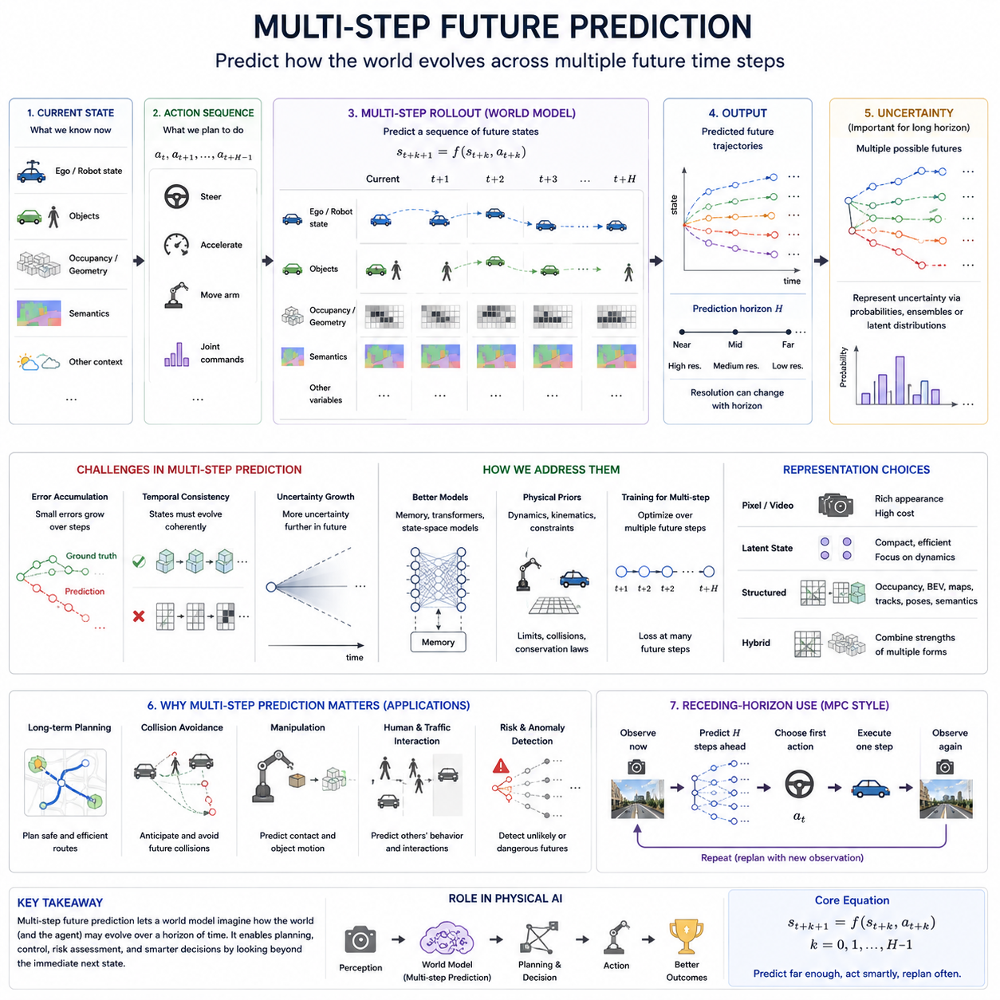{width="7.268055555555556in" height="7.268055555555556in"}

​

​

​

​

​

​

​

​

​

​

​

다단계 미래 예측(Multi-Step Future Prediction)은 다음 상태 예측(Next-State Prediction)을 하나의 전이(Transition)에서 연속적인 예상 상태(Sequence of Anticipated States)로 확장한다. 월드 모델(World Model)은 현재 순간 직후에 무엇이 발생할지만 추정하는 것이 아니라 여러 미래 시간 단계(Future Time Steps)에 걸쳐 환경이 어떻게 변화할지를 예측한다. 이러한 능력을 통해 피지컬 AI(Physical AI) 시스템은 즉각적인 반응을 넘어 움직임, 상호작용, 행동이 가져올 장기적인 결과를 고려할 수 있다.

개념적으로 다단계 예측(Multi-Step Prediction)은 s

와 같은 시퀀스를 생성하며, 여기서 H는 예측 지평(Prediction Horizon)을 나타낸다. 각각의 미래 상태(Future State)는 점점 더 먼 미래 시점의 세계에 대한 추정치를 나타낸다. 응용 분야에 따라 이러한 상태는 로봇 구성(Robot Configuration), 객체 움직임(Object Motion), 점유 상태(Occupancy), 기하학(Geometry), 의미적 조건(Semantic Conditions), 잠재 특징(Latent Features), 또는 여러 물리적·맥락적 변수의 조합을 표현할 수 있다.

일반적인 접근 방법 중 하나는 재귀적 또는 자기회귀적 롤아웃(Recursive or Autoregressive Rollout)이다. 모델은 먼저 현재 상태 s

로부터 s

을 예측하고, 이후 예측된 상태를 이용해 s

를 추정하며, 원하는 예측 지평에 도달할 때까지 이 과정을 반복한다. 이러한 접근은 동일한 학습된 전이 메커니즘(Learned Transition Mechanism)을 반복적으로 사용하므로 각각의 미래 시간 단계마다 별도의 예측 모델을 구성하지 않고도 다음 상태 예측기(Next-State Predictor)를 이용해 긴 궤적(Long Trajectory)을 생성할 수 있다.

행동(Action)이 미래에 영향을 주는 경우 롤아웃(Rollout)은 행동 시퀀스(Action Sequence)도 포함해야 한다. 이때 상태 전이는 s

)로 표현할 수 있다. 조향 명령(Steering Commands), 속도(Velocities), 관절 명령(Joint Commands), 또는 기타 제어 입력(Control Inputs)의 후보 시퀀스를 월드 모델을 통해 미래 방향으로 전개할 수 있다. 그 결과 생성되는 예측 궤적(Predicted Trajectory)은 이러한 행동이 실제로 실행될 경우 에이전트와 환경이 어떻게 변화할지를 나타낸다.

재귀적 예측(Recursive Prediction)은 예측된 상태가 점차 관측된 상태를 대신하여 입력으로 사용되기 때문에 중요한 문제를 발생시킨다. s

에서 발생한 작은 오류도 s

의 추정에 영향을 미칠 수 있으며, 이후의 오류는 롤아웃 전체에서 누적될 수 있다. 따라서 기본적인 단일 단계 예측기(One-Step Predictor)가 짧은 상태 전이에서는 정확하더라도 장기 지평 예측(Long-Horizon Prediction)은 물리적으로 타당한 미래로부터 점차 벗어날 수 있다.

오차 누적(Error Accumulation)은 시간적 일관성(Temporal Consistency)을 다단계 월드 모델링(Multi-Step World Modeling)의 핵심 요구사항으로 만든다. 예측된 위치(Position), 속도(Velocity), 객체 정체성(Object Identity), 점유 상태(Occupancy), 기하학(Geometry), 의미 상태(Semantic State)는 미래 시간 단계 사이에서 임의로 변화하지 않고 일관성 있게 변화해야 한다. 모델은 개별적으로 정확한 상태뿐 아니라 시간에 따른 변화가 물리적 환경의 동역학과 구조적 제약에 부합하는 궤적(Trajectory)을 학습해야 한다.

재귀적 예측의 대안으로 직접 다중 지평 예측(Direct Multi-Horizon Prediction)을 사용할 수 있다. 예측된 상태를 반복적으로 모델에 다시 입력하는 대신 공유된 현재 표현(Shared Current Representation)으로부터 여러 미래 지평을 직접 예측한다. 예를 들어 0.5초, 1초, 2초, 5초 후의 세계를 각각 추정할 수 있다. 이러한 방식은 재귀적 오류 전파(Recursive Error Propagation)를 감소시킬 수 있지만 독립적으로 예측된 여러 미래 지평 사이의 일관성을 유지해야 하는 새로운 문제가 발생한다.

다단계 예측(Multi-Step Prediction)은 전체 예측 지평에 걸쳐 동일한 시간 해상도(Temporal Resolution)를 사용할 필요가 없다. 즉각적인 제어에는 정확한 시간 정보가 필요하기 때문에 가까운 미래 상태는 높은 빈도(High Frequency)로 예측하고, 먼 미래 상태는 더 거친 시간 간격(Coarser Intervals)을 사용할 수 있다. 이러한 계층적 시간 해상도(Hierarchical Temporal Resolution)는 계산 비용을 줄일 수 있으며 예측이 먼 미래로 확장될수록 정확한 세부 사항의 불확실성이 증가한다는 특성도 반영한다.

적절한 예측 지평(Prediction Horizon)은 물리적 과업(Physical Task)에 크게 의존한다. 충돌 회피(Collision Avoidance)는 향후 몇 초에 대한 상세한 예측이 필요할 수 있으며, 자율 내비게이션(Autonomous Navigation)은 교통, 주행 가능성(Traversability), 경로 변화(Route Evolution)에 대한 더 긴 예측을 활용할 수 있다. 조작(Manipulation)은 접촉 동역학(Contact Dynamics)에 대한 정밀한 단기 예측과 일련의 상호작용이 최종적으로 원하는 객체 구성(Object Configuration)을 만들어낼 수 있는지에 대한 장기 예측을 함께 요구할 수 있다.

예측 지평이 길어질수록 불확실성(Uncertainty)은 더욱 중요해진다. 가까운 미래는 비교적 예측 가능할 수 있지만 몇 초 이후에는 여러 결과가 동시에 가능해질 수 있다. 다른 에이전트는 의도(Intentions)를 변경할 수 있고, 객체는 예상하지 못한 방식으로 상호작용할 수 있으며, 작은 물리적 교란(Physical Disturbances)이 이후의 상태를 변화시킬 수 있다. 따라서 다단계 모델(Multi-Step Model)은 먼 미래의 예측에 근거 없는 확신을 부여하기보다 증가하는 불확실성을 표현해야 한다.

이러한 불확실성은 확률적 궤적(Probabilistic Trajectories), 복수의 미래 가설(Multiple Future Hypotheses), 확률적 잠재 변수(Stochastic Latent Variables), 앙상블(Ensembles), 또는 미래 상태에 대한 확률 분포(Distributions)를 통해 표현할 수 있다. 하나의 궤적만 예측하는 대신 모델은 서로 다른 확률을 가진 여러 가능한 미래를 유지할 수 있다. 이러한 다중 모드 예측(Multimodal Prediction)은 인간 행동, 교통 상호작용, 조작 결과 또는 부분적으로 관측된 환경 동역학이 질적으로 서로 다른 미래를 발생시킬 수 있는 경우 특히 중요하다.

장기 롤아웃(Long Rollout)에 사용되는 표현(Representation)도 중요하다. 픽셀 수준 예측(Pixel-Level Prediction)은 각각의 미래 프레임에 방대한 시각적 세부 정보가 포함되기 때문에 계산 비용이 커질 수 있다. 잠재 상태 예측(Latent-State Prediction)은 관측을 동역학과 의사결정에 관련된 정보를 포함하는 표현으로 압축한다. 이후 모델은 이러한 잠재 상태를 효율적으로 미래 방향으로 전개하고 평가, 계획 또는 시각화에 필요한 물리량만 선택적으로 디코딩(Decoding)할 수 있다.

구조화된 표현(Structured Representation)은 또 다른 실용적인 방법을 제공한다. 미래의 조감도(Bird's-Eye View), 점유 필드(Occupancy Fields), 객체 트랙(Object Tracks), 로봇 자세(Robot Poses), 의미 지도(Semantic Maps), 접촉 상태(Contact States) 등을 직접 예측할 수 있다. 이러한 표현은 물리적으로 중요한 변수에 집중하며 미래의 센서 관측 전체를 완전히 복원하지 않고도 계획기(Planner)가 충돌 위험, 자유 공간, 객체 상호작용 또는 목표 달성 여부를 평가할 수 있게 한다.

메모리(Memory)는 부분 관측 가능성(Partial Observability) 상황에서 다단계 예측을 수행할 때 특히 중요하다. 현재 프레임만으로는 객체의 속도, 가려진 장애물의 존재, 다른 에이전트의 최근 행동을 파악하지 못할 수 있다. 과거 관측(Historical Observations)은 이러한 숨겨진 변수에 관한 정보를 제공한다. 순환 상태(Recurrent State), 시간적 트랜스포머(Temporal Transformer), 상태 공간 모델(State-Space Model) 또는 기타 메모리 메커니즘은 미래 롤아웃을 생성하기 전에 과거의 증거를 통합할 수 있다.

다단계 예측(Multi-Step Prediction)은 여러 개체(Entity) 사이의 상호작용도 모델링할 수 있다. 하나의 객체가 앞으로 이동할 궤적은 주변 객체, 인간, 차량, 로봇 또는 환경 경계(Environmental Boundaries)에 의해 영향을 받을 수 있다. 각 개체를 독립적으로 예측하면 이러한 의존 관계를 놓칠 수 있다. 반면 상호작용 인식 모델(Interaction-Aware Model)은 개체 간 관계를 표현하여 미래 상태가 충돌 회피, 협력(Cooperation), 접촉(Contact), 사회적 행동(Social Behavior), 기타 결합된 동역학(Coupled Dynamics)을 반영하도록 한다.

물리적 제약(Physical Constraints)은 장기 롤아웃이 비현실적으로 변화하는 것을 방지하는 데 도움을 줄 수 있다. 운동학적 한계(Kinematic Limits), 가속도 제한(Acceleration Bounds), 충돌 제약(Collision Constraints), 보존 관계(Conservation Relationships), 접촉 규칙(Contact Rules), 알려진 로봇 동역학(Known Robot Dynamics)은 가능한 미래의 범위를 제한한다. 따라서 학습 기반 예측(Learned Prediction)과 물리적 사전 지식(Physical Priors)을 결합하면 특히 학습 데이터에서 충분히 나타나지 않은 상황으로 외삽(Extrapolation)해야 할 때 안정성을 향상시킬 수 있다.

다단계 예측을 위한 학습(Training)은 모델이 단순히 독립된 단일 단계 전이(Isolated One-Step Transitions)만 경험하도록 해서는 안 된다. 완벽하게 관측된 상태만 입력으로 사용하여 학습된 모델은 실제 롤아웃에서 자신의 불완전한 예측값이 입력될 때 성능이 저하될 수 있다. 다단계 목적 함수(Multi-Step Objectives)는 여러 예측 상태를 동시에 평가하여 학습된 동역학이 즉각적인 정확도만 최적화하는 대신 전체 예측 지평에 걸쳐 안정적이고 유용한 상태를 유지하도록 유도할 수 있다.

학습 과정에서는 서로 다른 미래 시간 단계에 서로 다른 중요도를 부여할 수도 있다. 가까운 미래의 예측은 관측 가능성이 높고 제어와 직접적으로 관련되기 때문에 높은 가중치(Weight)를 적용할 수 있으며, 먼 미래의 예측에는 불확실성 인식 목적 함수(Uncertainty-Aware Objectives) 또는 표현 수준 목적 함수(Representation-Level Objectives)를 사용할 수 있다. 따라서 학습 설계(Training Design)는 예측 지평의 모든 지점에 동일한 정확도를 요구하기보다 모델이 실제로 어떻게 사용될 것인지를 반영해야 한다.

계획(Planning)의 관점에서 다단계 예측은 사실상 내부 시뮬레이션(Internal Simulation) 기능을 제공한다. 계획기는 여러 후보 행동 시퀀스(Candidate Action Sequences)를 제안하고 각각을 월드 모델 내부에서 미래 방향으로 롤아웃한 뒤 생성된 미래를 비교할 수 있다. 후보 궤적은 목표까지의 진행 정도, 충돌 확률(Collision Probability), 안정성(Stability), 에너지 사용량(Energy Use), 승차감 또는 동작의 부드러움(Comfort), 조작 성공 가능성(Manipulation Success), 기타 과업별 목적에 따라 평가할 수 있다.

모델 예측 제어(Model Predictive Control)는 이러한 능력을 자연스럽게 활용한다. 시스템은 여러 단계의 미래를 예측하고, 예측된 궤적을 기반으로 유망한 행동을 선택한 다음, 해당 계획의 즉각적인 일부만 실행하고 환경을 다시 관측한다. 이후 갱신된 정보를 이용하여 예측을 다시 계산한다. 이러한 반복적 재계획(Replanning)은 예상적 추론(Anticipatory Reasoning)의 장점을 유지하면서 장기 예측 오류가 실제 행동에 미치는 영향을 제한한다.

따라서 다단계 미래 예측(Multi-Step Future Prediction)은 월드 모델(World Model)의 역할을 국소적인 동역학(Local Dynamics)을 추정하는 수준에서 장기간에 걸친 결과를 상상하는 수준으로 확장한다. 이를 통해 체화 에이전트(Embodied Agent)는 단순히 다음에 무엇이 일어날지를 묻는 것을 넘어 특정한 행동, 상호작용, 환경 변화가 발생했을 때 상황이 시간에 따라 어떻게 전개될지를 추론할 수 있다. 이러한 상상된 궤적(Imagined Trajectories)의 품질은 계획과 장기 의사결정(Long-Horizon Decision Making)의 품질에 직접적인 영향을 미친다.

피지컬 AI(Physical AI)의 궁극적인 목표는 먼 미래의 모든 세부 사항을 완벽하게 예측하는 것이 아니다. 대신 모델은 유용한 미래와 위험하거나 비효율적인 미래를 구별할 수 있을 정도로 충분한 공간적(Spatial), 시간적(Temporal), 의미적(Semantic), 물리적 구조(Physical Structure)를 유지해야 한다. 다단계 미래 예측은 즉각적인 상태 전이에서 내부 시뮬레이션으로 이어지는 시간적 다리(Temporal Bridge)를 제공하며, 이를 통해 인식(Perception)과 학습된 동역학(Learned Dynamics)이 예상(Anticipation), 계획(Planning), 제어(Control), 그리고 더욱 정교한 물리적 추론(Physical Reasoning)을 지원할 수 있게 한다.

## 02.04. Deterministic and Probabilistic Prediction

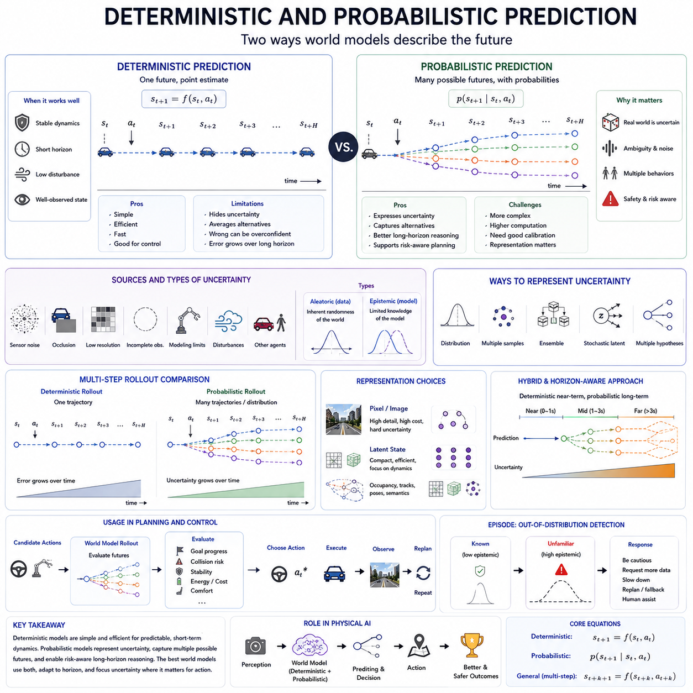{width="7.268055555555556in" height="7.268055555555556in"}

​

​

​

​

​

​

​

​

​

결정론적 예측(Deterministic Prediction)과 확률적 예측(Probabilistic Prediction)은 월드 모델(World Model)이 미래를 표현하는 두 가지 기본적인 방식이다. 결정론적 모델(Deterministic Model)은 현재 상태와 행동으로부터 특정한 하나의 미래 상태를 예측하는 반면, 확률적 모델(Probabilistic Model)은 가능한 미래 상태들의 분포(Distribution)를 표현한다. 이러한 구분은 실제 환경이 예측 가능한 물리적 동역학과 현재의 관측만으로는 항상 해소할 수 없는 불확실성(Uncertainty)을 모두 포함한다는 점에서 피지컬 AI(Physical AI)에 매우 중요하다.

결정론적 예측(Deterministic Prediction)에서 상태 전이(Transition)는 일반적으로 s

)로 표현된다. 동일한 현재 상태 s

와 행동 a

가 주어지면 모델은 동일한 다음 상태 s

을 예측한다. 이러한 구성은 개념적으로 단순하고 계산 효율성(Computational Efficiency)이 높기 때문에 동역학이 안정적이고 관측 정보가 충분하며 불확실성이 의사결정에 미치는 영향이 제한적인 상황에서 유용하다.

많은 단기 물리적 전이(Short-Term Physical Transitions)는 결정론적 모델(Deterministic Model)을 이용하여 효과적으로 근사할 수 있다. 로봇 관절 움직임(Robot Joint Motion), 차량 운동학(Vehicle Kinematics), 액추에이터 응답(Actuator Response), 또는 충분히 짧은 시간 동안의 객체 변위(Object Displacement)는 비교적 제한된 동역학을 따를 수 있다. 시스템 상태가 정확하게 추정되고 외부 교란이 작다면 하나의 예측 궤적(Predicted Trajectory)만으로도 즉각적인 제어, 충돌 검사(Collision Checking), 국소 계획(Local Planning)에 유용한 정보를 제공할 수 있다.

그러나 결정론적 예측은 본질적으로 불확실성(Uncertainty)을 하나의 결과로 압축한다. 현재 관측과 일치하는 여러 미래가 존재할 경우 모델은 실제로는 존재하지 않는 평균적인 예측(Average Prediction)을 생성할 수 있다. 예를 들어 보행자가 왼쪽 또는 오른쪽으로 이동할 가능성이 있다면 두 대안의 중간 방향으로 이동한다고 표현하는 것이 반드시 적절하지는 않다. 이러한 한계는 예측 지평(Prediction Horizon)이 길어지고 행동의 모호성(Behavioral Ambiguity)이 누적될수록 더욱 중요해진다.

확률적 예측(Probabilistic Prediction)은 미래 상태를 조건부 확률 분포(Conditional Probability Distribution)로 모델링함으로써 이러한 문제를 해결하며, 개념적으로 p(s

)로 표현할 수 있다. 모델은 단순히 어떤 상태가 다음에 발생할 것인지를 예측하는 것이 아니라 어떤 상태들이 발생할 수 있으며 각각이 얼마나 가능성이 높은지를 추정한다. 따라서 불확실성을 직접 표현하여 후속 계획과 제어가 가능성이 높은 미래와 발생 가능성은 낮지만 잠재적으로 위험한 미래를 구별할 수 있도록 한다.

불확실성(Uncertainty)은 다양한 원인에서 발생한다. 센서 노이즈(Sensor Noise), 가림(Occlusion), 제한된 해상도(Limited Resolution), 불완전한 관측(Incomplete Observations), 모델링되지 않은 물리적 효과(Unmodeled Physical Effects), 환경 교란(Environmental Disturbances), 다른 에이전트의 행동 등이 모두 미래 상태를 불확실하게 만들 수 있다. 모델이 정확하더라도 이용 가능한 정보 자체가 하나의 결과를 결정하기에 부족할 수 있으며, 확률적 예측은 이러한 모호성을 하나의 추정값 속에 숨기지 않고 세계 자체의 특성으로 다룬다.

불확실성은 우연적 불확실성(Aleatoric Uncertainty)과 인식론적 불확실성(Epistemic Uncertainty)으로 구분할 수 있다. 우연적 불확실성은 관측과 환경 과정 자체에 존재하는 본질적인 변동성이나 모호성을 나타내며, 인식론적 불확실성은 모델이 보유한 지식의 한계에서 발생한다. 특히 학습 경험에 충분히 포함되지 않았던 새로운 지형, 객체, 상호작용 또는 운용 조건을 시스템이 만났을 때 인식론적 불확실성이 크게 증가할 수 있다.

확률적 모델(Probabilistic Model)은 여러 방법으로 불확실성을 표현할 수 있다. 확률 분포의 매개변수(Distribution Parameters)를 예측하거나, 여러 샘플(Samples)을 생성하거나, 모델 앙상블(Model Ensembles)을 유지하거나, 확률적 잠재 변수(Stochastic Latent Variables)를 사용하거나, 여러 미래 가설(Future Hypotheses)을 명시적으로 구성할 수 있다. 적절한 표현 방법은 상태 공간(State Space)과 과업에 따라 달라지며, 연속적인 로봇 움직임에는 매개변수화된 분포(Parametric Distribution)를 사용할 수 있는 반면 복잡한 인간이나 교통 행동에는 서로 구별되는 여러 궤적 가설(Trajectory Hypotheses)이 필요할 수 있다.

다중 모드성(Multimodality)은 많은 물리적 미래를 하나의 가우시안 형태 불확실성 영역(Gaussian-Like Uncertainty Region)만으로 적절하게 표현할 수 없다는 점에서 특히 중요하다. 다른 차량은 좌회전하거나 직진하거나 정지할 수 있으며, 인간은 로봇에 접근하거나 반대 방향으로 이동할 수 있다. 이러한 대안들은 질적으로 서로 다른 행동 모드(Behavior Modes)를 나타낸다. 따라서 확률적 월드 모델(Probabilistic World Model)은 이들을 인위적인 중간 미래로 평균화하지 않고 서로 다른 대안으로 유지해야 한다.

결정론적 예측과 확률적 예측의 차이는 여러 시간 단계(Multiple Time Steps)에 걸쳐 더욱 분명해진다. 결정론적 롤아웃(Deterministic Rollout)은 일반적으로 하나의 미래 궤적을 따라가지만, 확률적 롤아웃(Probabilistic Rollout)은 분기되는 여러 궤적 또는 궤적 분포로 확장될 수 있다. 각각의 상태 전이는 추가적인 불확실성을 발생시키므로 가능한 미래의 공간은 점차 넓어진다. 따라서 장기 지평 예측(Long-Horizon Prediction)은 의사결정에 중요한 대안들을 보존하면서 이러한 복잡성을 제어하는 메커니즘을 필요로 한다.

모든 불확실성에 동일한 계산 자원(Computational Attention)을 투입할 필요는 없다. 피지컬 AI(Physical AI)의 목표는 일반적으로 가능한 모든 미래의 세부 사항을 모델링하는 것이 아니라 행동에 영향을 줄 수 있는 불확실성을 보존하는 것이다. 충돌 경계(Collision Boundary) 주변의 모호성, 지형 지지력(Terrain Support)에 대한 불확실성, 인간의 여러 가능한 이동 궤적은 매우 중요할 수 있다. 반면 행동과 무관한 시각적 텍스처(Visual Texture)의 작은 불확실성은 내비게이션이나 제어에서 중요성이 낮을 수 있다.

따라서 결정론적 접근(Deterministic Approach)과 확률적 접근(Probabilistic Approach)은 서로 배타적이지 않다. 실제적인 월드 모델은 예측 가능한 구성 요소를 결정론적으로 처리하면서 불확실한 구성 요소는 확률적으로 모델링할 수 있다. 로봇 운동학(Robot Kinematics)은 비교적 좁은 예측 분포를 가질 수 있는 반면 주변 인간의 움직임에는 여러 가설이 필요할 수 있다. 이러한 하이브리드 예측(Hybrid Prediction)은 불확실성이 계획과 안전에 실질적인 영향을 미치는 부분에 계산 자원을 집중할 수 있도록 한다.

선택되는 예측 방식은 예측 지평(Prediction Horizon)에 따라서도 달라질 수 있다. 즉각적인 동역학(Immediate Dynamics)은 불확실성이 거의 누적되지 않았기 때문에 거의 결정론적으로 예측할 수 있지만, 먼 미래는 점점 넓어지는 확률 분포를 필요로 한다. 따라서 월드 모델은 정밀한 단기 예측(Short-Term Prediction)에서 확률적인 장기 예측(Long-Term Forecasting)으로 점진적으로 전환할 수 있다. 이는 현재 관측으로부터 멀어질수록 일반적으로 예측 신뢰도가 감소하는 물리적 환경의 자연스러운 특성을 반영한다.

상태 표현(State Representation)은 불확실성 모델링에 큰 영향을 미친다. 픽셀 공간 확률 예측(Pixel-Space Probabilistic Prediction)은 수백만 개의 시각적 변수에 걸쳐 불확실성이 존재하기 때문에 매우 복잡해질 수 있다. 점유 상태(Occupancy), 객체 궤적(Object Trajectories), 의미 상태(Semantic States), 로봇 구성(Robot Configurations)과 같은 구조화된 표현(Structured Representations)은 불확실성을 보다 쉽게 해석할 수 있도록 한다. 잠재 표현(Latent Representation)은 가능한 모든 센서 세부 사항을 복원하지 않고 불확실한 미래 동역학을 압축하여 표현하는 또 다른 방법을 제공한다.

확률적 예측기(Probabilistic Predictor)를 학습하려면 단순히 점별 예측 오차(Pointwise Prediction Error)를 최소화하는 것이 아니라 정확한 확률 분포를 보상하는 목적 함수(Objective)가 필요하다. 우도 기반 목적 함수(Likelihood-Based Objectives), 분포적 손실(Distributional Losses), 잠재 변수 목적 함수(Latent-Variable Objectives), 샘플 기반 기준(Sample-Based Criteria) 등을 이용하여 모델이 실제로 가능한 결과에 적절한 확률을 할당하도록 할 수 있다. 성공적인 모델은 잘못된 예측에 지나치게 높은 확신을 갖는 것과 의사결정에 거의 도움이 되지 않을 정도로 지나치게 넓은 불확실성을 표현하는 것을 모두 피해야 한다.

따라서 보정(Calibration)은 확률적 월드 모델(Probabilistic World Model)의 중요한 특성이다. 모델이 높은 신뢰도(Confidence)를 보고한다면 유사한 조건에서 해당 예측은 실제로 높은 확률로 정확해야 한다. 불확실성이 높은 경우에는 예측 분포가 현실에서 관측되는 결과의 범위를 적절하게 반영해야 한다. 잘못 보정된 모델(Poorly Calibrated Model)은 계획기가 부정확한 신뢰도 추정치를 신뢰할 수 있는 근거로 해석하여 물리적 행동을 선택할 수 있기 때문에 위험할 수 있다.

불확실성 추정(Uncertainty Estimation)은 분포 외 탐지(Out-of-Distribution Detection)와 밀접하게 연결된다. 로봇이 익숙하지 않은 환경이나 상호작용을 경험하면 학습된 모델이 신뢰성 있게 예측할 충분한 경험을 갖지 못했기 때문에 인식론적 불확실성(Epistemic Uncertainty)이 증가할 수 있다. 이러한 신호는 시스템이 근거 없는 확신을 가지고 계속 행동하는 대신 보다 보수적인 행동, 추가 센싱(Additional Sensing), 감속, 폴백 제어(Fallback Control), 인간 개입(Human Intervention), 또는 재계획(Replanning)을 수행하도록 유도할 수 있다.

계획(Planning)은 확률적 예측을 위험 인식 의사결정(Risk-Aware Decision Making)으로 전환한다. 계획기는 후보 행동을 가장 가능성이 높은 결과만을 기준으로 평가하는 대신 가능한 결과들의 분포를 고려할 수 있다. 기대되는 진행 성능(Expected Progress)이 매우 좋은 행동이라도 낮은 확률의 분기에서 심각한 충돌이나 불안정성이 발생한다면 거부될 수 있다. 따라서 확률(Probability), 비용(Cost), 불확실성(Uncertainty), 결과의 심각도(Consequence Severity)를 함께 고려할 수 있다.

안전 중요 피지컬 AI(Safety-Critical Physical AI)에서는 이러한 구분이 특히 중요하다. 자율주행 차량(Autonomous Vehicles), 산업용 로봇(Industrial Robots), 의료 로봇(Medical Robots), 인간 주변에서 작동하는 로봇은 가장 가능성이 높은 미래만이 유일하게 중요한 미래라고 가정할 수 없다. 발생 가능성이 낮은 사건이라도 비용이나 피해가 매우 클 수 있다. 확률적 월드 모델은 계획기와 런타임 보증 메커니즘(Runtime Assurance Mechanisms)이 안전 여유(Margins), 신뢰도, 위험을 명시적으로 추론할 수 있는 정보를 제공한다.

그럼에도 결정론적 모델(Deterministic Model)은 여전히 중요하다. 확률적 예측은 추가적인 계산 비용(Computational Cost)과 모델링 복잡성(Modeling Complexity)을 발생시키기 때문이다. 동역학이 충분히 잘 알려진 고속 제어 루프(Fast Control Loop)에서는 결정론적 모델만으로도 충분할 수 있으며 훨씬 높은 계산 효율성을 제공할 수 있다. 따라서 이론적으로 표현력이 높다는 이유만으로 모든 영역에 확률적 모델링을 적용하기보다는 과업의 불확실성 구조(Uncertainty Structure)에 적합한 아키텍처를 선택해야 한다.

성숙한 피지컬 AI 월드 모델(Physical AI World Model)은 두 가지 관점을 동적으로 결합할 수 있다. 관측이 명확하고 동역학이 익숙한 상황에서는 예측을 좁은 범위의 결과에 집중할 수 있다. 반대로 센싱이 모호해지고 상호작용이 복잡해지거나 환경이 익숙한 조건에서 벗어나면 예측된 미래를 여러 가설로 확장할 수 있다. 이 경우 예측은 무엇을 예측할 것인지뿐만 아니라 얼마나 많은 불확실성을 표현할 것인지에서도 적응적(Adaptive)이 된다.

궁극적으로 결정론적 예측(Deterministic Prediction)은 "모델이 어떤 미래를 예상하는가?"라는 질문에 답한다. 확률적 예측(Probabilistic Prediction)은 이를 "어떤 미래들이 가능하며 각각을 어느 정도 신뢰해야 하는가?"라는 질문으로 확장한다. 물리적 지능(Physical Intelligence)은 두 능력을 모두 필요로 한다. 신뢰성 있는 행동은 규칙적인 물리적 변화를 효율적으로 예측하는 동시에 미래가 모호하거나 불확실하거나 하나의 확신 있는 예측을 하기에는 충분히 이해되지 않은 상황을 인식할 수 있어야 하기 때문이다.

## 02.05. Autoregressive Prediction

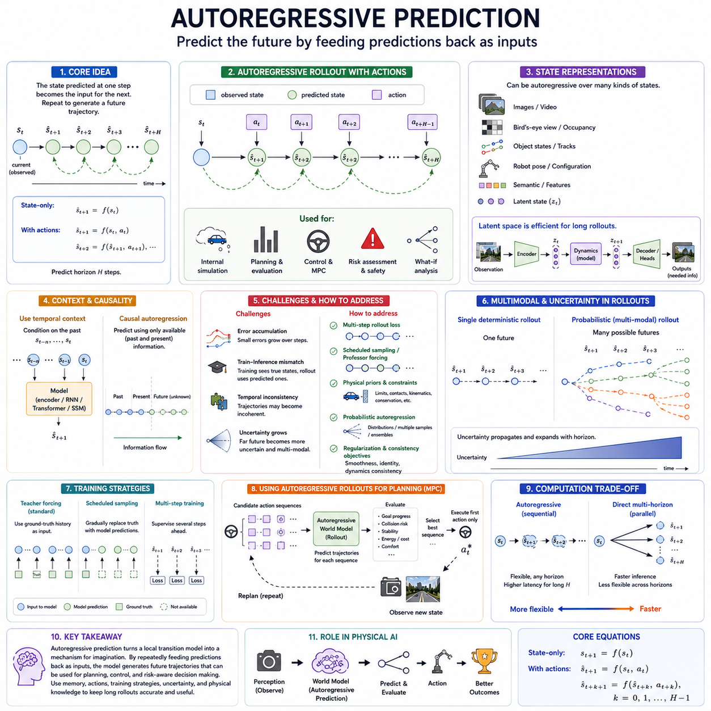{width="7.268055555555556in" height="7.268055555555556in"}

​

​

​

\^

​

\^

\^

​

​

​

\^

​

\^

​

​

​

​

​

​

​

​

​

​

자기회귀적 예측(Autoregressive Prediction)은 월드 모델(World Model)을 단일 단계 예측(One-Step Prediction)에서 연속적인 미래 상태 시퀀스(Sequence of Future States)로 확장하는 기본적인 메커니즘이다. 핵심 개념은 단순하다. 한 시간 단계에서 예측된 출력이 다음 시간 단계를 예측하기 위한 입력의 일부가 된다. 동일한 예측 과정을 반복적으로 적용함으로써 모델은 시간에 따라 변화하는 상태 궤적(State Trajectory)을 생성하고 세계가 앞으로 어떻게 전개될지를 시뮬레이션할 수 있다.

상태 기반 월드 모델(State-Based World Model)에서 이 과정은 s

)로 표현할 수 있으며, 이후 s

)로 이어지고 예측 지평(Prediction Horizon) H까지 재귀적으로 계속된다. 기호

는 미래로 갈수록 예측이 직접 관측된 상태가 아니라 이전 단계에서 예측된 상태에 점점 더 의존한다는 것을 강조한다. 이러한 재귀적 의존성(Recursive Dependency)이 자기회귀적 미래 예측(Autoregressive Future Prediction)의 핵심적인 특징이다.

피지컬 AI(Physical AI)에서는 일반적으로 행동(Action)이 상태 전이에 포함되어야 한다. 따라서 모델은

)의 형태를 취할 수 있으며, 이후

)로 이어진다. 후보 행동 시퀀스(Candidate Action Sequence)가 주어지면 월드 모델은 반복적으로 미래 방향으로 롤아웃(Rollout)하여 해당 행동 시퀀스와 관련된 물리적 결과를 추정할 수 있다. 이를 통해 학습된 전이 모델(Learned Transition Model)은 계획과 제어를 위한 내부 시뮬레이터(Internal Simulator)로 전환된다.

자기회귀적 예측(Autoregressive Prediction)은 다양한 형태의 상태 표현(State Representation)에 적용할 수 있다. 예측되는 변수는 이미지 프레임(Image Frame), 조감도 표현(Bird's-Eye-View Representation), 점유 상태(Occupancy State), 객체 구성(Object Configuration), 의미 특징(Semantic Feature), 로봇 자세(Robot Pose), 또는 학습된 잠재 벡터(Learned Latent Vector)가 될 수 있다. 핵심적인 요구사항은 예측된 표현이 이후 상태를 다시 예측하기 위한 맥락(Context)으로 사용될 수 있을 정도로 충분한 정보를 포함하는 것이다.

잠재 자기회귀적 예측(Latent Autoregressive Prediction)은 고차원 센서 관측(High-Dimensional Sensor Observations)을 반복적으로 생성하는 데 많은 계산 비용이 필요하기 때문에 월드 모델에 특히 유용하다. 인코더(Encoder)는 관측을 압축된 잠재 상태 z

로 변환하고, 이후 동역학 모델(Dynamics Model)은 z

,...를 예측한다. 계획은 잠재 궤적(Latent Trajectory)에서 직접 수행할 수 있으며, 디코더(Decoder)나 과업 헤드(Task Head)는 제어, 평가 또는 해석에 필요한 정보만 추출할 수 있다.

시간적 맥락(Temporal Context)은 바로 직전의 상태보다 더 긴 범위로 확장될 수 있다. 모델은 s

만을 이용해 미래를 예측하는 대신 s

와 같은 상태 시퀀스를 조건으로 사용할 수 있다. 순환 신경망(Recurrent Network), 시간적 합성곱(Temporal Convolution), 트랜스포머(Transformer), 상태 공간 모델(State-Space Model)은 이러한 과거 정보를 요약할 수 있다. 더 긴 맥락은 단일 관측만으로 신뢰성 있게 결정하기 어려운 속도, 가속도, 행동 추세, 숨겨진 상태 등의 시간적 특성을 추론하는 데 도움을 준다.

자기회귀적 모델(Autoregressive Model)은 인과적 시간 구조(Causal Temporal Structure)와 자연스럽게 호환된다. t+k 시점의 예측은 알 수 없는 미래의 관측이 아니라 현재까지 이용 가능한 정보와 이전에 예측된 상태에만 의존한다. 이러한 인과적 순서(Causal Ordering)는 로봇이 어떤 행동을 실행할지 결정하는 시점에 미래 센서 측정값을 이용할 수 없는 온라인 피지컬 AI(Online Physical AI) 시스템에 자기회귀적 모델링을 적합하게 만든다.

자기회귀적 접근법(Autoregressive Approach)의 주요 장점 중 하나는 아키텍처 재사용(Architectural Reuse)이다. 하나의 상태 전이를 예측하도록 학습된 모델을 반복적으로 적용하여 서로 다른 예측 지평에 대한 미래를 생성할 수 있다. 동일한 동역학 함수(Dynamics Function)가 단기 제어(Short-Term Control), 여러 단계의 궤적 평가(Trajectory Evaluation), 장기 상상 롤아웃(Long Imagined Rollout)을 지원할 수 있다. 이를 통해 다음 상태 예측과 다단계 미래 추론(Multi-Step Future Reasoning)을 하나의 통합된 메커니즘으로 연결할 수 있다.

가장 중요한 약점은 오차 누적(Error Accumulation)이다. 첫 번째 예측에서는 모델이 실제로 관측되었거나 정확하게 추정된 현재 상태를 입력으로 받는다. 그러나 이후 단계에서는 자신의 불완전한 예측 결과를 입력으로 사용한다. 따라서 위치, 속도, 점유 상태, 잠재 표현에서 발생한 작은 오류가 이후 예측에 영향을 미칠 수 있다. 많은 재귀적 전이가 반복되면 예측 궤적이 물리적으로 정확한 변화 과정에서 크게 벗어날 수 있다.

이 문제는 학습 조건(Training Conditions)과 추론 조건(Inference Conditions)의 차이와 관련된다. 학습 과정에서 모델은 각각의 다음 상태 전이를 학습할 때 실제 과거 상태를 입력으로 받을 수 있으며, 이러한 전략은 일반적으로 교사 강요(Teacher Forcing)와 관련된다. 그러나 자율 롤아웃(Autonomous Rollout)에서는 실제 미래 상태를 사용할 수 없으므로 모델이 자신의 예측을 조건으로 사용해야 한다. 이러한 분포 불일치(Distribution Mismatch)로 인해 장기 자기회귀적 롤아웃은 단일 단계 검증 성능(One-Step Validation Performance)이 보여주는 것보다 훨씬 불안정해질 수 있다.

학습 전략(Training Strategy)은 모델을 불완전하거나 스스로 생성한 상태에 노출함으로써 이러한 불일치를 줄일 수 있다. 다단계 롤아웃 손실(Multi-Step Rollout Loss)은 바로 다음 상태만 최적화하는 대신 여러 단계 미래의 예측을 평가할 수 있다. 다른 접근법에서는 학습 과정에서 실제 정답 입력(Ground-Truth Input)을 모델이 생성한 예측으로 점진적으로 대체할 수 있다. 목적은 실제 재귀적 추론 과정에서 발생할 수 있는 종류의 오류에 동역학 모델이 강건하도록 만드는 것이다.

시간적 일관성(Temporal Consistency)도 마찬가지로 중요하다. 성공적인 자기회귀적 롤아웃은 각각의 상태가 개별적으로 그럴듯하게 보이는 것만으로 충분하지 않으며, 전체 시퀀스가 동일한 세계의 일관된 변화 과정을 표현해야 한다. 객체는 정체성(Object Identity)을 유지해야 하고, 궤적은 필요한 경우 부드럽게 변화해야 하며, 로봇 움직임은 운동학적 한계(Kinematic Limits)를 준수하고, 점유 상태나 의미 구조는 상호작용 및 물리적 동역학과 일관되게 변화해야 한다.

물리적 사전 지식(Physical Priors)은 자기회귀적 예측의 안정성을 향상시킬 수 있다. 알려진 운동학적 관계(Kinematic Relationships), 액추에이터 제약(Actuator Constraints), 충돌 규칙(Collision Rules), 접촉 조건(Contact Conditions), 보존 원리(Conservation Principles), 또는 근사적인 해석적 동역학(Analytical Dynamics)을 이용하여 비현실적인 상태 전이를 제한할 수 있다. 따라서 하이브리드 모델(Hybrid Model)은 학습된 잔차 또는 환경 동역학과 알려진 물리적 구조를 결합하여 신경망 예측기의 부담을 줄이고 장기 롤아웃이 타당한 상태 공간 영역을 유지하도록 할 수 있다.

자기회귀적 예측이 계속될수록 불확실성(Uncertainty)은 점점 더 중요해진다. 각각의 예측 상태가 다음 상태에 영향을 주기 때문에 불확실성 역시 매 상태 전이 이후 사라지는 것이 아니라 롤아웃 전체를 따라 전파되어야 한다. 확률적 자기회귀 모델(Probabilistic Autoregressive Model)은 미래 상태에 대한 확률 분포를 표현하거나 여러 개의 샘플 궤적(Sampled Trajectories)을 생성하여 예측이 관측된 증거에서 멀어질수록 불확실성이 자연스럽게 증가하도록 할 수 있다.

미래가 다중 모드(Multimodal)인 경우 자기회귀적 모델은 서로 다른 가능성을 하나의 평균 궤적(Averaged Trajectory)으로 붕괴시키지 않아야 한다. 서로 다른 샘플이나 잠재 가설(Latent Hypotheses)을 통해 보행자가 멈추거나 계속 이동하는 경우, 차량이 회전하거나 직진하는 경우, 물체가 접촉 후 안정적으로 유지되거나 미끄러지는 경우 등의 대안적 미래를 표현할 수 있다. 이후 각각의 가설은 독립적으로 내부 일관성을 유지하는 미래로 자기회귀적으로 전개될 수 있다.

자기회귀적 예측은 트랜스포머 기반 시퀀스 모델링(Transformer-Based Sequence Modeling)과 밀접한 관련이 있다. 트랜스포머는 상태, 관측, 행동 또는 멀티모달 정보(Multimodal Information)를 시간적 토큰(Temporal Tokens)으로 표현하고 인과적 어텐션(Causal Attention)을 이용하여 후속 토큰을 예측할 수 있다. 따라서 시퀀스에서 다음 요소를 예측하는 일반적인 원리를 물리적 상태와 행동을 표현하는 시퀀스로 확장할 수 있지만, 사용되는 표현은 물리적 동역학과 관련된 정보를 보존해야 한다.

로보틱스(Robotics)에서 자기회귀적 롤아웃은 후보 행동 시퀀스(Candidate Action Sequences)와 결합될 때 특히 유용하다. 계획기(Planner)는 여러 제어 시퀀스를 제안하고 그에 따른 상태 궤적을 예측한 뒤 목표 진행도(Goal Progress), 충돌 위험(Collision Risk), 안정성(Stability), 에너지 소비(Energy Consumption) 또는 기타 기준에 따라 평가할 수 있다. 모델은 특정 행동들이 시간에 따라 실행될 경우 어떤 일이 발생할 수 있는지에 관한 연속적인 조건부 질문에 답하는 역할을 한다.

모델 예측 제어(Model Predictive Control)는 자기회귀적 드리프트(Autoregressive Drift)의 영향을 제한할 수 있다. 긴 예측 궤적 전체를 신뢰하고 전체 행동 시퀀스를 한 번에 실행하는 대신 제어기는 여러 미래 단계를 예측하고 계획을 선택한 다음 첫 번째 행동 또는 짧은 구간만 실행한 후 세계를 다시 관측한다. 이후 갱신된 실제 상태에서 자기회귀적 롤아웃을 다시 시작하여 새로운 센서 증거에 예측을 반복적으로 고정(Anchoring)한다.

자기회귀적 추론(Autoregressive Inference)의 계산 비용도 고려해야 한다. 미래 단계가 순차적으로 생성되기 때문에 일반적으로 s

의 예측은 s

가 생성될 때까지 기다려야 한다. 따라서 긴 예측 지평에서는 특히 내부 표현이나 동역학 네트워크가 큰 경우 지연 시간(Latency)이 증가할 수 있다. 병렬 예측(Parallel Prediction) 또는 직접 다중 지평 예측(Direct Multi-Horizon Prediction)은 이러한 순차적 의존성을 줄일 수 있으며, 이는 재귀적 유연성(Recursive Flexibility)과 추론 속도(Inference Speed) 사이의 중요한 아키텍처적 절충 관계(Architectural Tradeoff)를 형성한다.

이러한 한계에도 불구하고 자기회귀적 예측(Autoregressive Prediction)은 물리적 과정 자체가 순차적으로 변화한다는 점에서 예측형 월드 모델(Predictive World Model)의 자연스러운 기반이 된다. 현재 조건은 이후의 조건에 영향을 미치고, 행동은 이러한 상태 전이를 변화시키며, 새롭게 생성된 상태는 이후 변화의 출발점이 된다. 자기회귀적 모델링은 현재의 표현을 점점 더 먼 미래의 표현으로 반복적으로 변환함으로써 이러한 시간적 구조(Temporal Structure)를 반영한다.

피지컬 AI(Physical AI)에서 자기회귀적 예측의 중요성은 국소적인 상태 전이 모델(Local Transition Model)을 상상(Imagination)을 위한 메커니즘으로 전환한다는 데 있다. 로봇은 실제 물리적 행동을 실행하기 전에 반복적인 예측을 통해 어떤 일이 발생할 수 있는지를 탐색할 수 있다. 메모리(Memory), 행동 조건화(Action Conditioning), 불확실성 추정(Uncertainty Estimation), 물리적 제약(Physical Constraints), 지속적인 재계획(Continual Replanning)과 결합된 자기회귀적 예측은 다음 상태 학습(Next-State Learning)에서 궤적 예측(Trajectory Forecasting), 내부 시뮬레이션(Internal Simulation), 장기 의사결정(Long-Horizon Decision Making)으로 이어지는 실용적인 연결 고리를 제공한다.

## 02.06. Parallel and Multi Horizon Prediction

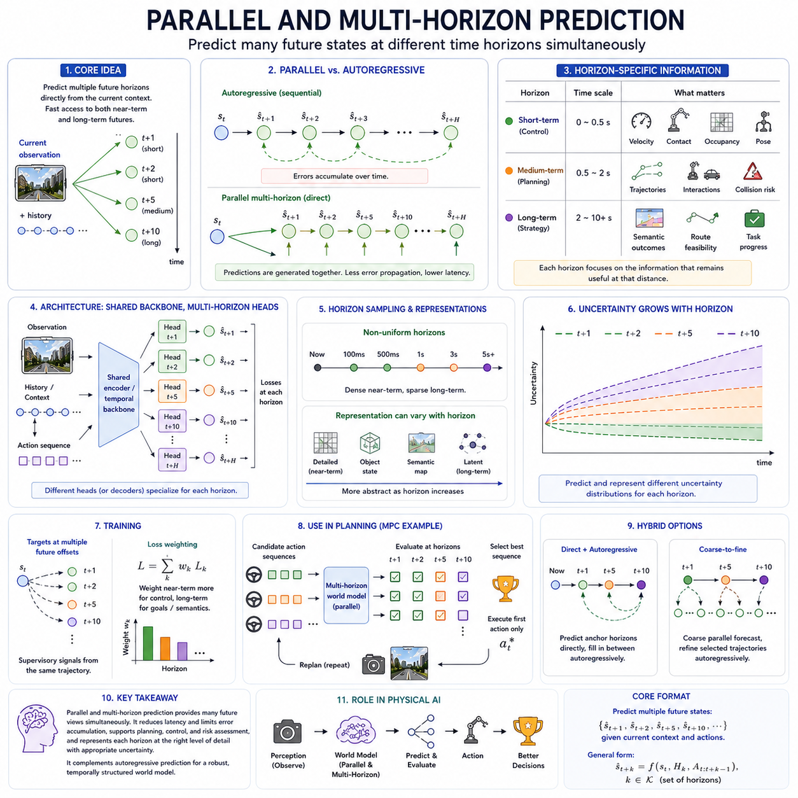{width="7.268055555555556in" height="7.268055555555556in"}

​

​

​

​

\^

​

\^

​

병렬 및 다중 지평 예측(Parallel and Multi-Horizon Prediction)은 미래 상태를 반드시 하나씩 순차적으로 생성하는 방식에 대한 대안을 제공한다. 하나의 시간 단계에 대한 예측이 완료될 때까지 기다린 후 다음 상태를 추정하는 대신, 월드 모델(World Model)은 현재의 공유 표현(Shared Representation)으로부터 여러 미래 지평(Future Horizons)을 직접 예측할 수 있다. 이러한 아키텍처는 즉각적인 미래와 장기적인 미래 정보를 모두 빠르게 확보해야 하는 피지컬 AI(Physical AI) 시스템에서 특히 유용하다.

다중 지평 예측기(Multi-Horizon Predictor)는 각각의 중간 예측을 반드시 재귀적으로 사용하지 않고 현재 맥락(Current Context)으로부터 s

과 같은 상태를 추정한다. 보다 일반적으로 모델은 현재 상태(Current State), 과거 정보(History), 행동(Actions)으로부터 여러 미래 목표(Future Targets)로의 매핑을 학습한다. 각각의 출력은 서로 다른 시간적 지평(Temporal Horizon)에 대응하며, 미래의 해당 거리에서 의미 있게 유지되는 정보에 특화될 수 있다.

이러한 방식은 자기회귀적 예측(Autoregressive Prediction)과 근본적으로 다르다. 자기회귀적 롤아웃(Autoregressive Rollout)에서는

이

를 예측하기 위한 입력이 되면서 미래 상태 사이에 순차적 의존성(Sequential Dependency)이 형성된다. 반면 병렬 예측(Parallel Prediction)에서는 여러 미래 상태를 동시에 생성할 수 있다. 따라서 먼 미래 지평에 대한 예측이 이전 단계의 예측에서 발생한 모든 수치적 오류를 반드시 이어받는 것은 아니다.

재귀적 오류 전파(Recursive Error Propagation)를 감소시키는 것은 직접 다중 지평 예측(Direct Multi-Horizon Prediction)의 주요 목적 중 하나이다. 자기회귀적 모델은 자신의 예측 결과를 동역학 모델(Dynamics Model)에 반복적으로 다시 입력하면서 작은 오류를 누적시킬 수 있다. 반면 직접 예측기(Direct Predictor)는 실제 관측(Actual Observations)에 고정된 표현으로부터 먼 미래 상태를 직접 추정할 수 있다. 이것이 예측 오차 자체를 제거하는 것은 아니지만 예측 지평에 따라 오류가 발생하고 전파되는 방식을 변화시킨다.

병렬 예측(Parallel Prediction)은 추론 지연 시간(Inference Latency)도 감소시킬 수 있다. 순차적인 자기회귀적 모델은 먼 미래 상태에 도달하기 위해 모델을 반복적으로 평가해야 하지만, 병렬 아키텍처는 한 번의 순전파 계산(Forward Computation) 또는 동시에 평가되는 여러 예측 헤드(Prediction Heads)를 통해 여러 미래 지평을 생성할 수 있다. 이러한 특성은 엄격한 계산 시간 제약 아래 동작하는 실시간 로봇(Real-Time Robots), 자율주행 차량(Autonomous Vehicles), 기타 피지컬 AI 플랫폼에 매우 유용하다.

서로 다른 미래 지평에는 자연스럽게 서로 다른 종류의 유용한 정보가 포함된다. 매우 짧은 미래 예측은 제어를 위해 정밀한 속도(Velocity), 자세(Pose), 접촉(Contact), 점유 상태(Occupancy) 추정이 필요할 수 있다. 중기 예측(Medium-Term Prediction)은 궤적(Trajectories), 상호작용 패턴(Interaction Patterns), 충돌 위험(Collision Risk)을 강조할 수 있다. 장기 예측(Long-Term Prediction)은 정확한 기하학적 세부 정보보다 의미적 결과(Semantic Outcomes), 경로 실행 가능성(Route Feasibility), 과업 진행(Task Progress), 광범위한 환경 변화에 더 집중할 수 있다.

따라서 월드 모델(World Model)은 지평별 예측 헤드(Horizon-Specific Prediction Heads)를 사용할 수 있다. 공유 인코더(Shared Encoder) 또는 시간적 백본(Temporal Backbone)이 관측된 환경에 대한 공통 표현을 구성하고, 개별 헤드가 서로 다른 미래 시간 간격을 추정한다. 이러한 헤드는 학습된 표현 대부분을 공유하면서도 각각의 시간 지평에 필요한 출력, 손실 함수(Losses), 불확실성 모델(Uncertainty Models), 공간 해상도(Spatial Resolution)에 맞게 특화될 수 있다.

다중 지평 예측(Multi-Horizon Prediction)이 반드시 균일한 시간 간격을 사용해야 하는 것은 아니다. 시스템은 모든 고정 간격을 예측하는 대신 100밀리초, 500밀리초, 1초, 3초, 5초 이후와 같이 서로 다른 시점을 예측할 수 있다. 정밀한 제어가 필요한 현재 가까운 영역에서는 조밀한 예측(Dense Prediction)을 수행하고, 불확실성이 커지고 정확한 시간 해상도의 유용성이 낮아지는 먼 미래에서는 희소한 예측(Sparse Prediction)을 수행할 수 있다.

이러한 방식은 자연스럽게 계층적 시간 예측(Hierarchical Temporal Prediction)으로 이어진다. 세밀한 시간 해상도(Fine Temporal Resolution)는 즉각적인 물리적 동역학을 표현하고, 점차 거칠어지는 미래 지평은 장기적인 변화를 포착할 수 있다. 이러한 계층 구조는 계산 요구량을 감소시키고 신뢰성 있게 예측할 수 없는 먼 미래의 세부 사항에 모델이 과도한 용량을 소비하는 것을 방지할 수 있다. 따라서 모델의 시간적 구조는 물리적 동역학과 의사결정 요구사항을 동시에 반영할 수 있다.

에이전트가 미래 상태에 영향을 주는 경우 행동 조건화(Action Conditioning)는 여전히 필수적이다. 다중 지평 모델은 후보 행동 시퀀스(Candidate Action Sequence)를 입력받아 여러 미래 시점에서 그 결과를 동시에 추정할 수 있다. 예를 들어 이동 로봇(Mobile Robot)은 제안된 속도 프로파일(Velocity Profile)에 따라 서로 다른 여러 시간 간격 이후에 자신이 어디에 위치할지를 평가할 수 있다. 매니퓰레이터(Manipulator) 역시 계획된 명령 시퀀스가 만들어내는 중간 및 최종 객체 구성(Object Configurations)을 추정할 수 있다.

병렬 예측(Parallel Prediction)은 많은 후보 행동을 빠르게 평가해야 할 때 특히 유용하다. 계획기(Planner)가 여러 궤적을 고려한다면 각각의 후보에 대해 긴 자기회귀적 롤아웃을 기다리는 것은 계산 비용이 매우 클 수 있다. 다중 지평 예측기는 중요한 미래 체크포인트(Future Checkpoints)를 빠르게 추정하여 안전하지 않거나 비효율적인 후보를 먼저 제거하고, 가장 유망한 대안에 대해서만 더욱 상세한 시뮬레이션을 적용할 수 있도록 한다.

상태 표현(State Representation) 역시 미래 지평에 따라 달라질 수 있다. 가까운 미래의 예측은 상세한 기하학(Geometry), 국소 점유 상태(Local Occupancy), 속도, 로봇 구성(Robot Configuration)을 유지하는 반면, 장기 출력은 더욱 추상적인 잠재 표현(Latent Representation)이나 의미적 표현(Semantic Representation)을 사용할 수 있다. 모든 미래 지평에서 세계를 동일한 수준의 세부 정보로 표현해야 할 필요는 없으며, 시간적 거리가 증가함에 따라 유용한 표현도 점차 추상화될 수 있다.

조감도(Bird's-Eye View)와 점유 표현(Occupancy Representation)은 내비게이션 및 자율 이동(Autonomous Mobility)의 다중 지평 예측에 특히 적합하다. 모델은 서로 다른 미래 시간 오프셋(Time Offsets)의 점유 필드(Occupancy Fields)를 동시에 추정하여 자유 공간(Free Space)과 동적 장애물(Dynamic Obstacles)이 어떻게 변화할지를 표현할 수 있다. 이를 통해 계획기는 현재 장애물이 존재하는 위치뿐 아니라 로봇이 접근할 때 어떤 영역이 점유될 가능성이 있는지도 추론할 수 있다.

객체 중심 다중 지평 예측(Object-Centric Multi-Horizon Prediction)은 추적되는 개체(Entity)의 미래 위치, 속도, 방향 또는 행동 모드(Behavioral Modes)를 추정할 수 있다. 각각의 객체 궤적을 한 지점씩 재귀적으로 확장하는 대신 모델은 여러 미래 웨이포인트(Future Waypoints)를 직접 예측할 수 있다. 상호작용 인식 아키텍처(Interaction-Aware Architecture)는 이러한 미래 상태를 생성할 때 인간, 차량, 로봇, 환경 구조 사이의 관계도 추가적으로 고려할 수 있다.

불확실성(Uncertainty)은 일반적으로 시간적 지평이 증가할수록 커져야 한다. 100밀리초 이후의 예측은 비교적 좁은 범위에 집중될 수 있지만, 수 초 이후의 예측에는 여러 가능한 결과가 존재할 수 있다. 다중 지평 모델은 각각의 시간 지평에 대해 서로 다른 불확실성 분포(Uncertainty Distribution)를 명시적으로 추정하여 시스템이 정밀한 즉각적 예측과 더 넓고 불확실한 장기 가능성을 구별할 수 있도록 한다.

독립적으로 예측된 미래 지평 사이의 관계는 중요한 일관성 문제(Consistency Problem)를 발생시킨다. 모델이 1초 후와 2초 후의 미래 상태를 각각 별도로 예측하더라도 두 출력은 물리적으로 일관된 변화 과정을 설명해야 한다. 1초 후 전진한다고 예측된 객체가 타당한 상태 전이 없이 2초 후 전혀 호환되지 않는 위치에 나타나서는 안 된다. 따라서 병렬 예측에는 지평 간 시간적 일관성(Cross-Horizon Temporal Consistency)을 유지하도록 하는 메커니즘이 필요하다.

일관성(Consistency)은 공유 표현(Shared Representations), 궤적 수준 손실(Trajectory-Level Losses), 물리적 제약(Physical Constraints), 보간 목적 함수(Interpolation Objectives), 또는 예측된 미래 지평을 연결하는 보조 전이 모델(Auxiliary Transition Models)을 통해 강화할 수 있다. 목표는 각각의 미래 시점을 서로 독립적인 예측 문제로 취급하지 않으면서 병렬 예측의 계산적 장점을 얻는 것이다. 성공적인 다중 지평 모델은 여러 미래 체크포인트를 하나의 타당한 시간적 변화 과정의 일부로 해석할 수 있도록 생성해야 한다.

학습(Training)에는 여러 미래 시간 오프셋에 대한 지도 신호(Supervision) 또는 예측 목표(Predictive Targets)가 필요하다. 시퀀스 데이터셋(Sequential Dataset)은 동일한 궤적에서 이후에 발생하는 관측을 현재 상태와 정렬할 수 있기 때문에 이러한 목표를 자연스럽게 제공한다. 각각의 시간 지평에 대해 독립적으로 손실을 계산한 후 결합할 수도 있고, 미래 예측 전체를 하나의 집합으로 평가하는 공동 목적 함수(Joint Objectives)를 사용할 수도 있다.

미래 지평에 따른 손실 가중치(Loss Weighting)는 중요한 설계 요소이다. 정확한 제어가 주요 목표라면 단기 예측 오류에 더 높은 가중치를 부여할 수 있으며, 장기 예측에는 의미적 정확성(Semantic Correctness), 불확실성 또는 과업 결과(Task Outcomes)를 강조하는 목적 함수를 사용할 수 있다. 예측 가능성과 실제 운용상의 중요성이 시간적 거리에 따라 크게 달라지므로 모든 미래 지평에 동일한 가중치를 적용하는 것이 항상 바람직한 것은 아니다.

병렬 예측(Parallel Prediction)과 자기회귀적 예측(Autoregressive Prediction)을 결합할 수도 있다. 모델은 여러 기준 미래 지평(Anchor Horizons)을 직접 예측하고 그 사이의 상태를 자기회귀적 전이로 생성하거나, 먼저 거친 병렬 예측(Coarse Parallel Forecast)을 생성한 뒤 선택된 궤적을 재귀적으로 정교화할 수 있다. 이러한 하이브리드 아키텍처(Hybrid Architecture)는 하나의 예측 전략만 선택하는 대신 추론 속도, 시간 해상도, 일관성, 유연성 사이의 균형을 맞출 수 있다.

모델 예측 제어(Model Predictive Control)에서 다중 지평 출력은 제어 지평(Control Horizon) 전체에 걸친 후보 행동의 결과를 빠르게 제공한다. 제어기는 즉각적인 안전성(Immediate Safety), 중간 단계의 궤적 품질(Intermediate Trajectory Quality), 장기적인 목표 진행(Long-Term Goal Progress)을 동시에 확인할 수 있다. 선택된 행동의 짧은 구간을 실행한 후 새로운 관측을 확보하면 갱신된 상태로부터 전체 미래 지평을 다시 예측할 수 있다.

따라서 다중 지평 예측(Multi-Horizon Prediction)의 핵심적인 장점은 단순한 병렬 계산(Parallel Computation)에만 있는 것이 아니다. 월드 모델이 시간적 규모(Temporal Scale)에 따라 미래 추론을 구성할 수 있다는 데 더 큰 의미가 있다. 즉각적인 물리적 상태 전이, 중기적인 상호작용, 장기적인 결과를 각각의 예측 가능성과 중요도에 적합한 해상도로 표현함으로써 모든 미래 단계를 동일하게 취급하는 방식보다 풍부한 시간적 구조(Temporal Structure)를 제공할 수 있다.

피지컬 AI(Physical AI)에서 병렬 및 다중 지평 예측(Parallel and Multi-Horizon Prediction)은 빠른 반응형 제어(Reactive Control)와 장기적인 예상(Long-Horizon Anticipation)을 연결하는 실용적인 다리 역할을 한다. 월드 모델이 여러 미래의 모습을 동시에 생성함으로써 긴 순차적 롤아웃에 전적으로 의존하지 않고도 충돌 회피(Collision Avoidance), 궤적 계획(Trajectory Planning), 조작(Manipulation), 위험 평가(Risk Assessment), 전략적 의사결정(Strategic Decision Making)을 지원할 수 있다. 그 결과 시스템은 바로 다음에 무엇이 발생하는지뿐만 아니라 이후에 무엇이 중요해질 수 있는지도 함께 추론할 수 있는 시간적으로 구조화된 예측 시스템(Temporally Structured Predictive System)으로 발전한다.

## 02.07. State Feature and Semantic Prediction

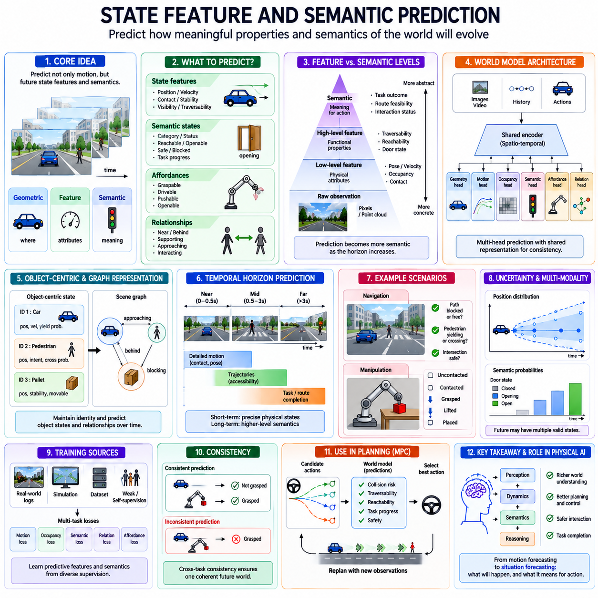{width="7.268055555555556in" height="7.268055555555556in"}

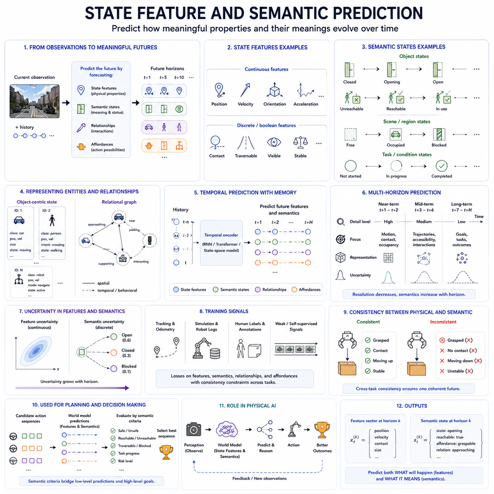{width="7.268055555555556in" height="7.268055555555556in"}

​

​

​

​

상태 특징 및 의미 예측(State Feature and Semantic Prediction)은 원시 관측(Raw Observations)이나 기하학적 움직임(Geometric Motion)의 예측을 넘어 월드 모델링(World Modeling)의 범위를 확장한다. 모델은 단순히 객체가 어디로 이동할지 또는 다음 센서 프레임에 무엇이 나타날지만 예측하는 것이 아니라, 세계의 의미 있는 속성들이 어떻게 변화할지를 추정한다. 이러한 속성에는 객체 상태(Object State), 움직임 속성(Motion Attributes), 행동 가능성(Affordances), 의미 범주(Semantic Categories), 관계(Relationships), 상호작용 상태(Interaction Status), 과업 관련 조건(Task-Relevant Conditions) 등이 포함될 수 있다.

상태 특징(State Feature)은 미래 행동을 예측하는 데 유용한 현재 세계의 특정 측면을 설명하는 압축된 변수 또는 표현(Representation)이다. 예를 들면 위치(Position), 방향(Orientation), 속도(Velocity), 가속도(Acceleration), 객체 정체성(Object Identity), 크기(Size), 접촉 상태(Contact State), 주행 가능성(Traversability), 가시성(Visibility), 안정성(Stability) 등이 있다. 이러한 특징이 시간에 따라 어떻게 변화하는지를 예측함으로써 월드 모델은 원시 센서 관측에 포함된 모든 세부 사항을 재구성하지 않고도 물리적 변화를 표현할 수 있다.

의미 예측(Semantic Prediction)은 장면(Scene)의 의미 또는 기능적 해석(Functional Interpretation)이 어떻게 변화할지를 예측함으로써 더욱 추상적인 수준에서 작동한다. 문(Door)은 닫힘(Closed)에서 열리는 중(Opening)을 거쳐 열림(Open) 상태로 전환될 수 있고, 특정 영역은 자유 공간(Free)에서 점유 상태(Occupied)로 변화할 수 있으며, 객체는 도달 불가능(Unreachable) 상태에서 도달 가능(Reachable) 상태로 변화할 수 있다. 이러한 전이는 단순히 픽셀이나 좌표가 어떻게 변화하는지가 아니라 미래 상태가 에이전트에게 무엇을 의미하는지를 설명한다.

피지컬 AI(Physical AI)에서 이러한 구분은 지능적인 행동이 항상 직접적으로 보이는 속성에만 의존하지 않기 때문에 중요하다. 창고를 주행하는 로봇은 주변 객체의 미래 좌표만 예측하면 되는 것이 아니다. 통로가 계속 주행 가능한 상태로 유지될지, 다른 로봇이 양보하고 있는지, 팔레트가 경로를 막고 있는지, 또는 사람이 로봇의 작업 공간(Operational Space)에 진입할 가능성이 있는지를 판단해야 할 수 있다.

상태 특징 예측(State Feature Prediction)은 특징 벡터 x

에서 미래 특징 x

로의 전이로 표현할 수 있다. 이 벡터는 자세(Pose)와 속도 같은 연속적인 물리량(Continuous Quantities)과 접촉 또는 작동 상태(Operational State) 같은 이산 속성(Discrete Properties)을 함께 포함할 수 있다. 학습된 동역학 모델(Learned Dynamics Model)은 이러한 미래 특징을 직접 추정할 수 있으며, 이를 통해 후속 구성 요소는 전체 미래 센서 관측을 반복적으로 해석하지 않고도 물리적 조건을 추론할 수 있다.

의미 상태(Semantic States)는 범주형 라벨(Categorical Labels), 구조화된 속성(Structured Attributes), 임베딩(Embeddings), 그래프(Graphs), 또는 학습된 잠재 변수(Learned Latent Variables)를 이용해 표현할 수 있다. 객체 중심 표현(Object-Centric Representation)은 개별 개체(Entity)에 의미적 속성을 연결할 수 있으며, 장면 수준 표현(Scene-Level Representation)은 전체적인 조건을 설명한다. 그래프 기반 모델(Graph-Based Model)은 가까움(Near), 뒤에 있음(Behind), 지지함(Supporting), 접근함(Approaching), 연결됨(Connected), 방해함(Blocking), 상호작용함(Interacting)과 같은 관계를 추가로 인코딩하고 이러한 관계의 변화를 예측할 수 있다.

객체 정체성(Object Identity)은 시간에 따른 상태 예측에서 특히 중요하다. 유용한 월드 모델(World Model)은 위치, 외형 또는 가시성이 변화하더라도 서로 다른 시점에서 관측된 객체가 동일하게 지속되는 개체(Persistent Entity)임을 인식해야 한다. 정체성을 유지하면 모델은 모든 관측을 서로 무관한 탐지 결과로 처리하는 대신 과거의 움직임, 의미적 속성, 상호작용, 예측된 미래를 올바른 객체와 연결할 수 있다.

특징 예측(Feature Prediction)은 비교적 안정적인 속성과 빠르게 변화하는 속성을 구분할 수 있다. 객체 범주(Object Category), 대략적인 크기, 구조적 역할(Structural Role)은 오랜 시간 동안 일정하게 유지될 수 있지만 위치, 속도, 접촉, 접근 가능성(Accessibility)은 빠르게 변화할 수 있다. 월드 모델은 이러한 서로 다른 시간적 특성을 활용하여 동적 특징(Dynamic Features)은 자주 갱신하고 지속적인 의미 속성(Persistent Semantic Attributes)은 메모리(Memory)를 통해 유지할 수 있다.

의미 예측(Semantic Prediction)은 행동 가능성 예측(Affordance Prediction)과 밀접하게 연결된다. 행동 가능성(Affordance)은 현재 조건에서 에이전트가 객체나 영역에 대해 어떤 행동을 수행할 수 있는지를 나타낸다. 표면은 주행 가능(Traversable)할 수 있고, 객체는 파지 가능(Graspable)할 수 있으며, 문은 열 수 있는 상태(Openable), 위치는 도달 가능(Reachable)할 수 있다. 미래 행동 가능성을 예측하면 에이전트는 환경이 어떻게 변화할지뿐만 아니라 자신이 사용할 수 있는 행동 가능성이 어떻게 변화할지도 추정할 수 있다.

이러한 능력은 조작(Manipulation) 과정에서 특히 중요해진다. 로봇은 그리퍼(Gripper)를 객체 방향으로 이동시킴으로써 객체 상태가 비접촉(Uncontacted)에서 접촉(Contacted), 파지(Grasped), 들어 올림(Lifted), 운반(Transported), 배치(Placed) 상태로 변화할 것이라고 예측할 수 있다. 이러한 변화는 물리적 상호작용과 연결된 의미적 상태 전이(Semantic State Transitions)이다. 이를 모델링하면 관절 위치, 힘, 객체 궤적과 같은 연속적 예측을 보완하는 과업 수준(Task-Level)의 진행 상태를 표현할 수 있다.

내비게이션(Navigation)은 또 다른 예를 제공한다. 기하학적 예측(Geometric Prediction)은 보행자와 차량의 미래 위치를 추정할 수 있는 반면, 의미 예측은 경로가 차단될지, 교차로에 진입해도 안전한 상태가 될지, 또는 특정 영역이 계속 주행 가능한지를 추정할 수 있다. 기하학적 예측과 의미 예측을 결합하면 계획(Planning)은 정밀한 움직임과 보다 높은 수준의 운용적 의미(Operational Meaning)를 동시에 추론할 수 있다.

의미 상태(Semantic State)는 여러 개체 사이의 관계도 표현할 수 있다. 사람이 로봇에 접근하고 있거나, 한 차량이 다른 차량에 양보하고 있거나, 객체가 테이블에 의해 지지되고 있거나, 로봇이 페이로드(Payload)를 운반하고 있을 수 있다. 이러한 관계 상태(Relational States)는 각각의 객체 특징을 독립적으로 표현하는 것만으로는 충분히 설명하기 어려운 정보를 포함하는 경우가 많다. 따라서 미래 관계를 예측하면 상호작용과 협력 행동(Coordinated Behavior)에 대한 추론 능력을 향상시킬 수 있다.

많은 의미 상태를 단일 관측만으로 신뢰성 있게 추론할 수 없기 때문에 시간적 맥락(Temporal Context)이 필요하다. 사람의 의도(Intention), 객체의 안정성, 또는 다른 로봇이 양보하고 있는지는 일련의 관측을 통해서만 명확해질 수 있다. 순환 신경망(Recurrent Networks), 시간적 트랜스포머(Temporal Transformers), 상태 공간 모델(State-Space Models)과 같은 메모리 메커니즘은 미래 특징과 의미적 전이를 예측하기 전에 과거의 증거를 통합할 수 있다.

상태 특징 및 의미 예측(State Feature and Semantic Prediction)은 여러 예측 지평(Multiple Horizons)에서 수행될 수 있다. 단기 예측(Near-Term Prediction)은 상세한 움직임, 접촉, 점유 상태, 국소적인 상호작용 상태에 집중할 수 있다. 중기 예측(Medium-Term Prediction)은 궤적, 접근 가능성, 변화하는 관계를 강조할 수 있다. 장기 예측(Long-Term Prediction)은 정확한 기하학적 구조를 예측하기 어려워짐에 따라 과업 완료(Task Completion), 경로 실행 가능성(Route Feasibility), 상호작용 결과(Interaction Outcomes) 또는 기타 추상적인 조건을 더욱 중요하게 다룰 수 있다.

상세한 상태 특징에서 추상적인 의미(Semantics)로 진행하는 이러한 구조는 월드 모델링을 위한 자연스러운 계층 구조(Hierarchy)를 제공한다. 현재와 가까운 시점에서는 제어에 필요한 정밀한 물리량을 유지할 수 있다. 반면 미래로 멀어질수록 기하학적 불확실성(Geometric Uncertainty)이 증가하므로 의사결정에 여전히 유용한 상위 수준의 정보를 유지할 수 있다. 따라서 예측 지평이 증가할수록 표현은 점차 추상적으로 변화할 수 있다.

불확실성(Uncertainty)은 특징 수준과 의미 수준 모두에서 표현되어야 한다. 객체의 미래 위치는 연속적인 불확실성 분포(Continuous Uncertainty Distribution)를 가질 수 있는 반면, 의미 상태는 여러 범주형 가능성(Categorical Possibilities)을 가질 수 있다. 문은 닫힌 상태를 유지하거나 열릴 수 있고, 보행자는 양보하거나 횡단할 수 있으며, 객체는 안정적으로 유지되거나 넘어질 수 있다. 이러한 대안들의 확률을 예측하면 계획기가 모호한 미래 조건을 고려할 수 있다.

특징 및 의미 예측은 공유 백본(Shared Backbone)과 여러 전문화된 헤드(Specialized Heads)를 통해 생성할 수 있다. 하나의 헤드는 미래 기하학을 예측하고, 다른 헤드는 움직임, 점유 상태, 의미 상태를 예측하며, 또 다른 헤드는 행동 가능성이나 관계를 예측할 수 있다. 내부 표현을 공유하면 이러한 예측들이 서로 영향을 주면서도 각각의 과업에 적합한 출력 구조(Output Structure)와 학습 목적 함수(Training Objective)를 유지할 수 있다.

학습 신호(Training Signals)는 여러 출처에서 얻을 수 있다. 기하학적 특징과 움직임 특징은 추적(Tracking), 오도메트리(Odometry), 시뮬레이션(Simulation), 로봇 상태 로그(Robot State Logs)에서 얻을 수 있으며, 의미 상태는 인간 라벨(Human Labels), 자동 생성 주석(Automatically Generated Annotations), 과업 결과(Task Outcomes), 약한 지도 학습(Weak Supervision)을 활용할 수 있다. 자기지도 시간 학습(Self-Supervised Temporal Learning)을 이용하면 모든 의미 있는 속성을 사람이 직접 지정하지 않고도 시퀀스 데이터에서 예측 가능한 특징을 발견하도록 모델을 학습할 수 있다.

물리적 예측과 의미 예측 사이의 일관성(Consistency)은 매우 중요하다. 예측된 그리퍼와 객체가 물리적으로 떨어져 있는데 객체가 파지되었다고 예측해서는 안 되며, 예측된 점유 상태가 특정 영역을 막고 있는데 해당 경로를 주행 가능하다고 판단해서도 안 된다. 교차 과업 일관성 제약(Cross-Task Consistency Constraints)은 기하학적, 동적, 관계적, 의미적 출력을 정렬하여 모두 하나의 일관된 미래 세계를 설명하도록 할 수 있다.

의미 수준에서 발생하는 예측 오차(Prediction Error) 역시 중요한 정보를 제공할 수 있다. 안정적으로 유지될 것으로 예상했던 객체가 넘어지기 시작하거나 주행 가능한 상태로 유지될 것으로 예측했던 영역이 차단된다면, 이러한 차이는 모델이 상호작용 또는 환경 조건을 잘못 이해했다는 것을 의미한다. 이러한 오류는 재계획(Replanning), 추가 센싱(Additional Sensing), 불확실성 증가, 또는 내부 월드 표현(Internal World Representation)의 적응을 유발할 수 있다.

계획(Planning)에서 의미 예측은 후보 미래를 평가하기 위한 압축된 기준을 제공한다. 계획기는 모든 예측 센서 값을 직접 검사하는 대신 안전(Safe), 차단(Blocked), 도달 가능(Reachable), 안정(Stable), 파지됨(Grasped), 완료(Completed), 위험(Risky)과 같은 상태를 중심으로 추론할 수 있다. 이러한 추상화는 저수준 물리적 예측(Low-Level Physical Prediction)과 고수준 목표(High-Level Goals) 사이의 간격을 줄여 월드 모델 롤아웃을 운용적 의미에 따라 평가할 수 있게 한다.

따라서 상태 특징 및 의미 예측(State Feature and Semantic Prediction)은 인식(Perception), 동역학(Dynamics), 추론(Reasoning)을 연결하는 중요한 다리를 형성한다. 특징 예측(Feature Prediction)은 측정 가능한 속성이 어떻게 변화하는지를 설명하고, 의미 예측(Semantic Prediction)은 이러한 속성의 의미, 관계, 행동 가능성, 과업 관련성이 어떻게 변화하는지를 설명한다. 두 가지를 결합하면 월드 모델은 미래가 물리적으로 어떤 모습일지만 표현하는 것이 아니라 그 미래가 체화 에이전트(Embodied Agent)에게 무엇을 의미하는지도 표현할 수 있다.

피지컬 AI(Physical AI)에서 이러한 능력은 움직임 예측(Motion Forecasting)에서 상황 예측(Situation Forecasting)으로의 전환을 지원한다. 시스템은 객체가 도달 가능한 상태가 될지, 경로가 차단될지, 상호작용이 위험해질지, 접촉이 성공할지, 과업이 완료될지를 사전에 예상할 수 있다. 기하학적 동역학(Geometric Dynamics)에 지속적인 특징(Persistent Features), 관계 구조(Relational Structure), 행동 가능성(Affordances), 의미(Semantics), 메모리(Memory), 불확실성(Uncertainty)을 결합함으로써 월드 모델은 계획과 지능적인 물리적 행동(Intelligent Physical Action)을 위한 더욱 풍부한 예측 표현(Predictive Representation)으로 발전한다.

## 02.08. Temporal Consistency and Error Accumulation

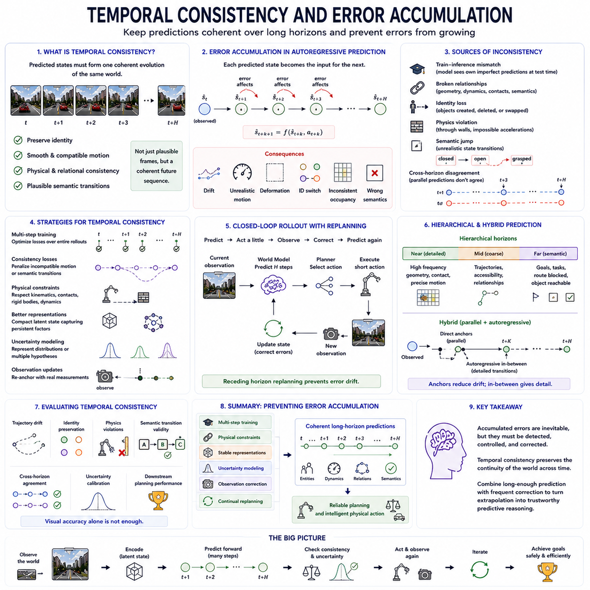{width="7.268055555555556in" height="7.268055555555556in"}

시간적 일관성(Temporal Consistency)은 예측된 상태들이 시간에 걸쳐 동일한 세계의 일관된 변화 과정을 형성해야 한다는 요구사항이다. 월드 모델(World Model)은 각각 개별적으로 그럴듯한 미래 상태를 생성하는 것만으로는 충분하지 않으며, 이러한 상태들이 서로 일치해야 한다. 객체는 정체성(Object Identity)을 유지해야 하고, 움직임은 적절한 경우 연속적으로 변화해야 하며, 물리적 관계(Physical Relationships)는 서로 호환되어야 하고, 의미적 변화(Semantic Changes)는 타당한 시간적 전이(Temporal Transitions)를 따라야 한다.

이러한 요구사항은 예측이 바로 다음 상태를 넘어 확장될 때 특히 중요해진다. 모델이 (t+1)에서는 정확한 추정치를 생성하더라도 (t+2, t+3,\\ldots,t+H)로 진행하면서 점차 일관되지 않은 상태를 생성할 수 있다. 따라서 장기 지평 월드 모델링(Long-Horizon World Modeling)은 국소적인 예측 정확도(Local Prediction Accuracy)뿐만 아니라 롤아웃(Rollout) 전체에서 의미 있는 공간적, 물리적, 의미적, 인과적 관계가 유지되는지에도 의존한다.

오차 누적(Error Accumulation)은 초기 단계에서 발생한 작은 예측 오류가 이후의 예측에 영향을 미칠 때 발생한다. 자기회귀적 모델(Autoregressive Model)에서는 예측 상태 (\\hat{s}\*{t+1})이 (\\hat{s}\*{t+2})를 추정하기 위한 입력이 되고, 이것이 다시 (\\hat{s}\*{t+3})에 영향을 미친다. 이러한 과정은 (\\hat{s}\*{t+k+1}=f(\\hat{s}\*{t+k},a\*{t+k}))와 같이 재귀적으로 표현할 수 있으며, 부정확성이 예측 지평(Prediction Horizon)에 따라 전파되고 잠재적으로 증가할 수 있다.

누적된 오차(Accumulated Error)는 다양한 형태로 나타날 수 있다. 위치 추정(Position Estimation)은 점차 드리프트(Drift)할 수 있고, 속도는 비현실적으로 변할 수 있으며, 객체 경계(Object Boundaries)가 변형되거나 정체성이 서로 바뀔 수 있다. 또한 점유 예측(Occupancy Prediction)이 일관성을 잃거나 의미 상태(Semantic State)가 물리적 근거 없이 변화할 수 있다. 개별적으로는 작은 편차라도 서로 영향을 주면서 결국 관측된 세계의 물리적으로 타당한 연속 상태를 더 이상 나타내지 못하는 미래를 생성할 수 있다.

자기회귀적 예측(Autoregressive Prediction)은 추론 조건(Inference Conditions)이 이상적인 학습 조건(Training Conditions)과 다르기 때문에 이러한 문제에 특히 취약하다. 학습 중에는 각 단계에서 정확하게 관측된 상태를 입력으로 받을 수 있지만, 실제 운용에서는 점점 자신의 불완전한 예측을 기반으로 작동해야 한다. 이러한 학습-추론 불일치(Train--Inference Mismatch)로 인해 학습 과정에서는 입력으로 거의 경험하지 못했던 오류가 장기 롤아웃에서는 빈번하게 나타나고, 모델이 익숙하지 않은 상태 공간(State Space)의 영역으로 이동할 수 있다.

시간적 일관성(Temporal Consistency)은 단순한 수치적 부드러움(Numerical Smoothness)보다 더 넓은 개념이다. 궤적이 부드럽게 변화하더라도 물리적 또는 의미적 제약(Physical or Semantic Constraints)을 위반할 수 있다. 로봇이 벽을 부드럽게 통과하거나, 객체가 시각적으로 안정된 상태를 유지하면서 지지면(Supporting Surface)을 잃거나, 예측된 접촉 없이 객체를 파지했다고 모델이 판단할 수도 있다. 따라서 일관성은 기하학(Geometry), 동역학(Dynamics), 관계(Relationships), 의미(Semantics), 물리적 제약 사이의 일치를 필요로 한다.

객체 영속성(Object Permanence)은 중요한 예를 제공한다. 하나의 개체(Entity)가 탐지되어 정체성을 부여받았다면 부분적으로 가려지거나 일시적으로 보이지 않더라도 예측된 미래에서는 일반적으로 동일한 정체성이 유지되어야 한다. 모델이 예측 과정에서 객체를 반복적으로 생성하고 삭제하거나 객체들의 정체성을 서로 바꾼다면, 프레임 수준의 예측이 겉보기에 합리적이더라도 후속 계획(Downstream Planning)은 궤적, 상호작용, 충돌 위험(Collision Risk)을 잘못 이해할 수 있다.

움직임 일관성(Motion Consistency)은 위치(Position), 속도(Velocity), 가속도(Acceleration), 방향(Orientation)이 서로 호환되도록 변화해야 한다는 것을 의미한다. 예측된 변위(Displacement)는 해당 시간 간격의 속도와 대략적으로 일치해야 하며, 가속도는 실현 가능한 동역학(Feasible Dynamics)의 범위를 준수해야 한다. 또한 급격한 변화는 상호작용이나 제어 입력(Control Inputs)에 의해 뒷받침되는 경우에만 발생해야 한다. 이러한 관계는 미래 관측과의 단순한 유사성을 넘어 예측을 제한하는 구조를 제공한다.

물리적 일관성(Physical Consistency)은 체화(Embodiment)와 환경 동역학(Environmental Dynamics)에서 유래하는 제약을 추가한다. 로봇 상태는 운동학적 및 동역학적 한계(Kinematic and Dynamic Limits)를 준수해야 하고, 강체(Rigid Object)는 임의로 형태가 변해서는 안 되며, 충돌은 이후의 움직임에 영향을 미쳐야 하고, 접촉 관계(Contact Relationships)는 타당한 상호작용에 따라 변화해야 한다. 알려진 물리 법칙이 모든 세부 사항을 완벽하게 설명할 필요는 없지만 학습 모델이 명백하게 불가능한 미래를 생성하는 것을 제한할 수 있다.

의미적 일관성(Semantic Consistency)은 보다 높은 수준에서 작동한다. 닫힘(Closed)에서 열리는 중(Opening)을 거쳐 열림(Open)으로 변화하거나, 비접촉(Uncontacted)에서 접촉(Contacted)을 거쳐 파지(Grasped)로 변화하거나, 자유 공간(Free)에서 점유(Occupied)를 거쳐 차단(Blocked) 상태로 변화하는 것과 같은 상태 전이는 타당한 순서를 따라야 한다. 또한 의미적 예측은 저수준 물리 상태(Low-Level Physical States)와 일치해야 한다. 이러한 결합은 월드 모델이 기하학적으로는 타당하지만 과업 수준의 해석(Task-Level Interpretation)이 예측된 물리적 구성과 모순되는 미래를 생성하는 것을 방지한다.

오차는 비자기회귀적 다중 지평 모델(Non-Autoregressive Multi-Horizon Model)에서도 누적되거나 나타날 수 있다. 여러 미래 지평을 직접 예측하면 예측 결과를 반복적으로 입력으로 사용하는 문제는 피할 수 있지만, 독립적으로 추정된 미래 지평들이 서로 일치하지 않을 수 있다. 예를 들어 모델이 1초 후에는 하나의 궤적을 예측하면서 3초 후에는 그와 호환되지 않는 상태를 예측할 수 있다. 따라서 병렬 예측(Parallel Prediction)은 재귀적 오류 전파 문제를 줄이는 대신 지평 간 일관성(Cross-Horizon Consistency) 문제를 명시적으로 해결해야 한다.

시간적 일관성을 향상시키기 위해 여러 상호보완적인 전략을 사용할 수 있다. 다단계 학습(Multi-Step Training)은 다음 상태만이 아니라 전체 롤아웃에 걸쳐 예측을 최적화할 수 있다. 일관성 손실(Consistency Losses)은 서로 호환되지 않는 움직임이나 의미적 전이를 페널티로 처리할 수 있다. 물리적 제약은 불가능한 상태를 제한하고, 공유 시간 표현(Shared Temporal Representations)은 서로 다른 미래 지평이 동일하게 변화하는 세계를 설명하도록 유도할 수 있다. 하나의 메커니즘만으로 모든 종류의 불일치를 해결하기는 어렵다.

다단계 롤아웃 손실(Multi-Step Rollout Loss)은 학습 과정에서 초기 오류가 이후에 미치는 영향을 직접 노출한다는 점에서 특히 중요하다. 단순히 (L(\\hat{s}\*{t+1},s\*{t+1}))만 최소화하는 대신 목적 함수(Objective)는 (\\sum_{k=1}\^{H} w_k L(\\hat{s}\*{t+k},s\*{t+k}))와 같이 여러 미래 지평에서 발생하는 오류를 포함할 수 있다. 이를 통해 모델은 하나의 독립적인 상태 전이에서만 정확한 모델이 아니라 반복적으로 적용되더라도 안정적인 상태 전이를 학습하도록 유도된다.

학습 과정에서 예측기가 자신이 생성한 상태를 직접 경험하도록 할 수도 있다. 모델이 항상 완벽한 실제 정답 이력(Ground-Truth History)만 입력받는다면 작은 편차에서 어떻게 회복해야 하는지를 학습하지 못할 수 있다. 예정 샘플링(Scheduled Sampling) 또는 관련 접근법은 학습 중 예측된 상태를 점진적으로 입력으로 도입할 수 있다. 이를 통해 모델은 실제 자율 롤아웃에서 경험하는 조건과 더욱 유사한 환경에서 작동하는 방법을 학습하고 누적 편차에 대한 강건성(Robustness)을 향상시킬 수 있다.

잠재 상태 설계(Latent-State Design)는 장기 안정성(Long-Term Stability)에 큰 영향을 미친다. 예측하기 어려운 모든 시각적 세부 사항을 보존하는 표현은 중요하지 않은 오류까지 증폭시킬 수 있지만, 지속적인 기하학, 동역학, 객체, 의미 정보에 집중하는 압축된 잠재 상태(Compact Latent State)는 더욱 안정적인 예측 공간을 제공할 수 있다. 목표는 단순히 최대한 압축하는 것이 아니라 일관된 미래 변화와 후속 의사결정에 필요한 변수들을 보존하는 것이다.

불확실성 추정(Uncertainty Estimation)은 오차 누적에 대응하는 또 다른 방어 수단을 제공한다. 예측이 실제 관측으로부터 멀어질수록 모델은 자신의 신뢰도가 감소하고 있음을 인식해야 한다. 점점 불확실해지는 하나의 궤적을 정확한 미래처럼 취급하는 대신 확률 분포(Distributions) 또는 여러 가설(Multiple Hypotheses)을 표현할 수 있다. 이를 통해 계획기는 불확실성을 고려하고 신뢰하기 어려운 먼 미래 예측에 지나치게 의존하지 않으며 중요한 의사결정을 내리기 전에 새로운 관측을 요구할 수 있다.

주기적인 관측 갱신(Periodic Observation Updates)은 실제 센서 정보가 내부 모델을 다시 현실에 고정(Re-Anchor)할 수 있기 때문에 특히 강력하다. 일반적으로 로봇은 장기 예측 전체를 개방 루프(Open Loop) 방식으로 실행할 필요가 없다. 예측하고, 짧게 행동하고, 다시 관측한 다음 내부 상태를 수정하고 새로운 롤아웃을 생성할 수 있다. 이러한 폐루프 과정(Closed-Loop Process)을 반복하면 누적된 모델 오류가 실제 물리적 환경에서 완전히 분리되는 것을 방지할 수 있다.

모델 예측 제어(Model Predictive Control)는 바로 이러한 원리를 사용한다. 월드 모델은 여러 미래 단계를 예측하고, 제어기는 이러한 예측을 기반으로 행동을 선택하지만 즉각적인 행동 또는 짧은 구간만 실제로 실행한다. 이후 새로운 센서 측정값이 불확실한 예측 상태를 갱신된 추정값으로 대체한다. 따라서 이동 지평 재계획(Receding-Horizon Replanning)은 미래를 예상할 수 있을 정도로 충분히 긴 예측과 현실로부터의 빈번한 보정을 결합한다.

계층적 예측(Hierarchical Prediction)은 오류 증가를 추가적으로 제한할 수 있다. 상세한 고주파 예측(High-Frequency Prediction)은 가까운 미래에 제한하고, 더 긴 미래 지평에서는 거친 표현이나 보다 의미적인 표현을 사용할 수 있다. 정확한 객체 좌표는 몇 초 후부터 신뢰성이 떨어질 수 있지만 경로 차단(Route Blocked), 객체 도달 가능(Object Reachable), 과업 성공 가능(Task Likely to Succeed)과 같은 예측은 여전히 유용할 수 있다. 따라서 추상화(Abstraction)는 정밀한 기하학적 정확도가 감소하더라도 의사결정에 중요한 정보를 보존할 수 있다.

병렬 예측(Parallel Prediction)과 자기회귀적 예측(Autoregressive Prediction)을 결합하여 안정성을 향상시킬 수도 있다. 직접 다중 지평 예측(Direct Multi-Horizon Prediction)은 제한되지 않은 재귀적 드리프트를 줄이는 기준 상태(Anchor States)를 제공하고, 자기회귀적 예측은 이러한 기준 상태 사이의 세부적인 상태 전이를 생성할 수 있다. 두 가지 예측 형태를 교차 검증(Cross-Checking)하면 불일치를 발견하고 불확실성이 증가하거나 내부 동역학 모델(Internal Dynamics Model)의 수정이 필요하다는 신호를 얻을 수 있다.

시간적 일관성은 단순한 프레임 수준 정확도(Frame-Level Accuracy) 지표만으로 평가해서는 안 된다. 유용한 평가는 궤적 드리프트(Trajectory Drift), 정체성 유지(Identity Preservation), 물리적 제약 위반(Physical Constraint Violations), 의미적 전이의 타당성(Semantic Transition Validity), 지평 간 일치(Cross-Horizon Agreement), 불확실성 보정(Uncertainty Calibration), 후속 계획 성능(Downstream Planning Performance)을 함께 검토할 수 있다. 시각적 예측 오류가 낮더라도 불안정한 궤적을 생성하는 모델은 일관된 동역학을 제공하는 더 단순한 모델보다 피지컬 AI에 덜 유용할 수 있다.

미래 예측은 불완전한 정보(Incomplete Information)를 기반으로 수행되므로 어느 정도의 오차 누적은 궁극적으로 피할 수 없다. 따라서 목표는 모든 편차를 완전히 제거하는 것이 아니라 오류가 감지되지 않은 채 증가하여 높은 신뢰도를 가진 물리적으로 잘못된 미래로 발전하는 것을 방지하는 것이다. 강건한 월드 모델(Robust World Model)은 불확실성을 감지하고, 구조적 제약(Structural Constraints)을 유지하며, 불완전한 상태에서 회복하고, 물리적 세계가 변화함에 따라 새로운 증거를 반복적으로 통합할 수 있어야 한다.

피지컬 AI(Physical AI)에서 시간적 일관성(Temporal Consistency)은 상상된 미래(Imagined Futures)를 실제 행동에 활용할 수 있을 정도로 신뢰할 수 있는지를 결정한다. 유용한 월드 모델은 예측 지평이 증가함에 따라 불확실성이 커진다는 사실을 인식하면서 개체(Entity), 동역학(Dynamics), 관계(Relationships), 의미(Semantics)의 연속성을 유지해야 한다. 다단계 학습(Multi-Step Training), 물리적 제약(Physical Constraints), 안정적인 표현(Stable Representations), 불확실성 모델링(Uncertainty Modeling), 관측 보정(Observation Correction), 지속적인 재계획(Continual Replanning)을 결합함으로써 장기 지평 예측을 통제되지 않은 외삽(Uncontrolled Extrapolation)에서 체계적인 예측 추론(Disciplined Predictive Reasoning)으로 발전시킬 수 있다.

## 02.09. Training Objectives for Predictive Models

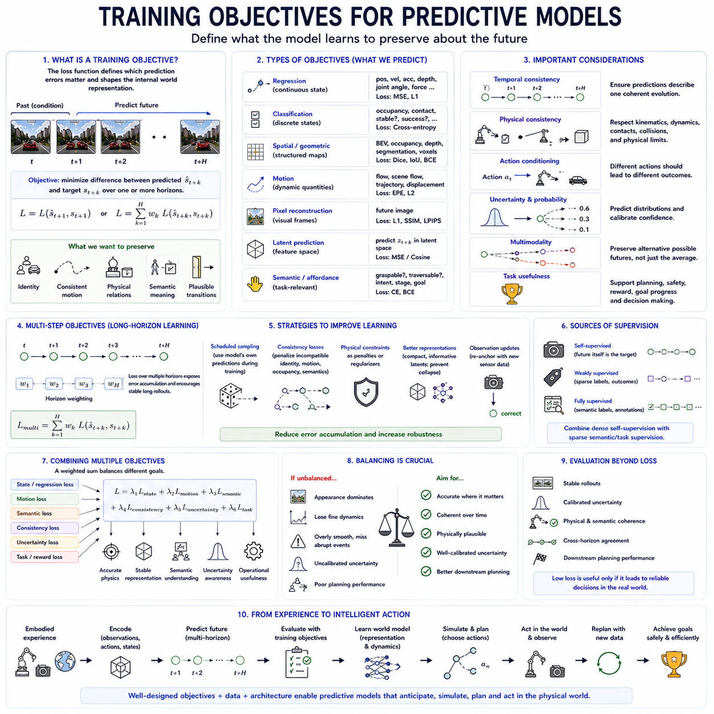{width="7.268055555555556in" height="7.268055555555556in"}

학습 목적 함수(Training Objectives)는 예측형 월드 모델(Predictive World Model)이 미래에 관해 무엇을 보존하도록 학습할지를 결정한다. 모델은 시간적 데이터(Temporal Data)를 관측하는 것만으로 피지컬 AI(Physical AI)에 가장 유용한 표현(Representation)을 자동으로 발견하는 것은 아니다. 손실 함수(Loss Function)는 어떤 예측 오류가 중요한지, 어떤 구조가 안정적으로 유지되어야 하는지, 미래 상태의 어떤 측면에 모델 용량(Model Capacity)을 할당해야 하는지를 정의한다. 따라서 목적 함수 설계(Objective Design)는 아키텍처 자체만큼이나 내부 월드 표현(Internal World Representation)의 형성에 중요한 영향을 미친다.

가장 단순한 목적 함수(Objective)는 예측된 다음 상태 (\\hat{s}\*{t+1})과 실제 관측된 목표 상태 (s\*{t+1})을 비교한다. 일반적인 형태는 (L=L(\\hat{s}\*{t+1},s\*{t+1}))로 표현할 수 있다. 개념적으로는 단순하지만 이 손실의 의미는 예측되는 상태 표현(State Representation)에 따라 크게 달라진다. 이미지(Image), 기하학(Geometry), 점유 상태(Occupancy), 움직임(Motion), 의미적 속성(Semantic Attributes), 잠재 특징(Latent Features)은 각각 서로 다른 유사도 측정 방식과 예측 품질에 대한 서로 다른 가정을 필요로 한다.

회귀 목적 함수(Regression Objectives)는 위치(Position), 방향(Orientation), 속도(Velocity), 가속도(Acceleration), 힘(Force), 깊이(Depth), 관절 구성(Joint Configuration)과 같은 연속적인 물리량(Continuous Physical Quantities)에 일반적으로 사용된다. 평균 제곱 오차(Mean Squared Error)와 관련 거리 측정 방식은 예측값과 관측값 사이의 수치적 일치를 유도한다. 그러나 물리적으로 서로 다른 여러 미래가 가능할 경우 평균적인 수치 오차만 최소화하면 실제로는 존재하지 않는 비현실적인 평균 상태로 예측이 수렴할 수 있다.

분류 목적 함수(Classification Objectives)는 미래 상태가 이산적인 의미 변수(Discrete Semantic Variables)를 포함할 때 적합하다. 예측 모델은 특정 영역이 자유 공간(Free)으로 유지될지 점유 상태(Occupied)가 될지, 객체가 안정적인 상태를 유지할지, 접촉(Contact)이 발생할지, 또는 조작 단계(Manipulation Stage)가 성공할지를 추정할 수 있다. 교차 엔트로피(Cross-Entropy)와 관련 손실 함수는 이러한 범주에 대한 확률을 학습하여 미래 예측을 의미적 및 과업 수준 해석(Task-Level Interpretation)과 연결할 수 있다.

공간 예측(Spatial Prediction)에는 기하학적 구조(Geometric Organization)를 보존하는 목적 함수가 필요하다. 미래 점유 격자(Future Occupancy Grids), 조감도 표현(Bird's-Eye-View Representations), 깊이 필드(Depth Fields), 분할 지도(Segmentation Maps), 복셀 구조(Voxel Structures)는 서로 인접한 위치 사이의 관계를 포함하며, 독립적인 스칼라 손실만으로는 이러한 관계를 충분히 포착하지 못할 수 있다. 공간 손실(Spatial Losses)은 경계(Boundaries), 점유 영역(Occupied Regions), 기하학적 일관성(Geometric Consistency), 또는 작은 위치 오차도 계획에 큰 영향을 미칠 수 있는 안전 중요 영역(Safety-Critical Areas)을 강조할 수 있다.

움직임 목적 함수(Motion Objectives)는 변위(Displacement), 속도, 가속도, 옵티컬 플로우(Optical Flow), 장면 흐름(Scene Flow), 객체 궤적(Object Trajectories)을 명시적으로 지도할 수 있다. 이러한 물리량을 별도로 예측하면 월드 모델이 재구성된 관측으로부터 움직임을 간접적으로 추론하는 대신 동적 구조(Dynamic Structure)를 직접 학습하도록 할 수 있다. 움직임 일관성 손실(Motion Consistency Losses)은 예측된 위치와 속도가 시간에 걸쳐 서로 일치하도록 추가적으로 제한하여 장기 롤아웃(Long Rollout)에서 물리적으로 일관되지 않은 궤적을 감소시킬 수 있다.

픽셀 재구성(Pixel Reconstruction)은 시각적 예측 모델(Visual Predictive Model)에서 사용할 수 있는 하나의 목적 함수이다. 모델은 미래 이미지를 예측하고 이를 실제 미래 프레임(Future Frame)과 비교한다. 이러한 방식은 수동 라벨(Manual Labels) 없이 밀집된 지도 신호(Dense Supervision)를 제공하지만, 픽셀 수준 정확도(Pixel-Level Accuracy)는 행동과 거의 관련이 없는 텍스처(Texture), 조명(Lighting), 기타 세부 사항에 지나치게 많은 모델 용량을 할당할 수 있다. 피지컬 AI에서는 재구성 목적을 기하학, 동역학, 의미 정보에 집중하는 목적 함수와 결합할 때 더욱 유용한 경우가 많다.

잠재 예측(Latent Prediction)은 모든 센서 세부 사항을 재구성하는 대신 특징 공간(Feature Space)에서 미래 표현을 예측한다. 인코더(Encoder)는 관측을 잠재 상태 (z_t)로 변환하고, 예측 모델은 미래 목표 표현 (z_{t+k})에 대응하는 (\\hat{z}_{t+k})를 추정한다. 목적 함수는 학습된 표현이 시간적으로 예측 가능한 구조를 갖도록 유도하면서, 후속 행동에 필요한 정보를 잠재 공간에 유지하는 조건 아래 중요하지 않은 시각적 변동(Visual Variation)을 제거할 수 있도록 한다.

표현 학습 목적 함수(Representation Learning Objectives)는 자명한 해(Trivial Solutions)도 방지해야 한다. 예측 표현과 목표 표현이 거의 동일한 상수로 붕괴(Collapse)한다면 의미 있는 세계 구조를 학습하지 않고도 예측 손실이 작아질 수 있다. 대조 학습(Contrastive Learning), 분산 정규화(Variance Regularization), 그래디언트 차단(Stop-Gradient) 메커니즘, 재구성 제약(Reconstruction Constraints), 신중하게 설계된 목표 네트워크(Target Networks)는 잠재 표현의 시간적 예측 가능성을 유지하면서도 충분한 정보를 보존하도록 도울 수 있다.

다단계 목적 함수(Multi-Step Objectives)는 학습을 즉각적인 다음 상태의 정확도를 넘어 확장한다. 하나의 상태 전이만 최적화하는 대신 모델은 예측 지평 (H) 전체의 손실을 최소화할 수 있으며, 개념적으로 (L_{\\text{multi}}=\\sum_{k=1}\^{H}w_kL(\\hat{s}\*{t+k},s\*{t+k}))로 표현할 수 있다. 이를 통해 모델은 재귀적 오류(Recursive Errors)의 영향을 학습 과정에서 경험하고 더 긴 상상 롤아웃(Imagined Rollouts)에 걸쳐 안정적이고 유용하게 유지되는 동역학을 학습할 수 있다.

가중치 (w_k)는 서로 다른 시간적 지평(Temporal Horizons)이 학습에 얼마나 강하게 영향을 미치는지를 결정한다. 단기 예측(Near-Term Prediction)은 더 신뢰할 수 있고 제어와 직접적으로 관련되기 때문에 높은 가중치를 받을 수 있으며, 먼 미래의 예측은 거친 구조(Coarse Structure)나 의미적 결과(Semantic Outcomes)를 더욱 강조할 수 있다. 반대로 미래 상황에 대한 예상(Anticipation)이 중요한 과업에서는 장기 지평에 상당한 중요도를 부여할 수도 있다. 따라서 지평 가중치(Horizon Weighting)는 학습 목적 함수를 시스템이 의도하는 시간적 행동과 연결한다.

시간적 일관성 목적 함수(Temporal Consistency Objectives)는 인접한 예측들이 하나의 일관된 변화 과정을 설명하도록 유도한다. 이러한 손실은 갑작스러운 객체 정체성 변화(Identity Changes), 호환되지 않는 움직임, 일관되지 않은 점유 상태 또는 물리적 근거가 없는 의미적 전이(Semantic Transitions)에 페널티를 부여할 수 있다. 지평 간 일관성(Cross-Horizon Consistency)은 직접 예측된 여러 미래 상태가 서로 독립적인 추측이 아니라 동일한 가능한 미래의 서로 다른 시점을 나타내도록 제한할 수도 있다.

물리적 일관성 목적 함수(Physical Consistency Objectives)는 체화(Embodiment)와 환경 동역학(Environmental Dynamics)에 관한 지식을 학습 과정에 도입한다. 운동학적 한계(Kinematic Limits), 가속도 제한(Acceleration Bounds), 강체 가정(Rigid-Body Assumptions), 충돌 제약(Collision Constraints), 접촉 관계(Contact Relationships), 근사적인 운동 방정식(Equations of Motion)을 페널티 또는 정규화 항(Regularizers)으로 사용할 수 있다. 이러한 목적은 학습 모델이 정확한 해석적 시뮬레이터(Analytical Simulator)를 그대로 재현하도록 요구하는 것이 아니라 물리 시스템의 기본적인 특성을 위반하는 예측을 억제한다.

행동 조건부 목적 함수(Action-Conditioned Objectives)는 예측된 미래가 제어 입력(Control Inputs)에 올바르게 반응하도록 보장한다. 두 개의 후보 행동(Candidate Actions)이 서로 다른 결과를 만들어야 한다면 학습된 표현 역시 이러한 차이를 보존해야 한다. 따라서 학습 과정에서는 실제로 관측된 행동에 따른 상태 전이를 비교하여 제어 가능한 변화(Controllable Changes)를 강조할 수 있다. 이는 월드 모델이 이후 계획(Planning)이나 모델 예측 제어(Model Predictive Control)를 위해 대안적 행동을 시뮬레이션하는 데 사용될 경우 필수적이다.

하나의 미래 목표만으로 불확실성(Uncertainty)을 충분히 표현할 수 없는 경우에는 확률적 목적 함수(Probabilistic Objectives)가 필요하다. 우도 기반 손실(Likelihood-Based Losses)은 예측된 확률 분포를 학습할 수 있으며, 확률적 잠재 변수 모델(Stochastic Latent-Variable Models)은 가능한 궤적들의 분포를 학습할 수 있다. 목적 함수는 실제로 가능한 미래에 높은 확률을 부여하면서도 근거 없는 과도한 확신이나 후속 의사결정에 거의 도움이 되지 않을 정도로 지나치게 넓은 불확실성을 방지해야 한다.

보정 목적 함수(Calibration Objectives)는 예측된 신뢰도(Confidence)를 경험적으로 관측되는 정확도와 더욱 일치시킬 수 있다. 모델이 어떤 사건에 90퍼센트의 신뢰도를 부여한다면 유사한 조건에서 실제로도 대략 그 정도의 비율로 정확해야 한다. 잘 보정된 불확실성(Well-Calibrated Uncertainty)은 계획기가 신뢰도 추정을 이용하여 안전 여유(Margins)를 결정하거나, 속도를 낮추거나, 추가 센싱(Additional Sensing)을 요청하거나, 위험한 행동을 거부할 수 있기 때문에 안전 중요 피지컬 AI(Safety-Critical Physical AI)에서 특히 중요하다.

질적으로 서로 다른 여러 미래가 가능한 경우에는 다중 모드 목적 함수(Multimodal Objectives)가 필요하다. 인간의 움직임, 교통 행동(Traffic Behavior), 접촉 결과(Contact Outcomes), 객체 상호작용은 빈번하게 여러 방향으로 분기되는 가능성을 만든다. 학습은 이러한 미래들을 하나의 평균값으로 합치는 대신 서로 구별되는 가설(Distinct Hypotheses)로 유지할 수 있어야 한다. 혼합 분포(Mixture Distributions), 다중 궤적 예측(Multiple Trajectory Predictions), 확률적 샘플(Stochastic Samples), 다양성 촉진 목적 함수(Diversity-Promoting Objectives)를 통해 상대적인 가능성을 유지하면서 대안적인 미래를 표현할 수 있다.

의미 및 행동 가능성 목적 함수(Semantic and Affordance Objectives)는 예측을 미래 상태의 운용적 의미(Operational Meaning)와 연결한다. 모델은 객체가 파지 가능(Graspable) 상태가 될지, 경로가 계속 주행 가능(Traversable)할지, 접촉이 성공할지, 또는 과업 단계가 완료될지를 예측하도록 학습할 수 있다. 이러한 목적 함수는 단순히 관측되는 외형을 재현하는 것보다 실제 행동과 직접적으로 관련된 정보를 표현에 보존하도록 유도한다.

과업 지향 목적 함수(Task-Oriented Objectives)는 예측된 표현이 성공적인 의사결정(Decision Making)을 지원하는지를 직접 평가하는 수준으로 확장될 수 있다. 잠재 월드 모델(Latent World Model)은 예측을 이용하여 계획기가 안전하고 효과적인 행동을 선택할 수 있다면 환경을 완벽하게 재구성할 필요가 없을 수 있다. 따라서 가치(Value), 보상(Reward), 목표 진행도(Goal Progress), 충돌 위험(Collision Risk), 과업 성공(Task Success)을 위한 보조 손실(Auxiliary Losses)을 사용하여 제어와 장기 추론에 중요한 변수 중심으로 예측 표현을 형성할 수 있다.

자기지도 목적 함수(Self-Supervised Objectives)는 순차적인 센서 데이터(Sequential Sensor Data)가 자연스럽게 미래 목표를 제공한다는 점에서 특히 중요하다. 카메라(Camera), 라이다(LiDAR), 고유수용감각(Proprioception), 로봇 상태(Robot States), 행동(Actions)으로부터 운용 중 수집된 데이터는 모든 상태 변수를 사람이 직접 라벨링하지 않더라도 시간적 지도 신호(Temporal Supervision)를 제공한다. 미래 자체가 학습 신호가 되므로 대규모 체화 경험(Embodied Experience)을 표현 및 동역학 학습(Representation and Dynamics Learning)에 활용할 수 있다.

약한 지도 학습(Weakly Supervised Learning)과 부분 라벨 데이터(Partially Labeled Data)는 자기지도 학습(Self-Supervision)을 보완할 수 있다. 일부 궤적에는 의미 라벨(Semantic Labels), 과업 결과, 객체 정체성 또는 상호작용 주석(Interaction Annotations)이 포함될 수 있지만 대부분의 데이터에는 원시 시간 관측만 존재할 수 있다. 밀집된 자기지도 예측(Dense Self-Supervised Prediction)과 희소한 의미 지도(Sparse Semantic Supervision)를 결합하면 대규모 데이터셋을 활용하면서 학습된 특징을 계획과 물리적 추론에 유용한 개념과 정렬할 수 있다.

실용적인 월드 모델(World Model)은 일반적으로 하나의 손실 함수에만 의존하지 않고 여러 목적 함수를 결합한다. 전체 목적 함수는 (L=\\lambda_1L_{\\text{state}}+\\lambda_2L_{\\text{motion}}+\\lambda_3L_{\\text{semantic}}+\\lambda_4L_{\\text{consistency}}+\\lambda_5L_{\\text{uncertainty}}+\\lambda_6L_{\\text{task}})와 같이 표현할 수 있다. 각 계수는 정확한 물리적 예측, 안정적인 표현, 의미적 이해(Semantic Understanding), 불확실성 인식(Uncertainty Awareness), 운용적 유용성(Operational Usefulness) 사이의 균형을 결정한다.

이러한 목적 함수들의 균형을 조절하는 것 자체가 중요한 학습 문제이다. 재구성(Reconstruction)이 지나치게 지배적이면 모델은 외형에 과도하게 집중할 수 있고, 의미적 손실이 지나치게 강하면 세밀한 물리적 동역학을 잃을 수 있다. 일관성 제약(Consistency Constraints)이 너무 강하면 실제로 발생하는 급격한 사건까지 억제될 수 있다. 따라서 목적 함수 가중치(Objective Weights), 스케줄(Schedules), 정규화(Normalization), 적응형 균형 조정 방법(Adaptive Balancing Methods)은 데이터, 아키텍처, 예측 지평, 피지컬 AI 응용 목적을 반영해야 한다.

학습 목적 함수는 궁극적으로 검증 데이터(Held-Out Data)의 손실값만으로 평가해서는 안 된다. 예측형 모델은 롤아웃이 안정적으로 유지되는지, 불확실성이 적절하게 보정되는지, 물리적 상태와 의미 상태가 일관성을 유지하는지, 그리고 후속 계획(Downstream Planning)의 성능이 향상되는지를 기준으로 평가해야 한다. 낮은 예측 오차는 모델이 보존한 정보가 실제 물리적 환경에서 신뢰할 수 있는 의사결정을 지원할 때 비로소 실질적인 가치를 갖는다.

피지컬 AI(Physical AI)에서 목적 함수 설계(Objective Design)는 월드 모델이 무엇을 중요하게 학습할지를 정의한다. 효과적인 학습은 미래 상태 정확도(Future-State Accuracy)를 시간적 일관성(Temporal Consistency), 물리적 타당성(Physical Plausibility), 의미적 관련성(Semantic Relevance), 불확실성 표현(Uncertainty Representation), 과업 유용성(Task Utility)과 결합한다. 이러한 학습 신호를 여러 예측 지평과 표현 수준에 걸쳐 조정함으로써 예측 학습(Predictive Learning)은 원시 체화 경험을 예상(Anticipation), 시뮬레이션(Simulation), 계획(Planning), 지능적인 물리적 행동(Intelligent Physical Action)이 가능한 내부 모델(Internal Model)로 변환할 수 있다.

## 02.10. Multi Step Predictive Model [w/Code]

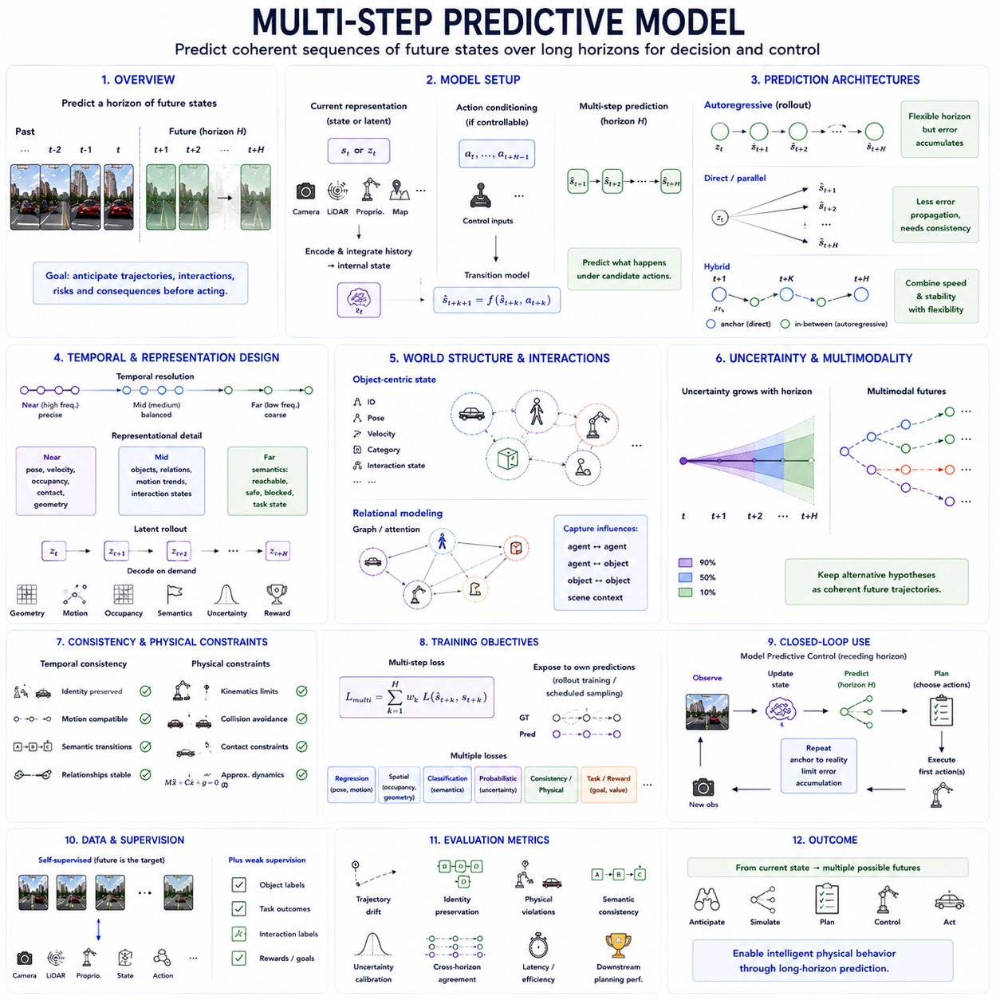{width="7.268055555555556in" height="7.268055555555556in"}

다단계 예측 모델(Multi-Step Predictive Model)은 학습된 동역학(Learned Dynamics)을 즉각적인 상태 전이 예측(Immediate Transition Prediction)에서 미래 상태 시퀀스에 대한 구조화된 추론(Structured Reasoning)으로 확장한다. 단순히 (s_{t+1})만 추정하는 것이 아니라 (s_{t+1},s_{t+2},\\ldots,s_{t+H})의 지평(Horizon)을 예측한다. 이러한 능력은 국소 동역학 예측기(Local Dynamics Predictor)를 실제 물리적 행동이 실행되기 전에 궤적(Trajectories), 상호작용(Interactions), 위험(Risks), 결과(Consequences)를 예상할 수 있는 실용적인 월드 모델(World Model)로 전환한다.

모델은 현재에 대한 내부 표현(Internal Representation)에서 시작한다. 카메라(Camera), 라이다(LiDAR), 고유수용감각(Proprioception), 지도(Maps), 기타 센서의 관측을 상태 (s_t) 또는 잠재 상태(Latent State) (z_t)로 인코딩할 수 있다. 움직임과 숨겨진 조건(Hidden Conditions)을 추정하기 위해 과거 관측도 통합할 수 있다. 이렇게 생성된 표현은 의도한 예측 지평 전체를 지원할 수 있도록 기하학(Geometry), 동역학(Dynamics), 객체(Objects), 의미(Semantics), 에이전트 상태(Agent State)에 관한 충분한 정보를 포함해야 한다.

에이전트가 환경에 영향을 미칠 수 있는 경우 미래 예측은 행동(Action)을 조건으로 해야 한다. 전이 모델(Transition Model)은 (\\hat{s}\*{t+k+1}=f(\\hat{s}\*{t+k},a_{t+k}))로 표현할 수 있다. 후보 행동 시퀀스(Candidate Action Sequence) (a_t,\\ldots,a_{t+H-1})가 주어지면 모델은 이에 대응하는 미래 변화를 예측한다. 따라서 모델은 단순히 자연적으로 어떤 일이 발생할지를 추정하는 것이 아니라 에이전트가 특정한 물리적 행동 시퀀스를 수행할 경우 어떤 일이 발생할지를 추정한다.

하나의 구현 방식은 자기회귀적 예측(Autoregressive Prediction)으로, 각각의 예측 상태가 다음 상태 전이를 위한 입력이 된다. 이 방식은 하나의 공유 동역학 모델(Shared Dynamics Model)을 사용하여 임의 길이의 궤적을 생성할 수 있는 유연한 메커니즘을 제공한다. 그러나 재귀적 예측(Recursive Prediction)은 초기 예측 상태의 부정확성이 이후 예측에 영향을 주기 때문에 오차 누적(Error Accumulation) 문제를 발생시킨다. 따라서 장기 지평 안정성(Long-Horizon Stability)이 핵심적인 설계 요구사항이 된다.

두 번째 구현 방식은 여러 미래 지평(Future Horizons)을 직접 또는 병렬로 예측하는 것이다. 모델은 모든 중간 단계를 재귀적으로 통과하지 않고도 공통된 현재 표현(Common Present Representation)으로부터 선택된 미래 시간 오프셋(Future Time Offsets)의 상태를 추정할 수 있다. 직접 예측(Direct Prediction)은 순차적 추론 지연(Sequential Inference Latency)과 재귀적 오류 전파(Recursive Error Propagation)를 줄일 수 있지만, 독립적으로 생성된 미래 지평들은 여전히 시간적 및 물리적 일관성(Temporal and Physical Consistency)을 만족해야 한다.

실용적인 다단계 모델(Multi-Step Model)은 두 접근법을 결합할 수 있다. 병렬 예측(Parallel Prediction)은 여러 미래 지평에 기준 상태(Anchor States)를 설정하고, 자기회귀적 전이(Autoregressive Transitions)는 그 사이의 세부적인 변화를 생성할 수 있다. 이러한 하이브리드 아키텍처(Hybrid Architecture)는 직접 예측의 속도와 안정성, 재귀적 롤아웃(Recursive Rollout)의 시간적 유연성을 함께 활용할 수 있다. 적절한 균형은 제어 주파수(Control Frequency), 계산 자원(Computational Resources), 예측 지평에 따라 달라진다.

시간 해상도(Temporal Resolution)는 전체 롤아웃에서 일정하게 유지될 필요가 없다. 단기 예측(Near-Term Prediction)은 정밀한 움직임, 접촉(Contact), 충돌 위험(Collision Risk)을 표현하기 위해 높은 주파수로 수행할 수 있지만, 장기 지평에서는 점차 더 거친 시간 간격(Coarser Intervals)을 사용할 수 있다. 이러한 계층적 시간 구조(Hierarchical Temporal Structure)는 정밀도가 가장 중요한 영역에 계산 자원을 집중하고, 본질적으로 불확실성이 더 큰 먼 미래에 비현실적인 기하학적 정확도를 요구하는 것을 방지한다.

표현의 세부 수준(Representational Detail)도 시간적 거리에 따라 변화할 수 있다. 현재에 가까운 시점에서는 위치(Position), 속도(Velocity), 점유 상태(Occupancy), 객체 자세(Object Pose), 접촉 정보를 유지할 수 있다. 더 긴 지평에서는 도달 가능(Reachable), 차단(Blocked), 안정(Stable), 안전(Safe), 과업 완료(Task Completed)와 같은 의미 상태(Semantic States)가 정확한 좌표보다 더 유용할 수 있다. 따라서 다단계 예측은 상세한 물리적 예측에서 점차 추상적인 상황 예측(Situation Forecasting)으로 발전할 수 있다.

잠재 상태 예측(Latent-State Prediction)은 이러한 아키텍처에 특히 적합하다. 모델은 모든 단계에서 완전한 미래 센서 관측을 재구성하는 대신 압축된 잠재 상태(Compact Latent States)를 학습된 동역학을 통해 미래로 전개한다. 이러한 상태는 예측하기 어려운 시각적 세부 사항을 제거하면서 의사결정 관련 정보(Decision-Relevant Information)를 보존할 수 있다. 전문화된 예측 헤드(Specialized Prediction Heads)는 필요한 경우에만 기하학, 움직임, 점유 상태, 의미, 불확실성, 보상(Reward) 또는 기타 물리량을 디코딩할 수 있다.

객체 중심 표현(Object-Centric Representations)은 또 다른 유용한 구조를 제공한다. 전체 환경을 하나의 구분되지 않은 벡터로 표현하는 대신 모델은 정체성(Identity), 자세, 속도, 의미 범주(Semantic Category), 상호작용 상태(Interaction State)와 같은 속성을 가진 지속적인 개체(Persistent Entities)를 유지할 수 있다. 다단계 예측은 이러한 개체와 그 관계가 어떻게 변화하는지를 추정하여 충돌, 협력(Cooperation), 조작(Manipulation), 기타 상호작용에 대한 추론 능력을 향상시킨다.

여러 개체가 서로 영향을 주는 경우 관계 모델링(Relational Modeling)은 더욱 중요해진다. 보행자의 궤적은 로봇의 움직임에 따라 달라질 수 있고, 한 차량은 다른 차량의 행동에 반응할 수 있으며, 객체는 매니퓰레이터(Manipulator)와 접촉하여 움직일 수 있다. 그래프 기반(Graph-Based) 또는 어텐션 기반 상호작용 모델(Attention-Based Interaction Model)은 이러한 의존성을 표현하여 각각의 객체를 독립적인 궤적으로 취급하는 대신 결합된 동역학(Coupled Dynamics)을 미래 예측에 반영할 수 있다.

부분 관측 가능성(Partial Observability)은 메모리(Memory)를 필요로 한다. 하나의 현재 관측만으로는 객체 속도, 숨겨진 장애물(Hidden Obstacles), 접촉 이력(Contact History), 다른 에이전트의 행동 추세(Behavioral Trend)를 파악하지 못할 수 있다. 순환 신경망(Recurrent Networks), 시간적 트랜스포머(Temporal Transformers), 상태 공간 모델(State-Space Models), 지속적인 잠재 메모리(Persistent Latent Memories)는 예측을 시작하기 전에 이전 관측들을 통합할 수 있다. 이렇게 형성된 내부 상태는 장기 지평 롤아웃을 위한 더욱 풍부한 초기 조건(Initial Condition)을 제공한다.

예측이 관측된 증거에서 멀어질수록 일반적으로 신뢰도가 감소하기 때문에 불확실성(Uncertainty)은 다단계 모델 전체를 통해 전파되어야 한다. 단기 상태는 좁은 불확실성 범위를 가질 수 있지만 먼 미래 상태에는 여러 가능한 결과가 존재할 수 있다. 확률적 예측(Probabilistic Prediction)은 하나의 먼 미래를 확정된 것으로 제시하는 대신 확률 분포(Distributions), 확률적 잠재 상태(Stochastic Latent States), 앙상블(Ensembles), 다중 궤적 가설(Multiple Trajectory Hypotheses)을 표현할 수 있다.

미래 변화가 질적으로 여러 방향으로 분기될 수 있는 경우 다중 모드 예측(Multimodal Prediction)이 필수적이다. 보행자는 멈추거나 횡단할 수 있고, 다른 로봇은 양보하거나 계속 이동할 수 있으며, 조작되는 객체는 안정적으로 유지되거나 미끄러질 수 있다. 유용한 다단계 모델은 이러한 대안들을 서로 구별되는 가설(Distinct Hypotheses)로 유지하고 각각을 일관된 미래로 전개한다. 계획기는 이를 통해 가능성이 높은 결과뿐 아니라 확률은 낮지만 안전에 중요한 가능성도 평가할 수 있다.

시간적 일관성(Temporal Consistency)은 예측된 전체 시퀀스를 제한한다. 객체의 정체성은 지속되어야 하고, 움직임은 속도와 가속도에 부합하도록 변화해야 하며, 의미적 전이(Semantic Transitions)는 타당한 순서를 따라야 하고, 관계는 설명 가능한 원인 없이 변화해서는 안 된다. 목표는 각각 독립적으로 그럴듯한 상태를 생성하는 것이 아니라 하나의 물리적이고 인과적으로 일관된 세계 변화(Physically and Causally Coherent Evolution)를 나타내는 궤적을 생성하는 것이다.

물리적 제약(Physical Constraints)은 장기 롤아웃을 더욱 안정화할 수 있다. 로봇 운동학(Robot Kinematics), 가속도 한계(Acceleration Limits), 강체 가정(Rigid-Body Assumptions), 충돌 규칙(Collision Rules), 접촉 제약(Contact Constraints), 근사적인 해석적 동역학(Analytical Dynamics)을 이용하여 불가능한 상태 전이를 제한할 수 있다. 학습 모델은 복잡한 환경 효과와 잔차 동역학(Residual Dynamics)에 집중하고, 알려진 물리적 구조는 예측이 타당한 범위 안에 머물도록 경계를 제공할 수 있다.

따라서 학습(Training)은 단일 단계 예측 정확도(One-Step Prediction Accuracy) 이상을 최적화해야 한다. 다단계 목적 함수(Multi-Step Objective)는 (L_{\\text{multi}}=\\sum_{k=1}\^{H}w_kL(\\hat{s}\*{t+k},s\*{t+k}))로 표현할 수 있으며, 가중치 (w_k)는 서로 다른 미래 지평의 중요도를 결정한다. 여러 단계에 걸친 학습은 모델이 예측 오류의 결과를 직접 경험하도록 하고 반복적으로 적용되더라도 안정성을 유지하는 상태 전이를 학습하도록 유도한다.

학습 과정은 실제 정답 입력(Ground-Truth Inputs)과 예측 입력(Predicted Inputs)의 차이도 고려해야 한다. 정확한 과거 상태만을 이용해 학습된 모델은 실제 운용에서 자신의 불완전한 예측이 입력으로 사용될 때 불안정해질 수 있다. 롤아웃 학습(Rollout Training), 예정 샘플링(Scheduled Sampling), 또는 관련 기법을 통해 예측기가 자신이 생성한 상태를 경험하도록 하면 작은 편차를 증폭시키는 대신 그 상태에서 회복하는 방법을 학습하는 데 도움이 된다.

여러 손실 함수(Losses)를 이용하여 예측된 미래의 서로 다른 측면을 지도할 수 있다. 회귀 손실(Regression Losses)은 자세와 움직임을 학습하고, 공간 목적 함수(Spatial Objectives)는 점유 상태와 기하학을 지도하며, 분류 손실(Classification Losses)은 의미 상태를 학습하고, 확률적 목적 함수(Probabilistic Objectives)는 불확실성을 모델링할 수 있다. 또한 일관성, 물리적 제약, 행동 가능성(Affordance), 보상, 과업 지향 손실(Task-Oriented Losses)을 추가하여 내부 표현이 예측과 의사결정 모두에 유용하도록 만들 수 있다.

순차적 경험(Sequential Experience)은 미래 관측 자체가 예측 목표를 제공하기 때문에 자연스럽게 자기지도 학습(Self-Supervised Training)을 지원한다. 대규모 로봇 궤적(Robot Trajectories), 주행 시퀀스(Driving Sequences), 조작 에피소드(Manipulation Episodes), 시뮬레이션 데이터(Simulation Data), 멀티모달 센서 로그(Multimodal Sensor Logs)를 완전한 수동 라벨링 없이 예측 동역학 학습에 활용할 수 있다. 약한 의미 라벨(Weak Semantic Labels)과 과업 결과를 추가하면 학습된 상태를 운용적으로 의미 있는 개념과 정렬할 수 있다.

다단계 모델은 계획기(Planner)와 연결될 때 내부 시뮬레이터(Internal Simulator)가 된다. 여러 후보 행동 시퀀스를 제안하고 예측 모델을 통해 미래로 전개할 수 있다. 그 결과 생성된 미래들을 충돌 위험, 목표 진행도(Goal Progress), 안정성(Stability), 에너지 사용(Energy Use), 주행 가능성(Traversability), 조작 성공(Manipulation Success), 기타 목적에 따라 비교할 수 있다. 이를 통해 예측은 실제 행동을 실행하기 전에 행동의 결과를 평가하는 메커니즘으로 발전한다.

모델 예측 제어(Model Predictive Control)는 실용적인 폐루프 구현(Closed-Loop Implementation)을 제공한다. 모델은 유한한 미래 지평을 예측하고, 계획기는 행동 시퀀스를 선택하며, 로봇은 첫 번째 행동 또는 짧은 구간만 실행한다. 이후 새로운 관측을 수집하고 내부 상태를 보정한 다음 다시 예측을 시작한다. 이러한 이동 지평 운용(Receding-Horizon Operation)은 상상된 미래를 반복적으로 현실에 고정하여 예측 오류가 통제되지 않은 상태로 누적되는 것을 제한한다.

예측 지평(Prediction Horizon)은 목적 없이 최대화하기보다 의사결정 요구사항에 따라 선택해야 한다. 지나치게 짧은 지평은 충분한 예상 능력을 제공하지 못할 수 있으며, 지나치게 긴 지평은 계산 자원을 소비하면서 운용적 가치가 낮고 불확실성이 매우 큰 상태를 생성할 수 있다. 효과적인 모델은 현재 의사결정에 중요한 결과를 파악할 수 있을 만큼 충분히 먼 미래를 예측하면서 적절한 정확도와 불확실성 인식(Uncertainty Awareness)을 유지해야 한다.

따라서 평가는 단일 단계 손실(One-Step Loss)만이 아니라 롤아웃 품질(Rollout Quality)을 고려해야 한다. 중요한 평가 기준에는 궤적 드리프트(Trajectory Drift), 정체성 유지(Identity Preservation), 물리적 제약 위반(Physical Constraint Violations), 의미적 일관성(Semantic Consistency), 불확실성 보정(Uncertainty Calibration), 지평 간 일치(Cross-Horizon Agreement), 계산 지연(Computational Latency), 후속 계획 성능(Downstream Planning Performance)이 포함된다. 국소적인 오차가 약간 크더라도 장기 예측이 일관성을 유지하고 더 안전한 의사결정을 가능하게 한다면 실제 피지컬 AI 시스템에서는 더욱 유용할 수 있다.

다단계 예측 모델(Multi-Step Predictive Model)은 궁극적으로 인식(Perception), 메모리(Memory), 동역학(Dynamics), 불확실성(Uncertainty), 행동(Action)을 하나의 시간적 추론 시스템(Temporal Reasoning System) 안에서 연결한다. 현재의 추정 상태를 여러 가능한 미래 변화로 변환하고, 후보 행동이 이러한 미래를 어떻게 변화시키는지 평가하며, 새로운 관측을 이용하여 예측을 반복적으로 수정한다. 이를 통해 단순한 반응형 행동(Reactive Behavior)을 넘어 예상(Anticipation)을 가능하게 하는 예측 기반을 형성한다.

피지컬 AI(Physical AI)에서 다단계 예측의 목적은 알 수 없는 먼 미래를 완벽하게 재구성하는 것이 아니다. 핵심 목적은 안전하고 유용한 행동 시퀀스와 위험하거나 비효율적인 행동 시퀀스를 구별할 수 있도록 충분한 물리적, 공간적, 관계적, 의미적 정보와 불확실성 정보를 보존하는 것이다. 이러한 역할에서 다단계 예측 모델은 학습된 월드 동역학(Learned World Dynamics)을 상상(Imagination), 계획(Planning), 제어(Control), 지능적인 물리적 행동(Intelligent Physical Behavior)으로 연결하는 계산적 가교(Computational Bridge)가 된다.
