**Volume 07. World Models for Physical AI**

# Chapter 03. Latent Dynamics Models

## 03.01. Why Latent Dynamics

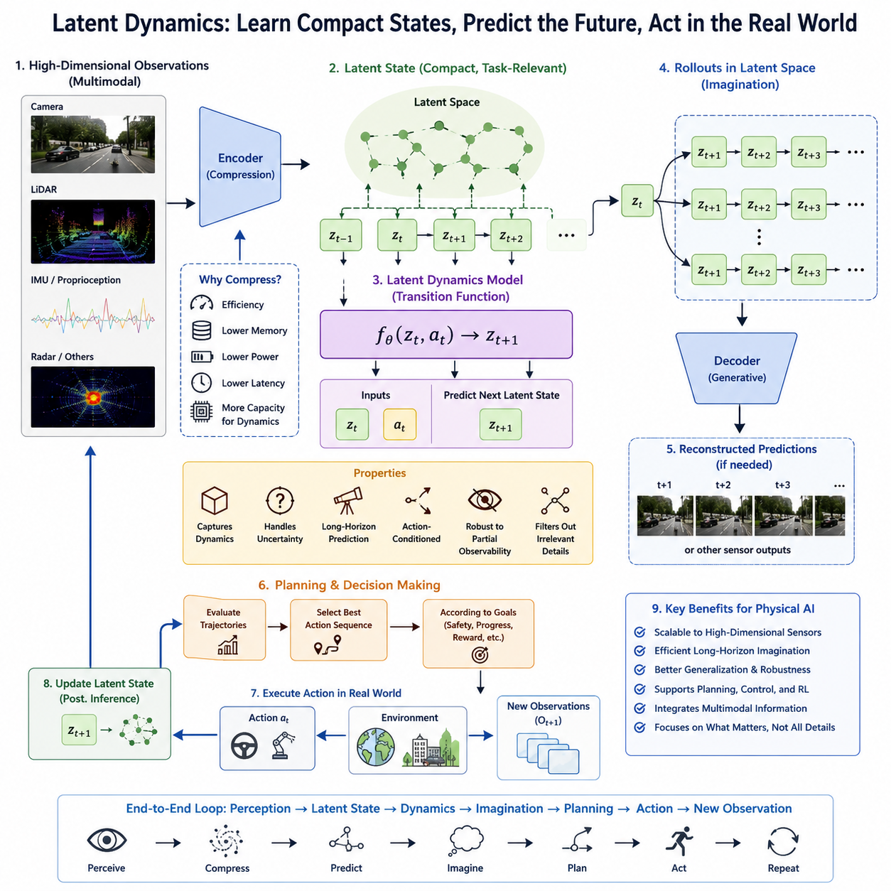{width="7.268055555555556in" height="7.268055555555556in"}

잠재 동역학 모델(Latent Dynamics Models)은 피지컬 AI(Physical AI)가 직면하는 핵심적인 어려움 중 하나를 해결한다. 실제 센서 세계(raw sensory world)는 매 순간 직접 예측하기에는 지나치게 많은 세부 정보를 포함한다. 카메라는 수백만 개의 픽셀(pixel)을 생성하고, 라이다(LiDAR)는 대규모 포인트 클라우드(point cloud)를 만들며, 고유수용성 센서(proprioceptive sensor)는 관절, 속도, 힘, 관성 측정값을 지속적으로 제공한다. 이러한 모든 관측값(observation value)을 예측하는 것은 계산 비용이 매우 높으며 지능적인 행동을 위해 항상 필요한 것도 아니다.

잠재 동역학 모델은 미래의 관측값을 직접 모델링하는 대신, 관측값을 환경의 변화 방식을 이해하는 데 중요한 정보를 보존하는 압축된 내부 상태(compact internal state)로 변환한다. 인코더(encoder)는 고차원 센서 입력(high-dimensional sensory input)을 잠재 표현(latent representation)으로 매핑하고, 동역학 모델(dynamics model)은 이 표현이 시간에 따라 어떻게 변화하는지를 예측한다. 이렇게 만들어진 내부 궤적(internal trajectory)은 모든 센서의 세부 정보를 재구성하지 않고도 미래의 세계 상태(world state)를 표현할 수 있다.

이러한 압축(compression)이 특히 중요한 이유는 관측 정보의 상당 부분이 에이전트(agent)의 현재 목표와 직접적으로 관련되지 않기 때문이다. 복도를 주행하는 이동 로봇(mobile robot)은 모든 벽의 정확한 질감이나 미세한 조명 변화를 예측할 필요가 없다. 대신 장애물(obstacle), 자유 공간(free space), 움직임(motion), 기하 구조(geometry), 주행 가능성(traversability)과 같이 미래 행동에 영향을 주는 요소를 표현해야 한다. 잠재 상태(latent state)는 계산 능력을 이러한 과제 관련 구조(task-relevant structure)에 집중할 수 있게 한다.

따라서 잠재 동역학(latent dynamics)은 물리적 중요성(physical significance)과 관측 복잡성(observational complexity)을 분리한다. 두 카메라 영상은 그림자, 반사, 노출 또는 시점 변화 때문에 픽셀 수준(pixel level)에서는 크게 다를 수 있지만 거의 동일한 물리적 상황을 나타낼 수 있다. 유용한 잠재 표현(latent representation)은 이러한 관측들을 서로 가까운 내부 상태로 매핑할 수 있다. 그러면 동역학 모델은 표면적인 시각적 변화를 예측하는 데 능력을 낭비하지 않고 의미 있는 상태 사이의 전이(transition)를 학습한다.

이 원리는 다중모달 피지컬 AI 시스템(multimodal Physical AI system)에서 더욱 중요해진다. 카메라(camera), 라이다(LiDAR), 레이더(radar), 관성 측정 장치(IMU), 위성항법시스템(GNSS), 힘 센서(force sensor), 고유수용성 정보(proprioception)는 근본적으로 서로 다른 측정 공간(measurement space)을 통해 동일한 환경을 설명한다. 각각의 모달리티(modality)를 독립적으로 예측하면 단편화된 표현(fragmented representation)이 만들어질 수 있다. 반면 공유되거나 상호 조정된 잠재 상태(shared or coordinated latent state)는 서로 보완적인 증거를 통합하여 실제 물리적 상황에 대한 압축된 표현을 형성할 수 있다.

시간적 예측(temporal prediction) 역시 잠재 공간(latent space)에서 더욱 다루기 쉬워진다. 직접적인 픽셀 예측(pixel prediction)은 수많은 저수준 변화를 표현해야 하지만, 이 가운데 상당수는 계획(planning)에 거의 영향을 주지 않는다. 잠재 예측(latent prediction)은 객체 정체성(object identity), 상대 위치(relative position), 속도(velocity), 접촉 관계(contact relationship), 장면 기하 구조(scene geometry), 에이전트 상태(agent state)와 같은 지속적인 구조에 집중할 수 있다. 즉, 모델은 모든 센서 값이 미래에 어떻게 보일지를 묻는 대신 세계의 중요한 속성이 어떻게 변화할지를 학습한다.

잠재 동역학은 부분 관측성(partial observability) 환경에서도 특히 유용하다. 로봇은 객체 가림(occlusion), 제한된 센서 범위(sensor range), 직접 측정할 수 없는 중요 변수 때문에 하나의 센서 프레임만으로 완전한 물리적 상태를 관측하는 경우가 거의 없다. 잠재 상태는 시간에 걸쳐 여러 관측을 통합함으로써 현재 보이는 정보뿐만 아니라 이전 관측에서 추론한 정보까지 포함하는 내부 신념 상태와 유사한 표현(belief-like representation)으로 기능할 수 있다.

또 다른 주요 장점은 계산 효율성(computational efficiency)이다. 피지컬 AI 시스템은 특히 로봇이나 차량에 탑재된 엣지 컴퓨터(edge computer)에서 모델을 실행할 경우 엄격한 지연시간(latency), 전력(power), 메모리(memory), 열(thermal) 제약을 받는다. 고차원 관측값을 더 작은 잠재 벡터(latent vector)나 특징 맵(feature map)으로 축소하면 시간적 예측 모듈(temporal prediction module)이 처리해야 하는 정보량을 줄일 수 있다. 그 결과 더 많은 모델 용량(model capacity)을 동역학 추론과 장기 예측(long-horizon prediction)에 사용할 수 있다.

이러한 장점은 다단계 예측(multi-step prediction)에서 더욱 중요해진다. 월드 모델(world model)은 하나의 행동을 선택하기 전에 수십 또는 수백 단계의 미래 전이(future transition)를 상상해야 할 수 있다. 각각의 가상 롤아웃(hypothetical rollout) 단계마다 완전한 해상도의 영상이나 센서 관측을 반복적으로 생성하는 것은 계산 비용 측면에서 현실적이지 않을 수 있다. 잠재 동역학은 내부 상태를 잠재 공간에서 반복적으로 미래로 전개하고, 명시적인 재구성(reconstruction)이나 시각화(visualization)가 실제로 필요한 경우에만 관측값을 디코딩(decoding)할 수 있게 한다.

이는 이해를 위한 예측(prediction for understanding)과 렌더링을 위한 예측(prediction for rendering) 사이에 중요한 차이를 만든다. 로봇은 일반적으로 복도가 계속 주행 가능한지 또는 다른 에이전트가 자신의 경로와 충돌할 가능성이 있는지를 판단하기 위해 사실적인 미래 영상(photorealistic future image)을 생성할 필요가 없다. 대신 의사결정(decision making)에 충분한 예측 변수(predictive variable)가 필요하다. 잠재 동역학은 모든 미래 상태를 완전한 합성 관측(synthetic observation)으로 생성하지 않고도 이러한 변수를 내부적으로 표현할 수 있게 한다.

잠재 예측(latent prediction)은 행동 조건부 추론(action-conditioned reasoning)도 지원한다. 물리 시스템의 미래는 현재 상태뿐만 아니라 에이전트가 어떤 행동을 수행하는지에 따라 달라진다. 조향(steering), 가속(accelerating), 제동(braking), 매니퓰레이터(manipulator)의 움직임 또는 힘의 적용은 이후의 상태를 변화시킨다. 따라서 잠재 동역학 함수(latent dynamics function)는 현재 잠재 상태와 행동(action)을 함께 입력받아 그 결과로 발생하는 다음 상태를 추정할 수 있으며, 이를 통해 가상 상호작용을 위한 압축된 학습 기반 전이 메커니즘(learned transition mechanism)을 제공한다.

이러한 전이 메커니즘이 구축되면 로봇은 행동을 물리적으로 실행하기 전에 내부적으로 평가할 수 있다. 여러 후보 행동 시퀀스(candidate action sequence)를 잠재 공간에서 미래로 롤아웃하여 서로 다른 예측 궤적(predicted trajectory)을 생성할 수 있다. 계획기(planner)는 이러한 궤적을 안전성(safety), 진행 정도(progress), 에너지 소비(energy consumption), 충돌 위험(collision risk), 보상(reward) 또는 기타 목표에 따라 비교할 수 있다. 따라서 잠재 동역학은 상상 기반 계획(imagination-based planning)과 모델 기반 강화학습(model-based reinforcement learning)을 위한 계산적 기반을 제공한다.

잠재 상태는 단순한 기존의 차원 축소(dimensionality reduction)로 이해해서는 안 된다. 효과적인 표현은 미래 결과를 예측하는 데 필요한 정보를 유지하면서 중요하지 않은 세부 정보는 제거해야 한다. 이는 압축(compression), 예측 가능성(predictability), 제어 가능성(controllability), 의미론(semantics), 기하 구조(geometry), 시간적 지속성(temporal persistence)이 내부 상태가 무엇을 표현해야 하는지에 영향을 미치는 표현 학습 문제(representation-learning problem)를 형성한다.

지나친 압축은 정확한 동역학 예측에 필요한 변수를 제거할 수 있으며, 반대로 압축이 부족하면 관측 공간 모델링(observation-space modeling)의 복잡성을 다시 가져오게 된다. 따라서 바람직한 잠재 표현은 이 두 극단 사이에 위치해야 한다. 효율적인 예측을 수행할 만큼 충분히 압축되어 있으면서도 미래 변화, 행동의 결과, 불확실성(uncertainty), 계획에 중요한 차이를 유지할 수 있을 만큼 충분한 표현력(expressiveness)을 가져야 한다.

확률성(stochasticity)은 잠재 모델링(latent modeling)의 필요성을 더욱 강화한다. 실제 물리 환경에는 하나의 결정론적 궤적(deterministic trajectory)만으로 적절하게 표현하기 어려운 미래가 존재한다. 사람, 차량, 이동 가능한 객체, 환경적 과정은 여러 가지 타당한 방식으로 변화할 수 있기 때문이다. 확률적 잠재 동역학(stochastic latent dynamics)은 미래 상태에 대한 확률분포(distribution)를 표현하여 가능한 모든 미래 관측을 명시적으로 생성하지 않고도 여러 미래 가설(multiple hypotheses)을 유지할 수 있게 한다.

잠재 동역학은 지각(perception)과 제어(control)를 연결하는 자연스러운 다리 역할도 한다. 지각은 센서 스트림(sensor stream)을 내부 상태로 변환하고, 동역학은 그 상태가 어떻게 변화할지를 예측하며, 계획은 예측된 상태 궤적을 탐색하여 행동을 선택한다. 제어 시스템은 선택된 행동을 실제 물리 시스템에 적용하고, 그 결과 새로운 관측이 발생하여 다시 잠재 상태를 갱신한다. 따라서 월드 모델은 독립된 예측 구성요소가 아니라 지속적으로 순환하는 지각-예측-행동 루프(perception-prediction-action loop)의 일부가 된다.

피지컬 AI에서 이러한 루프는 매우 중요하다. 지능 시스템은 막대한 센서 복잡성(sensor complexity)을 처리하면서 동시에 실제 세계의 시간 제약(real-world time constraint) 안에서 작동해야 하기 때문이다. 잠재 동역학은 원시 측정값(raw measurement)과 물리적 추론(physical reasoning) 사이에 실용적인 추상화 계층(abstraction layer)을 제공한다. 무엇을 보존하고 무엇을 무시할지, 그리고 의미 있는 내부 상태가 어떻게 변화하는지를 학습함으로써 확장 가능한 예측(scalable prediction), 효율적인 상상(efficient imagination), 장기 계획(long-horizon planning), 그리고 궁극적으로 물리 세계와의 더욱 지능적인 상호작용을 가능하게 한다.

## 03.02. Encoder Dynamics Decoder Architecture

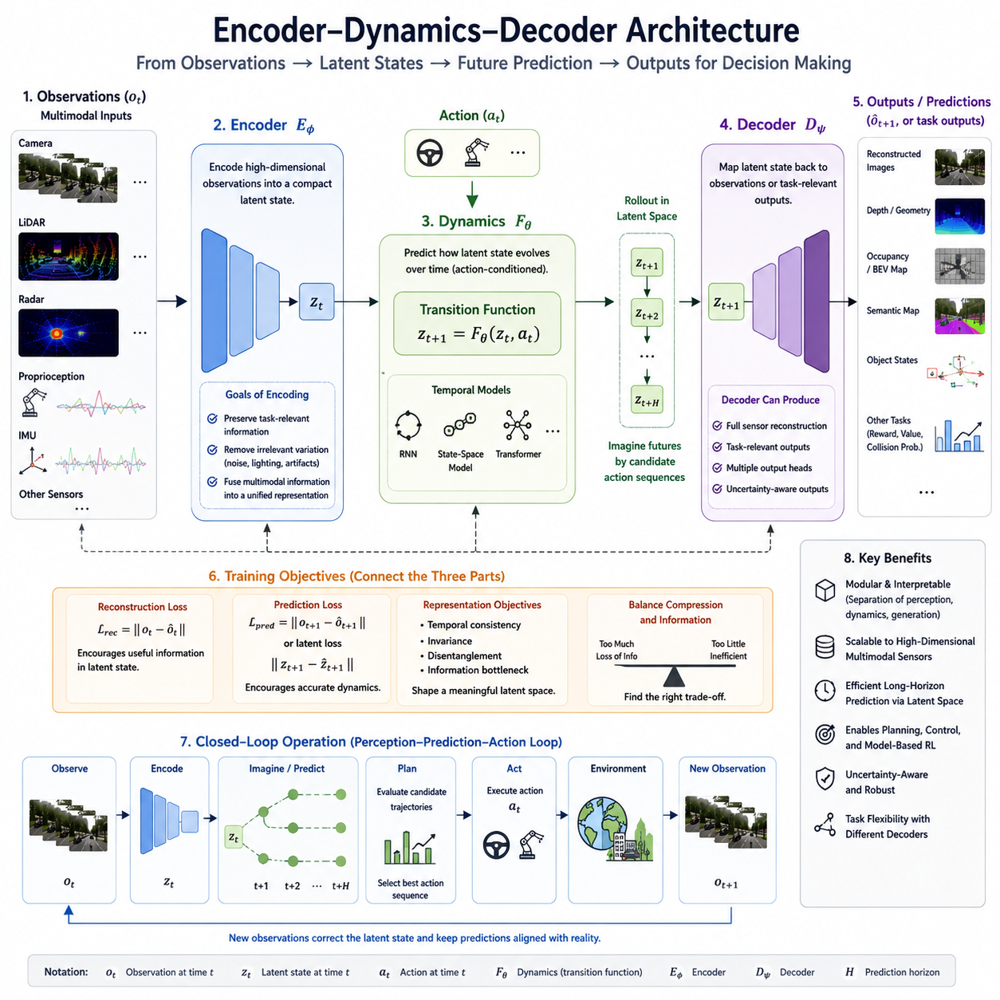{width="7.268055555555556in" height="7.268055555555556in"}

인코더-동역학-디코더 아키텍처(Encoder-Dynamics-Decoder Architecture)는 월드 모델(world model)이 복잡한 관측값(observation)을 압축된 내부 상태(internal state)로 변환하고, 이러한 상태가 어떻게 변화하는지를 예측한 다음, 필요한 경우 의미 있는 관측값을 다시 복원할 수 있도록 하는 구조화된 방법을 제공한다. 하나의 네트워크가 지각(perception), 시간적 추론(temporal reasoning), 생성을 동시에 수행하도록 강제하는 대신, 이 아키텍처는 이러한 기능을 공유 잠재 표현(shared latent representation)을 통해 연결하면서 각각 최적화할 수 있는 구성요소로 분리한다.

인코더(encoder)는 모델의 지각 입력부(perceptual entrance)를 형성한다. 시간 (t)에서 관측값 (o_t)는 카메라 영상, 라이다(LiDAR) 측정값, 레이더(radar) 반사 신호, 고유수용성 정보(proprioception), 관성 측정 장치(IMU) 신호 또는 기타 센서 정보를 포함할 수 있다. 인코더 (E_\\phi)는 이러한 고차원 측정값을 잠재 상태 (z_t = E_\\phi(o_t))로 변환하여 관측의 복잡성을 줄이면서 미래 예측과 상호작용에 필요한 정보를 보존하려 한다.

인코딩(encoding)은 단순한 데이터 압축(data compression) 이상의 의미를 가진다. 유용한 잠재 상태(latent state)는 객체 위치, 속도, 기하 구조(geometry), 접촉 조건(contact condition), 에이전트 구성(agent configuration), 주행 가능성(traversability), 환경적 맥락(environmental context)처럼 미래의 변화에 영향을 미치는 물리적·의미론적 속성을 유지해야 한다. 동시에 영상 노이즈, 미세한 조명 변화, 중복 픽셀, 센서 고유의 인공적 오류(sensor-specific artifact)처럼 예측이나 의사결정에 거의 기여하지 않는 변화는 억제해야 한다.

다중모달 피지컬 AI(multimodal Physical AI)에서는 서로 다른 센서 스트림(sensor stream)을 모달리티별 인코더(modality-specific encoder)로 처리한 후, 그 특징을 공통 잠재 표현(common latent representation)으로 융합할 수 있다. 카메라는 외형과 의미 정보를, 라이다는 기하 구조와 깊이 정보를, 레이더는 가시성이 좋지 않은 환경에서도 움직임 정보를, 고유수용성 정보는 로봇 자체의 상태를 제공할 수 있다. 따라서 생성된 잠재 상태는 환경과 체화된 에이전트(embodied agent)를 하나의 통합된 내부 좌표계(unified internal coordinate system) 안에서 표현할 수 있다.

동역학 구성요소(dynamics component)는 원시 관측값(raw observation)을 직접 처리하는 대신 이러한 잠재 표현을 기반으로 동작한다. 기본적인 역할은 내부 상태가 시간에 따라 어떻게 변화하는지를 추정하는 것이다. 가장 단순한 형태에서 상태 전이(state transition)는 (z_{t+1}=F_\\theta(z_t))로 표현할 수 있다. 자신의 행동이 환경을 변화시키는 체화된 에이전트의 경우에는 행동 조건부 동역학(action-conditioned dynamics)인 (z_{t+1}=F_\\theta(z_t,a_t))가 더욱 유용하며, 여기서 (a_t)는 현재 상태에서 실행되는 행동을 나타낸다.

이러한 행동 조건화(action conditioning)는 수동적인 예측 모델(passive predictive model)과 상호작용형 월드 모델(interactive world model)을 구분하는 중요한 특징이다. 로봇은 환경이 독립적으로 어떻게 변화하는지만 관찰하는 것이 아니다. 조향 명령, 바퀴 속도, 관절 움직임, 힘, 파지(grasp)와 같은 로봇의 행동이 이후의 물리적 상태에 직접 영향을 미친다. 이러한 관계를 잠재 공간(latent space)에서 학습하면 동역학 모델은 다음에 무엇이 일어날지뿐만 아니라 특정 행동을 수행했을 때 무엇이 일어날지도 예측할 수 있다.

전이 모델(transition model)은 시간적 구조와 응용 분야에 따라 다양한 아키텍처 형태를 사용할 수 있다. 순환 신경망(recurrent network)은 압축된 순차 상태(sequential state)를 유지할 수 있고, 상태 공간 모델(state-space model)은 변화하는 은닉 변수(hidden variable)를 명시적으로 표현할 수 있으며, 트랜스포머 기반 모델(Transformer-based model)은 보다 긴 시간적 맥락에 걸친 의존 관계를 포착할 수 있다. 구현 방식과 관계없이 핵심 목표는 동일하며, 예측된 잠재 상태가 실제로 가능한 미래 물리 상황을 의미 있게 표현하도록 충분한 시간적 구조를 유지하는 것이다.

다단계 예측(multi-step prediction)은 동역학 모델을 반복적으로 적용하여 수행한다. (z_t)에서 시작하여 모델은 (z_{t+1})을 예측하고, 다시 (z_{t+2})를 예측하며 원하는 예측 지평(prediction horizon)까지 계속 진행한다. 행동이 포함되는 경우 후보 행동 시퀀스 (a_t,a_{t+1},\...,a_{t+H-1})는 이에 대응하는 가상의 잠재 궤적(imagined latent trajectory)을 생성한다. 이를 통해 동역학 모듈은 모든 후보 행동을 물리적으로 실행하지 않고도 가능한 미래를 평가할 수 있는 내부 시뮬레이터(internal simulator)가 된다.

디코더(decoder)는 잠재 공간에서 다시 관측값 또는 사람이 해석할 수 있는 출력(interpretable output)으로 변환하는 상보적인 역할을 수행한다. 디코더 (D_\\psi)는 (\\hat{o}\*t=D\*\\psi(z_t))와 같이 영상, 깊이(depth), 점유 정보(occupancy), 의미 지도(semantic map), 센서 특징 또는 기타 표현을 복원할 수 있다. 재구성(reconstruction)은 잠재 상태가 유용한 정보를 유지하도록 유도할 수 있으며, 내부 모델이 무엇을 보존하고 무엇을 예측했는지를 직접 확인할 수 있는 방법도 제공한다.

그러나 디코더가 항상 모든 원시 센서 측정값(raw sensor measurement)을 재구성해야 하는 것은 아니다. 계획(planning)과 제어(control)를 위해 완전한 사실적 영상(photorealistic image)을 생성하는 것은 행동 선택을 개선하지 않으면서 상당한 계산량만 추가할 수 있다. 따라서 디코더는 미래 점유 상태(future occupancy), 객체 움직임(object motion), 충돌 확률(collision probability), 주행 가능성, 보상(reward), 가치(value)와 같은 과제 관련 정보(task-relevant quantity)를 생성할 수 있다. 일부 잠재 예측 아키텍처는 주로 표현 공간(representation space)에서 동작하며 명시적인 관측 디코더를 거의 사용하지 않거나 전혀 사용하지 않을 수도 있다.

따라서 세 구성요소는 관측에서 표현으로, 표현에서 미래 표현으로, 그리고 표현에서 다시 해석 가능한 출력으로 이어지는 변환 체인(transformation chain)을 형성한다. 개념적으로 이는 (o_t \\rightarrow E_\\phi \\rightarrow z_t \\rightarrow F_\\theta \\rightarrow z_{t+1} \\rightarrow D_\\psi \\rightarrow \\hat{o}_{t+1})로 표현할 수 있다. 중간의 잠재 상태는 지각 표현(perceptual representation)과 시간적 예측을 분리하며, 각 단계가 서로 다른 계산 문제에 특화될 수 있도록 한다.

학습(training) 과정에서는 여러 상호보완적인 목적 함수(objective)를 통해 이러한 구성요소를 연결할 수 있다. 재구성 손실(reconstruction loss)은 디코더가 인코딩된 상태로부터 정보를 복원하도록 유도하고, 예측 손실(prediction loss)은 예측된 잠재 상태 또는 디코딩된 관측값이 실제 미래 데이터와 일치하도록 요구한다. 표현 학습 목적(representation objective)은 시간적 일관성(temporal consistency), 불변성(invariance), 의미 있는 상태 사이의 구별을 강화할 수 있다. 이들의 균형에 따라 학습된 잠재 공간이 시각적 충실도, 동역학, 의미론, 제어 관련성 또는 이러한 특성들의 조합 가운데 무엇을 강조할지가 결정된다.

중요한 설계 문제 가운데 하나는 인코더와 디코더가 동역학 학습 목표(dynamics objective)를 압도하지 않도록 하는 것이다. 재구성 정확도에 지나치게 높은 비중을 두면 잠재 표현이 물리적 추론에는 중요하지 않으면서 예측하기에는 비용이 많이 드는 세밀한 센서 정보를 유지할 수 있다. 반대로 지나친 압축은 미래 전이를 모델링하는 데 필요한 변수를 제거할 수 있다. 따라서 성공적인 아키텍처는 효율적인 롤아웃(rollout)이 가능할 만큼 압축되면서도 예측과 후속 의사결정에 충분한 정보를 유지하는 표현을 추구한다.

불확실성(uncertainty) 역시 이 아키텍처에 통합할 수 있다. 하나의 (z_{t+1})만 예측하는 대신 확률적 동역학(stochastic dynamics)은 가능한 다음 잠재 상태들의 확률분포를 표현할 수 있다. 이는 관측 정보가 불완전하거나 다른 에이전트 및 환경 과정에 여러 개의 가능한 미래가 존재할 때 유용하다. 이후 디코더 또는 후속 예측 헤드(prediction head)는 이러한 대안적인 잠재 미래를 계획과 위험 평가(risk assessment)에 필요한 불확실성 인식 추정값(uncertainty-aware estimate)으로 변환할 수 있다.

이 아키텍처는 자연스럽게 폐루프 동작(closed-loop operation)을 지원한다. 새로운 관측은 현재 잠재 상태로 인코딩되고, 동역학 모델은 가능한 미래 전이를 상상하며, 계획기(planner)는 후보 궤적을 평가한다. 행동이 선택되어 실행되면 새로운 센서 관측이 발생하고 다시 인코딩된다. 따라서 예측과 실제 관측이 지속적으로 서로를 보정할 수 있으며, 월드 모델이 현실과 점차 멀어질 수 있는 내부의 가상 궤적에 무한정 의존하는 것을 방지할 수 있다.

피지컬 AI에서 인코더-동역학-디코더 아키텍처가 중요한 이유는 세 가지 근본적인 질문을 분리할 수 있기 때문이다. 현재 무엇이 일어나고 있는가, 다음에는 무엇이 일어날 가능성이 있는가, 그리고 예측된 정보 가운데 어떤 정보를 해석이나 행동을 위해 외부로 제공해야 하는가라는 질문이다. 이러한 분리는 잠재 월드 모델링(latent world modeling)을 위한 확장 가능한 기반을 제공하며, 순환 상태 공간 모델(recurrent state-space model), 확률적 잠재 동역학(stochastic latent dynamics), 장기 롤아웃(long-horizon rollout), 행동 조건부 예측(action-conditioned prediction), 계획, 제어, 모델 기반 강화학습(model-based reinforcement learning)으로 자연스럽게 확장된다.

## 03.03. Latent State Representation

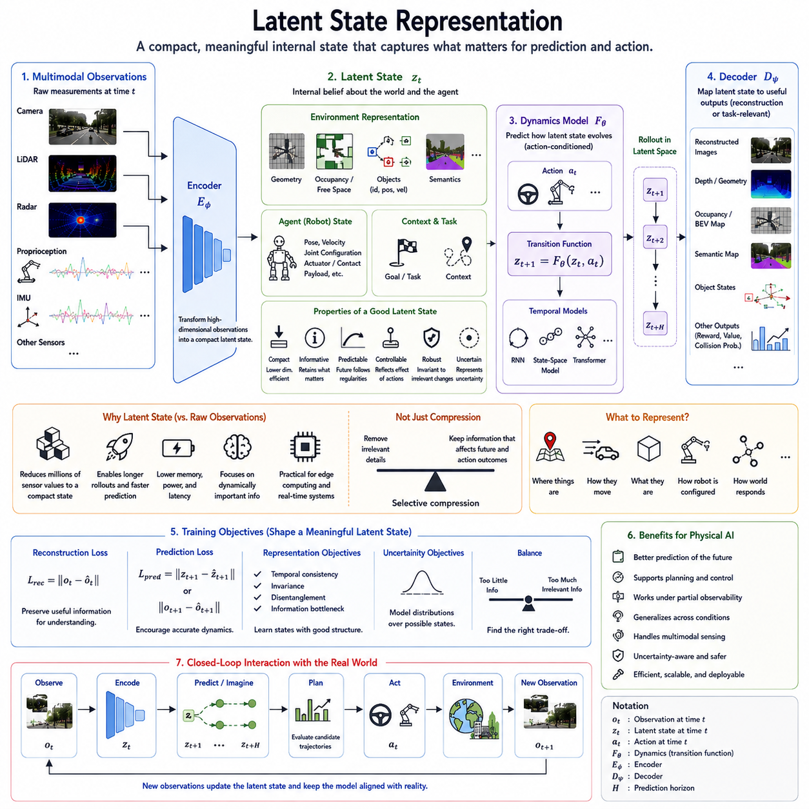{width="7.268055555555556in" height="7.268055555555556in"}

잠재 상태 표현(Latent State Representation)은 월드 모델(world model)이 현재 물리적 환경에 대해 무엇을 파악하고 있다고 판단하는지를 요약하는 내부 표현(internal description)이다. 모든 카메라 픽셀, 라이다(LiDAR) 포인트, 레이더(radar) 반사 신호 또는 고유수용성 측정값(proprioceptive measurement)을 각각 저장하는 대신, 모델은 관측값을 압축된 상태 (z_t)로 변환한다. 이 상태는 현재 상황을 이해하고, 미래 전이를 예측하며, 효과적인 행동을 지원하는 데 필요한 정보를 유지하도록 설계된다.

잠재 상태(latent state)는 원시 관측값(raw observation)과 근본적으로 다르다. 관측값 (o_t)는 특정 시점에 센서가 측정한 것을 나타내는 반면, (z_t)는 그러한 측정값을 발생시킨 근본적인 상황(underlying situation)을 표현하려 한다. 따라서 조명, 시점, 노이즈 패턴 또는 센서 특성이 서로 다른 여러 관측값이라도 본질적으로 동일한 물리적 구성을 나타낸다면 유사한 잠재 상태에 대응할 수 있다.

피지컬 AI(Physical AI)를 위한 유용한 잠재 표현(latent representation)은 환경과의 상호작용에 영향을 미치는 속성을 포착해야 한다. 여기에는 공간 기하 구조(spatial geometry), 객체 정체성(object identity), 위치(position), 속도(velocity), 방향(orientation), 자유 공간(free space), 점유 상태(occupancy), 주행 가능성(traversability), 접촉 관계(contact relationship), 로봇 구성(robot configuration), 과제 관련 의미론적 맥락(task-relevant semantic context) 등이 포함될 수 있다. 모든 속성이 명시적으로 이름이 부여된 변수로 나타날 필요는 없으며, 많은 속성은 학습된 특징 전체에 암묵적으로 분산되어 있으면서도 예측과 제어에 영향을 줄 수 있다.

압축성(compactness)은 잠재 표현을 사용하는 핵심적인 이유 중 하나이다. 현대의 로봇은 각각의 지각 주기(perception cycle)마다 수백만 개의 센서 값을 수신할 수 있으므로 이를 직접 이용한 시간적 추론(temporal reasoning)은 많은 계산 비용을 요구한다. 이러한 관측값을 저차원 표현(lower-dimensional representation)으로 매핑하면 동역학 모델(dynamics model)의 계산 부담을 줄일 수 있다. 이를 통해 더 빠른 추론, 더 긴 예측 롤아웃(predictive rollout), 메모리 사용량 감소, 전력 및 열 제약이 있는 엣지 컴퓨팅(edge computing) 플랫폼에서의 현실적인 배치가 가능해진다.

그러나 압축성만으로 좋은 잠재 상태를 정의할 수는 없다. 표현을 매우 작게 만들면서 미래 예측에 필수적인 정보를 제거할 수도 있기 때문이다. 따라서 목표는 선택적 압축(selective compression)이다. 중요하지 않은 관측 세부 정보는 제거하면서 동역학적으로 중요한 변수(dynamically important variable)는 유지해야 한다. 잠재 상태는 서로 다른 미래 결과를 발생시키거나 서로 다른 행동을 요구할 수 있는 상황을 구분하기에 충분한 정보를 보존해야 한다.

시간적 충분성(temporal sufficiency)은 특히 중요하다. 두 관측값이 시각적으로 비슷해 보이더라도 객체가 서로 다른 방향으로 이동하고 있다면 미래 상태는 크게 달라질 수 있다. 현재 프레임만으로 생성된 잠재 상태는 이러한 차이를 구분하지 못할 수 있다. 관측 이력(observation history)을 통합하면 표현에 움직임, 시간적 추세(temporal trend), 은닉 변수(hidden variable) 및 기타 정보를 포함할 수 있으며, 이를 통해 현재 보이는 것을 단순히 설명하는 것을 넘어 다음에 무엇이 일어날지를 예측할 수 있다.

이러한 특성 때문에 잠재 상태 표현은 부분 관측 시스템(partially observable system)에서 사용되는 신념 상태(belief state)와 밀접하게 관련된다. 물리적 에이전트(physical agent)는 객체 가림(occlusion), 제한된 센서 범위, 측정 노이즈, 즉시 감지할 수 없는 다양한 물리적 속성 때문에 완전한 세계를 직접 관측하는 경우가 거의 없다. 잠재 표현은 현재 관측과 이전 상태의 기억(memory)을 통합하여 관련 조건이 직접적인 관측에서 일시적으로 사라진 경우에도 그 상태에 대한 추정값을 유지할 수 있다.

잠재 상태는 여러 수학적 형태(mathematical form)로 표현될 수 있다. 압축 벡터(compact vector)는 환경의 전역 상태(global state)를 요약할 수 있으며, 공간 특징 맵(spatial feature map)은 기하학적 구조를 유지할 수 있다. 객체 중심 토큰(object-centric token)의 집합은 객체와 객체 사이의 관계를 표현할 수 있고, 구조화된 잠재 변수(structured latent variable)는 기하 구조, 의미론, 움직임 또는 에이전트 상태를 분리하여 나타낼 수 있다. 적절한 표현 방식은 어떤 정보를 예측해야 하는지와 후속 계획 또는 제어 시스템이 그 정보를 어떻게 사용할지에 따라 달라진다.

공간 구조(spatial structure)는 이동 로봇(mobile robot)과 자율 시스템(autonomous system)에서 특히 중요하다. 전체 환경을 하나의 비구조화된 벡터(unstructured vector)로 압축하면 기하학적 추론(geometric reasoning)이 어려워질 수 있다. 특징 그리드(feature grid), 조감도 특징(Bird\'s-Eye-View feature), 점유 중심 특징(occupancy-oriented feature), 학습된 공간 토큰(learned spatial token)과 같은 공간 잠재 표현(spatial latent representation)은 위치 사이의 관계를 유지한다. 이를 통해 후속 동역학 및 계획 모듈이 미래 움직임, 충돌, 주행 가능성 및 상호작용을 보다 쉽게 추론할 수 있다.

객체 중심 잠재 표현(object-centric latent representation)은 또 다른 유용한 추상화(abstraction)를 제공한다. 장면을 하나의 균일한 특징 필드(feature field)로 처리하는 대신, 모델은 관련 객체를 각각 별도의 잠재 변수나 토큰으로 표현할 수 있다. 각각의 표현에는 위치, 속도, 방향, 범주(category), 상호작용 상태(interaction state)와 같은 속성이 포함될 수 있다. 그러면 동역학 모델은 개별 객체의 움직임뿐만 아니라 객체들 사이, 로봇과 객체 사이, 그리고 주변 환경과의 관계 및 잠재적인 상호작용까지 모델링할 수 있다.

잠재 표현은 체화된 에이전트(embodied agent) 자체도 표현해야 한다. 외부 환경만 인코딩하는 월드 모델은 물리적 행동의 결과를 완전히 예측할 수 없다. 로봇 자세(robot pose), 속도, 관절 구성(joint configuration), 액추에이터 상태(actuator condition), 접촉 상태(contact state), 페이로드(payload) 및 기타 고유수용성 변수는 미래 전이에 영향을 줄 수 있다. 따라서 잠재 상태는 외부 세계에 대한 표현과 그 세계 안에서 행동하는 에이전트의 내부 표현을 결합할 수 있다.

다중모달 센싱(multimodal sensing)은 각각의 모달리티(modality)가 독립적인 잠재 공간을 유지해야 하는지, 아니면 공유 표현(shared representation)에 기여해야 하는지라는 문제를 제기한다. 모달리티별 특징(modality-specific feature)은 카메라, 라이다, 레이더, 관성 측정 장치(IMU), 고유수용성 정보가 가진 고유한 정보를 보존할 수 있으며, 공유 잠재 상태(shared latent state)는 이들이 물리적 세계에 대해 제공하는 공통적인 해석을 포착할 수 있다. 하이브리드 접근법(hybrid approach)은 모달리티별 특징을 유지하면서 예측, 추론 및 제어를 위한 융합 특징(fused feature)을 동시에 구성할 수 있다.

강건한 잠재 표현(robust latent representation)은 근본적인 물리적 상황을 변화시키지 않는 관측 변화에 대해서는 비교적 불변성(invariance)을 유지해야 한다. 조명, 미세한 센서 노이즈, 질감(texture), 날씨 또는 시점의 변화가 내부 상태를 불필요하게 크게 변화시켜서는 안 된다. 반면 장애물이 이동 경로에 진입하거나, 노면이 위험해지거나, 다른 에이전트의 속도가 변화하는 것처럼 물리적으로 중요한 차이에는 민감하게 반응해야 한다.

예측 가능성(predictability) 역시 바람직한 특성이다. 현재 관측값을 재구성하는 것만을 목적으로 설계된 표현은 예측하기 어렵거나 불필요한 많은 세부 정보를 유지할 수 있다. 반면 잠재 월드 모델(latent world model)은 미래 변화가 학습 가능한 규칙성을 따르는 상태로부터 이점을 얻는다. 따라서 표현 학습(representation learning)과 동역학 학습(dynamics learning)은 강하게 결합되어 있으며, 인코더는 동역학 모델이 예측할 수 있는 상태를 구성하고 동역학 학습 목표는 인코더가 시간적으로 의미 있는 구조를 발견하도록 유도한다.

제어 가능성(controllability) 또한 표현 품질에 영향을 미친다. 두 상태가 지각적으로는 비슷하게 보이더라도 마찰(friction), 접촉(contact), 페이로드, 지형(terrain) 또는 숨겨진 기계적 조건(hidden mechanical condition)에 따라 동일한 행동에 서로 다르게 반응할 수 있다. 이러한 차이가 행동 결과에 영향을 준다면 잠재 상태는 이를 보존해야 한다. 따라서 피지컬 AI에 유용한 표현은 세계가 어떻게 보이는지를 설명하는 것뿐만 아니라 에이전트가 행동했을 때 세계가 어떻게 반응할지를 결정하는 속성까지 표현해야 한다.

불확실성(uncertainty)은 압축 과정에서 반드시 제거되어야 하는 정보가 아니다. 관측값이 모호한 상황에서 모델이 하나의 정확한 잠재 해석만을 강제로 선택하도록 하면 지나치게 확신하는 예측(overconfident prediction)이 발생할 수 있다. 확률적 또는 확률론적 잠재 표현(probabilistic or stochastic latent representation)은 숨겨진 조건이나 여러 가능한 해석에 대한 불확실성을 유지할 수 있다. 이후 미래 동역학은 이러한 불확실성을 전파하여 계획 시스템이 예측 가능한 궤적과 추가적인 주의, 센싱 또는 대안적 행동이 필요한 미래를 구분하도록 할 수 있다.

잠재 상태의 품질은 궁극적으로 그것이 후속 단계에서 무엇을 가능하게 하는지를 통해 결정된다. 동역학 모델이 이를 일관성 있게 예측하고, 계획기(planner)가 이를 이용해 미래 가능성을 평가하며, 제어기(controller)가 효과적인 행동을 선택할 수 있고, 관측값에 노이즈가 발생하거나 불완전해져도 시스템이 강건하게 동작할 때 그 표현은 가치가 있다. 따라서 재구성 품질(reconstruction quality)만으로는 충분하지 않으며, 예측 정확도, 시간적 일관성, 제어 성능, 일반화(generalization), 계획 유용성(planning utility)이 더욱 의미 있는 평가 기준이 된다.

잠재 동역학 프레임워크(latent dynamics framework)에서 잠재 상태는 지각(perception), 기억(memory), 예측(prediction), 행동(action)이 만나는 계산적 중심점(computational meeting point)이 된다. 관측값은 (z_t)를 갱신하고, 동역학 모델은 (z_t)를 가능한 미래 상태로 변환하며, 후보 행동(candidate action)은 이러한 예측 전이를 변화시킨다. 압축되어 있으면서도 물리적으로 의미 있는 내부 표현을 학습함으로써 월드 모델은 피지컬 AI가 실제 세계를 기억하고, 예측하고, 상상하고, 계획하며, 상호작용할 수 있는 실용적인 상태 공간(state space)을 확보하게 된다.

## 03.04. Recurrent State Space Models

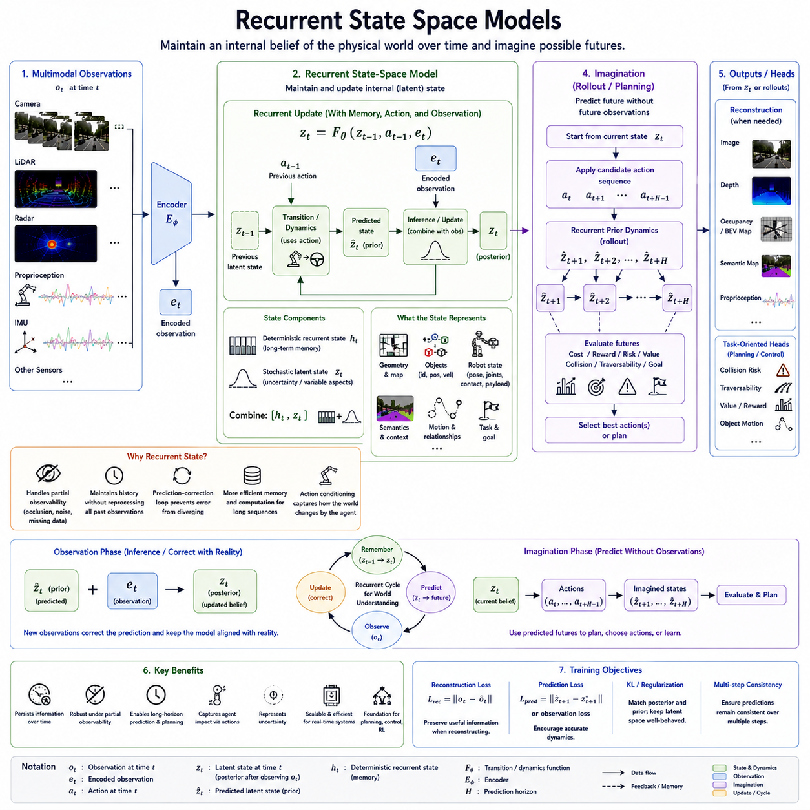{width="7.268055555555556in" height="7.268055555555556in"}

순환 상태 공간 모델(Recurrent State Space Models)은 시간의 흐름에 따라 물리적 환경에 대한 내부 이해를 지속적으로 유지해야 하는 월드 모델(world model)을 위한 실용적인 프레임워크를 제공한다. 각각의 관측값(observation)을 독립적으로 처리하는 대신, 이전의 내부 정보, 새로운 관측값, 그리고 종종 에이전트(agent)의 행동을 사용하여 은닉 상태(hidden state) 또는 잠재 상태(latent state)를 재귀적으로 갱신한다. 이를 통해 피지컬 AI(Physical AI) 시스템은 개별 센서 측정값이 불완전한 상황에서도 시간적으로 연속적인 표현(temporally continuous representation)을 구축할 수 있다.

기본적인 상태 공간 관점(state-space perspective)은 근본적인 상태(underlying state)와 그 상태로부터 생성되는 관측값을 분리한다. 시간 (t)에서 에이전트는 관측값 (o_t)를 수신하고, 내부 상태 (z_t)는 세계에 대해 중요하다고 판단되는 정보를 요약한다. 전이 모델(transition model)은 이 상태가 어떻게 변화하는지를 예측하며, 관측 모델(observation model) 또는 표현 모델(representation model)은 센서 측정값을 예측에 사용되는 내부 상태와 연결한다.

순환성(recurrence)은 이러한 아키텍처에 기억(memory)을 제공한다. (o_t)만을 사용하여 (z_t)를 추정하는 대신, 모델은 (z_{t-1})에서 전달된 정보를 함께 사용한다. 개념적으로 이러한 갱신은 (z_t = F_\\theta(z_{t-1}, a_{t-1}, o_t))로 표현할 수 있다. 이전 상태는 과거의 맥락(historical context)을 제공하고, 행동(action)은 에이전트가 세계를 어떻게 변화시키려고 했는지를 나타내며, 새로운 관측값은 내부 추정값을 보정하기 위한 증거를 제공한다.

이러한 구조는 부분 관측성(partial observability) 환경에서 특히 유용하다. 카메라는 일시적으로 객체를 놓칠 수 있고, 라이다(LiDAR)는 가림(occlusion)의 영향을 받을 수 있으며, 위성항법시스템(GNSS)의 정확도가 저하될 수도 있고, 일부 물리적 속성은 직접 측정 자체가 불가능할 수 있다. 순환 상태(recurrent state)는 이전에 추론된 정보를 유지하면서 이후의 증거와 결합할 수 있다. 따라서 모델은 현재 센서 프레임에 보이는 정보에만 전적으로 의존하지 않고 신념 상태와 유사한 내부 상태(belief-like internal state)를 유지한다.

많은 현대 잠재 월드 모델(latent world model)은 결정론적 순환 기억(deterministic recurrent memory)과 확률적 잠재 변수(stochastic latent variable)를 구분한다. 결정론적 은닉 상태 (h_t)는 순환 전이(recurrent transition)를 통해 시간적 정보를 축적할 수 있으며, 확률적 상태 (z_t)는 현재 상황의 불확실하거나 가변적인 측면을 표현한다. 이 변수들을 함께 사용하면 지속적인 기억과 관측만으로 정확하게 결정할 수 없는 물리적 상태의 불확실성을 표현하는 메커니즘을 동시에 제공할 수 있다.

따라서 일반적인 순환 상태 공간 모델은 서로 밀접하게 관련된 두 가지 과정을 포함한다. 관측 과정(observation)에서는 추론 모델(inference model) 또는 사후 모델(posterior model)이 예측된 내부 상태와 실제 관측값을 결합하여 현재 잠재 상태를 추정한다. 상상 과정(imagination)에서는 사전 모델(prior model)이 순환 상태와 후보 행동(candidate action)만을 사용하여 미래 잠재 상태를 예측한다. 이러한 구분을 통해 동일한 월드 모델이 현실로부터 학습하고 이후에는 미래 관측값 없이도 미래를 시뮬레이션할 수 있다.

관측 단계(observation phase)는 내부 모델을 지속적으로 현실에 고정한다. 새로운 센서 측정값이 입력되면 인코딩된 표현(encoded representation)이 순환 예측(recurrent prediction)과 결합되어 현재 상태를 갱신한다. 모델이 하나의 상황을 예상했지만 센서가 다른 상황을 나타낸다면 추론된 상태가 기존 예측을 보정할 수 있다. 이러한 반복적인 예측-보정 메커니즘(prediction-and-correction mechanism)은 정상적인 폐루프 동작(closed-loop operation)에서 오차가 무한정 누적되는 것을 방지하는 데 도움을 준다.

상상 단계(imagination phase)에서는 미래 관측값에 대한 접근이 제거된다. 현재 추론된 상태에서 시작하여 모델은 후보 행동을 적용하고 이후의 상태를 반복적으로 예측한다. (a_t, a_{t+1}, \..., a_{t+H-1})과 같은 행동 시퀀스(action sequence)는 (z_t)에서 (z_{t+H})까지 이어지는 가상의 궤적(imagined trajectory)을 생성할 수 있다. 계획(planning)은 실제 물리 환경에서 모든 후보 행동을 실행하지 않고도 여러 가상의 미래를 평가할 수 있다.

순환성은 매 단계마다 전체 이력(history)을 다시 처리할 필요가 없기 때문에 이러한 롤아웃(rollout)을 계산적으로 효율적으로 만든다. 중요한 과거 정보는 이미 순환 상태 내부에 요약되어 있다. 각각의 전이는 이 압축된 기억(compact memory)을 점진적으로 갱신한다. 엣지 기반 피지컬 AI(edge-based Physical AI)에서는 이를 통해 반복적인 계산을 줄이고 카메라, 라이다, 관성 측정 장치(IMU), 고유수용성 정보(proprioception) 및 기타 센서에서 지속적으로 들어오는 데이터 스트림에 대한 실시간 시간적 추론(real-time temporal reasoning)을 지원할 수 있다.

모델이 체화된 에이전트(embodied agent)를 표현하는 경우 행동 조건화(action conditioning)는 필수적이다. 하나의 상태에서 다음 상태로의 전이는 환경 자체의 동역학뿐만 아니라 로봇이 실행한 모터 명령(motor command)에 의해서도 결정된다. 바퀴 속도는 차량의 자세를 변화시키고, 관절 명령은 매니퓰레이터(manipulator)의 구성을 변화시키며, 접촉 행동(contact action)은 객체 사이의 관계를 변화시킨다. (a_t)를 포함함으로써 순환 상태 공간 모델은 물리적 결과가 에이전트의 행동에 따라 어떻게 달라지는지를 학습할 수 있다.

순환 상태는 단순히 관측값을 기억하는 것이 아니라 미래 예측에 충분한 정보(sufficient information)를 포함해야 한다. 이를 통해 모델은 움직임, 객체 관계(object relationship), 기하 구조(geometry), 로봇 구성(robot configuration) 및 기타 동역학적으로 중요한 속성과 같은 지속적인 변수를 유지하도록 학습된다. 미래 전이에 거의 영향을 주지 않는 정보는 압축하여 제거할 수 있으므로, 정확한 센서 이력의 재현보다는 예측과 상호작용을 중심으로 구성된 내부 기억을 형성할 수 있다.

학습(training)에서는 일반적으로 관측값으로부터 추론된 상태와 동역학 모델이 예측한 상태 사이의 일관성(consistency)이 요구된다. 관측 조건부 사후 모델(observation-conditioned posterior)은 예측 사전 모델(predictive prior)이 사용할 수 없는 실제 관측 증거에 접근할 수 있으므로 현재 잠재 상태에 대해 더 강력한 추정값을 제공할 수 있다. 학습은 사전 모델이 이전 상태와 행동 정보만을 사용하여 이러한 추론 상태를 근사하도록 유도하며, 이를 통해 동역학 모델은 미래 관측을 직접 보지 않고도 점차 현실적인 상태 전이를 예측하게 된다.

재구성 헤드(reconstruction head) 또는 예측 헤드(prediction head)는 순환 잠재 상태를 관측 가능한 값과 연결할 수 있다. 모델은 카메라 특징, 깊이(depth), 점유 상태(occupancy), 의미론적 정보(semantic information), 고유수용성 정보, 보상(reward) 또는 기타 과제 관련 신호를 재구성할 수 있다. 그러나 모든 센서 정보를 완전히 재구성할 필요는 없다. 계획 중심 시스템에서는 잠재 상태를 충돌 위험(collision risk), 주행 가능성(traversability), 가치(value), 객체 움직임(object motion) 등 의사결정에 직접 유용한 정보를 위한 특화된 헤드와 연결할 수 있다.

확률적 순환 상태 공간 모델(stochastic recurrent state-space model)은 미래가 본질적으로 모호한 상황에서 특히 유용하다. 보행자는 서로 다른 경로를 선택할 수 있고, 객체가 예측하기 어려운 방식으로 움직일 수도 있으며, 센서 정보가 여러 해석을 동시에 뒷받침할 수도 있다. 하나의 결정론적 미래(deterministic future)를 강제하는 대신 확률적 잠재 변수는 여러 가능한 미래를 표현할 수 있다. 순환 기억은 시간적 맥락을 제공하고, 확률적 잠재 상태는 실제로 어떤 미래 전이가 발생할지에 대한 불확실성을 유지한다.

장기 예측(long-horizon prediction)은 작은 모델 오차가 반복적인 전이를 거치면서 누적될 수 있기 때문에 여전히 어려운 문제이다. 순환 아키텍처(recurrent architecture)는 전체 관측 이력을 반복적으로 처리해야 하는 필요성을 줄여주지만 모델 드리프트(model drift)를 완전히 제거하지는 못한다. 실제 환경에서 동작할 때는 새로운 관측값이 주기적으로 상태를 보정한다. 상상 과정에서는 불확실성 추정(uncertainty estimation), 정규화(regularization), 다단계 학습(multi-step training), 예측 가능한 구조를 강조하는 표현 등을 통해 더 긴 예측 구간에서도 유용한 궤적을 유지하도록 할 수 있다.

따라서 순환 상태 공간 모델은 잠재 월드 모델링(latent world modeling)의 여러 핵심 개념을 연결한다. 기억과 압축된 상태 표현을 결합하고, 관측 기반 추론(observation-based inference)과 예측적 상상(predictive imagination)을 분리하며, 행동을 시간적 동역학에 포함하고, 미래 상태가 하나로 결정되지 않는 경우에는 불확실성을 표현할 수 있다. 이러한 특성은 모델 기반 강화학습(model-based reinforcement learning), 계획, 내비게이션(navigation), 조작(manipulation), 자율 제어(autonomous control)를 위한 기반으로 적합하다.

피지컬 AI에서 순환 상태 공간 모델의 더욱 근본적인 중요성은 연속적인 센서 스트림(continuous sensor stream)을 물리적 세계에 대한 지속적으로 변화하는 내부 신념(evolving internal belief)으로 변환한다는 데 있다. 에이전트는 매 순간 세계에 대한 이해를 처음부터 다시 구축하지 않는다. 이미 학습하고 파악한 정보를 다음 시점으로 전달하고, 그 정보가 어떻게 변화할지를 예측하며, 현실에서 새로운 증거가 들어오면 예측을 다시 보정한다. 이러한 기억-예측-관측-갱신(remember-predict-observe-update)의 순환 과정은 시간에 걸쳐 지속적인 세계 이해와 행동을 가능하게 하는 계산적 기반(computational foundation)을 제공한다.

## 03.05. Stochastic Latent Dynamics

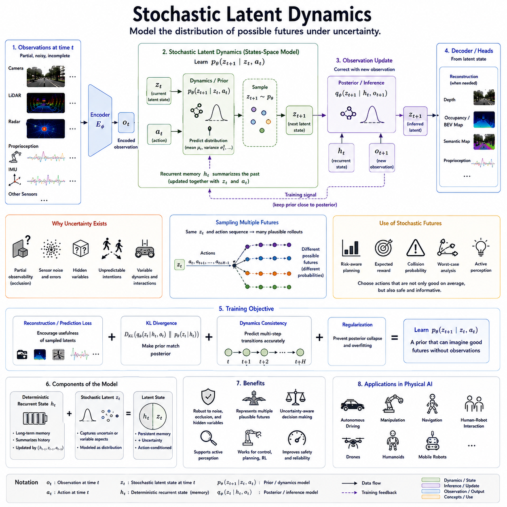{width="7.268055555555556in" height="7.268055555555556in"}

확률적 잠재 동역학(Stochastic Latent Dynamics)은 모든 현재 상태와 행동이 하나의 유일하게 결정된 미래로 이어진다는 가정을 넘어 잠재 월드 모델(latent world model)을 확장한다. 실제 물리 환경에는 불완전한 관측, 센서 노이즈, 은닉 변수(hidden variable), 예측하기 어려운 상호작용, 본질적으로 가변적인 행동에서 발생하는 불확실성(uncertainty)이 존재한다. 확률적 모델은 하나의 다음 잠재 상태만 예측하는 대신 가능한 미래 상태들의 확률분포(distribution)를 표현한다.

결정론적 잠재 동역학(deterministic latent dynamics)에서 전이는 일반적으로 (z_{t+1}=F_\\theta(z_t,a_t))로 표현된다. 동일한 잠재 상태와 행동이 주어지면 모델은 항상 동일한 예측을 생성한다. 반면 확률적 동역학(stochastic dynamics)은 (p_\\theta(z_{t+1}\|z_t,a_t))와 같은 조건부 확률분포(conditional distribution)를 표현한다. 따라서 다음 상태는 현재 상태와 행동에 따라 가능한 값과 그 확률이 결정되는 확률 변수(random variable)로 취급된다.

이러한 차이가 중요한 이유는 관측값이 완전한 물리적 상태를 드러내는 경우가 거의 없기 때문이다. 카메라는 장애물 뒤를 볼 수 없고, 라이다(LiDAR) 측정값은 희소하거나 가려질 수 있으며, 마찰(friction)은 알려지지 않을 수 있고, 다른 에이전트의 의도는 숨겨져 있을 수 있다. 따라서 로봇에게 거의 동일하게 보이는 두 상황이 서로 다르게 전개될 수 있다. 확률적 잠재 모델은 이러한 해결되지 않은 가능성을 하나의 결정론적 예측으로 성급하게 축소하지 않고 유지할 수 있다.

불확실성은 환경 자체에서도 발생한다. 교차로에 접근하는 보행자는 계속 전진하거나, 멈추거나, 방향을 바꿀 수 있다. 조작 중인 객체는 미끄러질 수도 있고 안정적으로 유지될 수도 있으며, 이동 로봇은 지형이나 접촉 조건에 따라 조금씩 다른 움직임을 경험할 수 있다. 따라서 유사한 관측과 행동에서도 여러 미래가 물리적으로 가능할 수 있다. 확률적 동역학은 이러한 다중양상성(multimodality)을 표현하기 위한 수학적 메커니즘을 제공한다.

일반적인 접근법은 모델에 의해 확률분포가 매개변수화되는 확률적 잠재 변수(stochastic latent variable) (z_t)를 도입한다. 네트워크는 하나의 벡터를 생성하는 대신 평균(mean) (\\mu_t)와 분산(variance) (\\sigma_t\^2) 같은 매개변수를 예측하고, 이로부터 잠재 상태를 샘플링(sampling)할 수 있다. 단순한 단봉 가우시안 분포(unimodal Gaussian distribution)가 여러 대안적 미래를 충분히 표현하지 못하는 경우에는 이산 변수(discrete variable), 혼합 분포(mixture distribution), 계층적 잠재 변수(hierarchical latent), 또는 다른 확률 구조를 사용할 수 있다.

순환 상태 공간 모델(recurrent state-space model)에서는 확률적 변수를 결정론적 순환 기억(deterministic recurrent memory)과 함께 사용하는 경우가 많다. 은닉 상태 (h_t)는 지속적인 시간 정보를 요약하고, (z_t)는 현재 상황에서 불확실하거나 가변적인 측면을 표현한다. 전이 과정에서는 먼저 이전 상태와 행동을 사용하여 순환 기억을 갱신한 다음 새로운 확률적 잠재 변수에 대한 사전 분포(prior distribution)를 생성할 수 있다. 이러한 결합은 시간적 연속성과 확률적 불확실성을 동시에 제공한다.

학습(training)에서는 일반적으로 예측 사전 분포(predictive prior)와 관측 조건부 사후 분포(observation-conditioned posterior)를 구분한다. 사전 분포 (p(z_t\|h_t))는 이전 정보를 이용해 어떤 잠재 상태가 발생해야 하는지를 예측하는 반면, 사후 분포 (q(z_t\|h_t,o_t))는 실제 센서 관측값을 추가로 사용할 수 있다. 사후 분포는 관측값을 확인하기 때문에 더 많은 정보를 이용하여 상태를 추론할 수 있다. 학습은 사전 분포가 이러한 사후 분포를 근사하도록 하여 이후 미래 관측 없이도 유용한 미래를 상상할 수 있도록 한다.

이러한 관계는 쿨백-라이블러 발산(Kullback-Leibler divergence)과 같은 발산 항(divergence term)을 통해 최적화되는 경우가 많다. 목적 함수(objective)는 예측 사전 분포와 관측 조건부 사후 분포가 서로 호환되도록 유도하며, 동시에 재구성 또는 예측 목적은 샘플링된 잠재 상태가 유용한 정보를 유지하도록 요구한다. 이 균형은 중요하다. 지나친 정규화(regularization)는 잠재 변수를 정보가 부족한 상태로 만들 수 있고, 정규화가 부족하면 상상 과정에서 예측하기 어려운 표현이 만들어질 수 있다.

샘플링은 동일한 시작 조건으로부터 여러 가능한 미래를 생성할 수 있게 한다. (z_t)와 행동 시퀀스(action sequence)가 주어지면 모델은 여러 번의 확률적 롤아웃(stochastic rollout)을 수행하여 각각 서로 다른 현실적인 궤적을 생성할 수 있다. 하나의 롤아웃에서는 다른 에이전트가 현재 움직임을 계속한다고 예측할 수 있고, 또 다른 롤아웃에서는 방향을 변경한다고 예측할 수 있다. 계획(planning)은 하나의 가상 궤적에 의존하는 대신 이러한 미래들의 집합을 평가할 수 있다.

이렇게 생성된 궤적 분포(trajectory distribution)는 위험 인식 의사결정(risk-aware decision making)에 특히 중요하다. 어떤 행동이 가장 가능성이 높은 미래에서는 안전해 보이더라도 확률은 낮지만 물리적으로 가능한 다른 결과에서는 위험해질 수 있다. 여러 확률적 미래를 고려하면 계획기(planner)는 충돌 확률(collision probability), 기대 보상(expected reward), 불확실성 또는 최악의 결과(worst-case consequence)를 추정할 수 있다. 따라서 피지컬 AI(Physical AI)는 기대 성능뿐만 아니라 가능한 결과의 범위를 고려하여 행동을 선택할 수 있다.

확률적 잠재 동역학은 예측 가능한 구조(predictable structure)와 예측하기 어려운 변화(unpredictable variation)를 분리하는 데에도 유용하다. 기하 구조, 로봇 운동학(robot kinematics), 지속적인 객체 움직임은 비교적 안정적인 패턴을 따를 수 있지만, 사람의 의도, 접촉 결과 또는 숨겨진 환경 요인은 불확실하게 남을 수 있다. 잘 설계된 잠재 모델은 안정적인 시간 정보를 결정론적 구성요소에 인코딩하고, 확실하게 예측할 수 없는 세계의 측면에는 확률적 변수를 사용할 수 있다.

장기 예측(long-horizon prediction)은 확률적 모델링(probabilistic modeling)의 중요성을 더욱 증가시킨다. 일반적으로 예측이 미래로 멀어질수록 각각의 불확실한 전이가 추가적인 가능성을 발생시키기 때문에 불확실성도 증가한다. 확률적 동역학은 먼 미래를 정확히 알고 있는 것처럼 가정하는 대신 연속적인 잠재 상태 전이를 통해 불확실성을 전파할 수 있다. 따라서 예측된 미래는 단기에서는 좁은 분포를 가지다가 장기에서는 더욱 넓은 가능성의 집합으로 확장될 수 있다.

그러나 확률성(stochasticity)이 임의적인 무작위성(randomness)이 되어서는 안 된다. 유용한 확률적 월드 모델은 관측값, 행동, 시간적 맥락(temporal context), 물리적 제약(physical constraint)과 일관성을 유지하면서 다양한 미래를 생성해야 한다. 현실적인 환경 행동과 관련되지 않은 무작위 변화는 계획에 거의 도움이 되지 않는다. 따라서 학습에서는 다양성(diversity)과 충실도(fidelity)를 동시에 강화하여 샘플링된 궤적이 통제되지 않은 노이즈가 아니라 의미 있는 대안적 미래를 표현하도록 해야 한다.

불확실성의 표현은 능동 지각(active perception)을 유도할 수도 있다. 중요한 영역이 가려져 있거나 물리적 속성이 알려지지 않아 여러 잠재 가설(latent hypothesis)이 여전히 가능하다면, 에이전트는 추가 정보를 획득하는 행동을 선택할 수 있다. 카메라를 움직이거나, 시점을 변경하거나, 객체에 접근하거나, 로봇의 속도를 낮추는 행동은 중요한 결정을 내리기 전에 불확실성을 감소시킬 수 있다. 따라서 월드 모델은 과제를 달성하기 위한 행동뿐만 아니라 지식을 개선하기 위한 행동에도 영향을 줄 수 있다.

다중모달 피지컬 AI(multimodal Physical AI)에서 확률적 잠재 상태는 센서 간의 불일치 또는 성능 저하를 처리하는 데 도움을 줄 수 있다. 카메라는 어두운 환경에서 신뢰성이 떨어질 수 있고, 라이다는 환경적 영향에 의해 성능이 저하될 수 있으며, 레이더는 모호한 기하 정보를 제공할 수 있고, 고유수용성 측정값(proprioceptive measurement)에도 노이즈가 포함될 수 있다. 융합된 정보를 완전히 확실한 것으로 처리하는 대신 잠재 모델은 실제 상태에 대한 불확실성을 유지하고 추가적인 관측이 들어올 때 이를 갱신할 수 있다.

확률적 동역학의 평가는 하나의 미래 궤적과 비교한 오차 측정만으로는 충분하지 않다. 모델은 실제로 발생한 미래에 높은 확률을 부여하면서 여러 결과가 가능한 상황에서는 적절한 다양성을 유지해야 한다. 보정(calibration), 우도 기반 측정(likelihood-based measure), 가능한 미래에 대한 포괄성(coverage), 다단계 일관성(multi-step consistency), 후속 계획 성능(downstream planning performance) 등이 중요한 평가 기준이 된다. 많은 가능성을 생성하는 모델이라도 그 확률과 불확실성이 현실과 의미 있게 대응할 때에만 유용하다.

피지컬 AI에서 확률적 잠재 동역학은 월드 모델을 하나의 미래만 예측하는 시스템에서 여러 대안적 가능성을 추론할 수 있는 시스템으로 변화시킨다. 순환 기억(recurrent memory), 행동 조건화(action conditioning), 불확실성 전파(uncertainty propagation), 다단계 롤아웃(multi-step rollout)과 결합하면 에이전트는 단순히 무엇이 일어날 것인지를 상상하는 것을 넘어 무엇이 일어날 수 있는지, 그리고 각각의 결과가 얼마나 가능성이 있는지를 추론할 수 있다. 이는 강건한 예측(robust prediction), 불확실성 인식 계획(uncertainty-aware planning), 더욱 안전한 제어, 복잡한 물리 환경에서의 지능적인 상호작용을 위한 기반을 제공한다.

## 03.06. Discrete vs Continuous Latent State

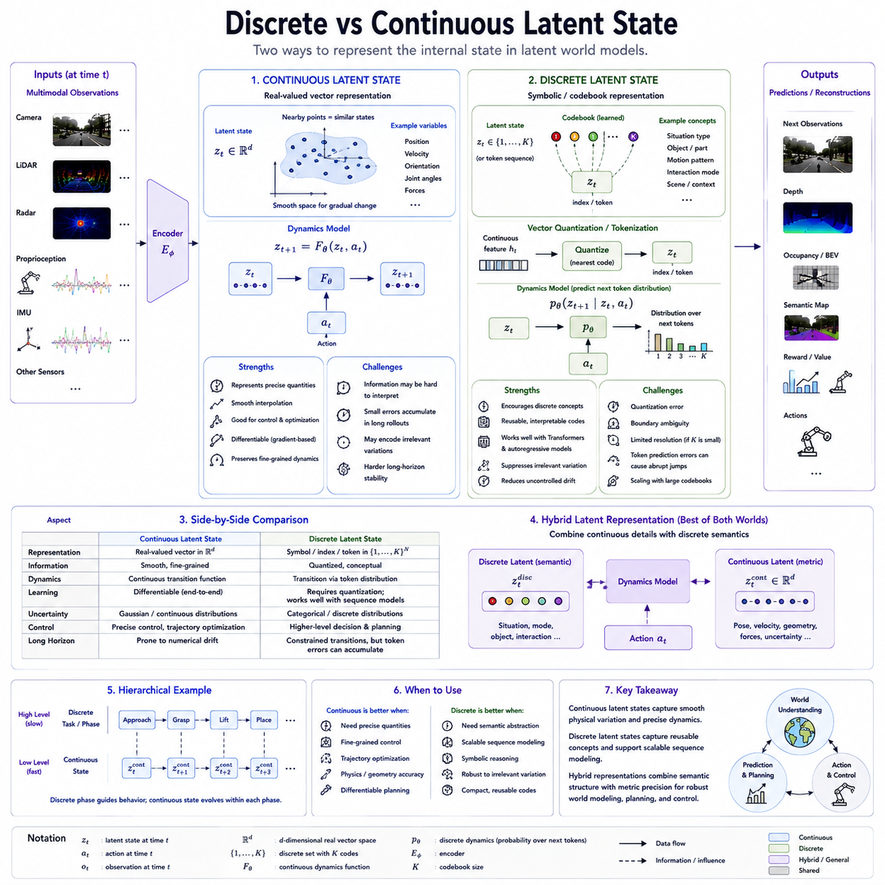{width="7.268055555555556in" height="7.268055555555556in"}

잠재 동역학 모델(latent dynamics model)은 내부 상태를 수학적으로 어떻게 표현할 것인지에 대한 선택을 필요로 한다. 두 가지 주요 대안은 연속 잠재 상태(continuous latent state)와 이산 잠재 상태(discrete latent state)이다. 연속 표현은 상태를 실수값 벡터(real-valued vector) 또는 특징 공간(feature space) 안에 배치하는 반면, 이산 표현은 기호(symbol), 범주(category), 인덱스(index), 또는 학습된 코드북 항목(learned codebook entry)을 사용하여 표현한다. 두 접근법 모두 관측값을 압축하지만 정보를 구성하고 동역학을 표현하는 방식은 근본적으로 다르다.

연속 잠재 상태는 일반적으로 (z_t \\in \\mathbb{R}\^d)의 형태를 가지며, 각 차원에는 관측값으로부터 학습된 실수값 특징(real-valued feature)이 포함된다. 이 공간에서 서로 가까운 점들은 유사한 물리적 상황을 표현할 수 있으며, 위치, 속도, 방향, 기하 구조, 힘 또는 기타 속성의 점진적인 변화는 잠재 공간(latent space)에서의 부드러운 이동에 대응할 수 있다. 이러한 특성으로 인해 연속 표현은 많은 물리적 과정과 자연스럽게 호환된다.

예를 들어 이동 로봇(mobile robot)의 속도가 하나의 값에서 다른 값으로 변화할 때 일반적으로 명확하게 분리된 의미론적 범주(semantic category)를 순차적으로 통과하지 않는다. 물리적 상태는 연속적으로 변화한다. 인코더(encoder)는 이러한 변화를 서로 가까운 잠재 벡터(latent vector)로 매핑할 수 있으며, 동역학 모델(dynamics model)은 (z_{t+1}=F_\\theta(z_t,a_t))와 같은 전이를 학습한다. 이후 경사 기반 학습(gradient-based learning)을 통해 미분 가능한 잠재 표현(differentiable latent representation)을 사용하는 인코더, 동역학 모델 및 후속 구성요소를 최적화할 수 있다.

연속 상태는 정밀한 기하학적 또는 동역학적 정보(geometric or dynamical information)를 유지해야 하는 경우에 특히 유용하다. 로봇 자세(robot pose), 관절 각도(joint angle), 속도, 깊이(depth), 접촉력(contact force), 객체 궤적(object trajectory), 공간적 관계(spatial relationship)는 본질적으로 연속적인 값을 가진다. 연속 잠재 공간은 명시적인 이산화 경계(discretization boundary) 없이 이러한 변수의 조합을 인코딩할 수 있으므로, 작은 상태 차이가 행동 결과에 중요한 영향을 미치는 정밀한 예측과 제어를 지원할 수 있다.

그러나 연속 표현은 정보를 매우 분산되고 해석하기 어려운 방식으로 인코딩할 수 있다. 잠재 공간에서의 작은 이동이 반드시 명확하게 식별할 수 있는 의미론적 변화에 대응하는 것은 아니며, 모델이 차원을 비효율적으로 할당하거나 중요하지 않은 변화를 유지할 수도 있다. 또한 연속 상태는 각각의 전이에서 발생하는 작은 수치 오차가 반복적인 잠재 롤아웃(latent rollout)을 거치면서 누적되어 학습 과정에서 경험했던 상태로부터 점차 벗어날 수 있기 때문에 장기 예측(long-horizon prediction)을 어렵게 만들 수 있다.

이산 잠재 상태는 유한하거나 셀 수 있는 대안들의 집합을 사용하여 정보를 표현한다. 임의의 실수값 벡터를 직접 저장하는 대신, 인코더는 학습된 코드북(codebook)에서 하나 이상의 항목을 선택하여 반복적으로 나타나는 패턴을 표현하는 인덱스 또는 토큰(token)을 생성할 수 있다. 따라서 잠재 상태는 개념적으로 (z_t \\in {1,2,\\ldots,K})로 표현할 수 있지만, 실제 시스템에서는 더 높은 표현 용량(representational capacity)을 확보하기 위해 여러 이산 변수 또는 토큰 시퀀스를 사용하는 경우가 많다.

벡터 양자화(vector quantization)는 이산 잠재 표현(discrete latent representation)을 구성하는 일반적인 메커니즘이다. 인코더는 먼저 연속 특징을 생성하고, 이를 가장 가깝거나 가장 적절한 코드북 벡터(codebook vector)에 매핑한다. 선택된 코드는 관측값을 유한한 잠재 어휘(latent vocabulary)로 표현한다. 학습 과정에서 인코더와 코드북을 함께 조정함으로써 반복적으로 나타나는 구조, 구성, 움직임 또는 의미론적 패턴에 유용하고 재사용 가능한 표현을 할당할 수 있다.

이산 상태는 모델이 임의적인 수치 변화보다 반복적으로 나타나는 개념(recurring concept)을 중심으로 경험을 구성하도록 유도할 수 있다. 서로 다른 시각적 형태를 가지더라도 동일한 근본적 구성을 나타내는 관측값은 동일하거나 관련된 잠재 코드(latent code)에 매핑될 수 있다. 이는 중요하지 않은 센서 변화를 억제하는 유용한 정보 병목(information bottleneck)을 형성할 수 있다. 또한 이산 토큰은 기호 단위 시퀀스 모델링에서 강력한 성능을 보여 온 자기회귀 모델(autoregressive model) 및 트랜스포머 아키텍처(Transformer architecture)와 자연스럽게 결합할 수 있다.

월드 모델링(world modeling)에서 토큰화된 상태(tokenized state)는 물리적 경험을 구조화된 시퀀스 모델링 문제(structured sequence modeling problem)와 유사하게 처리할 가능성을 제공한다. 공간 영역, 객체, 움직임, 행동 또는 압축된 관측 패치는 토큰으로 표현할 수 있으며, 예측 모델은 미래 토큰 시퀀스에 대한 확률분포를 학습할 수 있다. 이러한 접근법은 모든 픽셀이나 센서 측정값을 직접 예측하는 비용을 피하면서 확장 가능한 시퀀스 모델링 아키텍처의 장점을 활용할 수 있다.

그러나 이산화(discretization)는 중요한 한계도 발생시킨다. 물리적 변수는 본질적으로 연속적인 경우가 많으며, 이를 유한한 범주로 매핑하면 양자화 오차(quantization error)가 발생한다. 코드 경계(code boundary) 근처의 두 상태는 물리적으로 유사함에도 서로 다른 토큰을 받을 수 있으며, 코드북의 해상도가 충분하지 않다면 서로 다른 상태가 동일한 토큰을 공유할 수도 있다. 코드 수를 증가시키면 일부 정보 손실을 줄일 수 있지만 모델 복잡성이 증가하고 이산 표현을 효율적으로 학습하기 어려워질 수 있다.

이러한 차이는 불확실성 모델링(uncertainty modeling)에도 영향을 준다. 연속 확률적 잠재 상태(continuous stochastic latent state)는 평균과 분산 같은 매개변수를 사용하여 확률분포를 표현할 수 있으며, 가능한 물리적 상태에 대해 부드러운 확률밀도(probability density)를 제공한다. 반면 이산 확률 모델은 코드 또는 토큰 조합에 대한 확률을 예측한다. 후자는 객체가 왼쪽 또는 오른쪽으로 움직이는 경우처럼 명확하게 구분되는 대안을 자연스럽게 표현할 수 있는 반면, 연속 분포는 위치나 속도와 같은 값의 불확실성을 표현하는 데 더 적합할 수 있다.

장기 동역학(long-horizon dynamics)에서는 두 접근법의 서로 다른 강점이 나타난다. 연속 롤아웃(continuous rollout)은 정밀한 국소 변화를 유지할 수 있지만 시간이 지나면서 수치적 드리프트(numerical drift)가 누적될 수 있다. 이산 전이는 예측 결과를 학습된 유효 코드 집합으로 제한하기 때문에 일부 형태의 통제되지 않은 잠재 드리프트를 줄일 수 있다. 그러나 토큰 예측 오류는 갑작스럽게 잘못된 상태로 전이하게 만들 수 있으며, 반복적인 이산 예측에서도 장기적으로 의미론적 오류(semantic error)가 누적될 수 있다.

계획(planning)과 제어(control) 역시 서로 다른 요구사항을 가진다. 저수준 제어(low-level control)는 정밀한 연속값에 의존하는 경우가 많으므로 연속 잠재 상태는 모터 예측(motor prediction), 궤적 최적화(trajectory optimization), 미분 가능한 계획(differentiable planning)에 적합하다. 반면 고수준 추론(high-level reasoning)은 상황, 행동, 객체, 기술(skill), 상호작용 모드(interaction mode)를 나타내는 이산 추상화(discrete abstraction)의 이점을 얻을 수 있다. 따라서 로봇은 자신이 어떤 종류의 상황에 있는지를 기호적으로 추론하면서 객체가 정확히 어디에 있고 어떻게 움직이는지는 연속 변수로 유지할 수 있다.

이러한 특성은 연속 정보와 이산 정보를 서로 배타적인 선택으로 취급하는 대신 결합하는 하이브리드 잠재 표현(hybrid latent representation)의 필요성을 제기한다. 월드 모델은 의미론적 구조, 객체 정체성, 상호작용 모드 또는 고수준 이벤트를 인코딩하기 위해 이산 토큰을 사용하고, 기하 구조, 움직임, 불확실성 및 로봇 구성을 표현하기 위해 연속 변수를 사용할 수 있다. 그러면 동역학 모델은 물리적 세계의 서로 다른 측면에 대응하는 여러 표현 수준에서 변화를 예측할 수 있다.

계층적 월드 모델(hierarchical world model)은 이러한 개념을 더욱 확장할 수 있다. 천천히 변화하는 이산 상태는 과제, 행동, 장면 또는 모드를 표현하고, 더 빠르게 변화하는 연속 상태는 각 모드 내부의 세부적인 물리적 변화를 표현할 수 있다. 예를 들어 조작 모델(manipulation model)은 파지(grasping), 들어 올리기(lifting), 배치(placing)를 이산 단계로 표현하면서 각 단계 내부에서는 관절 움직임, 접촉력 및 객체 자세를 연속적으로 모델링할 수 있다. 이러한 구조는 물리적 정밀성을 희생하지 않으면서 추상화 수준을 높일 수 있다.

따라서 적절한 표현은 예측 목표(prediction objective)에 크게 의존한다. 모델이 세부적인 센서 신호를 재구성하거나 정밀한 물리적 궤적을 예측해야 한다면 연속 잠재 변수가 더 적합할 수 있다. 목표가 확장 가능한 시퀀스 예측, 재사용 가능한 추상화(reusable abstraction), 의미론적 추론(semantic reasoning)을 강조한다면 이산 상태가 장점을 가질 수 있다. 두 요구사항이 모두 중요한 경우에는 하이브리드 표현을 통해 각 변수의 특성에 가장 적합한 구조로 정보를 분배할 수 있다.

따라서 하나의 잠재 상태 유형이 항상 우수하다고 가정하기보다는 후속 행동(downstream behavior)을 통해 표현의 품질을 평가해야 한다. 예측 정확도, 양자화 오차, 시간적 일관성(temporal consistency), 불확실성 보정(uncertainty calibration), 장기 안정성(long-horizon stability), 계획 유용성(planning utility), 계산 효율성 및 제어 성능을 통해 선택된 표현이 중요한 정보를 제대로 유지하는지를 판단할 수 있다. 궁극적으로 가장 좋은 잠재 상태는 신뢰할 수 있는 추론과 행동을 가능하게 하는 표현이다.

피지컬 AI(Physical AI)에서 연속 잠재 상태와 이산 잠재 상태는 내부 세계(internal world)를 구성하는 상호보완적인 접근법을 나타낸다. 연속 공간은 부드러운 물리적 변화와 세밀한 동역학을 표현하고, 이산 공간은 압축되고 재사용 가능한 추상화와 토큰화된 구조(tokenized structure)를 제공한다. 두 표현을 결합하면 정밀한 물리적 변화와 고수준 개념을 동시에 추론할 수 있는 월드 모델로 발전할 수 있으며, 여러 추상화 수준에 걸쳐 지각(perception), 예측(prediction), 계획, 행동(action)을 연결할 수 있다.

## 03.07. Representation Collapse and Regularization

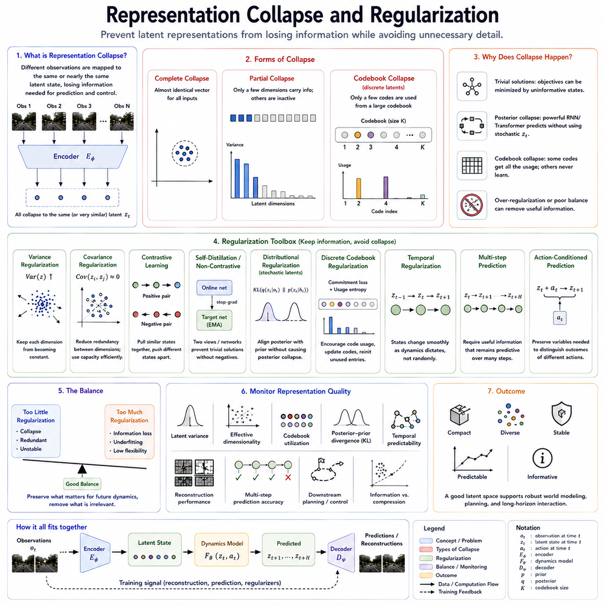{width="7.268055555555556in" height="7.268055555555556in"}

표현 붕괴(Representation Collapse)는 잠재 동역학 모델(latent dynamics model)에서 학습된 표현이 세계의 의미 있는 상태를 구분하는 데 필요한 다양성과 정보를 잃는 실패 형태(failure mode)이다. 서로 다른 관측값을 적절하게 서로 다른 잠재 상태(latent state)로 매핑하는 대신, 인코더(encoder)가 많은 입력에 대해 거의 동일한 표현을 생성할 수 있다. 그러면 잠재 공간(latent space)은 예측, 계획(planning), 제어(control), 물리적 변화의 이해에 필요한 정보를 충분히 제공하지 못하게 된다.

유용한 잠재 표현(latent representation)은 중요하지 않은 센서 변화를 압축하면서 미래 동역학에 영향을 미치는 차이는 보존해야 한다. 이러한 압축이 지나치게 이루어질 때 표현 붕괴가 발생한다. 서로 다른 객체, 위치, 속도, 접촉 상태 또는 환경 조건을 포함하는 관측값이 동일하거나 매우 유사한 (z_t)로 매핑되면 동역학 모델(dynamics model)은 현재 내부 상태에서 어떤 미래 전이가 발생해야 하는지를 신뢰성 있게 판단할 수 없다.

완전한 붕괴(complete collapse)는 인코더가 거의 모든 관측값에 대해 동일한 잠재 벡터(latent vector)를 생성하는 극단적인 경우를 의미한다. 그러나 더욱 미묘한 형태의 붕괴도 발생할 수 있다. 잠재 차원의 일부만 정보를 전달하고 나머지 차원이 비활성화될 수 있으며, 이산 표현(discrete representation)에서는 대규모 코드북(codebook) 가운데 일부 항목만 반복적으로 선택될 수도 있다. 이러한 부분 붕괴(partial collapse)는 명목상의 잠재 차원 크기가 유지되더라도 실제 표현 용량(effective capacity)을 감소시킨다.

표현 붕괴는 일부 학습 목적(learning objective)이 사소한 해법(trivial solution)을 허용하기 때문에 발생할 수 있다. 학습 과정에서 서로 관련된 두 관측의 임베딩(embedding)을 유사하게 만들도록 요구하면서 동시에 충분한 정보를 유지하도록 제약하지 않는다면, 모든 관측을 동일한 지점으로 매핑하는 것이 가장 쉬운 해법이 될 수 있다. 예측 목적에서도 대상 표현(target representation) 자체가 정보가 부족해지면 모델이 의미 있는 물리 구조를 학습하지 않고도 오차를 최소화할 수 있는 유사한 문제가 발생할 수 있다.

확률적 잠재 모델(stochastic latent model)은 사후 붕괴(posterior collapse)라고 알려진 관련 문제에 직면한다. 강력한 순환 구성요소(recurrent component) 또는 자기회귀 구성요소(autoregressive component)가 확률적 잠재 변수를 사용하지 않고도 관측값을 예측할 수 있다면 사후 분포(posterior)는 사전 분포(prior)와 거의 동일해지고 (z_t)는 유용한 정보를 거의 전달하지 않을 수 있다. 모델이 형식적으로 확률적 상태를 포함하고 있더라도 디코더(decoder) 또는 동역학 네트워크가 이를 사실상 무시하게 되어 불확실성과 은닉 요인(hidden factor)을 표현하는 능력이 약화된다.

이산 잠재 모델(discrete latent model)에서는 코드북 붕괴(codebook collapse)가 발생할 수 있다. 코드북이 수백 또는 수천 개의 잠재 항목을 포함하더라도 인코더가 그중 소수만 반복적으로 선택할 수 있다. 사용되지 않는 코드는 유용한 학습 신호를 거의 받지 못하는 반면, 자주 선택되는 코드는 점점 더 지배적으로 사용된다. 그 결과 표현에 사용할 수 있는 용량이 낭비되고, 서로 다른 잠재 어휘(latent vocabulary)를 사용해야 하는 다양한 물리적 상황을 충분히 구분하지 못할 수 있다.

반대의 문제 역시 바람직하지 않다. 표현 붕괴를 방지한다는 것이 관측값의 모든 세부 정보를 보존하도록 강제한다는 의미는 아니다. 질감(texture), 노이즈, 조명, 기타 예측하기 어려운 센서 변화를 그대로 기억하는 잠재 상태는 시간에 따른 모델링을 불필요하게 어렵게 만들 수 있다. 따라서 목표는 최대한 많은 정보를 유지하는 것이 아니라 압축(compression)과 동역학적으로 의미 있는 정보의 보존 사이에서 적절한 균형을 확보하는 것이다.

정규화(regularization)는 이러한 균형을 유지하기 위한 메커니즘을 제공한다. 인코더와 동역학 모델이 임의적인 잠재 구조를 형성하도록 두는 대신, 정규화는 정보성이 높고 안정적이며 예측 가능한 표현을 유도하는 제약 또는 보조 목적(auxiliary objective)을 추가한다. 서로 다른 기법은 분산(variance), 공분산(covariance), 엔트로피(entropy), 분포 형태(distribution shape), 코드 사용률(code usage), 시간적 일관성(temporal consistency), 예측된 잠재 상태와 관측된 잠재 상태 사이의 일치와 같은 서로 다른 특성을 조절한다.

분산 기반 정규화(variance-based regularization)는 잠재 차원이 관측 배치(batch)에 걸쳐 충분한 변화를 유지하도록 요구함으로써 임베딩이 상수값으로 붕괴되는 것을 방지할 수 있다. 특정 특징의 분산이 0에 가까워진다면 해당 차원은 사실상 구별에 필요한 정보를 거의 전달하지 않는 것이다. 0이 아닌 충분한 분산을 유지하도록 유도하면 중요하지 않은 변화를 제거하면서도 서로 다른 관측값이 구별 가능한 위치에 존재하도록 만들 수 있다.

공분산 정규화(covariance regularization)는 서로 다른 잠재 차원이 중복된 정보를 전달하지 않도록 함으로써 이러한 목적을 보완할 수 있다. 이러한 제약이 없으면 여러 차원이 거의 동일한 특징을 학습하여 외형상 큰 표현을 가지고 있지만 실제 유효 차원(effective dimensionality)은 매우 낮아질 수 있다. 불필요한 상관관계(correlation)를 줄이면 잠재 공간 전체에 정보를 더욱 효율적으로 분배하고, 서로 다른 차원이나 특징 그룹이 물리 상태의 상호보완적인 측면을 포착하도록 할 수 있다.

대조 학습(contrastive learning)은 서로 다른 예제의 표현을 명시적으로 분리하면서 관련 관측값은 서로 가깝게 배치하는 또 다른 전략을 제공한다. 양성 쌍(positive pair)은 시간적으로 관련된 관측, 동일한 장면의 데이터 증강(augmentation), 또는 동일한 근본 상태를 나타내는 관측으로 구성할 수 있다. 음성 관계(negative relationship)는 서로 다른 상태를 구별하도록 유도한다. 그러나 양성 및 음성 쌍은 물리적 의미를 고려하여 구성해야 하며, 그렇지 않으면 실제로 중요한 상태 차이가 의도하지 않게 제거될 수 있다.

비대조 학습(non-contrastive learning)과 자기 증류(self-distillation) 접근법은 명시적인 음성 예제 없이도 사소한 붕괴를 방지할 수 있다. 이러한 방법은 비대칭 네트워크(asymmetric network), 그래디언트 중지(stop-gradient), 예측기 모듈(predictor module), 이동 평균 대상 인코더(moving-average target encoder), 또는 구조적 제약을 사용할 수 있다. 하나의 네트워크가 천천히 변화하는 다른 분기(branch)가 생성한 표현을 예측하도록 하면서 두 분기가 단순히 정보가 없는 상수 표현으로 수렴하지 못하도록 최적화 구조를 설계한다.

분포 정규화(distributional regularization)는 확률적 잠재 동역학(stochastic latent dynamics)에서 특히 중요하다. 쿨백-라이블러 발산(Kullback-Leibler divergence)과 같은 목적은 사후 잠재 분포(posterior latent distribution)가 예측 사전 분포(predictive prior)와 호환되도록 유도할 수 있다. 그러나 사전 분포와 지나치게 일치하도록 압력을 가하면 사후 붕괴가 발생할 수 있다. KL 균형(KL balancing), 프리 비트(free bits), 최소 정보 제약(minimum information constraint), 적절하게 가중된 정규화 등을 사용하면 상상(imagination) 과정에서 예측 가능한 잠재 공간을 유지하면서도 유용한 확률적 정보를 보존할 수 있다.

이산 표현에는 건전한 코드북 활용(codebook utilization)을 촉진하는 메커니즘이 필요하다. 커밋먼트 손실(commitment loss)은 인코더 출력이 선택된 코드에 가깝게 유지되도록 유도할 수 있으며, 코드북 갱신은 코드 항목을 관측된 특징에 맞추어 조정한다. 엔트로피 또는 사용률 정규화(usage regularization)는 모델이 소수의 코드에만 의존하는 것을 억제할 수 있다. 지속적으로 사용되지 않는 항목을 재초기화하거나 개선된 할당 전략(assignment strategy)을 사용하면 이산 어휘의 상당 부분이 비활성화되는 것을 추가로 방지할 수 있다.

시간적 정규화(temporal regularization)는 잠재 상태가 변화하는 물리적 과정을 표현해야 하는 월드 모델에서 특히 중요하다. 연속된 상태는 임의적으로 변동하기보다는 실제 환경의 동역학과 일치하는 방식으로 변화해야 한다. 시간적 일관성 목적(temporal consistency objective)은 부드럽고 예측 가능한 변화를 유도하면서 실제 물리적 사건이 발생하는 경우에는 급격한 변화도 허용할 수 있다. 목표는 단순히 인접한 상태를 동일하게 만드는 것이 아니라 구조화된 시간적 변화(structured temporal variation)를 학습하는 것이다.

다단계 예측(multi-step prediction)은 또 다른 강력한 제약을 제공한다. 현재 관측값을 재구성하는 데에만 적합한 표현은 동역학에는 불필요한 세부 정보를 인코딩할 수 있다. 잠재 상태가 여러 미래 단계에 걸쳐 예측 가능하도록 요구하면 인코더가 움직임, 기하 구조, 객체 관계(object relationship), 에이전트 구성(agent configuration)과 같은 지속적인 변수를 보존하도록 유도할 수 있다. 따라서 표현은 현재의 외형만을 설명하는 정보가 아니라 미래 변화를 설명하는 데 지속적으로 유용한 정보를 중심으로 형성된다.

행동 조건부 예측(action-conditioned prediction)은 서로 다른 행동의 결과를 구분하는 데 필요한 정보를 잠재 상태가 유지하도록 요구함으로써 추가적인 제약을 제공한다. 두 물리적 상황이 조향(steering), 힘(force), 관절 움직임 또는 접촉 행동에 서로 다르게 반응한다면 이를 동일한 표현으로 붕괴시키는 것은 예측 오류를 발생시킨다. 따라서 행동 의존적 전이(action-dependent transition)를 학습하면 환경에서 제어 가능하고 물리적으로 중요한 측면을 모델이 유지하도록 유도할 수 있다.

각각의 제약에는 상충관계(trade-off)가 존재하기 때문에 정규화 강도(regularization strength)는 신중하게 균형을 맞춰야 한다. 정규화가 너무 약하면 불안정하거나 중복되거나 붕괴된 표현이 만들어질 수 있으며, 지나치게 강하면 유용한 정보를 억제하고 모델의 유연성을 감소시킬 수 있다. 적절한 균형은 잠재 차원(latent dimensionality), 확률성(stochasticity), 관측 복잡성, 예측 지평(prediction horizon), 모델 용량(model capacity), 그리고 표현의 주요 목적이 재구성, 예측, 계획 또는 제어 가운데 무엇인지에 따라 달라진다.

따라서 표현의 품질은 학습 손실(training loss)만으로 간접적으로 판단하기보다 직접 모니터링해야 한다. 유용한 진단 지표에는 잠재 분산(latent variance), 유효 차원, 코드북 활용률, 사후-사전 발산(posterior-prior divergence), 시간적 예측 가능성(temporal predictability), 재구성 성능, 다단계 예측 정확도, 후속 계획 또는 제어 결과 등이 포함된다. 학습 목적 함수의 값이 낮다고 해서 잠재 공간이 풍부하고 물리적으로 유용한 구조를 학습했다는 것이 보장되는 것은 아니다.

피지컬 AI(Physical AI)에서 표현 붕괴를 방지하는 것은 잠재 상태가 지각(perception), 기억(memory), 동역학, 예측(prediction), 행동(action)을 연결하는 인터페이스 역할을 하기 때문에 필수적이다. 정규화는 모델이 모든 센서 세부 정보를 재현하도록 강제하지 않으면서도 의미 있는 차이를 보존해야 한다. 성공적인 잠재 공간은 압축되어 있으면서도 다양하고, 안정적이면서도 변화에 반응하며, 예측 가능하면서도 충분한 정보를 유지함으로써 강건한 월드 모델링(robust world modeling)과 물리 환경에서의 장기 상호작용(long-horizon interaction)에 필요한 내부 구조를 제공한다.

## 03.08. Long Horizon Latent Rollouts

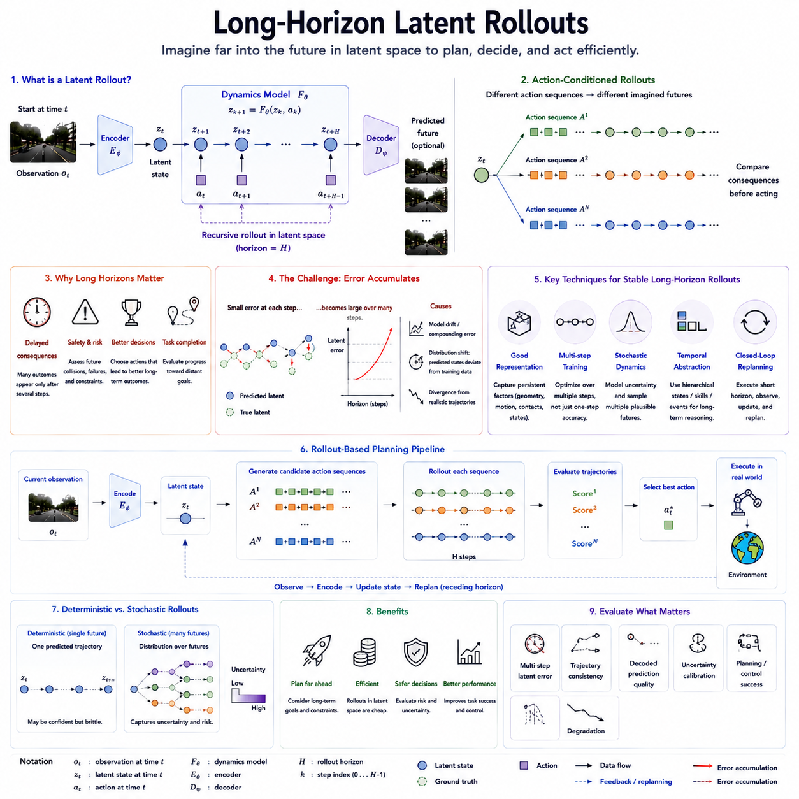{width="7.268055555555556in" height="7.268055555555556in"}

장기 잠재 롤아웃(Long-Horizon Latent Rollouts)은 월드 모델(world model)이 완전한 센서 관측값을 반복적으로 재구성하지 않고도 내부 상태를 미래의 여러 단계까지 전개할 수 있도록 한다. 현재 잠재 상태 (z_t)에서 시작하여 동역학 모델(dynamics model)은 (z_{t+1}, z_{t+2}, \..., z_{t+H})를 재귀적으로 예측한다. 이를 통해 물리적 세계가 긴 예측 지평(prediction horizon)에 걸쳐 어떻게 변화할 수 있는지를 나타내는 잠재 공간(latent space)상의 가상 궤적(imagined trajectory)이 생성된다.

잠재 롤아웃(latent rollout)의 근본적인 장점은 계산 효율성(computational efficiency)이다. 매 단계마다 미래의 카메라 영상, 라이다(LiDAR) 스캔, 레이더(radar) 측정값 및 기타 고차원 관측값을 예측하는 것은 지나치게 많은 계산 비용을 요구할 수 있다. 대신 압축된 잠재 상태(compact latent state)를 변화시키면 모델은 동역학과 의사결정에 관련된 정보에 계산 자원을 집중할 수 있다. 해석 가능한 예측이 필요한 경우에만 선택적으로 디코딩(decoding)을 수행할 수 있다.

행동 조건부 롤아웃(action-conditioned rollout)은 이러한 과정을 수동적인 미래 예측에서 상호작용적 예측(interactive prediction)으로 확장한다. 후보 행동 시퀀스 (a_t,a_{t+1},\...,a_{t+H-1})가 주어지면 모델은 (z_{t+k+1}=F_\\theta(z_{t+k},a_{t+k}))와 같은 전이를 재귀적으로 적용한다. 따라서 서로 다른 후보 행동 시퀀스는 서로 다른 가상의 미래를 생성하며, 에이전트(agent)는 실제 물리 환경에서 행동을 실행하기 전에 그 결과를 비교할 수 있다.

이러한 능력은 상상 기반 계획(imagination-based planning)의 기반을 제공한다. 계획기(planner)는 여러 후보 행동 시퀀스를 생성하고, 각각을 잠재 동역학 모델을 통해 미래로 롤아웃한 다음, 진행 정도(progress), 안전성(safety), 에너지 소비(energy consumption), 충돌 위험(collision risk), 보상(reward), 과제 완료(task completion) 등의 목표에 따라 결과 궤적을 평가할 수 있다. 시스템이 유망한 행동 또는 짧은 행동 시퀀스를 선택한 이후에만 실제 물리적 상호작용이 필요하다.

장기 예측이 중요한 이유는 많은 중요한 결과가 단일 단계 예측(one-step prediction)에서는 드러나지 않기 때문이다. 조향 명령(steering command)은 즉각적으로는 안전하더라도 몇 초 후 이동 로봇을 불리한 상태에 놓이게 할 수 있다. 매니퓰레이터(manipulator)의 움직임 역시 처음에는 객체에 올바르게 접근하더라도 미래의 충돌이나 특이점(singularity)을 발생시킬 수 있다. 장기 잠재 롤아웃은 단기 예측이 놓칠 수 있는 지연된 결과(delayed consequence)를 평가할 수 있게 한다.

그러나 재귀적 예측(recursive prediction)은 근본적인 문제를 발생시킨다. 바로 예측 오차가 누적된다는 것이다. 첫 번째 전이에서 예측된 잠재 상태는 실제 관측으로부터 추론했을 상태와 약간만 다를 수 있다. 하지만 다음 예측은 이미 오차가 포함된 상태에서 시작하므로 또 다른 오차가 추가된다. 이러한 작은 편차가 여러 차례의 재귀적 전이를 거치면서 누적되면 가상 궤적은 물리적으로 현실적인 상태에서 크게 벗어날 수 있다.

이러한 현상은 일반적으로 모델 드리프트(model drift) 또는 누적 오차(compounding error)라고 한다. 학습 과정에서 동역학 모델은 실제 관측으로부터 생성된 잠재 상태를 입력받는 경우가 많지만, 장기 롤아웃에서는 자신의 예측 결과를 다시 입력으로 사용해야 한다. 따라서 예측 상태의 분포가 점차 학습 분포(training distribution)와 달라질 수 있다. 롤아웃이 익숙하지 않은 잠재 영역에 진입하면 예측 정확도가 더욱 악화되어 현실로부터의 이탈이 스스로 강화될 수 있다.

잠재 표현(latent representation)의 품질은 장기 예측의 안정성에 강한 영향을 미친다. (z_t)에 예측하기 어려운 질감(texture), 노이즈(noise), 빠르게 변화하는 센서 세부 정보가 포함되어 있다면 동역학 모델은 시간이 지날수록 예측하기 어려워지는 정보를 계속 추적해야 한다. 반면 기하 구조(geometry), 움직임(motion), 객체 관계(object relationship), 로봇 구성(robot configuration), 상호작용 상태(interaction state)와 같은 지속적인 속성을 강조하는 표현은 반복 예측을 훨씬 안정적이고 유용하게 만들 수 있다.

다단계 학습(multi-step training)은 단일 단계 정확도만 최적화하는 대신 여러 번의 예측 전이에 걸쳐 모델을 최적화함으로써 이러한 문제를 직접적으로 해결한다. (z_{t+1})만 평가하는 대신 (z_{t+1},\...,z_{t+H})에 걸친 예측값을 대응하는 미래 표현과 비교할 수 있다. 이를 통해 모델은 자신의 재귀적 예측 결과를 학습 과정에서 경험하며, 즉각적인 전이에만 좋은 성능을 보이는 것이 아니라 반복적으로 적용된 이후에도 일관성을 유지하는 동역학을 학습하도록 유도된다.

학습에 사용하는 예측 지평(prediction horizon)은 중요한 상충관계(trade-off)를 형성한다. 매우 짧은 예측 지평은 강력하고 비교적 학습하기 쉬운 감독 신호(supervision)를 제공하지만 장기적인 안정성을 충분히 학습시키지 못할 수 있다. 반대로 지나치게 긴 예측 지평은 시간이 지날수록 불확실성과 예측 오차가 자연스럽게 증가하기 때문에 최적화를 어렵게 만든다. 따라서 실제 시스템에서는 여러 예측 지평을 결합하거나, 롤아웃 길이를 점진적으로 증가시키거나, 단기와 장기 예측 목적에 서로 다른 가중치를 적용할 수 있다.

확률적 잠재 동역학(stochastic latent dynamics)은 예측 지평이 길어질수록 더욱 중요해진다. 연속적인 상태 전이를 거치면서 불확실성이 증가하기 때문에 먼 미래를 하나의 결정론적 궤적(deterministic trajectory)으로 적절하게 표현하기는 어렵다. 하나의 (z_{t+H})만 예측하는 대신 모델은 여러 잠재 궤적을 샘플링하여 서로 다른 현실적인 결과를 표현할 수 있다. 따라서 롤아웃은 점점 불확실해지는 하나의 경로가 아니라 미래에 대한 확률분포(distribution over futures)가 된다.

불확실성 전파(uncertainty propagation)를 이용하면 계획 시스템은 예측 가능성이 계속 높은 궤적과 결과의 불확실성이 크게 증가하는 궤적을 구분할 수 있다. 기대 보상(expected reward)이 매우 높은 행동 시퀀스라도 일부 가능한 롤아웃에서 치명적인 결과가 발생한다면 바람직하지 않을 수 있다. 따라서 위험 인식 계획(risk-aware planning)은 샘플링된 잠재 미래 전체에서 기대 성능과 함께 분산(variance), 충돌 확률, 신뢰도(confidence), 최악의 결과(worst-case consequence)를 고려할 수 있다.

시간적 추상화(temporal abstraction)는 효과적인 계획 지평(planning horizon)을 더욱 확장할 수 있다. 먼 미래까지 모든 물리적 전이를 동일한 세밀한 시간 해상도로 예측할 필요는 없다. 계층적 모델(hierarchical model)은 즉각적인 제어에는 상세한 단기 동역학을 사용하고, 장기적인 변화에는 더 느린 잠재 전이, 기술(skill), 이벤트(event), 추상 상태(abstract state)를 사용할 수 있다. 이를 통해 모든 저수준 움직임을 명시적으로 시뮬레이션하지 않고도 더 먼 미래를 추론할 수 있다.

이러한 계층적 롤아웃(hierarchical rollout)은 연속 잠재 표현(continuous latent representation)과 이산 잠재 표현(discrete latent representation)을 자연스럽게 연결한다. 연속 상태는 단기적인 기하 구조, 속도, 힘, 로봇 구성을 정밀하게 표현할 수 있고, 이산 또는 추상 상태는 접근(approaching), 파지(grasping), 운반(transporting), 회피(avoiding), 과제 단계 완료와 같은 장기적인 모드를 나타낼 수 있다. 따라서 하나의 월드 모델 안에서 여러 시간적·표현적 규모에 걸쳐 예측을 수행할 수 있다.

폐루프 실행(closed-loop execution)은 장기 예측 드리프트에 대한 또 하나의 중요한 안전장치를 제공한다. 로봇은 계획을 위해 미래의 여러 단계를 상상할 수 있지만, 선택된 궤적에서 첫 번째 행동 또는 짧은 구간만 실제로 실행할 수 있다. 이후 새로운 관측값을 인코딩하여 잠재 상태를 갱신하고 다시 계획을 수행한다. 이러한 이동 지평 방식(receding-horizon process)은 장기적인 미래 예측의 장점을 유지하면서 상상을 반복적으로 현실에 고정시킨다.

피지컬 AI(Physical AI)에서는 계획 지평과 실행 지평(execution horizon)을 구분하는 것이 필수적이다. 모델은 수초, 수분 또는 여러 과제 단계에 걸친 미래를 추론할 수 있지만, 물리적으로는 새로운 증거가 들어온 후 안전하게 재검토할 수 있는 행동에만 제한적으로 커밋(commit)할 수 있다. 따라서 장기 롤아웃은 긴 개루프 예측(open-loop prediction)을 맹목적으로 따라가는 것을 의미하지 않으며, 지속적으로 보정되는 지각-예측-행동 순환(perception-prediction-action cycle) 안에서 미래를 내다보는 능력을 제공한다.

효율적인 롤아웃은 실시간 계산 제약(real-time computational constraint) 안에서 얼마나 많은 대안적 미래를 평가할 수 있는지도 결정한다. 압축된 잠재 상태를 사용하면 수천 번의 가상 전이를 수행하는 것이 이에 대응하는 고해상도 센서 시뮬레이션보다 훨씬 저렴할 수 있다. 이러한 계산상의 이점은 더 많은 후보 행동 탐색, 불확실성 샘플링, 계획 깊이(planning depth) 증가, 여러 목적 함수 평가 등에 활용하면서도 체화된 시스템(embodied system)에 필요한 응답 시간을 유지할 수 있게 한다.

평가(evaluation)는 단일 단계 예측 정확도만 측정해서는 안 된다. 다음 상태 예측에서는 매우 우수한 성능을 보이는 모델도 반복적인 전이를 거치면 사용할 수 없을 정도로 성능이 저하될 수 있다. 따라서 유용한 평가 지표에는 다단계 잠재 오차(multi-step latent error), 궤적 일관성(trajectory consistency), 디코딩된 예측 품질(decoded prediction quality), 불확실성 보정(uncertainty calibration), 물리적 타당성(physical plausibility), 계획 성능, 그리고 예측 지평 증가에 따른 롤아웃 품질 저하율이 포함된다. 특히 후속 제어 성공률(downstream control success)은 중요한 평가 기준이 된다.

장기 잠재 롤아웃은 잠재 동역학 모델을 단순한 다음 상태 예측기(next-state predictor)에서 장기 추론을 위한 내부 시뮬레이터(internal simulator)로 변화시킨다. 그 효과는 압축되고 예측 가능한 표현, 안정적인 순환 동역학(recurrent dynamics), 행동 조건화(action conditioning), 다단계 학습, 불확실성 모델링, 시간적 추상화, 실제 관측을 통한 반복적인 보정에 달려 있다. 이러한 메커니즘을 결합하면 피지컬 AI는 실제 세계의 계획과 제어에 필요한 효율성과 신뢰성을 유지하면서 먼 미래의 결과까지 상상하고 평가할 수 있다.

## 03.09. Latent Dynamics for Control and RL

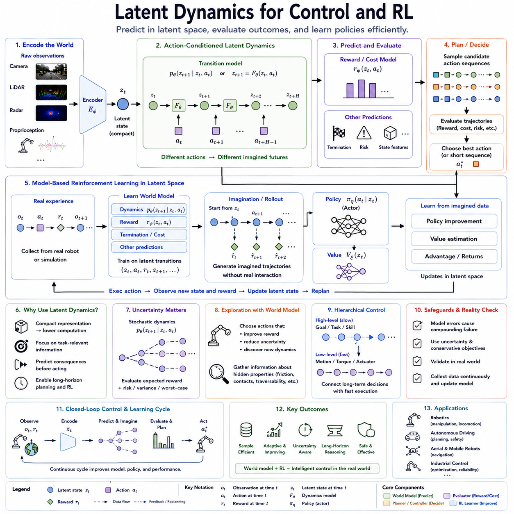{width="7.268055555555556in" height="7.268055555555556in"}

잠재 동역학(latent dynamics)은 에이전트(agent)가 자신의 행동이 가져올 결과를 평가할 수 있는 압축된 예측 상태(compact predictive state)를 제공함으로써 월드 모델링(world modeling)을 제어(control)와 직접 연결한다. 시스템은 원시 이미지, 라이다(LiDAR) 스캔 또는 기타 고차원 관측값으로부터 직접 의사결정을 수행하는 대신 센서 정보를 잠재 상태 (z_t)로 인코딩한다. 이 상태는 미래 전이, 보상(reward), 위험(risk), 행동 결과(action outcome)를 예측하기 위한 기반이 된다.

핵심 전이 모델(transition model)은 행동 조건부(action-conditioned)이며, 일반적으로 (p_\\theta(z_{t+1}\\mid z_t,a_t)) 또는 (z_{t+1}=F_\\theta(z_t,a_t))로 표현된다. 현재 잠재 상태는 에이전트와 환경을 나타내며, (a_t)는 후보 제어 행동(candidate control action)을 나타낸다. 서로 다른 행동은 서로 다른 미래 상태를 생성하기 때문에 학습된 동역학 모델은 특정 행동을 실행했을 때 어떤 일이 발생할 수 있는지를 예측하는 내부 시뮬레이터(internal simulator)로 기능한다.

제어는 단순히 다음 상태를 예측하는 것 이상을 요구한다. 시스템은 예측된 미래 가운데 어떤 미래가 바람직한지를 판단해야 한다. 보상 모델 (r_\\psi(z_t,a_t)), 비용 모델(cost model), 가치 함수(value function) 또는 과제별 예측 헤드(task-specific prediction head)는 진행 정도, 안전성, 에너지 소비, 충돌 위험, 과제 완료 및 기타 목표를 평가할 수 있다. 따라서 잠재 동역학 모델은 세계가 어떻게 변화하는지를 예측하고, 이러한 추가 함수들은 그 변화가 얼마나 유용한지를 평가한다.

이러한 구조는 모델 예측 제어(Model Predictive Control)를 자연스럽게 지원한다. (z_t)에서 시작하여 제어기(controller)는 후보 행동 시퀀스(candidate action sequence)를 생성하고, 학습된 잠재 동역학을 통해 각각의 시퀀스를 미래로 롤아웃(rollout)한다. 예측된 궤적은 보상, 비용, 제약 조건(constraint), 종단 목표(terminal objective)에 따라 평가된다. 제어기는 가장 유망한 시퀀스를 선택하고 첫 번째 행동 또는 짧은 구간만 실행한 후 환경을 다시 관측하여 잠재 상태를 갱신하고 다시 계획한다.

잠재 공간(latent space)에서의 계획은 완전한 센서 관측값을 이용한 계획보다 훨씬 적은 계산량을 요구할 수 있다. 로봇은 모든 후보 행동과 모든 미래 단계에 대해 고해상도 카메라 영상이나 포인트 클라우드(point cloud)를 합성할 필요가 없다. 대신 압축된 잠재 궤적(latent trajectory)을 사용하여 행동 평가에 필요한 정보를 표현할 수 있다. 이러한 효율성은 실시간 계산 제약 안에서 더 많은 후보 궤적, 더 긴 예측 지평(prediction horizon), 더욱 풍부한 불확실성 추정(uncertainty estimation)을 고려할 수 있게 한다.

잠재 동역학은 모델 기반 강화학습(model-based reinforcement learning)의 기반도 제공한다. 기존의 모델 프리 강화학습(model-free reinforcement learning)은 주로 직접적인 환경 상호작용 경험으로부터 정책(policy) 또는 가치 함수(value function)를 학습한다. 모델 기반 접근법은 환경이 어떻게 변화하는지도 추가적으로 학습한다. 충분히 정확한 잠재 월드 모델(latent world model)이 구축되면 모든 학습 단계에서 물리적 환경과 직접 상호작용할 필요 없이 가상의 전이(imagined transition)를 통해 상당한 양의 정책 학습을 수행할 수 있다.

실제 로봇이나 시뮬레이션(simulation)에서 수집된 경험은 ((o_t,a_t,r_t,o_{t+1}))와 같은 전이 형태로 표현할 수 있다. 관측값은 잠재 상태로 인코딩되고, 월드 모델은 상태 전이와 함께 보상, 종료 조건(termination) 또는 기타 과제 관련 예측을 학습한다. 이렇게 만들어진 모델은 에이전트가 이전에 수집한 경험을 이용하여 행동 시퀀스를 반복적으로 시뮬레이션하고 행동을 개선할 수 있는 압축된 내부 환경(compact internal environment)을 형성한다.

정책 (\\pi_\\eta(a_t\\mid z_t))은 현재 잠재 상태를 행동 확률분포(action distribution)로 매핑한다. 상상 기반 학습(imagined learning) 과정에서 정책은 학습된 월드 모델 내부에서 행동을 선택하고, 동역학 모델은 이후의 잠재 상태를 예측하며, 보상 예측은 해당 행동의 결과를 평가한다. 이러한 과정을 반복하면 실제 물리적 상호작용을 지속적으로 추가하지 않고도 정책을 학습할 수 있는 가상 궤적(imagined trajectory)이 생성된다.

가치 함수 (V_\\xi(z_t))는 잠재 상태에서 기대되는 미래 누적 보상(expected future return)을 추정할 수 있다. 가상 롤아웃 과정에서 예측된 보상은 단기적인 정보를 제공하고, 가치 함수는 명시적인 롤아웃 지평 이후의 결과를 추정한다. 이러한 결합을 통해 강화학습은 각각의 정책 갱신마다 월드 모델이 지나치게 긴 궤적을 시뮬레이션하지 않고도 더 긴 유효 예측 지평(effective horizon)에 대해 추론할 수 있다.

액터-크리틱 방법(actor-critic method)은 이러한 아키텍처와 자연스럽게 결합된다. 액터(actor)는 잠재 상태로부터 행동을 선택하고, 크리틱(critic)은 기대 누적 보상을 평가한다. 두 구성요소 모두 잠재 동역학 모델이 생성한 궤적을 이용하여 학습할 수 있다. 따라서 월드 모델, 액터, 크리틱은 상호보완적인 구성요소를 형성하며, 모델은 무엇이 일어날 수 있는지를 예측하고, 크리틱은 그 미래가 얼마나 가치 있는지를 평가하며, 액터는 바람직한 결과를 생성할 가능성이 높은 행동을 학습한다.

주로 상상(imagination)을 이용하여 학습하면 샘플 효율성(sample efficiency)을 크게 향상시킬 수 있다. 실제 로봇과의 상호작용은 신경망 계산에 비해 비용이 높고 느리며 잠재적으로 위험하다. 실제 환경에서 한 번 수집한 전이는 월드 모델 학습에 사용될 수 있으며, 간접적으로 수많은 가상 정책 갱신(imagined policy update)을 지원할 수 있다. 따라서 잠재 모델 기반 강화학습은 기계적 마모, 에너지 소비, 인간의 감독 또는 안전 문제로 무제한 탐색이 어려운 피지컬 AI(Physical AI) 시스템에 특히 매력적이다.

그러나 상상 기반 학습은 학습된 동역학이 현실을 충분히 정확하게 반영할 때에만 유용하다. 정책은 실제로 효과적인 행동을 발견하는 대신 월드 모델의 부정확성을 악용하는 행동을 발견할 수 있다. 이러한 현상은 상상 속에서는 매우 높은 예측 보상을 얻지만 실제 환경에서는 낮은 성능을 보이는 결과를 만들 수 있다. 따라서 모델 불확실성(model uncertainty), 보수적인 목적 함수(conservative objective), 정규화(regularization), 실제 환경 검증(real-world validation), 지속적인 데이터 수집이 중요한 안전장치가 된다.

불확실성 인식 잠재 동역학(uncertainty-aware latent dynamics)은 여러 가능한 결과를 명시적으로 표현할 수 있다. 하나의 행동이 하나의 결정론적 미래(deterministic future)를 생성한다고 가정하는 대신 확률적 전이(stochastic transition)는 (z_{t+1})에 대한 확률분포를 생성할 수 있다. 정책과 계획기는 기대 보상과 함께 분산(variance), 충돌 확률, 불확실성 또는 불리한 결과를 평가할 수 있다. 이는 사람, 불확실한 지형, 이동 가능한 객체 또는 부분 관측 환경과 상호작용하는 로봇에서 특히 중요하다.

탐색(exploration) 역시 월드 모델의 도움을 받을 수 있다. 에이전트는 즉각적인 과제 보상을 증가시키기 위해서뿐만 아니라 불확실성을 감소시키거나 익숙하지 않은 동역학을 확인하기 위해 행동을 선택할 수 있다. 불확실한 상태를 탐색하면 마찰(friction), 접촉(contact), 객체 행동, 주행 가능성(traversability) 또는 기타 숨겨진 물리적 속성에 대한 정보를 얻을 수 있다. 따라서 강화학습은 과제 달성과 정보 수집(information gathering), 모델 개선 사이에서 균형을 형성할 수 있다.

제어를 위한 잠재 표현(latent representation)은 행동과 관련된 정보를 반드시 보존해야 한다. 어떤 표현은 관측값을 정확하게 재구성하면서도 환경이 행동에 어떻게 반응하는지를 결정하는 미세한 속성을 제거할 수 있다. 접촉 조건, 속도, 페이로드(payload), 마찰, 액추에이터 상태(actuator state), 기하 구조(geometry), 숨겨진 상호작용 변수는 매우 중요할 수 있다. 행동 조건부 예측은 서로 다른 물리적 결과를 발생시키는 차이를 잠재 상태가 유지하도록 강제하는 데 도움을 준다.

장기 잠재 롤아웃(long-horizon latent rollout)은 강화학습이 지연된 효과(delayed effect)를 평가할 수 있게 한다. 어떤 행동은 즉각적인 보상을 제공하지만 나중에 불리한 상태를 만들 수 있으며, 다른 행동은 일시적으로 진행 정도를 희생하면서도 더 안전하거나 유리한 미래 상태를 만들 수 있다. 다단계 상상(multi-step imagination)을 통해 정책은 즉각적인 결과에만 반응하는 대신 누적 보상(cumulative return)을 최적화할 수 있으며, 예측적 월드 모델링과 목표 지향적 행동(goal-directed behavior)을 연결할 수 있다.

계층적 제어(hierarchical control)는 이러한 원리를 여러 시간 규모(time scale)로 확장할 수 있다. 고수준 잠재 상태(high-level latent state)는 목표, 과제 단계, 기술(skill), 상호작용 모드를 표현하고, 저수준 상태(low-level state)는 정밀한 움직임, 기하 구조, 접촉, 액추에이터 동역학을 표현할 수 있다. 강화학습은 고수준 행동을 선택하고 저수준 제어기가 이를 실행하도록 구성할 수 있으며, 이를 통해 월드 모델은 장기적인 의사결정과 빠른 물리적 제어를 연결할 수 있다.

많은 학습이 상상 속에서 이루어지더라도 폐루프 상호작용(closed-loop interaction)은 여전히 필수적이다. 로봇은 실제 환경을 관측하고, 잠재 상태를 갱신하고, 행동을 선택하여 실행한 후 새로운 관측값과 보상을 수신한다. 예측된 결과와 실제 관측된 결과 사이의 차이는 새로운 학습 신호(learning signal)를 제공한다. 따라서 경험이 이전에는 알려지지 않았던 동역학이나 모델 오류를 드러낼수록 월드 모델, 정책, 가치 함수는 함께 개선될 수 있다.

이를 통해 감지(sense), 인코딩(encode), 예측(predict), 상상(imagine), 평가(evaluate), 행동(act), 관측(observe), 학습(learn)으로 이어지는 지속적인 학습 순환(continuous learning cycle)이 형성된다. 실제 환경 경험은 잠재 동역학 모델을 개선하고, 개선된 모델은 더 나은 가상 궤적을 생성하며, 이러한 궤적은 정책과 가치 추정을 개선한다. 그리고 개선된 정책은 다시 새로운 물리적 경험을 생성한다. 따라서 잠재 동역학은 단순한 예측 모듈이 아니라 적응형 제어 및 학습 루프(adaptive control and learning loop)의 계산적 중심(computational center)이 된다.

피지컬 AI에서 제어와 강화학습을 위한 잠재 동역학의 중요성은 예측을 목적 있는 행동(purposeful action)으로 변환한다는 데 있다. 에이전트는 압축된 내부 세계(compact internal world)를 사용하여 서로 다른 행동이 어떤 결과를 가져올 수 있는지를 예측하고, 가능한 결과를 평가하며, 가상의 경험을 통해 정책을 학습하고, 현실과의 상호작용을 통해 이러한 정책을 지속적으로 보정할 수 있다. 이러한 통합은 더욱 높은 샘플 효율성, 적응성(adaptability), 불확실성 인식(uncertainty awareness), 장기 자율 행동(long-horizon autonomous behavior)을 가능하게 한다.

## 03.10. Latent Dynamics Model [w/Code]

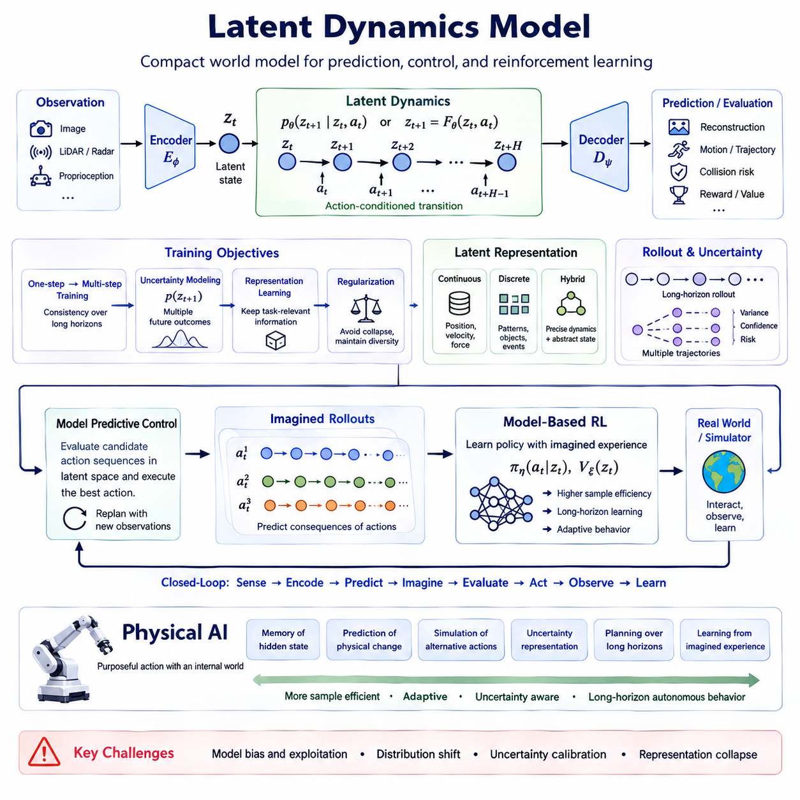{width="7.268055555555556in" height="7.268055555555556in"}

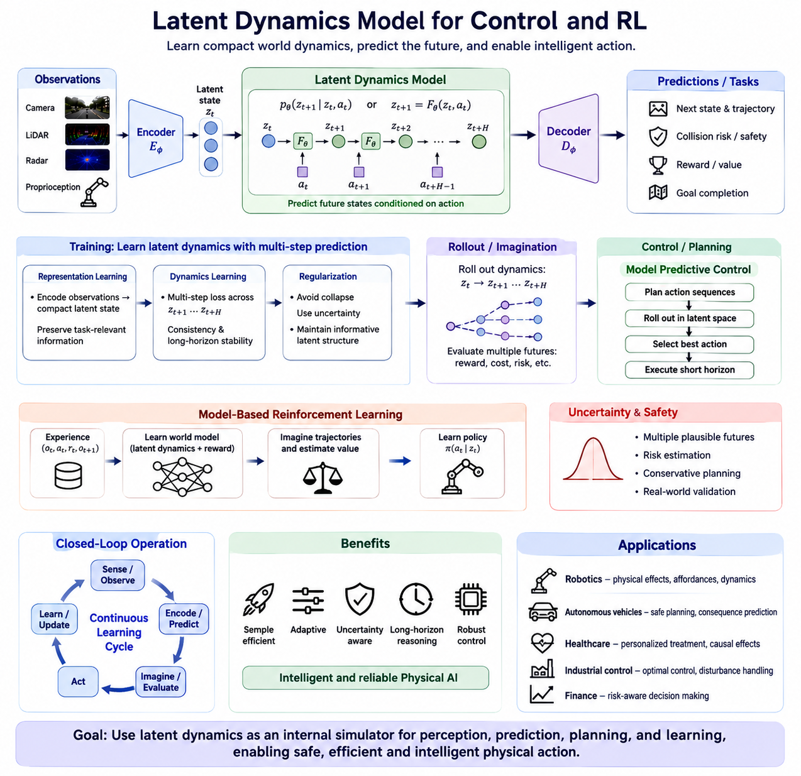{width="7.268055555555556in" height="7.045833333333333in"}

잠재 동역학 모델(latent dynamics model)은 환경이 시간에 따라 어떻게 변화하는지를 압축된 형태로 예측하여 표현한다. 모든 미래 픽셀, 라이다(LiDAR) 반사값 또는 센서 값을 직접 예측하는 대신, 모델은 관측값을 잠재 상태(latent state)로 인코딩하고 압축된 공간 안에서 상태 전이를 예측한다. 이렇게 형성된 내부 동역학(internal dynamics)은 움직임, 상호작용, 불확실성 및 미래 결과를 이해하는 데 유용한 정보를 보존한다.

시간 (t)에서 관측값 (o_t)는 인코더(encoder)에 의해 잠재 상태 (z_t)로 변환된다. 이 상태는 관측 가능한 환경뿐만 아니라 체화된 에이전트(embodied agent)의 관련 속성도 요약해야 한다. 응용 분야에 따라 기하 구조(geometry), 객체 관계(object relationship), 속도(velocity), 로봇 구성(robot configuration), 접촉 조건(contact condition), 의미론적 맥락(semantic context), 그리고 물리적 상황이 어떻게 변화할지를 예측하는 데 필요한 기타 변수들을 암묵적으로 표현할 수 있다.

핵심 구성요소는 전이 함수(transition function) 또는 동역학 함수(dynamics function)이다. 가장 단순한 결정론적 형태(deterministic form)는 (z_{t+1}=F_\\theta(z_t,a_t))로 표현할 수 있으며, 여기서 (a_t)는 에이전트가 수행하는 행동(action)을 나타낸다. 따라서 모델은 세계가 자연적으로 어떻게 변화하는지만 학습하는 것이 아니라 에이전트의 개입(intervention)에 따라 세계의 변화가 어떻게 달라지는지도 학습한다. 동일한 잠재 상태에 서로 다른 후보 행동을 적용하면 서로 다른 예측 미래를 생성할 수 있다.

다음 상태를 유일하게 결정할 수 없는 경우에는 확률적 잠재 동역학(stochastic latent dynamics)을 사용할 수도 있다. (p_\\theta(z_{t+1}\\mid z_t,a_t))와 같은 전이 분포(transition distribution)는 하나의 예측을 강제하는 대신 여러 가능한 결과를 표현한다. 이는 관측이 불완전하거나, 다른 에이전트가 예측하기 어렵게 행동하거나, 접촉 결과가 달라질 수 있거나, 확실하게 추론할 수 없는 숨겨진 물리적 속성이 미래에 영향을 미치는 경우에 중요하다.

현재 관측값만으로 물리적 상태를 추정하는 데 충분한 정보가 없는 경우에는 시간적 기억(temporal memory)이 필요하다. 순환 상태 공간 아키텍처(recurrent state-space architecture)는 결정론적 은닉 상태(deterministic hidden state) (h_t)와 확률적 또는 결정론적 잠재 상태 (z_t)를 결합할 수 있다. 이전 상태는 과거의 맥락을 유지하고 새로운 관측값은 모델의 내부 신념(internal belief)을 보정하여, 움직임이나 일시적으로 가려진 객체에 관한 정보를 시간의 흐름 속에서도 유지할 수 있게 한다.

이는 관측(observation)과 상상(imagination) 사이의 중요한 구분으로 이어진다. 관측 과정에서 모델은 예측 결과와 실제 센서 증거를 결합하여 현재 잠재 상태를 추론한다. 상상 과정에서는 미래 관측값을 사용할 수 없으므로 동역학 모델은 내부 상태와 후보 행동만을 사용하여 미래 상태를 재귀적으로 예측한다. 따라서 동일한 학습 표현(learned representation)을 지속적인 상태 추정(state estimation)과 가상 미래 시뮬레이션(hypothetical future simulation)에 모두 사용할 수 있다.

디코더(decoder)는 잠재 상태로부터 관측값을 재구성할 수 있지만 완전한 재구성이 항상 필요한 것은 아니다. 제어 중심 피지컬 AI(control-oriented Physical AI)에서는 대신 예측 헤드(prediction head)를 통해 점유 상태(occupancy), 객체 움직임(object motion), 주행 가능성(traversability), 충돌 확률(collision probability), 보상(reward), 종료 상태(termination), 가치(value)와 같은 과제 관련 정보를 추정할 수 있다. 잠재 표현은 원래 관측에 포함된 모든 센서 세부 정보를 재현하기보다는 예측과 행동에 필요한 정보를 보존해야 한다.

잠재 상태의 수학적 구조는 연속형(continuous), 이산형(discrete) 또는 하이브리드형(hybrid)이 될 수 있다. 연속 표현(continuous representation)은 위치, 속도, 힘, 기하 구조와 같이 부드럽게 변화하는 물리량을 자연스럽게 인코딩한다. 이산 상태(discrete state)는 반복적으로 나타나는 패턴을 학습된 코드(code)나 토큰(token)으로 구성하여 추상화와 시퀀스 모델링(sequence modeling)을 지원할 수 있다. 하이브리드 아키텍처는 정밀한 연속 동역학과 객체, 이벤트, 행동, 과제 단계 또는 상호작용 모드의 이산 표현을 결합할 수 있다.

따라서 표현 학습(representation learning)은 동역학 학습(dynamics learning)과 분리될 수 없다. 인코더가 지나치게 많은 노이즈, 질감(texture), 예측하기 어려운 세부 정보를 유지하면 미래 예측이 불필요하게 어려워진다. 반대로 지나치게 강하게 압축하면 물리적으로 중요한 차이가 사라진다. 유용한 잠재 상태는 미래 변화에 영향을 미치는 정보를 선택적으로 유지하면서 예측, 계획(planning), 제어와 거의 관련이 없는 변화를 억제해야 한다.

표현 붕괴(representation collapse)는 주요 실패 형태(failure mode) 가운데 하나이다. 인코더가 서로 다른 물리적 상황을 거의 동일한 잠재 상태로 매핑하거나, 확률적 변수가 사용되지 않거나, 이산 모델이 코드북(codebook)의 일부만 사용할 수 있다. 분산 제약(variance constraint), 공분산 정규화(covariance regularization), 시간적 일관성(temporal consistency), 분포 목적 함수(distributional objective), 코드북 활용 메커니즘(codebook utilization mechanism), 신중하게 설계된 자기지도 학습 손실(self-supervised loss)은 정보성이 높은 잠재 구조를 유지하는 데 도움을 줄 수 있다.

동역학 모델을 단일 단계 예측(one-step prediction)에 대해서만 학습하는 것으로는 충분하지 않은 경우가 많다. 모델은 (z_{t+1})을 정확하게 예측하면서도 자신의 출력을 다시 입력으로 반복적으로 사용하면 불안정해질 수 있다. 다단계 학습(multi-step training)은 시스템이 연속적으로 예측된 상태들을 경험하도록 하고 더 긴 예측 지평에 걸쳐 일관성을 유지하도록 유도한다. 그렇지 않으면 작은 전이 오차가 누적되어 장기적인 상상 과정에서 상당한 모델 드리프트(model drift)를 발생시킬 수 있다.

장기 잠재 롤아웃(long-horizon latent rollout)은 학습된 전이를 재귀적으로 적용하여 (z_{t+1},z_{t+2},\...,z_{t+H})를 생성한다. 이러한 상태는 압축되어 있기 때문에 고차원의 전체 센서 미래를 생성하는 것보다 많은 가상 궤적(hypothetical trajectory)을 효율적으로 시뮬레이션할 수 있다. 따라서 실제 행동을 실행하기 전에 후보 행동 시퀀스를 기대 진행 정도, 보상, 에너지 소비, 충돌 위험, 불확실성, 과제 완료 또는 기타 목표에 따라 평가할 수 있다.

롤아웃 지평(rollout horizon)이 길어질수록 일반적으로 불확실성도 증가한다. 확률적 동역학은 하나의 점점 신뢰하기 어려워지는 예측만 생성하는 대신 여러 가능한 궤적을 생성하여 이러한 불확실성을 전파할 수 있다. 계획 과정에서는 기대 결과뿐만 아니라 분산(variance), 신뢰도(confidence), 충돌 확률 또는 불리한 대안까지 고려할 수 있다. 이를 통해 예측은 단순히 무엇이 일어날 것인지를 추정하는 것에서 서로 다른 행동 아래에서 무엇이 일어날 수 있는지를 추론하는 것으로 확장된다.

시간적 추상화(temporal abstraction)는 장거리 추론(long-range reasoning)을 더욱 향상시킬 수 있다. 즉각적인 물리적 제어에는 높은 빈도의 세밀한 잠재 전이가 필요할 수 있지만, 먼 미래에 대한 계획에서는 천천히 변화하는 이벤트(event), 기술(skill), 목표(goal), 과제 단계(task phase) 등의 표현을 사용할 수 있다. 따라서 계층적 잠재 동역학(hierarchical latent dynamics)은 빠른 연속적 물리 변화와 느린 추상적 전이를 연결하여 하나의 월드 모델이 여러 공간적, 시간적, 의미론적 규모에서 추론하도록 할 수 있다.

제어(control)에서 잠재 동역학은 내부 시뮬레이터(internal simulator)로 기능한다. 모델 예측 제어(Model Predictive Control)는 후보 행동 시퀀스를 생성하고 잠재 공간에서 미래로 롤아웃한 후 예측 결과를 평가하여 가장 적절한 시퀀스의 짧은 일부만 실행하고 새로운 관측값을 받은 뒤 다시 계획할 수 있다. 이러한 이동 지평 전략(receding-horizon strategy)은 장거리 예측 능력과 현실로부터의 지속적인 보정을 결합하여 부정확한 개루프 예측(open-loop prediction)을 그대로 따라가는 위험을 줄인다.

동일한 아키텍처는 모델 기반 강화학습(model-based reinforcement learning)의 기반도 제공한다. 실제 경험을 이용해 잠재 월드 모델을 학습한 후 정책(policy)과 가치 함수(value function)는 내부적으로 생성된 가상 궤적(imagined trajectory)을 이용하여 학습할 수 있다. 모델은 가능한 결과를 예측하고, 크리틱(critic)은 미래의 기대 가치를 평가하며, 액터(actor)는 바람직한 결과를 생성하는 행동을 학습한다. 따라서 한 번의 실제 물리적 경험을 여러 번의 계산 기반 학습 갱신에 활용할 수 있다.

그러나 학습된 잠재 시뮬레이터(latent simulator)가 현실을 완벽하게 반영한다고 가정해서는 안 된다. 정책은 모델의 부정확성을 악용할 수 있으며, 학습 분포(training distribution)를 벗어나면 예측 오차가 더욱 심각해질 수 있다. 따라서 신뢰할 수 있는 시스템에는 불확실성 추정(uncertainty estimation), 보수적 계획(conservative planning), 예측 결과와 실제 관측 결과의 지속적인 비교, 추가 데이터 수집, 그리고 이전에 경험하지 못한 상황이 발견될 때마다 월드 모델을 반복적으로 갱신하는 과정이 필요하다.

완전한 잠재 동역학 모델은 궁극적으로 지각(perception), 기억(memory), 예측(prediction), 상상(imagination), 평가(evaluation), 행동(action)을 연결하는 지속적인 순환 구조를 형성한다. 센서는 현재 내부 상태를 갱신하고, 동역학은 해당 상태를 가능한 미래로 전개하며, 계획 또는 강화학습은 여러 대안을 평가하고, 행동은 실제 물리적 세계를 변화시키며, 이후의 관측은 다시 내부 모델을 보정한다. 이를 통해 예측과 상호작용은 하나의 폐루프 계산 과정(closed-loop computational process)을 구성한다.

피지컬 AI(Physical AI)에서 잠재 동역학 모델의 중요성은 고차원 센서 경험(high-dimensional sensory experience)을 즉각적인 관측과 독립적으로 변화시킬 수 있는 압축된 내부 세계(compact internal world)로 변환한다는 데 있다. 이러한 내부 공간에서 체화된 에이전트는 숨겨진 상태를 기억하고, 물리적 변화를 예측하며, 대안적 행동을 시뮬레이션하고, 불확실성을 표현하며, 더 긴 시간 범위에 걸쳐 계획하고, 실제 환경에서 행동을 실행하기 전에 가상의 경험(imagined experience)을 통해 학습할 수 있다.
