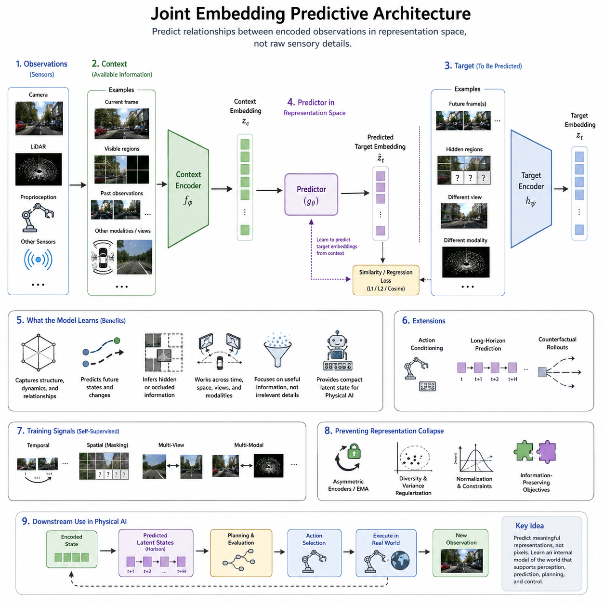
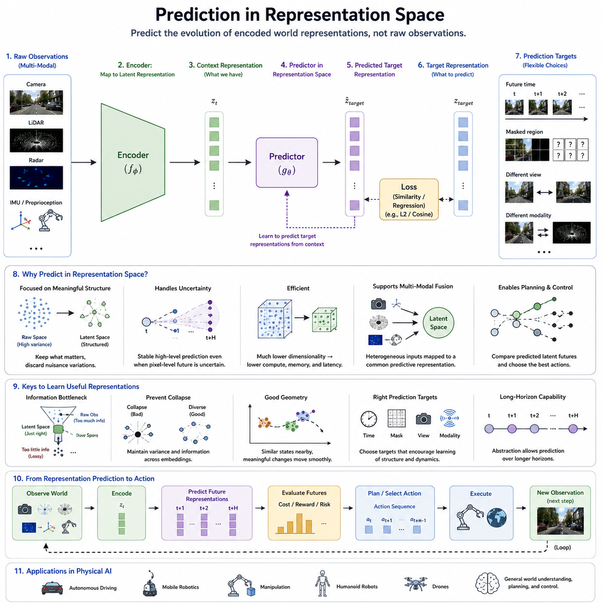
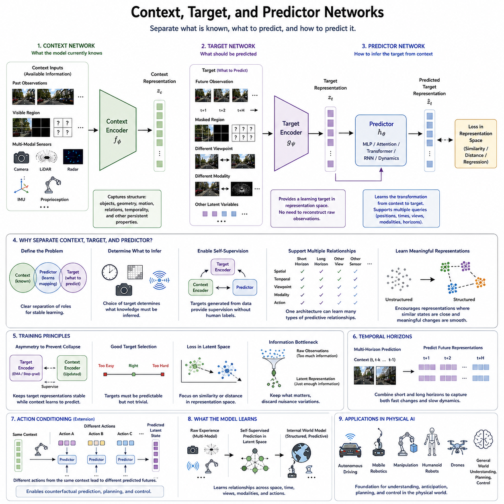
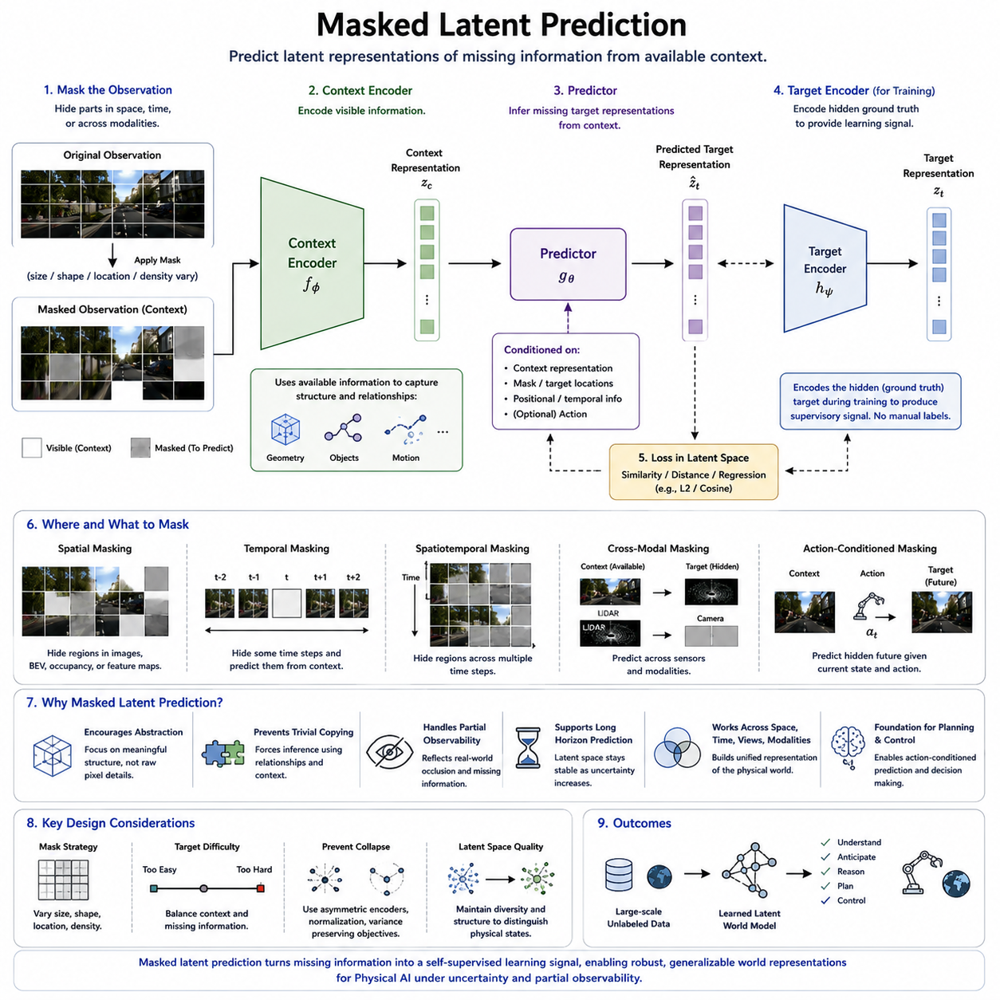
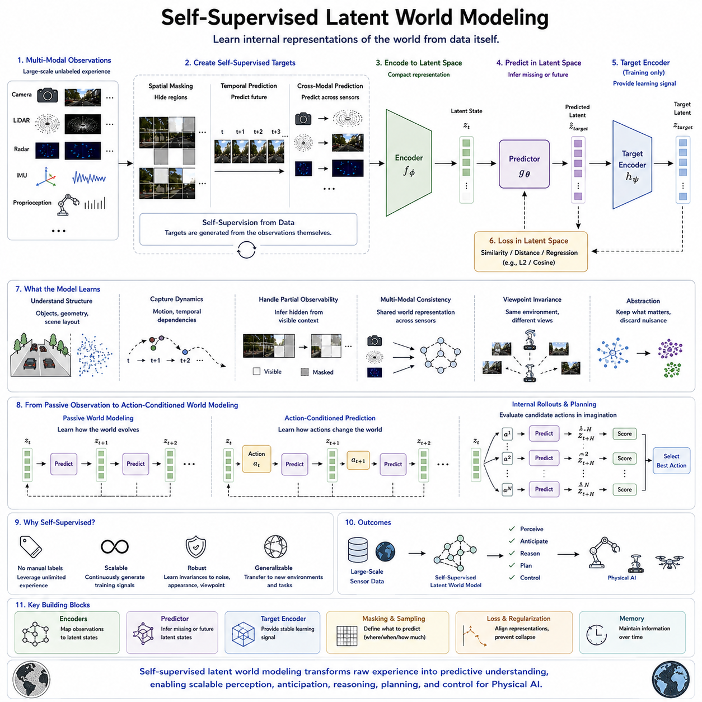
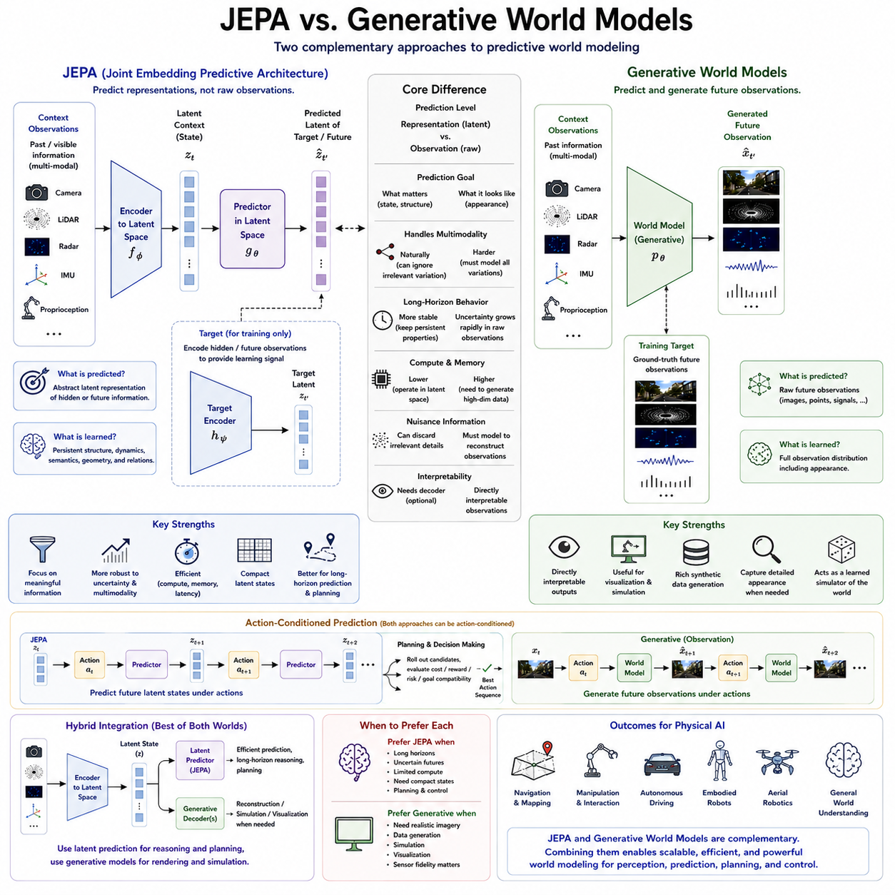
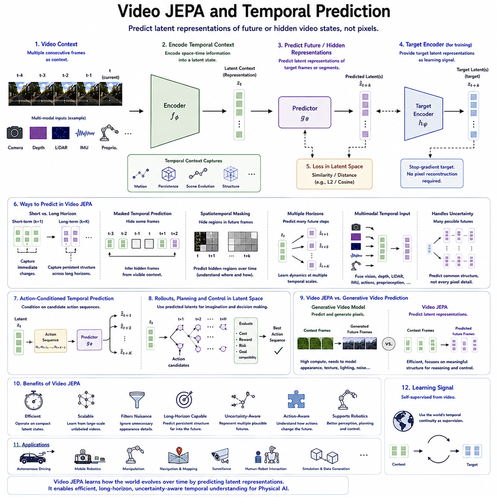
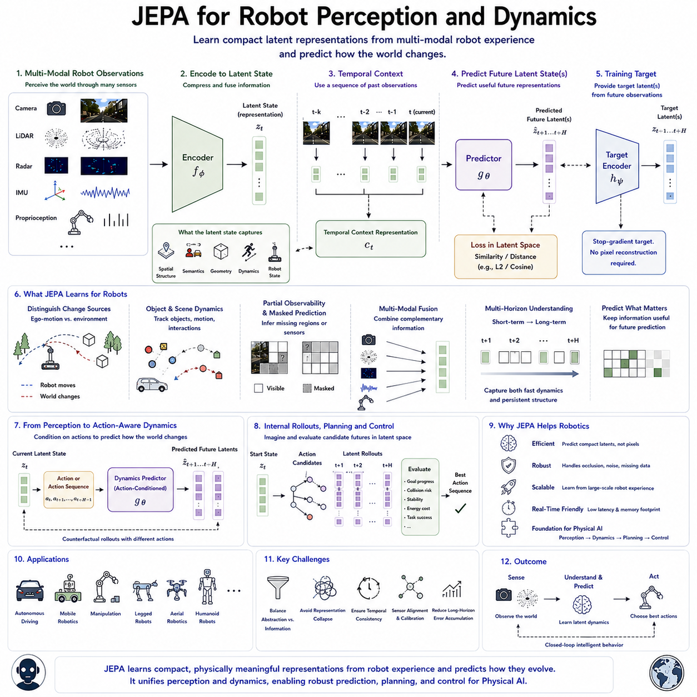
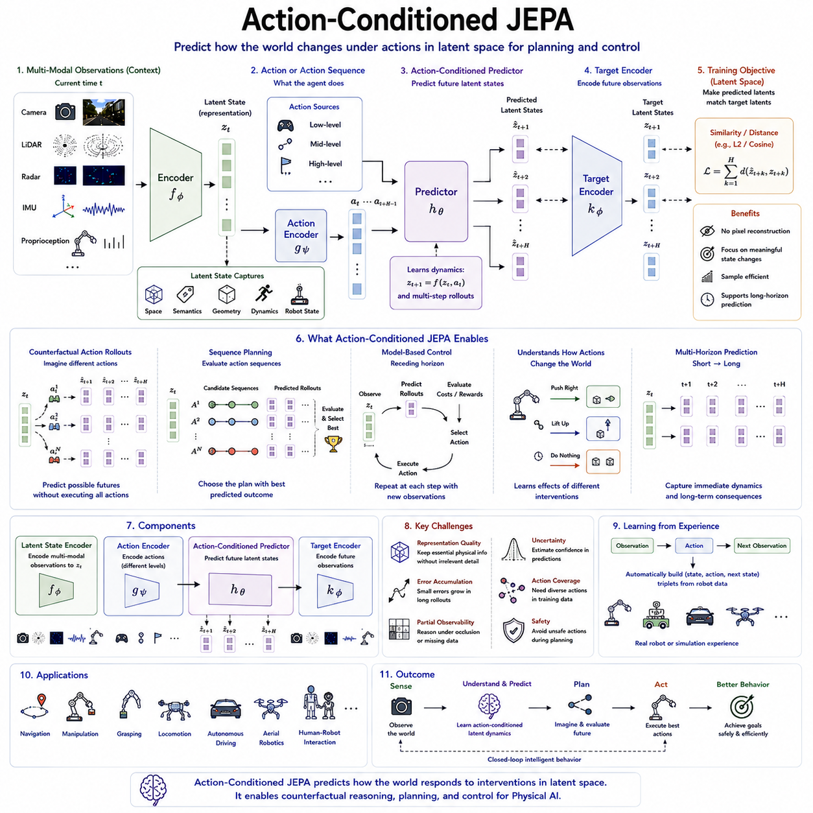
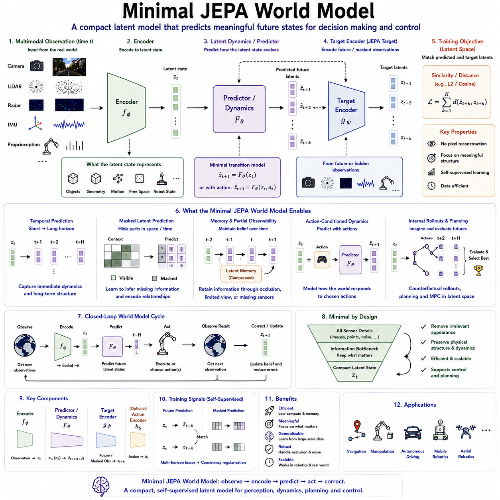

**Volume 07. World Models for Physical AI**

# Chapter 04. JEPA and Latent Predictive Architectures

## 04.01. Joint Embedding Predictive Architectures

{width="7.268055555555556in" height="7.268055555555556in"}

Joint Embedding Predictive Architectures learn useful representations of the world by predicting relationships between encoded observations rather than reconstructing every detail of raw sensory input. Instead of asking a model to reproduce pixels, waveforms, or other high-dimensional measurements, the architecture maps observations into an embedding space and learns to predict meaningful representations within that space. This shifts learning toward information that is useful for understanding structure, dynamics, and future states.

The central idea is that different observations of a related situation should be represented in a common latent space where their underlying relationships become easier to model. An encoder transforms a context observation into a compact representation, while another encoding process produces a representation of a target observation. A predictor then estimates the target embedding from the context embedding, creating a predictive learning problem directly in representation space rather than in the original observation space.

This approach is especially important for world models because physical environments contain enormous amounts of detail that may be irrelevant to an agent. Exact reconstruction of textures, illumination variations, sensor noise, background patterns, or individual pixels can consume substantial model capacity without improving decisions. Joint embedding prediction can instead emphasize persistent properties such as object identity, geometry, motion, spatial relationships, interaction possibilities, and changes that matter for future behavior.

A typical architecture therefore contains context and target encoding pathways connected through a predictor. The context encoder processes the information available to the agent, while the target representation describes information that should be inferred from that context. During learning, the predictor attempts to transform the context representation into an estimate of the target representation. Training objectives reduce the discrepancy between predicted and encoded targets while architectural or optimization mechanisms prevent trivial representations from satisfying the objective.

The meaning of context and target can vary considerably. They may correspond to different regions of the same image, different views of a scene, observations separated in time, different sensor modalities, or current and future states of a physical system. This flexibility makes joint embedding prediction a general architectural principle rather than a technique restricted to one data type. The predictive relationship itself determines which regularities the representation must capture.

Temporal prediction makes the architecture particularly relevant to Physical AI. A robot can encode its present sensory context and predict representations associated with future observations. To succeed, the latent representation must capture information about motion, object persistence, environmental changes, and temporal dependencies. Prediction across longer intervals can encourage the model to represent slower and more meaningful aspects of the environment instead of relying only on short-term visual similarity.

Joint embedding architectures can also exploit spatial prediction. Parts of an observation may be hidden or excluded from the context, requiring the predictor to estimate their representations from visible information. The model consequently learns relationships between objects, surfaces, scene regions, and larger spatial structures. For robotics, such representations can support reasoning about partially observed environments where obstacles, manipulable objects, people, or traversable regions are temporarily occluded or outside the sensor field of view.

An important challenge is representation collapse, in which an encoder maps many different inputs to identical or nearly identical embeddings. Such a solution can make prediction artificially easy while destroying useful information about the environment. Joint embedding systems therefore require mechanisms that maintain informative and diverse representations. These mechanisms may arise from asymmetric network updates, carefully designed normalization, regularization, architectural constraints, or objectives that preserve variation across encoded observations.

Unlike conventional generative prediction, joint embedding prediction does not necessarily attempt to describe every possible sensory realization of the future. Many physical situations have multiple visually different but behaviorally equivalent outcomes. Predicting an abstract representation allows the model to ignore unpredictable low-level details while preserving information relevant to state transitions. This property becomes increasingly valuable as the prediction horizon grows and exact sensory prediction becomes progressively uncertain.

For a Physical AI system, the embedding can be interpreted as a learned internal description of aspects of the world that are predictable from available evidence. Camera images, LiDAR measurements, proprioception, radar, or other observations can ultimately contribute to representations describing scene structure and dynamics. If appropriately trained, these representations can provide a compact substrate for downstream perception, memory, prediction, planning, and control without requiring repeated reasoning directly over raw sensor measurements.

The architecture also provides a natural foundation for self-supervised learning because targets can be constructed from the sensory stream itself. A robot does not require human annotations for every object, motion, interaction, or future condition. Spatial regions, temporal observations, alternative viewpoints, and multimodal measurements can provide predictive relationships automatically. Large quantities of unlabeled embodied experience can therefore become training data for learning representations of regularities in the physical world.

For world modeling, joint embedding prediction should be viewed as more than representation compression. The predictor introduces a model of relationships between latent states. When context and target correspond to different moments, the prediction implicitly captures aspects of environmental dynamics. When they correspond to different views or regions, it captures spatial dependencies. Extending these relationships across time, space, modalities, and eventually actions can transform representation learning into increasingly structured latent world modeling.

Actions provide an important later extension because physical agents do not merely observe environmental transitions; they actively cause them. A representation-space predictor can eventually incorporate motor commands or higher-level actions so that predicted embeddings depend on both current context and intended intervention. This enables the model to distinguish what is likely to happen naturally from what may happen because the robot moves, turns, grasps, pushes, or otherwise changes its environment.

Joint embedding predictive learning therefore occupies an important position between passive perception and full predictive world modeling. It provides a mechanism for learning abstract states from large-scale sensory experience while avoiding the requirement to reconstruct every detail of the observable world. The resulting representations can serve as building blocks for subsequent masked prediction, temporal JEPA models, action-conditioned architectures, and latent planning systems developed for embodied intelligence.

Within a broader Physical AI architecture, these learned representations can connect perception with prediction and eventually decision making. The encoder converts complex observations into structured latent information, the predictor learns relationships among those representations, and downstream components can use predicted latent states to evaluate future possibilities. The essential objective is not to generate a perfect sensory replica of reality, but to learn an internal representation that preserves the structure necessary to understand how the physical world evolves.

## 04.02. Prediction in Representation Space

{width="7.268055555555556in" height="7.268055555555556in"}

Prediction in representation space shifts the objective of a predictive model from reproducing raw observations to estimating the latent representations that encode their meaningful structure. Instead of predicting exactly what future pixels, LiDAR returns, or sensor measurements will look like, the model predicts how an encoded description of the world is expected to evolve. This makes prediction more focused on information relevant to understanding physical states and their transformations.

Raw observation spaces contain enormous amounts of information, much of which is difficult or unnecessary to predict. Small changes in illumination, texture, reflections, sensor noise, or viewpoint may cause large differences at the pixel level even when the underlying physical situation remains essentially unchanged. Representation-space prediction reduces this burden by allowing an encoder to transform observations into latent variables that emphasize more persistent and behaviorally meaningful properties.

The basic process begins with an encoder that maps an observation (x_t) into a latent representation (z_t). A predictor then estimates a target representation associated with another observation, region, viewpoint, or future time. Rather than minimizing an error between reconstructed and observed pixels, learning minimizes a discrepancy between the predicted representation (\\hat{z}) and the target representation (z). Prediction therefore occurs entirely within a learned semantic and structural space.

A useful representation should retain information required to distinguish physical situations while discarding variations that do not matter for prediction or action. Depending on the training objective, latent variables may encode object presence, geometry, relative position, motion, scene organization, traversability, or interaction-relevant properties. The representation does not need to correspond explicitly to human-defined variables, provided that it preserves information needed to model important relationships within the environment.

This abstraction is particularly valuable when predicting the future because future observations are inherently uncertain. A vehicle moving through a scene may encounter slightly different lighting, pedestrian poses, vegetation motion, or image details even when the high-level evolution of the scene is predictable. A latent predictor can represent the stable aspects of that future without committing computational capacity to every unpredictable sensory detail that a pixel-generative model would attempt to reproduce.

Representation-space prediction also provides a natural mechanism for learning temporal dynamics. Given a sequence of encoded observations (z_t, z_{t-1}, \\ldots), a model can predict representations corresponding to (t+1) or more distant horizons. Successful prediction requires the latent state to capture information that persists across time and explains changes between observations. Temporal learning can therefore encourage representations containing motion, object persistence, scene evolution, and other dynamic properties relevant to world modeling.

The prediction target does not have to represent an entire future observation. It may correspond to a masked region, another camera view, a different sensor modality, or a selected portion of the latent state. Predicting such targets forces the model to infer missing information from relationships already present in the context. This makes representation-space prediction applicable to spatial reasoning, multimodal learning, temporal forecasting, and partially observable environments within a common architectural framework.

For Physical AI, multimodal representation spaces are especially important because the physical state of the world is rarely observable through a single sensor. Cameras provide rich appearance and semantic information, LiDAR provides geometric structure, radar captures range and motion cues, while IMU and proprioception describe the agent\'s own dynamics. Encoders can transform these heterogeneous measurements into representations in which predictive relationships can be learned without reproducing every modality in its original format.

Prediction in latent space can also improve computational efficiency. Raw sensory streams may contain millions of values per observation, whereas useful latent states can be substantially more compact. Predictors operating on compressed representations can allocate computation toward modeling relationships and dynamics rather than repeatedly generating high-dimensional sensory outputs. This property is attractive for robotic systems where prediction must operate continuously under latency, memory, power, and edge-computing constraints.

However, compression alone does not guarantee that a representation will support useful prediction. If the encoder discards information required to distinguish future states, the predictor cannot recover it. Conversely, retaining excessive irrelevant detail can make prediction unnecessarily difficult. Joint training must therefore establish an appropriate information bottleneck in which the latent space preserves predictable and task-relevant structure while becoming insensitive to nuisance variation that does not contribute to understanding world dynamics.

Another central difficulty is preventing trivial solutions. If both context and target representations collapse toward nearly constant vectors, prediction error can become small without the model learning anything meaningful. Representation-space architectures consequently require mechanisms that maintain diversity and information across embeddings. Asymmetric encoder updates, normalization, variance constraints, regularization, teacher-student mechanisms, or related objectives can help preserve a structured latent space while predictive learning proceeds.

The geometry of the learned representation space is itself important. Similar physical situations should ideally occupy related regions, while meaningful differences in state should produce distinguishable representations. Changes in latent variables should reflect relevant transformations of the environment rather than arbitrary sensory fluctuations. A well-organized representation space therefore becomes an internal coordinate system in which the model can describe relationships among observations and predict trajectories of changing physical states.

Long-horizon prediction further increases the value of abstraction. Exact sensory futures become increasingly difficult to predict as uncertainty compounds over time, but higher-level structure can remain predictable much longer. A robot may not know the precise future pixel configuration of a moving person, yet it may predict that the person continues through a corridor or enters a particular region. Latent prediction can preserve such useful regularities while avoiding unnecessary commitment to one exact sensory realization.

Representation-space prediction forms an important bridge between perception and planning. Once observations are encoded into latent states, predicted future representations can be evaluated without decoding every candidate future back into images or other sensor measurements. A planner can compare possible latent trajectories, estimate desirable or unsafe outcomes, and select actions accordingly. Prediction thus becomes an internal simulation process operating on compact representations of possible future physical states.

As world models become action conditioned, latent prediction can incorporate both current representations and candidate actions. The model then estimates how the represented world may change if the agent executes a particular command. Different action sequences can generate alternative latent futures that can be compared before physical execution. This creates the foundation for counterfactual reasoning, model-based control, and planning through imagined trajectories without requiring full sensory generation for every hypothetical outcome.

Prediction in representation space therefore changes the purpose of a world model from generating an exact copy of future observations to maintaining a useful predictive abstraction of reality. The objective is to encode what matters, predict how that information changes, and make those predicted states available to reasoning and control. Within JEPA and related latent predictive architectures, this principle provides a scalable path from self-supervised perception toward predictive, action-aware internal models for Physical AI.

## 04.03. Context Target and Predictor Networks

{width="7.268055555555556in" height="7.268055555555556in"}

Context, target, and predictor networks form the core computational structure of Joint Embedding Predictive Architectures. Together, they define how available observations are transformed into latent representations and how information that is missing, hidden, or located in the future is inferred. Their separation allows the model to distinguish between what is currently known, what should be predicted, and the transformation required to connect these two forms of representation.

The context network processes the information that is directly available to the model. An observation, sequence, visible image region, sensor measurement, or multimodal input is first converted into a latent context representation. Rather than preserving every detail of the original signal, the context encoder is encouraged to capture structural information that can support prediction, including objects, geometry, motion, spatial relationships, temporal dependencies, and other persistent properties of the environment.

Context does not necessarily correspond to a single observation. In temporal world modeling, it may contain several previous observations that collectively describe how a scene has evolved. In spatial prediction, it may consist of visible regions surrounding a masked area. For multimodal Physical AI, context may combine camera, LiDAR, radar, IMU, and proprioceptive information. The architecture can therefore define context according to the predictive relationship that the model is expected to learn.

The target network provides the representation that the predictor is trained to estimate. A target encoder transforms the selected target observation into a latent embedding that acts as the learning reference. The target may represent a future observation, a hidden region, another viewpoint, another sensor modality, or another portion of the same physical situation. Prediction is evaluated by comparing the predictor output with this encoded target rather than reconstructing the target in raw observation space.

This separation between context and target is essential because it determines what knowledge the model must infer. If the target corresponds to a future frame, the system must learn temporal relationships and scene dynamics. If it corresponds to a masked spatial region, the system must learn spatial structure and object relationships. If the target comes from another sensor or viewpoint, prediction encourages cross-modal or viewpoint-consistent representations of the underlying physical environment.

The predictor network connects the context representation to the target representation. Its role is not simply to copy the context embedding, but to model the transformation required to infer the target from the information available in the context. Depending on the architecture, the predictor may be implemented with multilayer networks, attention mechanisms, Transformers, recurrent structures, or other latent dynamics modules capable of representing relationships across space and time.

A useful predictor must account for the fact that context and target may occupy different positions, times, views, or modalities. Positional information, temporal indices, mask information, or target descriptors can therefore be provided to indicate what should be predicted. The same context representation can potentially support multiple prediction queries, allowing a model to estimate different regions, future horizons, viewpoints, or latent variables without repeatedly encoding the complete observation.

The learning signal arises from the difference between the predicted target representation and the representation produced by the target encoder. Similarity, distance, or regression-based objectives can encourage the predicted embedding to approach the target embedding. Because this optimization occurs in latent space, the system can learn to predict meaningful properties without being forced to reconstruct unpredictable low-level details such as exact textures, illumination changes, or sensor noise.

The relationship between the context and target encoders requires careful design. If both networks are freely optimized toward an easy solution, their representations may collapse and lose meaningful variation. JEPA-style architectures therefore commonly introduce asymmetry between the two pathways. The target representation can be produced through controlled updates or related mechanisms so that it provides a sufficiently stable learning signal while the context pathway learns representations capable of predicting it.

This asymmetry can be understood as a form of moving representational supervision rather than conventional human labeling. The target network generates the learning objective from the observations themselves, while the context network and predictor attempt to match that objective. The system can consequently learn from large quantities of unlabeled sensory experience, making context-target prediction particularly suitable for self-supervised learning in environments where manual annotation of every physical state would be impractical.

Target selection strongly influences what kind of world representation emerges. Predicting targets that are too easy may allow the model to rely on local correlations without learning meaningful structure. Targets that are excessively difficult or unpredictable can produce weak learning signals. Effective training therefore selects spatial, temporal, or multimodal relationships that require abstraction while remaining sufficiently predictable from the context available to the model.

Temporal separation provides a particularly important training dimension for world models. Short-term targets encourage representations of immediate motion and local continuity, whereas longer-term targets require more persistent information about objects, scene organization, and environmental dynamics. Multiple prediction horizons can be combined so that the representation supports both rapid state changes and slower structural evolution, creating a richer internal model for Physical AI.

In robotic systems, the context network can eventually incorporate the agent\'s own state together with environmental observations. Proprioception, velocity, orientation, previous actions, and sensory measurements can contribute to the context representation. The predictor can then estimate target representations describing possible future physical states. This extends the architecture from visual representation learning toward an internal predictive model of an embodied agent interacting with its environment.

Action conditioning provides another important extension. When an action representation is supplied to the predictor, the predicted target can depend on what the robot intends to do rather than only on passive environmental evolution. Different candidate actions can therefore produce different predicted latent states from the same context. Such a structure provides a foundation for counterfactual prediction, latent rollouts, model-based planning, and control based on internally simulated consequences.

The three components ultimately perform complementary roles within a predictive world model. The context network answers what the system currently knows, the target network defines what meaningful representation should be predicted, and the predictor learns how one representation relates to the other. Their interaction transforms raw experience into a self-supervised prediction problem in which useful abstractions emerge from relationships across space, time, viewpoints, modalities, and eventually actions.

For Physical AI, this architecture offers a scalable route from perception toward predictive intelligence. Context encoders can continuously summarize multimodal observations, target encoders can provide structured learning signals from future or hidden experience, and predictors can learn transformations between latent states. As these components are extended across longer horizons and action-conditioned transitions, they become fundamental building blocks for world models that support understanding, anticipation, planning, and control.

## 04.04. Masked Latent Prediction

{width="7.268055555555556in" height="7.268055555555556in"}

Masked latent prediction trains a model to infer representations of information that has deliberately been hidden from its context. Instead of reconstructing the missing content directly in pixel or sensor space, the model predicts the latent embedding associated with the masked region or observation. Within JEPA-style architectures, this transforms masking into a self-supervised prediction problem focused on meaningful structure rather than exact sensory reconstruction.

The process begins by dividing an observation or sequence into portions that will remain visible and portions that will become prediction targets. The visible information is processed by a context encoder to produce a context representation, while the hidden information is processed separately by a target encoder during training. A predictor receives the context representation and information describing the masked locations, then estimates the latent representations corresponding to those hidden targets.

This differs fundamentally from masked reconstruction methods that attempt to reproduce missing pixels, tokens, or sensor values. Raw-space reconstruction can encourage a model to spend capacity modeling texture, illumination, noise, and other low-level details. Masked latent prediction instead asks what representation of the missing content is consistent with the surrounding context, encouraging the model to capture higher-level relationships that remain useful across variations in appearance.

Masking creates an information gap that prevents the model from simply copying its input. To predict a hidden region successfully, the system must exploit relationships among visible objects, geometry, scene layout, temporal context, and other observations. The difficulty of the task can therefore be controlled through mask size, shape, location, density, and distribution. Properly designed masks encourage inference without making the prediction problem either trivial or impossible.

Spatial masking is one of the most direct forms of masked latent prediction. Portions of an image, BEV representation, occupancy map, point-cloud-derived feature map, or other spatial representation can be removed from the context. The model must infer the representation of the missing area from surrounding evidence. This can promote understanding of object continuity, spatial organization, geometric relationships, occlusion, and larger scene structures relevant to Physical AI.

Temporal masking extends the same principle across time. One or more observations within a sequence can be hidden while earlier, later, or surrounding observations remain available as context. Predicting the masked temporal representation requires the model to reason about motion and environmental dynamics. When future observations are masked and only past context is available, the task naturally approaches predictive world modeling because the model must estimate latent future states.

Spatiotemporal masking combines these dimensions by hiding selected regions across multiple frames or time steps. A moving object may disappear from some observations while other portions of its trajectory remain visible. The predictor must use both spatial relationships and temporal continuity to infer the missing representation. Such training can encourage latent states that encode persistent objects, motion patterns, scene geometry, and dynamic interactions rather than isolated visual features.

Masked prediction can also operate across sensor modalities. Camera features may serve as context while selected LiDAR representations are treated as targets, or geometric observations may help predict missing visual representations. Radar, proprioception, IMU signals, and other modalities can participate in similar relationships. Cross-modal masking encourages the model to discover shared physical structure that is observable through different sensing mechanisms.

The target representation is crucial because it determines what the predictor is actually asked to recover. A target encoder transforms hidden observations into latent embeddings, creating supervisory signals without manual labels. The predictor does not need access to the hidden raw observations themselves. It only learns to generate representations that approach the encoded targets, allowing large quantities of unlabeled robot and environmental data to support self-supervised representation learning.

Masking strategy strongly affects representation quality. Very small or predictable masks may allow local interpolation and encourage shallow correlations, while excessively large masks may remove so much context that the target becomes fundamentally ambiguous. Effective training therefore balances available evidence and missing information. Variable masks can expose the model to different levels of difficulty and encourage representations capable of reasoning across both local and global dependencies.

The architecture must also prevent representation collapse, where different inputs produce nearly identical latent embeddings and the prediction task becomes meaningless. Asymmetric context and target pathways, controlled target-network updates, normalization, variance-preserving objectives, or related regularization mechanisms can maintain informative representations. Masking alone does not guarantee useful learning; the latent space must preserve enough diversity to distinguish meaningful physical states.

For long-horizon world modeling, masked latent prediction provides a way to increase abstraction as uncertainty grows. Predicting exact future observations becomes increasingly difficult over longer intervals because many low-level outcomes are possible. Predicting their latent representations allows the model to preserve stable information about scene organization, object behavior, motion tendencies, or possible interactions without committing to one exact future sensory realization.

In Physical AI, the masking concept can represent more than an artificial training operation. Real robots continuously experience missing information because of occlusion, limited fields of view, sensor degradation, communication loss, and partial observability. Training a model to infer masked representations therefore resembles conditions encountered during deployment. The learned world representation can become more capable of maintaining useful internal state even when portions of the physical environment cannot be directly observed.

Masked latent prediction also creates a natural bridge toward memory. Information visible at an earlier time may later become occluded, yet a temporal context representation can preserve evidence about its existence and dynamics. Predicting hidden states from current observations and stored context encourages the system to maintain representations of persistent entities. This capability is important for navigation, manipulation, autonomous driving, and interaction in dynamic environments.

When actions are incorporated, masked prediction can evolve into action-conditioned latent prediction. The model can receive the current context together with an intended robot action and predict the latent representation of a future state that has been withheld during training. Different actions can imply different target states, forcing the predictor to learn how interventions alter the environment. This moves the architecture from passive completion toward causal and controllable world prediction.

Masked latent prediction therefore serves as a powerful self-supervised mechanism for learning internal representations of physical environments. By hiding selected information and requiring its representation to be inferred from available context, the model learns relationships across space, time, viewpoints, modalities, and eventually actions. Within JEPA-based world models, it provides a scalable path from representation learning toward robust latent dynamics, partial-observation reasoning, future prediction, planning, and control.

## 04.05. Self Supervised Latent World Modeling

{width="7.268055555555556in" height="7.268055555555556in"}

Self-supervised latent world modeling enables an intelligent agent to learn internal representations of the physical world directly from large-scale sensory experience without requiring dense human annotation. Rather than assigning explicit labels to every object, state, motion, or interaction, the learning process creates supervisory signals from relationships already present in the data. Prediction, masking, temporal continuity, multiple viewpoints, and sensor correspondences become sources of supervision.

The central objective is to transform raw observations into a latent state that preserves information needed to understand how the environment is structured and how it changes. Cameras, LiDAR, radar, IMU, proprioception, and other sensors may generate extremely high-dimensional streams, but a world model does not need to reproduce every measurement. An encoder can instead learn compact representations emphasizing persistent geometry, objects, motion, semantics, and interaction-relevant structure.

Self-supervision arises by constructing prediction problems from the observations themselves. A portion of an image may be hidden and predicted from surrounding regions, a future observation may be predicted from past context, or one sensor representation may be inferred from another modality. Because both context and targets originate from naturally collected data, the system can continuously generate learning examples without requiring a human to specify the correct semantic interpretation of every observation.

Latent prediction changes what the model is required to learn. Pixel-space prediction must account for texture, illumination, reflections, noise, and numerous details that may be unpredictable yet irrelevant to behavior. A latent world model instead predicts encoded representations that can discard nuisance variation while retaining stable properties of the physical situation. The learning problem therefore shifts from reconstructing sensory appearance toward discovering predictable structure in the environment.

Temporal self-supervision is particularly important because a world model must represent change rather than only static appearance. Observations collected at different times provide natural relationships between present and future states. Predicting future latent representations encourages the model to capture motion, object persistence, environmental transitions, and temporal dependencies. Longer prediction horizons can further encourage abstraction because only sufficiently persistent information remains reliably predictable over extended periods.

Masked latent prediction provides another powerful learning signal. Selected regions, time steps, or feature groups are removed from the context while their encoded representations become targets. The model must infer what is missing from the information that remains available. Spatial masks promote understanding of scene organization and geometry, while temporal masks encourage dynamics learning. Spatiotemporal masks can combine both requirements within the same training process.

Multimodal sensory streams provide additional forms of self-supervision for Physical AI. Different sensors observe different aspects of the same underlying physical state. Visual observations may contain appearance and semantic cues, LiDAR provides geometric structure, radar contributes range and motion information, while proprioception describes the agent itself. Predicting relationships among their latent representations can encourage a shared world representation grounded in physical consistency across sensing modalities.

Multiple viewpoints can similarly provide supervision without explicit labels. When several cameras or observations from different positions perceive the same environment, the model can learn representations that remain consistent despite changes in viewpoint. This encourages the latent space to encode properties belonging to the world rather than accidental characteristics of one particular sensor image. Such invariance is valuable for mobile robots operating while their position and orientation continuously change.

A self-supervised latent world model typically combines an encoder with a predictive mechanism operating in representation space. Context observations are mapped into latent variables, and a predictor estimates target representations corresponding to hidden, future, or otherwise unavailable information. During training, target encodings provide the reference signal. The difference between predicted and target representations drives learning without requiring the model to decode every prediction back into the original sensory domain.

The latent state should be understood as more than compressed sensor data. Ideally, it becomes an internal state representation capable of supporting multiple forms of inference. Information about objects, free space, geometry, motion, agent state, and environmental dynamics may be distributed throughout the representation. What matters is that the representation preserves distinctions required for prediction and future behavior while removing details that do not contribute meaningfully to understanding the physical world.

Preventing representation collapse remains a fundamental requirement. If an encoder maps different observations into nearly identical latent states, the prediction objective can be satisfied without learning useful structure. Self-supervised latent architectures therefore require mechanisms that maintain information and diversity in their embeddings. Asymmetric context and target pathways, controlled target updates, normalization, variance constraints, and related regularization strategies can help stabilize learning.

Memory becomes increasingly important when observations are incomplete. A physical agent rarely sees the entire environment at one moment because objects become occluded, sensors have limited fields of view, and information disappears as the robot moves. Temporal latent representations can preserve evidence from previous observations and combine it with current sensory input. Self-supervised prediction across time can therefore train the model to maintain useful internal state under partial observability.

The next major extension is action-conditioned latent world modeling. Passive observation teaches how the environment tends to evolve, but an embodied agent must also learn how its own actions influence that evolution. By combining a latent state with motor commands or higher-level actions, a predictor can estimate representations of resulting future states. Experience generated through interaction can then provide self-supervised examples of state-action-transition relationships.

Once action-conditioned dynamics are learned, the world model can support internal rollouts. Different candidate actions or action sequences can be applied to the current latent state to generate alternative predicted futures. These futures can be evaluated according to task objectives, safety constraints, costs, or expected rewards before actions are executed in the physical environment. The latent world model consequently becomes a computational substrate connecting perception, prediction, planning, and control.

Large-scale self-supervised learning is particularly attractive for Physical AI because robots can potentially accumulate enormous quantities of operational data. Driving, navigation, manipulation, inspection, and human-robot interaction continuously produce observations that contain spatial, temporal, multimodal, and action-dependent structure. Instead of treating most of this data as unlabeled and unusable, latent world modeling can convert ordinary embodied experience into a persistent source of training signals.

Self-supervised latent world modeling therefore provides a pathway from sensory data toward predictive internal representations without requiring exhaustive manual annotation. By learning from masked information, temporal transitions, multiple viewpoints, sensor relationships, and eventually actions, the model can discover reusable structure in physical experience. Within JEPA and related latent predictive architectures, this approach forms a foundation for scalable world models capable of perception, anticipation, reasoning, planning, and control.

## 04.06. JEPA vs Generative World Models

{width="7.268055555555556in" height="7.268055555555556in"}

JEPA and generative world models represent two different strategies for learning predictive models of an environment. Generative approaches attempt to model observations sufficiently well to reconstruct or generate future sensory data, while Joint Embedding Predictive Architectures focus on predicting representations of relevant future or hidden information. The distinction concerns not whether prediction occurs, but what level of the world the model is required to predict.

A generative world model typically learns to produce observations such as images, video frames, occupancy structures, sensor measurements, or other data describing possible future states. Depending on the architecture, generation may use autoregressive models, variational methods, diffusion models, or related techniques. The model therefore attempts to represent enough of the observation distribution to synthesize plausible outcomes that resemble what sensors could actually observe.

This generative capability can be extremely useful because generated observations are directly interpretable. Predicted video can reveal expected object motion, generated occupancy can describe future spatial structure, and simulated observations can provide an environment in which an agent evaluates possible outcomes. Generative models can consequently function as learned simulators, especially when realistic sensory prediction is itself important for training, evaluation, visualization, or synthetic experience generation.

However, raw sensory prediction contains substantial uncertainty and irrelevant detail. The future appearance of a scene may depend on illumination, texture, shadows, reflections, vegetation movement, sensor noise, and countless variables that have little influence on an agent\'s decision. A generative model may allocate considerable capacity to these factors because producing realistic observations requires modeling them even when they are not essential for understanding physical dynamics.

JEPA takes a different approach by predicting in representation space rather than requiring reconstruction of the original observation. Context observations are encoded into latent representations, and a predictor estimates the representation of a target observation, region, or future state. The objective is therefore to predict meaningful abstract information that is encoded by the target network rather than every observable detail that could appear in the sensory signal.

This difference can be understood as prediction of appearance versus prediction of abstraction. A generative model may attempt to answer what the future will look like, whereas a JEPA-style model attempts to estimate what meaningful state or structure will characterize that future. The boundary is not absolute, because generative models can also operate in latent spaces, but JEPA does not require decoding its predicted representation into a complete sensory realization as its primary learning objective.

The distinction becomes particularly important when the future is multimodal. Many different sensory outcomes may correspond to essentially equivalent physical situations. A pedestrian can adopt many precise poses while continuing along the same path, or an outdoor scene can exhibit numerous pixel-level variations while preserving identical navigational structure. Representation prediction can treat these variations as secondary and preserve the higher-level information that matters for reasoning and action.

Long-horizon prediction amplifies this advantage. Pixel-level uncertainty typically increases rapidly as the prediction horizon grows, making exact future generation progressively more difficult. Higher-level properties such as object persistence, approximate motion, scene topology, traversability, or interaction possibilities may remain predictable much longer. JEPA-style latent prediction can concentrate its modeling capacity on these persistent structures rather than repeatedly generating increasingly uncertain sensory details.

Generative models nevertheless retain an important advantage when explicit future observations are required. A robot development system may need realistic future images for visualization, synthetic data generation, simulation, human inspection, or downstream perception training. Video generation can also capture rich environmental possibilities that are difficult to specify manually. In such cases, the ability to decode a world state into observable sensory consequences becomes a valuable capability rather than unnecessary computational overhead.

Computational requirements also differ. High-resolution generative prediction can be expensive because the model must produce large numbers of pixels, voxels, points, or tokens across multiple future steps. Representation-space prediction can operate on substantially smaller latent states and avoid decoding each predicted future. This can make JEPA-like architectures attractive for Physical AI systems operating under strict latency, memory, energy, and edge-computing constraints.

The two approaches also differ in how they treat nuisance information. Generative objectives generally reward accurate modeling of everything required to reproduce the observation distribution. JEPA-style objectives can allow encoders to discard unpredictable or behaviorally irrelevant variation if it is unnecessary for matching target representations. The resulting latent space can therefore act as an information bottleneck that emphasizes structure useful for prediction while suppressing details that do not support world understanding.

Neither approach automatically produces a useful world model. Generative systems can learn superficial appearance without sufficiently capturing causal or controllable dynamics, while representation-based systems can lose essential information if their latent space becomes overly compressed. JEPA architectures additionally face representation collapse and require mechanisms that maintain informative embeddings. World-model quality therefore depends on training objectives, architecture, data, temporal structure, and action conditioning rather than prediction format alone.

For Physical AI, actions introduce a decisive requirement. A useful world model should predict not only what may happen next, but how possible futures depend on the agent\'s behavior. Both generative and JEPA-style models can become action conditioned. A generative model may synthesize future observations under candidate actions, while a JEPA model may predict corresponding future latent states. Both can therefore support counterfactual reasoning, although they operate at different representational levels.

Planning illustrates the practical tradeoff. A generative planner can imagine detailed sensory futures and evaluate them, but repeatedly generating high-dimensional observations for many candidate action sequences can be costly. A latent predictive planner can instead roll out compact representations, estimate cost, reward, risk, or goal compatibility directly in latent space, and decode only when necessary. This provides a potentially efficient internal imagination mechanism for real-time robotic decision making.

The relationship between JEPA and generative world models should therefore not be treated as a strict choice between mutually exclusive architectures. A system can use representation prediction for efficient state estimation and long-horizon reasoning while employing generative components when detailed sensory realization is required. Latent predictions may guide planning, while decoders or generative models provide visualization, simulation, reconstruction, or high-resolution prediction at selected stages.

Such hybrid architectures are particularly relevant to multimodal Physical AI. A compact shared latent state can integrate camera, LiDAR, radar, proprioception, and other observations while predictive dynamics estimate how this state evolves. Selected generative heads can then reconstruct or synthesize particular modalities when needed. This separates the computational problem of understanding and predicting the world from the optional problem of rendering detailed observations from that understanding.

JEPA and generative world models ultimately emphasize complementary capabilities. Generative approaches provide rich observable futures and learned simulation, while JEPA emphasizes abstraction, efficient representation-space prediction, and the extraction of persistent structure from experience. For Physical AI, the most effective world models may combine these principles, using latent prediction for scalable reasoning and planning while invoking generation where explicit sensory futures provide additional value.

## 04.07. Video JEPA and Temporal Prediction

{width="7.268055555555556in" height="7.268055555555556in"}

Video JEPA extends the principles of Joint Embedding Predictive Architectures from individual observations to sequences of visual observations. Instead of treating each video frame as an independent image, it learns representations that capture how visual information changes over time. The central objective is to predict meaningful latent representations of future or hidden video states rather than reconstruct every future pixel. This makes temporal prediction a natural component of latent world modeling.

A video sequence provides a rich source of temporal structure because neighboring frames are related by physical continuity. Objects generally persist, cameras and robots move through coherent trajectories, and changes in the environment follow patterns rather than occurring randomly. Video JEPA can exploit these relationships by encoding a temporal context and predicting representations associated with later observations. The resulting latent space can therefore capture motion, persistence, scene evolution, and temporal dependencies.

The context for video prediction may consist of several consecutive frames rather than a single image. An encoder transforms this sequence into a compact representation containing information distributed across space and time. The predictor then estimates the representation of a future frame, future segment, or selected temporal target. The target representation can be generated separately during training, allowing the system to compare predicted and target embeddings without requiring complete pixel-level reconstruction.

Temporal prediction can operate at multiple horizons. Short-horizon prediction focuses on immediate changes such as local motion and object displacement, while longer-horizon prediction requires the model to preserve more persistent properties of the scene. As the horizon increases, exact pixel prediction becomes increasingly uncertain because many visually different futures are possible. Latent prediction can remain useful by concentrating on stable information such as object identity, approximate trajectories, spatial relationships, and scene structure.

Video JEPA can also use masked temporal prediction. Instead of providing the complete sequence, selected frames, patches, or temporal regions can be hidden from the context. The model must infer their latent representations from the information that remains visible. This forces the representation to capture relationships across time and prevents the predictor from simply copying the immediately preceding frame. Temporal masking can therefore encourage deeper understanding of motion and scene dynamics.

Spatial and temporal masking can be combined to create spatiotemporal prediction tasks. A model may need to predict a hidden region several frames into the future, requiring it to understand both where an object is and how it is moving. This is particularly relevant for Physical AI because the future state of an environment depends simultaneously on spatial structure and temporal evolution. Such prediction can support representations of moving objects, changing occupancy, interaction patterns, and dynamic scene geometry.

Video JEPA does not necessarily require a single deterministic future. Physical environments often contain multiple plausible outcomes, particularly when people, vehicles, animals, or other agents are involved. A representation-space predictor can learn features common to multiple plausible futures without selecting every low-level visual detail. This provides a useful abstraction for uncertainty because the model can preserve predictable structure while avoiding unnecessary commitment to one exact pixel-level realization.

Temporal representation learning also benefits from longer sequences because different temporal scales contain different types of information. Very short intervals reveal rapid motion and local interactions, while longer sequences reveal persistent behavior, route structure, environmental changes, and recurring patterns. A hierarchical or multi-horizon approach can therefore allow a world model to represent both fast dynamics and slower evolution. This provides a stronger basis for prediction, memory, planning, and control.

For robotics, video JEPA can incorporate more than visual frames. Camera observations may be combined with depth, LiDAR, proprioception, IMU measurements, actions, or other temporal signals. The model can learn a shared latent representation in which visual changes are related to the robot\'s own motion and environmental dynamics. This is important because a camera image can change substantially simply because the robot moves, even though the underlying physical environment remains unchanged.

Action conditioning provides a further extension of temporal prediction. Instead of predicting the future only from past observations, the model can receive a candidate action sequence together with the current latent state. It can then estimate how the latent future may differ under different actions. This transforms passive temporal prediction into an action-aware predictive model that can support counterfactual rollouts, planning, and model-based control. The broader world-model structure includes action-conditioned prediction as a subsequent extension of the JEPA architecture.

Video JEPA can also serve as an efficient alternative to full generative video prediction when the primary objective is reasoning rather than visual rendering. Generating every future frame requires the model to represent textures, lighting, fine appearance, and other details that may not be important for decision making. Predicting compact latent states can reduce computational and memory requirements while retaining information relevant to future behavior. A generative decoder can still be added when detailed visualization or sensory reconstruction is required.

The training signal can be generated directly from large collections of unlabeled video. Robot trajectories, autonomous driving sequences, simulation data, and other temporal visual experiences naturally contain context-target relationships. The model can learn from these relationships without requiring frame-by-frame semantic labels. Large-scale self-supervised temporal learning can therefore transform ordinary video experience into training data for learning general representations of physical dynamics and environmental change.

A major challenge is preventing the model from learning superficial temporal correlations. Simply predicting the next frame may encourage reliance on low-level visual continuity without understanding the underlying physical state. Effective video JEPA training should therefore create prediction tasks that require meaningful temporal abstraction. Masking, multiple prediction horizons, diverse contexts, and carefully selected target relationships can encourage the model to learn persistent structure rather than merely memorize local appearance.

The learned temporal representation can become a foundation for a broader world model. Current observations are encoded into a latent state, temporal predictors estimate future latent states, and memory mechanisms preserve information across time. Planning components can then evaluate possible latent futures, while control systems can use the selected prediction to determine actions. In this architecture, video prediction is not an isolated computer-vision task but a mechanism for learning how the physical world evolves.

Video JEPA therefore connects visual representation learning with temporal world modeling. By predicting latent representations across time, it can learn motion, persistence, spatial relationships, environmental dynamics, and future structure while avoiding the requirement to reproduce every sensory detail. Within the broader JEPA chapter structure, this provides a natural bridge from representation-space prediction and self-supervised latent modeling toward robot perception, dynamics understanding, and action-conditioned world models.

## 04.08. JEPA for Robot Perception and Dynamics

{width="7.268055555555556in" height="7.268055555555556in"}

JEPA can provide a useful foundation for robot perception and dynamics because it separates the problem of understanding the current physical state from the problem of predicting how that state will change. In a robotic system, observations from cameras, LiDAR, radar, IMU, and proprioception can be transformed into compact latent representations. The predictor can then learn relationships among these representations across time, creating an internal state that is useful for both perception and future-state prediction. The topic is positioned within the JEPA and latent predictive architecture chapter as a bridge from general representation learning toward physical robot world models.

Robot perception is fundamentally different from conventional image recognition because the objective is not simply to identify objects in individual frames. A robot must understand where objects are, how they are moving, how the environment is structured, what parts of the scene are traversable, and how its own motion affects observations. JEPA-style representation learning can combine these requirements by learning latent states that preserve persistent spatial, semantic, geometric, and dynamic information while reducing sensitivity to irrelevant visual variation.

A multimodal robot perception system can encode camera images together with LiDAR, radar, IMU, and proprioceptive measurements into a shared or coordinated latent representation. Each sensor observes a different aspect of the physical state, and their combination can provide stronger information than any single modality. The latent representation does not need to reproduce every sensor measurement. Instead, it should preserve relationships that are useful for estimating the robot state, understanding the environment, and predicting future changes.

Temporal structure is essential because robot perception must distinguish between static properties and dynamic events. A single observation may reveal the position of an object, but a sequence can reveal whether that object is stationary, approaching, turning, accelerating, or interacting with another object. JEPA can learn these temporal relationships by encoding a sequence of observations as context and predicting latent representations associated with later states. The resulting representation can therefore contain both current state information and evidence about environmental dynamics.

For a mobile robot, ego-motion is an especially important component of dynamics understanding. Camera and LiDAR observations may change substantially simply because the robot moves, even when the surrounding environment remains physically unchanged. A useful latent representation should distinguish changes caused by the robot\'s own motion from changes caused by objects or environmental processes. Combining visual observations with IMU, odometry, proprioception, and other motion information can help the model establish a more stable representation of the underlying world.

JEPA-style prediction can also support object-centric and scene-level dynamics without requiring every object to be explicitly labeled. If a target representation is selected from a future observation, the predictor must capture information that remains useful across the transition. Persistent objects, spatial relationships, approximate trajectories, free space, and scene structure can therefore become encoded in the latent state. This allows the model to learn physical regularities from experience rather than relying entirely on manually defined semantic categories.

Masked prediction provides another useful mechanism for robot perception. Portions of a scene, sensor representation, or temporal sequence can be hidden while the model predicts their latent representations from visible context. This resembles conditions that occur naturally in robotics because sensors frequently encounter occlusion, limited field of view, temporary degradation, or missing measurements. Learning to infer hidden representations can therefore improve the ability of the internal model to maintain useful state information under partial observability.

The latent representation can also serve as a bridge between perception and dynamics modeling. A conventional perception system may estimate objects and geometric features and then pass these results to a separate dynamics model. In a JEPA-based architecture, the representation itself can be trained to preserve information required for predicting future states. Perception and dynamics therefore become coupled through the latent state, allowing the model to learn which aspects of perception are actually important for anticipating how the environment will evolve.

Prediction horizons determine the type of dynamics that the representation must capture. Short-horizon prediction can emphasize immediate motion, local interactions, and rapidly changing sensor information. Longer-horizon prediction requires more persistent structure, including object identity, scene organization, route-level information, and environmental constraints. A robot world model can use multiple horizons so that the latent representation simultaneously supports immediate reaction and longer-term anticipation.

The same principle can be applied to different robotic platforms. An autonomous mobile robot may emphasize free space, obstacles, localization, and moving agents. A manipulator may emphasize object pose, contact relationships, graspable surfaces, and interaction dynamics. A quadruped may require terrain structure, body motion, foothold relationships, and stability information. The underlying JEPA principle remains similar: learn representations that contain information necessary to predict relevant future states while avoiding unnecessary sensory detail.

Action information provides the next step toward a complete robot dynamics model. Passive observation can reveal how the environment tends to change, but a robot must also understand how its own actions modify that change. A latent predictor can eventually receive the current representation together with an action or action sequence and estimate the resulting future representation. This creates an action-conditioned transition model in latent space and provides the foundation for counterfactual prediction, planning, and model-based control.

The latent dynamics can support internal rollouts without generating complete future images or sensor streams. Starting from the current latent state, the model can predict several possible future states under different action sequences. These latent trajectories can be evaluated according to navigation goals, collision risk, task progress, stability, energy consumption, or other criteria. The robot can therefore perform a form of internal imagination in which candidate futures are compared before physical actions are executed.

JEPA is particularly attractive for this process because robot perception and dynamics operate under strict computational constraints. A robot may need to process multiple sensor streams continuously while maintaining low latency and limited power consumption. Predicting compact latent states can reduce the computational burden associated with generating high-dimensional future observations. This does not mean that generative models are unnecessary; detailed sensory reconstruction can still be valuable for simulation, visualization, or selected perception tasks. The latent predictor can instead serve as the efficient core of the predictive system.

A major challenge is ensuring that the latent representation remains physically meaningful. If the representation becomes too compressed, information required for safe navigation or control may be lost. If it preserves excessive low-level detail, prediction becomes inefficient and sensitive to nuisance variation. The training process must therefore balance information preservation and abstraction. Representation collapse, temporal inconsistency, sensor misalignment, and accumulated prediction error must also be addressed when the latent model is used for longer-horizon prediction.

For Physical AI, the most important outcome is not simply better perception accuracy but a unified internal representation that can support perception, dynamics understanding, prediction, and eventually action. A JEPA-based robot world model can transform multimodal observations into a latent physical state, learn how that state changes over time, and later condition those changes on the robot\'s actions. This provides a natural progression from sensor representation to predictive world modeling and finally toward planning and control.

JEPA for robot perception and dynamics therefore represents an important transition from passive recognition to predictive physical intelligence. The robot does not merely ask what is visible now; it learns which aspects of the current state are important for predicting what will happen next. By combining multimodal perception, temporal prediction, latent dynamics, partial-observation reasoning, and eventual action conditioning, the approach can form a compact internal model that connects sensing with anticipation and behavior. This makes JEPA a strong architectural component for scalable robot world models and broader Physical AI systems.

## 04.09. Action Conditioned JEPA

{width="7.268055555555556in" height="7.268055555555556in"}

Action-conditioned JEPA extends Joint Embedding Predictive Architectures from passive prediction toward predictive modeling of how an environment changes under an agent's actions. A passive JEPA learns relationships between context and future representations, while an action-conditioned JEPA additionally receives an action or action sequence and predicts the latent state that is expected to result. This creates a direct connection between perception, latent dynamics, counterfactual prediction, planning, and control within a common representation space.

The key idea is that the future state of a physical system depends not only on its current state but also on what the agent does. A robot observing an object cannot predict its future position accurately without considering whether the robot moves toward it, pushes it, grasps it, or does nothing. Action-conditioned JEPA therefore models a relationship such as (z_{t+1}=f(z_t,a_t)), where (z_t) represents the current latent state and (a_t) represents the action. The predictor learns how actions transform the represented world.

The current context can contain multimodal observations from cameras, LiDAR, radar, IMU, proprioception, and other sensors. These observations are encoded into a compact latent representation that describes relevant spatial, semantic, geometric, dynamic, and robot-state information. An action encoder can independently transform motor commands or higher-level actions into action embeddings. The latent state and action representation are then combined by the predictive network to estimate one or more future latent states.

Actions may be represented at different levels of abstraction. Low-level actions can describe motor commands, steering, wheel velocity, joint torque, or actuator targets. Intermediate actions can represent navigation commands, grasp motions, or manipulation primitives. Higher-level actions can represent task-oriented decisions such as approach, grasp, move, release, or follow. The appropriate action representation depends on the robot platform and control architecture, but the predictive principle remains the same: the latent future should depend on the selected intervention.

A single action can be used to predict the immediate next latent state, while an action sequence can support multi-step prediction. Given (z_t) and (a_t,a_{t+1},\...,a_{t+H-1}), the predictor can estimate (\\hat{z}\*{t+1},\\hat{z}\*{t+2},\...,\\hat{z}_{t+H}). This allows the model to represent how consequences accumulate over time. Short-horizon predictions can support reactive control, while longer rollouts can provide information needed for planning and decision making.

The training target can be obtained from future observations collected during real or simulated robot operation. The target encoder transforms the observed future state into a latent representation, while the predictor attempts to estimate that representation from the earlier context and corresponding actions. The learning objective is therefore applied in latent space rather than requiring the model to reconstruct every future pixel or sensor measurement. This preserves the central JEPA principle while introducing action-dependent state transitions.

Action-conditioned training also creates a natural form of self-supervision from robot experience. Every recorded trajectory contains observations, actions, and resulting future states. The system can use these state-action-transition relationships as learning signals without requiring a human to annotate the causal effect of each action. Large-scale operational data can therefore become a source of predictive dynamics knowledge, especially when diverse actions and environmental conditions are represented in the collected experience.

An important distinction is between passive prediction and action-conditioned prediction. Passive prediction asks how the world is likely to evolve given what has already been observed. Action-conditioned prediction asks how the world is likely to evolve if the agent performs a particular action. The second formulation is more directly useful for decision making because it allows the model to compare alternative interventions. The world model becomes not only predictive but also potentially useful for evaluating consequences before actions are physically executed.

This capability enables counterfactual action rollouts. Starting from the same latent state (z_t), the predictor can evaluate different candidate actions (a\^1,a\^2,\...,a\^N) and estimate their corresponding future latent trajectories. The robot can therefore internally ask what may happen under different choices without performing every action in the real environment. These imagined trajectories can be compared according to task objectives, safety, cost, energy, stability, or expected progress.

Multi-action sequence prediction extends this concept from individual decisions to longer behavioral plans. Candidate sequences can be represented as (A\^i=(a_t\^i,\...,a_{t+H-1}\^i)), and the predictor can generate corresponding latent rollouts. A planner can evaluate these trajectories and select the sequence with the most desirable predicted outcome. This creates a compact internal simulation mechanism in which planning occurs over latent states rather than requiring complete generation of future sensory observations for every candidate.

The quality of action-conditioned prediction depends strongly on the quality of the latent state. The representation must preserve the physical information that determines how actions affect the environment. If object position, contact state, terrain geometry, velocity, or robot configuration is discarded, the predictor cannot accurately estimate the consequences of actions. At the same time, irrelevant appearance details should not dominate the representation. The latent state therefore needs an appropriate balance between abstraction and physical information.

Long-horizon action-conditioned prediction introduces additional challenges because small errors can accumulate across repeated latent transitions. An inaccurate prediction at one step becomes part of the input for the next step, potentially causing the imagined trajectory to diverge from the real system. Multi-horizon training, temporal consistency objectives, stable latent representations, uncertainty estimation, and appropriate rollout strategies can help reduce this problem. For safety-critical robotics, predicted uncertainty should also be considered when selecting actions.

Action-conditioned JEPA can support different forms of robot control. For reactive control, the predictor may estimate only a short future horizon and provide a compact representation for immediate action selection. For model predictive control, multiple candidate action sequences can be rolled out and evaluated repeatedly as new observations arrive. For higher-level planning, longer latent trajectories can represent task progress and environmental consequences. Thus the same predictive representation can potentially operate across multiple temporal and decision-making scales.

The architecture also provides a natural bridge between perception and reinforcement learning. A learned latent dynamics model can generate predicted transitions that support value estimation, policy evaluation, or model-based reinforcement learning. Instead of learning only from physically executed actions, an agent can use the world model to reason about additional hypothetical trajectories. The quality of this approach depends on whether the learned model remains sufficiently accurate within the region of the state-action space explored by the policy.

For Physical AI, action-conditioned JEPA therefore represents a transition from learning what the world looks like to learning how the world responds to intervention. Multimodal observations provide the current latent state, actions specify possible interventions, and the predictor estimates the resulting future latent states. These predictions can then support counterfactual reasoning, internal rollouts, planning, and control. In this form, JEPA becomes a core component of an action-aware world model that connects sensing, understanding, prediction, decision making, and physical behavior.

## 04.10. Minimal JEPA World Model [w/Code]

{width="7.268055555555556in" height="7.268055555555556in"}

A minimal JEPA world model is designed to retain only the latent information required to represent the current physical situation and predict its meaningful future states. Rather than reconstructing every detail of an observation, it converts multimodal sensory input into a compact latent state and learns how that state evolves. Within the structure of this chapter, the minimal model follows the progression from JEPA representation-space prediction and self-supervised learning to temporal prediction, robot perception, dynamics, and action-conditioned prediction.

The model begins with an observation that may contain camera images, LiDAR, radar, IMU, proprioception, or other available sensory information. These signals are transformed by an encoder into a latent state (z_t). The purpose of this encoding is not simply compression, but selective representation. Information such as objects, spatial structure, geometry, motion, robot state, and other properties needed for prediction should remain available, while irrelevant appearance variation and sensor-specific noise can be reduced.

The latent state provides the central interface between perception and prediction. Instead of passing large raw observations directly into every subsequent computation, the system operates on a compact representation of the physical world. This makes the latent state a practical internal description of what matters at the current time. A good representation should remain sufficiently rich to support prediction and decision making, while being sufficiently abstract to avoid wasting computational resources on details that have little influence on future behavior.

The predictive component learns how the latent state changes over time. In its simplest form, the model estimates a future representation such as (\\hat{z}_{t+1}=F(z_t)). The predictor does not need to generate the complete future image or reproduce every sensor measurement. Instead, it estimates the latent structure that should characterize the future state. This creates a minimal predictive loop in which perception produces a state, dynamics predicts its evolution, and new observations later provide information for correction.

The JEPA training principle introduces a target representation rather than requiring direct reconstruction of the future observation. During training, a target encoder transforms a future or hidden observation into a target latent state (z_{t+k}). The predictor attempts to estimate (\\hat{z}_{t+k}) from the available context, and a latent-space objective encourages the predicted and target representations to become similar. This allows the model to learn from naturally occurring observations without requiring dense manual labels or pixel-level reconstruction.

Temporal prediction gives the minimal JEPA model its world-model character. A single latent state describes what is currently represented, while a sequence of latent states describes how that representation changes. Short prediction horizons can capture immediate motion and local state transitions, whereas longer horizons require the model to preserve more persistent information. Multi-horizon prediction can therefore encourage the latent representation to contain both rapidly changing dynamics and slower structural properties of the environment.

Memory can be incorporated without making the architecture unnecessarily complex. Instead of treating every observation independently, the model can maintain a temporal latent state that incorporates information from previous observations. This is important when the environment is only partially observable. Objects may disappear behind obstacles, sensors may have limited fields of view, or measurements may temporarily become unavailable. A compact latent memory allows the model to retain useful evidence about previously observed states and combine it with new information.

Masked latent prediction provides another way to train the minimal model. Portions of an observation, sequence, or temporal state can be hidden, and the predictor must estimate their latent representations from the remaining context. This forces the representation to encode relationships rather than simply copy visible information. Spatial masking can promote geometric and scene understanding, temporal masking can promote dynamics learning, and combined spatiotemporal masking can encourage the model to infer how physical structures evolve across both space and time.

The minimal JEPA model can also incorporate multimodal consistency. Camera, LiDAR, radar, IMU, and proprioception provide different observations of the same physical system. Instead of requiring each modality to remain isolated, the encoder can learn a latent state that captures information shared across them. This encourages the representation to reflect the underlying physical situation rather than the characteristics of a single sensor. Missing or degraded modalities can then be treated as incomplete evidence that the internal representation attempts to compensate for.

For robotics, action conditioning extends the minimal predictive model from passive dynamics to controllable dynamics. The predictor can receive the current latent state together with an action representation and estimate a future state according to (z_{t+1}=F(z_t,a_t)). Actions may represent motor commands, steering, velocity, joint motion, manipulation primitives, navigation commands, or higher-level decisions. The important principle is that the predicted future should depend on the intervention selected by the robot.

Once actions condition latent dynamics, the same compact model can support internal rollouts. Starting from (z_t), different candidate actions can be evaluated by predicting their future latent states. A sequence of actions can produce a sequence of predicted states, allowing the robot to compare possible futures before executing them physically. This provides the foundation for counterfactual reasoning, latent-space planning, and model-predictive control without requiring complete generation of future sensory observations.

The minimal architecture can therefore be viewed as a closed-loop system rather than a one-way prediction network. The robot observes the environment, encodes the observation into (z_t), predicts possible future states, selects or executes an action, observes the resulting environment, and updates its internal state. Prediction errors are corrected by new observations. This observe--predict--act--correct loop allows the world model to remain grounded in physical experience instead of relying indefinitely on open-loop latent rollouts.

A minimal JEPA world model should also distinguish between what must be represented and what can be discarded. Exact textures, lighting variations, sensor noise, and other low-level appearance details may be unnecessary when the primary objective is navigation, manipulation, or control. In contrast, object motion, free space, contact state, terrain structure, robot configuration, and uncertainty can be critical. The model should therefore learn an information bottleneck in which representation capacity is concentrated on predictable and behaviorally relevant physical structure.

The principal advantage of this minimal architecture is computational efficiency. Latent states can be considerably smaller than raw images, point clouds, or multimodal sensor streams, allowing prediction to operate with lower memory, latency, and energy requirements. This is especially relevant to Physical AI systems that must run continuously on edge or onboard computing platforms. The minimal model does not attempt to replace every specialized perception or generative component; instead, it provides a compact predictive core around which those components can be organized.

The minimal JEPA world model is therefore not defined by having the fewest possible neural-network layers, but by minimizing the information that must be predicted while preserving the structure required for intelligent behavior. Its essential loop is observation to latent state, latent state to predicted future, action to conditional transition, and new observation to correction. Through self-supervised latent prediction, temporal memory, multimodal representation, and action conditioning, this compact structure connects perception, dynamics, prediction, planning, and control into a unified internal model.
