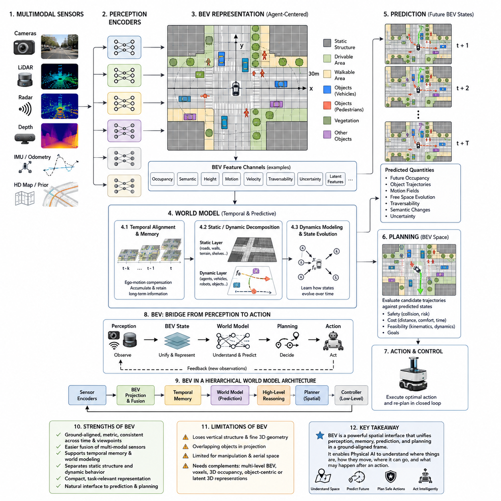
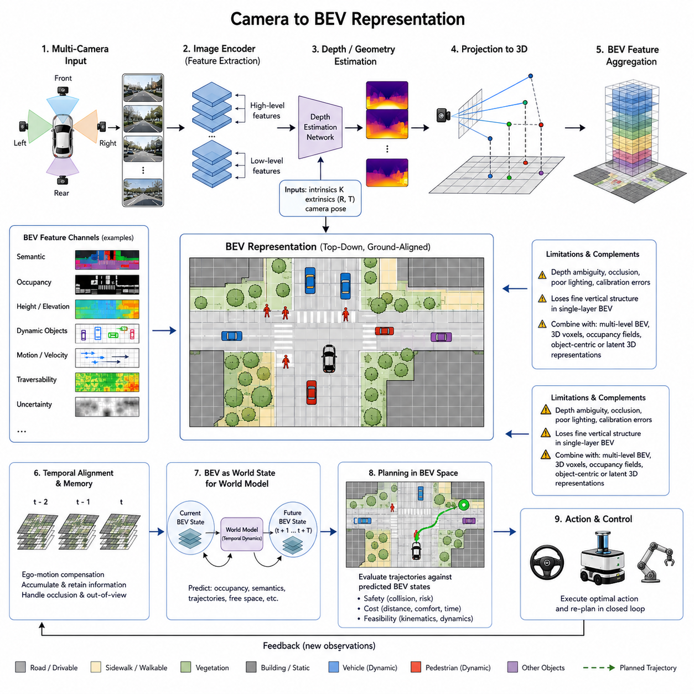
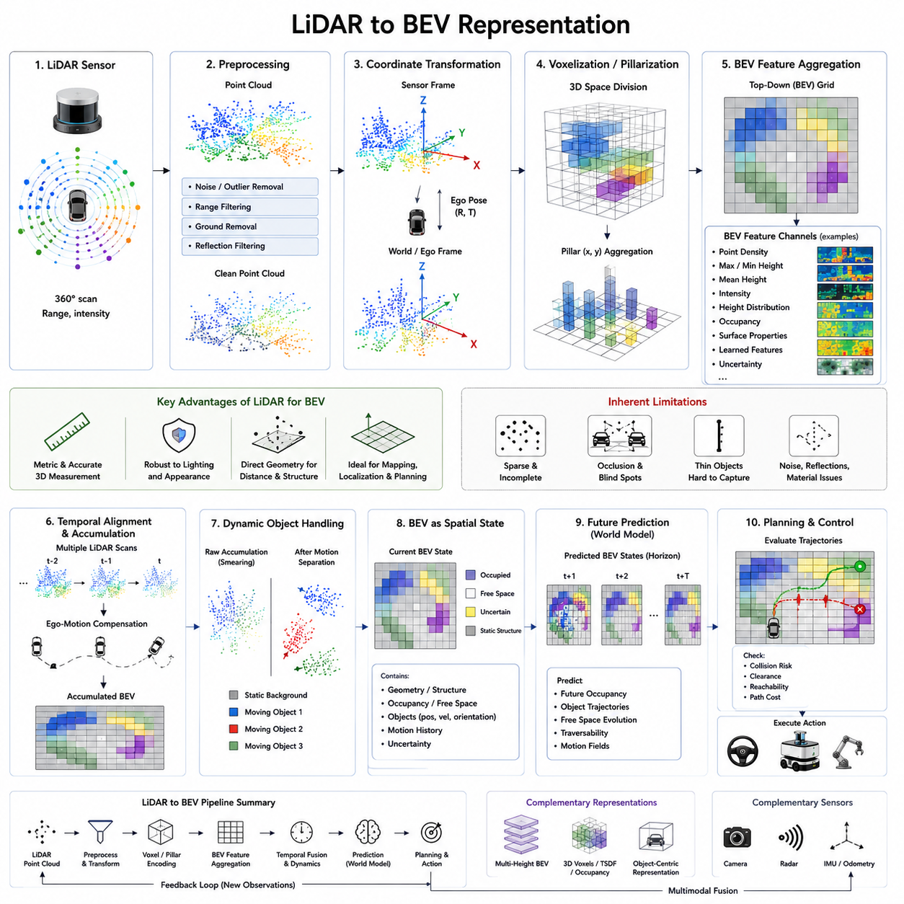
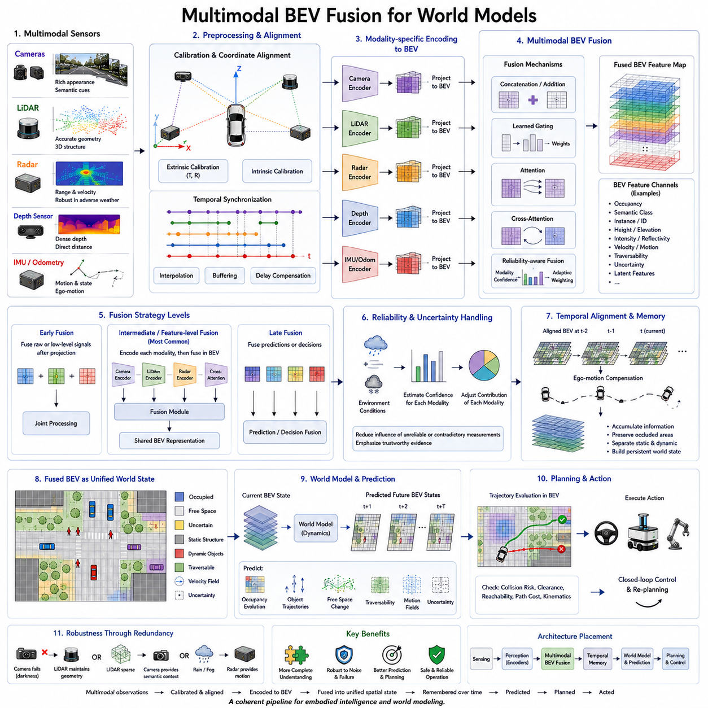
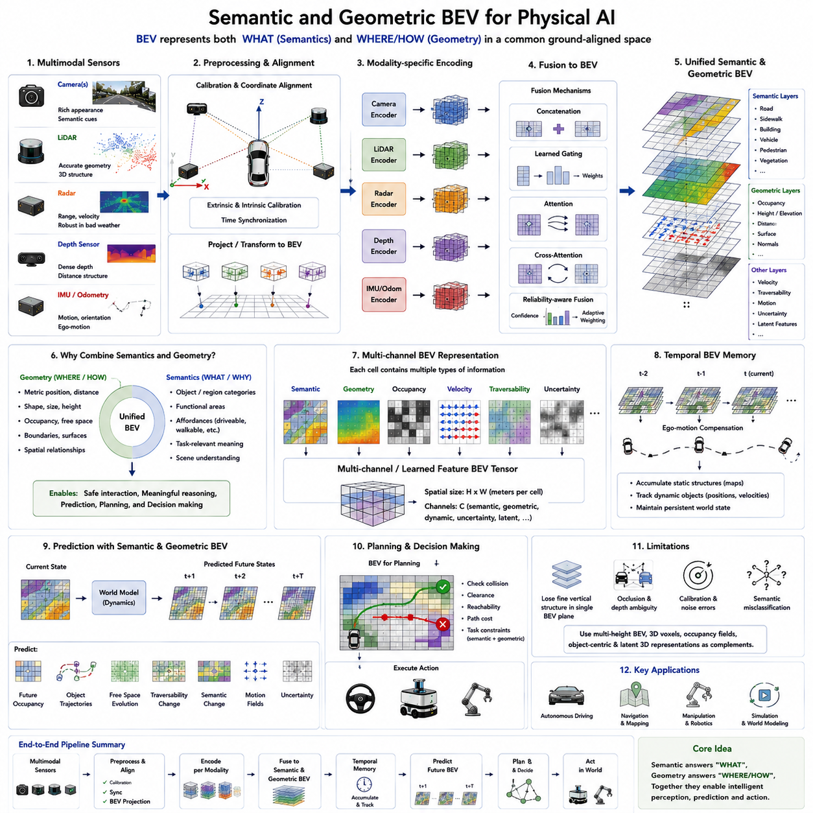
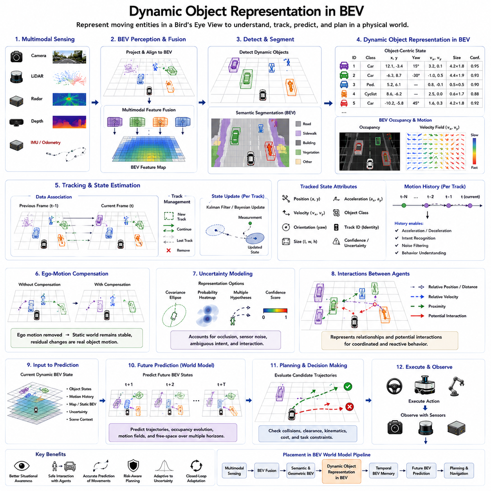
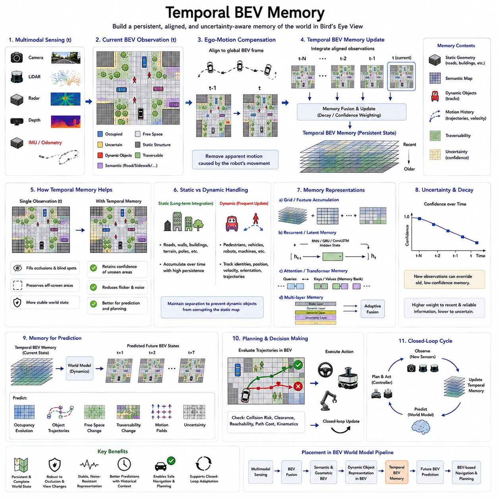
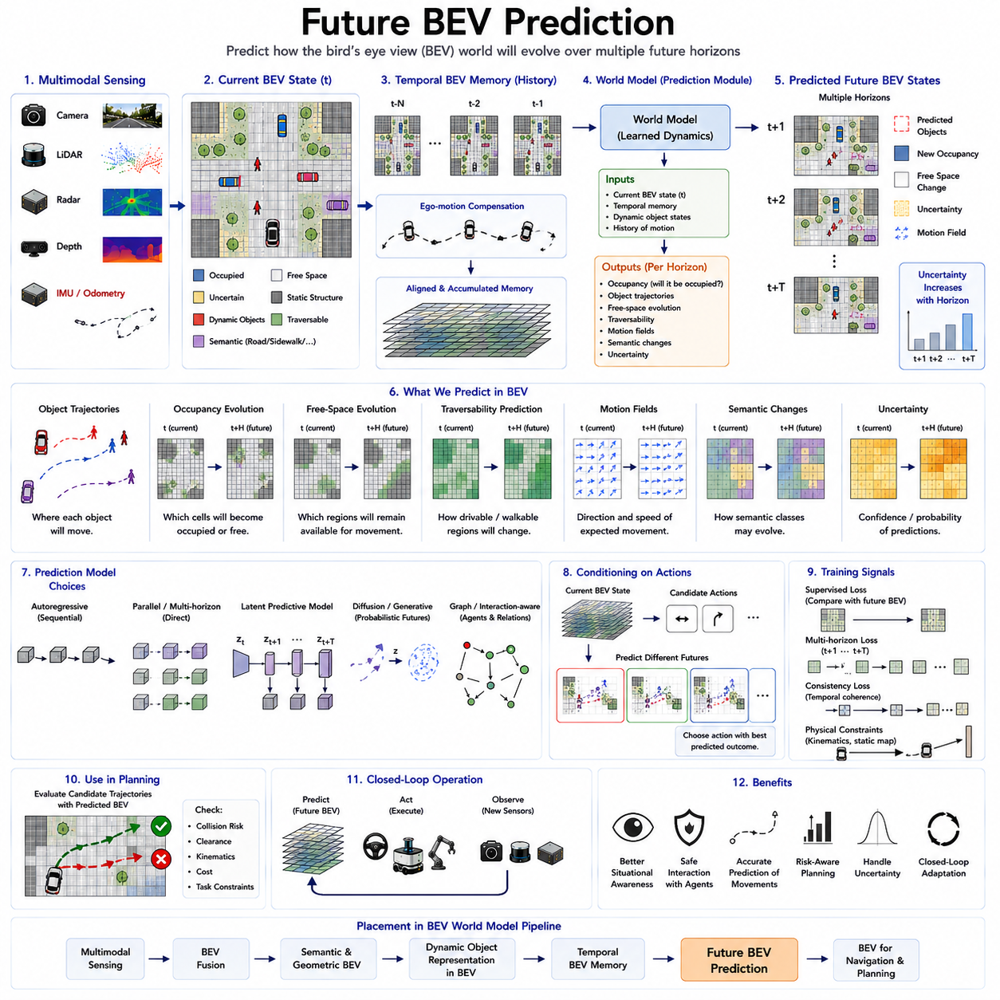
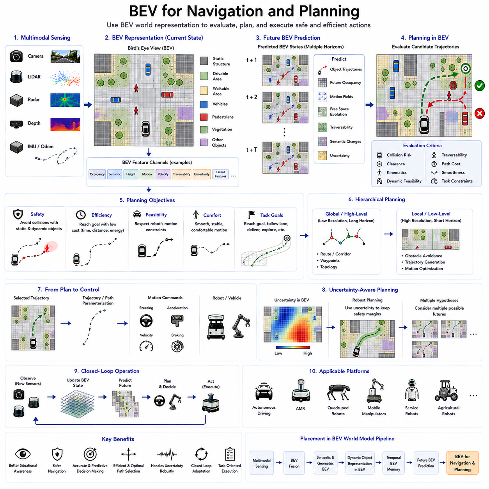
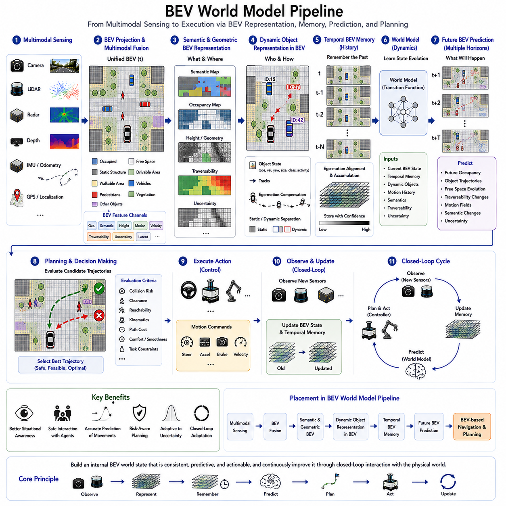

**Volume 07. World Models for Physical AI**

# Chapter 05. BEV Representation for World Models

## 05.01. Why BEV for Physical AI

{width="7.268055555555556in" height="7.268055555555556in"}

물리 인공지능(Physical AI)은 3차원 공간에 존재하는 세계를 추론해야 하는 동시에, 전진하거나 회전하고 장애물을 피하며 물체에 접근하거나 주행 가능 영역(traversable region)을 선택하는 것처럼 일반적으로 지면을 기준으로 표현되는 의사결정을 내려야 한다. 조감도(Bird's-Eye View, BEV) 표현은 서로 다른 센서의 관측 정보를 예측(prediction), 계획(planning), 행동(action)에 적합한 환경 중심(environment-centered) 또는 에이전트 중심(agent-centered)의 기하학적 표현으로 변환할 수 있는 공통 공간 좌표계(common spatial frame)를 제공한다.

원시 카메라 영상(raw camera image)은 시점(viewpoint), 깊이(depth), 카메라 방향(camera orientation), 물체 거리(object distance)에 따라 기하학적 구조가 달라지는 원근 투영(perspective projection)이다. 동일한 물리적 객체도 로봇이 이동하면 영상에서 매우 다른 영역을 차지할 수 있으므로 직접적인 공간 추론(spatial reasoning)이 어려워진다. BEV는 관련 장면 정보를 지면 정렬 좌표계(ground-aligned coordinate system)에 투영하여 이러한 시점 의존성(viewpoint dependency)을 줄이고, 위치, 거리, 방향, 자유 공간(free space), 움직임을 시간에 걸쳐 더욱 일관성 있게 표현할 수 있도록 한다.

이러한 특성은 물리 인공지능(Physical AI)에서 특히 중요하다. 지능적 행동(intelligent behavior)은 물체가 무엇인지 인식하는 것뿐만 아니라, 구현된 에이전트(embodied agent)를 기준으로 물체가 어디에 있는지를 이해하는 데에도 의존하기 때문이다. 로봇은 보행자가 전방 3미터에 있는지 10미터에 있는지, 장애물이 계획된 궤적(planned trajectory)을 차단하는지, 기동하기에 충분한 자유 공간이 존재하는지를 구분해야 한다. BEV는 이러한 관계를 물리적 추론에 자연스럽게 적합한 미터법 공간 구조(metric spatial structure)로 구성한다.

BEV는 또한 인지(perception)와 월드 모델링(world modeling) 사이의 편리한 중간 표현(intermediate representation)을 생성한다. 카메라(camera), 라이다(LiDAR), 레이더(radar), 깊이 센서(depth sensor), 지도(map) 및 기타 공간 관측 정보는 서로 매우 다른 측정 특성을 가질 수 있지만, 이들의 정보를 공유된 하향식 좌표계(shared top-down coordinate frame)로 변환할 수 있다. 정렬된 이후에는 상호 보완적인 증거를 융합하여 주변 환경의 기하학(geometry), 의미론(semantics), 점유(occupancy), 움직임(motion), 주행 가능성(traversability) 등을 설명하는 통합 표현(unified representation)을 구성할 수 있다.

월드 모델(world model)의 관점에서 이러한 공유 좌표계(shared coordinate system)는 예측을 위해 시간에 걸쳐 일관된 상태 표현(state representation)이 필요하다는 점에서 중요하다. 모든 관측 정보가 개별 센서의 순간적인 시점에 계속 종속된다면, 환경 자체가 정적인 상태에서도 자기 이동(ego motion)으로 인해 큰 외관상의 변화가 발생할 수 있다. BEV는 기하학적 변환(geometric transformation)과 자기 이동 정렬(ego-motion alignment)을 통해 이러한 시점 변화를 상당 부분 보상하여, 시간적 변화가 물리 세계의 의미 있는 변화에 더욱 직접적으로 대응하도록 한다.

따라서 시간적으로 정렬된 BEV(temporally aligned BEV)는 메모리(memory)를 위한 자연스러운 기반을 제공한다. 과거의 관측 정보는 현재 기준 좌표계(current reference frame)로 변환되어 누적될 수 있으며, 이를 통해 더 이상 직접 관찰할 수 없는 정보도 유지할 수 있다. 다른 물체 뒤에 일시적으로 가려진 객체, 몇 초 전에 관측했던 벽, 현재 카메라 시야(field of view) 밖에 위치한 주행 가능 영역도 내부 상태(internal state)에서 즉시 사라지지 않고 지속적인 공간 메모리(persistent spatial memory)에 유지될 수 있다.

이 표현은 정적 구조(static structure)와 동적 행동(dynamic behavior)을 분리하는 데에도 유용하다. 도로, 벽, 선반, 지형 경계(terrain boundary), 고정 장애물은 비교적 안정적인 공간 계층(spatial layer)을 형성할 수 있으며, 보행자, 차량, 로봇, 기계 및 기타 이동 개체는 위치(position), 속도(velocity), 방향(orientation), 예측 움직임(predicted motion)과 함께 표현될 수 있다. 따라서 월드 모델은 현재 무엇이 공간을 점유하는지만 학습하는 것이 아니라, 공간 상태의 서로 다른 구성 요소가 어떻게 변화할 가능성이 있는지도 학습할 수 있다.

이러한 특성은 BEV를 미래 예측(future prediction)과 특히 잘 호환되도록 만든다. 예측형 월드 모델(predictive world model)은 많은 외관 정보를 포함하는 미래 카메라 픽셀을 생성하는 대신, 물리적 상호작용에 직접 관련된 변수를 강조하는 미래 BEV 상태(future BEV state)를 추정할 수 있다. 미래 점유(future occupancy), 객체 궤적(object trajectory), 자유 공간 변화(free-space evolution), 의미 영역(semantic region), 모션 필드(motion field), 주행 가능성 등을 여러 시간 범위에 걸쳐 예측하여 행동 가능한 환경(actionable environment)이 어떻게 변화할 것인지에 대한 압축된 가설을 생성할 수 있다.

BEV 표현은 예측(prediction)에서 계획(planning)으로 연결되는 중요한 다리 역할도 한다. 내비게이션(navigation)과 모션 계획(motion planning) 알고리즘은 경로(path), 거리(distance), 충돌 영역(collision region), 비용(cost), 속도(velocity), 도달 가능 영역(reachable area)과 같은 공간적 수량을 자연스럽게 활용한다. 월드 모델이 이러한 수량을 지면 정렬 좌표계에서 예측하면, 서로 다른 센서 좌표계(sensor coordinate system)와 계획 표현(planning representation) 사이를 반복적으로 변환하지 않고도 후보 로봇 궤적(candidate robot trajectory)을 예측된 환경 상태와 직접 비교하여 평가할 수 있다.

자율주행차(autonomous vehicle), 자율이동로봇(Autonomous Mobile Robot, AMR), 4족 보행 로봇(quadruped), 모바일 매니퓰레이터(mobile manipulator) 및 기타 이동형 물리 인공지능 시스템(mobile Physical AI system)에서 이러한 연결은 인지--예측--계획(perception--prediction--planning) 인터페이스를 단순화할 수 있다. 인지 시스템은 공간 상태를 구성하고, 월드 모델은 그 상태가 어떻게 변화할지를 추정하며, 계획기는 동일하거나 밀접하게 연관된 좌표계에서 가능한 행동을 평가한다. 따라서 BEV는 센싱(sensing), 학습된 표현(learned representation), 동역학 예측(dynamics prediction), 제어 지향 추론(control-oriented reasoning)이 상호작용하는 계산적 접점(computational meeting point)의 역할을 한다.

BEV의 장점은 순수한 기하학적 매핑(geometric mapping)을 넘어선다. 개별 BEV 셀(cell) 또는 학습된 BEV 특징(learned BEV feature)은 의미 클래스(semantic class), 객체 식별 정보(object identity), 점유 확률(occupancy probability), 고도(elevation), 표면 유형(surface type), 움직임(motion), 불확실성(uncertainty), 학습된 잠재 특징(learned latent feature)을 인코딩할 수 있다. 따라서 BEV는 단순한 전통적 2차원 지도(conventional two-dimensional map)로 이해해서는 안 된다. 현대적인 신경망 기반 BEV 표현(neural BEV representation)은 명시적인 기하학 정보와 학습된 의미 정보가 공존하는 밀집 특징 공간(dense feature space)으로 기능할 수 있다.

이러한 구분은 월드 모델(world model)에서 특히 중요하다. 내부 표현(internal representation)은 관찰 가능한 세계의 모든 세부 사항을 복원할 필요가 없기 때문이다. 대신 결과를 예측하고 행동을 선택하는 데 유용한 정보를 보존해야 한다. 멀리 있는 건물의 질감(texture)은 내비게이션에서 중요하지 않을 수 있지만 건물의 경계(boundary)는 필수적이다. 마찬가지로 식생(vegetation)의 정확한 시각적 외관보다 해당 영역을 통과할 수 있는지가 더 중요할 수 있다. BEV는 이러한 과업 관련 물리적 속성(task-relevant physical property)에 더 높은 표현 우선순위(representational priority)를 부여할 수 있는 구조를 제공한다.

BEV는 또한 다중 모달 강건성(multimodal robustness)을 지원할 수 있다. 카메라는 풍부한 의미 및 외관 정보를 제공하지만 조명과 날씨에 민감할 수 있으며, 라이다(LiDAR)는 직접적인 기하학적 측정을 제공하고 레이더(radar)는 열악한 시각 조건에서도 유용한 거리 및 움직임 정보를 제공할 수 있다. 이러한 모달리티(modality)를 호환 가능한 공간 좌표계로 투영하면 시스템은 각각의 상호 보완적인 장점을 활용할 수 있으며, 환경의 내부 표현을 구성할 때 특정 단일 센서에 대한 의존성을 줄일 수 있다.

그러나 BEV는 물리 세계를 완전하게 표현하는 방식은 아니다. 지면 중심 평면(ground-oriented plane)으로의 투영은 수직 구조(vertical structure), 중첩된 기하학(overlapping geometry), 세밀한 객체 형상(fine object shape), 조작(manipulation)이나 고도로 3차원적인 환경에서 중요한 정보를 손실할 수 있다. 따라서 로봇이 계단, 선반, 관절형 객체(articulated object), 공중 공간(aerial space), 복잡한 조작 환경을 추론해야 하는 경우 다중 레벨 BEV 특징(multi-level BEV feature), 높이 채널(height channel), 복셀 표현(voxel representation), 3차원 점유 필드(3D occupancy field), 객체 중심 표현(object-centric representation), 잠재 3차원 특징(latent 3D feature) 등이 BEV를 보완할 수 있다.

따라서 가장 유용한 해석은 BEV가 다른 모든 월드 표현(world representation)을 대체한다는 것이 아니라, 구현 지능(embodied intelligence)을 위한 매우 효과적인 공간 인터페이스(spatial interface)를 제공한다는 것이다. BEV는 이질적인 관측 정보를 비교적 안정적인 좌표계로 변환하고, 시간적 메모리(temporal memory)와 다중 모달 융합(multimodal fusion)을 지원하며, 움직임에 필요한 물리적 관계를 명시하고, 미래 예측과 계획에 자연스럽게 연결된다. 이러한 특성은 BEV가 많은 이동형 물리 인공지능 월드 모델 아키텍처에서 핵심적인 표현으로 자리 잡은 이유를 설명한다.

더 넓은 물리 인공지능 아키텍처(Physical AI architecture)에서 BEV는 계층적 월드 상태(hierarchical world state)의 하나의 계층으로 기능할 수 있다. 센서별 인코더(sensor-specific encoder)가 먼저 관측 특징을 추출하고, 기하학적 또는 학습 기반 변환(learned transformation)이 관련 정보를 BEV에 배치하며, 시간 모델(temporal model)이 과거 정보를 유지하고, 예측 모델(predictive model)이 미래 상태를 추정한다. 이후 상위 수준 추론(higher-level reasoning)은 객체, 의미론, 목표(goal), 인과 관계(causal relationship)를 다룰 수 있으며, 하위 수준 계획기(lower-level planner)는 안전하고 동역학적으로 실현 가능한 행동을 위해 세부적인 공간 정보를 활용할 수 있다.

궁극적으로 BEV의 중요성은 물리 인공지능(Physical AI)이 인지(perception)를 행동 가능한 공간 이해(actionable spatial understanding)로 변환해야 한다는 요구에서 비롯된다. 로봇에 구현된 지능은 단순히 시각적 패턴을 인식하는 것만으로는 충분하지 않으며, 사물이 어디에 있는지, 어떻게 움직이는지, 에이전트가 어디로 이동할 수 있는지, 특정 행동 이후 무엇이 발생할 수 있는지를 지속적으로 추정해야 한다. BEV는 이러한 질문들을 하나의 공간적 표현 안에서 함께 다룰 수 있도록 하며, 공간에 기반한 월드 모델(spatially grounded world model)을 구축하기 위한 강력한 기반을 제공한다.

## 05.02. Camera to BEV Representation

{width="7.268055555555556in" height="7.268055555555556in"}

카메라에서 BEV 표현(Camera-to-BEV Representation)으로의 변환은 카메라가 물리적 세계를 지면 정렬 좌표계(ground-aligned coordinate system)에서 직접 관측하는 것이 아니라 원근 투영(perspective projection)을 통해 관측한다는 사실에서 출발합니다. 영상 좌표(image coordinates)는 시각적 패턴이 센서의 어느 위치에 나타나는지를 표현하지만, 물리적 추론에 필요한 거리와 위치 관계를 직접 제공하지는 않습니다. 로봇이 이동하면 동일한 물체가 영상 내에서 서로 다른 위치와 크기로 나타날 수 있지만, 환경에서의 실제 위치 관계는 연속적으로 변화합니다. 따라서 카메라에서 BEV로의 처리는 시각적 관측을 체화 지능(embodied intelligence)과 월드 모델링(world modeling)에 더욱 적합한 공간 표현(spatial representation)으로 변환합니다.

이 과정은 주변 환경의 서로 다른 영역을 관측하는 하나 이상의 카메라 영상(camera images)에서 시작됩니다. 카메라 인코더(camera encoder)는 영상을 시각적 특징 표현(feature representation)으로 변환하며, 여기에는 에지(edge), 질감(texture), 객체의 외형(object appearance), 의미적 범주(semantic category), 공간적 단서(spatial cue)와 같은 시각 정보가 포함됩니다. 현대 시스템에서는 객체와 환경 구조물이 서로 다른 해상도로 나타나기 때문에 일반적으로 합성곱(convolutional) 또는 트랜스포머(transformer) 기반 백본(backbone)을 사용하여 다중 스케일 특징(multi-scale features)을 추출합니다. 목적은 단순히 객체를 인식하는 것이 아니라, 이후 물리적 위치(physical position), 기하학(geometry), 움직임(motion)과 연결될 수 있는 시각 정보를 보존하는 것입니다.

핵심적인 문제는 원근 영상(perspective image)으로부터 3차원 구조(three-dimensional structure)를 추론하는 것입니다. LiDAR와 달리 단안 카메라(monocular camera)는 모든 픽셀에 대한 깊이(depth)를 직접 측정하지 않기 때문에, 시스템은 영상 특징이 거리와 공간적 위치에 어떻게 대응하는지를 추정해야 합니다. 깊이 추정(depth estimation), 카메라 보정(camera calibration), 기하학적 투영(geometric projection), 학습된 깊이 분포(learned depth distribution), 또는 암시적 3차원 표현(implicit 3D representation) 등이 이러한 부족한 정보를 제공할 수 있습니다. 이렇게 얻어진 변환은 영상 특징을 원근 좌표(perspective coordinates)에서 지면 정렬 기준 프레임(ground-aligned reference frame)의 위치로 매핑하여, 영상 평면에 분산되어 있던 정보를 물리적 공간에 따라 체계적으로 구성할 수 있도록 합니다.

카메라 보정(camera calibration)은 이러한 변환의 기하학적 기반(geometric foundation)을 제공합니다. 내부 파라미터(intrinsic parameters)는 초점 거리(focal length)와 주점(principal point)과 같은 카메라의 특성을 나타내며, 외부 파라미터(extrinsic parameters)는 로봇 또는 차량에 대한 카메라의 자세(camera pose)를 나타냅니다. 이러한 파라미터를 이용하면 영상의 광선(image ray)을 물리적 좌표계(physical coordinate system)와 연결할 수 있습니다. 여러 카메라를 사용하는 경우에는 각각의 관측을 공통 좌표계(common coordinate frame)로 변환할 수 있습니다. 따라서 정확한 보정은 서로 다른 시점의 특징들이 생성된 BEV 표현에서 공간적으로 잘못 정렬되는 것을 방지하는 데 중요합니다.

일반적인 개념의 처리 파이프라인은 영상 획득(image acquisition), 시각적 특징 추출(visual feature extraction), 깊이 또는 기하학적 추정(depth or geometric estimation), 좌표 변환(coordinate transformation), 그리고 BEV 특징 집계(BEV feature aggregation)로 구성됩니다. 각 영상 특징은 물리적 공간에서 가능한 여러 위치의 분포(distribution)와 연결될 수 있으며, 반드시 하나의 단일 지점으로 즉시 결정될 필요는 없습니다. 이후 시스템은 투영된 특징들을 BEV 셀(BEV cells) 또는 학습된 공간 특징(learned spatial features)에 축적할 수 있습니다. 이 과정은 원근에 의존적인 시각 정보를 변환하여, 서로 인접한 셀들이 실제 물리적 공간에서도 서로 인접한 영역을 보다 직접적으로 나타내도록 합니다.

학습 기반 카메라-to-BEV 방법(learned camera-to-BEV methods)은 완전한 3차원 장면을 명시적으로 복원하지 않고도 이러한 변환을 수행할 수 있습니다. 대신 네트워크는 학습 데이터(training data), 기하학적 감독(geometric supervision), 시간적 일관성(temporal consistency) 또는 이러한 신호들의 조합을 이용하여 영상 특징과 공간적 위치 사이의 관계를 학습합니다. 깊이 인식 투영(depth-aware projection)은 특징이 어느 위치에 배치되어야 하는지를 명시적으로 모델링할 수 있으며, 완전히 학습된 접근법(fully learned approach)은 이러한 변환을 신경망의 어텐션(attention)이나 잠재 특징 메커니즘(latent feature mechanism)에 내재화할 수 있습니다. 중요한 목표는 이후의 예측(prediction), 계획(planning), 행동(action)에 유용한 공간적 관계를 보존하는 것입니다.

여러 카메라를 사용하는 경우 카메라-to-BEV 처리는 공간적 융합(spatial fusion) 문제로 확장됩니다. 전방, 후방, 측면 또는 파노라마 카메라는 서로 다른 영역과 관측 각도를 제공하며, 이들의 영상 특징은 일관된 환경 표현(coherent environmental representation)을 형성하기 전에 정렬되어야 합니다. 공유 BEV 좌표계(shared BEV coordinate system)는 이러한 정렬을 위한 공통 기준을 제공합니다. 서로 중첩되는 관측 영역은 표현을 강화할 수 있으며, 상호 보완적인 시점들은 다른 카메라에서는 보이지 않는 영역을 보완할 수 있습니다. 이는 하나의 시점에서 상당한 사각지대(blind area)가 발생할 수 있는 복잡한 환경에서 이동 로봇이 작동할 때 특히 유용합니다.

생성된 BEV 표현은 단순히 객체의 위치만 포함하는 것이 아닙니다. 각각의 공간 셀(spatial cell) 또는 학습된 특징(learned feature)은 의미 정보(semantic information), 추정 깊이(estimated depth), 점유(occupancy), 표면 특성(surface property), 자유 공간(free space), 객체 경계(object boundary), 움직임 관련 특징(motion-related feature), 불확실성(uncertainty) 등을 표현할 수 있습니다. 따라서 카메라-to-BEV 변환은 단순한 전통적 하향식 이미지(top-down image)가 아니라 공간적 특징 필드(spatial feature field)를 생성할 수 있습니다. 이러한 표현은 의미적 추론(semantic reasoning)과 기하학적 추론(geometric reasoning)을 지원하면서도 월드 모델(world model)의 예측 중심 아키텍처와 자연스럽게 연결될 수 있습니다.

시간 정보(temporal information)는 카메라-to-BEV 표현을 더욱 향상시킵니다. 로봇이 이동하면 카메라의 시점(camera viewpoint)이 지속적으로 변화하기 때문에 정지해 있는 객체도 영상 좌표(image coordinates)에서는 크게 움직이는 것처럼 보입니다. 자차 움직임 추정(ego-motion estimation)을 이용하면 서로 다른 시간 단계의 관측을 일관된 기준 프레임(consistent reference frame)으로 변환할 수 있습니다. 이렇게 정렬된 과거 관측은 시간적 BEV 표현(temporal BEV representation)에 축적될 수 있습니다. 이를 통해 내부 상태(internal state)가 순간적인 가시성(instantaneous visibility)에 덜 의존하게 되며, 월드 모델은 실제 환경 변화와 로봇 자체의 움직임으로 인해 발생하는 겉보기 영상 움직임을 구분할 수 있습니다.

카메라-to-BEV는 또한 지각(perception)과 예측 월드 모델(predictive world model) 사이에 중요한 연결을 형성합니다. 시각적 관측이 일관된 공간 상태(spatial state)로 변환되면, 시간 모델(temporal model)은 객체, 자유 공간, 의미적 영역 및 기타 환경 특성이 어떻게 변화하는지를 학습할 수 있습니다. 이후 월드 모델은 미래 카메라 영상의 모든 픽셀을 재현하려 하기보다 미래 BEV 상태(future BEV state)를 예측할 수 있습니다. 이는 표현을 물리적 상호작용에 더욱 직접적으로 관련된 점유(occupancy), 궤적(trajectory), 주행 가능성(traversability), 공간적 관계(spatial relationship) 등의 정보로 집중시킵니다.

그러나 이러한 접근법에는 중요한 한계도 존재합니다. 카메라 기반 BEV(camera-based BEV)는 깊이 추정의 품질(quality of depth estimation), 보정(calibration), 카메라 배치(camera placement), 조명(illumination), 가시성(visibility), 장면 이해(scene understanding)에 크게 의존합니다. 가려짐(occlusion)은 중요한 기하 정보를 숨길 수 있으며, 단안 깊이(monocular depth)는 시각적 단서가 부족한 영역에서 여전히 모호할 수 있습니다. 추정된 깊이 또는 카메라 자세(camera pose)가 부정확하면 투영 오류(projection error)가 누적될 수 있습니다. 또한 매우 3차원적인 환경에서는 순수한 평면형 BEV(purely planar BEV)가 계단(stairs), 선반(shelves), 조작(manipulation), 공중 공간(aerial space), 또는 지면에서 크게 돌출된 객체와 같이 수직 관계(vertical relationship)가 중요한 정보를 손실할 수 있습니다.

따라서 카메라-to-BEV는 물리적 세계에 대한 완전한 설명이 아니라 공간 표현 계층(spatial representation layer)으로 이해하는 것이 적절합니다. 이는 원근 기반 비전(perspective vision)에서 지면 정렬 월드 상태(ground-aligned world state)로 연결되는 실용적인 가교를 제공하는 동시에, BEV만으로 표현하기 어려운 정보를 보완적인 표현(complementary representation)을 통해 보존할 수 있도록 합니다. 이 볼륨에서 정의한 보다 넓은 월드 모델 아키텍처(World Model architecture) 안에서 카메라-to-BEV는 자연스럽게 지각(perception), 의미적·기하학적 BEV(semantic and geometric BEV), 시간적 BEV 메모리(temporal BEV memory), 미래 BEV 예측(future BEV prediction), 그리고 궁극적으로 내비게이션(navigation)과 계획(planning)을 연결합니다.

## 05.03. LiDAR to BEV Representation

{width="7.268055555555556in" height="7.268055555555556in"}

LiDAR-to-BEV 표현(LiDAR-to-BEV representation)은 카메라-to-BEV 변환(camera-to-BEV conversion)과 근본적으로 다른 센싱 원리(sensing principle)에서 출발합니다. LiDAR 센서는 주변 표면까지의 거리를 직접 측정하고, 각 점이 공간 좌표(spatial coordinates)를 가지며 필요에 따라 반사 강도(intensity) 또는 기타 속성(attributes)을 포함하는 3차원 포인트 클라우드(3D point cloud)를 생성합니다. 측정값 자체가 이미 미터법 3차원 공간(metric 3D space)에 존재하기 때문에 LiDAR는 카메라와 동일한 방식의 깊이 추정(depth inference) 과정을 필요로 하지 않습니다. 대신 핵심 과제는 희소하고 불규칙하게 분포된 점들을 공간 추론(spatial reasoning)과 월드 모델링(world modeling)을 지원할 수 있는 구조화된 표현(structured representation)으로 구성하는 것입니다.

원시 LiDAR 포인트 클라우드(raw LiDAR point cloud)는 정확한 기하학적 정보(geometric information)를 제공하지만, 신경망(neural network)이나 계획 시스템(planning system)이 즉시 사용하기에는 편리하지 않은 표현입니다. 점들은 거리, 표면 방향, 센서 해상도, 가려짐(occlusion), 센서 스캔 패턴(scanning pattern)에 따라 불균일하게 분포합니다. 가까운 표면에는 많은 점이 포함될 수 있지만 먼 객체는 소수의 점으로만 표현될 수 있습니다. 따라서 LiDAR-to-BEV 파이프라인(LiDAR-to-BEV pipeline)은 포인트 클라우드를 불규칙한 측정 집합에서 구조화된 공간 표현(structured spatial representation)으로 변환하여, 물리적 위치를 일관되게 처리할 수 있도록 합니다.

첫 번째 단계는 일반적으로 LiDAR 전처리(LiDAR preprocessing)와 좌표 변환(coordinate transformation)입니다. 측정값에는 잡음(noise), 이상치(outlier), 지면 반사(ground reflection), 다중 경로 효과(multipath effect), 또는 해당 작업에 유용하지 않은 점이 포함될 수 있습니다. 필터링(filtering)과 거리 범위 선택(range selection)은 중요한 환경 구조를 보존하면서 신뢰성이 낮은 측정값을 제거할 수 있습니다. 이후 포인트 클라우드는 적절한 좌표계(coordinate frame), 일반적으로 로봇 또는 차량을 기준으로 하는 좌표계로 표현됩니다. 정확한 센서 보정(sensor calibration)과 자세 추정(pose estimation)은 매우 중요하며, BEV 투영 이전에 발생한 공간적 오류가 전체 표현으로 전파될 수 있기 때문입니다.

LiDAR의 중요한 장점은 각 포인트가 이미 3차원 위치에 대한 직접적인 추정값을 제공한다는 것입니다. 따라서 하나의 점은 x, y, z와 같은 좌표와 필요한 경우 추가적인 속성으로 표현될 수 있습니다. BEV를 구성할 때 수평 좌표(horizontal coordinates)는 일반적으로 지면 평면 셀(ground-plane cell)을 결정하는 데 사용되며, 높이(height)와 기타 측정값은 추가적인 특징(feature)으로 집계될 수 있습니다. 이를 통해 기본적인 공간 조직은 하향식 좌표계(top-down coordinate system)를 사용하면서도 유용한 수직 정보를 보존할 수 있습니다.

복셀화(voxelization)와 필러화(pillarization)는 LiDAR 포인트를 구조화된 특징으로 변환하는 대표적인 두 가지 방법입니다. 복셀화는 3차원 공간을 작은 체적 셀(volumetric cell)로 나누고 각 셀 내부의 점들을 집계하여 희소 또는 밀집된 3차원 표현을 생성합니다. 반면 필러 기반 접근법(pillar-based approach)은 수평 셀(horizontal cell)을 기준으로 점들을 구성하면서 각 셀 내부의 점들이 가지는 수직 분포(vertical distribution) 정보를 유지합니다. 이러한 방법은 불규칙한 포인트 클라우드를 효율적으로 처리할 수 있는 표현으로 축소하면서도 BEV 추론에 필요한 공간적 관계를 보존합니다.

집계 과정(aggregation process)은 단순한 점유 지도(occupancy map)가 아니라 여러 BEV 특징 채널(BEV feature channels)을 생성할 수 있습니다. 하나의 셀은 점 밀도(point density), 최대 또는 최소 높이(maximum or minimum height), 평균 높이(mean height), 반사 강도(intensity), 수직 분포(vertical distribution), 표면 특성(surface characteristics), 학습된 포인트 특징(learned point features), 또는 추정된 점유(estimated occupancy) 등을 표현할 수 있습니다. 이러한 특징을 통해 BEV 표현은 공간이 점유되어 있는지 여부 이상의 정보를 제공할 수 있습니다. 또한 구조물, 차량, 보행자, 지형 및 기타 객체의 기하학적 특성과 물리적 특성을 표현할 수 있으며, 결과적으로 다운스트림 지능(downstream intelligence)을 위한 압축된 공간 특징 필드(spatial feature field)를 형성합니다.

LiDAR BEV는 기하학적 추론(geometric reasoning)에 특히 유용합니다. 그 이유는 이러한 표현이 시각적 외형(visual appearance)과 상당 부분 독립적이면서 자연스럽게 미터법 공간(metric space)을 표현하기 때문입니다. 도로, 벽, 연석, 선반, 차량, 지형 경계, 장애물 등은 영상상의 위치가 아니라 실제 물리적 위치에 따라 표현될 수 있습니다. 따라서 거리(distance), 상대적 위치(relative position), 공간적 범위(spatial extent), 자유 공간 관계(free-space relationship)를 보다 쉽게 추론할 수 있습니다. 이동형 피지컬 AI(mobile Physical AI)에서는 이러한 정보가 위치 추정(localization), 매핑(mapping), 장애물 회피(obstacle avoidance), 내비게이션(navigation), 궤적 계획(trajectory planning), 충돌 검사(collision checking)에 직접적으로 활용될 수 있습니다.

그러나 LiDAR 측정은 본질적으로 희소하고 불완전합니다. 센서에서 가려진 표면은 관측되지 않으며, 멀리 있는 객체나 작은 객체는 상대적으로 적은 수의 포인트만 포함할 수 있습니다. 얇은 구조물(thin structure)은 표현하기 어려울 수 있고, 반사율이 높거나 흡수성이 강한 재질은 신뢰성이 낮은 반사값을 생성할 수 있습니다. 또한 로봇이 이동하면 포인트 클라우드 자체가 변화하므로 하나의 스캔은 특정 순간의 환경에 대한 부분적인 관측(partial observation)만 제공합니다. 따라서 LiDAR BEV는 단일한 완성된 표현이라기보다 시간적 축적(temporal accumulation), 센서 융합(sensor fusion), 월드 모델 예측(world-model prediction)을 통해 강화될 수 있는 공간적 관측(spatial observation)으로 이해해야 합니다.

따라서 자차 움직임 보정(ego-motion compensation)은 LiDAR-to-BEV 처리에서 중요한 구성 요소입니다. 로봇이 움직이면 연속적으로 획득된 포인트 클라우드는 서로 다른 센서 자세(sensor pose)에서 표현됩니다. 위치 추정(localization)과 오도메트리(odometry) 정보를 이용하면 이전 측정값을 공통 기준 프레임(common reference frame)으로 변환하여 여러 스캔을 누적할 수 있습니다. 시간적 집계(temporal aggregation)는 공간적 커버리지(spatial coverage)와 포인트 밀도(point density)를 증가시키면서, 가려짐이나 센서 시점 때문에 현재 스캔에서 사라진 구조물도 보존할 수 있습니다. 이를 통해 매핑(mapping)과 이후의 월드 모델 처리(world-model processing)에 더욱 풍부한 BEV 상태(BEV state)를 제공할 수 있습니다.

동적 객체(dynamic object)는 또 다른 문제를 발생시킵니다. 시간적 누적 과정에서 움직이는 객체를 잘못 처리하면 여러 위치에 걸쳐 번져 보이는 현상(smearing)이 발생할 수 있습니다. 따라서 월드 모델은 자차 움직임(ego motion)에 의해 발생하는 변화와 환경의 동적 변화(environmental dynamics)를 구분해야 합니다. 객체 추적(object tracking), 움직임 추정(motion estimation), 시간적 어텐션(temporal attention), 또는 학습된 동적 표현(learned dynamic representation)은 비교적 안정적인 구조물과 움직이는 에이전트를 분리하는 데 도움을 줄 수 있습니다. 이러한 형태의 LiDAR BEV는 정적 기하학(static geometry)뿐만 아니라 객체 위치(object position), 속도(velocity), 방향(orientation), 움직임 이력(motion history), 불확실성(uncertainty)까지 포함할 수 있으며, 동적 상태 추정(dynamic state estimation)을 위한 기반을 제공합니다.

LiDAR BEV는 점유(occupancy)와 미래 상태 예측(future-state prediction)에도 자연스러운 인터페이스를 제공합니다. 현재 BEV는 관측된 점유 영역(occupied region), 자유 공간(free space), 불확실 영역(uncertain region), 기하학적 구조(geometric structure)를 표현할 수 있으며, 예측 월드 모델(predictive world model)은 이러한 공간 상태가 어떻게 변화할지를 추정할 수 있습니다. 미래 점유(future occupancy), 객체 궤적(object trajectory), 자유 공간 변화(free-space change), 주행 가능성(traversability), 움직임 필드(motion field)는 동일한 지면 정렬 좌표계(ground-aligned coordinate system)에서 표현될 수 있습니다. 이를 통해 예측은 미래 센서 측정값을 재구성하는 것보다 내비게이션과 계획에 필요한 물리적 변수(physical quantity)에 더욱 직접적으로 연결될 수 있습니다.

계획과 제어(planning and control)를 위해 LiDAR BEV는 궤적 평가(trajectory evaluation)에 직접적으로 호환되는 공간 표현을 제공할 수 있습니다. 후보 경로(candidate path)는 예측된 장애물(predicted obstacle), 점유 영역(occupied region), 자유 공간(free space), 지형 경계(terrain boundary), 기타 공간적 제약(spatial constraint)과 비교될 수 있습니다. 따라서 플래너(planner)는 월드 모델이 사용하는 동일한 좌표계에서 충돌 위험(collision risk), 여유 공간(clearance), 도달 가능성(reachability), 경로 비용(path cost)을 평가할 수 있습니다. 이는 LiDAR 관측(LiDAR observation)에서 공간 상태 추정(spatial state estimation), 미래 예측(future prediction), 계획(planning), 행동(action)으로 이어지는 비교적 직접적인 연결을 형성합니다.

그럼에도 불구하고 LiDAR BEV가 물리적 세계를 완전하게 표현하는 것은 아닙니다. 카메라와 비교하면 LiDAR는 일반적으로 시각적 외형(visual appearance)과 세밀한 의미적 구분(fine semantic distinction)에 대한 직접적인 정보가 적습니다. 물론 현대의 신경망은 포인트 클라우드(point cloud)로부터 상당한 의미 정보를 학습할 수 있으며, 멀티모달 융합(multimodal fusion)을 통해 부족한 외형 정보를 보완할 수도 있습니다. 또한 복잡한 수직 구조(complex vertical structure)는 단일 계층 BEV(single-layer BEV)를 사용할 경우 압축될 수 있습니다. 따라서 조작(manipulation), 계단(stairs), 선반(shelves), 관절형 객체(articulated objects), 또는 상당한 3차원 구조를 가진 환경에서는 복셀 표현(voxel representation), 다중 높이 BEV 특징(multi-height BEV features), 점유 필드(occupancy field), 객체 중심 3차원 표현(object-centric 3D representation) 등이 기본 BEV 상태를 보완할 수 있습니다.

따라서 가장 효과적인 관점은 LiDAR-to-BEV를 독립적인 지각 기술(isolated perception technique)이 아니라 더 큰 피지컬 AI 월드 모델(Physical AI world model) 내부의 기하학적 기반(geometric foundation)으로 이해하는 것입니다. LiDAR는 정확한 미터법 관측(metric observation)을 제공하고, 전처리와 좌표 정렬(coordinate alignment)은 일관된 공간 프레임(spatial frame)을 구축하며, 복셀 또는 필러 인코딩(voxel or pillar encoding)은 불규칙한 측정값을 구조화된 특징으로 변환하고, BEV 집계(BEV aggregation)는 기하학과 점유에 대한 압축된 표현을 생성합니다. 이후 시간적 처리(temporal processing)는 지속적인 공간 메모리(persistent spatial memory)를 구축할 수 있으며, 멀티모달 융합(multimodal fusion)은 의미 정보와 상호 보완적인 센서 정보를 추가할 수 있습니다.

## 05.04. Multimodal BEV Fusion

{width="7.268055555555556in" height="7.268055555555556in"}

멀티모달 BEV 융합(Multimodal BEV fusion)은 카메라(camera), LiDAR, 레이더(radar), 깊이 센서(depth sensor), IMU, 그리고 기타 센서들의 상호 보완적인 관측을 공통 공간 표현(common spatial representation) 안에서 결합합니다. 각 모달리티(modality)는 물리적 세계의 서로 다른 측면을 관측합니다. 카메라는 풍부한 외형(appearance)과 의미 정보(semantic information)를 제공하고, LiDAR는 정확한 기하학적 구조(geometric structure)를 제공하며, 레이더는 열악한 기상 조건에서도 거리(range)와 움직임(motion) 정보를 보다 강건하게 제공할 수 있습니다. 또한 관성 또는 고유수용감각 센서(inertial or proprioceptive sensors)는 로봇의 움직임과 상태 정보를 제공합니다. BEV는 이러한 서로 다른 관측을 공간적으로 정렬하고 통합할 수 있는 실용적인 공통 기준 프레임(common frame)을 제공합니다.

핵심 목적은 단순히 더 많은 센서 데이터를 결합하는 것이 아니라, 물리적 환경에 대한 보다 완전하고 신뢰성 높은 표현을 구축하는 것입니다. 각각의 모달리티는 서로 다른 강점(strengths), 실패 모드(failure modes), 해상도(resolution), 측정 특성(measurement characteristics)을 가지고 있습니다. 카메라는 객체를 명확하게 인식하면서도 깊이에 대해서는 불확실할 수 있는 반면, LiDAR는 객체의 기하학을 정확하게 측정하면서도 의미적 외형 정보(semantic appearance information)는 상대적으로 제한적일 수 있습니다. 레이더는 시각적 센싱이 불안정해지는 상황에서도 움직임을 감지할 수 있습니다. 따라서 멀티모달 BEV 융합은 상호 보완적인 정보를 보존하면서 특정 하나의 센서에 대한 의존성을 줄이는 것을 목표로 합니다.

융합이 이루어지기 전에 공간적 정렬(spatial alignment)과 시간적 정렬(temporal alignment)이 확립되어야 합니다. 각 센서는 자체 좌표계(coordinate system)에서 작동하며 서로 다른 샘플링 주파수(sampling frequency), 처리 지연(processing delay)을 가질 수 있습니다. 외부 보정(extrinsic calibration)은 측정값을 공통 좌표 프레임(common coordinate frame)으로 변환하며, 내부 보정(intrinsic calibration)은 센서별 기하학적 특성을 보정합니다. 시간 동기화(temporal synchronization), 보간(interpolation), 버퍼링(buffering), 지연 보상(delay compensation)은 동일한 물리적 상태에 대응하는 관측들이 올바르게 연결되도록 합니다. 정확한 정렬이 이루어지지 않으면 아무리 정보가 풍부한 센서라도 서로 모순되거나 공간적으로 흐릿한 BEV 표현을 생성할 수 있습니다.

카메라 브랜치(camera branch)는 일반적으로 BEV로 투영하기 전에 의미적 특징(semantic features)과 시각적 특징(visual features)을 추출합니다. LiDAR 브랜치는 복셀화(voxelization), 필러화(pillarization) 또는 기타 공간 인코더(spatial encoder)를 통해 포인트 클라우드를 기하학적 특징(geometric features)으로 변환하며, 레이더는 거리(range), 속도(velocity), 검출(detection) 특징을 생성할 수 있습니다. 깊이 센서(depth sensor)는 직접적인 거리 구조(distance structure)를 제공하고, IMU 또는 오도메트리(odometry)는 시간적 정렬을 위한 자차 움직임(ego-motion) 추정값을 제공할 수 있습니다. 따라서 각각의 모달리티는 공통 BEV 표현에 들어가기 전에 전용 인코더(specialized encoder)를 사용할 수 있습니다. 이를 통해 각 모달리티의 고유한 특성을 보존하면서 동시에 출력을 공간적 융합(spatial fusion)에 적합하도록 준비할 수 있습니다.

멀티모달 융합(multimodal fusion)은 여러 수준에서 수행될 수 있습니다. 초기 융합(early fusion)은 기하학적 투영(geometric projection)과 정렬(alignment)이 이루어진 후 상대적으로 원시적인 저수준 표현(low-level representation)을 결합합니다. 이를 통해 모달리티 간 직접적인 상호작용이 가능하지만 계산량과 보정 요구사항이 증가할 수 있습니다. 중간 또는 특징 수준 융합(intermediate or feature-level fusion)은 각각의 모달리티를 먼저 독립적으로 인코딩한 다음 공통 BEV 또는 잠재 공간(shared BEV or latent space)에서 학습된 특징을 결합합니다. 이 방식은 계산 효율성과 모달리티 간 상호작용 사이에서 유용한 균형을 제공합니다. 후기 융합(late fusion)은 모달리티별 처리를 대부분 독립적으로 유지하고 예측 또는 의사결정 단계에서 결합하므로 모듈성이 향상되고 강건성이 높아질 수 있지만, 세밀한 공간적 관계를 잃을 가능성이 있습니다.

BEV 기반 피지컬 AI(BEV-based Physical AI)에서는 중간 특징 수준 융합(intermediate feature-level fusion)이 특히 중요합니다. 서로 다른 센서의 정보를 호환 가능한 공간 특징(spatial features)으로 변환한 다음 통합할 수 있기 때문입니다. 카메라 특징은 의미적 정체성(semantic identity)과 외형 정보를 제공하고, LiDAR 특징은 정확한 경계(boundary)와 고도(elevation)를 제공하며, 레이더 특징은 속도 또는 움직임에 대한 증거를 제공할 수 있습니다. 융합 네트워크(fusion network)는 연결(concatenation), 덧셈(addition), 학습된 게이팅(learned gating), 어텐션(attention), 또는 교차 어텐션(cross-attention)을 통해 이러한 신호를 결합할 수 있습니다. 그 결과 생성되는 BEV 특징은 단일 센서에 의존하지 않고 여러 상호 보완적인 증거를 이용하여 물리적 영역을 표현할 수 있습니다.

어텐션(attention)과 교차 어텐션(cross-attention)은 모달리티 간 관계를 학습하기 위한 유연한 메커니즘을 제공합니다. 모든 센서 정보를 동일하게 중요하다고 취급하는 대신, 네트워크는 현재 공간적 또는 의미적 맥락에 관련된 특징에 집중하도록 학습할 수 있습니다. 하나의 모달리티가 다른 모달리티에 보조적인 증거를 요청할 수 있습니다. 예를 들어 시각적 특징을 이용하여 LiDAR가 기하학적으로 표현한 객체를 식별하거나, 레이더의 움직임 정보를 이용하여 시각적으로 검출된 객체의 동적 해석(dynamic interpretation)을 강화할 수 있습니다. 이를 통해 융합은 고정된 특징 연결(feature concatenation)에 제한되지 않고 상황에 따라 달라지는(context-dependent) 방식으로 수행될 수 있습니다.

신뢰도 인식 융합(reliability-aware fusion) 또한 중요합니다. 센서의 품질은 환경 조건에 따라 변화하기 때문입니다. 카메라 관측은 어둠(darkness), 눈부심(glare), 비(rain), 안개(fog), 가려짐(occlusion)으로 인해 성능이 저하될 수 있으며, LiDAR는 특정 표면에서 희소해지거나 신뢰성이 낮아질 수 있고, 레이더는 클러터(clutter), 다중 경로 효과(multipath effects), 모호한 검출(ambiguous detection)을 포함할 수 있습니다. 강건한 융합 시스템은 각 모달리티의 신뢰도(confidence) 또는 불확실성(uncertainty)을 추정하고 그에 따라 각 정보원의 기여도를 조절할 수 있습니다. 단순히 센서 정보를 평균내는 것이 아니라 신뢰할 수 있는 증거는 강조하고 성능이 저하되거나 서로 모순되는 측정값의 영향은 줄일 수 있습니다.

융합 이후의 공유 BEV 표현(shared BEV representation)은 동일한 공간 프레임워크 안에서 기하학적(geometric), 의미적(semantic), 동적(dynamic), 확률적(probabilistic) 정보를 포함할 수 있습니다. 각각의 셀 또는 학습된 특징은 점유(occupancy), 객체 범주(object category), 객체 정체성(object identity), 높이(height), 표면 특성(surface characteristics), 속도(velocity), 주행 가능성(traversability), 불확실성, 또는 잠재 특징(latent features)을 표현할 수 있습니다. 따라서 이 표현은 객체 검출(detection), 분할(segmentation), 위치 추정(localization), 추적(tracking), 예측(prediction), 내비게이션(navigation), 계획(planning)과 같은 다운스트림 작업(downstream task)을 위한 공통 공간 상태(common spatial state)로 활용될 수 있습니다. 중요한 점은 모든 모달리티가 동일한 정보를 포함할 필요가 없다는 것이며, 서로 다른 모달리티가 동일한 물리적 상태에 서로 다른 증거를 제공할 수 있도록 하는 것입니다.

시간적 정렬(temporal alignment)은 멀티모달 융합을 단일 관측에서 지속적인 월드 표현(persistent world representation)으로 확장합니다. 센서는 서로 다른 주파수로 작동하고 서로 다른 지연을 가지고 관측값을 전달하기 때문에 시스템은 측정값을 적절한 물리적 상태와 연결해야 합니다. 정렬된 이후에는 여러 시간 단계의 BEV 특징을 누적하거나 시간 모델(temporal model)을 통해 처리할 수 있습니다. 자차 움직임 보상(ego-motion compensation)은 정적 구조물이 공간적으로 안정된 상태를 유지하도록 하고, 움직이는 객체는 별도로 모델링할 수 있도록 합니다. 이는 시간적 BEV 메모리(temporal BEV memory)와 월드 모델 예측(world-model prediction)을 위한 기반을 형성하며, 시스템이 융합된 공간 상태가 앞으로 어떻게 변화할지를 추정할 수 있도록 합니다.

멀티모달 BEV 융합은 중복성(redundancy)을 통해 강건성(robustness)도 향상시킵니다. 하나의 센서가 불확실해지거나 일시적으로 사용할 수 없게 되더라도 다른 모달리티가 보조적인 증거를 제공할 수 있습니다. 카메라가 어두운 환경에서 신뢰할 수 있는 정보를 잃더라도 LiDAR는 기하학적 관측을 유지할 수 있으며, LiDAR가 희소한 정보를 제공하더라도 카메라 특징은 의미적 맥락을 보존할 수 있습니다. 또한 레이더는 시각 및 깊이 센싱 모두의 성능이 저하되는 환경에서도 유용한 움직임 정보를 계속 제공할 수 있습니다. 따라서 모달리티 누락(missing-modality) 처리와 우아한 성능 저하(graceful degradation)는 실제 환경에서 지속적으로 작동하는 피지컬 AI 시스템의 중요한 능력이 됩니다.

최종적으로 융합된 BEV 표현은 이질적인 지각(heterogeneous perception)과 예측 월드 모델링(predictive world modeling)을 연결하는 가교를 제공합니다. 월드 모델은 현재의 멀티모달 BEV 상태(multimodal BEV state)를 이용하여 미래 점유(future occupancy), 객체 궤적(object trajectories), 자유 공간 변화(free-space evolution), 주행 가능성(traversability), 움직임 필드(motion fields), 불확실성(uncertainty)을 추정할 수 있습니다. 이후 계획 알고리즘(planning algorithm)은 동일한 지면 정렬 공간 표현(ground-aligned spatial representation)을 사용하여 이러한 예측 상태에 대해 후보 궤적(candidate trajectory)을 평가할 수 있습니다. 따라서 멀티모달 BEV 융합은 센싱(sensing), 공간 이해(spatial understanding), 시간적 메모리(temporal memory), 미래 예측(future prediction), 계획(planning), 행동(action)을 체화 지능(embodied intelligence)을 위한 일관된 파이프라인으로 연결합니다. 보다 넓은 아키텍처에서는 이 과정이 카메라-to-BEV(camera-to-BEV), LiDAR-to-BEV, 의미적·기하학적 BEV(semantic and geometric BEV), 동적 객체 표현(dynamic object representation), 시간적 메모리(temporal memory), 미래 예측(future prediction), 내비게이션 및 계획(navigation and planning)과 함께 BEV 표현 장(Chapter)의 핵심 구성으로 배치됩니다.

## 05.05. Semantic and Geometric BEV

{width="7.268055555555556in" height="7.268055555555556in"}

의미론적 BEV(semantic BEV)와 기하학적 BEV(geometric BEV)는 공통의 지면 정렬 공간 프레임워크(ground-aligned spatial framework) 안에서 물리적 환경의 서로 상호 보완적인 두 측면을 표현합니다. 기하학적 BEV는 사물이 어디에 존재하고 공간이 물리적으로 어떻게 구성되어 있는지를 설명하며, 위치(position), 거리(distance), 형태(shape), 높이(height), 점유(occupancy), 표면(surface), 공간적 관계(spatial relationship) 등을 포함합니다. 의미론적 BEV는 해당 영역이나 객체가 무엇을 의미하는지를 설명하며, 도로(road), 보도(sidewalk), 건물(building), 차량(vehicle), 보행자(pedestrian), 식생(vegetation), 장애물(obstacle), 주행 가능 영역(traversable area) 등을 나타냅니다. 이 둘을 결합하면 피지컬 AI(Physical AI)는 환경의 물리적 구조와 그 구조에 부여된 의미를 동시에 추론할 수 있습니다.

기하학적 BEV는 물리적 상호작용(physical interaction)에 필요한 공간적 기반(spatial foundation)을 제공합니다. 로봇은 장애물이 어디에 위치하는지, 얼마나 많은 공간을 차지하는지, 에이전트로부터 얼마나 떨어져 있는지, 그리고 특정 영역이 비어 있는지 점유되어 있는지를 추정해야 합니다. 이러한 양은 미터법 좌표(metric coordinates), 점유 격자(occupancy grid), 포인트 클라우드(point cloud), 복셀에서 추출된 특징(voxel-derived features), 표면 정보(surface information), 또는 학습된 공간 특징(learned spatial features)을 이용하여 표현할 수 있습니다. BEV는 이러한 양들을 공통의 지면 정렬 좌표계(ground-aligned coordinate system)에 따라 구성하기 때문에 서로 다른 시점과 센서 관측 사이의 공간적 관계를 보다 쉽게 보존할 수 있습니다. 따라서 기하학적 BEV는 위치 추정(localization), 매핑(mapping), 충돌 검사(collision checking), 내비게이션(navigation), 동작 계획(motion planning)에 특히 적합합니다.

의미론적 BEV는 동일한 공간 구조에 해석 계층(interpretation layer)을 추가합니다. 셀을 단순히 점유 또는 비점유로 표현하는 대신, 해당 셀에 의미적 클래스(semantic class), 객체 범주(object category), 기능적 영역(functional region), 또는 작업 관련 속성(task-relevant property)을 연결할 수 있습니다. 따라서 특정 영역을 도로(road), 보도(sidewalk), 식생(vegetation), 건물(building), 차량(vehicle), 보행자(pedestrian) 또는 다른 환경 구성요소로 식별할 수 있습니다. 의미 정보는 또한 해당 영역이 주행 가능한지(drivable), 보행 가능한지(walkable), 조작 가능한지(manipulable), 제한 구역인지(restricted), 또는 현재 로봇의 작업과 관련되어 있는지를 나타내는 어포던스(affordance)를 표현할 수 있습니다. 이를 통해 공간적 추론(spatial reasoning)은 단순한 기하학을 넘어 의미 있는 환경 이해(environmental understanding)로 확장됩니다.

의미 정보와 기하학적 정보의 관계는 특히 중요합니다. 어느 하나의 표현만으로는 충분하지 않기 때문입니다. 기하학은 특정 영역에 높은 구조물이나 장애물이 존재한다는 것을 나타낼 수 있지만, 그 구조물이 무엇을 의미하는지 또는 로봇이 그것을 어떻게 해석해야 하는지는 설명하지 못할 수 있습니다. 의미 정보는 특정 객체를 보행자 또는 차량으로 식별할 수 있지만, 정확한 위치(position), 범위(extent), 방향(orientation), 거리(distance)가 없다면 로봇은 해당 객체와의 상호작용을 안전하게 추론할 수 없습니다. 따라서 통합된 BEV 상태(unified BEV state)는 의미적 의미(semantic meaning)를 미터법 공간 구조(metric spatial structure)와 연결하여, 월드 모델이 "무엇이 존재하는가(what is there)"와 "어디에 존재하는가(where it is)"를 동시에 표현할 수 있도록 합니다.

의미론적·기하학적 BEV(semantic and geometric BEV)는 다양한 센싱 모달리티(sensing modality)로부터 구축될 수 있습니다. 카메라 특징(camera features)은 의미적 인식(semantic recognition)과 외형 기반 이해(appearance-based understanding)에 특히 유용하며, LiDAR는 정확한 3차원 기하학(3D geometry)과 깊이 구조(depth structure)를 제공합니다. 레이더(radar)는 거리와 움직임에 대한 증거를 제공할 수 있으며, 깊이 센서(depth sensor)는 추가적인 공간 측정값을 제공할 수 있습니다. 모달리티별 인코딩(modality-specific encoding)과 공간적 정렬(spatial alignment)이 이루어진 후 이러한 관측값은 공유 BEV 공간(shared BEV space)으로 투영되거나 변환될 수 있습니다. 그 결과 생성되는 표현은 동일한 공간 프레임워크 안에서 의미적 라벨(semantic label), 기하학적 특징(geometric feature), 점유(occupancy), 높이(height), 움직임(motion), 주행 가능성(traversability), 불확실성(uncertainty), 학습된 잠재 특징(learned latent feature)을 결합할 수 있습니다.

이러한 표현은 하나의 지도(single map)가 아니라 여러 특징 채널(feature channel)로 구성될 수 있습니다. 기하학적 채널(geometric channel)은 점유(occupancy), 높이 또는 고도(height or elevation), 표면 구조(surface structure), 거리(distance), 공간적 경계(spatial boundary) 등을 나타낼 수 있으며, 의미적 채널(semantic channel)은 클래스(class), 인스턴스(instance), 객체 정체성(object identity), 환경 범주(environmental category) 등을 인코딩할 수 있습니다. 그 밖에도 동적 객체(dynamic object), 속도(velocity), 움직임(motion), 주행 가능성(traversability), 불확실성(uncertainty), 학습된 특징(learned feature)을 표현하는 채널을 추가할 수 있습니다. 이러한 계층적 구조(layered structure)는 다운스트림 모델(downstream model)이 특정 작업에 필요한 정보를 선택하거나 결합할 수 있도록 합니다. 예를 들어 내비게이션 시스템(navigation system)은 자유 공간(free space)과 장애물을 강조할 수 있는 반면, 조작 시스템(manipulation system)은 객체 정체성, 기하학, 정밀한 공간 관계를 필요로 할 수 있습니다.

의미와 기하학을 결합하는 핵심적인 장점은 표현이 월드 모델링(world modeling)에 더욱 직접적으로 활용될 수 있다는 것입니다. 월드 모델은 미래의 물리적 상태에 영향을 주지 않는다면 환경의 모든 시각적 세부 정보를 보존할 필요가 없습니다. 대신 예측(prediction)과 행동(action)을 지원하는 정보를 보존해야 합니다. 건물의 질감(texture)보다 건물의 경계(boundary)가 더 중요할 수 있으며, 특정 지형 영역의 정확한 시각적 외형보다 그 영역의 주행 가능성(traversability)이 더 중요할 수 있습니다. 의미론적·기하학적 BEV는 이러한 작업 관련 속성(task-relevant property)을 구조적으로 보존하면서 원시 센서 외형(raw sensor appearance)에 대한 의존성을 줄일 수 있는 방법을 제공합니다.

시간적 처리(temporal processing)는 이러한 통합 표현을 더욱 강화합니다. 로봇이 이동하면 서로 다른 시간 단계의 관측값을 자차 움직임 추정(ego-motion estimation)을 이용하여 일관된 기준 프레임(consistent reference frame)으로 변환해야 합니다. 정렬된 이후에는 의미론적·기하학적 BEV 상태를 시간적 메모리(temporal memory)에 축적할 수 있습니다. 도로, 벽, 지형, 건물과 같은 정적 구조물(static structure)은 지속적으로 유지될 수 있으며, 보행자, 차량, 로봇, 기계와 같은 동적 객체(dynamic object)는 위치(position), 속도(velocity), 방향(orientation), 궤적(trajectory)의 변화로 표현될 수 있습니다. 이러한 분리를 통해 월드 모델은 안정적인 환경 구조와 동적 행동(dynamic behavior)을 구분하고, 현재 관측에서 일시적으로 사라지는 정보도 유지할 수 있습니다.

통합된 BEV 상태(combined BEV state)는 또한 예측(prediction)을 위한 기반을 제공합니다. 월드 모델은 기하학적 점유(geometric occupancy)와 의미론적 상태(semantic state)가 미래의 여러 시간 구간에 걸쳐 어떻게 변화할지를 추정할 수 있습니다. 미래 예측(future prediction)은 변화하는 객체 위치(object position), 궤적(trajectory), 자유 공간의 변화(free-space evolution), 주행 가능성(traversability), 움직임 필드(motion field), 의미적 변화(semantic change), 불확실성(uncertainty) 등을 포함할 수 있습니다. 이러한 양들이 현재 상태와 동일한 공간 표현 안에서 유지되기 때문에, 예측된 세계(predicted world)를 후보 행동(candidate action)과 직접 비교할 수 있습니다. 이를 통해 현재 지각(current perception), 내부 월드 상태(internal world state), 미래 예측(future prediction), 의사결정(decision making)이 연속적으로 연결됩니다.

의미론적·기하학적 BEV는 계획(planning)에서도 특히 중요합니다. 계획은 공간적 실행 가능성(spatial feasibility)과 의미적 해석(semantic interpretation)을 동시에 필요로 하기 때문입니다. 하나의 궤적(trajectory)은 물리적으로 이용 가능한 공간 안에 있어야 하고, 점유 영역(occupied region)을 피해야 하며, 로봇의 운동학적 및 동역학적 제약(kinematic and dynamic constraints)을 만족해야 합니다. 동시에 플래너(planner)는 특정 영역이 도로인지, 보행자 구역인지, 제한 구역인지, 또는 주행할 수 없는 지형인지 이해해야 할 수 있습니다. 이러한 결합을 통해 계획 시스템은 하나의 공통 공간 표현 안에서 충돌 위험(collision risk), 여유 거리(clearance), 도달 가능성(reachability), 경로 비용(path cost), 작업별 제약(task-specific constraint)을 평가할 수 있습니다.

이러한 장점에도 불구하고 의미론적·기하학적 BEV는 물리적 세계의 완전한 표현이 아니라 추상화(abstraction)입니다. 단일 지면 평면 표현(single ground-plane representation)은 세밀한 수직 구조(fine vertical structure), 중첩된 기하학(overlapping geometry), 상세한 3차원 관계(detailed three-dimensional relationship)를 손실할 수 있습니다. 깊이 모호성(depth ambiguity), 가려짐(occlusion), 보정 오류(calibration error), 센서 희소성(sensor sparsity), 의미적 오분류(semantic misclassification) 역시 불확실성을 발생시킬 수 있습니다. 계단(stairs), 선반(shelves), 관절형 객체(articulated objects), 조작(manipulation), 또는 상당한 공중 공간(aerial space)을 포함하는 환경에서는 다중 레벨 BEV(multi-level BEV), 3차원 복셀(3D voxel), 점유 필드(occupancy field), 객체 중심 표현(object-centric representation), 잠재 3차원 특징(latent 3D feature) 등이 기본 BEV 상태를 보완해야 할 수 있습니다.

보다 넓은 피지컬 AI 월드 모델 아키텍처(Physical AI world-model architecture)에서 의미론적·기하학적 BEV는 멀티모달 지각(multimodal perception)과 상위 수준의 물리적 추론(higher-level physical reasoning)을 연결하는 가교 역할을 합니다. 센서별 인코더(sensor-specific encoder)는 먼저 관측을 추출하고, 카메라와 LiDAR 정보는 호환 가능한 공간 특징(compatible spatial feature)으로 변환되며, 멀티모달 융합(multimodal fusion)은 통합된 BEV 상태(unified BEV state)를 생성합니다. 이후 시간적 메모리(temporal memory)는 상태를 시간에 따라 유지하고, 예측 모델(predictive model)은 미래의 공간적·의미적 변화(spatial and semantic evolution)를 추정하며, 플래너(planner)는 예측된 상태에 대해 행동을 평가합니다. 이 아키텍처에서 의미 정보(semantic information)는 무엇이 존재하고 그것이 무엇을 의미하는지를 설명하고, 기하학적 정보(geometric information)는 그것이 어디에 존재하며 공간적으로 어떻게 구성되어 있는지를 설명하며, 월드 모델(world model)은 이렇게 결합된 상태가 어떻게 변화하는지를 학습하고 지능적인 행동(intelligent action)을 지원합니다. 이 장의 구조에서는 이 주제가 카메라-to-BEV(camera-to-BEV), LiDAR-to-BEV, 멀티모달 BEV 융합(multimodal BEV fusion) 다음에 위치하며, 동적 객체 표현(dynamic object representation), 시간적 BEV 메모리(temporal BEV memory), 미래 BEV 예측(future BEV prediction), BEV 기반 내비게이션 및 계획(BEV-based navigation and planning) 이전에 배치됩니다.

## 05.06. Dynamic Object Representation in BEV

{width="7.268055555555556in" height="7.268055555555556in"}

동적 객체 표현(dynamic object representation)을 BEV에서 수행하는 것은 정적 구조물이 어디에 존재하는지를 설명하는 공간 표현(spatial representation)을 넘어, 움직이는 개체가 공간을 어떻게 점유하고 시간에 따라 어떻게 변화하는지를 표현하는 것입니다. 도로, 벽, 건물, 지형 경계와 같은 요소는 비교적 안정적으로 유지될 수 있지만, 보행자, 차량, 로봇, 기계 및 기타 에이전트(agent)는 시간에 따라 위치와 방향을 변화시킵니다. 따라서 피지컬 AI(Physical AI) 시스템은 객체의 위치뿐만 아니라 속도(velocity), 방향(direction), 움직임 이력(motion history), 불확실성(uncertainty), 주변 공간 상태와의 관계까지 보존할 수 있는 표현이 필요합니다.

BEV에서 동적 객체(dynamic object)는 기하학적(geometric), 의미적(semantic), 시간적(temporal) 속성의 조합으로 표현할 수 있습니다. 위치(position)는 지면 정렬 좌표계(ground-aligned coordinate system)에서 객체가 어디에 있는지를 나타내고, 크기(size)와 형태(shape)는 객체가 차지하는 공간적 범위(spatial extent)를 설명합니다. 방향(orientation)은 객체가 바라보거나 이동하는 방향을 나타내며, 속도(velocity)는 현재 움직임을 표현합니다. 그 밖에도 가속도(acceleration), 객체 범주(object category), 객체 정체성(object identity), 신뢰도(confidence), 예측 궤적(predicted trajectory) 등을 포함할 수 있습니다. 이러한 변수들을 함께 사용하면 새로운 센서 관측이 들어올 때 지속적으로 갱신할 수 있는 객체 상태(object state)를 구성할 수 있습니다.

BEV 좌표계는 동적 객체를 피지컬 추론(physical reasoning)에 특히 적합하게 만듭니다. 객체의 움직임을 로봇과 주변 환경에 대한 상대적 관계(relative relationship)로 직접 표현할 수 있기 때문입니다. 도로를 가로지르는 보행자, 교차로에 접근하는 차량, 작업 공간을 가로지르는 다른 로봇은 변화하는 영상 패턴(changing image pattern)이 아니라 연속적인 공간 상태(spatial state)의 시퀀스로 표현할 수 있습니다. 이를 통해 시스템은 동일한 좌표 프레임 안에서 상대 거리(relative distance), 접근 속도(closing speed), 미래 위치(future position), 충돌 위험(collision risk), 가용 자유 공간(available free space)을 추론할 수 있습니다. 이 좌표 프레임은 정적 기하학(static geometry)과 주행 가능성(traversability)에 사용되는 공간 표현과도 동일합니다.

동적 객체 표현(dynamic object representation)은 일반적으로 하나 이상의 센싱 모달리티(sensing modality)에서 객체 검출(detection) 또는 분할(segmentation)을 수행하는 것에서 시작합니다. 카메라 관측(camera observation)은 외형과 의미 정보를 제공하고, LiDAR는 정확한 공간 기하학(spatial geometry)을 제공하며, 레이더(radar)는 유용한 거리와 속도 정보를 제공할 수 있습니다. 멀티모달 BEV 융합(multimodal BEV fusion)은 이러한 관측을 하나의 통합된 공간 상태(unified spatial state)로 결합할 수 있습니다. 이후 객체 후보(object candidate)는 공간 영역(spatial region) 또는 학습된 BEV 특징(learned BEV feature)과 연결될 수 있으며, 이를 통해 개별적인 동적 객체와 주변의 정적 배경(static background)을 구분할 수 있습니다. 이렇게 생성된 표현은 BEV 상태의 객체 인식 구성요소(object-aware component)로 유지될 수 있습니다.

객체 추적(object tracking)이 필요한 이유는 단일 시간 단계(time step)의 검출만으로는 시간적 정체성(temporal identity)을 확립할 수 없기 때문입니다. 시스템은 현재 시점의 관측이 이전에 관측된 객체에 해당하는지, 새로운 객체가 나타난 것인지, 또는 기존 객체가 일시적으로 사라진 것인지를 판단해야 합니다. 따라서 추적은 시간에 걸쳐 관측을 연결하고 지속적인 객체 정체성(persistent identity)을 유지합니다. 새로운 측정값이 들어오면 위치, 속도, 방향 및 기타 상태 변수가 갱신될 수 있으며, 가려짐(occlusion), 희소 센싱(sparse sensing), 모호한 관측(ambiguous observation) 상황에서 현재 추정값이 얼마나 신뢰할 수 있는지를 신뢰도로 나타낼 수 있습니다.

특히 중요한 구분은 자차 움직임(ego motion)과 객체 움직임(object motion) 사이의 차이입니다. 로봇이 움직이면 정지해 있는 객체도 센서에 대해서는 움직이는 것처럼 보이지만, 실제 물리적 상태는 변하지 않았습니다. 자차 움직임 보상(ego-motion compensation)은 관측을 일관된 기준 프레임(consistent reference frame)으로 변환하여 정적 구조물이 BEV에서 안정적으로 유지되도록 합니다. 이러한 보상이 이루어진 이후의 잔여 변화(residual change)는 환경의 동적 변화(environmental dynamics)로 보다 신뢰성 있게 해석할 수 있습니다. 이러한 분리는 로봇 자체의 움직임을 객체의 움직임으로 잘못 학습하는 것을 방지하고 일관된 동적 월드 상태(dynamic world state)를 구축하는 데 필수적입니다.

동적 객체는 객체 중심 표현(object-centric representation)으로 명시적으로 표현할 수도 있고, 공간적 특징 패턴(spatial feature pattern)으로 암시적으로 표현할 수도 있습니다. 객체 중심 표현은 추적되는 각각의 객체에 대해 정체성(identity), 범주(category), 위치(position), 속도(velocity), 방향(orientation), 크기(size), 불확실성(uncertainty) 등의 속성을 저장합니다. 반면 밀집 BEV 표현(dense BEV representation)은 점유(occupancy), 움직임(motion), 속도(velocity), 학습된 잠재 특징(learned latent feature)을 이용하여 동적 정보를 공간 셀(spatial cell)에 직접 인코딩할 수 있습니다. 하이브리드 표현(hybrid representation)은 두 접근법을 결합하여 공간적 맥락(spatial context)을 위해 밀집 BEV 특징을 사용하면서 개별적인 추적과 예측이 필요한 에이전트에 대해서는 명시적인 객체 상태를 유지할 수 있습니다.

움직임 이력(motion history)은 단일 관측만으로는 신뢰성 있게 얻기 어려운 정보를 제공합니다. 과거 객체 상태의 시퀀스(sequence)를 이용하면 에이전트가 가속하고 있는지, 감속하고 있는지, 회전하고 있는지, 정지하고 있는지, 또는 안정적인 궤적을 유지하고 있는지를 파악할 수 있습니다. 과거 정보는 일시적인 측정 잡음(measurement noise)과 의미 있는 행동 변화(meaningful behavioral change)를 구분하는 데에도 도움을 줍니다. 시간적 BEV 시스템(temporal BEV system)에서는 이러한 이력을 순환 상태(recurrent state), 시간적 어텐션(temporal attention), 특징 집계(feature aggregation), 또는 명시적인 궤적 버퍼(trajectory buffer)를 통해 저장할 수 있습니다. 목적은 동적 상태가 어떻게 변화하고 있는지를 추정하는 데 충분한 시간적 맥락(temporal context)을 월드 모델에 제공하는 것입니다.

불확실성(uncertainty)은 동적 객체 표현에서 필수적인 요소입니다. 미래의 움직임은 대부분 결정론적(deterministic)이지 않기 때문입니다. 가려짐(occlusion), 센서 잡음(sensor noise), 제한된 관측 주파수(limited observation frequency), 잘못된 객체 연관(incorrect association), 모호한 의도(ambiguous intent), 다른 에이전트와의 상호작용(interaction) 등이 모두 추정 상태를 불확실하게 만들 수 있습니다. 따라서 객체를 완전히 알려진 하나의 궤적으로 표현하기보다는 신뢰도(confidence), 확률 분포(probability distribution), 복수의 가설(multiple hypotheses), 또는 불확실성을 고려한 잠재 상태(uncertainty-aware latent state)를 유지할 수 있습니다. 이를 통해 다운스트림 예측 및 계획 시스템(downstream prediction and planning system)은 예상되는 움직임뿐만 아니라 가능한 대안적 움직임의 범위까지 고려할 수 있습니다.

동적 객체 표현은 여러 에이전트가 상호작용할 때 특히 중요해집니다. 하나의 보행자나 차량의 미래 움직임은 주변 사람, 차량, 로봇, 교통 규칙(traffic rule), 장애물, 환경적 제약(environmental constraint)에 따라 달라질 수 있습니다. 따라서 표현은 각각의 궤적을 완전히 독립적인 것으로 취급하기보다 객체 간의 관계를 보존해야 합니다. 상대 위치(relative position), 거리(distance), 속도(velocity), 방향(orientation), 근접성(proximity), 잠재적 상호작용(potential interaction) 등은 월드 모델이 협조적 행동(coordinated behavior)이나 반응적 행동(reactive behavior)을 학습하는 데 필요한 맥락을 제공할 수 있습니다. 이를 통해 BEV는 단순한 객체 지도(object map)를 넘어 동적인 공간 관계(dynamic spatial relationship)를 구조화하여 표현할 수 있습니다.

동적 BEV 상태(dynamic BEV state)는 미래 예측(future prediction)과 월드 모델링(world modeling)에 직접적인 입력을 제공합니다. 예측 모델(predictive model)은 현재 객체 상태와 움직임 이력을 이용하여 여러 시간 범위(multiple horizons)에 걸쳐 미래 위치(future position), 궤적(trajectory), 점유 변화(occupancy change), 움직임 필드(motion field), 자유 공간 변화(free-space evolution)를 추정할 수 있습니다. 정적 구조물은 지속적으로 유지되는 반면 동적 객체는 그 주변에서 변화할 수 있습니다. 이후 생성된 미래 BEV 상태(future BEV state)는 플래너(planner)에 의해 평가되어 후보 로봇 궤적(candidate robot trajectory)이 안전하고 실행 가능한지를 판단할 수 있습니다. 이를 통해 지각(perception), 추적(tracking), 예측(prediction), 계획(planning), 행동(action)이 연속적인 관계로 연결됩니다.

동적 객체 표현은 새로운 관측을 통해 예측을 지속적으로 수정할 수 있기 때문에 폐루프 행동(closed-loop behavior)도 지원합니다. 로봇이 행동을 실행한 후 새로운 센서 측정값은 추적된 객체가 예상대로 움직였는지를 보여줍니다. 월드 모델은 객체 상태를 갱신하고, 움직임 추정을 수정하며, 새로운 미래 가설(future hypothesis)을 생성할 수 있습니다. 이러한 예측--관측--수정(predict--observe--correct) 순환은 시스템이 먼 미래에 대해 미리 만들어진 하나의 예측에 의존하지 않고 예상하지 못한 행동에 적응할 수 있도록 합니다. 이러한 지속적인 갱신(persistent updating)은 동적 객체, 환경 이력(environmental history), 불확실성, 예측된 미래 상태(predicted future state)를 내부 표현(internal representation)의 일부로 유지하는 보다 넓은 월드 모델 아키텍처와 일치합니다.

BEV 월드 모델 파이프라인(BEV world-model pipeline)에서 동적 객체 표현은 통합된 공간 지각(unified spatial perception)과 미래 상태 예측(future-state prediction) 사이의 중간 계층(intermediate layer)을 형성합니다. 카메라, LiDAR, 레이더, 깊이 센서 및 기타 관측값은 공통 BEV 표현(common BEV representation)으로 변환되고, 정적 요소와 동적 요소가 구분되며, 동적 객체는 공간적·시간적 속성을 이용하여 추적됩니다. 이후 이러한 상태는 예측 모델과 플래너로 전달됩니다. 보다 넓은 구조에서 이 주제는 의미론적·기하학적 BEV(semantic and geometric BEV) 다음에 위치하고 시간적 BEV 메모리(temporal BEV memory), 미래 BEV 예측(future BEV prediction), BEV 기반 내비게이션 및 계획(BEV-based navigation and planning) 이전에 배치됩니다. 따라서 동적 객체 표현은 정적인 공간 지도를 지속적으로 변화하는 물리적 세계 상태(evolving physical world state)로 전환하는 핵심 메커니즘입니다.

## 05.07. Temporal BEV Memory

{width="7.268055555555556in" height="7.268055555555556in"}

시간적 BEV 메모리(Temporal BEV Memory)는 하나의 BEV 관측을 시간에 따라 지속적으로 변화하는 공간 상태(persistent spatial state)로 확장합니다. 현재 BEV 프레임은 센서가 지금 관측하고 있는 것을 설명하지만, 가려짐(occlusion), 사각 영역(blind region), 희소한 측정(sparse measurement), 일시적인 가시성 공백(temporary visibility gap)을 포함할 수 있습니다. 이전 시간 단계의 정렬된 BEV 정보를 유지하면 현재 직접 관측되지 않는 환경 구조와 움직임 맥락(motion context)을 보존할 수 있습니다. 이를 통해 BEV는 순간적인 공간 표현(instantaneous spatial representation)에서 월드 모델링을 위한 지속적으로 갱신되는 메모리(continuously updated memory)로 확장됩니다.

시간적 BEV 메모리의 첫 번째 요구사항은 서로 다른 시간 단계의 관측이 일관된 공간 기준 프레임(consistent spatial reference frame)으로 표현되어야 한다는 것입니다. 로봇이 움직이면 정지해 있는 건물, 도로 경계, 장애물도 센서 관측에서는 이동하는 것처럼 보이지만 실제 물리적 위치는 변하지 않습니다. IMU, 오도메트리(odometry), 위치 추정(localization) 또는 기타 센서에서 얻은 자차 움직임 추정(ego-motion estimation)을 이용하면 이러한 겉보기 움직임(apparent motion)을 보정할 수 있습니다. 이후 이전 BEV 상태를 현재 기준 프레임으로 변환하면 지속적인 구조물(persistent structure)은 공간적으로 안정된 상태를 유지하면서 실제 환경 변화는 계속 나타나도록 할 수 있습니다.

정렬(alignment)이 이루어진 후에는 여러 시간 단계의 BEV 특징(BEV features)을 누적하거나 통합하여 시간적 표현(temporal representation)을 구성할 수 있습니다. 메모리는 반드시 모든 이전 프레임을 독립적으로 보존할 필요는 없으며, 대신 미래 추론에 유용한 정보를 포함하는 압축된 상태(compact state)를 유지할 수 있습니다. 정적 기하학(static geometry), 의미적 영역(semantic regions), 점유(occupancy), 주행 가능성(traversability), 객체 상태(object state), 움직임 이력(motion history), 불확실성(uncertainty) 등을 새로운 관측이 들어올 때 갱신할 수 있습니다. 이를 통해 최근의 증거와 이전 관측에서 상속된 정보를 모두 포함하는 지속적인 월드 상태(persistent world state)를 구축할 수 있습니다.

시간적 메모리는 현재 센서 관측이 불완전할 때 특히 중요합니다. 다른 객체 뒤에 가려진 객체는 카메라나 LiDAR의 시야에서 일시적으로 사라질 수 있으며, 이전에 관측된 도로 경계나 주행 가능한 영역은 현재 센서의 시야 밖에 있을 수 있습니다. 이러한 요소를 내부 상태에서 즉시 제거하는 대신 시간적 BEV 메모리는 해당 정보의 신뢰도(confidence)와 예상 지속성(expected persistence)에 따라 이를 유지할 수 있습니다. 이를 통해 월드 모델은 부분적으로 관측된 환경(partially observed environment)에 대해 추론할 수 있으며, 일시적인 가시성 변화로 인해 발생하는 내부 상태의 불안정성을 줄일 수 있습니다.

정적 정보와 동적 정보는 시간적 메모리 안에서 서로 다르게 처리되어야 합니다. 도로, 벽, 건물, 지형 경계, 선반 및 기타 안정적인 구조물은 상대적으로 긴 시간 동안 축적되어 지속적인 공간 계층(persistent spatial layer)을 형성할 수 있습니다. 반면 보행자, 차량, 로봇, 기계 등은 위치와 속도가 지속적으로 변화하기 때문에 더욱 빈번하게 상태를 갱신해야 합니다. 따라서 동적 객체 추적(dynamic object tracking)은 정체성(identity), 위치(position), 방향(orientation), 속도(velocity), 궤적(trajectory)을 유지하면서, 정적 정보는 보다 보수적으로 통합할 수 있습니다. 이러한 분리는 움직이는 객체가 환경의 지속적인 표현을 오염시키는 것을 방지하는 데 도움을 줍니다.

시간적 BEV 메모리는 여러 형태의 상태 표현(state representation)을 이용하여 구현할 수 있습니다. 단순한 시스템에서는 정렬된 BEV 특징을 시간 감쇠(temporal decay) 또는 신뢰도 가중(confidence weighting)과 함께 누적할 수 있으며, 학습 기반 시스템에서는 순환 신경망(recurrent network), 시간적 합성곱(temporal convolution), 어텐션 메커니즘(attention mechanism), 트랜스포머(transformer), 또는 잠재 메모리 상태(latent memory state)를 사용할 수 있습니다. 메모리는 BEV 특징 맵(feature map)에서 직접 작동할 수도 있고, 정적 구조(static structure), 동적 객체(dynamic object), 의미 정보(semantics), 불확실성을 위한 별도의 표현을 유지할 수도 있습니다. 적절한 설계는 요구되는 시간 범위(temporal horizon), 계산 자원(computational resources), 센서 주파수(sensor frequency), 다운스트림 월드 모델 작업(downstream world-model task)에 따라 달라집니다.

메모리는 과거 관측을 영구적으로 정확한 것으로 취급하지 않고 불확실성(uncertainty)도 함께 보존해야 합니다. 환경이 변화했거나 위치 추정에 오류가 있거나, 객체가 마지막 관측 이후 이동했기 때문에 오래된 정보가 부정확해질 수 있습니다. 따라서 신뢰도 또는 불확실성은 과거 특징이 현재 상태에 얼마나 강하게 영향을 미칠지를 결정할 수 있습니다. 오래된 정보와 모순되는 새로운 관측이 들어오면 최근 관측에 더 높은 가중치를 부여할 수 있으며, 안정적인 구조물에는 장기적인 메모리를 유지할 수 있습니다. 이를 통해 시간적 BEV 메모리는 오래된 관측으로 고정된 경직된 지도(rigid map)가 아니라 지속성과 적응성(adaptation) 사이의 균형을 유지할 수 있습니다.

시간적 메모리는 동적 예측(dynamic prediction)을 위한 중요한 맥락을 제공합니다. 하나의 BEV 상태는 객체가 현재 어디에 있는지를 보여줄 수 있지만, 정렬된 상태들의 시퀀스는 해당 객체가 어떻게 이동해 왔는지를 보여줍니다. 이러한 이력으로부터 월드 모델은 속도, 가속도, 회전 행동(turning behavior), 궤적 경향(trajectory tendency), 주변 객체와의 상호작용을 추정할 수 있습니다. 마찬가지로 점유(occupancy), 자유 공간(free space), 주행 가능성(traversability), 의미적 영역(semantic region)의 변화는 단일 관측으로는 추론하기 어려운 환경의 동적 특성을 나타낼 수 있습니다. 따라서 시간적 메모리는 상태 전이(state transition)와 미래 BEV 변화(future BEV evolution)를 학습하는 데 필요한 과거 맥락을 제공합니다.

메모리 상태(memory state)는 예측 월드 모델(predictive world model)의 중요한 입력이 됩니다. 월드 모델은 현재 BEV 상태와 시간적으로 축적된 정보를 함께 입력받아 여러 시간 범위에 걸친 미래 상태를 추정할 수 있습니다. 미래 예측에는 점유 변화(occupancy evolution), 객체 궤적(object trajectories), 자유 공간 변화(free-space changes), 주행 가능성(traversability), 움직임 필드(motion fields), 의미적 변화(semantic changes), 불확실성(uncertainty) 등이 포함될 수 있습니다. 과거 상태와 예측 상태가 동일한 BEV 좌표 프레임을 공유하기 때문에 시스템은 관측(observation), 메모리(memory), 예측(prediction), 계획(planning) 사이의 연속성을 유지할 수 있습니다. 따라서 시간적 BEV 메모리는 공간적 지각(spatial perception)과 시간적 월드 동역학(temporal world dynamics)을 연결하는 가교 역할을 합니다.

시간적 BEV 메모리는 폐루프 의사결정(closed-loop decision making)도 지원합니다. 플래너(planner)가 행동을 선택하고 로봇이 이를 실행한 후, 새로운 센서 관측은 실제 환경의 변화가 예측된 대로 발생했는지에 대한 증거를 제공합니다. 메모리는 이러한 관측을 통합하고, 오래된 상태를 수정하며, 객체 궤적을 갱신하고, 불확실성을 다시 조정할 수 있습니다. 이후 월드 모델은 갱신된 상태를 기반으로 새로운 예측을 생성할 수 있습니다. 이는 독립적인 지각 판단(perception decision)의 연속이 아니라, 지속적인 관측--기억--예측--행동(observe--remember--predict--act) 순환을 형성합니다.

보다 넓은 BEV 월드 모델 아키텍처(BEV world-model architecture)에서 시간적 BEV 메모리는 멀티모달 BEV 융합(multimodal BEV fusion), 의미론적·기하학적 BEV(semantic and geometric BEV), 동적 객체 표현(dynamic object representation) 다음에 위치하며, 미래 BEV 예측(future BEV prediction)과 BEV 기반 내비게이션 및 계획(BEV-based navigation and planning)을 위한 기반을 제공합니다. 핵심적인 역할은 여러 시간 단계에서 정렬된 관측을 지속적이면서도 적응 가능한 공간 상태(persistent but adaptable spatial state)로 변환하는 것입니다. 이 구조에서 BEV는 공통 공간 좌표계(common spatial coordinate system)를 제공하고, 시간적 메모리는 관련된 과거 정보를 보존하며, 월드 모델은 상태가 어떻게 변화하는지를 학습하고, 계획 시스템은 예측된 상태를 이용하여 물리적으로 실행 가능한 행동을 선택합니다. 이 장의 구조에서는 시간적 BEV 메모리를 동적 객체 표현과 미래 BEV 예측 사이에 명시적으로 배치하고 있으며, 이는 전체 월드 모델 파이프라인에서 시간적 가교(temporal bridge)로서의 역할을 반영합니다.

## 05.08. Future BEV Prediction

{width="7.268055555555556in" height="7.268055555555556in"}

미래 BEV 예측(Future BEV prediction)은 시간적 BEV 메모리(temporal BEV memory)를 현재와 과거의 월드 상태(world state)를 기억하는 것에서 미래의 공간 환경이 어떻게 변화할지를 추정하는 단계로 확장합니다. 현재 BEV 상태는 기하학(geometry), 의미 정보(semantics), 점유(occupancy), 동적 객체(dynamic objects), 움직임(motion), 주행 가능성(traversability), 불확실성(uncertainty)의 최신 구성을 나타내며, 시간적 메모리는 변화의 양상을 이해하는 데 필요한 과거 맥락을 제공합니다. 예측 월드 모델(predictive world model)은 이러한 상태를 결합하여 여러 시간 범위(time horizon)에 걸친 미래 BEV 상태(future BEV states)를 생성하고, 가능한 미래의 물리적 조건을 압축적으로 표현합니다.

미래 BEV 예측의 핵심 목적은 미래 센서 영상을 픽셀 단위로 재구성하는 것이 아니라 물리적 상호작용에 중요한 공간 변수를 예측하는 것입니다. 미래 BEV 상태는 객체가 어디로 이동할 가능성이 있는지, 어떤 영역이 점유될 수 있는지, 자유 공간(free space)이 어떻게 변화할지, 특정 영역이 계속 주행 가능한지를 표현할 수 있습니다. 또한 미래 움직임 필드(motion field), 의미적 변화(semantic change), 불확실성 등을 표현할 수 있습니다. 이를 통해 예측은 체화된 의사결정(embodied decision making)과 직접적으로 연결됩니다. 모델이 현재 환경을 이해하는 데 사용하는 동일한 공간 표현 안에서 미래의 결과를 추정하기 때문입니다.

예측은 현재의 통합 BEV 상태(unified BEV state)와 시간적 메모리(temporal memory)에서 시작됩니다. 입력에는 정적 기하학(static geometry), 의미적 영역(semantic regions), 점유(occupancy), 동적 객체 상태(dynamic object states), 움직임 이력(motion history), 주행 가능성(traversability), 불확실성 등이 포함될 수 있습니다. 과거 상태는 환경이 어떻게 변화해 왔는지에 대한 정보를 제공하고, 현재 상태는 최신 공간 구성을 설정합니다. 이후 월드 모델은 관측된 상태에서 미래 상태로의 전이(transition)를 학습하거나 추정합니다. 단순화하면, 현재 및 과거의 BEV 상태를 하나 이상의 미래 BEV 상태로 매핑하는 함수를 학습하는 것으로 볼 수 있습니다.

여러 예측 시간 범위(multiple prediction horizons)는 서로 다른 의사결정이 서로 다른 시간 범위를 필요로 하기 때문에 중요합니다. 짧은 시간 범위(short horizon)는 즉각적인 충돌 위험(collision risk), 제동 요구사항(braking requirement), 가까운 보행자의 다음 움직임을 포착할 수 있습니다. 중간 시간 범위(medium horizon)는 국부적인 궤적 선택(local trajectory selection)과 장애물 회피(obstacle avoidance)를 지원할 수 있으며, 더 긴 시간 범위(longer horizon)는 내비게이션(navigation)과 전략적 계획(strategic planning)에 정보를 제공할 수 있습니다. 따라서 미래 BEV 예측은 하나의 결정론적 미래 프레임(deterministic future frame)이 아니라 t+1, t+2, ..., t+T와 같은 미래 상태의 시퀀스를 생성합니다. 각 시간 범위는 물리적 환경이 어떻게 변화할지에 대한 점점 더 불확실한 가설을 나타냅니다.

동적 객체 예측(dynamic object prediction)은 미래 BEV 예측의 핵심 구성요소입니다. 추적된 보행자, 차량, 로봇, 기계는 현재 위치(position), 속도(velocity), 방향(orientation), 가속도(acceleration), 움직임 이력(motion history), 주변 에이전트와의 상호작용(interaction)을 이용하여 미래로 전파될 수 있습니다. 월드 모델은 계속 이동하기, 정지하기, 회전하기, 가속하기, 상호작용에 따라 행동하기와 같은 패턴을 학습할 수 있습니다. 모든 객체가 독립적인 등속도 궤적(constant-velocity trajectory)을 따른다고 가정하는 대신, 학습된 동역학(learned dynamics)은 장면 맥락(scene context)과 에이전트 간 관계를 포함하여 더욱 현실적인 미래 상태를 생성할 수 있습니다.

미래 점유 예측(future occupancy prediction)은 객체 궤적 예측(object trajectory prediction)을 보완하여 공간 점유 자체가 어떻게 변화할지를 추정합니다. 객체가 이전에 비어 있던 영역으로 이동하면 해당 영역은 점유 영역으로 변화할 수 있으며, 반대로 객체가 이동해 나가면 기존 점유 영역이 자유 공간으로 바뀔 수 있습니다. 따라서 개별 객체의 정체성이 불확실한 경우에도 점유 예측은 가능한 미래 충돌 영역(future collision region)을 공간적으로 표현할 수 있습니다. 이는 현재 순간뿐만 아니라 시간에 따른 후보 궤적(candidate trajectory)의 안전성을 평가해야 하는 계획 시스템(planning system)에 특히 유용합니다.

자유 공간 변화(free-space evolution)는 또 다른 중요한 예측 대상입니다. 월드 모델은 어떤 영역이 계속 이동에 이용 가능한 상태로 남을 가능성이 높은지, 어떤 영역이 동적 객체나 변화하는 환경 조건으로 인해 차단될 가능성이 있는지를 추정할 수 있습니다. 이는 주행 가능성 예측(traversability prediction)과 밀접하게 관련됩니다. 기하학적으로 비어 있는 영역이라도 물리적으로 계속 이용 가능한 상태라는 보장은 없기 때문입니다. 따라서 미래 BEV 예측은 주행 가능(drivable), 보행 가능(walkable), 또는 다른 형태로 이동 가능한 영역이 어떻게 변화할지를 추정할 수 있습니다. 이러한 예측은 장애물이 이미 현재 경로에 진입한 후에 반응하는 것이 아니라, 미래를 바라보는 공간 표현(forward-looking spatial representation)을 플래너에게 제공합니다.

움직임 필드(motion field)는 모든 이동 개체를 명시적으로 추적하지 않고도 미래의 동역학을 표현하는 또 다른 방법입니다. 움직임 필드는 공간 영역에 방향 또는 속도 정보를 할당하여 월드 모델이 집단적인 움직임 패턴(collective movement pattern)과 환경의 흐름(environmental flow)을 표현할 수 있도록 합니다. 이는 많은 에이전트가 상호작용하는 혼잡한 환경(crowded environment)이나 개별 객체의 정체성이 불확실한 상황에서 유용할 수 있습니다. 따라서 객체 중심 궤적(object-centric trajectory)과 밀집 움직임 필드(dense motion field)는 서로를 보완할 수 있으며, 전자는 식별 가능한 에이전트를 표현하고 후자는 보다 넓은 공간적 동역학(spatial dynamics)을 설명합니다.

환경의 의미가 시간에 따라 변화하는 경우에는 미래의 의미적 상태(future semantic state)도 예측할 수 있습니다. 현재 자유 공간인 영역이 차량에 의해 점유될 수 있고, 보행자 영역이 일시적으로 차단될 수 있으며, 이전에 불확실했던 영역이 추가 관측 이후 높은 신뢰도로 분류될 수 있습니다. 따라서 의미적 예측(semantic prediction)은 기하학적 예측을 넘어 공간 영역의 기능적 해석(functional interpretation)이 어떻게 변화할지를 추정합니다. 기하학적 예측 및 점유 예측과 결합하면 월드 모델은 미래 환경 상태에 대한 더욱 풍부한 가설을 유지할 수 있습니다.

예측 시간이 미래로 멀어질수록 불확실성(uncertainty)은 증가해야 합니다. 단기 예측(short-term prediction)은 현재 관측과 최근의 움직임 이력에 의해 상대적으로 강하게 제약될 수 있지만, 장기 예측(long-horizon prediction)은 불확실한 의도(uncertain intent), 에이전트 간 상호작용, 센서 오류, 관측되지 않은 환경 변화로 인해 서로 다른 결과로 분기될 수 있습니다. 따라서 강건한 미래 BEV 예측기는 예상되는 하나의 미래 상태뿐만 아니라 불확실성 또는 여러 개의 가능한 미래(multiple plausible futures)를 표현해야 합니다. 확률 분포(probability distribution), 신뢰도 맵(confidence map), 앙상블(ensemble), 복수의 궤적 가설(multiple trajectory hypotheses), 잠재 확률 표현(latent stochastic representation) 등이 이러한 정보를 제공할 수 있습니다.

예측 아키텍처(prediction architecture)는 필요한 표현과 시간 범위에 따라 다양한 모델링 전략을 사용할 수 있습니다. 자기회귀 모델(autoregressive model)은 미래 BEV 상태를 순차적으로 생성하며, 각각의 예측 상태를 다음 예측 단계의 입력으로 사용할 수 있습니다. 병렬 또는 다중 시간 범위 모델(parallel or multi-horizon model)은 여러 미래 상태를 직접 예측하여 순차적 지연(sequential latency)을 줄이고 오류 누적(error accumulation)을 제한할 수 있습니다. 잠재 예측 모델(latent predictive model)은 현재 BEV 이력을 압축된 잠재 상태(compact latent state)로 인코딩하고, 먼저 미래의 잠재 상태를 예측한 다음 작업에 필요한 공간적 양(task-relevant spatial quantities)을 디코딩할 수 있습니다. 적절한 아키텍처는 계산 제약(computational constraints), 예측 시간 범위, 학습 데이터(training data), 요구되는 정확도에 따라 결정됩니다.

시간적 일관성(temporal consistency)은 여러 미래 단계에서 예측 오류가 누적될 수 있기 때문에 핵심적인 문제입니다. 초기 예측에서 객체 위치가 약간 잘못되면 이후의 예측이 물리적으로 가능한 궤적에서 점점 더 멀어질 수 있습니다. 따라서 월드 모델은 예측된 시퀀스 전체에서 공간적·시간적 일관성(spatial and temporal consistency)을 유지하는 메커니즘이 필요합니다. 학습 과정에서는 여러 시간 범위에서 예측값을 실제 미래 BEV 관측과 비교할 수 있으며, 아키텍처적 제약, 순환 상태 갱신(recurrent state update), 어텐션 메커니즘(attention mechanism), 구조화된 동역학(structured dynamics) 등이 일관된 상태 변화를 유지하는 데 도움을 줄 수 있습니다. 목표는 개별 프레임의 정확성뿐만 아니라 물리적으로 타당한 미래 시퀀스(physically plausible future sequence)를 생성하는 것입니다.

미래 BEV 예측은 가능한 행동에 조건화(conditioning)될 때 특히 강력해집니다. 단순히 수동적인 상태 변화에서 발생할 가능성이 높은 미래를 예측하는 대신, 행동 조건부 월드 모델(action-conditioned world model)은 서로 다른 로봇 행동에 따라 환경이 어떻게 변화할지를 추정할 수 있습니다. 후보 조향(steering), 속도(velocity), 제동(braking), 조작(manipulation) 행동은 서로 다른 미래 BEV 상태를 생성할 수 있습니다. 플래너는 이러한 가상의 결과(hypothetical outcome)를 비교하고, 안전성(safety), 실행 가능성(feasibility), 비용(cost), 작업 목표(task objective)를 만족하는 결과를 생성하는 행동을 선택할 수 있습니다. 이를 통해 예측은 의사결정을 위한 내부 시뮬레이션 메커니즘(internal simulation mechanism)으로 발전합니다.

예측된 BEV 상태는 예측과 계획이 동일한 지면 정렬 공간 좌표계(ground-aligned spatial coordinate system)에서 작동하기 때문에 계획에 자연스러운 인터페이스를 제공합니다. 후보 궤적은 예측된 점유(occupancy), 동적 객체(dynamic objects), 자유 공간 변화, 주행 가능성, 움직임 필드, 불확실성과 비교하여 평가할 수 있습니다. 현재 순간에는 안전하지만 미래의 예측된 장애물과 교차하는 궤적은 거부할 수 있으며, 관련 시간 범위 동안 계속해서 안전한 궤적은 우선적으로 선택할 수 있습니다. 따라서 계획은 단순한 반응적 방식(reactive planning)이 아니라 예측적 방식(predictive planning)으로 발전할 수 있으며, 실제 행동을 실행하기 전에 월드 모델을 이용하여 가능한 미래 결과를 평가할 수 있습니다.

미래 BEV 예측은 폐루프 적응(closed-loop adaptation)도 지원합니다. 로봇이 행동을 실행하면 새로운 관측을 예측된 미래 상태와 비교할 수 있습니다. 예측과 관측 사이의 차이는 모델 오류(model error), 예상하지 못한 객체 행동(unexpected object behavior), 환경 변화(environmental change), 잘못된 불확실성 추정(incorrect uncertainty estimate)에 대한 정보를 제공합니다. 이후 시간적 BEV 메모리를 갱신하고, 월드 모델은 수정된 새로운 미래 예측 집합을 생성할 수 있습니다. 이는 관측--기억--예측--계획--행동(observe--remember--predict--plan--act) 순환을 형성하며, 실제 세계의 증거를 통해 예측을 지속적으로 수정합니다.

보다 넓은 BEV 월드 모델 파이프라인(BEV world-model pipeline)에서 미래 BEV 예측은 시간적 BEV 메모리(temporal BEV memory) 다음에 위치하며 BEV 기반 내비게이션 및 계획(BEV-based navigation and planning) 이전에 배치됩니다. 먼저 멀티모달 센서(multimodal sensor)가 통합된 BEV 표현에 기여하고, 의미론적·기하학적 정보(semantic and geometric information)가 공간 상태를 정의하며, 동적 객체 표현(dynamic object representation)이 움직이는 개체를 포착하고, 시간적 메모리(temporal memory)가 과거의 맥락을 보존합니다. 이후 미래 BEV 예측은 여러 시간 범위에 걸쳐 점유(occupancy), 궤적(trajectories), 자유 공간(free space), 주행 가능성(traversability), 움직임(motion), 의미 정보(semantics), 불확실성(uncertainty)이 어떻게 변화할지를 추정합니다. 이렇게 예측된 상태는 계획 및 제어(planning and control)가 사용하는 미래 지향적 월드 상태(forward-looking world state)가 되며, 미래 BEV 예측은 물리적 세계를 기억하는 단계에서 그 결과를 예측하고 행동 결과를 사전에 고려하는 단계로 연결하는 핵심적인 가교 역할을 합니다.

## 05.09. BEV for Navigation and Planning

{width="7.268055555555556in" height="7.268055555555556in"}

BEV는 지각(perception)과 내비게이션(navigation) 사이에 자연스러운 공간적 인터페이스(spatial interface)를 제공합니다. 두 영역이 동일한 지면 정렬 좌표계(ground-aligned coordinate system)에서 작동할 수 있기 때문입니다. 카메라(camera), LiDAR, 레이더(radar), 깊이 센서(depth sensor) 및 기타 관측값이 BEV로 변환되면 환경은 미터법적 위치(metric position), 점유(occupancy), 의미 정보(semantics), 주행 가능성(traversability), 동적 객체(dynamic objects), 움직임(motion), 불확실성(uncertainty)을 통해 표현될 수 있습니다. 따라서 내비게이션과 계획(planning)은 로봇이 어디에 있는지, 어디로 이동할 수 있는지, 무엇이 경로를 방해할 수 있는지, 주변 세계가 어떻게 변화할 수 있는지를 직접적으로 추론할 수 있습니다.

내비게이션에서 BEV의 첫 번째 장점은 서로 다른 센서의 관측을 로봇의 물리적 움직임과 일치하는 표현으로 변환한다는 것입니다. 플래너(planner)는 변화하는 영상 좌표(image coordinates)를 통해 장애물을 추론하는 대신, 로봇에 대한 상대적 위치와 공간적 범위를 직접 평가할 수 있습니다. 자유 공간(free space), 점유 영역(occupied region), 경계(boundary), 주행 가능 영역(traversable area)은 동일한 좌표계에서 직접 표현될 수 있습니다. 이를 통해 지각 출력(perception output)과 내비게이션 알고리즘(navigation algorithm) 사이에서 일반적으로 필요했던 기하학적 변환(geometric translation)을 줄일 수 있습니다.

BEV 상태(BEV state)는 플래너에게 여러 상호 보완적인 공간적 정보(spatial quantity)를 제공할 수 있습니다. 점유(occupancy)는 어떤 영역이 차단되어 있는지를 나타내고, 자유 공간(free space)은 이동에 이용 가능한 영역을 식별합니다. 의미 정보(semantic information)는 도로(road), 보도(sidewalk), 제한 영역(restricted region), 식생(vegetation), 건물(building), 보행자(pedestrian), 차량(vehicle) 및 기타 환경 구성요소(environmental component)를 구분합니다. 기하학(geometry)은 위치, 거리, 높이, 경계, 공간적 범위(spatial extent)를 제공하고, 주행 가능성(traversability)은 해당 영역이 로봇에게 물리적으로 적합한지를 설명합니다. 이러한 채널을 함께 사용하면 내비게이션을 위한 작업 관련 공간 상태(task-relevant spatial state)를 구성할 수 있습니다.

BEV에서의 계획(planning)은 현재 또는 예측된 공간 상태(predicted spatial state)에 대해 후보 궤적(candidate trajectory)을 직접 평가할 수 있습니다. 후보 궤적은 단순히 목표에 도달할 수 있는지만으로 평가되는 것이 아니라, 점유 영역을 회피하고, 충분한 여유 거리(clearance)를 유지하며, 주행 가능한 공간 안에 머무르고, 로봇의 운동학적 및 동역학적 제약(kinematic and dynamic constraints)을 만족해야 합니다. 추가적인 목적 함수(objective)에는 거리(distance), 이동 시간(travel time), 부드러움(smoothness), 에너지 소비(energy consumption), 승차감(comfort), 작업별 우선순위(task-specific priority) 등이 포함될 수 있습니다. 따라서 BEV는 안전성(safety), 실행 가능성(feasibility), 비용(cost)을 하나의 공간 영역에서 함께 평가할 수 있도록 합니다.

미래 BEV 예측(future BEV prediction)과의 통합은 계획을 순수한 반응적 계획(reactive planning)이 아니라 예측적 계획(predictive planning)으로 발전시킵니다. 현재 BEV는 현재 환경을 설명하는 반면, 월드 모델(world model)은 미래의 점유(occupancy), 객체 궤적(object trajectories), 자유 공간 변화(free-space evolution), 주행 가능성(traversability), 움직임 필드(motion fields), 불확실성(uncertainty)을 예측합니다. 현재 순간에는 안전해 보이는 궤적도 몇 초 후 보행자나 차량이 경로에 진입하면 위험해질 수 있습니다. 여러 시간 범위에 걸쳐 후보 궤적을 예측된 BEV 상태와 비교함으로써 플래너는 행동을 실행하기 전에 미래의 결과를 고려할 수 있습니다.

동적 객체(dynamic object)는 미래 위치가 불확실하기 때문에 특별한 처리가 필요합니다. 보행자, 차량, 로봇, 기계는 가속하거나, 정지하거나, 회전하거나, 다른 에이전트에 반응할 수 있습니다. 따라서 이들의 예측 궤적은 미래 BEV 상태 안에서 공간적 가설(spatial hypothesis)로 표현될 수 있습니다. 플래너는 후보 경로가 이러한 예측 영역과 교차하는지를 평가할 수 있으며, 추가적인 여유 거리를 유지하거나 예상 충돌 위험(expected collision risk)이 낮은 궤적을 선택함으로써 불확실성을 반영할 수 있습니다. 이를 통해 내비게이션은 객체가 현재 어디에 있는지만이 아니라 앞으로 어디에 있을 가능성이 있는지도 고려할 수 있습니다.

주행 가능성(traversability)은 피지컬 AI(Physical AI)에서 특히 중요합니다. 기하학적으로 비어 있는 공간이 반드시 실제로 이동 가능한 공간을 의미하지는 않기 때문입니다. 어떤 영역은 개방되어 보이지만 특정 로봇에게는 경사가 너무 심하거나, 불안정하거나, 미끄럽거나, 지나치게 좁거나, 기타 이유로 적합하지 않을 수 있습니다. BEV는 주행 가능성을 공간적 비용(spatial cost) 또는 학습된 특징(learned feature)으로 인코딩하고 이를 기하학 및 의미 정보와 결합할 수 있습니다. 이를 통해 플래너는 단순히 비어 있는 공간과 체화된 에이전트(embodied agent)가 실제로 점유하고 통과할 수 있는 공간을 구분할 수 있습니다.

BEV는 서로 다른 공간 해상도(spatial resolution)와 예측 시간 범위(prediction horizon)를 사용하는 계층적 계획(hierarchical planning)도 지원합니다. 상위 수준 내비게이션 계층(high-level navigation layer)은 넓은 주행 가능 영역, 목표(goal), 통로(corridor), 장거리 경로(long-range route)를 추론할 수 있으며, 로컬 플래너(local planner)는 가까운 장애물, 동적 에이전트, 세밀한 기하학적 제약이 포함된 고해상도 BEV 상태에서 작동할 수 있습니다. 따라서 동일한 공간 표현이 완전하게 다른 표현을 각 단계마다 요구하지 않고도 전역 내비게이션(global navigation)과 국부 궤적 생성(local trajectory generation)을 연결할 수 있습니다.

BEV와 제어(control) 사이의 연결은 궤적 평가(trajectory evaluation)와 행동 선택(action selection)을 통해 형성됩니다. 후보 궤적이 생성된 이후 시스템은 충돌 위험, 여유 거리, 도달 가능성(reachability), 운동학적 실행 가능성, 동역학적 실행 가능성, 경로 비용(path cost), 작업 제약(task constraint)을 비교할 수 있습니다. 선택된 궤적은 속도(velocity), 조향(steering), 가속(acceleration), 제동(braking), 또는 플랫폼별 기타 제어 명령으로 변환됩니다. 이후 새로운 센서 관측은 실제 세계의 상태를 보여주며, 시스템은 BEV를 갱신하고 지속적으로 재계획(re-planning)할 수 있습니다.

불확실성(uncertainty)은 지각과 예측 모두 완벽하지 않기 때문에 필수적입니다. 센서 잡음(sensor noise), 가려짐(occlusion), 보정 오류(calibration error), 희소한 측정(sparse measurement), 의미적 오분류(semantic misclassification), 위치 추정 불확실성(localization uncertainty), 예측하기 어려운 에이전트 행동(unpredictable agent behavior) 등이 모두 BEV 상태에 영향을 줄 수 있습니다. 따라서 내비게이션은 해당 표현을 완전히 정확한 것으로 취급해서는 안 됩니다. 신뢰도 맵(confidence map), 확률적 점유(probabilistic occupancy), 복수의 미래 가설(multiple future hypotheses), 안전 여유(safety margin), 불확실성 인식 궤적 비용(uncertainty-aware trajectory cost) 등을 이용하면 예측된 세계가 실제 세계와 달라지는 상황에서도 더욱 강건한 행동을 선택할 수 있습니다.

BEV 계획 인터페이스(BEV planning interface)는 자율주행(autonomous driving)에만 제한되지 않습니다. 동일한 원리는 AMR, 4족 보행 로봇(quadrupeds), 이동형 매니퓰레이터(mobile manipulators), 서비스 로봇(service robots), 농업용 로봇(agricultural robots), 기타 피지컬 AI 플랫폼에도 적용할 수 있습니다. 구체적인 차량 모델과 움직임 제약(motion constraint)은 서로 다를 수 있지만, 기본적인 계획 문제는 유사합니다. 즉, 환경을 공간적으로 표현하고, 무엇이 주행 가능한지 추정하며, 관련된 변화를 예측하고, 가능한 움직임을 평가하고, 행동을 실행하면서 내부 상태(internal state)를 지속적으로 갱신하는 것입니다. 따라서 BEV는 서로 다른 신체적 구현(embodiment) 사이에서 재사용 가능한 공간적 인터페이스를 제공합니다.

보다 넓은 월드 모델 아키텍처(world-model architecture)에서 BEV 기반 내비게이션 및 계획(BEV-based navigation and planning)은 멀티모달 센싱(multimodal sensing), BEV 융합(BEV fusion), 의미론적·기하학적 표현(semantic and geometric representation), 동적 객체 모델링(dynamic object modeling), 시간적 메모리(temporal memory), 미래 BEV 예측(future BEV prediction) 이후의 행동 지향 단계(action-oriented stage)를 형성합니다. 전체 과정은 이질적인 관측을 통합된 공간 상태로 변환하고, 관련된 과거 정보를 보존하며, 가능한 미래 상태를 예측하고, 후보 궤적을 평가하고, 행동을 선택합니다. 이후 새로운 관측은 BEV 상태를 갱신하고 재계획을 유발함으로써 폐루프(closed loop)를 형성합니다. 이러한 의미에서 BEV는 단순한 지각 형식(perception format)이 아니라 지각, 메모리, 예측, 계획, 물리적 행동을 연결하는 공통 계산 인터페이스(common computational interface)입니다. 장의 구조에서는 BEV 기반 내비게이션 및 계획이 미래 BEV 예측(Future BEV Prediction) 바로 다음에 위치하고 전체 BEV 월드 모델 파이프라인(complete BEV World Model Pipeline) 이전에 배치되어 있으며, 이는 예측된 월드 상태에서 실행 가능한 행동으로 전환하는 단계로서의 역할을 반영합니다.

## 05.10. BEV World Model Pipeline [w/Code]

{width="7.268055555555556in" height="7.268055555555556in"}

BEV 월드 모델 파이프라인(BEV world-model pipeline)은 지각(perception), 공간 표현(spatial representation), 시간적 메모리(temporal memory), 예측(prediction), 계획(planning), 물리적 행동(physical action)을 하나의 연속적인 과정으로 통합합니다. 그 목적은 단순히 센서 데이터를 하향식 지도(top-down map)로 변환하는 것이 아니라, 시점과 시간에 걸쳐 일관성을 유지하고 정적 요소와 동적 요소를 모두 표현하며, 해당 상태가 어떻게 변화할지를 예측하고 행동 선택을 지원하는 내부 공간 상태(internal spatial state)를 구축하는 것입니다. 이 아키텍처에서 BEV는 센싱(sensing)과 월드 이해(world understanding), 제어(control)를 연결하는 공통 계산 인터페이스(common computational interface)로 기능합니다. 이 장은 카메라-to-BEV(camera-to-BEV), LiDAR-to-BEV, 멀티모달 융합(multimodal fusion), 의미론적·기하학적 BEV(semantic and geometric BEV), 동적 객체(dynamic objects), 시간적 메모리(temporal memory), 미래 예측(future prediction), 내비게이션 및 계획(navigation and planning)에 이어지는 BEV 표현 시퀀스의 최종 통합 지점으로 배치됩니다.

파이프라인은 하나의 센서만으로는 물리적 환경을 완전하게 설명할 수 없기 때문에 멀티모달 센싱(multimodal sensing)에서 시작합니다. 카메라는 풍부한 시각 및 의미 정보를 제공하고, LiDAR는 기하학적 및 깊이 정보를 제공하며, 레이더(radar)는 거리와 움직임에 대한 증거를 제공합니다. 또한 IMU, 오도메트리(odometry), 위치 추정(localization) 및 기타 센서는 에이전트 자신의 상태와 움직임에 대한 정보를 제공합니다. 이러한 관측값은 서로 다른 좌표계, 샘플링 주파수(sampling frequency), 해상도(resolution), 실패 특성(failure characteristic)을 가지고 있습니다. 따라서 첫 번째 단계에서는 보정(calibration), 동기화(synchronization), 좌표 변환(coordinate transformation), 자차 움직임 추정(ego-motion estimation)을 통해 서로 다른 관측값을 통합할 수 있도록 준비합니다.

다음 단계에서는 각 모달리티별 관측(modality-specific observation)을 공통 BEV 표현(common BEV representation)으로 변환합니다. 카메라 특징(camera feature)은 기하학적 또는 학습 기반 방식(learned projection)을 통해 지면 정렬 공간 프레임(ground-aligned spatial frame)으로 투영할 수 있으며, LiDAR 포인트 클라우드(LiDAR point cloud)는 BEV 집계(BEV aggregation) 이전에 복셀(voxel), 필러(pillar) 또는 기타 공간 인코딩(spatial encoding)을 통해 변환할 수 있습니다. 레이더와 깊이 정보도 이에 대응하는 공간 특징(spatial feature)을 이용하여 통합할 수 있습니다. 이후 멀티모달 융합(multimodal fusion)은 이러한 표현을 하나의 통합된 BEV 상태(unified BEV state)로 결합합니다. 목적은 모든 센서가 동일한 정보를 제공하도록 강제하는 것이 아니라 서로 보완적인 증거(complementary evidence)를 보존하는 것입니다. 이를 통해 의미 정보(semantic information), 기하학(geometry), 점유(occupancy), 움직임(motion), 불확실성(uncertainty)이 하나의 공간 표현 안에서 함께 존재할 수 있습니다.

통합된 BEV 상태는 환경을 표현하는 다중 채널 표현(multi-channel representation)으로 이해할 수 있습니다. 기하학적 채널(geometric channel)은 위치(position), 거리(distance), 높이(height), 점유(occupancy), 경계(boundary), 표면(surface) 등을 인코딩할 수 있으며, 의미적 채널(semantic channel)은 객체(objects), 영역(regions), 기능적 의미(functional meaning)를 설명합니다. 추가적인 채널은 속도(velocity), 움직임(motion), 주행 가능성(traversability), 불확실성, 학습된 잠재 특징(learned latent feature)을 표현할 수 있습니다. 이러한 표현을 통해 시스템은 무엇이 존재하는지(what exists)와 어디에 존재하는지(where it exists), 그리고 그것이 어떻게 구성되어 있는지(how it is structured)를 구분하면서 동시에 이해할 수 있습니다. 이러한 결합은 내비게이션(navigation)과 물리적 상호작용(physical interaction)이 의미적 해석과 미터법적 공간 추론(metric spatial reasoning)을 모두 필요로 하기 때문에 중요합니다.

이후 동적 객체(dynamic object)는 상대적으로 안정적인 환경 구조(stable environmental structure)와 분리됩니다. 도로, 벽, 건물, 지형, 선반 및 기타 정적 요소(static element)는 지속적인 공간 계층(persistent spatial layer)을 형성할 수 있으며, 보행자, 차량, 로봇, 기계 및 기타 에이전트(agent)는 변화하는 위치(position), 방향(orientation), 속도(velocity), 궤적(trajectory)을 통해 표현됩니다. 객체 추적(object tracking)은 정체성(identity)과 시간적 연속성(temporal continuity)을 유지하며, 자차 움직임 보상(ego-motion compensation)은 로봇 자체의 움직임이 환경의 움직임으로 잘못 해석되는 것을 방지합니다. 이를 통해 정적 구조와 동적 행동(dynamic behavior)을 함께 추론할 수 있으면서도 서로 다른 시간적 특성(temporal characteristics)에 따라 갱신되는 BEV 상태를 구축할 수 있습니다.

시간적 BEV 메모리(temporal BEV memory)는 이전 관측의 정보를 현재 공간 상태에 추가합니다. 이전 BEV 상태는 자차 움직임 보상을 이용하여 현재 기준 프레임(current reference frame)으로 변환된 후 누적(accumulation), 통합(integration), 또는 선택적 유지(selective retention)될 수 있습니다. 메모리는 센서의 현재 시야에서 일시적으로 벗어난 정적 구조물, 가려짐(occlusion)으로 인해 숨겨진 객체, 단일 관측으로는 추론하기 어려운 움직임 이력(motion history)을 보존할 수 있습니다. 그러나 이는 과거의 모든 정보를 고정적으로 저장하는 경직된 역사 지도(rigid historical map)가 아니라 신뢰도(confidence)와 불확실성을 유지하는 메모리여야 합니다. 새로운 관측이 기존 정보와 모순될 경우 오래된 정보의 영향력을 약화시킬 수 있어야 합니다.

시간적 상태(temporal state)는 월드 모델의 동역학 및 상태 변화 과정(dynamics and state-evolution process)에 대한 입력이 됩니다. 월드 모델은 현재 환경을 단순히 설명하는 것을 넘어 공간 상태가 시간에 따라 어떻게 변화하는지를 학습합니다. 과거 BEV 특징, 현재 객체 상태, 정적 구조, 움직임 이력, 의미 정보, 점유, 주행 가능성, 불확실성을 이용하여 미래 상태를 추정할 수 있습니다. 개념적으로 월드 모델은 현재와 과거의 BEV 상태에서 미래 공간 상태로 이어지는 전이(transition)를 학습합니다. 따라서 이 파이프라인은 기존의 지각 및 매핑(perception-and-mapping) 시스템이 아니라 예측 가능한 내부 모델(predictive internal model)을 구성합니다.

미래 예측(future prediction)은 서로 다른 시간 범위에 걸쳐 여러 BEV 상태를 생성할 수 있습니다. 예를 들어 t+1, t+2, ..., t+T와 같은 미래 상태를 생성할 수 있습니다. 이러한 예측 상태에는 미래 점유(future occupancy), 객체 궤적(object trajectories), 자유 공간 변화(free-space evolution), 주행 가능성 변화(traversability changes), 움직임 필드(motion fields), 의미적 변화(semantic changes), 불확실성이 포함될 수 있습니다. 필요한 시간 범위와 계산 제약(computational constraints)에 따라 순차적 예측(sequential prediction), 병렬 또는 다중 시간 범위 예측(parallel or multi-horizon prediction), 잠재 예측 모델(latent predictive model), 확률적 생성 접근법(probabilistic generative approach), 상호작용 인식 표현(interaction-aware representation) 등을 선택할 수 있습니다. 중요한 원칙은 예측된 값들이 현재 BEV 상태와 동일한 공간 표현 안에서 유지된다는 것입니다.

예측은 가능한 로봇 행동(possible robot action)에 조건화될 수도 있습니다. 하나의 수동적인 미래(passive future)만을 추정하는 대신, 행동 조건부 월드 모델(action-conditioned world model)은 서로 다른 조향(steering), 속도(velocity), 제동(braking), 기타 행동이 미래 BEV 상태에 어떤 영향을 미칠지를 평가할 수 있습니다. 따라서 후보 행동(candidate action)은 서로 다른 예측 궤적과 환경 결과(environmental outcome)를 생성할 수 있습니다. 이를 통해 시스템은 행동하기 전에 가능한 결과를 내부적으로 시뮬레이션할 수 있는 능력(internal simulation capability)을 확보합니다. 이러한 행동 조건부 예측은 BEV 월드 모델을 상태 전이 모델링(state transition modeling), 반사실적 추론(counterfactual reasoning), 계획(planning), 모델 기반 제어(model-based control)와 같은 보다 넓은 월드 모델 개념과 연결합니다.

예측된 BEV 상태는 계획 및 의사결정(planning and decision making)으로 전달되며, 여기에서 후보 로봇 궤적(candidate robot trajectory)은 미래 공간 조건(future spatial condition)에 대해 평가됩니다. 계획은 충돌 위험(collision risk), 여유 거리(clearance), 도달 가능성(reachability), 운동학적 및 동역학적 실행 가능성(kinematic and dynamic feasibility), 경로 비용(path cost), 작업 제약(task constraint), 기타 목적을 고려할 수 있습니다. 현재에는 비어 있지만 미래에 예측된 장애물과 교차하는 궤적은 거부할 수 있으며, 필요한 시간 범위 동안 안전하고 실행 가능한 궤적을 선택할 수 있습니다. 예측과 계획이 동일한 지면 정렬 표현(ground-aligned representation)에서 작동하기 때문에 서로 호환되지 않는 센서, 지도, 계획 좌표계 사이에서 반복적으로 변환해야 하는 문제를 줄일 수 있습니다.

선택된 계획(selected plan)은 제어 계층(control layer)을 통해 물리적 행동(physical action)으로 변환됩니다. 플랫폼에 따라 자율주행 차량(autonomous vehicle), AMR, 4족 보행 로봇(quadruped), 이동형 매니퓰레이터(mobile manipulator), 기타 피지컬 AI 시스템은 조향, 속도, 가속, 제동 또는 기타 움직임 명령을 출력할 수 있습니다. 그러나 행동 실행으로 파이프라인이 종료되는 것은 아닙니다. 새로운 관측이 즉시 수집되고 예측된 상태와 비교됩니다. BEV 상태와 시간적 메모리가 갱신되고, 월드 모델은 수정된 예측을 생성하며, 플래너는 후보 궤적을 다시 평가할 수 있습니다. 따라서 전체 과정은 관측(observe), 표현(represent), 기억(remember), 예측(predict), 계획(plan), 행동(act), 갱신(update)의 폐루프(closed loop)를 형성합니다.

이러한 폐루프 구조는 물리적 세계가 부분적으로만 관측 가능하고(partially observable) 미래 행동이 불확실하기 때문에 필수적입니다. 센서 오류(sensor failure), 가려짐, 위치 추정 오류(localization error), 보정 오류(calibration error), 변화하는 환경 조건, 예상하지 못한 에이전트 행동 등이 예측을 부정확하게 만들 수 있습니다. 따라서 강건한 BEV 월드 모델은 불확실성을 보존하고 새로운 증거가 이전의 판단을 수정할 수 있도록 해야 합니다. 센서 간 중복성(redundant sensing)도 강건성을 향상시킬 수 있습니다. 카메라 정보는 LiDAR의 제한된 의미 정보를 보완할 수 있고, LiDAR는 시각 정보의 신뢰성이 떨어질 때 기하학을 유지할 수 있으며, 레이더는 시각적으로 어려운 환경에서 움직임에 대한 증거를 제공할 수 있습니다. 결과적으로 내부 상태는 환경에 대한 고정된 해석이 아니라 지속적으로 적응하는 상태(adaptive state)로 유지됩니다.

계층적 피지컬 AI 아키텍처(hierarchical Physical AI architecture)에서 BEV는 저수준 센싱(low-level sensing)과 상위 수준 추론 및 행동(higher-level reasoning and action)을 연결하는 공간적 가교(spatial bridge)를 형성합니다. 센서 인코더(sensor encoder)는 먼저 모달리티별 정보를 추출하고, BEV 투영과 융합(BEV projection and fusion)은 공유 공간 상태(shared spatial state)를 구축하며, 시간적 메모리는 관련 과거 정보를 보존하고, 월드 모델은 상태의 변화를 예측합니다. 이후 상위 수준의 추론(higher-level reasoning)은 목표와 작업 맥락(task context)을 해석할 수 있고, 공간 플래너(spatial planner)는 후보 궤적을 평가하며, 저수준 제어기(low-level controller)는 선택된 계획을 실행 가능한 명령으로 변환합니다. 이러한 계층 구조를 통해 서로 다른 계산 계층이 각자의 역할에 적합한 표현을 사용하면서도 BEV를 통해 공통된 공간적 관계를 유지할 수 있습니다.

이 파이프라인의 가장 큰 장점은 BEV를 단순한 지각 표현에서 통합된 월드 모델 인터페이스(integrated world-model interface)로 발전시킨다는 것입니다. 지면 정렬 및 미터법 표현(ground-aligned and metric representation)은 시점과 시간에 따른 공간적 관계를 더욱 일관되게 만들고, 멀티모달 융합을 단순화하며, 지속적인 메모리를 지원하고, 정적 구조와 동적 행동을 분리하며, 미래 예측과 계획을 위한 자연스러운 인터페이스를 제공합니다. 동시에 BEV는 추상화(abstraction)이므로 세밀한 수직 구조(fine vertical structure), 상세한 3차원 기하학(detailed three-dimensional geometry), 중첩된 공간 관계(overlapping spatial relationships), 조작이나 공중 환경에 중요한 정보를 손실할 수 있습니다. 따라서 필요한 경우 다중 높이 BEV(multi-height BEV), 3차원 복셀(3D voxel), 점유 표현(occupancy representation), 객체 중심 표현(object-centric representation), 잠재 3차원 상태(latent 3D state) 등을 주요 BEV 표현을 보완하는 방식으로 사용할 수 있습니다.

전체 BEV 월드 모델 파이프라인(complete BEV world-model pipeline)은 관측에서 행동으로 이어지는 연속적인 변환으로 요약할 수 있습니다. 멀티모달 센서는 환경을 관측하고, 모달리티별 인코더는 정보를 추출하며, BEV 투영과 융합은 통합된 공간 상태를 구축합니다. 의미적·기하학적 정보는 무엇이 존재하고 어디에 존재하는지를 설명하고, 동적 객체 모델링은 움직임을 포착하며, 시간적 메모리는 과거 정보를 보존하고, 월드 모델은 미래 상태를 예측합니다. 이후 계획은 가능한 행동을 평가하고, 제어는 선택된 행동을 실행합니다. 새로운 관측은 다시 프로세스의 시작으로 돌아가 내부 상태를 갱신합니다. 이 아키텍처에서 BEV는 단순한 하향식 시각화(top-down visualization)가 아니라 피지컬 AI가 사물이 어디에 있는지, 어떻게 움직이는지, 다음에 무엇이 일어날 수 있는지, 에이전트가 어디로 이동할 수 있는지, 어떤 행동을 선택해야 하는지를 이해할 수 있도록 하는 공간적 기반(spatial substrate)입니다. 이 장의 구조에서는 이 통합 파이프라인을 BEV 표현 장의 마지막에 배치하고, 이후 점유 네트워크와 예측(occupancy networks and prediction) 장으로 연결하고 있으며, 따라서 BEV 표현에서 보다 넓은 물리적 월드 모델링(physical world modeling)으로 넘어가는 아키텍처적 가교 역할을 수행합니다.
