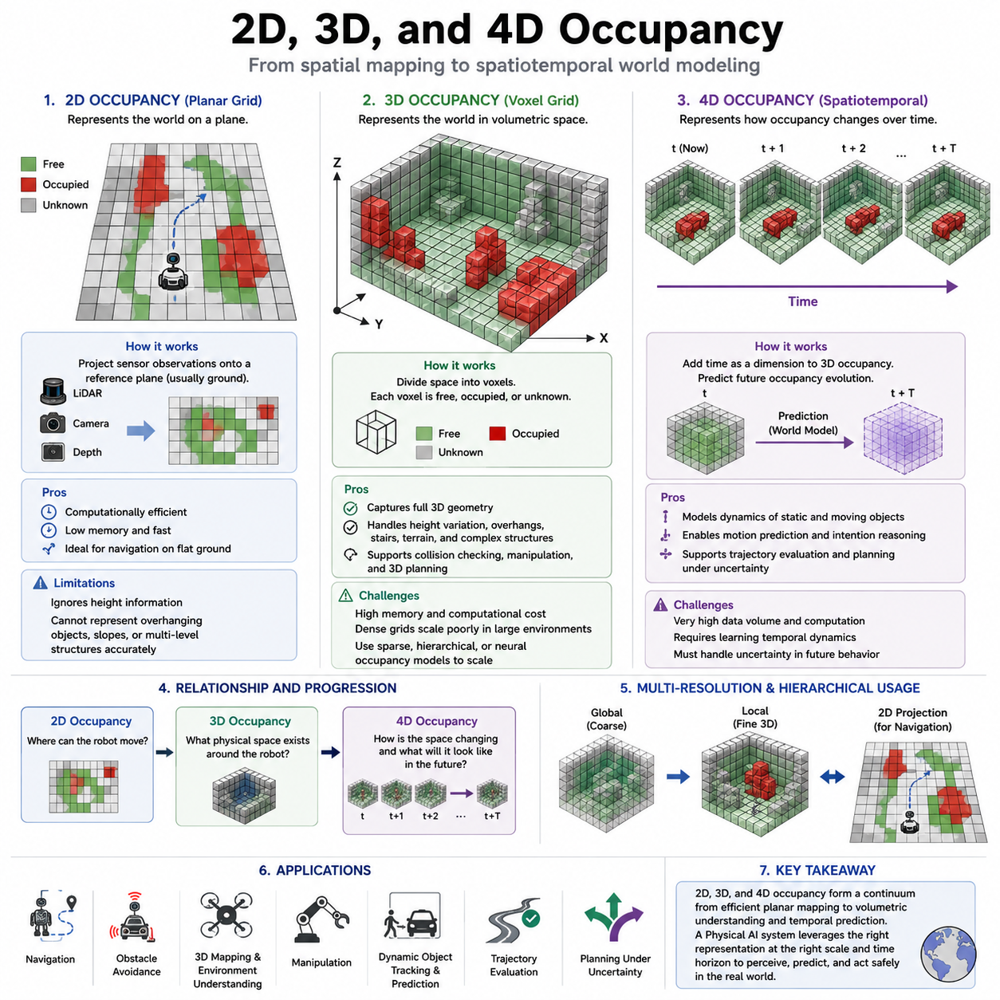
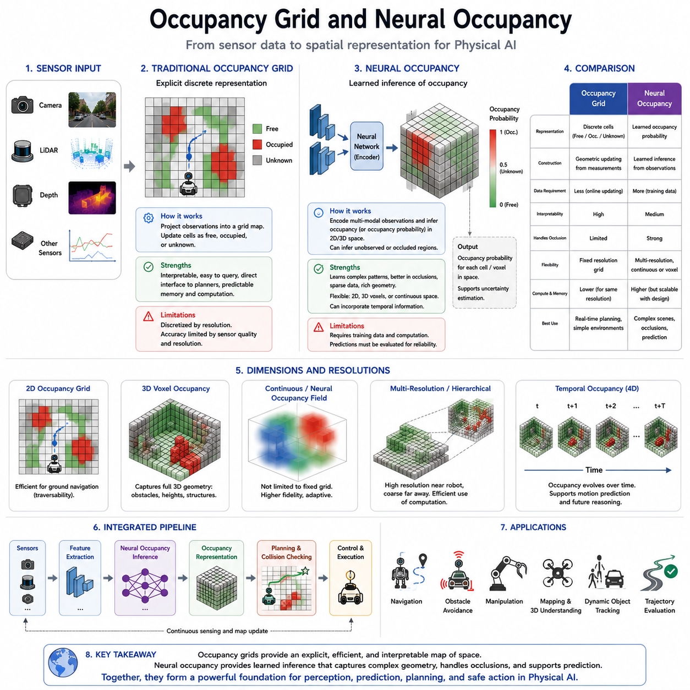
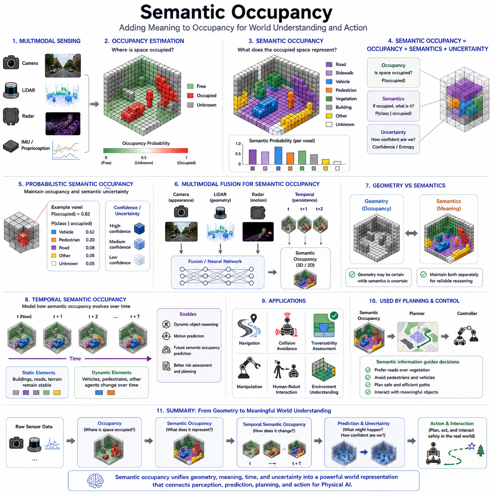
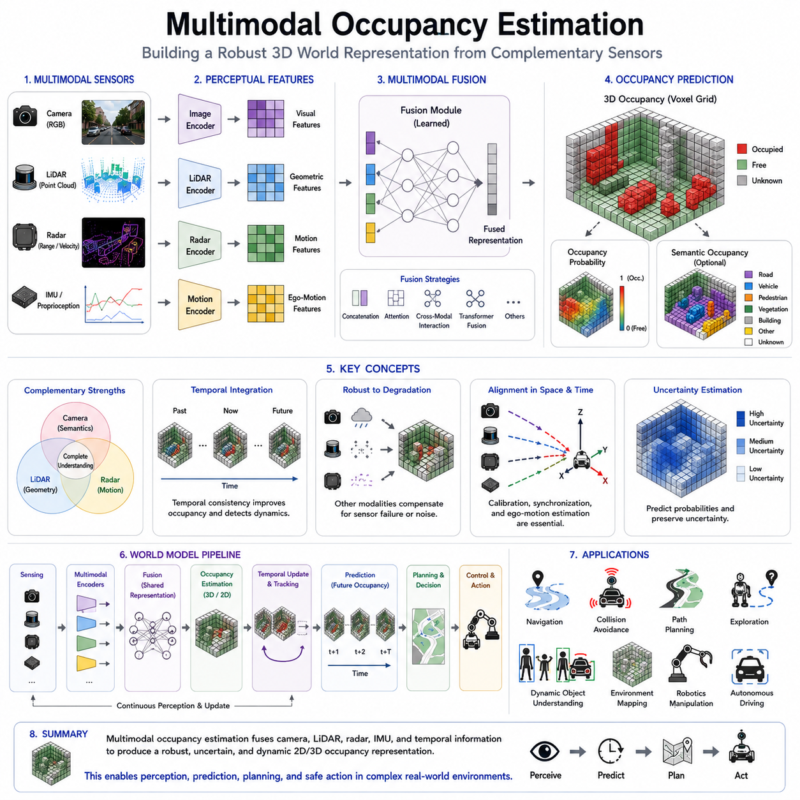
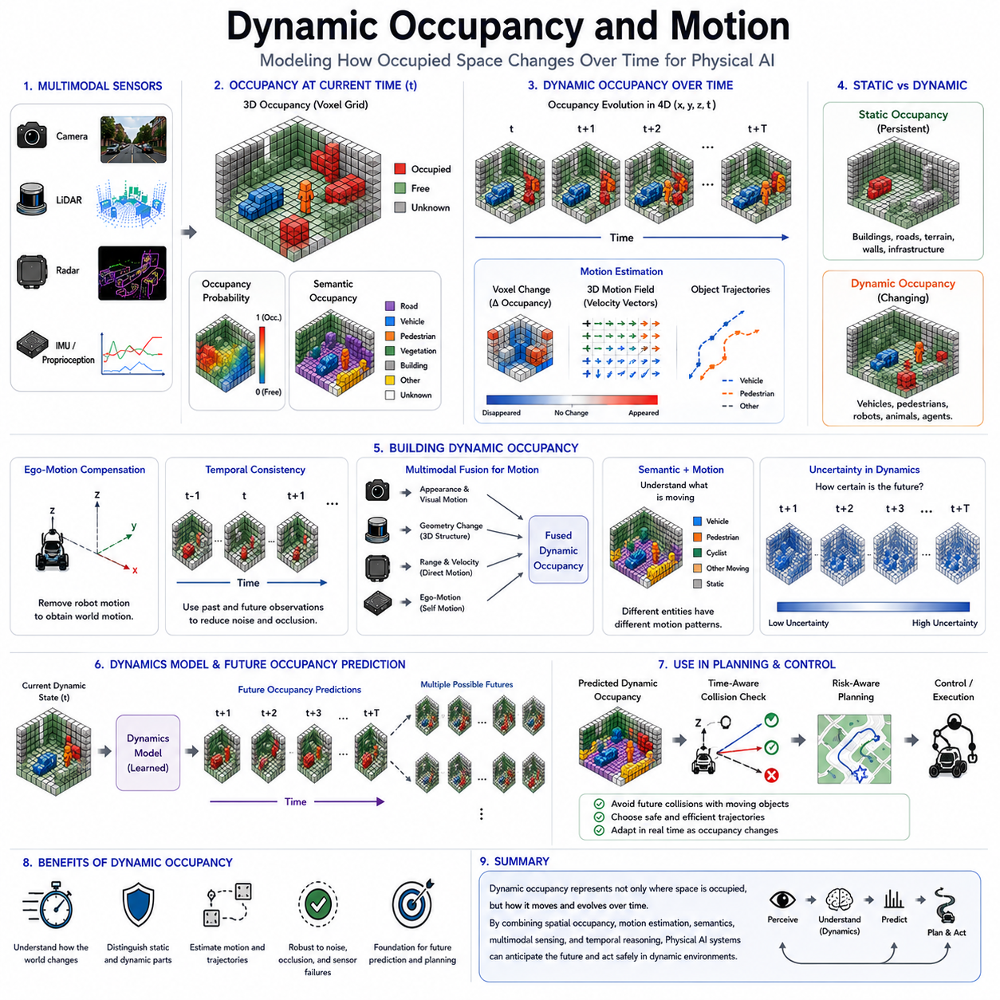
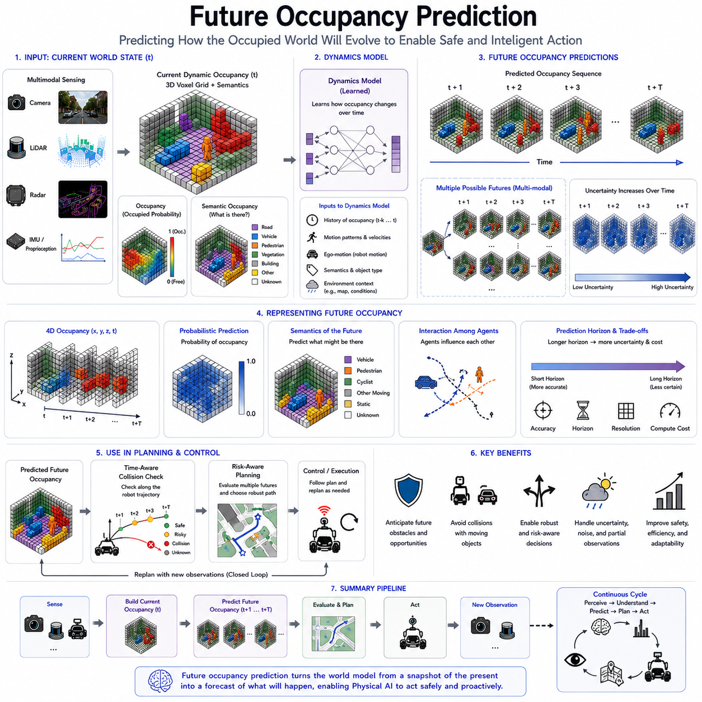
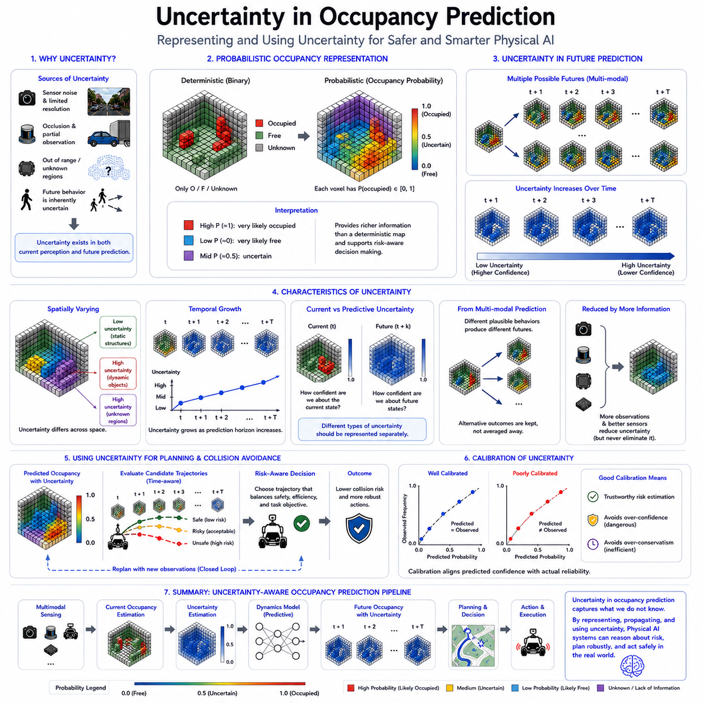
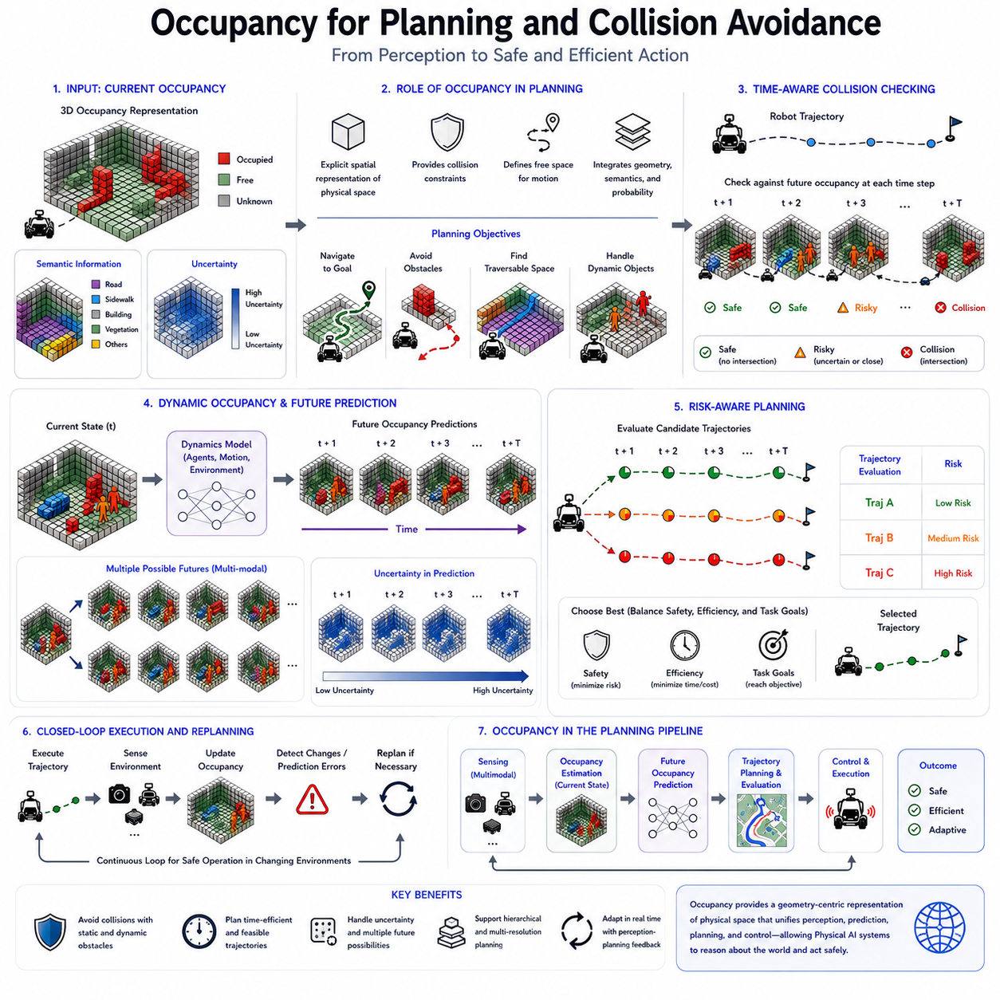
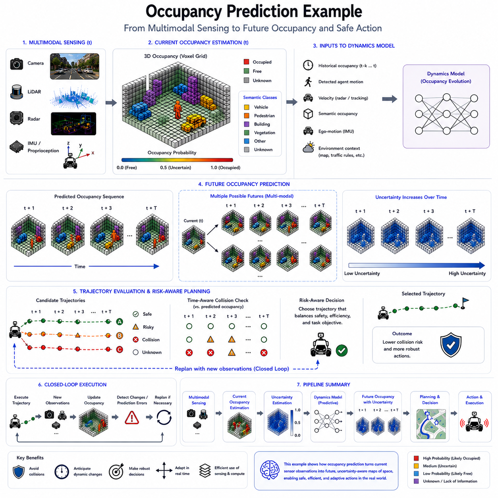

**Volume 07. World Models for Physical AI**

# Chapter 06. Occupancy Networks and Prediction

## 06.01. Occupancy as a World Representation

{width="7.268055555555556in" height="7.268055555555556in"}

Occupancy provides a spatial representation of the physical world by describing which regions of space are occupied, free, or unknown. Unlike object-centric representations that require the system to identify and classify individual objects, occupancy focuses directly on the geometry of the environment. This makes it particularly suitable for Physical AI because a robot must reason not only about what an object is, but also about where physical matter exists and where the robot can safely move.

In a world model, occupancy can serve as an intermediate representation between raw sensor observations and higher-level prediction, planning, and control. Cameras, LiDAR, radar, and other sensors observe only portions of the environment from particular viewpoints. The occupancy representation integrates these observations into a spatial state that is more directly useful for reasoning about the surrounding world. It therefore transforms fragmented observations into a structured description of physical space.

A basic occupancy representation assigns each spatial cell a state indicating whether that region is occupied or free. A third state is often required for regions that have not been observed sufficiently and therefore remain unknown. This distinction is important because unknown space should not automatically be interpreted as free space. For a Physical AI system, confusing unobserved regions with empty regions can produce unsafe decisions, especially when obstacles, people, or other moving agents are hidden behind objects.

Occupancy is especially valuable because it does not require every physical element to be represented as a predefined semantic object. A conventional object detector may recognize a vehicle, pedestrian, tree, or traffic sign, but the physical world also contains curbs, irregular terrain, vegetation, partial obstacles, construction materials, and previously unseen structures. Occupancy can represent these elements through their spatial existence even when their semantic categories are uncertain or unavailable.

The representation can be constructed at different spatial dimensions and resolutions. A two-dimensional occupancy grid is useful for mobile navigation because it projects the environment onto a traversable plane. Three-dimensional occupancy extends the representation into volumetric space and can capture structures above and below the robot. A four-dimensional representation further introduces time, allowing the world model to describe how occupancy changes as objects and environmental structures evolve.

Neural occupancy models extend traditional occupancy grids by learning to infer spatial occupancy directly from sensor observations. Instead of relying only on explicit geometric reconstruction, a neural network can learn relationships between images, LiDAR measurements, temporal observations, and the underlying spatial state. This allows the model to infer partially observed regions and construct a more complete representation of the environment. The resulting occupancy state can become a learned world representation rather than merely a geometric map.

For Physical AI, occupancy should also be understood as a state that can evolve over time. Static structures such as buildings and terrain may remain relatively stable, while vehicles, pedestrians, robots, animals, and other agents generate changing occupancy patterns. A world model can therefore represent occupancy at the current time and predict its future evolution. This creates a direct connection between occupancy representation and predictive world modeling, where the objective is not simply to reconstruct the present but to estimate plausible future states.

Occupancy can also be enriched with semantic information. Semantic occupancy associates spatial regions with categories or properties while preserving the underlying geometric representation. A cell or voxel may therefore encode not only whether physical space is occupied, but also whether the region corresponds to a road, vehicle, pedestrian, vegetation, building, or another class. This combination allows a world model to reason simultaneously about geometry and meaning without making semantic recognition the sole foundation of spatial understanding.

Multimodal sensing strengthens occupancy estimation because different sensors provide complementary evidence. Cameras provide rich appearance and semantic information, LiDAR provides accurate geometric measurements, radar can provide useful observations under adverse visibility and motion conditions, and inertial or proprioceptive measurements provide information about the robot\'s own motion. A multimodal world model can fuse these observations into a common occupancy representation, reducing the limitations of any individual sensor and supporting more robust physical-world understanding.

Occupancy also provides a natural interface between perception and planning. A planner does not necessarily need to know the exact identity of every obstacle before determining whether a trajectory is feasible. It primarily needs to know which regions can be traversed, which regions contain obstacles, and which regions remain uncertain. Consequently, occupancy can translate complex multimodal perception into spatial constraints that can be consumed by navigation, collision avoidance, trajectory optimization, and control systems.

The world-model perspective extends occupancy beyond immediate perception toward prediction and decision making. Given the current occupancy state and an action or estimated motion of surrounding agents, the model can predict future occupancy distributions. These predictions can support trajectory evaluation by allowing the robot to estimate whether a future action will lead to collision, blocked passage, or unsafe interaction. Occupancy therefore becomes not merely a map of where things are, but a representation of where physical matter is likely to be in the future.

An important characteristic of occupancy-based world representations is their ability to preserve uncertainty. Sensor occlusion, limited range, sparse observations, dynamic objects, and ambiguous measurements inevitably create uncertainty about the physical state. A useful world model should distinguish confidently occupied regions from uncertain regions rather than producing an apparently precise but incorrect representation. This makes occupancy particularly compatible with probabilistic prediction, uncertainty estimation, and risk-aware planning.

Within a Physical AI architecture, occupancy can therefore function as a central spatial state connecting perception, temporal modeling, multimodal fusion, prediction, and planning. Raw observations are transformed into a structured spatial representation, the world model updates that representation through time, and future occupancy states can then be evaluated by downstream planning and control systems. This makes occupancy an important bridge between what the robot observes and what it expects the physical world to become.

The role of occupancy becomes even more significant as world models move toward general physical intelligence. A general-purpose system must operate in environments containing known and unknown objects, static and dynamic structures, multiple sensor modalities, and changing levels of observability. Occupancy provides a relatively universal spatial language for representing these conditions because it describes the physical availability of space without requiring complete semantic understanding. It can therefore serve as one of the foundational representations upon which more advanced semantic, predictive, causal, and action-conditioned world models are constructed.

## 06.02. 2D 3D and 4D Occupancy

{width="7.268055555555556in" height="7.268055555555556in"}

Two-dimensional occupancy represents the physical environment on a planar grid, where each cell describes whether a region is occupied, free, or unknown. It is one of the simplest and most established forms of spatial world representation for mobile robots. Because ground robots primarily need to determine where they can travel, a 2D representation can provide a compact description of traversable space. It is therefore particularly useful for navigation, obstacle avoidance, localization support, and computationally efficient planning.

A 2D occupancy grid is normally constructed by projecting sensor observations onto a reference plane, often corresponding to the robot\'s ground surface. LiDAR measurements, depth observations, or other sensor data can be converted into occupied and free cells according to their spatial relationship with the robot. The grid resolution determines the level of geometric detail that can be represented. A fine resolution captures smaller obstacles but increases memory and computation, while a coarse resolution is more efficient but may lose important geometric information.

The main advantage of 2D occupancy is computational efficiency. A planar grid requires substantially less memory and processing than a volumetric representation, making it suitable for real-time operation on resource-constrained robotic platforms. Many navigation algorithms can directly consume a 2D costmap or occupancy grid to determine collision-free paths. However, this efficiency comes from simplifying the physical world. Objects with significant height variation, overhead structures, steep terrain, and obstacles that cannot be adequately described on a single plane may be represented inaccurately or completely lost.

Three-dimensional occupancy extends the representation from a plane into volumetric space. Instead of assigning a state to a two-dimensional cell, the environment is divided into three-dimensional voxels, each representing a volume of physical space. A voxel can indicate whether the corresponding region is occupied, free, or unknown. This allows the world model to represent walls, ceilings, vegetation, elevated obstacles, underpasses, stairs, irregular terrain, and other structures that cannot be adequately captured by a planar representation.

The transition from 2D to 3D occupancy is particularly important for Physical AI because real environments are inherently three-dimensional. A robot operating outdoors may encounter rocks, slopes, ditches, branches, vehicles, and structures at different heights. A mobile manipulator must additionally reason about objects above the ground plane, while a quadruped may need to understand complex terrain geometry. Three-dimensional occupancy therefore provides a more complete physical description and can support collision checking, traversability estimation, manipulation, and motion planning in spatially complex environments.

Three-dimensional occupancy also introduces substantially greater computational requirements. If the spatial resolution is maintained while adding a third dimension, the number of spatial elements can increase dramatically. A large outdoor environment may therefore become impractical to represent using a dense voxel grid. Practical systems often use sparse representations, hierarchical structures, adaptive resolution, or learned neural occupancy models to reduce the computational burden. The objective is to preserve the spatial information that matters for decision making while avoiding unnecessary representation of empty or irrelevant regions.

Four-dimensional occupancy adds time as an additional dimension to the spatial representation. In this interpretation, occupancy is not only a description of where physical matter exists in three-dimensional space, but also how that occupancy changes over time. A 4D occupancy representation can therefore describe a sequence of spatial states such as the current environment followed by predicted occupancy at future time steps. This makes it especially relevant to world models, because the representation can connect perception of the present with prediction of future physical states.

The temporal dimension allows a world model to distinguish between static and dynamic occupancy. A building or terrain surface may remain approximately stationary, while a vehicle, pedestrian, animal, or robot changes its spatial position over time. A 4D representation can encode these changes as evolving occupancy patterns rather than treating every observation as an independent static map. This provides a foundation for motion prediction, dynamic obstacle reasoning, trajectory evaluation, and planning under changing environmental conditions.

Four-dimensional occupancy should not be understood simply as storing many three-dimensional occupancy maps. A world model can learn temporal relationships between successive occupancy states and estimate how the physical environment is likely to evolve. Given the current occupancy state, the motion of observed agents, the robot\'s own action, and relevant environmental dynamics, the model can generate future occupancy predictions. These predictions can represent multiple possible futures when the future behavior of people, vehicles, or other agents is uncertain.

The three representations therefore form a progression from spatial simplicity to spatiotemporal world understanding. Two-dimensional occupancy provides an efficient representation of traversable space, three-dimensional occupancy provides volumetric understanding of the physical environment, and four-dimensional occupancy adds temporal evolution and future prediction. The choice should not be viewed as a simple replacement of one representation by another. A Physical AI system may use all three simultaneously, selecting the appropriate representation according to the task, spatial scale, computational resources, and required prediction horizon.

Multi-resolution and hierarchical occupancy can connect these representations into a unified architecture. A robot may maintain a high-resolution 3D occupancy representation near itself while using a lower-resolution representation for distant regions. A 2D projection can then provide an efficient navigation interface, while the underlying 3D representation preserves geometric information. Temporal models can operate on selected regions or features to predict future occupancy. This hierarchical strategy allows Physical AI systems to allocate computation according to relevance rather than processing the entire world with maximum detail.

The transition from 2D to 3D and finally to 4D occupancy also reflects an important transition in world-model design. A 2D map primarily answers where the robot can move, while a 3D representation answers what physical space exists around the robot. A 4D representation adds the question of how that physical space is changing and what it may look like in the future. Consequently, the progression from 2D to 4D occupancy moves the representation from geometric mapping toward predictive world modeling, providing increasingly rich information for perception, planning, collision avoidance, and autonomous decision making.

## 06.03. Occupancy Grid and Neural Occupancy

{width="7.268055555555556in" height="7.268055555555556in"}

An occupancy grid represents physical space by dividing an environment into discrete cells and assigning each cell a state such as occupied, free, or unknown. It provides an explicit spatial representation that can be directly interpreted by navigation and planning systems. For Physical AI, this representation is valuable because it converts sensor observations into a geometric description of the environment rather than requiring every region to be represented as a named object. The grid therefore forms a practical bridge between perception and spatial decision making.

Traditional occupancy grids are commonly constructed from range measurements such as LiDAR or depth sensing. Sensor observations are transformed into a common coordinate system, and the observed space is updated according to whether measurements indicate an obstacle or free space. Unknown regions remain explicitly represented when the sensor has not provided sufficient evidence. This property is important for autonomous robots because absence of sensor evidence should not automatically be interpreted as evidence that a region is free.

The resolution of an occupancy grid determines how precisely the physical world can be represented. A fine grid can capture small obstacles, narrow passages, and detailed geometric structures, but it requires more memory and computation. A coarse grid is computationally efficient and suitable for large environments, but small or thin structures may disappear from the representation. Consequently, grid resolution should be selected according to the robot\'s physical dimensions, sensor accuracy, operating environment, planning requirements, and available computational resources.

Occupancy grids are particularly effective for navigation because their representation directly expresses spatial traversability. A navigation system can transform occupied cells into collision constraints and use free cells as candidate regions for path generation. The same representation can support obstacle avoidance and local planning by continuously updating the surrounding space as new sensor observations arrive. However, a conventional grid remains fundamentally discretized, and its accuracy is limited by the selected resolution and the quality of the underlying sensor observations.

Neural occupancy extends this explicit representation by using learned models to infer occupancy from sensory information. Instead of constructing every spatial state only through predefined geometric rules, a neural network can learn the relationship between observations and the underlying physical structure. Camera images, LiDAR measurements, depth information, temporal observations, and other sensor features can be encoded into representations from which occupancy is predicted. This allows the model to infer spatial structure even when direct measurements are sparse or incomplete.

A major difference between conventional occupancy grids and neural occupancy is the role of inference. A traditional grid primarily records spatial evidence obtained through sensing and geometric updating, whereas neural occupancy can learn patterns that help estimate unobserved or partially observed regions. This is particularly useful in environments containing occlusions, sparse measurements, complex geometry, or sensor limitations. The learned representation can therefore provide a more complete estimate of the physical world than direct measurement alone, although its predictions must still be evaluated for reliability.

Neural occupancy can also operate at different spatial dimensions and resolutions. A model may predict occupancy in a two-dimensional representation for navigation, in three-dimensional voxels for volumetric understanding, or in more continuous spatial representations that are not restricted to a fixed grid. This flexibility allows the representation to be adapted to different Physical AI tasks. A mobile robot may emphasize ground-level traversability, while a mobile manipulator or quadruped may require detailed three-dimensional information about obstacles and surrounding structures.

The relationship between occupancy grids and neural occupancy is therefore not necessarily one of replacement. Explicit grids provide interpretability, predictable memory requirements, and a direct interface to classical planning systems. Neural occupancy provides learned inference, richer representation capacity, and the ability to integrate complex sensory information. A practical Physical AI architecture can combine both approaches, using neural networks to estimate or complete occupancy while maintaining an explicit spatial representation for downstream planning and safety-critical reasoning.

Neural occupancy can become particularly powerful when temporal information is included. Instead of estimating occupancy from a single observation, a model can process sequences of observations and learn how spatial structures persist or change over time. This enables the representation to incorporate motion, object permanence, and temporal consistency. The resulting occupancy state can serve as an input to a world model that predicts future spatial configurations, connecting occupancy estimation with dynamic world modeling and future occupancy prediction.

Both approaches must address uncertainty because occupancy cannot always be determined with complete confidence. Sensor noise, occlusion, limited range, sparse measurements, and unfamiliar environments can produce ambiguous spatial states. A useful occupancy system should therefore distinguish confidently occupied or free regions from areas where the evidence is weak. Neural models can represent uncertainty through probabilistic predictions or confidence estimates, while explicit occupancy grids can preserve unknown states. This distinction is essential when occupancy information is later used for collision avoidance and risk-aware planning.

From a Physical AI perspective, occupancy grids and neural occupancy can be viewed as complementary levels of world representation. The occupancy grid provides an explicit spatial structure that is easy to query and integrate with navigation, while neural occupancy provides learned perception and inference that can construct richer spatial states from multimodal observations. Together, they allow a system to move from raw sensor data toward a structured representation of physical space. This representation can subsequently support semantic enrichment, dynamic occupancy modeling, future prediction, planning, and control.

The broader significance of neural occupancy is that it moves occupancy from a manually updated map toward a learned world representation. As Physical AI systems become more capable, the objective is not merely to determine which cells are occupied at the current moment, but to construct a spatial state that remains coherent across sensors, time, viewpoints, and changing environments. Occupancy grids provide the explicit geometric foundation, while neural occupancy provides the learned inference required to extend that foundation toward predictive and general-purpose world models.

## 06.04. Semantic Occupancy

{width="7.268055555555556in" height="7.268055555555556in"}

Semantic occupancy extends basic occupancy representation by assigning semantic meaning to occupied regions of physical space. A conventional occupancy representation primarily asks whether a spatial cell or voxel contains physical matter, while semantic occupancy additionally describes what that occupied region represents. A voxel may therefore be associated with categories such as road, vehicle, pedestrian, vegetation, building, or other environmental elements. This combines geometric existence with semantic interpretation in a common spatial representation.

The importance of semantic occupancy comes from the fact that Physical AI must reason about both geometry and meaning. Knowing that a region is occupied is sufficient for basic collision avoidance, but it is not sufficient for many higher-level decisions. A robot should distinguish a pedestrian from a wall, a road from vegetation, and a movable vehicle from a permanent structure. Semantic information allows the world model to understand not only where physical matter exists, but also what role that matter may play in the environment.

Semantic occupancy can be constructed on top of two-dimensional grids, three-dimensional voxels, or other spatial representations. In a 2D representation, cells may be associated with semantic classes such as road, sidewalk, obstacle, or vegetation. In a 3D representation, individual voxels can carry semantic labels while preserving their spatial coordinates and occupancy state. This makes semantic occupancy particularly suitable for world models that need to connect perception with spatial reasoning, navigation, manipulation, and interaction with dynamic objects.

The representation can be understood as a combination of occupancy probability and semantic probability. Instead of assigning only a binary state such as occupied or free, a model can estimate whether a spatial region is occupied and, if occupied, which semantic category is most likely. For example, a voxel may have a high probability of being occupied and a high probability of belonging to the vehicle category. Another voxel may have uncertain occupancy and ambiguous semantic classification. This probabilistic formulation allows semantic occupancy to preserve uncertainty rather than forcing premature categorical decisions.

Semantic occupancy is particularly valuable when object boundaries are incomplete or observations are affected by occlusion. A camera may observe only part of a vehicle, while LiDAR may provide sparse geometric measurements of the same object. By combining spatial and semantic evidence, a learned occupancy model can infer a more coherent representation of the surrounding environment. The representation does not necessarily require complete object detection before spatial reasoning can begin, allowing geometry and semantics to develop together within the world model.

Multimodal sensing provides an important foundation for semantic occupancy. Cameras contribute rich visual and semantic information, while LiDAR provides accurate spatial geometry. Radar can contribute information about objects and motion under conditions where visual sensing is degraded, while temporal observations provide additional evidence about object persistence and movement. A semantic occupancy model can fuse these modalities into a common spatial representation, allowing each sensor to compensate for limitations in the others.

Semantic occupancy also creates a useful distinction between physical structure and semantic interpretation. The geometry of a region may be relatively certain even when its semantic category is uncertain. For example, the system may confidently identify that a large volume is occupied while remaining uncertain whether it is a vehicle, construction equipment, or another object. Maintaining these two forms of information separately allows downstream reasoning to use reliable geometric constraints without requiring complete semantic certainty.

The semantic representation can become even more useful when temporal information is incorporated. Static elements such as buildings, roads, and terrain generally maintain stable spatial relationships, while vehicles, pedestrians, and other agents change position over time. A temporal semantic occupancy representation can therefore model not only where semantic entities exist, but also how their spatial distributions evolve. This provides a foundation for dynamic object reasoning, motion prediction, and future semantic occupancy prediction.

Semantic occupancy is also closely connected to traversability and affordance reasoning. Different semantic classes imply different physical consequences for a robot. A road may represent a preferred traversable region, vegetation may represent uncertain or terrain-dependent space, and a vehicle or pedestrian may represent a dynamic obstacle requiring prediction. Consequently, semantic occupancy allows planning systems to apply different rules to different spatial regions rather than treating every occupied voxel as an identical obstacle.

For manipulation and interaction, semantic occupancy provides a spatial representation that can bridge perception and action. A mobile manipulator may need to understand that a particular occupied region corresponds to an object that can potentially be grasped, while another region represents a fixed environmental structure. Similarly, a quadruped may need to distinguish terrain, obstacles, and vegetation when selecting footholds and planning movement. Semantic occupancy therefore supports action-relevant spatial reasoning rather than perception that is isolated from physical behavior.

A major advantage of semantic occupancy is that it provides a common representation for multiple levels of world understanding. Low-level occupancy describes physical presence, semantic occupancy describes the meaning of that presence, temporal occupancy describes how it changes, and future occupancy prediction estimates how the representation may evolve. These layers can be integrated within a world model so that perception produces a structured state that can subsequently support prediction, planning, collision avoidance, and control.

The effectiveness of semantic occupancy depends on maintaining consistency between geometry, semantics, and time. Incorrect semantic classification can lead to inappropriate planning decisions, while incorrect geometry can produce unsafe collision estimates. A robust system should therefore evaluate semantic confidence together with occupancy confidence and temporal consistency. This is particularly important in unfamiliar environments, under sensor degradation, and in situations where objects are partially observed or dynamically changing.

Semantic occupancy ultimately represents an important step from geometric mapping toward a more complete physical world representation. An ordinary occupancy grid tells the robot where space is occupied, while semantic occupancy adds information about what occupies that space and how different regions should be interpreted. When combined with multimodal sensing, temporal modeling, uncertainty estimation, and future prediction, semantic occupancy can become a central representation through which Physical AI systems connect perception, world understanding, planning, and safe interaction with the real world.

## 06.05. Multimodal Occupancy Estimation

{width="7.268055555555556in" height="7.268055555555556in"}

Multimodal occupancy estimation constructs a spatial representation of the physical world by combining complementary observations from multiple sensors. A single sensor rarely provides complete information because each modality has different strengths and limitations. Cameras provide rich appearance and semantic information, LiDAR provides accurate geometric measurements, radar provides useful motion and range information, and IMU or proprioception provides information about the robot's own motion. Occupancy estimation combines these observations into a common spatial state.

The central objective is to estimate whether each spatial region is occupied, free, or unknown using information from multiple modalities. Rather than treating each sensor independently, the system transforms their observations into compatible representations and fuses the resulting evidence. This allows geometric, visual, temporal, and motion-related information to contribute jointly to the occupancy state. The resulting representation can be expressed as a 2D grid, 3D voxel structure, or another learned spatial representation depending on the requirements of the Physical AI system.

Camera and LiDAR provide particularly complementary information for occupancy estimation. Camera images contain detailed appearance, texture, and semantic information but do not directly provide complete metric geometry. LiDAR provides explicit three-dimensional measurements but can be sparse and may provide limited semantic information. Combining the two allows visual features to guide the interpretation of geometric observations while LiDAR constrains the spatial structure. This combination can improve occupancy estimation in environments where either modality alone is incomplete.

Radar adds another complementary source of evidence, particularly for dynamic environments and degraded visual conditions. Radar can provide range and velocity-related information and may remain useful under conditions such as darkness, rain, dust, or partial visual obstruction. When radar observations are incorporated with camera and LiDAR information, the occupancy model can distinguish spatial structure from motion-related evidence more effectively. This is important for Physical AI systems that must operate continuously across changing environmental and sensing conditions.

Temporal information provides another dimension of multimodal occupancy estimation. Occupancy at one instant may be ambiguous because an object is partially observed, temporarily occluded, or sparsely measured. Observations from previous and subsequent time steps can provide additional evidence about the persistence and movement of spatial structures. A model can therefore use temporal consistency to refine the current occupancy state and distinguish persistent static structures from moving objects.

Multimodal fusion can be performed at different stages of the perception pipeline. Early fusion combines relatively raw sensor features before substantial modality-specific processing, while late fusion estimates modality-specific outputs and combines them afterward. Intermediate fusion creates modality-specific representations and combines them within a shared latent space. The appropriate strategy depends on sensor characteristics, computational resources, synchronization requirements, and the complexity of the target environment.

A learned fusion network can transform camera, LiDAR, radar, and temporal features into a common representation before predicting occupancy. Feature encoders first extract modality-specific information, after which a fusion mechanism integrates complementary evidence. The fusion stage may use concatenation, attention, cross-modal interaction, or other learned mechanisms. The resulting representation can then be decoded into occupancy probabilities for individual cells or voxels. This architecture allows the model to learn which modality should contribute most strongly under different environmental conditions.

Spatial and temporal alignment are essential because observations from different sensors are not automatically expressed in the same coordinate system or at the same time. Camera images, LiDAR points, radar detections, and inertial measurements must be associated with a consistent spatial reference and synchronized temporal context. Calibration errors, synchronization errors, and inaccurate ego-motion estimation can produce incorrect spatial relationships and therefore corrupt the occupancy representation. Multimodal occupancy estimation must therefore treat alignment as part of the world-modeling problem rather than as an independent preprocessing detail.

An important advantage of multimodal estimation is robustness to missing or degraded observations. A camera may become unreliable in darkness or glare, LiDAR may provide sparse returns in certain geometries, and radar may produce ambiguous measurements in complex environments. If the model has learned complementary relationships among modalities, information from the remaining sensors can partially compensate for the degraded modality. This enables the occupancy representation to remain useful even when the sensing configuration is imperfect.

Multimodal occupancy estimation can also incorporate semantic information without separating geometric and semantic processing completely. Camera features can provide evidence that an occupied region is likely to contain a pedestrian, vehicle, vegetation, or building, while LiDAR establishes its spatial extent. Radar and temporal observations can provide additional evidence about whether the region is moving. The resulting semantic occupancy representation can therefore combine physical presence, spatial geometry, semantic category, and temporal behavior within a common world representation.

Uncertainty is another important component of multimodal occupancy estimation. Sensor observations may disagree, and even a well-trained model may not have sufficient evidence to determine the true state of a region. Instead of forcing a binary occupied or free decision, the model can estimate occupancy probabilities and preserve uncertainty. For example, a spatial region may have moderate occupancy probability because LiDAR provides sparse returns while the camera suggests a possible object. Maintaining this uncertainty allows downstream planning systems to make more appropriate risk-aware decisions.

The multimodal occupancy representation can serve as a foundation for dynamic world modeling. Once occupancy is estimated consistently across time, the system can identify spatial regions that remain stable and regions whose occupancy changes. Static structures such as buildings and terrain can form a persistent spatial background, while vehicles, pedestrians, robots, and other agents can be represented as changing occupancy patterns. This provides a natural interface between multimodal perception and future occupancy prediction.

The same representation can support different levels of Physical AI operation. At the perception level, it provides a fused spatial understanding of the current environment. At the prediction level, temporal information can be used to estimate future occupancy. At the planning level, occupied and uncertain regions can become spatial constraints for trajectory generation and collision avoidance. At the control level, the resulting plan can be executed while new multimodal observations continuously update the occupancy state. The system therefore forms a closed loop between sensing, representation, prediction, planning, and action.

Multimodal occupancy estimation is ultimately more than a sensor-fusion technique. It provides a mechanism for constructing a common spatial world representation from heterogeneous observations that differ in geometry, appearance, temporal behavior, and reliability. Camera, LiDAR, radar, IMU, and temporal information can contribute complementary evidence rather than being treated as isolated perception pipelines. When combined with learned fusion, uncertainty estimation, and temporal modeling, multimodal occupancy becomes a strong foundation for world models that allow Physical AI systems to perceive, predict, plan, and act within complex real-world environments.

## 06.06. Dynamic Occupancy and Motion

{width="7.268055555555556in" height="7.268055555555556in"}

Dynamic occupancy extends static occupancy representation by modeling how occupied regions of physical space change over time. A static occupancy map describes where physical matter exists at a particular moment, whereas dynamic occupancy additionally represents motion, displacement, appearance, disappearance, and interaction among moving elements. This distinction is essential for Physical AI because autonomous systems operate in environments where pedestrians, vehicles, robots, animals, and other agents continuously change their spatial states.

The central idea is to represent moving physical entities as evolving occupancy patterns rather than treating them as independent detections at each time step. A vehicle, for example, may occupy one group of cells or voxels at time t and progressively occupy different regions at later times. By maintaining temporal continuity, the world model can interpret these changes as motion rather than unrelated observations. Dynamic occupancy therefore connects spatial representation with temporal state estimation and provides a natural basis for understanding changing physical environments.

Dynamic occupancy can be represented in two-dimensional grids, three-dimensional voxels, or higher-dimensional spatiotemporal structures. In a 2D representation, motion can be expressed as changing occupied cells across successive frames. In 3D, moving objects can be represented through changing voxel volumes that preserve their spatial extent and height. A 4D representation explicitly adds time to the spatial state, allowing the world model to describe occupancy as a function of position and time. This progression connects directly with the broader 2D, 3D, and 4D occupancy framework of Physical AI.

Motion estimation provides an important mechanism for interpreting dynamic occupancy. By comparing occupancy states across consecutive observations, the system can estimate the direction, velocity, and approximate trajectory of changing regions. These estimates do not necessarily require complete object-level detection because spatial changes themselves contain information about movement. Consequently, occupancy dynamics can provide motion evidence even when objects are partially observed, merged with other objects, or difficult to classify.

The robot\'s own motion must also be separated from environmental motion. When a mobile robot moves, the entire sensor observation changes even though static structures may remain fixed in the physical world. Ego-motion estimation and spatial alignment are therefore necessary to distinguish apparent motion caused by the robot from actual motion of external objects. A reliable dynamic occupancy model maintains a consistent world coordinate reference so that changes in occupancy correspond as closely as possible to genuine environmental dynamics.

Dynamic occupancy is particularly useful for distinguishing static and dynamic elements. Buildings, terrain, walls, and many infrastructure elements generally maintain stable spatial relationships, while vehicles, pedestrians, and other agents change position over time. The world model can maintain persistent occupancy for stable structures while tracking changing occupancy patterns for dynamic elements. This separation reduces unnecessary temporal computation and allows prediction resources to focus on regions whose future states are likely to change.

Temporal consistency is central to dynamic occupancy. A single observation may contain noise, missing measurements, or occlusion, making it difficult to determine whether a region has genuinely changed. Observations from previous and subsequent time steps provide additional evidence. If a spatial pattern moves consistently across several frames, the model gains stronger evidence that the corresponding region represents a dynamic entity. Temporal reasoning can therefore reduce false motion estimates and stabilize the occupancy representation.

Multimodal sensing strengthens dynamic occupancy because different sensors provide different types of motion evidence. Cameras provide appearance and visual motion cues, LiDAR provides geometric changes in three-dimensional space, radar can provide direct range and velocity information, and IMU or proprioceptive measurements provide information about the robot\'s own motion. Combining these observations allows the world model to construct a more reliable estimate of dynamic occupancy than any individual sensor can generally provide. This follows the multimodal occupancy framework in which complementary sensor information is fused into a shared spatial state.

Dynamic occupancy can also incorporate semantic information so that motion is interpreted according to the type of physical entity involved. A moving pedestrian, vehicle, robot, or animal may exhibit different motion patterns and require different planning responses. Static vegetation or infrastructure may instead be treated as persistent environmental structure. Combining occupancy, semantics, and motion allows the world model to represent not only where something is and how it is moving, but also what kind of entity is responsible for the observed change.

A learned dynamics model can operate on the temporal sequence of occupancy states to estimate future spatial configurations. Given the current occupancy state and information about observed motion, the model can infer how occupied regions may evolve over subsequent time steps. The resulting sequence can represent possible future occupancy states rather than a single static prediction. This creates a direct connection between dynamic occupancy and future occupancy prediction, which is the next stage of the occupancy modeling structure.

Future occupancy is inherently uncertain because observed motion does not uniquely determine future behavior. A pedestrian may stop, turn, accelerate, or change direction, while a vehicle may brake, merge, or follow a different trajectory. Therefore, dynamic occupancy should not always produce a single deterministic future state. A world model can instead maintain probabilities or multiple possible occupancy evolutions, allowing downstream planning systems to consider both likely and less likely but potentially dangerous outcomes.

Dynamic occupancy also provides a natural representation for interaction among multiple moving entities. Two vehicles may approach an intersection, a pedestrian may cross a robot\'s planned path, or multiple robots may move through the same environment. Their occupancy states are not independent when their future motions can influence one another. A sufficiently expressive world model can therefore represent changing spatial relationships among agents and use those relationships to improve prediction and decision making.

For planning and control, dynamic occupancy transforms spatial obstacles into time-dependent constraints. A region that is currently free may become occupied before the robot reaches it, while an occupied region may become available later. Consequently, collision checking should consider not only spatial overlap but also temporal overlap between the robot trajectory and predicted occupancy. This enables trajectory evaluation, dynamic obstacle avoidance, risk-aware planning, and more informed control decisions.

The computational requirements of dynamic occupancy increase as spatial resolution, temporal resolution, environment size, and prediction horizon grow. Processing dense 3D occupancy at many future time steps can become expensive in both memory and computation. Practical Physical AI systems therefore need to allocate computational resources according to relevance, using approaches such as sparse representations, hierarchical spatial resolution, selective temporal modeling, and learned latent representations. High-detail prediction can be concentrated around the robot and important dynamic objects while distant or stable regions are processed more efficiently.

Dynamic occupancy ultimately transforms occupancy from a static spatial map into a temporal world representation. It provides a way to describe not only where physical matter exists, but how that spatial state changes through time and how those changes may affect future decisions. By combining occupancy with motion estimation, multimodal sensing, semantic information, temporal consistency, and predictive dynamics, Physical AI systems can move from observing the current environment toward understanding and anticipating its evolution. This makes dynamic occupancy an important intermediate layer between present-state perception and future-oriented world modeling, planning, and control.

## 06.07. Future Occupancy Prediction

{width="7.268055555555556in" height="7.268055555555556in"}

Future occupancy prediction extends occupancy modeling from representing the current physical world to estimating how that world may evolve over time. A present occupancy state describes where physical space is occupied, free, or unknown at time t, while future occupancy prediction estimates corresponding states at t+1, t+2, and longer horizons. This transforms occupancy from a descriptive spatial representation into a predictive component of the world model, enabling Physical AI systems to anticipate changes before they are directly observed.

The prediction process begins with a current dynamic occupancy state that summarizes the spatial and temporal information available at the present moment. This state may contain static structures, moving objects, semantic information, and motion-related features obtained from multimodal sensing. A learned dynamics model then processes this state to estimate future occupancy evolution. Rather than predicting only the next frame, the model can generate a sequence of future spatial states extending from the immediate future to a longer prediction horizon.

Future occupancy prediction is closely related to the temporal structure of 4D occupancy. The spatial state is represented across position and time, allowing the world model to describe how occupied regions move, disappear, appear, or remain persistent. A vehicle may progressively move through different spatial cells, a pedestrian may cross a planned path, and a previously occupied region may become free. The objective is therefore not simply to predict object positions independently, but to estimate the evolution of the overall physical occupancy state.

A learned dynamics model can use temporal occupancy sequences to discover patterns that are difficult to capture through independent frame-by-frame prediction. Previous observations provide information about velocity, direction, persistence, and interaction, while the current state provides the latest spatial configuration. The model can learn how these factors influence future occupancy and produce predictions over multiple time steps. This creates a direct connection between dynamic occupancy modeling and predictive world models, where temporal state transitions become central to physical reasoning.

The prediction horizon determines how far into the future the world model attempts to estimate occupancy. Short-horizon prediction is useful for immediate collision avoidance and local control because the prediction is generally more constrained by the current state. Longer-horizon prediction can support route planning, intention reasoning, and strategic decision making, but uncertainty grows as the horizon increases. A practical system therefore needs to balance prediction distance, temporal resolution, computational cost, and the accuracy required by the downstream task.

Future occupancy is inherently probabilistic because the same current state can lead to multiple possible outcomes. A pedestrian may continue forward, stop, turn, or change direction, while a vehicle may accelerate, brake, change lanes, or follow another trajectory. Consequently, a world model should be capable of representing multiple possible futures rather than assuming that one deterministic trajectory is always correct. Branching future occupancy distributions provide a way to preserve alternative outcomes and allow planning systems to reason about risk.

Uncertainty generally increases as predictions move farther into the future. Small errors in motion estimation or current occupancy can accumulate over multiple prediction steps, causing predicted regions to gradually diverge from the actual future state. This makes uncertainty an intrinsic part of future occupancy prediction rather than an optional output. The model can represent confidence or probability for future occupancy regions, allowing downstream systems to distinguish highly predictable regions from areas where future behavior is ambiguous.

Multimodal sensing and temporal reasoning can improve the quality of future occupancy predictions. Camera observations provide appearance and semantic information, LiDAR provides geometric structure, radar can provide range and velocity evidence, and IMU or proprioception helps compensate for the robot\'s own motion. Combining these observations with historical occupancy states allows the dynamics model to construct a more complete estimate of the current world state before predicting its future evolution. The resulting pipeline connects sensing, fusion, occupancy estimation, temporal tracking, and prediction.

Future occupancy prediction can also incorporate semantic and interaction information. Predicting that a spatial region will become occupied is useful, but knowing whether that region will contain a pedestrian, vehicle, robot, or another moving entity can make the prediction more useful for decision making. Similarly, multiple agents may influence one another, meaning that their future occupancy states cannot always be predicted independently. A richer world model can therefore learn relationships among agents and generate future occupancy states that reflect interaction and changing spatial relationships.

One important application is time-aware collision checking. A region that is currently free may become occupied before the robot reaches it, while an obstacle that is currently present may move away before the robot arrives. Planning therefore needs to evaluate both spatial and temporal relationships between the robot\'s future trajectory and predicted occupancy. Future occupancy provides a direct representation for this process, allowing candidate trajectories to be tested against predicted dynamic space rather than only against the current environment.

Risk-aware planning can use multiple predicted futures to select trajectories that remain safe across plausible outcomes. A planner may compare candidate robot trajectories against high-probability occupancy regions as well as lower-probability outcomes that could create severe consequences. This allows the system to prefer trajectories that are not merely efficient under the most likely future, but robust to reasonable variations in the behavior of surrounding agents. Future occupancy therefore provides a natural interface between predictive world modeling and uncertainty-aware planning.

The computational cost of future occupancy prediction increases with spatial resolution, temporal resolution, prediction horizon, and the number of possible futures. Dense prediction over a large three-dimensional environment can require substantial memory and processing. Physical AI systems can therefore use sparse occupancy, hierarchical spatial resolution, selective prediction of dynamic regions, or learned latent representations to focus computation where it has the greatest decision-making value. High-resolution prediction can be concentrated near the robot and important dynamic agents while stable distant regions are handled more efficiently.

Future occupancy prediction ultimately establishes the transition from understanding the present world to anticipating its evolution. The world model receives a current occupancy state, applies learned or structured dynamics, generates future occupancy sequences, represents uncertainty and alternative outcomes, and provides these predictions to planning and control. This creates a continuous loop of perception, understanding, prediction, planning, and action. In this architecture, occupancy becomes more than a map of the present: it becomes a predictive spatial language through which Physical AI can reason about what may happen next and act before the future becomes the present.

## 06.08. Uncertainty in Occupancy Prediction

{width="7.268055555555556in" height="7.268055555555556in"}

Uncertainty is an essential part of occupancy prediction because the physical world cannot always be observed completely or predicted with certainty. An occupancy model may receive incomplete sensor measurements, encounter occluded objects, or observe regions outside the effective sensing range. Even when the current occupancy state is estimated correctly, future occupancy can remain uncertain because moving agents may change their behavior. Therefore, a useful occupancy representation should not only state whether a region is occupied, but also express how confident the system is about that state.

Occupancy uncertainty can be represented probabilistically rather than as a simple binary decision. Instead of assigning every cell or voxel only to occupied or free, the model can estimate an occupancy probability for each spatial region. A value close to one indicates strong evidence that the region is occupied, while a value close to zero indicates strong evidence of free space. Intermediate probabilities represent ambiguity. This formulation allows the world model to preserve uncertainty and provides downstream planning systems with richer information than a deterministic occupancy map.

Uncertainty in occupancy prediction can arise from different sources. Sensor noise, limited resolution, partial observation, and occlusion create uncertainty even when the physical environment itself is not changing. In contrast, uncertainty can also arise because the model does not have sufficient knowledge to correctly interpret a new environment, object type, or unusual configuration. These sources should not necessarily be treated as identical. A robust world model should distinguish uncertainty caused by inherently ambiguous observations from uncertainty caused by limitations in the model or available knowledge.

Future occupancy introduces an additional and often larger source of uncertainty. The current state may indicate that a pedestrian is moving toward a particular region, but the pedestrian may stop, turn, accelerate, or change direction. Similarly, a vehicle may continue along its current trajectory or respond to another agent. As the prediction horizon increases, small errors in the current state and motion estimate can accumulate, causing future occupancy distributions to become increasingly broad. Therefore, uncertainty should naturally increase as the prediction moves farther from the current observation.

Multiple possible futures provide a practical way to represent this uncertainty. Instead of forcing the dynamics model to generate a single future occupancy sequence, it can represent several plausible occupancy evolutions. Each future may correspond to a different possible behavior or interaction among agents. One branch may represent a pedestrian continuing forward, while another may represent the pedestrian stopping or changing direction. Such multimodal prediction allows the world model to preserve alternative outcomes instead of averaging them into a single prediction that may not correspond to any physically meaningful future.

Uncertainty can also vary across space. Static structures such as buildings, walls, and terrain may have relatively low future uncertainty because their occupancy remains stable. Dynamic objects can have substantially higher uncertainty because their future positions depend on motion and interaction. Unknown or partially observed regions may also have high uncertainty even before future prediction begins. Consequently, a useful occupancy model should represent uncertainty spatially and temporally rather than assigning a single global confidence value to the entire scene.

Multimodal sensing can reduce some forms of occupancy uncertainty by combining complementary evidence. Camera observations can provide semantic and appearance information, LiDAR can provide geometric evidence, radar can provide range and velocity information, and IMU or proprioception can provide information about the robot\'s own motion. When these observations are aligned spatially and temporally, one modality can compensate for limitations in another. However, sensor fusion does not eliminate uncertainty completely. Conflicting measurements, missing modalities, calibration errors, and degraded sensing conditions can still produce ambiguous occupancy states.

Temporal reasoning provides another mechanism for reducing uncertainty in the current occupancy state. A single frame may contain an occluded or incomplete observation, while observations from previous and subsequent time steps can reveal persistence and motion patterns. If a spatial structure remains consistent across many observations, confidence in its occupancy can increase. Conversely, if observations repeatedly disagree or a region changes unpredictably, uncertainty should remain high. Temporal consistency therefore allows the world model to accumulate evidence instead of treating every observation as an independent decision.

The distinction between current uncertainty and predictive uncertainty is important for Physical AI. Current uncertainty concerns how confidently the system knows the state of the world now, while predictive uncertainty concerns how confidently it can estimate future states. A system may have high confidence that a vehicle currently occupies a particular region while having much lower confidence about where that vehicle will be several seconds later. Separating these uncertainties allows the world model to maintain a reliable current representation while explicitly acknowledging uncertainty in future evolution.

Uncertainty becomes particularly important for planning and collision avoidance. A planner should not treat a low-probability occupied region in exactly the same way as a highly certain obstacle, but neither should it automatically ignore uncertain space. The appropriate response depends on the probability, spatial extent, prediction horizon, robot dynamics, and potential consequence of failure. Risk-aware planning can therefore use occupancy probability and predictive uncertainty to compare candidate trajectories and select actions that remain acceptably safe across plausible future states.

Calibration is important because the numerical confidence produced by an occupancy model should correspond to actual predictive reliability. If a model repeatedly assigns high confidence to incorrect occupancy predictions, downstream systems may make dangerously optimistic decisions. Conversely, excessively conservative uncertainty can cause unnecessary stopping, inefficient trajectories, or excessive computational effort. Evaluating and calibrating occupancy confidence therefore becomes an important part of building a reliable world model, particularly when predictions are used directly by safety-critical planning and control.

Ultimately, uncertainty-aware occupancy prediction transforms occupancy from a deterministic spatial map into a probabilistic representation of the physical world. The system estimates current occupancy, maintains uncertainty caused by incomplete or ambiguous observations, models how uncertainty propagates through time, and represents multiple possible future occupancy states when necessary. This allows Physical AI to distinguish what is known, what is uncertain, and what may happen next. By connecting probabilistic occupancy with temporal dynamics, multimodal sensing, and risk-aware planning, the world model can make decisions that are not merely based on the most likely future, but are robust to uncertainty in the real physical environment.

## 06.09. Occupancy for Planning and Collision Avoidance

{width="7.268055555555556in" height="7.268055555555556in"}

Occupancy provides a direct spatial representation that can be used by planning systems to reason about where a robot can and cannot move. Unlike representations based only on detected objects, occupancy describes the physical state of surrounding space itself. Occupied regions can act as collision constraints, while free regions provide candidate space for motion. This makes occupancy a natural interface between world perception and physical planning in Physical AI.

The planning process begins with a current occupancy representation that summarizes the robot's surrounding physical environment. This representation may contain occupied, free, and unknown regions, together with semantic or probabilistic information. The planner can use this spatial state to identify a feasible route from the current position toward a desired goal. Because the representation is spatially explicit, planning does not need to reconstruct the entire environment from raw sensor measurements each time a trajectory is evaluated.

Collision avoidance can be formulated directly as a spatial relationship between the robot trajectory and occupancy. A candidate trajectory is safe when the robot's predicted footprint does not intersect occupied regions during the relevant time interval. If future occupancy is available, the same principle can be extended into the temporal dimension. The planner must then consider not only where an obstacle exists, but also whether that region will be occupied when the robot reaches it.

Traversability is another important function of occupancy-based planning. Not every free-looking region is equally suitable for movement. Terrain geometry, narrow passages, obstacles, slopes, and uncertain regions can influence whether a particular area should be considered practically traversable. Occupancy can therefore be combined with geometric, semantic, and environmental information to construct planning costs. This allows the planner to distinguish between merely collision-free space and space that is genuinely suitable for the robot's physical capabilities.

Dynamic occupancy extends collision avoidance from static obstacles to moving physical entities. Vehicles, pedestrians, robots, animals, and other agents can change their positions while the robot is executing a planned trajectory. A current occupancy map alone may therefore become outdated before the robot reaches a particular location. Future occupancy prediction provides estimated spatial states at t+1, t+2, and longer horizons, allowing the planner to evaluate whether a trajectory remains safe as the surrounding world changes.

Time-aware collision checking evaluates candidate trajectories against predicted occupancy across time rather than checking only the current spatial configuration. A region that is free at the present moment may become occupied before the robot arrives, while a current obstacle may move away. The planner can therefore associate points along the robot trajectory with corresponding future occupancy states and classify them as safe, risky, colliding, or uncertain. This converts collision checking from a purely geometric problem into a spatiotemporal reasoning problem.

Uncertainty must be preserved when occupancy is used for planning. Sensor noise, occlusion, unknown regions, incomplete observations, and unpredictable agent behavior can make the predicted occupancy state uncertain. A planner should therefore distinguish high-confidence obstacles from uncertain regions instead of treating every prediction as equally reliable. Probabilistic occupancy allows the planning system to incorporate this information into its risk assessment and avoid decisions that depend excessively on uncertain spatial predictions.

Risk-aware planning extends this idea by evaluating multiple possible futures rather than relying only on the single most likely prediction. A pedestrian may continue forward, stop, or change direction, while another vehicle may alter its trajectory in response to traffic. The planner can compare candidate robot trajectories against these possible occupancy evolutions and select a trajectory that balances safety, efficiency, and task objectives. This is especially important when the consequences of an incorrect prediction are significant.

Planning on occupancy can also support hierarchical decision making. A global planner may use a relatively coarse representation to determine a route through a large environment, while a local planner can use higher-resolution occupancy around the robot for detailed obstacle avoidance. Multi-resolution or hierarchical occupancy allows computational resources to be concentrated where precision is most important. The same principle can be extended temporally, with detailed prediction near the current time and more abstract prediction at longer horizons.

Occupancy-based planning forms a closed loop with perception and control rather than operating as a one-time computation. After a trajectory is selected, the robot executes the corresponding control actions while continuously receiving new sensor observations. These observations update the occupancy representation, reveal prediction errors or environmental changes, and allow the planner to re-evaluate the current trajectory. If necessary, the system can replan before the previous plan becomes unsafe. This continuous sensing and map-update loop is fundamental to operation in changing environments.

The same occupancy representation can support different planning objectives beyond basic collision avoidance. Navigation can use it to identify feasible routes, trajectory evaluation can compare candidate motions against spatial constraints, manipulation can use three-dimensional occupancy to reason about reachable objects and obstacles, and dynamic-object tracking can provide information for future motion prediction. Thus, occupancy becomes a common spatial representation shared by perception, prediction, planning, and control rather than a representation dedicated to a single navigation algorithm.

The broader significance of occupancy for planning is that it provides a geometry-centric representation of physical space that can incorporate uncertainty, dynamics, semantics, and multimodal observations. The world model can transform sensor observations into current occupancy, predict future occupancy, evaluate candidate trajectories against those predictions, and convert the selected plan into control actions. The resulting loop connects perception, prediction, planning, and execution, allowing Physical AI systems to act safely and adaptively as the physical world changes.

## 06.10. Occupancy Prediction Example [w/Code]

{width="7.268055555555556in" height="7.268055555555556in"}

A practical occupancy prediction example can be constructed around an autonomous mobile robot approaching an intersection in an outdoor environment. The robot observes a road, buildings, parked vehicles, a moving pedestrian, and another vehicle approaching from the side. The purpose is not simply to detect these objects, but to transform the multimodal observations into a spatial occupancy state and predict how that state will evolve during the next several seconds. The example therefore connects sensing, occupancy estimation, dynamics modeling, future prediction, uncertainty, planning, and control.

The process begins with multimodal observations from cameras, LiDAR, radar, and the robot\'s IMU or proprioceptive system. The camera provides appearance and semantic information, LiDAR provides three-dimensional geometry, radar provides range and velocity evidence, and the IMU provides information about the robot\'s own motion. These observations are aligned in a common coordinate system and combined into a current spatial representation. The objective is to establish a consistent world state before attempting to predict its future evolution.

The current world state is represented as a 3D occupancy structure containing occupied, free, and unknown regions. The representation can additionally contain semantic information indicating that particular occupied regions correspond to a vehicle, pedestrian, building, vegetation, or other environmental elements. Occupancy probability can be maintained instead of making every voxel a deterministic decision. This allows the system to preserve ambiguity when sensor evidence is incomplete or when an object boundary is only partially observed.

Suppose the robot detects a pedestrian near the roadside and a vehicle approaching the intersection. The pedestrian\'s current occupancy is observed in several neighboring voxels, while radar and temporal observations indicate movement toward the road. The vehicle occupies another spatial region and its velocity suggests that it may enter the intersection shortly. Static structures such as buildings and road boundaries remain relatively stable. The world model therefore separates persistent occupancy from changing occupancy and focuses temporal prediction primarily on regions whose states are expected to evolve.

The dynamics model receives the current occupancy state together with historical occupancy, motion information, semantic information, ego-motion, and relevant environmental context. From these inputs it learns how occupied regions change over time. Instead of independently predicting the next position of every detected object, the model predicts the evolution of the spatial occupancy field. A pedestrian moving toward the road therefore produces a changing sequence of occupied regions, while a building remains approximately unchanged across the prediction horizon.

The model then generates future occupancy states at several time steps, such as t+1, t+2, t+3, and a longer horizon t+T. At t+1, the pedestrian may still be near the roadside. At t+2, the predicted occupied region may extend toward the roadway, and at later time steps the pedestrian may potentially enter the robot\'s future path. At the same time, the approaching vehicle may occupy progressively different regions of the intersection. The prediction therefore describes the evolving physical space rather than only a collection of independent object trajectories.

Because future behavior is uncertain, the model should not necessarily generate only one deterministic prediction. The pedestrian may continue crossing, stop, or change direction, while the vehicle may accelerate, slow down, or follow another trajectory. The world model can therefore maintain multiple possible future occupancy sequences. The most likely future may show the pedestrian continuing forward, while alternative futures represent stopping or changing direction. This preserves physically plausible alternatives for subsequent planning rather than averaging them into an unrealistic intermediate state.

Uncertainty also increases with prediction horizon. The current position of the pedestrian may be estimated with relatively high confidence because it is directly supported by recent camera and LiDAR observations. Several seconds later, however, the exact occupied region becomes less certain because the pedestrian\'s future behavior is unknown. The same principle applies to the approaching vehicle. Consequently, future occupancy can be represented with spatial probability distributions, allowing the planner to distinguish highly predictable regions from regions where future occupancy is uncertain.

The robot\'s candidate trajectories are then evaluated against the predicted occupancy sequence. A trajectory that passes through a region predicted to remain free can be considered safe, while a trajectory that overlaps a high-probability future occupied region can be classified as a collision risk. A trajectory that intersects only a low-probability or highly uncertain region may be treated as risky rather than immediately rejected. This time-aware collision check evaluates both spatial overlap and temporal overlap between the robot and predicted occupancy.

Risk-aware planning can then compare several candidate trajectories. One trajectory may provide the shortest route but pass close to the predicted pedestrian path. Another may require a small detour but remain separated from both the pedestrian and approaching vehicle across the prediction horizon. A third may be slower but provide a larger safety margin. The planner can evaluate these alternatives using safety, efficiency, task objectives, and uncertainty, selecting a trajectory that remains robust across plausible future occupancy states rather than optimizing only for the most likely outcome.

The selected trajectory is passed to the control system for execution, but the prediction is not treated as permanently correct. As the robot moves, new camera, LiDAR, radar, and proprioceptive observations continuously update the occupancy state. If the pedestrian stops unexpectedly, the vehicle changes direction, or the sensor observations contradict the previous prediction, the world model updates its state and generates a new future occupancy sequence. The planner can then re-evaluate the trajectory and replan when necessary. This creates a closed loop of perception, occupancy estimation, prediction, planning, and action.

This example demonstrates the broader role of occupancy in a Physical AI world model. The occupancy representation provides the spatial state, semantic occupancy provides meaning, dynamic occupancy represents change, future occupancy provides anticipation, and uncertainty represents what the system does not know. Planning converts these predictions into time-dependent spatial constraints, while control converts the selected trajectory into physical action. The complete process therefore moves from observing the present world to predicting its possible futures and acting before those futures become the current physical state.
