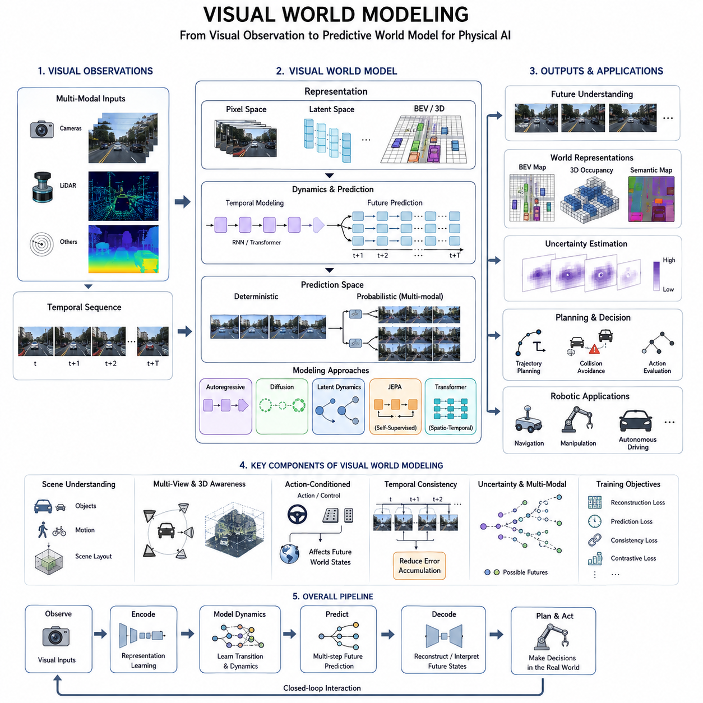
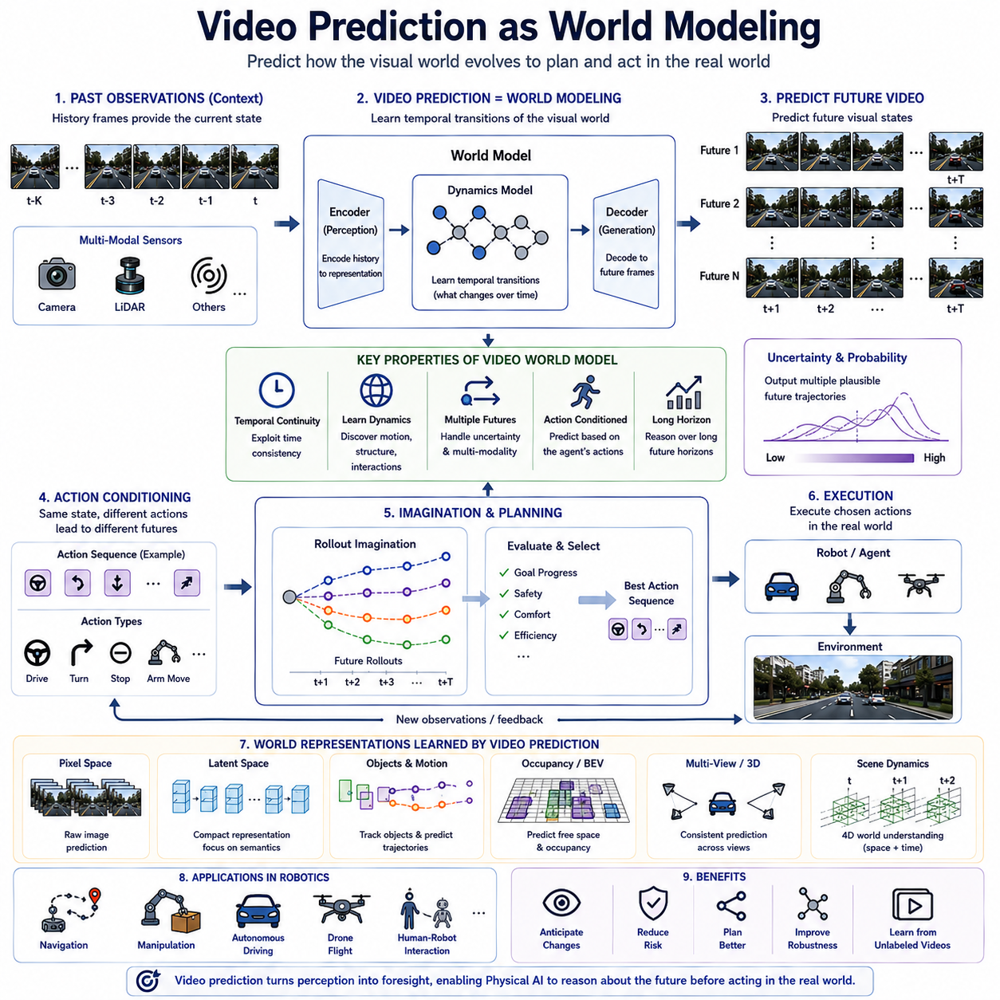
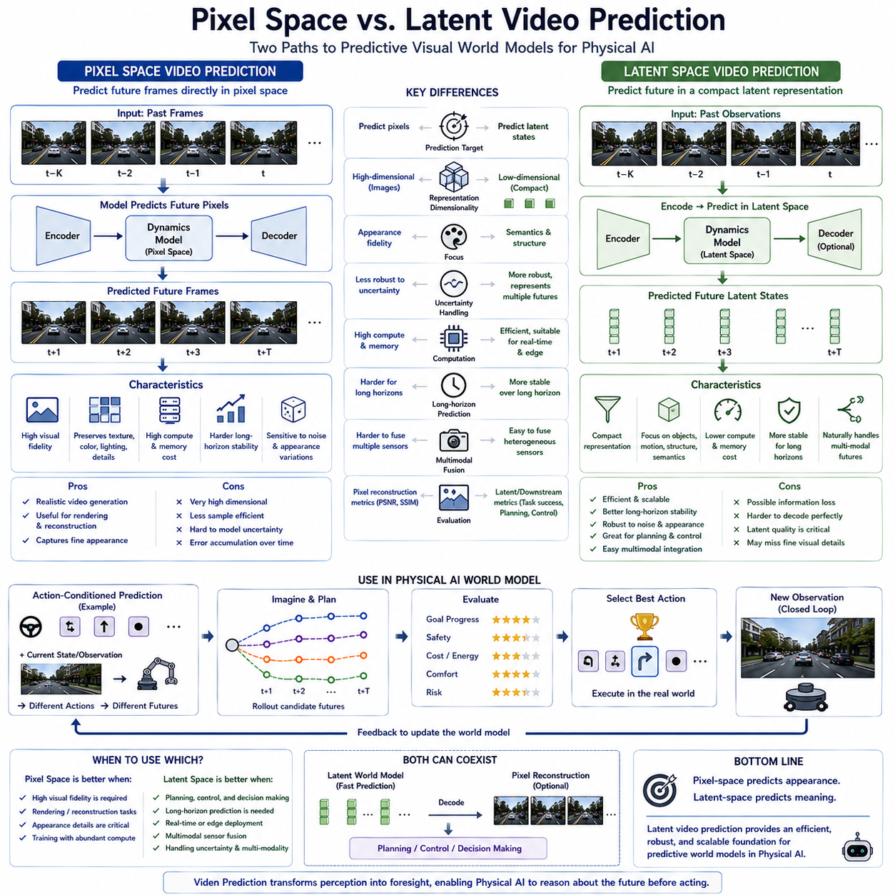
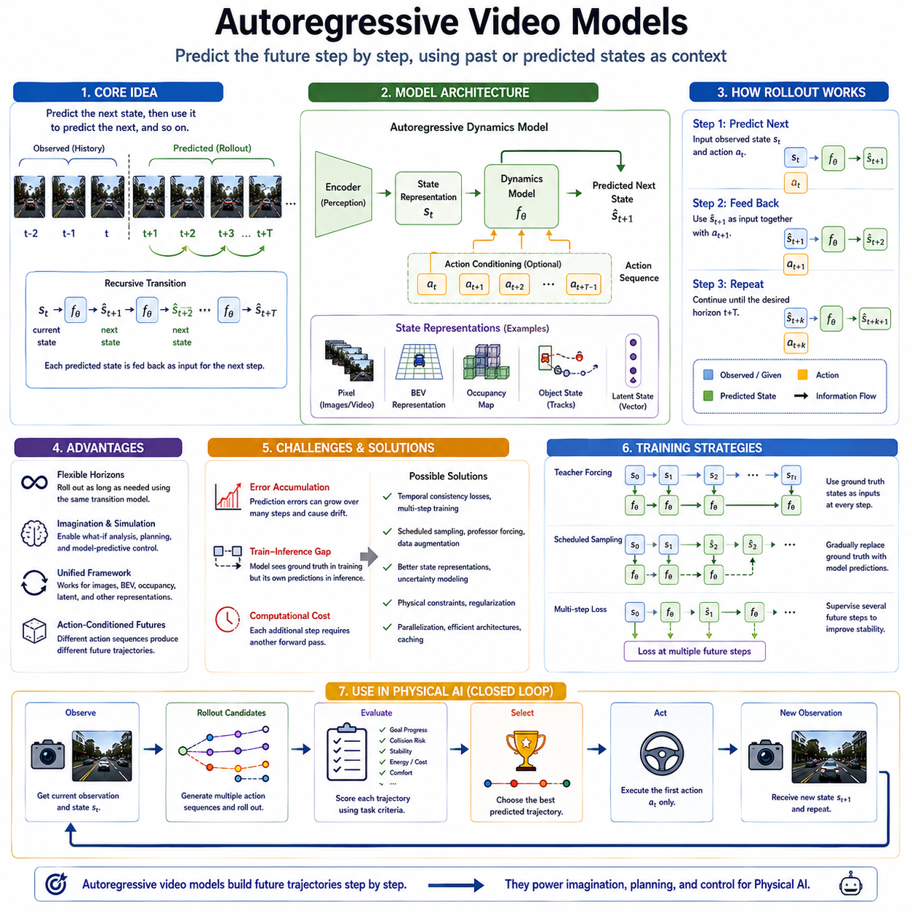
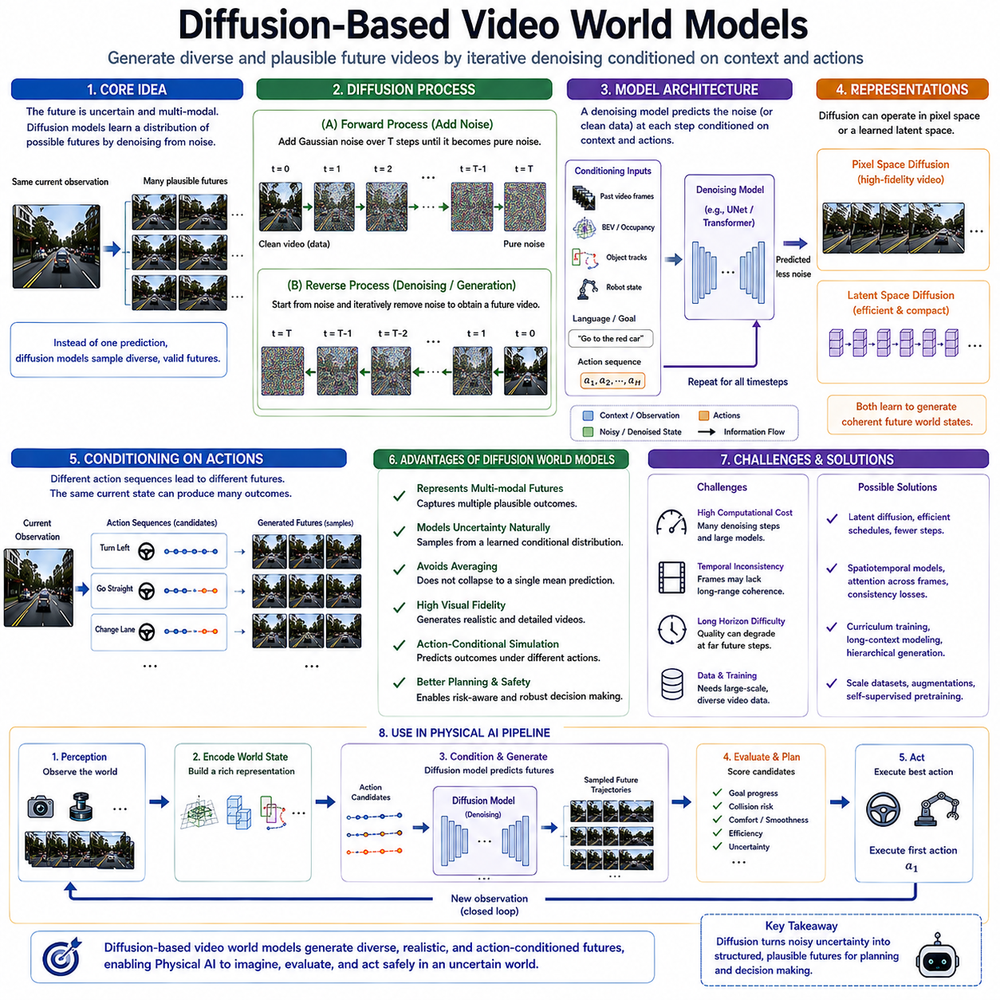
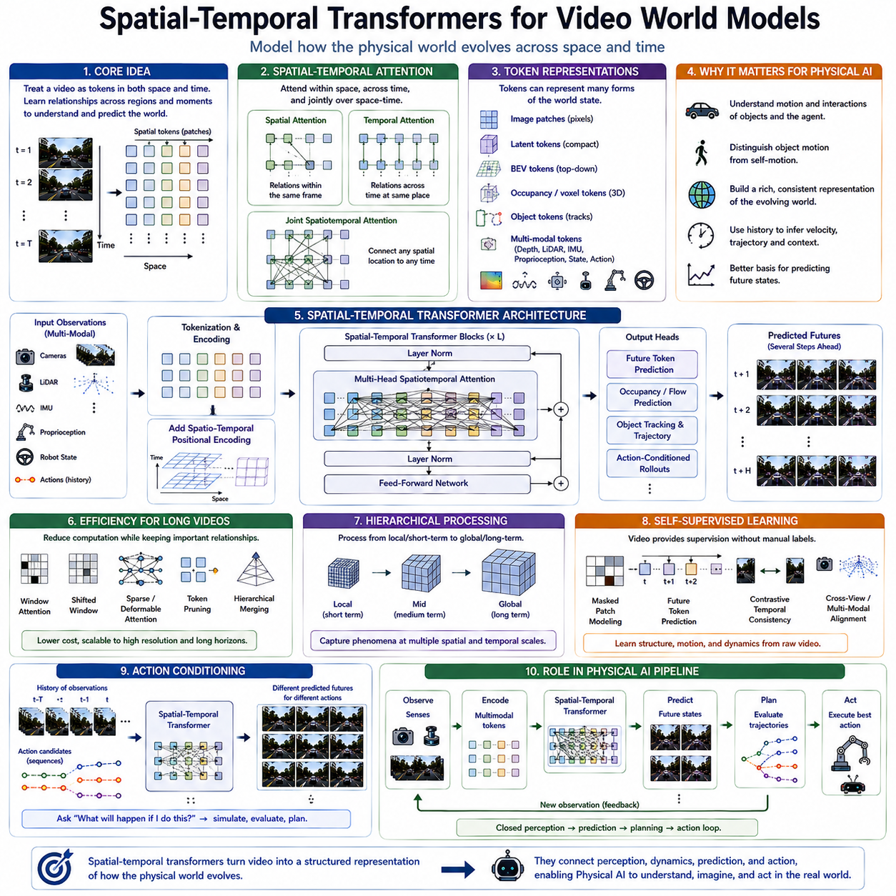
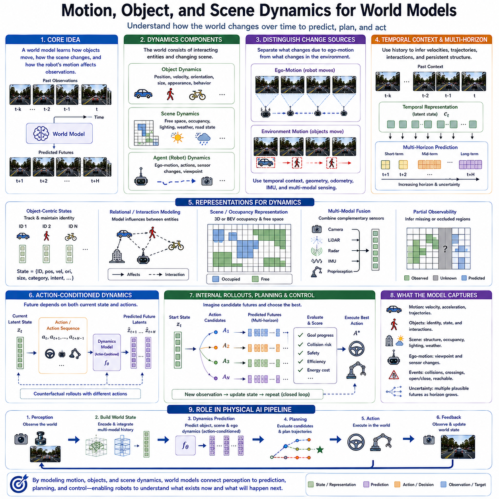
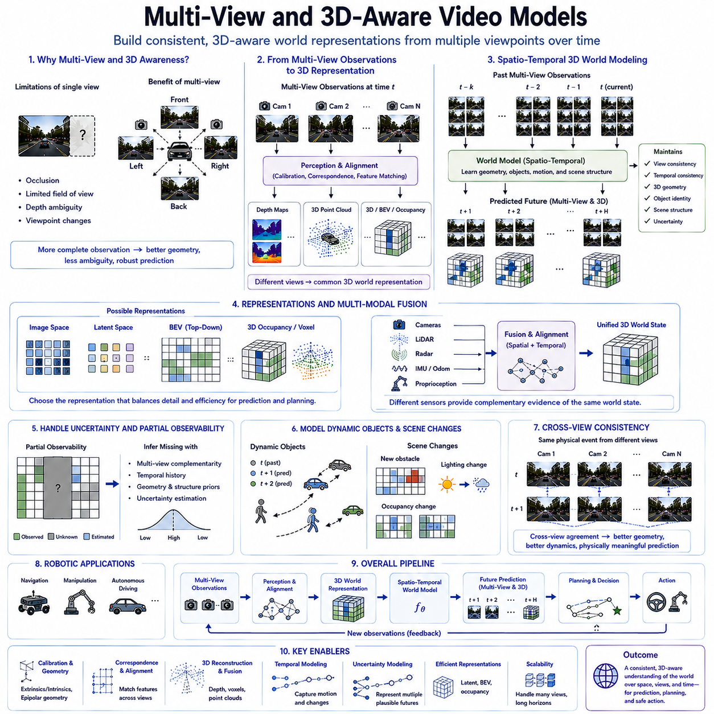
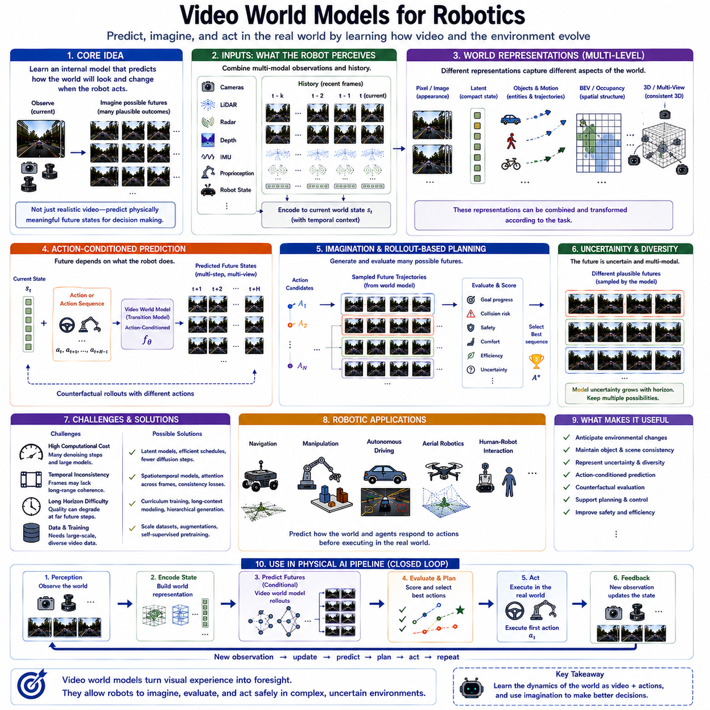
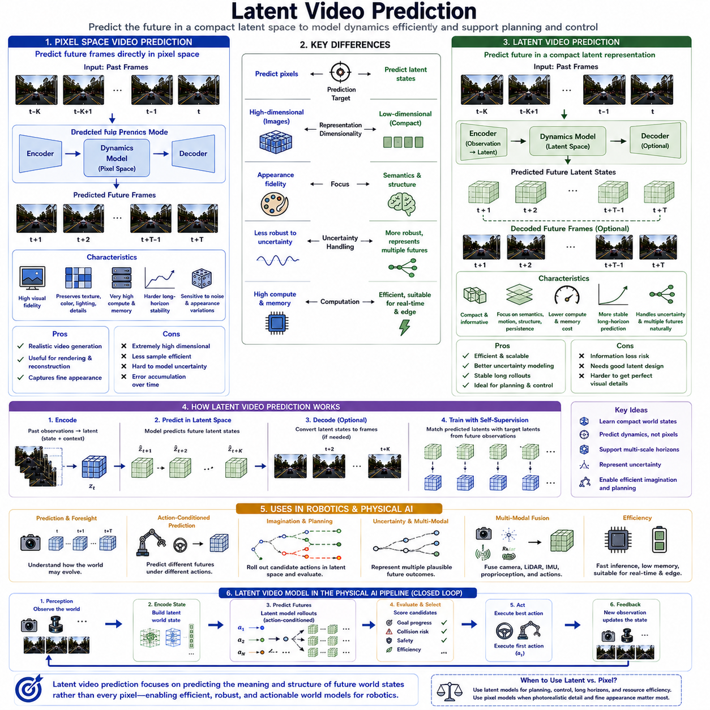

**Volume 07. World Models for Physical AI**

# Chapter 07. Video and Vision World Models

## 07.01. Visual World Modeling

{width="7.268055555555556in" height="7.268055555555556in"}

Visual world modeling treats visual observation not simply as an input for recognition, but as a continuous source from which an agent constructs an internal representation of the physical world. A robot observes images or video, extracts spatial and semantic structure, and uses temporal continuity to infer how the environment changes. In this perspective, vision becomes part of a world model that represents objects, surfaces, motion, and scene relationships while maintaining information useful for prediction and action. This establishes a bridge from visual perception toward an internal, predictive model of the environment.

A visual world model must represent both what is currently visible and what can reasonably be expected to happen next. A single image provides only a partial observation of the physical state, because objects may be occluded, motion may be ambiguous, and depth or future behavior may not be directly observable. Temporal sequences therefore become essential. By comparing observations across time, the model can estimate scene dynamics, object motion, camera motion, and persistent environmental structure. Visual modeling consequently becomes a problem of maintaining a temporally coherent representation rather than independently interpreting individual frames.

Video provides a richer basis for world modeling because it contains information about temporal transitions and physical consequences. Instead of learning only the correspondence between an image and a label, the model can learn how visual states evolve from one moment to another. This enables next-state prediction, multi-step prediction, and reasoning about motion and scene dynamics. The resulting model can potentially anticipate whether an object will move, whether free space will disappear, or whether the robot\'s own motion will change the future observation. Such prediction transforms vision from passive observation into a mechanism for anticipating environmental change.

The representation used by a visual world model can exist either in pixel space or in a more compact latent space. Pixel-space prediction attempts to reconstruct future visual observations directly and therefore preserves detailed appearance information, but it can require substantial computation and may devote capacity to visually insignificant details. Latent prediction instead encodes observations into a learned representation and predicts future states within that representation space. For Physical AI, this distinction is important because the world model does not necessarily need to reproduce every pixel; it needs to preserve the spatial, temporal, semantic, and dynamic information required for prediction, planning, and action.

Autoregressive visual models generate future states sequentially, using previous predictions as context for subsequent predictions. This structure naturally represents temporal evolution, but prediction errors can accumulate as the horizon becomes longer. A small error in one predicted state can influence the next prediction and progressively distort later states. Multi-step training, temporal consistency objectives, and appropriate latent representations can therefore become important for maintaining useful predictions over longer horizons. The objective is not merely to produce visually plausible frames, but to preserve a physically meaningful trajectory of world states.

Diffusion-based video world models provide another approach to future visual prediction by modeling the distribution of possible future observations rather than assuming a single deterministic outcome. This is particularly relevant when the future is inherently uncertain or multimodal. A pedestrian may move in several plausible directions, another robot may choose different trajectories, or an object may interact with the environment in more than one possible way. A generative model can represent these alternatives, allowing a world model to express multiple possible futures instead of collapsing uncertainty into one prediction.

Spatial-temporal Transformers provide a natural architecture for modeling relationships across both space and time. Visual observations contain spatial dependencies between image regions and temporal dependencies between successive observations. Attention mechanisms can therefore connect relevant regions and moments while building a representation of scene evolution. For Physical AI, this allows the model to integrate object appearance, relative position, motion, and temporal context within a common predictive architecture. The resulting representation can support reasoning about how objects and scenes change rather than treating every observation as an isolated visual sample.

Motion, objects, and scene dynamics form another important layer of visual world modeling. A useful model must distinguish persistent environmental structure from transient motion and understand how individual objects relate to the surrounding scene. Static structures such as roads, walls, buildings, and terrain provide spatial context, while dynamic entities such as vehicles, pedestrians, and other robots introduce changing states. Modeling these components together allows the world model to represent interactions between objects and the environment, which is essential when future states depend on both external motion and the agent\'s own behavior.

Multi-view and 3D-aware video modeling extend visual world modeling beyond a single camera perspective. Multiple cameras provide complementary observations that can reduce occlusion and improve spatial understanding, while 3D-aware representations can preserve geometric relationships that are difficult to infer from individual images alone. This is particularly relevant for mobile robots and autonomous vehicles, where the visual world is observed from several viewpoints and where the agent must maintain a consistent understanding of its surroundings while moving. A world model therefore benefits from representations that remain coherent across viewpoints, time, and changing camera poses.

For robotics, visual world modeling becomes most valuable when visual prediction is connected to physical interaction. The robot does not merely observe the environment; it moves through it and changes it through its actions. A useful visual world model must therefore provide information that can support navigation, manipulation, collision avoidance, trajectory evaluation, and decision making. Video prediction can serve as an internal simulation of possible future observations, while latent representations can provide a more efficient state space for reasoning. This creates a direct connection between visual perception, world-state prediction, planning, and control.

The overall role of visual world modeling within Physical AI is therefore broader than conventional computer vision. It provides a temporal and predictive layer between raw visual observations and physical action. The model receives visual evidence, builds a representation of the current world, maintains temporal context, predicts possible future states, and supplies those predictions to downstream planning and control processes. Within the broader World Model architecture, visual modeling complements BEV representations, occupancy prediction, multimodal sensing, action-conditioned dynamics, uncertainty estimation, and planning. The central objective is to transform continuous visual experience into a predictive internal model that remains useful for physical decision making.

## 07.02. Video Prediction as World Modeling

{width="7.268055555555556in" height="7.268055555555556in"}

Video prediction can be understood as a direct formulation of world modeling in which a model learns how visual observations evolve over time. Instead of treating each image as an independent perception result, the model receives a sequence of past frames and attempts to predict future visual states. This transforms temporal continuity in video into a learning signal for understanding environmental dynamics. For Physical AI, the objective is not simply to generate visually realistic images, but to learn which aspects of the observed world persist, change, interact, and become relevant for future decisions.

The basic formulation begins with a sequence of observations such as frames at time t, t+1, and t+2, from which the model predicts frames at future times. The historical frames provide context about the current scene, while the predicted sequence represents a possible future evolution of that scene. In a world-model interpretation, the predicted frames are therefore not merely images but estimates of future world states expressed through visual observations. The model learns temporal transitions that connect the present observation to future observations, creating an internal mechanism for anticipating environmental change.

The value of video prediction comes from the fact that physical environments contain strong temporal regularities. Roads, buildings, terrain, and other static structures tend to persist, while vehicles, pedestrians, robots, and other objects change their positions and states according to their motion and interactions. A sufficiently capable model can learn these patterns from large quantities of video without requiring every frame to be manually labeled. Temporal continuity itself becomes a source of supervision, allowing the model to discover representations of motion, scene structure, object persistence, and environmental dynamics from naturally occurring visual sequences.

A central challenge is that the future is often not uniquely determined by the past observations. A pedestrian may continue walking, stop, or change direction, while another vehicle may accelerate, brake, or turn. Consequently, a useful video world model should be able to represent multiple plausible futures rather than producing only one deterministic continuation. Probabilistic or multimodal prediction can express this uncertainty by generating alternative future trajectories or visual states. This capability is particularly important for Physical AI because planning and decision making must consider possible outcomes rather than assuming that one predicted future is certain.

Video prediction can also be conditioned on the actions of the physical agent. The same visual state may evolve differently depending on whether a robot accelerates, turns, stops, moves an arm, or follows another trajectory. Action-conditioned prediction therefore extends the world model from passive forecasting toward causal interaction with the environment. Given the current visual context and a candidate action sequence, the model can predict how the visual world may evolve. This creates the foundation for imagination-based planning, in which alternative actions can be evaluated internally before the robot commits to them in the physical world.

The representation of future video can be constructed directly in pixel space or through a learned latent representation. Pixel-space prediction attempts to reproduce future images and can preserve detailed visual information, but it must model many factors that may have little importance for physical decision making, including texture, lighting, sensor noise, and fine appearance details. Latent prediction instead focuses on a compact representation of meaningful structure. For Physical AI, this can be advantageous because the world model can concentrate computational resources on geometry, motion, objects, interactions, and other information required for reasoning and control.

Different model architectures provide different mechanisms for learning temporal evolution. Autoregressive models predict future states sequentially, using previous predictions as context for subsequent predictions. This naturally represents temporal dependencies but can suffer from error accumulation over long prediction horizons. Diffusion-based approaches model distributions over possible future observations and can represent complex multimodal futures, although they may require substantial computation. Recurrent models explicitly maintain temporal state, while Transformer-based architectures use attention to connect information across space and time. Latent dynamics models and self-supervised predictive architectures such as JEPA provide another approach by predicting representations rather than reconstructing every future pixel.

Long-horizon prediction is especially important when video prediction becomes part of a Physical AI world model. A model that predicts only the immediately following frame may capture short-term appearance changes without learning the persistent structure required for planning. As the prediction horizon increases, however, small errors can accumulate and cause the predicted sequence to drift away from physically meaningful behavior. Training objectives therefore need to encourage temporal consistency and stable representations across multiple future steps. The model should preserve important structure over time even when precise pixel-level prediction becomes increasingly uncertain.

Video prediction can support several levels of world understanding. At the visual level, it can forecast future images and changes in appearance. At the object level, it can represent where objects may move and how their relationships may change. At the scene level, it can anticipate changes in free space, occupancy, viewpoints, and environmental structure. At the decision level, predicted futures can be used to evaluate candidate trajectories and actions. This creates a hierarchy in which visual prediction becomes an intermediate representation connecting perception with planning and control rather than remaining an isolated computer vision task.

For robotics, the practical value of video prediction lies in its ability to provide an internal simulation of possible future observations. A mobile robot can use past camera observations to anticipate changes along a planned route, while a manipulator can predict how objects and visual relationships may change during interaction. An autonomous vehicle can forecast the evolution of surrounding traffic and evaluate whether a planned maneuver remains safe. In each case, the model provides a mechanism for reasoning about consequences before physical action occurs, reducing the need to discover every consequence through direct trial and error.

The broader significance of video prediction is therefore its role in transforming perception into foresight. A conventional perception system primarily answers what is visible now, whereas a predictive world model attempts to estimate what the world may look like next and how it may evolve under different conditions. The resulting predictions can support anticipation, risk assessment, trajectory planning, action evaluation, and adaptive control. Within the broader World Model architecture, video prediction connects naturally with latent dynamics, BEV and occupancy representations, action-conditioned models, uncertainty estimation, and planning. Its ultimate purpose is not to generate video for its own sake, but to provide a predictive internal model that enables Physical AI systems to reason about the future before acting in the real world.

## 07.03. Pixel Space vs Latent Video Prediction

{width="7.268055555555556in" height="7.268055555555556in"}

Pixel-space video prediction and latent-space video prediction represent two fundamentally different strategies for building a predictive visual world model. Pixel-space prediction attempts to reconstruct or generate future images directly, preserving detailed appearance information such as texture, lighting, color, and fine visual structure. Latent-space prediction first converts observations into a compact learned representation and then predicts how that representation evolves over time. The central distinction is therefore whether the world model predicts future pixels or future representations of the physical state.

Pixel-space prediction has the advantage of retaining rich visual information because the prediction target is the actual image or video observation. This makes it suitable when visual fidelity itself is important, such as realistic video synthesis, detailed scene reconstruction, or applications where appearance contains essential information. However, the model must also learn to predict many variations that may have little importance for physical reasoning, including illumination changes, texture details, sensor noise, and small pixel-level variations. As a result, considerable model capacity and computation can be spent reproducing visual details rather than understanding the underlying physical structure.

Latent-space prediction takes a different approach by encoding observations into a lower-dimensional representation that is intended to preserve the information most relevant to the world model. Instead of predicting every future pixel, the model predicts a future latent state that captures meaningful properties such as object identity, spatial relationships, motion, scene structure, and temporal evolution. This creates an information bottleneck between observation and prediction. If the learned latent space is well designed, irrelevant visual variation can be discarded while information needed for prediction, planning, and control is retained.

The difference becomes especially important when the future is uncertain. Exact future pixels may be impossible to predict because lighting, texture, sensor noise, and small environmental changes introduce substantial variation even when the underlying physical state remains similar. A latent representation can focus instead on stable structure and common dynamics across these visually different outcomes. Rather than attempting to predict every pixel precisely, the model can represent the important aspects of possible futures and maintain a more stable prediction as the temporal horizon becomes longer.

Computational efficiency is another major consideration. Pixel-space video prediction generally operates over very high-dimensional data because each frame contains a large number of pixels and multiple color or sensor channels. Predicting many frames therefore requires substantial computation, memory, and bandwidth. Latent representations can be much smaller than raw images, allowing temporal dynamics to be modeled in a more compact space. For Physical AI, this reduction can be particularly valuable because world-model inference may need to operate repeatedly during navigation, planning, and control under real-time and edge-computing constraints.

Latent-space prediction also provides a natural foundation for multimodal world modeling. Camera images, LiDAR, depth, radar, IMU measurements, actions, and proprioceptive information have very different raw structures, making direct prediction across all modalities difficult. These heterogeneous observations can instead be encoded into compatible latent representations. The world model can then learn temporal transitions within a shared predictive space. This makes latent modeling useful for constructing a unified internal representation of the physical world rather than maintaining completely separate predictive systems for every sensor modality.

A useful latent space must nevertheless satisfy demanding requirements. Excessive compression can remove information that is necessary for distinguishing physically different states, while insufficient compression can preserve too much irrelevant visual variation. The model therefore needs an information bottleneck that is neither too broad nor too narrow. Similar physical states should have related representations, while meaningful changes in geometry, motion, object relationships, and environment state should remain distinguishable. The quality and geometry of the latent space consequently become fundamental to the usefulness of the resulting world model.

Representation collapse is another important concern in latent prediction. If different observations are mapped to nearly identical representations, the predictor may appear stable while losing the ability to distinguish important world states. A useful latent space must therefore maintain sufficient variance, diversity, and structure. Training objectives, normalization strategies, asymmetric encoders, and appropriate prediction targets can help preserve meaningful information. The objective is not merely to make latent predictions numerically similar, but to create a representation in which temporal changes correspond to meaningful changes in the physical world.

The choice of prediction target can also determine what the model learns. Future time steps can be predicted to capture temporal dynamics, masked regions can be predicted to encourage spatial reasoning, different viewpoints can be related to build multi-view understanding, and different sensor modalities can be connected through a shared representation. These strategies allow prediction to become a self-supervised learning mechanism rather than requiring complete manual annotation. The model learns from the structure of observations themselves, using missing, future, or alternative representations as prediction targets.

For Physical AI, latent video prediction becomes particularly powerful when combined with action-conditioned dynamics. A current latent state can be combined with a candidate action sequence, and the world model can predict how the latent state may evolve under those actions. Multiple future rollouts can then be generated and compared according to cost, reward, risk, goal compatibility, or other planning criteria. This transforms latent prediction into an internal simulation mechanism. The robot can therefore evaluate possible futures in representation space before executing an action in the physical environment.

The relationship between pixel-space and latent-space prediction should therefore not be understood as a simple choice between a good method and a bad method. Pixel prediction provides detailed visual reconstruction and can be valuable when appearance fidelity matters, while latent prediction emphasizes compact, semantically meaningful, and computationally efficient representations for reasoning. Generative video models typically need to model appearance, texture, lighting, and noise, whereas latent predictive architectures can concentrate more directly on structure and dynamics. In a Physical AI system, both approaches may coexist, with pixel-space generation supporting visual reconstruction and latent prediction serving as the core predictive representation for reasoning and control.

The broader significance of this distinction is that a world model does not necessarily need to reproduce the entire visible world in order to understand and predict it. For Physical AI, the more important question is whether the learned representation preserves the information required to anticipate changes, understand objects and motion, reason about alternative futures, and support planning and control. A compact latent world model can therefore provide a practical bridge between high-dimensional perception and physical decision making, especially when long-horizon prediction, multimodal sensing, uncertainty, and real-time computation must be handled together.

## 07.04. Autoregressive Video Models

{width="7.268055555555556in" height="7.268055555555556in"}

Autoregressive video models predict future visual states sequentially, using the state predicted at one time step as part of the input for the next. Instead of generating an entire future sequence independently, the model repeatedly applies a learned transition function to extend the prediction horizon. Given a current state s_t, it estimates the next state ŝ_{t+1}, then uses that prediction to estimate ŝ_{t+2}, and continues until the desired horizon is reached. This simple recursive structure turns a local prediction model into a mechanism for generating future trajectories.

The essential characteristic of autoregressive prediction is the feedback of model predictions into subsequent prediction steps. During the first transition, the model receives an observed state and predicts the next state. During later transitions, the input increasingly contains states generated by the model itself rather than directly observed states. This enables a model trained for short-term transitions to perform multi-step rollout and approximate long-term evolution. In video world modeling, the predicted state may be a complete image, a video representation, a BEV state, an occupancy representation, an object state, or another learned latent representation.

Autoregressive video modeling can also incorporate actions into the transition process. Instead of representing the transition simply as s_{t+1}=f(s_t), the model can use the current state together with an action, producing a relationship such as ŝ_{t+1}=f(s_t,a_t). The next prediction can then depend on both the predicted state and the next action. This allows different action sequences applied to the same current visual state to produce different future trajectories. For Physical AI, this creates a direct connection between perception, action, future prediction, and internal simulation.

The state represented by an autoregressive model does not have to remain in raw pixel space. Images and video can be predicted directly, but the same sequential mechanism can operate over BEV representations, occupancy maps, object tracks, robot poses, semantic features, or latent states. This flexibility allows autoregressive prediction to serve as a general temporal modeling mechanism across different world-state representations. In a Physical AI architecture, the visual encoder can therefore transform observations into a state representation, while the autoregressive dynamics model repeatedly predicts how that representation will evolve.

One major advantage of autoregressive modeling is its flexibility across prediction horizons. The model does not necessarily need a separate output head for every possible future horizon because the same transition mechanism can be applied repeatedly. A short rollout can generate only a few future steps, while a longer rollout can continue the same process for many steps. This makes the approach particularly suitable for imagination, simulation, planning, model-predictive control, and what-if analysis. The same learned transition model can therefore support different temporal requirements without fundamentally changing its structure.

The main difficulty is error accumulation. At the first prediction step, the model operates on an observed state, but later predictions increasingly depend on states that contain previous prediction errors. Small inaccuracies in position, motion, object appearance, or scene structure can therefore propagate through the rollout and become larger over time. Long-horizon prediction may eventually drift away from physically meaningful behavior. Temporal consistency objectives, multi-step training, suitable state representations, uncertainty modeling, and physical constraints can help reduce this accumulation and maintain useful predictions.

Training strategy strongly influences the stability of autoregressive rollouts. Teacher forcing can train the model using ground-truth history as the input for each prediction step, which provides stable training signals but creates a difference between training and inference. During actual rollout, the model must consume its own predictions, so it encounters states that may not have appeared during training. Scheduled sampling can gradually replace ground-truth inputs with model predictions, while multi-step training can directly supervise several future predictions. These approaches attempt to reduce the gap between training behavior and long autoregressive inference.

Autoregressive rollouts become particularly useful when combined with planning. A Physical AI system can provide the world model with several candidate action sequences and use the model to predict the corresponding future trajectories. Each rollout can then be evaluated according to goal progress, collision risk, stability, energy or computational cost, comfort, or other task constraints. The system can select the best predicted sequence and execute only the appropriate immediate action before observing the new state. The process then repeats, creating a closed-loop cycle of observe, predict, evaluate, act, and replan.

This structure is closely related to model-predictive control because the world model provides an internal mechanism for evaluating possible consequences before physical execution. Instead of testing every candidate action directly in the real environment, the system can simulate their likely outcomes within the learned model. This can support trajectory evaluation, risk assessment, safety reasoning, and what-if analysis. The value of autoregressive prediction therefore extends beyond video generation: it provides a computational space in which the agent can imagine possible futures and select actions based on predicted consequences.

There is an important computational trade-off between autoregressive sequential prediction and direct multi-horizon prediction. Autoregressive models are flexible because they can extend the prediction horizon through repeated application of the same transition function, but each additional step requires another prediction and therefore increases inference latency. Direct multi-horizon models can predict several future states in parallel and may provide faster inference, but they can be less flexible across different horizons and may require more specialized prediction structures. The choice therefore depends on the balance among flexibility, accuracy, horizon length, and real-time requirements.

Within Physical AI, autoregressive video modeling can be understood as a bridge between perception and foresight. Perception observes the current world, the autoregressive world model predicts how that world may evolve, and planning uses those predicted trajectories to evaluate possible actions before execution. When combined with memory, action conditioning, uncertainty estimation, multimodal sensing, and physical knowledge, autoregressive prediction becomes more than sequential video generation. It becomes a mechanism for internal imagination that allows an embodied system to predict, evaluate, and act while continuously updating its understanding from new observations.

## 07.05. Diffusion Based Video World Models

{width="7.268055555555556in" height="7.268055555555556in"}

Diffusion-based video world models generate possible future visual states by learning a gradual denoising process rather than predicting the future in a single deterministic step. The model begins with a noisy representation and repeatedly removes noise until a structured future video or latent visual state emerges. This approach is attractive for world modeling because the future of a physical environment is rarely unique. Different trajectories, object motions, and interactions may all be plausible, allowing the model to represent a distribution of possible futures rather than forcing every situation into one prediction.

The diffusion process can be understood through two complementary directions. During training, a clean video sequence or future state is progressively corrupted by adding noise over multiple steps until it approaches a simple noise distribution. The model learns how to reverse this process by predicting the information needed to remove noise at each step. During generation, the process starts from random noise and repeatedly applies the learned denoising transformation. The final result is a structured video sequence representing one sample from the learned distribution of possible future observations.

For a video world model, the generated sequence should represent more than visual appearance. It should preserve meaningful properties of the physical environment, including objects, spatial relationships, motion, scene structure, and temporal continuity. A diffusion model can therefore operate directly in pixel space or within a learned latent representation. Pixel-space diffusion can generate detailed visual futures, while latent diffusion can focus computational capacity on compact representations of the underlying world state. This distinction connects diffusion-based video modeling directly with the broader pixel-space versus latent-space design choice.

One important advantage of diffusion-based prediction is its ability to represent multimodal futures. Given the same current observation, a pedestrian may move in several directions, a vehicle may select different lanes, or another robot may execute different valid behaviors. A deterministic predictor tends to compress these possibilities into a single expected outcome, which may not correspond to any physically realistic trajectory. Diffusion instead samples from a learned distribution, allowing several plausible futures to be generated. This provides a natural mechanism for representing uncertainty and diversity in world-model prediction.

The conditioning information determines which future distribution the diffusion model generates. Current video frames can provide the visual context, while additional information such as BEV representations, occupancy states, object tracks, depth, LiDAR, robot state, or language can guide generation. Most importantly for Physical AI, actions can also become conditioning variables. A candidate steering command, velocity, arm movement, or navigation action can influence the predicted future. The same current world state can therefore produce different generated futures when conditioned on different actions.

Action conditioning turns diffusion-based video generation into an interactive world-model mechanism. Instead of asking only what the environment will look like next, the model can be asked what the environment may look like if a particular action is executed. Multiple candidate action sequences can be supplied, and the diffusion model can generate corresponding future trajectories. These predicted outcomes can then be compared for safety, goal progress, collision risk, efficiency, or other task criteria. The world model consequently becomes an internal simulator for evaluating possible consequences before the robot acts.

A major difference from autoregressive video prediction is the way future states are generated. An autoregressive model typically generates one step after another, feeding each prediction into the next step. Diffusion models instead construct a complete sample through iterative refinement from noise. This can reduce some forms of sequential error propagation because the generation process is not simply a chain in which every future frame must directly depend on the previous generated frame. However, diffusion still requires multiple denoising operations, and maintaining temporal consistency across a long video remains a significant modeling challenge.

Temporal consistency is therefore a central requirement for diffusion-based video world models. Individual generated frames may appear realistic while the overall sequence violates physical continuity. Objects can change shape unexpectedly, trajectories can become inconsistent, or scene geometry can drift between frames. A useful world model must constrain the generation process so that motion, object identity, spatial relationships, and environmental structure remain coherent across time. Spatiotemporal architectures, latent dynamics, attention across multiple frames, and appropriate temporal objectives can help the diffusion process generate futures that are not merely realistic frame by frame but coherent as evolving world states.

Diffusion models can also be integrated with learned latent dynamics to improve efficiency. Instead of applying the diffusion process directly to high-resolution video, observations can first be encoded into compact latent tokens or feature representations. The diffusion process then operates within this lower-dimensional space, where future dynamics can be modeled more efficiently. A decoder can optionally transform the generated latent state back into visual observations. This architecture separates the problem of representing the world from the problem of generating detailed appearance and can make diffusion-based world modeling more practical for Physical AI systems.

Uncertainty is another important reason to use diffusion for world modeling. The physical future contains both predictable and unpredictable components, and the model should not always express high confidence in a single outcome. By sampling multiple trajectories from the learned conditional distribution, a diffusion world model can expose alternative futures to the planning system. These samples can be interpreted as possible outcomes rather than guaranteed predictions. Planning can then consider not only the most likely future but also less probable outcomes that may contain significant safety risks, allowing uncertainty to influence decision making.

The computational cost of diffusion is an important limitation. Generating a future sequence generally requires multiple denoising steps, and each step may require a substantial neural-network evaluation. High-resolution video increases this burden further. For Physical AI, where prediction may need to operate repeatedly on an edge or onboard computing platform, this can become a critical constraint. Latent diffusion, efficient denoising schedules, reduced sampling steps, model compression, and alternative generation methods can therefore become important engineering strategies when deploying diffusion-based world models in real-time robotic systems.

Within a complete Physical AI architecture, diffusion-based video prediction can form the generative future-modeling layer between perception and planning. Current observations are encoded into a world representation, candidate actions or contextual information condition the generative model, and diffusion generates one or more possible future trajectories. A planner evaluates these futures and selects an appropriate action, which is then executed in the physical environment. New observations are fed back into the system, updating the world state and initiating another prediction cycle. In this form, diffusion provides not simply video generation, but a probabilistic imagination mechanism for reasoning about possible physical futures before acting.

## 07.06. Spatial Temporal Transformers

{width="7.268055555555556in" height="7.268055555555556in"}

Spatial-temporal Transformers extend the Transformer architecture from static visual understanding to the joint modeling of space and time. A conventional vision model may analyze the spatial relationships within a single image, while a spatial-temporal Transformer treats a sequence of observations as a unified set of tokens distributed across both spatial and temporal dimensions. For world modeling, this allows the model to learn not only where objects and structures are located, but also how their relationships change over time. The resulting representation can connect visual perception with temporal prediction and physical reasoning.

A video can be represented as a collection of spatial patches or visual tokens extracted from successive frames. Instead of processing each frame independently, the tokens are associated with both spatial position and temporal position, creating a spatiotemporal token space. Attention can then connect information within the same frame, across different regions, or between corresponding regions at different moments. This enables the model to relate an object observed at time t with its previous and future appearances, providing a mechanism for learning persistence, motion, interaction, and scene evolution.

The central operation is attention over spatiotemporal tokens. Spatial attention captures relationships between regions of a scene, while temporal attention captures dependencies between observations across time. These two dimensions can be modeled jointly or through separate stages that are subsequently combined. Joint attention provides expressive modeling of complex interactions but can become computationally expensive as both image resolution and video length increase. Efficient architectures therefore often restrict attention to local regions, selected tokens, or structured temporal windows while attempting to preserve the relationships most important for world modeling.

For Physical AI, spatial-temporal attention is particularly useful because physical events are inherently distributed across space and time. A moving vehicle occupies a changing spatial region, a pedestrian follows a trajectory, and a robot\'s own motion changes the camera viewpoint while the surrounding environment remains relatively stable. The Transformer can integrate these patterns into a shared representation, helping distinguish object motion from self-motion and temporary visual changes from persistent scene structure. This provides a richer basis for predicting future states than treating each video frame as an independent observation.

Spatial-temporal Transformers can operate on several forms of representation. Raw image patches provide detailed visual information, while latent tokens provide a more compact representation for efficient prediction. BEV tokens can encode the environment in a common spatial coordinate system, and occupancy or voxel tokens can represent three-dimensional structure. Object-centric tokens can represent tracked entities and their trajectories. These representations can also be combined with depth, LiDAR, IMU, proprioception, robot state, or action tokens, allowing the Transformer to construct a multimodal temporal representation of the physical world.

Temporal modeling is especially important for world-model prediction because the current observation alone may be insufficient to determine the physical state. A single image may not reveal whether an object is stationary, accelerating, approaching, or moving away. A sequence provides the evidence required to infer velocity, trajectory, interaction, and temporal context. Spatial-temporal attention allows information from earlier observations to influence the interpretation of the current state. The model can therefore construct a state representation that incorporates recent history rather than relying only on the latest frame.

Long video sequences create a major computational challenge because standard self-attention scales with the number of tokens. Increasing image resolution increases the number of spatial tokens, while increasing the video duration increases the number of temporal tokens. When both grow simultaneously, full attention can become prohibitively expensive for real-time Physical AI. Efficient mechanisms such as window attention, shifted windows, sparse attention, deformable attention, token pruning, and hierarchical token merging can reduce this burden. These approaches attempt to retain important spatial-temporal relationships while reducing unnecessary computation.

Hierarchical processing provides another way to improve scalability. Early layers can operate on local visual features and short temporal contexts, while deeper layers progressively combine information into larger spatial regions and longer temporal horizons. Token merging can reduce redundant information as representations become more abstract, while temporal aggregation can preserve persistent information without maintaining every frame at full resolution. Such hierarchical processing is useful for world models because different physical phenomena operate at different scales, from rapid local motion to slowly changing scene structure and long-horizon environmental evolution.

Spatial-temporal Transformers can also support self-supervised learning because temporal video data naturally provides prediction targets. The model can be trained to reconstruct masked spatial regions, predict future tokens, maintain consistent representations across time, or relate observations from different viewpoints. These objectives encourage the model to learn useful structure without requiring dense manual labels for every frame. In a world-model setting, the goal is not merely to recognize objects but to learn representations that preserve motion, geometry, temporal continuity, and information needed for future-state prediction.

Action conditioning extends the spatial-temporal representation from passive observation toward interactive world modeling. Candidate actions can be represented as additional tokens or conditioning information and integrated with visual history. The model can then estimate how the spatial-temporal state may evolve under different actions. For example, alternative steering commands may produce different future trajectories, while a manipulator action may change the position and appearance of an object. This creates a foundation for generating candidate rollouts, comparing their predicted consequences, and selecting actions through planning before physical execution.

In robotics, spatial-temporal Transformers can form an important layer between multimodal perception and world-model-based planning. Camera, LiDAR, radar, IMU, proprioception, robot state, and action information can be aligned through spatial and temporal encoding before entering the Transformer. The resulting representation can support object tracking, motion forecasting, occupancy or flow prediction, scene understanding, and future-state estimation. A planner can then use these predictions to evaluate trajectories and actions. New observations continuously update the representation, creating a closed perception--prediction--planning--action loop.

The main challenge is therefore to balance expressive spatiotemporal reasoning with computational efficiency and temporal reliability. A useful model must preserve relationships that matter for physical behavior while avoiding unnecessary attention to redundant visual details. It must also maintain consistency across long sequences, tolerate missing or noisy observations, and operate within real-time latency and hardware constraints. Within the broader World Model architecture, spatial-temporal Transformers provide a flexible backbone for connecting visual observations, temporal dynamics, multimodal state representations, future prediction, and action-conditioned reasoning. Their importance lies in turning video from a sequence of independent images into a structured representation of how the physical world evolves through space and time.

## 07.07. Motion Object and Scene Dynamics

{width="7.268055555555556in" height="7.268055555555556in"}

Motion, objects, and scene dynamics form the central temporal structure that allows a visual world model to move beyond static scene understanding. A single observation describes what the environment looks like at one moment, but a physical agent must understand how objects move, how the scene changes, and how its own motion affects what it observes. A useful world model therefore separates persistent scene structure from dynamic entities and learns temporal relationships among the robot, objects, and environment. This provides the foundation for predicting future world states.

Object dynamics describe how individual entities change their position, velocity, orientation, appearance, and interaction state over time. Vehicles, pedestrians, robots, and manipulable objects may follow different motion patterns and respond differently to their surroundings. A world model can represent these entities explicitly through object-centric states or implicitly through learned features. Tracking an object\'s identity across observations is particularly important because prediction requires continuity: the model must understand that the object at time t+1 corresponds to the same entity observed at time t rather than treating every frame as an unrelated scene.

Scene dynamics describe changes that cannot be understood solely by tracking individual objects. Free space may become occupied, an obstacle may block a previously traversable region, lighting or weather may alter visual observations, and relationships among multiple entities may change. Scene dynamics therefore combine object motion with environmental structure and context. A world model must learn which aspects of the environment are persistent and which are changing, while maintaining a representation that remains coherent as the robot moves through the scene.

A particularly important problem is distinguishing ego-motion from environmental motion. When a robot or vehicle moves, the camera observes apparent motion even when buildings, roads, or other static structures remain stationary. At the same time, vehicles and pedestrians may move independently of the robot. The world model must therefore infer whether an observed change originates from the agent\'s own movement, from another object, or from an actual change in the environment. Temporal context, geometric relationships, odometry, IMU information, and multimodal sensing can help separate these sources of change.

Temporal context provides the evidence required to estimate motion and dynamics. A sequence of observations allows the model to infer velocity, acceleration, trajectory, interaction patterns, and persistent structure that cannot reliably be determined from a single frame. Recent observations can be encoded into a temporal representation and used to predict future states across multiple horizons. Short-term predictions can capture rapid motion and immediate interactions, while longer horizons can represent persistent scene structure and evolving environmental conditions. This temporal hierarchy is important for planning and control.

Object-centric and relational representations can make dynamics more explicit. Instead of representing the entire scene as an undifferentiated feature map, the world model can maintain states for individual entities and relationships among them. An object state may include identity, pose, velocity, category, size, orientation, and interaction state. Relationships can represent influences between agent and agent, agent and object, object and object, and the surrounding scene. Graph-based or attention-based mechanisms can then model how these entities affect one another and how their relationships evolve over time.

Physical AI also operates under partial observability, where important parts of the environment may be hidden or unavailable. An object may be temporarily occluded, a sensor may fail, or a region may not be visible from the current viewpoint. A capable dynamics model should therefore infer missing information from temporal history and complementary observations. Masked prediction and multimodal fusion can encourage the model to reconstruct or predict missing regions, while camera, LiDAR, radar, IMU, and proprioceptive information provide complementary evidence. The goal is to maintain a useful world state even when observations are incomplete or noisy.

Motion and scene dynamics should also be represented at multiple levels of abstraction. At a low level, dynamics may involve physical motion, contact, friction, wheel slip, or joint movement. At an intermediate level, the model can represent object trajectories, interactions, and behavioral patterns. At a higher level, it can represent events and semantic changes such as a road becoming blocked, a pedestrian crossing, or an object becoming reachable. A practical world model does not necessarily need to reproduce every physical variable; it should preserve the level of dynamics that is relevant to future prediction, planning, and control.

Action conditioning extends dynamics modeling from observation to interaction. The future state depends not only on how the environment naturally evolves but also on what the robot does. Given a current latent state and an action or action sequence, the dynamics model can predict corresponding future states. Different steering commands, navigation decisions, or manipulation actions can therefore produce different predicted trajectories. Counterfactual rollouts allow the system to ask what may happen under alternative actions without executing every alternative in the physical world, creating a direct connection between dynamics modeling and internal planning.

Multi-horizon prediction is necessary because different decisions require different temporal perspectives. Immediate collision avoidance may require very short-horizon motion prediction, while navigation and task planning may require much longer predictions. As the horizon increases, uncertainty generally grows and multiple future trajectories may become plausible. The world model should therefore preserve alternative hypotheses rather than collapsing all possibilities into one trajectory. Temporal consistency is also essential: object identity should remain stable, motion should remain compatible across steps, semantic transitions should be meaningful, and relationships should not change arbitrarily.

The practical objective is to connect motion, object, and scene dynamics to a closed-loop Physical AI system. Observations are converted into a structured world representation, temporal history provides context, and the dynamics model predicts how objects and the environment may evolve. Candidate futures can then be evaluated according to goal progress, collision risk, stability, energy cost, reachability, or task success. The system executes an appropriate action, receives new observations, updates its world state, and repeats the process. In this way, motion and scene dynamics become the bridge between perception and predictive planning, allowing the robot to understand not only what exists now, but how the physical world is likely to change next.

## 07.08. Multi View and 3D Aware Video Models

{width="7.268055555555556in" height="7.268055555555556in"}

Multi-view and 3D-aware video models extend visual world modeling from a single camera perspective to a consistent representation of the physical world across multiple viewpoints. A single camera observes only part of the environment and may lose information because of occlusion, limited field of view, or changing viewpoint. By combining observations from multiple cameras or viewpoints, the world model can reason about shared objects, geometry, motion, and scene structure. The objective is not simply to generate several independent videos, but to maintain a consistent world representation across views and time.

A central problem in multi-view modeling is establishing correspondence between observations that describe the same physical environment. The same object may appear at different image locations, scales, and viewing angles depending on the camera position. A useful model must therefore associate these observations with a common spatial representation. Camera geometry, viewpoint information, depth estimation, and learned visual features can contribute to this alignment. When corresponding observations are successfully integrated, the model can infer spatial relationships that are difficult to recover from any single image or video stream.

Three-dimensional awareness provides an additional level of structure for world modeling. Instead of representing the environment only as a sequence of two-dimensional images, the model can infer depth, three-dimensional position, spatial layout, occupancy, or other geometric properties. Multi-view observations provide complementary evidence for estimating this structure because different cameras observe surfaces and objects from different directions. The resulting representation can range from explicit 3D geometry and point clouds to voxel or occupancy structures and learned latent 3D representations.

Viewpoint consistency is particularly important when the agent itself is moving. As a robot changes position, the camera viewpoint changes continuously, causing the visual appearance of static objects to shift even though the underlying world remains stable. A 3D-aware world model can treat these observations as different projections of the same environment rather than unrelated visual states. This allows persistent structures such as roads, buildings, terrain, and obstacles to remain consistent while the robot moves through the scene. Such consistency is essential for maintaining a stable internal world representation.

Multi-view video modeling also connects spatial consistency with temporal consistency. The model must understand not only that different cameras observe the same object, but also that the object continues to exist and move coherently across time. A vehicle observed by several cameras should maintain a consistent identity, position, and trajectory within the reconstructed world state. Combining multi-view correspondence with temporal modeling therefore enables the world model to represent four-dimensional structure, where spatial relationships and temporal evolution are learned together.

The representation used for multi-view and 3D-aware prediction can take several forms. Image-space representations retain detailed visual appearance, while latent representations provide a more compact space for temporal prediction. BEV representations provide a ground-aligned spatial frame that can combine information from multiple viewpoints, while occupancy or voxel representations can preserve three-dimensional structure. Object-centric representations can separately track entities and their trajectories. These alternatives are complementary rather than mutually exclusive, and a practical Physical AI system may use several levels of representation simultaneously.

Multi-view modeling becomes even more valuable when combined with multimodal sensing. Cameras provide rich appearance and semantic information, while LiDAR can provide geometric measurements and radar can provide complementary information about motion and sensing conditions. Depth and IMU information can further constrain spatial and temporal interpretation. A shared representation can combine these sources so that different sensors contribute complementary evidence about the same world state. This approach helps reduce ambiguity and supports more robust prediction when individual sensors have limited visibility or incomplete observations.

Partial observability is an important motivation for 3D-aware world models. An object may be hidden from one camera but visible from another, or a region that is currently outside the field of view may have been observed previously. Multi-view information can therefore help infer missing or occluded regions and maintain a more complete representation of the environment. Rather than treating missing visual information as an unknown that must remain unresolved, the model can use spatial relationships, temporal history, and complementary viewpoints to estimate the hidden state while preserving uncertainty where the evidence is insufficient.

Multi-view prediction also has to handle dynamic objects and changing scene conditions. Static geometry can often be maintained as persistent structure, while vehicles, pedestrians, robots, and other moving entities require temporal state updates. The model must avoid incorrectly treating viewpoint-induced changes as object motion and must distinguish camera motion from genuine environmental motion. This requires integrating geometric information with temporal context and motion modeling. The resulting representation should preserve both stable scene structure and evolving object states as the agent moves.

For video world modeling, the ability to predict consistent futures across viewpoints is more important than generating visually plausible frames independently. If the model predicts a vehicle moving forward in one camera view, corresponding predictions from other cameras should describe the same physical event from their respective viewpoints. This constraint can encourage the model to learn underlying geometry and dynamics rather than relying only on image-level correlations. Cross-view consistency can therefore act as an important learning signal for developing a more physically meaningful world representation.

The computational requirements of multi-view and 3D-aware modeling can be substantial. Multiple cameras increase the amount of visual information that must be encoded, while depth estimation, geometric projection, 3D reconstruction, and temporal modeling add additional processing requirements. Efficient latent representations, BEV projection, hierarchical processing, selective attention, and sensor fusion can help manage this complexity. The appropriate representation should preserve the spatial information required for prediction and planning without forcing the system to maintain unnecessary visual detail at every stage.

Within Physical AI, multi-view and 3D-aware video modeling provides a bridge between visual observation and a spatially grounded predictive world model. Observations from multiple cameras and sensors can be encoded into a common representation, aligned across viewpoints and time, and used to estimate geometry, objects, motion, occupancy, and scene structure. The resulting world state can support future prediction, navigation, manipulation, autonomous driving, and other robotic applications. In the broader pipeline, the system observes the world, learns a consistent representation, predicts future states, evaluates possible outcomes, and feeds new observations back into the model. Multi-view and 3D awareness therefore helps transform video from viewpoint-dependent observations into a coherent representation of the physical world for prediction, planning, and action.

## 07.09. Video World Models for Robotics

{width="7.268055555555556in" height="7.268055555555556in"}

Video world models for robotics extend visual world modeling from passive prediction into an internal mechanism for understanding, imagining, and acting in physical environments. A robot continuously observes its surroundings through cameras and other sensors, converts these observations into a structured representation, and learns how that representation changes over time. The objective is not simply to generate realistic future video, but to predict physically meaningful future states that can support navigation, manipulation, autonomous driving, and other embodied tasks. In this sense, video becomes a temporal interface between perception and action.

A robotic video world model typically begins with a history of observations rather than a single frame. Consecutive images provide information about object motion, scene changes, camera movement, and environmental persistence that cannot be reliably inferred from one observation. Camera data can be complemented by LiDAR, radar, depth, IMU, proprioception, robot state, and other sensing modalities. These observations are encoded into a representation that captures the current world state and its temporal context. The model then learns transitions within this representation to estimate how the physical environment may evolve.

The internal representation can exist at several levels depending on the robotics task. Pixel-space representations preserve detailed visual appearance and can support realistic future-video generation, while latent representations provide a more compact state for prediction and reasoning. Object and motion representations explicitly track entities and trajectories, while BEV and occupancy representations describe free space, obstacles, and spatial structure. Multi-view and 3D representations provide consistency across viewpoints, and scene-dynamics representations capture how the environment evolves through both space and time. These representations can be combined rather than treated as mutually exclusive alternatives.

A key capability for robotics is action-conditioned prediction. The future of a physical environment depends not only on external dynamics but also on what the robot chooses to do. The same current state can therefore lead to different futures when the robot drives forward, turns, stops, changes speed, moves an arm, or follows another trajectory. An action-conditioned world model receives the current state together with a candidate action or action sequence and predicts the resulting future states. This converts video prediction into an interactive model that can estimate consequences before actions are physically executed.

This capability enables imagination and rollout-based planning. Starting from the current world state, the robot can provide multiple candidate action sequences to the world model and generate corresponding future trajectories. These predicted futures can then be evaluated according to goal progress, collision risk, safety, comfort, efficiency, energy cost, reachability, or task success. The robot does not need to execute every candidate action in the real world. Instead, the learned world model acts as an internal simulator in which possible consequences can be explored before selecting the action sequence that best satisfies the task requirements.

Uncertainty becomes increasingly important as the prediction horizon grows. A short-term future may be relatively predictable, while several seconds or many actions into the future can contain multiple plausible outcomes. A useful robotic world model should therefore avoid collapsing all possibilities into a single deterministic trajectory when the evidence does not justify such certainty. Autoregressive models can generate futures sequentially, diffusion models can sample diverse future trajectories, and latent predictive models can represent alternative states compactly. These approaches allow planning to consider both likely outcomes and less probable but potentially dangerous possibilities.

Long-horizon prediction introduces additional difficulties because errors can accumulate and scene consistency can deteriorate. An object may gradually drift from its physically correct trajectory, an occluded object may disappear incorrectly, or a generated scene may become inconsistent with previous observations. Temporal consistency, stable latent representations, multi-step training, spatial-temporal attention, and physical constraints can help maintain meaningful predictions. For robotics, the most valuable prediction is therefore not necessarily the most visually detailed one, but the one that remains sufficiently consistent and useful for planning as the horizon increases.

Video world models can support a closed-loop robotic architecture in which prediction and action continuously influence one another. The robot first observes the environment and encodes its current world state. The model then predicts possible futures under candidate actions, while the planner evaluates and selects an appropriate action. The robot executes the selected action in the physical environment and receives a new observation. This new information updates the world representation and initiates another prediction cycle. The resulting loop connects perception, prediction, planning, action, and feedback rather than treating video prediction as an isolated computer-vision module.

The same framework can support different robot embodiments because the world model can separate environmental dynamics from embodiment-specific actions and observations. Navigation systems can predict changes in free space and surrounding traffic, manipulators can predict object motion and contact consequences, autonomous vehicles can anticipate road-user behavior, and aerial robots can reason about changing viewpoints and three-dimensional trajectories. Human-robot interaction can also benefit when the model predicts how people and robots may respond to different actions. The common principle is that the model provides an internal predictive representation of how the physical world may evolve.

Training such models can exploit large-scale video data because temporal continuity itself provides a learning signal. Future-frame prediction, latent prediction, masked-region prediction, cross-view consistency, and multimodal alignment can provide supervision without requiring every frame to be manually labeled. Large collections of unlabeled driving, robotic, manipulation, and environmental video can therefore contribute to learning general visual dynamics. However, robotic deployment also requires task-relevant data containing actions, failures, interactions, and physical consequences so that the model learns not only how scenes look but how actions change the world.

The practical value of a video world model ultimately depends on how well its predictions support real robotic decisions rather than how realistic its generated images appear. A useful system should anticipate environmental changes, maintain object and scene consistency, represent uncertainty, support counterfactual action evaluation, and provide predictions that improve planning and control. Within the broader Physical AI architecture, video world models therefore form a predictive layer connecting multimodal perception with action-conditioned dynamics and planning. They transform visual experience into foresight, allowing robots to reason about possible consequences before acting in the real world.

## 07.10. Latent Video Prediction [w/Code]

{width="7.268055555555556in" height="7.268055555555556in"}

Latent video prediction models predict the future in a compact representation space rather than directly generating every future pixel. A video encoder first transforms recent observations into latent states that preserve information relevant to motion, persistence, scene structure, and temporal change. A predictor then estimates future latent representations, while a decoder may optionally reconstruct visual observations when detailed appearance is required. This separation allows the world model to focus primarily on how the underlying state evolves rather than spending most of its capacity reproducing texture, lighting, sensor noise, and other pixel-level variation.

The basic architecture consists of an encoder, latent state, temporal predictor, and optional decoder. A sequence of observations from times (t-K) through (t) is encoded into a compact context representation (z_t). The predictor receives this latent context and estimates one or more future states such as (\\hat{z}\*{t+1}, \\hat{z}\*{t+2}, \\ldots, \\hat{z}_{t+K}). During training, these predictions can be compared with target latent representations obtained from future observations. Because the learning objective operates in representation space, the system does not necessarily need to reconstruct the original video pixels to learn useful temporal dynamics.

The quality of the latent representation is therefore fundamental. A useful latent state should preserve information that affects future evolution while suppressing visual details that are irrelevant to prediction and control. Objects, motion, spatial relationships, scene structure, and semantic state may need to remain distinguishable, while minor changes in texture, illumination, or sensor noise can often be treated as nuisance variation. This creates an information bottleneck that encourages the model to represent the physical structure of the world in a more compact and stable form.

Temporal context is essential because a single observation rarely provides enough information to determine the underlying dynamics. Several consecutive frames allow the model to infer whether an object is stationary, accelerating, approaching, turning, or interacting with another entity. The encoder can integrate this history into a temporal latent state, while the predictor learns how that state evolves. Short-horizon prediction can capture immediate changes, whereas longer-horizon prediction can focus on persistent structures and slowly evolving dynamics. The same latent representation can therefore support multiple temporal scales.

Latent prediction is naturally compatible with masked and self-supervised learning. Some future frames, regions, or temporal segments can be hidden, and the model can be trained to predict their latent representations from visible context. The temporal continuity of real-world video provides the learning signal without requiring dense manual labels. This approach is closely related to predictive representation learning and JEPA-style architectures, where the model learns to predict meaningful representations of future or hidden observations rather than reconstructing every pixel. The resulting objective encourages temporal understanding while avoiding unnecessary image-generation requirements.

Multiple prediction horizons can be used to learn dynamics at different temporal scales. Predicting only the next latent state encourages short-term transition modeling, while predicting states farther into the future encourages the representation to preserve information that remains useful over longer periods. A world model can therefore predict (\\hat{z}\*{t+1}), (\\hat{z}\*{t+2}), and continuing states up to (\\hat{z}_{t+K}). Multi-step prediction also exposes the model to the stability requirements of long rollouts. The objective is not simply to make the next prediction accurate, but to maintain a meaningful representation as prediction continues through time.

Latent video prediction can also represent multiple plausible futures. The physical future is often uncertain because pedestrians, vehicles, robots, and other agents can behave in several different ways. Instead of predicting one visually precise sequence, the model can represent the common structure shared by several possible outcomes. Stochastic latent dynamics, multiple prediction heads, probabilistic representations, or diffusion processes in latent space can provide mechanisms for representing such diversity. This allows the world model to preserve uncertainty without requiring it to generate every possible pixel-level appearance.

Action conditioning extends latent video prediction from passive forecasting to interactive world modeling. The current latent state (z_t) can be combined with an action or action sequence (a_t, a_{t+1}, \\ldots), allowing the predictor to estimate how the latent world state changes under different actions. Different steering commands, navigation decisions, or manipulation actions can therefore produce different predicted latent trajectories. This makes latent prediction useful for counterfactual reasoning: the robot can evaluate what may happen if it chooses one action rather than another without physically executing every alternative.

Latent rollouts provide an efficient basis for imagination, planning, and control. Starting from the current latent state, the system can generate candidate future trajectories under different action sequences and evaluate them according to goal progress, cost, reward, collision risk, safety, energy, or task compatibility. Because the rollout occurs in a compact representation space, many candidate futures can potentially be evaluated more efficiently than if complete high-resolution videos had to be generated for every candidate. The world model therefore becomes an internal predictive simulator that supports decision making before physical execution.

One of the strongest advantages of latent prediction is computational efficiency. Raw video contains an enormous number of pixels, while a compact latent state can represent only the information required for the task. Temporal prediction in latent space can therefore reduce memory, bandwidth, and computational requirements, making it attractive for real-time robotics and edge deployment. The computational savings are particularly important when the system must repeatedly evaluate multiple future trajectories during planning. Efficient latent dynamics can allow more prediction steps or more candidate actions to be explored within a fixed computational budget.

Latent prediction also provides a natural interface for multimodal world models. Camera images, LiDAR, depth, radar, IMU, proprioception, robot state, and actions have different raw structures, but they can be encoded into compatible latent representations. A shared latent space can capture information common across modalities while preserving modality-specific evidence when necessary. This makes it easier to integrate heterogeneous sensors and maintain a consistent temporal world state even when one sensor is noisy, missing, or partially degraded. The latent representation consequently becomes an important meeting point between perception, dynamics, and action.

The main risk is information loss. If the encoder compresses observations too aggressively, details required for downstream tasks may disappear. Latent quality is therefore critical: the representation must be compact without becoming insufficient. Representation collapse is another concern, because different physical states should not be mapped to indistinguishable latent states. Training objectives and regularization should maintain informative structure, temporal consistency, and sufficient diversity. When visual reconstruction is required, an optional decoder can transform the latent state back into image space, but the decoded image should be considered a possible output rather than the fundamental target of the predictive model.

In Physical AI, latent video prediction is particularly valuable when planning, control, long-horizon prediction, multimodal fusion, and real-time inference are more important than perfect visual reconstruction. It can connect recent observations to a compact internal world state, predict how that state will evolve, evaluate alternative futures, and provide information directly to planning and control. Pixel-space generation and latent prediction do not have to be mutually exclusive: latent dynamics can provide fast predictive reasoning, while an optional decoder can reconstruct visual observations when appearance is needed. The central idea is therefore to predict the meaning and structure of future world states efficiently, rather than spending computational resources predicting every future pixel.
