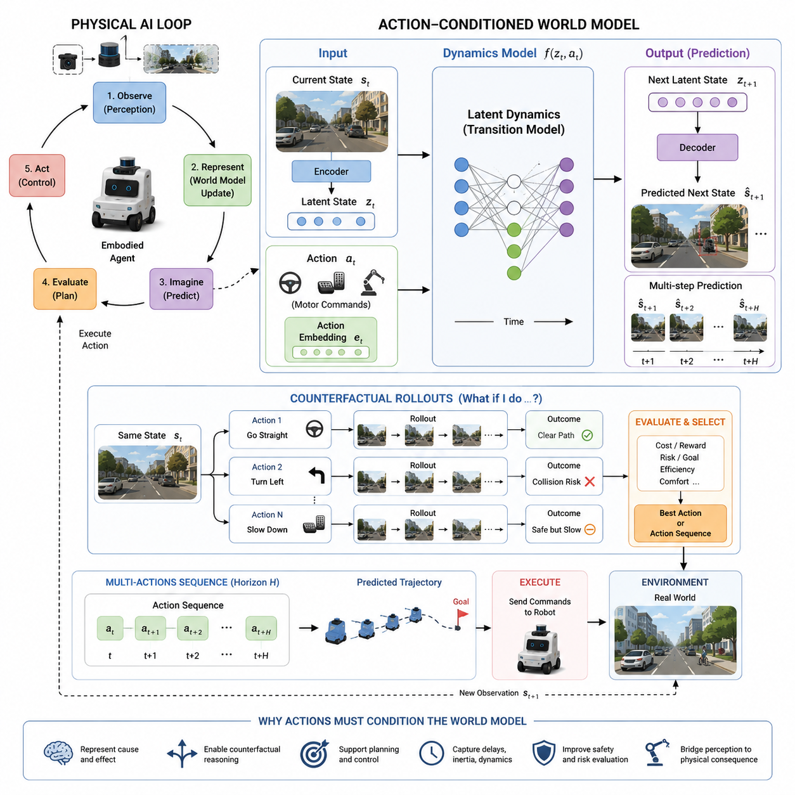
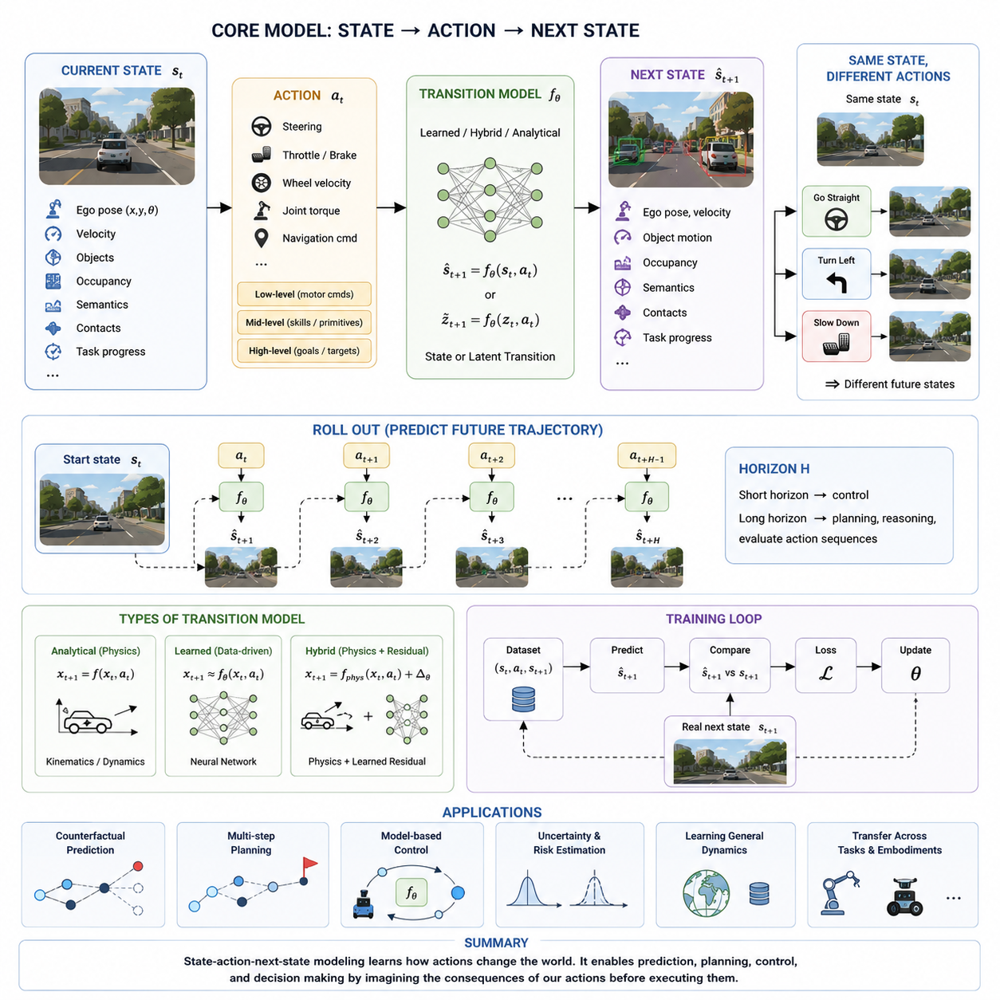
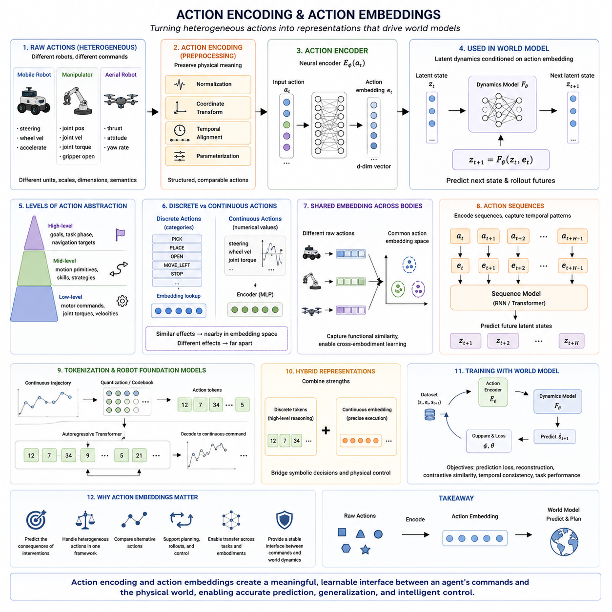
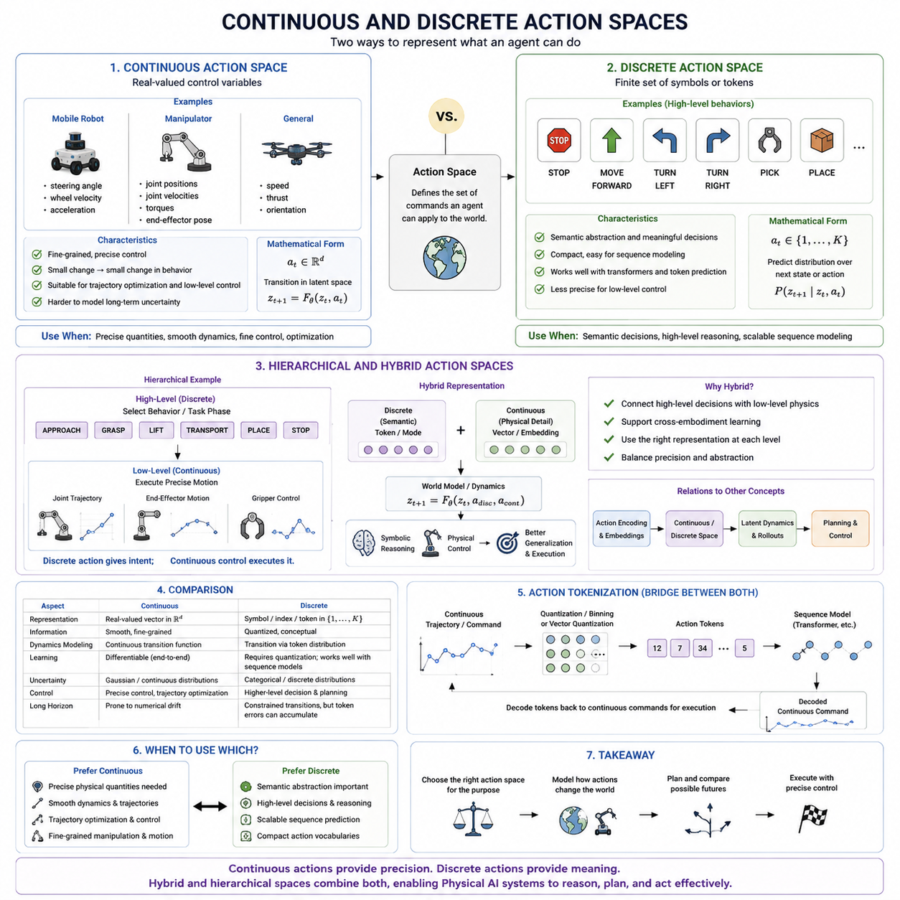
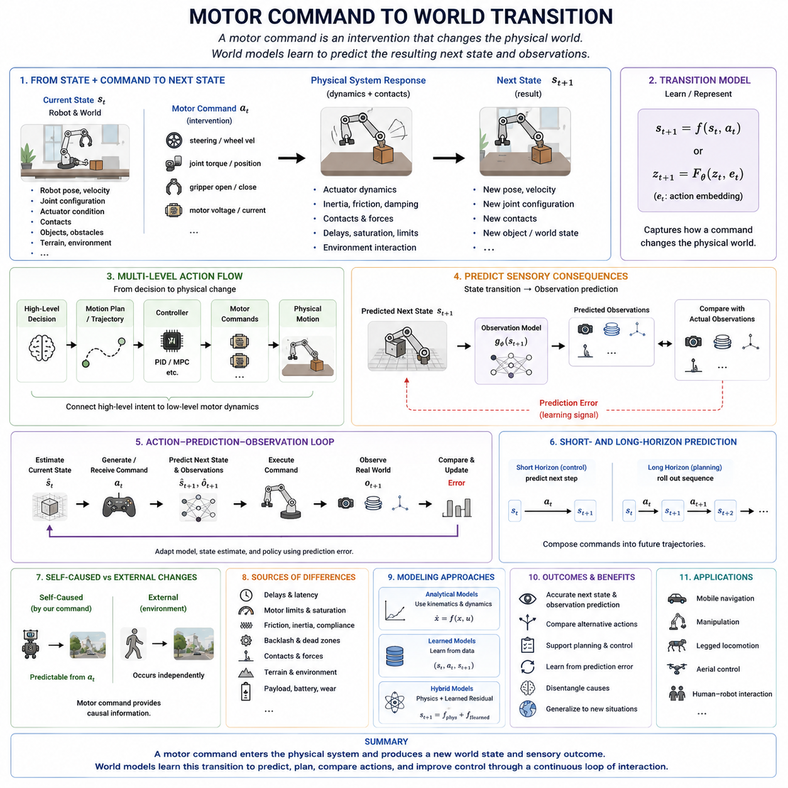
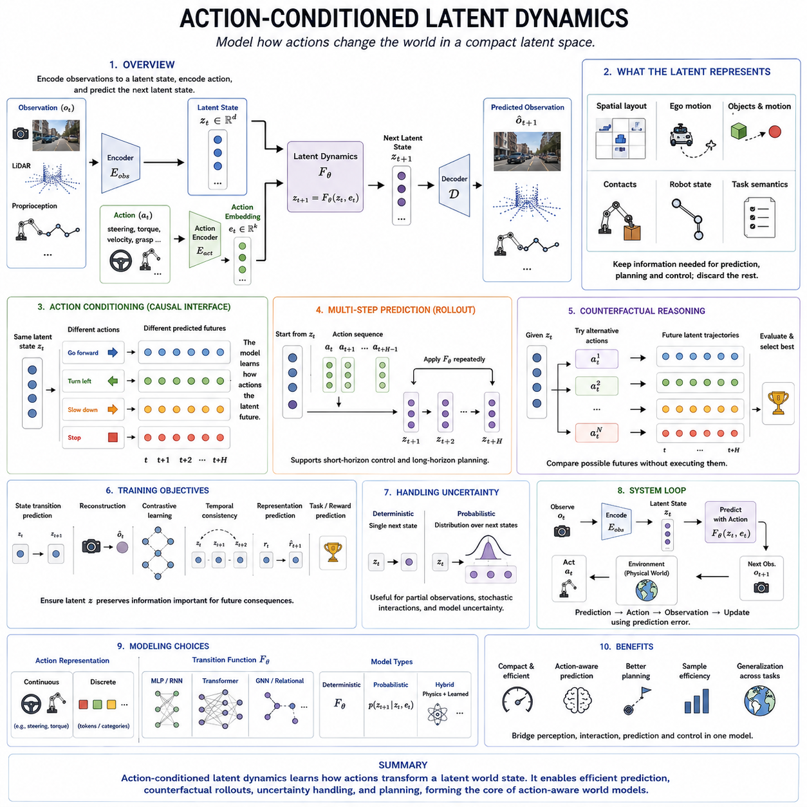
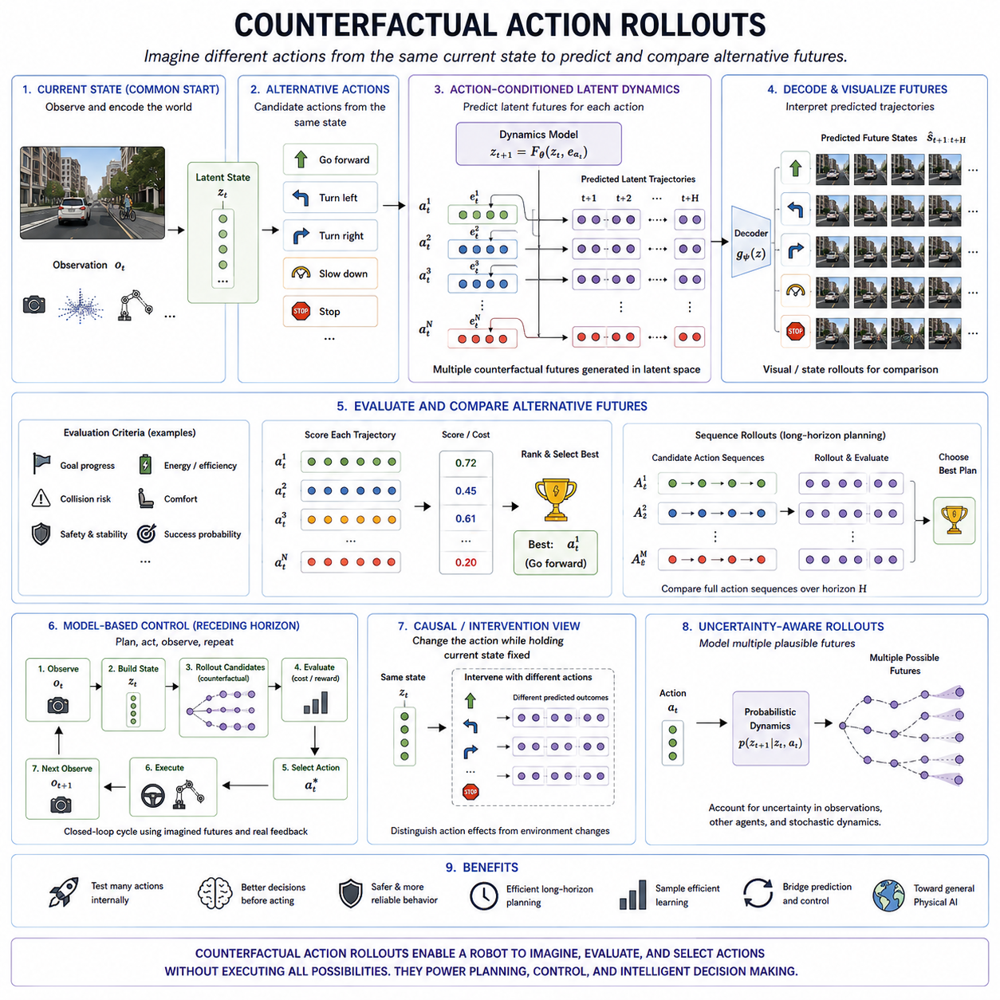
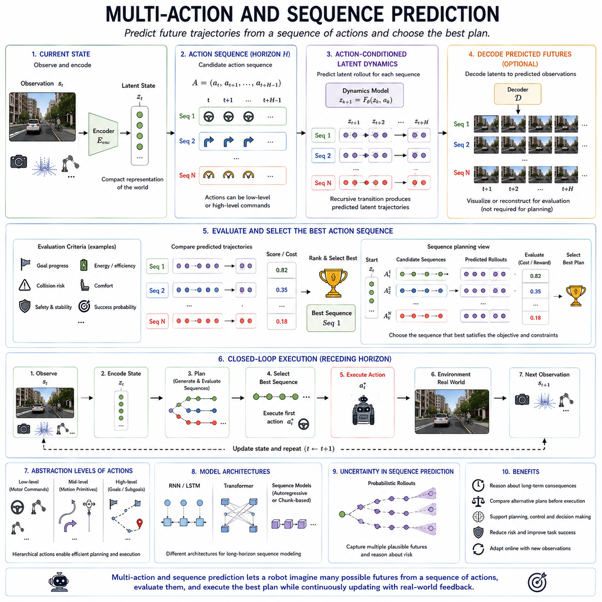
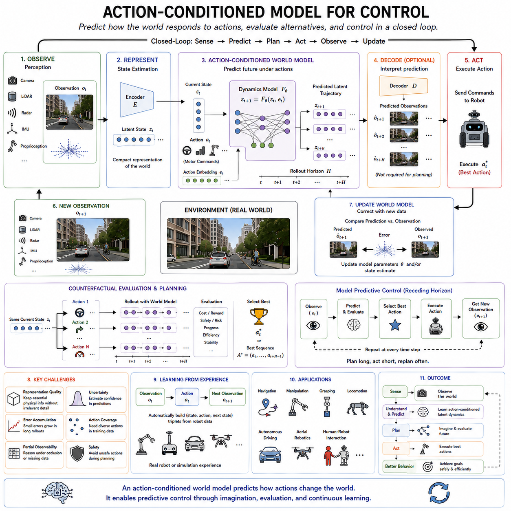
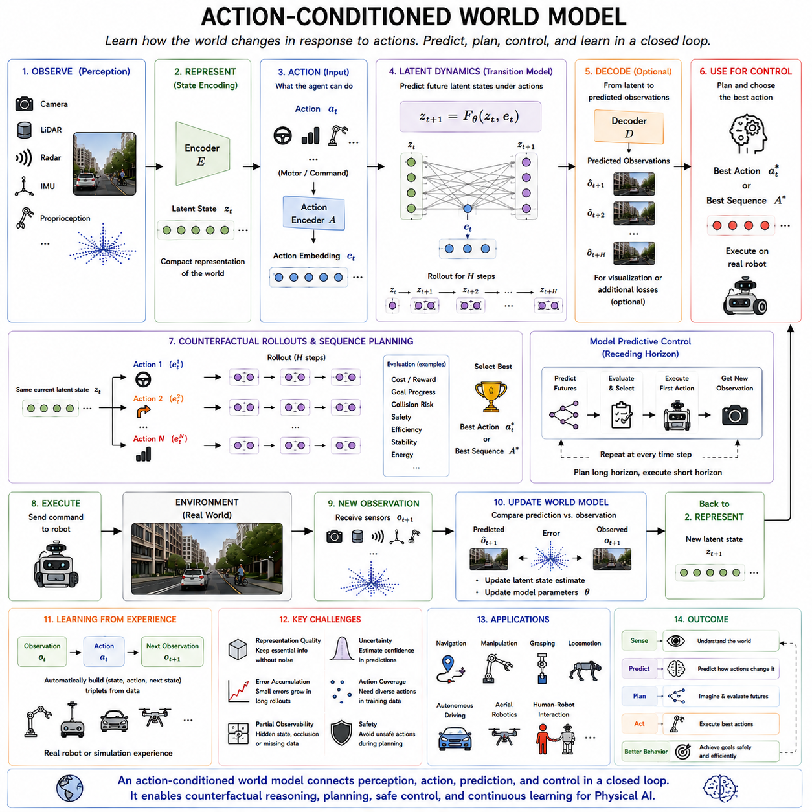

**Volume 07. World Models for Physical AI**

# Chapter 08. Action Conditioned World Models

## 08.01. Why Actions Must Condition the World Model

{width="7.268055555555556in" height="7.268055555555556in"}

A world model that predicts only from the current state cannot fully represent the dynamics of a physical environment because the future is not determined by observation alone. In Physical AI, the agent continuously changes the world through its actions, and those actions influence position, velocity, contact, object configuration, and future observations. Therefore, a useful world model must represent not only what the world is now, but also how the world is expected to evolve under different possible actions.

The central relationship can be expressed as a state-action-next-state process: given the current state (s_t) and an action (a_t), the world model predicts the next state (s_{t+1}). In its simplest form, this can be written as (s_{t+1}=f(s_t,a_t)). The action is therefore not merely an output generated after prediction; it becomes an input that determines which future transition should be predicted. This distinction is fundamental for connecting world modeling with planning and control.

Without action conditioning, a model may learn that certain states are commonly followed by other states, but it cannot reliably distinguish futures produced by different interventions. For example, an autonomous robot approaching an obstacle may either continue forward, slow down, stop, or turn. The visual observation can be almost identical immediately before these decisions, while the resulting future states are completely different. A world model must therefore predict alternative futures according to the action selected by the agent.

Action conditioning also transforms a world model from a passive prediction system into an interactive internal simulator. Instead of asking only, "What will happen next?", the agent can ask, "What will happen if I perform this action?" This enables imagined rollouts in which multiple candidate actions are evaluated before physical execution. Such a capability provides the foundation for model-based planning, model predictive control, and action-aware reinforcement learning.

For a Physical AI system, the action representation must correspond to the actual control interface of the embodied system. Actions may be discrete decisions such as stop, turn left, or turn right, but they may also be continuous motor commands such as steering angle, wheel velocity, acceleration, joint torque, or end-effector motion. The world model therefore needs an action representation that preserves the information necessary to predict how physical commands produce changes in the environment and in the robot itself.

The relationship between action and transition is especially important because physical systems contain inertia, delay, friction, actuator limitations, and contact dynamics. A motor command does not necessarily produce an immediate state change. Instead, an action influences the system through a temporal transition process. Consequently, action-conditioned world models should be capable of representing delayed effects, accumulated motion, and the interaction between consecutive actions rather than treating every command as an independent instantaneous event.

Action conditioning can also operate in latent space. Instead of explicitly predicting every physical variable, an encoder can transform observations into a latent state (z_t), while an action-conditioned dynamics model predicts the future latent state (z_{t+1}) from (z_t) and (a_t). This approach is particularly useful when the raw observation contains enormous amounts of visual information that are unnecessary for planning. The latent dynamics can focus on task-relevant spatial, temporal, semantic, and physical changes.

The same principle naturally leads to counterfactual reasoning. Once a world model can predict future states conditioned on actions, the agent can compare alternative interventions without physically executing all of them. Starting from the same state, it can simulate different action sequences and estimate their consequences. This provides a bridge from prediction to decision making because the model becomes capable of representing "what would happen if" rather than merely forecasting the most likely continuation of the observed trajectory.

For long-horizon behavior, a single action is insufficient to describe the future. The model must support sequences such as (a_t,a_{t+1},\...,a_{t+H}) and predict the corresponding state trajectory. This allows the system to evaluate complete candidate behaviors rather than isolated commands. Multi-action prediction is particularly important for navigation, manipulation, autonomous driving, and other Physical AI tasks in which the success of an action depends strongly on the actions that follow it.

Action-conditioned prediction also creates a direct connection between the world model and control. A planner can generate candidate actions, the world model can predict their consequences, and a controller can select or execute the action sequence with the most desirable predicted outcome. After execution, new observations update the internal state and the process repeats. The resulting loop can be viewed as observe, represent, imagine, evaluate, act, and update, making the world model an internal predictive component of the closed-loop physical intelligence system.

Ultimately, actions must condition the world model because Physical AI is fundamentally an intervention-driven form of intelligence. The robot does not merely observe a world that evolves independently; it continuously changes that world through movement and interaction. An action-conditioned world model therefore provides the missing link between perception and physical consequence, allowing the system to learn dynamics, imagine alternative futures, evaluate risks, support planning, and select actions before committing them to the real environment. The chapter structure consequently progresses from state-action-next-state modeling through action embeddings and motor-command transitions toward latent dynamics, counterfactual rollouts, multi-action prediction, and control.

## 08.02. State Action Next State Modeling

{width="7.268055555555556in" height="7.268055555555556in"}

A world model for Physical AI can be understood fundamentally as a transition model that maps the current state and an applied action to the next state. The basic relationship is expressed as (s_{t+1}=f(s_t,a_t)), where (s_t) represents the current state and (a_t) represents the action taken by the agent. The model therefore learns not only what the world currently looks like, but also how the world changes when the agent intervenes.

The current state (s_t) should contain the information required to describe the relevant condition of both the robot and its environment. Depending on the application, this may include position, velocity, orientation, objects, occupancy, semantics, contacts, task progress, or other physical variables. In modern world models, these variables may be represented explicitly or compressed into a latent state (z_t). Accurate state estimation is therefore a prerequisite because prediction quality depends directly on the quality of the state supplied to the transition model.

The action (a_t) represents the intervention applied by the agent at time (t). It may correspond to a steering command, throttle, brake, wheel velocity, joint torque, end-effector movement, navigation command, or higher-level motion primitive. The action can therefore exist at multiple levels of abstraction. Low-level actions describe motor commands, mid-level actions describe skills or motion primitives, and high-level actions describe goals or navigation targets. The world model should preserve the information necessary to predict the consequences of these actions.

The transition model receives the current state and action together and predicts the next state. In a learned formulation, this can be represented as (\\hat{s}\*{t+1}=f\*\\theta(s_t,a_t)), where (f_\\theta) is a neural transition model and (\\hat{s}\*{t+1}) is the predicted next state. When latent representations are used, the same process can be expressed as (\\hat{z}\*{t+1}=f_\\theta(z_t,a_t)). The transition function therefore becomes the central mechanism through which the world model represents how actions change the physical state of the system.

The predicted next state can describe many different aspects of the future world. For an autonomous vehicle, it may include future ego pose, velocity, orientation, surrounding-object motion, occupancy, and semantic information. For a mobile robot, it may represent its position, heading, traversability, obstacles, and task progress. For a manipulator, it may describe joint configuration, object pose, contact state, and interaction outcome. The appropriate prediction target therefore depends on the physical task and the level of abstraction required for planning and control.

A major advantage of next-state modeling is that the transition can be repeatedly applied to generate a future trajectory. Starting from (s_t), the model predicts (\\hat{s}\*{t+1}), then uses that predicted state to estimate (\\hat{s}\*{t+2}), continuing toward a longer horizon (\\hat{s}_{t+H}). This process is commonly called a rollout. Short-horizon prediction can support stabilization and immediate feedback control, while longer-horizon prediction provides information for planning, reasoning, and evaluating complete action sequences.

The same current state can produce different future states depending on the selected action. If a robot is approaching an obstacle, continuing forward, turning, or slowing down will produce different state trajectories even though the initial state is identical. This makes action conditioning essential for a predictive world model. Instead of predicting a single uncontrolled future, the model can represent multiple possible futures associated with different interventions and allow a planner to compare their consequences.

There are several ways to implement the transition function. An analytical model can use physical equations describing kinematics and dynamics, such as (x_{t+1}=f(x_t,a_t)). A learned model can approximate the transition directly from experience using a neural network, represented as (x_{t+1}\\approx f_\\theta(x_t,a_t)). A hybrid model can combine analytical physics with a learned residual, allowing known physical structure to be preserved while learning effects that are difficult to model explicitly. These approaches provide different trade-offs between interpretability, flexibility, data requirements, and generalization.

The prediction process can also be probabilistic rather than deterministic. A deterministic model produces one estimated next state for a given state-action pair, which can be effective when the dynamics are relatively predictable. In uncertain environments, however, several outcomes may be plausible because of noisy observations, partial observability, stochastic events, model imperfections, or the actions of other agents. A probabilistic transition model can therefore represent a distribution of possible next states and provide information about uncertainty and risk for subsequent planning.

Prediction error provides the mechanism for learning and continual correction. After the model predicts (\\hat{s}\*{t+1}), the real system produces an observed next state (s\*{t+1}). The difference between prediction and observation provides an error signal that can be used to update the transition model and improve future predictions. This creates a continuous prediction-action-observation cycle in which the world model predicts consequences, the robot acts, new evidence arrives, and the model is corrected according to what actually happened.

The state-action-next-state formulation therefore forms a fundamental bridge between perception, prediction, planning, and control. Perception estimates the current state, the action specifies an intervention, and the transition model predicts the resulting state. A planner can use this mechanism to roll out candidate actions, compare predicted trajectories, evaluate goals and constraints, and select an appropriate action before physical execution. In this sense, next-state prediction is not merely forecasting; it is the transition operator that allows a Physical AI system to reason about how its actions change the world.

Learning state-action-next-state relationships from real robot or simulation experience provides a direct foundation for action-conditioned world modeling. Each experience sequence can produce training examples containing a state, an action, and the resulting next state. With sufficient diversity of environments and actions, the model can learn increasingly general transition patterns. These learned dynamics can subsequently support counterfactual prediction, multi-step planning, model-based control, and eventually more general world models that operate across tasks and physical embodiments.

## 08.03. Action Encoding and Action Embeddings

{width="7.268055555555556in" height="7.268055555555556in"}

An action-conditioned world model must represent actions in a form that can be processed together with the current world state. Raw control commands are often heterogeneous: steering, wheel velocity, joint torque, end-effector pose, gripper opening, or navigation commands may have different units, ranges, dimensions, and temporal characteristics. Action encoding transforms these heterogeneous signals into a structured representation that allows the world model to learn how different interventions influence future states.

The first requirement of action encoding is to preserve the physical meaning of the command. A numerical vector may contain several control variables, but each variable can represent a different physical quantity and operate at a different scale. Normalization, coordinate transformation, temporal alignment, and appropriate parameterization can therefore be important before the action is converted into an embedding. The objective is not simply to compress the action, but to produce a representation that retains the information necessary for predicting its physical consequences.

Actions can be represented at different abstraction levels. Low-level actions describe actuator execution through quantities such as joint positions, joint velocities, torques, wheel velocities, force commands, or end-effector poses. Intermediate actions can represent motion primitives, manipulation strategies, approach directions, grasp selections, or contact sequences. Higher-level actions can represent goals, task phases, or navigation decisions. These levels may coexist, allowing a world model to connect high-level intent with lower-level physical execution.

Discrete and continuous actions require different encoding strategies. A discrete action such as PICK, PLACE, OPEN, MOVE_LEFT, or STOP can be represented directly as a symbolic identifier or learned embedding vector. A continuous action such as steering angle, wheel velocity, joint torque, or gripper position can be normalized and projected through a neural encoder into a continuous embedding space. The resulting representation allows actions with related physical effects to occupy nearby regions while maintaining the numerical information required for precise control.

An action embedding is a learned vector representation of an action that can be combined with the latent representation of the current world state. If the current latent state is (z_t) and the action is (a_t), an action encoder can produce (e_t=E_\\phi(a_t)), after which the dynamics model predicts the next state using (z_{t+1}=F_\\theta(z_t,e_t)). This separates the physical command from the internal representation used by the dynamics model while providing a flexible interface between action spaces and latent world dynamics.

For multimodal robots, action embeddings can also provide a common representation across different embodiments. A mobile robot may express movement through wheel velocities, while a manipulator uses joint commands and an aerial robot uses thrust and attitude controls. Their raw action spaces are fundamentally different, but an embedding space can represent higher-level similarities such as moving toward a target, changing orientation, approaching an object, or maintaining contact. This creates an important foundation for cross-embodiment learning when the representation captures functional rather than purely hardware-specific information.

Action encoding becomes especially important when actions are generated as sequences. Instead of treating every motor command independently, the system can represent temporal patterns such as approach, grasp, lift, transport, and place. A sequence model can then process action embeddings together with observations and latent states, learning dependencies between successive actions. This enables the world model to predict not only the immediate consequence of one command but also how a sequence of coordinated actions produces a longer-term state transition.

The relationship between action encoding and tokenization is particularly relevant to robot foundation models and Vision-Language-Action systems. Continuous trajectories can be quantized into discrete bins or codebook entries, producing action tokens that can be predicted autoregressively by Transformer-based models. Conversely, continuous latent action embeddings can be decoded into precise robot commands. Hybrid approaches can combine discrete tokens for high-level reasoning with continuous representations for accurate physical execution, providing a bridge between symbolic decision making and low-level control.

A useful action embedding should therefore support more than simple reconstruction of the original command. It should help the dynamics model distinguish actions according to their predicted effects on the world. Two commands that are numerically different but produce similar physical consequences may benefit from related representations, while commands with small numerical differences but very different consequences should remain distinguishable. This makes action embeddings an interface for learning intervention structure rather than merely a compressed copy of the control signal.

Training action embeddings can be performed jointly with the world model using observed state-action-next-state sequences. The encoder converts the recorded action into an embedding, the dynamics model predicts the resulting state, and the prediction error provides a learning signal for both components. Additional objectives may encourage useful structure in the embedding space, including temporal consistency, action reconstruction, contrastive similarity, or task-specific predictive performance. The central criterion remains whether the representation improves prediction of the consequences of actions.

The ultimate purpose of action encoding is to create a stable interface between physical commands and world dynamics. A well-designed representation allows the same world model to receive heterogeneous actions, predict their consequences, compare alternative interventions, and support planning and control. Within the structure of Chapter 08, this provides the conceptual bridge from state-action-next-state modeling to continuous and discrete action spaces, motor-command transitions, latent dynamics, counterfactual rollouts, multi-action prediction, and action-conditioned control.

## 08.04. Continuous and Discrete Action Spaces

{width="7.268055555555556in" height="7.268055555555556in"}

In Physical AI, an action space defines the set of commands an agent can apply to a robot and its environment. Actions may be continuous numerical quantities, such as steering angle, wheel velocity, acceleration, joint position, or torque, or discrete choices, such as stop, turn left, grasp, place, or change task phase. The choice of action-space representation strongly influences how a world model learns dynamics, predicts consequences, and supports planning and control.

Continuous action spaces represent actions using real-valued variables, usually within physically meaningful ranges. A mobile robot may use steering and wheel velocity, while a manipulator may use joint positions, joint velocities, torque, or end-effector coordinates. Continuous representations preserve fine-grained information and allow small changes in a command to produce correspondingly small changes in predicted behavior. This makes them especially suitable for precise physical control and trajectory optimization.

A continuous action can be represented as a vector (a_t \\in \\mathbb{R}\^d), where each dimension corresponds to a control variable. The world model can then learn a transition such as (z_{t+1}=F_\\theta(z_t,a_t)), where (z_t) is the current latent state and (a_t) is the continuous action. Because the action is differentiable, gradient-based optimization can sometimes be used to search for actions that produce desirable future states. This provides a direct connection between continuous action modeling, planning, and model-based control.

Discrete action spaces instead represent behavior as a finite set of categories, symbols, or tokens. Examples include STOP, MOVE_FORWARD, TURN_LEFT, TURN_RIGHT, PICK, PLACE, or OPEN. Discrete actions provide semantic abstraction by grouping many low-level physical movements into a meaningful decision. They can therefore simplify sequence modeling and high-level reasoning, particularly when the exact motor command is determined later by a lower-level controller or policy.

A discrete action can be represented by an index or token, such as (a_t \\in {1,\\ldots,K}). The world model may then predict a probability distribution over possible next actions or states rather than directly processing a continuous numerical command. This formulation works naturally with categorical models and autoregressive sequence architectures, including Transformer-based systems. Discrete representations can also provide compact and reusable action vocabularies for robot foundation models.

The distinction between continuous and discrete actions is not simply a choice between two mathematical formats. It reflects different levels of abstraction in physical intelligence. Low-level control usually requires continuous quantities because precise motion, force, velocity, and trajectory information must be preserved. Higher-level behavior can often be represented discretely because decisions such as approach, grasp, lift, place, or stop describe meaningful phases of a task without specifying every motor command.

The two representations can also be combined hierarchically. A high-level discrete action may select the current task phase or behavior, while a continuous controller generates the detailed trajectory required to execute that phase. For example, a robot may select the discrete action GRASP and then use continuous joint positions, velocities, and end-effector motion to perform the grasp. In this structure, discrete actions provide semantic guidance while continuous states and controls describe the fine-grained physical evolution within each phase.

Action spaces also affect how uncertainty is represented. Continuous actions naturally lead to continuous predictive distributions and can represent fine variations in possible outcomes. Discrete actions instead use categorical alternatives, which can make distinct behavioral modes easier to separate. Neither representation is universally superior. The appropriate choice depends on whether the world model needs precise physical quantities, semantic abstraction, scalable sequence modeling, or a combination of these properties.

For long-horizon prediction, the difference becomes particularly important. Continuous actions allow smooth trajectories to be rolled forward, but small numerical prediction errors can accumulate over many steps. Discrete actions constrain the model to recognizable categories, but token or category prediction errors can cause abrupt changes and can also accumulate over long sequences. A practical world model therefore needs to consider both the resolution of the action representation and the stability of its multi-step predictions.

Action tokenization provides another way to connect continuous and discrete spaces. A continuous control value or trajectory can be divided into bins or transformed through vector quantization into a finite set of action tokens. These tokens can then be predicted sequentially by a Transformer or another sequence model. The representation becomes more compatible with language-like autoregressive modeling, while decoding can convert the predicted tokens back into approximate continuous commands for physical execution.

A hybrid action representation can therefore combine discrete semantic decisions with continuous physical execution. Discrete tokens can represent task intent, behavior mode, or action phase, while continuous embeddings or control vectors preserve the precision required by the robot. Such a structure can connect symbolic reasoning with physical control and can also support cross-embodiment learning, where different robots map different low-level commands into related higher-level action representations. The resulting architecture allows a world model to reason at multiple levels while retaining the physical detail required for accurate execution.

The central design principle is that the action space should match the purpose of the world model. Continuous actions are most valuable when precise quantities, smooth dynamics, trajectory optimization, and fine-grained control are important. Discrete actions are useful when semantic abstraction, symbolic reasoning, compact representations, and scalable sequence prediction are more important. Hybrid and hierarchical action spaces combine these advantages, allowing Physical AI systems to connect high-level decisions with low-level physical dynamics and use the appropriate representation at each stage of prediction, planning, and control.

## 08.05. Motor Command to World Transition

{width="7.268055555555556in" height="7.268055555555556in"}

A physical AI system ultimately expresses its decisions through motor commands that act on the real world. A steering command, wheel velocity, joint torque, gripper motion, or actuator position is not itself the final state change; it is an intervention that enters the physical system and produces a new configuration of the robot and environment. The central problem is therefore to model the transition from a commanded motor action to the resulting physical world state, connecting action-conditioned prediction with actual embodiment and dynamics.

The transition begins with the current state of the robot and its surrounding world. The state may contain the robot pose, velocity, joint configuration, actuator condition, contact state, objects, obstacles, terrain, and other environmental information relevant to the task. A motor command is then applied to this state, and the physical system responds according to its kinematics, dynamics, actuator characteristics, contacts, and environmental conditions. The world model attempts to learn or represent this transformation so that the resulting next state can be predicted before the action is physically completed.

A useful formulation is (s_{t+1}=f(s_t,a_t)), where (s_t) is the current state, (a_t) is the motor command, and (s_{t+1}) is the resulting next state. In practice, the transition may be represented in latent space as (z_{t+1}=F_\\theta(z_t,e_t)), where the action is first transformed into an action embedding (e_t). The transition function therefore captures the relationship between what the robot commands and what subsequently changes in the physical world. This provides the basic mechanism through which a world model becomes action-conditioned rather than merely observational.

The relationship between a motor command and a world transition is rarely instantaneous or perfectly deterministic. Motors have response delays, saturation, dead zones, backlash, limited torque, and control-loop dynamics. Mechanical systems also contain inertia, friction, damping, compliance, contact forces, and structural constraints. As a result, the same command can produce different outcomes depending on the robot\'s current velocity, payload, terrain, contact condition, battery state, or surrounding environment. A useful transition model must therefore learn the physical context in which a command is applied rather than treating the command as an isolated numerical input.

The transition can also involve multiple intermediate levels. A high-level decision such as MOVE_FORWARD may eventually become a velocity command, which is converted by a controller into wheel or motor commands, which then generate physical motion. Similarly, a manipulation goal such as GRASP can become a motion trajectory, joint commands, actuator torques, contact forces, and finally a change in object configuration. The world model can represent these relationships at different abstraction levels, allowing high-level actions to be connected with the lower-level motor dynamics that actually produce physical change.

An important role of the world model is to predict the sensory consequences of a motor command in addition to the physical state transition. A command changes the robot\'s position and velocity, but it also changes what cameras, LiDAR, IMU, force sensors, and other sensors will observe. A forward model can therefore predict a future state and then use an observation model to estimate the corresponding future observation. Comparing this prediction with actual sensory feedback provides a prediction error that can be used to update state estimation, the transition model, and other components of the system.

This creates a continuous action-prediction-observation loop. The system estimates the current state, generates or receives a motor command, predicts the resulting state and observations, executes the command, and then receives actual feedback from the physical environment. The predicted and observed outcomes are compared, and the resulting error can be used for adaptation and learning. This loop allows the model to progressively capture the relationship between commands and their physical consequences while maintaining a connection between internal prediction and real-world evidence.

The same framework supports short- and long-horizon prediction. For immediate control, the model may predict the effect of a motor command over a very short interval, such as the next control cycle. For planning, it can repeatedly apply the transition model to generate a sequence of future states. A command at time (t) produces (s_{t+1}), which becomes the basis for predicting (s_{t+2}), and so forth. In this way, individual motor commands can be composed into trajectories that represent the future evolution of the robot and its environment.

Motor-command modeling is also essential for distinguishing self-caused changes from external events. If a robot accelerates and an object appears to move across its camera image, the world model should be able to determine whether the change is caused by the robot\'s own motion, by movement of the object, or by a combination of both. The motor command provides an important source of causal information because it specifies an intervention that the agent itself initiated. This allows the world model to learn which aspects of future observations are controllable through action and which arise independently from the environment.

Different implementations can represent the motor-to-world transition in analytical, learned, or hybrid forms. Analytical models use known kinematics and dynamics to calculate state changes from commands. Learned models infer the transition directly from collected state-action-next-state experience. Hybrid models combine physical equations with learned residual components, allowing known dynamics to provide structure while neural models capture effects that are difficult to describe analytically. The appropriate balance depends on the available data, model complexity, physical knowledge, and required generalization.

Ultimately, motor-command-to-world-transition modeling establishes the physical grounding of an action-conditioned world model. The action is no longer an abstract symbol that simply precedes a prediction; it becomes a physically meaningful intervention whose consequences must be represented across time. By learning how commands propagate through actuators, mechanics, contacts, the robot body, and the external environment, the world model can predict future states and observations, compare alternative actions, support planning, and improve control through prediction error. This forms the foundation for the subsequent progression toward action-conditioned latent dynamics, counterfactual rollouts, multi-action sequence prediction, and world-model-based control.

## 08.06. Action Conditioned Latent Dynamics

{width="7.268055555555556in" height="7.268055555555556in"}

Action-conditioned latent dynamics extends the basic world-model transition from explicit physical states to a compact latent representation of the world. Instead of predicting every observable variable directly, the system encodes the current observation or multimodal sensor information into a latent state (z_t), encodes the applied action into an action representation (e_t), and learns a transition such as (z_{t+1}=F_\\theta(z_t,e_t)). The latent dynamics model therefore learns how an agent\'s actions transform its internal representation of the physical world over time.

The latent state (z_t) is intended to preserve the information that is important for predicting future consequences while discarding unnecessary details from the raw observation. For a mobile robot, this representation may implicitly contain spatial structure, ego motion, obstacles, object motion, terrain, and task-relevant semantics. For a manipulator, it may capture object configuration, contact relationships, robot posture, and interaction state. The exact variables do not need to be explicitly reconstructed if the latent representation retains the information required for accurate prediction, planning, and control.

Action conditioning provides the causal interface between the latent world state and physical intervention. Given the same latent state, different actions should produce different predicted latent futures. A robot approaching an obstacle may generate distinct latent trajectories when it continues forward, slows down, turns, or stops. The model therefore learns not merely the temporal evolution of (z_t), but the action-dependent transition function that determines how alternative interventions modify that evolution. This is what transforms latent prediction into an action-aware internal model.

The action can be represented directly as a numerical control vector or transformed into an action embedding before entering the latent dynamics model. Continuous commands such as steering, wheel velocity, joint torque, or end-effector motion can be projected into a learned embedding space, while discrete commands can be represented as tokens or categorical embeddings. A common transition formulation is (z_{t+1}=F_\\theta(z_t,E_\\phi(a_t))), where (E_\\phi) converts the physical command into a representation compatible with the latent dynamics. This separates action representation from the mechanism that predicts its consequences.

A major advantage of latent dynamics is computational efficiency. Raw camera images, LiDAR measurements, and other sensor streams can contain enormous amounts of information that are irrelevant to immediate prediction or planning. Predicting future pixels or complete sensor observations can therefore require substantial computation. Latent dynamics instead performs prediction in a compressed representation space, allowing the model to focus computational resources on spatial, temporal, semantic, and physical features that influence future behavior. This makes latent world modeling particularly attractive for real-time Physical AI systems.

Latent dynamics can support multi-step prediction by recursively applying the action-conditioned transition. Starting from (z_t), the model predicts (\\hat{z}\*{t+1}) using (a_t), then predicts (\\hat{z}\*{t+2}) using the predicted latent state and the next action (a_{t+1}). Repeating this process produces a latent rollout over a planning horizon. The resulting sequence can represent alternative futures without requiring the system to reconstruct every future observation in pixel space. Short rollouts can support immediate control, while longer rollouts can provide information for planning and action-sequence evaluation.

Because latent states are learned rather than necessarily predefined, the training objective determines what information the representation preserves. State-transition prediction can be combined with reconstruction, contrastive learning, temporal consistency, representation prediction, or task-specific objectives. The central requirement is that the latent representation remains predictive of future consequences under different actions. If the representation removes information needed to distinguish important physical outcomes, the dynamics model may appear accurate in latent space while failing when used for planning or control.

Action-conditioned latent dynamics also enables counterfactual reasoning. Starting from the same latent state (z_t), the model can apply several hypothetical actions and generate different future latent trajectories. A planner can compare these rollouts according to distance, progress, collision risk, energy consumption, task success, or other objectives. The physical robot does not need to execute every candidate action because the world model provides an internal mechanism for evaluating possible consequences before committing to a real intervention.

The approach can be extended to probabilistic latent dynamics when the future is uncertain. Instead of producing a single next latent state, the model can represent a distribution over possible states conditioned on the current latent state and action. This is useful when observations are incomplete, other agents behave unpredictably, physical interactions are stochastic, or the model itself is uncertain. Maintaining uncertainty in latent space can make multi-step prediction and planning more robust by allowing the system to distinguish confident predictions from situations where several futures remain plausible.

Ultimately, action-conditioned latent dynamics provides a compact bridge between perception, physical interaction, prediction, and planning. Sensor observations are transformed into a latent world state, actions are encoded as interventions, and the latent dynamics model predicts how those interventions change the internal world representation. The predicted futures can then be evaluated, selected, and converted into physical commands, while new observations continuously update the internal state. Within the Chapter 08 progression, this establishes the foundation for counterfactual action rollouts, multi-action sequence prediction, and action-conditioned control by making the latent world model explicitly responsive to what the agent chooses to do.

## 08.07. Counterfactual Action Rollouts

{width="7.268055555555556in" height="7.268055555555556in"}

Counterfactual action rollouts allow a Physical AI system to imagine what could happen if it chose different actions from the same current world state. Instead of executing every possible action in the physical environment, the world model keeps the current state fixed and applies alternative actions internally to predict different future states. This changes prediction from passive forecasting into an active mechanism for evaluating possible interventions before they are physically performed.

The process begins with a current state (s_t) or latent state (z_t) that represents the robot and its surrounding environment. From this common starting point, the model receives alternative actions such as moving forward, turning, slowing down, stopping, grasping, or following another motion strategy. Each action is passed through the action-conditioned transition model to produce its corresponding predicted future. Because all alternatives originate from the same initial state, their predicted trajectories can be compared according to their consequences.

In a latent world model, counterfactual rollout can be expressed as repeatedly applying a transition function such as (\\hat{z}\*{t+1}=F\*\\theta(z_t,e_t)), where (e_t) represents the embedding of a candidate action. For another candidate action, a different embedding is supplied while the initial latent state remains unchanged. The model therefore generates separate latent trajectories such as (\\hat{z}\^{1}\*{t+1:t+H}), (\\hat{z}\^{2}\*{t+1:t+H}), and so forth. These trajectories represent alternative futures generated entirely inside the learned world model.

The key property is that the model can answer a counterfactual question: "What would happen if I performed this action instead?" A mobile robot approaching an obstacle may compare going straight, turning left, turning right, or slowing down. A manipulator may compare different grasp positions or approach directions. The initial observation can remain almost identical, but the predicted futures can diverge significantly. The world model therefore learns action-dependent consequences rather than simply predicting one most likely continuation of the observed trajectory.

Counterfactual rollouts become more useful when each candidate is evaluated against task objectives and physical constraints. A predicted trajectory can be assessed according to goal progress, collision risk, safety, stability, energy consumption, efficiency, comfort, or probability of task success. The planner does not need to treat prediction as the final answer; instead, it uses the predicted futures as evidence for selecting among candidate actions. This creates a direct connection between world-model prediction and decision making.

For long-horizon planning, a single alternative action is often insufficient because the consequence of an action depends on what happens afterward. The system can therefore evaluate action sequences (A\^i=(a_t\^i,a_{t+1}\^i,\\ldots,a_{t+H-1}\^i)) rather than isolated commands. Each candidate sequence generates a multi-step rollout through the latent dynamics model. The resulting trajectories can be compared over the planning horizon, allowing the system to select a complete behavior rather than optimizing only the immediate next action.

This mechanism is particularly powerful for model-based control and receding-horizon planning. At each decision point, the system observes the current environment, constructs the current latent state, generates several candidate actions or action sequences, rolls them forward internally, evaluates their predicted outcomes, and selects the most appropriate action. After execution, a new observation updates the internal state and the process begins again. The result is a closed-loop cycle in which imagination supports action selection while real-world feedback continuously corrects the internal model.

Counterfactual rollouts also provide an important bridge toward causal reasoning. An ordinary predictive model may learn that one event tends to follow another, but an action-conditioned model can explicitly test the consequence of an intervention. Holding the current state approximately constant while changing the action allows the system to separate alternative action effects from changes that would have occurred independently in the environment. This does not automatically guarantee true causal understanding, but it gives the world model an intervention-based structure that is essential for physical decision making.

The quality of counterfactual prediction depends strongly on the accuracy of the underlying dynamics model. Errors in the latent representation, action encoding, transition function, or temporal modeling can cause imagined trajectories to diverge from physically realistic outcomes. These errors become increasingly important as the rollout horizon grows because prediction errors can accumulate across successive transitions. Training therefore needs to encourage accurate multi-step latent prediction and temporal consistency, while evaluation should examine whether alternative action consequences remain reliable over the horizons required for planning.

Counterfactual rollouts can also represent uncertainty and multiple plausible futures. In many physical environments, the outcome of an action cannot be predicted with complete certainty because observations are incomplete, other agents behave unpredictably, or the environment contains stochastic interactions. Instead of generating only one trajectory for each candidate action, a probabilistic world model can represent several plausible outcomes. The planner can then account for both expected performance and risk, preferring actions that remain safe and effective across uncertain future possibilities.

The broader significance of counterfactual action rollouts is that they transform a world model into an internal space for experimentation. The robot can test alternative interventions without physically executing each one, compare predicted consequences, and select an action sequence that best satisfies its objectives and constraints. This capability connects action-conditioned latent dynamics to sequence planning, model-based control, reinforcement learning, and eventually more general Physical AI systems. In the Chapter 08 progression, counterfactual rollouts therefore form the conceptual bridge between learning how actions change the world and using that knowledge to decide what the robot should do next.

## 08.08. Multi Action and Sequence Prediction

{width="7.268055555555556in" height="7.268055555555556in"}

Multi-action and sequence prediction extends action-conditioned world modeling from a single intervention to a structured sequence of future actions. Instead of predicting only (s_{t+1}) from (s_t) and (a_t), the model considers an action sequence (A_t=(a_t,a_{t+1},\\ldots,a_{t+H})) and predicts the corresponding future trajectory (\\hat{s}_{t+1:t+H}), allowing the system to reason about how several consecutive actions interact and accumulate over time.

The need for sequence prediction comes from the fact that meaningful physical behavior rarely consists of one isolated command. A mobile robot may need to accelerate, maintain direction, turn, slow down, and stop; a manipulator may need to approach an object, align with it, grasp it, lift it, transport it, and place it. The consequence of an early action depends on the actions that follow, so a world model that predicts only one step at a time without considering the planned continuation has limited ability to evaluate complete behaviors.

A multi-action sequence can be represented as (A_t=(a_t,a_{t+1},\\ldots,a_{t+H-1})), where (H) defines the prediction or planning horizon. Each action can be encoded individually or jointly into a sequence representation. The action-conditioned dynamics model then applies these actions successively to the current state or latent state, producing (\\hat{z}\*{t+1},\\hat{z}\*{t+2},\\ldots,\\hat{z}_{t+H}). The resulting rollout represents how the world is expected to evolve under the complete candidate sequence rather than under a single isolated intervention.

The sequence representation can operate at multiple abstraction levels. Low-level sequences may contain wheel velocities, steering commands, joint positions, torques, or actuator commands. Mid-level sequences may contain motion primitives such as approach, grasp, turn, lift, or place. High-level sequences may represent goals, subgoals, navigation decisions, or task phases. A hierarchical world model can connect these levels so that a high-level action sequence constrains lower-level execution while the physical dynamics determine the resulting state trajectory.

Sequence prediction is particularly compatible with latent world models because the model does not need to reconstruct every future sensor frame in full detail. The current observation can first be encoded into a compact latent state (z_t), while the candidate action sequence is transformed into action embeddings. The latent dynamics then rolls forward through the sequence, producing predicted latent states. This provides a computationally efficient representation for evaluating long-horizon behaviors while retaining information relevant to spatial structure, motion, semantics, contacts, and task progress.

The central operation is recursive transition. Given (z_t) and (a_t), the model predicts (\\hat{z}\*{t+1}). It then uses (\\hat{z}\*{t+1}) together with (a_{t+1}) to predict (\\hat{z}\*{t+2}), continuing until the desired horizon is reached. In this way, a sequence of actions becomes a sequence of predicted consequences. The process can be expressed conceptually as (z_t \\xrightarrow{a_t} \\hat{z}\*{t+1} \\xrightarrow{a_{t+1}} \\hat{z}\*{t+2}\\rightarrow\\cdots\\xrightarrow{a\*{t+H-1}}\\hat{z}_{t+H}).

The main value of multi-action prediction is that it allows candidate behaviors to be compared before execution. Starting from the same current state, the planner can generate multiple candidate sequences (A\^1,A\^2,\\ldots,A\^N), roll each one forward through the world model, and evaluate the resulting trajectories. The evaluation may consider goal progress, collision risk, safety, efficiency, energy consumption, comfort, stability, or task success. The best predicted sequence can then be selected for execution. This connects multi-action world modeling directly to sequence planning.

Long-horizon sequence prediction introduces an important trade-off between planning depth and prediction reliability. A longer horizon provides more information about delayed consequences, but every predicted transition can introduce some error. When the model repeatedly uses its own predicted state rather than the real observed state, these errors can accumulate and cause the imagined trajectory to drift away from the physical future. Therefore, a practical system must balance horizon length with model accuracy and may use frequent replanning rather than committing to a long sequence without feedback.

This naturally leads to receding-horizon or model-predictive operation. The system observes the current environment, constructs the current state, generates candidate action sequences, predicts their future trajectories, evaluates them, and selects the best initial action or short action segment. After executing that portion, the robot receives a new observation and updates its state estimate. The remaining sequence can then be reconsidered using the new information. Thus, long-horizon imagination is combined with short-horizon physical commitment, reducing the effect of accumulated prediction errors.

Multi-action prediction also enables action chunks and temporal coordination. Instead of predicting one motor command at every individual control step, a model can generate or evaluate a short sequence as a coherent behavioral unit. This can reduce decision overhead and encourage temporally smooth behavior. For example, a manipulation system can predict a coordinated sequence of end-effector movements rather than independently choosing every instantaneous joint command. The sequence representation therefore captures temporal structure that may be difficult to express when actions are treated as unrelated individual decisions.

Sequence prediction can be implemented using several model architectures. Recurrent models can maintain temporal memory while predicting successive actions and states. Transformer-based models can represent relationships among many actions and latent states through temporal attention. Sequence models can also operate autoregressively, predicting one action or state representation at a time, or they can predict an entire action chunk jointly. The appropriate architecture depends on the required horizon, computational budget, temporal dependencies, and degree of multimodality in the possible behaviors.

The model can also evaluate multiple complete action sequences in parallel or through sampling. Given the same starting latent state, different candidate sequences generate different predicted trajectories. This creates a branching internal search space in which the world model acts as a simulator for possible behaviors. The planner can then rank or optimize these branches according to a cost or reward function. In this form, sequence prediction becomes more than forecasting: it becomes an internal mechanism for searching through possible future behaviors.

Uncertainty becomes increasingly important as the sequence horizon grows. Even if each individual transition is reasonably accurate, uncertainty can expand as predictions are recursively propagated into the future. A probabilistic or multimodal world model can represent several plausible trajectories for the same action sequence and can distinguish expected outcomes from risky possibilities. This allows planning to consider not only the most likely future but also the possibility of collision, failure, or other undesirable outcomes.

The training data for multi-action prediction can be constructed from trajectories containing observations, actions, and resulting states over time. Instead of training only on isolated triples ((s_t,a_t,s_{t+1})), the model can learn from longer sequences such as ((s_t,a_t,a_{t+1},\\ldots,a_{t+H})) together with the corresponding future states or observations. Training objectives can encourage accurate short- and long-horizon prediction, temporal consistency, action-conditioned dynamics, and useful latent representations. Multi-step training is particularly important because a model that performs well for one-step prediction may still accumulate substantial errors during long rollouts.

Ultimately, multi-action and sequence prediction transforms the world model from a one-step predictor into an internal simulator of complete behaviors. The model receives a current state and candidate action sequence, predicts how the world will evolve across multiple time steps, evaluates alternative trajectories, and provides information for selecting what the robot should execute. Within the Chapter 08 progression, this capability connects counterfactual action rollouts with long-horizon planning and provides the immediate foundation for action-conditioned control, where predicted sequences are repeatedly evaluated against the real world and revised as new observations become available.

## 08.09. Action Conditioned Model for Control

{width="7.268055555555556in" height="7.268055555555556in"}

An action-conditioned model for control connects perception, world modeling, prediction, planning, and physical execution into a closed-loop process. The central idea is that the model should not only estimate what the world is doing, but predict how the world will respond to the action selected by the robot. The resulting loop can be expressed as Observe → Represent → Imagine → Evaluate → Act, followed by a new observation and world-model update. This transforms a reactive controller into a predictive system that can evaluate consequences before committing to physical execution.

The control process begins with observation and state representation. Camera, LiDAR, radar, IMU, proprioception, and other sensors provide information about the robot and its environment. An encoder converts these observations into a compact latent state (z_t) that preserves information relevant to prediction and control. The state may represent spatial structure, object motion, robot state, contacts, task semantics, and other factors required to understand how the physical system can evolve. Accurate state estimation is therefore the foundation for reliable action-conditioned control.

The selected action is encoded separately and combined with the current latent state. Actions may represent low-level motor commands such as steering, velocity, torque, or joint motion, but they may also represent mid-level motion primitives or high-level goals and task decisions. An action encoder transforms these commands into an action embedding (e_t), allowing the world model to process heterogeneous action spaces in a common representation. The important point is that the action becomes an explicit conditioning variable rather than merely an output generated after prediction.

The action-conditioned dynamics model then predicts how the latent world state will change under the selected action. A basic formulation is (z_{t+1}=F_\\theta(z_t,e_t)), where (z_t) represents the current latent state, (e_t) represents the action, and (F_\\theta) represents the learned transition model. The model can recursively predict (z_{t+1},z_{t+2},\\ldots,z_{t+H}), creating an internal simulation of future states. Because the predicted future depends explicitly on the selected action, the model can evaluate alternative interventions rather than simply forecasting one uncontrolled future.

The predicted latent states can be used directly for control or decoded into future observations when visualization or additional interpretation is useful. A decoder may reconstruct predicted images, LiDAR patterns, or other sensor observations, but complete observation reconstruction is not necessarily required for planning. The latent representation can instead retain only the information needed to evaluate future consequences. This provides an important efficiency advantage because planning can operate in a compact latent space while still maintaining the physical, spatial, semantic, and temporal information required for effective decision making.

A key capability of the action-conditioned control model is counterfactual evaluation. Starting from the same latent state (z_t), the system can internally test different candidate actions such as moving forward, turning, slowing down, or stopping. Each candidate produces a different predicted trajectory, and those trajectories can be compared without physically executing every possibility. The planner can therefore ask which action is expected to provide the best combination of progress, safety, efficiency, stability, task success, or other objectives. This makes prediction an active component of decision making rather than a passive forecasting process.

For longer tasks, the controller should evaluate action sequences rather than isolated commands. A candidate sequence (A=(a_t,a_{t+1},\\ldots,a_{t+H-1})) can be rolled forward through the latent dynamics model to generate a predicted future trajectory. Multiple candidate sequences can then be scored according to cost, reward, risk, goal compatibility, or physical constraints. The system selects the sequence with the most desirable predicted outcome, while the actual robot may execute only the first action or a short initial segment before observing the world again.

This naturally leads to model predictive control and receding-horizon operation. At each control cycle, the robot observes the environment, updates its latent state, generates or receives candidate actions, predicts their consequences, evaluates the predicted trajectories, and selects the best action. After execution, the robot receives a new observation and repeats the process. Because the complete future plan is reconsidered after every new observation, the system can respond to unexpected changes while limiting the effect of accumulated prediction error during long rollouts.

Prediction error provides the mechanism for keeping the internal model connected to reality. The world model predicts what should happen after an action, while the physical robot subsequently produces actual observations. Comparing predicted and observed outcomes reveals discrepancies caused by imperfect state estimation, inaccurate dynamics, environmental changes, or unmodeled interactions. These errors can be used to update the model, improve state estimation, and adapt the control policy. The resulting Prediction → Action → Observation → Update loop allows the system to continually refine its understanding through real robot or simulation experience.

A practical action-conditioned control model must also handle uncertainty and imperfect information. Occlusion, missing sensor measurements, stochastic interactions, unpredictable agents, actuator limitations, and model errors can make a single deterministic future unreliable. Probabilistic latent dynamics can instead represent multiple plausible futures and provide estimates of prediction confidence. The controller can then prefer actions that remain safe across uncertain outcomes rather than selecting an action solely because it has the highest nominal predicted reward. This creates a direct connection between world-model prediction, risk-aware planning, and robust control.

The model architecture can vary according to the application and computational requirements. The transition function may use an MLP, RNN, Transformer, GNN, or relational architecture, while the overall dynamics model may be deterministic, probabilistic, or hybrid with learned and physics-based components. Continuous action representations are useful for precise motor control, whereas discrete or tokenized representations can support higher-level behavioral reasoning. These choices should preserve the information needed for action consequences while keeping inference sufficiently efficient for the intended control cycle.

The resulting architecture provides a general control framework across navigation, manipulation, grasping, locomotion, autonomous driving, aerial robotics, and human-robot interaction. Its essential progression is Sense → Understand & Predict → Plan → Act → Better Behavior. The robot observes the physical world, builds an internal state, predicts how candidate actions will change that world, evaluates possible futures, executes the selected action, and then uses new observations to update the process. In this form, an action-conditioned world model becomes the predictive core that connects perception and physical interaction with planning and control for Physical AI.

## 08.10. Action Conditioned World Model [w/Code]

{width="7.268055555555556in" height="7.268055555555556in"}

An action-conditioned world model is an internal predictive model that learns how the physical world changes in response to actions. Its central purpose is not merely to describe the current environment, but to connect the current state (s_t), an action (a_t), and the resulting future state (s_{t+1}). In latent form, this relationship can be expressed as (z_{t+1}=F_\\theta(z_t,e_t)), where (z_t) represents the current latent world state and (e_t) represents the encoded action. This makes the model explicitly responsive to what the agent chooses to do.

The model begins by transforming multimodal observations into a compact representation of the current world. Camera, LiDAR, radar, IMU, proprioception, and other sensors provide information about the robot and its environment, while an encoder extracts the state information relevant to future prediction. The latent state may implicitly contain robot pose, velocity, objects, obstacles, spatial relationships, contacts, terrain, task context, and other dynamics-related information. The representation does not need to reproduce every sensor detail if it preserves the information required for prediction, planning, and control.

The action is then introduced as an explicit conditioning variable. Depending on the robot, it may represent steering, wheel velocity, acceleration, joint position, torque, end-effector motion, navigation decisions, or higher-level task commands. An action encoder can transform these heterogeneous commands into an action embedding that is compatible with the latent dynamics model. The essential relationship is therefore not simply state → future, but state + action → future. This distinction allows the model to represent controllable changes and to learn that different interventions from the same initial state can generate fundamentally different futures.

The core dynamics model learns the transition between the present latent state and the future latent state under a selected action. A simple formulation is (z_{t+1}=F_\\theta(z_t,e_t)), but the model can recursively generate (z_{t+1},z_{t+2},\\ldots,z_{t+H}) for multi-step prediction. The resulting latent trajectory describes how the world is expected to evolve under the chosen action or action sequence. Because the transition is explicitly conditioned on action, the same current state can produce multiple internally simulated futures depending on which action is supplied.

The predicted latent trajectory can be used directly for planning, while an optional decoder can transform latent predictions into future observations. Predicted images, LiDAR structures, object states, or other sensor-level quantities may be reconstructed when interpretation or visualization is useful, but full observation reconstruction is not always necessary. For control, the important requirement is that the latent state retains physically meaningful information about motion, interaction, spatial structure, task progress, and other variables that determine whether a predicted future is desirable or unsafe.

Once the model can predict action-dependent futures, it becomes an internal simulator for counterfactual reasoning. Starting from the same current latent state, the system can evaluate alternatives such as moving forward, turning, slowing down, stopping, grasping, or following different trajectories. Each candidate action generates a separate predicted rollout, and the resulting futures can be compared without physically executing every alternative. This capability transforms the world model from a passive predictor into a mechanism for imagining and evaluating possible interventions before they occur.

For practical planning, actions are usually evaluated over a horizon rather than as isolated commands. A candidate sequence (A\^i=(a_t\^i,a_{t+1}\^i,\\ldots,a_{t+H-1}\^i)) can be propagated through the latent dynamics to produce a complete predicted trajectory. The planner can then evaluate each trajectory using cost, reward, goal progress, collision risk, safety, efficiency, stability, energy consumption, or task success. The best individual action or action sequence is selected according to the planning objective. This provides the direct bridge from world-model prediction to decision making.

The resulting architecture naturally supports model predictive control and receding-horizon operation. The robot observes the environment, estimates its current latent state, generates or receives candidate actions, predicts their consequences, evaluates the possible futures, and executes the best action or a short initial segment of the selected sequence. A new observation is then obtained and the process is repeated. This approach combines long-horizon internal planning with short-horizon physical commitment, allowing the robot to continuously revise its behavior as the real environment changes.

The closed loop is essential because a learned world model is never perfectly accurate. After an action is executed, the robot receives a new observation (o_{t+1}), which can be compared with the predicted observation (\\hat{o}_{t+1}). The resulting prediction error provides information about inaccuracies in the latent state, action representation, dynamics model, or assumptions about the environment. These discrepancies can be used to update the state estimate, improve model parameters, or adapt the control strategy. The world model therefore remains grounded in real experience rather than operating only as an isolated simulator.

Several challenges determine whether an action-conditioned world model is useful for real Physical AI. The latent representation must preserve essential physical information without retaining excessive irrelevant detail. Prediction errors can accumulate during long rollouts, partial observability can hide important state variables, and uncertainty can increase as the prediction horizon grows. Training data must also contain sufficiently diverse actions; otherwise the model may learn accurate predictions only for behaviors already represented in the dataset. Safety is another critical constraint because internal planning should not require physically dangerous actions merely to discover their consequences.

The learning process can be grounded in real robot or simulation experience through repeated observation-action-next-observation transitions. Data collected as trajectories can provide the state, action, and resulting state information required to learn action-conditioned dynamics. The model can be trained with one-step and multi-step prediction objectives, temporal consistency, latent representation learning, reconstruction when required, and other self-supervised or task-oriented signals. The important principle is that the learned representation must become increasingly predictive of how different actions transform the world rather than simply memorizing correlations in sensor observations.

The complete action-conditioned world model therefore forms a unified predictive core for Physical AI. It connects sensing and state estimation with action representation, latent dynamics, counterfactual simulation, sequence prediction, planning, control, and continuous learning. The overall process can be summarized as Sense → Represent → Predict under Actions → Imagine Alternatives → Evaluate Futures → Act → Observe Again → Update. This architecture allows a robot not only to understand what is happening, but to estimate what could happen under different actions and select behavior that achieves its goals more safely, efficiently, and intelligently. The Chapter 08 progression builds this concept from action conditioning and state transitions through latent dynamics, counterfactual rollouts, multi-action prediction, and finally action-conditioned control.
