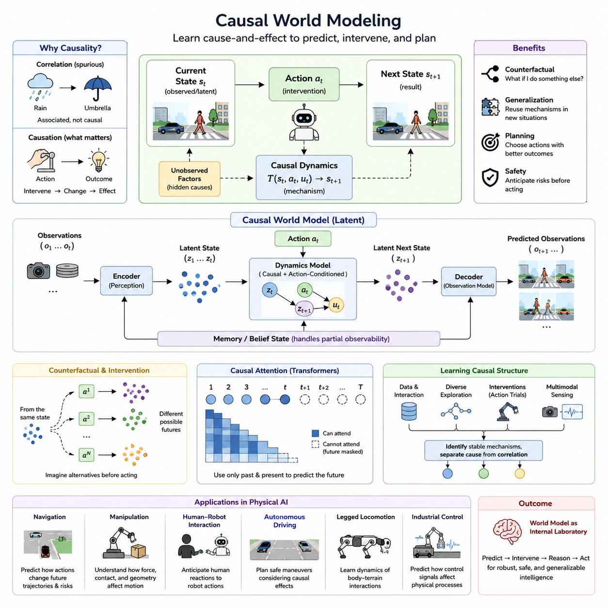
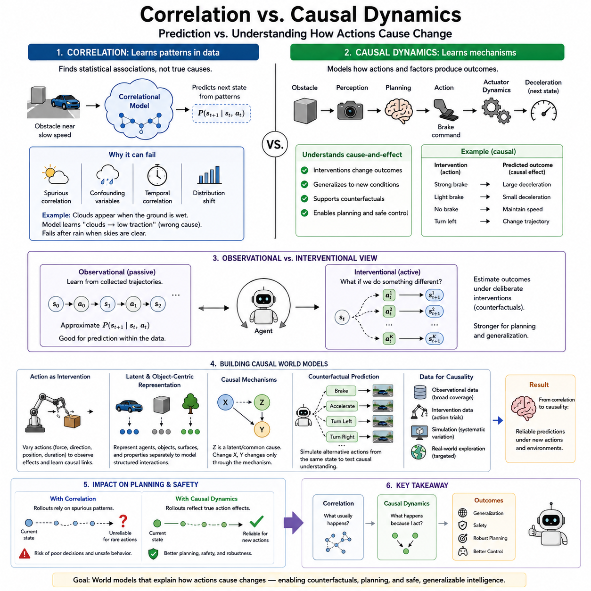
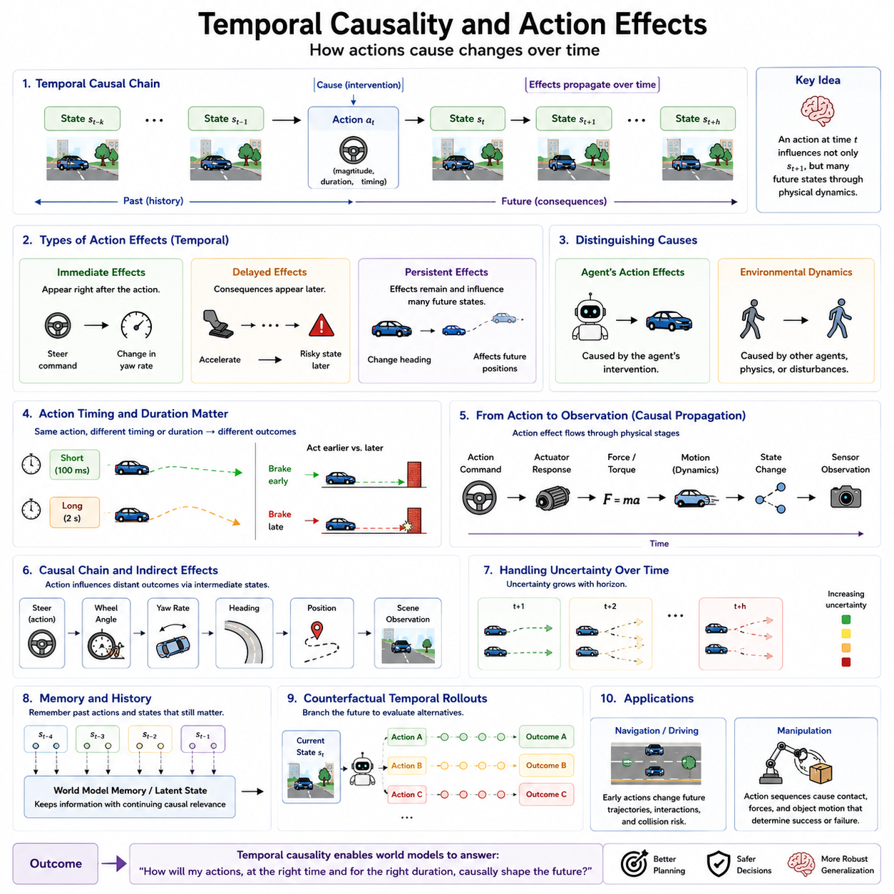
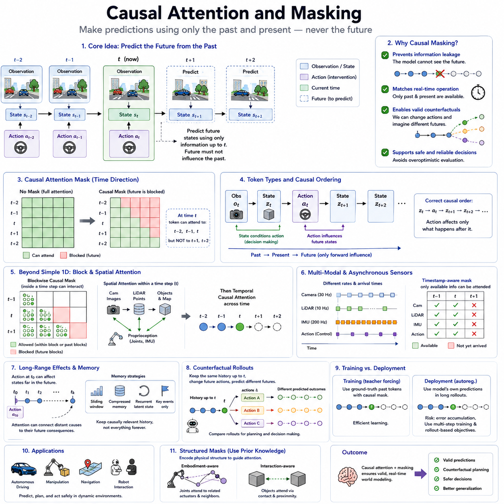
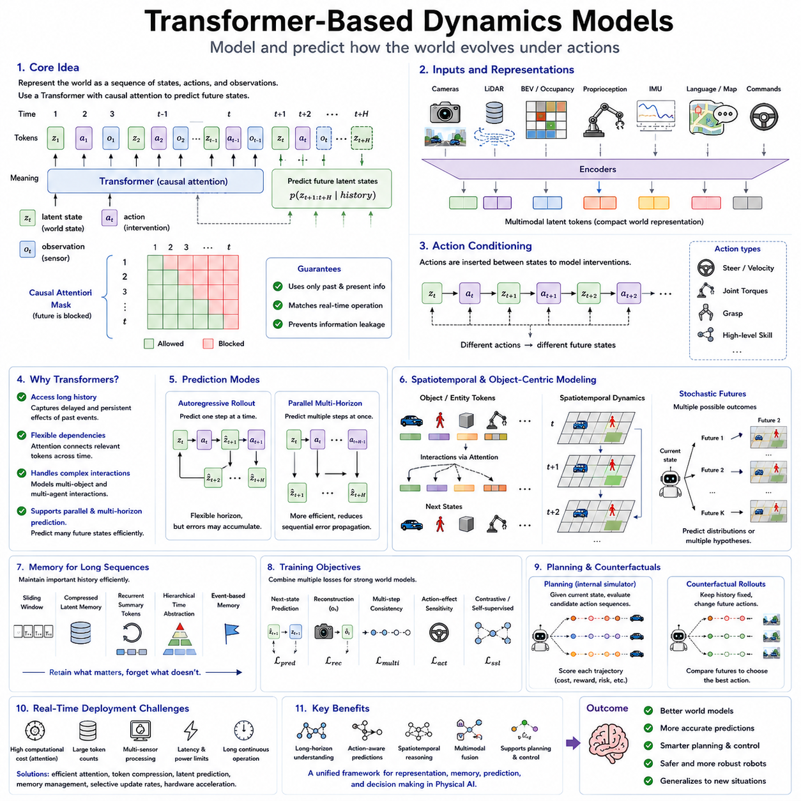
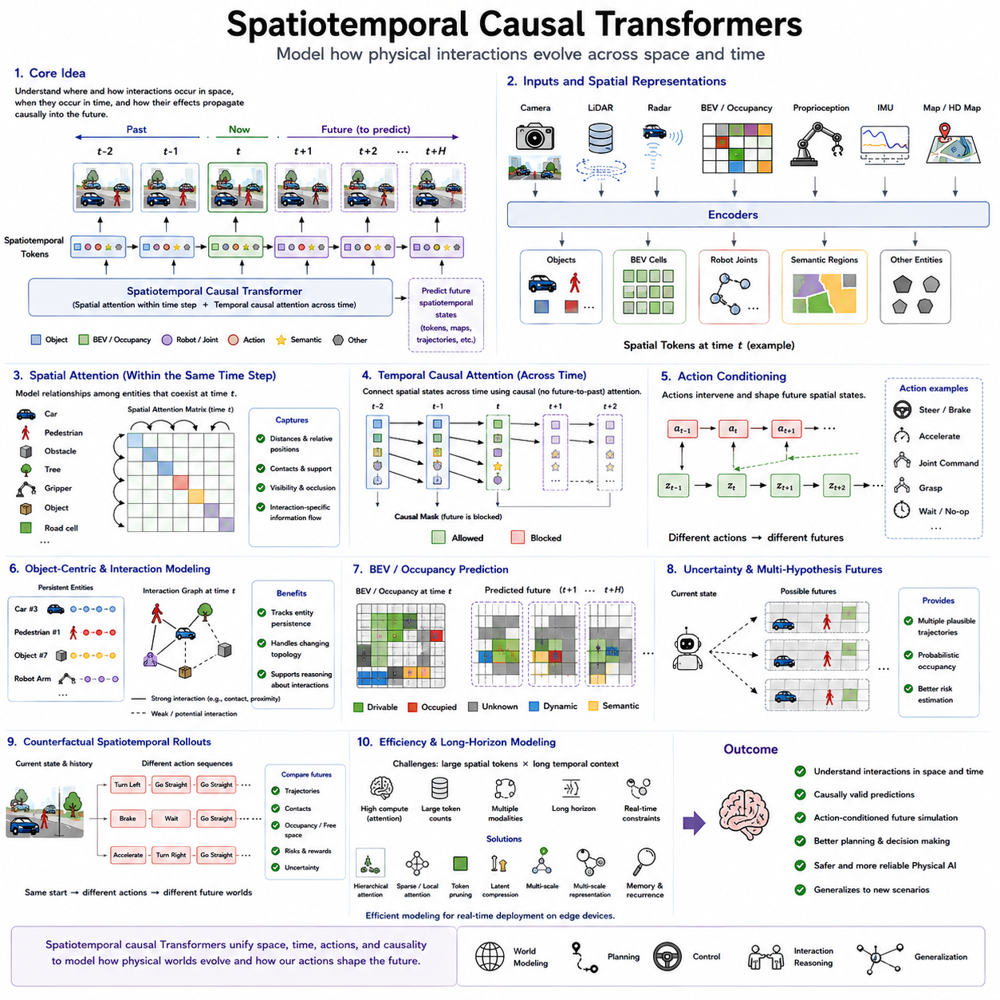
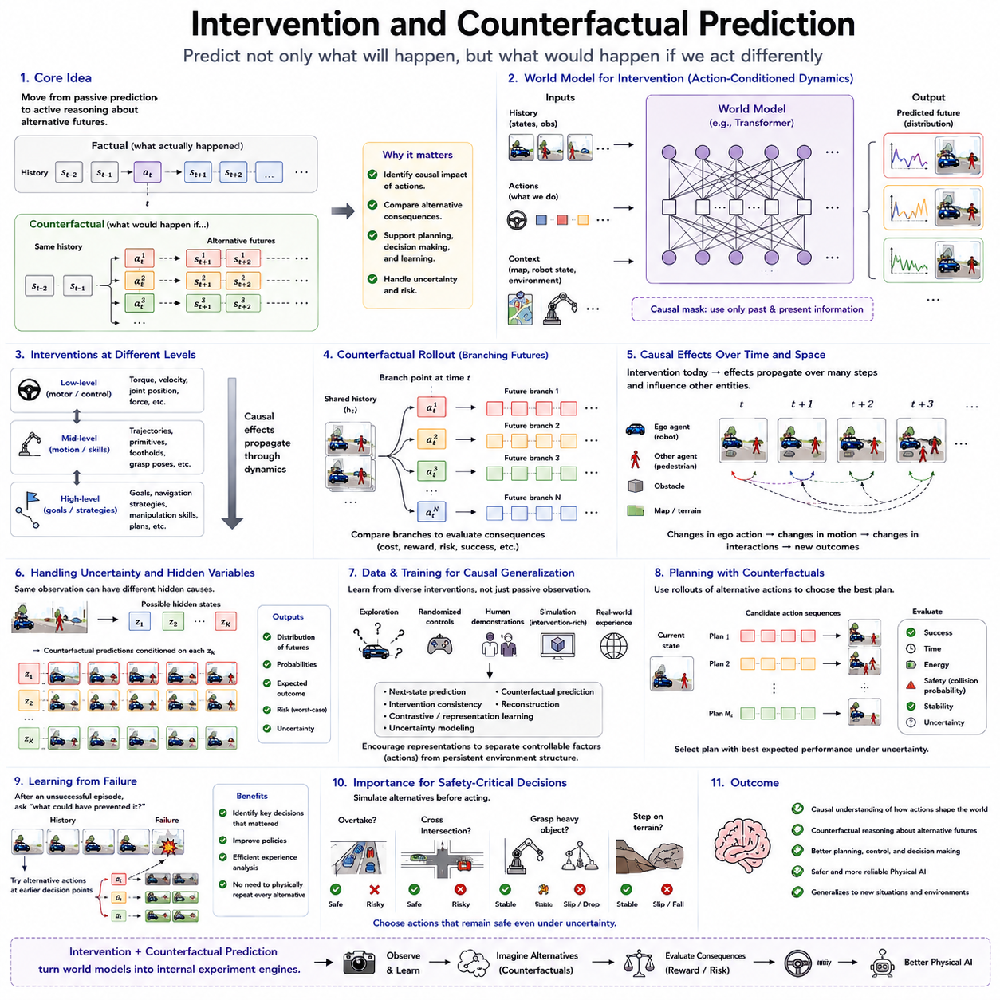
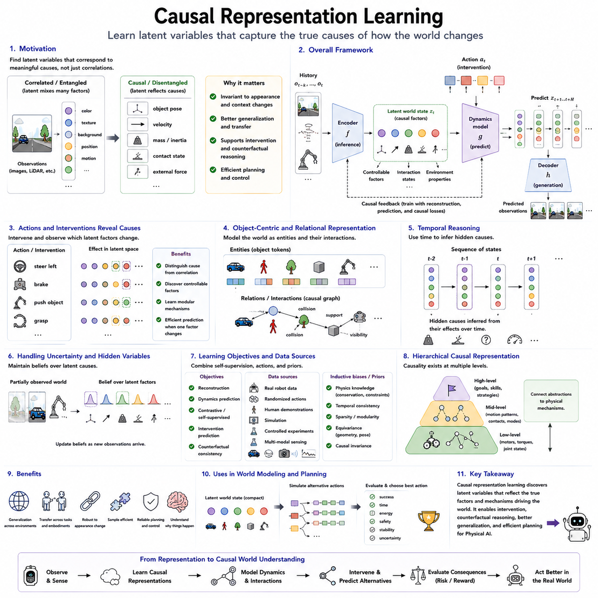
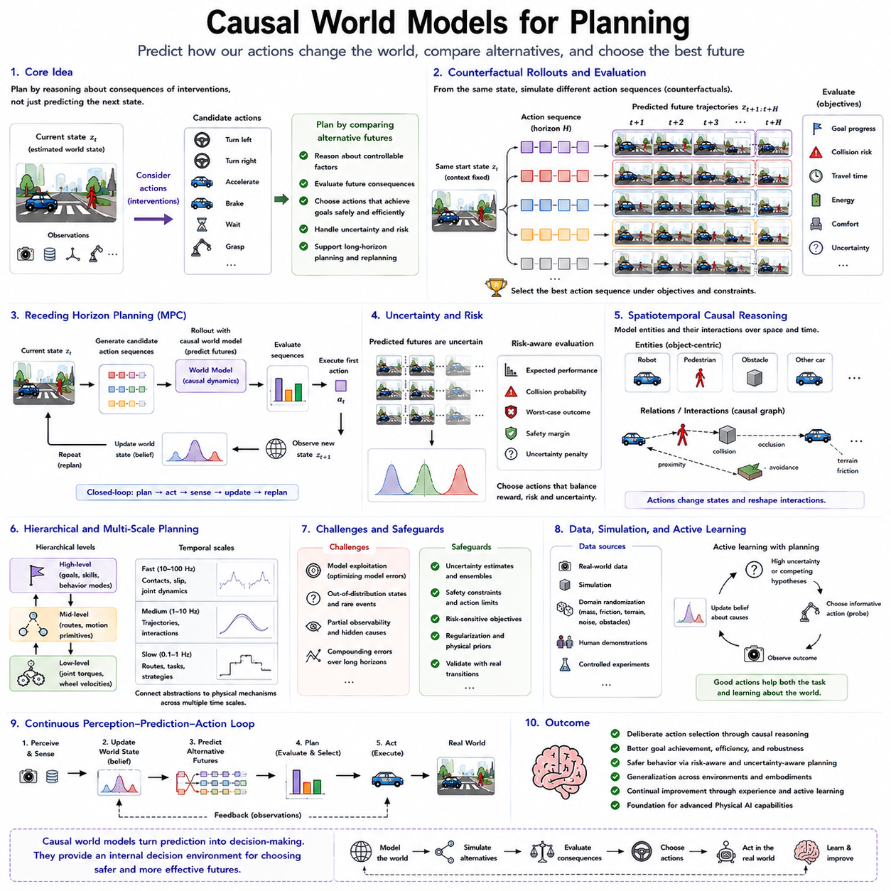
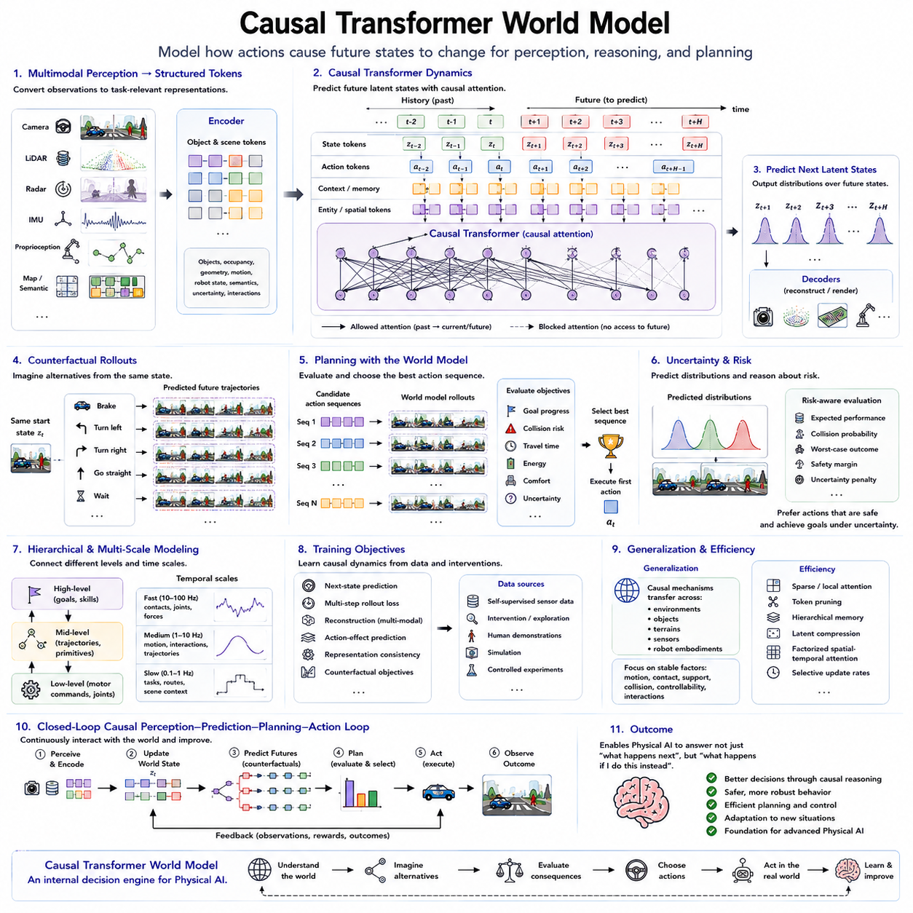

**Volume 07. World Models for Physical AI**

# Chapter 09. Causal Transformer Architectures

## 09.01. Causality in World Modeling

{width="7.268055555555556in" height="7.268055555555556in"}

세계 모델링(World Modeling)에서의 인과성(Causality)은 에이전트(Agent)가 단순히 어떤 현상들이 함께 발생하는지를 표현하는 것을 넘어, 환경(Environment)의 한 부분에서 발생한 변화가 왜 다른 부분의 변화를 만들어 내는지를 표현하는 능력과 관련됩니다. 유용한 세계 모델(World Model)은 따라서 통계적 연관성(Statistical Association)을 넘어 상태(State), 행동(Action), 객체(Object), 사건(Event), 결과(Outcome) 사이의 방향성 있는 관계를 포착해야 합니다. 이러한 능력은 피지컬 AI(Physical AI) 시스템이 자신의 개입(Intervention)이 변화하는 환경에 어떤 결과를 가져올지 예측해야 할 때 필수적입니다.

기존 예측 모델(Predictive Model)은 두 사건 사이에 강한 상관관계(Correlation)가 있다는 사실을 학습할 수 있지만, 하나의 사건이 실제로 다른 사건을 발생시키는지는 이해하지 못할 수 있습니다. 예를 들어 이동 로봇(Mobile Robot)은 문이 닫힐 때 사람들이 출입구 근처에서 자주 멈춘다는 패턴을 관찰할 수 있습니다. 상관관계 기반 모델(Correlation-Based Model)은 이러한 패턴을 재현할 수 있지만, 인과적 세계 모델(Causal World Model)은 문이 닫히면 통로가 차단되고, 이것이 사람의 움직임을 변화시키며, 결과적으로 로봇이 선택할 수 있는 주행 궤적(Navigation Trajectory)을 변화시킨다는 메커니즘(Mechanism)을 표현하려고 합니다.

인과적 세계 모델(Causal World Model)은 상태 전이(State Transition)를 지배하는 의존 관계(Dependency)를 내부적으로 표현하는 모델로 볼 수 있습니다. 현재 세계 상태(World State)가 (s_t)이고, 에이전트가 행동 (a_t)를 수행하며, 환경이 (s_{t+1})로 변화한다면 모델은 해당 행동이 이러한 전이에 어떻게 기여했는지를 학습하면서 동시에 행동과 무관한 환경 변화의 영향은 분리해야 합니다. 이는 일반적인 다음 상태 예측(Next-State Prediction)을 넘어 물리 세계(Physical World)에서 제어 가능한 원인(Controllable Cause)과 제어 불가능한 원인(Uncontrollable Cause)을 이해하는 방향으로 확장됩니다.

행동(Action)은 자연스러운 개입(Intervention)을 제공하기 때문에 특히 중요합니다. 수동적 관찰(Passive Observation)은 무엇이 발생했는지를 보여 주지만, 행동은 에이전트가 어떤 요소를 의도적으로 변화시켰을 때 어떤 일이 발생하는지를 확인할 수 있게 합니다. 로봇이 물체를 밀거나, 속도를 변경하거나, 조향 장치를 움직이거나, 도구를 잡거나, 서랍을 여는 행동은 인과 구조(Causal Structure)에 대한 증거를 생성합니다. 따라서 행동 조건부 세계 모델(Action-Conditioned World Model)은 체화된 상호작용(Embodied Interaction)을 통해 원인과 결과(Cause-and-Effect)의 관계를 학습하기 위한 실용적인 기반이 될 수 있습니다.

시간적 순서(Temporal Order)는 인과성을 추론하는 데 유용한 증거를 제공하지만, 시간적으로 먼저 발생했다는 사실만으로는 충분하지 않습니다. 어떤 사건이 다른 사건보다 먼저 발생했다고 해서 반드시 그 사건이 원인인 것은 아닙니다. 피지컬 AI(Physical AI) 시스템은 실제 행동 효과(Action Effect)를 우연한 시간적 관계, 공통된 외부 원인(External Cause), 센서 지연(Sensor Delay), 숨겨진 변수(Hidden Variable)와 구별해야 합니다. 따라서 세계 모델링(World Modeling)은 시간적 의존성(Temporal Dependency)뿐 아니라 영향이 객체, 에이전트, 환경 과정(Environmental Process)을 통해 어떻게 전달되는지를 설명하는 구조화된 메커니즘(Structured Mechanism)을 표현함으로써 이점을 얻을 수 있습니다.

인과 구조(Causal Structure)는 여러 추상화 수준(Level of Abstraction)에서 표현될 수 있습니다. 낮은 수준에서는 모터 토크(Motor Torque)가 바퀴 가속도(Wheel Acceleration), 접촉력(Contact Force), 변위(Displacement)를 발생시킬 수 있습니다. 중간 수준에서는 조향 명령(Steering Command)이 차량의 방향과 미래 점유 상태(Future Occupancy)를 변화시킬 수 있습니다. 의미론적 수준(Semantic Level)에서는 통로를 개방하는 행동이 목적지에 도달할 수 있는 가능성을 만들어 낼 수 있습니다. 계층적 세계 모델(Hierarchical World Model)은 이러한 수준들을 연결하여 물리적 상호작용(Physical Interaction), 기하학적 전이(Geometric Transition), 작업 수준 결과(Task-Level Consequence)가 서로 다른 예측 시간 범위(Prediction Horizon)에서도 인과적으로 일관성을 유지하도록 할 수 있습니다.

잠재 표현(Latent Representation)은 환경의 완전한 물리적 상태를 관찰하는 것이 거의 불가능하거나 계산적으로 비현실적이기 때문에 유용합니다. 세계 모델(World Model)은 관측(Observation)을 객체, 움직임, 기하 구조, 상호작용 상태 또는 다른 숨겨진 요소를 나타내는 잠재 변수(Latent Variable)로 인코딩할 수 있습니다. 그러나 인과 추론(Causal Reasoning)을 위해서는 잠재 공간(Latent Space)이 미래 상태 전이에 의미 있는 영향을 미치는 변수들을 보존해야 합니다. 관련 요소에 대한 개입이 이후 잠재 상태(Latent State)에 예측 가능하고 해석 가능한 변화를 만들어 낼 때 비로소 압축된 표현(Compact Representation)이 실질적인 가치를 갖습니다.

부분 관측 가능성(Partial Observability)은 인과 추론(Causal Inference)을 특히 어렵게 만듭니다. 로봇은 물체가 갑자기 움직이는 것을 관찰할 수 있지만, 그 움직임을 발생시킨 사람, 기계, 공기 흐름 또는 접촉 사건(Contact Event)을 관찰하지 못할 수도 있습니다. 따라서 내부 세계 모델(Internal World Model)은 숨겨진 원인(Hidden Cause)에 대한 불확실성(Uncertainty)을 유지하고 추가적인 증거가 확보됨에 따라 자신의 믿음(Belief)을 갱신해야 합니다. 메모리(Memory), 시간적 문맥(Temporal Context), 다중모달 센싱(Multimodal Sensing), 믿음 상태 추정(Belief-State Estimation)은 겉으로 드러난 인과 관계와 관측되지 않은 환경 변수에 의해 발생한 상태 전이를 구별하는 데 도움을 줍니다.

반사실적 추론(Counterfactual Reasoning)은 실제로 발생한 미래를 예측하는 것을 넘어 인과 모델링(Causal Modeling)을 확장합니다. 에이전트는 다른 행동을 수행했다면 어떤 일이 발생했을지를 질문합니다. 동일한 상태에서 로봇은 좌회전, 우회전, 제동, 가속, 대기 또는 다른 방식의 물체 조작을 내부적으로 비교할 수 있습니다. 이러한 가상의 대안(Imagined Alternative)은 세계 모델이 실제 행동을 실행하기 전에 행동의 결과를 추정할 수 있도록 하며, 인과 예측(Causal Prediction)을 계획(Planning)과 의사결정(Decision Making)을 위한 실용적인 메커니즘으로 전환합니다.

개입 기반 추론(Intervention-Based Reasoning)은 반사실적 추론과 밀접하게 관련되어 있지만, 관련 문맥(Context)을 고정한 상태에서 선택된 변수를 능동적으로 변화시키는 것에 초점을 둡니다. 단순히 (P(s_{t+1}\|s_t,a_t))를 학습하는 대신 에이전트는 특정 행동을 의도적으로 적용하는 것이 가능한 미래의 분포(Future Distribution)를 어떻게 변화시키는지 이해하려고 합니다. 이러한 구분은 관측 데이터(Observational Data)에 편향(Bias)이나 교란 요인(Confounding Factor)이 포함되어 있을 때 중요합니다. 개입 인식 학습(Intervention-Aware Learning)은 시스템이 실제로 제어할 수 있는 환경 변수와 원하는 결과와 단순히 상관관계를 갖는 변수를 구별하도록 도울 수 있습니다.

인과 모델링(Causal Modeling)은 조합적 일반화(Compositional Generalization)도 지원합니다. 로봇이 물체 밀기, 장애물 회피, 문 열기, 자유 공간 이동에 대한 독립적인 메커니즘을 학습한다면 이러한 메커니즘을 새로운 상황에서 다시 조합할 수 있습니다. 완전한 궤적(Trajectory)을 암기하는 대신 세계 모델은 재사용 가능한 상태 전이 원리(Transition Principle)를 표현합니다. 이러한 모듈형 인과 지식(Modular Causal Knowledge)은 특정 학습 분포(Training Distribution)에 대한 의존성을 줄이고 객체 배치, 환경, 체화 형태(Embodiment), 작업 순서(Task Sequence)가 변화할 때 적응 능력을 향상시킬 수 있습니다.

트랜스포머 아키텍처(Transformer Architecture)는 어텐션(Attention)을 통해 긴 시간적·공간적 문맥에 걸쳐 정보를 연결할 수 있기 때문에 이러한 의존 관계를 학습하기 위한 강력한 계산 프레임워크(Computational Framework)를 제공합니다. 그러나 제한되지 않은 어텐션(Unrestricted Attention)이 자동으로 인과적 이해(Causal Understanding)를 만들어 내는 것은 아닙니다. 미래 상태의 정보가 예측 과정으로 유출되는 것을 방지하려면 적절한 토큰 순서(Token Ordering), 시간적 마스킹(Temporal Masking), 행동 조건화(Action Conditioning), 객체 구조(Object Structure), 학습 목적 함수(Training Objective)가 필요합니다. 따라서 인과적 어텐션(Causal Attention)은 예측 시점에 정당하게 사용할 수 있는 정보만을 기반으로 예측하도록 정보 흐름(Information Flow)을 제한합니다.

피지컬 AI(Physical AI)에서 인과성(Causality)은 궁극적으로 추상적인 표현에 머무르지 않고 실제 행동을 개선해야 합니다. 내비게이션 시스템(Navigation System)은 가속이 정지 거리(Stopping Distance)에 어떤 영향을 주는지, 다른 에이전트의 움직임이 충돌 위험(Collision Risk)을 어떻게 변화시키는지, 자신의 궤적이 미래의 상호작용에 어떤 영향을 미치는지를 이해해야 합니다. 조작 시스템(Manipulation System)은 접촉 위치(Contact Location), 힘(Force), 파지 구성(Grasp Configuration), 객체 제약(Object Constraint)이 움직임을 어떻게 결정하는지 예측해야 합니다. 인과 지식(Causal Knowledge)은 제어 가능한 개입이 물리적 상태를 어떻게 변화시키는지를 설명함으로써 인식(Perception)과 행동(Action)을 연결합니다.

안전성(Safety)은 인과적 세계 모델링(Causal World Modeling)이 중요한 또 다른 이유입니다. 사람 주변에서 작동하는 로봇은 통계적으로 가능성이 높은 미래에만 의존해서는 안 되며, 자신의 행동이 어떻게 위험한 상태(Hazardous State)를 만들어 낼 수 있는지를 평가해야 합니다. 동작을 실행하기 전에 세계 모델은 움직임, 접촉, 장애, 불안정성(Instability), 인간 반응(Human Reaction)을 포함하는 인과적 연쇄(Causal Chain)를 시뮬레이션할 수 있습니다. 이러한 예측을 불확실성 추정(Uncertainty Estimation)과 결합하면 계획기(Planner)는 결과가 충분히 이해되지 않았거나 가능한 결과에 허용할 수 없는 위험이 포함된 행동을 거부할 수 있습니다.

신뢰할 수 있는 인과 구조(Causal Structure)를 학습하는 것은 실제 세계의 데이터셋이 불완전하고, 편향되어 있으며, 노이즈(Noise)를 포함하고, 정보성이 높은 개입보다 일반적인 행동에 의해 지배되기 때문에 여전히 어렵습니다. 동일한 관측 이력(Observation History)에 여러 인과적 설명이 적용될 수 있으며, 드물게 발생하는 상호작용도 안전 측면에서는 매우 중요할 수 있습니다. 다양한 탐색(Exploration), 시뮬레이션(Simulation), 통제된 개입(Controlled Intervention), 반사실적 학습(Counterfactual Training), 다중모달 관측(Multimodal Observation), 물리적 사전 지식(Physical Prior)은 학습 분포에서 안정적인 메커니즘과 우연한 상관관계를 분리하기 위한 상호보완적인 증거를 제공할 수 있습니다.

따라서 인과적 세계 모델링(Causal World Modeling)은 예측(Prediction)과 추론(Reasoning)을 연결하는 다리 역할을 합니다. 예측은 다음에 무엇이 발생할 가능성이 높은지를 질문하는 반면, 인과 추론은 무엇이 그 미래를 만들어 내며 다른 행동을 선택했을 경우 미래가 어떻게 달라지는지를 질문합니다. 잠재 동역학(Latent Dynamics), 행동 조건화(Action Conditioning), 시간적 메모리(Temporal Memory), 불확실성(Uncertainty), 구조화된 어텐션(Structured Attention)과 결합된 인과 표현(Causal Representation)은 피지컬 AI 시스템이 세계 모델을 단순한 시퀀스 예측기(Sequence Predictor)가 아니라 내부 실험 환경(Internal Experimental Environment)으로 활용할 수 있도록 합니다.

장기적인 목표는 서로 다른 환경과 작업에서도 유용하게 유지되는 안정적인 인과 메커니즘(Causal Mechanism)을 학습하는 세계 모델(World Model)을 구축하는 것입니다. 이러한 모델은 어떤 요소가 불변적(Invariant)인지, 어떤 요소가 문맥에 따라 달라지는지, 어떤 요소를 조작할 수 있는지, 특정 개입으로부터 어떤 결과가 발생하는지를 인식해야 합니다. 이러한 능력은 강건한 계획(Robust Planning), 전이(Transfer), 적응(Adaptation), 물리적 추론(Physical Reasoning)을 지원하며, 이후 절에서 다루는 인과적 트랜스포머 아키텍처(Causal Transformer Architecture)와 개입 기반 세계 모델(Intervention-Based World Model)의 개념적 기반을 제공합니다.

## 09.02. Correlation vs Causal Dynamics

{width="7.268055555555556in" height="7.268055555555556in"}

상관관계 기반 동역학 모델(Correlation-Based Dynamics Model)은 관측(Observation), 행동(Action), 미래 상태(Future State) 사이의 통계적 규칙성(Statistical Regularity)을 학습합니다. 특정 패턴이 학습 데이터(Training Data)에서 반복적으로 함께 나타난다면 모델은 이러한 의존 관계를 활용하여 다음에 어떤 일이 발생할 가능성이 높은지를 예측할 수 있습니다. 이러한 접근법은 배포 환경(Deployment Condition)이 학습 분포(Training Distribution)와 유사할 때 뛰어난 예측 정확도를 달성할 수 있지만, 어떤 변수가 실제로 관측된 상태 전이(State Transition)를 발생시키는지를 반드시 밝혀 주는 것은 아닙니다.

상관관계(Correlation)는 통계적 의존성(Statistical Dependence)을 나타내는 반면, 인과성(Causality)은 하나의 변수가 다른 변수를 변화시키는 방향성 있는 메커니즘(Directional Mechanism)을 설명합니다. 로봇은 장애물 근처에서 속도가 감소하는 현상을 자주 관찰하여 장애물과 저속 주행 사이의 강한 연관성을 학습할 수 있습니다. 그러나 장애물이 직접 로봇의 속도를 감소시키는 것은 아닙니다. 장애물에 대한 인식(Perception)이 계획(Planning)에 영향을 주고, 계획기가 제동 명령(Braking Command)을 생성하며, 액추에이터 동역학(Actuator Dynamics)이 감속을 발생시킵니다. 인과 모델(Causal Model)은 이러한 연쇄 관계를 보존하려고 합니다.

이러한 차이는 세계 모델(World Model)에서 특히 중요합니다. 왜냐하면 예측(Prediction)이 궁극적으로 행동(Action)을 지원하기 위해 사용되기 때문입니다. 순수한 상관관계 모델(Correlational Model)은 (s_t)에 포함된 패턴을 기반으로 (s_{t+1})을 예측할 수 있지만, 인과 동역학 모델(Causal Dynamics Model)은 (s_t), 행동 (a_t), 환경 요인(Environmental Factor), 물리적 메커니즘(Physical Mechanism)이 어떻게 함께 작용하여 (s_{t+1})을 생성하는지를 이해하려고 합니다. 따라서 목표는 단순히 정확한 미래 예측이 아니라 에이전트 행동이 의도적으로 변화했을 때도 신뢰할 수 있는 예측을 수행하는 것입니다.

상관관계(Correlation)는 직접적 인과관계(Direct Causation), 역인과관계(Reverse Causation), 공통 원인(Common Cause), 선택 효과(Selection Effect), 데이터셋의 우연한 규칙성(Coincidental Regularity) 등 다양한 이유로 발생할 수 있습니다. 예를 들어 실외 로봇(Outdoor Robot)이 흐린 날씨에서 젖은 지면을 자주 경험한다면 모델은 구름과 낮은 바퀴 접지력(Wheel Traction)을 직접 연관시킬 수 있습니다. 그러나 물리적으로 중요한 중간 변수는 지면의 수분 상태입니다. 비가 그친 뒤 맑은 날씨에 운용된다면 시각적 상관관계에 의존하는 모델은 실패할 수 있지만, 노면 상태(Surface Condition)와 마찰(Friction)을 표현하는 모델은 여전히 유효할 수 있습니다.

교란 변수(Confounding Variable)는 잘못된 상관관계를 만들어 내는 주요 원인입니다. 숨겨진 요인(Hidden Factor)이 관측된 조건과 결과 모두에 영향을 주면 두 변수가 직접 연결된 것처럼 보일 수 있습니다. 피지컬 AI(Physical AI)에서는 지형 특성(Terrain Property), 페이로드(Payload), 배터리 상태(Battery Condition), 온도(Temperature), 액추에이터 열화(Actuator Degradation), 인간 행동(Human Behavior), 관측되지 않은 객체(Unobserved Object) 등이 이러한 요인이 될 수 있습니다. 따라서 강건한 세계 모델(Robust World Model)은 현재 보이는 관측만으로 직접 설명할 수 없는 상태 전이를 설명할 수 있도록 잠재 변수(Latent Variable) 또는 믿음 상태(Belief State)를 유지해야 합니다.

시간적 상관관계(Temporal Correlation)는 또 다른 어려움을 만듭니다. 시퀀스(Sequence)에서 먼저 발생하는 변수는 이후 변수를 예측하는 데 유용한 경우가 많지만, 예측 순서만으로 인과적 영향(Causal Influence)이 성립하는 것은 아닙니다. 센서 스트림(Sensor Stream)에는 지연(Delay), 동기화된 프로세스(Synchronized Process), 반복적인 루틴(Repeated Routine), 환경 주기(Environmental Cycle)가 포함될 수 있습니다. 따라서 인과 동역학 모델링(Causal Dynamics Modeling)은 특히 트랜스포머 아키텍처(Transformer Architecture)가 긴 관측, 상태, 행동 시퀀스에서 의존성을 학습할 때 "A가 B보다 먼저 발생했다"는 것과 "A를 변화시키면 B가 변화한다"는 것을 구별해야 합니다.

행동(Action)은 에이전트가 수행하는 개입(Intervention)을 나타내기 때문에 상관관계와 인과관계를 구분하는 중요한 메커니즘을 제공합니다. 로봇이 물체와 접촉한 후 물체가 움직이는 것을 반복적으로 관찰한다고 가정할 수 있습니다. 로봇은 미는 방향(Pushing Direction), 힘(Force), 접촉 위치(Contact Position), 지속 시간(Duration)을 변화시키면서 이러한 개입이 결과적인 움직임을 어떻게 변화시키는지 확인할 수 있습니다. 이러한 행동 조건부 경험(Action-Conditioned Experience)은 에이전트가 변수를 능동적으로 변화시키고 그 결과의 상태 전이를 관찰하기 때문에 수동적 관찰(Passive Observation)보다 인과 동역학에 대한 더욱 강력한 증거를 제공합니다.

이러한 차이는 관측 분포(Observational Distribution)와 개입 분포(Interventional Distribution)를 통해 표현할 수 있습니다. 기존 예측 모델(Predictive Model)은 수집된 궤적(Trajectory)으로부터 (P(s_{t+1}\\mid s_t,a_t))와 같은 관계를 근사합니다. 인과 추론(Causal Reasoning)은 더 강력한 질문을 제기합니다. 즉, 에이전트가 특정 행동을 의도적으로 적용하거나 관련 변수를 변화시켰다면 어떤 미래 분포(Future Distribution)가 만들어질 것인가를 묻습니다. 이러한 관점은 세계 모델이 데이터셋에서 물려받은 패턴과 에이전트가 세계를 능동적으로 변화시킬 때도 유지되는 메커니즘을 구별할 수 있도록 합니다.

인과 동역학(Causal Dynamics)은 시스템이 분포 변화(Distribution Shift)를 경험할 때 특히 중요합니다. 한 환경에서 학습한 상관관계는 조명, 지형, 객체 외형, 교통 패턴, 로봇의 체화 형태(Embodiment), 운영 절차가 변화하면 사라질 수 있습니다. 반면 안정적인 물리적 메커니즘(Physical Mechanism)은 더욱 신뢰성 있게 전이될 수 있습니다. 외형이 달라져도 질량(Mass)은 가속도에 영향을 미치고, 마찰(Friction)은 접지력에 영향을 주며, 접촉 기하(Contact Geometry)는 객체 움직임을 제한합니다. 따라서 이러한 메커니즘을 학습하면 익숙한 학습 조건을 넘어서는 일반화(Generalization)를 향상시킬 수 있습니다.

객체 중심 표현(Object-Centric Representation)은 이러한 안정적인 관계를 드러내는 데 도움을 줄 수 있습니다. 전체 장면(Scene)을 구별되지 않는 하나의 특징 벡터(Feature Vector)로 인코딩하는 대신 세계 모델은 에이전트, 객체, 표면, 장애물 및 각각의 속성을 개별적으로 표현할 수 있습니다. 이후 상호작용은 접촉(Contact), 지지(Support), 충돌(Collision), 포함(Containment), 가시성(Visibility), 상대 운동(Relative Motion) 등의 관계를 통해 모델링할 수 있습니다. 이러한 구조화된 표현(Structured Representation)은 상태 변화를 임의적인 전체 장면의 상관관계가 아니라 구체적인 상호작용과 연결하기 쉽게 만듭니다.

잠재 동역학 모델(Latent Dynamics Model)은 새로운 가능성과 동시에 문제점도 제공합니다. 이러한 모델은 복잡한 센서 관측(Sensory Observation)을 미래 예측에 필요한 정보를 유지하는 압축된 상태(Compact State)로 변환할 수 있습니다. 그러나 예측력이 높은 잠재 변수(Latent Variable)가 자동으로 인과적인 것은 아닙니다. 표현은 결과와 상관관계를 가지는 지름길 특징(Shortcut Feature)이나 불필요한 요소(Nuisance Feature)를 인코딩할 수도 있습니다. 따라서 인과 표현 학습(Causal Representation Learning)은 독립적으로 변화하는 메커니즘, 제어 가능한 변수, 지속적인 속성(Persistent Property), 의미 있는 상호작용 상태에 더욱 가까운 잠재 요인(Latent Factor)을 학습하는 것을 목표로 합니다.

반사실적 예측(Counterfactual Prediction)은 학습된 동역학이 단순한 상관관계를 넘어서는지를 확인하기 위한 실용적인 방법을 제공합니다. 동일하게 추정된 세계 상태(World State)에서 모델은 서로 다른 행동을 시뮬레이션하고 예측된 결과를 비교할 수 있습니다. 제동, 가속, 좌회전, 우회전이 각각 일관되고 물리적으로 타당한 미래를 만들어 낸다면 모델은 유용한 행동 민감성(Action Sensitivity)을 보여 주는 것입니다. 반대로 행동을 바꾸어도 예측이 거의 달라지지 않거나 기록된 궤적에서 학습한 상관관계만 따라간다면 학습된 동역학이 행동의 인과적 효과를 충분히 표현하지 못하고 있을 가능성이 있습니다.

인과적 트랜스포머(Causal Transformer)는 각 예측 토큰(Prediction Token)이 어떤 정보에 접근할 수 있는지를 제어함으로써 이러한 목표를 지원할 수 있습니다. 시간적 인과 마스킹(Temporal Causal Masking)은 미래 관측이 이전 시점의 예측으로 유출되는 것을 방지하며, 행동 토큰(Action Token)은 이후 상태 토큰(State Token)을 명시적으로 조건화할 수 있습니다. 공간적 관계, 객체 수준 관계, 다중모달 관계(Multimodal Relationship)는 인과적 영향이 장면을 통해 어떻게 전달되는지도 표현할 수 있습니다. 그러나 인과 마스킹(Causal Masking)은 올바른 정보 흐름을 설정할 뿐이며, 그 자체만으로 결과 표현이 실제 물리적 인과관계를 포착한다고 보장하지는 않습니다.

따라서 학습 데이터(Training Data)는 여전히 매우 중요합니다. 수동적 데이터셋(Passive Dataset)은 광범위한 환경 규칙성을 학습하는 데 유용하지만, 개입이 풍부한 궤적(Intervention-Rich Trajectory)은 행동 효과에 대해 더욱 강력한 증거를 제공합니다. 시뮬레이션(Simulation)은 힘, 객체 속성, 지형 매개변수(Terrain Parameter), 제어 명령(Control Command), 환경 조건을 체계적으로 변화시킬 수 있으며, 실제 로봇은 목표 지향적 탐색(Targeted Exploration)과 운영 경험(Operational Experience)을 제공할 수 있습니다. 관측의 다양성과 통제된 개입(Controlled Intervention)을 결합하면 세계 모델이 지속적인 메커니즘과 데이터셋에 특화된 상관관계를 분리하는 데 도움이 됩니다.

계획(Planning)의 관점에서 이러한 차이는 의사결정 품질(Decision Quality)에 직접적인 영향을 줍니다. 계획기(Planner)는 후보 행동(Candidate Action)의 예상 결과를 세계 모델에 질의하여 평가합니다. 모델이 허위 상관관계(Spurious Correlation)에 의존한다면 계획기가 학습 데이터에서 거의 나타나지 않았던 행동을 고려하는 바로 그 순간 가상의 롤아웃(Hypothetical Rollout)이 신뢰할 수 없게 될 수 있습니다. 인과 동역학은 행동과 환경 메커니즘이 현재 상태를 어떻게 변화시키는지를 중심으로 예측을 구성하기 때문에 대안적인 궤적을 평가하기 위한 더욱 강력한 기반을 제공합니다.

안전성(Safety)은 이러한 차이의 중요성을 더욱 증가시킵니다. 드물게 발생하는 위험 상황(Hazardous Situation)은 주요 통계적 패턴에서 벗어나 있는 경우가 많기 때문에 상관관계 기반 예측은 특히 취약할 수 있습니다. 인과 모델(Causal Model)은 과도한 속도가 정지 거리(Stopping Distance)를 증가시키고, 낮은 접지력(Traction)이 제동 거리를 늘리며, 불안정한 접촉(Unstable Contact)이 물체의 낙하를 발생시키는 것과 같은 인과적 연쇄(Causal Chain)를 추론할 수 있습니다. 이러한 기계론적 관계(Mechanistic Relationship)는 정확히 동일한 위험 상황이 학습 데이터에 거의 없거나 전혀 없더라도 유용하게 유지될 수 있습니다.

상관관계(Correlation)와 인과 동역학(Causal Dynamics)을 완전히 대립되는 접근법으로 간주해서는 안 됩니다. 통계적 상관관계는 대규모 데이터로부터 표현(Representation)을 학습하고 예측 구조(Predictive Structure)를 발견하는 데 여전히 필수적입니다. 목표는 유용한 상관관계를 개입, 메커니즘, 불변성(Invariance), 행동 의존적 상태 전이(Action-Dependent Transition)를 더욱 잘 포착하는 모델로 점진적으로 발전시키는 것입니다. 성숙한 피지컬 AI 세계 모델(Physical AI World Model)에서 상관관계는 광범위한 예측 지식을 제공하고, 인과 동역학은 추론과 제어에 필요한 구조적 신뢰성(Structural Reliability)을 제공합니다.

상관관계에서 인과성으로의 전환은 궁극적으로 세계 모델(World Model)의 역할 자체를 변화시킵니다. 모델은 더 이상 단순히 "다음에는 일반적으로 무엇이 발생하는가?"라는 질문에만 답하지 않고, 점차 "내가 이 행동을 수행하기 때문에 무엇이 발생하며, 다른 행동을 했다면 무엇이 달라지는가?"라는 질문에 답하게 됩니다. 이러한 차이는 물리 세계에서 작동하는 자율 지능(Autonomous Intelligence)의 핵심이며, 이후 인과적 트랜스포머 아키텍처(Causal Transformer Architecture)에서 다루게 될 시간적 인과성(Temporal Causality), 인과적 어텐션(Causal Attention), 개입(Intervention), 반사실적 예측(Counterfactual Prediction), 인과적 계획(Causal Planning)의 기반을 제공합니다.

## 09.03. Temporal Causality and Action Effects

{width="7.268055555555556in" height="7.268055555555556in"}

시간적 인과성(Temporal Causality)은 원인과 그 결과가 변수 사이의 고립된 관계로 나타나는 것이 아니라 시간에 걸쳐 어떻게 전개되는지를 설명합니다. 피지컬 AI 세계 모델(Physical AI World Model)에서 행동(Action)의 효과는 즉시 나타날 수도 있고, 점진적으로 누적될 수도 있으며, 여러 번의 상태 전이(State Transition)가 발생한 이후에야 관측될 수도 있습니다. 로봇은 행동이 다음 상태뿐 아니라 이후의 많은 상태까지 변화시키는 동적 환경(Dynamic Environment)과 지속적으로 상호작용하기 때문에 이러한 시간적 의존성(Temporal Dependency)을 이해하는 것이 필수적입니다.

기본적인 시간적 전이(Temporal Transition)는 (s_t, a_t \\rightarrow s_{t+1})로 표현할 수 있으며, 현재 상태(Current State)와 행동(Action)이 다음 상태(Next State)에 영향을 미칩니다. 그러나 실제 물리 시스템(Physical System)은 메모리(Memory), 관성(Inertia), 지연(Delay), 지속적 효과(Persistent Effect)를 포함하는 경우가 많습니다. 따라서 미래 상태는 (s_{t-k:t})와 (a_{t-k:t}) 같은 시퀀스(Sequence)에 의존할 수 있습니다. 유용한 세계 모델(World Model)은 모든 과거 관측을 동일하게 중요하게 처리하는 대신, 이 이력 가운데 어떤 부분이 인과적으로 계속 중요한지를 판단해야 합니다.

즉각적인 행동 효과(Immediate Action Effect)는 로봇 제어(Robotic Control)에서 일반적으로 나타납니다. 모터 토크(Motor Torque)를 적용하면 가속도가 변화하고, 조향(Steering)은 방향 변화율(Heading Rate)을 바꾸며, 그리퍼 명령(Gripper Command)은 접촉 조건(Contact Condition)을 변화시킵니다. 그러나 이러한 직접적으로 보이는 효과조차 여러 물리적 단계를 통해 전달됩니다. 모터 명령은 액추에이터 응답(Actuator Response)을 만들고, 액추에이터 응답은 힘이나 토크를 생성하며, 물리 동역학(Physical Dynamics)은 움직임을 만들고, 움직임은 이후의 센서 관측(Sensory Observation)을 변화시킵니다. 시간적 인과 모델링(Temporal Causal Modeling)은 이러한 영향의 순차적인 전파를 보존하려고 합니다.

지연 효과(Delayed Effect)는 관측 가능한 결과가 최초 행동 이후 상당한 시간이 지나서 나타날 수 있기 때문에 더욱 어렵습니다. 장애물을 향해 가속하는 로봇은 몇 초 동안 안전해 보일 수 있지만 이후 부족한 정지 거리(Stopping Distance)가 심각한 문제가 될 수 있습니다. 마찬가지로 불안정한 파지(Unstable Grasp)는 처음에는 성공한 것처럼 보이지만 나중에 물체가 미끄러지는 결과를 만들 수 있습니다. 세계 모델은 이러한 지연된 결과를 고장이나 실패 직전에 발생한 사건에만 잘못 귀속시키지 않고 이전 행동과 연결해야 합니다.

지속적인 행동 효과(Persistent Action Effect)는 또 다른 중요한 시간적 구조(Temporal Structure)를 형성합니다. 이동 로봇(Mobile Robot)이 진행 방향을 변경하면 조향 명령이 종료된 이후에도 변화된 자세(Orientation)가 이후 여러 위치에 영향을 미칩니다. 물체를 이동시키면 작업 공간(Workspace)의 미래 기하 구조가 변화하고, 문을 열면 이후의 도달 가능성(Reachability)이 달라집니다. 따라서 행동의 인과적 영향(Causal Influence)은 세계 상태(World State) 내부에 지속될 수 있으며, 행동의 결과를 시간에 따라 전달하기 위해서는 정확한 상태 표현(State Representation)이 필수적입니다.

시간적 인과성(Temporal Causality)은 또한 행동 효과(Action Effect)와 환경 동역학(Environmental Dynamics)을 구별해야 합니다. 행동 (a_t) 이후 다음 상태는 로봇의 개입(Intervention), 다른 에이전트의 자율적인 움직임, 물리적 과정(Physical Process), 숨겨진 외란(Hidden Disturbance) 등에 의해 변화할 수 있습니다. 보행자는 로봇과 관계없이 방향을 바꿀 수 있으며, 굴러가는 물체는 운동량(Momentum) 때문에 계속 움직일 수 있습니다. 세계 모델은 외부에서 독립적으로 변화하는 동역학과 에이전트 자신의 행동에 인과적으로 귀속될 수 있는 변화를 분리해야 합니다.

행동 지속 시간(Action Duration)과 실행 시점(Timing)은 인과적 결과를 크게 변화시킬 수 있습니다. 동일한 조향 명령을 100밀리초 동안 적용하는 것과 2초 동안 적용하는 것은 서로 다른 궤적(Trajectory)을 생성하며, 1초 일찍 제동하는 것은 충돌 회피 여부를 결정할 수 있습니다. 따라서 행동 표현(Action Representation)은 크기(Magnitude), 지속 시간(Duration), 실행 시점(Execution Time), 경우에 따라 액추에이터별 매개변수(Actuator-Specific Parameter)를 포함해야 합니다. 시간적 세계 모델(Temporal World Model)은 어떤 행동이 실행되었는지만이 아니라 언제, 얼마나 오랫동안 물리적 영향이 적용되었는지도 학습해야 합니다.

샘플링 속도(Sampling Rate)는 또 다른 문제를 발생시킵니다. 센서와 제어기는 유한하고 서로 다른 주파수(Frequency)로 작동하기 때문에 원인과 결과 사이에서 관측되는 시간적 관계는 부분적으로 관측 해상도(Observation Resolution)에 따라 달라집니다. 카메라 프레임(Camera Frame), 라이다 스캔(LiDAR Scan), 관성 측정 장치 측정값(IMU Measurement), 모터 명령(Motor Command), 계획 업데이트(Planning Update)는 비동기적으로 도착할 수 있습니다. 따라서 잘못된 타임스탬프(Timestamp)는 결과가 원인보다 먼저 발생한 것처럼 보이게 하거나 개입과 반응 사이의 실제 지연을 감출 수 있으므로 시간 정렬(Temporal Alignment)과 동기화(Synchronization)가 중요합니다.

인과적 시간 추론(Causal Temporal Reasoning)은 직접 효과(Direct Effect)와 간접 효과(Indirect Effect)도 구별해야 합니다. 조향 행동은 직접적으로 바퀴 각도(Wheel Angle)를 변화시키고, 이는 차량의 요 변화율(Yaw Rate)을 바꾸며, 다시 진행 방향(Heading)을 변화시키고, 위치(Position)를 변화시킨 후 최종적으로 보이는 장면(Visible Scene)을 변화시킬 수 있습니다. 이러한 변수들은 시간에 걸친 인과적 연쇄(Causal Chain)를 형성합니다. 중간 상태(Intermediate State)를 모델링하면 세계 모델은 명령과 최종 관측 사이의 통계적 연관성만 학습하는 대신 초기 행동이 먼 미래의 결과까지 어떻게 전파되는지를 설명할 수 있습니다.

장기 예측(Long-Horizon Prediction)은 시간적 인과 구조(Temporal Causal Structure)의 중요성을 더욱 크게 만듭니다. 즉각적인 행동 효과를 추정할 때 발생한 작은 오류도 반복적인 상태 전이를 거치면서 누적되어 예측 궤적(Predicted Trajectory)이 현실과 크게 달라질 수 있습니다. 인과 모델(Causal Model)은 시간에 걸쳐 일관되게 유지되는 메커니즘(Mechanism)을 보존함으로써 이러한 불안정성을 일부 줄일 수 있습니다. 그러나 외란, 숨겨진 변수(Hidden Variable), 다른 에이전트와의 상호작용으로 인해 여러 가능한 인과 경로(Causal Pathway)가 발생하므로 예측 범위가 미래로 길어질수록 불확실성(Uncertainty)은 증가해야 합니다.

메모리 메커니즘(Memory Mechanism)은 아직 결과가 완전히 나타나지 않은 원인에 대한 정보를 유지하는 데 도움을 줍니다. 순환 상태 공간 모델(Recurrent State-Space Model), 시간적 잠재 상태(Temporal Latent State), 트랜스포머 문맥(Transformer Context), 명시적 세계 모델 메모리(Explicit World-Model Memory)는 관련된 과거 정보를 유지할 수 있습니다. 효과적인 메모리는 단순히 모든 정보를 저장해서는 안 되며, 지속적인 예측적 또는 인과적 중요성(Predictive or Causal Significance)을 갖는 변수를 유지해야 합니다. 이를 통해 모델은 이전의 개입과 지연된 결과를 연결하면서 미래에 더 이상 영향을 주지 않는 과거의 세부 정보는 제거할 수 있습니다.

트랜스포머 아키텍처(Transformer Architecture)는 어텐션(Attention)을 통해 멀리 떨어진 상태와 행동을 직접 연결할 수 있기 때문에 장기적인 시간 의존성(Long Temporal Dependency)을 모델링하는 데 특히 적합합니다. 인과 마스킹(Causal Masking)은 각각의 예측이 현재와 과거에서 이용 가능한 정보만 사용하도록 제한하여 미래 관측(Future Observation)이 이전 예측으로 유출되는 것을 방지합니다. 행동 토큰(Action Token)은 시간적 시퀀스에 삽입되어 이후 상태 표현(State Representation)이 앞선 개입을 명시적으로 참조하도록 할 수 있으며, 이를 통해 아키텍처는 행동 효과가 여러 시간 단계에 걸쳐 어떻게 전파되는지를 학습할 수 있습니다.

그러나 시간적 마스킹(Temporal Masking)만으로 실제 인과관계(True Causal Relationship)가 확립되는 것은 아닙니다. 트랜스포머(Transformer)는 반복되는 시퀀스나 서로 상관된 환경 패턴(Environmental Pattern)을 기반으로 여전히 지름길(Shortcut)을 발견할 수 있습니다. 더욱 강력한 인과 학습(Causal Learning)을 위해서는 행동 다양성(Action Diversity), 개입(Intervention), 반사실적 비교(Counterfactual Comparison), 물리적 제약(Physical Constraint), 유사한 초기 상태에서 서로 다른 결과가 나타나는 데이터가 필요합니다. 동일하거나 비교 가능한 상황 이후 서로 다른 행동이 수행되면 모델은 어떤 미래 변화가 특정 행동에 의해 발생했는지를 판단할 수 있는 중요한 증거를 얻습니다.

반사실적 시간 롤아웃(Counterfactual Temporal Rollout)은 선택된 시점에서 미래를 여러 갈래로 분기함으로써 이러한 구조를 활용합니다. 상태 (s_t)에서 시작하여 세계 모델은 대안 행동 (a_t\^1, a_t\^2,\\ldots,a_t\^n)을 적용하고 각각의 선택을 여러 미래 상태로 전개할 수 있습니다. 이렇게 생성된 궤적은 즉각적인 결과와 지연된 결과를 모두 보여 줍니다. 따라서 계획(Planning)은 행동이 다음 상태에 미치는 효과만 비교하는 것이 아니라 해당 개입이 만들어 낼 수 있는 전체적인 후속 상태의 연쇄(Chain of Downstream States)를 비교할 수 있습니다.

시간적 인과 추론(Temporal Causal Reasoning)은 내비게이션(Navigation)과 자율주행(Autonomous Driving)에서 특히 중요합니다. 가속은 미래 속도와 정지 거리에 영향을 미치고, 조향은 이후의 차선 위치(Lane Position)를 변화시키며, 조기에 수행한 회피 기동(Evasive Maneuver)은 몇 초 후 발생할 위험한 상호작용을 방지할 수 있습니다. 즉각적인 상태 변화만 평가하는 계획기(Planner)는 국소적으로는 합리적이지만 전체적으로는 위험한 행동을 선택할 수 있습니다. 반면 인과적 세계 모델(Causal World Model)은 현재의 개입이 미래 궤적, 점유 상태(Occupancy), 상호작용 가능성(Interaction Opportunity), 충돌 위험(Collision Risk)을 어떻게 재구성하는지를 평가합니다.

조작(Manipulation)에서도 더 짧지만 매우 복잡한 시간 척도(Time Scale)에서 유사한 사례가 나타납니다. 파지 명령(Grasp Command)은 손가락 구성(Finger Configuration)을 변화시키고, 접촉을 형성하며, 힘을 발생시키고, 객체 자세(Object Pose)를 변화시키며, 이후 움직임 동안 물체가 안정적으로 유지되는지를 결정합니다. 따라서 조작 작업의 성공 또는 실패는 여러 제어 주기(Control Cycle) 이전에 발생한 인과적 사건에 의해 결정될 수 있습니다. 시간적 모델링(Temporal Modeling)은 시스템이 최종 성공이나 실패를 그것을 발생시킨 접촉, 힘, 행동의 시퀀스와 연결할 수 있도록 합니다.

계획(Planning)을 위해 행동 효과(Action Effect)는 하나의 결정론적 결과(Deterministic Outcome)가 아니라 분포(Distribution)로 표현되는 것이 이상적입니다. 동일한 명령이라도 불확실한 마찰(Uncertain Friction), 액추에이터 노이즈(Actuator Noise), 객체 속성(Object Property), 인간 행동(Human Behavior), 불완전한 관측(Incomplete Observation) 때문에 서로 다른 미래를 만들어 낼 수 있습니다. 시간적 인과 세계 모델(Temporal Causal World Model)은 이러한 불확실성을 행동 효과와 함께 전파하여 여러 개의 가능한 궤적(Plausible Trajectory)을 생성할 수 있습니다. 계획기는 충분히 넓은 범위의 가능한 미래에서도 인과적 결과가 허용 가능한 행동을 선호할 수 있습니다.

궁극적으로 시간적 인과성(Temporal Causality)은 세계 모델(World Model)을 단순한 시퀀스 예측기(Sequence Predictor)에서 시간에 따라 진화하는 개입 효과(Intervention Effect)를 모델링하는 시스템으로 변화시킵니다. 핵심 질문은 단순히 어떤 상태 다음에 어떤 상태가 나타나는지가 아니라, 특정 시점에 도입된 행동이 물리 동역학(Physical Dynamics)을 통해 어떻게 전파되고 이후의 가능성을 어떻게 재구성하는가입니다. 이러한 관점은 이후 인과적 트랜스포머 아키텍처(Causal Transformer Architecture)에서 다루는 인과적 어텐션(Causal Attention), 트랜스포머 기반 동역학(Transformer-Based Dynamics), 개입 모델링(Intervention Modeling), 반사실적 계획(Counterfactual Planning)의 기반을 제공합니다.

## 09.04. Causal Attention and Masking

{width="7.268055555555556in" height="7.268055555555556in"}

인과적 어텐션(Causal Attention)은 특정 시점의 예측이 과거와 현재에서 정당하게 이용할 수 있는 정보에만 의존하도록 트랜스포머(Transformer)를 제한하는 메커니즘입니다. 세계 모델링(World Modeling)에서는 미래 관측(Future Observation)이 이전 상태의 예측에 영향을 주어서는 안 되기 때문에 이러한 제한이 필수적입니다. 이러한 제약이 없다면 모델은 높은 학습 정확도를 달성하면서도 피지컬 AI(Physical AI) 시스템이 실제 온라인 환경에서 동작할 때 재현할 수 없는 비현실적인 정보 흐름(Information Flow)을 학습할 수 있습니다.

표준 자기 어텐션(Self-Attention)은 시퀀스(Sequence)의 모든 토큰(Token)이 잠재적으로 다른 모든 토큰을 참조할 수 있도록 합니다. 전체 시퀀스가 이미 주어진 상황에서는 유용하지만 예측형 세계 모델(Predictive World Model)은 다르게 동작합니다. 상태 (s_{t+1})을 추정할 때 모델은 시간 (t)까지 이용 가능한 상태(State), 관측(Observation), 행동(Action), 문맥 변수(Contextual Variable)에 접근해야 하며 (t+1) 이후의 정보에는 접근해서는 안 됩니다. 인과적 어텐션은 이러한 시간적 방향성을 트랜스포머 계산 내부에 직접 적용합니다.

이러한 제한은 일반적으로 인과적 어텐션 마스크(Causal Attention Mask)를 사용하여 구현됩니다. 시간 위치 (t)의 토큰에 대해 미래 위치에 해당하는 어텐션 가중치(Attention Weight)는 소프트맥스(Softmax) 연산 이전에 차단됩니다. 개념적으로 결과적인 어텐션 행렬(Attention Matrix)은 각 토큰이 자기 자신과 이전 토큰을 참조할 수 있지만 미래 토큰은 볼 수 없는 삼각형 구조(Triangular Structure)를 갖습니다. 이러한 간단한 계산적 제약은 시간에 따른 예측에 적합한 자기회귀적 정보 구조(Autoregressive Information Structure)를 생성합니다.

마스킹(Masking)을 보다 넓은 과학적 의미의 인과성(Causality)과 혼동해서는 안 됩니다. 인과 마스크(Causal Mask)는 미래 정보가 이전 예측으로 유출되지 않도록 보장하지만, 모델이 실제 원인과 결과 메커니즘(Cause-and-Effect Mechanism)을 발견했다는 것을 증명하지는 않습니다. 트랜스포머는 여전히 과거 변수 사이의 상관관계(Correlation)를 학습할 수 있습니다. 따라서 인과 마스킹은 시간적으로 유효한 예측을 위한 아키텍처적 기반을 제공하며, 더욱 강력한 인과 표현(Causal Representation)을 개발하려면 개입 데이터(Intervention Data)와 행동 조건부 학습(Action-Conditioned Learning)이 필요합니다.

인과적 어텐션을 세계 모델에 적용할 때 토큰 설계(Token Design)가 중요해집니다. 하나의 시퀀스에는 관측 토큰 (o_t), 잠재 상태 토큰(Latent State Token) (z_t), 행동 토큰(Action Token) (a_t), 객체 토큰(Object Token), 고유수용성 측정값(Proprioceptive Measurement), 기타 센서 표현(Sensor Representation)이 포함될 수 있습니다. 이들의 순서는 어떤 변수가 이후 예측에 영향을 줄 수 있는지를 결정합니다. 일반적인 구조에서는 현재 상태가 행동 표현을 조건화하고 상태와 행동 정보 모두가 예측된 미래 상태에 영향을 줄 수 있도록 구성합니다.

행동 토큰(Action Token)은 미래 동역학(Future Dynamics)을 변화시키는 개입(Intervention)을 나타내기 때문에 특히 세심한 마스킹이 필요합니다. 행동 (a_t)는 (s_{t+1}, s_{t+2}) 및 그 이후 상태의 예측에 영향을 주어야 하지만, 행동이 실행되기 전에 존재했던 물리적 상태의 표현을 소급하여 변화시켜서는 안 됩니다. 따라서 적절한 인과적 순서(Causal Ordering)는 (s_t \\rightarrow a_t \\rightarrow s_{t+1})의 방향을 인코딩하며, 모델이 개입과 그 이후의 결과(Downstream Consequence)를 연결하도록 도와줍니다.

세계 모델(World Model)은 단순한 1차원 삼각형 행렬보다 더욱 정교한 마스크를 필요로 하는 경우가 많습니다. 하나의 시간 단계(Time Step)에는 여러 카메라, 라이다(LiDAR) 영역, 객체, 조감도 셀(BEV Cell), 관절(Joint), 의미론적 개체(Semantic Entity)를 표현하는 수백 또는 수천 개의 토큰이 포함될 수 있습니다. 동일한 시간 단계 내부의 토큰들은 양방향 상호작용(Bidirectional Interaction)이 필요할 수 있지만 서로 다른 시간 단계 사이의 통신은 인과적이어야 합니다. 블록 단위 인과 마스크(Blockwise Causal Mask)는 하나의 시간 블록 내부에서는 제한 없는 어텐션을 허용하면서 미래 블록으로부터의 정보 유출을 방지할 수 있습니다.

공간적 어텐션(Spatial Attention)과 시간적 어텐션(Temporal Attention)을 분리할 수도 있습니다. 공간적 어텐션은 동일한 시점의 객체 또는 장면 영역(Scene Region)이 정보를 교환하도록 하여 근접성(Proximity), 접촉(Contact), 가시성(Visibility), 충돌 기하(Collision Geometry) 등의 관계를 포착합니다. 이후 시간적 인과 어텐션(Temporal Causal Attention)이 이러한 표현을 연속적인 상태 사이에서 연결합니다. 물리적 상호작용은 공간적으로 발생하면서 그 결과는 시간에 따라 미래로 전파되기 때문에 이러한 분해는 피지컬 AI에 특히 유용합니다.

다중모달 세계 모델(Multimodal World Model)은 추가적인 마스킹 요구사항을 갖습니다. 카메라(Camera), 라이다(LiDAR), 레이더(Radar), 관성 측정 장치(IMU), 고유수용감각(Proprioception), 언어(Language), 제어 신호(Control Signal)는 서로 다른 속도로 샘플링되고 서로 다른 시점에 이용 가능해질 수 있습니다. 유효한 어텐션 패턴(Attention Pattern)은 데이터셋의 저장 순서에 따라 모든 측정값을 단순하게 배치하는 것이 아니라 실제 정보 가용성(Information Availability)을 반영해야 합니다. 타임스탬프 인식 마스킹(Timestamp-Aware Masking)은 실시간 운용 시 아직 도착하지 않았을 센서 측정값에 예측 모델이 접근하는 것을 방지할 수 있습니다.

인과적 어텐션은 장기적인 행동 효과(Long-Range Action Effect)를 표현하기 위한 자연스러운 메커니즘도 제공합니다. 미래 상태 토큰은 오래전에 수행된 행동이라도 여전히 관련성이 있다면 해당 행동을 직접 참조할 수 있습니다. 이는 기존 순환 아키텍처(Recurrent Architecture)처럼 인과 정보를 모든 중간 은닉 상태(Intermediate Hidden State)를 통해 순차적으로 전달해야 하는 문제를 줄여 줍니다. 따라서 어텐션은 시간의 전방향성(Forward Direction)을 유지하면서 지연 효과(Delayed Effect)와 지속 효과(Persistent Effect)를 포착할 수 있습니다.

그러나 전체 과거 정보에 대한 제한 없는 접근은 궤적(Trajectory)이 길어질수록 계산 비용이 크게 증가할 수 있습니다. 피지컬 AI 시스템은 수분, 수시간 또는 그 이상 지속적으로 동작하면서 막대한 토큰 이력(Token History)을 생성할 수 있습니다. 따라서 실제 아키텍처는 인과적 어텐션과 슬라이딩 문맥 윈도우(Sliding Context Window), 압축 메모리(Compressed Memory), 순환 잠재 상태(Recurrent Latent State), 계층적 시간 표현(Hierarchical Temporal Representation), 선택된 핵심 사건(Key Event)을 결합합니다. 목표는 모든 원시 관측(Raw Observation)을 무기한 보존하지 않으면서 인과적으로 중요한 이력을 유지하는 것입니다.

어텐션 가중치(Attention Weight) 자체의 해석에도 주의해야 합니다. 이전 행동과 이후 상태 사이의 높은 어텐션 가중치가 반드시 해당 행동이 상태 전이를 발생시켰다는 것을 의미하지는 않습니다. 어텐션은 네트워크가 계산을 위해 정보를 어떻게 전달하는지를 나타내는 것이지 공식적인 인과관계(Formal Causal Relationship)를 의미하는 것은 아닙니다. 신뢰할 수 있는 인과 해석(Causal Interpretation)을 위해서는 개입(Intervention), 반사실적 실험(Counterfactual Experiment), 서로 다른 환경에서의 불변성(Invariance), 또는 학습 과정에서 명시적인 인과 목적 함수(Causal Objective)를 활용한 추가적인 증거가 필요합니다.

반사실적 세계 모델링(Counterfactual World Modeling)은 동일한 과거 문맥(Historical Context)을 유지하면서 미래 행동 토큰을 교체하는 방식으로 인과적 어텐션을 활용할 수 있습니다. 상태 (s_t)가 주어지면 모델은 대안 행동(Alternative Action)을 삽입하고 서로 다른 미래 상태 시퀀스를 자기회귀적으로 생성할 수 있습니다. 미래 관측이 마스킹되어 있기 때문에 각각의 롤아웃(Rollout)은 현재 상태, 과거 문맥, 선택된 개입만을 기반으로 생성되어야 합니다. 이를 통해 실제 발생한 궤적의 미래 정보에 오염되지 않고 가상의 미래(Hypothetical Future)를 비교할 수 있는 계산적 기반이 형성됩니다.

학습 과정에서는 일반적으로 이전 문맥으로부터 미래 토큰이나 잠재 상태를 예측하면서 인과 마스킹(Causal Masking)을 적용합니다. 교사 강요(Teacher Forcing)는 학습 중 실제 정답 과거 토큰(Ground-Truth Historical Token)을 효율적으로 제공할 수 있지만, 실제 배포(Deployment)에서 장기 롤아웃을 수행할 때는 모델이 자신의 예측 결과를 다시 입력으로 사용해야 합니다. 이러한 차이는 오류 누적(Error Accumulation)과 분포 변화(Distribution Shift)를 발생시킬 수 있습니다. 다단계 목적 함수(Multi-Step Objective), 스케줄된 예측(Scheduled Prediction), 잠재 일관성 제약(Latent Consistency Constraint), 롤아웃 기반 학습(Rollout-Based Training)은 인과적 트랜스포머가 실행 가능한 세계 모델로 사용될 때 강건성(Robustness)을 향상시킬 수 있습니다.

마스크 설계(Mask Design)는 알려진 구조적 제약(Structural Constraint)을 추가로 인코딩할 수도 있습니다. 예를 들어 로봇 관절 토큰(Robot Joint Token)은 관련 액추에이터 명령과 인접한 신체 구성 요소(Body Component)를 주로 참조하도록 구성할 수 있으며, 객체 상호작용 토큰(Object Interaction Token)은 접촉 관계(Contact Relationship)를 통해 정보를 교환하도록 만들 수 있습니다. 이러한 구조화된 마스크(Structured Mask)는 시간적 인과성과 체화(Embodiment) 및 물리적 토폴로지(Physical Topology)에 대한 사전 지식(Prior Knowledge)을 결합합니다. 이를 통해 불필요한 어텐션 연결을 줄이고 물리적으로 의미 있는 상호작용 경로를 중심으로 예측을 구성하도록 유도할 수 있습니다.

계획(Planning)에서 인과 마스킹은 가상의 미래가 각 가상 사건이 발생하기 전에 이용 가능한 정보만을 사용하도록 보장합니다. 후보 행동 시퀀스(Candidate Action Sequence)를 트랜스포머에 삽입하면 모델은 기록된 미래의 관측을 실수로 사용하지 않으면서 해당 행동에 대응하는 궤적을 예측할 수 있습니다. 이후 계획기(Planner)는 행동을 실제로 실행하기 전에 충돌 위험(Collision Risk), 작업 진행도(Task Progress), 에너지 소비(Energy Consumption), 안정성(Stability), 보상(Reward) 또는 기타 목적을 기준으로 대안 롤아웃을 비교할 수 있습니다.

안전성(Safety) 측면에서도 이러한 구조는 매우 중요합니다. 정보 유출(Information Leakage)은 실제보다 지나치게 낙관적인 평가 결과를 만들어 낼 수 있기 때문입니다. 학습이나 시험 과정에서 미래 상태에 간접적으로 접근하는 모델은 매우 정확해 보일 수 있지만 실제 온라인 배포에서는 심각하게 실패할 수 있습니다. 따라서 트랜스포머 세계 모델이 실시간 자율 의사결정(Real-Time Autonomous Decision Making)을 지원하도록 설계될 경우 엄격한 인과 마스킹, 타임스탬프 검증(Timestamp Validation), 시퀀스 구성(Sequence Construction), 실제 배포 조건과 동일한 평가(Deployment-Equivalent Evaluation)가 중요한 엔지니어링 요구사항이 됩니다.

궁극적으로 인과적 어텐션(Causal Attention)과 마스킹(Masking)은 트랜스포머 세계 모델(Transformer World Model) 내부에서 허용되는 정보 흐름을 정의합니다. 이들은 미래는 과거로부터 예측되어야 하며 행동은 해당 행동 이후에 발생하는 상태에만 영향을 미쳐야 한다는 원칙을 강제합니다. 시간적 메모리(Temporal Memory), 다중모달 동기화(Multimodal Synchronization), 구조화된 표현(Structured Representation), 개입(Intervention), 반사실적 학습(Counterfactual Training)과 결합되면 이러한 아키텍처는 이후 절에서 다루는 트랜스포머 기반 동역학 모델(Transformer-Based Dynamics Model)과 시공간 인과 추론(Spatiotemporal Causal Reasoning)을 위한 계산적 기반을 제공합니다.

## 09.05. Transformer Based Dynamics Models

{width="7.268055555555556in" height="7.268055555555556in"}

트랜스포머 기반 동역학 모델(Transformer-Based Dynamics Model)은 환경(Environment)의 변화를 상태(State), 관측(Observation), 행동(Action), 기타 문맥 변수(Contextual Variable)의 구조화된 시퀀스(Structured Sequence)로 표현합니다. 고정된 순환 전이(Recurrent Transition)만을 통해 미래 상태를 예측하는 대신, 어텐션(Attention)을 사용하여 여러 과거 시간 단계 사이의 관계를 파악합니다. 이러한 특성은 현재 동역학(Current Dynamics)이 최근 상호작용뿐 아니라 훨씬 이전에 발생한 사건에도 의존할 수 있는 피지컬 AI(Physical AI)의 세계 모델(World Model)에 트랜스포머를 적합하게 만듭니다.

기본적인 구성에서는 궤적(Trajectory)을 잠재 상태(Latent State) (z_t), 행동(Action) (a_t), 관측(Observation) (o_t), 또는 선택된 물리 변수(Physical Variable)를 나타내는 토큰(Token)으로 변환합니다. 트랜스포머(Transformer)는 (z_1,a_1,z_2,a_2,\\ldots,z_t,a_t)와 같은 시퀀스를 처리하여 (z_{t+1}) 또는 여러 미래 상태(Future State)를 예측합니다. 인과 마스킹(Causal Masking)은 각 예측이 과거와 현재에서 이용 가능한 정보만 사용하도록 보장하여 시간적으로 유효한 상태 변화 모델을 구성합니다.

현재 상태와 행동만으로 다음 상태를 충분히 예측할 수 있다고 가정하는 기존 마르코프 모델(Markov Model)과 달리, 트랜스포머는 확장된 과거 이력(Extended History)에 접근할 수 있습니다. 이는 현재 관측이 물리적 상황(Physical Situation)을 완전히 설명하지 못할 때 유용합니다. 이전의 접촉(Contact), 가속 이력(Acceleration History), 객체 상호작용(Object Interaction), 액추에이터 명령(Actuator Command), 숨겨진 환경 변화(Hidden Environmental Change)가 여전히 중요할 수 있습니다. 어텐션은 이러한 과거 사건이 미래 동역학에 기여할 때 필요한 정보를 선택적으로 검색할 수 있도록 합니다.

고차원 피지컬 AI(High-Dimensional Physical AI) 시스템에서는 일반적으로 시간적 동역학(Temporal Dynamics)을 모델링하기 전에 원시 센서 관측(Raw Sensory Observation)을 압축된 표현(Compact Representation)으로 변환합니다. 카메라 이미지(Camera Image), 라이다 측정(LiDAR Measurement), 조감도 특징(BEV Feature), 점유 표현(Occupancy Representation), 고유수용감각(Proprioception), 의미론적 정보(Semantic Information)를 잠재 토큰(Latent Token)으로 인코딩할 수 있습니다. 이후 트랜스포머는 모든 원시 센서 측정값을 반복적으로 생성하는 대신 표현 공간(Representation Space)에서 압축된 세계 상태가 어떻게 변화하는지를 예측합니다.

행동 조건화(Action Conditioning)는 체화된 에이전트(Embodied Agent)가 경험하는 환경이 에이전트의 행동에 따라 달라지기 때문에 필수적입니다. 행동 토큰(Action Token)은 조향(Steering), 속도 명령(Velocity Command), 모터 토크(Motor Torque), 관절 목표(Joint Target), 파지 명령(Grasp Command), 또는 상위 수준 기술(High-Level Skill)을 표현할 수 있습니다. 상태 토큰 사이에 행동을 삽입하면 모델은 (z_t,a_t \\rightarrow z_{t+1}) 형태의 전이를 학습합니다. 따라서 로봇이 선택한 개입(Intervention)에 따라 서로 다른 미래 상태를 예측할 수 있습니다.

어텐션(Attention)은 행동 효과(Action Effect)가 여러 시간 단계에 걸쳐 지속될 때 장점을 제공합니다. 제동 명령(Braking Command)은 먼 미래의 속도와 위치에 영향을 줄 수 있으며, 이전의 조작 행동(Manipulation Action)은 나중에 물체가 안정적으로 유지되는지를 결정할 수 있습니다. 기존 순환 아키텍처(Recurrent Architecture)처럼 정보가 연속적인 모든 순환 상태를 통해서만 전달되도록 강제하는 대신, 트랜스포머는 미래 상태 토큰과 여전히 관련성이 있는 과거 행동 또는 사건을 직접 연결할 수 있습니다.

트랜스포머 동역학 모델(Transformer Dynamics Model)은 하나의 미래 상태를 예측한 후 그 예측값을 사용하여 다음 상태를 생성하는 자기회귀 방식(Autoregressive Manner)으로 동작할 수 있습니다. 이는 유연한 롤아웃 길이(Rollout Length)를 지원하며 계획(Planning)을 위한 가상의 궤적(Imagined Trajectory)을 자연스럽게 생성할 수 있습니다. 그러나 생성된 각각의 상태가 이후 예측을 위한 문맥의 일부가 되기 때문에 예측 오류가 누적될 수 있습니다. 따라서 장기 세계 모델링(Long-Horizon World Modeling)에는 시간적 일관성(Temporal Consistency)과 자체 생성 궤적(Self-Generated Trajectory)에 대한 강건성(Robustness)을 강화하는 학습 목적 함수가 필요합니다.

병렬 다중 시간 범위 예측(Parallel Multi-Horizon Prediction)은 순수한 자기회귀 롤아웃의 대안이 될 수 있습니다. 하나의 모델이 공유된 문맥(Shared Context)으로부터 여러 미래 상태 또는 시간적 특징(Temporal Feature)을 동시에 예측할 수 있습니다. 이는 순차 계산(Sequential Computation)을 줄이고 일부 형태의 오류 누적을 제한할 수 있습니다. 하이브리드 아키텍처(Hybrid Architecture)는 단기 자기회귀 동역학(Short-Range Autoregressive Dynamics)과 직접적인 장기 예측(Long-Horizon Prediction)을 결합하여 세부적인 국소 상태 전이와 보다 광범위한 미래 변화를 동시에 포착할 수 있습니다.

피지컬 AI 동역학은 순수하게 시간적인 현상이 아니므로 공간 구조(Spatial Structure)도 표현해야 합니다. 객체(Object), 에이전트(Agent), 표면(Surface), 로봇 구성 요소(Robot Component), 조감도 셀(BEV Cell), 점유 영역(Occupancy Region)은 공간적 관계에 따라 서로 상호작용합니다. 트랜스포머는 이러한 요소들을 개별 토큰으로 표현하고 어텐션을 사용하여 요소 사이의 상호작용을 모델링할 수 있습니다. 이후 시간적 어텐션(Temporal Attention)이 이러한 관계가 어떻게 변화하는지를 추적하면서 시공간 동역학 모델링(Spatiotemporal Dynamics Modeling)의 기반을 형성합니다.

객체 중심 트랜스포머 모델(Object-Centric Transformer Model)은 상호작용이 미래 상태를 결정하는 경우 특히 유용합니다. 이동 로봇(Mobile Robot)은 보행자와 장애물에 영향을 주고받을 수 있으며, 매니퓰레이터(Manipulator)는 그리퍼(Gripper), 객체, 지지 표면(Supporting Surface) 사이의 접촉을 형성할 수 있습니다. 각각의 개체(Entity)를 분리하여 표현하면 전체 장면을 하나의 전역 특징(Global Feature)으로 인코딩하는 대신 상호작용별 상태 전이(Interaction-Specific Transition)를 학습할 수 있습니다. 이는 장면 구성이 변화할 때 조합적 추론(Compositional Reasoning)을 향상시킬 수 있습니다.

다중모달 동역학 모델(Multimodal Dynamics Model)은 서로 다른 센서와 상태 정보까지 토큰 시퀀스를 확장합니다. 카메라(Camera), 라이다(LiDAR), 레이더(Radar), 관성 측정 장치(IMU), 고유수용감각(Proprioception), 지도(Map), 언어(Language), 제어 신호(Control Signal)는 동일하게 변화하는 환경에 대해 상호보완적인 정보를 제공할 수 있습니다. 교차 모달 어텐션(Cross-Modal Attention)은 이러한 신호를 통합할 수 있으며, 타임스탬프 인식 인과 마스킹(Timestamp-Aware Causal Masking)은 실시간 운용 시 실제로 이용 가능한 측정값만 예측에 사용하도록 보장합니다.

물리적 미래(Physical Future)는 하나로 결정되는 경우가 드물기 때문에 확률적 동역학(Stochastic Dynamics)이 중요합니다. 다른 에이전트는 서로 다르게 행동할 수 있고, 접촉 결과(Contact Outcome)는 달라질 수 있으며, 불완전한 관측은 현재 상태에 대해 여러 개의 가능한 설명을 허용할 수 있습니다. 따라서 트랜스포머 동역학 모델은 확률 분포(Probability Distribution), 여러 잠재 가설(Latent Hypothesis), 또는 대안적인 미래 궤적(Alternative Future Trajectory)을 예측할 수 있습니다. 이러한 다중모달 예측(Multimodal Prediction)은 하나의 결정론적 연속 상태보다 더욱 풍부한 세계 모델을 제공합니다.

운용 시퀀스(Operational Sequence)가 트랜스포머의 실용적인 문맥 윈도우(Context Window)를 초과하면 메모리(Memory)가 필요합니다. 지속적으로 작동하는 로봇은 수백만 개의 센서 및 행동 토큰을 생성할 수 있으므로 제한 없는 어텐션은 계산적으로 현실적이지 않습니다. 슬라이딩 윈도우(Sliding Window), 압축 잠재 메모리(Compressed Latent Memory), 순환 요약 토큰(Recurrent Summary Token), 계층적 시간 추상화(Hierarchical Temporal Abstraction), 사건 기반 메모리(Event-Based Memory)를 통해 계산 비용을 제한하면서 중요한 과거 정보를 보존할 수 있습니다. 핵심 과제는 현재 동역학에 여전히 영향을 미치는 사건을 유지하는 것입니다.

학습(Training)은 일반적으로 다음 상태 예측(Next-State Prediction)과 추가적인 표현 및 시간적 목적 함수(Temporal Objective)를 결합합니다. 잠재 예측 손실(Latent Prediction Loss)은 미래 상태 추정의 정확도를 높이고, 재구성 손실(Reconstruction Loss)은 유용한 관측 정보를 보존하며, 다단계 손실(Multi-Step Loss)은 롤아웃 일관성(Rollout Consistency)을 향상시킵니다. 행동 효과 목적 함수(Action-Effect Objective)는 개입에 대한 민감도를 강화할 수 있으며, 대조 학습(Contrastive Learning)이나 자기지도 학습(Self-Supervised Learning)은 표현 품질을 향상시킬 수 있습니다. 구체적인 조합은 세계 모델이 인식, 예측, 제어 또는 계획 가운데 무엇을 우선하는지에 따라 달라집니다.

주요 과제 중 하나는 학습 분포(Training Distribution)를 벗어난 환경에서도 유효한 동역학을 학습하는 것입니다. 트랜스포머는 강력한 패턴 학습기(Pattern Learner)이기 때문에 안정적인 물리 메커니즘(Physical Mechanism)에 대응하지 않는 상관관계를 활용할 수 있습니다. 다양한 환경, 다양한 행동, 개입이 풍부한 데이터(Intervention-Rich Data), 물리적 제약(Physical Constraint), 인과적 목적 함수(Causal Objective)는 이러한 경향을 줄일 수 있습니다. 학습된 어텐션과 구조화된 표현 또는 물리 정보 기반 사전 지식(Physics-Informed Prior)을 결합하면 환경 조건이나 로봇 체화 형태(Robot Embodiment)가 변화할 때 강건성을 더욱 향상시킬 수 있습니다.

계획(Planning)에서 트랜스포머 동역학 모델은 내부 시뮬레이터(Internal Simulator)가 됩니다. 추정된 현재 잠재 상태(Current Latent State)에서 시작하여 계획기(Planner)는 후보 행동 시퀀스(Candidate Action Sequence)를 제안하고 모델에 그 결과를 예측하도록 요청합니다. 생성된 롤아웃은 목표 달성(Goal Achievement), 충돌 확률(Collision Probability), 안정성(Stability), 에너지 소비(Energy Consumption), 불확실성(Uncertainty), 보상(Reward) 등을 기준으로 평가할 수 있습니다. 이를 통해 로봇은 물리적 행동을 실제로 실행하기 전에 가능한 미래를 비교할 수 있습니다.

동일한 아키텍처는 현재 상태와 과거 문맥(Historical Context)을 고정한 상태에서 미래 행동 토큰을 변경함으로써 반사실적 추론(Counterfactual Reasoning)을 지원할 수 있습니다. 서로 다른 행동 시퀀스는 서로 다른 예측 궤적(Predicted Trajectory)을 생성합니다. 이러한 분기(Branch)를 비교하면 시스템은 자신의 개입이 미래 상태를 어떻게 재구성하는지를 추정할 수 있습니다. 이를 통해 트랜스포머는 수동적인 시퀀스 예측기(Sequence Predictor)에서 의사결정(Decision Making)을 직접 지원하는 행동 조건부 예측 메커니즘(Action-Conditioned Predictive Mechanism)으로 변화합니다.

실시간 배포(Real-Time Deployment)는 엄격한 계산 요구사항(Computational Requirement)을 발생시킵니다. 어텐션 비용(Attention Cost)은 시퀀스 길이와 토큰 수에 따라 증가하며, 로봇 시스템은 카메라, 라이다, 점유 지도(Occupancy Map), 고유수용감각, 제어 신호를 동시에 처리해야 할 수 있습니다. 따라서 효율적 어텐션(Efficient Attention), 토큰 압축(Token Compression), 잠재 공간 예측(Latent-Space Prediction), 계층적 처리(Hierarchical Processing), 메모리 관리(Memory Management), 선택적 업데이트 속도(Selective Update Rate)는 제한된 전력과 지연 시간 예산(Latency Budget)을 가진 엣지 컴퓨팅 플랫폼(Edge Computing Platform)에 트랜스포머 세계 모델을 배포하는 데 중요합니다.

궁극적으로 트랜스포머 기반 동역학 모델(Transformer-Based Dynamics Model)은 하나의 세계 모델 아키텍처(World-Model Architecture) 안에서 표현(Representation), 메모리(Memory), 행동 조건화(Action Conditioning), 인과적 정보 흐름(Causal Information Flow), 다중모달 융합(Multimodal Fusion), 장기 예측(Long-Horizon Prediction)을 결합하기 위한 유연한 프레임워크를 제공합니다. 그 중요성은 단순히 시퀀스를 예측하는 데 있는 것이 아니라 체화된 에이전트(Embodied Agent)와 환경이 시간에 따라 어떻게 함께 변화하는지를 표현하는 데 있습니다. 이러한 기반은 자연스럽게 시공간 인과 트랜스포머(Spatiotemporal Causal Transformer), 개입 기반 예측(Intervention-Based Prediction), 세계 모델 기반 계획(World-Model-Driven Planning)으로 확장됩니다.

## 09.06. Spatiotemporal Causal Transformers

{width="7.268055555555556in" height="7.268055555555556in"}

시공간 인과 트랜스포머(Spatiotemporal Causal Transformer)는 물리적 관계(Physical Relationship)가 공간과 시간에 걸쳐 어떻게 변화하는지를 명시적으로 표현함으로써 트랜스포머 기반 동역학 모델(Transformer-Based Dynamics Model)을 확장합니다. 피지컬 AI(Physical AI) 시스템은 서로 독립된 시간 시퀀스를 관측하는 것이 아니라 객체(Object), 에이전트(Agent), 표면(Surface), 로봇 구성 요소(Robot Component), 공간적 제약(Spatial Constraint)이 상호작용하여 미래 사건을 만들어 내는 환경에서 동작합니다. 따라서 유용한 세계 모델(World Model)은 상호작용이 어디에서, 언제 발생하며 그 효과가 미래로 어떻게 전파되는지를 이해해야 합니다.

시간 (t)의 장면(Scene)은 하나의 전역 상태(Global State)가 아니라 구조화된 공간 토큰(Spatial Token)의 집합으로 표현할 수 있습니다. 이러한 토큰은 객체(Object), 조감도 셀(BEV Cell), 점유 영역(Occupancy Region), 이미지 패치(Image Patch), 라이다 영역(LiDAR Region), 로봇 관절(Robot Joint), 의미론적 개체(Semantic Entity)에 대응할 수 있습니다. 이러한 표현을 (t-1,t,t+1)에 걸쳐 반복하면 시공간 토큰 구조(Spatiotemporal Token Structure)가 형성됩니다. 이후 트랜스포머(Transformer)는 각각의 공간 상태 내부 관계와 시간에 따라 상태들을 연결하는 인과적 의존성(Causal Dependency)을 학습합니다.

공간적 어텐션(Spatial Attention)은 동일한 시점에 함께 존재하는 개체(Entity) 사이의 관계를 포착합니다. 로봇은 장애물까지의 거리, 보행자의 상대 위치(Relative Position), 그리퍼(Gripper)와 객체 사이의 접촉(Contact), 객체와 테이블 사이의 지지 관계(Support Relationship)를 추론해야 할 수 있습니다. 이러한 관계는 미래에 어떤 상태 전이가 물리적으로 가능한지를 결정하는 경우가 많습니다. 공간적 어텐션은 관련 개체 사이에서 정보가 흐르도록 하여 모델이 현재 장면에 대한 상호작용 인식 표현(Interaction-Aware Representation)을 구성하도록 합니다.

시간적 인과 어텐션(Temporal Causal Attention)은 미래 정보가 과거에 영향을 미치는 것을 방지하면서 이러한 공간 표현을 연속된 시점에 걸쳐 연결합니다. 시간 (t)에서 객체를 표현하는 토큰은 해당 객체의 이전 상태, 이전 로봇 행동, 주변에서 상호작용하는 객체, 관련 환경 문맥(Environmental Context)을 참조할 수 있습니다. 따라서 미래 토큰은 움직임과 상호작용을 설명하는 데 필요한 이력을 통합할 수 있으며, 인과 마스킹(Causal Masking)은 유효한 온라인 예측(Online Prediction)에 필요한 시간의 방향성을 유지합니다.

공간적 어텐션과 시간적 어텐션을 결합하면 각각을 독립적으로 처리하는 것보다 더욱 풍부한 동역학 모델(Dynamics Model)을 만들 수 있습니다. 움직이는 보행자에게 접근하는 로봇을 생각할 수 있습니다. 공간적 추론(Spatial Reasoning)은 상대 위치, 거리, 방향, 가능한 충돌 기하(Collision Geometry)를 결정하고, 시간적 추론(Temporal Reasoning)은 이러한 관계가 어떻게 변화하고 있는지를 추정합니다. 두 추론을 결합하면 두 궤적이 충돌 방향으로 수렴하는지, 회피 행동(Evasive Action)이 상호작용을 어떻게 변화시키는지, 어떤 미래 공간 구성이 안전하게 유지되는지를 예측할 수 있습니다.

행동 조건화(Action Conditioning)는 에이전트의 개입(Intervention)을 이러한 시공간 구조에 도입합니다. 조향 명령(Steering Command)은 미래 차량 위치를 변화시키고, 관절 명령(Joint Command)은 매니퓰레이터의 기하 구조(Manipulator Geometry)를 변화시키며, 파지 행동(Grasp Action)은 개체 사이에 새로운 접촉 관계를 형성합니다. 행동 토큰(Action Token)은 인과적 어텐션을 통해 이후 공간 토큰에 영향을 줄 수 있으므로 트랜스포머는 장면이 자연스럽게 변화하는 방식뿐 아니라 에이전트가 세계의 공간 구성을 의도적으로 어떻게 변화시키는지도 표현할 수 있습니다.

객체 중심 표현(Object-Centric Representation)은 시공간 인과 모델링(Spatiotemporal Causal Modeling)과 특히 잘 결합됩니다. 모든 장면에서 동일한 픽셀 수준 구조(Pixel-Level Structure)를 유지하도록 요구하는 대신 객체를 위치(Position), 속도(Velocity), 방향(Orientation), 의미론적 정체성(Semantic Identity), 상호작용 속성(Interaction Property)을 가진 지속적인 개체(Persistent Entity)로 표현할 수 있습니다. 시간적 어텐션은 프레임 사이에서 동일한 개체를 연결하고, 공간적 어텐션은 주변 개체와의 관계를 모델링합니다. 이를 통해 객체 영속성(Object Permanence)과 변화하는 상호작용 토폴로지(Interaction Topology)를 추론할 수 있습니다.

조감도(BEV)와 점유 표현(Occupancy Representation)은 또 다른 유용한 공간적 기반을 제공합니다. 물리적 환경을 자유 공간(Free Space), 점유 공간(Occupied Space), 의미론적 클래스(Semantic Class), 움직임(Motion), 불확실성(Uncertainty)을 나타내는 영역으로 이산화할 수 있습니다. 시공간 트랜스포머(Spatiotemporal Transformer)는 조감도 셀 또는 점유 토큰 사이에 어텐션을 적용하여 이러한 영역이 어떻게 변화하는지를 추정할 수 있습니다. 행동 조건부 미래 조감도 또는 점유 예측(Action-Conditioned Future BEV or Occupancy Prediction)은 계획 시스템에 주행 가능 영역과 위험 영역이 어떻게 변화할 수 있는지에 대한 구조화된 표현을 제공할 수 있습니다.

여러 상호작용 개체가 복잡한 장면 변화를 만들어 낼 때 인과 구조(Causal Structure)가 중요해집니다. 움직이는 객체가 접촉을 통해 다른 객체를 변화시키거나, 차량이 보행자의 행동에 영향을 주거나, 로봇 팔이 파지한 도구를 통해 힘을 전달할 수 있습니다. 모델은 직접적인 상호작용(Direct Interaction)과 멀리 떨어진 상관관계(Distant Correlation)를 구별해야 합니다. 근접성(Proximity), 접촉(Contact), 가시성(Visibility), 알려진 물리적 연결성(Physical Connectivity)에 기반한 구조화된 어텐션(Structured Attention)은 타당한 인과 경로(Causal Pathway)를 따라 정보가 전달되도록 유도할 수 있습니다.

모든 공간적 관계에 동일한 계산적 어텐션(Computational Attention)을 할당할 필요는 없습니다. 대규모 환경에서 대부분의 개체는 모든 순간에 직접적으로 상호작용하지 않습니다. 희소 어텐션(Sparse Attention) 또는 국소 어텐션(Local Attention)은 계산을 주변 객체, 관련 지도 영역(Map Region), 접촉 대상(Contact Partner), 동역학적으로 중요한 개체로 제한할 수 있습니다. 이는 많은 물리적 상호작용이 갖는 국소성(Locality)을 반영하면서 전역 어텐션(Global Attention)의 이차적 계산 비용을 줄입니다. 장거리 의존성이 필요한 경우에는 전역 토큰(Global Token)을 통해 더 넓은 장면 문맥(Scene Context)을 유지할 수 있습니다.

다중모달 센싱(Multimodal Sensing)은 시공간 표현을 더욱 풍부하게 만듭니다. 카메라 특징(Camera Feature)은 외형과 의미 정보를 제공하고, 라이다(LiDAR)는 기하 정보를 제공하며, 레이더(Radar)는 움직임 정보를 제공하고, 관성 측정 장치(IMU)는 자기 동역학(Ego Dynamics)을 포착하며, 고유수용감각(Proprioception)은 로봇 내부 구성을 설명합니다. 이러한 신호들은 어텐션 처리 전이나 처리 과정에서 공간적으로 정합(Spatial Registration)되고 시간적으로 동기화(Temporal Synchronization)되어야 합니다. 이후 교차 모달 토큰(Cross-Modal Token)은 변화하는 물리 세계의 공유 표현(Shared Representation)에 상호보완적인 증거를 제공할 수 있습니다.

자기 운동(Ego-Motion)은 로봇의 움직임 자체가 관측되는 거의 모든 대상의 겉보기 위치를 변화시키기 때문에 특별한 처리가 필요합니다. 이를 보정하지 않으면 세계 모델은 센서의 움직임과 객체 자체의 독립적인 움직임을 혼동할 수 있습니다. 좌표 변환(Coordinate Transformation), 조감도 정렬(BEV Alignment), 자세 조건부 어텐션(Pose-Conditioned Attention), 자기 운동 토큰(Ego-Motion Token)은 관찰자의 움직임으로 발생한 변화와 환경 자체에서 발생한 변화를 분리하는 데 도움을 줄 수 있습니다. 이러한 구별은 올바른 공간적·시간적 동역학을 학습하는 데 필수적입니다.

가림(Occlusion)과 부분 관측 가능성(Partial Observability)도 시공간 추론(Spatiotemporal Reasoning)을 복잡하게 만듭니다. 객체는 장애물 뒤로 사라졌다가 다시 나타날 수 있으며, 중요한 상호작용이 현재 센서의 시야(Field of View) 밖에서 발생할 수도 있습니다. 시간적 메모리(Temporal Memory)는 숨겨진 개체와 가능한 상태에 대한 잠재 가설(Latent Hypothesis)을 유지할 수 있습니다. 새로운 관측이 들어오면 어텐션은 이를 이전 표현과 다시 연결하여 각각의 센서 프레임을 독립적인 장면으로 처리하는 대신 지속적인 세계 상태 추정(Persistent World-State Estimation)을 지원할 수 있습니다.

장기 예측(Long-Horizon Prediction)을 위해서는 모델이 공간 구성(Spatial Configuration)과 불확실성(Uncertainty)을 모두 시간에 따라 전파해야 합니다. 객체 속도, 접촉 상태(Contact State), 자기 운동 추정에서 발생하는 작은 오류도 점차 큰 공간적 편차(Spatial Deviation)를 만들 수 있습니다. 따라서 하나의 미래 장면만 예측하는 대신 여러 가능한 궤적(Plausible Trajectory)이나 확률적 점유 상태(Probabilistic Occupancy State)를 표현할 수 있습니다. 이를 통해 계획(Planning)은 예측 시간 범위(Prediction Horizon)가 증가함에 따라 객체와 에이전트가 어디에 나타날 수 있는지에 대한 불확실성을 고려할 수 있습니다.

반사실적 시공간 롤아웃(Counterfactual Spatiotemporal Rollout)은 동일한 현재 장면이 서로 다른 행동에 따라 변화하도록 만듭니다. 공유된 상태에서 트랜스포머는 제동, 가속, 회전, 대기, 파지 등의 개입을 시뮬레이션하고 각각에 대응하는 미래 공간 구성을 생성할 수 있습니다. 이러한 분기(Branch)를 비교하면 행동이 궤적, 접촉, 점유 상태, 상호작용 위험(Interaction Risk)을 어떻게 변화시키는지를 파악할 수 있으며, 인과적 세계 모델링(Causal World Modeling)과 행동 선택(Action Selection)을 직접 연결할 수 있습니다.

내비게이션(Navigation)과 자율주행(Autonomous Driving)에서는 이러한 능력을 통해 자기 차량 궤적(Ego Trajectory)과 함께 보행자, 차량, 장애물, 자유 공간의 미래를 예측할 수 있습니다. 조작(Manipulation)에서는 로봇 링크(Robot Link), 객체, 접촉점(Contact Point), 지지 표면 사이의 관계를 추론할 수 있습니다. 다족 로봇(Legged Robot)에서는 신체 구성(Body Configuration), 지형 접촉(Terrain Contact), 미래 발 디딤 위치(Future Foothold)를 모델링할 수 있습니다. 따라서 공간 토큰과 물리적 상호작용의 형태는 달라도 동일한 아키텍처 원리를 다양한 체화 형태(Embodiment)에 적용할 수 있습니다.

공간 토큰 수에 시간적 문맥(Temporal Context)이 결합되면 전체 토큰 규모가 매우 커질 수 있기 때문에 계산 효율성(Computational Efficiency)은 중요한 엔지니어링 과제로 남습니다. 계층적 어텐션(Hierarchical Attention), 공간-시간 분해 처리(Factorized Spatial-Temporal Processing), 희소 상호작용 그래프(Sparse Interaction Graph), 토큰 가지치기(Token Pruning), 잠재 압축(Latent Compression), 다중 스케일 표현(Multi-Scale Representation)을 통해 계산량을 줄일 수 있습니다. 빠르게 변화하는 국소 동역학은 높은 빈도로 갱신하고 천천히 변화하는 전역 문맥은 낮은 빈도로 유지함으로써 보다 실용적인 엣지 배포(Edge Deployment)가 가능해집니다.

궁극적으로 시공간 인과 트랜스포머(Spatiotemporal Causal Transformer)는 물리 세계를 시간에 따라 변화하는 개체(Entity), 위치(Location), 행동(Action), 상호작용(Interaction)의 네트워크로 표현하기 위한 프레임워크를 제공합니다. 공간적 어텐션(Spatial Attention)은 하나의 장면 내부에서 무엇이 무엇에 영향을 줄 수 있는지를 설명하고, 시간적 인과 어텐션(Temporal Causal Attention)은 이러한 영향이 미래 상태로 어떻게 전파되는지를 설명합니다. 행동 조건화(Action Conditioning), 메모리(Memory), 다중모달 센싱(Multimodal Sensing), 불확실성(Uncertainty)과 결합된 이 아키텍처는 세계 모델이 단순한 미래 시퀀스가 아니라 시간에 따라 변화하는 물리적 상호작용 구조(Evolving Physical Interaction Structure)를 예측할 수 있도록 합니다.

## 09.07. Intervention and Counterfactual Prediction

{width="7.268055555555556in" height="7.268055555555556in"}

개입(Intervention)과 반사실적 예측(Counterfactual Prediction)은 세계 모델(World Model)을 기존에 관측된 행동에서 어떤 일이 발생할 가능성이 높은지를 예측하는 수준을 넘어 확장합니다. 개입은 에이전트(Agent)가 행동(Action)이나 환경 변수(Environmental Variable)를 의도적으로 변경할 때 미래가 어떻게 달라지는지를 질문하며, 반사실적 예측은 다른 선택을 했다면 어떤 일이 발생했을지를 질문합니다. 이 두 가지를 결합하면 예측(Prediction)은 수동적인 미래 예측에서 대안적 미래(Alternative Future)에 대한 능동적인 추론(Active Reasoning)으로 변화합니다.

일반적인 예측 학습(Predictive Learning)은 관측된 궤적(Observed Trajectory)으로부터 (P(s_{t+1}\\mid s_t,a_t))와 같은 관계를 추정합니다. 이러한 관계는 높은 정확도를 가질 수 있지만 여전히 데이터셋(Dataset)에 포함된 상관관계(Correlation)를 반영할 수 있습니다. 반면 개입 기반 추론(Intervention-Based Reasoning)은 행동이나 변수를 선택된 값으로 의도적으로 설정했을 때의 결과를 고려합니다. 피지컬 AI(Physical AI) 시스템은 기존 행동으로 생성된 궤적을 단순히 예측하는 것이 아니라 환경을 능동적으로 변화시켜야 하므로 이러한 구분이 중요합니다.

행동(Action)은 체화된 에이전트(Embodied Agent)에게 가장 자연스러운 개입(Intervention)을 제공합니다. 이동 로봇(Mobile Robot)은 가속, 제동, 회전 또는 대기를 수행할 수 있고, 매니퓰레이터(Manipulator)는 관절을 움직이고, 힘을 변경하고, 물체를 파지하거나 놓고, 위치를 변경할 수 있습니다. 각각의 행동은 미래 상태 전이(Future State Transition)를 지배하는 조건을 변화시킵니다. 따라서 개입 인식 세계 모델(Intervention-Aware World Model)은 현재 궤적의 연속뿐 아니라 대안적인 명령이 가능한 미래 상태의 분포를 어떻게 재구성하는지도 예측해야 합니다.

반사실적 예측(Counterfactual Prediction)은 동일하게 공유되는 사실적 상태(Factual State)에서 시작하여 가상의 분기(Hypothetical Branch)를 구성합니다. 로봇이 과거 이력 (h_t)를 관측한 후 상태 (s_t)에 도달했다고 가정할 수 있습니다. 실제 궤적(Factual Trajectory)에는 실제로 수행된 행동이 포함되지만, 모델은 이를 대안 행동 (a_t\^1,a_t\^2,\\ldots,a_t\^n)으로 교체할 수 있습니다. 각각의 행동은 서로 다른 가상의 미래(Imagined Future)를 생성하며, 시스템은 모든 후보 개입을 실제로 수행하지 않고도 그 결과를 비교할 수 있습니다.

이러한 분기 구조(Branching Structure)는 반사실적 추론(Counterfactual Reasoning)을 일반적인 다단계 예측(Multi-Step Forecasting)과 구별합니다. 기존 예측기는 현재 궤적을 기반으로 다음에 무엇이 발생할 가능성이 높은지를 질문합니다. 반면 반사실적 모델(Counterfactual Model)은 관련된 과거 조건을 동일하게 유지하면서 하나의 선택된 요인을 변경했을 때 미래가 어떻게 달라지는지를 질문합니다. 이러한 통제된 비교(Controlled Comparison)는 예측된 결과 중 어떤 부분이 궤적 사이의 관련 없는 차이가 아니라 해당 개입에 의해 발생했는지를 식별하는 데 도움을 줍니다.

시간적 일관성(Temporal Consistency)은 하나의 개입이 즉각적 효과(Immediate Effect), 지연 효과(Delayed Effect), 지속 효과(Persistent Effect)를 모두 가질 수 있기 때문에 필수적입니다. 제동은 즉시 가속도를 변화시키고, 이후 속도를 변화시키며, 더 나중에는 위치를 변화시키고, 궁극적으로 충돌 여부를 결정할 수 있습니다. 파지 조정(Grasp Adjustment)은 접촉력(Contact Force)을 변화시킨 후 몇 초 뒤 물체의 안정성(Object Stability)에 영향을 줄 수 있습니다. 반사실적 롤아웃(Counterfactual Rollout)은 개입 직후의 상태만 변경하는 것이 아니라 이러한 인과적 효과(Causal Effect)를 여러 상태 전이에 걸쳐 전파해야 합니다.

시공간 추론(Spatiotemporal Reasoning)은 반사실적 예측을 더욱 강화합니다. 로봇 행동을 변경하면 미래 위치가 달라지고, 이는 객체, 사람, 지형, 장애물과의 공간적 관계(Spatial Relationship)를 변화시킵니다. 이렇게 변화한 관계는 다른 에이전트가 방향을 변경하거나 새로운 충돌 가능성이 발생하는 것과 같은 2차 효과(Secondary Effect)를 만들어 낼 수 있습니다. 시공간 인과 모델(Spatiotemporal Causal Model)은 각각의 개체를 독립적인 궤적으로 처리하는 대신 변화하는 상호작용 구조(Interaction Structure)를 통해 개입 효과를 전파할 수 있습니다.

개입(Intervention)은 서로 다른 추상화 수준(Abstraction Level)에서 발생할 수 있습니다. 저수준 개입(Low-Level Intervention)은 모터 토크(Motor Torque), 바퀴 속도(Wheel Velocity), 관절 위치(Joint Position), 접촉력(Contact Force)을 변경할 수 있습니다. 중간 수준 개입(Mid-Level Intervention)은 궤적(Trajectory), 발 디딤 위치(Foothold), 파지 자세(Grasp Pose), 동작 프리미티브(Motion Primitive)를 선택할 수 있습니다. 고수준 개입(High-Level Intervention)은 목표(Goal), 내비게이션 전략(Navigation Strategy), 조작 기술(Manipulation Skill)을 선택할 수 있습니다. 계층적 세계 모델(Hierarchical World Model)은 이러한 수준을 연결하여 추상적인 결정이 저수준 동역학을 통해 물리적 결과로 변환되도록 할 수 있습니다.

반사실적 예측은 어떤 변수가 변경되지 않고 유지되어야 하는지를 식별하는 것에도 의존합니다. 대안 행동을 평가할 때 모델은 개입이 명시적으로 변경하지 않는 한 동일한 관련 초기 상태(Initial State), 객체 구성(Object Configuration), 환경 조건(Environmental Condition), 과거 문맥(Historical Context)을 유지해야 합니다. 그렇지 않으면 예측된 미래 사이의 차이를 선택한 행동에 명확하게 귀속시킬 수 없습니다. 이러한 일관성을 유지하는 것은 의미 있는 반사실적 비교(Counterfactual Comparison)를 위한 핵심 요구사항입니다.

숨겨진 변수(Hidden Variable)와 부분 관측 가능성(Partial Observability)은 이러한 과정을 복잡하게 만듭니다. 동일하게 보이는 상태라도 서로 다른 마찰 계수(Friction Coefficient), 객체 질량(Object Mass), 액추에이터 상태(Actuator Health), 인간 의도(Human Intention)와 같은 서로 다른 내부 물리 조건에 대응할 수 있습니다. 따라서 세계 모델은 잠재적 원인(Latent Cause)에 대한 불확실성(Uncertainty)을 유지하고 여러 개의 가능한 숨겨진 상태를 조건으로 반사실적 예측을 생성해야 합니다. 그 결과는 하나의 결정론적 반사실 궤적(Deterministic Counterfactual Trajectory)이 아니라 미래의 분포(Distribution of Futures)가 될 수 있습니다.

확률적 환경(Stochastic Environment)에서는 이러한 확률적 처리(Probabilistic Treatment)가 더욱 중요합니다. 동일한 로봇 움직임에도 보행자는 다르게 반응할 수 있고, 객체가 예측하기 어렵게 미끄러질 수 있으며, 불확실한 표면 특성(Surface Property)에 따라 지형과의 상호작용이 달라질 수 있습니다. 모델은 개입이 하나의 정확한 결과를 생성한다고 예측하는 대신 여러 개의 가능한 결과와 그 확률을 추정할 수 있습니다. 이후 계획(Planning)은 기대 성능(Expected Performance)과 함께 불확실성, 위험(Risk), 최악의 결과(Worst-Case Consequence)를 평가할 수 있습니다.

트랜스포머 아키텍처(Transformer Architecture)는 반사실적 롤아웃을 구현하기 위한 편리한 메커니즘을 제공합니다. 과거 상태 및 관측 토큰(Historical State and Observation Token)을 고정한 상태에서 미래 행동 토큰(Future Action Token)을 후보 개입으로 교체할 수 있습니다. 인과 마스킹(Causal Masking)은 분기 시점 이후에 발생한 관측에 모델이 접근하는 것을 방지합니다. 이후 트랜스포머는 정당하게 이용 가능한 과거 정보와 가상의 행동만을 조건으로 미래 잠재 상태(Future Latent State)를 생성하여 동일한 초기 문맥에서 여러 개의 독립적인 예측 분기를 구성합니다.

개입이 풍부한 학습 데이터(Intervention-Rich Training Data)는 관측 궤적만으로는 대안 행동이 결과를 어떻게 변화시키는지를 충분히 파악하지 못할 수 있기 때문에 중요합니다. 탐색(Exploration), 무작위 제어 입력(Randomized Control Input), 인간 시연(Human Demonstration), 시뮬레이션(Simulation), 통제된 실험(Controlled Experiment)은 비교 가능한 상태에서 서로 다른 행동을 모델에 제공할 수 있습니다. 특히 시뮬레이션은 물리 매개변수(Physical Parameter)와 개입을 체계적으로 변경하여 실제 로봇 운용에서는 비용이 많이 들거나 위험하거나 드물게 발생하는 인과적 대비(Causal Contrast)를 생성할 수 있다는 장점이 있습니다.

반사실적 일관성(Counterfactual Consistency) 자체를 학습 목적 함수(Training Objective)로 사용할 수도 있습니다. 두 궤적이 유사한 초기 조건을 공유하지만 알려진 개입에서 차이가 있다면 예측된 미래는 영향을 받지 않는 속성을 유지하면서 예상되는 행동 의존적 차이(Action-Dependent Difference)를 반영해야 합니다. 또한 모델은 실제 결과(Factual Outcome)를 재구성하고 시뮬레이션된 대안 결과(Alternative Simulated Outcome)를 예측하도록 학습할 수 있습니다. 이러한 목적 함수는 표현(Representation)이 제어 가능한 요인(Controllable Factor)과 지속적인 환경 구조(Persistent Environmental Structure)를 분리하도록 유도합니다.

계획(Planning)은 개입 및 반사실적 예측의 주요 응용 분야 중 하나입니다. 계획기(Planner)는 후보 행동 시퀀스(Candidate Action Sequence)를 생성하고, 세계 모델을 이용해 각각의 시퀀스를 시뮬레이션한 후 작업 성공(Task Success), 이동 시간(Travel Time), 에너지(Energy), 안정성(Stability), 충돌 확률(Collision Probability), 보상(Reward) 등을 기준으로 결과적인 미래를 평가할 수 있습니다. 모델 예측 제어(Model Predictive Control)는 이 과정을 반복적으로 수행하여 선택된 계획의 짧은 구간을 실행하고 새로운 상태를 관측한 다음 갱신된 반사실적 롤아웃을 다시 생성할 수 있습니다.

안전 중요 추론(Safety-Critical Reasoning)은 대안적 미래 시뮬레이션(Alternative-Future Simulation)으로부터 특히 큰 이점을 얻습니다. 추월, 교차로 통과, 무거운 물체 조작, 불확실한 지형에 발을 디디기 전에 로봇은 여러 행동에서 어떤 일이 발생할 수 있는지를 평가할 수 있습니다. 일부 반사실적 분기에 충돌, 불안정성(Instability), 접지력 상실(Loss of Traction), 기타 허용할 수 없는 결과가 포함된다면 보수적인 결정(Conservative Decision)을 선택할 수 있습니다. 불확실성 추정(Uncertainty Estimation)은 실제로 안전한 행동과 모델의 지식 부족 때문에 단순히 안전해 보이는 미래를 구별하는 데 도움을 줍니다.

반사실적 예측(Counterfactual Prediction)은 실패로부터의 학습(Learning from Failure)도 지원할 수 있습니다. 실패한 에피소드(Episode)가 끝난 후 시스템은 이전 의사결정 시점에서 다른 행동을 수행했다면 결과를 방지할 수 있었는지를 질문할 수 있습니다. 실제 롤아웃과 대안 롤아웃을 비교하면 결과에 큰 영향을 미친 결정을 식별하고 미래 정책(Policy)을 개선할 수 있습니다. 이러한 능력은 모든 대안적 결정을 물리적으로 반복할 필요 없이 세계 모델링을 크레딧 할당(Credit Assignment), 정책 개선(Policy Improvement), 자율 경험 분석(Autonomous Experience Analysis)과 연결합니다.

반사실적 추론의 신뢰성(Reliability)은 궁극적으로 학습된 인과 동역학(Causal Dynamics)의 품질에 달려 있습니다. 주로 상관관계(Correlation)를 기반으로 학습된 모델은 특히 학습 데이터에 거의 존재하지 않는 행동에 대해 그럴듯해 보이지만 잘못된 대안적 미래를 생성할 수 있습니다. 따라서 검증(Validation)은 기존의 다음 상태 예측 정확도(Next-State Prediction Accuracy)에만 의존해서는 안 되며, 개입 민감도(Intervention Sensitivity), 물리적 일관성(Physical Consistency), 장기 안정성(Long-Horizon Stability), 불확실성 보정(Uncertainty Calibration), 익숙하지 않은 행동과 환경에 대한 일반화(Generalization)를 평가해야 합니다.

궁극적으로 개입(Intervention)과 반사실적 예측(Counterfactual Prediction)은 세계 모델(World Model)을 내부 실험 시스템(Internal Experimental System)으로 변화시킵니다. 에이전트는 단순히 세계에서 어떤 일이 발생할 가능성이 높은지를 질문하는 데 그치지 않고, 자신이 다르게 행동한다면 무엇이 발생하는지, 어떤 결과가 자신의 개입 때문에 발생하는지, 어떤 선택이 가장 바람직한 미래를 만드는지를 질문할 수 있습니다. 이러한 능력은 인과 표현(Causal Representation), 시공간 동역학(Spatiotemporal Dynamics), 불확실성(Uncertainty), 계획(Planning), 제어(Control)를 연결하며 더욱 고도화된 피지컬 AI를 위한 핵심 메커니즘을 형성합니다.

## 09.08. Causal Representation Learning

{width="7.268055555555556in" height="7.268055555555556in"}

인과 표현 학습(Causal Representation Learning)은 물리적 환경(Physical Environment)이 어떻게 변화하는지를 결정하는 근본적인 요인(Underlying Factor)을 포착하는 내부 변수(Internal Variable)를 구축하는 것을 목표로 합니다. 기존 표현 학습(Representation Learning)은 관측을 예측에 유용한 특징(Feature)으로 압축하는 경우가 많지만, 예측에 유용하다는 사실만으로 인과적 의미(Causal Meaning)가 보장되는 것은 아닙니다. 피지컬 AI 세계 모델(Physical AI World Model)은 잠재 변수(Latent Variable)가 제어 가능한 요인(Controllable Factor), 지속적인 속성(Persistent Property), 상호작용 상태(Interaction State), 다양한 상황에서도 의미가 유지되는 메커니즘(Mechanism)에 대응할 때 더욱 큰 이점을 얻습니다.

로봇이 카메라(Camera)와 라이다(LiDAR)를 통해 움직이는 객체를 관측하는 상황을 생각할 수 있습니다. 기존 인코더(Encoder)는 색상, 질감(Texture), 배경, 위치, 움직임을 서로 얽힌 잠재 벡터(Entangled Latent Vector)로 표현할 수 있는데, 이러한 특징들이 모두 관측 재구성에 도움을 주기 때문입니다. 반면 인과 표현(Causal Representation)은 객체 자세(Object Pose), 속도(Velocity), 질량과 관련된 거동(Mass-Related Behavior), 접촉 상태(Contact State), 외력(External Force)처럼 미래 상태 전이를 결정하는 요인을 강조해야 합니다. 목표는 완벽한 의미론적 라벨링(Semantic Labeling)이 아니라 인과 요인(Causal Factor)을 유용하게 분리하는 것입니다.

이러한 차이는 상관관계(Correlation)가 환경에 따라 자주 변화하기 때문에 중요합니다. 학습 과정에서 미끄러운 지형(Slippery Terrain)과 연관되었던 시각적 특징은 다른 조명이나 날씨에서는 사라질 수 있지만, 마찰(Friction)과 움직임 사이의 관계는 여전히 물리적으로 중요합니다. 따라서 인과 표현 학습은 외형(Appearance), 문맥(Context), 데이터 분포(Data Distribution)가 변화하더라도 예측적 역할이 비교적 불변적으로 유지되는 변수를 찾으려고 합니다. 이러한 불변성(Invariance)은 익숙한 운용 조건을 넘어서는 전이(Transfer)와 일반화(Generalization)를 향상시킬 수 있습니다.

유용한 잠재 세계 상태(Latent World State)는 개념적으로 (z_t=f(o_{\\leq t}))와 같이 표현할 수 있으며, 관측(Observation)은 압축된 표현(Compact Representation)으로 인코딩됩니다. 이후 동역학 모델(Dynamics Model)은 (z_t), 행동 (a_t), 관련 문맥을 이용하여 (z_{t+1})을 예측합니다. 인과 표현 학습은 단순히 예측 오류(Prediction Error)를 최소화하는 임의적인 변환이 아니라, 의미 있는 잠재 요인의 변화가 미래 동역학의 이해 가능한 변화에 대응하도록 (z_t)를 구성하는 것을 목표로 합니다.

분리 표현(Disentanglement)은 이러한 목표와 밀접하게 관련됩니다. 이상적으로는 서로 다른 잠재 차원(Latent Dimension)이나 변수 그룹이 객체 정체성(Object Identity), 기하 구조(Geometry), 움직임(Motion), 접촉(Contact), 지형 상태(Terrain Condition), 로봇 구성(Robot Configuration)과 같은 서로 다른 생성 요인(Generative Factor)을 표현합니다. 그러나 물리 변수들은 실제로 서로 상호작용하기 때문에 완전한 통계적 독립성(Statistical Independence)이 항상 가능하거나 바람직한 것은 아닙니다. 실용적인 목표는 요인 사이의 관계를 더욱 쉽게 모델링하고, 개입하고, 전이하고, 재조합할 수 있도록 구조적으로 분리하는 것입니다.

행동(Action)은 인과 표현을 발견하기 위한 특히 강력한 지도 신호(Supervision)를 제공합니다. 로봇이 조향을 변경하거나, 힘을 가하거나, 관절을 움직이거나, 객체를 파지하면 그 결과를 관측할 수 있는 개입(Intervention)이 발생합니다. 특정 개입에 반응하여 일관되게 변화하는 잠재 변수는 제어 가능한 인과 요인(Controllable Causal Factor)을 표현하는 후보가 됩니다. 따라서 행동 조건부 학습(Action-Conditioned Learning)은 결과와 단순히 상관관계를 갖는 특징과 실제 상태 전이에 직접 참여하는 변수를 구별하는 데 도움을 줍니다.

개입 데이터(Intervention Data)는 모듈성(Modularity)을 발견하는 데에도 활용할 수 있습니다. 하나의 제어 변수(Control Variable)를 변경했을 때 잠재 상태의 제한된 일부만 일관되게 변화하고 다른 속성은 안정적으로 유지된다면, 표현은 부분적으로 독립적인 메커니즘(Independent Mechanism)을 학습할 수 있습니다. 예를 들어 조향(Steering)은 주로 진행 방향(Heading)과 위치(Position)를 변화시키지만 객체 정체성은 그대로 유지합니다. 이러한 모듈형 구조(Modular Structure)는 하나의 제어 가능한 요인이 변화할 때마다 세계 전체를 다시 학습할 필요가 없도록 하여 효율적인 예측을 지원합니다.

객체 중심 표현(Object-Centric Representation)은 인과 구조(Causal Structure)를 위한 자연스러운 기반을 제공합니다. 전체 장면(Scene)을 구별되지 않는 하나의 벡터로 압축하는 대신 모델은 객체, 에이전트(Agent), 로봇 구성 요소(Robot Component), 표면(Surface), 관련 관계(Relationship)를 개별적으로 표현할 수 있습니다. 각 개체(Entity)는 위치, 속도, 방향(Orientation), 의미론적 범주(Semantic Category), 불확실성(Uncertainty)과 같은 속성을 포함할 수 있습니다. 이후 개체 사이의 접촉(Contact), 근접성(Proximity), 지지(Support), 가시성(Visibility), 충돌(Collision), 통신(Communication) 관계를 통해 상호작용을 모델링할 수 있습니다.

관계형 표현(Relational Representation)은 개체 사이의 상호작용으로 인과적 영향(Causal Influence)을 모델링함으로써 이러한 개념을 확장합니다. 그리퍼(Gripper)는 접촉을 통해 객체에 영향을 주고, 하나의 객체는 충돌을 통해 다른 객체에 영향을 주며, 지형은 마찰 상호작용(Frictional Interaction)을 통해 바퀴에 영향을 줍니다. 그래프 구조(Graph Structure), 객체 토큰(Object Token), 구조화된 어텐션(Structured Attention)은 이러한 관계를 명시적으로 표현할 수 있습니다. 결과적으로 세계 모델은 내부의 인과적 구성을 해석하기 어려운 하나의 잠재 벡터가 아니라 시간에 따라 변화하는 상호작용 시스템(Evolving Interaction System)이 됩니다.

인과 요인(Causal Factor)은 상태가 어떻게 변화하는지를 통해 드러나기 때문에 시간적 정보(Temporal Information)가 필수적입니다. 하나의 이미지로는 객체가 움직이는지, 표면의 마찰이 낮은지, 파지가 안정적인지를 판단하기 어려울 수 있습니다. 여러 상태 전이를 관측하면 이러한 숨겨진 속성(Hidden Property)에 대한 증거를 얻을 수 있습니다. 따라서 시간적 표현 학습(Temporal Representation Learning)은 관측과 행동의 이력(History)으로부터 잠재 변수를 추론하여 지속적인 물리 속성(Persistent Physical Property)과 동적 상호작용 상태(Dynamic Interaction State)가 시간에 따른 효과를 통해 드러나도록 할 수 있습니다.

부분 관측 가능성(Partial Observability)은 일부 인과 변수를 직접 측정할 수 없음을 의미합니다. 질량(Mass), 마찰(Friction), 액추에이터 열화(Actuator Degradation), 숨겨진 장애물(Hidden Obstacle), 다른 에이전트의 의도(Intention)는 그 결과를 통해 추론해야 할 수 있습니다. 인과적 세계 모델(Causal World Model)은 이러한 잠재 요인에 대한 믿음 분포(Belief Distribution)를 유지하고 새로운 증거가 들어오면서 이를 갱신할 수 있습니다. 따라서 표현은 추정된 상태뿐 아니라 서로 다른 미래 결과를 만들어 낼 수 있는 숨겨진 원인에 대한 불확실성도 인코딩해야 합니다.

반사실적 예측(Counterfactual Prediction)은 인과 표현을 평가하기 위한 중요한 기준을 제공합니다. 잠재 상태가 의미 있는 인과 요인을 포착한다면 관련 문맥을 유지하면서 행동을 변경했을 때 예측된 미래에도 일관된 변화가 나타나야 합니다. 실제 미래는 정확히 예측하면서도 비현실적인 반사실적 롤아웃(Counterfactual Rollout)을 생성한다면 해당 표현은 데이터셋에 특화된 지름길(Shortcut)을 학습했을 가능성이 있습니다. 따라서 반사실적 일관성(Counterfactual Consistency)은 잠재 변수가 단순히 관측된 궤적을 재현하는 것이 아니라 개입에 대한 추론을 지원하는지를 평가합니다.

대조 학습(Contrastive Learning)과 자기지도 학습(Self-Supervised Learning)은 방대한 수작업 라벨 없이 표현을 구성하는 데 기여할 수 있습니다. 동일한 물리 상태에 대한 서로 다른 관측(View)은 공통된 잠재 구조를 공유하도록 학습할 수 있으며, 시간적으로 관련된 상태는 예측 목적 함수(Predictive Objective)를 통해 연결할 수 있습니다. 그러나 자기지도 학습만으로 인과 변수가 자동으로 보장되는 것은 아닙니다. 이를 행동, 개입, 시간적 제약(Temporal Constraint), 다중모달 관측(Multimodal Observation), 물리적 사전 지식(Physical Prior)과 결합하면 안정적인 인과 요인을 발견하기 위한 더욱 강력한 학습 신호를 제공할 수 있습니다.

다중모달 센싱(Multimodal Sensing)은 서로 다른 센서가 동일한 근본 원인(Underlying Cause)의 서로 다른 측면을 보여 주기 때문에 특히 중요합니다. 카메라는 외형과 의미 정보를 제공하고, 라이다는 기하 정보를 제공하며, 레이더(Radar)는 움직임을 측정하고, 관성 측정 장치(IMU)는 자기 동역학(Ego Dynamics)을 포착하며, 고유수용감각(Proprioception)은 로봇 내부 상태를 설명합니다. 공유 인과 표현(Shared Causal Representation)은 이러한 관측을 통합하면서 특정 모달리티에만 존재하는 인공적 특징(Modality-Specific Artifact)에 대한 의존성을 피해야 합니다. 여러 모달리티에서 일관되게 뒷받침되는 요인은 단일 센서 스트림에서 얻어진 특징보다 강건한 경우가 많습니다.

계층적 표현(Hierarchical Representation)은 인과성이 여러 수준에서 존재하기 때문에 유용합니다. 모터 전류(Motor Current)와 관절 토크(Joint Torque)는 저수준에서 작동하고, 접촉과 움직임 패턴(Motion Pattern)은 중간 수준에 존재하며, 내비게이션 목표(Navigation Goal)나 조작 기술(Manipulation Skill)은 더 높은 수준에서 작동합니다. 계층적 인과 표현(Hierarchical Causal Representation)은 이러한 추상화 수준을 연결하여 고수준 결정(High-Level Decision)이 저수준 물리 메커니즘(Low-Level Physical Mechanism)에 대응하도록 할 수 있습니다. 이를 통해 신뢰할 수 있는 예측에 필요한 물리 구조를 잃지 않으면서 효율적으로 추론할 수 있습니다.

일반화(Generalization)는 인과 표현 학습의 가장 중요한 동기 중 하나입니다. 모델이 안정적인 메커니즘(Stable Mechanism)을 우연한 외형적 특징(Incidental Appearance)으로부터 분리할 수 있다면 지식을 서로 다른 객체, 환경, 작업(Task), 나아가 서로 다른 로봇 체화 형태(Robot Embodiment)로 전이할 수 있습니다. 지지(Support), 충돌(Collision), 자유 공간(Free Space), 접지력(Traction)과 같은 학습된 개념은 시각적 세부 사항이 달라져도 유용하게 유지될 수 있습니다. 이러한 표현의 가치는 모든 환경을 암기하는 것이 아니라 물리적 상호작용을 지배하는 재사용 가능한 구조(Reusable Structure)를 포착하는 데 있습니다.

계획(Planning)을 위해 인과 표현은 대안적 미래(Alternative Future)를 시뮬레이션할 수 있는 압축 변수(Compact Variable)를 제공합니다. 모든 픽셀이나 센서 측정값을 생성하는 대신 세계 모델은 객체 상태(Object State), 점유 상태(Occupancy), 접촉(Contact), 로봇 구성(Robot Configuration), 불확실성의 변화를 예측할 수 있습니다. 이후 후보 행동(Candidate Action)이 이러한 작업 관련 변수(Task-Relevant Variable)를 어떻게 변화시키는지를 기준으로 평가할 수 있습니다. 이는 계산 부담을 줄이는 동시에 인식(Perception), 예측(Prediction), 개입(Intervention), 제어(Control)를 하나의 공통 잠재 상태(Common Latent State) 안에서 연결합니다.

핵심적인 어려움은 수동적 관측(Passive Observation)만으로는 인과 요인을 식별하기 어려운 경우가 많다는 점입니다. 동일한 관측 데이터에 대해 여러 잠재적 설명(Latent Explanation)이 가능하며, 강력한 신경망(Neural Network)은 지름길을 활용할 수 있습니다. 따라서 다양한 환경(Diverse Environment), 의도적인 개입(Deliberate Intervention), 행동 변화(Action Variation), 시뮬레이션(Simulation), 구조적 가정(Structural Assumption), 시간적 일관성(Temporal Consistency), 물리적 사전 지식이 중요한 귀납적 편향(Inductive Bias)의 원천이 됩니다. 결과적으로 인과 표현 학습은 하나의 손실 함수(Loss Function)가 아니라 데이터, 아키텍처(Architecture), 학습 전반에 걸쳐 적용되는 설계 원칙(Design Principle)입니다.

궁극적으로 인과 표현 학습(Causal Representation Learning)은 단순히 무엇이 존재하는지를 설명하는 것이 아니라 무엇이 변화할 수 있는지, 무엇을 제어할 수 있는지, 무엇이 불변적으로 유지되는지, 그리고 상호작용이 어떻게 미래 상태를 생성하는지를 설명하는 세계 상태(World State)를 구축하는 것을 목표로 합니다. 인과적 트랜스포머(Causal Transformer), 시공간 동역학(Spatiotemporal Dynamics), 개입(Intervention), 반사실적 예측(Counterfactual Prediction)과 결합된 이러한 표현은 피지컬 AI를 위한 구조화된 내부 언어(Structured Internal Language)를 제공합니다. 또한 세계 모델이 더욱 복잡한 물리 환경을 대상으로 인과 발견(Causal Discovery)과 그래프 기반 추론(Graph-Based Reasoning)으로 확장될 수 있는 기반을 마련합니다.

## 09.09. Causal World Models for Planning

{width="7.268055555555556in" height="7.268055555555556in"}

계획을 위한 인과적 세계 모델(Causal World Model for Planning)은 단순히 다음에 무엇이 발생할 가능성이 높은지를 예측하는 것이 아니라, 후보 행동(Candidate Action)이 미래 상태(Future State)를 어떻게 변화시키는지를 예측하기 위한 내부 메커니즘(Internal Mechanism)을 제공합니다. 계획기(Planner)는 세계 모델을 학습된 시뮬레이터(Learned Simulator)로 사용하여 대안적 개입(Alternative Intervention)을 평가하고, 예측된 결과에 따라 행동을 선택할 수 있습니다. 이를 통해 계획(Planning)은 현재 관측에 단순히 반응하는 방식에서 벗어나 제어 가능한 미래(Controllable Future)에 대한 구조화된 추론(Structured Reasoning)으로 변화합니다.

시간 (t)에서 시스템은 관측(Observation), 메모리(Memory), 관련 문맥 정보(Contextual Information)로 구성된 추정 세계 상태(Estimated World State) (z_t)에서 시작합니다. 계획기는 후보 행동 또는 행동 시퀀스(Candidate Action Sequence) (a_{t:t+H})를 제안하고, 인과 동역학 모델(Causal Dynamics Model)은 이에 대응하는 미래 상태 (z_{t+1:t+H})를 예측합니다. 따라서 각각의 후보는 실제 환경에서 어떠한 물리적 행동도 실행하기 전에 평가할 수 있는 별도의 가상 궤적(Imagined Trajectory)을 생성합니다.

이러한 접근 방식은 행동(Action)을 일반적인 상관 입력(Correlated Input)이 아니라 개입(Intervention)으로 취급한다는 점에서 순수한 예측형 세계 모델(Predictive World Model)과 다릅니다. 모델은 관련된 다른 조건을 유지하면서 특정 행동을 의도적으로 선택했을 때 미래 동역학(Future Dynamics)이 어떻게 변화하는지를 추정해야 합니다. 두 후보 행동을 동일한 현재 상태에서 평가한다면 예측된 미래 사이의 차이는 관련 없는 문맥 변화가 아니라 주로 해당 개입의 결과를 반영해야 합니다.

반사실적 롤아웃(Counterfactual Rollout)은 이러한 비교를 위한 계산적 기반(Computational Foundation)을 제공합니다. 동일한 상태에서 계획기는 가속, 제동, 회전, 대기, 파지(Grasping), 위치 변경(Repositioning)과 같은 대안을 시뮬레이션할 수 있습니다. 각각의 분기(Branch)는 서로 다른 의사결정에 따른 가상의 미래(Hypothetical Future)를 나타냅니다. 이러한 분기들을 비교함으로써 시스템은 아직 물리적으로 실행하지 않은 행동에서 어떤 일이 발생할지를 추론하고 여러 가능성 가운데 하나를 선택할 수 있습니다.

계획 목적(Planning Objective)은 예측된 미래를 어떻게 평가할지를 결정합니다. 내비게이션 시스템(Navigation System)은 목표 진행도(Goal Progress), 이동 시간(Travel Time), 충돌 확률(Collision Probability), 에너지 소비(Energy Consumption), 승차감 또는 움직임의 부드러움(Comfort), 불확실성(Uncertainty)을 고려할 수 있습니다. 조작 시스템(Manipulation System)은 파지 안정성(Grasp Stability), 객체 변위(Object Displacement), 접촉력(Contact Force), 작업 완료(Task Completion), 손상 위험(Damage Risk)을 고려할 수 있습니다. 인과적 세계 모델은 결과를 예측하고, 목적 함수(Objective) 또는 가치 메커니즘(Value Mechanism)은 현재 작업에서 어떤 결과가 더 바람직한지를 결정합니다.

장기 계획(Long-Horizon Planning)은 즉각적인 행동 효과를 넘어서는 추론을 필요로 합니다. 국소적으로 유리한 행동이 몇 초 후 바람직하지 않은 결과를 만들 수 있으며, 일시적인 우회(Detour)가 최종적으로 더 안전하거나 효율적인 궤적을 만들어 낼 수도 있습니다. 인과 동역학(Causal Dynamics)은 행동 효과를 여러 미래 상태 전이에 걸쳐 전파하여 계획기가 후속 결과(Downstream Consequence)를 평가하도록 합니다. 따라서 중요한 질문은 행동이 다음 상태를 개선하는지뿐 아니라 그 행동이 어떤 상태들의 연쇄(Chain of States)를 시작하는지가 됩니다.

모델 예측 제어(Model Predictive Control, MPC)는 인과적 세계 모델을 활용하기 위한 자연스러운 프레임워크를 제공합니다. 계획기는 후보 행동 시퀀스를 생성하고, 유한한 예측 범위(Finite Horizon)에서 결과를 예측하며, 가장 유망한 시퀀스를 선택한 다음 첫 번째 행동 또는 짧은 구간만 실행합니다. 이후 새로운 관측을 세계 상태에 반영하고 계획을 다시 수행합니다. 이러한 폐루프 과정(Closed-Loop Process)은 새로운 정보가 들어올 때마다 예측을 지속적으로 수정합니다.

예측된 미래는 완전히 결정론적(Deterministic)인 경우가 드물기 때문에 불확실성(Uncertainty)을 계획에 통합해야 합니다. 센서 모호성(Sensor Ambiguity), 숨겨진 물리적 속성(Hidden Physical Property), 액추에이터 변동(Actuator Variation), 환경 외란(Environmental Disturbance), 다른 에이전트의 행동은 동일한 행동에서도 여러 가능한 결과를 만들어 낼 수 있습니다. 인과적 세계 모델은 미래 상태에 대한 분포(Distribution)를 표현하거나 여러 가설(Hypothesis)을 생성할 수 있습니다. 따라서 계획기는 완벽하게 알려진 하나의 미래를 가정하지 않고 불확실성과 함께 기대 성능(Expected Performance)을 평가할 수 있습니다.

위험 민감 계획(Risk-Sensitive Planning)은 발생 확률이 낮더라도 바람직하지 않은 결과를 고려함으로써 이러한 원리를 확장합니다. 높은 기대 보상(Expected Reward)을 가진 행동이라도 가능한 분기 중 하나가 심각한 충돌이나 안정성 상실(Loss of Stability)을 발생시킨다면 허용할 수 없을 수 있습니다. 따라서 계획기는 충돌 확률, 불확실성 범위(Uncertainty Bound), 안전 여유(Safety Margin), 최악의 결과(Worst-Case Outcome), 위험 민감 목적 함수(Risk-Sensitive Objective)를 포함할 수 있습니다. 이는 사람 주변에서 작동하거나 중요한 물리 인프라와 상호작용하는 피지컬 AI(Physical AI) 시스템에서 특히 중요합니다.

시공간 인과 표현(Spatiotemporal Causal Representation)은 행동이 개체(Entity) 사이의 관계를 어떻게 재구성하는지를 예측함으로써 이러한 롤아웃을 더욱 유용하게 만듭니다. 이동 로봇의 회전은 보행자와 장애물에 대한 미래 상대 위치를 변화시키고, 매니퓰레이터의 움직임은 로봇 링크(Robot Link)와 객체 사이의 거리, 접촉(Contact), 충돌 기하(Collision Geometry)를 변화시킵니다. 따라서 계획은 미래 상태를 명시적인 공간적 의미가 없는 독립적인 벡터로 처리하는 대신 시간에 따라 변화하는 상호작용 구조(Evolving Interaction Structure)를 평가할 수 있습니다.

객체 중심 세계 모델(Object-Centric World Model)은 계획의 복잡성을 더욱 줄일 수 있습니다. 모든 픽셀을 예측하는 대신 모델은 로봇, 목표 객체(Target Object), 장애물, 사람, 도구(Tool), 표면(Surface)과 같은 작업 관련 개체(Task-Relevant Entity)를 중심으로 추론할 수 있습니다. 이들의 위치(Position), 속도(Velocity), 접촉, 의미론적 속성(Semantic Property), 불확실성이 계획 변수(Planning Variable)가 됩니다. 이러한 구조화된 표현(Structured Representation)은 작업 성공과 안전에 직접적인 영향을 미치는 물리적 관계에 계산 자원을 집중시킵니다.

행동 공간(Action Space)이 커지면 계층적 계획(Hierarchical Planning)이 유용합니다. 고수준 계획기(High-Level Planner)는 목표, 경로(Route), 조작 기술(Manipulation Skill), 행동 모드(Behavioral Mode)를 선택하고, 저수준 계획기(Low-Level Planner)는 궤적, 관절 명령(Joint Command), 액추에이터 제어(Actuator Control)를 결정할 수 있습니다. 계층적 인과 세계 모델(Hierarchical Causal World Model)은 추상적인 결정이 중간 수준 행동을 거쳐 최종적인 물리 상태 변화로 어떻게 이어지는지를 예측하여 이러한 수준들을 연결합니다. 이를 통해 매우 긴 저수준 명령 시퀀스를 직접 탐색해야 하는 부담을 줄일 수 있습니다.

서로 다른 시간 해상도(Temporal Resolution)를 결합할 수도 있습니다. 접촉, 바퀴 미끄러짐(Wheel Slip), 관절 움직임과 같은 빠른 동역학은 높은 주파수의 예측이 필요하지만, 경로 선택(Route Selection)이나 작업 순서 결정(Task Sequencing)은 더 낮은 주파수에서 수행할 수 있습니다. 다중 스케일 인과 모델(Multi-Scale Causal Model)은 세밀한 단기 상태 전이와 압축된 장기 결과를 동시에 예측할 수 있습니다. 이러한 시간적 추상화(Temporal Abstraction)는 반응형 제어(Reactive Control)와 전략적 계획(Strategic Planning)에 필요한 정보를 유지하면서 계산 효율성을 향상시킵니다.

학습된 세계 모델을 이용한 계획에서는 모델 악용(Model Exploitation) 문제가 발생할 수 있습니다. 최적화기(Optimizer)는 학습된 모델의 부정확성을 이용하여 모델 내부에서는 매우 성공적인 것처럼 보이지만 실제 세계에서는 실패하는 행동 시퀀스를 발견할 수 있습니다. 계획이 학습 분포(Training Distribution)에서 크게 벗어난 상태를 탐색할수록 이러한 문제는 심해질 수 있습니다. 불확실성 추정(Uncertainty Estimation), 보수적 목적 함수(Conservative Objective), 물리적 제약(Physical Constraint), 행동 정규화(Action Regularization), 실제 상태 전이를 이용한 검증은 부정확한 예측의 악용을 줄일 수 있습니다.

인과 표현(Causal Representation)은 우연한 상관관계(Incidental Correlation)가 아니라 안정적인 물리 메커니즘(Stable Physical Mechanism)을 중심으로 계획하도록 유도하기 때문에 강건성(Robustness)을 향상시킬 수 있습니다. 모델이 지지(Support), 충돌(Collision), 접지력(Traction), 접촉(Contact), 제어 가능한 움직임(Controllable Motion)과 같은 개념을 이해한다면 외형과 환경이 변화하더라도 계획 지식을 전이할 가능성이 높아집니다. 목표는 모든 시각적 세부 사항을 재현하는 것이 아니라 개입의 결과를 예측하는 데 필요한 변수와 관계를 보존하는 것입니다.

시뮬레이션(Simulation)은 인과 계획 모델(Causal Planning Model)을 위한 중요한 경험의 원천을 제공합니다. 질량(Mass), 마찰(Friction), 지형(Terrain), 센서 노이즈(Sensor Noise), 장애물, 에이전트 행동을 통제된 방식으로 변화시키면서 매우 많은 대안 행동을 평가할 수 있습니다. 이러한 개입은 실제 환경에서 드물거나 위험하여 수집하기 어려운 인과적 대비(Causal Contrast)를 모델에 제공합니다. 이후 실제 세계 데이터(Real-World Data)를 사용하여 학습된 동역학을 개선하고 시뮬레이션과 실제 물리적 상호작용 사이의 차이를 보정할 수 있습니다.

계획 자체도 유용한 학습 데이터를 생성할 수 있습니다. 시스템이 높은 불확실성이나 서로 경쟁하는 반사실적 예측(Counterfactual Prediction)에 직면했을 때 신중하게 선택된 행동을 통해 어떤 인과 가설(Causal Hypothesis)이 올바른지를 확인할 수 있습니다. 이는 계획과 능동 학습(Active Learning)을 연결합니다. 즉, 행동은 현재 작업을 달성하기 위해서만 선택되는 것이 아니라 경우에 따라 환경에 대한 불확실성을 줄이기 위해 선택될 수도 있습니다. 이렇게 얻은 정보는 내부 세계 모델을 개선하여 이후 계획의 정확도를 높입니다.

자율 로봇(Autonomous Robot)에서 인과적 계획(Causal Planning)은 지속적인 인식--예측--행동 루프(Perception--Prediction--Action Loop)를 형성합니다. 센서는 현재 세계 표현(World Representation)을 갱신하고, 세계 모델은 대안적 미래를 예측하며, 계획기는 후보 개입을 평가하고, 제어기(Controller)는 선택된 행동을 실행합니다. 그 결과로 얻어진 새로운 관측은 예측된 인과 효과가 실제로 정확했는지를 판단하기 위한 새로운 증거를 제공합니다. 따라서 반복적인 상호작용을 통해 계획과 세계 모델링은 경험으로부터 서로를 지속적으로 개선할 수 있습니다.

궁극적으로 계획을 위한 인과적 세계 모델(Causal World Model for Planning)은 피지컬 AI가 자신의 선택을 실제 물리 세계에서 실행하기 전에 그 결과를 추론할 수 있도록 합니다. 인과 표현(Causal Representation), 개입 기반 동역학(Intervention-Based Dynamics), 반사실적 롤아웃(Counterfactual Rollout), 불확실성(Uncertainty), 위험 평가(Risk Evaluation), 폐루프 재계획(Closed-Loop Replanning)을 결합함으로써 시스템은 반응적 행동(Reactive Behavior)에서 의도적인 행동 선택(Deliberate Action Selection)으로 발전할 수 있습니다. 세계 모델은 단순히 미래 상태를 예측하는 모델을 넘어 더욱 안전하고 효과적인 미래를 선택하기 위한 내부 의사결정 환경(Internal Decision Environment)이 됩니다.

## 09.10. Causal Transformer World Model [w/Code]

{width="7.268055555555556in" height="7.268055555555556in"}

인과 트랜스포머 세계 모델(Causal Transformer World Model)은 인과 추론(Causal Reasoning), 시간적 예측(Temporal Prediction), 공간 표현(Spatial Representation), 행동 조건화(Action Conditioning), 트랜스포머 기반 시퀀스 모델링(Transformer-Based Sequence Modeling)을 하나의 통합 아키텍처(Unified Architecture)로 결합한 피지컬 AI(Physical AI)용 세계 모델입니다. 그 목적은 단순히 다음 관측이 무엇인지를 예측하는 것이 아니라 행동(Action), 상호작용(Interaction), 물리적 메커니즘(Physical Mechanism)에 의해 상태가 어떻게 변화하는지를 모델링하는 것입니다. 이를 통해 모델은 변화하는 환경을 이해하고 제어하기 위한 내부 예측 시스템(Internal Predictive System)이 됩니다.

모델은 먼저 다중모달 관측(Multimodal Observation)을 구조화된 잠재 표현(Structured Latent Representation)으로 변환합니다. 카메라(Camera), 라이다(LiDAR), 레이더(Radar), 관성 측정 장치(IMU), 고유수용감각(Proprioception), 지도(Map), 의미론적 정보(Semantic Information)를 객체(Object), 점유 상태(Occupancy), 기하 구조(Geometry), 움직임(Motion), 로봇 구성(Robot Configuration), 기타 작업 관련 요인(Task-Relevant Factor)을 설명하는 토큰(Token)으로 인코딩할 수 있습니다. 모든 센서 세부 정보를 유지하는 대신 상태 전이를 설명하고 미래 개입(Intervention)의 결과를 예측하는 데 필요한 정보를 보존해야 합니다.

잠재 세계 상태(Latent World State)는 (z_t=f(o_{\\leq t}))와 같이 표현할 수 있으며, 인코더(Encoder)는 현재 관측과 관련된 과거 정보를 통합합니다. 이후 트랜스포머 동역학 모델(Transformer Dynamics Model)은 (z_t), 행동 (a_t), 문맥 변수(Contextual Variable)를 사용하여 미래 잠재 상태(Future Latent State)를 예측합니다. 이러한 구조를 통해 인식(Perception)과 예측(Prediction)은 압축된 표현 공간(Compact Representation Space)에서 수행되면서도 내비게이션(Navigation), 조작(Manipulation), 상호작용 추론(Interaction Reasoning), 계획(Planning)에 필요한 물리적 구조를 유지할 수 있습니다.

인과적 어텐션(Causal Attention)은 트랜스포머 내부에서 허용되는 정보 흐름의 방향을 결정합니다. 미래 상태를 예측할 때 토큰은 현재 및 이전의 관측, 상태, 행동, 메모리(Memory)를 참조할 수 있지만 이후에 이용 가능해지는 정보에는 접근할 수 없습니다. 인과 마스킹(Causal Masking)은 미래 정보 유출(Future Leakage)을 방지하여 시간적으로 유효한 예측 아키텍처를 형성합니다. 그러나 마스킹만으로 물리적 인과성(Physical Causality)이 확립되는 것은 아니므로 추가적인 개입 기반 학습(Intervention-Based Learning)이 필요합니다.

피지컬 AI는 제어(Control)를 통해 세계를 변화시키기 때문에 행동은 명시적인 개입 토큰(Intervention Token)으로 표현됩니다. 조향(Steering), 제동(Braking), 속도 명령(Velocity Command), 관절 목표(Joint Target), 힘(Force), 파지(Grasp), 상위 수준 기술(High-Level Skill)을 시간적 시퀀스(Temporal Sequence)에 삽입할 수 있습니다. 아키텍처는 (z_t,a_t\\rightarrow z_{t+1})과 같은 전이를 학습하며, 어텐션은 하나의 행동이 여러 후속 상태에 영향을 미치도록 합니다. 이를 통해 즉각적 효과(Immediate Effect), 지연 효과(Delayed Effect), 지속 효과(Persistent Effect)를 하나의 예측 프레임워크 안에서 표현할 수 있습니다.

공간 구조(Spatial Structure)는 객체 토큰(Object Token), 조감도 셀(BEV Cell), 점유 영역(Occupancy Region), 로봇 링크(Robot Link), 지형 영역(Terrain Region), 기타 물리적으로 의미 있는 개체(Entity)를 통해 통합할 수 있습니다. 공간적 어텐션(Spatial Attention)은 근접성(Proximity), 접촉(Contact), 지지(Support), 가시성(Visibility), 충돌(Collision)과 같은 관계를 모델링하고, 시간적 인과 어텐션(Temporal Causal Attention)은 이러한 관계를 미래로 전파합니다. 따라서 모델은 개별 상태의 변화뿐 아니라 개체 사이의 상호작용 구조가 공간과 시간에 걸쳐 어떻게 변화하는지도 예측합니다.

객체 중심 표현(Object-Centric Representation)은 인과적 구조를 더욱 명시적으로 만들 수 있습니다. 객체와 에이전트(Agent)는 자세(Pose), 속도(Velocity), 의미론적 역할(Semantic Role), 불확실성(Uncertainty), 상호작용 상태(Interaction State) 등의 속성과 함께 지속적인 잠재 정체성(Persistent Latent Identity)을 유지할 수 있습니다. 전체 장면을 구분되지 않는 하나의 특징 벡터로 인코딩하는 대신 트랜스포머는 개체 사이의 관계를 추론할 수 있습니다. 이는 학습 과정에서 경험하지 못했던 객체, 환경 또는 상호작용 구성이 등장할 때 조합적 예측(Compositional Prediction)을 지원합니다.

시간적 메모리(Temporal Memory)는 현재 관측에 포함된 정보 이상의 내용을 모델에 제공합니다. 이전의 접촉, 명령, 가려진 객체(Occluded Object), 지형 상호작용(Terrain Interaction), 액추에이터 거동(Actuator Behavior)은 미래 상태에 계속 영향을 미칠 수 있습니다. 어텐션은 중요한 과거 사건을 직접 검색할 수 있으며, 압축 메모리(Compressed Memory) 또는 순환 잠재 요약(Recurrent Latent Summary)은 더욱 긴 문맥(Long Context)을 유지할 수 있습니다. 목표는 무한히 증가하는 원시 센서 토큰을 모두 처리하는 것이 아니라 인과적으로 관련된 과거 정보(Causally Relevant History)를 보존하는 것입니다.

실용적인 인과 트랜스포머 세계 모델은 불확실성(Uncertainty)도 표현해야 합니다. 부분 관측 가능성(Partial Observability), 센서 노이즈(Sensor Noise), 알려지지 않은 물리 매개변수(Unknown Physical Parameter), 확률적인 접촉(Stochastic Contact), 예측하기 어려운 에이전트 때문에 하나의 현재 상태에서 여러 개의 가능한 미래가 발생할 수 있습니다. 모델은 잠재 상태에 대한 분포(Distribution), 확률적 점유 상태(Probabilistic Occupancy), 또는 여러 궤적 가설(Trajectory Hypothesis)을 예측할 수 있습니다. 따라서 불확실성은 예측 과정에서 무시되는 오류가 아니라 세계 표현(World Representation)의 일부가 됩니다.

개입 기반 학습(Intervention-Based Training)은 상관관계(Correlation)와 인과 동역학(Causal Dynamics)을 더욱 명확하게 구분하도록 합니다. 유사한 초기 상태 이후 서로 다른 행동이 수행된다면 그 결과로 생성되는 궤적은 각각의 행동이 미래를 어떻게 변화시키는지에 대한 증거를 제공합니다. 무작위 탐색(Randomized Exploration), 인간 시연(Human Demonstration), 통제된 실험(Controlled Experiment), 시뮬레이션(Simulation), 다양한 로봇 경험(Robot Experience)을 통해 이러한 인과적 대비(Causal Contrast)를 확보할 수 있습니다. 모델은 어떤 잠재 요인이 제어 가능하고, 어떤 요인이 불변적으로 유지되며, 어떤 상호작용이 행동 효과를 매개하는지를 학습할 수 있습니다.

반사실적 예측(Counterfactual Prediction)은 이러한 아키텍처에서 자연스럽게 구현됩니다. 동일한 잠재 상태와 과거 문맥(Historical Context)에서 시작하여 모델은 미래 행동 토큰(Future Action Token)을 서로 다른 후보 행동으로 교체하고 각각에 대응하는 미래 궤적을 생성할 수 있습니다. 하나의 분기는 제동, 다른 분기는 회전, 또 다른 분기는 직진을 나타낼 수 있습니다. 모든 분기가 동일한 사실적 초기 조건(Factual Starting Condition)을 공유하므로 예측된 미래 사이의 차이는 대안적 개입의 결과를 추론하기 위한 기반이 됩니다.

이러한 반사실적 롤아웃(Counterfactual Rollout)은 세계 모델을 계획(Planning)과 직접 연결합니다. 계획기는 후보 행동 시퀀스(Candidate Action Sequence)를 제안하고 트랜스포머에 선택된 예측 범위(Prediction Horizon) 동안 각각의 결과를 예측하도록 할 수 있습니다. 예측된 미래는 작업 진행도(Task Progress), 충돌 위험(Collision Risk), 에너지 소비(Energy Consumption), 안정성(Stability), 불확실성, 승차감 또는 움직임의 부드러움(Comfort), 보상(Reward) 등을 기준으로 평가할 수 있습니다. 따라서 시스템은 실제 물리적 행동을 실행하기 전에 가상의 미래를 비교하여 행동을 선택할 수 있습니다.

모델 예측 제어(Model Predictive Control, MPC)는 이러한 메커니즘을 폐루프(Closed Loop) 방식으로 반복적으로 적용할 수 있습니다. 모델은 여러 가능한 미래를 예측하고, 계획기는 선호되는 행동 시퀀스를 선택하며, 제어기(Controller)는 첫 번째 행동 또는 짧은 구간만 실행합니다. 이후 새로운 센서 관측을 사용하여 잠재 세계 상태를 갱신하고 예측과 계획을 다시 수행합니다. 이러한 지속적인 보정(Continuous Correction)은 장기 예측에서 발생하는 모델 오류의 영향을 제한하고 새롭게 관측되는 사건에 의사결정을 적응시킬 수 있습니다.

계층적 인과 모델링(Hierarchical Causal Modeling)은 서로 다른 공간적, 시간적, 행동적 스케일을 연결할 수 있습니다. 저수준 표현(Low-Level Representation)은 모터 명령(Motor Command), 힘, 접촉, 관절 움직임을 설명하고, 중간 수준 표현(Intermediate Representation)은 궤적, 객체 상호작용, 동작 프리미티브(Motion Primitive)를 설명하며, 고수준 표현(High-Level Representation)은 목표와 기술(Skill)을 나타낼 수 있습니다. 이러한 수준을 연결하면 추상적인 결정(Abstract Decision)에서 구체적인 물리적 결과(Physical Consequence)까지 이어지는 경로를 유지하면서 효율적인 추론이 가능합니다.

다중 스케일 시간 처리(Multi-Scale Temporal Processing) 역시 계산 효율성을 위해 중요합니다. 빠르게 변화하는 접촉이나 액추에이터 동역학(Actuator Dynamics)은 높은 주파수로 갱신해야 하지만, 전역 장면 문맥(Global Scene Context), 내비게이션 의도(Navigation Intent), 작업 상태(Task State)는 훨씬 느리게 변화할 수 있습니다. 계층적 트랜스포머(Hierarchical Transformer)는 시간적 중요성에 따라 계산 자원을 할당하여 빠르게 변화하는 인과 변수는 빈번하게 갱신하고 천천히 변화하는 문맥은 압축된 표현을 통해 유지할 수 있습니다.

학습(Training)은 잠재 다음 상태 예측(Latent Next-State Prediction), 다단계 롤아웃 손실(Multi-Step Rollout Loss), 표현 일관성(Representation Consistency), 재구성(Reconstruction), 행동 효과 예측(Action-Effect Prediction), 반사실적 목적 함수(Counterfactual Objective)를 결합할 수 있습니다. 자기지도 학습(Self-Supervised Learning)은 대규모 비라벨 센서 경험을 활용할 수 있으며, 개입 데이터는 더욱 강력한 인과적 학습 신호를 제공합니다. 물리적 사전 지식(Physical Prior), 구조화된 마스크(Structural Mask), 기하학적 제약(Geometric Constraint), 보존 법칙 관련 지식(Conservation-Related Knowledge)은 모델이 데이터셋에 특화된 통계적 지름길(Statistical Shortcut)에만 의존하는 것을 억제할 수 있습니다.

일반화(Generalization)는 핵심적인 목표로 남습니다. 외형과 결과 사이의 상관관계를 암기하는 모델은 조명, 지형, 객체, 센서 또는 로봇 체화 형태(Robot Embodiment)가 변화하면 실패할 수 있습니다. 인과 표현(Causal Representation)은 움직임(Motion), 접촉(Contact), 지지(Support), 충돌(Collision), 제어 가능성(Controllability), 상호작용(Interaction)과 같은 더욱 안정적인 메커니즘을 학습하려고 합니다. 이러한 메커니즘이 여러 환경으로 전이될 수 있다면 표면적인 관측이 학습 데이터와 크게 달라져도 세계 모델은 유용한 예측 구조를 유지할 수 있습니다.

실시간 배포(Real-Time Deployment)를 위해서는 계산 비용(Computational Cost)을 적극적으로 제어해야 합니다. 긴 시간 이력과 많은 공간 토큰에 대한 밀집 어텐션(Dense Attention)은 엣지 하드웨어(Edge Hardware)에서 비현실적일 수 있습니다. 희소 어텐션(Sparse Attention), 토큰 가지치기(Token Pruning), 잠재 압축(Latent Compression), 계층적 메모리(Hierarchical Memory), 국소 상호작용 그래프(Local Interaction Graph), 공간-시간 분해 어텐션(Factorized Spatial-Temporal Attention), 선택적 업데이트 속도(Selective Update Rate)를 통해 계산량을 줄일 수 있습니다. 아키텍처는 풍부한 예측 능력과 지연 시간(Latency), 메모리, 전력 소비(Power Consumption), 제어 주기(Control Cycle) 요구사항 사이에서 균형을 유지해야 합니다.

안전성(Safety)은 평균적인 예측 정확도 이상의 능력을 요구합니다. 모델은 불확실하거나 학습 분포 밖의 상태(Out-of-Distribution State)를 식별하고, 여러 개의 가능한 미래를 표현하며, 충분한 근거가 없는 예측을 지나치게 확신하여 계획에 사용하는 것을 방지해야 합니다. 위험 민감 목적 함수(Risk-Sensitive Objective), 물리적 제약, 안전 필터(Safety Filter), 보수적 계획(Conservative Planning), 예측된 상태 전이와 실제 상태 전이의 지속적인 비교를 통해 모델 오류 악용(Model Exploitation)을 제한할 수 있습니다. 따라서 예측 신뢰도(Prediction Confidence)는 자율 의사결정이 가상의 미래에 어느 정도 의존할지를 결정하는 요소가 되어야 합니다.

완전한 아키텍처는 지속적인 인과적 인식--예측--계획--행동 루프(Causal Perception--Prediction--Planning--Action Loop)를 형성합니다. 다중모달 센싱(Multimodal Sensing)은 구조화된 잠재 세계 상태를 갱신하고, 인과 트랜스포머 동역학(Causal Transformer Dynamics)은 대안적 개입에 따른 가능한 미래를 생성하며, 계획기는 이러한 미래를 평가하고, 제어기는 선택된 행동을 실행합니다. 이후 새로운 관측은 실제 결과에 대한 증거를 제공하여 시스템이 상태를 갱신하고, 예측 오류를 수정하며, 이후 의사결정을 개선할 수 있도록 합니다.

궁극적으로 인과 트랜스포머 세계 모델(Causal Transformer World Model)은 표현(Representation), 인과적 어텐션(Causal Attention), 행동 조건부 동역학(Action-Conditioned Dynamics), 시공간 추론(Spatiotemporal Reasoning), 메모리(Memory), 불확실성(Uncertainty), 개입(Intervention), 반사실적 계획(Counterfactual Planning)을 하나의 예측 프레임워크(Predictive Framework)로 통합합니다. 그 핵심 역할은 단순히 "다음에 무엇이 일어나는가?"를 답하는 것이 아니라 "내가 대신 이것을 한다면 무엇이 일어나는가?"를 답하는 것입니다. 제어 가능한 미래(Controllable Future)와 그 물리적 결과를 모델링함으로써 더욱 적응적이고(Adaptive), 숙고적이며(Deliberate), 자율적인(Autonomous) 피지컬 AI 시스템을 위한 기반을 제공합니다.
