**Volume 07. World Models for Physical AI**


# Chapter 10. Physics Informed World Models

##  

## 10.01. Why Physical Priors Matter

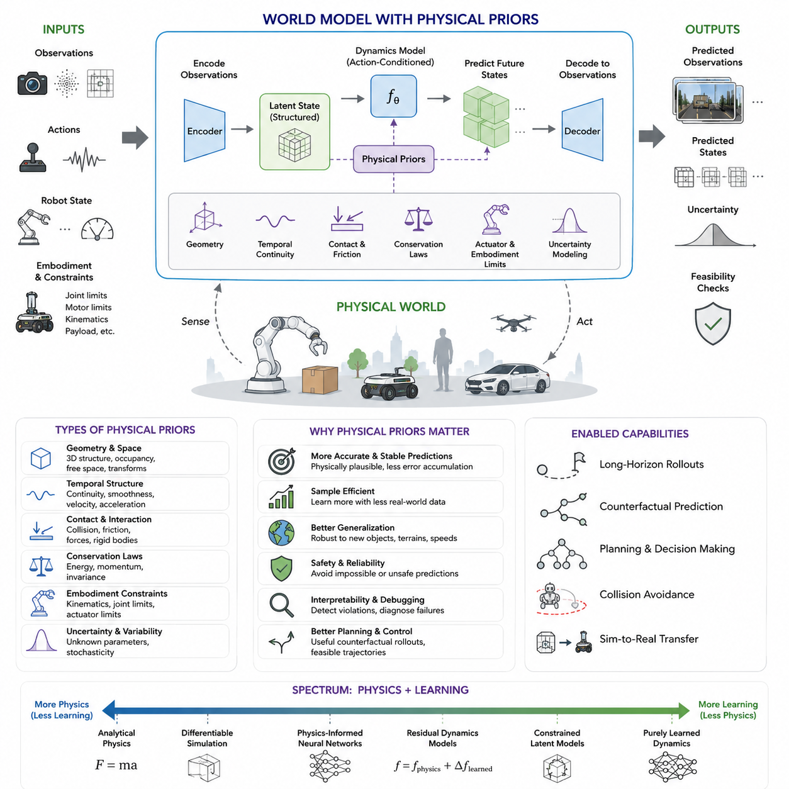{width="7.268055555555556in" height="7.268055555555556in"}

Physical priors matter in world models because Physical AI operates in environments governed by persistent laws rather than arbitrary statistical relationships. Objects have mass, occupy space, resist penetration, exchange forces, conserve momentum, and move according to constraints imposed by geometry and dynamics. A world model that incorporates these regularities can predict physically plausible futures instead of merely reproducing correlations observed in training data.

Purely data-driven models can learn many physical relationships implicitly when trained on sufficiently diverse experience, but this approach may require enormous datasets and still fail in unfamiliar situations. A model may observe thousands of examples of falling objects without explicitly representing gravity, acceleration, or collision. Physical priors introduce structural assumptions that narrow the hypothesis space and encourage the model to learn dynamics consistent with the physical world.

A physical prior does not necessarily mean that every equation of classical mechanics must be explicitly programmed into the model. Priors can appear at many levels, including architectural constraints, loss functions, state representations, differentiable simulation components, geometric relationships, or parameterized dynamics. Even simple assumptions such as temporal continuity, object permanence, non-penetration, bounded acceleration, and smooth motion can substantially improve prediction quality.

For Physical AI, these priors are especially important because prediction errors eventually affect real actions. A language model can generate an incorrect sentence without directly changing the physical environment, whereas a robot acting from an incorrect prediction may collide with an obstacle, lose stability, damage an object, or endanger a person. The world model therefore needs representations that respect feasible motion, contact conditions, actuator limits, and environmental constraints.

Physical priors also improve sample efficiency. When a model already assumes that objects normally move continuously through space, it does not need to rediscover this principle independently for every object category and environment. Knowledge learned from one interaction can therefore constrain predictions in another. This reduces the amount of experience required to learn useful dynamics and becomes particularly valuable when collecting real-world robotic data is expensive, slow, or potentially dangerous.

Another advantage is improved generalization beyond the training distribution. Statistical correlations may change dramatically when a robot encounters a new payload, surface, slope, object geometry, or operating speed. Fundamental physical relationships often remain more stable. A model that represents forces, inertia, contact, geometry, or conservation principles can use these invariant structures to extrapolate more reliably when visual appearance or environmental configuration changes.

Geometry itself provides a powerful class of physical priors. Robots operate in three-dimensional space where objects have position, orientation, extent, and spatial relationships. Representations such as Bird\'s-Eye View, occupancy fields, point clouds, meshes, and object-centric states can encode these properties directly. Geometric priors help the world model understand free space, collision boundaries, visibility, reachability, and how transformations of the robot or sensors affect observations.

Temporal structure provides another essential prior. Physical states normally evolve continuously, even when sensors observe them at discrete intervals. Position, velocity, acceleration, joint configuration, and contact state are related across time rather than being independent observations. Encoding temporal consistency helps distinguish physically meaningful motion from sensor noise and enables the model to estimate hidden states that cannot be directly measured at every instant.

Contact introduces particularly difficult dynamics because interactions can change abruptly when bodies touch, separate, slide, roll, or collide. A manipulation world model that ignores contact structure may predict visually reasonable trajectories while producing impossible object motions. Contact-aware priors can constrain predictions through collision geometry, friction, normal forces, grasp conditions, and rigid-body relationships, making predicted interactions more useful for robotic control.

Actuator and embodiment constraints are equally important. The future state of a robot depends not only on the external environment but also on its morphology, joint limits, wheel configuration, motor characteristics, payload, and control interface. A quadruped, wheeled AMR, manipulator, and humanoid cannot execute identical state transitions. Embodiment-aware physical priors therefore connect world modeling with the actual capabilities and limitations of the physical agent.

Physical priors are also useful for separating possible futures from merely imaginable futures. Generative models may produce diverse predictions, but diversity alone does not guarantee feasibility. When physical constraints are incorporated, the prediction space can be restricted to trajectories satisfying approximate dynamics, collision constraints, kinematic limits, and energy or momentum relationships. This allows computational resources to focus on futures that could realistically occur.

This distinction becomes critical during counterfactual prediction. A robot may internally evaluate what would happen if it accelerated, turned, pushed an object, changed its grasp, or selected another trajectory. Without physical structure, counterfactual predictions can drift toward statistically plausible but dynamically inconsistent outcomes. Physical priors provide stable causal relationships between actions, forces, motion, contact, and resulting states, improving imagined rollouts used for planning.

Physical priors can additionally provide inductive bias without eliminating learning. Real environments contain effects that analytical models cannot perfectly capture, including tire deformation, complex friction, actuator backlash, flexible materials, aerodynamic disturbances, wear, and uncertain payload distributions. Consequently, a useful world model does not need to choose between physics and learning. Instead, known structure can constrain the model while neural components learn residual or unknown dynamics.

This hybrid perspective creates a spectrum between analytical physics and unrestricted learned dynamics. At one end, explicit equations determine state transitions from known parameters. At the other, neural networks learn transitions almost entirely from data. Between them are physics-informed neural networks, differentiable simulators, residual dynamics models, constrained latent models, and architectures that embed conservation laws or geometric structure while retaining adaptive learned components.

Physical priors can also improve interpretability and debugging. When predicted motion violates known constraints, engineers gain meaningful diagnostic signals. Unexpected energy growth, penetration between rigid bodies, discontinuous velocity, or impossible joint configurations can indicate model failure even before task-level performance collapses. Such checks provide additional mechanisms for validating a world model beyond conventional prediction losses measured only against recorded data.

Safety benefits follow naturally from these constraints. Physical AI systems frequently operate near humans, machinery, vehicles, or valuable infrastructure, where rare prediction failures can have serious consequences. A physically constrained model can reject trajectories that exceed acceleration limits, violate stability margins, enter occupied space, or demand impossible actuator behavior. Physical priors therefore contribute not only to prediction accuracy but also to runtime feasibility checking.

The importance of priors increases as prediction horizons become longer. Small inconsistencies in velocity, force, geometry, or contact can accumulate across repeated state transitions until long-horizon rollouts become physically meaningless. Conservation constraints, stable dynamics representations, and structured state transitions can reduce this drift. They do not eliminate uncertainty, but they help prevent prediction errors from expanding into futures that contradict basic properties of the environment.

Physical priors also complement uncertainty modeling. Some physical parameters, such as friction coefficients, object masses, terrain properties, or payload distributions, may be unknown rather than fixed. Instead of assuming exact values, the world model can represent distributions over these quantities and propagate their uncertainty through predicted dynamics. Physics then supplies the structural relationships, while probabilistic learning represents uncertainty about the parameters and unobserved conditions.

Ultimately, physical priors provide a bridge between perception-driven learning and reliable interaction with the real world. They transform world modeling from unrestricted prediction into prediction constrained by what physical systems can actually do. For Physical AI, the strongest world models are therefore likely to combine learned representations, large-scale experience, multimodal observations, action-conditioned prediction, uncertainty estimation, and reusable physical structure rather than relying on any single approach alone.

물리적 사전지식(Physical Priors)이 월드 모델(World Model)에서 중요한 이유는 피지컬 AI(Physical AI)가 임의적인 통계적 관계가 아니라 지속적으로 작용하는 물리 법칙(Physical Laws)의 지배를 받는 환경에서 동작하기 때문이다. 물체는 질량(Mass)을 가지며 공간을 점유하고, 서로 관통하지 않으며, 힘(Force)을 주고받고, 운동량(Momentum)을 보존하며, 기하학(Geometry)과 동역학(Dynamics)이 부여하는 제약조건(Constraints)에 따라 움직인다. 이러한 규칙성을 포함하는 월드 모델은 단순히 학습 데이터에서 관찰된 상관관계(Correlation)를 재현하는 것을 넘어 물리적으로 가능한 미래를 예측할 수 있다.

순수한 데이터 기반 모델(Data-Driven Model)은 충분히 다양한 경험으로 학습하면 많은 물리적 관계를 암묵적으로 습득할 수 있지만, 이러한 접근법은 막대한 데이터셋(Dataset)을 필요로 하며 익숙하지 않은 상황에서는 여전히 실패할 수 있다. 모델은 중력(Gravity), 가속도(Acceleration), 충돌(Collision)을 명시적으로 표현하지 않은 상태에서도 수천 개의 낙하 물체 사례를 관찰할 수 있다. 물리적 사전지식은 가설 공간(Hypothesis Space)을 제한하는 구조적 가정(Structural Assumption)을 도입하여 모델이 실제 물리 세계와 일치하는 동역학을 학습하도록 유도한다.

물리적 사전지식이 반드시 고전역학(Classical Mechanics)의 모든 방정식을 모델 내부에 명시적으로 프로그래밍해야 한다는 의미는 아니다. 사전지식은 아키텍처 제약(Architectural Constraints), 손실 함수(Loss Functions), 상태 표현(State Representations), 미분가능 시뮬레이션(Differentiable Simulation) 구성요소, 기하학적 관계(Geometric Relationships), 매개변수화된 동역학(Parameterized Dynamics) 등 다양한 수준에서 적용될 수 있다. 시간적 연속성(Temporal Continuity), 객체 영속성(Object Permanence), 비관통성(Non-Penetration), 제한된 가속도(Bounded Acceleration), 부드러운 운동(Smooth Motion)과 같은 단순한 가정만으로도 예측 품질을 크게 향상시킬 수 있다.

피지컬 AI에서는 예측 오류(Prediction Error)가 결국 실제 행동(Physical Action)에 영향을 주기 때문에 이러한 사전지식이 특히 중요하다. 언어 모델(Language Model)은 잘못된 문장을 생성하더라도 물리적 환경을 직접 변화시키지는 않지만, 잘못된 예측을 기반으로 행동하는 로봇(Robot)은 장애물과 충돌하거나, 안정성을 잃거나, 물체를 손상시키거나, 사람을 위험에 빠뜨릴 수 있다. 따라서 월드 모델은 실행 가능한 운동(Feasible Motion), 접촉 조건(Contact Conditions), 액추에이터 한계(Actuator Limits), 환경 제약(Environmental Constraints)을 고려하는 표현을 필요로 한다.

물리적 사전지식은 표본 효율성(Sample Efficiency)도 향상시킨다. 모델이 물체가 일반적으로 공간을 따라 연속적으로 움직인다는 사실을 이미 가정한다면, 모든 객체 범주(Object Category)와 환경(Environment)마다 이 원리를 독립적으로 다시 학습할 필요가 없다. 따라서 하나의 상호작용에서 학습한 지식이 다른 상황의 예측을 제한하는 데 활용될 수 있다. 이는 실제 로봇 데이터(Real-World Robotic Data)를 수집하는 과정이 비싸고 느리며 잠재적으로 위험한 경우 특히 중요한 장점이 된다.

또 다른 장점은 학습 분포(Training Distribution)를 벗어난 상황에서의 일반화(Generalization) 성능 향상이다. 로봇이 새로운 페이로드(Payload), 표면(Surface), 경사(Slope), 객체 형상(Object Geometry), 운용 속도(Operating Speed)를 만나면 통계적 상관관계는 크게 달라질 수 있다. 그러나 기본적인 물리적 관계는 상대적으로 안정적으로 유지된다. 힘(Force), 관성(Inertia), 접촉(Contact), 기하학(Geometry), 보존 법칙(Conservation Laws)을 표현하는 모델은 이러한 불변 구조(Invariant Structure)를 이용하여 시각적 외형이나 환경 구성이 달라져도 더욱 신뢰성 있게 외삽(Extrapolation)할 수 있다.

기하학(Geometry) 자체도 강력한 물리적 사전지식의 한 종류를 제공한다. 로봇은 물체가 위치(Position), 자세(Orientation), 크기와 범위(Extent), 공간적 관계(Spatial Relationships)를 가지는 3차원 공간(Three-Dimensional Space)에서 동작한다. 조감도(Bird\'s-Eye View, BEV), 점유장(Occupancy Field), 포인트 클라우드(Point Cloud), 메시(Mesh), 객체 중심 상태(Object-Centric State) 등의 표현은 이러한 특성을 직접 인코딩할 수 있다. 기하학적 사전지식(Geometric Priors)은 월드 모델이 자유 공간(Free Space), 충돌 경계(Collision Boundary), 가시성(Visibility), 도달 가능성(Reachability), 로봇이나 센서의 변환이 관측에 미치는 영향을 이해하도록 돕는다.

시간적 구조(Temporal Structure)는 또 다른 핵심적인 사전지식을 제공한다. 센서가 물리적 상태를 불연속적인 시간 간격으로 관측하더라도 실제 물리 상태는 일반적으로 연속적으로 변화한다. 위치(Position), 속도(Velocity), 가속도(Acceleration), 관절 구성(Joint Configuration), 접촉 상태(Contact State)는 서로 독립적인 관측이 아니라 시간에 걸쳐 연결되어 있다. 시간적 일관성(Temporal Consistency)을 인코딩하면 물리적으로 의미 있는 운동과 센서 노이즈(Sensor Noise)를 구분할 수 있으며, 매 순간 직접 측정할 수 없는 숨겨진 상태(Hidden State)를 추정할 수 있다.

접촉(Contact)은 물체가 접촉하거나 분리되고, 미끄러지거나 구르며, 충돌하는 순간 상호작용이 급격하게 변화할 수 있기 때문에 특히 어려운 동역학 문제를 만든다. 접촉 구조를 무시하는 조작 월드 모델(Manipulation World Model)은 시각적으로는 그럴듯하지만 실제로는 불가능한 객체 운동을 예측할 수 있다. 접촉 인식 사전지식(Contact-Aware Priors)은 충돌 기하학(Collision Geometry), 마찰(Friction), 수직항력(Normal Force), 파지 조건(Grasp Conditions), 강체 관계(Rigid-Body Relationships)를 통해 예측을 제한하여 로봇 제어(Robotic Control)에 더욱 유용한 상호작용 예측을 가능하게 한다.

액추에이터(Actuator)와 신체화(Embodiment)의 제약도 동일하게 중요하다. 로봇의 미래 상태는 외부 환경뿐만 아니라 형태(Morphology), 관절 한계(Joint Limits), 바퀴 구성(Wheel Configuration), 모터 특성(Motor Characteristics), 페이로드(Payload), 제어 인터페이스(Control Interface)에 의해 결정된다. 4족 보행 로봇(Quadruped), 자율이동로봇(Autonomous Mobile Robot, AMR), 매니퓰레이터(Manipulator), 휴머노이드(Humanoid)는 동일한 상태 전이(State Transition)를 실행할 수 없다. 따라서 신체화 인식 물리적 사전지식(Embodiment-Aware Physical Priors)은 월드 모델링을 실제 에이전트(Agent)의 능력과 한계에 연결한다.

물리적 사전지식은 가능한 미래(Possible Futures)와 단순히 상상 가능한 미래(Imaginable Futures)를 구분하는 데에도 유용하다. 생성 모델(Generative Model)은 다양한 예측을 생성할 수 있지만, 다양성 자체가 실행 가능성(Feasibility)을 보장하지는 않는다. 물리적 제약조건을 포함하면 예측 공간(Prediction Space)을 근사 동역학(Approximate Dynamics), 충돌 제약(Collision Constraints), 운동학적 한계(Kinematic Limits), 에너지(Energy) 또는 운동량 관계(Momentum Relationships)를 만족하는 궤적(Trajectory)으로 제한할 수 있다. 이를 통해 계산 자원을 실제로 발생할 수 있는 미래에 집중할 수 있다.

이러한 차이는 반사실적 예측(Counterfactual Prediction)에서 특히 중요해진다. 로봇은 내부적으로 가속하거나, 방향을 전환하거나, 물체를 밀거나, 파지 방식을 변경하거나, 다른 궤적을 선택했을 때 어떤 일이 발생할지를 평가할 수 있다. 물리적 구조가 없다면 반사실적 예측은 통계적으로는 그럴듯하지만 동역학적으로 일관되지 않은 결과로 벗어날 수 있다. 물리적 사전지식은 행동(Action), 힘(Force), 운동(Motion), 접촉(Contact), 결과 상태(Resulting State) 사이에 안정적인 인과관계(Causal Relationships)를 제공하여 계획(Planning)에 사용되는 상상 롤아웃(Imagined Rollouts)의 품질을 향상시킨다.

물리적 사전지식은 학습(Learning)을 제거하지 않으면서 귀납적 편향(Inductive Bias)을 제공할 수도 있다. 실제 환경에는 타이어 변형(Tire Deformation), 복잡한 마찰(Complex Friction), 액추에이터 백래시(Actuator Backlash), 유연 재료(Flexible Materials), 공기역학적 교란(Aerodynamic Disturbances), 마모(Wear), 불확실한 페이로드 분포(Payload Distribution)처럼 해석적 모델(Analytical Model)이 완벽하게 표현하기 어려운 현상이 존재한다. 따라서 유용한 월드 모델은 물리와 학습 중 하나만 선택할 필요가 없으며, 알려진 구조로 모델을 제한하면서 신경망 구성요소(Neural Components)가 잔차 동역학(Residual Dynamics)이나 알려지지 않은 동역학을 학습하도록 만들 수 있다.

이러한 하이브리드 관점(Hybrid Perspective)은 해석적 물리학(Analytical Physics)과 제한 없는 학습 동역학(Learned Dynamics) 사이에 연속적인 스펙트럼을 형성한다. 한쪽 끝에서는 명시적인 방정식이 알려진 매개변수로부터 상태 전이를 결정하고, 다른 쪽 끝에서는 신경망(Neural Network)이 거의 전적으로 데이터로부터 상태 전이를 학습한다. 그 사이에는 물리 정보 신경망(Physics-Informed Neural Networks), 미분가능 시뮬레이터(Differentiable Simulators), 잔차 동역학 모델(Residual Dynamics Models), 제약된 잠재 모델(Constrained Latent Models), 보존 법칙이나 기하학적 구조를 포함하면서 적응 가능한 학습 구성요소를 유지하는 다양한 아키텍처가 존재한다.

물리적 사전지식은 해석 가능성(Interpretability)과 디버깅(Debugging)도 향상시킬 수 있다. 예측된 운동이 알려진 제약조건을 위반하면 엔지니어는 의미 있는 진단 신호(Diagnostic Signal)를 얻을 수 있다. 비정상적인 에너지 증가(Unexpected Energy Growth), 강체 간 관통(Penetration), 불연속적인 속도(Discontinuous Velocity), 불가능한 관절 구성(Impossible Joint Configuration)은 작업 수준 성능이 완전히 무너지기 전에도 모델의 실패를 나타낼 수 있다. 이러한 검사는 기록된 데이터와 비교하는 일반적인 예측 손실(Prediction Loss) 외에도 월드 모델을 검증할 수 있는 추가적인 수단을 제공한다.

이러한 제약조건은 자연스럽게 안전성(Safety) 향상으로 이어진다. 피지컬 AI 시스템은 사람, 기계, 차량, 중요 인프라(Infrastructure) 주변에서 동작하는 경우가 많기 때문에 드물게 발생하는 예측 실패도 심각한 결과를 초래할 수 있다. 물리적으로 제약된 모델(Physically Constrained Model)은 가속도 한계(Acceleration Limits)를 초과하거나, 안정성 마진(Stability Margins)을 위반하거나, 점유 공간(Occupied Space)에 진입하거나, 불가능한 액추에이터 동작을 요구하는 궤적을 거부할 수 있다. 따라서 물리적 사전지식은 예측 정확도뿐만 아니라 런타임 실행 가능성 검사(Runtime Feasibility Checking)에도 기여한다.

예측 지평(Prediction Horizon)이 길어질수록 물리적 사전지식의 중요성은 더욱 커진다. 속도, 힘, 기하학, 접촉에서 발생하는 작은 불일치도 반복적인 상태 전이를 거치면서 누적되어 장기 롤아웃(Long-Horizon Rollout)을 물리적으로 무의미하게 만들 수 있다. 보존 제약(Conservation Constraints), 안정적인 동역학 표현(Stable Dynamics Representation), 구조화된 상태 전이(Structured State Transition)는 이러한 드리프트(Drift)를 줄일 수 있다. 불확실성 자체를 제거할 수는 없지만, 예측 오류가 환경의 기본적인 물리 특성을 위반하는 미래로 확대되는 것을 방지하는 데 도움을 준다.

물리적 사전지식은 불확실성 모델링(Uncertainty Modeling)과도 상호 보완적으로 작동한다. 마찰 계수(Friction Coefficient), 객체 질량(Object Mass), 지형 특성(Terrain Properties), 페이로드 분포(Payload Distribution)와 같은 일부 물리적 매개변수는 고정된 값이 아니라 알려지지 않은 값일 수 있다. 월드 모델은 정확한 값을 가정하는 대신 이러한 물리량에 대한 확률 분포(Probability Distribution)를 표현하고 예측 동역학을 통해 불확실성을 전파할 수 있다. 이때 물리학은 구조적 관계를 제공하고 확률적 학습(Probabilistic Learning)은 매개변수와 관측되지 않은 조건에 대한 불확실성을 표현한다.

궁극적으로 물리적 사전지식은 지각 기반 학습(Perception-Driven Learning)과 실제 세계에서의 신뢰할 수 있는 상호작용(Reliable Physical Interaction)을 연결하는 다리 역할을 한다. 이는 월드 모델링을 제한 없는 미래 예측에서 실제 물리 시스템이 수행할 수 있는 범위 안에서의 예측으로 전환한다. 따라서 피지컬 AI를 위한 강력한 월드 모델은 단일 접근법에 의존하기보다 학습된 표현(Learned Representations), 대규모 경험(Large-Scale Experience), 멀티모달 관측(Multimodal Observations), 행동 조건부 예측(Action-Conditioned Prediction), 불확실성 추정(Uncertainty Estimation), 재사용 가능한 물리적 구조(Reusable Physical Structure)를 통합하는 방향으로 발전할 가능성이 높다.

##  

## 10.02. Learned vs Analytical Dynamics

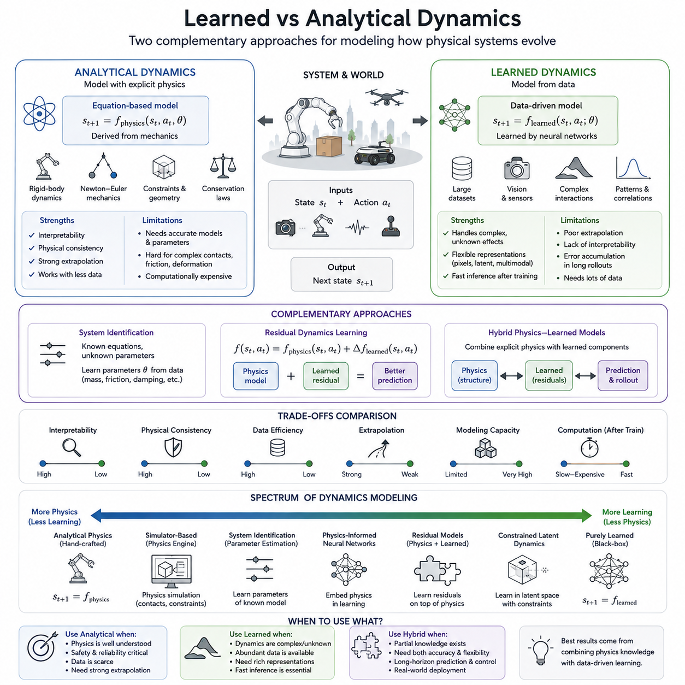{width="7.268055555555556in" height="7.268055555555556in"}

Analytical dynamics models describe how a physical system evolves by using explicitly defined mathematical relationships derived from mechanics, kinematics, thermodynamics, fluid dynamics, or other physical theories. Given a state (s_t), an action (a_t), and known physical parameters, the model computes the next state (s_{t+1}) according to predetermined equations. This provides a structured and interpretable foundation for predicting physical behavior.

In robotics, analytical dynamics often begins with equations such as Newton--Euler mechanics, rigid-body dynamics, or Lagrangian mechanics. Robot mass, inertia, joint configuration, applied torque, gravity, and external forces determine acceleration and subsequent motion. Because the underlying relationships are explicitly represented, engineers can examine why a predicted transition occurs and determine whether the result satisfies known physical constraints.

Analytical models offer strong generalization when their assumptions accurately represent the system. The relationship between force, mass, and acceleration does not need to be relearned whenever the robot enters a new environment. Conservation laws, geometric constraints, and rigid-body relationships remain applicable across many situations. These physical invariances make analytical dynamics particularly useful when training data are limited or when extrapolation beyond observed examples is required.

However, real robotic systems rarely match ideal analytical models perfectly. Friction coefficients may change with surface conditions, tires deform under load, motors exhibit nonlinear responses, joints contain backlash, and mechanical components gradually wear. Flexible structures, cables, fluids, soil, vegetation, and deformable objects introduce additional effects that may be difficult or computationally expensive to model accurately using explicit equations alone.

Learned dynamics approaches address these limitations by estimating state transitions directly from data. Instead of specifying every physical relationship manually, a neural network can learn a transition function such as (s_{t+1}=f_\\theta(s_t,a_t)), where the parameters (\\theta) are optimized from observations of system behavior. The model discovers patterns connecting states, actions, and resulting states without requiring complete analytical knowledge of the underlying physics.

Learned models are particularly attractive when system dynamics are complex, partially unknown, or difficult to parameterize. A mobile robot traversing gravel, mud, grass, slopes, and irregular terrain experiences interactions that may be extremely difficult to capture with a single analytical tire or contact model. Data-driven dynamics can instead learn how commanded velocity, terrain appearance, robot state, slip, vibration, and previous motion jointly influence future behavior.

Another advantage is representational flexibility. Analytical models normally require engineers to choose meaningful state variables and derive equations relating them. Learned dynamics can operate on high-dimensional representations produced directly from cameras, LiDAR, radar, proprioception, or multimodal encoders. Latent dynamics models can therefore predict changes in compact learned representations without reconstructing every physical quantity explicitly at each prediction step.

This flexibility comes with important disadvantages. Learned dynamics can reproduce statistical regularities without discovering the physical mechanisms responsible for them. A model may perform extremely well within its training distribution but behave unpredictably when payload, terrain, speed, morphology, or environmental conditions change. Because its predictions arise from learned parameters distributed across a neural network, diagnosing the physical reason for a failure may also be difficult.

The contrast between analytical and learned dynamics can therefore be understood as a difference in where knowledge originates. Analytical models obtain structure primarily from human knowledge of physics and engineering, while learned models obtain structure primarily from observations and optimization. The former typically provides stronger interpretability and physical consistency, whereas the latter provides greater flexibility for modeling complex effects that cannot easily be written as explicit equations.

Their computational characteristics can also differ significantly. High-fidelity analytical simulation may require repeated collision detection, constraint solving, numerical integration, and contact calculations. A learned dynamics model can approximate these processes with a neural-network forward pass after training. This can make learned models attractive for world-model rollouts where thousands of candidate futures must be evaluated rapidly during planning or model-based reinforcement learning.

Yet computational speed does not automatically imply physical reliability. Neural dynamics models can accumulate small prediction errors during repeated rollout, producing states that gradually violate geometry, stability, contact, or conservation constraints. Analytical models can also accumulate numerical errors, but their explicit structure often provides stronger mechanisms for maintaining physical consistency. Long-horizon world modeling therefore exposes weaknesses in both approaches and motivates structured combinations of them.

System identification provides an important connection between the two paradigms. The governing equations of a system may be known while parameters such as mass, inertia, damping, motor constants, or friction remain uncertain. Observed data can then be used to estimate these parameters rather than learning the entire transition function. In this case, learning improves an analytical model while preserving its physical structure and interpretability.

A complementary strategy is residual dynamics learning. An analytical model first predicts the next state using known physics, and a learned model estimates the remaining discrepancy between that prediction and observed behavior. Conceptually, the transition can be represented as (f=f_{physics}+\\Delta f_{learned}). The physical component captures stable and reusable structure, while the learned residual captures effects such as unmodeled friction, actuator nonlinearities, deformation, and environmental disturbances.

Hybrid physics--learned models extend this principle further by allowing analytical and neural components to interact throughout the world-model architecture. Geometry and rigid-body motion may be represented explicitly while contact parameters are learned, or a neural perception system may infer physical state variables that are subsequently propagated by analytical dynamics. Alternatively, differentiable physics can allow prediction errors to propagate through a simulator so that unknown parameters or neural components are optimized jointly.

The appropriate balance depends strongly on the embodiment and task. Manipulation may benefit from explicit kinematic, collision, and contact constraints, while learned components capture uncertain friction and object properties. Autonomous mobile robots may use analytical vehicle dynamics together with learned terrain interaction and slip models. Quadrupeds and humanoids may combine rigid-body dynamics, contact constraints, learned locomotion representations, and adaptive estimates of external disturbances.

For world models, the choice is therefore not simply whether analytical dynamics or learned dynamics is superior. The central design question is which parts of the physical transition are sufficiently understood to encode explicitly and which parts should be learned from experience. Known physics can reduce the learning problem, constrain impossible predictions, and improve extrapolation, while data-driven components can represent complexity and uncertainty that simplified equations cannot capture.

A practical Physical AI world model can consequently be viewed as a continuum rather than a binary architecture. At one extreme lies a physics simulator driven almost entirely by analytical equations; at the other lies a neural model trained primarily from experience. Between them are system-identified models, physics-informed networks, differentiable simulators, constrained latent dynamics, residual models, and other hybrid architectures combining varying amounts of physical knowledge and learned behavior.

Ultimately, learned and analytical dynamics provide complementary forms of knowledge for Physical AI. Analytical dynamics contributes structure, invariance, interpretability, and physical feasibility, while learned dynamics contributes adaptability, representational capacity, and the ability to capture unknown real-world effects. Combining them allows a world model to preserve what is reliably known about physics while learning what cannot be modeled accurately in advance, providing a stronger foundation for prediction, planning, control, and real-world adaptation.

해석적 동역학 모델(Analytical Dynamics Model)은 역학(Mechanics), 운동학(Kinematics), 열역학(Thermodynamics), 유체역학(Fluid Dynamics) 또는 기타 물리 이론에서 도출된 명시적으로 정의된 수학적 관계를 사용하여 물리 시스템이 어떻게 변화하는지를 설명한다. 상태 (s_t), 행동 (a_t), 알려진 물리 매개변수(Physical Parameters)가 주어지면 모델은 미리 정의된 방정식에 따라 다음 상태 (s_{t+1})를 계산한다. 이는 물리적 거동을 예측하기 위한 구조적이고 해석 가능한 기반을 제공한다.

로보틱스(Robotics)에서 해석적 동역학은 흔히 뉴턴-오일러 역학(Newton--Euler Mechanics), 강체 동역학(Rigid-Body Dynamics), 라그랑주 역학(Lagrangian Mechanics)과 같은 방정식에서 시작한다. 로봇의 질량(Mass), 관성(Inertia), 관절 구성(Joint Configuration), 적용 토크(Applied Torque), 중력(Gravity), 외력(External Forces)이 가속도와 이후의 운동을 결정한다. 기본적인 관계가 명시적으로 표현되므로 엔지니어는 특정 상태 전이(State Transition)가 발생하는 이유와 그 결과가 알려진 물리적 제약조건(Physical Constraints)을 만족하는지 확인할 수 있다.

해석적 모델(Analytical Model)은 모델의 가정이 실제 시스템을 정확하게 표현할 때 강력한 일반화(Generalization) 능력을 제공한다. 힘(Force), 질량(Mass), 가속도(Acceleration)의 관계는 로봇이 새로운 환경에 진입할 때마다 다시 학습할 필요가 없다. 보존 법칙(Conservation Laws), 기하학적 제약조건(Geometric Constraints), 강체 관계(Rigid-Body Relationships)는 다양한 상황에서 계속 적용된다. 이러한 물리적 불변성(Physical Invariance)은 학습 데이터가 제한적이거나 관찰된 사례를 넘어서는 외삽(Extrapolation)이 필요한 경우 해석적 동역학을 특히 유용하게 만든다.

그러나 실제 로봇 시스템(Real Robotic System)은 이상적인 해석적 모델과 완벽하게 일치하는 경우가 드물다. 마찰 계수(Friction Coefficient)는 표면 조건에 따라 변할 수 있고, 타이어는 하중에 의해 변형되며, 모터는 비선형 응답(Nonlinear Response)을 나타내고, 관절에는 백래시(Backlash)가 존재하며, 기계 부품은 점차 마모된다. 유연 구조(Flexible Structures), 케이블(Cables), 유체(Fluids), 토양(Soil), 식생(Vegetation), 변형 가능한 물체(Deformable Objects)는 명시적인 방정식만으로 정확하게 모델링하기 어렵거나 계산 비용이 매우 높은 추가적인 물리 현상을 발생시킨다.

학습된 동역학(Learned Dynamics)은 데이터로부터 상태 전이(State Transition)를 직접 추정함으로써 이러한 한계를 해결한다. 모든 물리적 관계를 수동으로 정의하는 대신 신경망(Neural Network)은 (s_{t+1}=f_\\theta(s_t,a_t))와 같은 전이 함수(Transition Function)를 학습할 수 있으며, 여기서 매개변수 (\\theta)는 시스템의 실제 거동을 관찰한 데이터를 통해 최적화된다. 모델은 기반 물리학에 대한 완전한 해석적 지식 없이도 상태, 행동, 결과 상태 사이의 패턴을 발견한다.

학습된 모델(Learned Model)은 시스템 동역학이 복잡하거나 부분적으로 알려지지 않았거나 매개변수화하기 어려운 경우 특히 유용하다. 자갈(Gravel), 진흙(Mud), 잔디(Grass), 경사면(Slope), 불규칙 지형(Irregular Terrain)을 주행하는 이동 로봇(Mobile Robot)은 하나의 해석적 타이어 또는 접촉 모델(Contact Model)만으로 표현하기 매우 어려운 상호작용을 경험한다. 데이터 기반 동역학(Data-Driven Dynamics)은 명령 속도(Commanded Velocity), 지형 외형(Terrain Appearance), 로봇 상태(Robot State), 슬립(Slip), 진동(Vibration), 이전 운동이 미래 거동에 공동으로 어떤 영향을 주는지를 학습할 수 있다.

또 다른 장점은 표현 유연성(Representational Flexibility)이다. 해석적 모델은 일반적으로 엔지니어가 의미 있는 상태 변수(State Variables)를 선택하고 이들 사이의 관계를 나타내는 방정식을 도출해야 한다. 반면 학습된 동역학은 카메라(Camera), 라이다(LiDAR), 레이더(Radar), 고유수용감각(Proprioception), 멀티모달 인코더(Multimodal Encoder)에서 직접 생성되는 고차원 표현(High-Dimensional Representation)을 처리할 수 있다. 따라서 잠재 동역학 모델(Latent Dynamics Model)은 모든 물리량을 각 예측 단계마다 명시적으로 복원하지 않고도 압축된 학습 표현의 변화를 예측할 수 있다.

이러한 유연성에는 중요한 단점도 존재한다. 학습된 동역학은 실제 물리적 메커니즘(Physical Mechanism)을 발견하지 않고도 통계적 규칙성(Statistical Regularities)을 재현할 수 있다. 모델은 학습 분포(Training Distribution) 내에서는 매우 우수한 성능을 보이지만 페이로드(Payload), 지형(Terrain), 속도(Speed), 형태(Morphology), 환경 조건(Environmental Conditions)이 달라지면 예측할 수 없는 방식으로 동작할 수 있다. 또한 예측 결과가 신경망 전체에 분산된 학습 매개변수에서 생성되므로 실패의 물리적 원인을 진단하기 어려울 수 있다.

따라서 해석적 동역학과 학습된 동역학의 차이는 지식이 어디에서 유래하는가의 차이로 이해할 수 있다. 해석적 모델은 주로 인간이 축적한 물리학과 공학 지식에서 구조를 얻는 반면, 학습된 모델은 주로 관측 데이터와 최적화(Optimization)를 통해 구조를 획득한다. 전자는 일반적으로 더 높은 해석 가능성(Interpretability)과 물리적 일관성(Physical Consistency)을 제공하고, 후자는 명시적인 방정식으로 표현하기 어려운 복잡한 효과를 모델링하는 데 더 높은 유연성을 제공한다.

두 접근법의 계산 특성(Computational Characteristics)도 크게 다를 수 있다. 고충실도 해석 시뮬레이션(High-Fidelity Analytical Simulation)은 반복적인 충돌 검출(Collision Detection), 제약조건 해결(Constraint Solving), 수치 적분(Numerical Integration), 접촉 계산(Contact Calculation)을 요구할 수 있다. 학습된 동역학 모델은 학습이 완료된 이후 이러한 과정을 신경망 순전파(Neural-Network Forward Pass)로 근사할 수 있다. 따라서 계획(Planning)이나 모델 기반 강화학습(Model-Based Reinforcement Learning)에서 수천 개의 후보 미래를 빠르게 평가해야 하는 월드 모델 롤아웃(World-Model Rollout)에 유리할 수 있다.

그러나 계산 속도가 빠르다는 것이 자동으로 물리적 신뢰성(Physical Reliability)을 의미하지는 않는다. 신경 동역학 모델(Neural Dynamics Model)은 반복적인 롤아웃 과정에서 작은 예측 오류를 누적하여 점차 기하학(Geometry), 안정성(Stability), 접촉(Contact), 보존 제약(Conservation Constraints)을 위반하는 상태를 생성할 수 있다. 해석적 모델 역시 수치적 오류(Numerical Error)를 누적할 수 있지만, 명시적인 구조를 통해 물리적 일관성을 유지할 수 있는 더 강력한 메커니즘을 제공하는 경우가 많다. 따라서 장기 월드 모델링(Long-Horizon World Modeling)은 두 접근법 모두의 약점을 드러내며 이들을 구조적으로 결합해야 할 필요성을 만든다.

시스템 식별(System Identification)은 두 패러다임을 연결하는 중요한 방법을 제공한다. 시스템을 지배하는 방정식은 알려져 있지만 질량(Mass), 관성(Inertia), 감쇠(Damping), 모터 상수(Motor Constants), 마찰(Friction)과 같은 매개변수는 불확실할 수 있다. 이 경우 전체 전이 함수를 학습하는 대신 관측 데이터를 사용하여 이러한 매개변수를 추정할 수 있다. 즉, 학습을 이용하여 해석적 모델을 개선하면서 물리적 구조와 해석 가능성을 유지할 수 있다.

이를 보완하는 또 다른 전략은 잔차 동역학 학습(Residual Dynamics Learning)이다. 먼저 해석적 모델이 알려진 물리학을 이용하여 다음 상태를 예측하고, 학습된 모델이 이 예측과 실제 관측된 거동 사이의 남은 차이를 추정한다. 개념적으로 전이 함수는 (f=f_{physics}+\\Delta f_{learned})로 표현할 수 있다. 물리 구성요소(Physics Component)는 안정적이고 재사용 가능한 구조를 담당하고, 학습된 잔차(Learned Residual)는 모델링되지 않은 마찰, 액추에이터 비선형성(Actuator Nonlinearity), 변형(Deformation), 환경 교란(Environmental Disturbances) 등을 학습한다.

하이브리드 물리-학습 모델(Hybrid Physics--Learned Model)은 이러한 원리를 더욱 확장하여 해석적 구성요소와 신경망 구성요소가 월드 모델 아키텍처(World-Model Architecture) 전체에서 상호작용하도록 만든다. 기하학과 강체 운동은 명시적으로 표현하면서 접촉 매개변수는 학습할 수 있고, 신경 지각 시스템(Neural Perception System)이 물리적 상태 변수를 추론한 후 해석적 동역학을 통해 이를 전파할 수도 있다. 또는 미분가능 물리학(Differentiable Physics)을 사용하여 예측 오류가 시뮬레이터를 통해 역전파되도록 하고 알려지지 않은 매개변수와 신경망 구성요소를 공동으로 최적화할 수 있다.

적절한 균형은 신체화(Embodiment)와 작업(Task)에 따라 크게 달라진다. 로봇 조작(Manipulation)은 명시적인 운동학(Kinematics), 충돌(Collision), 접촉 제약(Contact Constraints)의 도움을 받을 수 있으며 학습된 구성요소는 불확실한 마찰과 객체 특성을 포착할 수 있다. 자율이동로봇(Autonomous Mobile Robot)은 해석적 차량 동역학(Analytical Vehicle Dynamics)에 학습된 지형 상호작용(Terrain Interaction)과 슬립 모델(Slip Model)을 결합할 수 있다. 4족 보행 로봇(Quadruped)과 휴머노이드(Humanoid)는 강체 동역학, 접촉 제약, 학습된 보행 표현(Learned Locomotion Representation), 외부 교란에 대한 적응형 추정(Adaptive Estimation)을 결합할 수 있다.

따라서 월드 모델에서 핵심적인 선택은 단순히 해석적 동역학과 학습된 동역학 중 어느 것이 더 우수한가를 결정하는 것이 아니다. 중요한 설계 질문은 물리적 상태 전이 중 어떤 부분이 충분히 이해되어 명시적으로 인코딩될 수 있으며, 어떤 부분을 경험으로부터 학습해야 하는가이다. 알려진 물리학은 학습 문제의 범위를 줄이고 불가능한 예측을 제한하며 외삽 성능을 향상시킬 수 있고, 데이터 기반 구성요소는 단순화된 방정식이 포착할 수 없는 복잡성과 불확실성을 표현할 수 있다.

실용적인 피지컬 AI 월드 모델(Physical AI World Model)은 결과적으로 이분법적 아키텍처(Binary Architecture)가 아니라 연속적인 스펙트럼(Continuum)으로 이해할 수 있다. 한쪽 극단에는 거의 전적으로 해석적 방정식으로 구동되는 물리 시뮬레이터(Physics Simulator)가 있고, 다른 극단에는 주로 경험 데이터로 학습된 신경 모델(Neural Model)이 존재한다. 그 사이에는 시스템 식별 모델(System-Identified Models), 물리 정보 신경망(Physics-Informed Neural Networks), 미분가능 시뮬레이터(Differentiable Simulators), 제약된 잠재 동역학(Constrained Latent Dynamics), 잔차 모델(Residual Models) 등 다양한 비율로 물리 지식과 학습된 거동을 결합하는 하이브리드 아키텍처(Hybrid Architecture)가 존재한다.

궁극적으로 학습된 동역학과 해석적 동역학은 피지컬 AI에 서로 보완적인 형태의 지식을 제공한다. 해석적 동역학은 구조(Structure), 불변성(Invariance), 해석 가능성(Interpretability), 물리적 실행 가능성(Physical Feasibility)을 제공하는 반면, 학습된 동역학은 적응성(Adaptability), 표현 능력(Representational Capacity), 알려지지 않은 실제 세계의 효과를 포착하는 능력을 제공한다. 두 접근법을 결합하면 월드 모델은 물리학에 대해 신뢰성 있게 알려진 부분을 유지하면서 사전에 정확하게 모델링할 수 없는 부분을 경험으로부터 학습할 수 있으며, 이를 통해 예측(Prediction), 계획(Planning), 제어(Control), 실제 환경 적응(Real-World Adaptation)을 위한 더욱 강력한 기반을 구축할 수 있다.

##  

## 10.03. Physics Informed Neural Networks

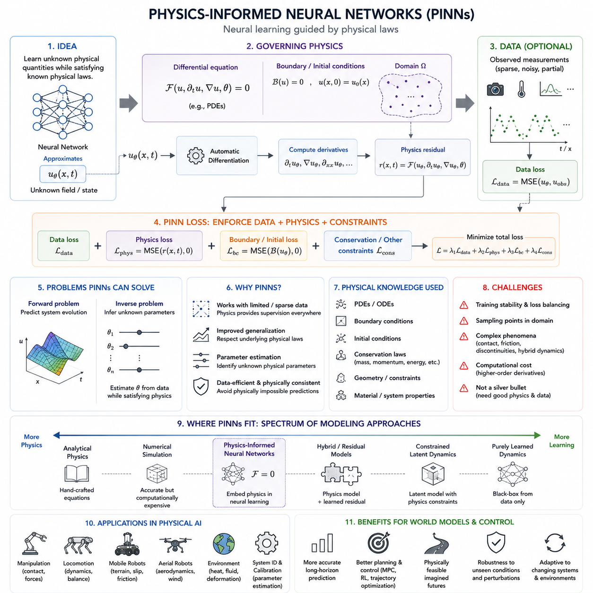{width="7.268055555555556in" height="7.268055555555556in"}

Physics-Informed Neural Networks (PINNs) combine neural learning with explicit knowledge of physical laws so that predictions are guided not only by observed data but also by equations describing the underlying system. Instead of allowing a network to learn any mapping that minimizes data error, a PINN introduces physical relationships into the learning objective, encouraging solutions that remain consistent with known dynamics even where measurements are sparse.

The central idea is to represent an unknown physical quantity with a neural network while requiring its outputs to approximately satisfy governing equations. If a system is described by a differential equation such as (\\mathcal{F}(u,\\partial_tu,\\nabla u,\\theta)=0), the neural network approximates (u), while automatic differentiation computes the required temporal and spatial derivatives. Violations of the governing equation become part of the training loss.

A typical PINN objective therefore combines several sources of supervision. A data loss measures disagreement between predicted and observed values, while a physics loss measures the residual of the governing equations at selected points in the physical domain. Boundary conditions, initial conditions, conservation constraints, or known geometric relationships can also contribute additional losses, producing an optimization objective that balances empirical evidence with physical consistency.

This formulation is important because physical equations effectively provide supervision at locations where labeled measurements may not exist. A robot may collect only limited observations of velocity, force, temperature, deformation, or terrain interaction, yet the governing physics can constrain many additional states throughout space and time. Physics-informed learning can therefore reduce dependence on expensive real-world data while preventing the network from fitting observations in physically unreasonable ways.

Automatic differentiation (Automatic Differentiation) is a key mechanism enabling this approach. Because neural networks are differentiable functions, derivatives of their outputs with respect to time, position, state variables, or parameters can be calculated through the computational graph. These derivatives can be substituted directly into differential equations, allowing the optimizer to minimize physical residuals without requiring conventional finite-difference approximations at every training step.

PINNs can address both forward problems and inverse problems. In a forward problem, known physical equations and parameters are used to estimate the evolution of a system under specified initial and boundary conditions. In an inverse problem, observations are used to infer unknown quantities such as friction, material properties, damping, diffusion coefficients, external forces, or other system parameters while simultaneously enforcing the known physical relationships.

For Physical AI, the inverse formulation is particularly relevant to system identification (System Identification). A robot may know the approximate structure of its dynamics while important parameters change during operation. Payload mass, tire-ground friction, actuator characteristics, joint damping, or terrain properties may be uncertain. A physics-informed model can estimate such parameters from sensor observations without abandoning the physical structure already known about the robot.

Physics-informed learning also provides an intermediate approach between analytical dynamics and unrestricted learned dynamics. A purely analytical model relies heavily on equations and predetermined parameters, while a purely learned model estimates transitions from data. PINNs retain the representational flexibility of neural networks while embedding equations or constraints into learning, allowing the model to adapt to data without treating the physical world as an unconstrained statistical process.

The physical knowledge included in a PINN does not need to be perfectly complete. Some relationships may be accurately known while other dynamics remain uncertain or difficult to model. The network can therefore be constrained by reliable components such as conservation laws, kinematic relationships, geometric boundaries, or approximate differential equations while learning uncertain effects from data. This makes physics-informed modeling useful when only partial physical knowledge is available.

Conservation laws provide especially valuable constraints because they describe relationships that should remain valid across many operating conditions. Depending on the system, conservation of mass, momentum, energy, or related quantities can be incorporated into the loss function or model structure. Such constraints reduce the space of possible solutions and discourage predictions that fit observations locally while violating fundamental physical behavior globally.

In world modeling, physics-informed constraints can improve temporal prediction by discouraging implausible state transitions. A learned world model may otherwise predict discontinuous motion, impossible accelerations, penetration between objects, or unstable long-horizon trajectories. Incorporating known dynamics into the training objective can guide latent or explicit state evolution toward physically meaningful regions and reduce the accumulation of unrealistic behavior during repeated predictive rollouts.

However, PINNs are not automatically superior to either numerical physics solvers or conventional neural networks. Training can become difficult when different loss components have substantially different scales or optimization landscapes. A network may minimize measurement error while neglecting the physics residual, or satisfy one equation while poorly fitting observations. Selecting loss weights and sampling appropriate points in the physical domain therefore becomes an important part of model design.

Complex physical systems introduce additional challenges. Contact, collision, friction, discontinuities, hybrid dynamics, and rapidly changing boundary conditions can be difficult for smooth neural approximations. Robotic environments frequently contain exactly these phenomena. Consequently, directly applying a classical PINN formulation to manipulation, locomotion, or terrain interaction may require specialized representations, piecewise dynamics, contact-aware constraints, or combination with other physics-learning techniques.

Computational cost can also become significant because training requires derivatives of network outputs and repeated evaluation of physics residuals across many sampled points. Higher-order differential equations may require higher-order derivatives, increasing memory usage and optimization difficulty. For real-time Physical AI, PINNs may therefore be more useful for offline learning, parameter estimation, model adaptation, or constructing compact surrogate dynamics than for solving every physical interaction directly during control.

A broader interpretation of physics-informed neural modeling extends beyond classical PINNs. Physical knowledge can be introduced through loss functions, neural architecture, equivariance, constrained state representations, differentiable simulators, projection operators, or explicit analytical modules. The essential principle remains the same: learning should exploit known structure rather than forcing the network to rediscover every physical relationship solely from examples.

Physics-informed models can also interact naturally with latent world models. Perception modules may encode camera, LiDAR, proprioceptive, and other sensor observations into a latent state, while physics-based constraints regulate how that latent state evolves. The latent variables do not necessarily need to correspond directly to classical physical quantities, but their transitions can still be encouraged to preserve temporal continuity, geometry, conservation, action effects, or other physically meaningful relationships.

For planning and control, the value of physics-informed prediction lies in producing futures that are both data-adaptive and physically credible. Candidate actions can be rolled forward through the world model, while physical constraints help eliminate trajectories that violate known dynamics or operational limits. This can improve model predictive control (Model Predictive Control), counterfactual evaluation, trajectory optimization, and model-based reinforcement learning by making imagined futures more representative of executable behavior.

Physics-Informed Neural Networks therefore represent more than a technique for solving differential equations with neural networks. Within Physical AI world models, they illustrate a broader design philosophy in which physical knowledge becomes part of the learning process itself. By combining observations, differentiable learning, governing equations, constraints, and parameter estimation, physics-informed approaches provide an important bridge between analytical modeling and data-driven world modeling.

물리 정보 신경망(Physics-Informed Neural Networks, PINNs)은 신경망 학습(Neural Learning)과 명시적인 물리 법칙(Physical Laws)에 대한 지식을 결합하여, 예측이 관측 데이터뿐만 아니라 기반 시스템을 설명하는 방정식의 영향도 받도록 한다. 네트워크가 단순히 데이터 오차를 최소화하는 임의의 매핑(Mapping)을 학습하도록 두는 대신, PINN은 물리적 관계를 학습 목적함수(Learning Objective)에 도입하여 측정 데이터가 부족한 영역에서도 알려진 동역학(Dynamics)과 일관된 해를 생성하도록 유도한다.

핵심 개념은 알려지지 않은 물리량(Physical Quantity)을 신경망(Neural Network)으로 표현하면서, 그 출력이 지배 방정식(Governing Equations)을 근사적으로 만족하도록 요구하는 것이다. 시스템이 (\\mathcal{F}(u,\\partial_tu,\\nabla u,\\theta)=0)과 같은 미분방정식(Differential Equation)으로 표현된다면 신경망은 (u)를 근사하고, 자동 미분(Automatic Differentiation)을 통해 필요한 시간 및 공간 미분을 계산한다. 지배 방정식을 위반하는 정도는 학습 손실(Training Loss)의 일부가 된다.

일반적인 PINN 목적함수(Objective Function)는 따라서 여러 종류의 지도 정보(Supervision)를 결합한다. 데이터 손실(Data Loss)은 예측값과 관측값 사이의 차이를 측정하고, 물리 손실(Physics Loss)은 물리 영역에서 선택된 지점의 지배 방정식 잔차(Governing Equation Residual)를 측정한다. 경계 조건(Boundary Conditions), 초기 조건(Initial Conditions), 보존 제약(Conservation Constraints), 알려진 기하학적 관계(Geometric Relationships)도 추가적인 손실로 포함될 수 있으며, 이를 통해 경험적 증거와 물리적 일관성 사이의 균형을 갖는 최적화 목적함수를 구성한다.

이러한 구성은 물리 방정식이 라벨이 지정된 측정값이 존재하지 않는 위치에서도 사실상 지도 정보 역할을 할 수 있다는 점에서 중요하다. 로봇은 속도(Velocity), 힘(Force), 온도(Temperature), 변형(Deformation), 지형 상호작용(Terrain Interaction)에 대한 제한된 관측만 수집할 수 있지만, 지배 물리학은 공간과 시간에 걸친 수많은 추가 상태를 제약할 수 있다. 따라서 물리 정보 학습(Physics-Informed Learning)은 값비싼 실제 데이터에 대한 의존성을 줄이는 동시에 네트워크가 물리적으로 비합리적인 방식으로 관측값에 과적합하는 것을 방지할 수 있다.

자동 미분(Automatic Differentiation)은 이러한 접근법을 가능하게 하는 핵심 메커니즘이다. 신경망은 미분 가능한 함수(Differentiable Function)이므로 출력값을 시간, 위치, 상태 변수(State Variables), 매개변수(Parameters)에 대해 미분한 값을 계산 그래프(Computational Graph)를 통해 구할 수 있다. 이렇게 계산된 미분값을 미분방정식에 직접 대입함으로써, 최적화 과정은 모든 학습 단계에서 기존의 유한차분 근사(Finite-Difference Approximation)에 의존하지 않고 물리적 잔차를 최소화할 수 있다.

PINN은 순방향 문제(Forward Problem)와 역문제(Inverse Problem)를 모두 다룰 수 있다. 순방향 문제에서는 알려진 물리 방정식과 매개변수를 사용하여 주어진 초기 조건과 경계 조건에서 시스템이 어떻게 변화하는지를 추정한다. 역문제에서는 관측 데이터를 이용하여 마찰(Friction), 재료 특성(Material Properties), 감쇠(Damping), 확산 계수(Diffusion Coefficients), 외력(External Forces) 또는 기타 시스템 매개변수와 같은 알려지지 않은 물리량을 추론하면서 동시에 알려진 물리적 관계를 만족하도록 한다.

피지컬 AI(Physical AI)에서는 역문제 방식이 시스템 식별(System Identification)과 특히 밀접한 관련을 가진다. 로봇은 자신의 동역학에 대한 대략적인 구조를 알고 있더라도 중요한 매개변수가 운용 과정에서 변화할 수 있다. 페이로드 질량(Payload Mass), 타이어-지면 마찰(Tire-Ground Friction), 액추에이터 특성(Actuator Characteristics), 관절 감쇠(Joint Damping), 지형 특성(Terrain Properties) 등이 불확실할 수 있다. 물리 정보 모델은 이미 알려진 로봇의 물리적 구조를 유지하면서 센서 관측으로부터 이러한 매개변수를 추정할 수 있다.

물리 정보 학습은 해석적 동역학(Analytical Dynamics)과 제한 없는 학습된 동역학(Unrestricted Learned Dynamics) 사이의 중간 접근법을 제공한다. 순수한 해석적 모델은 방정식과 미리 결정된 매개변수에 크게 의존하는 반면, 순수한 학습 모델은 데이터로부터 상태 전이를 추정한다. PINN은 신경망의 표현 유연성(Representational Flexibility)을 유지하면서 방정식이나 제약조건을 학습 과정에 포함시켜, 물리 세계를 제약 없는 통계적 과정으로 취급하지 않으면서도 데이터에 적응할 수 있도록 한다.

PINN에 포함되는 물리 지식(Physical Knowledge)이 반드시 완전할 필요는 없다. 일부 관계는 정확하게 알려져 있는 반면 다른 동역학은 불확실하거나 모델링하기 어려울 수 있다. 따라서 네트워크는 보존 법칙(Conservation Laws), 운동학적 관계(Kinematic Relationships), 기하학적 경계(Geometric Boundaries), 근사 미분방정식(Approximate Differential Equations)과 같이 신뢰할 수 있는 요소에 의해 제약되는 동시에 불확실한 효과를 데이터로부터 학습할 수 있다. 이는 부분적인 물리 지식만 존재하는 경우에도 물리 정보 모델링을 유용하게 만든다.

보존 법칙(Conservation Laws)은 다양한 운용 조건에서도 유지되어야 하는 관계를 나타내기 때문에 특히 중요한 제약조건을 제공한다. 시스템에 따라 질량 보존(Conservation of Mass), 운동량 보존(Conservation of Momentum), 에너지 보존(Conservation of Energy) 또는 관련 물리량을 손실 함수나 모델 구조에 포함할 수 있다. 이러한 제약은 가능한 해의 공간(Solution Space)을 줄이고, 관측값에는 국소적으로 잘 맞지만 전체적으로 기본적인 물리적 거동을 위반하는 예측을 억제한다.

월드 모델링(World Modeling)에서 물리 정보 제약(Physics-Informed Constraints)은 비현실적인 상태 전이를 억제함으로써 시간적 예측(Temporal Prediction)을 향상시킬 수 있다. 학습된 월드 모델은 그렇지 않을 경우 불연속적인 운동(Discontinuous Motion), 불가능한 가속도(Impossible Acceleration), 물체 간 관통(Object Penetration), 불안정한 장기 궤적(Long-Horizon Trajectory)을 예측할 수 있다. 알려진 동역학을 학습 목적함수에 포함하면 잠재 상태(Latent State) 또는 명시적 상태(Explicit State)의 변화를 물리적으로 의미 있는 영역으로 유도하고 반복적인 예측 롤아웃(Predictive Rollout)에서 비현실적인 거동이 누적되는 것을 줄일 수 있다.

그러나 PINN이 수치 물리 솔버(Numerical Physics Solver)나 기존 신경망(Conventional Neural Network)보다 항상 우수한 것은 아니다. 서로 다른 손실 구성요소가 크게 다른 스케일이나 최적화 지형(Optimization Landscape)을 가지면 학습이 어려워질 수 있다. 네트워크가 물리 잔차를 무시하면서 측정 오차만 최소화하거나, 하나의 방정식은 만족하지만 관측 데이터에는 제대로 맞지 않을 수도 있다. 따라서 손실 가중치(Loss Weights)를 선택하고 물리 영역에서 적절한 지점을 샘플링하는 것이 중요한 모델 설계 요소가 된다.

복잡한 물리 시스템은 추가적인 어려움을 발생시킨다. 접촉(Contact), 충돌(Collision), 마찰(Friction), 불연속성(Discontinuities), 하이브리드 동역학(Hybrid Dynamics), 빠르게 변화하는 경계 조건(Rapidly Changing Boundary Conditions)은 부드러운 신경망 근사(Smooth Neural Approximation)로 표현하기 어려울 수 있다. 로봇 환경은 이러한 현상을 빈번하게 포함하므로 조작(Manipulation), 보행(Locomotion), 지형 상호작용에 고전적인 PINN 구조를 직접 적용하려면 특수한 표현, 구간별 동역학(Piecewise Dynamics), 접촉 인식 제약(Contact-Aware Constraints), 다른 물리-학습 기법과의 결합이 필요할 수 있다.

계산 비용(Computational Cost)도 중요한 문제가 될 수 있다. 학습 과정에서는 네트워크 출력의 미분값을 계산하고 많은 샘플 지점에서 물리 잔차를 반복적으로 평가해야 한다. 고차 미분방정식(Higher-Order Differential Equations)은 고차 미분을 요구할 수 있으며, 이는 메모리 사용량과 최적화 난이도를 증가시킨다. 따라서 실시간 피지컬 AI에서는 모든 물리적 상호작용을 제어 과정에서 직접 해결하기보다는 오프라인 학습(Offline Learning), 매개변수 추정(Parameter Estimation), 모델 적응(Model Adaptation), 또는 압축된 대리 동역학(Compact Surrogate Dynamics)을 구축하는 데 PINN이 더 유용할 수 있다.

물리 정보 신경 모델링(Physics-Informed Neural Modeling)을 더 넓게 해석하면 고전적인 PINN의 범위를 넘어설 수 있다. 물리 지식은 손실 함수(Loss Function), 신경망 아키텍처(Neural Architecture), 등변성(Equivariance), 제약된 상태 표현(Constrained State Representation), 미분가능 시뮬레이터(Differentiable Simulator), 투영 연산자(Projection Operator), 명시적 해석 모듈(Explicit Analytical Module) 등을 통해 도입할 수 있다. 핵심 원리는 동일하다. 즉, 신경망이 모든 물리적 관계를 사례 데이터만으로 다시 발견하도록 만드는 대신 이미 알려진 구조를 학습에 적극적으로 활용하는 것이다.

물리 정보 모델은 잠재 월드 모델(Latent World Model)과도 자연스럽게 결합될 수 있다. 지각 모듈(Perception Module)은 카메라, 라이다(LiDAR), 고유수용감각(Proprioception), 기타 센서 관측을 잠재 상태로 인코딩하고, 물리 기반 제약조건은 이러한 잠재 상태가 어떻게 변화하는지를 규제할 수 있다. 잠재 변수(Latent Variables)가 반드시 고전적인 물리량과 직접 대응할 필요는 없지만, 그 상태 전이는 시간적 연속성(Temporal Continuity), 기하학(Geometry), 보존 법칙, 행동 효과(Action Effects) 또는 기타 물리적으로 의미 있는 관계를 유지하도록 유도될 수 있다.

계획 및 제어(Planning and Control)에서 물리 정보 예측의 가치는 데이터에 적응하면서 동시에 물리적으로 신뢰할 수 있는 미래를 생성하는 데 있다. 후보 행동(Candidate Actions)을 월드 모델을 통해 미래로 롤아웃할 수 있으며, 물리적 제약은 알려진 동역학이나 운용 한계를 위반하는 궤적을 제거하는 데 도움을 준다. 이를 통해 상상된 미래(Imagined Futures)를 실제 실행 가능한 행동에 더욱 가깝게 만들어 모델 예측 제어(Model Predictive Control), 반사실적 평가(Counterfactual Evaluation), 궤적 최적화(Trajectory Optimization), 모델 기반 강화학습(Model-Based Reinforcement Learning)을 향상시킬 수 있다.

따라서 물리 정보 신경망(Physics-Informed Neural Networks)은 단순히 신경망으로 미분방정식을 푸는 기법 이상의 의미를 가진다. 피지컬 AI 월드 모델(Physical AI World Model)에서는 물리 지식 자체를 학습 과정의 일부로 포함하는 더 넓은 설계 철학을 보여준다. 관측(Observations), 미분가능 학습(Differentiable Learning), 지배 방정식(Governing Equations), 제약조건(Constraints), 매개변수 추정(Parameter Estimation)을 결합함으로써 물리 정보 접근법은 해석적 모델링(Analytical Modeling)과 데이터 기반 월드 모델링(Data-Driven World Modeling)을 연결하는 중요한 가교를 제공한다.

##  

## 10.04. Hybrid Physics and Learned Models

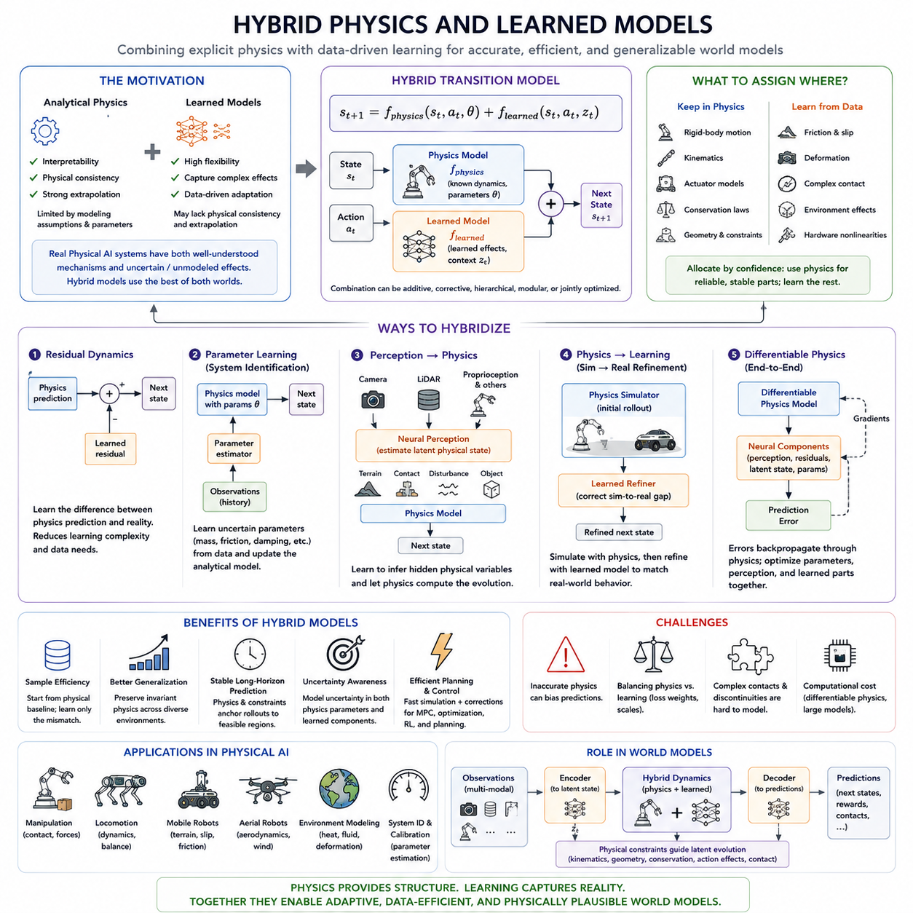{width="7.268055555555556in" height="7.268055555555556in"}

Hybrid physics and learned models combine explicit physical knowledge with data-driven learning to predict how real systems evolve. Instead of choosing between analytical equations and neural networks, the model assigns different parts of the dynamics to the representation best suited to them. Reliable physical structure can remain explicit, while uncertain, complex, or unmodeled effects are estimated from data.

The basic motivation comes from the limitations of both extremes. Analytical dynamics provides interpretability, physical consistency, and strong extrapolation when the governing equations and parameters are accurate. Learned dynamics provides flexibility and can capture effects that are difficult to formulate mathematically. Real Physical AI systems usually contain both well-understood mechanisms and poorly modeled interactions, making hybridization a natural design strategy.

A hybrid transition model can be expressed conceptually as s

t+1

​

=f_physics

​

(s

t

​

,a

t

​

,θ)+f

learned

​

(s

t

​

,a

t

​

,z

t

​

). The physics component predicts behavior using known dynamics and physical parameters θ, while the learned component represents additional effects from observations or latent context z

t

​

. The precise combination may be additive, corrective, hierarchical, modular, or jointly optimized.

Residual dynamics learning is one of the simplest hybrid architectures. An analytical model first computes a nominal prediction, and a neural network learns the residual between this prediction and the observed next state. If the physical model already explains most of the system, the neural network only needs to learn the remaining error. This can significantly reduce the complexity and amount of data required for learning.

For a mobile robot, for example, analytical kinematics may accurately describe nominal wheel motion while real terrain produces slip, vibration, compliance, and changing traction. The physics model can predict ideal vehicle motion, while a learned residual estimates deviations caused by terrain and operating conditions. The resulting world model preserves known vehicle structure while adapting its predictions to the environment actually encountered.

Hybridization can also occur through parameter learning rather than direct residual correction. The structure of the governing equations may be known, but parameters such as mass, inertia, friction, damping, stiffness, motor constants, or aerodynamic coefficients may be uncertain. A neural estimator can infer these quantities from recent sensor observations and continuously update the analytical model, effectively performing adaptive system identification.

Another architecture uses neural networks to estimate quantities that are difficult to observe directly. Camera, LiDAR, tactile sensing, proprioception, or other modalities can be encoded into estimates of terrain properties, contact states, object parameters, or external disturbances. These inferred physical variables are then passed to an analytical dynamics module. Learning therefore handles perception and estimation, while physics determines how the estimated state evolves.

The opposite arrangement is also possible. An analytical simulator can generate an initial future trajectory, after which a learned model refines the prediction using patterns extracted from real-world experience. This approach is useful when simulation captures the dominant dynamics but exhibits a systematic sim-to-real gap. The learned component effectively transforms idealized simulated behavior into predictions that better reflect actual hardware and environmental interactions.

Differentiable physics provides a deeper form of integration. If the physics module is differentiable, prediction errors can propagate through physical calculations during training. Unknown parameters, perception networks, latent representations, and learned residual components can then be optimized together. The simulator is no longer merely an external source of synthetic data; it becomes an active computational component inside the learning architecture.

Hybrid models can also embed physical constraints directly into learned state transitions. Instead of adding a complete analytical simulator, a neural dynamics model may enforce kinematic limits, collision constraints, conservation relationships, geometric consistency, or stability conditions. Such constrained learned dynamics occupy an intermediate position between classical simulation and unrestricted neural prediction, preserving flexibility while restricting physically impossible transitions.

This approach is especially valuable for latent world models. High-dimensional observations can first be compressed into a latent state, after which learned dynamics predict future latent representations. Physical structure can regulate this latent evolution through action-conditioned transitions, temporal continuity, geometry, conservation constraints, or auxiliary predictions of velocity and contact. The latent space remains learned while its dynamics are encouraged to represent physically meaningful behavior.

The division between physics and learning should depend on confidence rather than convenience. Components governed by reliable equations and stable parameters are strong candidates for explicit modeling. Components involving uncertain friction, deformation, complex contact, environmental disturbances, or hardware-specific nonlinearities are stronger candidates for learning. This allocation prevents neural networks from unnecessarily relearning established physics while avoiding excessive dependence on inaccurate analytical assumptions.

Hybrid models can improve sample efficiency because the learning component starts from a structured physical baseline. A robot does not need to discover rigid-body motion, basic kinematics, or known actuator relationships entirely from experience. Training data can instead focus on the mismatch between nominal physics and reality. This is particularly important for Physical AI because collecting diverse interaction data can require expensive hardware operation and may involve safety risks.

Generalization can also improve when stable physical structure is preserved across environments. Visual appearance, terrain, payload, temperature, and hardware condition may change, but many geometric and mechanical relationships remain valid. The learned component can adapt to changing local conditions while the analytical component supplies invariant structure. This separation can make adaptation more efficient than retraining a completely data-driven dynamics model.

Long-horizon prediction provides another motivation for hybridization. Small errors in unrestricted learned transitions can accumulate during repeated rollouts until predicted trajectories become physically unrealistic. Explicit physics and constraints can anchor the rollout to feasible regions of state space. Learned corrections still compensate for model mismatch, but they operate around a physically meaningful trajectory rather than generating the entire future without structural guidance.

Hybrid models also support uncertainty-aware prediction. The analytical component may contain uncertain physical parameters, while the learned component may encounter observations outside its training distribution. A world model can represent uncertainty over both sources and propagate it through future rollouts. Planning algorithms can then distinguish between uncertainty caused by unknown system parameters and uncertainty caused by incomplete learned knowledge.

For planning and control, hybrid world models provide a useful balance between computational efficiency and physical credibility. Candidate actions can be simulated through an analytical core and corrected by learned dynamics before trajectories are evaluated. Model Predictive Control, trajectory optimization, and model-based reinforcement learning can use these predictions to compare alternative futures while retaining knowledge of actuator limits, geometry, contact, and environmental effects.

There are nevertheless important design challenges. An inaccurate physics model can introduce systematic bias, while an excessively powerful neural correction may learn to ignore the analytical component entirely. Poorly scaled residuals, unstable gradients, conflicting constraints, and errors in estimated physical parameters can also degrade performance. Successful hybrid architectures therefore require careful decisions about interfaces, representations, optimization objectives, and the relative authority of physics and learning.

Hybrid physics and learned models ultimately treat physical knowledge and experience as complementary rather than competing sources of intelligence. Physics provides reusable structure about how the world should behave, while learning captures how a particular real system actually behaves when ideal assumptions fail. For Physical AI world models, this combination offers a practical path toward predictions that are adaptable, data-efficient, physically plausible, and useful for long-horizon planning and control.

하이브리드 물리-학습 모델(Hybrid Physics and Learned Models)은 실제 시스템이 어떻게 변화하는지를 예측하기 위해 명시적인 물리 지식(Explicit Physical Knowledge)과 데이터 기반 학습(Data-Driven Learning)을 결합한다. 해석적 방정식(Analytical Equations)과 신경망(Neural Networks) 중 하나만 선택하는 대신, 동역학(Dynamics)의 서로 다른 부분을 각각 가장 적합한 표현 방식에 할당한다. 신뢰할 수 있는 물리 구조는 명시적으로 유지하고, 불확실하거나 복잡하거나 모델링되지 않은 효과는 데이터로부터 추정한다.

기본적인 동기는 두 극단적인 접근법이 각각 가지는 한계에서 출발한다. 해석적 동역학(Analytical Dynamics)은 지배 방정식(Governing Equations)과 매개변수가 정확한 경우 해석 가능성(Interpretability), 물리적 일관성(Physical Consistency), 강력한 외삽(Extrapolation) 능력을 제공한다. 학습된 동역학(Learned Dynamics)은 높은 유연성을 제공하며 수학적으로 표현하기 어려운 효과를 포착할 수 있다. 실제 피지컬 AI(Physical AI) 시스템에는 잘 이해된 메커니즘과 모델링하기 어려운 상호작용이 함께 존재하므로 하이브리드화(Hybridization)는 자연스러운 설계 전략이 된다.

하이브리드 전이 모델(Hybrid Transition Model)은 개념적으로 s

t+1

​

=f

physics

​

(s

t

​

,a

t

​

,θ)+f

learned

​

(s

t

​

,a

t

​

,z

t

​

)로 표현할 수 있다. 물리 구성요소(Physics Component)는 알려진 동역학과 물리 매개변수 θ를 이용하여 거동을 예측하고, 학습 구성요소(Learned Component)는 관측이나 잠재 문맥(Latent Context) z

t

​

로부터 추가적인 효과를 표현한다. 두 구성요소의 결합 방식은 가산적(Additive), 보정적(Corrective), 계층적(Hierarchical), 모듈식(Modular), 공동 최적화(Jointly Optimized) 등 다양한 형태가 될 수 있다.

잔차 동역학 학습(Residual Dynamics Learning)은 가장 단순한 하이브리드 아키텍처(Hybrid Architecture) 중 하나이다. 먼저 해석적 모델이 명목 예측(Nominal Prediction)을 계산하고, 신경망이 이 예측과 실제로 관측된 다음 상태 사이의 잔차(Residual)를 학습한다. 물리 모델이 이미 시스템의 대부분을 설명하고 있다면 신경망은 남아 있는 오차만 학습하면 된다. 이를 통해 학습 문제의 복잡성과 필요한 데이터의 양을 크게 줄일 수 있다.

예를 들어 이동 로봇(Mobile Robot)의 경우 해석적 운동학(Analytical Kinematics)은 이상적인 바퀴 운동을 정확하게 설명할 수 있지만, 실제 지형에서는 슬립(Slip), 진동(Vibration), 유연성(Compliance), 변화하는 접지력(Traction)이 발생한다. 물리 모델은 이상적인 차량 운동을 예측하고 학습된 잔차는 지형과 운용 조건으로 발생하는 편차를 추정할 수 있다. 결과적으로 월드 모델(World Model)은 알려진 차량 구조를 유지하면서 실제 환경에 맞게 예측을 적응시킬 수 있다.

하이브리드화는 직접적인 잔차 보정 대신 매개변수 학습(Parameter Learning)을 통해서도 이루어질 수 있다. 지배 방정식의 구조는 알려져 있지만 질량(Mass), 관성(Inertia), 마찰(Friction), 감쇠(Damping), 강성(Stiffness), 모터 상수(Motor Constants), 공기역학 계수(Aerodynamic Coefficients) 등의 매개변수는 불확실할 수 있다. 신경 추정기(Neural Estimator)는 최근 센서 관측으로부터 이러한 물리량을 추론하여 해석적 모델을 지속적으로 갱신함으로써 적응형 시스템 식별(Adaptive System Identification)을 수행할 수 있다.

또 다른 아키텍처에서는 직접 관측하기 어려운 물리량을 추정하는 데 신경망을 사용한다. 카메라(Camera), 라이다(LiDAR), 촉각 센싱(Tactile Sensing), 고유수용감각(Proprioception) 등의 모달리티(Modality)를 인코딩하여 지형 특성(Terrain Properties), 접촉 상태(Contact States), 객체 매개변수(Object Parameters), 외부 교란(External Disturbances)을 추정할 수 있다. 이렇게 추론된 물리 변수는 해석적 동역학 모듈로 전달된다. 즉, 학습은 지각과 추정을 담당하고 물리학은 추정된 상태가 어떻게 변화하는지를 결정한다.

반대의 구성도 가능하다. 해석적 시뮬레이터(Analytical Simulator)가 먼저 초기 미래 궤적(Future Trajectory)을 생성하고, 이후 학습 모델이 실제 경험에서 추출한 패턴을 이용하여 예측을 정교화할 수 있다. 이 방식은 시뮬레이션이 주요 동역학을 잘 표현하지만 체계적인 시뮬레이션-현실 격차(Sim-to-Real Gap)가 존재할 때 유용하다. 학습 구성요소는 이상화된 시뮬레이션 거동을 실제 하드웨어와 환경의 상호작용을 더욱 잘 반영하는 예측으로 변환한다.

미분가능 물리학(Differentiable Physics)은 더욱 깊은 수준의 통합을 제공한다. 물리 모듈(Physics Module)이 미분 가능하다면 학습 과정에서 예측 오류가 물리 계산을 통과하여 역전파될 수 있다. 알려지지 않은 매개변수, 지각 네트워크(Perception Networks), 잠재 표현(Latent Representations), 학습된 잔차 구성요소를 함께 최적화할 수 있다. 이때 시뮬레이터는 단순히 합성 데이터(Synthetic Data)를 제공하는 외부 도구가 아니라 학습 아키텍처 내부의 능동적인 계산 구성요소가 된다.

하이브리드 모델은 물리적 제약조건(Physical Constraints)을 학습된 상태 전이에 직접 포함할 수도 있다. 완전한 해석적 시뮬레이터를 추가하는 대신 신경 동역학 모델(Neural Dynamics Model)이 운동학적 한계(Kinematic Limits), 충돌 제약(Collision Constraints), 보존 관계(Conservation Relationships), 기하학적 일관성(Geometric Consistency), 안정성 조건(Stability Conditions)을 만족하도록 만들 수 있다. 이러한 제약된 학습 동역학(Constrained Learned Dynamics)은 고전적인 시뮬레이션과 제한 없는 신경 예측 사이의 중간 영역에 위치하며 유연성을 유지하면서 물리적으로 불가능한 상태 전이를 제한한다.

이러한 접근법은 잠재 월드 모델(Latent World Model)에 특히 유용하다. 고차원 관측(High-Dimensional Observations)을 먼저 잠재 상태(Latent State)로 압축하고, 이후 학습된 동역학이 미래 잠재 표현을 예측할 수 있다. 물리 구조는 행동 조건부 전이(Action-Conditioned Transitions), 시간적 연속성(Temporal Continuity), 기하학(Geometry), 보존 제약(Conservation Constraints), 속도와 접촉에 대한 보조 예측(Auxiliary Predictions)을 통해 잠재 상태의 변화를 조절할 수 있다. 잠재 공간은 학습되면서도 그 동역학은 물리적으로 의미 있는 거동을 표현하도록 유도된다.

물리학과 학습 사이의 역할 분담은 편의성이 아니라 신뢰도(Confidence)에 따라 결정되어야 한다. 신뢰할 수 있는 방정식과 안정적인 매개변수에 의해 지배되는 구성요소는 명시적 모델링(Explicit Modeling)에 적합하다. 반면 불확실한 마찰, 변형(Deformation), 복잡한 접촉(Complex Contact), 환경 교란, 하드웨어 고유의 비선형성(Hardware-Specific Nonlinearities)은 학습에 더 적합하다. 이러한 역할 분담은 신경망이 이미 확립된 물리학을 불필요하게 다시 학습하는 것을 방지하면서 부정확한 해석적 가정에 지나치게 의존하는 문제도 피할 수 있다.

하이브리드 모델은 학습 구성요소가 구조화된 물리적 기준선(Physical Baseline)에서 시작하기 때문에 표본 효율성(Sample Efficiency)을 향상시킬 수 있다. 로봇은 강체 운동(Rigid-Body Motion), 기본 운동학(Basic Kinematics), 알려진 액추에이터 관계(Actuator Relationships)를 경험만으로 처음부터 발견할 필요가 없다. 대신 학습 데이터는 명목 물리 모델(Nominal Physics Model)과 실제 세계 사이의 차이를 학습하는 데 집중될 수 있다. 이는 다양한 상호작용 데이터를 수집하기 위해 값비싼 하드웨어를 운용해야 하고 안전 위험까지 수반할 수 있는 피지컬 AI에서 특히 중요하다.

환경이 변화하더라도 안정적인 물리 구조를 유지하면 일반화(Generalization) 성능도 향상될 수 있다. 시각적 외형(Visual Appearance), 지형, 페이로드(Payload), 온도(Temperature), 하드웨어 상태(Hardware Condition)는 변화할 수 있지만 많은 기하학적·기계적 관계는 계속 유지된다. 학습 구성요소는 변화하는 국소 조건(Local Conditions)에 적응하고 해석적 구성요소는 불변 구조(Invariant Structure)를 제공할 수 있다. 이러한 분리는 완전한 데이터 기반 동역학 모델 전체를 다시 학습하는 것보다 효율적인 적응을 가능하게 한다.

장기 예측(Long-Horizon Prediction)은 하이브리드화가 필요한 또 다른 중요한 이유이다. 제한 없는 학습 상태 전이에서 발생하는 작은 오류는 반복적인 롤아웃(Rollout)을 통해 누적되어 예측 궤적을 물리적으로 비현실적인 상태로 만들 수 있다. 명시적인 물리학과 제약조건은 롤아웃을 상태 공간(State Space)의 실행 가능한 영역에 고정하는 역할을 한다. 학습된 보정은 여전히 모델 불일치(Model Mismatch)를 보완하지만, 구조적 지침 없이 전체 미래를 생성하는 대신 물리적으로 의미 있는 궤적을 중심으로 작동한다.

하이브리드 모델은 불확실성 인식 예측(Uncertainty-Aware Prediction)도 지원한다. 해석적 구성요소에는 불확실한 물리 매개변수가 포함될 수 있으며, 학습 구성요소는 학습 분포를 벗어난 관측(Out-of-Distribution Observations)을 만날 수 있다. 월드 모델은 두 종류의 불확실성을 모두 표현하고 미래 롤아웃을 통해 전파할 수 있다. 계획 알고리즘(Planning Algorithm)은 이를 통해 알려지지 않은 시스템 매개변수로 발생하는 불확실성과 불완전한 학습 지식으로 발생하는 불확실성을 구분할 수 있다.

계획 및 제어(Planning and Control)에서 하이브리드 월드 모델(Hybrid World Model)은 계산 효율성(Computational Efficiency)과 물리적 신뢰성(Physical Credibility) 사이의 유용한 균형을 제공한다. 후보 행동(Candidate Actions)을 해석적 코어(Analytical Core)를 통해 시뮬레이션하고, 궤적을 평가하기 전에 학습된 동역학으로 이를 보정할 수 있다. 모델 예측 제어(Model Predictive Control), 궤적 최적화(Trajectory Optimization), 모델 기반 강화학습(Model-Based Reinforcement Learning)은 액추에이터 한계, 기하학, 접촉, 환경 효과에 대한 지식을 유지하면서 이러한 예측을 이용하여 여러 대안적 미래를 비교할 수 있다.

그러나 중요한 설계 과제도 존재한다. 부정확한 물리 모델은 체계적인 편향(Systematic Bias)을 발생시킬 수 있으며, 지나치게 강력한 신경망 보정 모델은 해석적 구성요소를 완전히 무시하는 방향으로 학습될 수 있다. 적절하지 않은 잔차 스케일(Residual Scale), 불안정한 그래디언트(Unstable Gradients), 서로 충돌하는 제약조건(Conflicting Constraints), 잘못 추정된 물리 매개변수도 성능을 저하시킬 수 있다. 따라서 성공적인 하이브리드 아키텍처를 구축하려면 인터페이스, 표현 방식, 최적화 목적함수, 물리학과 학습 사이의 상대적인 영향력에 대한 세심한 설계가 필요하다.

궁극적으로 하이브리드 물리-학습 모델은 물리 지식과 경험을 서로 경쟁하는 것이 아니라 상호 보완적인 지능의 원천으로 취급한다. 물리학은 세계가 어떻게 동작해야 하는지에 대한 재사용 가능한 구조(Reusable Structure)를 제공하고, 학습은 이상적인 가정이 성립하지 않을 때 특정 실제 시스템이 실제로 어떻게 동작하는지를 포착한다. 피지컬 AI 월드 모델에서 이러한 결합은 적응성(Adaptability), 데이터 효율성(Data Efficiency), 물리적 타당성(Physical Plausibility)을 동시에 확보하면서 장기 계획(Long-Horizon Planning)과 제어(Control)에 활용할 수 있는 예측을 구축하기 위한 실용적인 경로를 제공한다.

##  

## 10.05. Conservation Laws and Constraints

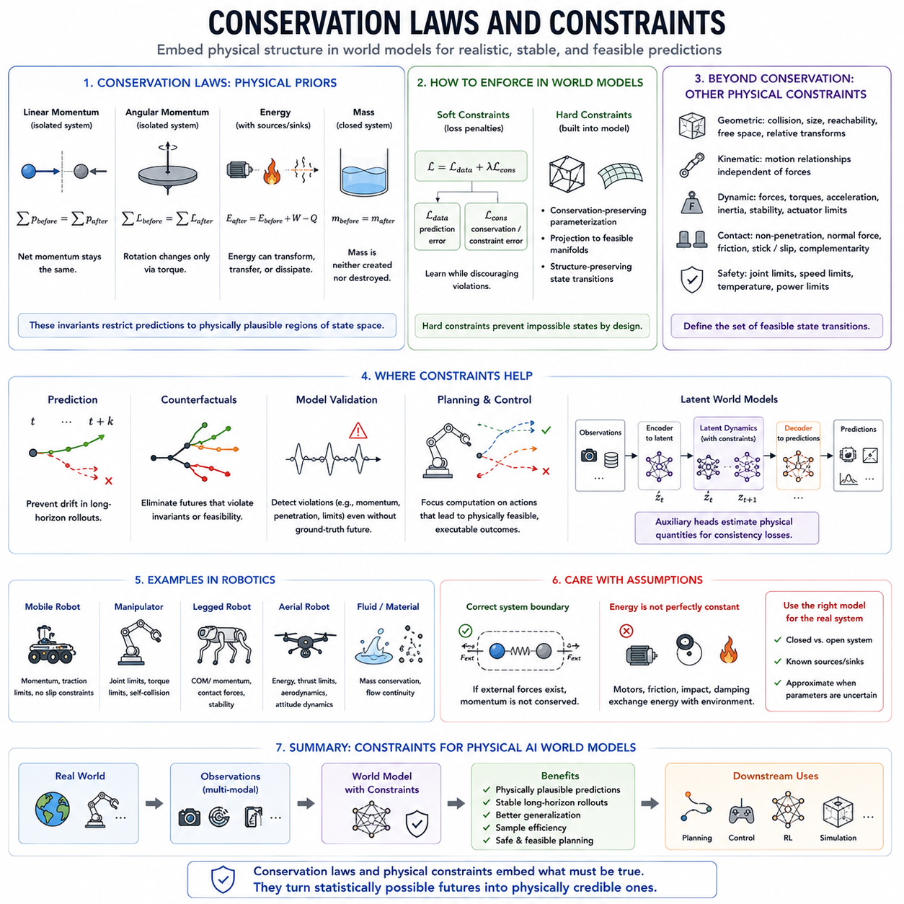{width="7.268055555555556in" height="7.268055555555556in"}

Conservation laws provide world models with structural rules that remain valid across many physical situations. Instead of learning every possible state transition independently from data, a model can exploit quantities that must be preserved or transformed according to known relationships. Conservation of mass, momentum, angular momentum, and energy therefore acts as a powerful physical prior that restricts predictions to more plausible regions of the state space.

In classical mechanics, linear momentum is conserved when the net external force on a system is zero. When two objects collide, their individual velocities may change dramatically, but the total momentum of the isolated system must remain consistent before and after the interaction. A world model that respects this relationship can reject predicted collision outcomes that appear visually plausible yet imply physically impossible changes in motion.

Angular momentum introduces similar structure for rotational motion. Robots frequently interact with rotating wheels, articulated links, tools, doors, objects, and their own dynamically moving bodies. Changes in angular velocity depend on torque, inertia, and external interactions rather than arbitrary temporal correlations. Encoding these relationships helps a world model represent rotational dynamics and reason about how actions influence orientation, balance, and physical interaction.

Energy provides another important constraint, although practical robotic systems are rarely perfectly conservative. Mechanical energy may be transformed into heat through friction, supplied by motors, absorbed by damping, or transferred during collisions. The useful prior is therefore not simply that energy always remains numerically constant, but that changes in energy should correspond to physically meaningful sources, sinks, transformations, and exchanges within the modeled system.

Mass conservation is particularly relevant when world models represent fluids, granular materials, deformable substances, or processes involving transport between regions. Material should not spontaneously appear or disappear unless the modeled process explicitly includes a source or sink. Even when a robot primarily interacts with rigid objects, conservation principles can provide useful structural constraints for environmental models involving liquids, gases, soil, powders, or other distributed materials.

Conservation laws can be incorporated into learned world models in several ways. A straightforward approach adds constraint terms to the training objective, penalizing predictions that violate known conservation relationships. If L

data

​

measures prediction error and L

cons

​

measures conservation error, training can minimize an objective such as L=L

data

​

+λL

cons

​

. The coefficient λ controls the relative influence of empirical observations and physical consistency.

Hard constraints provide a stronger alternative to such soft penalties. Instead of merely discouraging violations through a loss function, the model architecture can be designed so that certain outputs automatically satisfy required relationships. State variables may be parameterized in conservation-preserving forms, predictions may be projected onto feasible manifolds, or specialized numerical structures may preserve invariants during state transitions. This reduces the model\'s ability to generate impossible states.

Not every useful physical constraint is a conservation law. Physical AI systems are also governed by geometric, kinematic, dynamic, actuator, contact, and safety constraints. A robot joint cannot normally rotate beyond its mechanical limits, an actuator cannot produce unlimited torque, two rigid bodies should not occupy the same volume, and a wheeled platform cannot instantaneously move in directions prohibited by its kinematics. These restrictions define feasible state transitions.

Geometric constraints are particularly important because physical interaction occurs in structured three-dimensional space. Object dimensions, collision boundaries, articulated link geometry, reachability, free space, and relative transformations constrain what can happen next. A learned model that predicts an object passing through a wall or a manipulator reaching beyond its workspace may minimize statistical prediction error in some cases while still producing a physically unusable future.

Kinematic constraints describe relationships among positions, velocities, and allowable motion independent of the forces producing them. Differential-drive robots, Ackermann-steered vehicles, manipulators, quadrupeds, and aerial robots each possess different motion constraints. Incorporating embodiment-specific kinematics into a world model prevents the predicted agent from behaving like a generic movable point and connects future prediction directly to the capabilities of the actual physical platform.

Dynamic constraints extend this reasoning to forces, torques, accelerations, inertia, stability, and actuator capabilities. A trajectory may be geometrically collision-free but still impossible because it requires excessive acceleration or torque. For planning-oriented world models, feasibility must therefore include not only where the robot can move but also whether its physical system can execute that motion within available force, power, traction, and stability limits.

Contact constraints become essential when robots manipulate objects or traverse complex terrain. Contact may impose non-penetration, normal-force, friction, sticking, sliding, and complementarity relationships. These conditions can create discontinuous transitions when contact begins or ends. Incorporating contact structure helps distinguish physically valid interactions from trajectories that are geometrically attractive but impossible under realistic friction and force conditions.

Constraints can also operate in latent world models even when the internal representation does not explicitly correspond to conventional physical variables. Auxiliary prediction heads can estimate velocity, depth, occupancy, contact, or energy-related quantities from the latent state, allowing physical consistency losses to regulate representation learning. Alternatively, latent transitions can be constrained so decoded predictions satisfy geometry, dynamics, or conservation relationships.

Long-horizon prediction particularly benefits from conservation-aware and constraint-aware modeling. Small violations that appear insignificant over one prediction step can accumulate during repeated rollouts. An object may gradually gain energy without an external source, robot velocity may exceed feasible limits, or geometry may slowly become inconsistent. Repeated enforcement of physical structure helps prevent such errors from expanding into unrealistic imagined futures.

These principles are also valuable for counterfactual prediction. When a world model evaluates multiple possible actions, each imagined future should remain physically feasible. Conservation laws and constraints reduce the space of candidate futures by eliminating trajectories that violate known invariants, actuator limits, collision conditions, or embodiment capabilities. Planning can therefore allocate computation to alternatives that could actually be executed rather than evaluating arbitrary predictions.

Physical constraints additionally provide useful signals for model validation and runtime monitoring. A prediction that violates a joint limit, creates unexplained momentum, penetrates an obstacle, or demands impossible acceleration can be flagged even when no ground-truth future observation is yet available. Conservation residuals and constraint violations can therefore function as diagnostic indicators for detecting model drift, unusual conditions, or potentially unsafe predictions.

However, constraints must reflect the correct system boundary and assumptions. Momentum is not conserved for a subsystem experiencing external forces, and mechanical energy is not constant when motors, friction, damping, or impacts exchange energy with the environment. Incorrectly imposing an ideal conservation rule can therefore degrade prediction accuracy. Physical constraints should represent the actual open or closed system being modeled rather than an oversimplified textbook abstraction.

For this reason, modern physics-informed world models can combine exact constraints, approximate constraints, learned parameters, and uncertainty. Some relationships may be enforced strictly, while others are represented as probabilistic or weighted penalties because parameters such as friction, mass, external force, or energy dissipation are uncertain. The model can preserve reliable physical structure without pretending that every property of the real environment is perfectly known.

Conservation laws and constraints ultimately reduce the enormous space of statistically conceivable futures to a smaller space of physically credible futures. For Physical AI, this distinction is fundamental because predicted states eventually guide real actions. By embedding invariants, geometry, kinematics, dynamics, contact conditions, actuator limits, and uncertainty into world modeling, the system gains a stronger foundation for stable prediction, feasible planning, safe control, and reliable long-horizon interaction.

보존 법칙(Conservation Laws)은 다양한 물리적 상황에서 지속적으로 성립하는 구조적 규칙을 월드 모델(World Model)에 제공한다. 모델은 가능한 모든 상태 전이(State Transition)를 데이터로부터 독립적으로 학습하는 대신, 알려진 관계에 따라 보존되거나 변환되어야 하는 물리량을 활용할 수 있다. 따라서 질량 보존(Conservation of Mass), 운동량 보존(Conservation of Momentum), 각운동량 보존(Conservation of Angular Momentum), 에너지 보존(Conservation of Energy)은 예측을 물리적으로 더욱 타당한 상태 공간(State Space)으로 제한하는 강력한 물리적 사전지식(Physical Prior)으로 작용한다.

고전역학(Classical Mechanics)에서 시스템에 작용하는 순외력(Net External Force)이 0이면 선운동량(Linear Momentum)이 보존된다. 두 물체가 충돌하면 각각의 속도는 크게 변할 수 있지만, 고립된 시스템(Isolated System)의 전체 운동량은 상호작용 전후에 일관되게 유지되어야 한다. 이러한 관계를 따르는 월드 모델은 시각적으로는 그럴듯하지만 물리적으로 불가능한 운동 변화를 의미하는 충돌 결과를 배제할 수 있다.

각운동량(Angular Momentum)은 회전 운동(Rotational Motion)에 유사한 구조를 제공한다. 로봇은 회전하는 바퀴, 관절 링크(Articulated Links), 도구, 문, 객체뿐만 아니라 동적으로 움직이는 자신의 신체와도 지속적으로 상호작용한다. 각속도(Angular Velocity)의 변화는 임의적인 시간적 상관관계가 아니라 토크(Torque), 관성(Inertia), 외부 상호작용에 의해 결정된다. 이러한 관계를 인코딩하면 월드 모델이 회전 동역학을 표현하고 행동이 자세(Orientation), 균형(Balance), 물리적 상호작용에 미치는 영향을 추론하는 데 도움이 된다.

에너지(Energy)는 또 다른 중요한 제약조건을 제공하지만 실제 로봇 시스템이 완벽한 보존계(Conservative System)인 경우는 드물다. 기계적 에너지(Mechanical Energy)는 마찰을 통해 열로 변환되거나, 모터에 의해 공급되거나, 감쇠(Damping)에 의해 흡수되거나, 충돌 과정에서 전달될 수 있다. 따라서 유용한 물리적 사전지식은 단순히 에너지가 항상 동일한 수치로 유지된다는 것이 아니라, 에너지 변화가 모델링된 시스템 내부의 물리적으로 의미 있는 공급원(Source), 소모원(Sink), 변환(Transformation), 교환(Exchange)에 대응해야 한다는 것이다.

질량 보존(Mass Conservation)은 월드 모델이 유체(Fluids), 입상 물질(Granular Materials), 변형 가능한 물질(Deformable Substances), 또는 영역 간 물질 이동을 포함하는 과정을 표현할 때 특히 중요하다. 모델링된 과정에 명시적인 공급원이나 소모원이 존재하지 않는다면 물질이 갑자기 생성되거나 사라져서는 안 된다. 로봇이 주로 강체(Rigid Objects)와 상호작용하는 경우에도 액체, 기체, 토양, 분말 등의 분산 물질(Distributed Materials)을 포함하는 환경 모델에서는 보존 원리가 중요한 구조적 제약을 제공한다.

보존 법칙은 학습된 월드 모델(Learned World Model)에 여러 방식으로 포함할 수 있다. 가장 직접적인 방법은 알려진 보존 관계를 위반하는 예측에 페널티(Penalty)를 부여하는 제약 항(Constraint Term)을 학습 목적함수에 추가하는 것이다. L

data

​

가 예측 오차를 측정하고 L

cons

​

가 보존 오차(Conservation Error)를 측정한다면, L=L

data

​

+λL

cons

​

와 같은 목적함수를 최소화하도록 학습할 수 있다. 계수 λ는 경험적 관측과 물리적 일관성의 상대적인 영향력을 조절한다.

하드 제약(Hard Constraints)은 이러한 소프트 페널티(Soft Penalties)보다 강력한 대안을 제공한다. 단순히 손실 함수로 위반을 억제하는 대신, 특정 출력이 요구되는 관계를 자동으로 만족하도록 모델 아키텍처(Model Architecture)를 설계할 수 있다. 상태 변수는 보존 관계를 유지하는 형태로 매개변수화될 수 있고, 예측값은 실행 가능한 다양체(Feasible Manifold)로 투영될 수 있으며, 특수한 수치 구조(Numerical Structure)를 통해 상태 전이 과정에서 불변량(Invariants)을 유지할 수 있다. 이는 모델이 불가능한 상태를 생성할 가능성을 근본적으로 감소시킨다.

유용한 모든 물리적 제약조건이 보존 법칙인 것은 아니다. 피지컬 AI(Physical AI) 시스템은 기하학적 제약(Geometric Constraints), 운동학적 제약(Kinematic Constraints), 동역학적 제약(Dynamic Constraints), 액추에이터 제약(Actuator Constraints), 접촉 제약(Contact Constraints), 안전 제약(Safety Constraints)의 지배도 받는다. 로봇 관절은 일반적으로 기계적 한계를 넘어 회전할 수 없고, 액추에이터는 무한한 토크를 생성할 수 없으며, 두 강체는 동일한 공간을 점유해서는 안 된다. 또한 바퀴형 플랫폼은 자신의 운동학이 허용하지 않는 방향으로 순간적으로 이동할 수 없다. 이러한 제한은 실행 가능한 상태 전이를 정의한다.

기하학적 제약은 물리적 상호작용이 구조화된 3차원 공간(Three-Dimensional Space)에서 발생하기 때문에 특히 중요하다. 객체의 크기(Object Dimensions), 충돌 경계(Collision Boundaries), 관절 링크 기하학(Articulated Link Geometry), 도달 가능성(Reachability), 자유 공간(Free Space), 상대 변환(Relative Transformations)은 다음에 발생할 수 있는 상태를 제한한다. 물체가 벽을 통과하거나 매니퓰레이터(Manipulator)가 작업공간(Workspace)을 넘어 도달한다고 예측하는 학습 모델은 통계적 예측 오차를 줄일 수는 있어도 물리적으로 활용 가능한 미래를 생성하지 못한다.

운동학적 제약(Kinematic Constraints)은 운동을 발생시키는 힘과 독립적으로 위치, 속도, 허용 가능한 운동 사이의 관계를 설명한다. 차동구동 로봇(Differential-Drive Robot), 애커먼 조향 차량(Ackermann-Steered Vehicle), 매니퓰레이터, 4족 보행 로봇(Quadruped), 비행 로봇(Aerial Robot)은 각각 서로 다른 운동 제약을 가진다. 신체화 특화 운동학(Embodiment-Specific Kinematics)을 월드 모델에 포함하면 예측된 에이전트가 단순한 이동 가능한 점처럼 움직이는 것을 방지하고 미래 예측을 실제 물리 플랫폼의 능력과 직접 연결할 수 있다.

동역학적 제약(Dynamic Constraints)은 이러한 개념을 힘, 토크, 가속도, 관성, 안정성(Stability), 액추에이터 성능까지 확장한다. 어떤 궤적(Trajectory)은 기하학적으로 충돌이 없더라도 과도한 가속도나 토크를 요구하기 때문에 실행 불가능할 수 있다. 따라서 계획 지향 월드 모델(Planning-Oriented World Model)에서 실행 가능성(Feasibility)은 로봇이 어디로 이동할 수 있는지만이 아니라 사용 가능한 힘, 동력(Power), 접지력(Traction), 안정성 한계 내에서 실제로 그 운동을 수행할 수 있는지도 포함해야 한다.

접촉 제약(Contact Constraints)은 로봇이 물체를 조작하거나 복잡한 지형을 이동할 때 필수적이다. 접촉에는 비관통(Non-Penetration), 수직항력(Normal Force), 마찰(Friction), 고착(Sticking), 미끄러짐(Sliding), 상보성 관계(Complementarity Relationships) 등이 포함될 수 있다. 이러한 조건은 접촉이 시작되거나 종료될 때 불연속적인 상태 전이를 만들 수 있다. 접촉 구조를 포함하면 기하학적으로 매력적으로 보이지만 실제 마찰과 힘 조건에서는 실행 불가능한 궤적과 물리적으로 유효한 상호작용을 구분하는 데 도움이 된다.

내부 표현이 기존의 물리 변수와 명시적으로 대응하지 않는 경우에도 제약조건을 잠재 월드 모델(Latent World Model)에 적용할 수 있다. 보조 예측 헤드(Auxiliary Prediction Heads)를 사용하여 잠재 상태로부터 속도, 깊이(Depth), 점유(Occupancy), 접촉, 에너지 관련 물리량을 추정하고, 물리적 일관성 손실(Physical Consistency Loss)을 통해 표현 학습을 조절할 수 있다. 또는 디코딩된 예측이 기하학, 동역학, 보존 관계를 만족하도록 잠재 상태 전이 자체를 제약할 수도 있다.

장기 예측(Long-Horizon Prediction)은 보존 인식 모델링(Conservation-Aware Modeling)과 제약 인식 모델링(Constraint-Aware Modeling)의 이점을 특히 크게 받을 수 있다. 단일 예측 단계에서는 중요하지 않아 보이는 작은 위반도 반복적인 롤아웃(Rollout)을 거치면서 누적될 수 있다. 외부 에너지원 없이 물체의 에너지가 점차 증가하거나, 로봇의 속도가 실행 가능한 한계를 넘어가거나, 기하학적 관계가 서서히 붕괴할 수 있다. 물리 구조를 반복적으로 적용하면 이러한 오류가 비현실적인 상상 미래(Imagined Futures)로 확대되는 것을 억제할 수 있다.

이러한 원리는 반사실적 예측(Counterfactual Prediction)에서도 중요하다. 월드 모델이 여러 가능한 행동을 평가할 때 각각의 상상된 미래는 물리적으로 실행 가능해야 한다. 보존 법칙과 제약조건은 알려진 불변량, 액추에이터 한계, 충돌 조건, 신체화 능력을 위반하는 궤적을 제거하여 후보 미래의 공간을 줄인다. 따라서 계획(Planning)은 임의적인 예측을 평가하는 데 계산 자원을 낭비하지 않고 실제로 실행 가능한 대안에 계산 능력을 집중할 수 있다.

물리적 제약은 모델 검증(Model Validation)과 런타임 모니터링(Runtime Monitoring)을 위한 유용한 신호도 제공한다. 관절 한계를 위반하거나, 설명되지 않는 운동량을 생성하거나, 장애물을 관통하거나, 불가능한 가속도를 요구하는 예측은 아직 실제 미래 관측값(Ground-Truth Future Observation)이 존재하지 않더라도 탐지할 수 있다. 따라서 보존 잔차(Conservation Residual)와 제약 위반(Constraint Violation)은 모델 드리프트(Model Drift), 비정상적인 조건, 잠재적으로 위험한 예측을 탐지하기 위한 진단 지표(Diagnostic Indicator)로 활용할 수 있다.

그러나 제약조건은 올바른 시스템 경계(System Boundary)와 가정을 반영해야 한다. 외력이 작용하는 하위 시스템에서는 운동량이 보존되지 않으며, 모터, 마찰, 감쇠, 충격을 통해 환경과 에너지를 교환하는 경우 기계적 에너지는 일정하지 않다. 따라서 이상적인 보존 규칙을 잘못 적용하면 오히려 예측 정확도를 떨어뜨릴 수 있다. 물리적 제약은 지나치게 단순화된 교과서적 추상화가 아니라 실제로 모델링하는 개방계(Open System) 또는 폐쇄계(Closed System)의 특성을 반영해야 한다.

이러한 이유로 현대의 물리 정보 월드 모델(Physics-Informed World Model)은 정확한 제약(Exact Constraints), 근사 제약(Approximate Constraints), 학습된 매개변수(Learned Parameters), 불확실성(Uncertainty)을 함께 결합할 수 있다. 일부 관계는 엄격하게 강제할 수 있지만, 마찰, 질량, 외력, 에너지 소산(Energy Dissipation)과 같은 매개변수가 불확실한 경우에는 다른 관계를 확률적 제약(Probabilistic Constraints)이나 가중 페널티(Weighted Penalties)로 표현할 수 있다. 이를 통해 실제 환경의 모든 특성이 완벽하게 알려져 있다고 가정하지 않으면서도 신뢰할 수 있는 물리 구조를 유지할 수 있다.

궁극적으로 보존 법칙과 제약조건은 통계적으로 상상 가능한 미래(Statistically Conceivable Futures)의 방대한 공간을 물리적으로 신뢰할 수 있는 미래(Physically Credible Futures)의 더 작은 공간으로 축소한다. 피지컬 AI에서는 예측된 상태가 결국 실제 행동을 결정하기 때문에 이러한 구분이 근본적으로 중요하다. 불변량(Invariants), 기하학, 운동학, 동역학, 접촉 조건, 액추에이터 한계, 불확실성을 월드 모델링에 통합함으로써 시스템은 안정적인 예측(Stable Prediction), 실행 가능한 계획(Feasible Planning), 안전한 제어(Safe Control), 신뢰할 수 있는 장기 상호작용(Long-Horizon Interaction)을 위한 더욱 강력한 기반을 확보할 수 있다.

##  

## 10.06. Contact Friction and Rigid Body Priors

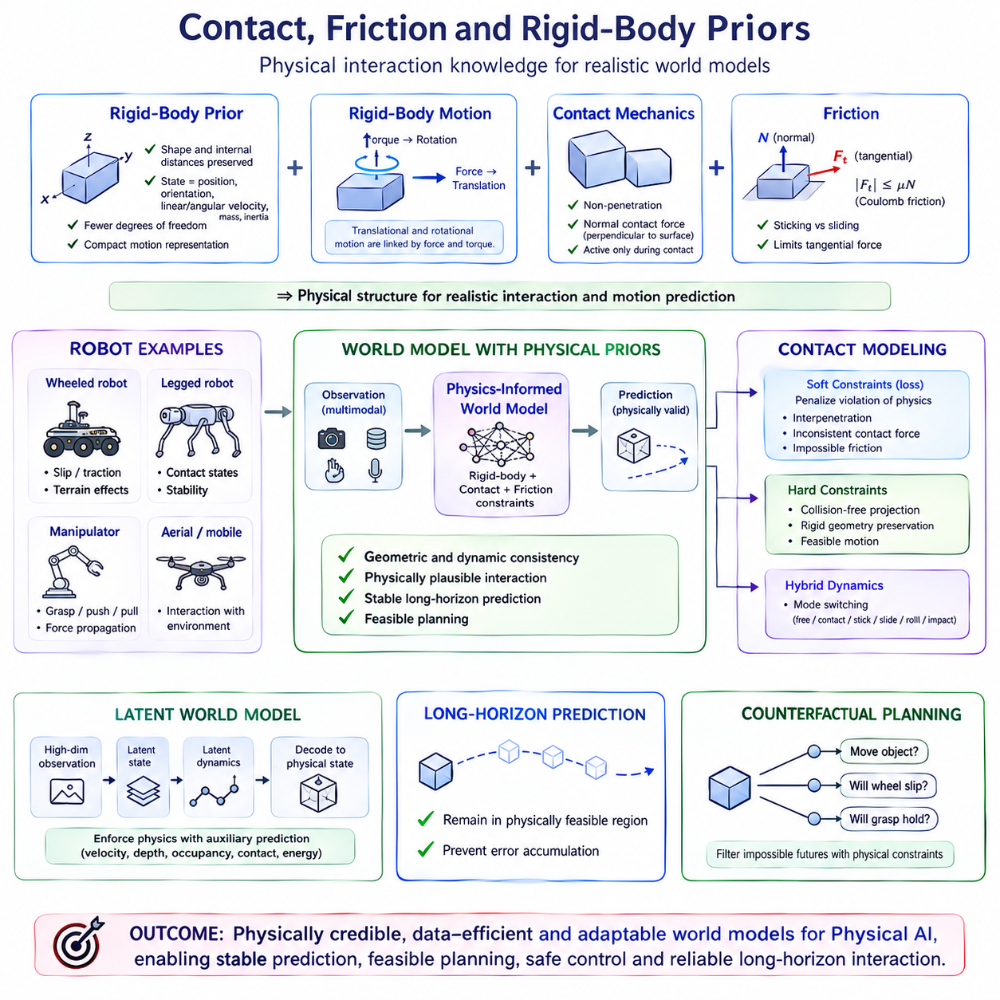{width="7.268055555555556in" height="7.268055555555556in"}

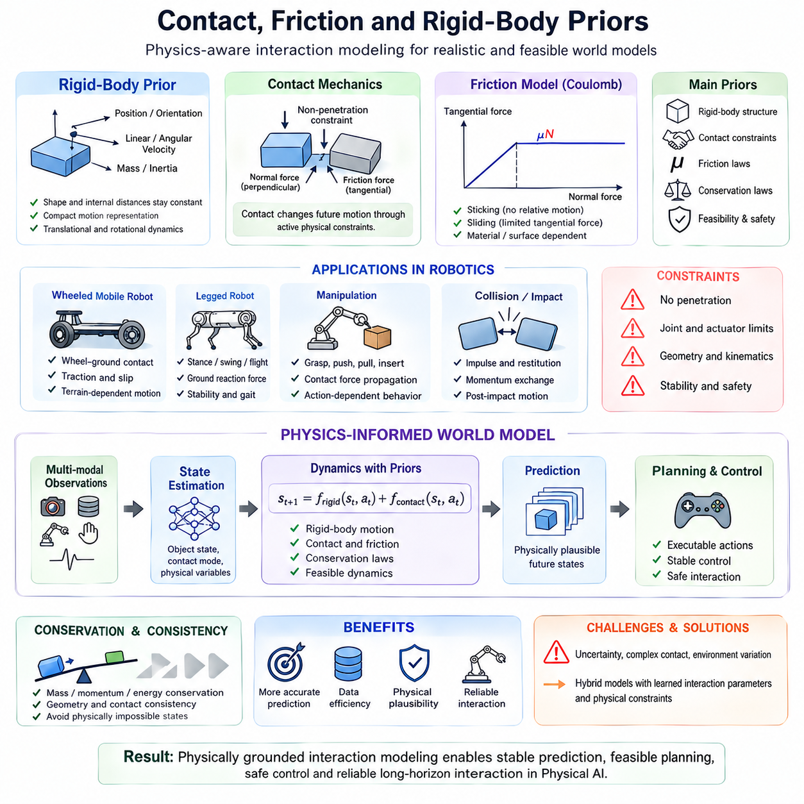{width="7.268055555555556in" height="7.268055555555556in"}

Contact, friction, and rigid-body priors provide world models with structural knowledge about how physical objects interact when they touch, push, slide, roll, collide, or support one another. These interactions are fundamental to Physical AI because robots continuously exchange forces with objects and surfaces. Without such priors, a model may predict visually plausible motion while violating basic properties of contact mechanics and rigid-body behavior.

A rigid-body prior assumes that an object\'s shape and internal distances remain approximately unchanged during motion. Instead of independently predicting every point on an object, the world model can represent the object through position, orientation, linear velocity, angular velocity, mass, and inertia. This dramatically reduces the number of physically meaningful degrees of freedom and provides a compact structure for predicting object and robot motion.

Rigid-body motion naturally separates translation from rotation while connecting them through applied forces and torques. The center of mass responds to net force, whereas angular motion depends on torque and the inertia distribution. By incorporating these relationships, a world model can predict how pushing an object at different locations produces different combinations of translation and rotation rather than treating object displacement as an arbitrary visual transformation.

Contact introduces constraints that become active when physical bodies meet. A basic non-penetration condition requires rigid objects not to occupy the same physical volume. When predicted geometries approach one another, the model must determine whether contact occurs and how the resulting forces modify future motion. Contact therefore changes world modeling from independent trajectory prediction into interaction-aware prediction involving coupled physical states.

The normal contact force acts approximately perpendicular to the contact surface and prevents objects from penetrating each other. In many formulations, the normal force becomes active only when bodies are in contact and disappears when they separate. This creates a conditional and potentially discontinuous transition structure that is more difficult to learn than smooth free-space motion but essential for realistic manipulation, locomotion, and navigation.

Friction determines how tangential motion behaves at a contact interface. A commonly used approximation is Coulomb friction, in which the maximum tangential friction force is related to the normal force through a friction coefficient. The relationship distinguishes sticking from sliding and constrains how much tangential force can be transmitted before relative motion begins. Even simplified friction priors can substantially improve predictions of physical interaction.

Friction is particularly difficult because its effective value depends on materials, surface condition, load, velocity, temperature, contamination, deformation, and other factors. A wheel moving on dry concrete may behave very differently on wet flooring, gravel, mud, or grass. Consequently, world models often benefit from combining a known friction structure with learned or estimated parameters rather than assuming one fixed coefficient for every situation.

For wheeled mobile robots, contact and friction priors connect commanded motion to actual vehicle movement. Wheel speed alone does not guarantee corresponding ground velocity because longitudinal or lateral slip may occur. Terrain-dependent traction determines acceleration, stopping distance, turning behavior, and controllability. A physics-aware world model can represent nominal wheel-ground constraints while learning residual slip and traction effects from sensor observations.

Legged robots require even richer contact reasoning. Each foot can alternate between stance, sliding, and free-flight states, creating rapidly changing contact configurations. Ground reaction forces influence body acceleration and balance, while friction determines whether a planned foothold can support the required forces. Contact-aware priors therefore help world models predict stability, locomotion transitions, disturbances, and the consequences of alternative foothold or gait decisions.

Manipulation also depends fundamentally on contact. Grasping, pushing, pulling, insertion, opening, stacking, and tool use require reasoning about where contact occurs and how forces propagate through objects. A small change in contact location or friction can produce a large change in outcome. Representing contact state explicitly or implicitly allows a world model to distinguish free motion from constrained motion and predict action-dependent object behavior.

Collision adds another important regime. During impact, velocities may change over a very short interval as momentum is exchanged between bodies. Simplified models can use impulses and coefficients of restitution, while learned models can estimate complex impact behavior from data. The important prior is that post-impact motion should arise from the geometry, relative velocity, mass properties, and interaction forces rather than from unconstrained temporal correlation.

Contact mechanics can be introduced into world models through soft constraints. Training losses may penalize interpenetration, inconsistent contact forces, impossible friction behavior, or violations of rigid-body geometry. This allows neural networks to retain flexibility while being discouraged from producing physically implausible states. Such losses are especially useful when observations are noisy and exact physical parameters are unavailable.

Hard constraints offer a stronger alternative when reliable structure is known. Predicted poses can be projected onto collision-free configurations, rigid transformations can preserve object geometry, and optimization procedures can explicitly enforce kinematic or contact feasibility. Physics engines or differentiable contact solvers can also be integrated into learned models, ensuring that selected parts of the state transition follow established mechanics by construction.

Contact can also be treated as a latent or discrete mode within a hybrid dynamics model. The system may switch among free motion, contact, sticking, sliding, rolling, and impact regimes, with different transition dynamics associated with each mode. A learned network can estimate the active contact mode from multimodal observations, while specialized physical or learned transition functions predict what happens under that mode.

Multimodal sensing is valuable because contact is not always visually observable. Cameras and LiDAR provide geometry, while force-torque sensors, tactile sensors, joint currents, IMUs, microphones, and proprioception can reveal interaction forces, vibration, slip, or impact. A multimodal world model can fuse these signals to estimate hidden contact states and physical properties that are difficult to infer reliably from vision alone.

Rigid-body and contact priors also improve long-horizon prediction. Small penetration errors, incorrect impulses, or unrealistic friction responses can rapidly accumulate across repeated rollouts. Objects may drift through surfaces, robots may gain impossible traction, or stacked objects may remain stable when they should fall. Enforcing geometric and mechanical consistency helps keep imagined futures within physically credible regions of state space.

These priors are equally important for counterfactual planning. A robot evaluating alternative actions must predict whether a push will move or rotate an object, whether a wheel will slip, whether a grasp will hold, or whether a foothold can support the body. Contact and friction structure constrains these imagined outcomes, allowing planners to compare actions according to executable physical consequences rather than appearance alone.

Exact contact modeling remains difficult, so practical world models should not treat every prior as perfectly known. Geometry and rigid-body structure may be relatively reliable, while friction, compliance, restitution, and terrain properties remain uncertain. Hybrid models can preserve the reliable constraints and learn uncertain interaction parameters or residual dynamics from experience, combining physical structure with adaptation to real-world variability.

Ultimately, contact, friction, and rigid-body priors provide the world model with knowledge of how matter constrains motion during interaction. Rigid-body structure defines how objects can move, contact determines when bodies influence one another, and friction determines how forces can be transmitted along their interfaces. Together, these priors transform prediction from visual motion forecasting into physically grounded interaction modeling for manipulation, locomotion, navigation, planning, and control.

접촉(Contact), 마찰(Friction), 강체 사전지식(Rigid-Body Priors)은 물리적 객체가 서로 접촉하고, 밀고, 미끄러지고, 구르고, 충돌하거나 서로를 지지할 때 어떻게 상호작용하는지에 대한 구조적 지식을 월드 모델(World Model)에 제공한다. 이러한 상호작용은 로봇이 객체와 표면에 지속적으로 힘을 주고받는 피지컬 AI(Physical AI)의 핵심이다. 이러한 사전지식이 없으면 모델은 시각적으로는 그럴듯하지만 접촉 역학(Contact Mechanics)과 강체 거동(Rigid-Body Behavior)의 기본 원리를 위반하는 운동을 예측할 수 있다.

강체 사전지식(Rigid-Body Prior)은 객체가 움직이는 동안 그 형상과 내부 거리(Internal Distances)가 대체로 변하지 않는다고 가정한다. 월드 모델은 객체의 모든 점을 독립적으로 예측하는 대신 위치(Position), 자세(Orientation), 선속도(Linear Velocity), 각속도(Angular Velocity), 질량(Mass), 관성(Inertia)을 통해 객체를 표현할 수 있다. 이는 물리적으로 의미 있는 자유도(Degrees of Freedom)의 수를 크게 줄이고 객체와 로봇의 운동을 예측하기 위한 압축된 구조를 제공한다.

강체 운동(Rigid-Body Motion)은 자연스럽게 병진 운동(Translation)과 회전 운동(Rotation)을 분리하면서도 적용되는 힘(Force)과 토크(Torque)를 통해 두 운동을 연결한다. 질량 중심(Center of Mass)은 순힘(Net Force)에 반응하고, 회전 운동은 토크와 관성 분포(Inertia Distribution)에 의해 결정된다. 이러한 관계를 포함하면 월드 모델은 객체의 변위를 임의적인 시각적 변환으로 취급하지 않고, 객체의 서로 다른 위치를 밀었을 때 병진과 회전이 어떻게 다르게 결합되는지를 예측할 수 있다.

접촉은 물리적 물체들이 만날 때 활성화되는 제약조건(Constraints)을 도입한다. 기본적인 비관통 조건(Non-Penetration Condition)은 강체들이 동일한 물리적 공간을 점유하지 못하도록 요구한다. 예측된 기하학적 형상들이 서로 가까워지면 모델은 접촉 발생 여부와 그 결과 발생하는 힘이 미래 운동을 어떻게 변화시키는지를 판단해야 한다. 따라서 접촉은 월드 모델링을 독립적인 궤적 예측(Trajectory Prediction)에서 서로 결합된 물리 상태를 다루는 상호작용 인식 예측(Interaction-Aware Prediction)으로 확장한다.

수직 접촉력(Normal Contact Force)은 접촉 표면에 대략 수직 방향으로 작용하며 물체가 서로 관통하는 것을 방지한다. 많은 모델링 방식에서 수직력은 물체가 접촉하고 있을 때만 활성화되고 서로 분리되면 사라진다. 이는 조건부이며 잠재적으로 불연속적인 상태 전이(Discontinuous State Transition)를 만든다. 이러한 전이는 부드러운 자유 공간 운동(Free-Space Motion)보다 학습하기 어렵지만 현실적인 조작(Manipulation), 보행(Locomotion), 내비게이션(Navigation)을 위해 필수적이다.

마찰은 접촉면(Contact Interface)에서 접선 방향 운동(Tangential Motion)이 어떻게 발생하는지를 결정한다. 일반적으로 사용되는 근사 방식 중 하나는 쿨롱 마찰(Coulomb Friction)이며, 최대 접선 마찰력(Maximum Tangential Friction Force)을 마찰 계수(Friction Coefficient)를 통해 수직력과 연관시킨다. 이 관계는 고착(Sticking)과 미끄러짐(Sliding)을 구분하고 상대 운동이 시작되기 전에 전달될 수 있는 접선 방향 힘의 크기를 제한한다. 단순화된 마찰 사전지식만으로도 물리적 상호작용 예측을 크게 향상시킬 수 있다.

마찰은 그 유효값이 재료(Material), 표면 상태(Surface Condition), 하중(Load), 속도(Velocity), 온도(Temperature), 오염(Contamination), 변형(Deformation) 등 다양한 요인에 따라 달라지기 때문에 특히 모델링하기 어렵다. 건조한 콘크리트 위를 움직이는 바퀴는 젖은 바닥, 자갈, 진흙, 잔디에서 매우 다른 거동을 보일 수 있다. 따라서 월드 모델은 모든 상황에 하나의 고정된 마찰 계수를 적용하기보다 알려진 마찰 구조와 학습되거나 추정된 매개변수를 결합하는 방식에서 이점을 얻을 수 있다.

바퀴형 이동 로봇(Wheeled Mobile Robot)에서 접촉과 마찰 사전지식은 명령된 운동(Commanded Motion)을 실제 차량의 움직임과 연결한다. 종방향 또는 횡방향 슬립(Longitudinal or Lateral Slip)이 발생할 수 있기 때문에 바퀴 속도만으로 대응하는 지면 속도(Ground Velocity)가 보장되지는 않는다. 지형 의존적 접지력(Terrain-Dependent Traction)은 가속도, 정지 거리(Stopping Distance), 선회 거동(Turning Behavior), 제어 가능성(Controllability)을 결정한다. 물리 인식 월드 모델(Physics-Aware World Model)은 기본적인 바퀴-지면 제약을 표현하면서 센서 관측으로부터 잔여 슬립과 접지 효과를 학습할 수 있다.

다족 보행 로봇(Legged Robot)은 더욱 복잡한 접촉 추론(Contact Reasoning)을 필요로 한다. 각각의 발은 지지 상태(Stance), 미끄러짐(Sliding), 자유 비행 상태(Free-Flight State) 사이를 전환할 수 있으며, 이에 따라 접촉 구성이 빠르게 변화한다. 지면 반력(Ground Reaction Force)은 몸체의 가속도와 균형에 영향을 주고, 마찰은 계획된 발 디딤(Foothold)이 필요한 힘을 지탱할 수 있는지를 결정한다. 따라서 접촉 인식 사전지식(Contact-Aware Priors)은 안정성, 보행 전이(Locomotion Transition), 외란(Disturbance), 대안적인 발 디딤이나 보행 패턴(Gait Decision)의 결과를 예측하는 데 도움을 준다.

로봇 조작(Manipulation) 역시 근본적으로 접촉에 의존한다. 파지(Grasping), 밀기(Pushing), 당기기(Pulling), 삽입(Insertion), 열기(Opening), 적층(Stacking), 도구 사용(Tool Use)은 접촉이 어디에서 발생하고 힘이 객체를 통해 어떻게 전달되는지에 대한 추론을 필요로 한다. 접촉 위치나 마찰의 작은 변화도 결과에 큰 차이를 만들 수 있다. 접촉 상태를 명시적 또는 암묵적으로 표현하면 월드 모델이 자유 운동(Free Motion)과 제약된 운동(Constrained Motion)을 구분하고 행동에 따른 객체 거동을 예측할 수 있다.

충돌(Collision)은 또 다른 중요한 동역학 영역을 형성한다. 충격(Impact)이 발생하면 물체 사이에서 운동량이 교환되면서 매우 짧은 시간 동안 속도가 크게 변할 수 있다. 단순화된 모델은 충격량(Impulse)과 반발 계수(Coefficient of Restitution)를 사용할 수 있으며, 학습 모델은 데이터로부터 복잡한 충격 거동을 추정할 수 있다. 중요한 사전지식은 충돌 후 운동이 제한 없는 시간적 상관관계가 아니라 기하학, 상대 속도(Relative Velocity), 질량 특성(Mass Properties), 상호작용력에 의해 발생해야 한다는 것이다.

접촉 역학은 소프트 제약(Soft Constraints)을 통해 월드 모델에 도입할 수 있다. 학습 손실(Training Loss)은 객체 간 관통, 일관되지 않은 접촉력, 불가능한 마찰 거동, 강체 기하학(Rigid-Body Geometry)의 위반에 페널티를 부여할 수 있다. 이를 통해 신경망은 유연성을 유지하면서 물리적으로 타당하지 않은 상태를 생성하지 않도록 학습된다. 이러한 손실은 관측에 노이즈가 존재하고 정확한 물리 매개변수를 알 수 없는 경우 특히 유용하다.

신뢰할 수 있는 구조를 알고 있다면 하드 제약(Hard Constraints)이 더욱 강력한 대안을 제공한다. 예측된 자세(Pose)를 충돌이 없는 구성(Collision-Free Configuration)으로 투영하고, 강체 변환(Rigid Transformation)을 이용하여 객체의 기하학을 보존하며, 최적화 절차를 통해 운동학적 또는 접촉 실행 가능성(Contact Feasibility)을 명시적으로 강제할 수 있다. 물리 엔진(Physics Engine)이나 미분가능 접촉 솔버(Differentiable Contact Solver)를 학습 모델에 통합하여 상태 전이의 특정 부분이 기존 역학을 구조적으로 따르도록 만들 수도 있다.

접촉은 하이브리드 동역학 모델(Hybrid Dynamics Model) 내부에서 잠재 모드(Latent Mode) 또는 이산 모드(Discrete Mode)로 처리할 수도 있다. 시스템은 자유 운동, 접촉, 고착, 미끄러짐, 구름(Rolling), 충격 상태 사이를 전환할 수 있으며 각 모드에는 서로 다른 상태 전이 동역학이 적용될 수 있다. 학습 네트워크는 멀티모달 관측(Multimodal Observations)으로부터 현재 활성화된 접촉 모드를 추정하고, 특화된 물리 또는 학습 전이 함수가 해당 모드에서 발생하는 미래를 예측할 수 있다.

접촉은 항상 시각적으로 관찰할 수 있는 것이 아니므로 멀티모달 센싱(Multimodal Sensing)이 중요하다. 카메라와 라이다(LiDAR)는 기하학적 정보를 제공하고, 힘-토크 센서(Force-Torque Sensor), 촉각 센서(Tactile Sensor), 관절 전류(Joint Current), 관성측정장치(Inertial Measurement Unit, IMU), 마이크로폰(Microphone), 고유수용감각(Proprioception)은 상호작용력, 진동, 슬립, 충격을 나타낼 수 있다. 멀티모달 월드 모델은 이러한 신호를 융합하여 시각 정보만으로 안정적으로 추정하기 어려운 숨겨진 접촉 상태(Hidden Contact State)와 물리적 특성을 추정할 수 있다.

강체와 접촉 사전지식은 장기 예측(Long-Horizon Prediction)도 향상시킨다. 작은 관통 오류, 부정확한 충격량, 비현실적인 마찰 응답은 반복적인 롤아웃(Rollout)을 통해 빠르게 누적될 수 있다. 객체가 표면을 통과하여 이동하거나, 로봇이 불가능한 접지력을 얻거나, 실제로는 무너져야 하는 적층된 객체가 계속 안정적으로 유지될 수도 있다. 기하학적·기계적 일관성(Geometric and Mechanical Consistency)을 적용하면 상상된 미래를 물리적으로 신뢰할 수 있는 상태 공간 영역에 유지하는 데 도움이 된다.

이러한 사전지식은 반사실적 계획(Counterfactual Planning)에서도 동일하게 중요하다. 로봇이 여러 대안적 행동을 평가하려면 물체를 밀었을 때 이동할지 회전할지, 바퀴가 미끄러질지, 파지가 유지될지, 특정 발 디딤이 몸체를 지지할 수 있을지를 예측해야 한다. 접촉과 마찰 구조는 이러한 상상된 결과를 제약하여 계획기(Planner)가 단순한 외형이 아니라 실제 실행 가능한 물리적 결과에 따라 행동을 비교할 수 있도록 한다.

정확한 접촉 모델링(Exact Contact Modeling)은 여전히 어렵기 때문에 실용적인 월드 모델은 모든 사전지식이 완벽하게 알려져 있다고 가정해서는 안 된다. 기하학과 강체 구조는 비교적 신뢰할 수 있지만 마찰, 유연성(Compliance), 반발 특성(Restitution), 지형 특성은 불확실할 수 있다. 하이브리드 모델(Hybrid Model)은 신뢰할 수 있는 제약조건을 유지하면서 불확실한 상호작용 매개변수나 잔차 동역학(Residual Dynamics)을 경험으로부터 학습하여 물리 구조와 실제 환경의 변동성에 대한 적응을 결합할 수 있다.

궁극적으로 접촉, 마찰, 강체 사전지식은 물질이 상호작용할 때 운동을 어떻게 제약하는지에 대한 지식을 월드 모델에 제공한다. 강체 구조(Rigid-Body Structure)는 객체가 어떻게 움직일 수 있는지를 정의하고, 접촉은 물체들이 언제 서로 영향을 주는지를 결정하며, 마찰은 접촉면을 따라 힘이 어떻게 전달될 수 있는지를 결정한다. 이러한 사전지식을 함께 활용하면 단순한 시각적 운동 예측(Visual Motion Forecasting)을 넘어 조작, 보행, 내비게이션, 계획, 제어를 위한 물리적으로 기반한 상호작용 모델링(Physically Grounded Interaction Modeling)이 가능해진다.

##  

## 10.07. Differentiable Physics

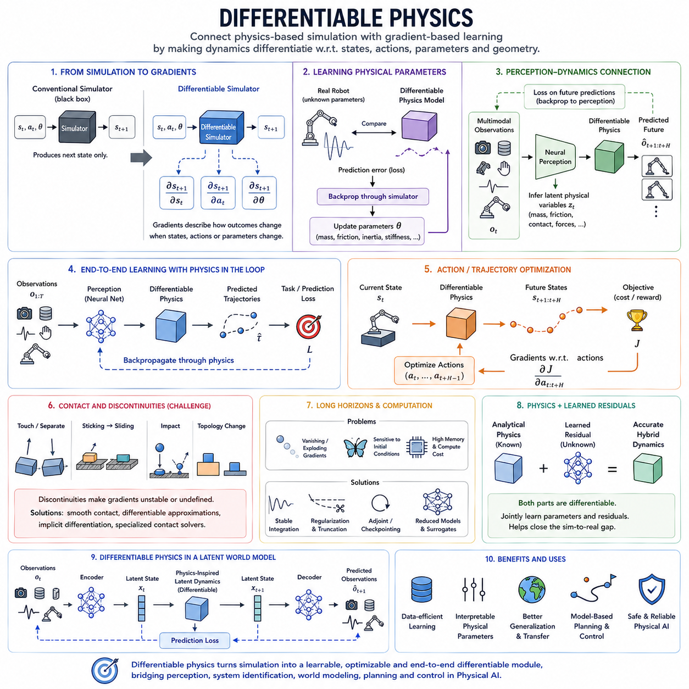{width="7.268055555555556in" height="7.268055555555556in"}

Differentiable physics connects physical simulation with gradient-based learning by making the operations of a physical model differentiable with respect to states, actions, parameters, and sometimes geometry. Instead of treating a simulator as a black box that only produces outcomes, differentiable physics allows information about prediction error to propagate backward through simulated dynamics, creating a direct bridge between analytical modeling and neural optimization.

A conventional simulator computes a forward transition from the current state and action to a future state according to physical equations. A differentiable simulator additionally provides derivatives such as (\\partial s_{t+1}/\\partial s_t), (\\partial s_{t+1}/\\partial a_t), and (\\partial s_{t+1}/\\partial\\theta). These gradients describe how predicted outcomes change when initial conditions, controls, or physical parameters are modified.

This capability is particularly important for Physical AI because many useful quantities are difficult to measure directly but strongly influence robot behavior. Mass, inertia, friction, stiffness, damping, actuator characteristics, and contact properties may initially be uncertain. By comparing simulated trajectories with observations and backpropagating the discrepancy through the simulator, these parameters can be estimated systematically from real interaction data.

Differentiable physics therefore provides a powerful mechanism for system identification. Suppose a robot observes that its actual trajectory differs from the trajectory predicted by its nominal dynamics model. Instead of training an unrestricted neural network to replace the physics, optimization can adjust uncertain physical parameters so that simulated behavior better matches reality. The resulting model retains interpretable physical structure while adapting to the specific system.

The same principle can connect perception directly with dynamics. A neural network may infer object mass, terrain friction, contact state, material properties, or external forces from camera, LiDAR, tactile, or proprioceptive observations. These estimated quantities are passed into a differentiable physics module, which predicts future motion. Prediction losses can then propagate through the physical model back into the perception network, allowing perception to learn variables that are useful for physical prediction.

This creates an important form of end-to-end learning. The system does not need separate supervision for every intermediate physical variable if the final physical outcome provides a useful training signal. For example, a network estimating terrain properties may be trained partly from whether the resulting dynamics correctly predict wheel slip or vehicle motion. Physical simulation becomes part of the computational graph rather than merely an external preprocessing or data-generation tool.

Differentiable physics can also support action optimization. Because future states are differentiable with respect to actions, gradients can indicate how control inputs should change to improve an objective. A robot can optimize steering, torque, force, grasp parameters, or trajectory variables by propagating task losses backward through predicted dynamics. This provides a direct connection between world modeling, trajectory optimization, and model-based control.

For model predictive control, differentiable dynamics can make candidate trajectory refinement more efficient. Instead of evaluating only large numbers of independently sampled action sequences, gradient information can guide candidate actions toward lower-cost solutions. The world model can predict the consequences of an action sequence, compute a task or safety objective, and differentiate that objective with respect to the controls used throughout the prediction horizon.

Differentiable simulation is also valuable for manipulation. Object pose, contact location, applied force, friction, and geometry jointly determine the result of pushing, grasping, insertion, or tool use. If these relationships are differentiable, prediction error or task objectives can update both learned components and action parameters. This enables optimization through physical interaction rather than treating each simulated interaction as an isolated trial.

Contact, however, creates one of the central difficulties for differentiable physics. Collision and contact often introduce discontinuities because forces can appear or disappear abruptly when bodies touch or separate. Sticking can transition to sliding, impacts can instantaneously alter velocity, and contact topology can change. These events may produce undefined, unstable, or uninformative gradients under straightforward differentiation.

Several approaches address this problem by smoothing contact dynamics, using differentiable approximations, applying implicit differentiation, or designing specialized contact solvers. Smoother formulations can provide useful gradients but may reduce physical fidelity near sharp transitions. Consequently, differentiable physics often involves a tradeoff between exact simulation of discontinuous phenomena and gradients that are stable enough for optimization and learning.

Long simulation horizons introduce another challenge. Gradients propagated through many state transitions may vanish, explode, or become highly sensitive to small changes in initial conditions. This resembles difficulties encountered when training recurrent neural networks. Stable numerical integration, carefully designed state representations, regularization, truncated optimization horizons, and hierarchical prediction can help make differentiable physical rollouts more practical.

Computational cost must also be considered. Differentiating through collision detection, constraint solving, numerical integration, and long trajectories can require substantial memory and computation. Storing every intermediate state for reverse-mode differentiation may become expensive. Techniques such as checkpointing, adjoint methods, implicit gradients, reduced-order models, and learned surrogate dynamics can reduce these costs depending on the physical system and application.

Differentiable physics is especially powerful when combined with learned residual dynamics. An analytical simulator can represent known rigid-body, kinematic, or actuator relationships, while a neural component learns effects that the simulator cannot accurately reproduce. Because both components participate in a differentiable computation, optimization can jointly improve physical parameters and learned corrections while preserving useful analytical structure.

This combination can also help address the simulation-to-reality gap. A simulator may represent the dominant physics correctly but use imperfect parameters or simplified interaction models. Real-world observations can provide losses that propagate through the differentiable simulator, adjusting physical parameters or learned correction modules. The world model can therefore become progressively calibrated to actual hardware and environmental conditions without discarding its physical foundation.

Within latent world models, differentiable physics can operate at several levels. A perception encoder may map high-dimensional observations into explicit physical variables before simulation, or a physics-inspired transition module may operate directly within a structured latent space. The decoder then maps predicted states back into task-relevant observations or representations, allowing errors in future prediction to train the entire perception-dynamics pipeline.

Differentiable physics also enables counterfactual reasoning through optimization. A Physical AI system can ask how a predicted outcome would change if it altered an action, contact location, trajectory, or estimated environmental parameter. Gradients provide local sensitivity information about these alternatives. This allows the world model not only to imagine possible futures but also to determine which controllable changes are likely to move those futures toward desired outcomes.

The approach nevertheless depends strongly on model quality. Differentiability does not guarantee that the underlying physics is correct. A highly differentiable but inaccurate simulator can produce precise gradients toward the wrong solution. Practical systems therefore need validation against real measurements, uncertainty estimation, parameter adaptation, and learned corrections when analytical assumptions fail to capture important aspects of the environment.

Differentiable physics ultimately transforms physical simulation from a passive prediction engine into an active component of learning and optimization. By allowing gradients to flow through dynamics, it connects perception, system identification, physical parameters, world-model prediction, planning, and control within a common computational framework. For Physical AI, this offers a powerful foundation for models that learn from experience while remaining anchored to reusable physical structure.

미분가능 물리학(Differentiable Physics)은 물리 모델(Physical Model)의 연산을 상태(State), 행동(Action), 매개변수(Parameter), 경우에 따라 기하학(Geometry)에 대해 미분 가능하도록 만들어 물리 시뮬레이션(Physical Simulation)과 그래디언트 기반 학습(Gradient-Based Learning)을 연결한다. 시뮬레이터를 단순히 결과만 생성하는 블랙박스(Black Box)로 취급하는 대신, 미분가능 물리학은 예측 오차에 대한 정보가 시뮬레이션된 동역학을 거슬러 역전파되도록 하여 해석적 모델링(Analytical Modeling)과 신경망 최적화(Neural Optimization)를 직접 연결한다.

기존 시뮬레이터(Conventional Simulator)는 물리 방정식에 따라 현재 상태와 행동으로부터 미래 상태로의 순방향 전이(Forward Transition)를 계산한다. 미분가능 시뮬레이터(Differentiable Simulator)는 여기에 추가로 (\\partial s_{t+1}/\\partial s_t), (\\partial s_{t+1}/\\partial a_t), (\\partial s_{t+1}/\\partial\\theta)와 같은 미분값을 제공한다. 이러한 그래디언트(Gradient)는 초기 조건(Initial Conditions), 제어 입력(Control Inputs), 물리 매개변수를 변화시켰을 때 예측 결과가 어떻게 달라지는지를 나타낸다.

이러한 능력은 유용한 많은 물리량을 직접 측정하기 어렵지만 로봇의 거동에는 큰 영향을 미치는 피지컬 AI(Physical AI)에서 특히 중요하다. 질량(Mass), 관성(Inertia), 마찰(Friction), 강성(Stiffness), 감쇠(Damping), 액추에이터 특성(Actuator Characteristics), 접촉 특성(Contact Properties)은 초기에는 불확실할 수 있다. 시뮬레이션 궤적(Simulated Trajectory)과 실제 관측을 비교하고 그 차이를 시뮬레이터를 통해 역전파함으로써 실제 상호작용 데이터로부터 이러한 매개변수를 체계적으로 추정할 수 있다.

따라서 미분가능 물리학은 시스템 식별(System Identification)을 위한 강력한 메커니즘을 제공한다. 로봇의 실제 궤적이 명목 동역학 모델(Nominal Dynamics Model)이 예측한 궤적과 다르다고 가정해 보자. 이때 물리학을 대체하기 위해 제약 없는 신경망을 학습하는 대신, 최적화를 통해 불확실한 물리 매개변수를 조정하여 시뮬레이션 거동이 현실과 더욱 잘 일치하도록 만들 수 있다. 결과적으로 모델은 해석 가능한 물리 구조를 유지하면서 특정 시스템의 실제 특성에 적응한다.

동일한 원리를 이용하면 지각(Perception)을 동역학과 직접 연결할 수도 있다. 신경망은 카메라(Camera), 라이다(LiDAR), 촉각(Tactile), 고유수용감각(Proprioceptive) 관측으로부터 객체 질량(Object Mass), 지형 마찰(Terrain Friction), 접촉 상태(Contact State), 재료 특성(Material Properties), 외력(External Forces)을 추론할 수 있다. 이렇게 추정된 물리량은 미분가능 물리 모듈(Differentiable Physics Module)에 전달되어 미래 운동을 예측하며, 예측 손실은 물리 모델을 거쳐 지각 네트워크까지 역전파될 수 있다.

이는 중요한 형태의 종단간 학습(End-to-End Learning)을 가능하게 한다. 최종적인 물리적 결과가 유용한 학습 신호를 제공한다면 시스템은 모든 중간 물리 변수에 대해 별도의 지도 정보(Supervision)를 필요로 하지 않는다. 예를 들어 지형 특성을 추정하는 네트워크는 그 결과로 계산된 동역학이 바퀴 슬립(Wheel Slip)이나 차량 운동(Vehicle Motion)을 얼마나 정확하게 예측하는지를 이용하여 부분적으로 학습될 수 있다. 물리 시뮬레이션은 단순한 외부 전처리 또는 데이터 생성 도구가 아니라 계산 그래프(Computational Graph)의 일부가 된다.

미분가능 물리학은 행동 최적화(Action Optimization)도 지원할 수 있다. 미래 상태가 행동에 대해 미분 가능하기 때문에 그래디언트는 목적함수(Objective)를 개선하려면 제어 입력을 어떻게 변경해야 하는지를 나타낼 수 있다. 로봇은 예측된 동역학을 통해 작업 손실(Task Loss)을 역전파하여 조향(Steering), 토크(Torque), 힘(Force), 파지 매개변수(Grasp Parameters), 궤적 변수(Trajectory Variables)를 최적화할 수 있다. 이는 월드 모델링(World Modeling), 궤적 최적화(Trajectory Optimization), 모델 기반 제어(Model-Based Control)를 직접 연결한다.

모델 예측 제어(Model Predictive Control, MPC)에서 미분가능 동역학(Differentiable Dynamics)은 후보 궤적(Candidate Trajectory)의 정교화를 더욱 효율적으로 만들 수 있다. 많은 행동 시퀀스(Action Sequence)를 독립적으로 샘플링하여 평가하는 것에만 의존하지 않고, 그래디언트 정보를 이용해 후보 행동을 더 낮은 비용의 해로 유도할 수 있다. 월드 모델은 행동 시퀀스의 결과를 예측하고 작업 또는 안전 목적함수를 계산한 후 예측 지평(Prediction Horizon) 전체에서 사용된 제어 입력에 대해 이를 미분할 수 있다.

미분가능 시뮬레이션(Differentiable Simulation)은 로봇 조작(Manipulation)에서도 유용하다. 객체 자세(Object Pose), 접촉 위치(Contact Location), 적용된 힘(Applied Force), 마찰, 기하학이 함께 밀기(Pushing), 파지(Grasping), 삽입(Insertion), 도구 사용(Tool Use)의 결과를 결정한다. 이러한 관계를 미분할 수 있다면 예측 오차나 작업 목적함수를 이용해 학습 구성요소와 행동 매개변수를 모두 갱신할 수 있다. 이를 통해 각각의 시뮬레이션 상호작용을 독립적인 시행으로 처리하는 대신 물리적 상호작용 자체를 통과하여 최적화할 수 있다.

그러나 접촉(Contact)은 미분가능 물리학에서 가장 핵심적인 어려움 중 하나를 만든다. 충돌(Collision)과 접촉은 물체가 만나거나 분리될 때 힘이 갑자기 발생하거나 사라질 수 있기 때문에 불연속성(Discontinuity)을 자주 발생시킨다. 고착(Sticking)이 미끄러짐(Sliding)으로 전환되거나, 충격(Impact)이 순간적으로 속도를 변화시키거나, 접촉 위상(Contact Topology)이 변경될 수 있다. 이러한 사건을 단순한 방식으로 미분하면 정의되지 않거나 불안정하거나 유용한 정보를 제공하지 못하는 그래디언트가 발생할 수 있다.

이 문제를 해결하기 위해 접촉 동역학(Contact Dynamics)을 평활화(Smoothing)하거나, 미분가능 근사(Differentiable Approximation)를 사용하거나, 암시적 미분(Implicit Differentiation)을 적용하거나, 특수한 접촉 솔버(Contact Solver)를 설계하는 다양한 접근법이 사용된다. 보다 부드러운 수식은 유용한 그래디언트를 제공할 수 있지만 급격한 상태 전이 부근에서는 물리적 충실도(Physical Fidelity)를 낮출 수 있다. 따라서 미분가능 물리학은 불연속 현상을 정확하게 시뮬레이션하는 것과 학습 및 최적화에 충분히 안정적인 그래디언트를 확보하는 것 사이의 절충(Tradeoff)을 필요로 하는 경우가 많다.

긴 시뮬레이션 지평(Long Simulation Horizon)은 또 다른 문제를 발생시킨다. 많은 상태 전이를 거쳐 전파되는 그래디언트는 소실(Vanishing)되거나 폭주(Exploding)하거나 초기 조건의 작은 변화에 지나치게 민감해질 수 있다. 이는 순환 신경망(Recurrent Neural Network)을 학습할 때 발생하는 문제와 유사하다. 안정적인 수치 적분(Numerical Integration), 세심하게 설계된 상태 표현(State Representation), 정규화(Regularization), 절단된 최적화 지평(Truncated Optimization Horizon), 계층적 예측(Hierarchical Prediction)은 미분가능 물리 롤아웃을 더욱 실용적으로 만드는 데 도움을 줄 수 있다.

계산 비용(Computational Cost) 역시 고려해야 한다. 충돌 검출(Collision Detection), 제약조건 해결(Constraint Solving), 수치 적분, 긴 궤적을 통과하여 미분하는 과정에는 상당한 메모리와 연산량이 필요할 수 있다. 역방향 미분(Reverse-Mode Differentiation)을 위해 모든 중간 상태를 저장하면 비용이 크게 증가할 수 있다. 체크포인팅(Checkpointing), 수반 방법(Adjoint Methods), 암시적 그래디언트(Implicit Gradients), 차수 축소 모델(Reduced-Order Models), 학습된 대리 동역학(Learned Surrogate Dynamics) 등을 활용하면 물리 시스템과 응용 분야에 따라 이러한 비용을 줄일 수 있다.

미분가능 물리학은 학습된 잔차 동역학(Learned Residual Dynamics)과 결합할 때 특히 강력하다. 해석적 시뮬레이터(Analytical Simulator)는 알려진 강체, 운동학, 액추에이터 관계를 표현하고, 신경망 구성요소는 시뮬레이터가 정확하게 재현하기 어려운 효과를 학습할 수 있다. 두 구성요소가 모두 미분가능 계산(Differentiable Computation)에 참여하기 때문에 최적화는 유용한 해석적 구조를 유지하면서 물리 매개변수와 학습된 보정을 동시에 개선할 수 있다.

이러한 결합은 시뮬레이션-현실 격차(Sim-to-Real Gap)를 해결하는 데에도 도움을 줄 수 있다. 시뮬레이터는 주요 물리 현상을 올바르게 표현하더라도 부정확한 매개변수나 단순화된 상호작용 모델을 사용할 수 있다. 실제 환경의 관측은 미분가능 시뮬레이터를 통해 역전파되는 손실을 제공하여 물리 매개변수나 학습된 보정 모듈(Learned Correction Module)을 조정할 수 있다. 따라서 월드 모델은 물리적 기반을 버리지 않으면서 실제 하드웨어와 환경 조건에 점진적으로 보정(Calibration)될 수 있다.

잠재 월드 모델(Latent World Model)에서 미분가능 물리학은 여러 수준에서 작동할 수 있다. 지각 인코더(Perception Encoder)가 고차원 관측(High-Dimensional Observations)을 명시적인 물리 변수로 변환한 후 시뮬레이션할 수도 있고, 물리학에서 영감을 받은 전이 모듈(Physics-Inspired Transition Module)이 구조화된 잠재 공간(Structured Latent Space) 내부에서 직접 작동할 수도 있다. 이후 디코더(Decoder)가 예측된 상태를 작업과 관련된 관측이나 표현으로 다시 변환하여 미래 예측의 오류가 전체 지각-동역학 파이프라인(Perception-Dynamics Pipeline)을 학습하도록 만들 수 있다.

미분가능 물리학은 최적화를 통한 반사실적 추론(Counterfactual Reasoning)도 가능하게 한다. 피지컬 AI 시스템은 행동, 접촉 위치, 궤적, 추정된 환경 매개변수를 변경했을 때 예측 결과가 어떻게 달라지는지를 평가할 수 있다. 그래디언트는 이러한 대안에 대한 국소 민감도 정보(Local Sensitivity Information)를 제공한다. 따라서 월드 모델은 가능한 미래를 단순히 상상하는 것에 그치지 않고, 어떤 제어 가능한 변화가 미래를 원하는 결과 방향으로 이동시킬 가능성이 높은지를 판단할 수 있다.

그러나 이러한 접근법의 성능은 모델 품질(Model Quality)에 크게 의존한다. 미분 가능하다는 사실 자체가 기반 물리 모델이 정확하다는 것을 보장하지 않는다. 미분은 매우 잘 되지만 부정확한 시뮬레이터는 잘못된 해를 향해 정밀한 그래디언트를 제공할 수 있다. 따라서 실용적인 시스템에서는 실제 측정값을 이용한 검증(Validation), 불확실성 추정(Uncertainty Estimation), 매개변수 적응(Parameter Adaptation), 그리고 해석적 가정이 중요한 환경 특성을 포착하지 못할 경우 이를 보완하는 학습된 보정이 필요하다.

궁극적으로 미분가능 물리학은 물리 시뮬레이션을 수동적인 예측 엔진(Passive Prediction Engine)에서 학습과 최적화의 능동적인 구성요소(Active Component)로 변화시킨다. 그래디언트가 동역학을 통과하여 흐르도록 함으로써 지각, 시스템 식별, 물리 매개변수, 월드 모델 예측, 계획(Planning), 제어(Control)를 하나의 공통 계산 프레임워크(Computational Framework) 안에서 연결한다. 피지컬 AI에서 이는 재사용 가능한 물리 구조(Reusable Physical Structure)에 기반을 두면서 실제 경험으로부터 지속적으로 학습할 수 있는 월드 모델을 구축하기 위한 강력한 기반을 제공한다.

##  

## 10.08. System Identification and Parameter Learning

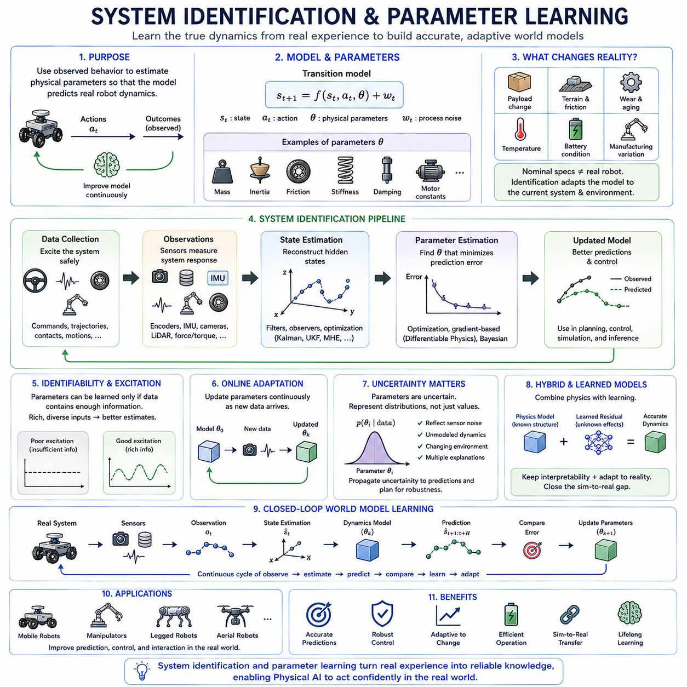{width="7.268055555555556in" height="7.268055555555556in"}

System identification is the process of constructing or refining a mathematical model of a physical system from observed input-output behavior. In Physical AI, it connects real robot experience with world-model dynamics by estimating how actions produce changes in motion and interaction. Rather than assuming that every property of the robot and environment is perfectly known, system identification uses measurements to determine the parameters or dynamics that best explain observed behavior.

A physical system can be represented conceptually by a transition model such as (s_{t+1}=f(s_t,a_t,\\theta)), where (s_t) is the current state, (a_t) is the applied action, and (\\theta) represents physical parameters. These parameters may include mass, inertia, friction, damping, stiffness, motor constants, wheel radius, actuator delay, or aerodynamic coefficients. Identification seeks values of (\\theta) that make predicted transitions consistent with measured trajectories.

This approach is important because nominal engineering parameters rarely describe a real robot perfectly throughout its lifetime. Manufacturing tolerances, payload changes, tire wear, battery condition, temperature, mechanical aging, and surface properties can alter actual dynamics. Even two robots built from the same design may behave slightly differently. System identification allows the world model to adapt from nominal specifications toward the dynamics of the particular physical platform being operated.

Classical system identification typically begins by selecting a model structure and estimating its unknown parameters from measured inputs and outputs. Linear models, state-space models, transfer functions, autoregressive models, and nonlinear parametric models can all be used depending on the system. The essential idea is to expose the system to informative inputs, observe its responses, and find model parameters that reproduce those responses with sufficiently small error.

For robotics, the state is often only partially observable. Sensors may measure wheel encoders, joint positions, IMU signals, motor currents, force, torque, velocity, or external pose, while important variables remain hidden. State estimation and system identification therefore frequently operate together. Filters, observers, optimization, or learned estimators can reconstruct hidden states while simultaneously determining the physical parameters needed to explain their evolution.

Parameter identifiability is a fundamental consideration. A parameter can only be estimated reliably when the available observations contain enough information to distinguish its effect from those of other parameters. If a robot always moves at constant speed on a flat surface, the data may provide little information about acceleration dynamics or traction limits. Identification experiments therefore require sufficiently rich excitation of the system across relevant operating conditions.

Persistent excitation is especially important when multiple parameters influence behavior in similar ways. Carefully designed steering commands, accelerations, braking events, joint trajectories, or contact interactions can expose different aspects of the dynamics. For Physical AI, however, exploration must remain within safe operational limits. Identification therefore becomes an experimental-design problem that balances information gain with hardware protection, stability, energy consumption, and task requirements.

Online system identification extends parameter estimation into continuous operation. Instead of identifying the robot once before deployment, the system repeatedly updates its model as new observations arrive. This is useful when payload, terrain, friction, actuator response, or environmental conditions change over time. The world model can therefore maintain a dynamic estimate of the physical system rather than relying indefinitely on parameters measured under earlier conditions.

A mobile robot provides a clear example. Nominal kinematics may predict motion from wheel velocities, but actual displacement depends on wheel radius, track width, tire deformation, longitudinal slip, lateral slip, terrain friction, and payload. Sensor observations from encoders, IMUs, cameras, LiDAR, or GNSS can be compared with predicted motion to estimate these quantities or their effective influence, improving future trajectory prediction and control.

For manipulators, parameter learning can estimate link masses, inertial properties, joint friction, motor characteristics, compliance, payload properties, or contact parameters. Accurate estimates improve torque prediction and trajectory control while also helping the world model anticipate how the robot will respond when carrying unfamiliar objects. Online payload estimation is particularly valuable because the effective dynamics can change immediately after an object is grasped.

System identification does not always require every physical parameter to be estimated explicitly. In some applications, a compact set of effective parameters is sufficient to reproduce behavior relevant to planning and control. For example, a terrain representation may encode effective traction and compliance rather than detailed material properties. This task-oriented identification can reduce model complexity while retaining the information required for accurate action-conditioned prediction.

Neural networks expand system identification beyond fixed parametric models. A learned estimator can infer physical parameters from recent observation histories, allowing complex relationships between sensor signals and hidden properties to be captured. Recurrent networks, Transformers, or latent encoders can summarize past interaction into a context representation that conditions future dynamics. The resulting model can adapt its predictions according to inferred operating conditions.

An alternative is to learn the dynamics directly rather than explicitly identifying interpretable parameters. The model estimates (s_{t+1}) from states and actions without requiring quantities such as friction or damping to appear as named variables. This can capture complicated effects but sacrifices some interpretability. Hybrid approaches often provide a useful compromise by identifying meaningful physical parameters while learning residual dynamics that remain unexplained by the analytical model.

Differentiable physics creates a particularly direct mechanism for parameter learning. If a simulator is differentiable with respect to (\\theta), the difference between predicted and observed trajectories can be backpropagated through the physical dynamics. Gradient-based optimization can then adjust mass, friction, stiffness, damping, or other parameters. This integrates system identification naturally with neural learning and allows physical and learned components to be optimized within the same computational framework.

Uncertainty is essential because identified parameters are estimates rather than absolute truths. Limited observations, sensor noise, unmodeled dynamics, and changing environments may produce several parameter values that explain the available data similarly well. Probabilistic identification can represent distributions over parameters rather than single values. A world model can propagate this uncertainty through future predictions and allow planning algorithms to prefer actions that remain safe across plausible dynamics.

Parameter learning also contributes directly to sim-to-real adaptation. Simulation may begin with approximate robot and environment parameters, while real-world trajectories reveal systematic discrepancies. Updating simulator parameters from real measurements can reduce this gap without replacing the entire physics model. Residual neural components can then capture effects that parameter adjustment alone cannot explain, creating an increasingly calibrated hybrid world model.

Long-horizon world modeling benefits substantially from accurate identification because small parameter errors accumulate over repeated predictions. Slight errors in friction, inertia, steering response, or actuator delay may appear insignificant over one timestep but produce large trajectory deviations after several seconds. Continuously calibrated parameters can reduce this systematic drift and provide more reliable rollouts for planning, model predictive control, and counterfactual evaluation.

System identification can itself become an active capability of an intelligent agent. Instead of passively waiting for informative observations, a robot can select safe actions that reduce uncertainty about unknown dynamics. Such active system identification links exploration with control: the robot performs actions not only to accomplish the immediate task but also to improve its internal model when better physical knowledge is expected to increase future performance.

Within a world-model architecture, system identification can therefore be viewed as a feedback loop between observation and prediction. Sensors provide evidence about the real system, the dynamics model predicts future states, prediction errors reveal model mismatch, and parameter learning updates the model. The updated model then generates better predictions, producing a continual cycle of observation, estimation, prediction, comparison, and adaptation.

Ultimately, system identification and parameter learning allow Physical AI world models to remain connected to the physical systems they represent. Analytical knowledge provides an initial structure, while real experience determines how that structure should be calibrated for a particular robot, payload, terrain, and environment. By combining estimation, uncertainty, online adaptation, differentiable physics, and learned residuals, world models can evolve from static approximations into continuously calibrated models of real-world dynamics.

시스템 식별(System Identification)은 관측된 입력-출력 거동(Input-Output Behavior)으로부터 물리 시스템(Physical System)의 수학적 모델을 구축하거나 개선하는 과정이다. 피지컬 AI(Physical AI)에서는 실제 로봇의 경험과 월드 모델 동역학(World-Model Dynamics)을 연결하여 행동(Action)이 운동과 상호작용의 변화를 어떻게 발생시키는지를 추정한다. 로봇과 환경의 모든 특성이 완벽하게 알려져 있다고 가정하는 대신, 시스템 식별은 관측된 거동을 가장 잘 설명하는 매개변수(Parameter) 또는 동역학(Dynamics)을 측정 데이터로부터 결정한다.

물리 시스템은 개념적으로 (s_{t+1}=f(s_t,a_t,\\theta))와 같은 전이 모델(Transition Model)로 표현할 수 있으며, 여기서 (s_t)는 현재 상태(Current State), (a_t)는 적용된 행동(Applied Action), (\\theta)는 물리 매개변수(Physical Parameters)를 나타낸다. 이러한 매개변수에는 질량(Mass), 관성(Inertia), 마찰(Friction), 감쇠(Damping), 강성(Stiffness), 모터 상수(Motor Constants), 바퀴 반경(Wheel Radius), 액추에이터 지연(Actuator Delay), 공기역학 계수(Aerodynamic Coefficients) 등이 포함될 수 있다. 시스템 식별은 예측된 상태 전이가 측정된 궤적과 일치하도록 하는 (\\theta)의 값을 찾는다.

이러한 접근법은 명목상의 공학적 매개변수(Nominal Engineering Parameters)가 로봇의 전체 수명 동안 실제 로봇을 완벽하게 설명하는 경우가 드물기 때문에 중요하다. 제조 공차(Manufacturing Tolerances), 페이로드 변화(Payload Changes), 타이어 마모(Tire Wear), 배터리 상태(Battery Condition), 온도(Temperature), 기계적 노화(Mechanical Aging), 표면 특성(Surface Properties)은 실제 동역학을 변화시킬 수 있다. 동일한 설계로 제작된 두 대의 로봇조차 약간 다른 거동을 보일 수 있다. 시스템 식별은 월드 모델이 명목 사양에서 실제 운용 중인 특정 물리 플랫폼의 동역학으로 적응하도록 한다.

고전적인 시스템 식별(Classical System Identification)은 일반적으로 모델 구조(Model Structure)를 선택하고 측정된 입력과 출력으로부터 알려지지 않은 매개변수를 추정하는 과정으로 시작한다. 시스템에 따라 선형 모델(Linear Models), 상태 공간 모델(State-Space Models), 전달 함수(Transfer Functions), 자기회귀 모델(Autoregressive Models), 비선형 매개변수 모델(Nonlinear Parametric Models) 등을 사용할 수 있다. 핵심 개념은 시스템에 충분한 정보를 포함하는 입력을 가하고 그 응답을 관찰한 후, 이러한 응답을 충분히 작은 오차로 재현하는 모델 매개변수를 찾는 것이다.

로보틱스(Robotics)에서는 상태(State)를 부분적으로만 관측할 수 있는 경우가 많다. 센서는 바퀴 엔코더(Wheel Encoder), 관절 위치(Joint Position), 관성측정장치 신호(IMU Signals), 모터 전류(Motor Current), 힘(Force), 토크(Torque), 속도(Velocity), 외부 자세(External Pose) 등을 측정할 수 있지만 중요한 변수 중 일부는 숨겨져 있을 수 있다. 따라서 상태 추정(State Estimation)과 시스템 식별은 함께 수행되는 경우가 많다. 필터(Filter), 관측기(Observer), 최적화(Optimization), 학습된 추정기(Learned Estimator)를 이용하여 숨겨진 상태를 복원하는 동시에 그 상태의 변화를 설명하는 데 필요한 물리 매개변수를 결정할 수 있다.

매개변수 식별 가능성(Parameter Identifiability)은 근본적으로 중요한 고려사항이다. 특정 매개변수는 이용 가능한 관측 데이터가 다른 매개변수의 영향과 해당 매개변수의 영향을 구별할 수 있을 만큼 충분한 정보를 포함할 때만 신뢰성 있게 추정할 수 있다. 로봇이 항상 평평한 표면에서 일정한 속도로만 이동한다면 데이터는 가속 동역학(Acceleration Dynamics)이나 접지력 한계(Traction Limits)에 대한 정보를 거의 제공하지 못할 수 있다. 따라서 시스템 식별 실험에서는 관련 운용 조건 전반에서 시스템을 충분히 다양하게 자극해야 한다.

지속적 여기(Persistent Excitation)는 여러 매개변수가 서로 유사한 방식으로 시스템 거동에 영향을 줄 때 특히 중요하다. 세심하게 설계된 조향 명령(Steering Commands), 가속(Acceleration), 제동(Braking), 관절 궤적(Joint Trajectories), 접촉 상호작용(Contact Interactions)은 동역학의 서로 다른 특성을 드러낼 수 있다. 그러나 피지컬 AI에서는 이러한 탐색이 안전한 운용 범위 내에서 수행되어야 한다. 따라서 시스템 식별은 정보 획득(Information Gain)과 하드웨어 보호(Hardware Protection), 안정성(Stability), 에너지 소비(Energy Consumption), 작업 요구조건(Task Requirements) 사이의 균형을 고려하는 실험 설계(Experimental Design) 문제가 된다.

온라인 시스템 식별(Online System Identification)은 매개변수 추정을 지속적인 실제 운용 과정으로 확장한다. 배치 전에 로봇을 한 번 식별하고 끝내는 대신 새로운 관측이 들어올 때마다 시스템 모델을 반복적으로 갱신한다. 이는 페이로드, 지형(Terrain), 마찰, 액추에이터 응답(Actuator Response), 환경 조건(Environmental Conditions)이 시간에 따라 변하는 경우 유용하다. 따라서 월드 모델은 과거 조건에서 측정된 매개변수에 계속 의존하지 않고 현재 물리 시스템에 대한 동적인 추정값(Dynamic Estimate)을 유지할 수 있다.

이동 로봇(Mobile Robot)은 이를 명확하게 보여주는 사례이다. 명목 운동학(Nominal Kinematics)은 바퀴 속도로부터 운동을 예측할 수 있지만 실제 변위는 바퀴 반경, 윤거(Track Width), 타이어 변형(Tire Deformation), 종방향 슬립(Longitudinal Slip), 횡방향 슬립(Lateral Slip), 지형 마찰(Terrain Friction), 페이로드의 영향을 받는다. 엔코더, IMU, 카메라, 라이다(LiDAR), 위성항법시스템(GNSS)의 센서 관측을 예측된 운동과 비교하여 이러한 물리량이나 그 유효 영향을 추정하면 미래 궤적 예측과 제어 성능을 향상시킬 수 있다.

매니퓰레이터(Manipulator)에서는 매개변수 학습(Parameter Learning)을 통해 링크 질량(Link Mass), 관성 특성(Inertial Properties), 관절 마찰(Joint Friction), 모터 특성(Motor Characteristics), 유연성(Compliance), 페이로드 특성(Payload Properties), 접촉 매개변수(Contact Parameters)를 추정할 수 있다. 정확한 추정값은 토크 예측(Torque Prediction)과 궤적 제어(Trajectory Control)를 향상시키며, 익숙하지 않은 객체를 운반할 때 로봇이 어떻게 반응할지 월드 모델이 예측하는 데도 도움을 준다. 특히 온라인 페이로드 추정(Online Payload Estimation)은 물체를 파지한 직후 유효 동역학이 즉시 달라질 수 있기 때문에 중요하다.

시스템 식별에서 모든 물리 매개변수를 반드시 명시적으로 추정할 필요는 없다. 일부 응용에서는 계획(Planning)과 제어에 필요한 거동을 재현할 수 있는 소수의 유효 매개변수(Effective Parameters)만으로도 충분하다. 예를 들어 지형 표현(Terrain Representation)은 세부적인 재료 특성 대신 유효 접지력(Effective Traction)과 유연성을 인코딩할 수 있다. 이러한 작업 지향 식별(Task-Oriented Identification)은 정확한 행동 조건부 예측(Action-Conditioned Prediction)에 필요한 정보를 유지하면서 모델 복잡성을 줄일 수 있다.

신경망(Neural Networks)은 시스템 식별을 고정된 매개변수 모델을 넘어 확장한다. 학습된 추정기는 최근 관측 이력(Observation History)으로부터 물리 매개변수를 추론하여 센서 신호와 숨겨진 물리 특성 사이의 복잡한 관계를 포착할 수 있다. 순환 신경망(Recurrent Networks), 트랜스포머(Transformers), 잠재 인코더(Latent Encoders)는 과거의 상호작용을 미래 동역학을 조건화하는 문맥 표현(Context Representation)으로 요약할 수 있다. 결과적으로 모델은 추론된 운용 조건에 따라 자신의 미래 예측을 적응시킬 수 있다.

또 다른 방법은 해석 가능한 매개변수(Interpretable Parameters)를 명시적으로 식별하는 대신 동역학 자체를 직접 학습하는 것이다. 모델은 마찰이나 감쇠 같은 물리량을 이름이 지정된 변수로 표현하지 않고 상태와 행동으로부터 (s_{t+1})를 추정한다. 이러한 방식은 복잡한 효과를 포착할 수 있지만 일부 해석 가능성을 희생한다. 하이브리드 접근법(Hybrid Approach)은 의미 있는 물리 매개변수를 식별하면서 해석적 모델(Analytical Model)이 설명하지 못하는 잔차 동역학(Residual Dynamics)을 학습함으로써 두 방식 사이에서 유용한 절충점을 제공한다.

미분가능 물리학(Differentiable Physics)은 매개변수 학습을 위한 특히 직접적인 메커니즘을 제공한다. 시뮬레이터가 (\\theta)에 대해 미분 가능하다면 예측된 궤적과 관측된 궤적 사이의 차이를 물리 동역학을 통과하여 역전파(Backpropagation)할 수 있다. 이후 그래디언트 기반 최적화(Gradient-Based Optimization)를 통해 질량, 마찰, 강성, 감쇠 등의 매개변수를 조정할 수 있다. 이는 시스템 식별을 신경망 학습과 자연스럽게 통합하며 물리 구성요소와 학습 구성요소를 동일한 계산 프레임워크 안에서 최적화할 수 있게 한다.

식별된 매개변수는 절대적인 참값이 아니라 추정값이기 때문에 불확실성(Uncertainty)을 고려하는 것이 필수적이다. 제한된 관측, 센서 노이즈(Sensor Noise), 모델링되지 않은 동역학(Unmodeled Dynamics), 변화하는 환경 때문에 여러 매개변수 값이 이용 가능한 데이터를 비슷한 수준으로 설명할 수 있다. 확률적 식별(Probabilistic Identification)은 단일 값 대신 매개변수의 확률 분포(Probability Distribution)를 표현할 수 있다. 월드 모델은 이러한 불확실성을 미래 예측으로 전파하여 계획 알고리즘이 가능한 여러 동역학 조건에서도 안전한 행동을 선호하도록 만들 수 있다.

매개변수 학습은 시뮬레이션-현실 적응(Sim-to-Real Adaptation)에도 직접적으로 기여한다. 시뮬레이션은 근사적인 로봇 및 환경 매개변수에서 시작할 수 있으며 실제 궤적은 체계적인 차이를 드러낸다. 실제 측정값으로부터 시뮬레이터의 매개변수를 갱신하면 전체 물리 모델을 대체하지 않고도 이러한 격차를 줄일 수 있다. 이후 잔차 신경망 구성요소(Residual Neural Components)가 단순한 매개변수 조정만으로 설명할 수 없는 효과를 포착하여 점차 실제 환경에 보정된 하이브리드 월드 모델(Hybrid World Model)을 구축할 수 있다.

장기 월드 모델링(Long-Horizon World Modeling)은 정확한 시스템 식별로부터 상당한 이점을 얻는다. 작은 매개변수 오차도 반복적인 예측을 거치면서 누적되기 때문이다. 마찰, 관성, 조향 응답(Steering Response), 액추에이터 지연의 작은 오차는 단일 시간 단계에서는 중요하지 않아 보일 수 있지만 몇 초 이후에는 큰 궤적 편차를 발생시킬 수 있다. 지속적으로 보정된 매개변수는 이러한 체계적인 드리프트(Systematic Drift)를 줄이고 계획, 모델 예측 제어(Model Predictive Control), 반사실적 평가(Counterfactual Evaluation)를 위한 더욱 신뢰할 수 있는 롤아웃(Rollout)을 제공한다.

시스템 식별 자체가 지능형 에이전트(Intelligent Agent)의 능동적인 기능으로 발전할 수도 있다. 로봇은 충분한 정보를 포함하는 관측이 우연히 발생하기를 기다리는 대신 알려지지 않은 동역학에 대한 불확실성을 줄일 수 있는 안전한 행동을 선택할 수 있다. 이러한 능동적 시스템 식별(Active System Identification)은 탐색(Exploration)과 제어를 연결한다. 즉, 로봇은 당장의 작업을 수행하기 위해서뿐만 아니라 더 나은 물리 지식이 미래 성능을 향상시킬 것으로 예상될 때 자신의 내부 모델을 개선하기 위한 행동도 수행한다.

따라서 월드 모델 아키텍처(World-Model Architecture)에서 시스템 식별은 관측과 예측 사이의 피드백 루프(Feedback Loop)로 이해할 수 있다. 센서는 실제 시스템에 대한 증거를 제공하고, 동역학 모델은 미래 상태를 예측하며, 예측 오차(Prediction Error)는 모델 불일치(Model Mismatch)를 드러내고, 매개변수 학습은 모델을 갱신한다. 갱신된 모델은 다시 더 정확한 예측을 생성하며, 이를 통해 관측(Observation), 추정(Estimation), 예측(Prediction), 비교(Comparison), 적응(Adaptation)이 지속적으로 순환한다.

궁극적으로 시스템 식별과 매개변수 학습은 피지컬 AI 월드 모델이 자신이 표현하는 실제 물리 시스템과 지속적으로 연결되어 있도록 한다. 해석적 지식(Analytical Knowledge)은 초기 구조를 제공하고 실제 경험은 특정 로봇, 페이로드, 지형, 환경에 맞추어 그 구조가 어떻게 보정되어야 하는지를 결정한다. 추정(Estimation), 불확실성, 온라인 적응(Online Adaptation), 미분가능 물리학, 학습된 잔차(Learned Residuals)를 결합함으로써 월드 모델은 정적인 근사 모델(Static Approximation)에서 실제 세계의 동역학에 지속적으로 보정되는 모델(Continuously Calibrated Model)로 발전할 수 있다.

##  

## 10.09. Physics Guided Generalization

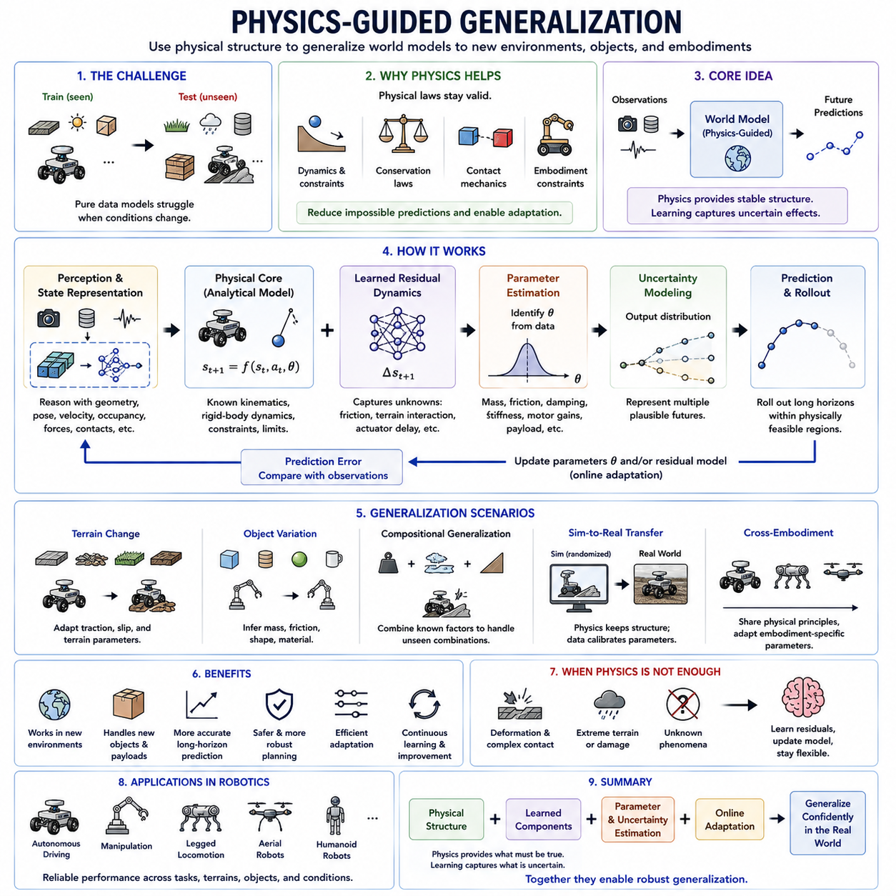{width="7.268055555555556in" height="7.268055555555556in"}

Physics-guided generalization enables a learned world model to remain useful when a robot encounters conditions that differ from its training distribution. Instead of relying only on statistical similarities between past and current observations, the model uses physical structure that remains valid across environments. Geometry, dynamics, conservation relationships, contact mechanics, and embodiment constraints can therefore provide stable foundations for prediction under unfamiliar conditions.

Purely data-driven models often generalize well when new observations resemble examples represented in the training dataset. Their predictions can deteriorate when terrain, payload, object properties, lighting, friction, speed, or operating conditions change substantially. Physical AI must operate under precisely these variations, making generalization beyond the observed data distribution a central requirement rather than an exceptional capability.

Physical laws provide a different form of knowledge because many relationships remain applicable even when visual appearance changes. A vehicle still obeys constraints on acceleration and steering when road texture changes, while an object continues to possess mass and inertia under different illumination. By separating persistent physical structure from variable sensory appearance, world models can learn representations that transfer more effectively across domains.

This distinction is particularly important for out-of-distribution generalization. A neural model may encounter combinations of states and conditions that were rare or absent during training. Physics does not eliminate this uncertainty, but it reduces the range of plausible predictions. Conservation laws, feasible motion constraints, and known dynamics can prevent the model from producing futures that contradict basic physical behavior even when statistical evidence is weak.

One strategy is to encode invariant physical quantities or relationships into the model representation. Instead of relying entirely on raw pixels, the world model can reason through position, velocity, orientation, geometry, occupancy, force, contact, or other structured variables. These representations often change more predictably across environments than appearance-level features, helping the model preserve useful knowledge when sensors observe unfamiliar scenes.

Equivariance provides another mechanism for physics-guided generalization. Physical relationships frequently transform systematically under translation, rotation, or changes of reference frame. Architectures that respect these transformations can avoid relearning equivalent situations separately. A model that understands how geometric relationships transform with coordinate systems can generalize more efficiently across object poses, robot orientations, and spatial configurations.

Hybrid physics and learned models naturally support generalization by assigning stable relationships to analytical components and variable effects to learned components. Known kinematics or rigid-body dynamics can remain unchanged across deployments, while neural modules adapt friction, terrain interaction, actuator response, or other uncertain phenomena. This decomposition prevents environmental variation from forcing the entire dynamics model to be relearned.

Parameter adaptation further extends this capability. The mathematical structure of the dynamics may remain valid while parameters such as payload mass, friction, damping, stiffness, or motor efficiency change. System identification can estimate these quantities from recent observations and condition future predictions on the updated values. Generalization then becomes adaptation within a structured family of physical models rather than unrestricted extrapolation.

For mobile robots, terrain change illustrates this principle clearly. A platform trained mainly on indoor flooring may later encounter asphalt, gravel, grass, mud, or slopes. Its geometry and actuator configuration remain largely unchanged, while traction and slip characteristics vary. A physics-guided world model can preserve nominal vehicle dynamics while estimating terrain-dependent parameters or learned residuals that modify predicted motion.

Manipulation presents a similar challenge. A robot may encounter objects with unfamiliar shapes, masses, friction coefficients, or material properties. Memorizing object-specific interaction outcomes cannot scale to every possible object. Rigid-body structure, contact constraints, and learned estimates of physical properties allow the world model to reason about new objects through their relevant physical characteristics rather than requiring an exact training example.

Compositional generalization is another important benefit. A robot may have separately experienced heavy objects, slippery surfaces, and inclined terrain but never their exact combination. A model organized around meaningful physical factors can potentially combine knowledge about mass, friction, gravity, and geometry to predict the new situation. This is more systematic than treating every combination of environmental conditions as an unrelated pattern.

Physics-guided generalization also supports transfer between simulation and reality. Simulators can expose models to broad ranges of geometry, dynamics, and physical parameters, while physical structure helps preserve relationships that should remain valid outside simulation. Domain randomization can vary uncertain properties, and real-world observations can subsequently calibrate parameters or residual models to reduce the remaining simulation-to-reality gap.

Generalization across robotic platforms is more difficult because embodiment itself changes. Different robots possess different dimensions, masses, actuators, sensors, and kinematic structures. However, shared physical principles still provide reusable knowledge. A world model can separate general interaction concepts such as force, contact, momentum, and geometry from embodiment-specific parameters, enabling part of the learned representation to transfer while platform-specific components are adapted.

Uncertainty estimation becomes essential when physics-guided models operate beyond familiar conditions. Physical structure may constrain what is possible without determining exactly what will happen. Unknown friction, hidden contact, uncertain material properties, or unmodeled disturbances can still produce multiple plausible futures. A robust world model should therefore represent uncertainty and avoid interpreting physical constraints as complete knowledge of an unfamiliar environment.

The model can also use prediction error as evidence that adaptation is required. When observed transitions repeatedly differ from physically guided predictions, the discrepancy may indicate changed parameters, previously unseen dynamics, sensor degradation, or an incorrect model assumption. Online system identification and residual learning can then update the model, converting unexpected experience into improved knowledge rather than allowing prediction errors to accumulate.

Long-horizon prediction particularly benefits from physical guidance because extrapolation errors compound over repeated transitions. A purely learned model may gradually violate geometry, energy behavior, actuator limits, or stability constraints when rolled forward beyond familiar trajectories. Physical priors can anchor predictions to feasible regions of state space, while learned components account for variations that cannot be represented accurately by fixed equations.

For planning, physics-guided generalization means that imagined futures remain useful even when the robot operates in situations not explicitly represented in training data. Candidate actions can be evaluated against physical feasibility, contact conditions, dynamic limits, and uncertainty. The planner can therefore reject impossible trajectories and prefer actions that remain robust across plausible variations in environmental and system parameters.

Physics guidance should nevertheless remain adaptable rather than rigid. Simplified equations may fail under deformation, complex contact, extreme terrain, hardware damage, or previously unknown interaction regimes. If incorrect physical assumptions are enforced too strongly, they can prevent the model from learning valid behavior. Effective generalization therefore requires a balance between reliable physical structure and data-driven correction when reality departs from the assumed model.

A practical architecture can combine invariant representations, analytical dynamics, learned residuals, parameter estimation, uncertainty modeling, and online adaptation. Stable physical knowledge provides the reusable core, while learned components capture environment-specific details. New observations continuously test the model, and discrepancies trigger parameter updates or residual learning, allowing generalization and adaptation to operate as complementary processes.

Physics-guided generalization ultimately shifts the goal from memorizing the training distribution to learning reusable principles of interaction. A Physical AI world model should recognize that appearances and operating conditions change while many underlying physical relationships persist. By exploiting these relationships while retaining the ability to learn uncertain effects, the model can produce more reliable predictions across new environments, objects, payloads, terrains, embodiments, and tasks.

물리학 기반 일반화(Physics-Guided Generalization)는 로봇이 학습 분포(Training Distribution)와 다른 조건을 마주하더라도 학습된 월드 모델(Learned World Model)이 계속 유용하게 작동할 수 있도록 한다. 과거 관측과 현재 관측 사이의 통계적 유사성에만 의존하는 대신, 모델은 환경이 달라져도 유지되는 물리적 구조(Physical Structure)를 활용한다. 따라서 기하학(Geometry), 동역학(Dynamics), 보존 관계(Conservation Relationships), 접촉 역학(Contact Mechanics), 신체화 제약(Embodiment Constraints)은 익숙하지 않은 조건에서도 안정적인 예측 기반을 제공할 수 있다.

순수한 데이터 기반 모델(Purely Data-Driven Models)은 새로운 관측이 학습 데이터셋에 포함된 사례와 유사할 때 일반적으로 높은 일반화 성능을 보인다. 그러나 지형(Terrain), 페이로드(Payload), 객체 특성(Object Properties), 조명(Lighting), 마찰(Friction), 속도(Speed), 운용 조건(Operating Conditions)이 크게 변화하면 예측 성능이 저하될 수 있다. 피지컬 AI(Physical AI)는 바로 이러한 변화 속에서 작동해야 하므로 관측된 데이터 분포를 넘어서는 일반화는 예외적인 기능이 아니라 핵심 요구사항이 된다.

물리 법칙(Physical Laws)은 시각적 외형이 변화하더라도 많은 관계가 그대로 유지되기 때문에 다른 형태의 지식을 제공한다. 도로의 질감이 변하더라도 차량은 여전히 가속과 조향에 대한 제약을 따르며, 조명이 달라져도 객체는 계속 질량과 관성을 가진다. 지속적으로 유지되는 물리적 구조와 변화하는 감각적 외형(Sensory Appearance)을 분리함으로써 월드 모델은 서로 다른 도메인(Domain)으로 더욱 효과적으로 전이될 수 있는 표현을 학습할 수 있다.

이러한 구분은 분포 외 일반화(Out-of-Distribution Generalization)에서 특히 중요하다. 신경망 모델은 학습 과정에서 드물게 나타났거나 전혀 존재하지 않았던 상태와 조건의 조합을 만날 수 있다. 물리학이 이러한 불확실성을 완전히 제거하지는 않지만 가능한 예측의 범위를 줄여준다. 보존 법칙(Conservation Laws), 실행 가능한 운동 제약(Feasible Motion Constraints), 알려진 동역학은 통계적 증거가 부족하더라도 모델이 기본적인 물리적 거동을 위반하는 미래를 생성하는 것을 방지할 수 있다.

한 가지 전략은 불변 물리량(Invariant Physical Quantities)이나 물리적 관계를 모델 표현(Model Representation)에 인코딩하는 것이다. 월드 모델은 원시 픽셀(Raw Pixels)에 전적으로 의존하는 대신 위치(Position), 속도(Velocity), 자세(Orientation), 기하학, 점유(Occupancy), 힘(Force), 접촉(Contact) 또는 기타 구조화된 변수(Structured Variables)를 통해 추론할 수 있다. 이러한 표현은 외형 수준의 특징(Appearance-Level Features)보다 환경 변화에 따라 더욱 예측 가능한 방식으로 변화하므로 센서가 익숙하지 않은 장면을 관측하더라도 유용한 지식을 유지하는 데 도움이 된다.

등변성(Equivariance)은 물리학 기반 일반화를 위한 또 다른 메커니즘을 제공한다. 물리적 관계는 평행이동(Translation), 회전(Rotation), 기준 좌표계(Reference Frame)의 변화에 따라 체계적으로 변환되는 경우가 많다. 이러한 변환 특성을 따르는 아키텍처는 동등한 상황을 각각 별도로 다시 학습할 필요를 줄일 수 있다. 좌표계에 따라 기하학적 관계가 어떻게 변환되는지를 이해하는 모델은 객체 자세(Object Pose), 로봇 방향(Robot Orientation), 공간적 구성(Spatial Configuration)이 달라지는 상황에서 더욱 효율적으로 일반화할 수 있다.

하이브리드 물리-학습 모델(Hybrid Physics and Learned Models)은 안정적인 관계를 해석적 구성요소(Analytical Components)에 할당하고 변화하는 효과를 학습 구성요소(Learned Components)에 할당함으로써 자연스럽게 일반화를 지원한다. 알려진 운동학(Kinematics)이나 강체 동역학(Rigid-Body Dynamics)은 다양한 배치 환경에서도 유지될 수 있으며, 신경망 모듈은 마찰, 지형 상호작용, 액추에이터 응답(Actuator Response) 또는 기타 불확실한 현상에 적응할 수 있다. 이러한 분해는 환경 변화가 발생할 때 전체 동역학 모델을 다시 학습해야 하는 문제를 줄여준다.

매개변수 적응(Parameter Adaptation)은 이러한 능력을 더욱 확장한다. 동역학의 수학적 구조는 그대로 유지되면서 페이로드 질량(Payload Mass), 마찰, 감쇠(Damping), 강성(Stiffness), 모터 효율(Motor Efficiency) 등의 매개변수는 변화할 수 있다. 시스템 식별(System Identification)은 최근 관측으로부터 이러한 물리량을 추정하고 갱신된 값을 조건으로 미래를 예측할 수 있다. 따라서 일반화는 제약 없는 외삽(Unrestricted Extrapolation)이 아니라 구조화된 물리 모델 집합 내에서의 적응으로 전환된다.

이동 로봇(Mobile Robot)의 지형 변화는 이러한 원리를 명확하게 보여준다. 주로 실내 바닥에서 학습된 플랫폼이 이후 아스팔트, 자갈, 잔디, 진흙, 경사면을 만날 수 있다. 로봇의 기하학과 액추에이터 구성은 대부분 그대로 유지되지만 접지력(Traction)과 슬립(Slip) 특성은 달라진다. 물리학 기반 월드 모델은 기본적인 차량 동역학을 유지하면서 지형 의존적 매개변수(Terrain-Dependent Parameters)나 학습된 잔차(Learned Residuals)를 추정하여 예측된 운동을 조정할 수 있다.

로봇 조작(Manipulation)에서도 유사한 문제가 발생한다. 로봇은 익숙하지 않은 형상, 질량, 마찰 계수(Friction Coefficient), 재료 특성(Material Properties)을 가진 객체를 만날 수 있다. 객체별 상호작용 결과를 단순히 암기하는 방식은 가능한 모든 객체로 확장하기 어렵다. 강체 구조(Rigid-Body Structure), 접촉 제약(Contact Constraints), 학습된 물리 특성 추정값을 활용하면 월드 모델은 정확히 동일한 학습 사례를 요구하지 않고 새로운 객체의 관련 물리적 특성을 기반으로 추론할 수 있다.

조합적 일반화(Compositional Generalization)는 또 다른 중요한 이점이다. 로봇이 무거운 객체, 미끄러운 표면, 경사진 지형을 각각 경험했지만 이 세 조건이 결합된 상황은 한 번도 경험하지 않았을 수 있다. 의미 있는 물리 요소를 중심으로 구성된 모델은 질량, 마찰, 중력(Gravity), 기하학에 대한 지식을 결합하여 새로운 상황을 예측할 가능성이 있다. 이는 환경 조건의 모든 조합을 서로 관련 없는 개별 패턴으로 취급하는 것보다 체계적인 접근법이다.

물리학 기반 일반화는 시뮬레이션과 현실 사이의 전이(Transfer Between Simulation and Reality)도 지원한다. 시뮬레이터는 모델을 광범위한 기하학, 동역학, 물리 매개변수에 노출할 수 있으며, 물리 구조는 시뮬레이션 외부에서도 유지되어야 하는 관계를 보존하는 데 도움을 준다. 도메인 랜덤화(Domain Randomization)를 통해 불확실한 특성을 변화시키고, 이후 실제 관측을 이용해 매개변수나 잔차 모델을 보정하여 남아 있는 시뮬레이션-현실 격차(Sim-to-Real Gap)를 줄일 수 있다.

로봇 플랫폼 간 일반화(Generalization Across Robotic Platforms)는 신체화(Embodiment) 자체가 달라지기 때문에 더욱 어렵다. 서로 다른 로봇은 서로 다른 크기, 질량, 액추에이터, 센서, 운동학적 구조(Kinematic Structure)를 가진다. 그러나 공통적인 물리 원리는 여전히 재사용 가능한 지식을 제공한다. 월드 모델은 힘, 접촉, 운동량(Momentum), 기하학과 같은 일반적인 상호작용 개념을 신체화 특화 매개변수(Embodiment-Specific Parameters)와 분리하여 학습된 표현의 일부는 전이하고 플랫폼별 구성요소만 적응시킬 수 있다.

물리학 기반 모델이 익숙하지 않은 조건에서 작동할 때 불확실성 추정(Uncertainty Estimation)은 필수적이다. 물리 구조는 가능한 상태를 제한할 수 있지만 정확히 어떤 결과가 발생할지를 항상 결정하지는 못한다. 알려지지 않은 마찰, 숨겨진 접촉(Hidden Contact), 불확실한 재료 특성, 모델링되지 않은 외란(Unmodeled Disturbances)은 여전히 여러 개의 가능한 미래를 만들 수 있다. 따라서 견고한 월드 모델은 불확실성을 표현하고 물리적 제약을 익숙하지 않은 환경에 대한 완전한 지식으로 해석하지 않아야 한다.

모델은 예측 오차(Prediction Error)를 적응이 필요하다는 증거로 활용할 수도 있다. 관측된 상태 전이가 물리학 기반 예측과 반복적으로 다르게 나타난다면 이러한 차이는 변화된 매개변수, 이전에 경험하지 못한 동역학, 센서 성능 저하(Sensor Degradation), 또는 잘못된 모델 가정을 의미할 수 있다. 온라인 시스템 식별(Online System Identification)과 잔차 학습(Residual Learning)은 이러한 상황에서 모델을 갱신하여 예상하지 못한 경험을 개선된 지식으로 변환하고 예측 오차가 계속 누적되는 것을 방지할 수 있다.

장기 예측(Long-Horizon Prediction)은 반복적인 상태 전이 과정에서 외삽 오차(Extrapolation Error)가 누적되기 때문에 물리적 지침으로부터 특히 큰 이점을 얻는다. 순수 학습 모델은 익숙한 궤적을 넘어 롤아웃(Rollout)될수록 기하학, 에너지 거동(Energy Behavior), 액추에이터 한계(Actuator Limits), 안정성 제약(Stability Constraints)을 점차 위반할 수 있다. 물리적 사전지식(Physical Priors)은 예측을 상태 공간의 실행 가능한 영역에 고정하고, 학습 구성요소는 고정된 방정식만으로 정확하게 표현하기 어려운 변화를 보완할 수 있다.

계획(Planning) 관점에서 물리학 기반 일반화는 로봇이 학습 데이터에 명시적으로 포함되지 않은 상황에서도 상상된 미래(Imagined Futures)를 유용하게 유지한다는 의미를 가진다. 후보 행동(Candidate Actions)은 물리적 실행 가능성(Physical Feasibility), 접촉 조건, 동역학적 한계(Dynamic Limits), 불확실성을 기준으로 평가할 수 있다. 따라서 계획기는 불가능한 궤적을 제거하고 환경 및 시스템 매개변수의 가능한 변화에도 견고한 행동을 선호할 수 있다.

그러나 물리적 지침(Physics Guidance)은 경직되어 있기보다 적응 가능해야 한다. 단순화된 방정식은 변형(Deformation), 복잡한 접촉(Complex Contact), 극한 지형(Extreme Terrain), 하드웨어 손상(Hardware Damage), 이전에 알려지지 않은 상호작용 영역에서 실패할 수 있다. 잘못된 물리적 가정을 지나치게 강하게 적용하면 모델이 실제로 유효한 거동을 학습하지 못하게 할 수 있다. 따라서 효과적인 일반화를 위해서는 신뢰할 수 있는 물리 구조와 현실이 가정된 모델에서 벗어날 때 이를 보완하는 데이터 기반 보정(Data-Driven Correction) 사이의 균형이 필요하다.

실용적인 아키텍처(Practical Architecture)는 불변 표현(Invariant Representations), 해석적 동역학(Analytical Dynamics), 학습된 잔차, 매개변수 추정(Parameter Estimation), 불확실성 모델링(Uncertainty Modeling), 온라인 적응(Online Adaptation)을 결합할 수 있다. 안정적인 물리 지식은 재사용 가능한 핵심 구조(Reusable Core)를 제공하고 학습 구성요소는 환경 특화 세부사항(Environment-Specific Details)을 포착한다. 새로운 관측은 모델을 지속적으로 검증하며, 불일치가 발생하면 매개변수 갱신이나 잔차 학습을 수행하여 일반화와 적응이 상호 보완적으로 작동하도록 한다.

궁극적으로 물리학 기반 일반화는 학습 분포를 암기하는 것에서 벗어나 재사용 가능한 상호작용 원리(Reusable Principles of Interaction)를 학습하는 방향으로 목표를 전환한다. 피지컬 AI 월드 모델은 외형과 운용 조건은 변화하지만 그 기반에 있는 많은 물리적 관계는 지속된다는 점을 이해해야 한다. 이러한 관계를 활용하면서 불확실한 효과를 계속 학습할 수 있는 능력을 유지함으로써 모델은 새로운 환경, 객체, 페이로드, 지형, 신체화, 작업(Task)에 걸쳐 더욱 신뢰할 수 있는 예측을 생성할 수 있다.

##  

## 10.10. Hybrid Physics Learned World Model [w/Code]

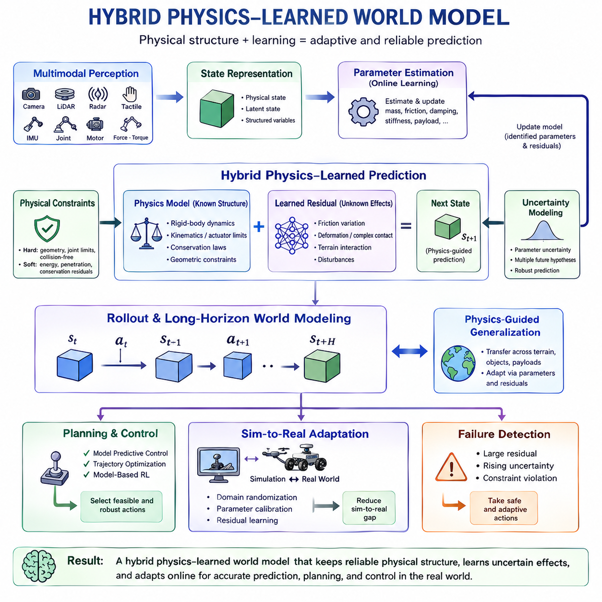{width="7.268055555555556in" height="7.268055555555556in"}

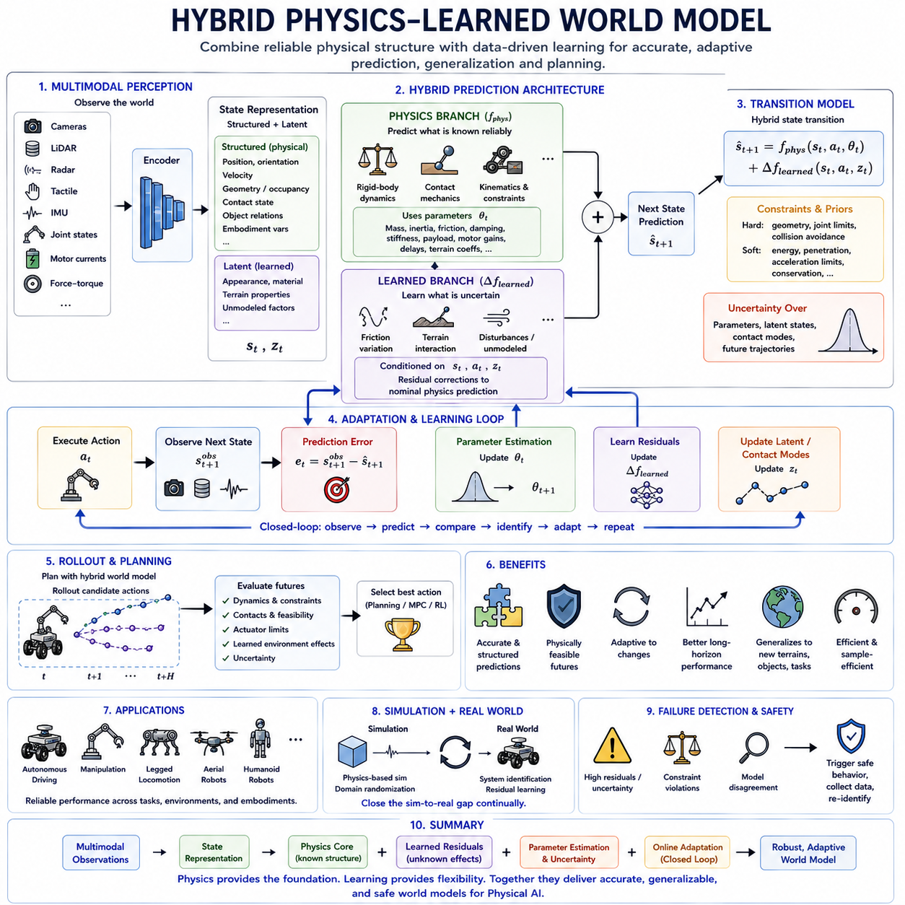{width="7.268055555555556in" height="7.268055555555556in"}

A hybrid physics-learned world model combines explicit physical structure with data-driven prediction inside a unified representation of how an environment evolves. Rather than asking a neural network to rediscover every mechanical relationship from observations, the architecture preserves reliable knowledge about geometry, motion, forces, and constraints while learning the uncertain effects that analytical models cannot describe accurately.

The central principle is to divide prediction according to what is known and what must be learned. Established kinematics, rigid-body relationships, actuator limits, conservation constraints, and geometric feasibility can form a physical core. Neural components can model friction variation, deformation, complex contact, terrain interaction, disturbances, actuator nonlinearities, and other phenomena whose equations or parameters are incomplete.

A simplified transition can be represented as (s_{t+1}=f_{phys}(s_t,a_t,\\theta_t)+\\Delta f_{learned}(s_t,a_t,z_t)). The physical model generates a nominal next state using estimated parameters (\\theta_t), while the learned residual predicts corrections conditioned on observations and latent context (z_t). The resulting transition retains physical structure without assuming that analytical dynamics perfectly represent reality.

The architecture begins with multimodal perception. Cameras, LiDAR, radar, tactile sensing, IMUs, joint measurements, motor currents, force-torque sensors, and other signals provide partial evidence about the current world. Encoders transform these observations into explicit physical states, structured latent states, or combinations of both, creating a representation suitable for prediction, parameter estimation, planning, and control.

Structured state representations are particularly useful because they separate persistent physical quantities from appearance-dependent information. Position, orientation, velocity, occupancy, geometry, contact state, object relationships, and embodiment variables can coexist with learned latent features representing properties that are difficult to define explicitly. This allows the world model to preserve interpretable structure while retaining neural representational flexibility.

The physics branch predicts the portion of future evolution that can be described reliably. Depending on the robot, it may include rigid-body dynamics, vehicle kinematics, manipulator equations, gravity, collision geometry, actuator constraints, or simplified contact mechanics. Physical priors restrict the possible transitions and prevent the model from spending learning capacity on relationships already established by mechanics.

The learned branch complements this physical prediction rather than necessarily replacing it. Residual networks can estimate wheel slip, uncertain contact forces, aerodynamic disturbances, compliance, terrain effects, or systematic simulator error. Because these components learn the difference between nominal physics and observed reality, their learning problem can be substantially smaller than learning complete system dynamics directly from raw experience.

Parameter learning provides another adaptive layer. Mass, inertia, friction, damping, stiffness, payload, motor gains, delay, or terrain-dependent coefficients may change between tasks or during operation. A parameter estimator can infer these quantities from recent observations and update the physical model online. The analytical structure therefore remains stable while its operating parameters adapt to the current robot and environment.

Differentiable physics can connect these modules into a common learning system. When physical transitions are differentiable, prediction errors can propagate through the simulator to parameter estimators, perception networks, and learned residual components. The system can jointly optimize how the environment is perceived, which physical parameters are inferred, and how remaining model mismatch is corrected from data.

Physical constraints can be applied as both hard and soft structure. Hard constraints may enforce rigid geometry, joint limits, collision-free configurations, or other relationships that should not be violated. Soft constraints can penalize inconsistent energy behavior, penetration, unrealistic accelerations, or conservation residuals. Combining these mechanisms helps preserve feasibility without requiring uncertain real-world physics to be treated as perfectly known.

Contact and friction require special treatment because they introduce discontinuities and mode changes. A hybrid model can represent free motion, sticking, sliding, rolling, and impact as different interaction regimes. Learned components may infer the active contact mode and uncertain friction properties, while analytical or differentiable contact models impose reliable geometric and mechanical relationships within each regime.

Uncertainty modeling is essential because neither branch is universally correct. The physical model may contain uncertain parameters or simplified equations, while the learned model may encounter observations outside its training distribution. Representing uncertainty over parameters, latent states, contact modes, or future trajectories allows the system to generate multiple plausible futures rather than committing prematurely to one deterministic prediction.

Prediction then becomes a rollout of physically constrained but adaptively corrected futures. Starting from the estimated current state, candidate actions are propagated through the physical dynamics and learned corrections across multiple time steps. Physical constraints help prevent accumulated prediction errors from drifting into impossible states, while learned components compensate for systematic differences between nominal mechanics and actual environmental behavior.

This combination is particularly valuable for long-horizon world modeling. Small errors in friction, actuator delay, contact, or inertia can compound rapidly during repeated prediction. A purely analytical model may accumulate systematic bias, while a purely learned model may gradually violate physical feasibility. Hybrid prediction reduces both failure modes by anchoring rollouts to known structure while continuously correcting model mismatch.

The same architecture supports physics-guided generalization. When terrain, payload, objects, or environmental conditions change, stable physical relationships can remain reusable while parameters and learned residuals adapt. A robot encountering a new surface does not need to relearn its entire motion model; it can preserve vehicle geometry and kinematics while updating traction, slip, or terrain-related latent variables from recent experience.

System identification naturally becomes a continuous feedback mechanism inside the world model. Predicted transitions are compared with subsequent observations, and persistent prediction errors reveal mismatches in parameters or learned dynamics. Parameter estimates and residual models are then updated, producing a closed loop of observation, prediction, comparison, identification, and adaptation that continually calibrates the internal model to reality.

For planning, the hybrid world model can evaluate counterfactual futures under different actions. Candidate trajectories are rolled forward while considering geometry, dynamics, contact, actuator limits, learned environmental effects, and uncertainty. Model Predictive Control, trajectory optimization, and model-based reinforcement learning can therefore reason over futures that are not only statistically plausible but also physically executable.

The architecture can also support different computational levels. Fast analytical dynamics may operate at high control rates, learned residual models may update at intermediate rates, and larger perception or latent world models may reason over longer horizons. Such hierarchical execution is useful for Physical AI because not every prediction requires the same spatial detail, temporal horizon, or computational cost.

Simulation and real-world learning can be integrated within the same framework. Physics-based simulation provides broad experience and reusable structural knowledge, while domain randomization exposes the model to variations in uncertain parameters. Real robot observations subsequently identify actual parameters and train residual corrections, reducing the sim-to-real gap without discarding the physical knowledge acquired during simulation.

Failure detection can emerge from disagreement among model components. Large residual corrections, increasing uncertainty, persistent constraint violations, or disagreement between predicted and observed transitions can indicate that the robot has entered an unfamiliar regime. The system can respond by reducing speed, selecting safer actions, gathering informative observations, or triggering additional online identification before relying on long-horizon predictions.

The ultimate objective is not to maximize the amount of physics or learning independently, but to assign each source of knowledge to the role where it is most reliable. Physics supplies reusable structure, feasibility, interpretability, and extrapolation constraints. Learning supplies adaptation, perception, residual correction, and representations for complex phenomena. Parameter estimation and uncertainty connect these components to changing real-world conditions.

A hybrid physics-learned world model therefore forms a closed adaptive prediction system rather than a fixed simulator or unrestricted neural predictor. Multimodal observations establish the current state, physics generates structured expectations, learning corrects unknown effects, system identification calibrates parameters, and uncertainty expresses what remains unknown. Together, these mechanisms provide Physical AI with physically grounded, adaptive, and increasingly reliable models for prediction, planning, and control.

하이브리드 물리-학습 월드 모델(Hybrid Physics-Learned World Model)은 환경이 어떻게 변화하는지를 통합적으로 표현하기 위해 명시적인 물리 구조(Explicit Physical Structure)와 데이터 기반 예측(Data-Driven Prediction)을 결합한다. 신경망(Neural Network)이 관측으로부터 모든 기계적 관계를 다시 발견하도록 요구하는 대신, 기하학(Geometry), 운동(Motion), 힘(Forces), 제약조건(Constraints)에 관한 신뢰할 수 있는 지식을 유지하면서 해석적 모델(Analytical Model)이 정확하게 설명하기 어려운 불확실한 효과를 학습한다.

핵심 원리는 무엇이 알려져 있고 무엇을 학습해야 하는지에 따라 예측 기능을 분담하는 것이다. 확립된 운동학(Kinematics), 강체 관계(Rigid-Body Relationships), 액추에이터 한계(Actuator Limits), 보존 제약(Conservation Constraints), 기하학적 실행 가능성(Geometric Feasibility)은 물리적 코어(Physical Core)를 구성할 수 있다. 신경망 구성요소는 마찰 변화(Friction Variation), 변형(Deformation), 복잡한 접촉(Complex Contact), 지형 상호작용(Terrain Interaction), 외란(Disturbances), 액추에이터 비선형성(Actuator Nonlinearities) 등 방정식이나 매개변수가 불완전한 현상을 모델링할 수 있다.

단순화된 상태 전이는 (s_{t+1}=f_{phys}(s_t,a_t,\\theta_t)+\\Delta f_{learned}(s_t,a_t,z_t))로 표현할 수 있다. 물리 모델(Physical Model)은 추정된 매개변수 (\\theta_t)를 이용하여 명목상의 다음 상태(Nominal Next State)를 생성하고, 학습된 잔차(Learned Residual)는 관측과 잠재 문맥(Latent Context) (z_t)를 조건으로 보정값을 예측한다. 결과적으로 상태 전이는 해석적 동역학이 현실을 완벽하게 표현한다고 가정하지 않으면서도 물리적 구조를 유지한다.

이 아키텍처는 멀티모달 지각(Multimodal Perception)에서 시작한다. 카메라(Camera), 라이다(LiDAR), 레이더(Radar), 촉각 센싱(Tactile Sensing), 관성측정장치(IMU), 관절 측정(Joint Measurements), 모터 전류(Motor Currents), 힘-토크 센서(Force-Torque Sensors) 등의 신호는 현재 세계에 대한 부분적인 증거를 제공한다. 인코더(Encoder)는 이러한 관측을 명시적인 물리 상태(Explicit Physical States), 구조화된 잠재 상태(Structured Latent States), 또는 이 둘의 조합으로 변환하여 예측, 매개변수 추정, 계획, 제어에 적합한 표현을 생성한다.

구조화된 상태 표현(Structured State Representations)은 지속적으로 유지되는 물리량과 외형 의존적 정보(Appearance-Dependent Information)를 분리하기 때문에 특히 유용하다. 위치(Position), 자세(Orientation), 속도(Velocity), 점유(Occupancy), 기하학, 접촉 상태(Contact State), 객체 관계(Object Relationships), 신체화 변수(Embodiment Variables)는 명시적으로 정의하기 어려운 특성을 나타내는 학습된 잠재 특징(Learned Latent Features)과 함께 존재할 수 있다. 이를 통해 월드 모델은 해석 가능한 구조를 유지하면서 신경망 표현의 유연성도 확보할 수 있다.

물리 분기(Physics Branch)는 신뢰성 있게 기술할 수 있는 미래 변화의 일부를 예측한다. 로봇에 따라 강체 동역학(Rigid-Body Dynamics), 차량 운동학(Vehicle Kinematics), 매니퓰레이터 방정식(Manipulator Equations), 중력(Gravity), 충돌 기하학(Collision Geometry), 액추에이터 제약, 단순화된 접촉 역학(Simplified Contact Mechanics) 등이 포함될 수 있다. 물리적 사전지식(Physical Priors)은 가능한 상태 전이를 제한하고, 이미 역학적으로 확립된 관계에 모델의 학습 능력을 불필요하게 사용하는 것을 방지한다.

학습 분기(Learned Branch)는 물리 예측을 반드시 대체하는 것이 아니라 이를 보완한다. 잔차 네트워크(Residual Networks)는 바퀴 슬립(Wheel Slip), 불확실한 접촉력(Contact Forces), 공기역학적 외란(Aerodynamic Disturbances), 유연성(Compliance), 지형 효과(Terrain Effects), 체계적인 시뮬레이터 오차(Systematic Simulator Error)를 추정할 수 있다. 이러한 구성요소는 명목 물리학과 관측된 현실 사이의 차이를 학습하기 때문에 실제 경험으로부터 전체 시스템 동역학을 직접 학습하는 것보다 학습 문제를 상당히 축소할 수 있다.

매개변수 학습(Parameter Learning)은 또 하나의 적응 계층(Adaptive Layer)을 제공한다. 질량(Mass), 관성(Inertia), 마찰(Friction), 감쇠(Damping), 강성(Stiffness), 페이로드(Payload), 모터 이득(Motor Gains), 지연(Delay), 지형 의존 계수(Terrain-Dependent Coefficients)는 작업 사이 또는 운용 중에 변화할 수 있다. 매개변수 추정기(Parameter Estimator)는 최근 관측으로부터 이러한 물리량을 추론하여 물리 모델을 온라인으로 갱신할 수 있다. 따라서 해석적 구조는 안정적으로 유지하면서 운용 매개변수는 현재 로봇과 환경에 적응한다.

미분가능 물리학(Differentiable Physics)은 이러한 모듈을 하나의 공통 학습 시스템으로 연결할 수 있다. 물리적 상태 전이가 미분 가능하다면 예측 오차(Prediction Error)는 시뮬레이터를 통과하여 매개변수 추정기, 지각 네트워크(Perception Networks), 학습된 잔차 구성요소까지 역전파될 수 있다. 따라서 시스템은 환경을 어떻게 지각할 것인지, 어떤 물리 매개변수를 추론할 것인지, 남아 있는 모델 불일치(Model Mismatch)를 데이터로 어떻게 보정할 것인지를 공동으로 최적화할 수 있다.

물리적 제약조건(Physical Constraints)은 하드 구조(Hard Structure)와 소프트 구조(Soft Structure) 모두로 적용할 수 있다. 하드 제약(Hard Constraints)은 강체 기하학, 관절 한계(Joint Limits), 충돌 없는 구성(Collision-Free Configurations) 등 위반해서는 안 되는 관계를 강제할 수 있다. 소프트 제약(Soft Constraints)은 일관되지 않은 에너지 거동(Energy Behavior), 관통(Penetration), 비현실적인 가속도, 보존 잔차(Conservation Residuals)에 페널티를 부여할 수 있다. 두 메커니즘을 결합하면 불확실한 실제 물리 현상을 완벽하게 알려진 것으로 가정하지 않으면서도 실행 가능성을 유지할 수 있다.

접촉(Contact)과 마찰(Friction)은 불연속성(Discontinuities)과 모드 변화(Mode Changes)를 발생시키기 때문에 특별한 처리가 필요하다. 하이브리드 모델은 자유 운동(Free Motion), 고착(Sticking), 미끄러짐(Sliding), 구름(Rolling), 충격(Impact)을 서로 다른 상호작용 영역(Interaction Regimes)으로 표현할 수 있다. 학습 구성요소는 활성화된 접촉 모드와 불확실한 마찰 특성을 추론하고, 해석적 또는 미분가능 접촉 모델은 각 영역에서 신뢰할 수 있는 기하학적·기계적 관계를 적용할 수 있다.

물리 분기와 학습 분기 모두 모든 상황에서 완벽하게 정확하지 않기 때문에 불확실성 모델링(Uncertainty Modeling)은 필수적이다. 물리 모델에는 불확실한 매개변수나 단순화된 방정식이 포함될 수 있으며, 학습 모델은 학습 분포를 벗어난 관측(Out-of-Distribution Observations)을 만날 수 있다. 매개변수, 잠재 상태, 접촉 모드, 미래 궤적(Future Trajectories)에 대한 불확실성을 표현하면 시스템이 하나의 결정론적 예측에 성급하게 고정되지 않고 여러 개의 가능한 미래를 생성할 수 있다.

이후 예측은 물리적으로 제약되면서 적응적으로 보정되는 미래의 롤아웃(Rollout)이 된다. 추정된 현재 상태에서 시작하여 후보 행동(Candidate Actions)을 물리 동역학과 학습된 보정을 통해 여러 시간 단계에 걸쳐 전파한다. 물리적 제약은 누적되는 예측 오차가 불가능한 상태로 드리프트(Drift)하는 것을 방지하고, 학습 구성요소는 명목 역학과 실제 환경 거동 사이의 체계적인 차이를 보완한다.

이러한 결합은 장기 월드 모델링(Long-Horizon World Modeling)에서 특히 중요하다. 마찰, 액추에이터 지연, 접촉, 관성의 작은 오차도 반복적인 예측 과정에서 빠르게 누적될 수 있다. 순수한 해석적 모델(Purely Analytical Model)은 체계적인 편향(Systematic Bias)을 누적할 수 있고, 순수한 학습 모델(Purely Learned Model)은 점차 물리적 실행 가능성을 위반할 수 있다. 하이브리드 예측은 알려진 구조에 롤아웃을 고정하면서 모델 불일치를 지속적으로 보정하여 두 가지 실패 가능성을 모두 줄인다.

동일한 아키텍처는 물리학 기반 일반화(Physics-Guided Generalization)를 지원한다. 지형, 페이로드, 객체, 환경 조건이 변화하더라도 안정적인 물리 관계는 재사용할 수 있으며 매개변수와 학습된 잔차는 새로운 조건에 적응할 수 있다. 로봇이 새로운 표면을 만났다고 해서 전체 운동 모델을 다시 학습할 필요는 없다. 차량의 기하학과 운동학은 유지하면서 최근 경험으로부터 접지력(Traction), 슬립, 지형 관련 잠재 변수(Terrain-Related Latent Variables)를 갱신할 수 있다.

시스템 식별(System Identification)은 자연스럽게 월드 모델 내부의 지속적인 피드백 메커니즘(Feedback Mechanism)이 된다. 예측된 상태 전이를 이후의 실제 관측과 비교하고, 지속적인 예측 오차는 매개변수나 학습 동역학의 불일치를 드러낸다. 이후 매개변수 추정값과 잔차 모델을 갱신하여 관측(Observation), 예측(Prediction), 비교(Comparison), 식별(Identification), 적응(Adaptation)이 반복되는 폐루프(Closed Loop)를 형성하며 내부 모델을 현실에 지속적으로 보정한다.

계획(Planning)을 위해 하이브리드 월드 모델은 서로 다른 행동에 따른 반사실적 미래(Counterfactual Futures)를 평가할 수 있다. 후보 궤적을 미래로 롤아웃하면서 기하학, 동역학, 접촉, 액추에이터 한계, 학습된 환경 효과, 불확실성을 함께 고려한다. 따라서 모델 예측 제어(Model Predictive Control), 궤적 최적화(Trajectory Optimization), 모델 기반 강화학습(Model-Based Reinforcement Learning)은 통계적으로 그럴듯할 뿐만 아니라 물리적으로 실행 가능한 미래를 기반으로 추론할 수 있다.

이 아키텍처는 서로 다른 계산 수준(Computational Levels)도 지원할 수 있다. 빠른 해석적 동역학은 높은 제어 주기(Control Rate)에서 실행되고, 학습된 잔차 모델은 중간 주기로 갱신되며, 더 큰 지각 모델이나 잠재 월드 모델은 보다 긴 시간 지평(Longer Horizon)을 대상으로 추론할 수 있다. 이러한 계층적 실행(Hierarchical Execution)은 모든 예측에 동일한 공간적 세부 수준, 시간 지평, 계산 비용이 필요하지 않은 피지컬 AI에서 특히 유용하다.

시뮬레이션과 실제 환경 학습(Real-World Learning)도 동일한 프레임워크 안에서 통합할 수 있다. 물리 기반 시뮬레이션(Physics-Based Simulation)은 광범위한 경험과 재사용 가능한 구조적 지식을 제공하며, 도메인 랜덤화(Domain Randomization)는 모델을 다양한 불확실한 매개변수에 노출시킨다. 이후 실제 로봇 관측을 통해 실제 매개변수를 식별하고 잔차 보정(Residual Correction)을 학습하여 시뮬레이션에서 획득한 물리 지식을 버리지 않으면서 시뮬레이션-현실 격차(Sim-to-Real Gap)를 줄일 수 있다.

모델 구성요소 사이의 불일치(Disagreement)는 고장 또는 이상 상태 탐지(Failure Detection)의 신호로 활용될 수도 있다. 큰 잔차 보정, 증가하는 불확실성, 지속적인 제약 위반(Constraint Violations), 예측된 상태 전이와 실제 관측 사이의 불일치는 로봇이 익숙하지 않은 영역에 진입했다는 것을 의미할 수 있다. 시스템은 이에 대응하여 속도를 낮추거나, 더욱 안전한 행동을 선택하거나, 정보성이 높은 관측을 수집하거나, 장기 예측을 신뢰하기 전에 추가적인 온라인 시스템 식별을 수행할 수 있다.

궁극적인 목표는 물리학이나 학습의 비중을 각각 최대화하는 것이 아니라 각 지식의 원천을 가장 신뢰할 수 있는 역할에 배치하는 것이다. 물리학은 재사용 가능한 구조(Reusable Structure), 실행 가능성(Feasibility), 해석 가능성(Interpretability), 외삽 제약(Extrapolation Constraints)을 제공한다. 학습은 적응(Adaptation), 지각, 잔차 보정, 복잡한 현상을 위한 표현을 제공한다. 매개변수 추정과 불확실성은 이러한 구성요소를 변화하는 실제 환경 조건과 연결한다.

따라서 하이브리드 물리-학습 월드 모델은 고정된 시뮬레이터(Fixed Simulator)나 제약 없는 신경 예측기(Unrestricted Neural Predictor)가 아니라 폐루프 적응형 예측 시스템(Closed Adaptive Prediction System)을 형성한다. 멀티모달 관측은 현재 상태를 설정하고, 물리학은 구조화된 기대(Structured Expectations)를 생성하며, 학습은 알려지지 않은 효과를 보정하고, 시스템 식별은 매개변수를 현실에 맞게 조정하며, 불확실성은 아직 알지 못하는 부분을 표현한다. 이러한 메커니즘의 결합은 피지컬 AI에 예측(Prediction), 계획, 제어를 위한 물리적으로 기반하고 적응 가능하며 지속적으로 신뢰성이 향상되는 월드 모델을 제공한다.
