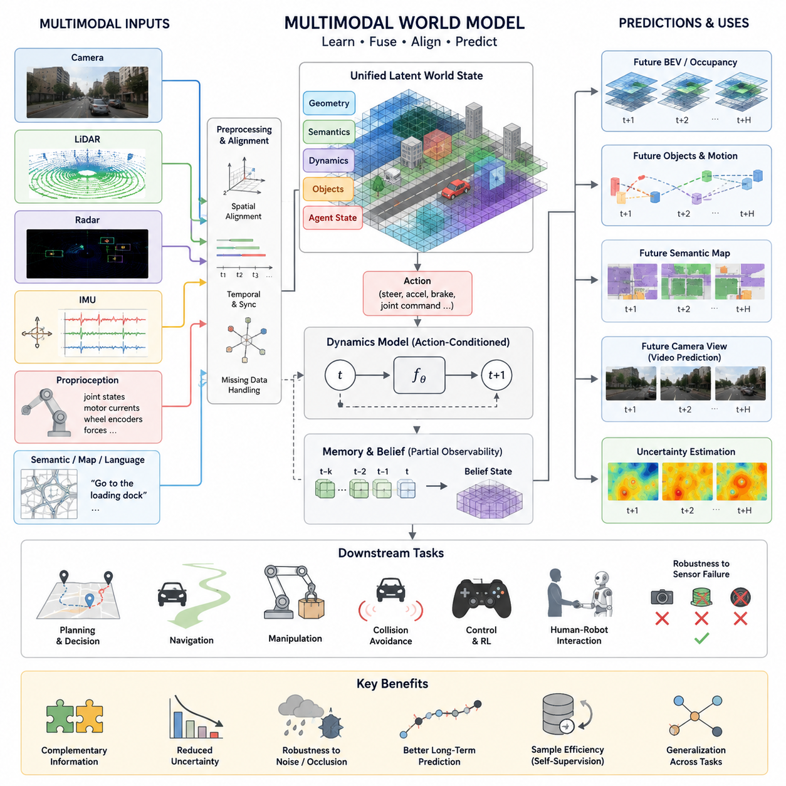
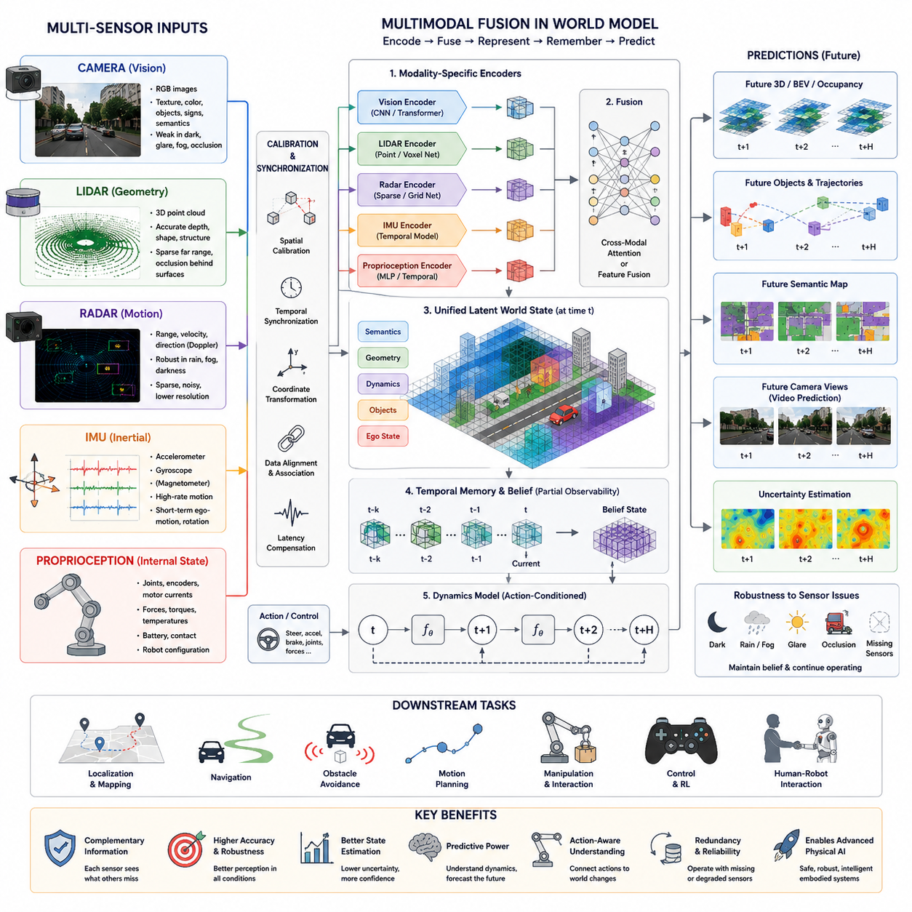
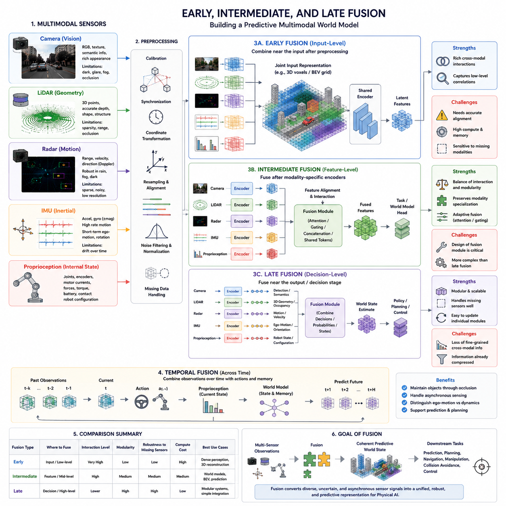
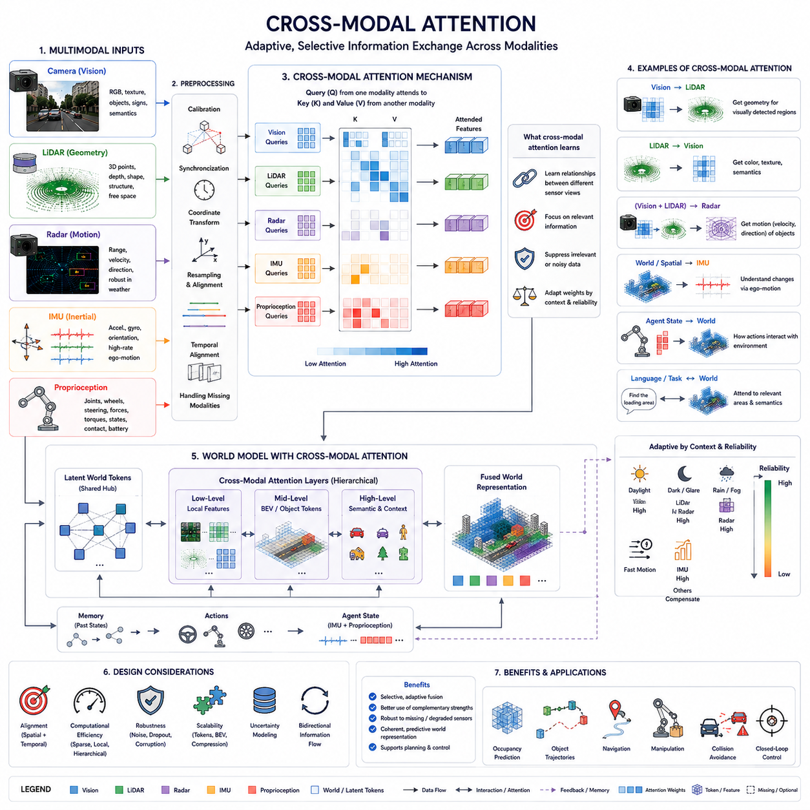
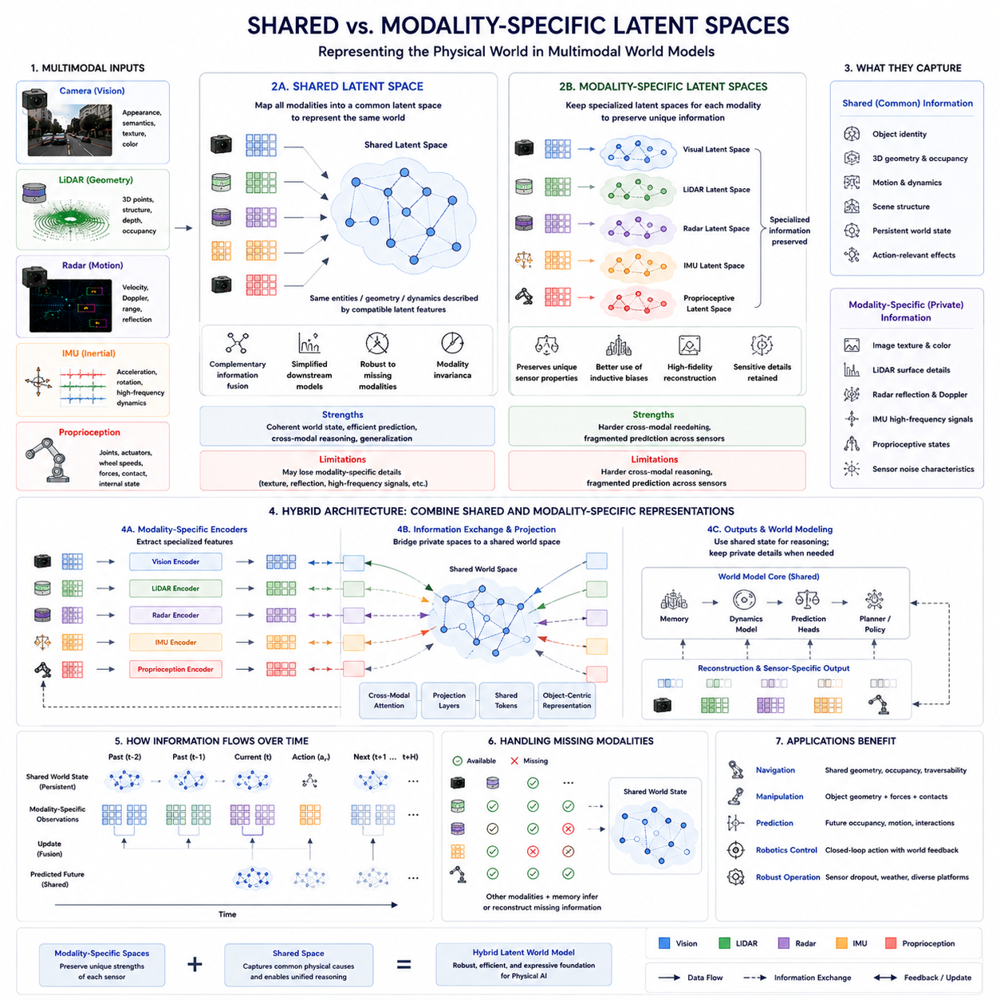
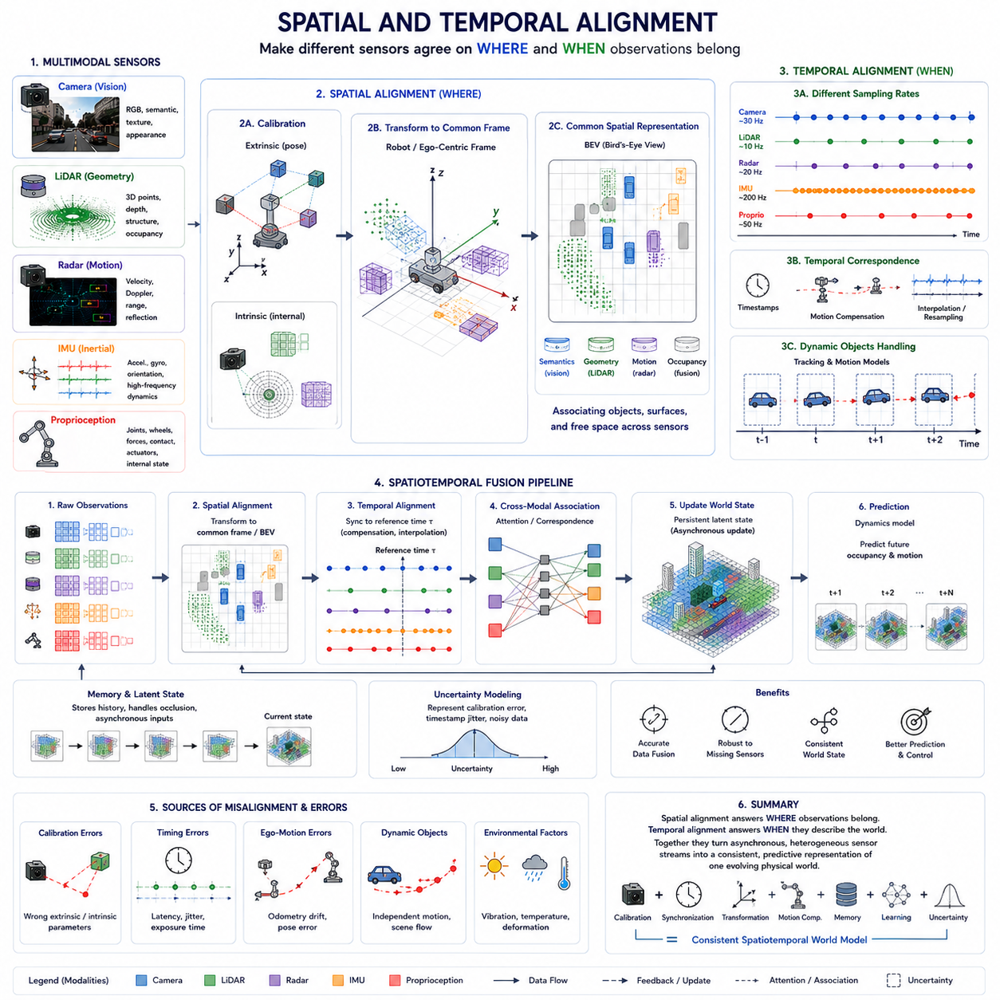
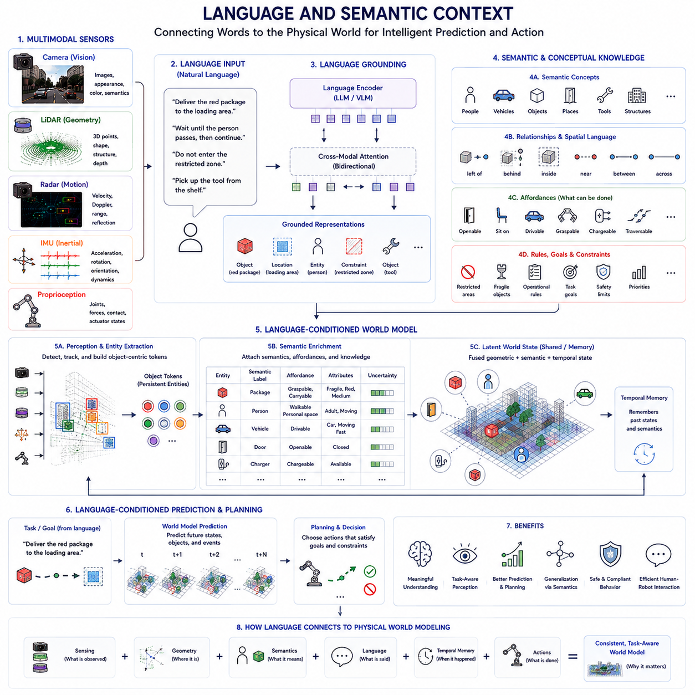
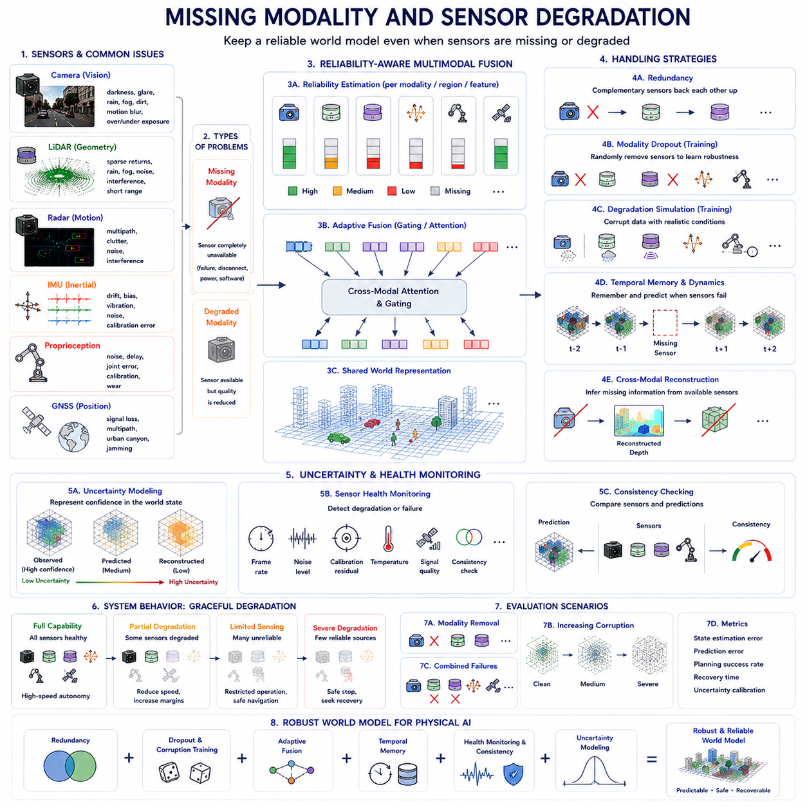
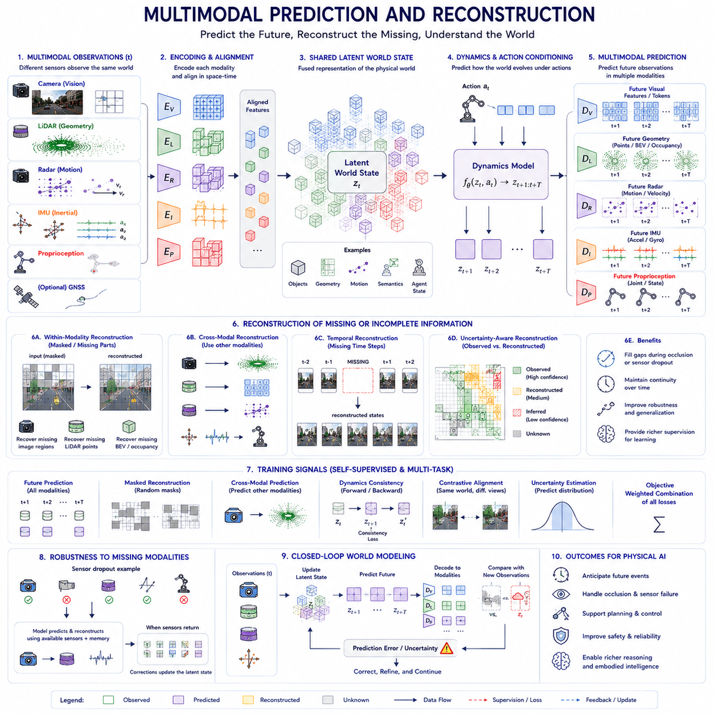
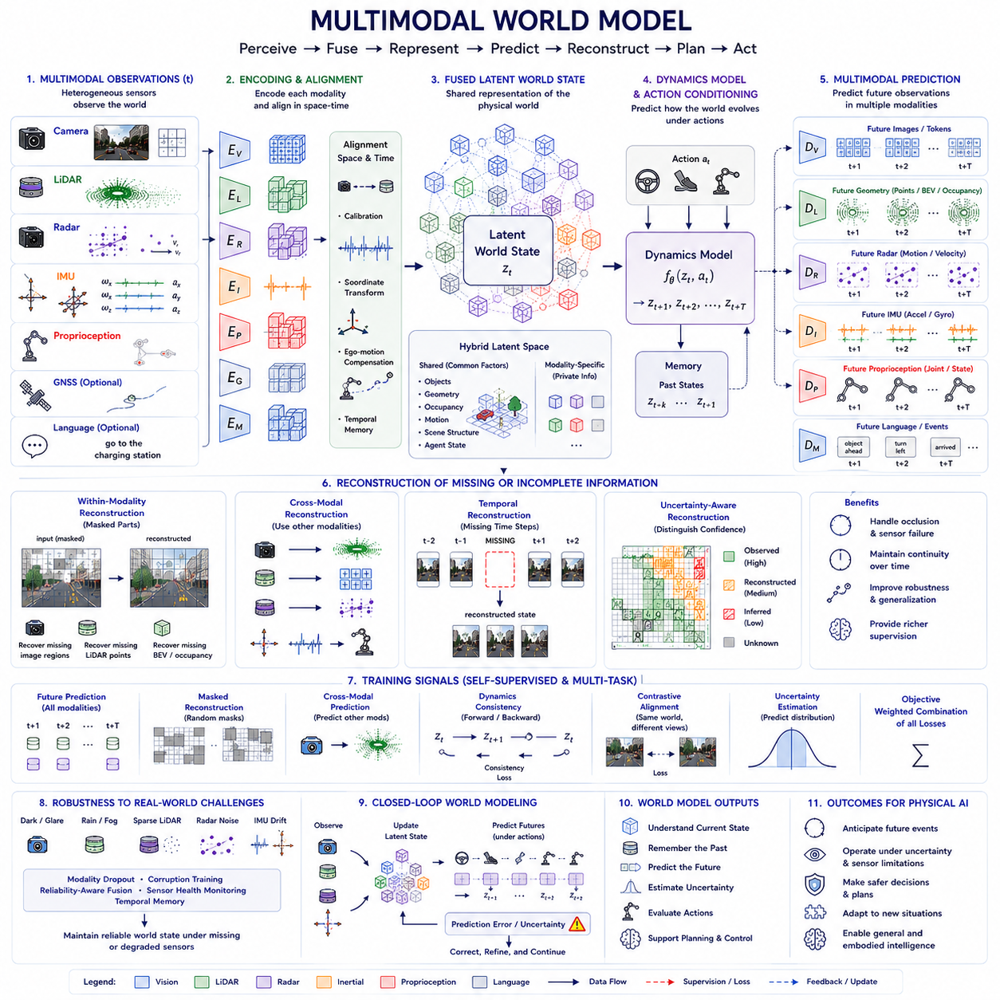

**Volume 07. World Models for Physical AI**


# Chapter 11. Multimodal World Models

##  

## 11.01. Why Multimodal World Models

{width="7.268055555555556in" height="7.268055555555556in"}

A multimodal world model is necessary because a physical agent never experiences the environment through a single source of information. Cameras reveal appearance, texture, color, objects, and semantic context, while LiDAR provides accurate geometric structure and depth. Radar contributes motion and range information under difficult visibility, and proprioceptive sensors describe the robot's own physical state. A useful internal world representation must combine these complementary observations into a coherent estimate of reality.

No individual sensing modality provides a complete description of the physical world. Visual observations may contain rich semantic information but become unreliable under darkness, glare, fog, occlusion, or unusual viewpoints. LiDAR provides precise spatial measurements but relatively limited appearance information. Radar can detect distant or moving objects in adverse conditions but produces sparse measurements. Multimodal modeling reduces these individual weaknesses through complementary evidence.

The central objective is therefore not simply to concatenate sensor measurements, but to infer a unified hidden state of the environment from heterogeneous observations. Different sensors describe different aspects of the same underlying physical state. A multimodal world model learns mappings from these observations into representations containing geometry, semantics, motion, object state, environmental structure, and agent state, allowing prediction to operate on a more complete description of the world.

Multimodality becomes especially important because Physical AI operates under partial observability. Objects may disappear behind obstacles, cameras may temporarily lose visual information, and individual measurements may be noisy or ambiguous. Information accumulated from multiple sensors and previous observations allows the world model to maintain a belief about states that cannot currently be observed directly. Temporal memory and multimodal perception therefore work together to construct persistent representations.

Another important advantage is complementary uncertainty reduction. When several independent sensing channels provide consistent evidence, the model can increase confidence in its estimate. When observations disagree, the disagreement itself provides useful information about uncertainty, sensor degradation, calibration problems, or unusual environmental conditions. The world model can consequently represent not only what it believes exists but also how reliable that belief is for subsequent planning and control.

Multimodal world models also improve the representation of dynamic objects. A camera may identify an observed region as a pedestrian, vehicle, pallet, door, or machine, while LiDAR determines its three-dimensional position and shape. Radar can provide relative velocity, and temporal observations reveal motion trajectories. Combining these signals produces an object representation containing identity, geometry, location, velocity, interaction state, and possible future behavior rather than isolated sensor-specific descriptions.

For embodied agents, external perception must also be connected with internal physical state. Wheel encoders, joint positions, motor currents, inertial measurements, steering angles, force sensors, and other proprioceptive signals describe how the agent itself is moving and interacting with the environment. Without this information, the model may understand the surrounding scene but fail to distinguish environmental motion from self-motion or accurately predict the physical consequences of its own actions.

This connection between perception and embodiment is essential for action-conditioned prediction. The future world depends not only on the current environment but also on what the robot does. A steering command changes vehicle pose, a manipulator command changes object contact, and locomotion changes viewpoint and terrain interaction. Multimodal world models can integrate sensory state, proprioception, and action representations so that predicted future states reflect both external dynamics and agent-generated changes.

Spatial alignment is another fundamental reason for multimodal integration. Camera pixels, LiDAR points, radar detections, inertial measurements, and robot coordinates originate in different reference frames and resolutions. A world model must relate these measurements to a common spatial interpretation, whether represented through three-dimensional coordinates, Bird's-Eye View, occupancy structures, object-centric representations, or learned latent spaces. This alignment converts heterogeneous measurements into physically meaningful relationships.

Temporal alignment is equally important because sensors normally operate at different sampling frequencies and latencies. Cameras may produce frames at one rate, LiDAR scans at another, radar measurements asynchronously, and IMUs at much higher frequencies. The world model must determine which observations correspond to the same evolving physical state. Accurate temporal fusion allows the model to distinguish real environmental dynamics from apparent differences caused by asynchronous sensing or processing delay.

Multimodal representations can also connect low-level physical measurements with high-level semantic knowledge. Language descriptions, task instructions, maps, symbolic information, and learned semantic embeddings can provide contextual meaning that geometric sensors alone cannot express. The resulting world state can represent not only that an obstacle occupies a particular region but that it is a person, doorway, restricted zone, charging station, fragile object, or task-relevant destination.

This semantic connection is important for intelligent prediction because physically possible futures are not always behaviorally plausible futures. A person, vehicle, door, robotic arm, and rolling object may occupy similar geometric regions while following very different dynamics. Semantic identity provides priors about likely behavior and interaction. By combining semantic, geometric, temporal, and physical information, the model can generate predictions that better reflect the structured nature of real environments.

Robustness is another major motivation. Real robots must continue operating when sensors are partially unavailable, contaminated, occluded, saturated, miscalibrated, or degraded by environmental conditions. A multimodal model can learn redundancy across sensing channels and dynamically rely on the information that remains trustworthy. This capability is particularly important for autonomous vehicles, outdoor robots, industrial systems, and field robots operating beyond carefully controlled laboratory environments.

Multimodal learning can further exploit cross-modal prediction as a powerful self-supervised training signal. Because different sensors observe the same underlying environment, one modality can help predict or reconstruct information represented by another. Visual features may predict geometric structure, LiDAR may constrain visual depth, temporal observations may predict future sensor representations, and proprioception may explain visual motion. Such relationships allow large quantities of synchronized robot data to provide supervision without exhaustive manual labeling.

The resulting latent representation should ideally preserve information useful across many downstream tasks rather than reproduce every detail of every sensor. Navigation may require traversability, free space, obstacles, and motion predictions, while manipulation requires object pose, contact geometry, affordances, and physical interaction state. A sufficiently expressive multimodal latent world state can support multiple prediction and control heads while maintaining a shared representation of the environment.

This makes multimodal world modeling an important bridge between perception systems and more general Physical AI architectures. Traditional pipelines often process camera, LiDAR, localization, language, and control information in separate modules. A learned multimodal world model instead attempts to organize these heterogeneous signals around a common internal state whose evolution can be predicted. Perception becomes state estimation, temporal modeling becomes dynamics prediction, and action selection can operate through imagined future states.

Ultimately, the reason for multimodal world models is that physical intelligence requires understanding a world that is simultaneously visual, geometric, dynamic, semantic, and interactive. Robust autonomous behavior emerges when these dimensions are treated as complementary evidence about one evolving physical reality rather than as independent sensor streams. This foundation naturally leads to camera--LiDAR--radar--IMU fusion, cross-modal attention, shared and modality-specific latent spaces, alignment, missing-modality handling, and multimodal prediction developed throughout Chapter 11.

멀티모달 월드 모델(Multimodal World Model)이 필요한 이유는 물리적 에이전트(Physical Agent)가 단일 정보원만을 통해 환경을 경험하지 않기 때문입니다. 카메라(Camera)는 외형, 질감, 색상, 객체, 의미적 맥락(Semantic Context)을 제공하고, 라이다(LiDAR)는 정확한 기하학적 구조(Geometric Structure)와 깊이(Depth)를 제공합니다. 레이더(Radar)는 열악한 가시성에서도 움직임과 거리 정보를 제공하며, 고유수용성 센서(Proprioceptive Sensor)는 로봇 자체의 물리적 상태를 설명합니다. 유용한 내부 세계 표현(Internal World Representation)은 이러한 상호보완적 관측을 하나의 일관된 현실 추정으로 통합해야 합니다.

어떤 단일 센서 모달리티(Sensing Modality)도 물리적 세계를 완전하게 설명할 수 없습니다. 시각 관측(Visual Observation)은 풍부한 의미 정보를 포함하지만 어둠, 눈부심, 안개, 가림(Occlusion), 비정상적인 시점에서는 신뢰성이 떨어질 수 있습니다. 라이다(LiDAR)는 정밀한 공간 측정을 제공하지만 외형 정보는 상대적으로 제한적입니다. 레이더(Radar)는 악조건에서도 멀리 있거나 움직이는 객체를 감지할 수 있지만 측정값이 희소합니다. 멀티모달 모델링(Multimodal Modeling)은 상호보완적인 정보를 이용하여 개별 센서의 이러한 약점을 줄입니다.

따라서 핵심 목표는 단순히 센서 측정값을 연결하는 것이 아니라 이질적인 관측(Heterogeneous Observation)으로부터 환경의 통합된 잠재 상태(Hidden State)를 추론하는 것입니다. 서로 다른 센서는 동일한 물리적 상태의 서로 다른 측면을 설명합니다. 멀티모달 월드 모델은 이러한 관측을 기하학(Geometry), 의미(Semantics), 움직임(Motion), 객체 상태(Object State), 환경 구조(Environmental Structure), 에이전트 상태(Agent State)를 포함하는 표현으로 변환하여 보다 완전한 세계 표현을 기반으로 예측할 수 있게 합니다.

멀티모달리티(Multimodality)는 피지컬 AI(Physical AI)가 부분 관측 가능성(Partial Observability) 아래에서 동작하기 때문에 특히 중요합니다. 객체가 장애물 뒤로 사라질 수 있고, 카메라가 일시적으로 시각 정보를 잃을 수 있으며, 개별 측정값에는 잡음이나 모호성이 존재할 수 있습니다. 여러 센서와 과거 관측으로부터 축적된 정보를 이용하면 월드 모델(World Model)은 현재 직접 관측할 수 없는 상태에 대해서도 신념 상태(Belief State)를 유지할 수 있습니다. 따라서 시간적 메모리(Temporal Memory)와 멀티모달 인식(Multimodal Perception)은 지속적인 세계 표현을 구축하기 위해 함께 작동합니다.

또 다른 중요한 장점은 상호보완적인 불확실성 감소(Uncertainty Reduction)입니다. 여러 독립적인 센싱 채널(Sensing Channel)이 일관된 증거를 제공하면 모델은 상태 추정에 대한 신뢰도를 높일 수 있습니다. 반대로 관측들이 서로 일치하지 않는다면 그 불일치 자체가 불확실성, 센서 성능 저하(Sensor Degradation), 보정 문제(Calibration Problem), 비정상적인 환경 조건에 대한 중요한 정보를 제공합니다. 따라서 월드 모델은 무엇이 존재한다고 판단하는지뿐 아니라 그 판단이 이후의 계획과 제어에 얼마나 신뢰할 수 있는지도 표현할 수 있습니다.

멀티모달 월드 모델은 동적 객체(Dynamic Object)의 표현도 향상시킵니다. 카메라는 관측된 영역을 보행자, 차량, 팔레트, 문 또는 기계로 식별할 수 있고, 라이다는 객체의 3차원 위치와 형상을 결정할 수 있습니다. 레이더는 상대 속도(Relative Velocity)를 제공하고, 시간적 관측은 이동 궤적(Motion Trajectory)을 보여줍니다. 이러한 신호를 결합하면 개별 센서 중심의 표현을 넘어 정체성, 기하학, 위치, 속도, 상호작용 상태, 가능한 미래 행동을 포함하는 객체 표현(Object Representation)을 구성할 수 있습니다.

체화된 에이전트(Embodied Agent)에서는 외부 환경에 대한 인식과 내부 물리적 상태도 연결되어야 합니다. 휠 인코더(Wheel Encoder), 관절 위치(Joint Position), 모터 전류(Motor Current), 관성 측정값(Inertial Measurement), 조향각(Steering Angle), 힘 센서(Force Sensor) 등의 고유수용성 신호(Proprioceptive Signal)는 에이전트 자체가 어떻게 움직이고 환경과 상호작용하는지를 설명합니다. 이러한 정보가 없으면 모델은 주변 장면을 이해하더라도 환경의 움직임과 자기 움직임(Self-Motion)을 구분하거나 자신의 행동이 초래하는 물리적 결과를 정확하게 예측하기 어렵습니다.

이러한 인식과 체화(Embodiment)의 연결은 행동 조건부 예측(Action-Conditioned Prediction)에 필수적입니다. 미래 세계는 현재 환경뿐만 아니라 로봇이 어떤 행동을 수행하는지에 따라서도 달라집니다. 조향 명령은 차량 자세를 변화시키고, 매니퓰레이터 명령(Manipulator Command)은 객체와의 접촉 상태를 변화시키며, 이동은 시점과 지형 상호작용을 변화시킵니다. 멀티모달 월드 모델은 감각 상태(Sensory State), 고유수용성 정보(Proprioception), 행동 표현(Action Representation)을 통합하여 예측된 미래 상태가 외부 동역학과 에이전트가 만들어내는 변화를 모두 반영하도록 할 수 있습니다.

공간 정렬(Spatial Alignment) 역시 멀티모달 통합의 근본적인 이유입니다. 카메라 픽셀(Camera Pixel), 라이다 포인트(LiDAR Point), 레이더 검출(Radar Detection), 관성 측정값, 로봇 좌표는 서로 다른 기준 좌표계(Reference Frame)와 해상도에서 생성됩니다. 월드 모델은 3차원 좌표, 조감도(Bird's-Eye View, BEV), 점유 구조(Occupancy Structure), 객체 중심 표현(Object-Centric Representation), 학습된 잠재 공간(Latent Space) 등을 이용하여 이러한 측정값을 공통된 공간적 해석으로 연결해야 합니다. 이러한 정렬은 이질적인 측정값을 물리적으로 의미 있는 관계로 변환합니다.

시간 정렬(Temporal Alignment)도 마찬가지로 중요합니다. 센서는 일반적으로 서로 다른 샘플링 주파수(Sampling Frequency)와 지연시간(Latency)으로 동작하기 때문입니다. 카메라는 특정 속도로 프레임을 생성하고, 라이다는 다른 주기로 스캔하며, 레이더는 비동기적으로 측정하고, 관성 측정 장치(Inertial Measurement Unit, IMU)는 훨씬 높은 주파수로 동작할 수 있습니다. 월드 모델은 어떤 관측들이 동일하게 변화하는 물리적 상태에 대응하는지 판단해야 합니다. 정확한 시간 융합(Temporal Fusion)을 통해 실제 환경 동역학과 비동기 센싱 또는 처리 지연으로 발생하는 겉보기 차이를 구분할 수 있습니다.

멀티모달 표현(Multimodal Representation)은 저수준의 물리적 측정값과 고수준의 의미적 지식(Semantic Knowledge)을 연결할 수도 있습니다. 언어 설명(Language Description), 작업 지시(Task Instruction), 지도(Map), 기호 정보(Symbolic Information), 학습된 의미 임베딩(Semantic Embedding)은 기하학 센서만으로 표현하기 어려운 맥락적 의미(Contextual Meaning)를 제공할 수 있습니다. 그 결과 세계 상태는 특정 영역에 장애물이 존재한다는 사실뿐만 아니라 그것이 사람, 출입구, 제한 구역, 충전소, 파손되기 쉬운 객체 또는 작업과 관련된 목적지라는 사실까지 표현할 수 있습니다.

이러한 의미적 연결(Semantic Connection)은 지능적인 예측에 중요합니다. 물리적으로 가능한 미래가 항상 행동적으로 개연성 있는 미래(Behaviorally Plausible Future)는 아니기 때문입니다. 사람, 차량, 문, 로봇 팔, 굴러가는 물체는 유사한 기하학적 영역을 차지하더라도 매우 다른 동역학을 따를 수 있습니다. 의미적 정체성(Semantic Identity)은 예상되는 행동과 상호작용에 대한 사전 정보(Prior)를 제공합니다. 의미적, 기하학적, 시간적, 물리적 정보를 결합함으로써 모델은 실제 환경의 구조적 특성을 더 잘 반영하는 미래를 예측할 수 있습니다.

강건성(Robustness) 또한 중요한 목적입니다. 실제 로봇은 센서가 부분적으로 사용할 수 없거나, 오염되거나, 가려지거나, 포화되거나, 보정 오류가 발생하거나, 환경 조건으로 성능이 저하되는 상황에서도 계속 동작해야 합니다. 멀티모달 모델은 센싱 채널 사이의 중복성(Redundancy)을 학습하고 현재 신뢰할 수 있는 정보를 동적으로 활용할 수 있습니다. 이러한 능력은 통제된 실험실 환경을 벗어나 운용되는 자율주행차, 실외 로봇, 산업 시스템, 현장 로봇(Field Robot)에서 특히 중요합니다.

멀티모달 학습(Multimodal Learning)은 교차 모달 예측(Cross-Modal Prediction)을 강력한 자기지도 학습(Self-Supervised Learning) 신호로 활용할 수도 있습니다. 서로 다른 센서가 동일한 기본 환경을 관측하기 때문에 하나의 모달리티가 다른 모달리티의 정보를 예측하거나 재구성하는 데 도움을 줄 수 있습니다. 시각 특징은 기하학적 구조를 예측하고, 라이다는 시각적 깊이를 제약하며, 시간적 관측은 미래 센서 표현을 예측하고, 고유수용성 정보는 시각적 움직임을 설명할 수 있습니다. 이러한 관계를 이용하면 대규모 동기화 로봇 데이터(Synchronized Robot Data)를 광범위한 수동 라벨링 없이 학습에 활용할 수 있습니다.

그 결과 생성되는 잠재 표현(Latent Representation)은 모든 센서의 모든 세부 정보를 그대로 재현하기보다 다양한 다운스트림 작업(Downstream Task)에 유용한 정보를 보존하는 것이 이상적입니다. 내비게이션(Navigation)은 주행 가능성(Traversability), 자유 공간(Free Space), 장애물, 움직임 예측을 필요로 하는 반면, 조작(Manipulation)은 객체 자세(Object Pose), 접촉 기하학(Contact Geometry), 어포던스(Affordance), 물리적 상호작용 상태를 필요로 합니다. 충분히 표현력이 높은 멀티모달 잠재 세계 상태(Multimodal Latent World State)는 공유된 환경 표현을 유지하면서 여러 예측 및 제어 헤드(Prediction and Control Head)를 지원할 수 있습니다.

이러한 특성은 멀티모달 월드 모델링(Multimodal World Modeling)을 인식 시스템과 보다 일반적인 피지컬 AI 아키텍처(Physical AI Architecture)를 연결하는 중요한 다리로 만듭니다. 전통적인 파이프라인은 카메라, 라이다, 위치추정(Localization), 언어, 제어 정보를 별도의 모듈에서 처리하는 경우가 많습니다. 반면 학습된 멀티모달 월드 모델은 이러한 이질적인 신호를 예측 가능한 공통 내부 상태(Common Internal State)를 중심으로 구성하려고 합니다. 이에 따라 인식은 상태 추정(State Estimation)이 되고, 시간 모델링은 동역학 예측(Dynamics Prediction)이 되며, 행동 선택(Action Selection)은 상상된 미래 상태(Imagined Future State)를 기반으로 수행될 수 있습니다.

궁극적으로 멀티모달 월드 모델이 필요한 이유는 물리적 지능(Physical Intelligence)이 시각적(Visual), 기하학적(Geometric), 동적(Dynamic), 의미적(Semantic), 상호작용적(Interactive) 특성을 동시에 갖는 세계를 이해해야 하기 때문입니다. 이러한 차원을 독립적인 센서 스트림이 아니라 하나의 변화하는 물리적 현실에 대한 상호보완적 증거로 다룰 때 강건한 자율 행동(Robust Autonomous Behavior)이 가능해집니다. 이러한 기반은 이후 카메라--라이다--레이더--IMU 융합, 교차 모달 어텐션(Cross-Modal Attention), 공유 및 모달리티별 잠재 공간(Shared and Modality-Specific Latent Spaces), 정렬(Alignment), 모달리티 누락 처리(Missing-Modality Handling), 멀티모달 예측(Multimodal Prediction)으로 자연스럽게 확장됩니다.

##  

## 11.02. Camera LiDAR Radar IMU and Proprioception

{width="7.268055555555556in" height="7.268055555555556in"}

Physical AI systems require multiple sensing modalities because each sensor observes a different physical property of the environment. Cameras measure reflected light, LiDAR measures geometric distance, radar measures range and relative motion through radio waves, IMUs measure inertial motion, and proprioceptive sensors measure the robot's internal mechanical state. Together, these signals provide complementary evidence for estimating a coherent world state.

Cameras provide the richest source of visual and semantic information. RGB images contain texture, color, shape, object appearance, road markings, signs, human gestures, terrain characteristics, and contextual relationships. Modern visual encoders can transform these high-dimensional images into semantic features describing objects and scenes. However, cameras measure appearance indirectly and their reliability can decrease under darkness, glare, fog, shadows, motion blur, or severe occlusion.

Multiple cameras can extend visual perception beyond a single viewpoint. Front, rear, side, fisheye, stereo, or panoramic cameras provide overlapping observations that improve spatial coverage and reduce blind regions. Multi-view features can be projected into a common three-dimensional or Bird's-Eye View representation. Temporal sequences additionally provide motion cues, allowing a world model to infer object trajectories, ego-motion, scene changes, and persistent structure beyond individual frames.

LiDAR complements cameras by directly measuring geometric structure. A LiDAR sensor produces point clouds containing three-dimensional locations of surfaces around the robot. These measurements provide accurate depth, object boundaries, free-space structure, obstacle geometry, and terrain shape without depending primarily on visual texture. LiDAR is therefore particularly useful for localization, mapping, occupancy estimation, collision avoidance, traversability analysis, and geometric components of a world state.

LiDAR measurements nevertheless have their own limitations. Point density decreases with distance, reflective or absorptive materials may produce difficult returns, and occlusion creates unobserved regions behind visible surfaces. A point cloud also provides much less semantic appearance information than an RGB image. Combining camera semantics with LiDAR geometry allows the model to associate concepts such as vehicles, pedestrians, pallets, vegetation, walls, or terrain with accurate three-dimensional spatial structure.

Radar provides another complementary view of the environment. Automotive and robotic radar systems can estimate range, radial velocity, direction, and reflected signal characteristics of targets. Doppler measurements are especially valuable because they directly reveal relative motion. Radar can also remain effective in environmental conditions where optical sensors become unreliable, making it useful for detecting moving vehicles, people, structures, and other targets under rain, fog, dust, darkness, or long-range operation.

Compared with camera and LiDAR measurements, radar observations are often sparse, noisy, and difficult to interpret semantically. Multipath reflections and uncertain angular resolution can introduce ambiguity. The value of radar therefore increases when its measurements are associated with visual and geometric representations. Camera information can help determine what a radar return represents, while LiDAR can constrain its spatial interpretation and radar contributes additional velocity and robustness information.

The Inertial Measurement Unit, or IMU, measures the motion of the sensing platform itself. Accelerometers estimate linear acceleration while gyroscopes measure angular velocity, and some systems additionally incorporate magnetometers. IMUs operate at relatively high frequencies and provide rapid information about rotation, acceleration, vibration, and short-term ego-motion. These measurements are important for interpreting how observed changes in external sensors relate to movement of the robot.

IMU information becomes particularly valuable during rapid motion or temporary degradation of external perception. Between camera frames or LiDAR scans, inertial measurements can provide high-frequency estimates of how the platform has moved. Combined with visual, LiDAR, wheel, or GNSS observations, these measurements support localization and temporal alignment. Within a world model, ego-motion estimates help transform observations from different times into a consistent spatial reference frame.

Proprioception extends this internal sensing beyond inertial motion. A robot may observe wheel encoder values, wheel velocities, steering angles, joint positions, joint velocities, motor currents, actuator torques, forces, temperatures, battery state, and contact measurements. These signals describe the configuration and physical condition of the embodied agent itself. For manipulators, quadrupeds, humanoids, and mobile robots, this internal state is essential for predicting the physical consequences of actions.

For example, two visually identical scenes can evolve differently depending on the robot's internal state. A mobile robot with different wheel velocities will occupy a different future position, while a manipulator with different joint configurations will respond differently to the same command. A quadruped's future motion depends on joint states, body orientation, contact conditions, and commanded forces. Proprioception therefore forms part of the state required by an action-conditioned world model rather than being merely auxiliary telemetry.

These modalities operate at different spatial resolutions, sampling frequencies, coordinate systems, and latencies. A camera produces image grids, LiDAR generates point clouds, radar produces sparse detections, an IMU generates high-rate temporal measurements, and proprioceptive sensors generate structured numerical states. Before meaningful fusion can occur, the system must establish spatial calibration, temporal synchronization, coordinate transformations, and relationships between measurements representing the same physical event.

Multimodal world models can encode each sensing stream using modality-specific encoders before transforming their outputs into compatible representations. Visual transformers or convolutional networks can encode images, point-based or voxel-based networks can process LiDAR, specialized encoders can represent radar, and temporal networks can encode IMU and proprioceptive sequences. Fusion then connects these representations through shared latent spaces, intermediate feature fusion, cross-modal attention, or structured world representations.

The resulting representation can combine semantic, geometric, dynamic, and embodied information. A detected vehicle, for example, may be represented by visual identity from cameras, three-dimensional position and shape from LiDAR, relative velocity from radar, and its relationship to ego-motion estimated from IMU and proprioception. Rather than storing five disconnected observations, the world model attempts to represent them as different measurements of one underlying physical entity and its evolving state.

Temporal integration further transforms multimodal perception into world modeling. Sensor observations at time t provide evidence about the current state, while observations from earlier times provide memory about previously visible objects and environmental structure. Actions and proprioceptive changes describe how the agent has influenced this state. The model can therefore estimate a latent state and predict its evolution toward t+1, t+2, and longer horizons instead of treating every sensor frame independently.

Sensor reliability can also change dynamically. Cameras may fail under glare, LiDAR measurements may become sparse in difficult conditions, radar may contain ambiguous reflections, and proprioceptive sensors may drift or become noisy. A robust multimodal model should learn when particular observations are trustworthy and preserve useful state estimates when a modality is missing or degraded. Redundancy among sensors therefore contributes directly to operational robustness and uncertainty management.

Camera, LiDAR, radar, IMU, and proprioception ultimately provide different but interconnected views of the same physical process. Cameras answer much of the question of what is present, LiDAR strongly constrains where it is and what geometry surrounds it, radar contributes how targets are moving, IMU describes how the sensing platform is moving, and proprioception describes the embodied configuration producing that motion. Their integration provides the observational foundation for a predictive Physical AI world model.

피지컬 AI(Physical AI) 시스템에는 여러 센싱 모달리티(Sensing Modality)가 필요합니다. 각 센서가 환경의 서로 다른 물리적 특성을 관측하기 때문입니다. 카메라(Camera)는 반사된 빛을 측정하고, 라이다(LiDAR)는 기하학적 거리를 측정하며, 레이더(Radar)는 전파를 이용해 거리와 상대 움직임을 측정합니다. 관성 측정 장치(Inertial Measurement Unit, IMU)는 관성 운동을 측정하고, 고유수용성 센서(Proprioceptive Sensor)는 로봇 내부의 기계적 상태를 측정합니다. 이러한 신호들은 서로 보완적인 정보를 제공하여 일관된 세계 상태(World State)를 추정할 수 있게 합니다.

카메라(Camera)는 가장 풍부한 시각 및 의미 정보(Semantic Information)를 제공합니다. RGB 이미지는 질감, 색상, 형태, 객체 외형, 도로 표시, 표지판, 사람의 몸짓, 지형 특성, 맥락적 관계(Contextual Relationship)를 포함합니다. 현대적인 시각 인코더(Visual Encoder)는 이러한 고차원 이미지를 객체와 장면을 설명하는 의미 특징(Semantic Feature)으로 변환할 수 있습니다. 그러나 카메라는 외형을 간접적으로 측정하므로 어둠, 눈부심, 안개, 그림자, 모션 블러(Motion Blur), 심각한 가림(Occlusion) 상황에서는 신뢰성이 저하될 수 있습니다.

다중 카메라(Multiple Camera)는 단일 시점보다 넓은 범위의 시각 인식을 가능하게 합니다. 전방, 후방, 측면, 어안(Fisheye), 스테레오(Stereo), 파노라마(Panoramic) 카메라는 서로 중첩되는 관측을 제공하여 공간적 범위를 확대하고 사각지대(Blind Region)를 줄입니다. 다중 시점 특징(Multi-View Feature)은 공통의 3차원 또는 조감도(Bird's-Eye View, BEV) 표현으로 투영될 수 있습니다. 또한 시간적 시퀀스(Temporal Sequence)는 움직임 단서를 제공하여 월드 모델(World Model)이 객체 궤적, 자기 움직임(Ego-Motion), 장면 변화, 개별 프레임을 넘어 지속되는 구조를 추론할 수 있게 합니다.

라이다(LiDAR)는 기하학적 구조(Geometric Structure)를 직접 측정함으로써 카메라를 보완합니다. 라이다 센서는 주변 표면의 3차원 위치를 포함하는 포인트 클라우드(Point Cloud)를 생성합니다. 이러한 측정값은 시각적 질감에 주로 의존하지 않고도 정확한 깊이, 객체 경계, 자유 공간 구조(Free-Space Structure), 장애물 기하학, 지형 형상을 제공합니다. 따라서 라이다는 위치추정(Localization), 매핑(Mapping), 점유 추정(Occupancy Estimation), 충돌 회피(Collision Avoidance), 주행 가능성 분석(Traversability Analysis), 세계 상태의 기하학적 구성에 특히 유용합니다.

그러나 라이다 측정에도 고유한 한계가 존재합니다. 거리가 증가할수록 포인트 밀도(Point Density)가 감소하며, 반사성이 강하거나 흡수성이 높은 재질에서는 측정이 어려워질 수 있고, 가림(Occlusion)으로 인해 관측된 표면 뒤에 보이지 않는 영역이 발생합니다. 또한 포인트 클라우드는 RGB 이미지보다 의미적 외형 정보를 훨씬 적게 제공합니다. 카메라의 의미 정보와 라이다의 기하학 정보를 결합하면 차량, 보행자, 팔레트, 식생, 벽, 지형과 같은 개념을 정확한 3차원 공간 구조와 연결할 수 있습니다.

레이더(Radar)는 환경에 대한 또 다른 상호보완적인 관점을 제공합니다. 자동차 및 로봇용 레이더 시스템은 대상의 거리(Range), 방사 속도(Radial Velocity), 방향(Direction), 반사 신호 특성을 추정할 수 있습니다. 특히 도플러 측정(Doppler Measurement)은 상대 움직임을 직접적으로 나타내기 때문에 매우 유용합니다. 또한 레이더는 광학 센서의 신뢰성이 저하되는 환경에서도 효과적으로 작동할 수 있어 비, 안개, 먼지, 어둠 또는 장거리 환경에서 움직이는 차량, 사람, 구조물 등의 대상을 감지하는 데 유용합니다.

카메라와 라이다 측정에 비해 레이더 관측(Radar Observation)은 흔히 희소하고 잡음이 많으며 의미적으로 해석하기 어렵습니다. 다중경로 반사(Multipath Reflection)와 제한적인 각도 해상도(Angular Resolution)는 모호성을 발생시킬 수 있습니다. 따라서 레이더 측정값이 시각적·기하학적 표현과 연결될 때 그 가치가 더욱 커집니다. 카메라 정보는 레이더 반사 신호가 무엇을 의미하는지 판단하는 데 도움을 주고, 라이다는 공간적 해석을 제약하며, 레이더는 추가적인 속도 및 강건성(Robustness) 정보를 제공합니다.

관성 측정 장치(Inertial Measurement Unit, IMU)는 센싱 플랫폼 자체의 움직임을 측정합니다. 가속도계(Accelerometer)는 선형 가속도를 추정하고 자이로스코프(Gyroscope)는 각속도를 측정하며, 일부 시스템은 자기계(Magnetometer)를 추가로 포함합니다. IMU는 상대적으로 높은 주파수로 작동하여 회전, 가속, 진동, 단기 자기 움직임(Short-Term Ego-Motion)에 대한 빠른 정보를 제공합니다. 이러한 측정은 외부 센서에서 관측되는 변화가 로봇 자체의 움직임과 어떻게 관련되는지를 해석하는 데 중요합니다.

IMU 정보는 빠른 움직임이나 외부 인식(External Perception)이 일시적으로 저하되는 상황에서 특히 중요합니다. 카메라 프레임이나 라이다 스캔 사이에서 관성 측정값은 플랫폼이 어떻게 이동했는지에 대한 고주파 추정치를 제공할 수 있습니다. 시각, 라이다, 휠(Wheel), 위성항법시스템(Global Navigation Satellite System, GNSS) 관측과 결합하면 이러한 측정값은 위치추정과 시간 정렬(Temporal Alignment)을 지원합니다. 월드 모델에서는 자기 움직임 추정(Ego-Motion Estimation)을 통해 서로 다른 시간의 관측을 일관된 공간 기준 좌표계(Spatial Reference Frame)로 변환할 수 있습니다.

고유수용감각(Proprioception)은 이러한 내부 센싱을 관성 운동 이상으로 확장합니다. 로봇은 휠 인코더(Wheel Encoder) 값, 휠 속도, 조향각(Steering Angle), 관절 위치(Joint Position), 관절 속도(Joint Velocity), 모터 전류(Motor Current), 액추에이터 토크(Actuator Torque), 힘(Force), 온도, 배터리 상태, 접촉 측정(Contact Measurement) 등을 관측할 수 있습니다. 이러한 신호는 체화된 에이전트(Embodied Agent) 자체의 구성과 물리적 상태를 설명합니다. 매니퓰레이터(Manipulator), 4족 보행 로봇(Quadruped), 휴머노이드(Humanoid), 모바일 로봇(Mobile Robot)에서는 이러한 내부 상태가 행동의 물리적 결과를 예측하는 데 필수적입니다.

예를 들어 시각적으로 동일한 두 장면도 로봇의 내부 상태에 따라 서로 다르게 변화할 수 있습니다. 휠 속도가 다른 모바일 로봇은 미래에 서로 다른 위치를 차지하게 되고, 관절 구성이 다른 매니퓰레이터는 동일한 명령에도 서로 다르게 반응합니다. 4족 보행 로봇의 미래 움직임은 관절 상태, 몸체 방향(Body Orientation), 접촉 조건(Contact Condition), 명령된 힘에 따라 달라집니다. 따라서 고유수용감각은 단순한 보조 텔레메트리(Auxiliary Telemetry)가 아니라 행동 조건부 월드 모델(Action-Conditioned World Model)이 필요로 하는 상태의 일부를 구성합니다.

이러한 모달리티들은 서로 다른 공간 해상도(Spatial Resolution), 샘플링 주파수(Sampling Frequency), 좌표계(Coordinate System), 지연시간(Latency)에서 동작합니다. 카메라는 이미지 그리드를 생성하고, 라이다는 포인트 클라우드를 생성하며, 레이더는 희소한 검출값을 생성하고, IMU는 고주파 시간 측정값을 생성하며, 고유수용성 센서는 구조화된 수치 상태를 생성합니다. 의미 있는 융합(Fusion)을 수행하기 전에 시스템은 공간 보정(Spatial Calibration), 시간 동기화(Temporal Synchronization), 좌표 변환(Coordinate Transformation), 동일한 물리적 사건을 나타내는 측정값 사이의 관계를 확립해야 합니다.

멀티모달 월드 모델(Multimodal World Model)은 각 센싱 스트림을 모달리티별 인코더(Modality-Specific Encoder)를 사용하여 인코딩한 후 그 출력을 서로 호환되는 표현으로 변환할 수 있습니다. 비주얼 트랜스포머(Visual Transformer)나 합성곱 신경망(Convolutional Neural Network)은 이미지를 인코딩하고, 포인트 기반 또는 복셀 기반 네트워크(Point-Based or Voxel-Based Network)는 라이다를 처리하며, 특화된 인코더는 레이더를 표현할 수 있습니다. 시간 네트워크(Temporal Network)는 IMU와 고유수용성 시퀀스를 인코딩할 수 있습니다. 이후 공유 잠재 공간(Shared Latent Space), 중간 특징 융합(Intermediate Feature Fusion), 교차 모달 어텐션(Cross-Modal Attention), 구조화된 세계 표현(Structured World Representation)을 통해 이들 표현을 융합할 수 있습니다.

그 결과 생성되는 표현은 의미적(Semantic), 기하학적(Geometric), 동적(Dynamic), 체화적(Embodied) 정보를 결합할 수 있습니다. 예를 들어 탐지된 차량은 카메라에서 얻은 시각적 정체성(Visual Identity), 라이다에서 얻은 3차원 위치와 형상, 레이더에서 얻은 상대 속도, IMU와 고유수용감각으로 추정한 자기 움직임과의 관계로 표현될 수 있습니다. 월드 모델은 서로 분리된 다섯 개의 관측값을 저장하는 대신 이들을 하나의 기본적인 물리적 객체(Physical Entity)와 그 객체의 변화하는 상태에 대한 서로 다른 측정값으로 표현하려고 합니다.

시간적 통합(Temporal Integration)은 멀티모달 인식을 월드 모델링(World Modeling)으로 더욱 확장합니다. 시간 t의 센서 관측은 현재 상태에 대한 증거를 제공하고, 이전 시점의 관측은 과거에 보였던 객체와 환경 구조에 대한 메모리(Memory)를 제공합니다. 행동(Action)과 고유수용성 변화는 에이전트가 이 상태에 어떤 영향을 주었는지를 설명합니다. 따라서 모델은 각 센서 프레임을 독립적으로 처리하는 대신 잠재 상태(Latent State)를 추정하고 그 상태가 t+1, t+2 및 더 긴 시간 범위로 어떻게 변화할지를 예측할 수 있습니다.

센서 신뢰성(Sensor Reliability) 역시 동적으로 변화할 수 있습니다. 카메라는 눈부심으로 성능이 저하될 수 있고, 라이다 측정은 어려운 환경에서 희소해질 수 있으며, 레이더에는 모호한 반사가 포함될 수 있고, 고유수용성 센서에는 드리프트(Drift)나 잡음이 발생할 수 있습니다. 강건한 멀티모달 모델(Robust Multimodal Model)은 어떤 관측값을 신뢰할 수 있는지를 학습하고 특정 모달리티가 누락되거나 성능이 저하되더라도 유용한 상태 추정을 유지해야 합니다. 따라서 센서 사이의 중복성(Redundancy)은 운용 강건성과 불확실성 관리(Uncertainty Management)에 직접적으로 기여합니다.

궁극적으로 카메라(Camera), 라이다(LiDAR), 레이더(Radar), 관성 측정 장치(IMU), 고유수용감각(Proprioception)은 동일한 물리적 과정에 대한 서로 다르지만 상호 연결된 관점을 제공합니다. 카메라는 주로 무엇이 존재하는지를 알려주고, 라이다는 그것이 어디에 있으며 주변의 기하학적 구조가 어떠한지를 강하게 제약합니다. 레이더는 대상이 어떻게 움직이는지에 대한 정보를 추가하고, IMU는 센싱 플랫폼 자체가 어떻게 움직이는지를 설명하며, 고유수용감각은 그 움직임을 만들어내는 체화된 구성 상태를 설명합니다. 이들의 통합은 예측형 피지컬 AI 월드 모델(Predictive Physical AI World Model)을 구축하기 위한 핵심 관측 기반을 제공합니다.

##  

## 11.03. Early Late and Intermediate Fusion

{width="7.268055555555556in" height="7.268055555555556in"}

Multimodal world models must determine not only which sensing modalities to use, but also where and when their information should be combined. Camera, LiDAR, radar, IMU, and proprioceptive signals differ substantially in dimensionality, spatial structure, sampling frequency, uncertainty, and semantic content. Fusion architecture therefore determines how effectively complementary observations can be transformed into a unified representation of the physical world.

Early fusion combines information from different modalities near the input stage of the processing pipeline. After calibration, synchronization, coordinate transformation, and basic preprocessing, sensor measurements are converted into compatible forms and jointly processed by a shared network. The central idea is to expose the model to cross-modal relationships as early as possible so that subsequent representation learning can exploit interactions among the raw or minimally processed observations.

For example, camera features may be projected into a three-dimensional coordinate system and combined with LiDAR points, or multiple modalities may be transformed into a common Bird's-Eye View representation before entering a shared encoder. Radar measurements can similarly be associated with spatial cells or objects. Early fusion allows geometric, visual, and motion evidence to interact throughout much of the network rather than remaining separated until a later processing stage.

The strength of early fusion is its ability to learn detailed low-level correlations between modalities. Image texture can become directly associated with geometric depth, LiDAR structure can constrain visual ambiguity, and radar velocity can become connected with spatial observations. Such interactions can create information-rich representations. However, early fusion requires accurate spatial and temporal alignment because errors introduced before joint processing can propagate through the entire network.

Early fusion can also be computationally demanding because heterogeneous high-dimensional observations must often be transformed into a shared representation at high resolution. Sensor-specific characteristics may become difficult to preserve once information is merged. Missing modalities are another challenge because a network trained around tightly coupled inputs may degrade when one sensor becomes unavailable. Early fusion therefore offers strong cross-modal interaction but places significant demands on calibration, synchronization, and robustness.

Late fusion follows the opposite strategy. Each modality is processed largely independently by a dedicated perception pathway, and their outputs are combined near the decision, prediction, or world-state estimation stage. A camera network may generate semantic objects, a LiDAR network may estimate geometry, radar may estimate motion, and proprioceptive processing may estimate agent state before these higher-level results are integrated.

Because each sensor retains its own processing pipeline, late fusion can exploit architectures specialized for individual modalities. It is relatively easy to replace, update, or independently train a particular sensor module. The approach can also tolerate missing sensors more naturally because the fusion system may continue operating using the outputs that remain available. These properties make late fusion attractive for modular robotic systems and architectures requiring clear subsystem boundaries.

The limitation of late fusion is that much of the detailed cross-modal information may already have been compressed or discarded before fusion occurs. If a camera pipeline produces only object detections and a LiDAR pipeline produces only geometric clusters, subtle relationships between image features and individual 3D measurements may no longer be accessible. Late fusion therefore gains modularity and robustness at the possible cost of losing fine-grained cross-modal interactions.

Intermediate fusion, often called feature-level fusion, combines modalities after modality-specific encoders have extracted useful features but before final predictions are produced. Camera, LiDAR, radar, IMU, and proprioceptive streams first preserve their individual characteristics through specialized encoders. Their intermediate representations are then aligned and exchanged through concatenation, attention, gating, shared latent tokens, BEV features, object queries, or other learned fusion mechanisms.

This approach provides a compromise between the detailed interaction of early fusion and the modularity of late fusion. Each encoder can learn representations appropriate for its sensor while the fusion layers can discover relationships between modalities at increasingly abstract levels. For multimodal world models, intermediate fusion is especially useful because the goal is not simply to produce a final detection but to construct a shared latent world state that supports temporal prediction, memory, planning, and control.

Intermediate fusion may occur at multiple depths rather than at one fixed point. Low-level visual and geometric features can first exchange spatial information, higher-level representations can integrate object and semantic information, and temporal layers can combine these features with IMU and proprioceptive state. This hierarchical fusion allows different cross-modal relationships to emerge at the representation level where they are most meaningful.

Cross-modal attention provides a flexible mechanism for intermediate fusion. Features from one modality can query information contained in another modality, allowing the model to selectively combine observations instead of treating every measurement equally. Visual features may attend to LiDAR geometry, object representations may attend to radar motion, and world-state tokens may attend to proprioceptive information. Attention weights can therefore adapt fusion according to context and information relevance.

A related mechanism is gated fusion, in which the network learns how strongly each modality should influence the shared representation. This is useful because sensor reliability changes with environmental conditions. Camera information may receive less weight in darkness or glare, while radar or LiDAR becomes more influential. If LiDAR measurements become sparse or unavailable, visual and radar information may compensate. Fusion can consequently become reliability-aware rather than statically combining every sensor.

The choice among early, intermediate, and late fusion is therefore not simply a question of selecting one universally superior architecture. It depends on sensor characteristics, computational resources, alignment accuracy, required robustness, task structure, and the desired world representation. Early fusion emphasizes detailed interaction, late fusion emphasizes modularity and independent processing, while intermediate fusion attempts to preserve modality specialization while enabling rich learned interaction.

Modern multimodal world models can combine all three strategies within a single hierarchical architecture. Some measurements may be fused early after projection into a shared geometric representation, intermediate features may interact through cross-modal attention, and task-specific predictions may finally be combined through late fusion. Fusion should therefore be understood as a continuum across the network rather than as three completely isolated architectural categories.

Temporal fusion adds another dimension to this architecture. The model must combine not only different modalities but also observations collected at different times. Sensor features can be aligned with previous latent states, memory representations, actions, and proprioceptive changes. This allows the model to preserve objects through temporary occlusion, estimate motion, compensate for asynchronous sensing, and distinguish environmental dynamics from changes caused by the robot's own movement.

For Physical AI, the ultimate objective of fusion is to construct a coherent predictive state rather than merely improve sensor-level perception accuracy. A successful fusion architecture should preserve geometry, semantics, motion, uncertainty, agent state, and action-relevant information while eliminating unnecessary sensor-specific redundancy. The resulting representation can support future occupancy prediction, object trajectories, navigation, manipulation, collision avoidance, planning, and closed-loop control.

Early, late, and intermediate fusion consequently represent different ways of deciding where information becomes shared inside a multimodal world model. Early fusion asks sensors to interact before substantial abstraction, late fusion combines independently interpreted results, and intermediate fusion connects learned representations between these extremes. In practical Physical AI systems, hierarchical and adaptive combinations of these strategies provide a powerful path toward robust, predictive, and sensor-aware world representations.

멀티모달 월드 모델(Multimodal World Model)은 어떤 센싱 모달리티(Sensing Modality)를 사용할 것인지뿐만 아니라, 그 정보들을 어디에서 언제 결합할 것인지도 결정해야 합니다. 카메라(Camera), 라이다(LiDAR), 레이더(Radar), 관성 측정 장치(Inertial Measurement Unit, IMU), 고유수용성(Proprioceptive) 신호는 차원, 공간 구조, 샘플링 주파수, 불확실성, 의미적 내용에서 크게 다릅니다. 따라서 융합 아키텍처(Fusion Architecture)는 상호보완적인 관측을 얼마나 효과적으로 통합된 물리적 세계 표현으로 변환할 수 있는지를 결정합니다.

초기 융합(Early Fusion)은 처리 파이프라인의 입력 단계에 가까운 위치에서 서로 다른 모달리티의 정보를 결합합니다. 보정(Calibration), 동기화(Synchronization), 좌표 변환(Coordinate Transformation), 기본적인 전처리(Preprocessing)를 수행한 후 센서 측정값을 서로 호환 가능한 형태로 변환하고 공유 네트워크(Shared Network)를 통해 함께 처리합니다. 핵심 아이디어는 가능한 한 이른 단계에서 모델에 교차 모달 관계(Cross-Modal Relationship)를 제공하여 이후의 표현 학습(Representation Learning)이 원시 또는 최소한으로 처리된 관측 사이의 상호작용을 활용하도록 하는 것입니다.

예를 들어 카메라 특징(Camera Feature)을 3차원 좌표계로 투영하여 라이다 포인트(LiDAR Point)와 결합하거나, 여러 모달리티를 공유 인코더(Shared Encoder)에 입력하기 전에 공통 조감도(Bird's-Eye View, BEV) 표현으로 변환할 수 있습니다. 레이더 측정값도 공간 셀(Spatial Cell)이나 객체와 연결할 수 있습니다. 초기 융합은 기하학적, 시각적, 움직임 정보를 네트워크의 상당 부분에서 서로 상호작용하게 하며, 최종 처리 단계까지 각각 분리된 상태로 유지되는 것을 방지합니다.

초기 융합의 강점은 모달리티 사이의 세밀한 저수준 상관관계(Low-Level Correlation)를 학습할 수 있다는 것입니다. 이미지 질감(Image Texture)은 기하학적 깊이와 직접 연결될 수 있고, 라이다 구조는 시각적 모호성을 제약하며, 레이더 속도는 공간 관측과 연결될 수 있습니다. 이러한 상호작용은 정보가 풍부한 표현을 생성할 수 있습니다. 그러나 초기 융합은 정확한 공간 및 시간 정렬(Spatial and Temporal Alignment)을 요구하며, 공동 처리가 이루어지기 전에 발생한 오류가 전체 네트워크를 통해 전파될 수 있습니다.

초기 융합은 이질적인 고차원 관측을 높은 해상도의 공유 표현(Shared Representation)으로 변환해야 하는 경우가 많기 때문에 계산량이 클 수도 있습니다. 정보가 결합되면 센서별 고유 특성(Sensor-Specific Characteristic)을 보존하기 어려워질 수 있습니다. 모달리티 누락(Missing Modality)도 중요한 문제입니다. 긴밀하게 결합된 입력을 중심으로 학습된 네트워크는 하나의 센서를 사용할 수 없게 되면 성능이 크게 저하될 수 있습니다. 따라서 초기 융합은 강력한 교차 모달 상호작용을 제공하지만 보정, 동기화, 강건성(Robustness)에 높은 요구사항을 가집니다.

후기 융합(Late Fusion)은 반대 전략을 따릅니다. 각 모달리티를 전용 인식 경로(Dedicated Perception Pathway)를 통해 대부분 독립적으로 처리하고, 의사결정(Decision), 예측(Prediction), 세계 상태 추정(World-State Estimation)에 가까운 단계에서 그 결과를 결합합니다. 카메라 네트워크는 의미적 객체를 생성하고, 라이다 네트워크는 기하학을 추정하며, 레이더는 움직임을 추정하고, 고유수용성 처리 과정은 에이전트 상태(Agent State)를 추정한 후 이러한 고수준 결과들을 통합할 수 있습니다.

각 센서가 자체적인 처리 파이프라인을 유지하기 때문에 후기 융합은 개별 모달리티에 특화된 아키텍처를 활용할 수 있습니다. 특정 센서 모듈을 교체하거나 업데이트하거나 독립적으로 학습시키기도 비교적 쉽습니다. 또한 융합 시스템이 사용 가능한 다른 센서의 출력을 이용해 계속 동작할 수 있기 때문에 센서 누락에 보다 자연스럽게 대응할 수 있습니다. 이러한 특성으로 인해 후기 융합은 모듈형 로봇 시스템(Modular Robotic System)과 명확한 서브시스템 경계(Subsystem Boundary)가 필요한 아키텍처에 적합합니다.

후기 융합의 한계는 융합이 이루어지기 전에 세밀한 교차 모달 정보의 상당 부분이 이미 압축되거나 제거될 수 있다는 것입니다. 카메라 파이프라인이 객체 검출(Object Detection) 결과만 생성하고 라이다 파이프라인이 기하학적 클러스터(Geometric Cluster)만 생성한다면 이미지 특징과 개별 3차원 측정값 사이의 미묘한 관계를 더 이상 활용하기 어려울 수 있습니다. 따라서 후기 융합은 모듈성과 강건성을 확보하는 대신 세밀한 교차 모달 상호작용을 잃을 가능성이 있습니다.

중간 융합(Intermediate Fusion)은 흔히 특징 수준 융합(Feature-Level Fusion)이라고 하며, 모달리티별 인코더(Modality-Specific Encoder)가 유용한 특징을 추출한 이후이면서 최종 예측이 생성되기 전에 모달리티를 결합합니다. 카메라, 라이다, 레이더, IMU, 고유수용성 스트림은 먼저 특화된 인코더를 통해 각각의 특성을 유지합니다. 이후 중간 표현(Intermediate Representation)은 연결(Concatenation), 어텐션(Attention), 게이팅(Gating), 공유 잠재 토큰(Shared Latent Token), BEV 특징, 객체 쿼리(Object Query) 또는 기타 학습 기반 융합 메커니즘을 통해 정렬되고 정보를 교환합니다.

이 접근법은 초기 융합의 세밀한 상호작용과 후기 융합의 모듈성 사이에서 절충점을 제공합니다. 각 인코더는 해당 센서에 적합한 표현을 학습할 수 있으며, 융합 계층(Fusion Layer)은 점점 더 추상적인 수준에서 모달리티 사이의 관계를 발견할 수 있습니다. 멀티모달 월드 모델에서 중간 융합이 특히 유용한 이유는 최종 목표가 단순히 객체 검출 결과를 생성하는 것이 아니라 시간적 예측(Temporal Prediction), 메모리(Memory), 계획(Planning), 제어(Control)를 지원하는 공유 잠재 세계 상태(Shared Latent World State)를 구축하는 것이기 때문입니다.

중간 융합은 하나의 고정된 지점이 아니라 여러 깊이에서 수행될 수도 있습니다. 저수준의 시각 및 기하학 특징은 먼저 공간 정보를 교환하고, 고수준 표현은 객체 및 의미 정보를 통합하며, 시간 계층(Temporal Layer)은 이러한 특징을 IMU 및 고유수용성 상태와 결합할 수 있습니다. 이러한 계층적 융합(Hierarchical Fusion)을 통해 서로 다른 교차 모달 관계가 가장 의미 있는 표현 수준에서 형성될 수 있습니다.

교차 모달 어텐션(Cross-Modal Attention)은 중간 융합을 위한 유연한 메커니즘을 제공합니다. 한 모달리티의 특징이 다른 모달리티에 포함된 정보를 조회(Query)하도록 하여 모든 측정값을 동일하게 처리하는 대신 필요한 관측을 선택적으로 결합할 수 있습니다. 시각 특징은 라이다 기하학에 어텐션할 수 있고, 객체 표현은 레이더 움직임에 어텐션할 수 있으며, 세계 상태 토큰(World-State Token)은 고유수용성 정보에 어텐션할 수 있습니다. 따라서 어텐션 가중치(Attention Weight)는 상황과 정보의 관련성에 따라 융합 방식을 적응적으로 변화시킬 수 있습니다.

이와 관련된 메커니즘으로 게이트 융합(Gated Fusion)이 있으며, 네트워크는 각 모달리티가 공유 표현에 어느 정도 영향을 미쳐야 하는지를 학습합니다. 센서 신뢰성(Sensor Reliability)은 환경 조건에 따라 변화하기 때문에 이러한 방식은 특히 유용합니다. 어둠이나 눈부심에서는 카메라 정보의 가중치를 낮추고 레이더나 라이다의 영향력을 높일 수 있습니다. 라이다 측정이 희소해지거나 사용할 수 없게 되면 시각 및 레이더 정보가 이를 보완할 수 있습니다. 따라서 모든 센서를 고정적으로 결합하는 대신 신뢰도 인식 융합(Reliability-Aware Fusion)이 가능합니다.

초기, 중간, 후기 융합 중 어떤 방식을 선택할 것인지는 하나의 보편적으로 우수한 아키텍처를 선택하는 문제가 아닙니다. 센서 특성, 계산 자원(Computational Resource), 정렬 정확도(Alignment Accuracy), 요구되는 강건성, 작업 구조(Task Structure), 원하는 세계 표현에 따라 달라집니다. 초기 융합은 세밀한 상호작용을 강조하고, 후기 융합은 모듈성과 독립적인 처리를 강조하며, 중간 융합은 모달리티별 전문성을 보존하면서 풍부한 학습 기반 상호작용을 가능하게 하는 것을 목표로 합니다.

현대적인 멀티모달 월드 모델은 하나의 계층적 아키텍처(Hierarchical Architecture) 안에서 세 가지 전략을 모두 결합할 수 있습니다. 일부 측정값은 공유된 기하학적 표현으로 투영된 직후 초기 단계에서 융합하고, 중간 특징은 교차 모달 어텐션을 통해 상호작용하며, 작업별 예측(Task-Specific Prediction)은 마지막 단계에서 후기 융합을 통해 다시 결합할 수 있습니다. 따라서 융합은 완전히 분리된 세 가지 아키텍처 범주라기보다 네트워크 전체에 걸쳐 존재하는 연속체(Continuum)로 이해하는 것이 적절합니다.

시간 융합(Temporal Fusion)은 이러한 아키텍처에 또 다른 차원을 추가합니다. 모델은 서로 다른 모달리티뿐만 아니라 서로 다른 시간에 수집된 관측도 결합해야 합니다. 센서 특징은 이전 잠재 상태(Previous Latent State), 메모리 표현(Memory Representation), 행동(Action), 고유수용성 변화와 정렬될 수 있습니다. 이를 통해 모델은 일시적으로 가려진 객체를 지속적으로 유지하고, 움직임을 추정하며, 비동기 센싱(Asynchronous Sensing)을 보상하고, 환경 자체의 동역학과 로봇의 움직임으로 발생한 변화를 구분할 수 있습니다.

피지컬 AI(Physical AI)에서 융합의 궁극적인 목표는 단순히 센서 수준의 인식 정확도를 향상시키는 것이 아니라 일관된 예측 상태(Coherent Predictive State)를 구축하는 것입니다. 성공적인 융합 아키텍처는 불필요한 센서별 중복성을 제거하면서 기하학, 의미, 움직임, 불확실성(Uncertainty), 에이전트 상태, 행동 관련 정보(Action-Relevant Information)를 보존해야 합니다. 이렇게 생성된 표현은 미래 점유 예측(Future Occupancy Prediction), 객체 궤적(Object Trajectory), 내비게이션(Navigation), 조작(Manipulation), 충돌 회피(Collision Avoidance), 계획, 폐루프 제어(Closed-Loop Control)를 지원할 수 있습니다.

결과적으로 초기 융합(Early Fusion), 후기 융합(Late Fusion), 중간 융합(Intermediate Fusion)은 멀티모달 월드 모델 내부에서 정보가 어느 지점부터 공유될 것인지를 결정하는 서로 다른 방식입니다. 초기 융합은 상당한 추상화가 이루어지기 전에 센서들이 상호작용하도록 하고, 후기 융합은 독립적으로 해석된 결과를 결합하며, 중간 융합은 그 사이에서 학습된 표현을 연결합니다. 실제 피지컬 AI 시스템에서는 이러한 전략을 계층적이고 적응적으로 결합하는 것이 강건하고 예측 가능하며 센서 상태를 인식하는 세계 표현(World Representation)을 구축하는 강력한 방법이 됩니다.

##  

## 11.04. Cross Modal Attention

{width="7.268055555555556in" height="7.268055555555556in"}

Cross-modal attention is a mechanism that allows information from one sensing modality to selectively retrieve, emphasize, or modify information represented by another modality. Instead of simply concatenating camera, LiDAR, radar, IMU, and proprioceptive features, the model learns which relationships between modalities are relevant to the current physical situation. This makes multimodal fusion adaptive rather than uniformly combining every available observation.

The basic mechanism follows the query, key, and value formulation used in attention architectures. Features from one modality can act as queries, while features from another modality provide keys and values. Similarity between queries and keys determines which information should contribute most strongly to the resulting representation. Cross-modal attention therefore creates learned associations between heterogeneous observations without requiring them to have identical feature structures.

For example, visual features extracted from a camera can query LiDAR features to obtain geometric information corresponding to visually detected regions. A representation associated with a vehicle in an image may attend strongly to LiDAR points describing its three-dimensional position and shape. The resulting feature combines semantic appearance with physical geometry, allowing the world model to represent the object more completely than either modality could independently.

The relationship can also operate in the opposite direction. LiDAR features representing spatial structures may query image features to retrieve color, texture, object category, or semantic context. This bidirectional exchange is important because no single modality must always serve as the dominant source. Depending on the task and environmental conditions, geometry may guide visual interpretation, or visual semantics may guide the interpretation of geometric measurements.

Radar provides another useful target for cross-modal attention because its measurements contain valuable motion information but often have limited semantic detail. Object or spatial queries derived from camera and LiDAR features can attend to radar detections associated with the same physical region. The fused representation can then contain semantic identity, three-dimensional geometry, and relative velocity, producing a richer estimate of dynamic objects and their possible future trajectories.

IMU and proprioceptive signals introduce information about the embodied agent itself. Visual or spatial world-state representations can attend to inertial measurements, wheel velocities, steering angles, joint states, or actuator information to determine how observed scene changes relate to ego-motion. Conversely, agent-state tokens can attend to external observations to estimate how commanded actions interact with terrain, obstacles, objects, and surrounding environmental dynamics.

Cross-modal attention is particularly valuable when modalities differ greatly in representation format. Images are organized as two-dimensional grids, LiDAR may be represented as points, voxels, or BEV cells, radar observations may be sparse, and proprioception may consist of compact numerical vectors. Attention does not require these modalities to share identical raw structures. Their encoded tokens can interact after appropriate spatial, temporal, or latent alignment.

Spatial correspondence remains important because attention should ideally connect observations referring to related regions or entities. Calibration and coordinate transformations can provide geometric constraints that restrict or guide attention. Camera features may be projected toward BEV locations, LiDAR points may be associated with image regions, and object queries may gather evidence from nearby sensor measurements. Such spatial priors reduce unnecessary comparisons and improve physical consistency.

Temporal correspondence is equally important in dynamic environments. Sensors frequently operate at different rates and experience different processing delays, so measurements available at one instant may represent slightly different physical states. Temporal embeddings, timestamps, motion compensation, memory, and ego-motion estimation can help attention mechanisms distinguish current information from delayed observations. Cross-modal attention can therefore operate across both modality and time.

Unlike fixed fusion rules, attention weights can change according to context. During normal daylight, camera features may provide strong semantic evidence, while under darkness, glare, or visual occlusion the model may rely more heavily on LiDAR or radar. During rapid robot motion, high-frequency IMU information may become particularly important. Adaptive attention enables the world model to redistribute information flow according to the relevance and reliability of available observations.

This does not automatically mean that attention weights provide perfect estimates of sensor reliability. A model may assign high attention to misleading features unless its training process exposes it to noise, degradation, missing modalities, and conflicting observations. Robust cross-modal attention therefore benefits from sensor dropout, corruption augmentation, uncertainty modeling, and training examples containing realistic environmental disturbances so that attention learns useful relationships rather than superficial correlations.

Cross-modal attention can be implemented at multiple levels of a world-model architecture. Low-level attention may connect local visual and geometric features, intermediate attention may exchange information between BEV cells or object tokens, and high-level attention may integrate semantic context, agent state, memory, and task information. Hierarchical attention allows different forms of cross-modal interaction to occur where they are most useful rather than forcing all information through a single fusion stage.

A shared latent representation can act as an information hub for this process. Instead of every modality attending directly to every other modality, a set of latent world tokens can query camera, LiDAR, radar, IMU, and proprioceptive features. These tokens gradually accumulate information describing geometry, semantics, objects, dynamics, uncertainty, and agent state. This architecture can reduce the complexity of pairwise interactions while creating a unified representation suitable for prediction.

Object-centric queries provide another useful organization. A world model may maintain tokens corresponding to vehicles, people, obstacles, manipulable objects, terrain regions, or other persistent entities. Each token can selectively retrieve evidence from multiple modalities and previous time steps. As new observations arrive, cross-modal attention updates the object\'s estimated identity, position, velocity, geometry, visibility, and interaction state while preserving continuity through temporary occlusion.

Cross-modal attention can also incorporate language and task context, which is especially important for more general Physical AI systems. A language instruction such as identifying a loading area or locating an object can attend to visual and geometric world features, while physical observations can retrieve semantic knowledge relevant to the task. This creates a pathway between sensor-level evidence, semantic interpretation, world-state representation, and goal-directed behavior.

For predictive world modeling, the fused representation must extend beyond understanding the present. Cross-modal attention can combine current observations with temporal memory and action information before the dynamics model predicts future states. The resulting latent state can support predictions of future occupancy, object motion, scene evolution, contact events, or agent configuration. Attention thus contributes to prediction by determining which evidence should influence the modeled future.

Computational efficiency remains an important design constraint because unrestricted attention between large numbers of image patches, LiDAR points, radar measurements, temporal tokens, and world-state tokens can become expensive. Practical architectures may use sparse attention, local attention, hierarchical tokens, BEV representations, object queries, or compressed latent spaces. These approaches focus computation on physically relevant relationships while maintaining real-time feasibility for edge-based Physical AI.

Cross-modal attention ultimately provides a learned mechanism for answering a fundamental question in multimodal world modeling: which information from which sensor should influence which part of the internal world state at this moment? By dynamically connecting semantic, geometric, motion, inertial, proprioceptive, temporal, and contextual evidence, it transforms sensor fusion from static combination into selective information exchange and provides a powerful foundation for coherent predictive world representations.

교차 모달 어텐션(Cross-Modal Attention)은 하나의 센싱 모달리티(Sensing Modality)의 정보가 다른 모달리티에 표현된 정보를 선택적으로 검색하고, 강조하거나 수정할 수 있도록 하는 메커니즘입니다. 카메라(Camera), 라이다(LiDAR), 레이더(Radar), 관성 측정 장치(Inertial Measurement Unit, IMU), 고유수용성(Proprioceptive) 특징을 단순히 연결하는 대신, 모델은 현재의 물리적 상황에서 어떤 모달리티 사이의 관계가 중요한지를 학습합니다. 이를 통해 멀티모달 융합(Multimodal Fusion)은 모든 관측을 균일하게 결합하는 방식이 아니라 적응적으로 이루어집니다.

기본적인 메커니즘은 어텐션 아키텍처(Attention Architecture)에서 사용하는 쿼리(Query), 키(Key), 값(Value)의 구조를 따릅니다. 하나의 모달리티에서 생성된 특징이 쿼리 역할을 하고 다른 모달리티의 특징이 키와 값을 제공할 수 있습니다. 쿼리와 키 사이의 유사도는 어떤 정보가 결과 표현에 더 강하게 기여해야 하는지를 결정합니다. 따라서 교차 모달 어텐션은 서로 다른 특징 구조를 가진 이질적인 관측 사이에서도 학습된 연관 관계를 형성할 수 있습니다.

예를 들어 카메라에서 추출된 시각 특징(Visual Feature)은 라이다 특징을 조회하여 시각적으로 검출된 영역에 대응하는 기하학적 정보를 얻을 수 있습니다. 이미지에서 차량과 연결된 표현은 해당 차량의 3차원 위치와 형상을 나타내는 라이다 포인트에 강하게 어텐션할 수 있습니다. 이렇게 생성된 특징은 의미적 외형(Semantic Appearance)과 물리적 기하학(Physical Geometry)을 결합하여 어느 한 모달리티만으로 표현하는 것보다 객체를 더욱 완전하게 표현할 수 있습니다.

이러한 관계는 반대 방향으로도 작동할 수 있습니다. 공간 구조를 나타내는 라이다 특징이 이미지 특징을 조회하여 색상, 질감, 객체 범주(Object Category), 의미적 맥락(Semantic Context)을 가져올 수 있습니다. 이러한 양방향 정보 교환(Bidirectional Exchange)이 중요한 이유는 특정 모달리티가 항상 지배적인 정보원이 될 필요가 없기 때문입니다. 작업과 환경 조건에 따라 기하학 정보가 시각적 해석을 유도하거나 시각적 의미 정보가 기하학적 측정의 해석을 유도할 수 있습니다.

레이더는 중요한 움직임 정보를 포함하지만 의미적 세부 정보가 제한적인 경우가 많기 때문에 교차 모달 어텐션의 또 다른 유용한 대상입니다. 카메라와 라이다 특징에서 생성된 객체 또는 공간 쿼리(Object or Spatial Query)는 동일한 물리적 영역과 연관된 레이더 검출값에 어텐션할 수 있습니다. 이렇게 융합된 표현은 의미적 정체성(Semantic Identity), 3차원 기하학, 상대 속도를 함께 포함하여 동적 객체(Dynamic Object)와 가능한 미래 궤적(Future Trajectory)을 더욱 풍부하게 추정할 수 있습니다.

IMU와 고유수용성 신호(Proprioceptive Signal)는 체화된 에이전트(Embodied Agent) 자체에 관한 정보를 제공합니다. 시각 또는 공간 세계 상태 표현(World-State Representation)은 관성 측정값, 휠 속도, 조향각(Steering Angle), 관절 상태(Joint State), 액추에이터 정보(Actuator Information)에 어텐션하여 관측된 장면 변화가 자기 움직임(Ego-Motion)과 어떻게 관련되는지를 판단할 수 있습니다. 반대로 에이전트 상태 토큰(Agent-State Token)은 외부 관측에 어텐션하여 명령된 행동이 지형, 장애물, 객체, 주변 환경의 동역학과 어떻게 상호작용하는지를 추정할 수 있습니다.

교차 모달 어텐션은 모달리티들의 표현 형식이 크게 다른 경우에 특히 유용합니다. 이미지는 2차원 그리드로 구성되고, 라이다는 포인트(Point), 복셀(Voxel), BEV 셀(BEV Cell)로 표현될 수 있으며, 레이더 관측은 희소하고, 고유수용성 정보는 작은 크기의 수치 벡터(Numerical Vector)로 구성될 수 있습니다. 어텐션은 이러한 모달리티들이 동일한 원시 구조를 가질 것을 요구하지 않습니다. 적절한 공간적, 시간적 또는 잠재 정렬(Latent Alignment)을 수행한 후 인코딩된 토큰 사이에서 상호작용할 수 있습니다.

공간 대응 관계(Spatial Correspondence)는 여전히 중요합니다. 어텐션은 이상적으로 서로 관련된 영역이나 객체를 나타내는 관측들을 연결해야 하기 때문입니다. 보정(Calibration)과 좌표 변환(Coordinate Transformation)은 어텐션을 제한하거나 유도하는 기하학적 제약(Geometric Constraint)을 제공할 수 있습니다. 카메라 특징은 BEV 위치로 투영될 수 있고, 라이다 포인트는 이미지 영역과 연결될 수 있으며, 객체 쿼리는 주변 센서 측정값에서 정보를 수집할 수 있습니다. 이러한 공간적 사전 정보(Spatial Prior)는 불필요한 비교를 줄이고 물리적 일관성(Physical Consistency)을 향상시킵니다.

동적인 환경에서는 시간 대응 관계(Temporal Correspondence) 역시 중요합니다. 센서들은 서로 다른 주기로 동작하고 서로 다른 처리 지연시간을 갖는 경우가 많으므로 특정 순간에 이용 가능한 측정값들이 약간 다른 물리적 상태를 나타낼 수 있습니다. 시간 임베딩(Temporal Embedding), 타임스탬프(Timestamp), 움직임 보상(Motion Compensation), 메모리(Memory), 자기 움직임 추정(Ego-Motion Estimation)은 어텐션 메커니즘이 현재 정보와 지연된 관측을 구분하도록 도울 수 있습니다. 따라서 교차 모달 어텐션은 모달리티뿐 아니라 시간 차원에서도 작동할 수 있습니다.

고정된 융합 규칙과 달리 어텐션 가중치(Attention Weight)는 상황에 따라 변화할 수 있습니다. 정상적인 주간 환경에서는 카메라 특징이 강력한 의미 정보를 제공할 수 있지만, 어둠, 눈부심 또는 시각적 가림 상황에서는 모델이 라이다나 레이더에 더 많이 의존할 수 있습니다. 로봇이 빠르게 움직이는 상황에서는 고주파 IMU 정보가 특히 중요해질 수 있습니다. 적응형 어텐션(Adaptive Attention)을 이용하면 월드 모델이 이용 가능한 관측의 관련성과 신뢰성에 따라 정보 흐름을 재분배할 수 있습니다.

그러나 이것이 어텐션 가중치 자체가 센서 신뢰성(Sensor Reliability)을 완벽하게 추정한다는 의미는 아닙니다. 학습 과정에서 잡음, 성능 저하, 모달리티 누락(Missing Modality), 서로 충돌하는 관측을 충분히 경험하지 못한다면 모델은 잘못된 특징에 높은 어텐션을 부여할 수도 있습니다. 따라서 강건한 교차 모달 어텐션은 센서 드롭아웃(Sensor Dropout), 손상 증강(Corruption Augmentation), 불확실성 모델링(Uncertainty Modeling), 현실적인 환경 교란을 포함한 학습 데이터를 활용하여 표면적인 상관관계가 아니라 유용한 관계를 학습하도록 해야 합니다.

교차 모달 어텐션은 월드 모델 아키텍처(World-Model Architecture)의 여러 수준에서 구현할 수 있습니다. 저수준 어텐션(Low-Level Attention)은 지역적인 시각 및 기하학 특징을 연결할 수 있고, 중간 수준 어텐션은 BEV 셀이나 객체 토큰(Object Token) 사이에서 정보를 교환할 수 있으며, 고수준 어텐션은 의미적 맥락, 에이전트 상태, 메모리, 작업 정보를 통합할 수 있습니다. 계층적 어텐션(Hierarchical Attention)은 모든 정보를 하나의 융합 단계에 강제로 통과시키지 않고 서로 다른 형태의 교차 모달 상호작용이 가장 유용한 수준에서 발생하도록 합니다.

공유 잠재 표현(Shared Latent Representation)은 이러한 과정에서 정보 허브(Information Hub)의 역할을 할 수 있습니다. 모든 모달리티가 서로 직접 어텐션하는 대신, 일련의 잠재 세계 토큰(Latent World Token)이 카메라, 라이다, 레이더, IMU, 고유수용성 특징을 조회할 수 있습니다. 이러한 토큰은 기하학, 의미, 객체, 동역학, 불확실성, 에이전트 상태를 설명하는 정보를 점진적으로 축적합니다. 이 구조는 모달리티 간 모든 쌍의 상호작용 복잡성을 줄이면서 예측에 적합한 통합 표현을 생성할 수 있습니다.

객체 중심 쿼리(Object-Centric Query)는 또 다른 유용한 구성 방법입니다. 월드 모델은 차량, 사람, 장애물, 조작 가능한 객체, 지형 영역 또는 기타 지속적으로 존재하는 개체를 나타내는 토큰을 유지할 수 있습니다. 각 토큰은 여러 모달리티와 이전 시간 단계에서 필요한 정보를 선택적으로 검색할 수 있습니다. 새로운 관측이 입력될 때 교차 모달 어텐션은 일시적인 가림에도 연속성을 유지하면서 객체의 정체성, 위치, 속도, 기하학, 가시성(Visibility), 상호작용 상태를 업데이트합니다.

교차 모달 어텐션은 언어(Language)와 작업 맥락(Task Context)도 통합할 수 있으며, 이는 보다 일반적인 피지컬 AI(Physical AI) 시스템에서 특히 중요합니다. 적재 구역을 식별하거나 특정 객체를 찾으라는 언어 지시는 시각 및 기하학적 세계 특징에 어텐션할 수 있으며, 물리적 관측은 작업에 관련된 의미 지식(Semantic Knowledge)을 검색할 수 있습니다. 이를 통해 센서 수준의 증거, 의미적 해석, 세계 상태 표현, 목표 지향 행동(Goal-Directed Behavior) 사이를 연결하는 경로를 형성할 수 있습니다.

예측형 월드 모델링(Predictive World Modeling)에서는 융합된 표현이 현재 상태를 이해하는 것에 그치지 않고 미래까지 확장되어야 합니다. 교차 모달 어텐션은 동역학 모델(Dynamics Model)이 미래 상태를 예측하기 전에 현재 관측을 시간적 메모리와 행동 정보(Action Information)에 결합할 수 있습니다. 이렇게 생성된 잠재 상태는 미래 점유(Future Occupancy), 객체 움직임, 장면 변화(Scene Evolution), 접촉 사건(Contact Event), 에이전트 구성(Agent Configuration) 등을 예측하는 데 활용될 수 있습니다. 따라서 어텐션은 어떤 정보가 모델링된 미래에 영향을 주어야 하는지를 결정함으로써 예측 과정에 기여합니다.

계산 효율성(Computational Efficiency)은 여전히 중요한 설계 제약입니다. 많은 수의 이미지 패치(Image Patch), 라이다 포인트, 레이더 측정값, 시간 토큰(Temporal Token), 세계 상태 토큰 사이에서 제한 없이 어텐션을 수행하면 계산 비용이 매우 커질 수 있습니다. 실제 아키텍처에서는 희소 어텐션(Sparse Attention), 지역 어텐션(Local Attention), 계층적 토큰(Hierarchical Token), BEV 표현, 객체 쿼리, 압축된 잠재 공간(Compressed Latent Space)을 사용할 수 있습니다. 이러한 접근법은 물리적으로 중요한 관계에 계산 자원을 집중하면서 엣지 기반 피지컬 AI(Edge-Based Physical AI)에 필요한 실시간 처리 가능성을 유지하도록 합니다.

궁극적으로 교차 모달 어텐션(Cross-Modal Attention)은 멀티모달 월드 모델링에서 근본적인 질문에 답하기 위한 학습 기반 메커니즘을 제공합니다. 즉, 현재 순간에 어떤 센서의 어떤 정보가 내부 세계 상태의 어느 부분에 영향을 주어야 하는지를 결정합니다. 의미적, 기하학적, 움직임, 관성, 고유수용성, 시간적, 맥락적 정보를 동적으로 연결함으로써 센서 융합을 정적인 정보 결합에서 선택적인 정보 교환(Selective Information Exchange)으로 발전시키며, 일관된 예측형 세계 표현(Coherent Predictive World Representation)을 구축하는 강력한 기반을 제공합니다.

##  

## 11.05. Shared vs Modality Specific Latent Spaces

{width="7.268055555555556in" height="7.268055555555556in"}

Multimodal world models must decide how information from different sensors should be represented internally after encoding. Camera, LiDAR, radar, IMU, and proprioceptive observations contain both information about the same underlying physical world and information unique to each sensing process. Shared and modality-specific latent spaces provide two complementary strategies for organizing these representations before prediction, memory, planning, and control.

A shared latent space maps features from multiple modalities into a common representational domain. The objective is to encode corresponding observations so that they describe the same underlying entities, geometry, dynamics, or events using compatible latent features. A vehicle observed by a camera, measured by LiDAR, and detected by radar can therefore contribute to one coherent representation rather than remaining as three unrelated sensor descriptions.

This shared representation is especially valuable when different modalities contain complementary evidence about the same physical state. Camera features may contribute semantic identity, LiDAR features provide three-dimensional geometry, and radar features provide relative motion. By projecting these signals into a common latent space, the model can associate appearance, position, shape, and velocity with the same object or spatial region and reason over their combined information.

Shared latent spaces also simplify downstream world-model computation. Instead of maintaining completely separate prediction models for every sensor, a common latent state can be processed by temporal memory, dynamics models, prediction heads, planners, or control policies. This encourages the system to learn modality-invariant structure representing properties of the world itself rather than properties that exist only because a particular sensor was used to observe them.

Modality invariance can improve robustness when sensors overlap in the information they provide. If camera and LiDAR representations of the same structure occupy compatible regions of latent space, information from one modality can partially compensate when another becomes noisy or unavailable. Shared representations can therefore support missing-modality handling, cross-modal reconstruction, sensor substitution, and generalization across different sensing configurations.

However, forcing all information into one shared latent space can remove useful modality-specific characteristics. Cameras contain texture, color, illumination, and appearance patterns that LiDAR cannot observe directly. LiDAR preserves geometric surface structure, radar provides distinctive Doppler and reflection information, and IMU signals capture high-frequency inertial dynamics. A fully shared representation may discard these unique properties while attempting to maximize cross-modal similarity.

Modality-specific latent spaces address this problem by allowing each sensor stream to retain representations specialized for its own information structure. A visual latent space can preserve appearance and semantic features, a LiDAR latent space can emphasize geometry and occupancy, radar representations can retain motion and reflection characteristics, and proprioceptive representations can encode joint, actuator, contact, and internal robot states.

These specialized spaces allow encoders to exploit inductive biases appropriate for each sensor. Image encoders can model spatial patterns in two-dimensional grids, point or voxel networks can represent three-dimensional LiDAR geometry, temporal encoders can process IMU sequences, and compact state encoders can represent proprioception. The model does not need to distort every modality into exactly the same representation before its distinctive information has been sufficiently extracted.

The disadvantage is that isolated modality-specific spaces make cross-modal reasoning more difficult. If camera, LiDAR, and radar features remain completely separated, the model must repeatedly determine which features correspond to the same object, region, or event. Prediction may also become fragmented across sensor streams. Some mechanism is therefore required to exchange information between specialized latent spaces while maintaining their useful differences.

A practical multimodal world model can combine shared and modality-specific representations. Each modality first passes through its own encoder and produces specialized latent features. Selected information is then projected into a shared world space through learned projection layers, cross-modal attention, feature fusion, shared tokens, or object-centric representations. The architecture preserves sensor-specific detail while simultaneously constructing a modality-independent description of the environment.

This organization can be viewed as separating private and common information. Modality-specific latent variables preserve information that is particularly useful within one sensing channel, while shared latent variables represent factors that explain observations across several modalities. Geometry, object identity, motion, and persistent scene structure may become strongly shared, whereas image texture, radar reflection properties, or sensor-specific noise can remain primarily private.

The boundary between shared and modality-specific information does not need to be fixed manually. Learning objectives can encourage the network to discover useful decompositions. Cross-modal prediction promotes representations containing information transferable between sensors, while reconstruction objectives preserve modality-specific details. Contrastive or alignment losses can bring corresponding observations closer in shared space, while regularization can prevent every representation from collapsing into identical features.

Cross-modal attention provides a natural bridge between the two spaces. Modality-specific features can remain within specialized encoders while shared latent tokens selectively retrieve information from them. A world token representing a moving vehicle may obtain semantics from visual features, geometry from LiDAR, velocity from radar, and ego-motion context from IMU. The shared token integrates these observations without requiring the original modality-specific representations to disappear.

Temporal modeling further increases the importance of this hybrid structure. Some information should persist as a shared world state across time, including object location, occupancy, scene structure, and motion. Other information may remain closely connected to individual sensing processes. Temporal memory can maintain the persistent shared state while modality-specific observations continuously update it as new camera frames, LiDAR scans, radar measurements, and proprioceptive signals arrive.

Action-conditioned world models additionally require the latent representation to connect external world state with the agent's internal state. Proprioceptive features may remain partly modality-specific because joint angles, motor currents, or wheel velocities have specialized meanings. At the same time, their action-relevant effects must enter the shared latent state so the dynamics model can predict how robot motion or manipulation will change objects, geometry, contacts, and future observations.

Missing modalities provide an important test of representation design. A model that depends entirely on one tightly shared encoding may fail when a critical sensor disappears, while completely independent representations may not exploit redundancy effectively. Hybrid latent spaces allow available modalities to update the shared state while retaining specialized pathways. Training with modality dropout can further teach the model to reconstruct or infer missing information from correlated sensors and temporal memory.

The appropriate balance also depends on the downstream task. Navigation may benefit strongly from shared geometry, occupancy, motion, and traversability representations, while visual inspection may require detailed camera-specific features. Manipulation requires shared object geometry and semantics but may also need specialized force and joint-state representations. A general Physical AI system should therefore preserve enough private information for specialized tasks while exposing sufficient shared structure for unified reasoning.

Computational constraints also influence latent-space design. Mapping every high-resolution sensor feature into one enormous shared representation can consume substantial memory and processing resources. Keeping modality-specific encoders and transferring only selected information into compact shared tokens can reduce this cost. Hierarchical representations can further separate local sensor details from higher-level world states, enabling predictive modeling to operate efficiently on compressed latent variables.

Shared and modality-specific latent spaces should ultimately be treated as complementary components rather than competing alternatives. Shared representations capture the common physical causes underlying heterogeneous observations, while modality-specific representations preserve information that should not be lost through forced alignment. Their combination enables multimodal world models to integrate complementary evidence without erasing the distinctive strengths of individual sensors.

For Physical AI, the most useful architecture is therefore often a structured latent world model in which specialized sensor representations continuously communicate with a shared predictive state. The shared state provides a coherent basis for memory, dynamics, uncertainty, planning, and control, while modality-specific spaces retain detailed visual, geometric, motion, inertial, and proprioceptive information. This balance supports robust multimodal prediction while preserving the diversity of information required for physical intelligence.

멀티모달 월드 모델(Multimodal World Model)은 서로 다른 센서에서 얻은 정보가 인코딩(Encoding)된 이후 내부적으로 어떻게 표현되어야 하는지를 결정해야 합니다. 카메라(Camera), 라이다(LiDAR), 레이더(Radar), 관성 측정 장치(Inertial Measurement Unit, IMU), 고유수용성(Proprioceptive) 관측에는 동일한 물리적 세계에 관한 공통 정보와 각 센싱 과정에 고유한 정보가 함께 포함되어 있습니다. 공유 잠재 공간(Shared Latent Space)과 모달리티별 잠재 공간(Modality-Specific Latent Space)은 예측, 메모리, 계획, 제어 이전에 이러한 표현을 구성하기 위한 두 가지 상호보완적 전략을 제공합니다.

공유 잠재 공간(Shared Latent Space)은 여러 모달리티에서 생성된 특징을 공통 표현 영역(Common Representational Domain)으로 매핑합니다. 그 목적은 서로 대응되는 관측을 동일한 기본 객체, 기하학, 동역학 또는 사건을 호환 가능한 잠재 특징(Latent Feature)으로 설명하도록 인코딩하는 것입니다. 따라서 카메라로 관측되고 라이다로 측정되며 레이더로 탐지된 하나의 차량은 서로 관련 없는 세 개의 센서 표현으로 남는 대신 하나의 일관된 표현에 기여할 수 있습니다.

이러한 공유 표현(Shared Representation)은 서로 다른 모달리티가 동일한 물리적 상태에 대해 상호보완적인 증거를 포함할 때 특히 중요합니다. 카메라 특징은 의미적 정체성(Semantic Identity)을 제공하고, 라이다 특징은 3차원 기하학을 제공하며, 레이더 특징은 상대 움직임(Relative Motion)을 제공합니다. 이러한 신호를 공통 잠재 공간으로 투영하면 모델은 외형, 위치, 형상, 속도를 동일한 객체 또는 공간 영역과 연결하고 결합된 정보를 기반으로 추론할 수 있습니다.

공유 잠재 공간은 다운스트림 월드 모델 연산(Downstream World-Model Computation)도 단순화합니다. 각 센서마다 완전히 분리된 예측 모델을 유지하는 대신 공통 잠재 상태(Common Latent State)를 시간적 메모리(Temporal Memory), 동역학 모델(Dynamics Model), 예측 헤드(Prediction Head), 플래너(Planner), 제어 정책(Control Policy)에서 처리할 수 있습니다. 이를 통해 특정 센서로 관측했기 때문에 나타나는 특성보다 세계 자체의 속성을 나타내는 모달리티 불변 구조(Modality-Invariant Structure)를 학습하도록 유도할 수 있습니다.

모달리티 불변성(Modality Invariance)은 여러 센서가 중복되는 정보를 제공하는 경우 강건성(Robustness)을 향상시킬 수 있습니다. 동일한 구조에 대한 카메라와 라이다 표현이 잠재 공간의 호환 가능한 영역에 위치한다면 하나의 모달리티가 잡음으로 손상되거나 사용할 수 없게 되었을 때 다른 모달리티의 정보가 부분적으로 이를 보완할 수 있습니다. 따라서 공유 표현은 모달리티 누락 처리(Missing-Modality Handling), 교차 모달 재구성(Cross-Modal Reconstruction), 센서 대체(Sensor Substitution), 서로 다른 센싱 구성에 대한 일반화(Generalization)를 지원할 수 있습니다.

그러나 모든 정보를 하나의 공유 잠재 공간에 강제로 배치하면 유용한 모달리티 고유 특성(Modality-Specific Characteristic)이 제거될 수 있습니다. 카메라는 라이다가 직접 관측할 수 없는 질감, 색상, 조명, 외형 패턴을 포함합니다. 라이다는 기하학적 표면 구조를 보존하고, 레이더는 고유한 도플러(Doppler) 및 반사 정보를 제공하며, IMU 신호는 고주파 관성 동역학(High-Frequency Inertial Dynamics)을 포착합니다. 완전히 공유된 표현은 교차 모달 유사성을 극대화하는 과정에서 이러한 고유 특성을 잃을 수 있습니다.

모달리티별 잠재 공간(Modality-Specific Latent Space)은 각 센서 스트림이 자체 정보 구조에 특화된 표현을 유지하도록 함으로써 이러한 문제를 해결합니다. 시각 잠재 공간(Visual Latent Space)은 외형과 의미 특징을 보존할 수 있고, 라이다 잠재 공간은 기하학과 점유(Occupancy)를 강조할 수 있으며, 레이더 표현은 움직임과 반사 특성을 유지할 수 있습니다. 고유수용성 표현은 관절, 액추에이터, 접촉, 로봇 내부 상태를 인코딩할 수 있습니다.

이러한 특화 공간(Specialized Space)을 이용하면 인코더가 각 센서에 적합한 귀납적 편향(Inductive Bias)을 활용할 수 있습니다. 이미지 인코더는 2차원 그리드의 공간 패턴을 모델링하고, 포인트 또는 복셀 네트워크(Point or Voxel Network)는 3차원 라이다 기하학을 표현하며, 시간 인코더(Temporal Encoder)는 IMU 시퀀스를 처리하고, 압축된 상태 인코더(State Encoder)는 고유수용성 정보를 표현할 수 있습니다. 모델은 각 모달리티의 고유한 정보가 충분히 추출되기 전에 모든 모달리티를 완전히 동일한 표현으로 왜곡할 필요가 없습니다.

단점은 서로 분리된 모달리티별 공간이 교차 모달 추론(Cross-Modal Reasoning)을 어렵게 만든다는 것입니다. 카메라, 라이다, 레이더 특징이 완전히 분리되어 있다면 모델은 어떤 특징들이 동일한 객체, 영역 또는 사건에 대응하는지를 반복적으로 판단해야 합니다. 예측 역시 센서 스트림별로 분절될 수 있습니다. 따라서 특화된 잠재 공간의 유용한 차이를 유지하면서 이들 사이에서 정보를 교환할 수 있는 메커니즘이 필요합니다.

실용적인 멀티모달 월드 모델은 공유 표현과 모달리티별 표현을 결합할 수 있습니다. 각 모달리티는 먼저 자체 인코더를 통과하여 특화된 잠재 특징을 생성합니다. 이후 선택된 정보가 학습된 투영 계층(Projection Layer), 교차 모달 어텐션(Cross-Modal Attention), 특징 융합(Feature Fusion), 공유 토큰(Shared Token), 객체 중심 표현(Object-Centric Representation)을 통해 공유 세계 공간(Shared World Space)으로 투영됩니다. 이를 통해 센서별 세부 정보를 보존하면서 동시에 모달리티에 독립적인 환경 표현을 구축할 수 있습니다.

이러한 구성은 전용 정보(Private Information)와 공통 정보(Common Information)를 분리하는 것으로 이해할 수 있습니다. 모달리티별 잠재 변수(Modality-Specific Latent Variable)는 특정 센싱 채널에서 특히 유용한 정보를 보존하고, 공유 잠재 변수(Shared Latent Variable)는 여러 모달리티의 관측을 공통적으로 설명하는 요인을 표현합니다. 기하학, 객체 정체성, 움직임, 지속적인 장면 구조는 강하게 공유될 수 있는 반면 이미지 질감, 레이더 반사 특성, 센서별 잡음은 주로 전용 정보로 유지될 수 있습니다.

공유 정보와 모달리티별 정보 사이의 경계를 반드시 수동으로 고정할 필요는 없습니다. 학습 목적 함수(Learning Objective)를 이용하여 네트워크가 유용한 분해(Decomposition)를 스스로 발견하도록 유도할 수 있습니다. 교차 모달 예측(Cross-Modal Prediction)은 센서 사이에서 전달 가능한 정보를 포함하는 표현을 촉진하고, 재구성 목적 함수(Reconstruction Objective)는 모달리티별 세부 정보를 보존합니다. 대조 또는 정렬 손실(Contrastive or Alignment Loss)은 대응되는 관측을 공유 공간에서 가깝게 만들고, 정규화(Regularization)는 모든 표현이 동일한 특징으로 붕괴되는 것을 방지할 수 있습니다.

교차 모달 어텐션(Cross-Modal Attention)은 두 공간을 연결하는 자연스러운 다리 역할을 합니다. 모달리티별 특징은 특화된 인코더 내부에 유지하면서 공유 잠재 토큰(Shared Latent Token)이 필요한 정보를 선택적으로 가져올 수 있습니다. 움직이는 차량을 나타내는 세계 토큰(World Token)은 시각 특징에서 의미 정보, 라이다에서 기하학, 레이더에서 속도, IMU에서 자기 움직임(Ego-Motion) 맥락을 얻을 수 있습니다. 공유 토큰은 원래의 모달리티별 표현을 제거하지 않고 이러한 관측을 통합합니다.

시간 모델링(Temporal Modeling)은 이러한 하이브리드 구조(Hybrid Structure)의 중요성을 더욱 높입니다. 객체 위치, 점유, 장면 구조, 움직임과 같은 일부 정보는 시간에 걸쳐 공유 세계 상태(Shared World State)로 지속되어야 합니다. 다른 정보는 개별 센싱 과정과 밀접하게 연결된 상태로 유지될 수 있습니다. 시간적 메모리는 지속적인 공유 상태를 유지하면서 새로운 카메라 프레임, 라이다 스캔, 레이더 측정, 고유수용성 신호가 입력될 때마다 모달리티별 관측을 이용해 이를 지속적으로 업데이트할 수 있습니다.

행동 조건부 월드 모델(Action-Conditioned World Model)은 추가적으로 잠재 표현이 외부 세계 상태와 에이전트 내부 상태(Agent Internal State)를 연결하도록 요구합니다. 관절각, 모터 전류, 휠 속도는 특수한 의미를 가지므로 고유수용성 특징의 일부는 모달리티별 표현으로 유지될 수 있습니다. 동시에 행동과 관련된 영향은 공유 잠재 상태에 포함되어야 하며, 이를 통해 동역학 모델은 로봇의 이동이나 조작이 객체, 기하학, 접촉, 미래 관측을 어떻게 변화시킬지를 예측할 수 있습니다.

모달리티 누락(Missing Modality)은 표현 설계를 평가하는 중요한 시험 요소입니다. 하나의 긴밀하게 공유된 인코딩에 전적으로 의존하는 모델은 중요한 센서가 사라졌을 때 실패할 수 있으며, 완전히 독립적인 표현은 센서 사이의 중복성을 효과적으로 활용하지 못할 수 있습니다. 하이브리드 잠재 공간(Hybrid Latent Space)은 사용 가능한 모달리티가 공유 상태를 업데이트하면서도 특화된 경로를 유지하도록 합니다. 모달리티 드롭아웃(Modality Dropout)을 이용한 학습은 상관된 센서와 시간적 메모리로부터 누락된 정보를 재구성하거나 추론하는 능력을 추가로 학습시킬 수 있습니다.

적절한 균형은 다운스트림 작업(Downstream Task)에 따라서도 달라집니다. 내비게이션(Navigation)은 공유된 기하학, 점유, 움직임, 주행 가능성(Traversability) 표현에서 큰 이점을 얻을 수 있지만, 시각 검사(Visual Inspection)는 세밀한 카메라 고유 특징을 요구할 수 있습니다. 조작(Manipulation)은 공유된 객체 기하학과 의미 정보가 필요하면서도 특화된 힘 및 관절 상태 표현을 요구할 수 있습니다. 따라서 일반적인 피지컬 AI(Physical AI) 시스템은 특화 작업에 필요한 충분한 전용 정보를 보존하면서 통합 추론에 필요한 공유 구조를 제공해야 합니다.

계산 제약(Computational Constraint) 역시 잠재 공간 설계에 영향을 줍니다. 모든 고해상도 센서 특징을 하나의 거대한 공유 표현으로 매핑하면 상당한 메모리와 연산 자원이 필요할 수 있습니다. 모달리티별 인코더를 유지하고 선택된 정보만 압축된 공유 토큰(Compact Shared Token)으로 전달하면 이러한 비용을 줄일 수 있습니다. 계층적 표현(Hierarchical Representation)은 지역적인 센서 세부 정보와 고수준 세계 상태를 추가로 분리하여 예측 모델링이 압축된 잠재 변수에서 효율적으로 수행되도록 할 수 있습니다.

공유 잠재 공간과 모달리티별 잠재 공간은 궁극적으로 서로 경쟁하는 대안이 아니라 상호보완적인 구성 요소로 이해해야 합니다. 공유 표현은 이질적인 관측의 기반이 되는 공통된 물리적 원인(Common Physical Cause)을 포착하고, 모달리티별 표현은 강제적인 정렬 과정에서 손실되어서는 안 되는 정보를 보존합니다. 이들을 결합하면 멀티모달 월드 모델이 개별 센서의 고유한 강점을 제거하지 않으면서 상호보완적인 정보를 통합할 수 있습니다.

따라서 피지컬 AI에서 가장 유용한 아키텍처는 특화된 센서 표현이 공유 예측 상태(Shared Predictive State)와 지속적으로 정보를 교환하는 구조화된 잠재 월드 모델(Structured Latent World Model)인 경우가 많습니다. 공유 상태는 메모리, 동역학, 불확실성, 계획, 제어를 위한 일관된 기반을 제공하고, 모달리티별 공간은 세밀한 시각, 기하학, 움직임, 관성, 고유수용성 정보를 유지합니다. 이러한 균형은 물리적 지능(Physical Intelligence)에 필요한 정보의 다양성을 보존하면서 강건한 멀티모달 예측(Robust Multimodal Prediction)을 가능하게 합니다.

##  

## 11.06. Spatial and Temporal Alignment

{width="7.268055555555556in" height="7.268055555555556in"}

Spatial and temporal alignment is a fundamental requirement for multimodal world models because different sensors observe the same physical environment from different positions, orientations, coordinate systems, sampling rates, and moments in time. Camera images, LiDAR points, radar detections, IMU measurements, and proprioceptive states cannot be fused reliably unless the model determines where each observation belongs in space and when it occurred relative to the evolving world state.

Spatial alignment establishes geometric relationships among sensing modalities. Every sensor is mounted at a particular position and orientation relative to the robot body, producing measurements in its own coordinate frame. Extrinsic calibration defines transformations between these sensor frames, while intrinsic calibration describes internal sensing geometry such as camera projection parameters. Together, these relationships allow heterogeneous observations to be expressed within consistent spatial coordinates.

A common robot-centric or ego-centric coordinate frame can serve as the reference for multimodal integration. Camera rays can be projected into three-dimensional space, LiDAR points transformed from the LiDAR frame, and radar detections mapped from radar coordinates. Once transformed into a common frame, measurements originating from different sensors can be associated with the same objects, surfaces, free-space regions, or environmental structures.

Bird's-Eye View, or BEV, provides another useful common representation for spatial alignment. Camera features can be lifted or projected into BEV, while LiDAR and radar measurements can be discretized into corresponding spatial cells. This creates a unified top-down coordinate structure where semantic, geometric, and motion information can interact. BEV alignment is particularly useful for navigation, occupancy prediction, autonomous driving, and mobile robot world modeling.

Spatial alignment does not require every modality to be converted into exactly the same representation. Cross-modal attention can preserve camera tokens, LiDAR features, and radar measurements in specialized spaces while using geometric relationships to determine which features should interact. Projection matrices, positional embeddings, object correspondences, and spatial neighborhoods can constrain attention so that information exchange remains consistent with physical geometry.

Calibration errors directly affect multimodal world-state quality. A small rotational or translational error between camera and LiDAR frames can cause image features to become associated with incorrect 3D points. Similar errors can distort radar-object association or occupancy estimation. Physical vibration, mechanical deformation, temperature changes, sensor replacement, or long-term operation may also alter calibration, motivating online calibration monitoring and adaptive alignment methods.

Temporal alignment addresses a different problem: sensors do not necessarily observe the environment at exactly the same instant. Cameras may operate at tens of frames per second, LiDAR may produce scans at lower rates, radar can follow another update schedule, and IMUs may generate measurements hundreds of times per second. Proprioceptive sensors and actuator commands may have still different frequencies, creating asynchronous streams describing a continuously changing physical system.

Simple timestamp synchronization provides the first level of temporal correspondence. Measurements can be associated according to acquisition time, hardware timestamps, or a synchronized system clock. However, selecting measurements with nearby timestamps is not always sufficient. Sensor exposure duration, scanning patterns, communication latency, buffering, preprocessing, and inference delay can cause observations with similar timestamps to represent different effective physical states.

Motion compensation helps resolve these differences. If the robot moves between two sensor observations, ego-motion estimated from IMU, wheel odometry, visual odometry, LiDAR odometry, or localization can transform older measurements toward a common reference time. For example, a LiDAR scan collected while the robot is moving can be deskewed so that its points approximate the geometry of the environment at one consistent instant.

Dynamic objects create an additional challenge because ego-motion compensation alone cannot align independently moving entities. A pedestrian or vehicle may change position between camera and radar measurements even after the robot's own motion has been corrected. Object tracking, velocity estimation, scene flow, motion models, and temporal attention can compensate for these changes and associate observations with a common estimated object state.

Temporal interpolation and resampling are useful when modalities operate at different frequencies. High-rate IMU measurements can be integrated between lower-rate camera or LiDAR observations, while joint states and wheel velocities can be interpolated to the desired reference timestamp. Learned temporal encoders can also represent sequences directly, allowing the world model to infer relationships among asynchronous measurements rather than requiring perfect one-to-one synchronization.

Spatial and temporal alignment are closely coupled. A spatial transformation is only physically correct for the state associated with a particular time. When the robot moves, its coordinate frame changes, so transforming observations from different timestamps requires both geometric calibration and motion estimation. Multimodal fusion therefore benefits from spatiotemporal transformations that jointly account for sensor pose, ego-motion, acquisition time, and environmental dynamics.

Temporal memory provides another mechanism for handling imperfect alignment. Instead of forcing all sensor measurements into one synchronized snapshot, a world model can maintain a persistent latent state that is updated whenever new observations arrive. Camera, LiDAR, radar, IMU, and proprioceptive features can asynchronously contribute evidence to this memory, while the dynamics model predicts how the latent world state evolves between updates.

This persistent state is particularly important under partial observability. An object visible in a camera at time t may become occluded at t+1 but remain represented through memory and motion prediction. A later LiDAR or radar observation can update the same latent entity even if it arrives at a different time. Alignment therefore becomes a process of maintaining correspondence across sensors, objects, coordinate frames, and temporal history.

Learned alignment can complement analytical calibration and synchronization. Neural networks may estimate spatial offsets, correspondence probabilities, temporal delays, or feature transformations directly from data. Cross-modal attention can discover associations between visual, geometric, and motion features, while positional and temporal embeddings provide structural guidance. Learned methods are especially useful when precise calibration is difficult or sensor relationships change during operation.

Nevertheless, purely learned alignment should not unnecessarily discard known physical structure. Camera projection geometry, rigid-body transformations, timestamps, sensor poses, and kinematic relationships provide strong constraints that can reduce the amount of data required for learning. Hybrid approaches can use analytical geometry for coarse alignment and learned mechanisms for residual correction, uncertainty handling, or correspondence under complex environmental conditions.

Alignment should also represent uncertainty rather than assuming every transformation and timestamp is exact. Calibration parameters contain estimation error, localization may drift, timestamps may have jitter, and object associations can be ambiguous. A world model can propagate these uncertainties into its latent state or attention mechanism, reducing confidence when observations cannot be reliably aligned and preventing uncertain measurements from dominating prediction.

For Physical AI, alignment quality ultimately influences prediction and control. Incorrectly aligned observations can create duplicated objects, distorted geometry, false motion, inconsistent occupancy, and unreliable trajectories. Accurate spatiotemporal alignment allows the model to interpret heterogeneous sensor streams as observations of one evolving physical world, providing a coherent state from which future occupancy, object motion, interactions, and action consequences can be predicted.

Spatial and temporal alignment therefore form the coordinate and timing foundation of multimodal world modeling. Spatial alignment answers where observations belong relative to the robot and environment, while temporal alignment determines which evolving physical state they describe. By combining calibration, synchronization, coordinate transformation, motion compensation, temporal memory, learned correspondence, and uncertainty handling, a multimodal world model can transform asynchronous sensor streams into a consistent predictive representation of the physical world.

공간 및 시간 정렬(Spatial and Temporal Alignment)은 멀티모달 월드 모델(Multimodal World Model)의 기본적인 요구사항입니다. 서로 다른 센서는 동일한 물리적 환경을 서로 다른 위치, 방향, 좌표계, 샘플링 속도, 시점에서 관측하기 때문입니다. 카메라 이미지(Camera Image), 라이다 포인트(LiDAR Point), 레이더 검출(Radar Detection), 관성 측정 장치(Inertial Measurement Unit, IMU) 측정값, 고유수용성 상태(Proprioceptive State)는 각 관측이 공간적으로 어디에 속하고 변화하는 세계 상태와 비교하여 언제 발생했는지를 모델이 판단하지 못하면 신뢰성 있게 융합할 수 없습니다.

공간 정렬(Spatial Alignment)은 센싱 모달리티(Sensing Modality) 사이의 기하학적 관계를 설정합니다. 모든 센서는 로봇 몸체에 대해 특정한 위치와 방향으로 장착되어 있으며 자체 좌표계(Coordinate Frame)에서 측정값을 생성합니다. 외부 보정(Extrinsic Calibration)은 이러한 센서 좌표계 사이의 변환 관계를 정의하고, 내부 보정(Intrinsic Calibration)은 카메라 투영 파라미터와 같은 센서 내부의 측정 기하학을 설명합니다. 이러한 관계를 통해 이질적인 관측을 일관된 공간 좌표로 표현할 수 있습니다.

공통 로봇 중심 좌표계(Robot-Centric Coordinate Frame) 또는 자기 중심 좌표계(Ego-Centric Coordinate Frame)를 멀티모달 통합을 위한 기준으로 사용할 수 있습니다. 카메라 광선(Camera Ray)은 3차원 공간으로 투영되고, 라이다 포인트는 라이다 좌표계에서 변환되며, 레이더 검출값은 레이더 좌표계에서 매핑될 수 있습니다. 공통 좌표계로 변환된 이후 서로 다른 센서에서 발생한 측정값들을 동일한 객체, 표면, 자유 공간 영역(Free-Space Region), 환경 구조와 연결할 수 있습니다.

조감도(Bird's-Eye View, BEV)는 공간 정렬을 위한 또 하나의 유용한 공통 표현(Common Representation)을 제공합니다. 카메라 특징은 BEV로 리프트(Lift)하거나 투영할 수 있고, 라이다와 레이더 측정값은 이에 대응하는 공간 셀(Spatial Cell)로 이산화할 수 있습니다. 이를 통해 의미적, 기하학적, 움직임 정보가 상호작용할 수 있는 통합된 탑다운 좌표 구조(Top-Down Coordinate Structure)가 생성됩니다. BEV 정렬은 특히 내비게이션(Navigation), 점유 예측(Occupancy Prediction), 자율주행(Autonomous Driving), 모바일 로봇 월드 모델링(Mobile Robot World Modeling)에 유용합니다.

공간 정렬을 위해 모든 모달리티를 반드시 완전히 동일한 표현으로 변환해야 하는 것은 아닙니다. 교차 모달 어텐션(Cross-Modal Attention)은 카메라 토큰(Camera Token), 라이다 특징, 레이더 측정값을 각각의 특화된 공간에 유지하면서 기하학적 관계를 이용하여 어떤 특징들이 상호작용해야 하는지를 결정할 수 있습니다. 투영 행렬(Projection Matrix), 위치 임베딩(Positional Embedding), 객체 대응 관계(Object Correspondence), 공간 이웃(Spatial Neighborhood)을 이용해 어텐션을 제약함으로써 정보 교환이 물리적 기하학과 일관성을 유지하도록 할 수 있습니다.

보정 오류(Calibration Error)는 멀티모달 세계 상태의 품질에 직접적인 영향을 미칩니다. 카메라와 라이다 좌표계 사이에서 작은 회전 또는 병진 오차가 발생하더라도 이미지 특징이 잘못된 3차원 포인트와 연결될 수 있습니다. 이와 유사한 오류는 레이더 객체 연관(Radar-Object Association)이나 점유 추정을 왜곡할 수 있습니다. 물리적 진동, 기계적 변형, 온도 변화, 센서 교체, 장기간 운용 등도 보정 상태를 변화시킬 수 있으므로 온라인 보정 모니터링(Online Calibration Monitoring)과 적응형 정렬(Adaptive Alignment)이 필요할 수 있습니다.

시간 정렬(Temporal Alignment)은 서로 다른 문제를 해결합니다. 센서들이 반드시 정확히 동일한 순간에 환경을 관측하는 것은 아니기 때문입니다. 카메라는 초당 수십 프레임으로 동작하고, 라이다는 더 낮은 주기로 스캔을 생성하며, 레이더는 또 다른 업데이트 주기를 사용할 수 있고, IMU는 초당 수백 회의 측정값을 생성할 수 있습니다. 고유수용성 센서와 액추에이터 명령(Actuator Command) 역시 서로 다른 주파수를 사용할 수 있어 지속적으로 변화하는 물리 시스템을 설명하는 비동기 스트림(Asynchronous Stream)이 생성됩니다.

단순한 타임스탬프 동기화(Timestamp Synchronization)는 시간 대응 관계를 설정하는 첫 번째 단계입니다. 측정값은 획득 시간(Acquisition Time), 하드웨어 타임스탬프(Hardware Timestamp), 동기화된 시스템 클록(Synchronized System Clock)을 기준으로 연결할 수 있습니다. 그러나 타임스탬프가 가까운 측정값을 선택하는 것만으로 항상 충분한 것은 아닙니다. 센서 노출 시간, 스캐닝 패턴, 통신 지연, 버퍼링(Buffering), 전처리, 추론 지연(Inference Delay)으로 인해 유사한 타임스탬프를 가진 관측도 서로 다른 실질적인 물리 상태를 나타낼 수 있습니다.

움직임 보상(Motion Compensation)은 이러한 차이를 해결하는 데 도움을 줍니다. 두 센서 관측 사이에 로봇이 이동했다면 IMU, 휠 오도메트리(Wheel Odometry), 비주얼 오도메트리(Visual Odometry), 라이다 오도메트리(LiDAR Odometry), 위치추정(Localization)을 이용해 추정한 자기 움직임(Ego-Motion)을 기반으로 이전 측정값을 공통 기준 시점(Common Reference Time)으로 변환할 수 있습니다. 예를 들어 로봇이 움직이는 동안 수집된 라이다 스캔은 디스큐(Deskew)를 통해 모든 포인트가 하나의 일관된 순간에서 관측된 환경 기하학을 근사하도록 보정할 수 있습니다.

동적 객체(Dynamic Object)는 추가적인 문제를 발생시킵니다. 자기 움직임을 보상한 이후에도 보행자나 차량은 카메라와 레이더 측정 사이에서 독립적으로 위치가 변화할 수 있습니다. 객체 추적(Object Tracking), 속도 추정(Velocity Estimation), 장면 흐름(Scene Flow), 움직임 모델(Motion Model), 시간 어텐션(Temporal Attention)을 이용하면 이러한 변화를 보상하고 서로 다른 시점의 관측을 하나의 공통된 추정 객체 상태(Common Estimated Object State)와 연결할 수 있습니다.

시간 보간(Temporal Interpolation)과 리샘플링(Resampling)은 서로 다른 주파수로 동작하는 모달리티를 처리할 때 유용합니다. 고주파 IMU 측정값은 저주파 카메라 또는 라이다 관측 사이에서 적분될 수 있으며, 관절 상태와 휠 속도는 원하는 기준 타임스탬프에 맞춰 보간할 수 있습니다. 학습 기반 시간 인코더(Learned Temporal Encoder)는 시퀀스를 직접 표현하여 완벽한 일대일 동기화를 요구하지 않고 비동기 측정값 사이의 관계를 월드 모델이 추론하도록 할 수도 있습니다.

공간 정렬과 시간 정렬은 서로 밀접하게 연결되어 있습니다. 공간 변환(Spatial Transformation)은 특정 시간에 대응하는 상태에 대해서만 물리적으로 정확하기 때문입니다. 로봇이 움직이면 로봇의 좌표계도 변화하므로 서로 다른 타임스탬프의 관측을 변환하려면 기하학적 보정과 움직임 추정을 함께 고려해야 합니다. 따라서 멀티모달 융합(Multimodal Fusion)은 센서 자세(Sensor Pose), 자기 움직임, 획득 시간, 환경 동역학(Environmental Dynamics)을 동시에 고려하는 시공간 변환(Spatiotemporal Transformation)을 활용할 때 효과적입니다.

시간적 메모리(Temporal Memory)는 불완전한 정렬을 처리하는 또 다른 메커니즘을 제공합니다. 모든 센서 측정값을 하나의 완벽하게 동기화된 스냅샷으로 강제로 변환하는 대신, 월드 모델은 새로운 관측이 입력될 때마다 업데이트되는 지속적인 잠재 상태(Persistent Latent State)를 유지할 수 있습니다. 카메라, 라이다, 레이더, IMU, 고유수용성 특징은 비동기적으로 이 메모리에 정보를 제공하고, 동역학 모델(Dynamics Model)은 업데이트 사이에서 잠재 세계 상태가 어떻게 변화하는지를 예측합니다.

이러한 지속적 상태(Persistent State)는 부분 관측 가능성(Partial Observability) 환경에서 특히 중요합니다. 시간 t에서 카메라에 보였던 객체가 t+1에서 가려지더라도 메모리와 움직임 예측을 통해 계속 표현될 수 있습니다. 이후 다른 시간에 입력되는 라이다나 레이더 관측이 동일한 잠재 객체(Latent Entity)를 업데이트할 수 있습니다. 따라서 정렬은 센서, 객체, 좌표계, 시간적 이력(Temporal History)에 걸쳐 대응 관계를 지속적으로 유지하는 과정으로 확장됩니다.

학습 기반 정렬(Learned Alignment)은 분석적 보정(Analytical Calibration)과 동기화를 보완할 수 있습니다. 신경망은 데이터로부터 공간 오프셋(Spatial Offset), 대응 확률(Correspondence Probability), 시간 지연(Temporal Delay), 특징 변환(Feature Transformation)을 직접 추정할 수 있습니다. 교차 모달 어텐션은 시각, 기하학, 움직임 특징 사이의 연관 관계를 발견할 수 있으며, 위치 및 시간 임베딩(Positional and Temporal Embedding)은 구조적인 지침을 제공합니다. 학습 기반 방법은 정밀한 보정이 어렵거나 운용 중 센서 관계가 변화하는 경우에 특히 유용합니다.

그러나 순수한 학습 기반 정렬이 이미 알려진 물리적 구조를 불필요하게 제거해서는 안 됩니다. 카메라 투영 기하학(Camera Projection Geometry), 강체 변환(Rigid-Body Transformation), 타임스탬프, 센서 자세, 운동학적 관계(Kinematic Relationship)는 학습에 필요한 데이터의 양을 줄일 수 있는 강력한 제약 조건을 제공합니다. 하이브리드 접근법(Hybrid Approach)은 분석적 기하학을 이용해 기본적인 정렬을 수행하고 학습 기반 메커니즘을 이용해 잔차 보정(Residual Correction), 불확실성 처리, 복잡한 환경에서의 대응 관계를 해결할 수 있습니다.

정렬은 모든 변환과 타임스탬프가 정확하다고 가정하기보다 불확실성(Uncertainty)도 함께 표현해야 합니다. 보정 파라미터에는 추정 오차가 존재하고, 위치추정에는 드리프트(Drift)가 발생할 수 있으며, 타임스탬프에는 지터(Jitter)가 존재할 수 있고, 객체 연관은 모호할 수 있습니다. 월드 모델은 이러한 불확실성을 잠재 상태나 어텐션 메커니즘으로 전달하여 관측을 신뢰성 있게 정렬할 수 없는 경우 신뢰도를 낮추고 불확실한 측정값이 예측을 지배하지 못하도록 할 수 있습니다.

피지컬 AI(Physical AI)에서 정렬 품질은 궁극적으로 예측과 제어 성능에 영향을 줍니다. 잘못 정렬된 관측은 중복 객체(Duplicated Object), 왜곡된 기하학, 잘못된 움직임(False Motion), 일관되지 않은 점유(Inconsistent Occupancy), 신뢰할 수 없는 궤적을 생성할 수 있습니다. 정확한 시공간 정렬(Spatiotemporal Alignment)은 모델이 이질적인 센서 스트림을 하나의 변화하는 물리적 세계에 대한 관측으로 해석하도록 하며, 이를 기반으로 미래 점유, 객체 움직임, 상호작용, 행동 결과(Action Consequence)를 예측할 수 있는 일관된 상태를 제공합니다.

따라서 공간 및 시간 정렬(Spatial and Temporal Alignment)은 멀티모달 월드 모델링의 좌표 및 시간적 기반을 형성합니다. 공간 정렬은 관측이 로봇과 환경을 기준으로 어디에 속하는지를 결정하고, 시간 정렬은 관측이 변화하는 물리적 세계의 어느 상태를 설명하는지를 결정합니다. 보정, 동기화, 좌표 변환, 움직임 보상, 시간적 메모리, 학습 기반 대응(Learned Correspondence), 불확실성 처리를 결합함으로써 멀티모달 월드 모델은 비동기 센서 스트림(Asynchronous Sensor Stream)을 일관된 예측형 물리 세계 표현(Consistent Predictive Representation of the Physical World)으로 변환할 수 있습니다.

##  

## 11.07. Language and Semantic Context

{width="7.268055555555556in" height="7.268055555555556in"}

Language introduces a semantic layer that extends a world model beyond geometric and sensory descriptions of the environment. Cameras, LiDAR, radar, IMU, and proprioception describe what can be physically observed, while language expresses concepts, relationships, intentions, rules, goals, and contextual meaning. Integrating language allows a Physical AI system to connect its internal representation of the world with knowledge that may not be directly measurable by sensors.

A purely geometric world representation may indicate that an object occupies a particular position, has a certain shape, and is moving at a specific velocity. Semantic context adds information about what the object is and why it matters. The same geometric structure might represent a pedestrian, worker, customer, fragile package, restricted machine, or temporary obstacle, and these identities imply very different expectations for prediction, planning, and interaction.

Language provides a flexible interface for expressing these semantic distinctions. Natural-language descriptions can identify objects, properties, relationships, activities, locations, and events without requiring a separate predefined numerical representation for every concept. Instructions such as "deliver this package to the loading area" connect objects, destinations, actions, and goals. The world model must ground these linguistic concepts in corresponding physical entities and spatial relationships.

Language grounding is the process of connecting words or linguistic representations to observations and states in the physical world. A phrase such as "the red container beside the door" requires the system to associate color and object semantics from vision with geometric position and relational structure. Grounding therefore links language tokens or embeddings with multimodal sensor features, object representations, maps, memories, and the shared latent world state.

Semantic representations can also organize sensory observations into meaningful entities. Rather than treating an environment only as pixels, points, occupancy cells, or latent features, the model can represent persistent concepts such as people, doors, vehicles, tools, shelves, roads, rooms, or charging stations. These concepts provide stable abstraction levels that remain useful even when appearance, viewpoint, illumination, or individual sensor measurements change.

Semantic context is especially valuable for interpreting affordances, which describe what actions an object or region permits. A door can potentially be opened, a chair can support sitting, a road can be traversed, a handle can be grasped, and a charging station can restore energy. Sensors provide evidence about geometry and appearance, while semantic knowledge helps infer possible interactions. World models can use these affordances to connect perception with action-conditioned prediction.

Language can additionally encode constraints that are difficult to infer from physical observations alone. A region may be physically traversable but designated as restricted, a container may appear movable but contain fragile material, or a route may be prohibited during a particular operation. Such contextual rules change which futures are acceptable even though the underlying geometry remains unchanged. Semantic context therefore influences planning by distinguishing physical possibility from task-appropriate behavior.

Task instructions provide another important source of context. The same environment can require different internal emphasis depending on the current objective. A navigation task may prioritize free space and destination locations, an inspection task may prioritize surface defects and equipment identity, and manipulation may prioritize object pose and graspable regions. Language-conditioned world models can selectively organize or attend to state information according to the active task.

Cross-modal attention provides a mechanism for connecting language with sensory representations. Language tokens can query camera features, LiDAR geometry, BEV cells, object tokens, or persistent world-state representations. Conversely, physical entities can attend to linguistic instructions or semantic knowledge to determine their task relevance. This bidirectional interaction allows language and perception to constrain each other rather than operating as independent subsystems.

Object-centric representations are particularly compatible with language grounding because linguistic expressions frequently refer to entities and relationships. A persistent object token can accumulate visual appearance, three-dimensional geometry, motion, interaction history, and semantic labels over time. Language can then reference that token through concepts such as "the nearest pallet" or "the person approaching the robot," connecting symbolic descriptions with continuously updated physical states.

Spatial language requires explicit relationships between semantic concepts and geometry. Expressions such as left, behind, inside, near, across, or between depend on reference frames and object configurations. A multimodal world model can combine linguistic relational embeddings with three-dimensional or BEV representations to resolve these expressions. This enables instructions and reasoning to remain grounded in measurable spatial relationships rather than purely textual associations.

Temporal language similarly introduces concepts such as before, after, while, until, recently, or next. These expressions require connection with temporal memory and predicted state transitions. A command such as "wait until the person passes, then continue" cannot be executed from a static scene description. The world model must track the person, predict the evolving situation, detect the relevant event, and connect that event to the temporal structure expressed in language.

Language can also contribute prior knowledge about likely dynamics. Knowing that an observed entity is a pedestrian, vehicle, rolling cart, automatic door, or robotic manipulator provides expectations about how it may move and interact. These semantic priors should not replace physical observations, but they can constrain plausible futures when measurements are incomplete. Prediction can therefore combine learned semantic expectations with current geometric and dynamic evidence.

Large language and vision-language models can provide broader conceptual knowledge for this process. Their embeddings can connect varied linguistic descriptions with visual concepts and task semantics, allowing Physical AI systems to interpret more flexible instructions than fixed command vocabularies permit. However, linguistic knowledge must remain grounded in the current environment because a semantically plausible statement is not necessarily physically true in the robot's present situation.

This distinction is critical for reliable world modeling. Language models may provide general expectations, but sensor observations establish evidence about the actual world. A robot should not assume that an object exists merely because it is mentioned in an instruction or predicted from prior knowledge. Semantic hypotheses should be verified against perception, memory, maps, and uncertainty estimates so that linguistic reasoning remains constrained by physical reality.

Semantic memory can preserve information that is no longer directly visible. A robot may remember that a charging station exists behind it, that a particular room contains equipment, or that an object was placed on a shelf earlier. Language provides a compact way to describe and retrieve such persistent knowledge. Combined with geometric memory, this produces a richer world state containing both where entities are and what they mean.

Uncertainty is also important in semantic grounding. An object may visually resemble several categories, a linguistic reference may be ambiguous, or multiple objects may satisfy the same description. The world model should preserve alternative interpretations or confidence estimates rather than committing prematurely to one semantic identity. Additional observations, movement, dialogue, or task context can then resolve uncertainty before consequential actions are selected.

For predictive Physical AI, language and semantic context ultimately connect perception, knowledge, goals, and action. Multimodal sensing establishes evidence about the physical environment, semantic representations organize that evidence into meaningful concepts, and language specifies relationships, intentions, constraints, and tasks. Their integration enables the world model to predict not only how the environment can physically evolve, but which entities, interactions, and future states are relevant to the agent's objectives.

Language-conditioned world modeling therefore transforms an internal state from a purely sensory description into a task-aware semantic representation of an evolving physical world. When language is grounded through geometry, perception, temporal memory, object representations, actions, and uncertainty, it becomes more than an instruction interface. It provides a semantic context layer that supports flexible reasoning, goal-directed prediction, planning, interaction, and increasingly general forms of embodied intelligence.

언어(Language)는 월드 모델(World Model)을 환경에 대한 기하학적이고 감각적인 설명을 넘어 확장하는 의미 계층(Semantic Layer)을 제공합니다. 카메라(Camera), 라이다(LiDAR), 레이더(Radar), 관성 측정 장치(Inertial Measurement Unit, IMU), 고유수용감각(Proprioception)은 물리적으로 관측할 수 있는 것을 설명하는 반면, 언어는 개념, 관계, 의도, 규칙, 목표, 맥락적 의미(Contextual Meaning)를 표현합니다. 언어를 통합하면 피지컬 AI(Physical AI) 시스템은 내부 세계 표현을 센서로 직접 측정하기 어려운 지식과 연결할 수 있습니다.

순수한 기하학적 세계 표현(Geometric World Representation)은 어떤 객체가 특정 위치를 차지하고 있으며 일정한 형상을 가지고 특정 속도로 움직이고 있음을 나타낼 수 있습니다. 의미적 맥락(Semantic Context)은 그 객체가 무엇이며 왜 중요한지에 관한 정보를 추가합니다. 동일한 기하학적 구조라도 보행자, 작업자, 고객, 파손되기 쉬운 화물, 제한된 기계 또는 임시 장애물을 나타낼 수 있으며, 이러한 정체성은 예측, 계획, 상호작용에 대해 매우 다른 기대를 의미합니다.

언어는 이러한 의미적 차이를 표현하기 위한 유연한 인터페이스를 제공합니다. 자연어 설명(Natural-Language Description)은 모든 개념에 대해 별도의 사전 정의된 수치 표현을 요구하지 않고 객체, 속성, 관계, 활동, 위치, 사건을 식별할 수 있습니다. 예를 들어 "이 화물을 적재 구역으로 운반하라"와 같은 지시는 객체, 목적지, 행동, 목표를 서로 연결합니다. 월드 모델은 이러한 언어적 개념을 이에 대응하는 물리적 객체와 공간 관계에 그라운딩(Grounding)해야 합니다.

언어 그라운딩(Language Grounding)은 단어나 언어적 표현을 물리적 세계의 관측 및 상태와 연결하는 과정입니다. "문 옆의 빨간색 컨테이너"와 같은 표현을 이해하려면 시스템이 시각에서 얻은 색상과 객체 의미를 기하학적 위치 및 관계 구조(Relational Structure)와 연결해야 합니다. 따라서 그라운딩은 언어 토큰(Language Token)이나 임베딩(Embedding)을 멀티모달 센서 특징, 객체 표현, 지도, 메모리, 공유 잠재 세계 상태(Shared Latent World State)와 연결합니다.

의미 표현(Semantic Representation)은 감각 관측을 의미 있는 개체(Entity)로 구성하는 데에도 사용할 수 있습니다. 환경을 단순히 픽셀, 포인트, 점유 셀(Occupancy Cell), 잠재 특징으로만 처리하는 대신 사람, 문, 차량, 도구, 선반, 도로, 방, 충전소와 같은 지속적인 개념을 표현할 수 있습니다. 이러한 개념은 외형, 시점, 조명 또는 개별 센서 측정값이 변하더라도 유용하게 유지되는 안정적인 추상화 수준(Abstraction Level)을 제공합니다.

의미적 맥락은 객체나 영역에서 어떤 행동이 가능한지를 나타내는 어포던스(Affordance)를 해석하는 데 특히 중요합니다. 문은 열 수 있고, 의자는 앉는 것을 지지하며, 도로는 주행할 수 있고, 손잡이는 잡을 수 있으며, 충전소는 에너지를 보충할 수 있습니다. 센서는 기하학과 외형에 관한 증거를 제공하고, 의미 지식(Semantic Knowledge)은 가능한 상호작용을 추론하는 데 도움을 줍니다. 월드 모델은 이러한 어포던스를 이용해 인식과 행동 조건부 예측(Action-Conditioned Prediction)을 연결할 수 있습니다.

언어는 물리적 관측만으로 추론하기 어려운 제약 조건(Constraint)을 추가적으로 인코딩할 수 있습니다. 어떤 영역은 물리적으로 주행 가능하지만 제한 구역으로 지정될 수 있고, 어떤 컨테이너는 이동 가능해 보이지만 파손되기 쉬운 물질을 포함할 수 있으며, 특정 운용 중에는 어떤 경로의 사용이 금지될 수 있습니다. 이러한 맥락적 규칙(Contextual Rule)은 기본적인 기하학이 변하지 않더라도 어떤 미래가 허용 가능한지를 변화시킵니다. 따라서 의미적 맥락은 물리적 가능성과 작업에 적절한 행동을 구분함으로써 계획(Planning)에 영향을 줍니다.

작업 지시(Task Instruction)는 또 다른 중요한 맥락 정보원입니다. 동일한 환경이라도 현재 목표에 따라 내부적으로 강조해야 할 정보가 달라질 수 있습니다. 내비게이션(Navigation) 작업은 자유 공간과 목적지 위치를 우선시할 수 있고, 검사(Inspection) 작업은 표면 결함과 장비 정체성을 우선시할 수 있으며, 조작(Manipulation)은 객체 자세(Object Pose)와 파지 가능한 영역(Graspable Region)을 우선시할 수 있습니다. 언어 조건부 월드 모델(Language-Conditioned World Model)은 현재 활성화된 작업에 따라 상태 정보를 선택적으로 구성하거나 주의를 집중할 수 있습니다.

교차 모달 어텐션(Cross-Modal Attention)은 언어와 감각 표현을 연결하는 메커니즘을 제공합니다. 언어 토큰은 카메라 특징, 라이다 기하학, 조감도 셀(Bird's-Eye View Cell, BEV Cell), 객체 토큰(Object Token), 지속적 세계 상태 표현(Persistent World-State Representation)을 조회할 수 있습니다. 반대로 물리적 개체는 언어 지시나 의미 지식에 어텐션하여 작업과의 관련성을 판단할 수 있습니다. 이러한 양방향 상호작용은 언어와 인식이 독립적인 서브시스템으로 동작하는 대신 서로를 제약하도록 합니다.

객체 중심 표현(Object-Centric Representation)은 언어적 표현이 개체와 관계를 자주 참조하기 때문에 언어 그라운딩과 특히 잘 결합됩니다. 지속적인 객체 토큰은 시간에 따라 시각적 외형, 3차원 기하학, 움직임, 상호작용 이력, 의미 레이블(Semantic Label)을 축적할 수 있습니다. 이후 언어는 "가장 가까운 팔레트" 또는 "로봇에 접근하는 사람"과 같은 개념을 통해 해당 토큰을 참조함으로써 기호적 설명(Symbolic Description)을 지속적으로 업데이트되는 물리적 상태와 연결할 수 있습니다.

공간 언어(Spatial Language)는 의미적 개념과 기하학 사이의 명시적인 관계를 필요로 합니다. 왼쪽, 뒤, 내부, 근처, 건너편, 사이와 같은 표현은 기준 좌표계(Reference Frame)와 객체 배치에 따라 달라집니다. 멀티모달 월드 모델은 언어적 관계 임베딩(Relational Embedding)을 3차원 또는 BEV 표현과 결합하여 이러한 표현을 해석할 수 있습니다. 이를 통해 지시와 추론이 순수한 텍스트 연관성이 아니라 측정 가능한 공간 관계에 기반하도록 할 수 있습니다.

시간 언어(Temporal Language)도 이전, 이후, 동안, \~할 때까지, 최근, 다음과 같은 개념을 도입합니다. 이러한 표현은 시간적 메모리(Temporal Memory) 및 예측된 상태 전이(State Transition)와 연결되어야 합니다. "사람이 지나갈 때까지 기다린 다음 계속 이동하라"와 같은 명령은 정적인 장면 설명만으로 실행할 수 없습니다. 월드 모델은 사람을 추적하고, 변화하는 상황을 예측하며, 관련 사건을 감지하고, 그 사건을 언어로 표현된 시간 구조와 연결해야 합니다.

언어는 예상되는 동역학(Dynamics)에 관한 사전 지식(Prior Knowledge)도 제공할 수 있습니다. 관측된 개체가 보행자, 차량, 이동 카트, 자동문 또는 로봇 매니퓰레이터(Robotic Manipulator)라는 사실을 알면 그것이 어떻게 움직이고 상호작용할 가능성이 있는지에 대한 기대를 형성할 수 있습니다. 이러한 의미적 사전 정보(Semantic Prior)가 물리적 관측을 대체해서는 안 되지만, 측정이 불완전한 경우 가능한 미래를 제약할 수 있습니다. 따라서 예측은 학습된 의미적 기대와 현재의 기하학적·동적 증거를 결합할 수 있습니다.

대규모 언어 모델(Large Language Model)과 비전-언어 모델(Vision-Language Model)은 이러한 과정에 더욱 폭넓은 개념적 지식을 제공할 수 있습니다. 이들의 임베딩은 다양한 언어 표현을 시각적 개념 및 작업 의미와 연결하여 피지컬 AI 시스템이 고정된 명령 어휘보다 훨씬 유연한 지시를 해석하도록 할 수 있습니다. 그러나 의미적으로 그럴듯한 설명이 로봇의 현재 상황에서 물리적으로 참이라는 보장은 없으므로 언어 지식은 반드시 현재 환경에 그라운딩되어야 합니다.

이러한 구분은 신뢰할 수 있는 월드 모델링(Reliable World Modeling)에 매우 중요합니다. 언어 모델은 일반적인 기대를 제공할 수 있지만 실제 세계에 대한 증거는 센서 관측이 확립합니다. 로봇은 단순히 지시문에 객체가 언급되었거나 사전 지식으로부터 객체가 예상된다는 이유만으로 그 객체가 실제로 존재한다고 가정해서는 안 됩니다. 의미적 가설(Semantic Hypothesis)은 인식, 메모리, 지도, 불확실성 추정(Uncertainty Estimation)을 통해 검증되어 언어적 추론이 물리적 현실의 제약을 받도록 해야 합니다.

의미 메모리(Semantic Memory)는 더 이상 직접 보이지 않는 정보도 유지할 수 있습니다. 로봇은 자신의 뒤쪽에 충전소가 존재한다는 사실, 특정 방에 장비가 있다는 사실, 또는 이전에 어떤 객체를 선반 위에 놓았다는 사실을 기억할 수 있습니다. 언어는 이러한 지속적 지식(Persistent Knowledge)을 설명하고 검색하기 위한 압축된 방법을 제공합니다. 이를 기하학적 메모리(Geometric Memory)와 결합하면 객체가 어디에 있는지뿐만 아니라 그것이 무엇을 의미하는지도 포함하는 더욱 풍부한 세계 상태를 구성할 수 있습니다.

불확실성(Uncertainty)은 의미 그라운딩에서도 중요합니다. 어떤 객체가 시각적으로 여러 범주와 유사할 수 있고, 언어적 참조가 모호할 수 있으며, 여러 객체가 동일한 설명을 만족할 수도 있습니다. 월드 모델은 하나의 의미적 정체성에 너무 일찍 확정하는 대신 대안적인 해석이나 신뢰도 추정(Confidence Estimate)을 유지해야 합니다. 이후 추가 관측, 이동, 대화(Dialogue), 작업 맥락을 이용하여 중요한 행동을 선택하기 전에 이러한 불확실성을 해소할 수 있습니다.

예측형 피지컬 AI(Predictive Physical AI)에서 언어와 의미적 맥락은 궁극적으로 인식, 지식, 목표, 행동을 연결합니다. 멀티모달 센싱(Multimodal Sensing)은 물리적 환경에 관한 증거를 확립하고, 의미 표현은 이러한 증거를 의미 있는 개념으로 구성하며, 언어는 관계, 의도, 제약 조건, 작업을 명시합니다. 이들을 통합하면 월드 모델은 환경이 물리적으로 어떻게 변화할 수 있는지를 예측할 뿐만 아니라 어떤 개체, 상호작용, 미래 상태가 에이전트의 목표와 관련되는지도 판단할 수 있습니다.

따라서 언어 조건부 월드 모델링(Language-Conditioned World Modeling)은 내부 상태를 순수한 감각적 설명에서 변화하는 물리적 세계에 대한 작업 인식 의미 표현(Task-Aware Semantic Representation)으로 변환합니다. 언어가 기하학, 인식, 시간적 메모리, 객체 표현, 행동, 불확실성을 통해 그라운딩될 때 언어는 단순한 명령 인터페이스 이상의 역할을 수행합니다. 언어는 유연한 추론, 목표 지향 예측(Goal-Directed Prediction), 계획, 상호작용, 그리고 더욱 일반적인 형태의 체화 지능(Embodied Intelligence)을 지원하는 의미적 맥락 계층(Semantic Context Layer)을 제공합니다.

##  

## 11.08. Missing Modality and Sensor Degradation

{width="7.268055555555556in" height="7.268055555555556in"}

Missing modality and sensor degradation are unavoidable challenges in real-world multimodal world models. A robot may be designed around cameras, LiDAR, radar, IMU, proprioception, GNSS, or other sensing channels, yet these inputs cannot be assumed to remain continuously available or equally reliable. Robust Physical AI must therefore maintain a useful estimate of the world even when observations disappear, become corrupted, or gradually lose quality.

A missing modality occurs when an expected sensing channel becomes completely unavailable. This may result from hardware failure, communication loss, power limitations, disconnected interfaces, software faults, or deliberate sensor shutdown. A camera stream may stop producing frames, a LiDAR may disconnect, or GNSS may become unavailable. The world model must recognize that information is absent rather than interpreting missing data as a valid observation.

Sensor degradation is different because the modality remains available while its information quality decreases. Cameras may suffer from darkness, glare, rain, fog, dirt, motion blur, or overexposure. LiDAR can experience sparse returns, contamination, interference, or reduced effective range. Radar may produce multipath reflections and clutter, while IMU and proprioceptive sensors may accumulate drift, bias, vibration, noise, or calibration errors.

These failures can also be temporary, intermittent, gradual, or context dependent. A camera may become unreliable only while facing direct sunlight, LiDAR quality may deteriorate in heavy precipitation, and wheel odometry may become inaccurate during slip. Consequently, a multimodal world model should not represent sensor reliability as a simple permanent good-or-bad state. Reliability must be estimated continuously as environmental and operational conditions change.

Multimodal redundancy provides the first defense against these problems. Different sensors observe overlapping properties of the same physical world through different physical mechanisms. When camera visibility deteriorates, LiDAR may continue providing geometry and radar may preserve motion information. If LiDAR becomes sparse, cameras can still provide semantics and structural cues. IMU and proprioception can maintain short-term ego-motion estimates when external sensing becomes temporarily unreliable.

However, redundancy does not mean that one sensor can perfectly replace another. Each modality contains information that may not exist elsewhere. A camera provides texture and color unavailable from standard LiDAR, radar provides direct Doppler information, and proprioception describes internal robot configuration. A robust model must therefore distinguish between information that can be reconstructed from correlated modalities and information that has genuinely become uncertain because its unique source is missing.

Modality dropout is an important training strategy for developing this capability. During training, one or more sensor streams can be intentionally removed so that the network cannot depend permanently on a fixed combination of inputs. The model learns to construct useful world representations from different subsets of available modalities. Random dropout patterns can approximate sensor failure and encourage the latent representation to distribute information rather than becoming dominated by one sensor.

Training can also simulate degraded rather than completely missing sensors. Images can be corrupted with blur, noise, darkness, occlusion, or reduced resolution, while geometric measurements can be sparsified or perturbed. Temporal delays, calibration offsets, IMU noise, and incomplete observations can similarly be introduced. Exposure to realistic corruption teaches the model how sensor degradation appears and how information from healthier modalities should compensate for it.

Reliability-aware fusion extends this idea into inference. Instead of assigning fixed importance to every sensor, the fusion mechanism estimates how trustworthy each observation is under current conditions. Gating networks, confidence scores, uncertainty estimates, or attention mechanisms can reduce the contribution of degraded features. Reliable sensors then exert greater influence on the shared world state without requiring the entire modality to be permanently disabled.

Cross-modal attention is particularly useful because information can be selected at finer resolution than the sensor level. A camera may remain useful in most of an image while one region is obscured by glare, and LiDAR may provide strong geometry nearby but sparse measurements at long range. Attention can assign different relevance to individual tokens, objects, spatial regions, or features, allowing degradation to be handled locally rather than through a single global sensor weight.

Shared and modality-specific latent spaces also contribute to graceful degradation. Modality-specific representations preserve information unique to each sensor, while a shared latent state captures physical factors supported by multiple observations. If one modality disappears, available sensors can continue updating the shared state. The missing private information remains uncertain, but common geometry, objects, motion, or scene structure may continue to persist through redundant evidence.

Temporal memory provides another major source of resilience. The world does not disappear simply because a sensor fails for several frames. A persistent latent state can preserve previously observed objects, geometry, semantics, and motion while the dynamics model predicts their evolution. When the missing sensor returns, its new observations can correct accumulated prediction error and update the world state rather than forcing the model to reconstruct everything from the beginning.

Cross-modal reconstruction can explicitly estimate information associated with a missing sensor. Visual features may help infer approximate depth, LiDAR may constrain object locations when camera observations disappear, and radar may maintain estimates of moving targets. Such reconstruction is useful for maintaining latent state, but reconstructed information should not be treated as equivalent to actual measurements. The model should retain uncertainty about features inferred indirectly.

Uncertainty modeling is therefore central to robust missing-modality handling. The world model should distinguish observed evidence from predicted, reconstructed, or weakly supported information. Confidence may decrease as a sensor remains unavailable for longer periods or as multiple modalities become simultaneously degraded. Planning and control can then respond conservatively, reducing speed, increasing safety margins, requesting additional observations, or avoiding actions that depend on uncertain state estimates.

Sensor health monitoring can provide explicit signals alongside learned uncertainty. Frame-rate anomalies, communication errors, unexpected measurement distributions, calibration residuals, excessive noise, temperature warnings, or disagreement between sensors can indicate degradation. These diagnostics can become additional inputs to the fusion system, helping distinguish genuine environmental changes from failures in the sensing pipeline.

Cross-modal consistency provides another mechanism for detecting abnormal measurements. If camera, LiDAR, radar, and temporal memory normally agree about an object\'s position or motion, a sudden disagreement may indicate corruption, misalignment, or sensor failure. The world model can compare observations against predictions and other modalities, identify inconsistent evidence, and reduce its influence until confidence is restored or the cause of disagreement is resolved.

Graceful degradation is the desired system-level behavior. Instead of transitioning abruptly from normal operation to complete failure, the Physical AI system should reduce capability according to the information that remains trustworthy. Full multimodal perception may support high-speed autonomous operation, while partial sensing may permit slower navigation, restricted manipulation, safe stopping, or controlled recovery. World-model uncertainty can therefore become directly connected to operational mode selection.

Robustness must also consider correlated failures because environmental conditions can degrade several sensors simultaneously. Heavy rain may affect cameras and LiDAR together, vibration may influence multiple calibrated sensors, and power or communication failures may remove several modalities at once. Training only for isolated single-sensor dropout is therefore insufficient. Models should encounter combinations of missing and degraded modalities that reflect realistic failure scenarios.

Evaluation should measure performance across these conditions rather than reporting only nominal multimodal accuracy. Tests can progressively remove sensors, introduce increasing corruption, alter calibration, add latency, or combine failures while measuring state estimation, prediction, planning, and recovery. Important properties include how rapidly performance deteriorates, whether uncertainty increases appropriately, and whether capability returns smoothly when reliable observations become available again.

Missing modality and sensor degradation ultimately transform multimodal fusion from an accuracy problem into a resilience problem. A practical world model must know not only how to combine available observations, but also when those observations should be trusted, ignored, reconstructed, remembered, or treated as uncertain. This requires redundancy, modality dropout, corruption training, adaptive fusion, temporal memory, health monitoring, consistency checking, and uncertainty-aware prediction.

For Physical AI, the objective is not to guarantee perfect perception under every failure, but to preserve the best physically justified world state from whatever evidence remains. A robust multimodal world model should degrade gracefully, explicitly represent uncertainty, exploit complementary sensors and memory, and recover when sensing returns. These capabilities allow autonomous systems to remain predictable and safe when real environments inevitably violate the assumption of complete and reliable sensing.

모달리티 누락(Missing Modality)과 센서 성능 저하(Sensor Degradation)는 실제 환경에서 동작하는 멀티모달 월드 모델(Multimodal World Model)이 피할 수 없는 문제입니다. 로봇은 카메라(Camera), 라이다(LiDAR), 레이더(Radar), 관성 측정 장치(Inertial Measurement Unit, IMU), 고유수용감각(Proprioception), 위성항법시스템(Global Navigation Satellite System, GNSS) 등의 센싱 채널을 기반으로 설계될 수 있지만, 이러한 입력이 항상 지속적으로 제공되거나 동일한 신뢰성을 유지한다고 가정할 수는 없습니다. 따라서 강건한 피지컬 AI(Physical AI)는 관측이 사라지거나 손상되거나 점진적으로 품질이 저하되는 상황에서도 유용한 세계 상태 추정을 유지해야 합니다.

모달리티 누락(Missing Modality)은 예상되는 센싱 채널을 완전히 사용할 수 없게 되는 상황을 의미합니다. 이는 하드웨어 고장, 통신 손실, 전력 제한, 인터페이스 연결 해제, 소프트웨어 오류 또는 의도적인 센서 종료로 인해 발생할 수 있습니다. 카메라 스트림이 프레임 생성을 중단하거나, 라이다 연결이 끊어지거나, GNSS를 사용할 수 없게 될 수 있습니다. 월드 모델(World Model)은 누락된 데이터를 유효한 관측으로 해석하지 않고 정보 자체가 존재하지 않는다는 사실을 인식해야 합니다.

센서 성능 저하는 모달리티가 계속 사용 가능한 상태이지만 그 정보의 품질이 감소한다는 점에서 다릅니다. 카메라는 어둠, 눈부심, 비, 안개, 오염, 모션 블러(Motion Blur), 과다 노출(Overexposure)의 영향을 받을 수 있습니다. 라이다는 희소한 반사값, 오염, 간섭 또는 유효 측정 거리 감소를 경험할 수 있습니다. 레이더는 다중경로 반사(Multipath Reflection)와 클러터(Clutter)를 생성할 수 있으며, IMU와 고유수용성 센서에는 드리프트(Drift), 바이어스(Bias), 진동, 잡음 또는 보정 오류(Calibration Error)가 누적될 수 있습니다.

이러한 고장과 성능 저하는 일시적, 간헐적, 점진적 또는 상황 의존적(Context-Dependent)으로 발생할 수도 있습니다. 카메라는 직사광선을 바라볼 때만 신뢰성이 낮아질 수 있고, 라이다 품질은 강한 강수 상황에서 저하될 수 있으며, 휠 오도메트리(Wheel Odometry)는 미끄러짐이 발생할 때 부정확해질 수 있습니다. 따라서 멀티모달 월드 모델은 센서 신뢰성을 단순히 영구적인 정상 또는 비정상 상태로 표현해서는 안 됩니다. 환경과 운용 조건이 변화함에 따라 신뢰성을 지속적으로 추정해야 합니다.

멀티모달 중복성(Multimodal Redundancy)은 이러한 문제에 대한 첫 번째 방어 수단을 제공합니다. 서로 다른 센서는 서로 다른 물리적 원리를 이용해 동일한 물리적 세계의 중첩된 속성을 관측합니다. 카메라의 가시성이 저하되면 라이다가 계속 기하학 정보를 제공하고 레이더가 움직임 정보를 유지할 수 있습니다. 라이다가 희소해지더라도 카메라는 의미 정보와 구조적 단서를 제공할 수 있습니다. IMU와 고유수용감각은 외부 센싱이 일시적으로 신뢰할 수 없게 되었을 때 단기적인 자기 움직임(Ego-Motion) 추정을 유지할 수 있습니다.

그러나 중복성이 하나의 센서를 다른 센서가 완벽하게 대체할 수 있다는 의미는 아닙니다. 각 모달리티에는 다른 곳에서는 얻을 수 없는 정보가 포함될 수 있습니다. 카메라는 일반적인 라이다에서 얻을 수 없는 질감과 색상을 제공하고, 레이더는 직접적인 도플러(Doppler) 정보를 제공하며, 고유수용감각은 로봇 내부의 구성 상태를 설명합니다. 따라서 강건한 모델은 상관관계가 있는 다른 모달리티로부터 재구성할 수 있는 정보와 고유한 정보원이 누락되어 실제로 불확실해진 정보를 구분해야 합니다.

모달리티 드롭아웃(Modality Dropout)은 이러한 능력을 개발하기 위한 중요한 학습 전략입니다. 학습 과정에서 하나 이상의 센서 스트림을 의도적으로 제거하여 네트워크가 고정된 입력 조합에 영구적으로 의존하지 않도록 합니다. 모델은 사용 가능한 서로 다른 모달리티 조합으로부터 유용한 세계 표현(World Representation)을 구성하는 방법을 학습합니다. 무작위 드롭아웃 패턴(Random Dropout Pattern)은 센서 고장을 모사하고 잠재 표현(Latent Representation)이 하나의 센서에 지배되는 대신 정보를 분산하도록 유도할 수 있습니다.

학습에서는 완전히 누락된 센서뿐만 아니라 성능이 저하된 센서도 시뮬레이션할 수 있습니다. 이미지에는 블러(Blur), 잡음, 어둠, 가림(Occlusion), 해상도 감소 등을 적용할 수 있고, 기하학적 측정값은 희소화하거나 교란할 수 있습니다. 시간 지연(Temporal Delay), 보정 오프셋(Calibration Offset), IMU 잡음, 불완전한 관측도 유사하게 추가할 수 있습니다. 현실적인 손상에 노출시키면 모델은 센서 성능 저하가 어떤 형태로 나타나는지와 더 건강한 모달리티의 정보가 이를 어떻게 보완해야 하는지를 학습할 수 있습니다.

신뢰성 인식 융합(Reliability-Aware Fusion)은 이러한 개념을 추론(Inference) 단계까지 확장합니다. 모든 센서에 고정된 중요도를 부여하는 대신 융합 메커니즘은 현재 조건에서 각 관측이 얼마나 신뢰할 수 있는지를 추정합니다. 게이팅 네트워크(Gating Network), 신뢰도 점수(Confidence Score), 불확실성 추정(Uncertainty Estimation), 어텐션 메커니즘(Attention Mechanism)은 성능이 저하된 특징의 기여도를 낮출 수 있습니다. 그러면 전체 모달리티를 영구적으로 비활성화하지 않고도 신뢰할 수 있는 센서가 공유 세계 상태(Shared World State)에 더 큰 영향을 줄 수 있습니다.

교차 모달 어텐션(Cross-Modal Attention)은 센서 전체 수준보다 더욱 세밀한 수준에서 정보를 선택할 수 있기 때문에 특히 유용합니다. 카메라는 이미지 대부분에서 여전히 유용하지만 일부 영역만 눈부심으로 가려질 수 있고, 라이다는 가까운 영역에서는 강한 기하학 정보를 제공하지만 장거리에서는 측정값이 희소할 수 있습니다. 어텐션은 개별 토큰(Token), 객체, 공간 영역 또는 특징마다 서로 다른 관련성을 부여하여 하나의 전역 센서 가중치(Global Sensor Weight)가 아니라 국소적인 수준에서 성능 저하를 처리할 수 있습니다.

공유 및 모달리티별 잠재 공간(Shared and Modality-Specific Latent Spaces)도 점진적인 성능 저하(Graceful Degradation)에 기여합니다. 모달리티별 표현은 각 센서에 고유한 정보를 보존하고, 공유 잠재 상태(Shared Latent State)는 여러 관측이 공통으로 지원하는 물리적 요인을 포착합니다. 하나의 모달리티가 사라져도 사용 가능한 센서는 공유 상태를 계속 업데이트할 수 있습니다. 누락된 전용 정보(Private Information)는 불확실해지지만 공통 기하학, 객체, 움직임 또는 장면 구조는 중복된 증거를 통해 계속 유지될 수 있습니다.

시간적 메모리(Temporal Memory)는 또 다른 중요한 복원력(Resilience)의 원천을 제공합니다. 센서가 몇 개의 프레임 동안 작동하지 않는다고 해서 실제 세계 자체가 사라지는 것은 아닙니다. 지속적인 잠재 상태(Persistent Latent State)는 이전에 관측된 객체, 기하학, 의미, 움직임을 유지할 수 있으며, 동역학 모델(Dynamics Model)은 이들의 변화를 예측할 수 있습니다. 누락된 센서가 다시 동작하면 새로운 관측을 이용해 누적된 예측 오류를 수정하고 세계 상태를 업데이트할 수 있으므로 처음부터 모든 것을 다시 구성할 필요가 없습니다.

교차 모달 재구성(Cross-Modal Reconstruction)은 누락된 센서와 관련된 정보를 명시적으로 추정할 수 있습니다. 시각 특징은 대략적인 깊이를 추론하는 데 도움을 줄 수 있고, 카메라 관측이 사라졌을 때 라이다는 객체 위치를 제약할 수 있으며, 레이더는 움직이는 대상의 추정을 유지할 수 있습니다. 이러한 재구성은 잠재 상태를 유지하는 데 유용하지만 재구성된 정보를 실제 측정값과 동일하게 취급해서는 안 됩니다. 모델은 간접적으로 추론된 특징에 대한 불확실성을 유지해야 합니다.

따라서 불확실성 모델링(Uncertainty Modeling)은 강건한 모달리티 누락 처리의 핵심입니다. 월드 모델은 직접 관측된 증거와 예측되거나 재구성되거나 약하게 뒷받침되는 정보를 구분해야 합니다. 센서를 사용할 수 없는 시간이 길어지거나 여러 모달리티가 동시에 성능 저하를 경험하면 신뢰도는 감소할 수 있습니다. 계획과 제어는 이에 따라 보수적으로 대응하여 속도를 낮추거나, 안전 여유(Safety Margin)를 증가시키거나, 추가 관측을 요청하거나, 불확실한 상태 추정에 의존하는 행동을 회피할 수 있습니다.

센서 상태 모니터링(Sensor Health Monitoring)은 학습된 불확실성과 함께 명시적인 신호를 제공할 수 있습니다. 프레임 속도 이상(Frame-Rate Anomaly), 통신 오류, 예상하지 못한 측정 분포, 보정 잔차(Calibration Residual), 과도한 잡음, 온도 경고 또는 센서 사이의 불일치는 성능 저하를 나타낼 수 있습니다. 이러한 진단 정보를 융합 시스템의 추가 입력으로 사용하면 실제 환경 변화와 센싱 파이프라인(Sensing Pipeline)의 고장을 구분하는 데 도움이 됩니다.

교차 모달 일관성(Cross-Modal Consistency)은 비정상적인 측정값을 탐지하는 또 다른 메커니즘을 제공합니다. 카메라, 라이다, 레이더, 시간적 메모리가 일반적으로 객체의 위치나 움직임에 대해 일치하는데 갑작스럽게 불일치가 발생한다면 손상, 정렬 오류(Misalignment), 센서 고장을 의미할 수 있습니다. 월드 모델은 관측을 예측값 및 다른 모달리티와 비교하여 일관되지 않은 증거를 식별하고, 신뢰도가 회복되거나 불일치 원인이 해결될 때까지 해당 정보의 영향력을 낮출 수 있습니다.

점진적 성능 저하(Graceful Degradation)는 시스템 수준에서 요구되는 바람직한 동작입니다. 피지컬 AI 시스템은 정상 운용에서 완전한 고장 상태로 갑작스럽게 전환되는 대신 남아 있는 신뢰 가능한 정보에 따라 기능 수준을 낮춰야 합니다. 완전한 멀티모달 인식은 고속 자율 운용을 지원할 수 있지만, 부분적인 센싱 상태에서는 저속 내비게이션, 제한된 조작, 안전 정지(Safe Stopping), 제어된 복구(Controlled Recovery)만 허용할 수 있습니다. 따라서 월드 모델의 불확실성을 운용 모드 선택(Operational Mode Selection)과 직접 연결할 수 있습니다.

강건성은 환경 조건이 여러 센서를 동시에 저하시킬 수 있기 때문에 상관 고장(Correlated Failure)도 고려해야 합니다. 폭우는 카메라와 라이다에 동시에 영향을 줄 수 있고, 진동은 보정된 여러 센서에 영향을 줄 수 있으며, 전력이나 통신 고장은 여러 모달리티를 동시에 제거할 수 있습니다. 따라서 개별 센서 하나의 드롭아웃만을 대상으로 학습하는 것으로는 충분하지 않습니다. 모델은 현실적인 고장 시나리오를 반영하는 다양한 모달리티 누락 및 성능 저하 조합을 경험해야 합니다.

평가(Evaluation) 역시 정상적인 멀티모달 정확도만 보고하는 대신 이러한 조건 전반에서 성능을 측정해야 합니다. 센서를 단계적으로 제거하고, 손상 정도를 증가시키고, 보정 상태를 변경하고, 지연시간을 추가하거나 여러 고장을 결합하면서 상태 추정(State Estimation), 예측, 계획, 복구 성능을 측정할 수 있습니다. 중요한 특성에는 성능이 얼마나 빠르게 저하되는지, 불확실성이 적절하게 증가하는지, 신뢰할 수 있는 관측이 다시 제공될 때 기능이 원활하게 회복되는지가 포함됩니다.

모달리티 누락과 센서 성능 저하는 궁극적으로 멀티모달 융합(Multimodal Fusion)을 단순한 정확도 문제가 아니라 복원력 문제(Resilience Problem)로 변화시킵니다. 실용적인 월드 모델은 사용 가능한 관측을 결합하는 방법뿐만 아니라 언제 해당 관측을 신뢰하고, 무시하고, 재구성하고, 기억하거나 불확실한 정보로 취급해야 하는지도 알아야 합니다. 이를 위해 중복성, 모달리티 드롭아웃, 손상 학습(Corruption Training), 적응형 융합(Adaptive Fusion), 시간적 메모리, 상태 모니터링, 일관성 검사(Consistency Checking), 불확실성 인식 예측(Uncertainty-Aware Prediction)이 필요합니다.

피지컬 AI에서 목표는 모든 고장 상황에서 완벽한 인식을 보장하는 것이 아니라 남아 있는 증거로부터 물리적으로 정당화될 수 있는 최선의 세계 상태를 유지하는 것입니다. 강건한 멀티모달 월드 모델은 점진적으로 성능이 저하되고, 불확실성을 명시적으로 표현하며, 상호보완적인 센서와 메모리를 활용하고, 센싱 기능이 복구되면 정상 상태로 회복할 수 있어야 합니다. 이러한 능력은 실제 환경이 완전하고 신뢰할 수 있는 센싱이라는 가정을 필연적으로 위반하는 상황에서도 자율 시스템이 예측 가능하고 안전하게 동작할 수 있도록 합니다.

##  

## 11.09. Multimodal Prediction and Reconstruction

{width="7.268055555555556in" height="7.268055555555556in"}

Multimodal prediction and reconstruction extend world modeling beyond combining observations that are available at the present moment. A capable world model should predict how visual, geometric, motion, inertial, and proprioceptive information will evolve and reconstruct information that is incomplete or unavailable. These capabilities encourage the latent state to capture common physical causes underlying multiple sensor streams rather than merely storing sensor-specific features.

Multimodal prediction begins from a fused representation of the current physical state. Camera, LiDAR, radar, IMU, and proprioceptive observations are encoded and aligned before contributing to a latent world state. A dynamics model then propagates this representation forward through time. Instead of predicting only one sensor output, the model can estimate future states that support several modalities and task-relevant representations simultaneously.

Visual prediction may estimate future image features, semantic regions, object appearances, or compressed visual tokens rather than generating every future pixel. LiDAR-oriented prediction may estimate future geometry, point features, occupancy, or BEV structure. Radar prediction can emphasize motion and velocity, while proprioceptive prediction estimates future agent configuration. These outputs describe different observable consequences of the same evolving physical world.

A shared latent state provides an efficient foundation for these predictions. If multiple modalities are generated from common underlying factors such as object position, geometry, motion, and agent state, the world model can first predict those factors in latent space and then decode them into modality-specific outputs. This avoids requiring independent dynamics models to rediscover the same physical evolution separately for every sensing channel.

Prediction across modalities provides an additional learning signal. A representation derived primarily from camera observations can be trained to predict geometric features associated with LiDAR, while LiDAR and radar information can help predict visual or semantic states. Such cross-modal prediction forces the model to learn relationships that remain meaningful across sensing mechanisms and can reduce dependence on superficial characteristics of a single modality.

Reconstruction addresses information that is missing within the current or past observation rather than only forecasting the future. A world model may reconstruct masked image regions, missing LiDAR features, unavailable radar measurements, incomplete object states, or corrupted latent tokens. Reconstruction encourages the representation to preserve enough contextual information to infer observations from surrounding spatial, semantic, and temporal evidence.

Cross-modal reconstruction uses one modality to infer information normally supplied by another. Camera features can provide approximate depth or semantic structure when LiDAR measurements are unavailable, while LiDAR can constrain geometry when visual information is degraded. Radar may preserve moving-object evidence under poor visibility, and temporal IMU or proprioceptive information can support ego-motion estimation when external sensing becomes temporarily unreliable.

However, reconstructed information is fundamentally different from direct measurement. A predicted depth map derived from an image may be physically plausible without matching the true geometry precisely, and a reconstructed visual feature inferred from LiDAR cannot recover every texture or color detail. The world model should therefore preserve the distinction between observed, reconstructed, and predicted information rather than treating all latent evidence as equally certain.

Masking provides a powerful training mechanism for reconstruction. Portions of a sensor observation, complete spatial regions, selected tokens, or entire modalities can be hidden during training. The model must recover the missing representation from visible context and other modalities. This encourages contextual reasoning and prevents the network from depending excessively on direct local observations when broader world structure provides sufficient evidence.

Temporal masking extends the same principle across time. Frames or sensor measurements can be removed from an observation sequence, requiring the model to infer intermediate states from earlier and later evidence or predict missing states from memory. Such training teaches temporal continuity and helps the system handle packet loss, asynchronous sensing, temporary occlusion, and intermittent sensor failure during real-world operation.

Prediction and reconstruction can also operate at several abstraction levels. Low-level objectives may recover image patches or geometric features, while intermediate objectives reconstruct BEV cells, object tokens, or multimodal embeddings. Higher-level objectives may predict object identity, motion, interaction state, traversability, or semantic events. The appropriate target depends on which information must be preserved for downstream reasoning and action.

For world modeling, predicting every raw sensor value is often unnecessary and computationally expensive. Many future pixel variations have little relevance to robot behavior, while object motion, occupancy changes, collision risk, terrain state, and interaction outcomes may be critical. Latent prediction therefore attempts to model task-relevant structure while avoiding the cost of reproducing all sensory detail. Reconstruction objectives can preserve additional information when needed.

Object-centric prediction offers another efficient formulation. Persistent object representations can encode identity, position, geometry, velocity, semantic properties, and interaction history. The dynamics model predicts how these object states evolve, while modality-specific decoders estimate how the predicted objects would appear to cameras, LiDAR, or radar. This separates physical state evolution from the sensor-dependent process through which that state is observed.

Action conditioning is essential when the agent itself influences future observations. A robot turning, accelerating, manipulating an object, opening a door, or moving its arm changes both the physical environment and the sensory viewpoint. Future multimodal states should therefore be predicted from the current latent state together with candidate or executed actions. This enables the model to distinguish passive environmental dynamics from action-induced changes.

Prediction error can become a useful signal for updating the world model. When future observations differ substantially from predicted states, the discrepancy may indicate unexpected object behavior, sensor degradation, inaccurate dynamics, or previously unknown events. Comparing prediction with incoming multimodal observations allows the system to correct its latent state and potentially identify situations requiring additional attention or more conservative behavior.

Probabilistic prediction is important because the future is rarely unique. A pedestrian may continue forward, stop, or turn, while an occluded vehicle may follow several plausible trajectories. Multimodal world models should therefore represent alternative future states or uncertainty distributions rather than averaging incompatible possibilities. Different modalities can reduce uncertainty by providing complementary evidence, but ambiguity should remain explicit when observations do not resolve it.

Prediction and reconstruction also strengthen robustness to missing modalities. If a sensor disappears temporarily, temporal prediction can propagate its relevant state forward, while cross-modal reconstruction can estimate portions of the missing information from available sensors. When the sensor returns, actual measurements can correct accumulated error. This creates continuity without pretending that inferred information has the same reliability as direct observation.

Training objectives can combine future prediction, masked reconstruction, cross-modal alignment, contrastive learning, dynamics consistency, and uncertainty estimation. These objectives encourage the latent state to contain information that is persistent across sensors and time while retaining details necessary for specialized tasks. The balance among objectives determines whether the representation emphasizes raw sensory fidelity, semantic structure, physical dynamics, or action-relevant prediction.

For Physical AI, multimodal prediction and reconstruction ultimately support a world model that can continue reasoning beyond immediately visible evidence. Prediction extends the current state toward possible futures, reconstruction fills gaps in incomplete observations, and cross-modal learning connects different views of the same physical causes. Together they create a latent representation capable of maintaining continuity under uncertainty, occlusion, sensor degradation, and changing viewpoints.

The resulting architecture transforms multimodal perception from passive sensor integration into an active predictive process. Current observations update a shared world state, temporal dynamics project that state forward, modality-specific decoders express predicted consequences, and reconstruction mechanisms recover missing evidence when possible. By repeatedly comparing prediction, reconstruction, and new observations, the world model maintains an evolving, uncertainty-aware representation suitable for planning, control, and embodied intelligence.

멀티모달 예측 및 재구성(Multimodal Prediction and Reconstruction)은 현재 시점에서 이용 가능한 관측을 단순히 결합하는 것을 넘어 월드 모델링(World Modeling)의 범위를 확장합니다. 유능한 월드 모델(World Model)은 시각, 기하학, 움직임, 관성, 고유수용감각(Proprioceptive) 정보가 어떻게 변화할지를 예측하고, 불완전하거나 이용할 수 없는 정보를 재구성해야 합니다. 이러한 능력은 잠재 상태(Latent State)가 센서별 특징을 단순히 저장하는 대신 여러 센서 스트림의 기반이 되는 공통된 물리적 원인(Common Physical Cause)을 포착하도록 유도합니다.

멀티모달 예측(Multimodal Prediction)은 현재 물리적 상태에 대한 융합 표현(Fused Representation)에서 시작합니다. 카메라(Camera), 라이다(LiDAR), 레이더(Radar), 관성 측정 장치(Inertial Measurement Unit, IMU), 고유수용감각 관측은 인코딩(Encoding)되고 정렬(Alignment)된 후 잠재 세계 상태(Latent World State)를 구성하는 데 기여합니다. 이후 동역학 모델(Dynamics Model)이 이 표현을 시간에 따라 미래로 전개합니다. 하나의 센서 출력만 예측하는 대신 모델은 여러 모달리티와 작업 관련 표현을 동시에 지원하는 미래 상태를 추정할 수 있습니다.

시각 예측(Visual Prediction)은 미래의 모든 픽셀을 생성하는 대신 미래 이미지 특징, 의미 영역(Semantic Region), 객체 외형 또는 압축된 시각 토큰(Visual Token)을 추정할 수 있습니다. 라이다 중심 예측은 미래 기하학, 포인트 특징, 점유(Occupancy), 조감도(Bird's-Eye View, BEV) 구조를 추정할 수 있습니다. 레이더 예측은 움직임과 속도를 강조할 수 있으며, 고유수용감각 예측은 미래 에이전트 구성(Agent Configuration)을 추정합니다. 이러한 출력은 동일하게 변화하는 물리적 세계에서 관측할 수 있는 서로 다른 결과를 설명합니다.

공유 잠재 상태(Shared Latent State)는 이러한 예측을 위한 효율적인 기반을 제공합니다. 여러 모달리티가 객체 위치, 기하학, 움직임, 에이전트 상태와 같은 공통된 기본 요인으로부터 생성된다면, 월드 모델은 먼저 이러한 요인을 잠재 공간(Latent Space)에서 예측한 후 모달리티별 출력(Modality-Specific Output)으로 디코딩할 수 있습니다. 이를 통해 각 센싱 채널마다 독립적인 동역학 모델이 동일한 물리적 변화를 반복적으로 다시 학습할 필요를 줄일 수 있습니다.

모달리티 간 예측(Prediction Across Modalities)은 추가적인 학습 신호(Learning Signal)를 제공합니다. 주로 카메라 관측에서 생성된 표현을 이용해 라이다와 관련된 기하학적 특징을 예측하도록 학습할 수 있으며, 라이다와 레이더 정보는 시각적 또는 의미적 상태를 예측하는 데 도움을 줄 수 있습니다. 이러한 교차 모달 예측(Cross-Modal Prediction)은 모델이 서로 다른 센싱 방식에서도 의미를 유지하는 관계를 학습하도록 하며, 하나의 모달리티가 가진 표면적인 특성에 대한 의존성을 줄일 수 있습니다.

재구성(Reconstruction)은 미래를 예측하는 것뿐만 아니라 현재 또는 과거 관측에서 누락된 정보를 처리합니다. 월드 모델은 마스킹된 이미지 영역(Masked Image Region), 누락된 라이다 특징, 이용할 수 없는 레이더 측정값, 불완전한 객체 상태 또는 손상된 잠재 토큰(Corrupted Latent Token)을 재구성할 수 있습니다. 재구성은 주변의 공간적, 의미적, 시간적 증거를 이용하여 관측을 추론할 수 있을 정도로 충분한 맥락 정보를 표현이 보존하도록 유도합니다.

교차 모달 재구성(Cross-Modal Reconstruction)은 하나의 모달리티를 이용하여 일반적으로 다른 모달리티가 제공하는 정보를 추론합니다. 라이다 측정값을 사용할 수 없을 때 카메라 특징을 이용해 대략적인 깊이나 의미 구조를 추정할 수 있고, 시각 정보가 저하되었을 때 라이다를 이용해 기하학을 제약할 수 있습니다. 레이더는 가시성이 좋지 않은 환경에서 움직이는 객체의 정보를 유지할 수 있으며, 시간적인 IMU 또는 고유수용감각 정보는 외부 센싱의 신뢰성이 일시적으로 저하되었을 때 자기 움직임(Ego-Motion) 추정을 지원할 수 있습니다.

그러나 재구성된 정보는 직접 측정된 정보와 근본적으로 다릅니다. 이미지로부터 추론된 예측 깊이 맵(Predicted Depth Map)은 물리적으로 그럴듯할 수 있지만 실제 기하학과 정확하게 일치하지 않을 수 있으며, 라이다로부터 재구성된 시각 특징은 모든 질감이나 색상 정보를 복원할 수 없습니다. 따라서 월드 모델은 모든 잠재 증거를 동일한 신뢰도로 처리하기보다 관측된 정보(Observed Information), 재구성된 정보(Reconstructed Information), 예측된 정보(Predicted Information)를 구분하여 유지해야 합니다.

마스킹(Masking)은 재구성 학습을 위한 강력한 메커니즘을 제공합니다. 학습 과정에서 센서 관측의 일부, 전체 공간 영역, 선택된 토큰 또는 전체 모달리티를 숨길 수 있습니다. 모델은 보이는 맥락과 다른 모달리티를 이용해 누락된 표현을 복원해야 합니다. 이러한 방식은 맥락적 추론(Contextual Reasoning)을 촉진하고, 더 넓은 세계 구조가 충분한 정보를 제공할 때 네트워크가 직접적인 국소 관측에 지나치게 의존하는 것을 방지합니다.

시간 마스킹(Temporal Masking)은 동일한 원리를 시간 차원으로 확장합니다. 관측 시퀀스에서 프레임이나 센서 측정값을 제거하여 모델이 이전과 이후의 증거를 이용해 중간 상태를 추론하거나 메모리로부터 누락된 상태를 예측하도록 할 수 있습니다. 이러한 학습은 시간적 연속성(Temporal Continuity)을 학습시키며, 실제 운용에서 발생하는 패킷 손실(Packet Loss), 비동기 센싱(Asynchronous Sensing), 일시적 가림(Temporary Occlusion), 간헐적 센서 고장(Intermittent Sensor Failure)을 처리하는 데 도움을 줍니다.

예측과 재구성은 여러 추상화 수준(Abstraction Level)에서도 수행될 수 있습니다. 저수준 목적 함수(Low-Level Objective)는 이미지 패치(Image Patch)나 기하학적 특징을 복원할 수 있고, 중간 수준 목적 함수는 BEV 셀, 객체 토큰(Object Token), 멀티모달 임베딩(Multimodal Embedding)을 재구성할 수 있습니다. 고수준 목적 함수는 객체 정체성, 움직임, 상호작용 상태, 주행 가능성(Traversability), 의미적 사건(Semantic Event)을 예측할 수 있습니다. 적절한 예측 대상은 다운스트림 추론과 행동에 어떤 정보를 보존해야 하는지에 따라 달라집니다.

월드 모델링에서는 모든 원시 센서 값(Raw Sensor Value)을 예측하는 것이 항상 필요하지 않으며 계산 비용도 매우 클 수 있습니다. 미래의 많은 픽셀 변화는 로봇 행동에 거의 중요하지 않은 반면, 객체 움직임, 점유 변화, 충돌 위험, 지형 상태, 상호작용 결과는 매우 중요할 수 있습니다. 따라서 잠재 예측(Latent Prediction)은 모든 감각적 세부 정보를 재현하는 비용을 피하면서 작업 관련 구조(Task-Relevant Structure)를 모델링하는 것을 목표로 합니다. 필요한 경우 재구성 목적 함수를 통해 추가 정보를 보존할 수 있습니다.

객체 중심 예측(Object-Centric Prediction)은 또 다른 효율적인 구성 방법을 제공합니다. 지속적인 객체 표현(Persistent Object Representation)은 정체성, 위치, 기하학, 속도, 의미적 속성, 상호작용 이력을 인코딩할 수 있습니다. 동역학 모델은 이러한 객체 상태가 어떻게 변화하는지를 예측하고, 모달리티별 디코더(Modality-Specific Decoder)는 예측된 객체가 카메라, 라이다 또는 레이더에서 어떻게 관측될지를 추정합니다. 이를 통해 물리적 상태 변화와 해당 상태를 관측하는 센서 의존적 과정(Sensor-Dependent Process)을 분리할 수 있습니다.

에이전트 자체가 미래 관측에 영향을 미치는 경우 행동 조건화(Action Conditioning)는 필수적입니다. 로봇이 회전하거나 가속하고, 객체를 조작하고, 문을 열거나, 로봇 팔을 움직이면 물리적 환경뿐만 아니라 센서의 관측 시점(Viewpoint)도 변화합니다. 따라서 미래 멀티모달 상태는 현재 잠재 상태와 후보 행동 또는 실행된 행동을 함께 이용하여 예측해야 합니다. 이를 통해 모델은 수동적인 환경 동역학(Passive Environmental Dynamics)과 행동으로 인해 발생하는 변화(Action-Induced Change)를 구분할 수 있습니다.

예측 오차(Prediction Error)는 월드 모델을 업데이트하기 위한 유용한 신호가 될 수 있습니다. 미래 관측이 예측된 상태와 크게 다르면 예상하지 못한 객체 행동, 센서 성능 저하, 부정확한 동역학 또는 이전에 알려지지 않은 사건을 의미할 수 있습니다. 예측과 새롭게 입력되는 멀티모달 관측을 비교하면 시스템은 잠재 상태를 수정하고 추가적인 주의가 필요하거나 보다 보수적인 행동이 필요한 상황을 식별할 수 있습니다.

미래가 하나로 결정되는 경우는 드물기 때문에 확률적 예측(Probabilistic Prediction)이 중요합니다. 보행자는 계속 앞으로 이동하거나 멈추거나 방향을 바꿀 수 있으며, 가려진 차량은 여러 가능한 궤적을 따를 수 있습니다. 따라서 멀티모달 월드 모델은 서로 양립할 수 없는 가능성을 평균화하기보다 대안적인 미래 상태(Alternative Future State) 또는 불확실성 분포(Uncertainty Distribution)를 표현해야 합니다. 서로 다른 모달리티가 상호보완적인 증거를 제공하여 불확실성을 줄일 수 있지만, 관측으로 해결되지 않는 모호성은 명시적으로 유지해야 합니다.

예측과 재구성은 모달리티 누락(Missing Modality)에 대한 강건성도 향상시킵니다. 센서가 일시적으로 사라지면 시간적 예측(Temporal Prediction)을 통해 관련 상태를 미래로 전파할 수 있고, 교차 모달 재구성을 이용해 사용 가능한 센서로부터 누락된 정보의 일부를 추정할 수 있습니다. 센서가 다시 동작하면 실제 측정값으로 누적된 오류를 수정할 수 있습니다. 이를 통해 추론된 정보를 직접 관측과 동일한 신뢰도로 간주하지 않으면서도 상태의 연속성을 유지할 수 있습니다.

학습 목적 함수(Training Objective)는 미래 예측(Future Prediction), 마스킹 재구성(Masked Reconstruction), 교차 모달 정렬(Cross-Modal Alignment), 대조 학습(Contrastive Learning), 동역학 일관성(Dynamics Consistency), 불확실성 추정(Uncertainty Estimation)을 결합할 수 있습니다. 이러한 목적 함수는 잠재 상태가 센서와 시간에 걸쳐 지속되는 정보를 포함하면서 특화된 작업에 필요한 세부 정보도 유지하도록 합니다. 목적 함수 사이의 균형에 따라 표현이 원시 감각 충실도(Raw Sensory Fidelity), 의미 구조, 물리적 동역학 또는 행동 관련 예측 중 무엇을 더 강조하는지가 결정됩니다.

피지컬 AI(Physical AI)에서 멀티모달 예측 및 재구성은 궁극적으로 월드 모델이 현재 직접 보이는 증거를 넘어 지속적으로 추론할 수 있도록 합니다. 예측은 현재 상태를 가능한 미래로 확장하고, 재구성은 불완전한 관측의 공백을 채우며, 교차 모달 학습(Cross-Modal Learning)은 동일한 물리적 원인에 대한 서로 다른 관점을 연결합니다. 이들이 결합되면 불확실성, 가림, 센서 성능 저하, 변화하는 관측 시점에서도 연속성을 유지할 수 있는 잠재 표현이 형성됩니다.

결과적으로 이러한 아키텍처는 멀티모달 인식(Multimodal Perception)을 수동적인 센서 통합에서 능동적인 예측 과정(Active Predictive Process)으로 변화시킵니다. 현재 관측은 공유 세계 상태(Shared World State)를 업데이트하고, 시간적 동역학(Temporal Dynamics)은 이 상태를 미래로 전개하며, 모달리티별 디코더는 예측된 결과를 각 센서 관점으로 표현하고, 재구성 메커니즘은 가능한 경우 누락된 증거를 복원합니다. 예측, 재구성, 새로운 관측을 반복적으로 비교함으로써 월드 모델은 계획(Planning), 제어(Control), 체화 지능(Embodied Intelligence)에 적합한 지속적으로 변화하는 불확실성 인식 표현(Uncertainty-Aware Representation)을 유지합니다.

##  

## 11.10. Multimodal World Model [w/Code]

{width="7.268055555555556in" height="7.268055555555556in"}

A multimodal world model integrates heterogeneous sensory observations into a coherent internal representation of an evolving physical environment. Rather than treating camera, LiDAR, radar, IMU, proprioception, language, and other signals as independent perception channels, it attempts to infer the common physical state that generates them. This state becomes the foundation for understanding the present, remembering the past, predicting the future, and selecting actions.

The motivation for multimodal world modeling arises from the limitations of individual sensors. Cameras provide rich semantic appearance but have uncertain depth and sensitivity to illumination. LiDAR provides accurate geometry but limited appearance information. Radar contributes robust motion measurements, while IMU and proprioception describe ego-motion and internal robot state. Combining these complementary observations produces a more complete representation than any individual modality can provide.

Each modality first passes through an encoder specialized for its sensing structure. Visual encoders transform images into spatial and semantic features, point or voxel networks represent LiDAR geometry, radar encoders capture range and velocity patterns, and temporal encoders process IMU and proprioceptive sequences. These modality-specific pathways preserve useful inductive biases before their information is transferred into representations suitable for multimodal reasoning.

Before effective fusion can occur, observations must be aligned in space and time. Extrinsic and intrinsic calibration establish geometric relationships between sensors, while timestamps and synchronization establish temporal correspondence. Ego-motion compensation, coordinate transformations, interpolation, and temporal memory help reconcile asynchronous measurements. Without this alignment, observations of the same physical entity may incorrectly appear to describe different objects or events.

Fusion determines how these aligned representations exchange information. Early fusion combines modalities near the input stage, late fusion integrates independently processed outputs, and intermediate fusion connects learned features between these extremes. Modern world models can use hierarchical combinations of all three approaches, allowing low-level geometry, intermediate semantic features, and high-level predictions to interact at the stages where their relationships are most useful.

Cross-modal attention makes this interaction selective and context dependent. Camera features can retrieve geometry from LiDAR, object representations can obtain velocity from radar, and world-state tokens can incorporate IMU or proprioceptive information. Instead of assigning fixed importance to each sensor, attention enables the model to determine which observations are relevant to particular objects, regions, states, or tasks at a given moment.

The internal representation can combine shared and modality-specific latent spaces. Shared latent variables capture common physical factors such as objects, geometry, occupancy, motion, and scene structure, while modality-specific spaces retain information such as visual texture, radar reflection properties, or specialized proprioceptive states. This hybrid organization prevents forced alignment from eliminating information that is unique and potentially valuable to individual sensors.

A shared latent world state provides the central predictive representation. Rather than storing only a collection of current sensor features, the model maintains an estimate of persistent entities, spatial structure, dynamics, semantic properties, agent state, and uncertainty. New observations update this state, while memory preserves information that may temporarily disappear because of occlusion, limited field of view, or intermittent sensing.

Temporal modeling transforms multimodal perception into world modeling. The latent state at time t is propagated toward future states using a learned dynamics model. Previous states provide memory, current observations provide evidence, and actions describe how the embodied agent influences future evolution. The model can therefore estimate not only what currently exists but how objects, occupancy, geometry, and interactions may change over subsequent time steps.

Action conditioning is essential because Physical AI systems actively modify the worlds they observe. Steering changes future viewpoints, locomotion changes position, and manipulation changes object configurations and contact relationships. A dynamics model conditioned on candidate actions can predict different possible futures, allowing the system to evaluate consequences before execution. World modeling consequently becomes directly connected with planning and closed-loop control.

Multimodal prediction can operate in latent or observation space. The model may predict future world tokens, BEV features, occupancy, object states, trajectories, semantic events, or modality-specific sensor representations. Predicting every future pixel or point is often unnecessary. Compact latent prediction can focus computation on persistent and action-relevant physical structure while decoders recover detailed modality-specific information when particular tasks require it.

Reconstruction complements future prediction by recovering missing or incomplete information. Masked image regions, sparse LiDAR observations, unavailable radar measurements, or missing latent tokens can be inferred using spatial context, temporal memory, and complementary modalities. Cross-modal reconstruction teaches the model relationships among different views of the same physical causes and improves its ability to operate when sensing is incomplete.

Missing modalities and sensor degradation make this capability particularly important in real-world systems. Cameras can be affected by darkness or glare, LiDAR by adverse weather or sparse returns, and proprioceptive sensors by noise or drift. Modality dropout, corruption training, reliability-aware fusion, sensor health monitoring, and temporal memory help the model maintain useful state estimates when some observations become unreliable or disappear entirely.

A robust world model should distinguish direct observations from reconstructed and predicted information. These information sources do not have equal certainty. As a sensor remains unavailable or predictions extend farther into the future, uncertainty generally increases. Representing this uncertainty allows planning and control to respond appropriately by increasing safety margins, reducing speed, seeking additional observations, or avoiding decisions that depend strongly on poorly supported states.

Language and semantic context extend the latent world beyond purely geometric and dynamic descriptions. Linguistic representations can identify entities, relationships, goals, constraints, affordances, and task relevance. Language grounding connects expressions such as objects, destinations, restricted areas, or desired actions with sensor-derived world states. This enables the same physical environment to be interpreted differently according to the current task and operational context.

Object-centric representations provide one practical bridge between perception, language, memory, and prediction. Persistent object tokens can accumulate identity, geometry, position, velocity, semantic attributes, interaction history, and uncertainty across time. Multiple modalities update these tokens as observations arrive, while dynamics models predict their future evolution. Language and planning systems can then reference stable entities rather than repeatedly interpreting disconnected sensor measurements.

Spatial representations such as Bird's-Eye View provide another useful organization. Camera, LiDAR, radar, map, and predicted occupancy information can be associated with a common top-down structure. BEV offers a natural interface for navigation and mobile robotics because geometry, free space, dynamic objects, semantic regions, and future occupancy can be represented within a consistent coordinate system while retaining links to richer modality-specific features.

Training a multimodal world model can combine several complementary learning signals. Future prediction encourages understanding of dynamics, masked reconstruction encourages contextual reasoning, cross-modal prediction encourages shared structure, and contrastive alignment connects corresponding observations. Dynamics consistency, action-conditioned objectives, uncertainty estimation, modality dropout, and reconstruction losses further shape the latent state toward representations that remain useful across sensors, time, and tasks.

Self-supervised learning is particularly suitable because synchronized multimodal sequences naturally provide supervision. One sensor can help supervise another, future observations can supervise predictions from the past, and masked measurements can be reconstructed from surrounding context. Large quantities of robot experience can therefore contribute to world-model learning without requiring exhaustive manual annotation, while labeled or weakly supervised data can add task-specific semantic information.

The resulting system operates as a continuous predictive loop. Multimodal observations update the latent world state, the dynamics model predicts possible future states under actions, and new observations are compared with those predictions. Prediction errors correct the internal representation and reveal unexpected events or inaccurate assumptions. Planning selects actions using predicted consequences, and the resulting observations begin the next cycle of state estimation and prediction.

A multimodal world model therefore serves as more than a sensor-fusion module. It becomes an internal simulation layer connecting perception, memory, semantics, dynamics, uncertainty, prediction, planning, and action. By representing the common physical causes behind heterogeneous observations and continuously updating those representations through experience, the model provides Physical AI with a structured mechanism for understanding how the world behaves.

The long-term objective is a world model that remains coherent across sensors, viewpoints, time, tasks, and changing environmental conditions. Such a model should preserve what has been observed, infer what is temporarily hidden, estimate what is uncertain, predict what may happen next, and evaluate how actions can alter those futures. This integrated multimodal predictive representation forms a central foundation for increasingly adaptive, robust, and general embodied intelligence.

멀티모달 월드 모델(Multimodal World Model)은 서로 다른 형태의 센서 관측을 변화하는 물리적 환경에 대한 일관된 내부 표현(Coherent Internal Representation)으로 통합합니다. 카메라(Camera), 라이다(LiDAR), 레이더(Radar), 관성 측정 장치(Inertial Measurement Unit, IMU), 고유수용감각(Proprioception), 언어(Language) 및 기타 신호를 독립적인 인식 채널로 처리하는 대신, 이들을 생성하는 공통된 물리적 상태(Common Physical State)를 추론하려고 합니다. 이 상태는 현재를 이해하고, 과거를 기억하며, 미래를 예측하고, 행동을 선택하기 위한 기반이 됩니다.

멀티모달 월드 모델링(Multimodal World Modeling)의 필요성은 개별 센서가 가진 한계에서 비롯됩니다. 카메라는 풍부한 의미적 외형(Semantic Appearance)을 제공하지만 깊이에 대한 불확실성이 있고 조명 변화에 민감합니다. 라이다는 정확한 기하학 정보를 제공하지만 외형 정보는 제한적입니다. 레이더는 강건한 움직임 측정값을 제공하며, IMU와 고유수용감각은 자기 움직임(Ego-Motion)과 로봇 내부 상태를 설명합니다. 이러한 상호보완적인 관측을 결합하면 단일 모달리티만으로 얻을 수 있는 것보다 더욱 완전한 표현을 생성할 수 있습니다.

각 모달리티(Modality)는 먼저 해당 센싱 구조에 특화된 인코더(Encoder)를 통과합니다. 시각 인코더(Visual Encoder)는 이미지를 공간 및 의미 특징으로 변환하고, 포인트 또는 복셀 네트워크(Point or Voxel Network)는 라이다 기하학을 표현하며, 레이더 인코더(Radar Encoder)는 거리와 속도 패턴을 포착하고, 시간 인코더(Temporal Encoder)는 IMU 및 고유수용감각 시퀀스를 처리합니다. 이러한 모달리티별 경로(Modality-Specific Pathway)는 정보가 멀티모달 추론에 적합한 표현으로 전달되기 전에 유용한 귀납적 편향(Inductive Bias)을 보존합니다.

효과적인 융합(Fusion)이 이루어지기 전에 관측은 공간과 시간에서 정렬(Alignment)되어야 합니다. 외부 및 내부 보정(Extrinsic and Intrinsic Calibration)은 센서 사이의 기하학적 관계를 설정하고, 타임스탬프(Timestamp)와 동기화(Synchronization)는 시간적 대응 관계를 설정합니다. 자기 움직임 보상(Ego-Motion Compensation), 좌표 변환(Coordinate Transformation), 보간(Interpolation), 시간적 메모리(Temporal Memory)는 비동기 측정값을 조정하는 데 도움을 줍니다. 이러한 정렬이 없으면 동일한 물리적 개체에 대한 관측이 서로 다른 객체나 사건을 설명하는 것으로 잘못 해석될 수 있습니다.

융합은 정렬된 표현들이 어떻게 정보를 교환할지를 결정합니다. 초기 융합(Early Fusion)은 입력 단계에 가까운 위치에서 모달리티를 결합하고, 후기 융합(Late Fusion)은 독립적으로 처리된 출력을 통합하며, 중간 융합(Intermediate Fusion)은 이 두 방식 사이에서 학습된 특징들을 연결합니다. 현대적인 월드 모델은 세 가지 접근법을 계층적으로 결합하여 저수준 기하학, 중간 수준 의미 특징, 고수준 예측이 각각의 관계가 가장 유용한 단계에서 상호작용하도록 할 수 있습니다.

교차 모달 어텐션(Cross-Modal Attention)은 이러한 상호작용을 선택적이고 상황 의존적(Context-Dependent)으로 만듭니다. 카메라 특징은 라이다에서 기하학 정보를 가져올 수 있고, 객체 표현은 레이더에서 속도 정보를 얻을 수 있으며, 세계 상태 토큰(World-State Token)은 IMU 또는 고유수용감각 정보를 통합할 수 있습니다. 각 센서에 고정된 중요도를 부여하는 대신 어텐션은 특정 순간에 어떤 관측이 특정 객체, 영역, 상태 또는 작업과 관련되는지를 모델이 결정할 수 있도록 합니다.

내부 표현은 공유 잠재 공간(Shared Latent Space)과 모달리티별 잠재 공간(Modality-Specific Latent Space)을 결합할 수 있습니다. 공유 잠재 변수(Shared Latent Variable)는 객체, 기하학, 점유(Occupancy), 움직임, 장면 구조와 같은 공통된 물리적 요인을 포착하고, 모달리티별 공간은 시각적 질감, 레이더 반사 특성 또는 특화된 고유수용성 상태와 같은 정보를 유지합니다. 이러한 하이브리드 구성(Hybrid Organization)은 강제적인 정렬로 인해 개별 센서에 고유하면서 잠재적으로 가치 있는 정보가 제거되는 것을 방지합니다.

공유 잠재 세계 상태(Shared Latent World State)는 핵심적인 예측 표현(Predictive Representation)을 제공합니다. 모델은 현재 센서 특징의 집합만 저장하는 것이 아니라 지속적으로 존재하는 개체, 공간 구조, 동역학(Dynamics), 의미적 속성, 에이전트 상태(Agent State), 불확실성(Uncertainty)에 대한 추정값을 유지합니다. 새로운 관측은 이 상태를 업데이트하고, 메모리는 가림(Occlusion), 제한된 시야(Field of View), 간헐적 센싱으로 인해 일시적으로 사라지는 정보를 유지합니다.

시간 모델링(Temporal Modeling)은 멀티모달 인식을 월드 모델링으로 변화시킵니다. 시간 t의 잠재 상태는 학습된 동역학 모델(Dynamics Model)을 이용해 미래 상태로 전개됩니다. 이전 상태는 메모리를 제공하고, 현재 관측은 증거를 제공하며, 행동(Action)은 체화된 에이전트가 미래 변화에 어떤 영향을 미치는지를 설명합니다. 따라서 모델은 현재 무엇이 존재하는지만 추정하는 것이 아니라 이후 시간 단계에서 객체, 점유, 기하학, 상호작용이 어떻게 변화할 수 있는지도 추정할 수 있습니다.

피지컬 AI(Physical AI) 시스템은 자신이 관측하는 세계를 능동적으로 변화시키기 때문에 행동 조건화(Action Conditioning)가 필수적입니다. 조향은 미래의 관측 시점을 변화시키고, 이동은 위치를 변화시키며, 조작은 객체의 구성과 접촉 관계(Contact Relationship)를 변화시킵니다. 후보 행동에 조건화된 동역학 모델은 서로 다른 가능한 미래를 예측하여 시스템이 실행 전에 행동의 결과를 평가할 수 있도록 합니다. 따라서 월드 모델링은 계획(Planning) 및 폐루프 제어(Closed-Loop Control)와 직접 연결됩니다.

멀티모달 예측(Multimodal Prediction)은 잠재 공간 또는 관측 공간(Observation Space)에서 수행할 수 있습니다. 모델은 미래 세계 토큰(World Token), BEV 특징, 점유, 객체 상태, 궤적(Trajectory), 의미적 사건 또는 모달리티별 센서 표현을 예측할 수 있습니다. 모든 미래 픽셀이나 포인트를 예측할 필요는 없는 경우가 많습니다. 압축된 잠재 예측(Compact Latent Prediction)은 지속적이고 행동과 관련된 물리적 구조에 계산을 집중할 수 있으며, 특정 작업에서 필요할 경우 디코더(Decoder)가 세밀한 모달리티별 정보를 복원할 수 있습니다.

재구성(Reconstruction)은 누락되거나 불완전한 정보를 복원함으로써 미래 예측을 보완합니다. 마스킹된 이미지 영역(Masked Image Region), 희소한 라이다 관측, 이용할 수 없는 레이더 측정값 또는 누락된 잠재 토큰은 공간적 맥락, 시간적 메모리, 상호보완적인 모달리티를 이용해 추론할 수 있습니다. 교차 모달 재구성(Cross-Modal Reconstruction)은 동일한 물리적 원인에 대한 서로 다른 관측 사이의 관계를 모델이 학습하도록 하며, 센싱이 불완전한 상황에서도 동작할 수 있는 능력을 향상시킵니다.

모달리티 누락(Missing Modality)과 센서 성능 저하(Sensor Degradation)는 이러한 능력을 실제 시스템에서 특히 중요하게 만듭니다. 카메라는 어둠이나 눈부심의 영향을 받을 수 있고, 라이다는 악천후나 희소한 반사값의 영향을 받을 수 있으며, 고유수용성 센서는 잡음이나 드리프트(Drift)의 영향을 받을 수 있습니다. 모달리티 드롭아웃(Modality Dropout), 손상 학습(Corruption Training), 신뢰성 인식 융합(Reliability-Aware Fusion), 센서 상태 모니터링(Sensor Health Monitoring), 시간적 메모리는 일부 관측이 신뢰성을 잃거나 완전히 사라져도 유용한 상태 추정을 유지하도록 돕습니다.

강건한 월드 모델(Robust World Model)은 직접 관측된 정보와 재구성되거나 예측된 정보를 구분해야 합니다. 이러한 정보원은 동일한 수준의 확실성을 가지지 않습니다. 센서를 사용할 수 없는 시간이 길어지거나 미래 예측의 시간 범위가 증가할수록 일반적으로 불확실성이 증가합니다. 이러한 불확실성을 표현하면 계획과 제어가 안전 여유(Safety Margin)를 증가시키거나, 속도를 낮추거나, 추가 관측을 확보하거나, 근거가 부족한 상태에 크게 의존하는 결정을 피하는 방식으로 적절하게 대응할 수 있습니다.

언어와 의미적 맥락(Semantic Context)은 잠재 세계를 순수한 기하학적·동적 설명을 넘어 확장합니다. 언어 표현은 개체, 관계, 목표, 제약 조건, 어포던스(Affordance), 작업 관련성(Task Relevance)을 식별할 수 있습니다. 언어 그라운딩(Language Grounding)은 객체, 목적지, 제한 구역 또는 원하는 행동과 같은 표현을 센서로부터 생성된 세계 상태와 연결합니다. 이를 통해 동일한 물리적 환경도 현재의 작업과 운용 맥락에 따라 서로 다르게 해석할 수 있습니다.

객체 중심 표현(Object-Centric Representation)은 인식, 언어, 메모리, 예측을 연결하는 실용적인 방법을 제공합니다. 지속적인 객체 토큰(Persistent Object Token)은 시간에 따라 정체성, 기하학, 위치, 속도, 의미적 속성, 상호작용 이력, 불확실성을 축적할 수 있습니다. 관측이 입력될 때 여러 모달리티가 이러한 토큰을 업데이트하고, 동역학 모델은 미래 변화를 예측합니다. 이후 언어 및 계획 시스템은 분리된 센서 측정값을 반복적으로 해석하는 대신 안정적으로 유지되는 개체를 참조할 수 있습니다.

조감도(Bird's-Eye View, BEV)와 같은 공간 표현(Spatial Representation)은 또 다른 유용한 구성 방법입니다. 카메라, 라이다, 레이더, 지도(Map), 예측 점유(Predicted Occupancy) 정보를 공통된 탑다운 구조(Top-Down Structure)와 연결할 수 있습니다. BEV는 기하학, 자유 공간(Free Space), 동적 객체, 의미 영역, 미래 점유를 일관된 좌표계 안에서 표현하면서 더욱 풍부한 모달리티별 특징과의 연결을 유지할 수 있기 때문에 내비게이션과 모바일 로보틱스(Mobile Robotics)에 자연스러운 인터페이스를 제공합니다.

멀티모달 월드 모델을 학습하기 위해 여러 상호보완적인 학습 신호(Learning Signal)를 결합할 수 있습니다. 미래 예측(Future Prediction)은 동역학 이해를 촉진하고, 마스킹 재구성(Masked Reconstruction)은 맥락적 추론(Contextual Reasoning)을 촉진하며, 교차 모달 예측(Cross-Modal Prediction)은 공유 구조 학습을 촉진하고, 대조 정렬(Contrastive Alignment)은 서로 대응하는 관측을 연결합니다. 동역학 일관성(Dynamics Consistency), 행동 조건부 목적 함수(Action-Conditioned Objective), 불확실성 추정, 모달리티 드롭아웃, 재구성 손실(Reconstruction Loss)은 센서, 시간, 작업 전반에서 유용한 잠재 상태를 형성하도록 추가적으로 지원합니다.

자기지도학습(Self-Supervised Learning)은 동기화된 멀티모달 시퀀스 자체가 자연스럽게 학습 신호를 제공하기 때문에 특히 적합합니다. 하나의 센서가 다른 센서를 지도할 수 있고, 미래 관측은 과거로부터 생성된 예측을 지도할 수 있으며, 마스킹된 측정값은 주변 맥락으로부터 재구성할 수 있습니다. 따라서 대량의 로봇 경험 데이터를 완전한 수동 레이블링 없이 월드 모델 학습에 활용할 수 있으며, 레이블 데이터 또는 약지도학습(Weakly Supervised Learning) 데이터를 이용해 작업별 의미 정보를 추가할 수 있습니다.

결과적으로 시스템은 지속적인 예측 루프(Continuous Predictive Loop)로 동작합니다. 멀티모달 관측은 잠재 세계 상태를 업데이트하고, 동역학 모델은 행동에 따른 가능한 미래 상태를 예측하며, 새로운 관측은 이러한 예측과 비교됩니다. 예측 오차(Prediction Error)는 내부 표현을 수정하고 예상하지 못한 사건이나 부정확한 가정을 드러냅니다. 계획 시스템은 예측된 결과를 이용하여 행동을 선택하고, 그 행동으로 발생한 새로운 관측은 다시 상태 추정과 예측의 다음 주기를 시작합니다.

따라서 멀티모달 월드 모델은 단순한 센서 융합 모듈(Sensor-Fusion Module) 이상의 역할을 수행합니다. 이는 인식(Perception), 메모리(Memory), 의미(Semantics), 동역학, 불확실성, 예측, 계획, 행동(Action)을 연결하는 내부 시뮬레이션 계층(Internal Simulation Layer)이 됩니다. 이질적인 관측의 기반이 되는 공통된 물리적 원인을 표현하고 경험을 통해 이러한 표현을 지속적으로 업데이트함으로써 월드 모델은 피지컬 AI에 세계가 어떻게 동작하는지를 이해하기 위한 구조화된 메커니즘을 제공합니다.

장기적인 목표는 센서, 관측 시점(Viewpoint), 시간, 작업, 변화하는 환경 조건 전반에서 일관성을 유지하는 월드 모델입니다. 이러한 모델은 관측된 것을 보존하고, 일시적으로 보이지 않는 것을 추론하며, 불확실한 것을 추정하고, 다음에 발생할 수 있는 일을 예측하며, 행동이 그러한 미래를 어떻게 변화시킬 수 있는지를 평가해야 합니다. 이러한 통합 멀티모달 예측 표현(Integrated Multimodal Predictive Representation)은 더욱 적응적이고 강건하며 일반화된 체화 지능(Embodied Intelligence)을 구현하기 위한 핵심 기반을 형성합니다.
