**Volume 07. World Models for Physical AI**

# Chapter 12. Uncertainty Quantification for World Models

## 12.01. Why Uncertainty Matters

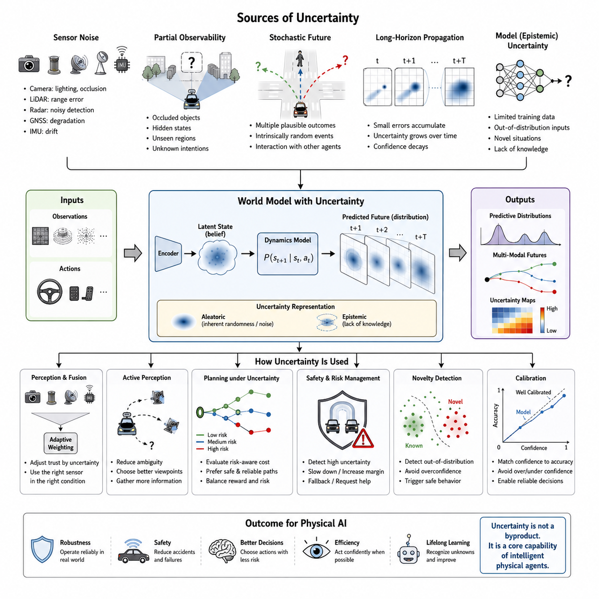{width="7.268055555555556in" height="7.268055555555556in"}

물리 인공지능(Physical AI)은 부분적으로만 관측할 수 있고(partially observable), 지속적으로 변화하며, 잡음(noise), 모호성(ambiguity), 예측하기 어려운 상호작용의 영향을 받는 환경에서 작동한다. 따라서 월드 모델(world model)은 추정된 모든 상태(state)나 예측된 미래를 동일하게 신뢰할 수 있다고 가정해서는 안 된다. 불확실성(uncertainty)은 모델이 무엇을 알지 못하는지를 표현함으로써, 하나의 미래를 의심할 수 없는 사실처럼 제시하는 대신 예측의 신뢰도(confidence), 모호성, 가능한 대안들을 함께 나타낼 수 있게 한다.

이러한 요구는 에이전트(agent)가 관측(observation)으로부터 내부 표현(internal representation)을 구성하고 이를 이용해 미래 상태를 예측하며, 계획(planning)을 지원하고 행동(action)을 선택하는 월드 모델의 전체 구조에서 자연스럽게 도출된다. 따라서 불확실성 장에서는 결정론적 및 확률적 예측(deterministic and probabilistic prediction)을 확장하여 예측 신뢰성(prediction reliability), 미래 분포(future distribution), 신규성(novelty), 보정(calibration), 위험 인지 계획(risk-aware planning)에 대한 명시적 추론을 다룬다.

센서(sensor)는 불확실성의 근본적인 원인 가운데 하나이다. 카메라(camera)는 조명, 가림(occlusion), 모션 블러(motion blur), 날씨의 영향을 받고, 라이다(LiDAR)는 거리 및 반사 측정 오차를 포함하며, 레이더(radar)는 잡음이 포함된 검출 결과를 생성한다. 위성항법시스템(GNSS)은 성능이 저하되거나 신호가 사라질 수 있으며, 관성 측정(inertial measurement)은 시간이 지나면서 드리프트(drift)가 누적된다. 여러 모달리티(modality)를 융합하더라도 결과적인 세계 표현(world representation)은 물리적 현실을 완벽하게 복원한 것이 아니라 하나의 추정치이다.

부분 관측성(partial observability)은 또 다른 중요한 형태의 불확실성을 만든다. 로봇(robot)은 자신의 미래에 영향을 미치는 모든 요소를 직접 관측할 수 없다. 물체가 장애물 뒤에 가려질 수 있고, 보이지 않는 영역에서 보행자가 나타날 수 있으며, 지형 특성이 시각적으로 드러나지 않을 수도 있고, 다른 에이전트(agent)의 의도를 알 수 없을 수도 있다. 따라서 월드 모델은 숨겨진 상태(hidden state)에 대한 믿음(belief)을 유지하면서 관측된 증거와 추론되거나 예측된 정보를 구분해야 한다.

미래의 물리적 상태는 동일한 현재 상황에서도 여러 결과가 발생할 수 있기 때문에 본질적으로 불확실하다. 횡단보도에 접근하는 보행자는 멈추거나, 계속 걷거나, 방향을 바꾸거나, 도로에 진입할 수 있다. 다른 로봇은 가속하거나 양보할 수 있으며, 조작 중인 물체는 안정적으로 유지되거나 미끄러질 수 있다. 가장 가능성이 높은 하나의 궤적(trajectory)만 예측하면 발생 확률은 낮지만 안전에 큰 영향을 미칠 수 있는 대안적 미래를 놓칠 수 있다.

불확실성은 예측 지평(prediction horizon)이 길어질수록 더욱 중요해진다. 추정된 위치, 속도, 물체 상태, 행동 효과(action effect), 환경 동역학(environmental dynamics)의 작은 오차가 반복적인 상태 전이(state transition)를 통해 전파된다. 1초 후에는 매우 신뢰할 수 있는 예측이라도 몇 초 뒤에는 훨씬 불확실해질 수 있다. 따라서 장기 예측 월드 모델(long-horizon world model)은 예측 상태뿐 아니라 롤아웃(rollout)이 진행되면서 신뢰도가 어떻게 변화하는지도 표현해야 한다.

모델 자체도 학습 경험(training experience)이 불완전하기 때문에 불확실할 수 있다. 주로 창고 환경에서 학습한 로봇이 익숙하지 않은 실외 지형, 특이한 기계 장비, 새로운 물체 형상(object geometry), 학습 데이터에 충분히 포함되지 않았던 환경 조건을 만날 수 있다. 이러한 상황에서도 수치적인 예측은 생성될 수 있지만, 모델이 이를 뒷받침할 충분한 근거를 가지고 있지 않을 수 있다. 이러한 지식 부족(lack of knowledge)을 인식하는 능력은 강건한 배치(robust deployment)를 위해 필수적이다.

이러한 차이는 월드 모델에서 우연적 불확실성(aleatoric uncertainty)과 인식론적 불확실성(epistemic uncertainty)을 구분해야 하는 이유가 된다. 우연적 불확실성은 환경 자체의 고유한 변동성이나 측정 잡음에서 발생하는 반면, 인식론적 불확실성은 모델의 불완전한 지식에서 발생한다. 이후 절에서 이 두 범주를 직접적으로 다루지만, 실질적인 중요성은 서로 다른 원인의 불확실성이 항상 동일한 시스템 반응(system response)을 만들어서는 안 된다는 원칙에서 시작한다.

따라서 유용한 월드 모델은 작업 특성상 필요한 경우 미래 가능성을 단순한 점 추정(point estimate)이 아니라 분포(distribution)로 표현해야 한다. 하나의 물체에 대해 정확한 미래 위치 하나만 예측하는 대신 위치, 궤적, 점유 상태(occupancy state), 의미 클래스(semantic class), 잠재 상태(latent state)에 대한 확률 분포(probability distribution)를 추정할 수 있다. 이러한 표현은 모호성을 보존하고 후속 계획기(planner)가 가능성이 높은 결과와 낮은 결과를 함께 고려할 수 있도록 한다.

다중모드 미래(multimodal future)는 상호작용이 존재하는 환경에서 특히 중요하다. 여러 미래 궤적이 각각 물리적으로 타당할 수 있지만, 이들의 평균은 실제로 가능한 궤적이 아닐 수도 있다. 좌회전 가설과 우회전 가설을 평균하면 두 행동 어느 쪽에도 해당하지 않는 인위적인 직진 궤적이 만들어질 수 있다. 여러 모드(mode)를 표현하면 월드 모델이 서로 다른 가설을 유지하면서 동일한 장면에서 발생할 수 있는 대안적 상황을 고려하여 계획할 수 있다.

불확실성은 또한 지각(perception)과 의사결정(decision making)을 연결한다. 계획기는 높은 신뢰도로 비어 있다고 예측된 영역과 점유 여부가 불확실한 영역을 서로 다르게 취급해야 한다. 마찬가지로 중간 정도의 확률로 예측되는 충돌은 높은 확률로 예측되는 무해한 움직임보다 더 큰 주의가 필요할 수 있다. 따라서 예측 상태, 확률(probability), 신뢰도(confidence), 잠재적 결과(consequence)를 함께 고려할 수 있을 때 월드 모델의 출력은 더욱 유용해진다.

이 원칙은 안전 필수 물리 인공지능(safety-critical Physical AI)에서 특히 중요하다. 자율주행차(autonomous vehicle), 자율이동로봇(AMR), 4족 로봇(quadruped), 매니퓰레이터(manipulator), 휴머노이드(humanoid)는 물리적 하드웨어를 통해 행동하기 때문에 예측 오류가 충돌, 불안정성, 장비 손상 또는 사람의 부상으로 이어질 수 있다. 불확실성이 허용 가능한 수준을 넘으면 시스템은 속도를 낮추고, 안전거리를 증가시키고, 추가 관측을 수행하거나, 보수적인 궤적을 선택하고, 지원을 요청하거나, 안전 상태(safe state)로 전환할 수 있다.

불확실성은 능동 지각(active perception)을 유도할 수도 있다. 환경에 대한 여러 해석이 여전히 가능하다면 로봇은 위험한 동작을 수행하기 전에 모호성을 줄이는 행동을 선택할 수 있다. 관측 시점(viewpoint)을 변경하거나, 센서 위치를 조정하거나, 더 천천히 접근하거나, 추가 관측을 기다리거나, 다른 각도에서 물체를 검사할 수 있다. 따라서 월드 모델은 불확실한 상황에서의 예측뿐 아니라 더 나은 정보를 획득하기 위한 행동까지 지원한다.

다중모달 월드 모델(multimodal world model)에서 불확실성은 특정 센서의 신뢰도를 낮춰야 하는 시점을 나타낼 수 있다. 어두운 환경에서는 카메라의 신뢰도가 떨어지는 반면 레이더는 여전히 유용할 수 있고, 라이다 성능은 불리한 환경 조건에서 저하될 수 있으며, 위성항법시스템(GNSS)은 구조물 주변에서 불안정해질 수 있다. 고유수용감각(proprioception)은 외부 센서가 제공하지 못하는 정보를 제공할 수도 있다. 불확실성 인지 융합(uncertainty-aware fusion)은 센서의 신뢰도가 항상 일정하다고 가정하지 않고 각 모달리티의 기여도를 적응적으로 조절할 수 있다.

새로운 상황(novel situation)은 불확실성 추정(uncertainty estimation)의 가치를 더욱 높인다. 분포 외 입력(out-of-distribution input)은 월드 모델 학습에 사용된 데이터와 크게 다를 수 있지만, 기존 신경망(neural network)은 여전히 높은 신뢰도를 가진 것처럼 보이는 출력을 생성할 수 있다. 신규성(novelty) 또는 증가한 인식론적 불확실성을 탐지하면 정상적인 예측을 신뢰해서는 안 되는 상황을 인식하고, 대체 동작(fallback behavior), 추가 연산(additional computation), 사람의 감독(human supervision)이 필요한 시점을 판단할 수 있다.

불확실성은 또한 보정(calibration)되어야 한다. 모델이 90퍼센트의 신뢰도를 보고한다면 해당 신뢰도 추정이 적용되는 조건에서 실제로 약 90퍼센트의 정확도를 보여야 한다. 높은 예측 정확도(predictive accuracy)만으로 의미 있는 신뢰도를 보장할 수는 없다. 잘못된 보정(poor calibration)은 위험한 과신(overconfidence)이나 불필요하게 보수적인 행동을 유발할 수 있으므로 보정 평가(calibration evaluation)는 월드 모델 검증(world-model validation)의 중요한 구성 요소가 된다.

계획 관점에서 불확실성은 단순한 예측을 위험 인지 추론(risk-aware reasoning)으로 변화시킨다. 후보 행동(candidate action)은 기대 결과(expected outcome)뿐 아니라 가능한 결과의 범위와 발생 확률에 따라서도 평가될 수 있다. 불확실성이 낮은 약간 긴 궤적이 관측이 불충분한 영역을 통과하는 짧은 궤적보다 더 바람직할 수 있다. 따라서 계획은 효율성(efficiency), 보상(reward), 불확실성, 물리적 위험(physical risk)을 함께 균형 있게 고려할 수 있다.

불확실성 전파(uncertainty propagation)는 즉각적인 지각과 장기 의사결정을 연결한다. 월드 모델이 미래 상태의 연속적인 시퀀스(sequence)를 상상하면서 관측, 숨겨진 변수(hidden variable), 학습된 동역학(learned dynamics), 미래 상호작용에 관련된 불확실성은 누적되거나 서로 다른 가설로 분기될 수 있다. 이러한 변화를 추적하면 먼 미래의 예측을 현재 센서 증거에 의해 강하게 뒷받침되는 상태와 동일한 신뢰도로 취급하는 문제를 방지할 수 있다.

따라서 물리 인공지능에서 불확실성은 예측 이후에 추가되는 선택적인 통계적 주석(statistical annotation)이 아니다. 불확실성은 지능적인 물리 행동(intelligent physical behavior)에 필요한 내부 세계 표현(internal world representation)의 일부이다. 유능한 에이전트는 세계에 대해 무엇을 믿고 있는지, 어떤 미래를 가능하다고 판단하는지, 그러한 믿음이 얼마나 신뢰할 수 있는지, 그리고 어느 지점에서 자신의 지식이 확신 있는 행동을 수행하기에 부족해지는지를 표현할 수 있어야 한다.

궁극적인 목표는 불확실성을 제거하는 것이 아니다. 실제 물리 환경(real physical environment)은 완벽하게 예측 가능하도록 만들 수 없기 때문이다. 목표는 불확실성을 추정하고, 월드 모델을 통해 이를 전파하며, 현실에 맞게 보정하고, 지각, 예측, 계획, 제어(control)에 활용하는 것이다. 이러한 관점은 이후 다루게 될 확률적 예측 분포(probabilistic predictive distribution), 앙상블(ensemble), 베이지안 접근법(Bayesian approach), 다중모드 미래(multimodal future), 신규성 탐지(novelty detection), 불확실성 인지 계획(uncertainty-aware planning)의 개념적 기반을 제공한다.

## 12.02. Aleatoric and Epistemic Uncertainty

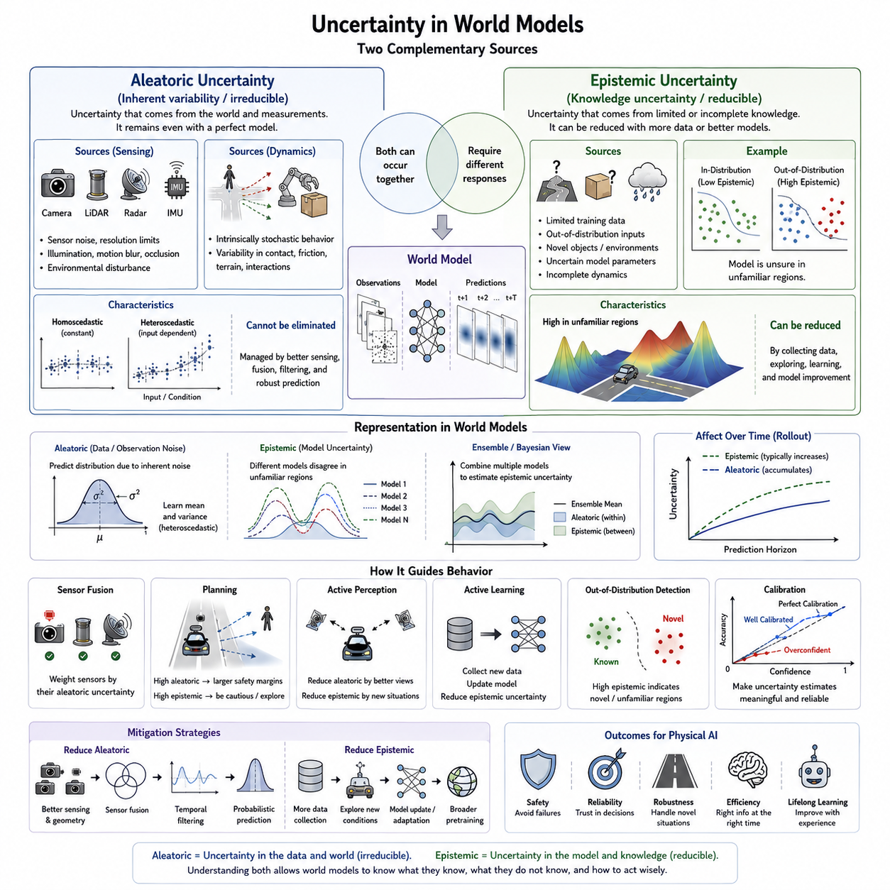{width="7.268055555555556in" height="7.268055555555556in"}

월드 모델(world model)의 불확실성(uncertainty)은 하나의 메커니즘에서만 발생하는 것이 아니다. 일반적으로 근본적으로 다른 두 가지 원인인 우연적 불확실성(aleatoric uncertainty)과 인식론적 불확실성(epistemic uncertainty)으로 구분한다. 우연적 불확실성은 관측과 물리적 과정에 내재된 변동성이나 모호성을 나타내며, 인식론적 불확실성은 모델의 지식 자체에 존재하는 불확실성을 의미한다. 이 둘을 구분하면 물리 인공지능(Physical AI) 시스템은 예측이 왜 불확실한지 이해하고 그에 적절하게 대응할 수 있다.

우연적 불확실성(aleatoric uncertainty)은 동일한 기본 물리 상황에서도 서로 다른 측정값이나 결과가 발생할 수 있을 때 나타난다. 센서 잡음(sensor noise), 불완전한 해상도, 환경 교란, 모호한 관측, 본질적으로 확률적인 상호작용 등이 이러한 불확실성에 기여한다. 완벽하게 학습된 모델이라 하더라도 이를 완전히 제거할 수는 없다. 불확실성의 일부가 학습된 지식의 결함이 아니라 환경이나 측정 과정 자체에 존재하기 때문이다.

로봇이 카메라(camera), 라이다(LiDAR), 레이더(radar), 관성 센서(inertial sensor)를 통해 물체를 관측하는 상황을 생각할 수 있다. 카메라 측정값은 조명이나 모션 블러(motion blur)에 따라 달라질 수 있고, 라이다 반사값은 표면 반사율에 따라 변동하며, 레이더 측정값에는 검출 잡음이 포함될 수 있다. 이러한 변동은 모델이 유사한 상황을 여러 번 경험했더라도 남아 있다. 따라서 월드 모델은 모든 관측이 정확한 물리 상태에 대응한다고 가정하기보다 측정 신뢰도(measurement reliability)를 표현해야 한다.

우연적 불확실성은 미래 동역학(future dynamics)에서도 나타날 수 있다. 도로 주변에 서 있는 보행자는 현재 장면이 정확하게 관측되더라도 앞으로 걷거나, 멈추거나, 방향을 바꿀 수 있다. 로봇 그리퍼(robot gripper)와 물체 사이의 접촉에서도 마찰(friction), 순응성(compliance), 표면 변화 때문에 조금씩 다른 움직임이 발생할 수 있다. 이러한 결과는 물리 과정과 상호작용에 실제로 존재하는 변동성을 반영하므로 하나의 결정론적 예측(deterministic prediction)보다 가능한 미래에 대한 분포(distribution)가 더 적절하다.

우연적 불확실성은 개념적으로 등분산 불확실성(homoscedastic uncertainty)과 이분산 불확실성(heteroscedastic uncertainty)으로 구분하기도 한다. 등분산 불확실성은 관측에 관계없이 대략 일정하게 유지되는 반면, 이분산 불확실성은 입력이나 환경 조건에 따라 달라진다. 물리 인공지능은 조명, 거리, 지형, 날씨, 물체 가시성, 속도, 상호작용 복잡도 등에 따라 센서와 예측 품질이 달라지기 때문에 이분산 불확실성을 자주 접하게 된다.

인식론적 불확실성(epistemic uncertainty)은 다른 원인에서 발생한다. 이는 학습된 모델이 세계에 대해 알고 있는 지식의 한계를 나타낸다. 부족한 학습 데이터(training data), 불완전한 운용 조건 범위, 익숙하지 않은 물체, 새로운 환경, 불확실한 모델 매개변수(model parameter), 불충분하게 학습된 동역학 등이 인식론적 불확실성을 증가시킬 수 있다. 제거하기 어려운 환경 자체의 무작위성과 달리, 이러한 불확실성은 시스템이 추가적인 대표 데이터를 확보하거나 모델을 개선하면 잠재적으로 감소할 수 있다.

예를 들어 창고 로봇(warehouse robot)은 매끄러운 실내 바닥에 대해서는 매우 신뢰성 높은 동역학을 학습했지만 진흙, 자갈, 눈 또는 급경사의 실외 지형에 대한 경험은 거의 없을 수 있다. 따라서 익숙한 창고 환경에서 이루어지는 예측은 낮은 인식론적 불확실성을 가지는 반면, 익숙하지 않은 지형에서의 예측은 훨씬 높은 인식론적 불확실성을 가져야 한다. 이러한 차이는 단순한 센서 잡음이 아니라 모델이 축적한 경험의 차이를 반영한다.

이러한 구분은 특히 분포 외(out-of-distribution) 상황에서 중요해진다. 신경망 모델(neural model)은 관측이 학습 분포(training distribution)에서 크게 벗어나더라도 수치적으로 정밀해 보이는 출력을 생성할 수 있다. 인식론적 불확실성을 추정하지 않으면 월드 모델은 학습된 표현이나 동역학을 신뢰할 수 없는 영역에서도 높은 확신을 가진 것처럼 보일 수 있다. 이러한 불확실성을 인식하면 물리 인공지능 시스템은 익숙한 운용 상황과 추가적인 주의가 필요한 상황을 구별할 수 있다.

두 가지 유형의 불확실성은 동시에 발생할 수도 있다. 폭우 속을 주행하는 로봇은 카메라와 라이다의 측정 잡음 증가로 인해 더 높은 우연적 불확실성을 경험할 수 있다. 동시에 모델이 폭우 환경에서 거의 학습되지 않았다면 인식론적 불확실성 역시 증가할 수 있다. 따라서 유용한 월드 모델은 모든 불확실성을 하나의 구분되지 않은 신뢰도 값으로 해석하지 않고, 가능한 경우 여러 원인을 구별해야 한다.

두 불확실성의 차이는 서로 다른 완화 전략(mitigation strategy)이 필요하다는 점도 보여준다. 우연적 불확실성은 센서 융합(sensor fusion), 시간적 필터링(temporal filtering), 반복 관측, 향상된 센싱 기하구조(sensing geometry), 확률적 예측(probabilistic prediction), 강건한 계획(robust planning)을 통해 관리할 수 있다. 인식론적 불확실성은 추가 학습 데이터, 능동 학습(active learning), 도메인 적응(domain adaptation), 모델 업데이트(model update), 광범위한 사전학습(pretraining), 익숙하지 않은 운용 조건에 대한 표적 탐색(targeted exploration) 등을 통해 줄일 수 있다. 적절한 대응 방법은 불확실성이 발생한 원인에 따라 달라진다.

다중모달 센싱(multimodal sensing)은 이를 보여주는 실용적인 사례이다. 어두운 환경에서 카메라의 신뢰성이 떨어지면 우연적 불확실성이 증가할 수 있지만 레이더나 라이다는 여전히 유용한 정보를 제공할 수 있다. 융합 메커니즘(fusion mechanism)은 카메라의 기여도를 낮추고 다른 모달리티(modality)에 더 크게 의존할 수 있다. 반면 모든 센서가 완전히 새로운 물체나 환경을 관측한다면 문제는 공유 세계 표현(shared world representation) 자체의 인식론적 불확실성과 관련될 수 있다.

월드 모델은 이러한 불확실성을 여러 형태로 표현할 수 있다. 예측 네트워크(prediction network)는 상태 변수에 대해 평균(mean)과 분산(variance)을 함께 추정하여 관측에 따라 변화하는 우연적 불확실성을 학습할 수 있다. 인식론적 불확실성은 앙상블(ensemble), 베이지안 접근법(Bayesian approach), 확률적 매개변수 표현(stochastic parameter representation), 독립적으로 학습된 모델 사이의 불일치(disagreement) 또는 학습된 예측 함수의 불확실성을 드러내는 관련 기법을 통해 근사할 수 있다.

모델 앙상블(model ensemble)은 이러한 차이를 직관적으로 보여준다. 유사한 데이터로 학습된 여러 모델은 익숙한 입력에 대해서는 비슷한 예측을 생성하지만 익숙하지 않은 상황에서는 서로 크게 다른 예측을 생성할 수 있다. 이러한 모델 간 불일치는 인식론적 불확실성의 지표로 활용할 수 있다. 반면 여러 모델이 하나의 관측이나 미래 상태가 넓은 확률 분포를 가진다는 점에는 동의한다면 남아 있는 모호성은 주로 물리 과정 자체에 내재된 우연적 불확실성을 반영할 수 있다.

이러한 구분은 장기 월드 모델 롤아웃(long-horizon world-model rollout)에서 특히 유용하다. 미래의 물리적 사건에는 실제 무작위성과 여러 분기 가능성이 존재하므로 우연적 불확실성이 누적될 수 있다. 동시에 예측된 상태가 학습 데이터에 충분히 표현된 영역에서 점차 멀어지면서 인식론적 불확실성도 증가할 수 있다. 따라서 먼 미래의 예측 불확실성은 확장되는 환경적 가능성과 모델 자체의 신뢰도 감소가 동시에 만들어낼 수 있다.

계획(planning) 과정에서도 두 유형의 불확실성은 행동에 서로 다른 영향을 미친다. 높은 우연적 불확실성은 본질적으로 예측하기 어려운 에이전트나 사건 주변에서 계획기가 더 큰 안전 여유(safety margin)를 유지하도록 만들 수 있다. 반면 높은 인식론적 불확실성은 정보 수집, 느린 탐색, 대체 동작(fallback behavior), 익숙하지 않은 영역의 회피를 유도할 수 있다. 따라서 계획기는 결과가 얼마나 불확실한지뿐 아니라 그 불확실성이 왜 존재하는지도 고려할 수 있다.

이러한 구분은 능동 지각(active perception)과 능동 학습(active learning)도 지원한다. 불확실성이 주로 모호한 관측에서 발생한다면 관측 시점(viewpoint)을 변경하거나 추가 센서 측정값을 획득하여 이를 줄일 수 있다. 반면 불확실성이 학습된 지식의 부족에서 발생한다면 동일한 익숙한 증거를 반복해서 관측하는 것만으로는 큰 도움이 되지 않을 수 있다. 신뢰할 수 있는 예측을 위해 탐색(exploration), 새로운 학습 사례, 모델 적응(model adaptation), 외부 정보가 필요할 수 있다.

보정(calibration)은 두 범주의 불확실성 모두에서 필수적이다. 추정된 불확실성은 실제로 관측되는 예측 오류 및 발생 빈도와 의미 있게 대응해야 한다. 지속적으로 불확실성을 과소평가하는 시스템은 과신(overconfidence)하게 되고, 반대로 지속적으로 과대평가하는 시스템은 불필요하게 보수적으로 행동한다. 신뢰할 수 있는 보정은 후속 계획과 안전 메커니즘(safety mechanism)이 다양한 운용 조건에서 예측 확률과 신뢰도 값을 일관되게 해석할 수 있도록 한다.

따라서 물리 인공지능에서 우연적 불확실성과 인식론적 불확실성은 월드 모델이 무엇을 알지 못하는지를 상호 보완적으로 설명한다. 우연적 불확실성은 센싱, 상호작용, 미래 변화에 내재된 제거하기 어려운 모호성을 표현하며, 인식론적 불확실성은 경험을 통해 개선될 수 있는 불완전한 학습 지식을 표현한다. 두 불확실성을 분리하면 하나의 일반적인 신뢰도 점수보다 훨씬 풍부한 내부 표현(internal representation)을 구성할 수 있다.

성숙한 불확실성 인지 월드 모델(uncertainty-aware world model)은 궁극적으로 무엇이 발생할 가능성이 높은지를 예측하는 것뿐 아니라, 그 예측이 얼마나 불확실한지, 어떤 유형의 불확실성이 지배적인지, 추가적인 센싱이나 학습을 통해 이를 줄일 수 있는지까지 판단할 수 있어야 한다. 이러한 분해는 이후 다루게 될 확률적 예측 분포(probabilistic predictive distribution), 앙상블과 베이지안 방법(ensemble and Bayesian methods), 다중모드 미래 모델링(multimodal future modeling), 불확실성 전파(uncertainty propagation), 신규성 탐지(novelty detection), 보정, 불확실성 인지 계획(uncertainty-aware planning)의 개념적 기반을 제공한다.

## 12.03. Probabilistic Predictive Distributions

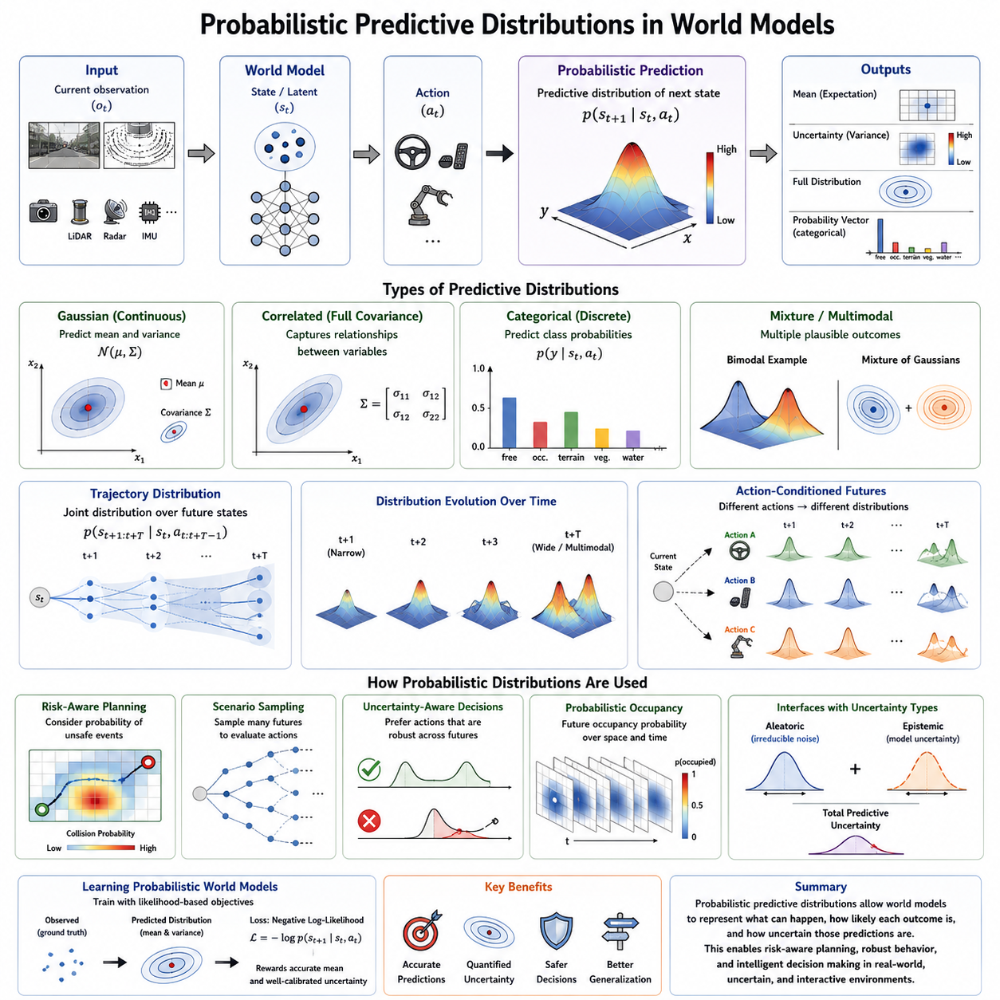{width="7.268055555555556in" height="7.268055555555556in"}

확률적 예측 분포(probabilistic predictive distribution)는 미래를 하나의 추정 상태로 표현하는 것이 아니라 가능한 상태들에 대한 확률 분포(probability distribution)로 표현한다. 월드 모델(world model)에서는 이를 (p(s_{t+1}\\mid s_t,a_t))로 나타낼 수 있으며, 더 일반적으로는 현재 관측(observation), 잠재 상태(latent state), 행동(action)을 조건으로 하는 미래 궤적(future trajectory)의 분포를 예측한다. 이 분포는 모델이 무엇이 발생할 것으로 예상하는지뿐 아니라 그 예상이 얼마나 불확실한지도 함께 표현한다.

이러한 정식화는 전이 모델(transition model)이 (\\hat{s}_{t+1}=f(s_t,a_t))와 같이 하나의 다음 상태를 생성하는 결정론적 월드 모델링(deterministic world modeling)을 확장한 것이다. 동역학(dynamics)이 매우 예측 가능한 경우에는 결정론적 추정만으로 충분할 수 있지만, 물리 환경에는 센서 잡음(sensor noise), 숨겨진 변수(hidden variable), 확률적 상호작용(stochastic interaction), 여러 개의 가능한 결과가 자주 존재한다. 확률적 모델(probabilistic model)은 이러한 가능성을 너무 일찍 하나의 예측으로 축소하지 않고 유지한다.

단순한 예측 분포는 잘 알려진 확률 분포군(probability family)을 이용하여 매개변수화(parameterization)할 수 있다. 연속 상태 변수(continuous state variable)의 경우 모델은 가우시안 분포(Gaussian distribution)의 평균(mean) (\\mu)와 분산(variance) (\\sigma\^2)을 예측할 수 있다. 평균은 기대 상태(expected state)를 나타내고 분산은 예측의 퍼짐 정도(predictive spread)를 표현한다. 따라서 물체가 하나의 정확한 위치에 존재할 것이라고 예측하는 대신 미래 위치가 어느 영역에 어느 정도의 확률로 존재할지를 나타낼 수 있다.

분포는 현재 상황에 직접적으로 의존할 수 있다. 여러 센서가 명확하게 관측한 가까운 정지 물체는 좁은 예측 분포를 가질 수 있지만, 멀리 떨어져 부분적으로 가려진 보행자는 훨씬 넓은 분포를 가질 수 있다. 이러한 입력 의존적 분산(input-dependent variance)은 가시성, 센서 품질, 환경 조건, 상호작용 복잡도, 예측 지평(prediction horizon)에 따라 예측 품질이 지속적으로 변화하는 물리 인공지능(Physical AI)에서 특히 중요하다.

확률 분포는 월드 상태(world state)의 다양한 구성 요소에 대해 정의할 수 있다. 모델은 위치(position), 속도(velocity), 자세(orientation), 가속도(acceleration), 점유 상태(occupancy), 의미 클래스(semantic class), 접촉 상태(contact state), 지형 특성(terrain property), 잠재 변수(latent variable)에 대한 분포를 예측할 수 있다. 서로 다른 표현에는 서로 다른 확률 모델이 필요하지만, 가능한 대안과 그 상대적인 가능성에 대한 정보를 월드 모델의 출력에 유지한다는 핵심 개념은 동일하다.

다차원 연속 상태(multidimensional continuous state)에서는 변수 사이의 상관관계(correlation)도 중요할 수 있다. 예를 들어 위치 오차와 속도 오차는 서로 독립적이지 않을 수 있다. 공분산 행렬(covariance matrix)은 개별 차원의 불확실성과 차원 사이의 관계를 함께 표현할 수 있다. 이러한 구조화된 분포(structured distribution)는 독립적인 스칼라 분산보다 풍부한 정보를 제공하며 궤적, 물체 움직임, 로봇 동역학, 공간 예측과 관련된 불확실성을 더욱 효과적으로 표현할 수 있다.

범주형 예측(categorical prediction)은 또 다른 형태의 예측 분포를 자연스럽게 구성한다. 특정 영역이 자유 공간(free space), 점유 공간(occupied space), 주행 가능 지형(traversable terrain), 식생(vegetation), 물(water) 또는 다른 의미 범주일 확률을 각각 가질 수 있다. 월드 모델은 가장 높은 확률의 클래스 하나를 즉시 선택하는 대신 전체 확률 벡터(probability vector)를 유지할 수 있다. 이를 통해 계획기(planner)는 높은 확신을 가진 분류와 모호한 증거에서 생성된 분류를 구별할 수 있다.

확률적 점유(probabilistic occupancy)는 충돌 회피(collision avoidance)가 미래 공간이 점유될 가능성에 의존하기 때문에 특히 유용하다. 월드 모델은 단순히 자유 또는 점유라는 이진 예측(binary prediction)을 생성하는 대신 공간 셀(cell), 복셀(voxel), 연속 위치(continuous location)에 점유 확률을 할당할 수 있다. 이러한 분포를 시간 방향으로 확장하면 위험 인지 내비게이션(risk-aware navigation)과 동작 계획(motion planning)에 직접 활용할 수 있는 확률적 미래 점유(probabilistic future occupancy)를 구성할 수 있다.

예측 분포는 우연적 불확실성(aleatoric uncertainty)을 자연스럽게 표현하는 방법도 제공한다. 관측에 잡음이 존재하거나 미래의 물리적 사건에 본질적인 변동성이 포함된 경우, 충분히 학습된 모델에서도 예측 분포는 넓게 유지될 수 있다. 이러한 분포의 매개변수를 학습하면 모든 학습 사례를 비현실적으로 정밀한 결정론적 목표(deterministic target)에 맞추는 대신 제거하기 어려운 모호성을 명시적으로 표현할 수 있다.

인식론적 불확실성(epistemic uncertainty) 역시 전체 예측 분포에 영향을 줄 수 있다. 앙상블(ensemble), 베이지안 근사(Bayesian approximation), 확률적 모델(stochastic model)은 학습된 모델 자체가 불확실하기 때문에 서로 다른 예측 분포를 생성할 수 있다. 따라서 전체 예측 불확실성(total predictive uncertainty)은 각 모델이 생성하는 분포 내부의 변동과 모델들 사이에서 발생하는 변동을 모두 포함할 수 있다. 이는 확률적 예측을 우연적 불확실성과 인식론적 불확실성의 구분과 직접적으로 연결한다.

확률적 월드 모델(probabilistic world model)을 학습하려면 단순히 점 단위 오차(pointwise error)를 줄이는 것이 아니라 정확한 확률을 할당하도록 유도하는 목적 함수(objective)가 필요하다. 음의 로그 가능도(negative log-likelihood)는 대표적인 원리로, 실제 발생한 상태에 높은 확률을 할당하도록 모델을 유도하는 동시에 위치가 잘못되거나 분산 크기가 부적절한 분포에는 불이익을 준다. 따라서 예측의 중심 경향(central tendency)과 추정된 불확실성이 모두 학습 과정에서 중요해진다.

모델은 단순히 예측 분산을 크게 만드는 것만으로 좋은 불확실성 추정값을 얻을 수 없다. 지나치게 넓은 분포는 많은 결과를 포함할 수 있지만 유용한 정보는 거의 제공하지 못한다. 따라서 확률적 학습(probabilistic training)은 정확성(accuracy)과 예리성(sharpness)의 균형을 맞춰야 한다. 예측은 실제 관측 결과에 충분한 확률을 부여하면서도 증거가 허용하는 범위 내에서 최대한 집중되어야 한다. 이러한 균형은 불확실성 보정(uncertainty calibration) 및 적절한 확률적 점수화(proper probabilistic scoring)와 밀접하게 관련된다.

가우시안과 같은 단일 분포군(single-family distribution)은 편리하지만 미래에 서로 구별되는 여러 가능성이 존재할 경우 충분하지 않을 수 있다. 보행자가 왼쪽 또는 오른쪽으로 방향을 바꿀 수 있고, 다른 에이전트와 상호작용하는 로봇은 진행하거나 양보할 수 있다. 하나의 가우시안 분포는 이러한 가능성 사이에 확률을 배치하여 현실적으로 존재하지 않는 평균적인 상태를 표현할 수 있다. 혼합 분포(mixture distribution) 또는 다른 다중모드 표현(multimodal representation)은 서로 다른 미래 가설을 개별적으로 유지할 수 있다.

동일한 원리는 단일 단계 예측(one-step prediction)에서 전체 궤적 예측으로 확장된다. 월드 모델은 (t+1,t+2,\\ldots,t+T) 시점의 분포를 서로 독립적으로 예측하는 대신 미래 상태 시퀀스(future state sequence)에 대한 결합 분포(joint distribution)를 표현할 수 있다. 미래 상태들은 시간적으로 서로 의존하기 때문에 이러한 표현이 중요하다. 초기 시점의 특정 결정이나 움직임은 이후 롤아웃(rollout)에서 어떤 궤적이 물리적으로 가능한지를 제약한다.

예측이 더 먼 미래로 진행될수록 분포는 일반적으로 넓어지거나, 이동하거나, 여러 모드(mode)로 분기된다. 센서 불확실성, 알려지지 않은 변수, 확률적 사건, 상호작용에 따른 선택, 누적되는 모델 오차가 모두 이러한 변화에 영향을 미친다. 따라서 확률적 롤아웃(probabilistic rollout)은 단순히 증가하는 오차 범위(error bar)를 표현하는 것이 아니라 시간이 흐르면서 구조가 점차 복잡해질 수 있는 미래 가능성의 변화하는 지형을 표현한다.

행동 조건부 예측 분포(action-conditioned predictive distribution)는 계획을 위해 필수적이다. 모델은 (p(s_{t+1:t+T}\\mid s_t,a_{t:t+T-1}))와 같이 서로 다른 후보 행동(candidate action)이 미래 상태의 확률을 어떻게 변화시키는지 추정한다. 계획기는 행동의 기대 결과뿐 아니라 충돌 확률(collision probability), 불확실성, 변동성, 제약 조건 위반(constraint violation), 발생 확률은 낮지만 결과가 심각한 사건까지 고려하여 후보 행동을 비교할 수 있다.

샘플링(sampling)은 이러한 분포를 활용하는 실용적인 방법 가운데 하나이다. 계획기는 각각의 후보 행동 시퀀스(candidate action sequence)에 대해 월드 모델로부터 여러 개의 가상 미래(imagined future)를 생성하고 그에 따른 비용(cost)이나 보상(reward)을 평가할 수 있다. 기대 성능은 높지만 결과 분포에 상당한 물리적 위험이 포함된 행동보다 다양한 가능한 미래에서 안정적으로 좋은 성능을 보이는 행동을 우선적으로 선택할 수 있다.

따라서 확률적 예측(probabilistic prediction)은 불확실성 추정(uncertainty estimation)과 의사결정(decision making)을 연결하는 인터페이스(interface)를 형성한다. 월드 모델은 불확실한 관측과 학습된 동역학을 가능한 미래의 분포로 변환하고, 계획기는 이러한 분포를 위험 민감 행동(risk-sensitive action)으로 변환한다. 이러한 관계는 물리 인공지능이 구조화된 환경에서 개방적이고 상호작용적이며 부분적으로 관측 가능한 실제 환경으로 확장될수록 더욱 중요해진다.

유능한 확률적 월드 모델은 궁극적으로 단순히 "다음에 무엇이 발생하는가?"라는 질문에만 답해서는 안 된다. 어떤 결과들이 가능한지, 각각의 결과가 얼마나 발생 가능성이 높은지, 예측 분포가 얼마나 넓게 퍼져 있는지, 이러한 분포가 시간에 따라 어떻게 변화하는지, 후보 행동이 분포를 어떻게 변화시키는지를 추정할 수 있어야 한다. 이러한 기반은 이후 다루게 될 앙상블 및 베이지안 접근법(ensemble and Bayesian approaches), 다중모드 미래 분포(multimodal future distribution), 불확실성 전파(uncertainty propagation), 보정(calibration), 불확실성 인지 계획(uncertainty-aware planning)으로 자연스럽게 이어진다.

## 12.04. Ensembles and Bayesian Approaches

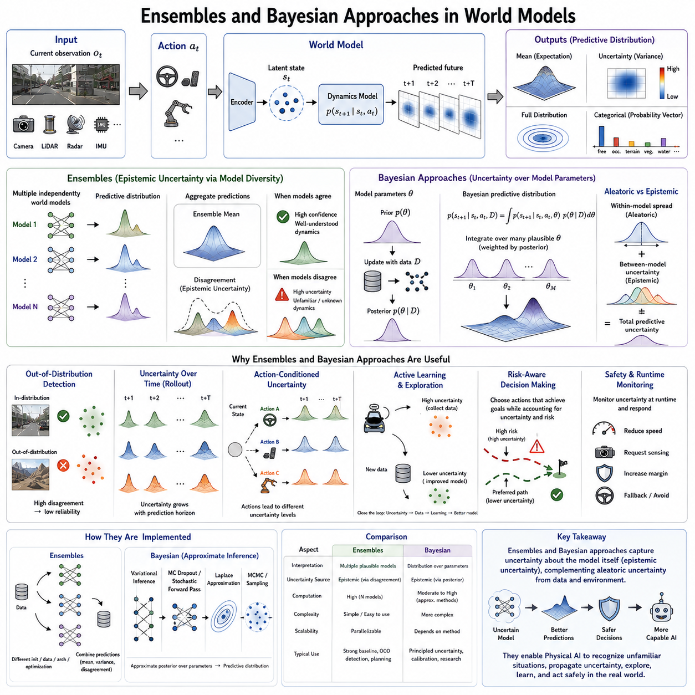{width="7.268055555555556in" height="7.268055555555556in"}

확률적 예측 분포(probabilistic predictive distribution)는 미래 상태의 불확실성을 설명하지만, 월드 모델(world model)은 예측 모델 자체에 대한 불확실성을 추정하는 메커니즘도 필요로 한다. 앙상블(ensemble)과 베이지안 접근법(Bayesian approach)은 이러한 인식론적 불확실성(epistemic uncertainty)을 표현하는 두 가지 주요 전략을 제공한다. 하나의 학습된 매개변수(parameter) 집합이 무조건적으로 정확하다고 가정하는 대신, 사용 가능한 학습 데이터와 일치할 수 있는 여러 모델 또는 매개변수 구성이 존재할 수 있음을 인정한다.

일반적인 신경망 월드 모델(neural world model)은 하나의 매개변수 집합을 학습하고 그 단일 해(solution)를 이용하여 예측을 생성한다. 그러나 제한된 학습 데이터는 물리 동역학(physical dynamics)에 대한 하나의 유일한 모델을 결정하기에 충분하지 않은 경우가 많다. 서로 다른 매개변수 구성들이 익숙한 관측을 동일하게 잘 설명하면서도 익숙하지 않은 상황에서는 크게 다른 예측을 생성할 수 있다. 앙상블과 베이지안 방법은 이러한 모호성을 드러내고 이를 모델 지식(model knowledge)의 불확실성에 대한 정보로 활용한다.

모델 앙상블(model ensemble)은 초기화(initialization), 학습 샘플, 데이터 순서, 아키텍처(architecture), 최적화 과정(optimization history) 등의 차이로 서로 다른 여러 월드 모델을 구성한다. 동일한 상태와 행동이 주어지면 각 앙상블 구성원(member)은 가능한 다음 상태의 분포를 예측한다. 모델들의 예측이 서로 밀접하게 일치하면 시스템은 해당 예측이 충분히 이해된 동역학 영역에 존재한다고 판단할 더 강한 근거를 가진다. 반대로 큰 불일치는 세계가 어떻게 변화할지에 대한 학습 모델의 불확실성이 높음을 나타낸다.

딥 앙상블(deep ensemble)은 독립적으로 학습된 여러 신경망(neural network)을 이용하여 이러한 원리를 구현한다. 각각의 네트워크는 유사한 데이터셋(dataset)으로 학습되더라도 조금씩 다른 표현(representation)과 전이 함수(transition function)를 학습할 수 있다. 이들의 예측을 결합하여 앙상블 평균(ensemble mean)과 예측 분산(predictive variance)을 추정할 수 있다. 평균은 전체 모델의 종합적인 예측을 나타내고, 앙상블 구성원 사이의 불일치는 인식론적 불확실성을 근사하는 실용적인 방법을 제공한다.

우연적 불확실성(aleatoric uncertainty)과 인식론적 불확실성은 하나의 앙상블 안에서 함께 표현될 수 있다. 각 구성원은 관측 잡음이나 환경 자체의 고유한 변동성을 설명하는 확률 분포(probability distribution)를 예측할 수 있으며, 구성원들 사이의 차이는 학습된 지식에 대한 불확실성을 나타낸다. 따라서 전체 예측 불확실성(total predictive uncertainty)은 개별 예측 내부의 불확실성과 서로 다른 모델 사이에서 발생하는 불확실성의 조합으로 해석할 수 있다.

앙상블은 특히 분포 외 탐지(out-of-distribution detection)에 유용하다. 입력이 학습 데이터에 충분히 포함된 상황과 유사하다면 독립적으로 학습된 모델들은 대체로 비슷한 예측을 생성한다. 반대로 로봇이 익숙하지 않은 지형, 물체, 상호작용 또는 동역학을 만나면 모델들의 예측이 서로 달라질 수 있다. 따라서 앙상블 불일치(ensemble disagreement)는 월드 모델이 학습된 지식을 충분히 신뢰하기 어려운 영역에 진입했다는 신호로 활용할 수 있다.

앙상블의 효과는 다양성(diversity)에 크게 의존한다. 모든 구성원이 거의 동일한 함수를 학습한다면 모델 사이의 불일치는 유용한 정보를 거의 제공하지 못한다. 서로 다른 무작위 초기화(random initialization), 부트스트랩 데이터셋(bootstrapped dataset), 학습 경험의 서로 다른 부분집합, 확률적 최적화(stochastic optimization), 아키텍처 변화 등을 통해 다양성을 높일 수 있다. 목표는 임의적인 불일치를 만드는 것이 아니라 사용 가능한 증거에 의해 뒷받침되는 타당한 모델들 사이에서 의미 있는 차이를 확보하는 것이다.

베이지안 접근법(Bayesian approach)은 보다 명시적인 확률적 해석을 제공한다. 모델 매개변수 (\\theta)를 하나의 고정된 값으로 취급하는 대신, 베이지안 모델링(Bayesian modeling)은 확률 분포를 이용하여 매개변수의 불확실성을 표현한다. 학습 과정에서는 사전 분포(prior distribution) (p(\\theta))를 관측 데이터 (D)를 이용해 갱신하여 사후 분포(posterior distribution) (p(\\theta\\mid D))를 생성한다. 이 사후 분포는 학습 이후에도 어떤 매개변수 구성이 여전히 타당한지를 나타낸다.

예측 과정에서는 이러한 사후 불확실성(posterior uncertainty)을 적분하여 고려한다. 개념적으로 베이지안 예측 분포(Bayesian predictive distribution)는 (p(s_{t+1}\\mid s_t,a_t,D)=\\int p(s_{t+1}\\mid s_t,a_t,\\theta)p(\\theta\\mid D)d\\theta)로 표현할 수 있다. 하나의 월드 모델만을 신뢰하는 대신, 사용 가능한 데이터가 얼마나 강하게 뒷받침하는지에 따라 가중된 여러 가능한 매개변수 설정을 예측에 함께 고려한다.

이러한 베이지안 정식화(Bayesian formulation)는 데이터 불확실성(data uncertainty)과 모델 불확실성(model uncertainty)을 자연스럽게 구분한다. 특정 매개변수 설정에 대한 조건부 예측 분포(conditional predictive distribution)는 우연적 변동성을 표현할 수 있고, 사후 분포 전체에 걸친 불확실성은 인식론적 불확실성을 나타낸다. 추가적인 유용한 데이터가 확보되면 사후 분포가 더욱 집중될 수 있으며, 충분한 경험을 확보한 영역에서는 인식론적 불확실성이 감소할 수 있다.

정확한 베이지안 추론(exact Bayesian inference)은 대규모 신경망 월드 모델에서 일반적으로 어렵다. 현대적인 신경망은 수백만 또는 수십억 개의 매개변수를 포함할 수 있기 때문에 완전한 사후 분포를 계산하고 저장하는 것은 현실적으로 어렵다. 따라서 변분 추론(variational inference), 몬테카를로 방법(Monte Carlo method), 확률적 매개변수 근사(stochastic parameter approximation), 라플라스 근사(Laplace approximation) 등 사후 불확실성의 중요한 특성을 근사하는 베이지안 근사 추론(approximate Bayesian inference)이 사용된다.

몬테카를로 드롭아웃(Monte Carlo dropout)은 일부 신경망 아키텍처에서 사용할 수 있는 비교적 가벼운 근사 방법이다. 추론(inference) 과정에서도 드롭아웃(dropout)을 활성화하여 무작위로 샘플링된 서로 다른 부분 네트워크(subnetwork)로부터 여러 예측을 생성한다. 이러한 예측 사이의 변동을 이용하면 각각의 샘플을 위해 완전히 독립된 네트워크를 학습하지 않고도 모델 불확실성을 근사할 수 있다. 이 방법에는 한계가 있지만 반복적인 확률적 추론이 하나의 결정론적 순전파(deterministic forward pass)에 숨겨진 불확실성을 어떻게 드러낼 수 있는지를 보여준다.

앙상블과 베이지안 접근법은 모두 여러 예측을 생성할 수 있지만 그 해석은 서로 다르다. 앙상블은 독립적으로 학습된 유한한 수의 타당한 모델 집합을 나타내는 반면, 베이지안 추론은 모델 매개변수 또는 함수에 대한 확률 분포를 표현하는 것을 목표로 한다. 실제로 딥 앙상블은 개념적으로 단순하고 병렬화(parallelization)가 가능하며 경험적으로 효과적이라는 장점이 있는 반면, 베이지안 접근법은 원리적으로 체계적인 확률적 프레임워크(probabilistic framework)를 제공한다.

앙상블의 주요 단점은 연산 비용(computational cost)이다. 여러 월드 모델을 유지하면 메모리 요구량, 학습 비용, 추론 연산량이 증가한다. 이는 전력(power), 지연시간(latency), 메모리, 열 설계(thermal capacity)에 엄격한 제약이 존재하는 엣지 컴퓨팅 플랫폼(edge computing platform)에서 동작하는 물리 인공지능(Physical AI)에 특히 중요하다. 따라서 실제 시스템에서는 소규모 앙상블, 공유 인코더(shared encoder), 여러 개의 경량 예측 헤드(lightweight prediction head), 또는 필요한 경우에만 선택적으로 불확실성을 추정하는 방식을 사용할 수 있다.

베이지안 접근법 역시 유사한 연산 문제를 가진다. 여러 매개변수 구성을 샘플링하거나 반복적인 확률적 순전파(stochastic forward pass)를 수행하면 실시간 제어(real-time control) 요구사항과 충돌할 수 있다. 따라서 근사 방법은 불확실성 추정 품질과 연산 효율성(computational efficiency) 사이의 균형을 맞춰야 한다. 물리 인공지능 아키텍처는 정상적인 운용 중에는 저비용 불확실성 추정을 사용하고, 신규성(novelty), 위험(risk), 모델 불일치가 임계값을 초과할 때 더 많은 비용이 필요한 추론을 활성화할 수 있다.

시간적 예측(temporal prediction)은 앙상블 불확실성에 또 다른 차원을 추가한다. 짧은 롤아웃(rollout)에서는 서로 다른 모델이 처음에는 유사한 상태를 예측할 수 있지만, 학습된 동역학의 작은 차이가 누적되면서 점차 서로 다른 예측으로 분기될 수 있다. 이러한 분기는 예측 지평(prediction horizon)에 따라 인식론적 불확실성이 어떻게 증가하는지를 보여준다. 앙상블 궤적이 빠르게 분리되는 영역은 장기 계획(long-horizon planning)이 더욱 보수적으로 이루어져야 함을 나타낼 수 있다.

행동 조건부 앙상블(action-conditioned ensemble)은 대안적인 의사결정에 따른 불확실성을 평가할 수 있다. 서로 다른 후보 행동 시퀀스(candidate action sequence)를 여러 모델을 통해 전파하여 가능한 미래 궤적의 집합을 생성한다. 어떤 행동에서는 모든 모델이 미래에 대해 일치할 수 있지만, 다른 행동은 로봇을 충분히 이해되지 않은 동역학 영역으로 이동시켜 예측이 크게 분기될 수 있다. 따라서 계획기(planner)는 유용한 목표를 달성하면서도 모델 신뢰도가 높은 영역에 머무르는 행동을 선호할 수 있다.

이는 불확실성과 탐색(exploration) 사이에 중요한 연결 관계를 만든다. 높은 인식론적 불확실성은 추가적인 경험을 통해 월드 모델을 개선할 수 있는 영역을 나타낼 수 있다. 학습 또는 통제된 운용 과정에서 에이전트(agent)는 능동 학습(active learning)이나 탐색을 통해 이러한 영역의 관측 데이터를 의도적으로 수집할 수 있다. 새로운 데이터는 모델 간 불일치를 감소시키고 미래 예측을 향상시켜 불확실성 추정, 데이터 획득(data acquisition), 학습 사이에 지속적인 순환 구조를 형성한다.

안전 시스템(safety system)은 앙상블 또는 베이지안 불확실성을 런타임 경고 신호(runtime warning signal)로 활용할 수 있다. 예측 불일치가 비정상적으로 높아지면 로봇은 속도를 낮추고, 안전 여유(safety margin)를 증가시키며, 추가 센싱을 요청하거나, 대체 제어기(fallback controller)를 선택하거나, 공격적인 기동을 수행하지 않을 수 있다. 따라서 불확실성은 물리 인공지능 시스템이 물리 환경과 얼마나 적극적으로 상호작용할 것인지를 결정하는 운용 정보(operational information)가 된다.

앙상블이나 베이지안 접근법 자체가 자동으로 보정된 불확실성(calibrated uncertainty)을 보장하는 것은 아니다. 특히 분포 이동(distribution shift)이 발생하면 모델은 여전히 예측 신뢰도를 과소평가하거나 과대평가할 수 있다. 따라서 불확실성 추정값은 보정 지표(calibration metric)와 분포 외 테스트(out-of-distribution test)를 사용하여 실제 예측 오류와 비교 평가해야 한다. 신뢰할 수 있는 시스템 배치를 위해서는 유용한 불확실성 추정 메커니즘뿐 아니라 이러한 추정값이 실제 모델 신뢰성과 대응한다는 증거도 필요하다.

궁극적으로 앙상블과 베이지안 접근법은 관측된 경험을 설명할 수 있는 대안적인 모델들을 월드 모델 내부에 표현하는 방법을 제공한다. 학습된 동역학을 하나의 의심할 수 없는 함수로 취급하는 대신, 그 함수가 어떤 형태여야 하는지에 대한 불확실성을 유지한다. 이를 통해 물리 인공지능 시스템은 익숙하지 않은 상황을 인식하고, 모델 불확실성을 미래 예측으로 전파하며, 학습된 지식의 한계를 반영한 의사결정을 수행할 수 있다.

불확실성 인지 월드 모델링(uncertainty-aware world modeling)에서 이러한 접근법은 확률적 예측(probabilistic prediction)과 지능적인 위험 관리(intelligent risk management)를 연결하는 역할을 한다. 우연적 및 인식론적 불확실성의 분해, 분포 외 탐지, 불확실성 전파(uncertainty propagation), 능동 학습, 보다 안전한 계획을 지원한다. 다중모드 미래 분포(multimodal future distribution) 및 보정(calibration)과 결합하면 월드 모델을 단순히 하나의 답을 생성하는 예측기에서 그 답을 어느 정도까지 신뢰해야 하는지도 이해하는 모델로 발전시킬 수 있다.

## 12.05. Multimodal Future Distributions

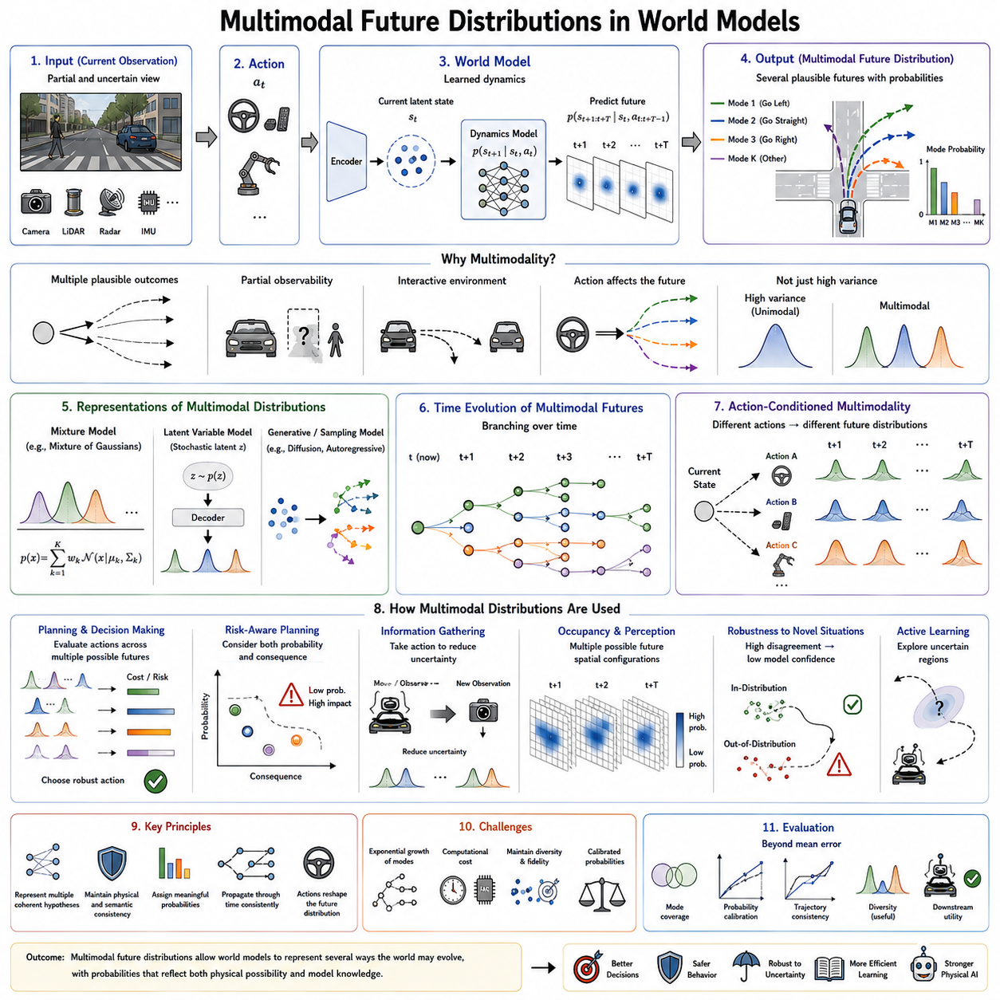{width="7.268055555555556in" height="7.268055555555556in"}

물리 환경(physical environment)은 하나의 가능한 미래만을 향해 변화하는 경우가 드물다. 현재의 세계 상태(world state)를 정확하게 추정하더라도 사람, 로봇, 차량, 물체, 환경 과정(environmental process)이 서로 다르게 행동할 수 있기 때문에 여러 개의 서로 다른 결과가 여전히 가능하다. 다중모드 미래 분포(multimodal future distribution)는 이러한 대안들을 명시적으로 표현하여 월드 모델(world model)이 여러 개의 일관된 가설을 하나의 평균적인 미래로 압축하지 않고 유지할 수 있도록 한다.

다중모드(multimodal)라는 용어는 여러 개의 중요한 모드(mode)를 포함하는 확률 분포(probability distribution)를 의미하며, 각각의 모드는 서로 다른 가능한 결과 또는 결과 집합에 대응한다. 교차로에 접근하는 보행자는 계속 앞으로 이동하거나, 멈추거나, 방향을 바꿀 수 있으며, 다른 차량은 가속하거나, 양보하거나, 차선을 변경할 수 있다. 각각의 가능성은 예측된 미래 분포에서 서로 구별되는 높은 확률 영역을 형성할 수 있다.

이는 단순히 예측 분산(predictive variance)을 증가시키는 것과 근본적으로 다르다. 넓은 단일모드 분포(unimodal distribution)는 하나의 중심 가설 주변에 존재하는 불확실성을 나타내지만, 다중모드 분포는 질적으로 서로 다른 가설들을 표현한다. 두 미래가 물리적으로 의미 있는 서로 다른 대안으로 분리되어 있다면, 그 사이에 하나의 넓은 가우시안 분포(Gaussian distribution)를 배치하는 것은 실제로 가능성이 낮거나 불가능한 중간 상태에 높은 확률을 부여할 수 있다.

장애물 주변에서 왼쪽 또는 오른쪽으로 이동할 수 있는 보행자를 생각해 볼 수 있다. 두 궤적(trajectory)을 평균하면 실제로 가능한 두 미래 가운데 어느 것도 따르지 않고 장애물을 그대로 통과하는 움직임을 예측할 수 있다. 다중모드 월드 모델(multimodal world model)은 왼쪽과 오른쪽 궤적을 각각 고유한 확률을 가진 별도의 가설로 유지함으로써 가능한 미래의 물리적 및 의미적 구조(semantic structure)를 보존한다.

다중모드성(multimodality)은 부분 관측성(partial observability)에서 자연스럽게 발생한다. 현재 관측만으로는 다른 에이전트(agent)의 의도, 숨겨진 환경 상태(hidden environmental state), 접촉 조건(contact condition), 미래의 의사결정을 파악하지 못할 수 있다. 따라서 동일한 감각 증거(sensory evidence)와 일치하는 여러 잠재적 설명이 동시에 존재할 수 있다. 새로운 관측이 들어오면 이러한 가설에 할당된 확률이 변화하여 일부 모드는 강화되고 다른 모드는 약화되거나 사라질 수 있다.

상호작용 환경(interactive environment)은 한 에이전트의 행동이 다른 에이전트의 행동에 의존하기 때문에 더욱 복잡한 다중모드 미래를 만든다. 좁은 통로에 접근하는 로봇은 다른 로봇이 양보하면 진행할 수 있고, 상대 로봇이 계속 이동하면 정지하거나 다른 경로를 선택할 수 있다. 따라서 미래 분포는 각각의 이동 물체를 독립적인 불확실성의 원인으로 취급하는 것이 아니라 서로 결합된 상호작용 가능성(coupled interaction possibility)을 표현해야 한다.

물리 인공지능(Physical AI) 에이전트가 수행하는 행동도 미래 분포를 변화시킨다. 따라서 적절한 표현은 (p(s_{t+1:t+T}\\mid s_t,a_{t:t+T-1}))와 같은 행동 조건부(action-conditioned) 형태가 된다. 서로 다른 후보 행동 시퀀스(candidate action sequence)는 서로 다른 미래 모드의 집합과 각 모드의 서로 다른 확률을 만들어낼 수 있다. 계획(planning)은 기대되는 하나의 미래만 비교하는 것이 아니라 대안적인 행동으로 생성되는 전체 분포를 비교하는 과정으로 확장된다.

다중모드 분포는 혼합 모델(mixture model)을 이용하여 표현할 수 있다. 혼합 밀도(mixture density)는 여러 개의 구성 분포(component distribution)를 포함하며, 각각은 해당 결과의 확률을 나타내는 가중치(weight)를 가진다. 예를 들어 가우시안 혼합 모델(mixture of Gaussians)은 서로 다른 평균과 공분산(covariance)을 가진 여러 궤적 군집(trajectory cluster)을 표현할 수 있다. 모델은 가능한 미래가 어디에 위치하는지뿐 아니라 그 미래들 사이에 확률을 어떻게 분배해야 하는지도 학습한다.

더 표현력이 높은 신경망 접근법(neural approach)은 모든 미래를 사전에 정의된 혼합 분포군(mixture family)으로 제한하지 않고 다중모드성을 표현할 수 있다. 잠재 변수 모델(latent-variable model)은 대안적인 미래 전개를 부호화하는 확률적 잠재 변수(stochastic latent variable)를 도입하고, 생성 모델(generative model)은 다양한 미래 상태나 궤적을 샘플링할 수 있다. 따라서 자기회귀(autoregressive), 변분(variational), 확산 기반(diffusion-based) 등의 생성 메커니즘은 복잡한 미래 분포를 표현해야 할 때 확률적 월드 모델링(probabilistic world modeling)의 구성 요소로 활용될 수 있다.

샘플링(sampling)은 미래 분포가 너무 복잡하여 해석적인 형태로 표현하기 어려울 때 특히 유용하다. 월드 모델은 동일한 초기 상태와 행동 시퀀스로부터 여러 개의 가능한 롤아웃(rollout)을 생성할 수 있다. 이러한 샘플들은 전체 예측 분포를 근사하며, 후속 모듈이 기대 비용(expected cost), 충돌 확률(collision probability), 제약 조건 위반(constraint violation), 드물지만 위험한 결과, 가능한 미래 사이의 변동성을 추정할 수 있도록 한다.

그러나 다양성(diversity)만으로는 충분하지 않다. 월드 모델이 다양한 미래를 많이 생성하더라도 그 미래들이 비현실적이라면 다중모드 예측으로서 유용하지 않다. 유용한 다중모드 예측에는 다양성과 충실도(fidelity)가 모두 필요하다. 생성된 미래는 의미 있는 대안을 충분히 포함하면서도 관측, 학습된 동역학(learned dynamics), 물리적 제약(physical constraint), 의미적 문맥(semantic context), 평가 대상 행동과 일관성을 유지해야 한다.

모드 확률(mode probability) 역시 중요하다. 발생 가능성이 매우 낮은 미래를 일반적인 계획에서 지배적인 가설과 동일하게 취급해서는 안 되지만, 발생 확률이 낮더라도 결과가 심각하다면 여전히 중요할 수 있다. 따라서 물리 인공지능은 확률과 결과의 심각성(consequence)을 함께 고려하는 추론을 필요로 한다. 가장 가능성이 높은 궤적이 안전해 보이더라도 낮은 확률의 충돌 시나리오가 존재한다면 추가적인 안전 여유(safety margin)가 필요할 수 있다.

다중모드 예측은 장기 예측 지평(long prediction horizon)에서 더욱 어려워진다. 초기의 불확실성은 여러 가능성으로 분기될 수 있고, 각각의 분기는 상호작용과 의사결정이 진행되면서 다시 여러 갈래로 나뉠 수 있다. 따라서 미래 분포는 단순히 폭이 넓어지는 것이 아니라 트리 구조(tree-like structure)로 발전할 수 있다. 모든 분기를 유지하는 것은 연산 비용이 높기 때문에 샘플링, 가지치기(pruning), 군집화(clustering), 압축(compression), 계층적 표현(hierarchical representation) 등의 메커니즘이 필요하다.

이러한 분기를 표현할 때 시간적 일관성(temporal consistency)은 필수적이다. 서로 다른 미래 시점의 예측은 서로 관련 없는 가능한 상태들의 집합이 아니라 일관된 궤적을 구성해야 한다. 초기 시점에서 차량이 좌회전하는 모드는 이후 시점에서도 그 결정과 일관된 상태로 발전해야 한다. 따라서 각각의 미래 시점에서 독립적으로 예측된 주변 분포(marginal distribution)보다 결합 궤적 분포(joint trajectory distribution)가 더 유용한 경우가 많다.

다중모드 미래 분포는 우연적 불확실성(aleatoric uncertainty) 및 인식론적 불확실성(epistemic uncertainty)과도 밀접하게 연결된다. 물리 환경 자체가 실제로 여러 결과를 허용하기 때문에 여러 미래가 발생한다면 이는 우연적 불확실성을 나타낼 수 있다. 반면 모델의 지식이 충분하지 않아 추가적인 모드가 나타나거나 각 모드의 확률에 대한 불일치가 발생한다면 인식론적 불확실성을 반영할 수 있다. 앙상블(ensemble)은 서로 다른 학습 모델이 동일한 미래 가설 집합을 지지하는지 확인하는 데 활용될 수 있다.

지각(perception)과 점유 모델링(occupancy modeling)에서 다중모드성은 여러 개의 가능한 미래 공간 구성을 표현할 수 있다. 현재 가려져 있는 물체가 서로 다른 통로를 통해 나타날 수 있고, 이동하는 에이전트가 여러 대안적인 미래 영역을 점유할 수도 있다. 이러한 가능성을 모든 공간에 걸쳐 흐릿한 점유 확률로 평균화하는 대신, 월드 모델은 물리적으로 가능한 미래 구성에 대응하는 구조화된 확률 집중 영역을 유지할 수 있다.

계획기는 이러한 여러 가능한 미래에 걸쳐 후보 행동을 평가할 수 있다. 하나의 모드에서는 매우 뛰어난 성능을 보이지만 다른 모드에서는 치명적으로 실패하는 행동보다 모든 중요한 모드에서 허용 가능한 결과를 유지하는 행동이 더 바람직할 수 있다. 이를 통해 지배적인 예측뿐 아니라 환경의 대안적인 전개까지 고려하는 강건한 계획(robust planning)과 위험 인지 계획(risk-aware planning)이 가능해진다.

다중모드 분포는 정보 수집 행동(information-gathering behavior)도 지원한다. 여러 미래 가설이 여전히 가능하다면 에이전트는 이들을 구별하는 데 도움이 되는 행동을 선택할 수 있다. 속도를 줄이거나, 관측 시점(viewpoint)을 변경하거나, 잠시 기다리거나, 센서를 재배치하거나, 되돌릴 수 있는 기동(reversible maneuver)을 선택하면 더 중요한 결정을 내리기 전에 불확실성을 줄일 수 있다. 따라서 예측과 능동 지각(active perception)은 긴밀하게 연결된다.

다중모드 예측을 평가할 때는 하나의 예측 평균에 대한 오차만 측정해서는 충분하지 않다. 모델은 실제로 발생한 미래에 적절한 확률을 할당하면서 동시에 다른 가능한 결과들도 올바르게 표현해야 한다. 따라서 평가는 분포 품질(distribution quality), 모드 포괄성(mode coverage), 확률 보정(probability calibration), 궤적 일관성(trajectory consistency), 다양성, 그리고 예측된 대안들이 후속 계획에 실제로 유용한지를 함께 고려해야 한다.

물리 인공지능에서 다중모드 미래 분포는 월드 모델을 하나의 미래만 예측하는 예측기에서 구조화된 가능성(structured possibility)을 생성하는 모델로 변화시킨다. 모델은 물리 세계가 변화할 수 있는 여러 방식을 표현하고, 각 대안에 확률을 할당하며, 이를 시간에 따라 전파하고, 행동이 이러한 가능성을 어떻게 변화시키는지 판단할 수 있다. 이러한 능력은 상호작용, 숨겨진 의도(hidden intent), 부분 관측성, 분기하는 물리 동역학(branching physical dynamics)에서 불확실성이 발생하는 환경에 필수적이다.

따라서 성숙한 월드 모델은 하나의 궤적을 너무 일찍 확정하기보다 가능한 미래의 공간(space of possible futures)에 대해 추론해야 한다. 다중모드 예측은 각각의 가능한 미래가 고유하게 변화하는 불확실성을 가질 수 있기 때문에 확률적 예측 분포(probabilistic predictive distribution)에서 시간에 따른 불확실성 전파(uncertainty propagation over time)로 이어지는 연결고리를 제공한다. 이러한 기반은 이후 불확실성 프레임워크에서 다루는 위험 인지 계획, 신규성 탐지(novelty detection), 보정(calibration), 강건한 의사결정(robust decision making)을 지원한다.

## 12.06. Uncertainty Propagation over Time

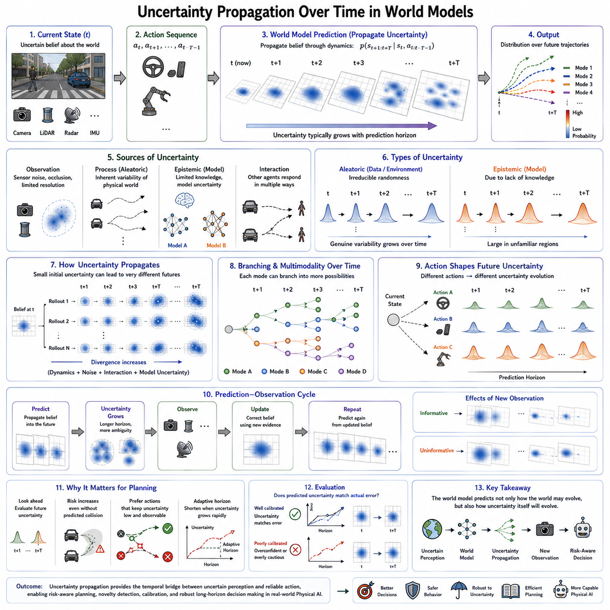{width="7.268055555555556in" height="7.268055555555556in"}

시간에 따른 불확실성 전파(uncertainty propagation over time)는 현재 세계 상태(world state)에 존재하는 불확실성이 월드 모델(world model)이 더 먼 미래를 예측함에 따라 어떻게 변화하는지를 설명한다. 시간 (t)에서 매우 정확하게 추정된 상태라 하더라도 센싱(sensing), 숨겨진 변수(hidden variable), 학습된 동역학(learned dynamics)으로부터 일정한 불확실성을 포함한다. 이 상태가 전이 모델(transition model)을 통해 반복적으로 전파되면 이러한 불확실성이 이후 예측에 영향을 주며, 일반적으로 가까운 미래보다 먼 미래 상태의 불확실성이 더 커진다.

결정론적 롤아웃(deterministic rollout)은 각각의 예측 상태를 다음 전이를 위한 정확한 입력으로 취급하기 때문에 이러한 과정을 숨기는 경우가 많다. (\\hat{s}\*{t+1})에 오차가 포함되어 있다면 그 오차는 (\\hat{s}\*{t+2})에 영향을 주고 다시 이후의 예측에 영향을 미친다. 반면 확률적 월드 모델(probabilistic world model)은 분포를 전파하여 개념적으로 (p(s_t))를 동역학을 통해 변환해 (p(s_{t+1})), (p(s_{t+2})), 그리고 궁극적으로 전체 미래 궤적(future trajectory)에 대한 분포를 생성한다.

여러 종류의 불확실성이 이러한 전파 과정에 참여한다. 관측 불확실성(observation uncertainty)은 초기 상태 추정에 영향을 주고, 과정 불확실성(process uncertainty)은 예측하기 어려운 물리 동역학에서 발생하며, 인식론적 불확실성(epistemic uncertainty)은 학습된 전이 모델의 한계를 반영한다. 사람, 로봇, 차량, 환경 과정이 서로 다른 방식으로 반응하면서 미래 상호작용도 추가적인 모호성을 만든다. 이러한 불확실성은 예측이 진행되면서 누적되거나 서로 상호작용하고 새로운 분기를 생성할 수 있다.

단순한 근사 선형 시스템(approximately linear system)의 경우 평균(mean)과 공분산 행렬(covariance matrix)을 이용하여 불확실성을 전파할 수 있다. 다음 단계의 예측 공분산(predicted covariance)은 현재 상태의 불확실성, 시스템 동역학, 과정 잡음(process noise)에 의해 결정된다. 이는 불확실성이 단순히 일정한 양만큼 증가하는 것이 아니라 동역학에 의해 변환된다는 직관적인 관점을 제공한다. 일부 방향에서는 불확실성이 크게 증폭될 수 있지만 안정적인 동역학에서는 감소할 수도 있다.

그러나 물리 인공지능(Physical AI) 시스템은 일반적으로 비선형(nonlinear)이고 고차원(high-dimensional)이다. 로봇 운동, 접촉(contact), 지형 상호작용, 인간 행동, 지각(perception), 제어(control)는 불확실한 상태를 비선형적으로 변환할 수 있다. 따라서 현재 시점의 대칭적인 불확실성 분포가 여러 번의 전이를 거친 후에는 비대칭적으로 변하거나, 늘어나거나, 상관관계를 가지거나, 다중모드(multimodal) 형태로 변할 수 있다. 예측 지평(prediction horizon)이 길어질수록 단순한 가우시안 가정(Gaussian assumption)은 점차 부정확해질 수 있다.

샘플링(sampling)은 복잡한 월드 모델을 위한 실용적인 대안을 제공한다. 현재 믿음 분포(belief distribution)에서 여러 상태를 샘플링하여 학습된 동역학을 통해 전파하면 여러 개의 미래 궤적을 생성할 수 있다. 이 궤적들의 분산은 시간에 따른 불확실성을 근사한다. 확률적 동역학(stochastic dynamics), 잠재 변수(latent variable), 모델 앙상블(model ensemble)까지 함께 샘플링하면 환경의 변동성과 학습 모델 자체에 대한 불확실성을 모두 표현할 수 있다.

다중모드 미래 분포(multimodal future distribution)는 시간적 전파를 더욱 중요하게 만든다. 불확실한 상황은 처음에 두 개의 가능한 미래를 포함할 수 있으며, 각각의 모드는 이후 다시 추가적인 가능성으로 분기될 수 있다. 예를 들어 다른 차량이 처음에는 양보하거나 진행할 수 있고, 각각의 행동 이후에도 여러 후속 궤적이 가능할 수 있다. 따라서 예측 분포는 단순히 하나의 분포가 넓어지는 것이 아니라 분기 구조(branching structure)로 발전할 수 있다.

이러한 분기 사이에서는 시간적 일관성(temporal consistency)이 유지되어야 한다. 미래 가설(future hypothesis)은 단순히 (t+5)에서 독립적으로 존재하는 하나의 상태가 아니라 그 이전 상태들과 물리적으로 일관된 시퀀스(sequence)로 연결되어야 한다. 각각의 미래 시점에서 불확실성 분포를 독립적으로 예측하면 이러한 의존 관계를 잃을 수 있다. 따라서 결합 궤적 분포(joint trajectory distribution) 또는 시간적으로 구조화된 잠재 롤아웃(temporally structured latent rollout)이 의사결정, 상호작용, 미래 물리 상태 사이의 관계를 더 효과적으로 보존한다.

행동(action)은 불확실성이 전파되는 방식에 직접적으로 영향을 미친다. 공격적인 기동(aggressive maneuver)은 로봇을 관측이 부족한 영역으로 빠르게 이동시켜 예측 불확실성을 급격하게 증가시킬 수 있다. 반면 느리거나 보수적인 행동은 시스템을 충분히 관측되고 익숙한 동역학 영역에 유지할 수 있다. 따라서 (p(s_{t+1:t+T}\\mid s_t,a_{t:t+T-1}))는 미래 상태뿐 아니라 선택된 행동 시퀀스가 시간에 따라 변화하는 불확실성을 어떻게 형성하는지도 나타낸다.

우연적 불확실성(aleatoric uncertainty)은 미래의 물리적 사건에 실제 변동성이 존재하기 때문에 장기 예측에서 증가하는 경우가 많다. 마찰, 접촉, 운동, 인간 행동, 환경 조건의 작은 변화가 시간이 지나면서 점점 더 다른 궤적을 만들어낼 수 있다. 따라서 완벽한 모델을 가지고 있더라도 현재 이용할 수 있는 정보가 미래를 점차 덜 제약하게 되면서 불확실성이 증가할 수 있다.

인식론적 불확실성은 서로 다른 방식으로 전파될 수 있다. 예측된 상태가 학습 데이터에 충분히 표현된 영역 안에 머무른다면 모델 불확실성(model uncertainty)은 상대적으로 낮게 유지될 수 있다. 반면 롤아웃이 익숙하지 않은 지형, 특이한 구성(configuration), 드물게 관측된 상호작용 영역으로 들어가면 서로 다른 타당한 모델들이 서로 다른 예측을 생성하기 시작할 수 있다. 이때 앙상블 궤적(ensemble trajectory)이 빠르게 분리되면서 월드 모델이 자신의 학습된 동역학에 대한 신뢰를 잃고 있음을 나타낼 수 있다.

이러한 불확실성 유형들은 서로 상호작용할 수도 있다. 우연적 변동(aleatoric variation)으로 인해 일부 예측 궤적이 모델의 학습 경험이 부족한 영역으로 이동하면 이후 인식론적 불확실성이 증가할 수 있다. 반대로 불확실한 모델 동역학은 예측된 환경 변동성을 과도하게 확대하거나 축소할 수 있다. 따라서 전체 장기 불확실성(total long-horizon uncertainty)은 항상 독립적인 요소들을 단순히 더한 결과가 아니라 반복적인 상호작용으로부터 나타날 수 있다.

불확실성 전파는 장기 예측 오차(long-horizon prediction error)가 빠르게 증가할 수 있는 이유도 보여준다. 상태, 속도, 자세(orientation), 접촉 조건, 에이전트 의도의 작은 차이는 단기적으로는 영향이 제한적이지만 여러 번의 전이 이후에는 크게 다른 결과를 만들어낼 수 있다. 민감하거나 혼돈적인 동역학(chaotic dynamics)에서는 서로 가까운 초기 상태도 크게 분리될 수 있다. 따라서 신뢰할 수 있는 월드 모델은 먼 미래의 예측을 인위적으로 정밀하게 표현하는 대신 신뢰도가 감소하고 있음을 전달해야 한다.

새로운 관측은 이러한 불확실성 증가를 중단하거나 감소시킬 수 있다. 로봇은 일반적으로 추가적인 센서 정보를 받지 않은 상태에서 무한히 미래를 예측하지 않는다. 카메라(camera), 라이다(LiDAR), 레이더(radar), 관성측정장치(IMU), 고유수용감각(proprioception) 등의 센서가 새로운 증거를 제공하면 믿음 상태(belief state)를 수정하고 불확실성을 감소시킬 수 있다. 따라서 실제 운용은 예측, 불확실성 증가, 관측, 믿음 갱신(belief update), 새로운 예측이 반복되는 순환 구조를 형성한다.

이러한 예측-갱신 순환(prediction-update cycle)은 월드 모델과 상태 추정(state estimation)을 연결한다. 모델은 상태 분포가 어떻게 변화하는지를 예측하고, 관측은 새로운 증거를 이용해 그 분포를 제약한다. 관측의 신뢰도가 높으면 불확실성이 크게 감소할 수 있지만, 센서 성능이 저하되거나 물체가 계속 가려져 있다면 불확실성은 계속 증가할 수 있다. 예측과 관측 사이의 균형이 에이전트가 내부 세계 표현(internal world representation)을 얼마나 확신 있게 유지할 수 있는지를 결정한다.

계획(planning)의 관점에서는 현재 순간에 측정된 불확실성만 사용하는 것보다 불확실성 전파를 고려하는 것이 더 유용하다. 두 개의 후보 궤적(candidate trajectory)이 로봇 주변에서는 동일하게 안전해 보일 수 있지만 몇 초 후에는 매우 다른 불확실성을 만들어낼 수 있다. 계획기는 미래 분포가 제한된 범위 내에서 유지되는 행동을 선호하고, 점유 상태(occupancy), 동역학, 상호작용이 매우 불확실해지는 영역으로 들어가는 궤적을 피할 수 있다.

따라서 실제 충돌이 예측되지 않더라도 위험(risk)은 증가할 수 있다. 불확실성이 빠르게 확대되는 영역을 통과하는 궤적은 그곳에서 어떤 일이 발생할지를 계획기가 확신 있게 판단할 수 없기 때문에 바람직하지 않을 수 있다. 불확실성 인지 계획(uncertainty-aware planning)은 이러한 미래에 불이익을 부여하고, 안전 여유(safety margin)를 늘리거나, 계획 지평(planning horizon)을 줄이거나, 속도를 낮추거나, 관측 가능성(observability)을 유지하면서 이후 수정할 기회를 보존하는 행동을 선택할 수 있다.

불확실성 전파는 적응형 예측 지평(adaptive prediction horizon)을 결정하는 데에도 활용할 수 있다. 미래의 불확실성이 낮게 유지되면 월드 모델은 비교적 장기적이고 확신 있는 계획을 지원할 수 있다. 반대로 불확실성이 빠르게 증가하면 먼 미래의 예측은 신뢰할 수 있는 정보를 적게 제공한다. 이 경우 시스템은 단기 의사결정을 강조하고 새로운 관측이 들어올 때마다 자주 재계획(replanning)하여 이미 지나치게 확산된 미래 확률 분포에 불필요한 연산을 사용하는 것을 피할 수 있다.

완전한 확률 분포를 대규모 신경망 월드 모델(neural world model)을 통해 전파하는 것은 많은 연산 비용을 요구하기 때문에 계산 효율성(computational efficiency)은 중요한 과제이다. 실제 시스템에서는 공분산 전파(covariance propagation), 몬테카를로 샘플(Monte Carlo sample), 앙상블, 파티클(particle), 확률적 잠재 상태(stochastic latent state), 압축된 다중모드 가설(compressed multimodal hypothesis) 등을 이용하여 불확실성을 근사할 수 있다. 적절한 방법은 동역학의 복잡성과 물리 인공지능 플랫폼의 지연시간, 메모리, 전력, 안전 요구사항에 따라 달라진다.

평가(evaluation)에서는 예측된 불확실성 증가가 실제 미래 예측 오차와 일치하는지를 측정해야 한다. 예측 오차가 증가하는데도 불확실성 분포가 좁게 유지되는 모델은 과신(overconfidence)하는 것이며, 반대로 분포가 지나치게 빠르게 확장되는 모델은 불필요하게 보수적으로 동작할 수 있다. 따라서 시간적 신뢰도(temporal confidence)가 의미 있게 유지되는지를 판단하려면 단일 단계 예측뿐 아니라 여러 예측 지평에 걸쳐 보정(calibration)을 평가해야 한다.

물리 인공지능에서 불확실성 전파는 불확실한 지각과 위험 인지 행동(risk-aware action)을 시간적으로 연결한다. 현재의 모호성은 미래 예측 불확실성으로 변화하고, 행동은 그 변화 과정을 다시 형성하며, 새로운 관측은 불확실성을 감소시키거나 재구성한다. 계획기는 이렇게 만들어진 분포를 이용해 로봇이 어느 정도의 확신을 가지고 행동해야 하는지를 결정한다. 결과적으로 월드 모델은 물리 세계뿐 아니라 자신의 예측 신뢰성에 대해서도 동적으로 변화하는 믿음(dynamic belief)을 유지한다.

따라서 성숙한 월드 모델은 세계가 어떻게 변화할 것인지만 예측하는 것이 아니라 불확실성 자체가 어떻게 변화할 것인지도 예측해야 한다. 불확실성이 언제 확대되고, 축소되고, 여러 가능성으로 분기되며, 주로 우연적 불확실성에서 강한 인식론적 불확실성으로 변화하는지를 파악할 수 있어야 한다. 이러한 시간적 이해는 실제 물리 인공지능에서 분포 외 및 신규성 탐지(out-of-distribution and novelty detection), 불확실성 인지 계획, 보정, 신뢰할 수 있는 장기 의사결정(long-horizon decision making)을 구현하기 위한 기반을 제공한다.

## 12.07. Out of Distribution and Novelty Detection

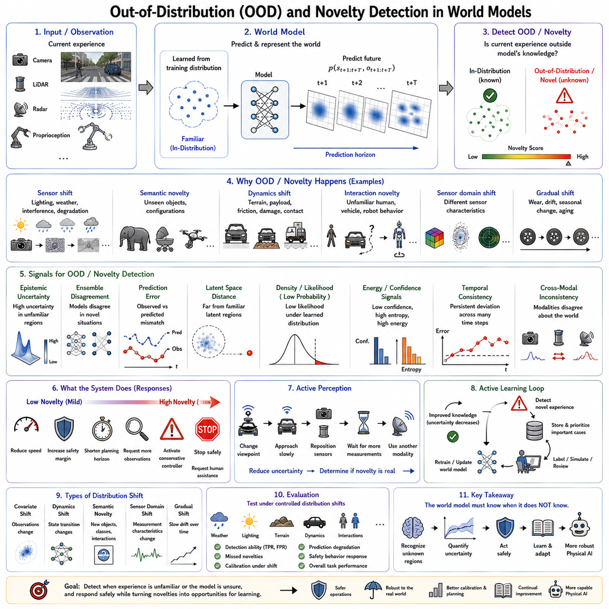{width="7.268055555555556in" height="7.268055555555556in"}

분포 외 탐지(out-of-distribution detection)는 월드 모델(world model)이 학습 과정에서 표현되었던 데이터와 의미 있게 다른 관측, 상태 또는 동역학(dynamics)을 접하는 상황을 다룬다. 이러한 조건에서도 모델은 수치적으로 정밀해 보이는 예측을 생성할 수 있지만, 정밀성이 반드시 신뢰성을 의미하지는 않는다. 따라서 물리 인공지능(Physical AI)은 예측을 계획(planning)과 제어(control)에 사용하기 전에 현재 경험이 익숙한 운용 영역을 벗어났는지를 인식하는 메커니즘을 필요로 한다.

분포 내 데이터(in-distribution data)는 익숙한 물체, 환경, 센서 조건, 움직임, 상호작용과 같이 학습 분포(training distribution)에 충분히 표현된 상황에 해당한다. 분포 외(out-of-distribution, OOD) 입력은 이러한 학습된 규칙성(learned regularity)을 의미 있는 방식으로 벗어난다. 신규성 탐지(novelty detection)는 이와 밀접하게 관련되어 있지만, 정확한 통계적 범주를 정의하기 어려운 경우에도 이전에 학습한 경험과 비교하여 새롭게 나타난 관측이나 상황을 식별하는 데 중점을 둔다.

분포 외 조건(OOD condition)은 물리 인공지능 시스템의 여러 수준에서 발생할 수 있다. 센서는 비정상적인 조명, 날씨, 간섭(interference), 성능 저하를 경험할 수 있다. 지각(perception) 시스템은 이전에 보지 못한 물체나 공간 구성을 관측할 수 있다. 익숙하지 않은 지형, 적재량(payload), 마찰(friction), 손상, 접촉 행동(contact behavior)으로 인해 동역학이 달라질 수도 있다. 사람, 차량, 다른 로봇이 학습 데이터에 포함된 사례와 다르게 행동하면 상호작용 패턴 역시 새로운 형태가 될 수 있다.

이 때문에 분포 외 탐지는 단순히 익숙하지 않은 이미지를 인식하는 것보다 훨씬 복잡하다. 장면의 시각적 모습은 익숙하지만 그 동역학은 새로울 수 있으며, 반대로 시각적으로 익숙하지 않은 외형이 이미 잘 알려진 물리적 행동과 대응할 수도 있다. 따라서 월드 모델은 하나의 입력 수준 탐지기에만 의존하기보다 관측 공간(observation space), 잠재 표현 공간(latent representation space), 상태 전이(state transition), 예측 동역학, 상호작용, 전체 시간적 궤적(temporal trajectory)에서 신규성을 고려해야 한다.

인식론적 불확실성(epistemic uncertainty)은 신규성을 판단하는 중요한 신호를 제공한다. 모델이 상태 공간(state space)의 특정 영역에 대한 경험이 부족하면 학습된 매개변수나 함수에 대한 불확실성이 증가해야 한다. 앙상블(ensemble)은 독립적으로 학습된 여러 모델 사이의 불일치를 통해 이를 드러낼 수 있다. 여러 월드 모델이 익숙한 상태에서는 유사한 예측을 생성하지만 새로운 상황에서 크게 다른 예측을 생성한다면 이러한 불일치는 학습된 지식이 부족하다는 신호가 될 수 있다.

예측 오차(prediction error)는 또 다른 유용한 신호를 제공한다. 월드 모델은 미래 관측, 잠재 상태(latent state), 점유 상태(occupancy), 움직임 또는 다른 세계 속성을 지속적으로 예측한다. 실제 관측이 예상된 불확실성 범위를 넘어 반복적으로 예측과 달라진다면 환경에 이전에 경험하지 못한 동역학이나 사건이 존재할 가능성이 있다. 따라서 신규성은 정적인 외형뿐 아니라 학습된 시간적 기대(temporal expectation)의 위반을 통해서도 탐지할 수 있다.

잠재 공간 탐지(latent-space detection)는 인코더(encoder)나 월드 모델 상태가 생성하는 내부 표현을 이용한다. 일반적으로 학습 데이터는 이러한 표현 공간의 구조화된 특정 영역을 차지한다. 새로운 관측의 잠재 표현이 익숙한 영역에서 크게 떨어져 있다면 이상 상태(anomaly)로 판단할 수 있다. 거리 척도(distance measure), 밀도 추정(density estimation), 최근접 이웃 방법(nearest-neighbor method), 에너지 기반 점수(energy-based score), 학습된 판별기(discriminator) 등을 이용하여 해당 표현이 기존 경험과 얼마나 유사한지를 수치적으로 평가할 수 있다.

밀도 기반 접근법(density-based approach)은 학습된 데이터 분포에서 특정 관측이나 잠재 상태가 얼마나 높은 확률을 가지는지를 추정한다. 낮은 추정 가능도(likelihood)는 신규성을 나타낼 수 있지만, 가능도만으로 판단할 때는 주의해야 한다. 고차원 생성 모델(high-dimensional generative model)은 의미적으로 익숙하지 않은 입력에 예상보다 높은 가능도를 부여하기도 한다. 따라서 효과적인 분포 외 탐지는 밀도 정보와 함께 불확실성, 표현 공간의 기하학적 구조, 예측 일관성(prediction consistency), 작업 특화 증거(task-specific evidence)를 결합하는 경우가 많다.

에너지 기반 방법(energy-based method)과 신뢰도 기반 방법(confidence-based method)은 신규성을 나타내는 또 다른 점수를 제공한다. 지각 또는 예측 네트워크는 익숙하지 않은 입력에 대해 비정상적으로 평평한 클래스 확률 분포, 낮은 신뢰도, 높은 예측 엔트로피(predictive entropy), 증가한 에너지 값을 생성할 수 있다. 이러한 값은 계산 비용이 낮을 수 있어 실시간 물리 인공지능에 유용하지만, 신경망은 학습 분포 밖에서도 과신(overconfidence)할 수 있으므로 원시 신뢰도(raw confidence)를 자동으로 신뢰할 수 있는 OOD 증거로 간주해서는 안 된다.

시간 정보(temporal information)는 신규성 탐지의 성능을 크게 향상시킬 수 있다. 하나의 비정상적인 센서 측정은 단순한 잡음일 수 있지만 여러 시간 단계에 걸쳐 지속되는 편차는 실제 분포 이동(distribution shift)을 나타낼 가능성이 더 높다. 월드 모델은 자연스럽게 시간적 문맥(temporal context)을 제공하고 관측된 상태 전이를 예상 동역학과 비교할 수 있다. 이를 통해 일시적인 측정 교란과 물리 환경의 지속적인 변화를 구별할 수 있다.

서로 다른 유형의 분포 이동은 운용 관점에서도 구별할 필요가 있다. 공변량 이동(covariate shift)은 관측 분포가 변화하지만 그 기반 관계는 유사하게 유지될 수 있는 경우를 의미한다. 동역학 이동(dynamics shift)은 행동에 따라 상태가 변화하는 방식 자체가 달라지는 경우이다. 의미적 신규성(semantic novelty)은 이전에 보지 못한 물체, 클래스, 상호작용을 도입하며, 센서 도메인 이동(sensor-domain shift)은 측정 특성을 변화시킨다. 각각은 월드 모델의 서로 다른 부분에 영향을 미치며 서로 다른 대응 또는 적응 전략(adaptation strategy)을 필요로 할 수 있다.

신규성은 갑작스러운 이상 현상으로만 나타나는 것이 아니라 점진적으로 발생할 수도 있다. 타이어 마모, 센서 드리프트(sensor drift), 변화하는 적재량, 계절적 환경 조건, 점진적인 기계적 열화(mechanical degradation)는 운용 분포를 서서히 학습 조건에서 벗어나게 할 수 있다. 불확실성, 예측 잔차(prediction residual), 잠재 표현, 앙상블 불일치의 추세를 지속적으로 관찰하면 이러한 점진적 분포 이동이 명백한 예측 실패를 일으킬 정도로 심각해지기 전에 발견할 수 있다.

다중모달 월드 모델(multimodal world model)에서는 모달리티 간 일관성(cross-modal consistency)이 또 다른 탐지 메커니즘을 제공한다. 카메라(camera), 라이다(LiDAR), 레이더(radar), 고유수용감각(proprioception) 등의 모달리티는 일반적으로 환경에 대해 서로 양립할 수 있는 해석을 제공한다. 하나의 모달리티가 다른 모달리티들과 일치하지 않는 증거를 생성한다면 센서 고장, 비정상적인 환경 조건 또는 실제로 새로운 사건이 발생했을 수 있다. 따라서 모달리티 간 불일치는 개별 센서 내부의 불확실성 추정을 보완할 수 있다.

분포 외 탐지는 단순히 이상 점수(anomaly score)를 생성하는 데 그치지 않고 실제 행동에 영향을 주어야 한다. 신규성이 경미한 경우 로봇은 속도를 낮추고, 안전 여유(safety margin)를 늘리고, 계획 지평(planning horizon)을 줄이거나, 추가 관측을 요청할 수 있다. 신규성이 더 강하면 보수적인 제어기(conservative controller)를 활성화하고, 불확실한 영역을 회피하거나, 안전하게 정지하고, 사람의 지원을 요청하거나, 시스템 아키텍처가 지원하는 경우 더 강력한 모델로 연산을 전환할 수 있다.

능동 지각(active perception)은 탐지된 이상 현상이 실제 신규성인지 판단하는 데 도움을 줄 수 있다. 로봇은 관측 시점(viewpoint)을 변경하거나, 더 천천히 접근하거나, 센서를 재배치하거나, 추가 측정을 기다리거나, 다른 센싱 모달리티를 사용할 수 있다. 새로운 관측 이후 불확실성이 감소한다면 최초의 신규성은 부분 관측성(partial observability)에서 발생했을 수 있다. 반대로 향상된 센싱 이후에도 불확실성이 높게 유지된다면 모델 지식의 부족이나 익숙하지 않은 동역학일 가능성이 더 높다.

분포 외 탐지는 능동 학습(active learning)도 지원한다. 실제 배치(deployment) 과정에서 발견된 새로운 경험을 기록하여 이후의 검사, 라벨링(labeling), 시뮬레이션, 재학습(retraining)에 우선적으로 활용할 수 있다. 모든 운용 데이터를 동일하게 수집하는 대신 모델 불확실성, 예측 오차 또는 신규성 점수가 높은 상황에 학습 자원을 집중할 수 있다. 따라서 실제 배치는 월드 모델을 개선하기 위한 표적화된 정보(targeted information)의 원천이 된다.

이는 지속적인 개선 순환(continual improvement loop)을 형성한다. 모델은 기존 지식을 기반으로 예측하고, 자신의 기대를 위반하는 상황을 탐지하며, 추가 증거를 수집하고, 정보 가치가 높은 새로운 경험을 저장한다. 검증과 재학습 이후에는 이전에 익숙하지 않았던 상황이 알려진 분포의 일부가 될 수 있다. 그 결과 인식론적 불확실성이 감소하고 물리 인공지능 시스템이 확신을 가지고 운용될 수 있는 영역이 확대된다.

안전을 위해서는 신규성 탐지의 임계값(threshold)을 신중하게 설계해야 한다. 임계값이 지나치게 민감하면 빈번한 오경보(false alarm)와 불필요하게 보수적인 행동이 발생할 수 있다. 반대로 너무 관대하면 실제로 익숙하지 않은 상황을 탐지하지 못할 수 있다. 따라서 실제 시스템은 하나의 이진적인 분포 내/분포 외 구분에만 의존하기보다 여러 신호를 결합하고 신규성의 정도에 따라 단계적인 대응(graded response)을 적용할 수 있다.

평가(evaluation)에서는 일반적인 테스트 데이터만 사용하는 것이 아니라 통제된 분포 이동(controlled distribution shift)을 포함해야 한다. 유용한 벤치마크(benchmark)는 날씨, 조명, 센서 품질, 물체 종류, 지형, 동역학, 상호작용 패턴과 이러한 요소들의 조합을 변화시킬 수 있다. 성능 평가는 탐지 능력뿐 아니라 오경보, 탐지 실패(missed novelty), 분포 이동 상황의 보정(calibration), 예측 성능 저하, 안전 행동이 적절하게 반응하는지와 같은 후속 결과까지 측정해야 한다.

분포 외 및 신규성 탐지(OOD and novelty detection)는 어떠한 학습 데이터셋도 배치된 로봇이 경험하게 될 모든 물리적 상황을 포함할 수 없기 때문에 개방형 세계 물리 인공지능(open-world Physical AI)에서 특히 중요하다. 따라서 목표는 모델이 이미 모든 것을 학습했다는 것을 보장하는 것이 아니다. 대신 시스템은 자신의 능력 한계(boundary of competence)를 인식하고 익숙하지 않은 경험을 충분히 이해된 상황과 동일한 신뢰도로 처리하지 않아야 한다.

성숙한 월드 모델은 현재 관측과 예측된 상태 전이가 자신의 학습 경험과 여전히 일치하는지를 지속적으로 판단할 수 있어야 한다. 인식론적 불확실성, 앙상블 불일치, 예측 오차, 잠재 공간 구조, 시간적 일관성, 다중모달 증거(multimodal evidence)를 결합하면 내부 모델을 더 이상 신뢰하기 어려운 시점을 식별할 수 있다. 이러한 능력은 보정, 불확실성 인지 계획(uncertainty-aware planning), 안전 대체 동작(safe fallback behavior), 능동 학습, 개방형 세계에서의 강건한 물리 인공지능 운용(robust Physical AI operation)을 위한 핵심 기반을 제공한다.

## 12.08. Uncertainty Aware Planning

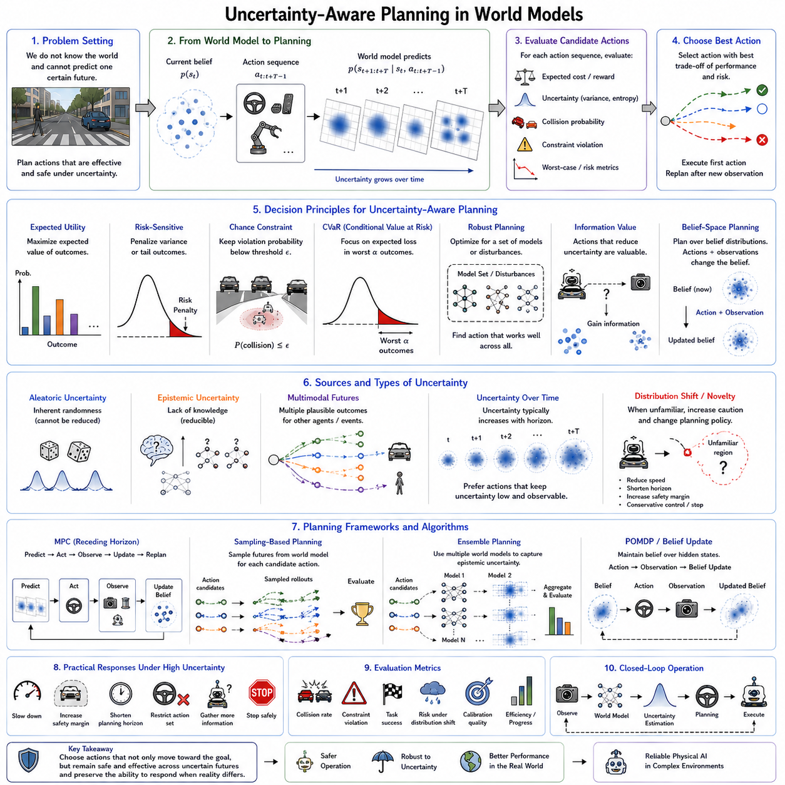{width="7.268055555555556in" height="7.268055555555556in"}

불확실성 인지 계획(uncertainty-aware planning)은 불확실성을 무시해야 할 오차로 취급하는 대신 의사결정 문제(decision problem)의 일부로 다룸으로써 기존 계획(conventional planning)을 확장한다. 물리 인공지능(Physical AI) 에이전트는 현재의 세계 상태(world state)를 완벽하게 알 수 없으며 하나의 확정된 미래를 예측할 수도 없다. 따라서 계획기(planner)는 불확실한 상황에서도 효과적이고 안전한 행동을 선택하기 위해 가능한 상태, 궤적, 상호작용, 결과의 분포를 고려하여 추론해야 한다.

기존 계획기(conventional planner)는 가장 가능성이 높은 예측 상태 또는 기대되는 미래(expected future)를 이용하여 궤적을 최적화할 수 있다. 그러나 대안적인 결과가 심각한 영향을 미치는 경우 이러한 접근법은 실패할 수 있다. 평균 예측(mean prediction)을 기준으로는 최적인 경로가 불확실한 점유 영역이나 예측하기 어려운 에이전트 주변을 통과할 수도 있다. 불확실성 인지 계획은 대신 월드 모델(world model)이 생성한 여러 가능한 미래를 기준으로 후보 행동(candidate action)을 평가한다.

확률적 월드 모델링(probabilistic world modeling)과 계획 사이의 관계는 (p(s_{t+1:t+T}\\mid s_t,a_{t:t+T-1}))와 같은 행동 조건부 예측 분포(action-conditioned predictive distribution)를 통해 표현할 수 있다. 각각의 후보 행동 시퀀스(candidate action sequence)에 대해 월드 모델은 미래 궤적의 분포를 예측한다. 계획기는 기대 보상(expected reward)이나 비용뿐 아니라 불확실성, 충돌 확률(collision probability), 제약 조건 위반(constraint violation), 잠재적으로 심각한 결과까지 함께 평가한다.

기대 효용(expected utility)은 기본적인 의사결정 원리 가운데 하나를 제공한다. 계획기는 각각의 행동에 대해 가능한 결과의 확률로 가중된 가치(value)를 평가한다. 이를 통해 발생 확률이 높은 결과가 발생 가능성이 낮은 결과보다 의사결정에 더 큰 영향을 미치게 된다. 그러나 낮은 확률의 충돌이나 불안정성 사건이라도 허용할 수 없는 안전 필수 물리 인공지능(safety-critical Physical AI)에서는 평균 성능이 좋아 보이더라도 기대값만으로 충분하지 않을 수 있다.

위험 민감 목적 함수(risk-sensitive objective)는 바람직하지 않은 불확실성이나 꼬리 영역 결과(tail outcome)에 명시적으로 불이익을 부여하여 이러한 한계를 보완한다. 계획 목적 함수(planning objective)는 기대 작업 비용(expected task cost)에 분산(variance), 충돌 확률, 최악의 경우 손실(worst-case loss) 또는 다른 위험 지표(risk metric)를 결합할 수 있다. 이들의 상대적인 가중치에 따라 에이전트가 얼마나 공격적 또는 보수적으로 행동하는지가 결정된다. 안전 필수 시스템은 일반적으로 심각한 물리적 결과를 초래할 가능성이 있는 불확실한 결과에 더 높은 중요도를 부여한다.

확률 제약(chance constraint)은 또 다른 유용한 메커니즘을 제공한다. 모든 상상 가능한 미래에서 제약 조건을 반드시 만족하도록 요구하는 대신, 계획기는 제약 조건을 위반할 확률이 허용 가능한 임계값(threshold) 이하로 유지되도록 요구할 수 있다. 예를 들어 로봇은 전체 궤적에서 충돌 확률이 특정 수준 이하로 유지되도록 요구할 수 있다. 이를 통해 불확실한 점유 상태(occupancy)와 움직임 예측을 최적화에 직접 포함할 수 있는 확률적 안전 제약(probabilistic safety constraint)으로 변환할 수 있다.

조건부 위험가치(Conditional Value at Risk, CVaR)는 결과 분포에서 특히 위험한 영역에 계획을 집중시키는 방법을 제공한다. 평균 비용만 고려하는 대신 CVaR은 지정된 최악의 결과 집합에서 기대 손실(expected loss)을 평가한다. 이는 충돌, 전복(rollover), 적재물 낙하(dropped payload), 불안정한 접촉(unstable contact), 복구할 수 없는 상태(unrecoverable state) 진입처럼 발생 확률은 낮더라도 큰 결과를 초래할 수 있는 상황에서 유용하다.

강건한 계획(robust planning)은 관련되어 있지만 다른 관점에서 문제를 다룬다. 정밀한 확률에 강하게 의존하는 대신 가능한 모델이나 교란(disturbance)의 범위에서 허용 가능한 성능을 제공하는 행동을 탐색한다. 계획기는 제한된 불확실성 집합(bounded uncertainty set)이나 불리한 시나리오를 기준으로 최적화할 수 있다. 이는 특히 인식론적 불확실성(epistemic uncertainty)이나 분포 이동(distribution shift)으로 인해 확률 추정 자체를 신뢰하기 어려울 때 유용하다.

우연적 불확실성(aleatoric uncertainty)과 인식론적 불확실성은 서로 다른 계획 반응을 유발할 수 있다. 높은 우연적 불확실성은 추가적인 학습으로 제거할 수 없는 실제적인 예측 불가능성을 나타낼 수 있으므로 더 큰 안전 여유(safety margin)나 보수적인 움직임을 유도할 수 있다. 반면 높은 인식론적 불확실성은 모델 지식의 부족을 의미할 수 있으므로 단순히 기하학적 여유를 증가시키는 것보다 정보 수집, 탐색 회피, 추가 센싱 또는 대체 동작(fallback behavior)이 더 적절할 수 있다.

다중모드 미래 분포(multimodal future distribution)는 다른 에이전트 주변에서 계획할 때 특히 중요하다. 보행자는 길을 건너거나, 멈추거나, 다른 방향으로 이동할 수 있고, 다른 로봇은 양보하거나 계속 진행할 수 있다. 가장 가능성이 높은 하나의 모드(mode)만을 기준으로 계획하면 취약한 행동이 발생할 수 있다. 불확실성 인지 계획기는 중요한 여러 모드를 평가하고 각각의 확률과 결과를 고려하면서 가능한 대안들에 걸쳐 허용 가능한 행동을 선택한다.

시간에 따른 불확실성 전파(uncertainty propagation over time)는 계획 문제를 더욱 변화시킨다. 두 개의 후보 행동은 즉각적인 위험 측면에서는 유사할 수 있지만 장기적으로는 매우 다른 불확실성을 만들어낼 수 있다. 하나의 궤적은 관측 가능하고 익숙한 영역에 계속 머무르는 반면, 다른 궤적은 가려져 있거나 충분히 모델링되지 않은 공간으로 진입하여 불확실성이 빠르게 증가할 수 있다. 계획기는 예측 가능성(predictability), 관측 가능성(observability), 이후 수정할 기회를 유지하는 행동을 선호할 수 있다.

이는 정보 가치(information value)라는 개념을 도입한다. 일부 행동은 작업을 즉시 진전시키기 때문이 아니라 불확실성을 감소시키기 때문에 유용하다. 로봇은 가려진 교차로 근처에서 속도를 줄이거나, 물체를 확인하기 위해 위치를 변경하거나, 다른 에이전트의 의도를 파악하기 위해 잠시 기다릴 수 있다. 이러한 행동은 불확실성 감소 자체를 계획의 명시적인 구성 요소로 만들어 이후의 의사결정을 향상시킨다.

믿음 공간 계획(belief-space planning)은 정확한 상태가 아니라 확률 분포를 대상으로 계획함으로써 이러한 개념을 정식화한다. 계획기는 행동과 미래 관측이 세계에 대한 에이전트의 믿음(belief)을 어떻게 변화시키는지를 함께 고려한다. 따라서 하나의 행동은 물리 상태를 변화시키는 효과와 행동 이후 에이전트가 무엇을 알게 될 것인지를 변화시키는 두 가지 효과를 동시에 가질 수 있다. 이는 부분 관측성(partial observability)이 존재하는 환경에서 특히 중요하다.

부분 관측 의사결정 과정(partially observable decision process)은 이러한 추론을 위한 일반적인 프레임워크를 제공한다. 에이전트는 완전한 상태 정보를 가정하는 대신 가능한 숨겨진 상태(hidden state)에 대한 확률을 나타내는 믿음 상태(belief state)를 유지한다. 행동은 환경에 영향을 주고, 관측은 믿음을 갱신하며, 계획은 미래의 행동, 관측, 믿음 갱신 시퀀스를 고려한다. 대규모 물리 인공지능 시스템에서 정확한 해를 구하는 것은 어렵기 때문에 실제 구현에서는 일반적으로 근사 방법이 필요하다.

모델 예측 제어(Model Predictive Control, MPC)는 불확실성 인지 계획을 구현하기 위한 실용적인 구조를 제공한다. 시스템은 유한한 지평(finite horizon)에 걸쳐 미래 결과를 반복적으로 예측하고, 하나의 행동을 선택하며, 새로운 관측을 받은 후 세계 상태를 갱신하고 다시 계획한다. 이러한 이동 지평 과정(receding-horizon process)은 각각의 롤아웃(rollout)에서 불확실성을 전파하고 새로운 센서 증거가 들어올 때마다 이를 수정할 수 있기 때문에 월드 모델과 자연스럽게 결합된다.

샘플링 기반 계획(sampling-based planning)은 단순한 해석적 형태를 요구하지 않고 복잡한 예측 분포를 평가할 수 있다. 각각의 후보 행동 시퀀스에 대해 월드 모델은 센서 불확실성, 확률적 동역학(stochastic dynamics), 대안적인 상호작용 또는 모델 불일치를 나타내는 여러 미래 롤아웃을 생성한다. 계획기는 이러한 샘플 전체에서 성능을 평가하고 기대 보상, 위험, 강건성(robustness) 또는 이들의 조합에 따라 행동을 선택한다.

앙상블(ensemble)은 이러한 과정을 인식론적 불확실성에 민감하도록 만들 수 있다. 후보 행동은 하나의 전이 모델이 아니라 여러 개의 학습된 월드 모델을 통해 평가된다. 어떤 행동이 앙상블 전체에서 유사한 결과를 생성한다면 비교적 충분히 이해된 동역학 영역에 머무르는 것으로 볼 수 있다. 반대로 예측이 크게 분기된다면 계획기는 해당 행동에 불이익을 부여하거나, 추가 정보를 수집하거나, 해당 상태 공간 영역을 회피할 수 있다.

분포 외 및 신규성 탐지(out-of-distribution and novelty detection)는 계획 정책(planning policy)의 변화를 유발할 수 있다. 월드 모델이 익숙하지 않은 관측이나 동역학을 식별하면 일반적인 최적화 가정을 더 이상 신뢰하기 어려울 수 있다. 시스템은 속도를 줄이고, 예측 지평을 단축하고, 안전 여유를 확대하고, 사용할 수 있는 행동 집합(action set)을 제한하거나, 보수적인 제어기(conservative controller)를 활성화할 수 있으며, 불확실성이 운용 임계값(operational threshold)을 초과하면 안전하게 정지할 수도 있다.

그러나 불확실성 인지 계획은 지나치게 보수적인 행동도 피해야 한다. 모든 불확실한 사건을 치명적인 것으로 취급하는 로봇은 자주 정지하여 유용한 작업을 수행하지 못할 수 있다. 따라서 목표는 모든 위험을 제거하는 것이 아니라 확률, 결과의 심각성(consequence), 임무 요구사항(mission requirement), 복구 가능성(recoverability)에 따라 위험을 관리하는 것이다. 계획 품질은 불확실성 추정값이 실제 예측 신뢰성과 의미 있게 대응하는지에 의존하므로 적절한 보정(calibration)이 필수적이다.

실시간 연산(real-time computation)은 또 다른 주요 과제이다. 많은 후보 행동을 여러 확률적 미래, 앙상블 모델, 장기 지평에 걸쳐 평가하면 연산 비용이 매우 커질 수 있다. 실제 물리 인공지능 시스템은 거친 장기 추론(coarse long-horizon reasoning)과 정밀한 단기 제어(detailed short-horizon control)를 결합하거나, 샘플 수를 줄이고, 가능성이 낮은 모드를 가지치기(pruning)하고, 여러 궤적 사이에서 연산을 공유하거나, 현재의 불확실성과 위험 수준에 따라 계획 복잡도를 적응적으로 조절할 수 있다.

평가(evaluation)는 단순한 궤적 효율성이나 평균 보상만 측정해서는 안 된다. 불확실성 인지 계획기는 충돌 및 제약 조건 위반 비율, 분포 이동 상황에서의 성능, 보정 오류(calibration error)에 대한 민감도, 새로운 상황에 대한 반응, 불필요한 보수성, 복구 능력(recovery capability), 작업 완료 성능(task completion) 등을 함께 평가해야 한다. 좋은 계획은 하나의 지표만 최적화하는 것이 아니라 안전성, 효율성, 강건성, 작업 진행 사이에서 균형을 유지해야 한다.

궁극적으로 불확실성 인지 계획은 어떤 일이 발생할 수 있는지와 그 예측을 얼마나 신뢰할 수 있는지에 대한 월드 모델의 지식을 실제 물리적 의사결정으로 변환한다. 확률 분포(probabilistic distribution)는 가능한 미래를 설명하고, 다중모드 모델(multimodal model)은 대안적인 결과를 유지하며, 불확실성 전파는 시간에 따라 신뢰도가 어떻게 변화하는지를 보여주고, 신규성 탐지는 학습된 지식의 한계를 식별한다. 계획은 이러한 신호들을 행동 선택(action selection)에 통합한다.

따라서 성숙한 물리 인공지능 시스템은 단순히 목표를 향해 이동한다는 이유만으로 행동을 선택해서는 안 된다. 불확실한 여러 미래에서도 합리적인 결과를 유지하고 현실이 예측과 달라졌을 때 대응할 수 있는 능력을 보존하는 행동을 선택해야 한다. 불확실성 인지 계획은 지각(perception), 예측(prediction), 불확실성 추정(uncertainty estimation), 제어를 하나의 폐루프(closed loop)로 연결하며, 복잡한 실제 환경에서 강건하고 안전하게 작동하기 위해 필요한 의사결정 기반을 제공한다.

## 12.09. Calibration and Confidence Evaluation

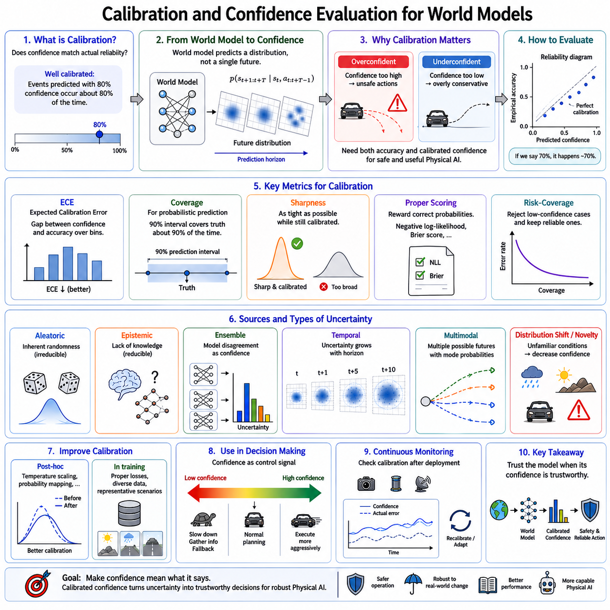{width="7.268055555555556in" height="7.268055555555556in"}

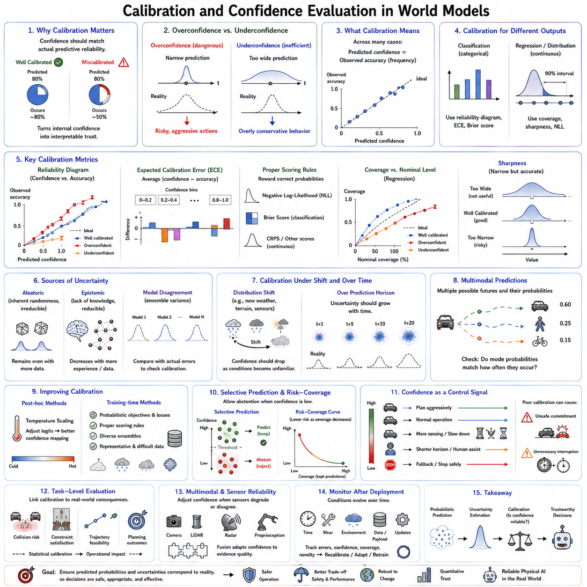{width="7.268055555555556in" height="7.268055555555556in"}

보정(calibration)은 월드 모델(world model)이 표현하는 신뢰도(confidence)가 실제 예측 신뢰성(predictive reliability)과 일치하는지를 판단한다. 특정 신뢰도 수준이 부여된 예측이 반복적인 사례에서 대략 그 비율만큼 성공한다면 모델은 잘 보정되어 있다고 할 수 있다. 예를 들어 80%의 신뢰도로 예측된 사건은 실제로도 약 80%의 빈도로 발생해야 한다. 이러한 관계는 신뢰도를 단순한 내부 수치 출력에서 해석 가능한 신뢰(trust)의 추정값으로 변환한다.

높은 예측 정확도(predictive accuracy)가 자동으로 좋은 보정을 의미하는 것은 아니다. 모델은 대부분의 경우 물체를 올바르게 분류하거나 미래 상태를 정확하게 예측하면서도 실패할 때 체계적으로 과신(overconfidence)할 수 있다. 반대로 과소신뢰(underconfidence)하는 모델은 신뢰할 수 있는 예측에도 낮은 신뢰도를 부여할 수 있다. 물리 인공지능(Physical AI)은 계획(planning)과 안전 메커니즘이 모델이 무엇을 예측하는지뿐 아니라 그 예측을 얼마나 강하게 신뢰해야 하는지도 판단해야 하므로 정확도와 보정된 신뢰도를 모두 필요로 한다.

과신은 월드 모델링(world modeling)에서 특히 위험하다. 관측이 모호하거나, 동역학(dynamics)이 익숙하지 않거나, 예측 지평(prediction horizon)이 긴 상황에서도 모델이 좁은 미래 분포(future distribution)를 생성할 수 있다. 후속 계획기는 이러한 좁은 분포를 안전하다는 증거로 해석하여 공격적인 행동을 선택할 수 있다. 따라서 보정 평가는 실제 예측 오차가 커지거나 빈번해질 때 예측 불확실성(predicted uncertainty)이 적절하게 증가하는지를 검토한다.

과소신뢰는 다른 종류의 운용 문제를 발생시킨다. 불확실성 추정값이 실제 오차보다 지속적으로 크다면 로봇은 불필요하게 보수적으로 행동할 수 있다. 속도를 낮추거나, 안전 간격을 증가시키거나, 계획 지평을 단축하거나, 익숙한 상황에서도 반복적으로 대체 동작(fallback behavior)을 호출할 수 있다. 따라서 좋은 보정은 단순히 불확실성을 최대화하는 것이 아니라 안전성과 유용한 작업 성능 사이의 적절한 균형을 지원한다.

범주형 예측(categorical prediction)의 경우 예측 신뢰도와 경험적 정확도(empirical accuracy)를 비교하여 보정을 평가할 수 있다. 예측을 신뢰도 구간(confidence interval)으로 그룹화하고 각 구간에서 실제 성공률을 계산한다. 약 0.7의 신뢰도를 가진 예측이 실제로 약 70% 정확하다면 해당 영역은 보정되어 있다고 볼 수 있다. 신뢰도 다이어그램(reliability diagram)은 여러 신뢰도 수준에 걸쳐 예측 신뢰도와 실제 정확도의 관계를 시각화한다.

기대 보정 오차(Expected Calibration Error, ECE)는 이러한 관계를 수치적으로 요약한다. 예측을 여러 신뢰도 구간(bin)으로 나누고 각 구간에서 평균 신뢰도와 경험적 정확도의 차이를 측정한다. 이후 이러한 차이를 결합하여 전체 보정 점수(calibration score)를 계산한다. ECE는 직관적이고 널리 활용될 수 있지만 그 값은 구간 경계(bin boundary), 샘플 수, 예측 신뢰도의 분포와 같은 설정에 영향을 받는다.

확률적 회귀(probabilistic regression)에서는 분류 신뢰도를 넘어서는 보정 개념이 필요하다. 월드 모델은 위치(position), 속도(velocity), 자세(orientation), 점유 상태(occupancy), 미래 궤적(future trajectory)에 대한 분포를 예측할 수 있다. 예측 구간(predicted interval)이 실제 결과를 90% 확률로 포함하도록 설계되었다면 관측된 결과의 약 90%가 해당 구간 안에 들어가야 한다. 따라서 포함률(coverage)은 예측 분포가 실제 불확실성을 반영하는지를 직접적으로 검증하는 방법을 제공한다.

보정에서는 예리성(sharpness)도 함께 고려해야 한다. 모델이 극단적으로 넓은 예측 구간을 생성하면 높은 포함률을 쉽게 얻을 수 있지만 이러한 예측은 유용한 정보를 거의 제공하지 못한다. 바람직한 확률적 모델(probabilistic model)은 보정되면서 동시에 예리해야 한다. 즉, 결과를 기대되는 빈도로 포함하면서도 이용 가능한 증거가 정당화하는 범위 내에서 분포가 최대한 집중되어야 한다. 이를 통해 과도한 보수성을 이용해 보정을 달성하는 것을 방지할 수 있다.

적절한 점수 규칙(proper scoring rule)은 실제로 관측된 결과에 적절한 확률을 할당하는 분포에 보상을 부여하여 확률적 예측을 평가한다. 음의 로그 가능도(negative log-likelihood)는 실제 발생한 결과에 모델이 얼마나 많은 확률 밀도(probability density)를 부여했는지를 평가한다. 브라이어 점수(Brier score)는 확률적 범주 결과를 평가할 수 있으며, 다른 분포 민감 점수(distribution-sensitive score)는 연속 예측을 평가할 수 있다. 이러한 지표는 단순히 정확한 점 예측(point prediction)이 아니라 의미 있는 확률 추정을 유도한다.

신뢰도 평가(confidence evaluation)는 가능한 경우 우연적 불확실성(aleatoric uncertainty)과 인식론적 불확실성(epistemic uncertainty)을 구분해야 한다. 우연적 불확실성은 관측이나 물리 과정 자체에 내재된 변동성을 반영하므로 충분한 학습 이후에도 높게 유지될 수 있다. 인식론적 불확실성은 학습된 지식의 한계를 반영하며 익숙하지 않은 영역에서 증가해야 하는 경우가 많다. 보정은 각각의 불확실성 원인이 자신이 표현하려는 조건과 일관되게 동작하는지를 검증해야 한다.

앙상블(ensemble)은 모델 불일치(model disagreement)를 통해 유용한 신뢰도 정보를 제공하지만 앙상블 분산(ensemble variance)이 자동으로 보정되는 것은 아니다. 여러 모델이 유사한 편향(bias), 학습 데이터 또는 아키텍처를 공유하기 때문에 모두 틀렸음에도 서로 일치할 수 있다. 반대로 앙상블 구성원들의 불일치가 실제 오차보다 지나치게 클 수도 있다. 따라서 앙상블 불확실성은 신뢰할 수 있는 신뢰도 척도로 사용하기 전에 예측 오차와 분포 이동(distribution shift)을 기준으로 경험적으로 비교되어야 한다.

분포 이동 상황에서의 보정(calibration under distribution shift)은 물리 인공지능에서 특히 중요하다. 모델이 학습 분포에서 추출된 검증 데이터(validation data)에 대해서는 잘 보정되어 있더라도 익숙하지 않은 날씨, 지형, 센서 성능 저하, 적재량(payload) 변화, 상호작용 패턴에서는 심각하게 과신할 수 있다. 따라서 평가에는 통제된 분포 외(out-of-distribution) 조건을 포함하고 운용 조건이 익숙한 경험에서 멀어질수록 신뢰도가 적절하게 감소하는지를 측정해야 한다.

여러 단계의 미래를 예측하는 월드 모델에는 시간적 보정(temporal calibration)이 필요하다. 신뢰도가 (t+1)에서는 정확하더라도 (t+10) 또는 (t+50)에서는 점점 잘못 보정될 수 있다. 불확실성은 일반적으로 예측 지평에 따라 변화하기 때문에 보정은 각각의 미래 시간 단계에서 별도로 평가되어야 한다. 누적되는 동역학, 상호작용의 모호성, 예측 오차가 불확실성 증가를 정당화한다면 모델은 그에 따라 증가하는 불확실성을 표현해야 한다.

다중모드 미래 예측(multimodal future prediction)은 추가적인 보정 문제를 발생시킨다. 월드 모델은 여러 가능한 궤적을 예측하고 각각의 모드(mode)에 확률을 할당할 수 있다. 평가는 이러한 모드 확률(mode probability)이 실제로 각각의 대안이 발생하는 빈도와 대응하는지를 판단해야 한다. 또한 모델이 비현실적인 모드에 지나치게 높은 확률을 부여하거나 여러 미래가 가능한 상황에서 하나의 결과에 확률을 집중시키는 모드 붕괴(mode collapse)가 발생하지 않는지도 확인해야 한다.

보정은 학습 이후 사후 보정 방법(post-hoc method)을 이용하여 개선할 수 있다. 온도 스케일링(temperature scaling)은 학습된 하나의 스칼라 매개변수를 이용하여 예측 로짓(logit)을 조정하며 분류 신뢰도 보정에 일반적으로 사용된다. 보다 유연한 접근법은 확률 매핑(probability mapping)이나 예측 분산을 수정할 수 있다. 이러한 방법은 전체 월드 모델을 다시 학습하지 않고도 신뢰도 추정값을 개선할 수 있지만, 하나의 운용 분포에서 얻은 보정이 상당한 분포 이동 이후에도 유지된다는 보장은 없다.

보정은 학습 과정에 직접 포함될 수도 있다. 확률적 목적 함수(probabilistic objective), 불확실성 인지 손실(uncertainty-aware loss), 적절한 점수 규칙, 다양한 앙상블, 대표성 있는 검증 데이터를 사용하면 실제 오차를 더 잘 반영하는 불확실성 추정을 유도할 수 있다. 학습 데이터에는 어렵고, 모호하고, 잡음이 많으며, 비정상적인 상황이 포함되어야 한다. 모델이 깨끗하고 예측하기 쉬운 사례만 관측한다면 의미 있는 신뢰도 행동을 학습하기 어렵기 때문이다.

선택적 예측(selective prediction)은 신뢰도가 실제 운용에서 유용한지를 평가하는 실용적인 방법을 제공한다. 시스템은 신뢰도가 충분하지 않을 경우 높은 수준의 확정적인 예측을 보류(abstain)할 수 있다. 낮은 신뢰도의 사례를 제외할수록 유지된 예측의 오류율은 감소해야 한다. 위험-포괄률 곡선(risk-coverage curve)은 이러한 절충 관계를 측정하고 신뢰도가 실제 신뢰성에 따라 예측의 우선순위를 올바르게 정하는지를 보여준다.

물리 인공지능에서 보류(abstention)가 반드시 아무 행동도 하지 않는다는 의미는 아니다. 낮은 신뢰도의 예측은 추가 센싱, 저속 이동, 짧은 계획 지평, 사람의 지원, 보수적인 대체 제어기(fallback controller)를 활성화할 수 있다. 따라서 신뢰도는 현재 조건에서 어느 정도의 자율성(autonomy)이나 공격성(aggressiveness)이 적절한지를 결정하는 제어 신호(control signal)로 기능한다. 잘못 보정된 신뢰도는 안전하지 않은 행동을 강행하거나 불필요하게 작업을 중단하게 만들 수 있다.

보정은 작업 수준(task level)에서도 평가되어야 한다. 예측 위치의 작은 오차는 개방된 공간에서는 중요하지 않을 수 있지만 장애물, 사람 또는 안정성 경계(stability boundary) 근처에서는 치명적일 수 있다. 따라서 신뢰도 평가는 충돌 위험(collision risk), 제약 조건 만족(constraint satisfaction), 궤적 실행 가능성(trajectory feasibility), 계획 결과(planning outcome)를 포함할 수 있다. 이는 통계적 보정(statistical calibration)을 물리 환경에서 발생하는 예측 오차의 실제 결과와 연결한다.

다중모달 센싱(multimodal sensing)은 또 다른 보정 차원을 만든다. 카메라(camera), 라이다(LiDAR), 레이더(radar), 고유수용감각(proprioception) 등의 센서는 조건에 따라 서로 다른 신뢰성을 가질 수 있다. 하나의 모달리티(modality)가 성능 저하를 보이거나 다른 모달리티와 일치하지 않을 때 월드 모델은 신뢰도를 조절해야 한다. 센서 고장, 모달리티 누락, 가림(occlusion), 잡음, 상충되는 관측 상황에서 신뢰도를 평가하면 다중모달 융합(multimodal fusion)이 변화하는 증거 품질에 적절하게 대응하는지를 판단할 수 있다.

실제 운용 조건은 지속적으로 변화하므로 배치(deployment) 이후에도 보정을 모니터링해야 한다. 센서 노화(sensor aging), 기계적 마모, 소프트웨어 업데이트, 새로운 환경, 변화하는 적재량, 새로운 상호작용 패턴은 이전에 보정된 불확실성 추정값을 점진적으로 무효화할 수 있다. 예측 오차, 신뢰도 분포, 포함률, 신규성 지표(novelty indicator)를 추적하면 재보정(recalibration), 적응(adaptation), 모델 재학습(retraining)이 필요한 시점을 파악할 수 있다.

복잡한 월드 모델에서는 하나의 보정 지표만으로 충분하지 않다. 신뢰도 다이어그램, 기대 보정 오차(ECE), 가능도 기반 점수(likelihood-based score), 구간 포함률(interval coverage), 예리성, 위험-포괄률 분석, 시간적 보정, 분포 이동 상황에서의 성능은 각각 신뢰도 품질의 서로 다른 측면을 보여준다. 따라서 평가는 상호 보완적인 여러 측정 방법을 사용하고 이를 불확실성 추정에 의존하는 실제 운용 의사결정과 연결해야 한다.

성숙한 물리 인공지능 시스템은 신뢰도를 신경망(neural network)이 만들어내는 막연한 인상이 아니라 측정 가능한 공학적 수량(engineering quantity)으로 다루어야 한다. 보정은 예측 확률과 불확실성이 경험적 현실(empirical reality)에 대응하는지를 확립하며, 신뢰도 평가는 이러한 추정값이 시간, 환경, 센싱 조건, 새로운 상황에서도 의미 있게 유지되는지를 검증한다. 이는 불확실성 인지 의사결정(uncertainty-aware decision making)을 신뢰하기 위한 정량적 기반을 제공한다.

궁극적으로 보정은 월드 모델이 자신의 예측을 실제로 얼마나 신뢰할 수 있는지를 알고 있는가를 질문함으로써 불확실성 프레임워크(uncertainty framework)를 완성한다. 확률적 예측(probabilistic prediction)은 불확실성을 표현하고, 앙상블은 모델 불일치를 드러내며, 다중모드 분포(multimodal distribution)는 대안적인 미래를 유지하고, 시간적 전파(temporal propagation)는 변화하는 불확실성을 추적하며, 신규성 탐지(novelty detection)는 익숙하지 않은 상황을 식별하고, 불확실성 인지 계획(uncertainty-aware planning)은 이러한 신호를 활용한다. 보정은 이 전체 과정의 기반이 되는 신뢰도가 실제로 신뢰할 만한지를 결정한다.

## 12.10. Uncertainty Aware Prediction [w/Code]

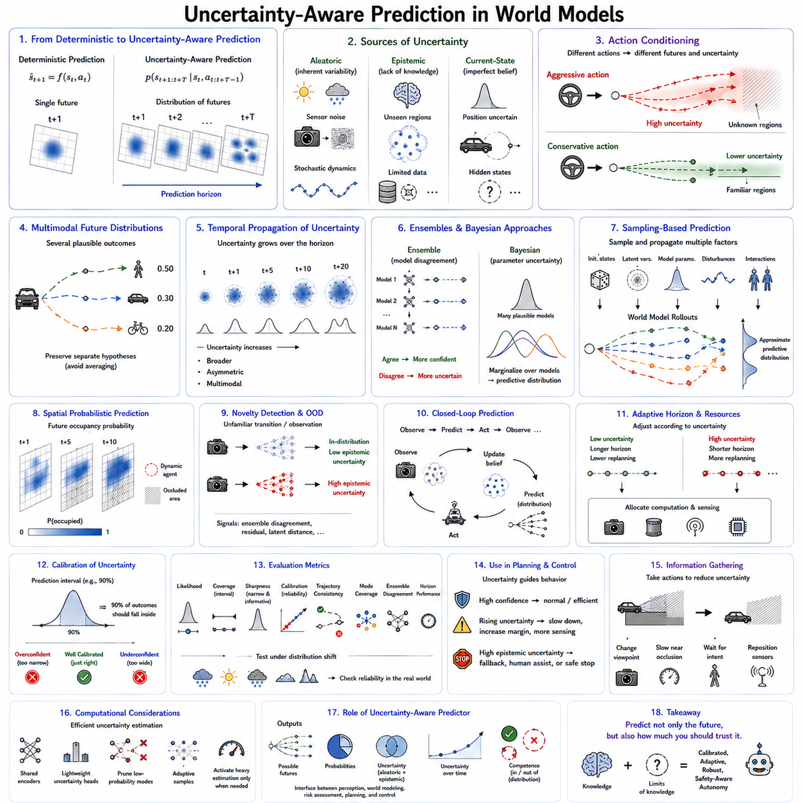{width="7.268055555555556in" height="7.268055555555556in"}

불확실성 인지 예측(uncertainty-aware prediction)은 무엇이 발생할 가능성이 높은지를 추정하는 것을 넘어 각각의 예측이 얼마나 신뢰할 수 있는지를 명시적으로 추정함으로써 월드 모델링(world modeling)을 확장한다. 모델은 미래 상태, 궤적(trajectory), 점유 지도(occupancy map)만 생성하는 것이 아니라 이러한 결과를 둘러싼 불확실성도 함께 표현한다. 이를 통해 물리 인공지능(Physical AI) 시스템은 확신할 수 있는 예측과 모호한 예측을 구별하고 예측 지식의 품질에 따라 의사결정을 조정할 수 있다.

일반적인 결정론적 예측기(deterministic predictor)는 현재 상태와 행동을 (\\hat{s}\*{t+1}=f(s_t,a_t))와 같은 하나의 미래 추정값으로 매핑한다. 반면 불확실성 인지 예측기는 (p(s\*{t+1:t+T}\\mid s_t,a_{t:t+T-1}))를 표현하여 가능한 미래에 대한 분포를 유지한다. 따라서 예측은 기대되는 세계 변화뿐 아니라 현재 정보가 주어진 상태에서 여전히 가능성이 있는 대안들의 범위까지 함께 설명하게 된다.

불확실성은 여러 원인에서 발생한다. 우연적 불확실성(aleatoric uncertainty)은 센서 잡음, 마찰 변화, 인간 행동, 확률적 상호작용(stochastic interaction) 등 관측과 물리 과정에 내재된 변동성을 나타낸다. 인식론적 불확실성(epistemic uncertainty)은 불충분하거나 대표성이 부족한 학습 경험으로 인한 학습 지식의 한계를 나타낸다. 효과적인 예측에서는 이러한 불확실성의 원인을 구별해야 하는데, 각각이 서로 다른 운용 대응을 요구하기 때문이다.

현재 상태 불확실성(current-state uncertainty)은 미래 예측의 출발점을 형성한다. 카메라(camera), 라이다(LiDAR), 레이더(radar), 관성측정장치(IMU), 고유수용감각(proprioception) 등의 센서는 환경에 대해 불완전한 증거를 제공한다. 따라서 물체의 위치, 속도, 의미적 정체성(semantic identity), 지형 특성, 숨겨진 상태(hidden state)는 예측이 시작되기 전부터 이미 불확실할 수 있다. 월드 모델(world model)은 추정된 현재 상태를 완벽하게 알려진 것으로 취급하는 대신 이러한 믿음(belief)을 전파해야 한다.

행동 조건화(action conditioning) 역시 중요하다. 미래의 불확실성은 에이전트가 무엇을 하려고 하는지에 따라 달라지기 때문이다. 서로 다른 제어 시퀀스(control sequence)는 서로 다른 미래 상태와 서로 다른 수준의 불확실성을 만들어낼 수 있다. 공격적인 기동(aggressive maneuver)은 관측이 부족한 동역학 영역으로 빠르게 진입할 수 있는 반면, 보수적인 행동은 익숙하고 관측 가능한 영역에 머무를 수 있다. 따라서 예측은 후보 행동에 따라 기대 결과와 그 불확실성이 어떻게 변화하는지를 함께 추정해야 한다.

질적으로 서로 다른 여러 결과가 가능할 때는 다중모드 미래 분포(multimodal future distribution)가 필요하다. 보행자는 계속 이동하거나, 멈추거나, 방향을 바꿀 수 있고, 다른 로봇은 진행하거나 양보할 수 있으며, 물체는 정지 상태를 유지하거나 움직이기 시작할 수 있다. 이러한 대안들을 평균하면 비현실적인 미래가 만들어질 수 있다. 불확실성 인지 예측은 이들을 너무 일찍 하나로 통합하지 않고 각각의 가설을 유지하며 그에 따른 확률을 할당한다.

시간적 전파(temporal propagation)는 예측 지평(prediction horizon)에 따라 예측 불확실성이 어떻게 변화하는지를 결정한다. 현재 시점에서 작은 불확실성도 오차, 확률적 사건, 숨겨진 의도(hidden intention), 모델 한계가 누적되면서 확대될 수 있다. 분포는 넓어지고 비대칭적으로 변하거나 여러 모드(mode)로 분기될 수 있다. 따라서 유용한 월드 모델은 미래 상태뿐 아니라 단기 예측에서 장기 예측으로 갈수록 신뢰도가 어떻게 변화하는지도 예측해야 한다.

모델 앙상블(model ensemble)은 인식론적 불확실성을 추정하는 실용적인 메커니즘을 제공한다. 독립적으로 학습된 여러 예측기가 동일한 상태와 행동 시퀀스를 처리한다. 모델들이 서로 일치한다면 학습된 동역학이 비교적 충분히 제약되어 있음을 의미하며, 불일치한다면 기반 모델 자체에 대한 불확실성이 존재함을 나타낸다. 앙상블 예측은 각 모델이 예측한 우연적 불확실성과 결합되어 전체 예측 불확실성(overall predictive uncertainty)을 추정할 수 있다.

베이지안 접근법(Bayesian approach)은 모델 매개변수(parameter) 또는 함수에 대한 불확실성을 표현함으로써 이와 관련된 확률적 해석을 제공한다. 하나의 학습된 매개변수 구성이 정확하다고 가정하는 대신 사용 가능한 데이터가 뒷받침하는 여러 개의 타당한 모델을 예측 과정에서 고려한다. 따라서 근사 베이지안 방법(approximate Bayesian method)은 하나의 결정론적 신경망(deterministic neural network)에서는 드러나지 않는 불확실성을 나타낼 수 있지만, 연산 비용으로 인해 실시간 사용에는 제약이 있을 수 있다.

샘플링(sampling)은 복잡한 불확실성을 표현하는 유연한 방법을 제공한다. 여러 초기 상태, 잠재 변수(latent variable), 모델 매개변수, 환경 교란(environmental disturbance), 미래 상호작용 선택을 샘플링하여 월드 모델을 통해 전파할 수 있다. 이렇게 생성된 여러 가상 미래(imagined future)는 예측 분포를 근사하며 궤적의 분산, 대안적인 모드, 충돌 가능성, 모델 불일치가 커지는 영역을 드러낼 수 있다.

불확실성 인지 예측은 물리적 일관성(physical consistency)을 유지해야 한다. 예측 결과의 범위가 넓거나 다양하더라도 많은 미래가 동역학, 기하학적 구조, 접촉 제약(contact constraint), 의미적 관계를 위반한다면 유용하지 않다. 생성된 궤적은 로봇 운동학(robot kinematics), 물체 움직임, 지형 구조, 상호작용 규칙, 선택된 행동과 일관되어야 한다. 불확실성은 임의적인 변동이 아니라 가능한 대안(plausible alternative)을 표현해야 한다.

공간 예측(spatial prediction)은 확률적 점유(probabilistic occupancy)를 통해 불확실성을 표현할 수 있다. 각각의 셀(cell)이나 복셀(voxel)을 단순히 자유 또는 점유 상태로 표시하는 대신 모델은 미래 시간에 따른 점유 확률을 예측한다. 동적 에이전트(dynamic agent)는 여러 개의 가능한 미래 점유 영역을 생성할 수 있으며, 가려진 영역(occluded area)은 상당한 불확실성을 유지할 수 있다. 이러한 표현은 미래의 충돌 위험이 존재할 수 있는 위치에 대한 직접적인 정보를 계획기(planner)에 제공한다.

불확실성 인지 예측은 신규성 탐지(novelty detection)와도 밀접하게 연결된다. 관측이나 상태 전이가 학습 경험과 달라지면 인식론적 불확실성이 증가해야 한다. 앙상블 불일치(ensemble disagreement), 예측 잔차(prediction residual), 잠재 공간 거리(latent-space distance), 기타 신규성 신호를 통해 월드 모델이 익숙하지 않은 조건에서 동작하고 있음을 확인할 수 있다. 예측기는 부당하게 높은 신뢰도를 유지하는 대신 이러한 한계를 명확하게 전달해야 한다.

새로운 관측은 예측을 지속적으로 수정한다. 로봇은 행동하는 동안 반복적으로 감각 증거(sensory evidence)를 수신하므로 불확실한 예측이 무한히 먼 미래까지 전파되기 전에 수정할 수 있다. 따라서 실제 운용 과정은 관측(observation), 믿음 갱신(belief update), 확률적 예측(probabilistic prediction), 행동(action), 새로운 관측, 재예측이 반복되는 구조를 가진다. 이러한 폐루프 구조(closed-loop structure)는 불확실성 전파를 고립된 오프라인 예측 문제로 취급하지 않도록 한다.

예측 지평은 불확실성 수준에 따라 적응적으로 조절할 수 있다. 미래 분포가 집중된 상태를 유지하고 적절하게 보정(calibration)되어 있다면 장기 예측이 계획에 유용한 정보를 제공할 수 있다. 반대로 불확실성이 빠르게 증가하면 먼 미래의 예측은 정보 가치가 감소한다. 시스템은 이 경우 더 짧은 예측 지평을 강조하거나, 더 자주 재계획(replanning)하거나, 중요한 불확실성을 해결하기 위해 추가적인 연산 및 센싱 자원을 할당할 수 있다.

보정(calibration)은 불확실성 추정값 자체를 신뢰할 수 있는지를 결정한다. 모델이 90% 예측 구간(prediction interval)을 제시한다면 실제 관측 결과도 유사한 구간 안에 약 90%의 빈도로 포함되어야 한다. 과신하는 예측기(overconfident predictor)는 위험을 과소평가하며, 과소신뢰하는 예측기(underconfident predictor)는 지나치게 보수적인 행동을 유발할 수 있다. 따라서 불확실성 인지 예측에는 정확한 미래 추정과 함께 적절하게 보정된 확률 분포가 필요하다.

따라서 평가는 단순한 점 예측 오차(point prediction error) 이상을 측정해야 한다. 유용한 지표에는 가능도(likelihood), 포함률(coverage), 예리성(sharpness), 보정 오차(calibration error), 궤적 일관성(trajectory consistency), 모드 포괄성(mode coverage), 앙상블 불일치, 예측 지평에 따른 성능 등이 포함된다. 익숙한 검증 데이터에서 신뢰할 수 있어 보이는 불확실성 추정도 익숙하지 않은 실제 환경에서는 잘못될 수 있기 때문에 분포 이동(distribution shift) 상황에서의 평가가 특히 중요하다.

물리 인공지능에서 예측 품질은 궁극적으로 의사결정에 미치는 영향을 기준으로 평가되어야 한다. 개방된 공간에서 작은 위치 예측 오차는 큰 문제가 아닐 수 있지만 보행자, 장애물, 안정성 한계(stability limit), 접촉 전이(contact transition) 주변에서는 치명적일 수 있다. 따라서 불확실성 추정은 추상적인 통계 수치로만 평가하기보다 충돌 확률(collision probability), 제약 조건 만족(constraint satisfaction), 복구 가능성(recoverability), 작업 위험(task risk)과 연결되어야 한다.

계획기는 예측 불확실성을 이용하여 행동을 지속적으로 조절할 수 있다. 높은 신뢰도의 예측은 정상적이거나 더욱 효율적인 움직임을 허용할 수 있는 반면, 불확실성이 증가하면 속도 감소, 더 큰 안전 여유(safety margin), 추가 센싱, 더 짧은 계획 지평, 보수적인 궤적을 유발할 수 있다. 매우 높은 인식론적 불확실성은 신뢰할 수 있는 자율 예측이 더 이상 불가능할 경우 대체 제어(fallback control), 사람의 지원 또는 안전 정지(safe stop)를 활성화할 수 있다.

이는 예측과 정보 수집(information gathering) 사이에 직접적인 관계를 형성한다. 불확실성이 불완전한 관측에서 발생한다면 최선의 행동은 즉시 작업 진행을 최대화하는 행동이 아니라 미래의 지식을 개선하는 행동일 수 있다. 관측 시점(viewpoint)을 변경하거나, 가려진 영역 근처에서 속도를 낮추거나, 다른 에이전트가 의도를 드러낼 때까지 기다리거나, 센서를 재배치하면 불확실성을 줄이고 이후 더욱 안전한 의사결정을 가능하게 할 수 있다.

연산 효율성(computational efficiency)은 여전히 중요한 설계 제약이다. 완전한 확률 분포, 여러 가설, 앙상블 모델, 많은 수의 샘플 궤적을 유지하는 것은 엣지 플랫폼(edge platform)에서 많은 연산 비용을 요구할 수 있다. 실제 아키텍처는 인코더 공유(shared encoder), 경량 불확실성 헤드(lightweight uncertainty head), 낮은 확률의 모드 가지치기(mode pruning), 적응형 샘플 수 조절을 사용할 수 있으며, 신규성, 모델 불일치 또는 운용 위험이 커질 때만 비용이 높은 불확실성 추정을 활성화할 수도 있다.

따라서 성숙한 불확실성 인지 예측기(uncertainty-aware predictor)는 단순한 미래 예측 모듈 이상의 역할을 한다. 가능한 미래와 각각의 확률, 이러한 확률과 관련된 불확실성, 시간에 따른 불확실성의 변화, 현재 경험이 모델이 학습한 능력 범위(learned competence) 안에 존재하는지를 함께 추정한다. 이러한 출력은 지각(perception), 월드 모델링, 위험 평가(risk assessment), 계획, 제어를 연결하는 구조화된 인터페이스(structured interface)를 제공한다.

궁극적으로 불확실성 인지 예측은 물리 인공지능 시스템이 자신이 알고 있는 것뿐 아니라 자신이 가진 지식의 한계까지 표현할 수 있도록 한다. 목표는 단순히 미래를 정확하게 예측하는 것이 아니라 여러 미래가 여전히 가능할 때 이를 인식하고, 신뢰도가 언제 감소하는지를 파악하며, 언제 예측을 더 이상 강하게 신뢰해서는 안 되는지를 판단하는 것이다. 이러한 능력은 월드 모델 예측을 보정되고(calibrated), 적응적이며(adaptive), 강건하고(robust), 안전을 인지하는(safety-aware) 자율 행동을 위한 핵심 기반으로 변화시킨다.
