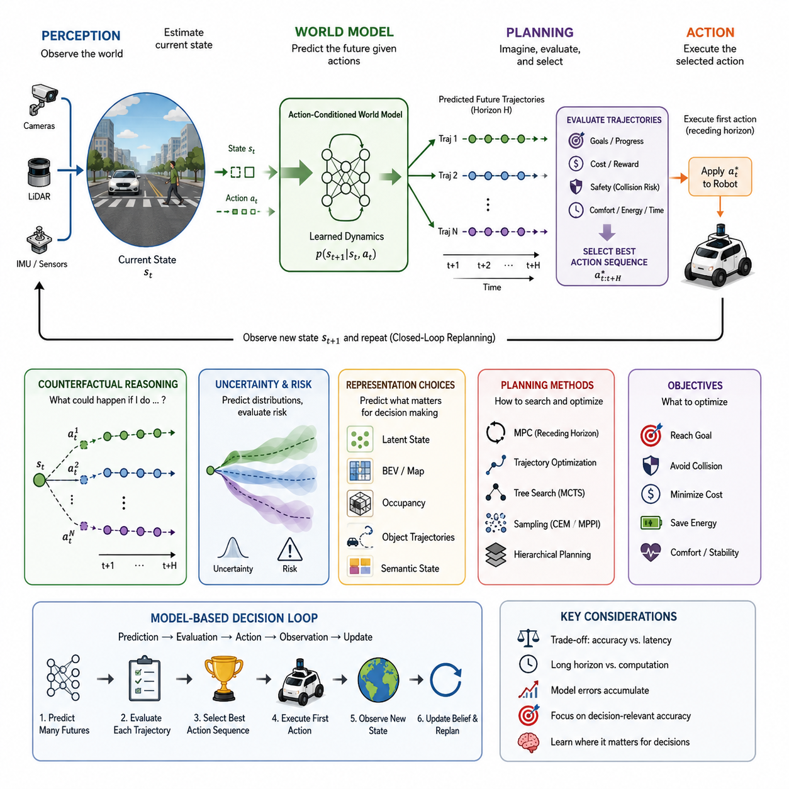
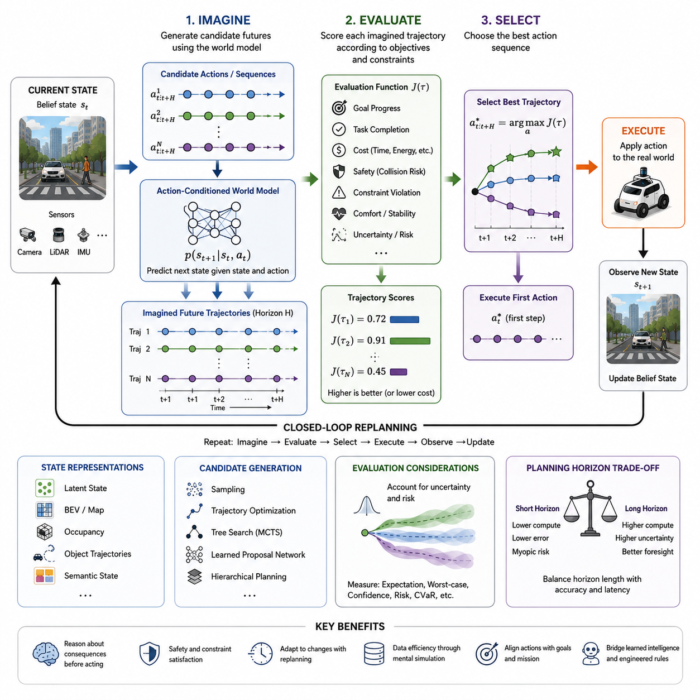
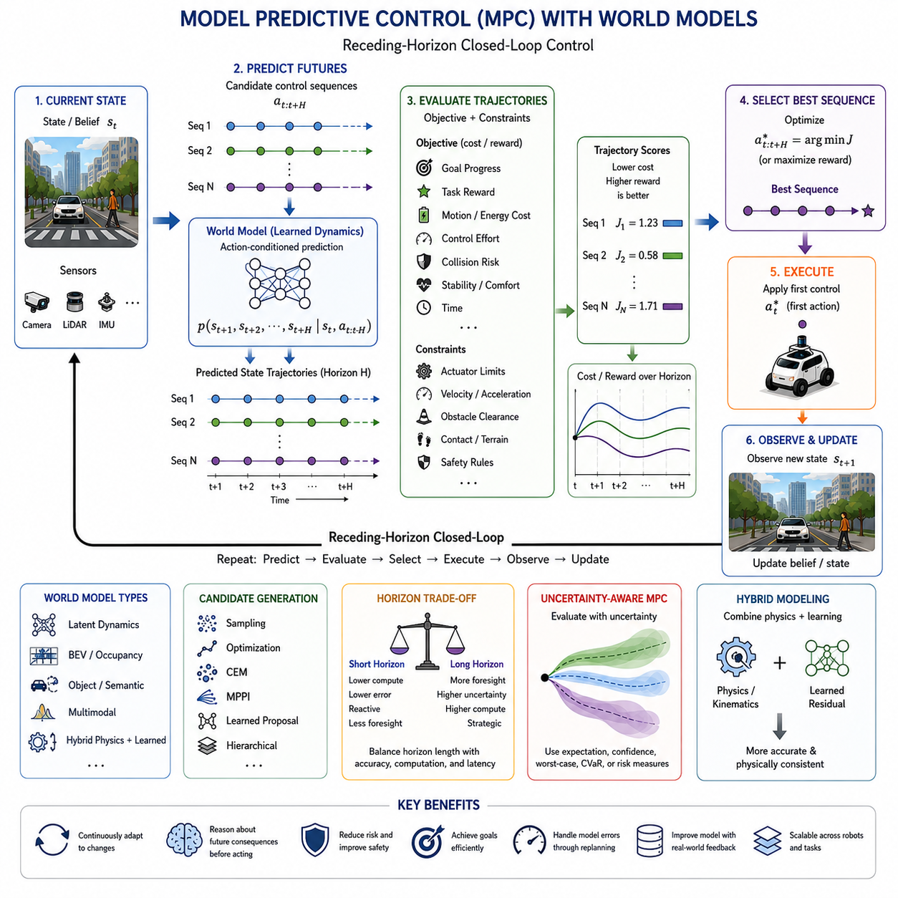
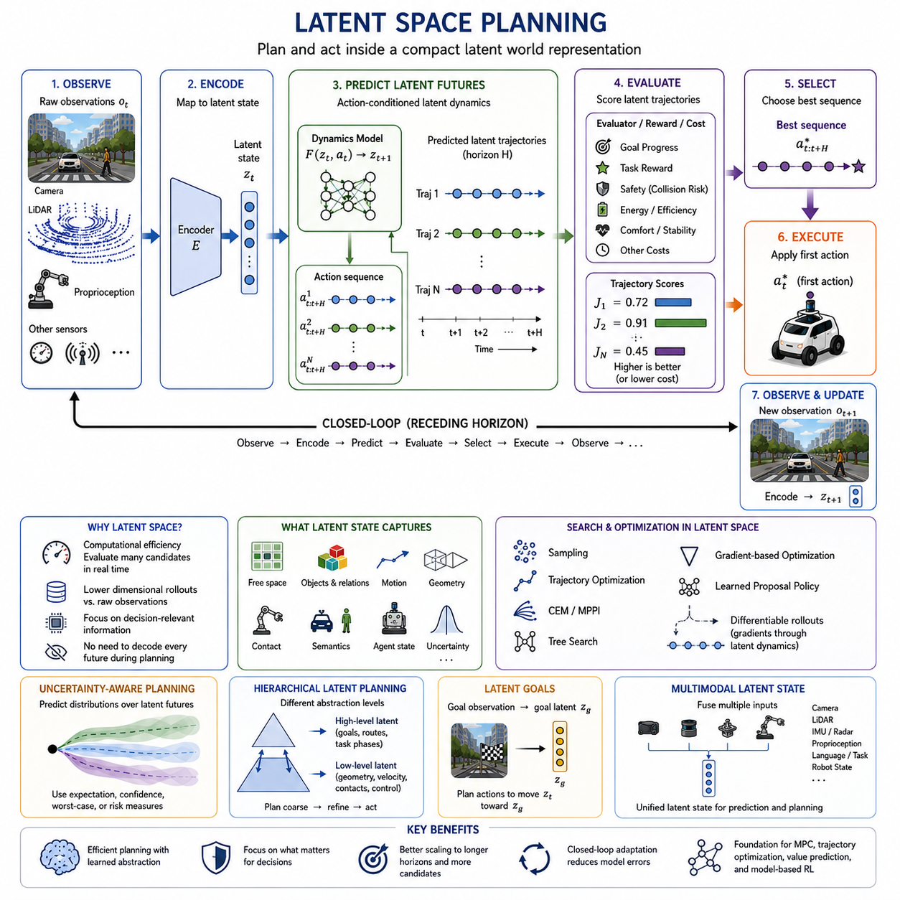
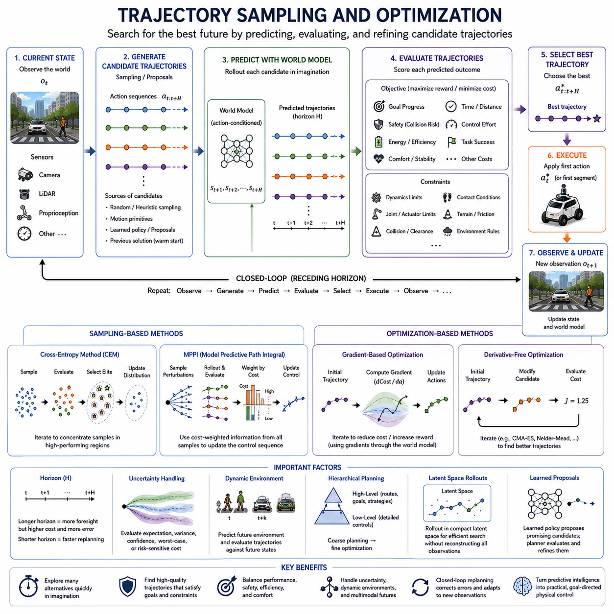
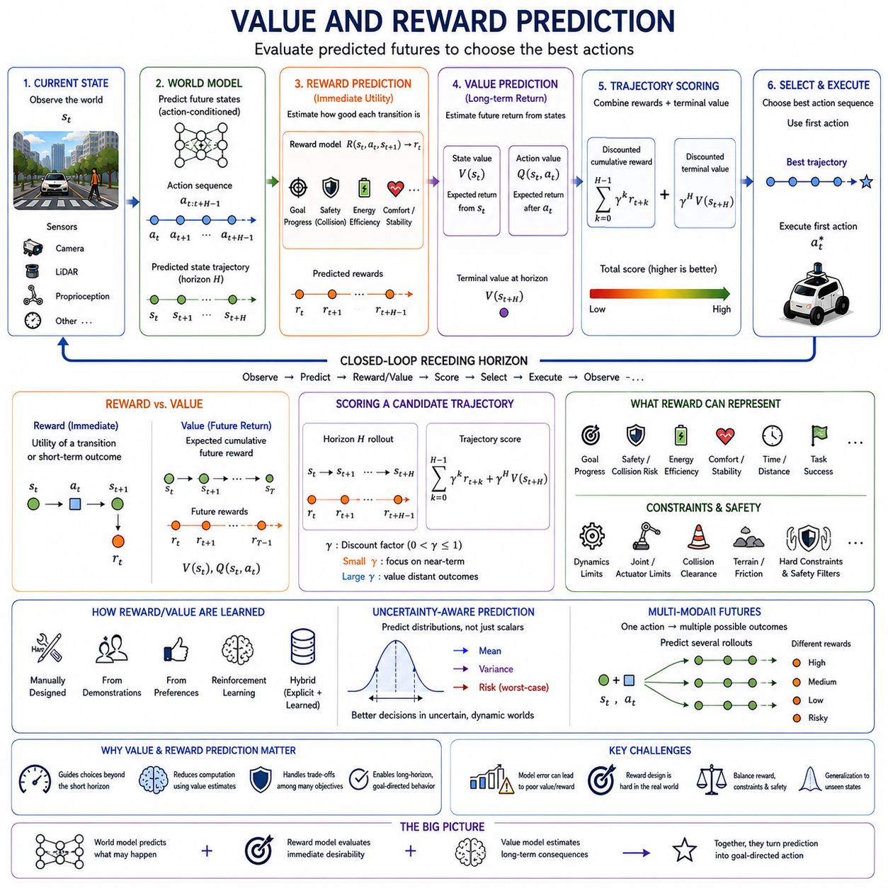
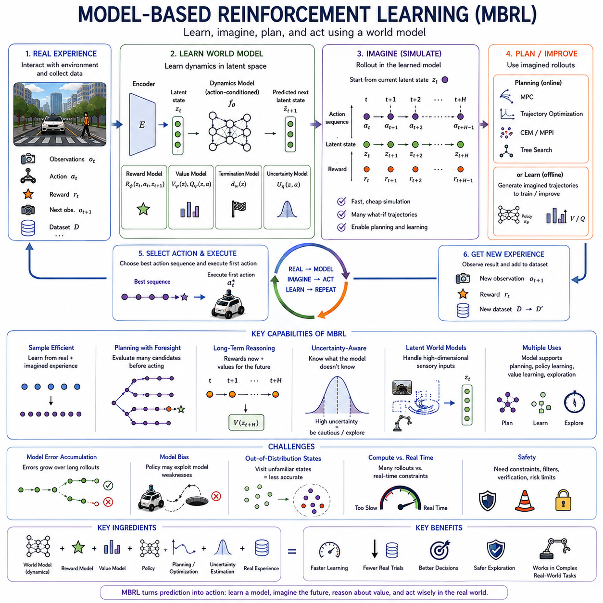
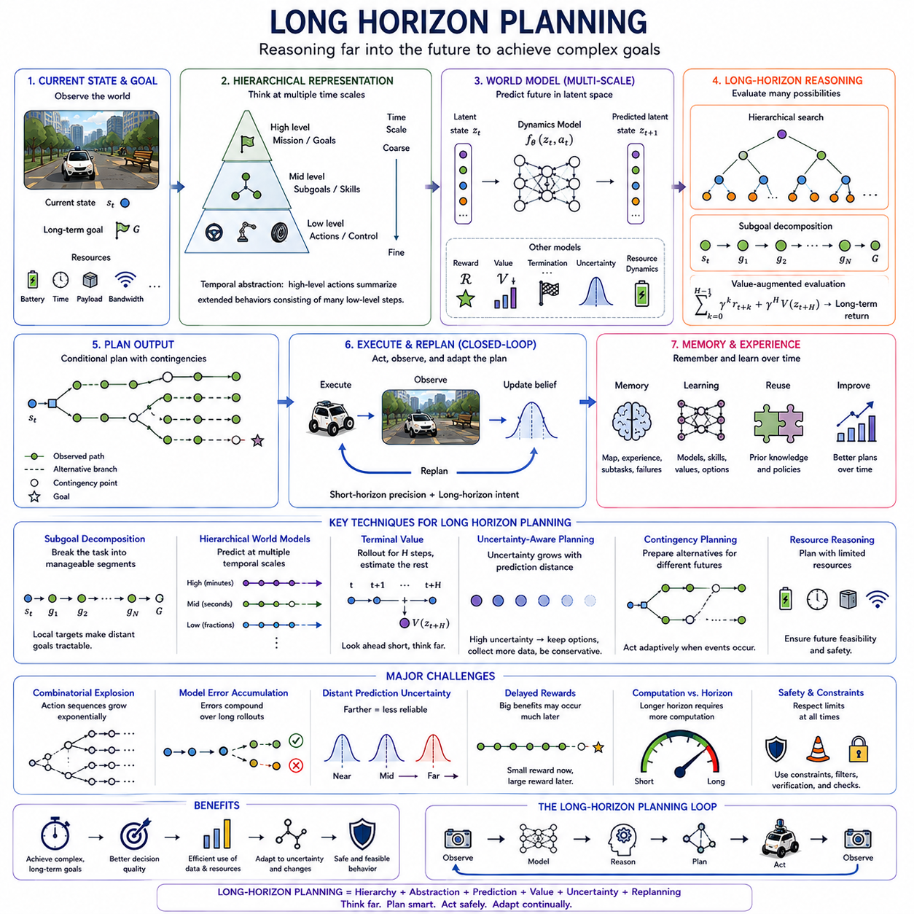
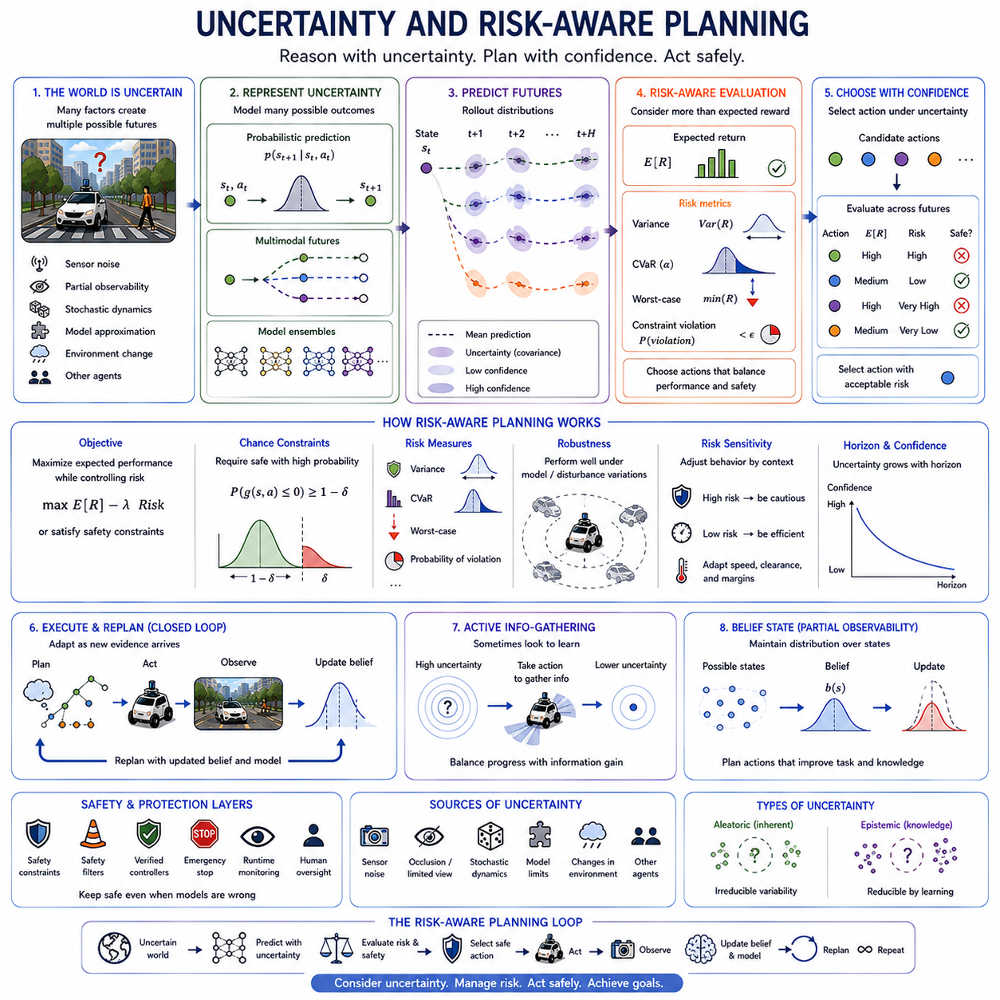
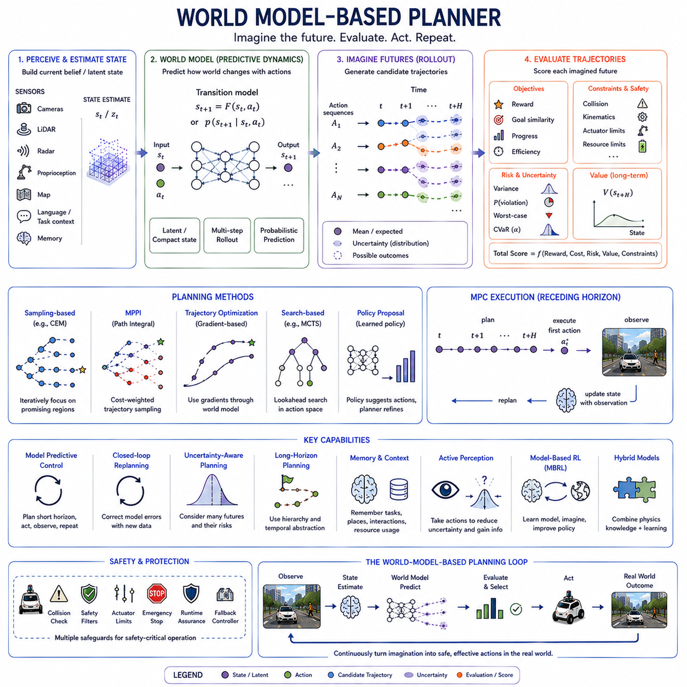

**Volume 07. World Models for Physical AI**

# Chapter 13. World Models for Planning

## 13.01. From Prediction to Planning

{width="7.268055555555556in" height="7.268055555555556in"}

월드 모델(World Model)은 예측(Prediction)이 계획(Planning)으로 전환될 때 실제 운용 가치를 갖게 된다. 예측은 현재 상태를 바탕으로 다음에 어떤 일이 발생할 수 있는지를 추정하는 반면, 계획은 원하는 미래를 만들어 내기 위해 어떤 행동 순서(Action Sequence)를 선택해야 하는지를 결정한다. 이러한 전환을 통해 월드 모델은 수동적인 미래 예측 장치에서 물리적 환경에서 목적 지향적 행동(Goal-Directed Behavior)을 지원하는 내부 시뮬레이터(Internal Simulator)로 발전한다.

피지컬 AI(Physical AI)에서 계획은 단순히 가장 가능성이 높은 미래에만 의존할 수 없다. 로봇은 서로 다른 행동이 미래 상태를 어떻게 변화시키는지를 고려하고 그 결과를 비교해야 한다. 현재 상태 (s_t)와 후보 행동(Candidate Action) (a_t)가 주어지면, 행동 조건부 월드 모델(Action-Conditioned World Model)은 (s_{t+1})을 예측한다. 이 과정을 반복하면 로봇이 자신의 행동을 통해 만들어 낼 수 있는 서로 다른 미래를 나타내는 가상 궤적(Hypothetical Trajectory)이 생성된다.

이러한 능력은 예측(Forecasting)과 개입(Intervention) 사이에 중요한 차이를 만든다. 예측 모델(Predictive Model)은 보행자가 로봇의 진행 경로를 가로지를 것이라고 예상할 수 있지만, 계획 시스템(Planning System)은 로봇이 감속하거나 정지하거나 방향을 전환하거나 계속 이동할 경우 각각 어떤 일이 발생하는지를 평가해야 한다. 따라서 월드 모델은 단순히 무엇이 일어날지를 예측하는 것이 아니라 대안적 행동(Alternative Action)에 따라 무엇이 일어날 수 있는지를 예측하는 반사실적 추론(Counterfactual Reasoning)의 메커니즘이 된다.

따라서 계획은 의사결정 루프(Decision Loop) 내부에서 반복적으로 수행되는 예측으로 이해할 수 있다. 후보 행동이나 궤적을 생성하고, 월드 모델은 각각의 후보를 시간에 따라 미래로 전개(Rollout)하며, 예측된 결과는 목표(Goal), 제약조건(Constraint), 비용(Cost), 보상(Reward), 안전 요구사항(Safety Requirement)에 따라 평가된다. 그중 가장 바람직한 예측 결과와 연결된 행동 순서가 실제 실행을 위한 후보가 된다.

계획 문제(Planning Problem)는 일반적으로 계획 구간(Horizon) (H)에 걸친 행동 순서 (a_{t:t+H}) 중 기대 효용(Expected Utility)을 최대화하거나 누적 비용(Cumulative Cost)을 최소화하는 행동 순서를 선택하는 문제로 표현된다. 월드 모델은 각 궤적을 따라 예측 상태(Predicted State)를 제공하며, 목적 함수(Objective Function)는 목표까지의 진행 정도, 충돌 위험, 에너지 소비, 이동 시간, 안정성, 승차감 또는 작업 완료 여부와 같은 특성을 평가한다.

물리적 환경(Physical Environment)은 미래가 거의 항상 결정론적이지 않기 때문에 이러한 과정을 더욱 어렵게 만든다. 다른 에이전트(Agent)는 예측할 수 없는 방식으로 행동할 수 있고, 센서 관측은 불완전할 수 있으며, 지형 특성은 불확실할 수 있고, 로봇 자체의 동역학(Dynamics)도 변화할 수 있다. 따라서 유용한 계획기는 모든 후보 행동이 완벽하게 알려진 하나의 궤적을 생성한다고 가정하기보다 가능한 미래들의 확률 분포(Distribution)를 기반으로 추론해야 한다.

앞에서 다룬 불확실성(Uncertainty)은 예측에서 계획으로 전환되는 과정에서 특히 중요해진다. 대안적 미래가 에이전트에게 서로 다른 결과를 가져올 때 예측 불확실성(Predictive Uncertainty)은 의사결정 불확실성(Decision Uncertainty)이 된다. 기대 보상(Expected Reward)이 높은 궤적이라도 충돌이나 불안정성이 발생할 확률이 상당하다면 바람직하지 않을 수 있다. 따라서 계획은 예측 결과뿐만 아니라 신뢰도(Confidence), 불확실성(Uncertainty), 위험(Risk)을 함께 고려한다.

월드 모델 계획(World-Model Planning)은 표현 품질(Representation Quality)의 의미도 변화시킨다. 어떤 세부 정보가 의사결정에 영향을 주지 않는다면 표현이 환경의 모든 시각적 세부 사항을 재구성할 필요는 없다. 대신 행동과 관련된 결과(Action-Relevant Consequence)를 예측하는 데 필요한 정보를 보존해야 한다. 따라서 기하 구조(Geometry), 자유 공간(Free Space), 객체 움직임(Object Motion), 의미적 특성(Semantic Property), 물리적 제약(Physical Constraint), 에이전트 의도(Agent Intention), 불확실성(Uncertainty)은 사실적인 영상 재구성(Photorealistic Reconstruction)보다 더 중요할 수 있다.

이러한 원리는 잠재 공간(Latent Space) 또는 구조화된 상태 공간(Structured State Space)에서 직접 계획을 수행하는 접근을 가능하게 한다. 가능한 모든 행동에 대해 완전한 미래 카메라 영상을 생성하는 대신, 계획기는 미래 잠재 상태(Latent State), 조감도 표현(Bird\'s-Eye View, BEV), 점유 표현(Occupancy Field), 객체 궤적(Object Trajectory), 또는 압축된 의미 상태(Semantic State)를 예측할 수 있다. 이러한 표현은 계획에 필요한 정보를 유지하면서 계산 비용을 크게 줄일 수 있다.

계획은 또한 근본적인 계산량 절충(Computational Tradeoff)을 발생시킨다. 더 많은 후보 궤적, 더 긴 예측 구간(Prediction Horizon), 더 풍부한 월드 표현(World Representation), 더 많은 확률적 샘플(Probabilistic Sample)은 의사결정 품질을 향상시킬 수 있지만 추론 지연(Inference Latency)과 에너지 소비를 증가시킨다. 특히 임베디드(Embedded) 또는 엣지 컴퓨팅(Edge Computing) 플랫폼에서 의사결정을 수행하는 피지컬 AI 시스템은 계획 깊이(Planning Depth)와 실시간 제약(Real-Time Constraint) 사이에서 균형을 유지해야 한다.

계층적 계획(Hierarchical Planning)은 이러한 문제를 해결하는 하나의 방법을 제공한다. 상위 수준 계획기(High-Level Planner)는 비교적 긴 시간 범위에서 목표, 경로, 작업 또는 의미 상태를 추론하고, 하위 수준 계획기(Low-Level Planner)는 짧은 시간 범위에서 세부적인 움직임을 평가할 수 있다. 동일한 월드 모델이 여러 시간적·공간적 규모를 지원함으로써 거시적인 장기 추론(Coarse Long-Range Reasoning)이 정밀한 지역 행동 선택(Local Action Selection)을 안내하도록 만들 수 있다.

또 다른 중요한 특성은 폐루프 재계획(Closed-Loop Replanning)이다. 교란(Disturbance), 모델 오차(Model Error), 예상하지 못한 사건이 누적되기 때문에 예측은 시간 범위가 길어질수록 필연적으로 부정확해진다. 로봇은 전체 예측 궤적을 한 번에 실행하는 대신 즉각적인 행동이나 짧은 행동 구간만 실행한 후, 그 결과로 나타난 환경을 다시 관측하고 내부 상태를 갱신하며 최신 정보를 사용하여 다시 계획할 수 있다.

이러한 반복적인 예측-행동-관측(Prediction-Action-Observation) 순환은 월드 모델 기반 계획을 모델 예측 제어(Model Predictive Control, MPC)와 자연스럽게 연결한다. 각 계획 단계에서 제한된 시간 범위에 대해 여러 미래 궤적을 상상하고 평가하며 최적화할 수 있다. 그중 첫 번째 행동만 실행한 다음 전체 과정을 다시 수행한다. 지속적인 재계획(Continuous Replanning)을 통해 시스템은 현재 행동을 선택할 때 미래의 결과를 활용하면서도 예측 오차를 지속적으로 수정할 수 있다.

학습된 월드 모델(Learned World Model)을 이용한 계획은 에이전트가 학습 데이터에서 정확히 경험한 적이 없는 상황도 평가할 수 있게 한다. 시스템은 학습된 동역학(Learned Dynamics)과 후보 행동을 결합하여 실제로 행동하기 전에 내부적으로 대안 궤적을 탐색할 수 있다. 이러한 내부 실험(Internal Experimentation)은 불필요한 실제 환경 실험을 줄이고 데이터 효율성(Data Efficiency)을 높이며 모델 기반 강화학습(Model-Based Reinforcement Learning)의 기반을 제공할 수 있다.

그러나 계획의 품질은 궁극적으로 의사결정과 관련된 영역에서 월드 모델이 얼마나 정확한가에 의해 제한된다. 관련성이 낮은 시각적 세부 사항에서 발생하는 작은 예측 오차는 문제가 되지 않을 수 있지만, 충돌 경계(Collision Boundary), 접촉 동역학(Contact Dynamics), 정지 거리(Stopping Distance), 다른 에이전트의 움직임과 관련된 오차는 위험할 수 있다. 따라서 계획을 위한 월드 모델은 단순한 예측 정확도뿐만 아니라 실제 의사결정에 미치는 영향을 기준으로 학습되고 평가되어야 한다.

예측과 계획 사이의 관계는 따라서 양방향적(Bidirectional)이다. 예측은 후보 행동의 결과를 추정함으로써 계획을 가능하게 하고, 계획은 어떤 예측이 가장 중요한지를 결정한다. 어려운 의사결정 상황은 모델의 높은 정확도가 특히 필요한 상태(State), 행동(Action), 예측 구간(Horizon)을 드러내며, 이를 통해 학습과 데이터 수집을 의사결정에 중요한 환경 영역(Decision-Critical Region)에 집중시킬 수 있다.

성숙한 피지컬 AI 아키텍처(Physical AI Architecture)에서는 인지(Perception)가 현재를 추정하고, 월드 모델이 가능한 미래를 표현하고 예측하며, 계획(Planning)이 이러한 미래를 평가하고, 제어(Control)가 선택된 행동을 실제 물리적 움직임으로 변환한다. 새로운 관측으로부터 얻어진 피드백(Feedback)은 이 순환을 지속적으로 갱신한다. 따라서 월드 모델은 현재 무엇이 존재하는지를 이해하는 것과 에이전트가 다음에 무엇을 발생시켜야 하는지를 추론하는 것 사이의 핵심적인 연결 고리 역할을 한다.

따라서 예측에서 계획으로의 전환(From Prediction to Planning)은 월드 모델 발전에서 중요한 개념적 단계이다. 미래를 예측하는 시스템은 환경 동역학(Environment Dynamics)의 일부를 이해하지만, 자신의 가능한 행동에 따라 조건화된 여러 미래를 예측하는 시스템은 그 미래들 가운데 하나를 선택하기 시작할 수 있다. 목표, 제약조건, 불확실성, 물리적 결과에 따라 상상된 미래(Imagined Future)를 평가할 수 있을 때 비로소 계획이 형성된다.

이러한 관점은 이후의 월드 모델 기반 계획(World-Model-Based Planning)을 위한 기반을 제공한다. 다음 단계에서는 에이전트가 후보 미래를 체계적으로 상상(Imagine)하고, 평가(Evaluate)하고, 선택(Select)하는 방법과 함께 궤적 최적화(Trajectory Optimization), 보상 및 가치 예측(Reward and Value Prediction), 장기 계획(Long-Horizon Planning), 불확실성과 위험을 반영한 행동 선택을 다루게 된다. 이러한 메커니즘들이 결합되면서 학습된 예측 동역학(Learned Predictive Dynamics)은 목표 지향적 물리 지능(Goal-Directed Physical Intelligence)으로 전환된다.

## 13.02. Imagine Evaluate and Select

{width="7.268055555555556in" height="7.268055555555556in"}

월드 모델 기반 계획(World-Model-Based Planning)은 가능성 있는 미래를 상상(Imagine)하고, 그 결과를 평가(Evaluate)한 다음, 에이전트의 목표에 가장 적합한 행동을 선택(Select)하는 단순하지만 강력한 순환 과정으로 이해할 수 있다. 에이전트는 현재 관측에만 반응하는 대신 학습된 환경 동역학(Environmental Dynamics) 모델을 사용하여 서로 다른 행동이 현재 상태를 어떻게 다양한 미래 상태로 변화시킬 수 있는지를 내부적으로 시뮬레이션한다.

상상 단계(Imagine Stage)는 에이전트의 현재 상태(Current State) 또는 신념 상태(Belief State)에서 시작하여 후보 행동(Candidate Action), 행동 순서(Action Sequence), 또는 궤적(Trajectory)을 생성한다. 각각의 후보는 행동 조건부 월드 모델(Action-Conditioned World Model)을 통과하며, 이 모델은 계획 구간(Planning Horizon) 동안 환경과 에이전트가 어떻게 변화할지를 예측한다. 이러한 의미에서 상상은 시각적 공상이 아니라 가능한 미래 상태 순서를 내부적으로 생성하는 계산적 시뮬레이션(Computational Simulation)이다.

후보 행동 순서는 (a_{t:t+H})로 표현할 수 있으며, 여기서 (H)는 계획 구간(Planning Horizon)을 정의한다. (s_t)에서 시작하여 월드 모델은 (s_{t+1}, s_{t+2}, \\ldots, s_{t+H})를 반복적으로 예측한다. 따라서 서로 다른 행동 순서는 서로 다른 상상된 궤적(Imagined Trajectory)을 생성한다. 계획기는 실제 환경에서 모든 가능성을 물리적으로 실행하지 않고도 이러한 대안들을 탐색할 수 있다.

상상된 미래(Imagined Future)는 반드시 픽셀(Pixel)이나 재구성된 센서 관측(Sensor Observation)의 형태로 표현될 필요는 없다. 계획은 잠재 상태(Latent State), 조감도 표현(Bird\'s-Eye View, BEV), 점유장(Occupancy Field), 객체 궤적(Object Trajectory), 의미 상태(Semantic State), 또는 다른 압축된 표현(Compact Representation)을 기반으로 수행할 수 있다. 중요한 것은 예측된 표현이 바람직한 미래와 안전하지 않거나 비효율적이거나 실패하는 미래를 구분하는 데 필요한 정보를 보존하는 것이다.

후보 생성(Candidate Generation)은 단순한 샘플링(Sampling)에서 구조화된 탐색(Structured Search) 및 수치 최적화(Numerical Optimization)에 이르기까지 다양한 방식으로 수행될 수 있다. 이동 로봇(Mobile Robot)은 대안적인 속도와 경로를 샘플링할 수 있으며, 매니퓰레이터(Manipulator)는 서로 다른 도달 또는 파지 동작을 탐색할 수 있다. 보다 발전된 시스템은 궤적 최적화(Trajectory Optimization), 트리 탐색(Tree Search), 학습된 제안 네트워크(Learned Proposal Network), 또는 계층적 계획기(Hierarchical Planner)를 사용하여 유망한 행동 공간에 계산 자원을 집중할 수 있다.

평가 단계(Evaluate Stage)는 상상된 미래에 의미를 부여한다. 어떤 궤적이 물리적으로 가능하다는 사실만으로는 유용하다고 할 수 없으며, 그 결과를 에이전트의 목표와 비교할 수 있어야 한다. 평가 함수(Evaluation Function)는 작업 완료(Task Completion), 목표까지의 거리, 충돌 확률, 에너지 소비, 실행 시간, 안정성, 승차감, 조작 성공률, 제약조건 위반 또는 기타 임무별 기준(Mission-Specific Criterion)을 고려할 수 있다.

평가는 비용 함수(Cost Function), 보상 함수(Reward Function), 가치 함수(Value Function), 또는 이러한 메커니즘의 조합을 통해 표현할 수 있다. 예측된 궤적 (\\tau)에 대해 계획기는 계획 구간 전체의 누적 결과를 요약하는 목적 함수(Objective) (J(\\tau))를 추정할 수 있다. 이를 통해 복잡한 예측 상태의 연속을 하나의 평가량으로 변환하여 서로 다른 상상된 미래를 체계적으로 순위화하고 비교할 수 있다.

피지컬 AI(Physical AI)의 평가는 보상뿐만 아니라 제약조건(Constraint)도 포함해야 한다. 목표에 빠르게 도달하는 궤적이라도 사람에게 지나치게 가까이 접근하거나, 액추에이터 한계(Actuator Limit)를 초과하거나, 주행 불가능 지형(Non-Traversable Terrain)에 진입하거나, 안정성 한계(Stability Margin)를 위반하거나, 과도한 에너지를 소비한다면 허용될 수 없다. 따라서 계획은 유익한 미래뿐만 아니라 물리적으로 실행 가능하고 운영상 안전한 미래를 찾아야 한다.

불확실성(Uncertainty)은 상상된 미래를 평가하는 방식에도 영향을 준다. 불확실한 객체 움직임, 불완전한 관측, 확률적 동역학(Stochastic Dynamics), 제한된 모델 지식으로 인해 월드 모델은 동일한 행동 순서에 대해서도 여러 가능한 결과를 예측할 수 있다. 따라서 계획기는 기대 성능(Expected Performance)뿐만 아니라 불확실성, 최악의 결과(Worst-Case Outcome), 신뢰 구간(Confidence Bound), 또는 명시적인 위험 척도(Risk Measure)를 함께 고려해야 한다.

이는 가장 높은 기대 보상(Expected Reward)을 제공하는 행동이 항상 최선의 행동은 아니라는 것을 의미한다. 한 궤적은 목적지에 조금 더 빠르게 도달하지만 점유 상태가 불확실한 영역을 통과하고, 다른 궤적은 더 많은 시간이 필요하지만 충분히 관측된 자유 공간(Free Space)을 통과한다고 가정할 수 있다. 위험 인식 계획기(Risk-Aware Planner)는 두 번째 궤적의 예측 결과가 더 신뢰할 수 있고 잠재적 실패 비용이 낮기 때문에 이를 의도적으로 선택할 수 있다.

선택 단계(Select Stage)는 평가 결과를 실제 의사결정으로 변환한다. 후보 궤적의 점수가 계산된 후 계획기는 진행도, 비용, 안전성, 불확실성, 제약조건 사이에서 가장 바람직한 균형을 제공하는 행동 순서를 결정한다. 형식적으로 선택은 월드 모델이 예측한 미래를 기반으로 계획 목적을 최적화하는 (a\^\*_{t:t+H})를 선택하는 과정으로 이해할 수 있다.

선택되었다고 해서 전체 행동 순서를 반드시 모두 실행해야 하는 것은 아니다. 폐루프 계획(Closed-Loop Planning)에서는 일반적으로 선택된 궤적의 첫 번째 행동 또는 짧은 구간만 실행한다. 이후 에이전트는 새로운 관측을 획득하고 상태 추정(State Estimate)을 갱신하며, 새로운 미래를 상상하고, 다시 평가한 후 새로운 행동을 선택한다. 이러한 이동 구간 전략(Receding-Horizon Strategy)을 통해 변화하는 물리적 조건에 지속적으로 계획을 적응시킬 수 있다.

따라서 상상(Imagine), 평가(Evaluate), 선택(Select)은 서로 분리된 단계가 아니라 반복적으로 실행되는 계산 루프(Computational Loop)로 동작한다. 상상은 가능한 미래의 공간을 확장하고, 평가는 어떤 미래가 바람직한지를 판단하며, 선택은 이러한 비교 결과를 행동으로 변환한다. 새로운 관측이 들어오면 갱신된 상태에서 전체 과정이 다시 시작되어 환경 변화에 따라 에이전트가 자신의 의도를 지속적으로 수정할 수 있다.

이 과정의 품질은 상상된 미래의 다양성(Diversity)에 크게 의존한다. 후보 생성이 매우 제한된 행동 집합만 탐색한다면 월드 모델이 정확하더라도 계획기는 더 나은 해결책을 발견하지 못할 수 있다. 반대로 지나치게 많은 후보를 생성하면 계산 비용이 크게 증가할 수 있다. 따라서 효과적인 계획은 대안 탐색(Exploration of Alternatives)과 실시간 피지컬 AI의 지연시간 및 계산 자원 제약 사이에서 균형을 유지해야 한다.

계획 구간(Planning Horizon)은 또 다른 중요한 절충 관계(Tradeoff)를 만든다. 짧은 계획 구간은 계산량과 예측 오차를 줄일 수 있지만 장기적으로 좋지 않은 결과를 초래하는 국소적으로 매력적인 결정을 선택하게 만들 수 있다. 긴 계획 구간은 지연된 결과와 전략적 대안을 파악할 수 있지만 시간이 길어질수록 월드 모델의 불확실성과 누적 예측 오차가 증가한다. 실용적인 계획기는 짧은 구간의 정밀한 추론과 긴 구간의 거시적 추론(Coarse Reasoning)을 결합하는 경우가 많다.

계층적 상상(Hierarchical Imagination)은 서로 다른 추상화 수준에서 미래를 표현함으로써 이러한 균형을 지원할 수 있다. 상위 수준 과정은 복도에 도달하기, 배송 완료하기, 조작 전략 선택하기와 같은 의미적 결과(Semantic Outcome)를 상상할 수 있다. 이후 하위 수준 계획은 선택된 상위 의도를 실현하는 데 필요한 세부 궤적, 속도, 접촉(Contact), 제어 행동(Control Action)을 평가할 수 있다.

학습된 가치 함수(Learned Value Function)는 모든 궤적을 최종 결과까지 시뮬레이션해야 하는 필요성을 줄일 수도 있다. 월드 모델을 작업이 완전히 종료될 때까지 전개하는 대신 계획기는 몇 단계의 미래를 예측한 다음 가치 추정(Value Estimate)을 사용하여 나머지 미래의 바람직함을 근사할 수 있다. 이러한 조합은 월드 모델 계획을 모델 기반 강화학습(Model-Based Reinforcement Learning) 및 장기 의사결정(Long-Horizon Decision Making)과 연결한다.

상상-평가-선택(Imagine-Evaluate-Select) 프레임워크는 학습된 지능(Learned Intelligence)과 공학적으로 설계된 제약조건(Engineered Constraint)을 연결하는 자연스러운 인터페이스도 제공한다. 월드 모델은 데이터로부터 복잡한 환경 동역학을 학습하고, 명시적 안전 규칙(Safety Rule), 운동학적 한계(Kinematic Limit), 충돌 제약(Collision Constraint), 임무 요구사항(Mission Requirement)은 평가와 선택 과정에 함께 참여할 수 있다. 이를 통해 학습된 예측이 물리적 실행 가능성과 시스템 안전성이 정의하는 경계 안에서 작동하도록 할 수 있다.

궁극적으로 평가가 없는 상상은 가능성만 생성할 뿐 선호를 만들지 못하며, 선택이 없는 평가는 판단만 생성할 뿐 행동으로 이어지지 못한다. 선택은 예측된 가능성을 실제 물리적 행동으로 변환함으로써 추론 과정을 완성한다. 이 세 가지 연산이 인지(Perception) 및 피드백(Feedback)과 지속적으로 연결되면 피지컬 AI 에이전트가 실제 행동에 앞서 그 결과를 추론할 수 있는 실용적인 메커니즘이 형성된다.

결과적으로 이러한 아키텍처는 현재 상태(Current State)에서 후보 행동(Candidate Action), 상상된 미래 궤적(Imagined Future Trajectory), 평가(Evaluation), 선택(Selection), 실행(Execution), 관측(Observation), 재계획(Replanning)으로 이어지는 반복적인 흐름으로 요약할 수 있다. 이러한 구조는 모델 예측 제어(Model Predictive Control, MPC), 잠재 공간 계획(Latent-Space Planning), 궤적 샘플링 및 최적화(Trajectory Sampling and Optimization), 가치 예측(Value Prediction), 모델 기반 강화학습(Model-Based Reinforcement Learning), 불확실성 인식 계획(Uncertainty-Aware Planning)과 같은 보다 구체적인 계획 방법의 개념적 기반을 제공한다.

## 13.03. Model Predictive Control with World Models

{width="7.268055555555556in" height="7.268055555555556in"}

모델 예측 제어(Model Predictive Control, MPC)는 예측형 월드 모델(Predictive World Model)을 지속적인 물리적 행동으로 전환하는 자연스러운 메커니즘을 제공한다. MPC는 완전한 계획을 한 번 계산한 후 그대로 실행하는 대신, 미래 상태를 반복적으로 예측하고 후보 제어 순서(Candidate Control Sequence)를 평가하며 선택된 순서의 즉각적인 일부만 실행한 다음 새롭게 관측된 조건을 기반으로 다시 계획한다.

시간 (t)에서 에이전트는 현재 상태(Current State) 또는 신념 상태(Belief State) (s_t)를 유지하고, 유한한 예측 구간(Prediction Horizon) (H)에 걸쳐 후보 제어 순서 (a_{t:t+H})를 고려한다. 월드 모델은 각 순서를 미래로 전개(Rollout)하여 (s_{t+1}, s_{t+2}, \\ldots, s_{t+H})를 추정한다. 이러한 예측 궤적(Predicted Trajectory)은 서로 다른 제어 결정이 미래의 물리 시스템에 어떤 영향을 미칠 수 있는지를 보여주는 내부 시뮬레이션(Internal Simulation)을 제공한다.

계획기(Planner)는 목표 진행도(Goal Progress), 작업 보상(Task Reward), 이동 비용(Motion Cost), 에너지 소비(Energy Consumption), 제어 노력(Control Effort), 충돌 위험(Collision Risk), 안정성(Stability), 승차감(Comfort) 및 기타 요구사항을 결합할 수 있는 목적 함수(Objective Function)를 사용하여 각각의 예측 궤적을 평가한다. 또한 제약조건(Constraint)은 액추에이터 한계, 속도 제한, 장애물 이격 거리, 주행 가능성(Traversability), 접촉 조건(Contact Condition), 운영 안전 규칙 등을 나타낼 수 있으며 후보 궤적은 이러한 조건을 만족해야 한다.

최적화 문제(Optimization Problem)는 개념적으로 예측 구간 전체에서 누적 비용(Cumulative Cost) (J)를 최소화하거나 기대 보상(Expected Reward)을 최대화하는 (a\^\*_{t:t+H})를 찾는 것으로 표현할 수 있다. 순수한 반응형 제어(Reactive Control)와 달리 이러한 최적화는 지연된 결과(Delayed Consequence)까지 고려한다. 즉각적으로 유리해 보이는 행동이라도 월드 모델이 몇 단계 이후에 위험하거나 비효율적이거나 처리하기 어려운 상태를 초래할 것으로 예측한다면 선택되지 않을 수 있다.

MPC를 정의하는 핵심적인 특징은 이동 구간(Receding Horizon)이다. 계획기가 전체 행동 순서 (a\^\*_{t:t+H})를 최적화하더라도 로봇은 일반적으로 첫 번째 행동 (a\^\*_t) 또는 초기의 짧은 구간만 실행한다. 이후 센서가 그 결과로 나타난 상태를 관측하고, 내부 월드 표현(Internal World Representation)이 갱신되며, 계획 구간은 앞으로 이동하고, 최신 정보를 기반으로 새로운 최적화 문제가 다시 계산된다.

이러한 폐루프 구조(Closed-Loop Structure)는 학습된 월드 모델(Learned World Model)이 완벽하지 않기 때문에 피지컬 AI(Physical AI)에서 특히 중요하다. 롤아웃이 길어질수록 예측 오차가 누적되며 예상하지 못한 외란(Disturbance), 움직이는 객체, 지형 변화, 상호작용 힘(Interaction Force), 다른 에이전트의 행동 등이 이전에 예측된 미래를 무효화할 수 있다. 빈번한 재계획(Replanning)은 제어기가 더 이상 실제 물리 환경을 정확하게 설명하지 못하는 예측에 계속 의존하는 것을 방지한다.

전통적인 MPC는 일반적으로 해석적 동역학 모델(Analytical Dynamics Model) 또는 시스템 식별(System Identification)을 통해 얻어진 수학적 동역학 모델에 의존한다. 월드 모델 기반 MPC(World-Model-Based MPC)는 이러한 원리를 확장하여 학습된 동역학(Learned Dynamics)이 해석적으로 기술하기 어려운 복잡한 상태 전이를 예측할 수 있도록 한다. 따라서 신경망 잠재 동역학(Neural Latent Dynamics), 행동 조건부 예측 모델(Action-Conditioned Predictive Model), BEV 월드 모델(BEV World Model), 점유 예측기(Occupancy Predictor), 멀티모달 모델(Multimodal Model), 또는 물리-학습 하이브리드 모델(Hybrid Physics-Learned Model)을 MPC 루프의 예측 구성요소로 사용할 수 있다.

예측 상태(Predicted State)는 완전한 센서 관측을 재현할 필요가 없다. 효율적인 제어를 위해 월드 모델은 움직임과 의사결정에 필요한 정보를 포함하는 압축된 잠재 상태(Latent State)에서 동작할 수 있다. 또는 내비게이션 시스템은 미래의 조감도(Bird\'s-Eye View, BEV)나 점유 표현(Occupancy Representation)을 예측할 수 있으며, 조작 시스템(Manipulation System)은 객체 자세(Object Pose), 접촉(Contact), 로봇 구성(Robot Configuration), 작업 관련 의미 속성(Task-Relevant Semantic Property)을 모델링할 수 있다.

후보 제어 순서는 여러 가지 방식으로 생성하고 최적화할 수 있다. 무작위 또는 구조화된 샘플링(Random or Structured Sampling)을 통해 많은 가능 궤적을 생성하고 월드 모델을 사용하여 평가할 수 있다. 최적화 기법은 유망한 제어 순서를 반복적으로 개선할 수 있으며, 교차 엔트로피 방법(Cross-Entropy Method, CEM)이나 모델 예측 경로 적분 제어(Model Predictive Path Integral Control, MPPI)와 같은 기법은 좋은 예측 결과와 연결된 행동 주변에 계산 자원을 집중할 수 있다.

예측 구간(Prediction Horizon)은 MPC의 동작 특성에 큰 영향을 미친다. 짧은 예측 구간은 계산 요구량을 줄이고 월드 모델의 누적 오차를 제한하여 빠른 재계획을 가능하게 한다. 그러나 더 먼 미래에 발생하는 결과를 인식하지 못할 수 있다. 긴 예측 구간은 더 넓은 미래를 고려할 수 있지만 예측 불확실성(Prediction Uncertainty), 최적화 복잡도(Optimization Complexity), 메모리 요구량, 추론 지연(Inference Latency)을 증가시킨다.

제어 주기(Control Frequency)는 이와 관련된 또 다른 설계 제약을 만든다. 빠르게 움직이는 로봇은 초당 여러 차례 재계획해야 할 수 있으므로 월드 모델 롤아웃과 궤적 평가에 사용할 수 있는 계산 시간이 매우 제한된다. 따라서 실제 시스템에서는 모델 복잡도(Model Complexity), 후보 궤적 수, 롤아웃 구간(Rollout Horizon), 표현 크기, 최적화 반복 횟수, 하드웨어 성능을 조정하여 실시간 마감시간(Real-Time Deadline) 내에 의사결정이 완료되도록 해야 한다.

계층적 MPC(Hierarchical MPC)는 이러한 계산을 서로 다른 시간 규모(Temporal Scale)에 분산할 수 있다. 상위 수준 계획기(High-Level Planner)는 긴 시간 범위에서 경로, 의미적 목표(Semantic Goal), 또는 거시적 궤적(Coarse Trajectory)을 예측하고, 하위 수준 MPC 제어기(Low-Level MPC Controller)는 짧은 시간 범위에서 세부적인 속도, 조향 명령, 관절 움직임, 접촉 행동 등을 최적화할 수 있다. 이를 통해 모든 예측을 동일한 해상도로 수행하지 않고도 장기적인 의도가 정밀한 실시간 물리 제어를 안내할 수 있다.

불확실성 인식 MPC(Uncertainty-Aware MPC)는 단일 결정론적 예측(Deterministic Prediction)을 넘어 궤적 평가를 확장한다. 월드 모델은 미래 점유 상태(Future Occupancy), 객체 움직임, 접촉 결과, 또는 잠재 상태에 대한 확률 분포를 생성할 수 있다. 이후 후보 행동은 기대 비용(Expected Cost), 신뢰 구간(Confidence Bound), 최악의 결과(Worst-Case Consequence), 또는 명시적인 위험 척도(Risk Measure)를 기반으로 평가할 수 있으며, 이를 통해 가능한 여러 미래에서도 안전한 궤적을 선호할 수 있다.

이러한 능력은 장애물, 사람, 불안정한 지형, 불확실한 접촉, 또는 익숙하지 않은 환경 주변에서 특히 중요해진다. 명목 성능(Nominal Performance)이 약간 낮은 궤적이라도 예측 결과의 불확실성이 훨씬 낮다면 더 바람직할 수 있다. 따라서 MPC 목적 함수는 효율성(Efficiency)과 강건성(Robustness) 사이의 절충을 수행할 수 있으며, 월드 모델의 신뢰도에 따라 시스템의 보수성(Conservatism)을 조절하는 행동을 생성할 수 있다.

월드 모델 기반 MPC는 학습된 동역학과 알려진 물리적 구조(Known Physical Structure)를 결합할 수도 있다. 해석적 차량 운동학(Analytical Vehicle Kinematics), 강체 제약(Rigid-Body Constraint), 액추에이터 모델(Actuator Model), 보존 법칙(Conservation Principle)은 잘 이해된 동작을 처리하고, 학습된 잔차 모델(Learned Residual Model)은 명시적으로 모델링하기 어려운 효과를 추정할 수 있다. 이러한 하이브리드 예측(Hybrid Prediction)은 데이터 기반 월드 모델링의 유연성을 유지하면서 물리적 일관성(Physical Consistency)을 향상시킬 수 있다.

MPC의 품질은 평균적인 예측 정확도뿐만 아니라 제어기가 실제로 고려하는 궤적 주변에서의 정확도에도 크게 의존한다. 충돌 경계(Collision Boundary), 안정성 한계(Stability Limit), 접촉 전이(Contact Transition), 고속 기동(High-Speed Maneuver) 부근의 오차는 전체적인 예측 성능 지표가 우수하더라도 심각한 계획 실패를 발생시킬 수 있다. 따라서 학습 데이터와 평가는 제어 의사결정에 중요한 상태와 행동을 중점적으로 다루어야 한다.

MPC는 월드 모델을 개선하기 위한 유용한 학습 루프(Learning Loop)도 형성한다. 시스템이 동작하는 동안 제어기는 어떤 행동 이후에 무엇이 발생할지를 예측하고, 이후 실제로 발생한 결과를 관측한다. 예측된 상태 전이와 실제 관측된 상태 전이의 차이는 모델 오차(Model Error), 익숙하지 않은 동역학(Unfamiliar Dynamics), 환경 변화에 관한 정보를 제공한다. 이러한 차이는 시스템 식별, 적응(Adaptation), 예측 동역학의 지속적인 개선에 활용될 수 있다.

이동 로봇(Mobile Robot)의 경우 월드 모델 기반 MPC는 미래 로봇 움직임, 동적 장애물(Dynamic Obstacle), 주행 가능성, 점유 상태를 통합적으로 추론할 수 있다. 매니퓰레이터의 경우 로봇 구성, 접촉, 객체 움직임, 작업 진행도를 예측할 수 있다. 후보 행동을 실제 실행 전에 시뮬레이션하고 평가할 수 있다면 동일한 원리는 자율주행차, 4족 로봇(Quadruped), 휴머노이드(Humanoid), 비행 로봇(Aerial Robot) 및 기타 피지컬 AI 시스템에도 적용될 수 있다.

따라서 MPC와 월드 모델을 결합하는 핵심적인 장점은 단순히 더 나은 예측을 수행하는 것이 아니라 예측을 지속적으로 수정 행동(Corrective Action)으로 변환하는 데 있다. 시스템은 서로 다른 제어를 수행하면 무엇이 발생할 것인지, 어떤 예측 미래가 목표를 가장 잘 만족하는지, 지금 어떤 행동을 실행해야 하는지, 그리고 물리적 세계로부터 새로운 증거를 획득한 이후 계획을 어떻게 변경해야 하는지를 반복적으로 판단한다.

궁극적으로 월드 모델 기반 MPC(World-Model-Based MPC)는 현재 상태 관측(Observe), 후보 미래 상상(Imagine), 행동 순서 최적화(Optimize), 첫 번째 행동 실행(Execute), 결과 관측(Observe), 내부 상태 갱신(Update), 재계획(Replan)으로 이어지는 폐루프 추론 및 제어 과정(Closed-Loop Reasoning-and-Control Cycle)을 형성한다. 이러한 이동 구간 과정(Receding-Horizon Process)은 학습된 예측 지능(Learned Predictive Intelligence)과 실시간 제어(Real-Time Control)를 연결하는 실용적인 다리를 제공하며, 피지컬 AI 시스템이 행동하면서 동시에 미래를 지속적으로 재검토할 수 있도록 한다.

## 13.04. Latent Space Planning

{width="7.268055555555556in" height="7.268055555555556in"}

잠재 공간 계획(Latent Space Planning)은 원시 센서 관측(Raw Sensory Observation)을 직접 추론하는 대신, 학습된 압축 월드 표현(Compact Learned World Representation) 내부에서 의사결정을 수행한다. 카메라, LiDAR, 고유수용감각(Proprioception) 및 기타 입력은 미래 동역학과 행동에 관련된 정보를 포착하는 잠재 상태(Latent State) (z_t)로 인코딩된다. 이후 계획은 후보 행동이 시간에 따라 이 잠재 상태를 어떻게 변화시키는지를 예측한다.

핵심적인 동기는 계산 효율성(Computational Efficiency)이다. 모든 후보 행동에 대해 완전한 미래 영상, 포인트 클라우드(Point Cloud), 또는 기타 고차원 관측(High-Dimensional Observation)을 예측하는 것은 실시간 피지컬 AI(Physical AI)에서 지나치게 많은 계산 비용을 요구할 수 있다. 잠재 월드 모델(Latent World Model)은 관측을 저차원 특징으로 압축하고 이 표현 내부에서 미래 롤아웃(Future Rollout)을 수행함으로써 훨씬 적은 계산량으로 많은 후보 궤적을 평가할 수 있게 한다.

일반적인 아키텍처는 현재 관측 (o_t)를 잠재 상태 (z_t = E(o_t))로 매핑하는 인코더(Encoder) (E)에서 시작한다. 이후 행동 조건부 동역학 모델(Action-Conditioned Dynamics Model)은 (z_{t+1}=F(z_t,a_t))를 예측한다. 이 전이 모델(Transition Model)을 반복적으로 적용하면 계획 구간(Planning Horizon) (H)에 걸친 각각의 후보 행동 순서에 대해 잠재 궤적(Latent Trajectory) (z_t,z_{t+1},\\ldots,z_{t+H})가 생성된다.

잠재 상태는 단순히 압축된 센서 데이터(Compressed Sensor Data)로 이해해서는 안 된다. 계획을 위해서는 자유 공간(Free Space), 객체 관계(Object Relationship), 움직임(Motion), 기하 구조(Geometry), 접촉 조건(Contact Condition), 의미적 맥락(Semantic Context), 에이전트 상태(Agent State), 불확실성(Uncertainty)과 같은 의사결정 관련 구조를 보존해야 한다. 미래 행동에 영향을 미치지 않는 정보는 제거할 수 있으므로 물리적 장면의 모든 세부 사항을 재구성하는 것보다 효율적인 표현이 가능하다.

계획은 후보 행동 순서(Candidate Action Sequence)를 생성하고 이를 잠재 동역학 모델을 통해 미래로 롤아웃하는 방식으로 진행된다. 각각의 행동 순서는 서로 다른 가상의 잠재 미래(Hypothetical Latent Future)를 생성한다. 이러한 미래는 보상 모델(Reward Model), 비용 모델(Cost Model), 가치 함수(Value Function), 목표 표현(Goal Representation), 또는 학습된 평가기(Learned Evaluator)를 통해 평가된다. 이후 계획기는 가장 바람직한 잠재 궤적과 연결된 행동 순서를 선택한다.

중요한 장점 중 하나는 각각의 잠재 상태를 다시 관측 영역(Observation Domain)으로 디코딩하지 않고도 수천 개의 가상 미래를 탐색할 수 있다는 것이다. 평가가 (z_t)에서 직접 수행될 수 있다면 매번 계획을 반복할 때마다 영상이나 밀집 기하 구조(Dense Geometry)를 생성하는 고비용 과정이 필요하지 않다. 디코딩(Decoding)은 시각화, 보조 학습(Auxiliary Supervision), 검증, 또는 명시적인 물리적 출력이 필요한 작업에서 선택적으로 사용할 수 있다.

따라서 잠재 계획(Latent Planning)은 의사결정을 위한 예측(Prediction for Decision Making)과 재구성을 위한 예측(Prediction for Reconstruction)을 분리한다. 생성형 월드 모델(Generative World Model)은 높은 지각적 충실도(Perceptual Fidelity)로 미래 관측을 재현하려 할 수 있지만, 계획 중심 잠재 모델은 주로 행동 결과를 결정하는 특징을 보존해야 한다. 시각적으로 완벽하지 않은 잠재 예측이라도 의사결정 관련 구조가 정확하게 유지된다면 우수한 계획 성능을 지원할 수 있다.

그러나 압축(Compression)은 중요한 위험도 발생시킨다. 인코더가 나중의 의사결정에 필요한 정보를 제거한다면 잠재 표현에서 작동하는 어떠한 계획기도 이를 복원할 수 없다. 작은 장애물, 접촉 특성(Contact Property), 마찰 변화(Friction Change), 사람의 의도(Human Intention), 미세한 기하학적 관계는 표현 학습(Representation Learning) 단계에서는 중요하지 않게 보일 수 있지만 로봇이 안전한 행동을 선택해야 할 때 결정적인 정보가 될 수 있다.

이러한 이유로 표현 학습(Representation Learning)과 계획 목적(Planning Objective)은 긴밀하게 연결되어야 한다. 재구성만을 목적으로 학습된 잠재 공간은 제어와 무관한 지각적 세부 사항을 보존하면서 유용한 인과 구조(Causal Structure)를 제거할 수 있다. 계획 인식 목적(Planning-Aware Objective)은 예측 가능한 동역학, 제어 가능성(Controllability), 보상 관련 정보, 안전 경계(Safety Boundary), 그리고 서로 다른 행동을 요구하는 상태 간의 차이를 표현이 보존하도록 유도할 수 있다.

행동 조건화(Action Conditioning)는 계획에서 필수적이다. 모델이 서로 다른 개입(Intervention)에 의해 생성되는 미래를 구분해야 하기 때문이다. 동일한 잠재 상태 (z_t)에서도 제동, 가속, 회전, 파지, 대기와 같은 행동은 서로 다른 잠재 궤적을 생성해야 한다. 따라서 학습된 전이 함수(Transition Function)는 관측의 시간적 규칙성뿐만 아니라 에이전트의 행동이 미래 월드 상태에 어떻게 인과적으로 영향을 미치는지도 포착해야 한다.

잠재 공간의 기하 구조(Latent Space Geometry) 역시 계획에 영향을 줄 수 있다. 이상적으로 가까운 잠재 상태는 물리적으로 또는 행동적으로 유사한 상황을 나타내며, 의미 있는 상태 전이는 실행 가능한 행동 아래에서 부드러운 궤적을 형성해야 한다. 이러한 구조에서는 행동 변화가 잠재 미래에 예측 가능한 변화를 발생시키므로 궤적 최적화(Trajectory Optimization)가 쉬워질 수 있다. 반대로 제대로 구성되지 않은 잠재 공간은 불연속성을 만들어 최적화를 불안정하거나 잘못된 방향으로 유도할 수 있다.

후보 행동은 샘플링(Sampling), 궤적 최적화(Trajectory Optimization), 교차 엔트로피 방법(Cross-Entropy Method, CEM), 모델 예측 경로 적분 제어(Model Predictive Path Integral Control, MPPI), 트리 탐색(Tree Search), 그래디언트 기반 최적화(Gradient-Based Optimization), 또는 학습된 제안 정책(Learned Proposal Policy)을 통해 탐색할 수 있다. 잠재 롤아웃은 상대적으로 압축되어 있으므로 고차원 관측 공간에서 예측하는 경우보다 더 많은 후보나 더 긴 계획 구간을 평가할 수 있다.

일부 잠재 월드 모델은 행동 입력에서 예측 상태를 거쳐 계획 목적까지 미분 가능(Differentiable)하도록 구성된다. 이러한 시스템에서는 예측된 비용 또는 보상의 그래디언트(Gradient)를 잠재 동역학 모델을 통해 역으로 전달하여 후보 행동을 직접 개선할 수 있다. 이를 통해 효율적인 궤적 최적화가 가능하지만, 결과 행동의 품질은 여전히 학습된 잠재 동역학의 정확성과 매끄러움(Smoothness)에 의존한다.

잠재 공간 계획은 모델 예측 제어(Model Predictive Control, MPC)를 자연스럽게 지원한다. 현재 관측을 인코딩하고, 여러 후보 행동 순서를 잠재 공간에서 시뮬레이션하며, 최적의 순서를 선택한 다음 첫 번째 행동 또는 짧은 구간만 실행한다. 이후 새로운 관측으로부터 갱신된 잠재 상태를 생성하고 이동 구간(Receding Horizon)을 사용하여 전체 최적화 과정을 반복한다.

불확실성(Uncertainty) 역시 잠재 계획 내부에서 표현되어야 한다. 하나의 예측된 잠재 벡터(Latent Vector)는 특히 부분 관측 가능성(Partial Observability)이나 확률적 동역학(Stochastic Dynamics)이 존재하는 상황에서 여러 가능한 물리적 미래를 숨길 수 있다. 확률적 잠재 모델(Probabilistic Latent Model)은 미래 상태의 분포를 표현하여 계획기가 하나의 결정론적 궤적에만 의존하지 않고 기대 결과, 불확실성, 신뢰도(Confidence), 위험(Risk)을 평가하도록 할 수 있다.

장기 잠재 계획(Long-Horizon Latent Planning)은 압축된 표현에서도 예측 오차가 누적될 수 있다는 또 다른 문제를 발생시킨다. 반복적인 상태 전이에 따라 예측 잠재 상태가 물리적으로 가능한 상황에 대응하는 상태 영역에서 점차 벗어날 수 있다. 시간적 일관성(Temporal Consistency), 다단계 학습(Multi-Step Training), 정규화(Regularization), 확률적 모델링(Stochastic Modeling), 계층적 예측(Hierarchical Prediction), 빈번한 폐루프 재계획(Closed-Loop Replanning)을 통해 이러한 잠재 롤아웃 드리프트(Latent Rollout Drift)를 줄일 수 있다.

계층적 잠재 공간(Hierarchical Latent Space)은 서로 다른 계획 규모를 표현할 수 있다. 세밀한 잠재 특징은 즉각적인 기하 구조, 속도, 접촉, 제어 조건을 나타낼 수 있으며, 상위 수준 특징은 경로, 객체 관계, 작업 단계(Task Phase), 의미적 목표(Semantic Goal)를 인코딩할 수 있다. 장거리 계획은 높은 추상화 수준에서 수행되고, 이후 단기 계획기가 선택된 의도를 세부적인 물리적 행동으로 구체화할 수 있다.

잠재 목표(Latent Goal)는 또 다른 유용한 메커니즘을 제공한다. 원하는 미래를 명시적인 좌표나 수작업으로 설계된 보상만으로 정의하는 대신, 목표 관측(Target Observation) 또는 작업 조건(Task Condition)을 목표 표현 (z_g)로 인코딩할 수 있다. 이후 계획은 물리적 제약과 안전 제약을 만족하면서 예측된 잠재 상태가 원하는 목표와 연관된 영역으로 이동하도록 하는 행동을 탐색할 수 있다.

로보틱스(Robotics)에서 잠재 표현은 여러 모달리티(Modality)를 하나의 공통 예측 상태(Common Predictive State)로 통합할 수 있다. 카메라 외관 정보, LiDAR 기하 구조, 레이더 움직임, IMU 측정값, 고유수용감각, 언어적 맥락(Language Context), 로봇 구성은 서로 보완적인 정보를 제공할 수 있다. 이렇게 형성된 멀티모달 잠재 상태(Multimodal Latent State)를 통해 후보 행동이 가져올 미래 결과를 압축된 내부 표현에서 예측할 수 있다.

따라서 잠재 공간 계획의 주요 장점은 단순한 압축 자체가 아니라 의사결정을 위한 추상화(Abstraction for Decision Making)에 있다. 피지컬 AI 시스템은 관측 가능한 모든 세부 사항을 고비용으로 예측하는 대신 행동에 중요한 정보를 효율적으로 예측할 수 있다. 표현 학습, 동역학 예측(Dynamics Prediction), 불확실성 추정(Uncertainty Estimation), 계획 목적이 서로 정렬되면 잠재 공간은 미래를 상상하고 평가하는 내부 계산 환경(Internal Computational Environment)이 된다.

보다 넓은 월드 모델 계획 아키텍처(World-Model Planning Architecture)에서 잠재 공간 계획은 학습된 표현을 궤적 탐색(Trajectory Search) 및 제어(Control)와 직접 연결한다. 관측은 상태로 인코딩되고, 행동은 예측된 잠재 미래를 생성하며, 목적 함수는 이러한 미래를 평가하고, 선택된 행동이 실행된 후 상태가 다시 갱신된다. 이는 궤적 최적화, 가치 예측(Value Prediction), 모델 기반 강화학습(Model-Based Reinforcement Learning), 장기 계획(Long-Horizon Planning)을 위한 효율적인 기반을 제공한다.

## 13.05. Trajectory Sampling and Optimization

{width="7.268055555555556in" height="7.268055555555556in"}

궤적 샘플링 및 최적화(Trajectory Sampling and Optimization)는 월드 모델 기반 계획기(World-Model-Based Planner)가 원하는 미래에 도달하기 위한 다양한 방법을 탐색하는 메커니즘을 제공한다. 계획기는 하나의 행동 순서 결과만 예측하는 대신 여러 후보 궤적(Candidate Trajectory)을 생성하고, 월드 모델을 통해 미래로 롤아웃(Rollout)하며, 예측 결과를 평가하여 작업 목표와 물리적 제약조건을 가장 잘 만족하는 궤적을 탐색한다.

궤적(Trajectory)은 계획 구간(Planning Horizon) (H)에 걸친 행동 순서 (a_{t:t+H}), 제어 입력(Control Input), 경유점(Waypoint), 로봇 구성(Robot Configuration), 또는 잠재 상태(Latent State)의 연속으로 표현될 수 있다. 각각의 후보는 에이전트가 변화할 수 있는 하나의 가능한 경로를 정의한다. 행동 조건부 월드 모델(Action-Conditioned World Model)은 이에 대응하는 미래 상태를 예측하여 로봇이 실제 행동을 실행하기 전에 내부적으로 여러 대안을 비교할 수 있도록 한다.

가장 단순한 전략은 궤적 샘플링(Trajectory Sampling)이다. 후보 행동 순서는 사전에 정의되거나 적응적으로 변화하는 분포(Distribution)에서 샘플링되고 각각 독립적으로 평가된다. 이동 로봇(Mobile Robot)의 경우 서로 다른 조향각, 속도, 가속도 또는 경로를 샘플링할 수 있다. 매니퓰레이터(Manipulator)의 경우 작업을 수행할 수 있는 관절 움직임, 말단장치 궤적(End-Effector Trajectory), 파지 접근(Grasp Approach), 또는 접촉 순서(Contact Sequence)를 나타낼 수 있다.

샘플링은 월드 모델이나 목적 함수(Objective Function)가 미분 가능(Differentiable)할 필요가 없다는 장점을 가진다. 따라서 복잡한 신경망 동역학(Neural Dynamics), 충돌 함수(Collision Function), 이산적 의사결정(Discrete Decision), 비선형 제약조건(Nonlinear Constraint)을 비교적 쉽게 포함할 수 있다. 주요 한계는 계산 비용으로, 특히 계획 구간이나 행동 공간의 차원이 커질수록 충분한 탐색을 위해 매우 많은 궤적을 평가해야 할 수 있다.

균일 무작위 샘플링(Uniform Random Sampling)은 고차원 계획 공간에서 대부분의 후보가 좋지 않은 결과를 만들 수 있기 때문에 효율적인 경우가 드물다. 따라서 실제 시스템에서는 이전 해결책, 휴리스틱 제안(Heuristic Proposal), 학습된 정책(Learned Policy), 모션 프리미티브(Motion Primitive), 목표 지향적 분포(Goal-Directed Distribution)를 사용하여 유용한 영역으로 샘플링을 편향시킨다. 이동 구간 계획(Receding-Horizon Planning)에서는 이전에 선택된 궤적을 앞으로 이동시켜 다음 계획 주기의 초기 후보로 사용할 수도 있다.

궤적 최적화(Trajectory Optimization)는 서로 독립적인 샘플에만 의존하는 대신 후보 궤적 자체를 개선한다. 하나 이상의 초기 궤적에서 시작하여 최적화 과정은 예측 비용을 줄이거나 예측 보상을 증가시키도록 행동을 수정한다. 목적 함수는 목표 진행도(Goal Progress), 이동 시간, 에너지, 제어 노력(Control Effort), 충돌 위험, 안정성, 승차감, 작업 성공도 및 월드 모델이 예측하는 기타 요소들을 결합할 수 있다.

월드 모델과 목적 함수가 미분 가능한 경우 그래디언트 기반 궤적 최적화(Gradient-Based Trajectory Optimization)는 예측 비용의 미분값을 미래 상태에서 행동 순서까지 역으로 전파할 수 있다. 이후 최적화기는 궤적을 개선할 것으로 예상되는 방향으로 행동을 수정한다. 이러한 방식은 계산 효율성이 높을 수 있지만 매끄러운 잠재 동역학(Smooth Latent Dynamics)에 의존하며 초기화(Initialization)나 국소 최적점(Local Optimum)에 민감할 수 있다.

샘플링 기반 최적화(Sampling-Based Optimization)는 그래디언트를 사용할 수 없거나 신뢰하기 어렵거나 사용하기를 원하지 않는 경우 대안을 제공한다. 월드 모델을 통해 미분하는 대신 계획기는 후보 궤적을 반복적으로 샘플링하고 평가한 다음, 더 우수한 성능을 보이는 영역으로 샘플링 분포를 갱신한다. 따라서 비선형, 확률적(Stochastic), 다중모드(Multimodal), 또는 부분적으로 미분 불가능한 계획 목적에도 적용할 수 있다.

교차 엔트로피 방법(Cross-Entropy Method, CEM)은 대표적인 예이다. 행동 순서에 대한 분포를 초기화한 다음 많은 후보 궤적을 샘플링하고, 각각의 예측 수익(Return)이나 비용을 평가한다. 이후 성능이 우수한 일부 엘리트 샘플(Elite Sample)을 사용하여 분포를 갱신한다. 이 과정을 반복하면 이후의 샘플들이 점점 더 유망한 행동 순서 주변에 집중된다.

모델 예측 경로 적분 제어(Model Predictive Path Integral Control, MPPI)도 이와 유사한 샘플링 기반 접근법을 따른다. 후보 제어 순서에 섭동(Perturbation)을 적용하고, 그 결과로 생성되는 궤적을 예측하여 비용을 계산한 후 성능에 따라 각 궤적의 기여도에 가중치를 부여한다. MPPI는 소수의 엘리트 후보만 유지하는 대신 샘플링된 궤적의 비용 가중 정보(Cost-Weighted Information)를 활용하여 제어 순서를 갱신한다.

월드 모델은 후보 궤적을 반복적인 실제 물리 실험 대신 내부적으로 평가할 수 있기 때문에 이러한 방법을 특히 강력하게 만든다. 수백 개 또는 수천 개의 가상 행동(Hypothetical Action)을 실제로 하나를 실행하기 전에 잠재 공간(Latent Space)이나 구조화된 상태 공간(Structured State Space)에서 시험할 수 있다. 이는 계산을 일종의 내부 실험(Internal Experimentation)으로 전환하여 비용이 많이 들거나 위험한 실제 상호작용을 통해 좋지 않은 행동을 발견해야 하는 필요성을 줄인다.

궤적 평가(Trajectory Evaluation)는 작업 성능뿐만 아니라 물리적 실행 가능성(Physical Feasibility)도 반영해야 한다. 어떤 후보는 목표 진행도 측면에서 매우 우수하더라도 조향 한계, 관절 제약(Joint Constraint), 가속도 한계, 충돌 여유(Collision Margin), 접촉 조건 또는 지형 제약을 위반할 수 있다. 하드 제약조건(Hard Constraint)은 실행 불가능한 궤적을 제거하고, 소프트 제약조건(Soft Constraint)은 바람직하지 않은 행동에 점진적으로 페널티를 부여할 수 있다.

동적 환경(Dynamic Environment)에서는 후보 궤적을 평가할 때 주변 세계의 예측된 변화도 고려해야 한다. 로봇은 단순히 정적 지도(Static Map)에서 기하학적으로 유효한 경로를 탐색하는 것이 아니다. 월드 모델은 움직이는 사람, 차량, 조작 가능한 객체, 변화하는 점유 상태(Occupancy), 지형과의 상호작용 또는 다른 에이전트를 예측할 수 있다. 따라서 후보 궤적은 현재 장면뿐만 아니라 미래 환경 상태(Future Environmental State)를 기준으로 평가되어야 한다.

불확실성(Uncertainty)은 최적화에 또 다른 차원을 추가한다. 확률적 동역학, 부분 관측 가능성(Partial Observability), 다른 에이전트의 불확실한 행동으로 인해 동일한 후보 행동 순서가 여러 가능한 미래를 생성할 수 있다. 계획기는 기대 비용(Expected Cost), 분산(Variance), 신뢰 구간(Confidence Bound), 최악의 결과(Worst-Case Outcome), 또는 위험 민감 목적(Risk-Sensitive Objective)을 평가하여 궤적의 품질이 명목 성능과 신뢰성을 모두 반영하도록 할 수 있다.

샘플링은 다중모드 미래(Multimodal Future)를 자연스럽게 표현할 수 있다. 다른 에이전트가 왼쪽이나 오른쪽으로 이동할 가능성이 있다면 이를 비현실적인 평균 예측으로 합치는 대신 여러 월드 모델 롤아웃을 통해 각각의 대안을 표현할 수 있다. 이후 여러 가능한 미래에서의 성능을 기준으로 강건한 궤적(Robust Trajectory)을 선택할 수 있으며, 이는 특히 충돌 회피와 사람 또는 자율 에이전트와의 상호작용에서 중요하다.

계획 구간(Planning Horizon)은 궤적 탐색 문제의 규모를 결정한다. 긴 계획 구간은 계획기가 지연된 결과와 전략적 대안을 인식하도록 하지만 행동 공간의 차원과 월드 모델의 예측 오차를 증가시킨다. 짧은 계획 구간은 최적화하기 쉽고 빠른 재계획(Replanning)을 가능하게 하지만 단기적으로 효율적이더라도 더 먼 미래에 좋지 않은 상태로 이어지는 행동을 생성할 수 있다.

계층적 궤적 최적화(Hierarchical Trajectory Optimization)는 이러한 어려움을 줄일 수 있다. 상위 수준 계획기(High-Level Planner)는 먼저 거시적 궤적(Coarse Trajectory)을 사용하여 경로, 하위 목표(Subgoal), 이동 모드(Motion Mode), 의미적 전략(Semantic Strategy)을 선택할 수 있다. 이후 하위 수준 최적화(Low-Level Optimization)는 선택된 전략 안에서 세부 제어 순서를 탐색한다. 이를 통해 장기 목표와 즉각적인 물리적 실행을 함께 고려하면서 실질적인 탐색 공간을 줄일 수 있다.

잠재 공간 계획(Latent Space Planning)은 완전한 미래 관측을 재구성하는 대신 압축된 학습 표현(Compact Learned Representation)에서 궤적 롤아웃을 수행함으로써 효율성을 더욱 향상시킨다. 잠재 상태가 기하 구조, 움직임, 의미 정보, 제어 가능성(Controllability), 안전 관련 정보를 보존한다면 제한된 계산 예산 내에서 훨씬 많은 궤적을 평가할 수 있다. 이는 특히 실시간 엣지 배포(Real-Time Edge Deployment)에서 중요하다.

후보 생성(Candidate Generation) 자체를 학습할 수도 있다. 시연(Demonstration), 강화학습(Reinforcement Learning), 이전 계획 결과 또는 성공한 궤적으로부터 학습된 정책이나 제안 네트워크(Proposal Network)가 유망한 초기 후보를 생성할 수 있다. 이후 월드 모델 계획기가 이러한 후보를 평가하고 개선한다. 학습된 제안은 속도를 제공하고, 명시적인 궤적 탐색은 익숙한 학습 상황과 다른 조건에서도 행동을 다시 검토할 수 있도록 한다.

유용한 계획기는 샘플링과 최적화를 서로 경쟁하는 접근법으로 취급하기보다 함께 결합하는 경우가 많다. 광범위한 샘플링(Broad Sampling)을 통해 질적으로 서로 다른 해결책을 발견한 다음 국소 최적화(Local Optimization)를 통해 가장 유망한 후보를 정밀하게 개선할 수 있다. 또한 여러 개의 최적화된 해결책을 유지하여 행동 다양성(Behavioral Diversity)을 보존함으로써 계획기가 행동 공간의 좁은 영역에 너무 일찍 수렴하는 것을 방지할 수 있다.

실시간 구현(Real-Time Implementation)에서는 계산 자원을 신중하게 배분해야 한다. 샘플 수, 롤아웃 구간(Rollout Horizon), 최적화 반복 횟수, 월드 모델 복잡도, 평가 비용이 계획 지연시간(Planning Latency)을 결정한다. 병렬 GPU 연산은 많은 궤적을 동시에 평가할 수 있으며, 웜 스타트(Warm Start), 적응형 샘플링(Adaptive Sampling), 가지치기(Pruning), 계층적 탐색, 압축 잠재 동역학을 사용하여 불필요한 계산을 줄일 수 있다.

궤적 샘플링 및 최적화는 폐루프 아키텍처(Closed-Loop Architecture) 내부에서 가장 효과적으로 동작한다. 매우 정교하게 최적화된 궤적이라도 시간이 지날수록 신뢰성이 낮아지는 예측에 기반한다. 따라서 로봇은 선택된 궤적의 첫 번째 행동 또는 짧은 구간만 실행하고 결과 상태를 관측한 후 월드 모델 입력을 갱신하여 탐색을 반복한다. 이를 통해 계획 오차와 예측 오차를 지속적으로 수정할 수 있다.

월드 모델 기반 계획(World-Model Planning)에서 궤적 샘플링 및 최적화는 상상(Imagination)과 행동(Action) 사이에서 작동하는 계산적 탐색 엔진(Computational Search Engine)을 형성한다. 월드 모델은 행동의 결과를 생성하고, 목적 함수는 어떤 미래가 바람직한지를 정의하며, 최적화기는 가능한 행동 공간에서 이를 탐색한다. 이러한 메커니즘의 결합을 통해 피지컬 AI(Physical AI)는 수많은 가능한 미래를 내부적으로 비교하고 예측 지능(Predictive Intelligence)을 실용적인 목표 지향 제어(Goal-Directed Control)로 전환할 수 있다.

## 13.06. Value and Reward Prediction

{width="7.268055555555556in" height="7.268055555555556in"}

가치 및 보상 예측(Value and Reward Prediction)은 월드 모델 기반 계획기(World-Model-Based Planner)가 바람직한 미래와 바람직하지 않은 미래를 구별할 수 있도록 하는 메커니즘을 제공한다. 미래 상태를 예측하는 것만으로는 에이전트가 어떤 궤적을 선택해야 하는지 알 수 없다. 따라서 계획기는 예측된 결과의 즉각적인 바람직함과 그 이후에 발생할 수 있는 장기적 결과를 추정하는 추가적인 모델을 필요로 한다.

보상 모델(Reward Model)은 상태(State), 행동(Action), 상태 전이(Transition), 또는 짧은 행동 순서와 연관된 즉각적인 효용(Immediate Utility)을 추정한다. 이는 목표를 향한 진행, 작업 완료, 에너지 효율성, 안전성, 승차감, 안정성 또는 기타 목적을 나타낼 수 있다. 따라서 피지컬 AI(Physical AI)에서 보상은 단순한 하나의 성공 척도에 국한되지 않으며 물리적 행동과 관련된 여러 운영 기준(Operational Criteria)을 종합하여 표현할 수 있다.

보상 예측(Reward Prediction)은 개념적으로 (r_t = R(s_t,a_t,s_{t+1}))로 표현할 수 있다. 월드 모델이 행동 (a_t)에 따른 (s_t)에서 (s_{t+1})으로의 상태 전이를 예측하면 보상 모델은 해당 전이가 얼마나 바람직한지를 추정한다. 이 과정을 예측 궤적 전체에서 반복하면 일련의 보상이 생성되며, 이를 누적하여 후보 계획(Candidate Plan)을 평가할 수 있다.

즉각적인 보상(Immediate Reward)만으로는 행동의 결과가 훨씬 나중에 나타날 수 있기 때문에 계획에 충분하지 않은 경우가 많다. 로봇은 장애물을 피하기 위해 일시적으로 목적지에서 멀어지거나, 불확실한 교차로에 진입하기 전에 속도를 낮추거나, 물체를 파지하기 전에 매니퓰레이터(Manipulator)의 위치를 다시 조정할 수 있다. 이러한 행동은 즉각적인 보상은 낮더라도 더 나은 장기적 결과를 달성하는 데 필수적일 수 있다.

가치 함수(Value Function)는 상태 또는 상태-행동 쌍(State-Action Pair)으로부터 기대되는 미래 수익(Expected Future Return)을 추정하여 이러한 문제를 해결한다. 상태 가치 함수(State-Value Function) (V(s_t))는 상태 (s_t)에서 시작했을 때 미래가 얼마나 바람직한지를 추정하고, 행동 가치 함수(Action-Value Function) (Q(s_t,a_t))는 행동 (a_t)를 수행한 후 적절한 정책(Policy)을 따를 때 기대되는 수익을 추정한다.

보상과 가치 사이의 관계는 근본적으로 시간적(Temporal)이다. 보상은 비교적 즉각적인 결과를 평가하는 반면, 가치는 명시적으로 시뮬레이션된 계획 구간을 넘어서는 결과를 요약한다. 이러한 구분은 월드 모델이 모든 후보 궤적을 작업 완료 시점까지 경제적으로 롤아웃하기 어려운 경우 특히 유용하다. 작업 완료까지 수백 또는 수천 번의 미래 상태 전이가 필요할 수 있기 때문이다.

따라서 계획기는 명시적인 월드 모델 롤아웃(World-Model Rollout)과 종단 가치 추정(Terminal Value Estimate)을 결합할 수 있다. 제한된 계획 구간 (H) 동안 후보 궤적을 예측하고 해당 궤적에서 예측된 보상을 누적한 다음 (V(s_{t+H}))를 사용하여 이후의 미래를 추정한다. 개념적으로 궤적 점수는 (\\sum_{k=0}\^{H-1}\\gamma\^k r_{t+k})와 할인된 종단 가치(Discounted Terminal Value) (\\gamma\^H V(s_{t+H}))를 결합할 수 있다.

할인율(Discount Factor) (\\gamma)은 미래 결과가 현재 의사결정에 얼마나 강하게 영향을 미치는지를 조절한다. 작은 값은 단기 보상을 강조하고, 1에 가까운 값은 먼 미래 결과의 중요성을 더 많이 유지한다. 피지컬 AI에서는 내비게이션, 조작, 보행(Locomotion), 상호작용 작업이 더 안전하거나 효율적인 장기 결과를 얻기 위해 단기적인 희생을 요구하는 경우가 많으므로 이러한 선택이 행동에 큰 영향을 미친다.

가치 예측(Value Prediction)은 계획에 필요한 계산량을 크게 줄일 수 있다. 모든 후보를 최종 목표까지 시뮬레이션하는 대신 월드 모델은 몇 단계의 미래만 예측하고, 가치 모델(Value Model)이 계획 구간 이후의 미래를 근사하도록 할 수 있다. 이는 특히 실시간 추론 자원이 제한된 상황에서 단기 예측 제어(Short-Horizon Predictive Control)와 장기 의사결정(Long-Horizon Decision Making)을 연결하는 실용적인 방법을 제공한다.

보상 및 가치 예측은 잠재 공간(Latent Space)에서도 직접 수행될 수 있다. 관측이 예측 잠재 상태(Predictive Latent State) (z_t)로 인코딩되는 경우 보상 모델은 (R(z_t,a_t,z_{t+1}))를 추정하고, 가치 모델은 (V(z_t)) 또는 (Q(z_t,a_t))를 추정할 수 있다. 이를 통해 완전한 미래 센서 관측을 재구성하지 않고도 월드 모델이 사용하는 압축된 내부 표현에서 궤적 평가를 계속 수행할 수 있다.

그러나 학습된 표현(Learned Representation)은 결과 평가에 필요한 정보를 반드시 보존해야 한다. 움직임을 정확하게 예측하지만 작업 의미(Task Semantics), 안전 경계(Safety Boundary), 객체의 중요성(Object Relevance), 접촉 조건(Contact Condition)을 제거하는 잠재 상태는 동역학 예측을 지원할 수 있지만 잘못된 보상 또는 가치 추정을 생성할 수 있다. 따라서 표현 학습은 미래 상태뿐만 아니라 미래 효용(Future Utility)을 예측하는 데 필요한 특징도 유지해야 한다.

보상 설계(Reward Design)는 피지컬 AI의 목적이 일반적으로 다차원적(Multi-Dimensional)이기 때문에 특히 어렵다. 목표에 빠르게 도달하는 것은 충돌 회피, 에너지 효율성, 부드러운 움직임, 적재물 안정성(Payload Stability), 사람의 편안함, 장비 보호와 충돌할 수 있다. 따라서 실제 보상 함수는 작업 완료만을 기준으로 하기보다 가중 항(Weighted Term), 제약조건, 우선순위 또는 계층적 의사결정 규칙을 사용하여 이러한 목적을 결합할 수 있다.

안전 필수 요구사항(Safety-Critical Requirement)을 단순한 일반적인 음의 보상(Negative Reward)으로만 표현해서는 안 되는 경우도 있다. 충돌 회피나 액추에이터 한계를 단순한 가중 페널티(Weighted Penalty)로만 처리한다면 이론적으로 매우 큰 작업 보상이 안전하지 않은 행동을 상쇄할 수 있다. 따라서 하드 제약조건(Hard Constraint), 안전 필터(Safety Filter), 런타임 보증(Runtime Assurance), 위험 한계(Risk Limit)를 보상 및 가치 예측과 함께 사용하여 허용할 수 없는 궤적이 선택되는 것을 방지할 수 있다.

보상 모델은 수작업으로 설계하거나, 시연(Demonstration)으로부터 학습하거나, 선호도(Preference)로부터 추론하거나, 강화학습(Reinforcement Learning)을 통해 획득하거나, 명시적 목적과 학습된 목적을 결합하여 구성할 수 있다. 학습된 보상 모델(Learned Reward Model)은 작업 품질을 해석적으로 표현하기 어려울 때 유용하지만 또 다른 모델 오차의 원인이 된다. 계획기가 실제로 바람직한 물리적 행동을 생성하는 대신 학습된 보상의 부정확성을 이용할 가능성도 존재한다.

가치 함수 역시 유사한 근사 오차(Approximation Error)의 위험을 갖는다. 가치 추정은 익숙하지 않은 상태, 드문 사건, 또는 학습 분포(Training Distribution)를 벗어난 상황에서 부정확할 수 있다. 계획기는 명시적인 롤아웃 구간 이후의 미래를 평가하기 위해 종단 가치를 사용할 수 있으므로 과대평가된 가치(Overestimated Value)는 좋지 않은 궤적을 매력적으로 보이게 만들 수 있다. 따라서 가능한 경우 가치 예측과 함께 신뢰도(Confidence) 및 불확실성(Uncertainty)을 추정해야 한다.

불확실성 인식 가치 및 보상 예측(Uncertainty-Aware Value and Reward Prediction)은 단일 스칼라 추정값 대신 확률 분포(Distribution)를 표현할 수 있다. 계획기는 기대 수익(Expected Return)과 함께 분산(Variance), 신뢰 구간(Confidence Interval), 하방 위험(Downside Risk), 최악의 결과(Worst-Case Outcome)를 고려할 수 있다. 이는 예측 궤적이 관측이 부족한 영역, 불확실한 접촉, 동적 에이전트, 익숙하지 않은 지형 등을 통과하는 경우 특히 유용하다.

보상 예측은 다중모드 미래(Multimodal Future)와도 상호작용한다. 하나의 행동이 서로 다른 보상을 갖는 여러 가능한 결과로 이어질 수 있다. 계획기는 평균화된 하나의 미래만 평가하는 대신 여러 가능한 롤아웃에서 보상을 추정하고 확률 및 위험 선호도(Risk Preference)에 따라 이를 통합할 수 있다. 이를 통해 안전하고 성공적인 결과, 불확실한 결과, 잠재적으로 치명적인 결과 사이의 중요한 차이를 유지할 수 있다.

가치 학습(Value Learning)은 실제 상호작용(Real Interaction)과 월드 모델의 상상(Imagination)을 통해 생성된 경험을 모두 사용할 수 있다. 실제 궤적은 실제 결과에 대한 근거 있는 정보를 제공하고, 모델이 생성한 궤적은 학습 과정에서 고려되는 상태의 범위를 확장할 수 있다. 그러나 상상된 경험(Imagined Experience)은 월드 모델의 오차를 그대로 이어받으므로 합성 롤아웃(Synthetic Rollout)을 통한 가치 학습에서는 예측 신뢰성을 고려하고 비현실적인 장기 시뮬레이션에 과도하게 의존하지 않아야 한다.

따라서 월드 모델(World Model), 보상 모델(Reward Model), 가치 모델(Value Model)은 서로 보완적인 구성요소를 형성한다. 월드 모델은 후보 행동을 수행했을 때 무엇이 발생할 수 있는지를 예측하고, 보상 모델은 예측된 상태 전이가 얼마나 바람직한지를 추정하며, 가치 모델은 해당 상태가 장기적인 미래에 어떤 의미를 가지는지를 추정한다. 이들을 결합하면 예측된 동역학(Predicted Dynamics)을 행동 선택을 안내할 수 있는 평가량으로 변환할 수 있다.

이동 구간 계획기(Receding-Horizon Planner)에서는 이러한 구성요소가 상호작용을 통해 지속적으로 갱신된다. 에이전트는 현재 상태를 관측하고, 후보 궤적을 상상하며, 각각의 보상과 종단 가치(Terminal Value)를 예측한 다음 유망한 행동 순서를 선택한다. 이후 첫 번째 행동을 실행하고 실제 결과를 관측한다. 이렇게 새롭게 획득한 경험은 동역학, 보상, 가치 추정치를 개선하기 위한 새로운 근거를 제공한다.

따라서 가치 및 보상 예측(Value and Reward Prediction)은 월드 모델링(World Modeling)을 목표 지향적 의사결정(Goal-Directed Decision Making)과 직접 연결한다. 이는 가능한 미래를 선호도(Preference)로 변환하는 평가 계층(Evaluative Layer)을 제공하고, 제한된 예측 롤아웃만으로도 장기적인 결과를 고려한 의사결정을 가능하게 한다. 이러한 연결은 학습된 동역학, 보상, 가치, 정책을 실제 경험과 상상된 경험 모두에서 활용하여 행동을 개선하는 모델 기반 강화학습(Model-Based Reinforcement Learning)의 핵심 기반을 형성한다.

## 13.07. Model Based Reinforcement Learning

{width="7.268055555555556in" height="7.268055555555556in"}

모델 기반 강화학습(Model-Based Reinforcement Learning, MBRL)은 강화학습(Reinforcement Learning)과 명시적 또는 학습된 환경 동역학 모델(Environment Dynamics Model)을 결합한다. 에이전트는 물리적 세계에서 실제로 실행한 행동만으로 학습하는 대신, 행동에 따라 상태가 어떻게 변화하는지를 학습하고 이 모델을 사용하여 가능한 미래를 시뮬레이션한다. 이러한 상상된 경험(Imagined Experience)은 실제 행동을 수행하기 전에 계획, 정책 개선(Policy Improvement), 가치 추정(Value Estimation)을 지원한다.

기존의 모델 프리 강화학습(Model-Free Reinforcement Learning)에서는 정책(Policy)이나 가치 함수(Value Function)가 주로 환경과 직접 상호작용하여 수집한 상태 전이(Transition)를 통해 개선된다. MBRL은 (s_{t+1}=F(s_t,a_t))와 같은 상태 전이를 추정하고 일반적으로 보상도 함께 예측하는 예측 모델(Predictive Model)을 도입한다. 따라서 에이전트는 모든 후보 행동을 실제 환경에서 시험하지 않고도 그 결과를 추론할 수 있다.

학습된 월드 모델(Learned World Model)은 특히 강력한 형태의 환경 모델을 제공한다. 카메라, LiDAR, 고유수용감각(Proprioception), 언어(Language), 기타 모달리티(Modality)의 관측을 압축된 상태 (z_t)로 인코딩할 수 있다. 행동 조건부 동역학 모델(Action-Conditioned Dynamics Model)은 (z_{t+1})을 예측하며, 보상, 가치, 종료 조건(Termination), 불확실성(Uncertainty), 작업 관련 모델은 의사결정에 필요한 특성을 추정한다.

기본적인 학습 순환(Learning Cycle)은 실제 경험(Real Experience)에서 시작한다. 에이전트는 환경과 상호작용하면서 관측, 행동, 보상, 다음 관측을 포함하는 상태 전이를 수집한다. 이러한 데이터는 월드 모델을 학습하거나 갱신하는 데 사용된다. 모델이 유용한 동역학을 포착하면 후보 행동이나 정책에 따라 미래 상태를 반복적으로 예측하여 상상된 궤적(Imagined Trajectory)을 생성할 수 있다.

상상된 궤적은 강화학습이 실제 경험을 더욱 효율적으로 재사용하도록 한다. 물리적 환경에서 한 번 수집한 상태 전이는 동역학 모델(Dynamics Model)을 학습하는 데 활용되고, 이후 모델은 이 경험을 기반으로 다양한 관련 행동 순서를 시뮬레이션할 수 있다. 이러한 능력은 데이터 수집에 시간, 에너지, 하드웨어 수명, 사람의 감독이 필요하거나 로봇을 물리적 위험에 노출시킬 수 있는 피지컬 AI(Physical AI)에서 특히 중요하다.

계획(Planning)은 학습된 모델을 활용하는 주요 방법 중 하나이다. 각 의사결정 단계에서 에이전트는 후보 행동 순서(Candidate Action Sequence)를 생성하고, 월드 모델을 통해 미래로 롤아웃(Rollout)하며, 보상이나 비용을 예측한 다음 가장 높은 기대 성과를 제공하는 행동 순서를 선택할 수 있다. 모델 예측 제어(Model Predictive Control, MPC), 궤적 최적화(Trajectory Optimization), 교차 엔트로피 방법(Cross-Entropy Method, CEM), 모델 예측 경로 적분(Model Predictive Path Integral, MPPI), 트리 기반 탐색(Tree-Based Search) 등을 MBRL 내부의 계획 메커니즘으로 사용할 수 있다.

또 다른 접근법은 상상된 경험을 사용하여 정책(Policy)을 학습하는 것이다. 모든 행동에 대해 지속적으로 높은 비용의 계획을 수행하는 대신 에이전트는 월드 모델 내부에서 궤적을 생성하고 이를 이용하여 정책 네트워크(Policy Network)를 개선할 수 있다. 학습된 정책은 실제 실행 시 빠르게 행동을 생성할 수 있으며, 계획 기능은 어렵거나 불확실하거나 전략적으로 중요한 상황에서 계속 활용할 수 있다.

가치 함수(Value Function) 역시 상상된 궤적으로부터 학습할 수 있다. 월드 모델은 미래를 몇 단계 예측하고, 보상 모델(Reward Model)은 중간 결과를 추정하며, 가치 함수는 롤아웃 구간 이후의 결과를 근사한다. 이를 통해 짧은 시뮬레이션 궤적과 장기 수익(Long-Term Return)이 연결되며, 시스템은 실시간 계산 예산 내에서 명시적으로 시뮬레이션할 수 있는 깊이를 넘어 장기적인 결과까지 추론할 수 있다.

따라서 MBRL은 모델(Model), 계획기(Planner), 정책(Policy), 가치 함수(Value Function) 사이의 다양한 관계를 지원한다. 모델은 온라인 계획(Online Planning)을 직접 지원하거나, 정책 및 가치 학습을 위한 합성 경험(Synthetic Experience)을 생성하거나, 두 가지 역할을 동시에 수행할 수 있다. 일부 아키텍처는 추론 시점의 계획을 강조하고, 다른 아키텍처는 주로 학습 과정에서 모델을 사용한 후 실시간 제어를 위해 압축된 정책을 배포한다.

MBRL의 핵심적인 장점은 샘플 효율성(Sample Efficiency)이다. 에이전트는 실제 물리적 상태 전이뿐만 아니라 예측된 상태 전이로부터도 학습할 수 있기 때문에 순수한 모델 프리 접근법보다 훨씬 적은 실제 환경 상호작용으로 학습할 가능성이 있다. 로보틱스, 자율주행차, 조작(Manipulation), 기타 피지컬 AI 시스템에서는 이를 통해 데이터 수집 비용을 줄이고 실패 비용이 높은 환경에서도 학습을 가능하게 할 수 있다.

그러나 상상된 경험은 월드 모델이 충분히 정확한 경우에만 유용하다. 반복적인 예측 과정에서 모델 오차(Model Error)가 누적되면 긴 합성 궤적(Synthetic Trajectory)이 물리적으로 가능한 상태에서 점차 벗어날 수 있다. 이러한 부정확한 궤적을 과도하게 사용하여 학습한 정책은 실제 환경에서 성공하는 행동을 학습하는 대신 월드 모델의 약점을 이용하는 행동을 학습할 수 있다.

이러한 문제를 일반적으로 모델 편향(Model Bias)이라고 한다. 작은 단일 단계 예측 오차도 긴 롤아웃 과정에서 누적될 수 있으며, 특히 정책이 학습 데이터에서 충분히 표현되지 않은 상태를 방문하면 문제가 더욱 심각해진다. 따라서 MBRL 시스템은 롤아웃 길이를 제한하거나, 새로운 실제 경험으로 모델을 다시 학습하거나, 불확실성을 추정하거나, 앙상블(Ensemble)을 사용하거나, 무제한적인 합성 경험을 신뢰하는 대신 실제 데이터와 상상 데이터를 결합하는 경우가 많다.

불확실성 추정(Uncertainty Estimation)은 모델 오차에 대응하는 중요한 방어 수단을 제공한다. 시스템은 예측의 신뢰성이 낮은 상태나 궤적을 식별하고 계획이나 학습 과정에서 그 영향력을 줄일 수 있다. 높은 불확실성은 보수적인 행동(Conservative Behavior), 더 짧은 상상 롤아웃, 추가적인 실제 데이터 수집, 또는 월드 모델이 충분한 경험을 가진 영역에 가까운 궤적을 선택하도록 유도할 수 있다.

이는 자연스러운 탐색 메커니즘(Exploration Mechanism)을 형성한다. 무작위로 탐색하는 대신 에이전트는 어떤 영역에서 추가적인 경험을 획득하는 것이 자신의 환경 이해를 가장 효과적으로 개선할 수 있는지를 식별할 수 있다. 탐색은 기대 작업 보상과 정보 이득(Information Gain), 불확실성 감소(Uncertainty Reduction), 새로움(Novelty), 범위 확장(Coverage) 사이에서 균형을 맞출 수 있다. 이렇게 얻어진 경험은 월드 모델을 개선하고 이후 계획, 가치 추정, 정책 학습을 향상시킬 수 있다.

잠재 월드 모델(Latent World Model)은 고차원 센서 환경에서 MBRL을 계산적으로 실용적으로 만든다. 미래 관측의 모든 픽셀이나 포인트를 예측하는 대신 모델은 동역학, 보상, 제어에 필요한 정보를 포함하는 압축된 잠재 상태(Latent State)를 시뮬레이션할 수 있다. 정책 및 가치 네트워크도 이러한 상태에서 직접 작동할 수 있으므로 많은 상상된 상태 전이를 효율적으로 생성할 수 있다.

따라서 표현 품질(Representation Quality)은 매우 중요하다. 잠재 상태는 미래 관측을 예측하는 데 필요한 정보뿐만 아니라 서로 다른 결과를 생성하는 행동을 구분하는 데 필요한 정보도 보존해야 한다. 기하 구조(Geometry), 객체 움직임(Object Motion), 접촉(Contact), 작업 의미(Task Semantics), 제어 가능성(Controllability), 안전 경계(Safety Boundary), 불확실성 등이 모두 중요할 수 있다. 시각적 재구성(Visual Reconstruction)에만 최적화된 표현은 효과적인 강화학습에 필요한 구조를 제공하지 못할 수 있다.

하이브리드 모델 기반 및 모델 프리 접근법(Hybrid Model-Based and Model-Free Approach)은 서로 보완적인 장점을 결합할 수 있다. 모델 기반 추론(Model-Based Reasoning)은 미래 예측 능력과 샘플 효율성을 제공하는 반면, 모델 프리 정책(Model-Free Policy)은 빠른 실행을 제공하고 반복적인 온라인 최적화를 줄일 수 있다. 계획기는 모방학습(Imitation Learning)이나 강화학습을 통해 정책을 학습시키는 고품질 행동을 생성할 수 있고, 정책은 다시 계획기에 후보 행동이나 초기 궤적을 제공할 수 있다.

물리적 지식(Physical Knowledge)도 학습된 동역학과 결합할 수 있다. 알려진 운동학(Kinematics), 강체 방정식(Rigid-Body Equation), 액추에이터 한계(Actuator Limit), 접촉 제약(Contact Constraint)은 구조화된 예측을 제공하고, 신경망 모델은 해석적으로 정의하기 어려운 잔차 효과(Residual Effect)나 환경 특성을 학습할 수 있다. 이러한 하이브리드 모델(Hybrid Model)은 필요한 학습량을 줄이는 동시에 물리적 일관성(Physical Consistency)과 일반화(Generalization)를 향상시킬 수 있다.

MBRL은 실제-상상-실제(Real-Imagined-Real) 순환을 통해 지속적인 개선(Continual Improvement)을 자연스럽게 지원한다. 로봇은 실제 경험을 수집하고, 월드 모델을 갱신하며, 상상된 경험을 통해 계획 또는 학습을 수행하고, 개선된 행동을 실행한 다음 새로운 데이터를 다시 수집한다. 예상된 상태 전이와 실제로 관측된 상태 전이 사이의 예측 오차는 모델의 약점을 드러내고 이후 학습을 의사결정에 중요한 영역으로 유도한다.

안전(Safety)은 강화학습만으로 자동으로 보장되는 것이 아니라 별도로 다루어야 하는 요구사항이다. 보상 페널티(Reward Penalty)를 통해 위험한 행동을 억제할 수 있지만 중요한 안전 한계에는 하드 제약조건(Hard Constraint), 안전 필터(Safety Filter), 충돌 검사(Collision Checking), 런타임 보증(Runtime Assurance), 검증된 제어기(Verified Controller)가 필요할 수 있다. 월드 모델의 불확실성은 학습된 계획 대신 보수적이거나 공학적으로 설계된 안전 메커니즘을 사용해야 하는 시점을 판단하는 추가적인 근거가 될 수 있다.

장기 모델 기반 강화학습(Long-Horizon MBRL)은 계층적 표현(Hierarchical Representation)과 시간적 추상화(Temporal Abstraction)를 사용하여 필요한 예측 깊이를 줄일 수 있다. 상위 수준 모델은 하위 목표(Subgoal), 작업 단계(Task Stage), 경로(Route), 의미적 결과(Semantic Outcome)를 예측하고, 하위 수준 모델은 세부적인 움직임과 제어를 예측할 수 있다. 이를 통해 하나의 저수준 월드 모델이 매우 긴 행동 순서 전체에서 정확성을 유지하지 않아도 먼 미래의 목표를 추론할 수 있다.

궁극적으로 모델 기반 강화학습(Model-Based Reinforcement Learning)은 월드 모델을 단순한 예측기(Predictor) 이상의 존재로 변화시킨다. 월드 모델은 에이전트가 실제 행동을 수행하기 전에 내부적으로 연습하고, 여러 대안을 비교하고, 보상과 가치를 추정하고, 정책을 개선하며, 불확실성을 식별할 수 있는 내부 환경(Internal Environment)이 된다. 실제 경험은 모델을 현실에 기반하도록 만들고, 상상된 경험은 그 실제 경험이 제공하는 학습 가치를 증폭시킨다.

피지컬 AI에서 이러한 결합은 예측(Prediction), 계획(Planning), 학습(Learning)을 연결하는 다리를 제공한다. 월드 모델은 무엇이 발생할 수 있는지를 예측하고, 보상 및 가치 모델은 어떤 미래가 바람직한지를 결정하며, 계획은 여러 대안 가운데 적절한 행동을 탐색하고, 강화학습은 실제 경험과 상상된 경험 모두를 통해 행동을 개선한다. 이러한 구성요소들이 결합되면서 예측이 지속적으로 더 나은 미래 행동에 기여하는 적응형 순환(Adaptive Loop)이 형성된다.

## 13.08. Long Horizon Planning

{width="7.268055555555556in" height="7.268055555555556in"}

장기 계획(Long-Horizon Planning)은 즉각적인 행동과 짧은 예측 롤아웃(Short Predictive Rollout)을 넘어, 그 결과가 장기간에 걸쳐 나타나는 목표까지 의사결정을 확장한다. 피지컬 AI(Physical AI) 에이전트는 넓은 환경을 탐색하거나, 다단계 조작 작업(Multi-Stage Manipulation Task)을 완료하거나, 임무를 조정하거나, 미래 목표를 위해 자원을 보존해야 할 수 있다. 이러한 문제에서는 중요한 결과가 현재 시점에서 훨씬 먼 미래에 발생할 수 있는 행동 순서에 대한 추론이 필요하다.

가장 직접적인 접근법은 현재부터 먼 미래의 목표까지 모든 저수준 상태(Low-Level State)와 행동을 예측하는 것이다. 그러나 실제로는 계획 구간(Planning Horizon)이 길어질수록 이러한 접근이 점점 어려워진다. 가능한 행동 순서의 수가 빠르게 증가하고 계산 요구량이 커지며, 작은 월드 모델 오차(World-Model Error)가 반복적인 상태 전이에 걸쳐 누적된다. 따라서 장기 계획은 조합적 복잡성(Combinatorial Complexity)과 예측 불확실성(Prediction Uncertainty)을 모두 관리해야 한다.

예측 오차 누적(Prediction Error Accumulation)은 학습된 월드 모델(Learned World Model)에서 특히 중요하다. 단일 단계 예측(One-Step Prediction)이 정확하더라도 모델을 반복적으로 적용하면 상상된 궤적(Imagined Trajectory)이 물리적으로 가능한 상태에서 점차 벗어날 수 있다. 기하 구조, 객체 움직임, 접촉(Contact), 지형 또는 에이전트 행동의 오차가 시간에 따라 누적될 수 있다. 따라서 먼 미래의 예측은 일반적으로 가까운 미래의 예측보다 낮은 신뢰도로 다루어야 한다.

장기 계획은 분기하는 미래(Branching Futures)라는 문제에도 직면한다. 하나의 의사결정이 여러 가능한 환경 반응을 발생시킬 수 있으며, 각각의 반응은 이후 다시 추가적인 선택을 만들어 낸다. 모든 분기를 명시적으로 평가하는 것은 빠르게 실행 불가능한 수준으로 복잡해진다. 따라서 효과적인 계획기는 최종 의사결정에 영향을 미칠 가능성이 낮은 분기를 가지치기(Pruning), 추상화(Abstraction), 또는 근사(Approximation)하면서 전략적으로 중요한 대안에 계산 자원을 집중해야 한다.

시간적 추상화(Temporal Abstraction)는 이러한 문제를 해결하는 핵심적인 방법을 제공한다. 먼 미래의 계획을 모두 원시 행동(Primitive Action)으로 표현하는 대신, 계획기는 장시간의 행동을 요약하는 상위 수준 행동(High-Level Action)을 사용하여 추론할 수 있다. 예를 들어 "복도로 이동", "객체에 접근", "컨테이너 파지", "충전소로 복귀"와 같은 명령은 내부적으로 많은 저수준 제어 단계를 포함하는 시간적으로 확장된 기술(Temporally Extended Skill)을 나타낸다.

이는 자연스럽게 계층적 계획(Hierarchical Planning)으로 이어진다. 상위 수준 계획기(High-Level Planner)는 목표, 하위 목표(Subgoal), 의미 상태(Semantic State), 경로(Route), 작업 단계(Task Phase), 또는 학습된 기술(Learned Skill)을 기반으로 동작하고, 하위 수준 계획기(Low-Level Planner)는 선택된 의도를 세부적인 궤적과 제어 명령으로 변환한다. 이러한 계층 구조는 많은 저수준 상태 전이를 하나의 상위 수준 의사결정으로 표현할 수 있기 때문에 실질적인 계획 깊이를 줄인다.

하위 목표 분해(Subgoal Decomposition)는 먼 미래의 목표를 더욱 관리하기 쉬운 형태로 만든다. 현재 상태에서 멀리 떨어진 최종 목표까지 직접 최적화하는 대신, 계획기는 문제를 더 짧은 구간으로 나누는 중간 상태(Intermediate State)를 식별한다. 각각의 하위 목표는 국소적으로 의미 있는 목표를 제공하고, 하위 목표들의 순서는 전체 작업 방향을 유지한다. 월드 모델은 세부 상태 사이의 전이뿐만 아니라 상위 수준 작업 추상화 사이의 전이도 예측할 수 있다.

계층적 월드 모델(Hierarchical World Model)은 여러 시간 규모(Temporal Scale)의 동역학을 표현하여 이러한 과정을 지원할 수 있다. 세밀한 수준의 모델은 수초보다 짧은 시간의 움직임을 예측하고, 중간 수준 모델은 지역적인 기동이나 상호작용을 예측하며, 상위 수준 모델은 수초 또는 수분에 걸친 작업 진행(Task Progression)을 예측할 수 있다. 따라서 각 수준은 계획 구간의 서로 다른 부분에 적절한 해상도를 제공할 수 있다.

잠재 표현(Latent Representation)은 모든 단계에서 완전한 미래 센서 관측을 생성하는 데 많은 계산 비용이 필요하기 때문에 장기 예측에서 특히 유용하다. 월드 모델은 대신 작업 관련 기하 구조, 의미 정보, 객체 관계, 진행 상태, 제어 가능성(Controllability)을 보존하는 압축된 잠재 상태(Latent State)를 예측할 수 있다. 예측 구간이 길어질수록 잠재 계층의 상위 수준 표현은 점점 더 추상적인 형태가 될 수 있다.

가치 함수(Value Function)는 지나치게 긴 명시적 롤아웃(Explicit Rollout)을 피하기 위한 또 다른 메커니즘을 제공한다. 계획기는 제한된 단계 동안 후보 궤적을 시뮬레이션한 다음 종단 가치(Terminal Value) (V(s_{t+H}))를 사용하여 나머지 장기 수익(Long-Term Return)을 추정할 수 있다. 이를 통해 가까운 미래의 결과는 명시적으로 모델링하면서 먼 미래의 결과는 학습된 경험을 통해 요약할 수 있다.

명시적인 롤아웃 구간이 짧아질수록 종단 가치 추정(Terminal Value Estimation)의 품질은 더욱 중요해진다. 가치 모델(Value Model)이 성공적인 미래 결과로 이어지는 상태를 정확하게 인식한다면 계획기는 모든 중간 상태 전이를 시뮬레이션하지 않고도 유용한 장거리 의사결정을 수행할 수 있다. 그러나 부정확한 가치 추정은 특히 익숙하지 않은 상태나 학습 분포(Training Distribution)를 벗어난 상황에서 잘못된 낙관 또는 비관을 발생시킬 수 있다.

탐색 방법(Search Method) 역시 여러 추상화 수준에서 작동할 수 있다. 트리 탐색(Tree Search)은 상위 수준에서 대안적인 하위 목표나 전략을 탐색하고, 궤적 최적화(Trajectory Optimization) 또는 모델 예측 제어(Model Predictive Control)는 선택된 분기를 국소적으로 정교화할 수 있다. 학습된 정책(Learned Policy)은 유망한 상위 수준 행동을 제안하여 높은 비용의 월드 모델 평가가 필요한 분기의 수를 줄일 수 있다.

장기 계획에서는 지연 보상(Delayed Reward)을 고려해야 한다. 일부 행동은 즉각적인 이점을 거의 제공하지 않지만 훨씬 나중에 가치 있는 기회를 만들어 낸다. 로봇은 장거리 임무 전에 충전을 위해 시간을 사용하거나, 이후의 조작을 가능하게 하기 위해 객체의 위치를 변경하거나, 혼잡해질 가능성이 있는 영역을 피하기 위해 더 긴 경로를 선택할 수 있다. 근시안적 최적화(Short-Sighted Optimization)는 이러한 전략적 이점을 인식하지 못할 수 있다.

따라서 자원 추론(Resource Reasoning)은 장기 계획에서 중요한 부분이다. 배터리 에너지, 계산 자원, 통신 대역폭(Communication Bandwidth), 적재 용량(Payload Capacity), 시간, 액추에이터 온도와 같은 제한된 자원은 미래 계획의 실행 가능성에 영향을 미칠 수 있다. 장기 월드 모델은 공간적·의미적 상태뿐만 아니라 이후의 행동을 제한할 수 있는 자원 상태(Resource State)도 예측해야 한다.

불확실성(Uncertainty)은 일반적으로 예측 거리가 증가할수록 커지므로 장기 계획기는 먼 미래를 정밀한 예측으로 취급해서는 안 된다. 확률적 예측(Probabilistic Prediction)은 여러 가능한 결과를 표현하고, 신뢰도 추정(Confidence Estimation)은 월드 모델의 신뢰성이 낮아지는 영역을 나타낼 수 있다. 계획기는 이러한 정보를 사용하여 하나의 세부적인 장기 궤적에 너무 일찍 고정되지 않고 유연성을 유지할 수 있다.

조건부 계획(Contingency Planning)은 불확실한 미래에 대응하는 실용적인 방법을 제공한다. 하나의 고정된 행동 순서를 생성하는 대신 에이전트는 미래 관측이나 사건에 따라 달라지는 여러 대안 분기를 유지할 수 있다. 예를 들어 통로가 계속 열려 있으면 하나의 전략을 사용하고, 통로가 차단되면 다른 전략을 사용할 수 있다. 이러한 조건부 계획은 장기 계획을 고정된 궤적 예측에서 적응형 미래 추론(Adaptive Future Reasoning)으로 전환한다.

재계획(Replanning)은 완벽한 장기 예측의 필요성을 더욱 줄인다. 에이전트는 긴 계획 구간에 걸친 전략적 방향을 유지하면서 새로운 관측을 기반으로 세부 행동을 반복적으로 다시 계산할 수 있다. 가까운 미래의 의사결정은 높은 정밀도로 실행하고, 먼 미래의 계획 부분은 거칠고 수정 가능한 형태로 유지한다. 이를 통해 장기적 의도(Long-Term Intent)와 단기 폐루프 보정(Short-Term Closed-Loop Correction)을 결합할 수 있다.

이러한 원리는 장기 계획을 모델 예측 제어(Model Predictive Control, MPC)와 연결한다. 일반적인 MPC는 제한된 구간을 최적화하지만 계층적 MPC(Hierarchical MPC) 또는 가치 증강 MPC(Value-Augmented MPC)는 더 먼 미래의 결과에 관한 정보를 포함할 수 있다. 상위 수준 목표와 종단 가치는 전략적 방향을 제공하고, 반복적인 단기 최적화는 즉각적인 동역학, 외란(Disturbance), 새롭게 관측된 환경 변화를 처리한다.

작업이 장시간 지속되는 경우 기억(Memory)도 중요해진다. 계획기는 이전에 방문한 위치, 완료된 하위 작업, 실패한 전략, 객체와의 상호작용, 이미 결정된 약속이나 환경의 변화 등을 기억해야 할 수 있다. 시간적 기억(Temporal Memory)을 가진 월드 모델은 즉각적인 제어에 사용되는 제한된 관측 구간을 넘어 작업 맥락(Task Context)을 유지할 수 있다.

다중 에이전트 피지컬 AI(Multi-Agent Physical AI)에서는 장기 계획에 여러 로봇 또는 사람과의 협력도 포함될 수 있다. 작업 할당(Task Allocation), 합류 지점(Rendezvous Point), 공유 자원, 통신 기회, 미래의 상호 간섭에 관한 의사결정은 지역적인 이동 결정에 비해 훨씬 나중에 결과가 나타날 수 있다. 계층적 표현은 임무 수준의 협력(Mission-Level Coordination)과 로봇 수준의 궤적 제어(Robot-Level Trajectory Control)를 분리할 수 있다.

계획 효율성(Planning Efficiency)은 중요도에 따라 계산 자원을 할당하는 능력에 의존한다. 가까운 미래의 상태에는 정밀한 기하 구조와 동역학이 필요한 경우가 많지만, 먼 미래의 상태에는 거친 의미적 예측(Coarse Semantic Prediction)만 필요할 수 있다. 적응형 해상도(Adaptive Resolution)를 사용하면 정확성이 가장 중요한 영역에 계산 자원을 집중할 수 있다. 계획 구간이 길어질수록 표현은 점차 추상화되고, 새로운 관측이 들어오면 다시 세부적인 재계획을 수행할 수 있다.

학습(Learning)은 반복적으로 나타나는 장기 구조를 식별하여 이러한 계산 자원 배분을 개선할 수 있다. 정책(Policy), 기술(Skill), 옵션(Option), 하위 목표 생성기(Subgoal Generator), 가치 함수는 경험에서 반복적으로 나타나는 해결책을 학습할 수 있다. 에이전트는 매번 원시 행동에서 전체 계획을 다시 발견하는 대신 학습된 행동 구성요소를 재사용하고, 월드 모델은 주로 현재 상황에 맞게 이를 조정하는 데 활용될 수 있다.

따라서 장기 계획(Long-Horizon Planning)은 먼 미래를 완벽하게 세부적으로 예측하는 것을 요구하지 않는다. 핵심적인 과제는 불확실성, 계산량 증가, 모델 오차를 제어하면서 전략적으로 중요한 미래 결과를 유지하는 것이다. 계층 구조(Hierarchy), 시간적 추상화, 하위 목표, 가치 예측(Value Prediction), 불확실성 추정, 기억, 폐루프 재계획(Closed-Loop Replanning)을 결합하면 장기간의 추론을 계산적으로 그리고 물리적으로 실용적인 형태로 구현할 수 있다.

월드 모델 아키텍처(World-Model Architecture)에서 장기 계획은 즉각적인 예측 제어(Immediate Predictive Control)를 지속적인 목표 지향 행동(Persistent Goal-Directed Behavior)과 연결한다. 에이전트는 먼 미래의 목표를 거시적으로 추론하고, 중간 결과를 예측하며, 가까운 미래의 행동을 세밀하게 조정하여 실행하고, 그 결과로 변화한 세계를 다시 관측하면서 계획을 반복적으로 재구성한다. 이를 통해 피지컬 AI는 불확실하고 변화하는 환경에 지속적으로 대응하면서 복잡한 장기 목표를 추구할 수 있다.

## 13.09. Uncertainty and Risk Aware Planning

{width="7.268055555555556in" height="7.268055555555556in"}

불확실성 및 위험 인식 계획(Uncertainty and Risk-Aware Planning)은 미래 상태를 완전한 확실성으로 알 수 없다는 사실을 인식함으로써 예측 기반 의사결정(Predictive Decision Making)을 확장한다. 센서 잡음(Sensor Noise), 부분 관측 가능성(Partial Observability), 확률적 동역학(Stochastic Dynamics), 모델 근사(Model Approximation), 환경 변화, 예측하기 어려운 에이전트 등은 모두 여러 가능한 미래를 만들어낸다. 따라서 피지컬 AI(Physical AI) 시스템은 무엇이 발생할 가능성이 높은지뿐만 아니라 그러한 예측이 얼마나 신뢰할 수 있는지도 추론해야 한다.

결정론적 계획기(Deterministic Planner)는 각각의 후보 행동 순서(Candidate Action Sequence)를 하나의 예측 궤적(Predicted Trajectory)으로 표현할 수 있다. 이러한 단순화는 효율적이지만 중요한 대안들을 감출 수 있다. 동일한 행동이 하나의 가능한 미래에서는 성공하지만 다른 미래에서는 충돌, 불안정성 또는 작업 실패를 일으킬 수 있다. 위험 인식 계획(Risk-Aware Planning)은 대신 가능한 미래 결과의 분포(Distribution) 또는 집합 전체에서 후보 행동을 평가한다.

불확실성(Uncertainty)은 여러 서로 다른 원인에서 발생할 수 있다. 우연적 불확실성(Aleatoric Uncertainty)은 예측하기 어려운 보행자 움직임, 지형과의 상호작용, 잡음이 포함된 측정과 같이 환경 자체에 내재된 변동성을 나타낸다. 인식론적 불확실성(Epistemic Uncertainty)은 모델 지식의 한계를 나타내며 일반적으로 익숙하지 않은 상태나 학습 데이터에 충분히 포함되지 않은 상황에서 증가한다. 이러한 원인을 구분하면 계획기가 어떻게 대응해야 하는지를 결정하는 데 도움이 된다.

월드 모델(World Model)은 단일 미래 상태 대신 확률 분포(Probability Distribution)를 예측하여 불확실성을 표현할 수 있다. 단순히 (s_{t+1})만 추정하는 대신 (p(s_{t+1}\\mid s_t,a_t))를 모델링할 수 있다. 확률적 상태 전이(Probabilistic Transition)를 반복하면 미래 궤적에 대한 분포가 생성되며, 이를 통해 계획기는 기대 결과뿐만 아니라 결과의 변동성, 신뢰도(Confidence), 잠재적으로 위험한 대안까지 추정할 수 있다.

여러 미래 가설(Multiple Future Hypotheses)을 명시적으로 표현할 수도 있다. 예를 들어 로봇에 접근하는 보행자는 계속 전진하거나, 속도를 줄이거나, 멈추거나, 방향을 변경할 수 있다. 이러한 가능성을 하나의 평균적인 예측 궤적으로 결합하면 물리적으로 발생 가능성이 낮은 미래를 만들어낼 수 있다. 다중모드 예측(Multimodal Prediction)은 서로 다른 가설을 유지함으로써 계획기가 각각의 가능한 상호작용을 개별적으로 평가할 수 있도록 한다.

모델 앙상블(Model Ensemble)은 인식론적 불확실성을 표현하는 또 다른 실용적인 방법을 제공한다. 서로 다른 초기화, 데이터 부분집합(Data Subset), 또는 아키텍처를 사용하여 여러 월드 모델을 학습하고 각각 독립적으로 미래 상태 전이를 예측한다. 모델 간의 일치는 높은 신뢰도를 의미하고, 모델 간 불일치는 시스템의 지식이 제한된 영역을 나타낸다. 계획기는 이러한 불일치를 예측 신뢰성(Prediction Reliability)의 지표로 사용할 수 있다.

예측 구간(Prediction Horizon)이 길어질수록 불확실성의 중요성은 더욱 커진다. 가까운 미래의 동역학은 정확하게 예측할 수 있지만 먼 미래에서는 반복적인 상태 전이와 분기 사건(Branching Event)을 통해 불확실성이 누적된다. 따라서 위험 인식 계획기는 긴 롤아웃(Long Rollout)의 모든 지점을 동일한 신뢰도로 취급해서는 안 된다. 예측 거리가 증가함에 따라 신뢰도를 낮추고, 이를 통해 먼 미래의 결과가 현재 행동에 미치는 영향의 정도를 조절할 수 있다.

불확실한 환경에서는 기대 보상(Expected Reward)만으로 행동을 선택하기에 충분하지 않을 수 있다. 두 궤적이 유사한 기대 수익(Expected Return)을 가지더라도 위험 특성(Risk Profile)은 크게 다를 수 있다. 하나는 지속적으로 수용 가능한 결과를 생성하지만 다른 하나는 매우 높은 보상과 함께 작은 확률의 치명적인 실패를 포함할 수 있다. 물리적 시스템에서는 이러한 대안을 명확하게 구별할 수 있어야 한다.

위험 민감 목적 함수(Risk-Sensitive Objective)는 이러한 차이를 고려하도록 궤적 평가를 수정한다. 계획기는 기대 비용(Expected Cost)과 함께 분산(Variance), 하방 위험(Downside Risk), 제약조건 위반 확률(Probability of Constraint Violation), 최악의 결과(Worst-Case Outcome), 또는 기타 불확실성 척도를 고려할 수 있다. 따라서 기대 성능이 약간 낮더라도 훨씬 신뢰할 수 있고 안전한 결과를 제공하는 후보 궤적을 선택할 수 있다.

확률적 제약조건(Chance Constraint)은 안전 요구사항을 표현하기 위한 확률적 방법을 제공한다. 하나의 명목 궤적(Nominal Trajectory)에 대해서만 제약조건을 만족하도록 요구하는 대신 충돌, 불안정성 또는 기타 바람직하지 않은 사건이 발생할 확률이 지정된 임계값보다 낮도록 요구할 수 있다. 이를 통해 불확실성을 궤적 최적화(Trajectory Optimization)에서 사용하는 실행 가능성 조건(Feasibility Condition)에 직접 포함할 수 있다.

조건부 위험 가치(Conditional Value at Risk, CVaR)는 안전 중심 계획에서 유용한 또 다른 개념을 제공한다. 평균적인 성능만 평가하는 대신 CVaR은 분포의 불리한 꼬리 영역(Unfavorable Tail)에 위치한 결과를 강조한다. 이러한 원리를 사용하는 계획기는 발생 확률은 낮지만 심각한 실패에 특별한 주의를 기울이므로 드문 충돌, 전도(Fall), 장비 손상 또는 임무 실패가 허용될 수 없는 상황에서 유용하다.

강건 계획(Robust Planning)은 이와 관련되지만 일반적으로 더욱 보수적인 접근법을 사용한다. 예측된 미래들의 평균적인 성능을 최적화하는 대신 정의된 외란(Disturbance)이나 모델 변화 범위에서도 수용 가능한 상태를 유지하는 행동을 탐색한다. 이는 불리한 조건으로부터 시스템을 보호할 수 있지만 지나치게 높은 강건성(Robustness)은 불필요하게 느리고 조심스럽거나 비효율적인 행동을 만들어낼 수 있다.

적절한 위험 민감도(Risk Sensitivity)는 상황에 따라 달라진다. 비어 있는 창고를 이동하는 로봇은 사람, 파손되기 쉬운 장비, 계단 또는 움직이는 차량 주변에서 작동하는 동일한 로봇보다 더 높은 불확실성을 허용할 수 있다. 따라서 위험 인식 계획은 환경적 맥락(Environmental Context)과 예측 신뢰도에 따라 안전 여유(Safety Margin), 속도, 궤적 이격 거리(Trajectory Clearance), 제어 적극성(Control Aggressiveness)을 조절할 수 있다.

불확실성은 정보 수집 행동(Information-Gathering Behavior)에도 영향을 미칠 수 있다. 여러 행동이 비슷한 수준의 작업 진행도를 제공하는 경우 계획기는 더 나은 관측을 제공하거나 환경에 대한 불확실성을 감소시키는 행동을 선호할 수 있다. 가시성을 개선하기 위해 이동하거나, 더 신뢰성 높은 인식을 위해 속도를 낮추거나, 더 좋은 센싱 각도에서 객체에 접근하는 것은 중요한 행동을 실행하기 전에 추가적인 정보를 확보할 수 있도록 한다.

이러한 원리는 계획을 능동 지각(Active Perception) 및 탐색(Exploration)과 연결한다. 행동은 즉각적인 물리적 결과뿐만 아니라 해당 행동을 통해 얻을 것으로 예상되는 정보에 따라서도 선택된다. 월드 모델은 미래 관측이 불확실성을 어떻게 감소시킬 수 있는지를 예측할 수 있으며, 계획기는 추가적인 지식이 이후의 의사결정을 개선하는 경우 단기적인 작업 진행과 정보 이득(Information Gain) 사이의 균형을 조절할 수 있다.

위험 인식 계획은 부분 관측 가능성(Partial Observability)이 존재할 때 특히 중요하다. 가림(Occlusion), 제한된 센싱, 모호한 관측, 숨겨진 속성 때문에 실제 물리 상태를 직접 확인하지 못할 수 있다. 따라서 계획기는 가능한 월드 상태에 대한 확률을 나타내는 신념 상태(Belief State)를 유지하고, 행동이 물리적 세계뿐만 아니라 에이전트가 세계에 대해 가지고 있는 지식에도 어떤 영향을 미치는지를 고려하여 계획할 수 있다.

궤적 샘플링(Trajectory Sampling)은 불확실성을 전파하는 자연스러운 방법을 제공한다. 각각의 후보 행동 순서에 대해 계획기는 확률적 월드 모델(Probabilistic World Model)로부터 여러 가능한 미래 궤적을 샘플링할 수 있다. 보상, 제약조건, 안전 척도를 이러한 롤아웃 전체에서 평가하여 기대 성능과 위험을 추정한다. 샘플 수가 많아질수록 가능한 미래에 대한 포괄성은 높아지지만 계산 비용 역시 증가한다.

잠재 공간 계획(Latent-Space Planning)은 압축된 예측 상태(Compact Predictive State)에서 불확실성을 표현함으로써 이러한 과정을 더욱 실용적으로 만들 수 있다. 잠재 변수(Latent Variable)에 대한 분포를 사용하면 각각의 샘플에 대해 완전한 센서 관측을 생성하지 않고도 여러 대안적 미래를 표현할 수 있다. 이후 계획기는 잠재 표현에서 직접 작동하는 보상, 가치, 안전 및 불확실성 모델을 이용하여 많은 불확실한 궤적을 평가할 수 있다.

불확실성 추정값 자체도 보정(Calibration)되어야 한다. 자신 있게 잘못된 예측을 생성하는 모델은 자신의 불확실성을 명확하게 나타내는 모델보다 더 위험할 수 있다. 보정의 목적은 예측된 신뢰도가 실제 예측 신뢰성과 합리적으로 대응하도록 하는 것이다. 따라서 평가에서는 단순한 예측 정확도뿐만 아니라 시스템이 익숙하지 않거나 모호한 상황을 만났을 때 불확실성이 적절하게 증가하는지도 확인해야 한다.

분포 외 탐지(Out-of-Distribution Detection, OOD Detection)는 이러한 요구사항과 밀접하게 관련되어 있다. 로봇이 학습 경험에서 크게 벗어난 상태를 만나면 월드 모델의 예측은 신뢰하기 어려울 수 있다. 이러한 상황을 탐지하면 불확실한 예측을 기반으로 공격적인 행동을 수행하는 대신 더 짧은 계획 구간, 속도 감소, 더 큰 안전 여유, 추가적인 센싱, 대체 제어기(Fallback Controller), 사람의 지원과 같은 보수적인 전략을 활성화할 수 있다.

폐루프 재계획(Closed-Loop Replanning)은 불확실성에 대응하는 또 다른 방어 수단을 제공한다. 로봇은 불확실한 미래 궤적 전체를 한 번에 실행할 필요가 없다. 선택된 궤적의 첫 번째 행동 또는 짧은 구간만 실행하고 새로운 관측을 수집한 다음 신념 상태와 월드 모델 상태를 갱신하여 다시 최적화할 수 있다. 새로운 증거가 확보되면 불확실성이 감소하고 이전에 모호했던 대안을 다시 평가할 수 있다.

안전 필수 계획(Safety-Critical Planning)은 학습된 위험 추정과 명시적인 제약조건 및 런타임 안전장치(Runtime Safeguard)를 결합해야 한다. 모델이 부정확할 경우 보상 페널티만으로는 위험한 행동을 방지하지 못할 수 있다. 충돌 검사(Collision Checking), 제어 한계(Control Limit), 안전 필터(Safety Filter), 검증된 대체 제어기(Verified Fallback Controller), 비상 정지(Emergency Stopping), 런타임 보증(Runtime Assurance)은 학습된 월드 모델이 잘못된 예측을 생성하더라도 추가적인 보호 계층을 제공할 수 있다.

따라서 불확실성 및 위험 인식 계획(Uncertainty and Risk-Aware Planning)은 계획의 핵심 질문을 "어떤 궤적이 가장 높은 예측 보상을 가지는가?"에서 "예측 불확실성과 유해한 대안까지 고려했을 때 어떤 행동이 여전히 바람직한가?"로 변화시킨다. 이러한 차이는 행동이 실제 물리적 결과를 발생시키고, 드물게 발생하는 실패가 평균 성능의 작은 향상보다 훨씬 중요할 수 있는 피지컬 AI에서 필수적이다.

월드 모델 아키텍처(World-Model Architecture)에서 불확실성 인식 계획(Uncertainty-Aware Planning)은 확률적 예측(Probabilistic Prediction), 다중모드 미래(Multimodal Futures), 위험 민감 평가(Risk-Sensitive Evaluation), 제약조건, 능동적 정보 수집(Active Information Gathering), 폐루프 재계획을 통합한다. 그 결과 시스템은 단순히 가장 가능성이 높은 미래만 상상하는 것이 아니라 여러 가능한 미래를 함께 추론하고, 예측 신뢰도를 측정하며, 유해한 결과로부터 시스템을 보호하고, 새로운 증거가 들어올 때마다 행동을 적응적으로 조정한다.

## 13.10. World Model Based Planner [w/Code]

{width="7.268055555555556in" height="7.268055555555556in"}

월드 모델 기반 계획기(World-Model-Based Planner)는 환경에 대한 예측 표현(Predictive Representation)을 목표 지향적 행동(Goal-Directed Action)으로 변환한다. 현재 관측에만 반응하는 대신 계획기는 내부 모델(Internal Model)을 사용하여 다양한 행동이 미래를 어떻게 변화시킬 수 있는지를 상상한다. 이후 실제 물리적 행동을 선택하기 전에 이러한 예측 미래를 목표, 제약조건, 불확실성(Uncertainty), 장기적 결과에 따라 평가한다.

계획 과정은 추정된 현재 상태(Current State) (s_t) 또는 잠재 상태(Latent State) (z_t)에서 시작한다. 이 상태는 카메라, LiDAR, 레이더(Radar), 고유수용감각(Proprioception), 지도, 언어, 작업 맥락(Task Context), 기억(Memory)을 통합할 수 있다. 이후 월드 모델(World Model)은 서로 다른 후보 행동이 적용되었을 때 내부 상태가 어떻게 변화하는지를 예측하는 행동 조건부 전이 함수(Action-Conditioned Transition Function)를 제공한다.

개념적으로 예측 동역학(Predictive Dynamics)은 (s_{t+1}=F(s_t,a_t))로 표현할 수 있으며, 확률적으로는 (p(s_{t+1}\\mid s_t,a_t))로 표현할 수 있다. 이러한 전이 모델(Transition Model)을 반복적으로 적용하면 계획기는 예측 구간(Prediction Horizon)에 걸친 가상의 궤적(Hypothetical Trajectory)을 생성한다. 각각의 궤적은 특정 행동 순서에 의해 생성되는 하나의 가능한 미래를 나타낸다.

그러나 예측(Prediction)만으로 계획이 완성되는 것은 아니다. 시스템에는 어떤 예측 미래가 더 바람직한지를 결정하는 평가 메커니즘(Evaluation Mechanism)도 필요하다. 보상 함수(Reward Function), 비용 함수(Cost Function), 가치 모델(Value Model), 목표 유사도(Goal Similarity), 안전 제약조건(Safety Constraint), 자원 요구량(Resource Requirement), 위험 척도(Risk Measure) 등이 궤적 평가에 기여할 수 있다. 계획은 예측 동역학과 예측 결과에 대한 선호도를 결합함으로써 형성된다.

후보 행동(Candidate Action)은 무작위 샘플링(Random Sampling), 구조화된 모션 프리미티브(Structured Motion Primitive), 학습된 정책(Learned Policy), 궤적 제안(Trajectory Proposal), 최적화 과정(Optimization Procedure), 또는 탐색 알고리즘(Search Algorithm)을 통해 생성할 수 있다. 계획기는 수백 또는 수천 개의 대안을 병렬로 평가할 수 있다. 행동 차원과 계획 구간이 증가할수록 가능한 행동 순서의 공간이 빠르게 증가하기 때문에 효율적인 후보 생성이 중요하다.

궤적 샘플링 방법(Trajectory Sampling Method)은 미분 가능한 동역학(Differentiable Dynamics)을 요구하지 않으면서 많은 후보 행동 순서를 평가한다. 교차 엔트로피 방법(Cross-Entropy Method, CEM)은 점진적으로 유망한 영역 주변에 샘플을 집중시키고, 모델 예측 경로 적분 제어(Model Predictive Path Integral Control, MPPI)는 비용 가중 궤적 섭동(Cost-Weighted Trajectory Perturbation)을 사용한다. 이러한 접근법을 통해 복잡한 학습 기반 월드 모델을 실시간 계획에 직접 활용할 수 있다.

예측 동역학과 목적 함수(Objective)가 미분 가능한 경우 궤적 최적화(Trajectory Optimization)는 그래디언트(Gradient)를 사용하여 행동 순서를 직접 개선할 수 있다. 예측된 보상이나 비용의 그래디언트를 상상된 상태 전이(Imagined State Transition)를 통해 역전파하여 해당 상태를 생성한 행동까지 전달한다. 이는 매끄러운 계획 공간에서 효율적인 최적화를 제공할 수 있지만 모델의 부정확성이나 좋지 않은 초기화로 인해 바람직하지 않은 국소 해(Local Solution)에 도달할 수 있다.

잠재 공간 계획(Latent-Space Planning)은 월드 모델 기반 계획의 계산 부담을 크게 줄일 수 있다. 각각의 후보에 대해 완전한 미래 영상, 포인트 클라우드(Point Cloud), 센서 스트림을 예측하는 대신 계획기는 압축된 학습 표현(Compact Learned Representation)에서 롤아웃(Rollout)을 수행한다. 이 잠재 상태가 기하 구조, 의미 정보, 동역학, 제어 가능성(Controllability), 안전 정보를 보존한다면 많은 미래를 효율적으로 평가할 수 있다.

보상 모델(Reward Model)은 예측된 상태 전이의 즉각적인 바람직함을 추정하고, 가치 모델(Value Model)은 더 장기적인 결과를 요약한다. 따라서 계획기는 명시적인 롤아웃에서 누적된 보상과 종단 가치 추정(Terminal Value Estimate) (V(s_{t+H}))를 결합할 수 있다. 이를 통해 모든 후보를 작업 완료 시점까지 시뮬레이션할 필요성을 줄이고 짧은 예측 구간과 장기적인 의사결정을 연결할 수 있다.

모델 예측 제어(Model Predictive Control, MPC)는 이러한 아키텍처를 위한 자연스러운 실행 프레임워크(Execution Framework)를 제공한다. 계획기는 유한한 구간에서 행동을 최적화하지만 첫 번째 행동 또는 짧은 구간만 실행한다. 이후 새로운 관측을 반영하여 내부 상태를 갱신하고 다시 계획을 시작한다. 이러한 이동 구간 과정(Receding-Horizon Process)은 예측 오차와 계획 오차를 지속적으로 수정한다.

폐루프 재계획(Closed-Loop Replanning)은 학습된 월드 모델이 완벽하게 정확할 수 없기 때문에 특히 중요하다. 예상하지 못한 장애물, 환경 변화, 접촉 오차(Contact Error), 외란(Disturbance), 다른 에이전트의 행동은 이전에 예측된 미래를 무효화할 수 있다. 빈번한 관측과 재계획을 통해 에이전트는 오래된 상상 궤적을 맹목적으로 따르지 않고 실제 물리 세계에 지속적으로 기반을 둘 수 있다.

불확실성 인식 예측(Uncertainty-Aware Prediction)은 계획기를 결정론적 미래(Deterministic Future)를 넘어 확장한다. 확률적 월드 모델(Probabilistic World Model)은 동일한 행동 순서에 대해 여러 가능한 결과를 표현할 수 있다. 계획기는 기대 성능과 함께 분산(Variance), 신뢰도(Confidence), 제약조건 위반 확률(Probability of Constraint Violation), 최악의 결과(Worst-Case Outcome), 조건부 위험 가치(Conditional Value at Risk, CVaR)를 평가하여 불확실성이 행동 선택에 직접 영향을 미치도록 할 수 있다.

이러한 능력은 안전 필수 피지컬 AI(Safety-Critical Physical AI)에서 필수적이다. 가장 높은 기대 보상을 갖는 궤적이라도 작은 확률의 충돌, 불안정성 또는 장비 손상을 포함한다면 바람직하지 않을 수 있다. 위험 인식 계획(Risk-Aware Planning)은 가능한 미래의 더 넓은 범위에서 안전성을 유지하고 보다 예측 가능한 물리적 결과를 제공한다면 약간 비효율적인 궤적을 선택할 수 있다.

그러나 안전(Safety)을 학습된 보상이나 예측에만 전적으로 의존해서는 안 된다. 하드 제약조건(Hard Constraint), 충돌 검사(Collision Checking), 액추에이터 한계(Actuator Limit), 안전 필터(Safety Filter), 비상 정지(Emergency Stopping), 런타임 보증(Runtime Assurance), 검증된 대체 제어기(Verified Fallback Controller)를 학습된 계획기 주변에 구성할 수 있다. 이러한 메커니즘은 월드 모델이 익숙하지 않은 조건을 만나거나 부정확한 예측을 생성할 때 추가적인 보호를 제공한다.

장기 목표(Long-Horizon Objective)는 시간이 증가할수록 대안의 수와 누적 예측 오차가 증가하기 때문에 추가적인 문제를 발생시킨다. 계층적 계획(Hierarchical Planning)은 전략적 추론(Strategic Reasoning)과 전술적 추론(Tactical Reasoning)을 분리하여 이러한 문제를 해결한다. 상위 수준 계획기는 경로, 하위 목표(Subgoal), 작업 단계(Task Phase), 학습된 기술(Learned Skill)을 선택하고, 하위 수준 계획기는 짧은 구간에서 세부적인 궤적과 제어 명령을 최적화할 수 있다.

시간적 추상화(Temporal Abstraction)를 사용하면 하나의 상위 수준 의사결정이 많은 원시 행동(Primitive Action)을 표현할 수 있다. 장기간의 임무에서 모든 모터 명령을 예측하는 대신 계획기는 이동(Navigate), 접근(Approach), 검사(Inspect), 파지(Grasp), 운반(Transport), 충전(Recharge), 대기(Wait)와 같은 행동을 사용하여 추론할 수 있다. 서로 다른 시간 규모에서 작동하는 월드 모델은 이러한 추상화된 행동의 결과를 서로 다른 세부 수준으로 예측할 수 있다.

기억(Memory)은 계획을 즉각적인 관측 범위를 넘어 확장한다. 지속적인 내부 상태(Persistent Internal State)는 완료된 하위 작업, 이전 실패, 방문했던 위치, 객체와의 상호작용, 자원 사용량, 환경 변화를 표현할 수 있다. 이러한 정보는 계획기가 장시간의 작업에서도 연속성을 유지하도록 하고, 이전 경험에 대한 정보 없이 동일한 의사결정을 반복하는 것을 방지한다.

능동 지각(Active Perception) 역시 계획의 일부가 될 수 있다. 불확실성이 높은 경우 어떤 행동은 작업을 즉각적으로 진행시키기 때문이 아니라 미래의 관측을 개선하기 때문에 가치가 있을 수 있다. 계획기는 중요한 물리적 결과를 갖는 행동을 실행하기 전에 센서 위치를 변경하거나, 관점을 바꾸거나, 속도를 낮추거나, 조심스럽게 접근하여 불확실성을 줄일 수 있다.

따라서 월드 모델 기반 계획기는 제어(Control)와 정보 획득(Information Acquisition)을 동시에 최적화할 수 있다. 행동은 물리적 환경에 영향을 미치는 동시에 에이전트가 이후에 무엇을 관측할 수 있는지도 변화시킨다. 신념 상태(Belief State) 또는 불확실성 인식 잠재 상태(Uncertainty-Aware Latent State)에 대한 계획을 통해 시스템은 미래에 획득되는 정보가 이후 의사결정을 어떻게 개선할 수 있는지 고려할 수 있다.

모델 기반 강화학습(Model-Based Reinforcement Learning, MBRL)은 이러한 계획 과정 주변에 학습 프레임워크(Learning Framework)를 제공한다. 실제 경험(Real Experience)은 월드 모델을 학습시키고, 상상된 궤적(Imagined Trajectory)은 정책 개선(Policy Improvement), 가치 학습(Value Learning), 계획을 지원한다. 개선된 행동은 새로운 실제 경험을 생성하며, 이러한 경험은 예측 오차를 드러내고 추가적인 월드 모델 개선을 위한 데이터를 확장한다.

학습된 정책(Learned Policy)은 유망한 후보 행동을 제안하거나 익숙한 상황에서 빠른 제어를 생성함으로써 명시적인 계획을 보완할 수 있다. 계획기는 높은 비용의 탐색을 불확실하거나 새로운 상황 또는 전략적으로 중요한 의사결정에 집중할 수 있다. 반대로 계획을 통해 발견한 고품질 궤적(High-Quality Trajectory)은 정책 학습에 활용될 수 있으며, 이를 통해 숙고형 계획(Deliberative Planning)과 빠른 학습 행동(Fast Learned Behavior) 사이에 상호 보완적인 관계가 형성된다.

하이브리드 월드 모델(Hybrid World Model)은 학습된 예측과 알려진 물리적 구조(Known Physical Structure)를 결합할 수 있다. 차량 운동학(Vehicle Kinematics), 강체 동역학(Rigid-Body Dynamics), 액추에이터 제약조건, 충돌 기하 구조(Collision Geometry), 보존 법칙(Conservation Principle)은 신뢰성 높은 구성요소를 제공하고, 신경망 모델은 복잡한 환경 상호작용이나 잔차 동역학(Residual Dynamics)을 학습할 수 있다. 이러한 결합은 물리적 일관성을 향상시키고 순수한 데이터 기반 예측에 대한 의존성을 줄일 수 있다.

따라서 전체 아키텍처는 지속적인 지각-예측-평가-행동 순환(Perception-Prediction-Evaluation-Action Loop)을 형성한다. 관측은 내부 상태를 갱신하고, 월드 모델은 후보 미래를 상상하며, 계획기는 각각의 보상, 가치, 실행 가능성(Feasibility), 불확실성, 위험을 평가하고 최적화된 행동을 선택한다. 물리적 행동의 실행은 새로운 관측을 생성하며, 이 관측은 즉시 다음 계획 주기(Planning Cycle)를 시작한다.

궁극적으로 월드 모델 기반 계획기(World-Model-Based Planner)는 상상(Imagination)을 제어된 물리적 행동(Controlled Physical Behavior)으로 변환한다. 그 목적은 미래를 완벽하게 예측하는 것이 아니라 더 나은 의사결정을 지원하기에 충분히 유용한 대안적 미래를 생성하는 것이다. 월드 모델링(World Modeling), 궤적 탐색(Trajectory Search), 가치 추정(Value Estimation), 불확실성 추론(Uncertainty Reasoning), 계층 구조(Hierarchy), 기억, 안전 제약조건, 폐루프 재계획을 결합함으로써 피지컬 AI는 이후에 무엇이 발생할 수 있는지를 예측하면서 현재 무엇을 해야 하는지를 지속적으로 결정할 수 있다.
