**Volume 07. World Models for Physical AI**


# Chapter 14. World Models for Sim2Real

##  

## 14.01. World Models as a Sim2Real Bridge

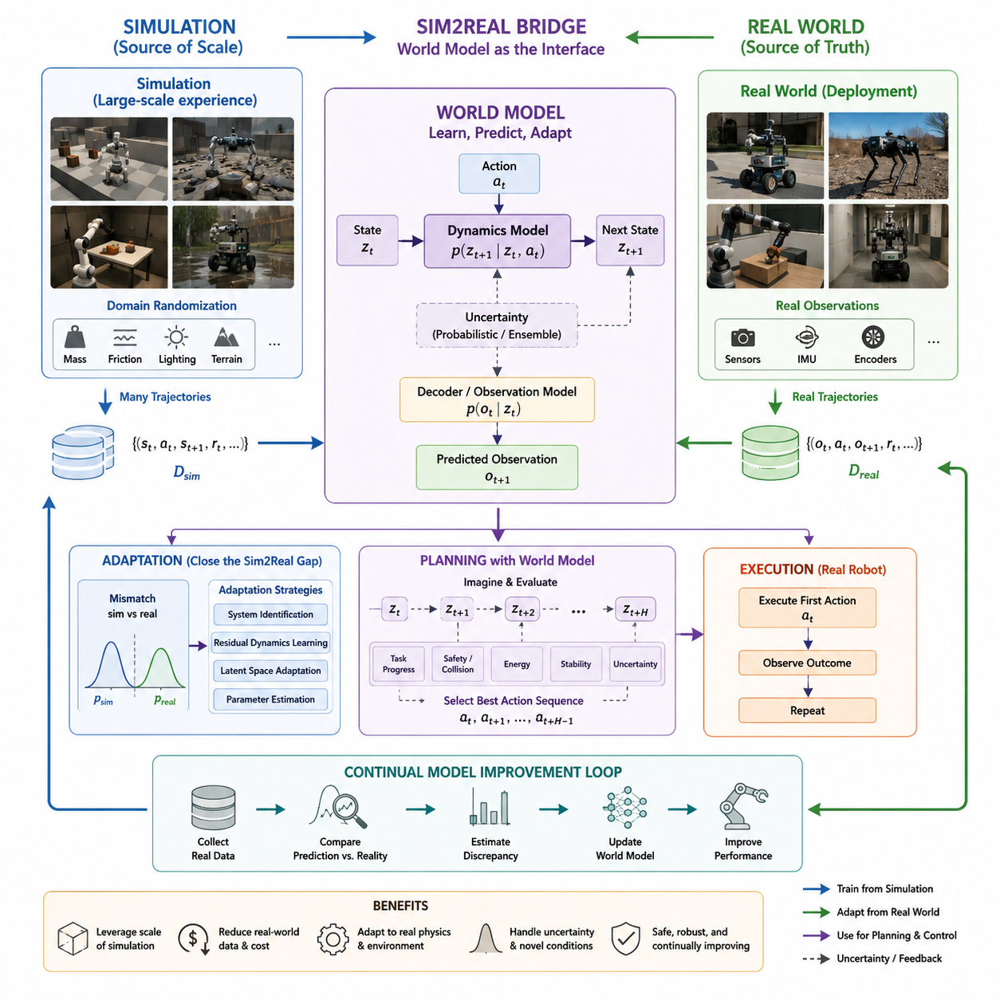{width="7.268055555555556in" height="7.268055555555556in"}

Sim2Real transfer addresses the challenge of moving intelligence learned in simulation into physical environments where sensing, dynamics, contacts, disturbances, and environmental conditions differ from their simulated counterparts. World models provide a powerful bridge for this transfer because they represent how an agent expects the physical world to evolve rather than merely reproducing a policy optimized for one simulator.

A conventional Sim2Real pipeline often trains a control policy directly against simulated observations and rewards. When the simulator differs from reality, the learned mapping from observation to action may fail because it has implicitly encoded simulator-specific assumptions. A world-model-based approach introduces an intermediate predictive representation that separates knowledge about environmental dynamics from the final policy or controller that consumes that knowledge.

The central idea is to learn a state transition model that predicts how the environment changes under actions. Given an internal state (z_t) and action (a_t), the model estimates a distribution over future states (z_{t+1}). This predictive mechanism can first be learned from abundant simulation trajectories and later adjusted with comparatively limited real-world experience, reducing dependence on expensive physical interaction.

Simulation remains valuable because it can generate large numbers of diverse trajectories without damaging hardware or exposing people and equipment to unnecessary risk. Robots can encounter rare failures, extreme disturbances, unusual terrain, collisions, actuator limits, and sensor degradation virtually. These experiences provide broad prior knowledge from which a world model can learn reusable structures of physical interaction before deployment.

The objective is not to make the world model reproduce every visual detail of a simulator. For Physical AI, the most transferable representations often emphasize task-relevant geometry, motion, contact, object state, traversability, forces, constraints, and action consequences. Latent states, BEV representations, occupancy structures, object-centric representations, or combinations of these can therefore provide more useful transfer interfaces than raw pixels alone.

The Sim2Real gap can be interpreted as a mismatch between simulated and real transition distributions. A simulator may predict (p_{sim}(s_{t+1}\|s_t,a_t)), while the physical system follows (p_{real}(s_{t+1}\|s_t,a_t)). Instead of requiring an entire policy to relearn this mismatch, the world model provides a location where the transition mechanism itself can be identified, calibrated, adapted, or corrected.

This separation creates an important architectural advantage. Perception estimates the current state, the world model predicts possible future states, and planning evaluates actions using those predictions. When real-world dynamics differ from simulation, adaptation can focus primarily on the representation and dynamics components responsible for the discrepancy. Higher-level planning objectives may remain relatively stable while lower-level physical assumptions are updated.

World models also provide a natural interface for domain randomization. Simulation can vary mass, friction, inertia, actuator response, latency, lighting, textures, terrain properties, sensor noise, object configurations, and external disturbances. Rather than learning one deterministic simulated world, the model learns a family of possible dynamics. Real deployment then becomes a problem of identifying which region of that learned dynamics space best describes the current physical system.

Uncertainty is especially important during this transition. A world model should distinguish familiar situations, where simulated experience provides reliable predictions, from unfamiliar conditions where its predictions may be unreliable. Probabilistic dynamics, ensembles, multimodal future distributions, and uncertainty estimates allow the planner to recognize low-confidence predictions and choose conservative actions while additional real-world evidence is collected.

Real-world observations can subsequently update the model through system identification. Differences between predicted and measured motion reveal information about physical parameters such as friction, payload, actuator gain, delay, compliance, or terrain interaction. Some parameters can be explicitly estimated, while others can be represented implicitly within latent variables. This enables adaptation without requiring every physical property to be manually modeled.

Another effective strategy is residual dynamics learning. Instead of replacing simulated physics, the system preserves the simulator-derived prediction and learns a correction from real data. The transition can conceptually be expressed as simulated dynamics plus a learned residual. This is attractive when simulation captures fundamental rigid-body behavior reasonably well but systematically misses effects such as tire slip, backlash, deformation, actuator delay, or complex contacts.

The bridge can operate in both directions. Sim-to-real transfer uses simulation to initialize representations and dynamics before adapting them to physical observations, while real-to-sim updating uses field measurements to improve simulator parameters and learned models. The result is a closed learning loop in which simulation generates experience, deployment reveals model errors, and those errors improve subsequent simulated training and prediction.

Action conditioning is essential because transfer must preserve the causal relationship between robot commands and environmental change. A useful world model does not merely predict what will happen next; it predicts what is likely to happen if the robot executes a particular action. Counterfactual rollouts can therefore compare alternative steering commands, manipulator motions, locomotion patterns, or trajectories before committing to them in the physical world.

For mobile robots, the model may learn relationships among commanded velocity, wheel motion, terrain, slope, payload, slip, and resulting displacement. For manipulators, it may capture contacts, object motion, grasp stability, and collision consequences. For quadrupeds, it may represent terrain interaction and body stability. The internal representation differs by embodiment, but the transferable principle remains prediction of action-conditioned physical consequences.

Planning then exploits the adapted world model as an internal simulator. Candidate trajectories can be imagined in latent or structured state space, evaluated for task progress, safety, collision probability, energy consumption, stability, and uncertainty, and ranked before execution. Because this internal simulator can be continually corrected from real observations, planning gradually becomes grounded in the actual robot rather than the assumptions of the original simulator.

This approach changes Sim2Real from a one-time transfer event into continuous model adaptation. A deployed Physical AI system repeatedly observes the environment, compares observations with predictions, estimates discrepancies, updates its internal dynamics, and replans. Changes in payload, tire condition, surface friction, actuator characteristics, weather, sensor calibration, or environmental structure can therefore become signals for model adaptation rather than permanent sources of failure.

The broader significance is that a world model can serve as a persistent knowledge layer between simulation and reality. Simulation provides scale and controlled diversity, while the real world provides authoritative evidence about actual physics. By integrating both within a predictive representation, Physical AI systems can retain knowledge learned cheaply in simulation while correcting assumptions through experience, creating a practical foundation for robust and continually improving Sim2Real intelligence.

Sim2Real 전이(Sim2Real transfer)는 시뮬레이션(simulation)에서 학습된 지능(intelligence)을 실제 물리 환경(physical environment)으로 이전하는 과정에서 발생하는 문제를 다룬다. 실제 환경에서는 센싱(sensing), 동역학(dynamics), 접촉(contact), 외란(disturbance), 환경 조건(environmental condition)이 시뮬레이션과 다를 수 있다. 월드 모델(world model)은 특정 시뮬레이터(simulator)에 최적화된 정책(policy)을 단순히 재현하는 것이 아니라, 물리 세계가 어떻게 변화할 것인지에 대한 에이전트(agent)의 예측 구조를 표현함으로써 이러한 전이를 위한 강력한 연결 고리를 제공한다.

전통적인 Sim2Real 파이프라인(Sim2Real pipeline)은 시뮬레이션된 관측(observation)과 보상(reward)을 이용하여 제어 정책(control policy)을 직접 학습하는 경우가 많다. 그러나 시뮬레이터와 현실 사이에 차이가 존재하면, 학습된 관측-행동 매핑(observation-to-action mapping)이 시뮬레이터 고유의 가정을 암묵적으로 학습했기 때문에 실패할 수 있다. 월드 모델 기반 접근(world-model-based approach)은 환경 동역학(environmental dynamics)에 관한 지식과 이를 사용하는 최종 정책 또는 제어기(controller)를 분리하는 중간 예측 표현(predictive representation)을 도입한다.

핵심 개념은 행동(action)에 따라 환경이 어떻게 변화하는지를 예측하는 상태 전이 모델(state transition model)을 학습하는 것이다. 내부 상태(internal state) (z_t)와 행동 (a_t)가 주어지면 모델은 미래 상태 (z_{t+1})에 대한 확률분포(distribution)를 추정한다. 이러한 예측 메커니즘(predictive mechanism)은 먼저 풍부한 시뮬레이션 궤적(simulation trajectory)으로 학습한 후 비교적 적은 실제 환경 경험(real-world experience)을 이용해 조정할 수 있으므로, 비용이 높은 물리적 상호작용(physical interaction)에 대한 의존성을 줄일 수 있다.

시뮬레이션(simulation)은 하드웨어(hardware)를 손상시키거나 사람과 장비를 불필요한 위험에 노출하지 않으면서 매우 다양한 궤적(trajectory)을 대규모로 생성할 수 있기 때문에 여전히 중요하다. 로봇(robot)은 드문 고장(rare failure), 극단적인 외란(extreme disturbance), 비정상적인 지형(unusual terrain), 충돌(collision), 액추에이터 한계(actuator limit), 센서 성능 저하(sensor degradation) 등을 가상 환경에서 경험할 수 있다. 이러한 경험은 실제 배치(deployment)에 앞서 월드 모델이 물리적 상호작용(physical interaction)의 재사용 가능한 구조를 학습할 수 있는 폭넓은 사전 지식(prior knowledge)을 제공한다.

목표는 월드 모델이 시뮬레이터의 모든 시각적 세부 사항(visual detail)을 그대로 재현하도록 만드는 것이 아니다. 피지컬 AI(Physical AI)에서는 작업과 관련된 기하학(geometry), 운동(motion), 접촉(contact), 객체 상태(object state), 주행 가능성(traversability), 힘(force), 제약 조건(constraint), 행동 결과(action consequence)를 강조하는 표현이 더 높은 전이 가능성(transferability)을 제공할 수 있다. 따라서 잠재 상태(latent state), 조감도 표현(BEV representation), 점유 구조(occupancy structure), 객체 중심 표현(object-centric representation) 또는 이들의 조합이 원시 픽셀(raw pixel)보다 더 유용한 전이 인터페이스(transfer interface)를 제공할 수 있다.

Sim2Real 격차(Sim2Real gap)는 시뮬레이션과 실제 환경의 전이 분포(transition distribution) 사이의 불일치로 해석할 수 있다. 시뮬레이터가 (p_{sim}(s_{t+1}\|s_t,a_t))를 예측하는 반면, 실제 물리 시스템(physical system)은 (p_{real}(s_{t+1}\|s_t,a_t))를 따를 수 있다. 전체 정책이 이러한 차이를 다시 학습하도록 요구하는 대신, 월드 모델은 전이 메커니즘(transition mechanism) 자체를 식별(identification), 보정(calibration), 적응(adaptation), 수정(correction)할 수 있는 위치를 제공한다.

이러한 분리는 중요한 아키텍처적 장점(architectural advantage)을 제공한다. 인지(perception)는 현재 상태를 추정하고, 월드 모델은 가능한 미래 상태를 예측하며, 계획(planning)은 이러한 예측을 이용해 행동을 평가한다. 실제 동역학(real-world dynamics)이 시뮬레이션과 다를 경우, 적응 과정은 주로 차이를 발생시키는 표현(representation)과 동역학 구성요소(dynamics component)에 집중할 수 있다. 상위 수준의 계획 목표(planning objective)는 비교적 안정적으로 유지하면서 하위 수준의 물리적 가정(physical assumption)을 갱신할 수 있다.

월드 모델은 도메인 랜덤화(domain randomization)를 위한 자연스러운 인터페이스도 제공한다. 시뮬레이션에서는 질량(mass), 마찰(friction), 관성(inertia), 액추에이터 응답(actuator response), 지연(latency), 조명(lighting), 텍스처(texture), 지형 특성(terrain property), 센서 노이즈(sensor noise), 객체 구성(object configuration), 외부 외란(external disturbance)을 변화시킬 수 있다. 하나의 결정론적 시뮬레이션 세계(deterministic simulated world)를 학습하는 대신, 모델은 가능한 동역학의 집합(family of possible dynamics)을 학습한다. 실제 배치는 이렇게 학습된 동역학 공간(dynamics space) 가운데 현재 물리 시스템을 가장 잘 설명하는 영역을 식별하는 문제로 볼 수 있다.

불확실성(uncertainty)은 이러한 전이 과정에서 특히 중요하다. 월드 모델은 시뮬레이션 경험이 신뢰할 수 있는 예측을 제공하는 익숙한 상황과 예측 신뢰도가 낮을 수 있는 새로운 상황을 구별할 수 있어야 한다. 확률적 동역학(probabilistic dynamics), 앙상블(ensemble), 다중 모드 미래 분포(multimodal future distribution), 불확실성 추정(uncertainty estimation)을 이용하면 계획기가 낮은 신뢰도의 예측을 인식하고 추가적인 실제 환경 증거가 수집되는 동안 보수적인 행동(conservative action)을 선택할 수 있다.

실제 환경 관측(real-world observation)은 이후 시스템 식별(system identification)을 통해 모델을 갱신하는 데 사용될 수 있다. 예측된 움직임과 측정된 움직임의 차이는 마찰(friction), 페이로드(payload), 액추에이터 이득(actuator gain), 지연(delay), 순응성(compliance), 지형 상호작용(terrain interaction)과 같은 물리적 파라미터(physical parameter)에 관한 정보를 제공한다. 일부 파라미터는 명시적으로 추정할 수 있으며, 다른 요소는 잠재 변수(latent variable) 내부에 암묵적으로 표현할 수 있다. 이를 통해 모든 물리적 특성을 수작업으로 모델링하지 않고도 적응이 가능하다.

또 다른 효과적인 전략은 잔차 동역학 학습(residual dynamics learning)이다. 시뮬레이션 물리(simulated physics)를 완전히 대체하는 대신 시스템은 시뮬레이터에서 얻은 예측을 유지하면서 실제 데이터(real data)를 이용해 보정값(correction)을 학습한다. 전이 과정은 개념적으로 시뮬레이션 동역학(simulated dynamics)과 학습된 잔차(learned residual)의 합으로 표현할 수 있다. 이는 시뮬레이션이 기본적인 강체 동역학(rigid-body dynamics)은 비교적 잘 표현하지만 타이어 슬립(tire slip), 백래시(backlash), 변형(deformation), 액추에이터 지연(actuator delay), 복잡한 접촉(complex contact) 등을 체계적으로 놓치는 경우 특히 효과적이다.

이 연결 과정은 양방향으로 작동할 수 있다. 시뮬레이션-현실 전이(Sim-to-Real transfer)는 물리적 관측에 적응하기 전에 시뮬레이션을 이용하여 표현과 동역학을 초기화하고, 현실-시뮬레이션 갱신(Real-to-Sim update)은 현장 측정(field measurement)을 이용하여 시뮬레이터 파라미터와 학습 모델을 개선한다. 그 결과 시뮬레이션이 경험을 생성하고, 실제 배치가 모델 오류(model error)를 발견하며, 이러한 오류가 이후의 시뮬레이션 학습과 예측을 개선하는 폐쇄형 학습 루프(closed learning loop)가 형성된다.

행동 조건화(action conditioning)는 로봇 명령(robot command)과 환경 변화(environmental change) 사이의 인과 관계(causal relationship)를 전이 과정에서도 유지해야 하기 때문에 필수적이다. 유용한 월드 모델은 단순히 다음에 무엇이 발생할지를 예측하는 것이 아니라, 로봇이 특정 행동을 수행했을 때 무엇이 발생할 가능성이 높은지를 예측한다. 따라서 반사실적 롤아웃(counterfactual rollout)을 통해 실제 물리 세계에서 행동하기 전에 여러 조향 명령(steering command), 매니퓰레이터 움직임(manipulator motion), 보행 패턴(locomotion pattern), 궤적(trajectory)을 비교할 수 있다.

모바일 로봇(mobile robot)의 경우 모델은 명령 속도(commanded velocity), 바퀴 움직임(wheel motion), 지형(terrain), 경사(slope), 페이로드(payload), 슬립(slip), 실제 변위(resulting displacement) 사이의 관계를 학습할 수 있다. 매니퓰레이터(manipulator)는 접촉, 객체 움직임, 파지 안정성(grasp stability), 충돌 결과(collision consequence)를 학습할 수 있으며, 4족 보행 로봇(quadruped)은 지형 상호작용과 몸체 안정성(body stability)을 표현할 수 있다. 내부 표현은 임바디먼트(embodiment)에 따라 달라지지만, 행동 조건부 물리적 결과(action-conditioned physical consequence)를 예측한다는 전이 원리는 동일하다.

계획(planning)은 적응된 월드 모델을 내부 시뮬레이터(internal simulator)처럼 활용한다. 후보 궤적(candidate trajectory)을 잠재 공간(latent space)이나 구조화된 상태 공간(structured state space)에서 상상하고, 작업 진행도(task progress), 안전성(safety), 충돌 확률(collision probability), 에너지 소비(energy consumption), 안정성(stability), 불확실성을 기준으로 평가한 뒤 실행 전에 순위를 결정할 수 있다. 이 내부 시뮬레이터는 실제 관측을 통해 지속적으로 보정되므로 계획 과정은 초기 시뮬레이터의 가정보다 실제 로봇의 물리적 특성에 점차 더 강하게 기반하게 된다.

이러한 접근법은 Sim2Real을 일회성 전이(one-time transfer)에서 지속적 모델 적응(continuous model adaptation)의 문제로 변화시킨다. 배치된 피지컬 AI 시스템은 환경을 반복적으로 관측하고, 실제 관측과 예측을 비교하고, 차이를 추정하고, 내부 동역학을 갱신한 다음 다시 계획한다. 따라서 페이로드 변화, 타이어 상태, 노면 마찰, 액추에이터 특성, 날씨, 센서 보정(sensor calibration), 환경 구조의 변화는 지속적인 실패 원인이 아니라 모델 적응을 위한 신호가 될 수 있다.

더 넓은 관점에서 월드 모델은 시뮬레이션과 현실 사이에서 지속적으로 유지되는 지식 계층(persistent knowledge layer)의 역할을 할 수 있다. 시뮬레이션은 규모(scale)와 통제된 다양성(controlled diversity)을 제공하고, 현실 세계는 실제 물리 법칙(actual physics)에 관한 가장 신뢰할 수 있는 증거를 제공한다. 두 영역을 하나의 예측 표현(predictive representation) 안에서 통합함으로써 피지컬 AI 시스템은 시뮬레이션에서 저비용으로 학습한 지식을 유지하면서 실제 경험을 통해 잘못된 가정을 수정할 수 있으며, 이는 강건하고 지속적으로 개선되는 Sim2Real 지능(Sim2Real intelligence)을 위한 실용적인 기반을 형성한다.

##  

## 14.02. Learning Dynamics from Simulation

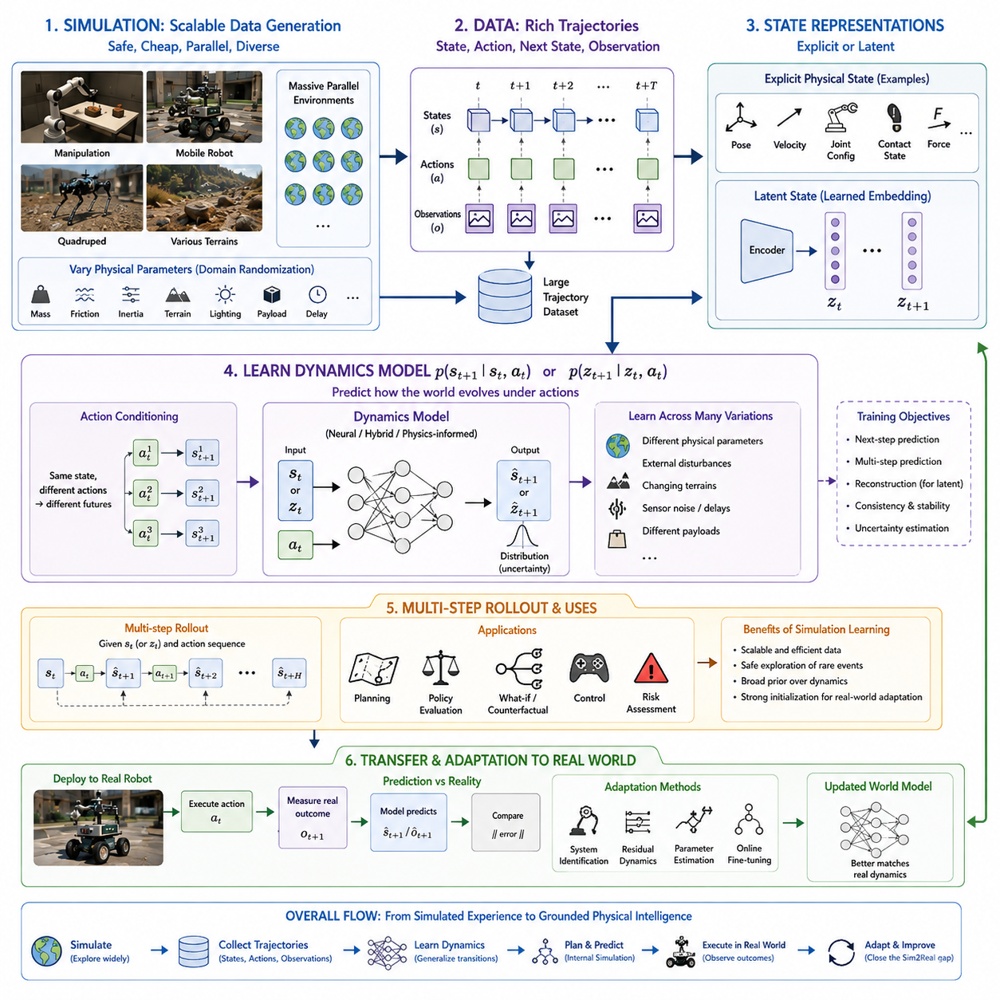{width="7.268055555555556in" height="7.268055555555556in"}

Learning dynamics from simulation allows a Physical AI system to acquire predictive knowledge about how states change under actions before extensive interaction with real hardware. Within a Sim2Real world-model pipeline, simulation provides scalable trajectories containing states, observations, actions, and resulting transitions. These trajectories become training experience for learning the transition structure that governs future prediction.

The fundamental learning problem can be expressed as predicting the next state from the current state and action. Given a state (s_t) and action (a_t), a dynamics model estimates (s_{t+1}), or more generally a conditional distribution (p(s_{t+1}\|s_t,a_t)). Repeating this prediction over multiple steps enables the model to simulate possible future trajectories internally without repeatedly executing them on a physical robot.

Simulation is particularly useful because transition data can be generated at a scale that would be difficult, expensive, or unsafe to collect in reality. Thousands of simulated robots or environments can execute different actions in parallel, producing diverse state transitions. Collisions, unstable motions, actuator saturation, difficult terrain, failed grasps, and other undesirable events can also be explored without damaging physical systems.

The quality of learned dynamics depends strongly on the diversity of simulated experience. If training trajectories cover only nominal conditions, the model may learn a narrow approximation that fails when deployment conditions change. Simulation should therefore expose the model to variations in initial states, actions, object configurations, terrain, disturbances, sensor conditions, payloads, and relevant physical parameters so that the learned transition structure covers a broad operating region.

A simulated trajectory can contain much more than geometric position. Depending on the embodiment and task, states may include velocity, acceleration, orientation, joint configuration, contact state, object pose, occupancy, terrain properties, actuator state, or latent representations derived from multimodal observations. The world model learns relationships among these variables so that future physical consequences can be inferred from the current situation and candidate actions.

Dynamics can be learned directly in an explicit physical state space or within a learned latent state space. Explicit models offer interpretable quantities such as pose, velocity, force, and contact, while latent dynamics compress high-dimensional observations into task-relevant representations. For vision-intensive Physical AI, predicting every future pixel may be unnecessary when compact latent variables can capture the geometry, motion, semantics, and interactions needed for planning.

Action conditioning distinguishes a useful dynamics model from passive future prediction. The model must understand that different commands applied to the same state can produce different futures. Steering, wheel torque, joint motion, grasp commands, body velocity, or locomotion actions therefore become inputs to the transition model. This enables the world model to answer counterfactual questions about what would happen under alternative actions.

Multi-step learning extends this idea beyond one-step prediction. A model may predict (s_{t+1}), feed that prediction back into its dynamics, and continue toward (s_{t+2}, s_{t+3}), and longer horizons. Such rollouts are essential for planning because an action that appears beneficial immediately may create an undesirable state later. Training must therefore consider temporal consistency and the accumulation of prediction errors across repeated transitions.

Simulation also allows dynamics learning across many physical parameter settings. Mass, friction, inertia, damping, center of gravity, actuator strength, response delay, compliance, terrain properties, and external forces can be varied systematically. The resulting model learns not merely one fixed transition function but a broader family of possible dynamics, creating a useful prior for later identification and adaptation in the real environment.

Domain randomization can be viewed as structured exploration of this dynamics family. Instead of assuming that the simulator contains the exact physical parameters of the deployed robot, training deliberately samples different parameter combinations. The model is encouraged to discover relationships that remain useful across variations rather than depending on a single simulated configuration. This improves robustness when real parameters are uncertain or change during operation.

Stochastic dynamics models are valuable when identical apparent states and actions can produce different outcomes. Sensor uncertainty, contact variability, terrain irregularity, unobserved variables, and environmental disturbances can make future states inherently uncertain. Rather than predicting only one future, the model can estimate a distribution over possible transitions, allowing later planning components to reason about both expected outcomes and associated risks.

Simulation provides privileged information that may not be directly observable on the physical robot. Exact object poses, contact forces, collision states, surface properties, and simulator parameters can support representation learning and auxiliary training objectives. However, deployment cannot depend blindly on information unavailable in reality. The learned world model must ultimately construct useful internal states from observations that real sensors and proprioceptive systems can actually provide.

Physics-informed structure can further improve simulated dynamics learning. Analytical relationships such as rigid-body motion, kinematic constraints, conservation principles, and known actuator behavior can be combined with neural components. The analytical model supplies reliable physical structure, while learned components capture interactions that are difficult to model explicitly. This hybrid approach can reduce the amount of data required and improve extrapolation beyond familiar trajectories.

For mobile robots, simulation can teach relationships among commanded velocity, wheel-ground interaction, slope, payload, slip, and resulting motion. Manipulation systems can learn how arm trajectories, contacts, grasp configurations, and forces affect objects. Quadrupeds can learn transitions involving foot placement, terrain contact, body orientation, and stability. Each embodiment requires different state variables, but all share the same state-action-transition principle.

The learned dynamics model should not be interpreted as a perfect replacement for reality. Even highly detailed simulators approximate contact, friction, actuator behavior, sensing, material properties, and environmental complexity. The purpose of simulation learning is therefore to establish a strong predictive prior rather than an immutable physical truth. Real-world deployment must subsequently reveal which simulated assumptions are accurate and which require correction.

Once transferred to a robot, prediction errors become valuable adaptation signals. The model predicts the consequence of an executed action, sensors measure the actual result, and the difference reveals a dynamics mismatch. Real-world dynamics adaptation, system identification, residual dynamics learning, and parameter estimation can then modify the simulation-trained model rather than learning physical behavior entirely from scratch.

This creates a progression from scalable virtual experience toward grounded physical intelligence. Simulation supplies broad and inexpensive exploration, dynamics learning converts that experience into predictive structure, and real-world observations calibrate that structure against actual physics. The resulting world model becomes an adaptable internal simulator that supports future prediction, trajectory evaluation, planning, and control while progressively reducing the Sim2Real gap.

시뮬레이션에서 동역학 학습(Learning dynamics from simulation)은 피지컬 AI(Physical AI) 시스템이 실제 하드웨어(real hardware)와 광범위하게 상호작용하기 전에 행동(action)에 따라 상태(state)가 어떻게 변화하는지에 대한 예측 지식(predictive knowledge)을 습득할 수 있게 한다. Sim2Real 월드 모델 파이프라인(Sim2Real world-model pipeline)에서 시뮬레이션(simulation)은 상태, 관측(observation), 행동, 그리고 그 결과로 발생하는 전이(transition)를 포함하는 대규모 궤적(trajectory)을 제공한다. 이러한 궤적은 미래 예측을 지배하는 전이 구조(transition structure)를 학습하기 위한 훈련 경험(training experience)이 된다.

기본적인 학습 문제는 현재 상태와 행동으로부터 다음 상태를 예측하는 것으로 표현할 수 있다. 상태 (s_t)와 행동 (a_t)가 주어지면 동역학 모델(dynamics model)은 (s_{t+1}), 또는 보다 일반적으로 조건부 분포(conditional distribution) (p(s_{t+1}\|s_t,a_t))를 추정한다. 이러한 예측을 여러 단계에 걸쳐 반복하면 모델은 실제 로봇에서 행동을 반복적으로 실행하지 않고도 내부적으로 가능한 미래 궤적(future trajectory)을 시뮬레이션할 수 있다.

시뮬레이션은 현실에서 수집하기 어렵거나 비용이 많이 들고 위험할 수 있는 전이 데이터(transition data)를 대규모로 생성할 수 있다는 점에서 특히 유용하다. 수천 개의 시뮬레이션 로봇이나 환경이 서로 다른 행동을 병렬로 수행하여 다양한 상태 전이를 생성할 수 있다. 충돌(collision), 불안정한 움직임(unstable motion), 액추에이터 포화(actuator saturation), 험난한 지형(difficult terrain), 파지 실패(failed grasp)와 같은 바람직하지 않은 상황도 실제 시스템을 손상시키지 않고 탐색할 수 있다.

학습된 동역학의 품질은 시뮬레이션 경험(simulated experience)의 다양성에 크게 의존한다. 학습 궤적이 정상적인 조건(nominal condition)만 포함한다면 모델은 배치 조건이 변화할 때 실패하는 좁은 근사 모델을 학습할 수 있다. 따라서 시뮬레이션은 초기 상태(initial state), 행동, 객체 구성(object configuration), 지형, 외란(disturbance), 센서 조건(sensor condition), 페이로드(payload), 관련 물리 파라미터(physical parameter)를 다양하게 변화시켜 학습된 전이 구조가 넓은 동작 영역(operating region)을 포괄하도록 해야 한다.

시뮬레이션 궤적(simulated trajectory)은 단순한 기하학적 위치(geometric position)보다 훨씬 많은 정보를 포함할 수 있다. 임바디먼트(embodiment)와 작업(task)에 따라 상태에는 속도(velocity), 가속도(acceleration), 자세(orientation), 관절 구성(joint configuration), 접촉 상태(contact state), 객체 자세(object pose), 점유 상태(occupancy), 지형 특성(terrain property), 액추에이터 상태(actuator state), 다중 모달 관측(multimodal observation)으로부터 생성된 잠재 표현(latent representation) 등이 포함될 수 있다. 월드 모델(world model)은 이러한 변수들의 관계를 학습하여 현재 상황과 후보 행동(candidate action)으로부터 미래의 물리적 결과를 추론한다.

동역학은 명시적 물리 상태 공간(explicit physical state space)에서 직접 학습하거나 학습된 잠재 상태 공간(latent state space)에서 학습할 수 있다. 명시적 모델(explicit model)은 자세, 속도, 힘(force), 접촉과 같이 해석 가능한 물리량을 제공하는 반면, 잠재 동역학(latent dynamics)은 고차원 관측(high-dimensional observation)을 작업과 관련된 표현으로 압축한다. 비전 중심 피지컬 AI(vision-intensive Physical AI)에서는 계획에 필요한 기하학, 움직임, 의미(semantics), 상호작용을 압축된 잠재 변수가 표현할 수 있다면 모든 미래 픽셀을 예측할 필요가 없을 수 있다.

행동 조건화(action conditioning)는 유용한 동역학 모델을 수동적인 미래 예측(passive future prediction)과 구별한다. 모델은 동일한 상태에서도 서로 다른 명령이 서로 다른 미래를 만들어낼 수 있다는 것을 이해해야 한다. 따라서 조향(steering), 바퀴 토크(wheel torque), 관절 움직임(joint motion), 파지 명령(grasp command), 몸체 속도(body velocity), 보행 행동(locomotion action) 등이 전이 모델의 입력이 된다. 이를 통해 월드 모델은 대안적인 행동을 수행했을 때 어떤 결과가 발생하는지에 대한 반사실적 질문(counterfactual question)에 답할 수 있다.

다단계 학습(multi-step learning)은 이러한 개념을 단일 단계 예측(one-step prediction) 이상으로 확장한다. 모델은 (s_{t+1})을 예측하고, 그 예측값을 다시 동역학 모델에 입력하여 (s_{t+2}, s_{t+3}) 및 더 긴 시간 범위까지 예측할 수 있다. 이러한 롤아웃(rollout)은 즉각적으로는 유리해 보이는 행동이 이후 바람직하지 않은 상태를 만들 수 있기 때문에 계획(planning)에 필수적이다. 따라서 학습에서는 반복되는 전이 과정에서의 시간적 일관성(temporal consistency)과 예측 오차 누적(prediction error accumulation)을 고려해야 한다.

시뮬레이션은 다양한 물리 파라미터 설정(physical parameter setting)에 걸쳐 동역학을 학습할 수도 있게 한다. 질량(mass), 마찰(friction), 관성(inertia), 감쇠(damping), 무게중심(center of gravity), 액추에이터 강도(actuator strength), 응답 지연(response delay), 순응성(compliance), 지형 특성, 외력(external force)을 체계적으로 변화시킬 수 있다. 이를 통해 모델은 하나의 고정된 전이 함수(transition function)가 아니라 가능한 동역학의 더 넓은 집합을 학습하며, 이는 이후 실제 환경에서의 식별(identification)과 적응(adaptation)을 위한 유용한 사전 지식(prior)이 된다.

도메인 랜덤화(domain randomization)는 이러한 동역학 집합을 구조적으로 탐색하는 방법으로 볼 수 있다. 시뮬레이터가 배치된 로봇의 정확한 물리 파라미터를 가지고 있다고 가정하는 대신, 학습 과정에서 의도적으로 서로 다른 파라미터 조합을 샘플링한다. 모델은 특정 시뮬레이션 구성에 의존하기보다 다양한 변화에서도 유지되는 관계를 발견하도록 학습된다. 이는 실제 파라미터가 불확실하거나 운용 중 변화하는 경우 강건성(robustness)을 향상시킨다.

확률적 동역학 모델(stochastic dynamics model)은 겉으로 동일한 상태와 행동에서도 서로 다른 결과가 발생할 수 있는 상황에서 유용하다. 센서 불확실성(sensor uncertainty), 접촉 변화(contact variability), 불규칙한 지형(terrain irregularity), 관측되지 않은 변수(unobserved variable), 환경 외란(environmental disturbance)은 미래 상태를 본질적으로 불확실하게 만들 수 있다. 하나의 미래만 예측하는 대신 모델은 가능한 전이에 대한 확률분포를 추정하여 이후 계획 구성요소가 예상 결과와 관련 위험을 함께 추론하도록 할 수 있다.

시뮬레이션은 실제 로봇에서는 직접 관측하기 어려운 특권 정보(privileged information)를 제공할 수 있다. 정확한 객체 자세, 접촉력(contact force), 충돌 상태(collision state), 표면 특성(surface property), 시뮬레이터 파라미터는 표현 학습(representation learning)과 보조 학습 목표(auxiliary training objective)에 활용될 수 있다. 그러나 실제 배치에서는 현실에서 사용할 수 없는 정보에 의존해서는 안 된다. 최종적으로 월드 모델은 실제 센서(real sensor)와 고유수용성 시스템(proprioceptive system)이 제공할 수 있는 관측으로부터 유용한 내부 상태를 구성해야 한다.

물리 정보 기반 구조(physics-informed structure)는 시뮬레이션 동역학 학습을 더욱 향상시킬 수 있다. 강체 운동(rigid-body motion), 운동학적 제약(kinematic constraint), 보존 원리(conservation principle), 알려진 액추에이터 거동(actuator behavior)과 같은 해석적 관계(analytical relationship)를 신경망 구성요소(neural component)와 결합할 수 있다. 해석 모델(analytical model)은 신뢰할 수 있는 물리 구조를 제공하고, 학습 구성요소는 명시적으로 모델링하기 어려운 상호작용을 포착한다. 이러한 하이브리드 접근(hybrid approach)은 필요한 데이터 양을 줄이고 익숙하지 않은 궤적에 대한 외삽(extrapolation) 능력을 향상시킬 수 있다.

모바일 로봇(mobile robot)의 경우 시뮬레이션은 명령 속도(commanded velocity), 바퀴-지면 상호작용(wheel-ground interaction), 경사(slope), 페이로드, 슬립(slip), 결과적인 움직임 사이의 관계를 학습시킬 수 있다. 매니퓰레이션 시스템(manipulation system)은 로봇 팔 궤적(arm trajectory), 접촉, 파지 구성(grasp configuration), 힘이 객체에 미치는 영향을 학습할 수 있다. 4족 보행 로봇(quadruped)은 발 배치(foot placement), 지형 접촉, 몸체 자세(body orientation), 안정성(stability)이 포함된 전이를 학습할 수 있다. 각 임바디먼트에는 서로 다른 상태 변수가 필요하지만 모두 동일한 상태-행동-전이(state-action-transition) 원리를 공유한다.

학습된 동역학 모델을 현실을 완벽하게 대체하는 것으로 해석해서는 안 된다. 매우 정교한 시뮬레이터도 접촉, 마찰, 액추에이터 거동, 센싱(sensing), 재료 특성(material property), 환경 복잡성(environmental complexity)을 근사한다. 따라서 시뮬레이션 학습의 목적은 변하지 않는 물리적 진실(physical truth)을 만드는 것이 아니라 강력한 예측 사전 모델(predictive prior)을 구축하는 것이다. 이후 실제 환경 배치를 통해 어떤 시뮬레이션 가정이 정확하고 어떤 가정에 수정이 필요한지를 확인해야 한다.

실제 로봇으로 전이된 이후에는 예측 오차(prediction error)가 중요한 적응 신호(adaptation signal)가 된다. 모델은 실행된 행동의 결과를 예측하고 센서는 실제 결과를 측정하며, 두 결과 사이의 차이는 동역학 불일치(dynamics mismatch)를 나타낸다. 실제 환경 동역학 적응(real-world dynamics adaptation), 시스템 식별(system identification), 잔차 동역학 학습(residual dynamics learning), 파라미터 추정(parameter estimation)은 물리적 거동을 처음부터 다시 학습하는 대신 시뮬레이션에서 학습된 모델을 수정할 수 있게 한다.

이러한 과정은 확장 가능한 가상 경험(scalable virtual experience)에서 현실에 기반한 물리 지능(grounded physical intelligence)으로 발전하는 흐름을 형성한다. 시뮬레이션은 광범위하고 저비용의 탐색을 제공하고, 동역학 학습은 이러한 경험을 예측 구조(predictive structure)로 변환하며, 실제 환경 관측은 그 구조를 실제 물리 현상에 맞게 보정한다. 결과적으로 월드 모델은 미래 예측, 궤적 평가(trajectory evaluation), 계획, 제어(control)를 지원하면서 Sim2Real 격차를 점진적으로 줄여가는 적응형 내부 시뮬레이터(adaptive internal simulator)가 된다.

##  

## 14.03. Real World Dynamics Adaptation

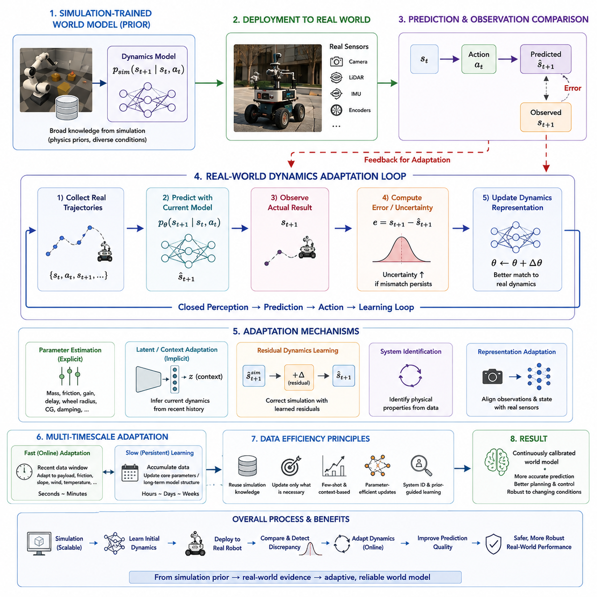{width="7.268055555555556in" height="7.268055555555556in"}

Real-world dynamics adaptation is the process of modifying a simulation-trained world model so that its predictions increasingly reflect the behavior of the physical system encountered after deployment. Simulation provides a strong initial dynamics prior, but differences in friction, payload, actuator response, sensing, terrain, contact, and environmental disturbances inevitably create prediction errors when the model is transferred to a real robot.

The adaptation process begins by comparing predicted transitions with observed transitions. Given the current state (s_t) and executed action (a_t), the world model predicts (\\hat{s}\*{t+1}), while sensors measure the actual resulting state (s\*{t+1}). The discrepancy between these states provides an error signal that indicates where the learned transition model differs from the dynamics governing the physical robot.

This discrepancy should not automatically be interpreted as a single modeling error. Differences can originate from incorrect physical parameters, unmodeled actuator behavior, sensor noise, state-estimation errors, environmental disturbances, or previously unseen interactions. Effective adaptation therefore requires the system to determine which aspects of its internal model should change while preserving knowledge that remains valid from simulation.

A useful conceptual decomposition separates invariant dynamics from environment-specific dynamics. Basic geometric relationships, kinematic constraints, and many rigid-body principles may transfer reliably, while friction coefficients, tire-ground interaction, actuator delays, compliance, payload distribution, and contact characteristics can vary substantially. Adaptation can focus on these variable components rather than retraining the complete world model whenever conditions change.

Real-world trajectories provide the evidence needed for this correction. Each sequence of observations, actions, and resulting states contributes samples of actual system behavior. As the robot operates, these trajectories accumulate into a growing dataset describing the physical environment. The world model can compare this evidence with its simulation-derived expectations and progressively shift its transition predictions toward the observed real-world distribution.

Adaptation may occur through explicit physical parameters. If the model contains quantities such as mass, friction, actuator gain, latency, wheel radius, center of gravity, or damping, these parameters can be estimated from observed trajectories. The updated parameters modify subsequent predictions while preserving the underlying model structure. This approach is particularly useful when the source of the Sim2Real discrepancy has a clear physical interpretation.

Alternatively, adaptation can occur in latent dynamics without explicitly identifying every physical quantity. A latent variable can encode properties of the current robot and environment that influence transitions. Recent observations may be processed into a context representation that changes how future states are predicted. This allows the world model to adapt to complex combinations of physical factors that would be difficult to estimate individually.

Online adaptation is important because real-world dynamics are rarely stationary. A mobile robot may carry different payloads, move between concrete, asphalt, gravel, grass, and slopes, or experience changing tire conditions. Manipulators may interact with objects having different masses and friction properties. A fixed model calibrated once before deployment can therefore become inaccurate even when it initially matches the physical system well.

Temporal context can help the model infer such changes. A sequence of recent state-action transitions contains evidence about current dynamics, including whether wheels are slipping, actuators are responding slowly, or an unexpected load has altered acceleration. Rather than treating each transition independently, an adaptive world model can use recent history as context for estimating the dynamics regime currently governing the system.

Uncertainty should increase when observations no longer agree with learned predictions. Persistent prediction errors can indicate that the robot has entered an unfamiliar dynamics regime or encountered an out-of-distribution condition. Instead of confidently extrapolating an inaccurate model, the system can represent increased uncertainty and communicate this information to planning, allowing safer trajectories or reduced operating speeds during adaptation.

Adaptation and planning therefore interact closely. The planner proposes actions using predicted futures, the robot executes selected actions, and resulting observations test those predictions against reality. Model errors update the dynamics representation, after which planning is performed again using the improved model. This produces a closed perception-prediction-action-learning loop in which physical interaction continuously improves future decision making.

Care is required because aggressive online learning can introduce instability. A small number of noisy or unusual observations should not erase broadly useful knowledge learned from large simulation datasets. Adaptation mechanisms can therefore restrict which parameters are updated, use small learning rates, maintain replay data, regularize changes toward the pretrained model, or separate rapidly adapting context variables from slowly changing network parameters.

Different components may also adapt at different time scales. Fast adaptation can estimate temporary factors such as payload, surface friction, wind, or actuator temperature from recent observations. Slower learning can update persistent model parameters when repeated experience demonstrates systematic errors. This multi-timescale structure allows the world model to respond quickly to changing conditions without continually rewriting its long-term physical knowledge.

For mobile robots, real-world adaptation may correct relationships among commanded velocity, wheel rotation, slip, terrain, and resulting displacement. For manipulators, it may refine predictions of contact, compliance, grasp behavior, and object motion. For quadrupeds, adaptation may capture changing terrain interaction, foot contact, body response, and stability. The specific variables differ, but prediction error provides a common learning signal.

Real-world adaptation can also improve representations learned from simulation. Simulated sensors may differ from physical cameras, LiDAR, radar, IMUs, encoders, or proprioceptive measurements. If these differences distort the estimated state, dynamics predictions will also become inaccurate. Adaptation may therefore involve both observation representations and transition dynamics so that the internal state remains consistent with actual physical measurements.

A major objective is data efficiency because physical experience is expensive compared with simulated experience. The system should reuse the broad dynamics knowledge obtained from simulation and modify only what real observations demonstrate to be inaccurate. Few-shot adaptation, context-conditioned models, parameter-efficient updates, residual corrections, and system identification all follow this principle of extracting maximum adaptation value from limited real-world trajectories.

The resulting world model should be understood as a continuously calibrated internal model rather than a static neural network deployed after training. Simulation supplies the initial predictive structure, while physical interaction supplies corrective evidence. Each prediction, action, observation, and error can contribute to maintaining alignment between the internal dynamics model and the external physical system as operating conditions evolve.

Real-world dynamics adaptation therefore transforms Sim2Real from a fixed transfer problem into an ongoing learning process. The robot begins with scalable knowledge acquired virtually, grounds that knowledge through physical experience, detects discrepancies between expectation and reality, and updates its predictions accordingly. This adaptive cycle provides the foundation for world models that remain useful for prediction, planning, and control beyond the conditions represented during initial simulation training.

실제 환경 동역학 적응(Real-world dynamics adaptation)은 시뮬레이션에서 학습된 월드 모델(world model)을 수정하여, 배치(deployment) 이후 실제 물리 시스템에서 관찰되는 거동을 점점 더 정확하게 예측하도록 만드는 과정이다. 시뮬레이션(simulation)은 강력한 초기 동역학 사전 지식(dynamics prior)을 제공하지만, 마찰(friction), 페이로드(payload), 액추에이터 응답(actuator response), 센싱(sensing), 지형(terrain), 접촉(contact), 환경 외란(environmental disturbance)의 차이로 인해 실제 로봇으로 전이하면 필연적으로 예측 오차(prediction error)가 발생한다.

적응 과정은 예측된 전이(predicted transition)와 실제로 관측된 전이(observed transition)를 비교하는 것에서 시작한다. 현재 상태 (s_t)와 실행된 행동 (a_t)가 주어지면 월드 모델은 (\\hat{s}\*{t+1})을 예측하고, 센서는 실제 결과 상태 (s\*{t+1})을 측정한다. 두 상태 사이의 차이는 학습된 전이 모델(transition model)이 실제 로봇을 지배하는 동역학과 어느 부분에서 다른지를 나타내는 오차 신호(error signal)를 제공한다.

이러한 차이를 단일한 모델링 오류(modeling error)로 해석해서는 안 된다. 차이는 부정확한 물리 파라미터(physical parameter), 모델링되지 않은 액추에이터 거동, 센서 노이즈(sensor noise), 상태 추정 오류(state-estimation error), 환경 외란 또는 이전에 경험하지 못한 상호작용에서 발생할 수 있다. 따라서 효과적인 적응을 위해서는 시뮬레이션에서 학습한 유효한 지식은 보존하면서 내부 모델의 어떤 부분을 변경해야 하는지를 판단해야 한다.

유용한 개념적 분해(conceptual decomposition)는 불변 동역학(invariant dynamics)과 환경별 동역학(environment-specific dynamics)을 구분하는 것이다. 기본적인 기하학적 관계, 운동학적 제약(kinematic constraint), 많은 강체 원리(rigid-body principle)는 안정적으로 전이될 수 있지만, 마찰계수(friction coefficient), 타이어-지면 상호작용(tire-ground interaction), 액추에이터 지연(actuator delay), 순응성(compliance), 페이로드 분포(payload distribution), 접촉 특성(contact characteristic)은 크게 달라질 수 있다. 따라서 조건이 바뀔 때마다 전체 월드 모델을 재학습하기보다 이러한 가변적인 구성요소에 적응을 집중할 수 있다.

실제 환경 궤적(real-world trajectory)은 이러한 보정에 필요한 증거를 제공한다. 관측(observation), 행동(action), 그리고 결과 상태(resulting state)의 각 시퀀스(sequence)는 실제 시스템 거동의 샘플을 제공한다. 로봇이 동작하면서 이러한 궤적은 실제 물리 환경을 설명하는 점점 커지는 데이터셋(dataset)으로 축적된다. 월드 모델은 이러한 증거를 시뮬레이션에서 얻은 예상 결과와 비교하고 전이 예측을 실제 환경의 분포(real-world distribution) 방향으로 점진적으로 이동시킬 수 있다.

적응은 명시적인 물리 파라미터를 통해 수행될 수 있다. 모델에 질량(mass), 마찰, 액추에이터 이득(actuator gain), 지연(latency), 바퀴 반경(wheel radius), 무게중심(center of gravity), 감쇠(damping)와 같은 값이 포함되어 있다면 관측된 궤적으로부터 이러한 파라미터를 추정할 수 있다. 갱신된 파라미터는 기본 모델 구조를 유지하면서 이후의 예측을 수정한다. 이러한 접근은 Sim2Real 차이의 원인을 명확한 물리적 의미로 해석할 수 있을 때 특히 유용하다.

반대로 모든 물리량을 명시적으로 식별하지 않고 잠재 동역학(latent dynamics)에서 적응을 수행할 수도 있다. 잠재 변수(latent variable)는 전이에 영향을 미치는 현재 로봇과 환경의 특성을 인코딩(encoding)할 수 있다. 최근 관측은 미래 상태가 예측되는 방식을 변경하는 문맥 표현(context representation)으로 처리될 수 있다. 이를 통해 개별적으로 추정하기 어려운 복잡한 물리 요인의 조합에도 월드 모델이 적응할 수 있다.

온라인 적응(online adaptation)이 중요한 이유는 실제 환경의 동역학이 일정하게 유지되는 경우가 드물기 때문이다. 모바일 로봇(mobile robot)은 서로 다른 페이로드를 운반하고 콘크리트, 아스팔트, 자갈, 잔디, 경사면 사이를 이동하거나 타이어 상태 변화를 경험할 수 있다. 매니퓰레이터(manipulator)는 서로 다른 질량과 마찰 특성을 가진 객체와 상호작용할 수 있다. 따라서 배치 전에 한 번만 보정된 고정 모델(fixed model)은 초기에는 실제 시스템과 잘 일치하더라도 시간이 지나면서 부정확해질 수 있다.

시간적 문맥(temporal context)은 모델이 이러한 변화를 추론하는 데 도움을 줄 수 있다. 최근의 상태-행동 전이(state-action transition) 시퀀스에는 바퀴가 미끄러지고 있는지, 액추에이터 응답이 느려졌는지, 예상하지 못한 하중으로 가속도가 변했는지와 같은 현재 동역학에 대한 정보가 포함된다. 적응형 월드 모델(adaptive world model)은 각각의 전이를 독립적으로 처리하기보다 최근 이력을 현재 시스템을 지배하는 동역학 영역(dynamics regime)을 추정하기 위한 문맥으로 사용할 수 있다.

관측 결과가 학습된 예측과 더 이상 일치하지 않는다면 불확실성(uncertainty)은 증가해야 한다. 지속적인 예측 오차는 로봇이 익숙하지 않은 동역학 영역에 진입했거나 분포 외 조건(out-of-distribution condition)을 만났다는 것을 의미할 수 있다. 부정확한 모델을 높은 확신으로 외삽(extrapolation)하는 대신 시스템은 증가된 불확실성을 표현하고 이를 계획(planning)에 전달하여, 적응 과정에서 보다 안전한 궤적이나 낮은 운용 속도를 선택하도록 할 수 있다.

따라서 적응(adaptation)과 계획은 밀접하게 상호작용한다. 계획기(planner)는 예측된 미래를 사용하여 행동을 제안하고, 로봇은 선택된 행동을 실행하며, 그 결과로 얻어진 관측은 이러한 예측이 현실과 일치하는지를 검증한다. 모델 오차는 동역학 표현(dynamics representation)을 갱신하고, 이후 개선된 모델을 이용하여 다시 계획을 수행한다. 이를 통해 물리적 상호작용이 미래의 의사결정을 지속적으로 개선하는 폐쇄형 인지-예측-행동-학습 루프(closed perception-prediction-action-learning loop)가 형성된다.

그러나 지나치게 공격적인 온라인 학습(online learning)은 불안정성(instability)을 유발할 수 있으므로 주의가 필요하다. 소수의 노이즈가 많은 관측이나 특이한 관측 때문에 대규모 시뮬레이션 데이터셋으로 학습된 광범위하고 유용한 지식이 사라져서는 안 된다. 따라서 적응 메커니즘은 갱신되는 파라미터를 제한하고, 작은 학습률(learning rate)을 사용하거나, 재현 데이터(replay data)를 유지하고, 사전 학습 모델(pretrained model)에서 지나치게 벗어나지 않도록 정규화(regularization)하거나, 빠르게 적응하는 문맥 변수와 천천히 변화하는 네트워크 파라미터를 분리할 수 있다.

서로 다른 구성요소는 서로 다른 시간 척도(time scale)로 적응할 수도 있다. 빠른 적응(fast adaptation)은 최근 관측으로부터 페이로드, 노면 마찰, 바람(wind), 액추에이터 온도와 같은 일시적인 요인을 추정할 수 있다. 더 느린 학습(slow learning)은 반복된 경험에서 체계적인 오차가 확인될 때 지속적인 모델 파라미터를 갱신할 수 있다. 이러한 다중 시간 척도 구조(multi-timescale structure)는 장기적인 물리 지식을 지속적으로 다시 작성하지 않으면서 변화하는 조건에 빠르게 대응할 수 있도록 한다.

모바일 로봇의 경우 실제 환경 적응은 명령 속도(commanded velocity), 바퀴 회전(wheel rotation), 슬립(slip), 지형, 실제 변위(resulting displacement) 사이의 관계를 보정할 수 있다. 매니퓰레이터에서는 접촉, 순응성, 파지 거동(grasp behavior), 객체 움직임(object motion)의 예측을 개선할 수 있다. 4족 보행 로봇(quadruped)에서는 변화하는 지형 상호작용, 발 접촉(foot contact), 몸체 응답(body response), 안정성(stability)을 반영할 수 있다. 구체적인 변수는 서로 다르지만 예측 오차는 공통적인 학습 신호를 제공한다.

실제 환경 적응은 시뮬레이션에서 학습된 표현(representation) 자체도 개선할 수 있다. 시뮬레이션 센서는 실제 카메라(camera), 라이다(LiDAR), 레이더(radar), 관성 측정 장치(IMU), 인코더(encoder), 고유수용성 측정(proprioceptive measurement)과 다를 수 있다. 이러한 차이가 추정 상태를 왜곡하면 동역학 예측도 부정확해진다. 따라서 적응은 관측 표현(observation representation)과 전이 동역학 모두를 포함하여 내부 상태가 실제 물리적 측정과 일관성을 유지하도록 할 수 있다.

물리적 경험은 시뮬레이션 경험보다 비용이 높기 때문에 데이터 효율성(data efficiency)은 중요한 목표이다. 시스템은 시뮬레이션에서 획득한 광범위한 동역학 지식을 재사용하고 실제 관측이 부정확하다고 입증한 부분만 수정해야 한다. 퓨샷 적응(few-shot adaptation), 문맥 조건부 모델(context-conditioned model), 파라미터 효율적 갱신(parameter-efficient update), 잔차 보정(residual correction), 시스템 식별(system identification)은 모두 제한된 실제 환경 궤적으로부터 최대한의 적응 효과를 얻는다는 원리를 따른다.

결과적으로 월드 모델은 학습 이후 배치되는 정적인 신경망(static neural network)이 아니라 지속적으로 보정되는 내부 모델(continuously calibrated internal model)로 이해해야 한다. 시뮬레이션은 초기 예측 구조(initial predictive structure)를 제공하고, 물리적 상호작용은 이를 수정하기 위한 증거를 제공한다. 각각의 예측, 행동, 관측, 오차는 운용 조건이 변화하는 동안 내부 동역학 모델과 외부 물리 시스템 사이의 정합성(alignment)을 유지하는 데 기여할 수 있다.

따라서 실제 환경 동역학 적응은 Sim2Real을 고정된 전이 문제(fixed transfer problem)에서 지속적인 학습 과정(ongoing learning process)으로 변화시킨다. 로봇은 가상 환경에서 대규모로 획득한 지식으로 시작하고, 물리적 경험을 통해 그 지식을 현실에 기반하도록 만들며, 예상과 현실 사이의 차이를 탐지하고 그에 따라 예측을 갱신한다. 이러한 적응 순환(adaptive cycle)은 초기 시뮬레이션 학습에서 표현되지 않았던 조건에서도 예측, 계획, 제어에 지속적으로 활용될 수 있는 월드 모델의 기반을 제공한다.

##  

## 14.04. Domain Randomization and World Models

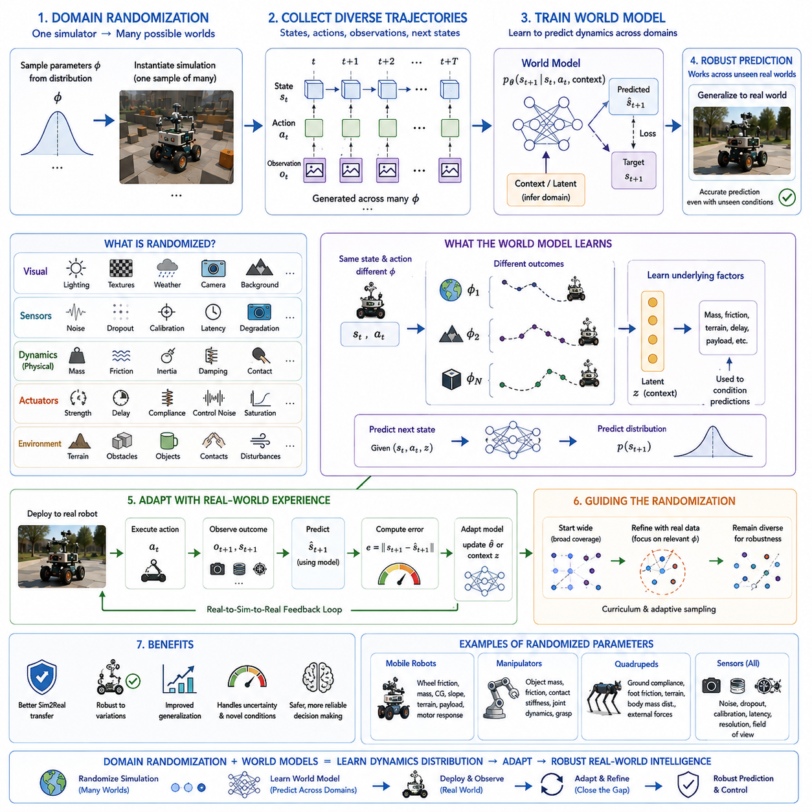{width="7.268055555555556in" height="7.268055555555556in"}

Domain randomization is a Sim2Real strategy that deliberately varies simulation conditions so a world model learns dynamics that remain useful across many possible physical environments. Instead of training on one carefully tuned simulator, the system experiences a distribution of simulated worlds. The objective is to prevent the model from depending excessively on assumptions that may not hold after deployment in reality.

For world models, domain randomization extends beyond changing the appearance of rendered images. The variables that influence state transitions are particularly important because the model must predict how the physical world evolves under actions. Mass, friction, inertia, damping, actuator strength, control delay, compliance, payload, terrain properties, sensor noise, and external disturbances can therefore become randomized dimensions of the training environment.

A simulation instance can be interpreted as one sample from a parameterized family of environments. If physical parameters are represented by (\\phi), the simulator generates transitions according to (p(s_{t+1}\|s_t,a_t,\\phi)). During training, different values of (\\phi) are repeatedly sampled. The world model consequently observes how identical states and actions can lead to different outcomes under different physical conditions.

This changes the learning objective from memorizing one transition function into understanding a distribution of possible dynamics. A robot may accelerate differently when its payload changes, turn differently when surface friction decreases, or respond differently when actuator latency increases. By observing such variations in simulation, the model can learn representations that capture the underlying factors responsible for these changes rather than treating them as unexpected failures.

Randomization can operate at several levels simultaneously. Visual randomization may vary lighting, texture, weather, camera parameters, object appearance, and backgrounds. Sensor randomization can introduce noise, missing measurements, calibration errors, latency, or degraded sensing. Dynamics randomization changes physical properties and actuator behavior, while environment randomization modifies terrain, obstacles, object configurations, contacts, and disturbances.

For predictive world models, dynamics randomization is especially important because visually similar scenes can possess very different transition behavior. A dry floor and a slippery floor may look nearly identical while producing substantially different robot motion. Likewise, objects with similar appearance may have different masses or friction coefficients. The world model must therefore infer hidden physical properties from temporal observations and action consequences rather than relying only on appearance.

Temporal context provides a mechanism for identifying the current domain. Recent state-action transitions reveal how the system is responding to commands. If acceleration is lower than expected, steering produces excessive slip, or contact causes unusual displacement, the model can infer latent properties of the current environment. A context-conditioned world model can then modify its future predictions without requiring explicit access to every randomized simulator parameter.

Domain randomization can also support latent dynamics learning. Instead of forcing the internal representation to encode exact simulator parameters, training can encourage latent variables to represent the aspects of dynamics that matter for prediction. Different combinations of mass, friction, terrain, and actuator response may produce similar effective behavior and can therefore occupy nearby regions of a learned dynamics space.

The range of randomization must be selected carefully. If the simulated distribution is too narrow, the real system may fall outside the conditions encountered during training and transfer can fail. If randomization is unrealistically broad, however, learning becomes unnecessarily difficult because the model must explain transitions that the physical system is unlikely to experience. Effective randomization therefore seeks useful coverage rather than arbitrary maximum variation.

Randomization distributions do not need to remain fixed throughout training. Curriculum strategies can begin with moderate variations and progressively expand them as the model becomes capable of predicting basic dynamics. Alternatively, real-world measurements can refine the distribution by identifying which parameter ranges are plausible. Simulation can then concentrate training on regions that are both diverse and relevant to the deployed system.

Uncertainty estimation complements domain randomization naturally. When the current environment resembles dynamics encountered across randomized simulations, the model may produce confident predictions. When observations indicate conditions outside the learned distribution, predictive uncertainty should increase. This allows the planner to distinguish between familiar variability already covered by simulation and genuinely novel conditions requiring cautious behavior or additional adaptation.

Domain randomization also improves counterfactual prediction. Because the model has experienced many combinations of physical conditions and actions, it can evaluate candidate actions under uncertain dynamics rather than assuming a single perfect environment. Planning can consider whether a trajectory remains safe across plausible friction levels, payloads, actuator responses, or disturbances, thereby connecting randomized training directly to robust decision making.

For mobile robots, randomized simulation can vary wheel friction, tire characteristics, vehicle mass, center of gravity, slope, terrain roughness, payload, and motor response. For manipulators, useful variables include object mass, surface friction, contact stiffness, joint dynamics, grasp location, and actuator characteristics. Quadruped systems can randomize ground compliance, foot friction, terrain geometry, body mass distribution, and external forces.

Randomization should preserve physically meaningful relationships whenever possible. Independently sampling every parameter without constraints can create impossible environments and teach misleading dynamics. Parameter correlations, feasible mechanical limits, sensor characteristics, actuator specifications, and environmental constraints can be incorporated into the sampling process. Physics-informed randomization therefore provides diversity while maintaining plausible physical worlds.

Real-world observations can transform domain randomization from a purely synthetic strategy into an adaptive process. After deployment, prediction errors provide evidence about which simulated domains resemble reality and which are irrelevant. System identification or latent context inference can estimate the current dynamics regime, and subsequent simulation can emphasize nearby parameter regions while still maintaining sufficient variation for robustness.

This creates a Real-to-Sim-to-Real feedback loop. Initial randomization produces broad simulated experience, the world model transfers that experience to the robot, real trajectories expose remaining discrepancies, and those discrepancies guide improved simulation distributions. The updated simulator then generates more informative trajectories for retraining or adaptation, gradually aligning virtual experience with the range of conditions encountered in physical operation.

Domain randomization and real-world adaptation therefore perform complementary roles. Randomization prepares the world model before deployment by exposing it to many possible realities, while adaptation determines which reality the robot is currently experiencing and corrects remaining mismatches. Together they reduce dependence on perfect simulation and allow the model to treat physical variability as an expected part of the environment rather than an exceptional failure.

Within the broader Sim2Real architecture, domain randomization turns simulation from a single artificial world into a generator of diverse physical hypotheses. The world model learns predictive structure across these hypotheses, real observations identify and refine the relevant dynamics, and planning uses the resulting representation to reason under uncertainty. This combination provides a scalable path toward Physical AI systems that remain predictive, adaptive, and robust across changing real-world conditions.

도메인 랜덤화(Domain Randomization)는 시뮬레이션 조건을 의도적으로 변화시켜 월드 모델(World Model)이 다양한 실제 물리 환경에서도 유효한 동역학(Dynamics)을 학습하도록 하는 Sim2Real 전략이다. 하나의 정밀하게 조정된 시뮬레이터(Simulator)에서만 학습하는 대신, 시스템은 여러 시뮬레이션 세계의 분포(Distribution)를 경험한다. 그 목적은 실제 환경에 배치(Deployment)된 이후 성립하지 않을 수 있는 특정 시뮬레이션 가정에 모델이 지나치게 의존하는 것을 방지하는 것이다.

월드 모델에서 도메인 랜덤화는 렌더링된 이미지의 외형만 변경하는 것보다 훨씬 넓은 개념이다. 모델은 행동(Action)에 따라 물리 세계가 어떻게 변화하는지를 예측해야 하므로 상태 전이(State Transition)에 영향을 주는 변수들이 특히 중요하다. 따라서 질량(Mass), 마찰(Friction), 관성(Inertia), 감쇠(Damping), 액추에이터 출력(Actuator Strength), 제어 지연(Control Delay), 순응성(Compliance), 페이로드(Payload), 지형 특성(Terrain Properties), 센서 노이즈(Sensor Noise), 외부 외란(External Disturbances) 등이 학습 환경에서 랜덤화되는 차원이 될 수 있다.

하나의 시뮬레이션 인스턴스(Simulation Instance)는 파라미터화된 환경 집합(Parameterized Family of Environments)에서 추출된 하나의 샘플로 해석할 수 있다. 물리 파라미터를 (\\phi)로 표현하면 시뮬레이터는 (p(s_{t+1}\|s_t,a_t,\\phi))에 따라 전이를 생성한다. 학습 과정에서는 서로 다른 (\\phi) 값이 반복적으로 샘플링된다. 따라서 월드 모델은 동일한 상태와 행동이라도 서로 다른 물리적 조건에서는 다른 결과로 이어질 수 있다는 것을 관측하고 학습한다.

이러한 방식은 학습 목표를 하나의 전이 함수(Transition Function)를 암기하는 것에서 가능한 동역학 분포(Distribution of Possible Dynamics)를 이해하는 것으로 변화시킨다. 로봇은 페이로드가 변하면 가속 특성이 달라지고, 노면 마찰이 감소하면 회전 특성이 달라지며, 액추에이터 지연이 증가하면 응답도 달라질 수 있다. 모델은 이러한 변화를 시뮬레이션에서 관측함으로써 이를 예상하지 못한 실패로 처리하는 대신 변화의 원인이 되는 근본적인 요인을 표현하는 방법을 학습할 수 있다.

랜덤화(Randomization)는 여러 수준에서 동시에 적용할 수 있다. 시각적 랜덤화(Visual Randomization)는 조명, 텍스처(Texture), 날씨, 카메라 파라미터, 객체 외형, 배경을 변화시킬 수 있다. 센서 랜덤화(Sensor Randomization)는 노이즈, 측정 누락, 보정 오류(Calibration Error), 지연, 센서 성능 저하를 포함할 수 있다. 동역학 랜덤화(Dynamics Randomization)는 물리적 특성과 액추에이터 거동을 변경하며, 환경 랜덤화(Environment Randomization)는 지형, 장애물, 객체 배치, 접촉, 외란 등을 변화시킨다.

예측형 월드 모델(Predictive World Model)에서는 시각적으로 유사한 장면이라도 전이 거동이 크게 달라질 수 있기 때문에 동역학 랜덤화가 특히 중요하다. 건조한 바닥과 미끄러운 바닥은 거의 동일하게 보이면서도 로봇의 움직임에는 상당한 차이를 만들 수 있다. 마찬가지로 외형이 비슷한 객체라도 서로 다른 질량이나 마찰계수를 가질 수 있다. 따라서 월드 모델은 외형에만 의존하지 않고 시간적 관측(Temporal Observation)과 행동 결과(Action Consequence)를 이용해 숨겨진 물리적 특성을 추론해야 한다.

시간적 문맥(Temporal Context)은 현재 도메인(Current Domain)을 식별하는 메커니즘을 제공한다. 최근의 상태-행동 전이는 시스템이 명령에 어떻게 반응하고 있는지 보여준다. 예상보다 가속도가 낮거나, 조향 시 과도한 슬립(Slip)이 발생하거나, 접촉으로 비정상적인 변위가 발생한다면 모델은 현재 환경의 잠재적인 물리 특성을 추론할 수 있다. 문맥 조건부 월드 모델(Context-Conditioned World Model)은 모든 랜덤화 파라미터를 명시적으로 알지 못하더라도 미래 예측을 이에 맞게 변경할 수 있다.

도메인 랜덤화는 잠재 동역학 학습(Latent Dynamics Learning)도 지원할 수 있다. 내부 표현이 정확한 시뮬레이터 파라미터를 모두 인코딩하도록 강제하는 대신, 예측에 중요한 동역학 특성을 잠재 변수(Latent Variable)가 표현하도록 학습할 수 있다. 질량, 마찰, 지형, 액추에이터 응답의 서로 다른 조합이 유사한 실질적 거동을 만들어낸다면 학습된 동역학 공간(Learned Dynamics Space)의 가까운 영역에 표현될 수 있다.

랜덤화 범위(Randomization Range)는 신중하게 선택해야 한다. 시뮬레이션 분포가 너무 좁으면 실제 시스템이 학습 중 경험한 조건의 범위를 벗어나 전이에 실패할 수 있다. 반대로 랜덤화 범위가 비현실적으로 넓으면 실제 시스템에서는 거의 발생하지 않는 전이까지 모델이 설명해야 하므로 학습이 불필요하게 어려워질 수 있다. 따라서 효과적인 랜덤화는 무조건적인 최대 변화가 아니라 유용한 범위의 포괄(Useful Coverage)을 목표로 해야 한다.

랜덤화 분포(Randomization Distribution)는 학습 과정 전체에서 고정될 필요가 없다. 커리큘럼 전략(Curriculum Strategy)은 비교적 작은 변화에서 시작하여 모델이 기본적인 동역학을 예측할 수 있게 됨에 따라 랜덤화 범위를 점진적으로 확대할 수 있다. 또는 실제 환경의 측정 데이터를 사용하여 어떤 파라미터 범위가 현실적인지 파악하고 분포를 개선할 수도 있다. 이를 통해 시뮬레이션 학습을 다양하면서도 실제 배치 시스템과 관련성이 높은 영역에 집중할 수 있다.

불확실성 추정(Uncertainty Estimation)은 도메인 랜덤화와 자연스럽게 결합된다. 현재 환경이 랜덤화된 시뮬레이션에서 경험했던 동역학과 유사하면 모델은 높은 신뢰도의 예측을 생성할 수 있다. 반대로 관측 결과가 학습된 분포를 벗어난 조건을 나타내면 예측 불확실성이 증가해야 한다. 이를 통해 계획기(Planner)는 시뮬레이션에서 이미 학습한 익숙한 변동성과 신중한 행동 또는 추가 적응이 필요한 새로운 조건을 구분할 수 있다.

도메인 랜덤화는 반사실적 예측(Counterfactual Prediction)도 향상시킨다. 모델이 다양한 물리적 조건과 행동의 조합을 경험했기 때문에 하나의 완벽한 환경만을 가정하지 않고 불확실한 동역학 조건에서 후보 행동을 평가할 수 있다. 계획 과정에서는 다양한 마찰 수준, 페이로드, 액추에이터 응답 또는 외란에서도 특정 궤적(Trajectory)이 안전하게 유지되는지를 평가할 수 있으며, 이를 통해 랜덤화된 학습이 강건한 의사결정(Robust Decision Making)으로 직접 연결된다.

모바일 로봇(Mobile Robot)의 시뮬레이션에서는 바퀴 마찰(Wheel Friction), 타이어 특성(Tire Characteristics), 차량 질량(Vehicle Mass), 무게중심(Center of Gravity), 경사(Slope), 지형 거칠기(Terrain Roughness), 페이로드, 모터 응답(Motor Response)을 랜덤화할 수 있다. 매니퓰레이터(Manipulator)에서는 객체 질량, 표면 마찰, 접촉 강성(Contact Stiffness), 관절 동역학(Joint Dynamics), 파지 위치(Grasp Location), 액추에이터 특성이 중요하다. 4족 보행 시스템(Quadruped System)에서는 지면 순응성(Ground Compliance), 발 마찰(Foot Friction), 지형 형상(Terrain Geometry), 몸체 질량 분포(Body Mass Distribution), 외력을 변화시킬 수 있다.

랜덤화는 가능한 한 물리적으로 의미 있는 관계(Physically Meaningful Relationships)를 유지해야 한다. 모든 파라미터를 제약 없이 독립적으로 샘플링하면 실제로 존재할 수 없는 환경이 생성되고 잘못된 동역학을 학습할 수 있다. 파라미터 상관관계(Parameter Correlation), 가능한 기계적 한계(Mechanical Limits), 센서 특성, 액추에이터 사양(Actuator Specifications), 환경 제약(Environmental Constraints)을 샘플링 과정에 반영할 수 있다. 따라서 물리 정보 기반 랜덤화(Physics-Informed Randomization)는 현실적인 물리 세계를 유지하면서 다양성을 제공한다.

실제 환경 관측(Real-World Observation)은 도메인 랜덤화를 순수한 합성 전략(Synthetic Strategy)에서 적응형 과정(Adaptive Process)으로 변화시킬 수 있다. 배치 이후 예측 오차는 어떤 시뮬레이션 도메인이 현실과 유사하고 어떤 도메인이 관련성이 낮은지를 보여주는 증거가 된다. 시스템 식별(System Identification) 또는 잠재 문맥 추론(Latent Context Inference)을 통해 현재 동역학 영역을 추정하고, 이후의 시뮬레이션은 강건성을 위한 충분한 다양성을 유지하면서 해당 파라미터 영역을 더욱 집중적으로 탐색할 수 있다.

이를 통해 현실-시뮬레이션-현실 피드백 루프(Real-to-Sim-to-Real Feedback Loop)가 형성된다. 초기 랜덤화는 광범위한 시뮬레이션 경험을 생성하고, 월드 모델은 이러한 경험을 실제 로봇으로 전이하며, 실제 궤적은 남아 있는 차이를 드러낸다. 이러한 차이는 개선된 시뮬레이션 분포를 구성하는 데 활용된다. 갱신된 시뮬레이터는 재학습이나 적응에 더 유용한 궤적을 생성하여 가상 경험을 실제 물리적 운용에서 나타나는 조건의 범위와 점진적으로 정렬한다.

도메인 랜덤화와 실제 환경 적응(Real-World Adaptation)은 따라서 상호 보완적인 역할을 수행한다. 랜덤화는 배치 이전에 다양한 가능한 현실을 월드 모델에 경험시켜 준비시키고, 적응은 로봇이 현재 어떤 현실을 경험하고 있는지를 파악하여 남아 있는 불일치를 수정한다. 두 방법을 결합하면 완벽한 시뮬레이션에 대한 의존성을 줄이고 물리적 변동성(Physical Variability)을 예외적인 실패가 아니라 환경의 예상 가능한 특성으로 다룰 수 있다.

더 넓은 Sim2Real 아키텍처에서 도메인 랜덤화는 시뮬레이션을 하나의 인공적인 세계에서 다양한 물리적 가설(Physical Hypotheses)을 생성하는 시스템으로 변화시킨다. 월드 모델은 이러한 가설 전반에서 예측 구조(Predictive Structure)를 학습하고, 실제 관측은 관련된 동역학을 식별하고 개선하며, 계획은 그 결과로 얻어진 표현을 이용해 불확실성 아래에서 추론한다. 이러한 결합은 변화하는 실제 환경에서도 예측 가능하고 적응 가능하며 강건한 피지컬 AI(Physical AI) 시스템을 구축하기 위한 확장 가능한 경로를 제공한다.

##  

## 14.05. System Identification from Real Data

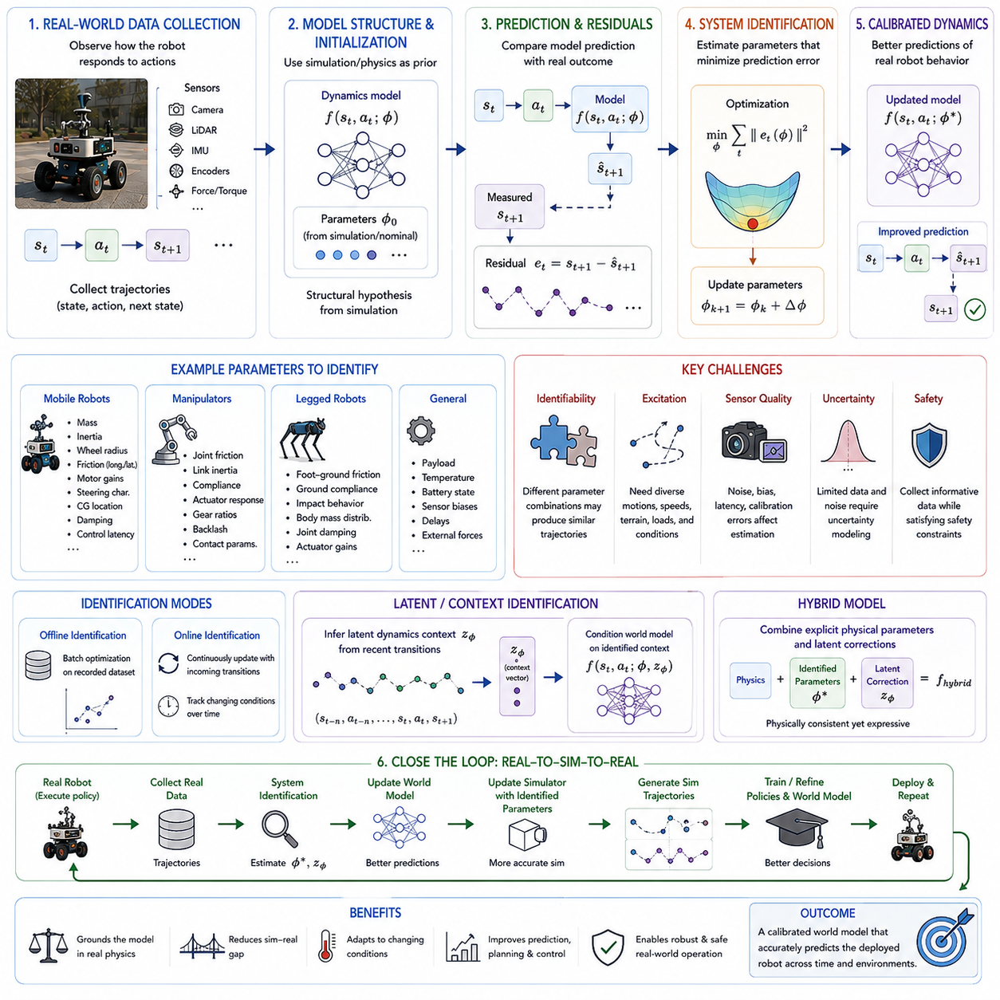{width="7.268055555555556in" height="7.268055555555556in"}

System identification from real data estimates the dynamics and physical parameters of a deployed robot by analyzing measured relationships among states, actions, and resulting transitions. Within a Sim2Real world-model pipeline, it provides a systematic mechanism for replacing uncertain simulation assumptions with evidence obtained from the physical system. The identified information can then calibrate or condition the world model used for prediction, planning, and control.

The basic principle is to observe how the physical system responds to known inputs. At time (t), the robot has a state (s_t), executes an action (a_t), and reaches an observed state (s_{t+1}). Repeated measurements produce trajectories of state-action-transition tuples. System identification searches for model parameters (\\phi) that make predicted transitions (f(s_t,a_t;\\phi)) agree as closely as possible with these measured outcomes.

These parameters may correspond to interpretable physical quantities. For a mobile robot, they can include mass, rotational inertia, wheel radius, friction coefficients, motor gains, steering characteristics, center of gravity, damping, and control latency. Manipulators may require joint friction, link inertia, compliance, actuator response, and contact parameters, while legged robots may additionally require properties describing foot-ground interaction and impact behavior.

Real measurements are important because nominal engineering parameters do not always represent the effective dynamics encountered during operation. Manufacturing tolerances, component aging, payload changes, tire wear, battery state, temperature, mechanical backlash, surface conditions, and controller delays can alter the relationship between commands and motion. System identification estimates these effective properties from observed behavior rather than assuming that nominal specifications remain exact.

Identification can begin with a simulation-trained dynamics model. Simulation supplies initial parameter values and a structural hypothesis about how states should evolve. Real trajectories are then evaluated against the model, and prediction residuals reveal disagreement. Optimization adjusts selected parameters to minimize this discrepancy, allowing the system to preserve useful simulated physics while calibrating uncertain components using physical evidence.

The quality of identification depends strongly on the informativeness of collected trajectories. If the robot repeatedly performs nearly identical motions, many parameters may remain difficult to distinguish. Excitation across relevant velocities, accelerations, steering angles, contacts, loads, and operating conditions exposes more of the system dynamics. Data collection must therefore balance parameter observability with safety constraints and normal operational requirements.

Not every parameter can necessarily be identified independently. Different combinations of mass, friction, actuator gain, or delay may produce similar observed trajectories, creating parameter ambiguity. This is an identifiability problem. Physical priors, known engineering specifications, constrained parameter ranges, multiple sensor modalities, and diverse excitation trajectories can reduce ambiguity and prevent the optimization process from converging to physically unrealistic explanations.

Sensor quality also directly affects identification. Camera, LiDAR, IMU, wheel encoder, joint encoder, force, torque, and proprioceptive measurements contain noise, bias, latency, and calibration errors. If these errors are interpreted as dynamics, the identified model can become misleading. State estimation, temporal synchronization, filtering, calibration, and uncertainty modeling are therefore important preprocessing components of real-data system identification.

System identification may be performed offline using a dataset collected during dedicated experiments or online while the robot operates. Offline identification allows extensive optimization over large datasets and is useful for initial calibration. Online identification continually incorporates new transitions and can track changing conditions such as payload, surface friction, actuator temperature, mechanical wear, or other factors that modify the effective dynamics over time.

A hybrid strategy can separate slowly changing intrinsic parameters from rapidly changing environmental parameters. Robot mass properties, geometry, or persistent actuator characteristics may be updated relatively slowly, while friction, payload, terrain interaction, or external disturbances may require faster estimation. This multi-timescale approach prevents temporary conditions from unnecessarily rewriting stable knowledge about the physical platform.

World models extend classical system identification by allowing learned representations and neural dynamics to participate in the estimation process. Instead of identifying only a predefined set of physical coefficients, the system can infer a latent dynamics context (z_\\phi) from recent trajectories. This context can summarize hidden properties affecting transitions and condition the predictive model even when those properties cannot be conveniently represented by explicit engineering parameters.

Explicit and latent identification can also be combined. Parameters with clear physical meaning can remain interpretable, while a latent representation captures unmodeled effects. The resulting transition model may therefore use analytical physics, identified parameters, and learned latent corrections simultaneously. Such hybrid models can preserve physical consistency while representing complex interactions that are difficult to describe using conventional equations alone.

Prediction error provides the primary feedback signal. After an action is executed, the world model predicts (\\hat{s}\*{t+1}) and compares it with the measured (s\*{t+1}). Persistent structured residuals indicate that the current model is systematically incorrect. Parameter estimation then seeks an update (\\Delta\\phi) that reduces future residuals rather than treating every discrepancy as independent noise.

Uncertainty is necessary because identified parameters are estimates rather than unquestionable truths. Limited data, sensor noise, insufficient excitation, and unobserved disturbances can produce substantial uncertainty about the correct dynamics. A world model can maintain distributions or confidence estimates over parameters and propagate this uncertainty into future-state predictions, enabling planners to behave conservatively when identification remains unreliable.

For mobile robots, identification can estimate how commanded velocity maps to actual acceleration and displacement under different surfaces and payloads. It can reveal wheel slip, asymmetric drive response, steering bias, or effective control delay. These estimates improve trajectory prediction and model predictive control because the planner evaluates candidate actions using behavior measured from the actual vehicle rather than idealized simulator assumptions.

System identification also supports Real-to-Sim updating. Once physical parameters or dynamics characteristics have been estimated, they can be transferred back into the simulator. The simulator then generates trajectories that better approximate the deployed robot, narrowing the distributional gap between virtual and physical experience. Updated simulation can subsequently provide more relevant data for world-model training, policy learning, testing, and safety evaluation.

This produces an iterative loop between simulation and reality. Simulation initializes the model, physical execution generates measurements, system identification estimates the dynamics responsible for those measurements, and the resulting parameters update both the world model and simulator. Additional simulated and real trajectories then refine the estimate further, creating a progressively better correspondence between internal predictions and physical behavior.

System identification from real data therefore acts as a grounding mechanism for Sim2Real world models. It converts physical experience into quantitative information about how the deployed system actually behaves, replacing uncertain assumptions with measured evidence whenever possible. Combined with residual learning, latent adaptation, and continuous field updates, it helps transform a simulation-trained model into an internal dynamics model calibrated to the real robot and its changing environment.

실제 데이터 기반 시스템 식별(System Identification from Real Data)은 상태(state), 행동(action), 그리고 그 결과로 발생하는 전이(transition) 사이의 측정된 관계를 분석하여 실제 배치된 로봇의 동역학(dynamics)과 물리 파라미터(physical parameters)를 추정하는 과정이다. Sim2Real 월드 모델 파이프라인(world-model pipeline)에서는 불확실한 시뮬레이션 가정을 실제 물리 시스템에서 얻은 증거로 대체하는 체계적인 메커니즘을 제공한다. 식별된 정보는 이후 예측(prediction), 계획(planning), 제어(control)에 사용되는 월드 모델을 보정하거나 조건화하는 데 활용될 수 있다.

기본 원리는 물리 시스템이 알려진 입력(input)에 어떻게 반응하는지를 관측하는 것이다. 시간 (t)에서 로봇은 상태 (s_t)를 가지며 행동 (a_t)를 실행한 후 관측된 상태 (s_{t+1})에 도달한다. 반복적인 측정을 통해 상태-행동-전이(state-action-transition) 튜플(tuple)의 궤적이 생성된다. 시스템 식별은 예측 전이 (f(s_t,a_t;\\phi))가 이러한 측정 결과와 가능한 한 일치하도록 만드는 모델 파라미터 (\\phi)를 탐색한다.

이러한 파라미터는 해석 가능한 물리량(interpretable physical quantities)에 대응할 수 있다. 모바일 로봇(mobile robot)의 경우 질량(mass), 회전 관성(rotational inertia), 바퀴 반경(wheel radius), 마찰계수(friction coefficients), 모터 이득(motor gains), 조향 특성(steering characteristics), 무게중심(center of gravity), 감쇠(damping), 제어 지연(control latency) 등이 포함될 수 있다. 매니퓰레이터(manipulator)에서는 관절 마찰(joint friction), 링크 관성(link inertia), 순응성(compliance), 액추에이터 응답(actuator response), 접촉 파라미터(contact parameters)가 필요할 수 있으며, 보행 로봇(legged robot)에서는 발-지면 상호작용(foot-ground interaction)과 충격 거동(impact behavior)을 설명하는 특성이 추가될 수 있다.

실제 측정(real measurement)이 중요한 이유는 명목상의 공학 파라미터(nominal engineering parameters)가 실제 운용 중 나타나는 유효 동역학(effective dynamics)을 항상 정확하게 표현하지는 않기 때문이다. 제조 공차(manufacturing tolerances), 부품 노화(component aging), 페이로드 변화(payload changes), 타이어 마모(tire wear), 배터리 상태(battery state), 온도(temperature), 기계적 백래시(mechanical backlash), 노면 조건(surface conditions), 제어기 지연(controller delays)은 명령과 실제 움직임 사이의 관계를 변화시킬 수 있다. 시스템 식별은 명목 사양이 항상 정확하다고 가정하는 대신 관측된 거동으로부터 이러한 유효 특성을 추정한다.

시스템 식별은 시뮬레이션에서 학습된 동역학 모델(simulation-trained dynamics model)에서 시작할 수 있다. 시뮬레이션은 초기 파라미터 값과 상태가 어떻게 변화해야 하는지에 관한 구조적 가설(structural hypothesis)을 제공한다. 이후 실제 궤적을 모델과 비교하고 예측 잔차(prediction residual)를 통해 불일치를 확인한다. 최적화(optimization)는 이러한 차이를 최소화하도록 선택된 파라미터를 조정하여 유용한 시뮬레이션 물리 지식은 유지하면서 불확실한 구성요소를 실제 물리적 증거로 보정할 수 있게 한다.

식별 품질은 수집된 궤적의 정보성(informativeness)에 크게 의존한다. 로봇이 거의 동일한 움직임만 반복하면 여러 파라미터를 서로 구별하기 어려울 수 있다. 관련 속도(velocity), 가속도(acceleration), 조향각(steering angle), 접촉(contact), 하중(load), 운용 조건에 걸친 다양한 가진(excitation)은 시스템 동역학을 더 폭넓게 드러낸다. 따라서 데이터 수집은 파라미터 관측 가능성(parameter observability), 안전 제약(safety constraints), 정상적인 운용 요구사항 사이의 균형을 고려해야 한다.

모든 파라미터를 반드시 독립적으로 식별할 수 있는 것은 아니다. 서로 다른 질량, 마찰, 액추에이터 이득, 지연의 조합이 유사한 관측 궤적을 만들어낼 수 있으며, 이는 파라미터 모호성(parameter ambiguity)을 발생시킨다. 이것이 식별 가능성 문제(identifiability problem)이다. 물리 사전 지식(physical priors), 알려진 공학 사양(engineering specifications), 제한된 파라미터 범위, 다중 모달 센서(multimodal sensors), 다양한 가진 궤적(excitation trajectories)을 활용하면 모호성을 줄이고 최적화 과정이 물리적으로 비현실적인 설명에 수렴하는 것을 방지할 수 있다.

센서 품질(sensor quality) 역시 식별에 직접적인 영향을 미친다. 카메라(camera), 라이다(LiDAR), 관성 측정 장치(IMU), 휠 인코더(wheel encoder), 관절 인코더(joint encoder), 힘(force), 토크(torque), 고유수용성 측정(proprioceptive measurement)에는 노이즈(noise), 바이어스(bias), 지연(latency), 보정 오류(calibration error)가 존재한다. 이러한 오류가 동역학으로 잘못 해석되면 식별된 모델은 부정확해질 수 있다. 따라서 상태 추정(state estimation), 시간 동기화(temporal synchronization), 필터링(filtering), 보정(calibration), 불확실성 모델링(uncertainty modeling)은 실제 데이터 기반 시스템 식별에서 중요한 전처리 과정이다.

시스템 식별은 전용 실험에서 수집된 데이터셋을 이용하여 오프라인(offline)으로 수행하거나 로봇이 운용되는 동안 온라인(online)으로 수행할 수 있다. 오프라인 식별(offline identification)은 대규모 데이터셋에 대해 광범위한 최적화를 수행할 수 있어 초기 보정(initial calibration)에 유용하다. 온라인 식별(online identification)은 새로운 전이를 지속적으로 반영하여 페이로드, 노면 마찰, 액추에이터 온도, 기계적 마모(mechanical wear) 등 시간에 따라 유효 동역학을 변화시키는 조건을 추적할 수 있다.

하이브리드 전략(hybrid strategy)은 천천히 변화하는 고유 파라미터(intrinsic parameters)와 빠르게 변화하는 환경 파라미터(environmental parameters)를 분리할 수 있다. 로봇의 질량 특성, 기하학(geometry), 지속적인 액추에이터 특성은 비교적 느리게 갱신할 수 있는 반면, 마찰, 페이로드, 지형 상호작용(terrain interaction), 외부 외란은 더 빠른 추정이 필요할 수 있다. 이러한 다중 시간 척도 접근(multi-timescale approach)은 일시적인 조건이 물리 플랫폼에 대한 안정적인 지식을 불필요하게 변경하는 것을 방지한다.

월드 모델은 학습된 표현(learned representation)과 신경망 동역학(neural dynamics)이 추정 과정에 참여할 수 있도록 함으로써 고전적인 시스템 식별(classical system identification)을 확장한다. 미리 정의된 물리 계수만 식별하는 대신 시스템은 최근 궤적으로부터 잠재 동역학 문맥(latent dynamics context) (z_\\phi)를 추론할 수 있다. 이 문맥은 전이에 영향을 주는 숨겨진 특성을 요약하고, 이러한 특성을 명시적인 공학 파라미터로 편리하게 표현하기 어려운 경우에도 예측 모델을 조건화할 수 있다.

명시적 식별(explicit identification)과 잠재 식별(latent identification)을 결합할 수도 있다. 명확한 물리적 의미를 가진 파라미터는 해석 가능성을 유지하고, 잠재 표현은 모델링되지 않은 효과(unmodeled effects)를 포착한다. 따라서 결과적인 전이 모델은 해석적 물리(analytical physics), 식별된 파라미터(identified parameters), 학습된 잠재 보정(learned latent corrections)을 동시에 사용할 수 있다. 이러한 하이브리드 모델(hybrid model)은 물리적 일관성(physical consistency)을 유지하면서 기존 방정식만으로 설명하기 어려운 복잡한 상호작용을 표현할 수 있다.

예측 오차(prediction error)는 핵심적인 피드백 신호(feedback signal)를 제공한다. 행동이 실행된 후 월드 모델은 (\\hat{s}\*{t+1})을 예측하고 이를 측정된 (s\*{t+1})과 비교한다. 지속적이고 구조적인 잔차(structured residual)는 현재 모델이 체계적으로 잘못되어 있음을 나타낸다. 이후 파라미터 추정(parameter estimation)은 모든 차이를 독립적인 노이즈로 취급하는 대신 향후 잔차를 감소시키는 갱신값 (\\Delta\\phi)를 찾는다.

식별된 파라미터는 절대적인 진실이 아니라 추정값이므로 불확실성(uncertainty)을 고려해야 한다. 제한된 데이터, 센서 노이즈, 불충분한 가진(insufficient excitation), 관측되지 않은 외란은 정확한 동역학에 상당한 불확실성을 발생시킬 수 있다. 월드 모델은 파라미터에 대한 확률분포(distribution) 또는 신뢰도 추정(confidence estimate)을 유지하고 이러한 불확실성을 미래 상태 예측으로 전파할 수 있다. 이를 통해 식별 결과의 신뢰성이 낮을 때 계획기가 보수적으로 행동하도록 할 수 있다.

모바일 로봇에서는 시스템 식별을 통해 서로 다른 노면과 페이로드 조건에서 명령 속도(commanded velocity)가 실제 가속도와 변위(displacement)로 어떻게 연결되는지를 추정할 수 있다. 또한 바퀴 슬립(wheel slip), 비대칭 구동 응답(asymmetric drive response), 조향 바이어스(steering bias), 유효 제어 지연(effective control delay)을 발견할 수 있다. 이러한 추정은 이상적인 시뮬레이터 가정이 아니라 실제 차량에서 측정된 거동을 이용해 후보 행동을 평가하도록 함으로써 궤적 예측과 모델 예측 제어(Model Predictive Control)를 향상시킨다.

시스템 식별은 현실-시뮬레이션 갱신(Real-to-Sim Updating)도 지원한다. 물리 파라미터나 동역학 특성이 추정되면 이를 다시 시뮬레이터에 반영할 수 있다. 그러면 시뮬레이터는 실제 배치된 로봇을 더욱 정확하게 근사하는 궤적을 생성하여 가상 경험과 실제 경험 사이의 분포 차이(distributional gap)를 줄인다. 갱신된 시뮬레이션은 이후 월드 모델 학습, 정책 학습(policy learning), 테스트(testing), 안전성 평가(safety evaluation)에 더욱 관련성 높은 데이터를 제공할 수 있다.

이를 통해 시뮬레이션과 현실 사이에 반복적인 루프(iterative loop)가 형성된다. 시뮬레이션은 모델을 초기화하고, 실제 물리적 실행은 측정 데이터를 생성하며, 시스템 식별은 이러한 측정 결과를 만들어낸 동역학을 추정한다. 그 결과로 얻어진 파라미터는 월드 모델과 시뮬레이터 모두를 갱신한다. 이후 추가적인 시뮬레이션 궤적과 실제 궤적이 추정 결과를 더욱 개선하면서 내부 예측과 실제 물리적 거동 사이의 대응 관계를 점진적으로 향상시킨다.

따라서 실제 데이터 기반 시스템 식별은 Sim2Real 월드 모델을 위한 현실 기반화 메커니즘(grounding mechanism)으로 작동한다. 실제 물리적 경험을 배치된 시스템이 실제로 어떻게 동작하는지에 관한 정량적인 정보로 변환하고, 가능한 경우 불확실한 가정을 측정된 증거로 대체한다. 잔차 학습(residual learning), 잠재 적응(latent adaptation), 지속적인 현장 갱신(continuous field updates)과 결합하면 시뮬레이션에서 학습된 모델을 실제 로봇과 변화하는 환경에 맞게 보정된 내부 동역학 모델(internal dynamics model)로 발전시키는 데 기여한다.

##  

## 14.06. Residual Dynamics Learning

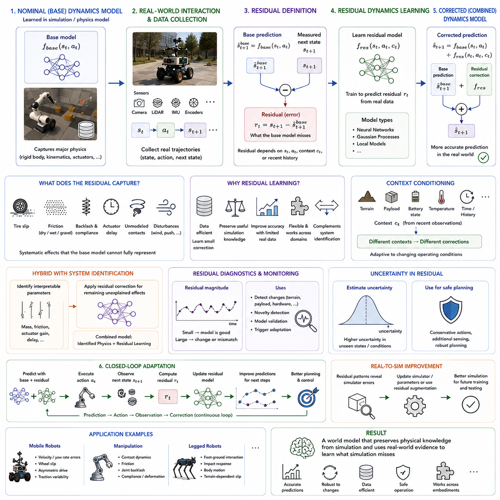{width="7.268055555555556in" height="7.268055555555556in"}

Residual dynamics learning provides a practical way to correct the mismatch between simulated or analytical dynamics and the behavior observed in the physical world. Instead of discarding an existing dynamics model and learning everything again from real data, the system preserves the useful structure of the nominal model and learns only the missing component. This residual becomes a compact correction that improves world-model predictions after Sim2Real transfer.

Suppose a nominal dynamics model predicts the next state as (\\hat{s}\^{base}\*{t+1}=f\*{base}(s_t,a_t)). After the robot executes action (a_t), sensors measure the actual state (s_{t+1}). The difference between the observed and predicted transition defines a residual (r_t=s_{t+1}-\\hat{s}\^{base}_{t+1}). A learned residual model estimates this discrepancy from the current state, action, context, or recent transition history.

The corrected prediction can then be expressed conceptually as (\\hat{s}\*{t+1}=f\*{base}(s_t,a_t)+f_{res}(s_t,a_t,c_t)), where (f_{res}) represents the learned correction and (c_t) may encode environmental or temporal context. The base model explains dynamics already understood, while the residual model concentrates its capacity on effects that the nominal dynamics systematically fail to represent.

This decomposition is especially useful when simulation captures the major physical structure reasonably well. Rigid-body motion, robot geometry, kinematic constraints, and basic actuator relationships may already be represented accurately enough for broad prediction. Real systems nevertheless contain tire slip, backlash, deformation, compliance, actuator delays, unmodeled friction, contact effects, and disturbances that are difficult to reproduce perfectly in simulation.

Learning only the discrepancy can be substantially more data efficient than relearning complete dynamics from physical trajectories. The residual is often smaller and structurally simpler than the full state transition. Consequently, a relatively limited real-world dataset can provide useful corrections while the much larger body of knowledge acquired from simulation remains intact. This property makes residual learning particularly attractive for costly robotic data collection.

Residual training begins by collecting real state-action-transition samples and evaluating them with the nominal model. Each sample generates a prediction error that becomes a target for the residual learner. Neural networks, Gaussian processes, local models, or other function approximators can learn mappings from relevant state and action features to these errors. The corrected model is then evaluated again against subsequent physical observations.

Residual dynamics can operate in explicit state space or latent space. Explicit residuals may directly correct position, velocity, acceleration, force, orientation, or other physical quantities. Latent residuals instead modify an internal representation used by the world model. Latent correction can capture complicated discrepancies without requiring every source of error to have a separately defined physical parameter.

Context conditioning makes residual models responsive to changing operating conditions. The correction required on dry concrete may differ from that required on gravel, wet surfaces, or slopes. Payload, battery state, actuator temperature, tire condition, and external disturbances can also alter the discrepancy. Recent observations can therefore provide a context variable that allows the residual model to generate different corrections for different dynamics regimes.

Residual learning complements system identification rather than replacing it. System identification is appropriate when discrepancies can be explained by interpretable quantities such as mass, friction, actuator gain, or delay. Residual learning is useful for remaining effects that are difficult to parameterize explicitly. A hybrid world model can therefore use identified physical parameters first and apply a learned residual afterward to account for unexplained dynamics.

The residual itself can provide diagnostic information. If corrections remain small, the nominal model is likely operating within conditions it represents well. A persistent increase in residual magnitude can indicate a change in terrain, payload, hardware condition, calibration, or environmental dynamics. Monitoring residual statistics can therefore support novelty detection, model validation, and decisions about whether additional adaptation is necessary.

Uncertainty should accompany residual predictions because corrections learned from limited physical data may not generalize everywhere. When the robot operates near regions represented in the residual training data, the correction may be reliable. In unfamiliar states or environments, uncertainty should increase. Planning can then reduce reliance on uncertain corrections, select conservative trajectories, or gather additional observations before executing aggressive actions.

Careful regularization is necessary to prevent the residual model from overriding valid physics. If an unconstrained neural correction is powerful enough, it may compensate for training data while producing physically implausible behavior elsewhere. Limiting residual magnitude, preserving known constraints, penalizing unnecessary corrections, or combining the residual with physics-informed objectives helps ensure that learning supplements the base dynamics instead of replacing them unintentionally.

Residual models can also be learned at different temporal scales. Fast residual adaptation may compensate for temporary effects such as a changing payload, surface condition, or wind. Slower residual learning can capture persistent discrepancies caused by actuator characteristics, mechanical wear, or systematic simulator limitations. Separating these timescales allows immediate adaptation while retaining stable long-term knowledge about the robot.

For mobile robots, residual dynamics can correct errors in predicted velocity, yaw rate, acceleration, and displacement caused by wheel slip, uneven traction, payload changes, or actuator asymmetry. A nominal vehicle model may predict the broad motion correctly while the residual learns terrain-dependent deviations. The combined model can therefore provide more accurate rollouts for trajectory optimization and model predictive control.

For manipulation, residual learning can represent contact behavior, object friction, joint backlash, compliance, or deformation not captured by nominal rigid-body simulation. For quadrupeds, it can correct predictions of foot-ground interaction, impact response, body motion, and terrain-dependent slip. Across embodiments, the same principle applies: retain predictable physics and learn the systematic difference between modeled and observed transitions.

Residual corrections can also be transferred back into simulation. Patterns repeatedly discovered from real trajectories reveal where the simulator is systematically inaccurate. Some corrections may motivate explicit simulator parameter updates, while others can remain as learned augmentation models. This creates a Real-to-Sim improvement mechanism in which physical experience progressively increases the usefulness of future simulated trajectories.

The resulting architecture supports continual adaptation. The world model predicts a transition using nominal dynamics and its current residual correction, the robot executes an action, and sensors measure the outcome. New prediction errors update the residual model when appropriate. Planning then uses the corrected dynamics for the next decision, forming a continuous prediction-action-observation-correction loop grounded in physical experience.

Residual dynamics learning therefore provides an efficient bridge between approximate simulation and complex reality. It preserves the scalable knowledge and physical structure obtained from simulation while using real-world evidence to model what simulation misses. Combined with system identification, uncertainty estimation, and online adaptation, residual correction enables world models to become progressively more accurate without requiring complete relearning whenever the Sim2Real gap changes.

잔차 동역학 학습(Residual Dynamics Learning)은 시뮬레이션 또는 해석적 동역학(Analytical Dynamics)과 실제 물리 세계에서 관측되는 거동 사이의 불일치를 보정하는 실용적인 방법을 제공한다. 기존 동역학 모델(Dynamics Model)을 폐기하고 실제 데이터로 모든 것을 처음부터 다시 학습하는 대신, 시스템은 명목 모델(Nominal Model)의 유용한 구조를 유지하면서 누락된 부분만 학습한다. 이러한 잔차(Residual)는 Sim2Real 전이 이후 월드 모델(World Model)의 예측을 개선하는 압축된 보정값(Correction)으로 작동한다.

명목 동역학 모델이 다음 상태를 (\\hat{s}\^{base}\*{t+1}=f\*{base}(s_t,a_t))로 예측한다고 가정하자. 로봇이 행동 (a_t)를 실행한 후 센서는 실제 상태 (s_{t+1})을 측정한다. 관측된 전이와 예측된 전이 사이의 차이는 잔차 (r_t=s_{t+1}-\\hat{s}\^{base}_{t+1})로 정의된다. 학습된 잔차 모델(Residual Model)은 현재 상태, 행동, 문맥(Context), 또는 최근 전이 이력(Transition History)으로부터 이러한 차이를 추정한다.

보정된 예측은 개념적으로 (\\hat{s}\*{t+1}=f\*{base}(s_t,a_t)+f_{res}(s_t,a_t,c_t))로 표현할 수 있으며, 여기에서 (f_{res})는 학습된 보정값을 나타내고 (c_t)는 환경적 또는 시간적 문맥(Environmental or Temporal Context)을 인코딩할 수 있다. 기본 모델(Base Model)은 이미 이해된 동역학을 설명하고, 잔차 모델은 명목 동역학이 체계적으로 표현하지 못하는 효과에 학습 용량을 집중한다.

이러한 분해(Decomposition)는 시뮬레이션이 주요 물리 구조(Physical Structure)를 비교적 정확하게 표현하는 경우 특히 유용하다. 강체 운동(Rigid-Body Motion), 로봇 기하학(Robot Geometry), 운동학적 제약(Kinematic Constraints), 기본적인 액추에이터 관계(Actuator Relationships)는 이미 광범위한 예측에 충분할 정도로 표현될 수 있다. 그러나 실제 시스템에는 타이어 슬립(Tire Slip), 백래시(Backlash), 변형(Deformation), 순응성(Compliance), 액추에이터 지연(Actuator Delay), 모델링되지 않은 마찰(Unmodeled Friction), 접촉 효과(Contact Effects), 외란(Disturbances) 등 시뮬레이션에서 완벽하게 재현하기 어려운 요소가 존재한다.

물리적 궤적(Physical Trajectory)으로부터 전체 동역학을 다시 학습하는 것보다 차이만 학습하는 것이 훨씬 높은 데이터 효율성(Data Efficiency)을 제공할 수 있다. 잔차는 전체 상태 전이(State Transition)보다 규모가 작고 구조적으로 단순한 경우가 많다. 따라서 비교적 제한된 실제 데이터셋(Real-World Dataset)만으로도 유용한 보정값을 얻으면서 시뮬레이션에서 획득한 훨씬 방대한 지식을 그대로 유지할 수 있다. 이러한 특성 때문에 잔차 학습은 비용이 높은 로봇 데이터 수집에 특히 적합하다.

잔차 학습(Residual Training)은 실제 상태-행동-전이(State-Action-Transition) 샘플을 수집하고 이를 명목 모델로 평가하는 것에서 시작한다. 각 샘플은 잔차 학습기의 목표값(Target)이 되는 예측 오차(Prediction Error)를 생성한다. 신경망(Neural Network), 가우시안 프로세스(Gaussian Process), 국소 모델(Local Model) 또는 다른 함수 근사기(Function Approximator)를 사용하여 관련 상태 및 행동 특징으로부터 이러한 오차를 예측하는 매핑을 학습할 수 있다. 이후 보정된 모델은 새로운 물리적 관측을 통해 다시 평가된다.

잔차 동역학은 명시적 상태 공간(Explicit State Space) 또는 잠재 공간(Latent Space)에서 작동할 수 있다. 명시적 잔차(Explicit Residual)는 위치(Position), 속도(Velocity), 가속도(Acceleration), 힘(Force), 자세(Orientation) 또는 기타 물리량을 직접 보정할 수 있다. 반면 잠재 잔차(Latent Residual)는 월드 모델에서 사용하는 내부 표현(Internal Representation)을 수정한다. 잠재 보정(Latent Correction)은 각각의 오차 원인을 별도의 물리 파라미터로 정의하지 않고도 복잡한 불일치를 표현할 수 있다.

문맥 조건화(Context Conditioning)를 적용하면 잔차 모델이 변화하는 운용 조건에 대응할 수 있다. 건조한 콘크리트에서 필요한 보정은 자갈, 젖은 노면 또는 경사면에서 필요한 보정과 다를 수 있다. 페이로드(Payload), 배터리 상태(Battery State), 액추에이터 온도(Actuator Temperature), 타이어 상태(Tire Condition), 외부 외란 역시 불일치를 변화시킬 수 있다. 따라서 최근 관측을 이용해 문맥 변수(Context Variable)를 구성하면 잔차 모델이 서로 다른 동역학 영역(Dynamics Regime)에 맞는 보정값을 생성할 수 있다.

잔차 학습은 시스템 식별(System Identification)을 대체하기보다 상호 보완한다. 시스템 식별은 질량(Mass), 마찰(Friction), 액추에이터 이득(Actuator Gain), 지연(Delay)처럼 해석 가능한 물리량으로 불일치를 설명할 수 있을 때 적합하다. 잔차 학습은 명시적으로 파라미터화하기 어려운 나머지 효과를 표현하는 데 유용하다. 따라서 하이브리드 월드 모델(Hybrid World Model)은 먼저 식별된 물리 파라미터를 사용하고, 이후 설명되지 않은 동역학을 보상하기 위해 학습된 잔차를 적용할 수 있다.

잔차 자체도 진단 정보(Diagnostic Information)를 제공할 수 있다. 보정값이 계속 작게 유지된다면 명목 모델이 현재 조건을 비교적 잘 표현하고 있을 가능성이 높다. 반대로 잔차 크기(Residual Magnitude)가 지속적으로 증가한다면 지형, 페이로드, 하드웨어 상태(Hardware Condition), 보정 상태(Calibration), 환경 동역학(Environmental Dynamics)이 변화했음을 의미할 수 있다. 따라서 잔차 통계(Residual Statistics)를 모니터링하면 신규성 탐지(Novelty Detection), 모델 검증(Model Validation), 추가 적응 필요성 판단에 활용할 수 있다.

제한된 물리 데이터로 학습된 보정값이 모든 상황에서 일반화된다고 보장할 수 없기 때문에 잔차 예측에는 불확실성(Uncertainty)이 함께 고려되어야 한다. 로봇이 잔차 학습 데이터가 충분히 포함된 영역에서 동작하면 보정값의 신뢰도가 높을 수 있다. 반대로 익숙하지 않은 상태나 환경에서는 불확실성이 증가해야 한다. 계획(Planning)은 이러한 경우 불확실한 보정값에 대한 의존도를 낮추고 보수적인 궤적(Conservative Trajectory)을 선택하거나 공격적인 행동을 실행하기 전에 추가 관측을 수집할 수 있다.

잔차 모델이 유효한 물리 법칙을 덮어쓰는 것을 방지하기 위해 신중한 정규화(Regularization)가 필요하다. 제약이 없는 신경망 보정 모델이 지나치게 강력하면 학습 데이터에서는 오차를 보상하면서 다른 영역에서는 물리적으로 불가능한 거동을 생성할 수 있다. 잔차 크기를 제한하고, 알려진 제약 조건을 유지하며, 불필요한 보정에 페널티(Penalty)를 부여하거나, 잔차를 물리 정보 기반 목적 함수(Physics-Informed Objective)와 결합하면 학습 모델이 기본 동역학을 의도하지 않게 대체하는 것을 방지할 수 있다.

잔차 모델은 서로 다른 시간 척도(Temporal Scale)에서도 학습할 수 있다. 빠른 잔차 적응(Fast Residual Adaptation)은 변화하는 페이로드, 노면 상태, 바람(Wind)과 같은 일시적인 효과를 보상할 수 있다. 더 느린 잔차 학습(Slow Residual Learning)은 액추에이터 특성, 기계적 마모(Mechanical Wear), 체계적인 시뮬레이터 한계와 같은 지속적인 차이를 학습할 수 있다. 이러한 시간 척도를 분리하면 로봇에 관한 안정적인 장기 지식을 유지하면서 즉각적인 적응도 가능하다.

모바일 로봇(Mobile Robot)의 경우 잔차 동역학은 바퀴 슬립(Wheel Slip), 불균일한 접지력(Uneven Traction), 페이로드 변화, 액추에이터 비대칭(Actuator Asymmetry)으로 발생하는 예측 속도, 요 레이트(Yaw Rate), 가속도, 변위(Displacement)의 오차를 보정할 수 있다. 명목 차량 모델(Nominal Vehicle Model)이 전체적인 움직임을 예측하고 잔차가 지형에 따른 편차를 학습함으로써, 결합된 모델은 궤적 최적화(Trajectory Optimization)와 모델 예측 제어(Model Predictive Control)를 위한 더욱 정확한 롤아웃(Rollout)을 제공할 수 있다.

매니퓰레이션(Manipulation)에서는 잔차 학습을 통해 명목 강체 시뮬레이션에서 충분히 표현되지 않는 접촉 거동(Contact Behavior), 객체 마찰(Object Friction), 관절 백래시(Joint Backlash), 순응성, 변형을 모델링할 수 있다. 4족 보행 로봇(Quadruped)에서는 발-지면 상호작용(Foot-Ground Interaction), 충격 응답(Impact Response), 몸체 움직임(Body Motion), 지형 의존적 슬립(Terrain-Dependent Slip)의 예측을 보정할 수 있다. 임바디먼트(Embodiment)가 달라도 예측 가능한 물리 특성은 유지하고 모델링된 전이와 실제 관측된 전이 사이의 체계적인 차이를 학습한다는 원리는 동일하다.

잔차 보정(Residual Correction)은 다시 시뮬레이션으로 전달될 수도 있다. 실제 궤적에서 반복적으로 발견되는 패턴은 시뮬레이터가 어느 부분에서 체계적으로 부정확한지를 보여준다. 일부 보정값은 명시적인 시뮬레이터 파라미터 갱신(Simulator Parameter Update)으로 이어질 수 있으며, 다른 보정값은 학습된 보강 모델(Learned Augmentation Model)로 유지할 수 있다. 이를 통해 물리적 경험이 미래 시뮬레이션 궤적의 유용성을 점진적으로 높이는 현실-시뮬레이션 개선 메커니즘(Real-to-Sim Improvement Mechanism)이 형성된다.

결과적인 아키텍처는 지속적 적응(Continual Adaptation)을 지원한다. 월드 모델은 명목 동역학과 현재의 잔차 보정값을 사용하여 전이를 예측하고, 로봇은 행동을 실행하며, 센서는 그 결과를 측정한다. 새로운 예측 오차는 필요한 경우 잔차 모델을 갱신하는 데 사용된다. 이후 계획기는 보정된 동역학을 다음 의사결정에 사용하면서 물리적 경험에 기반한 지속적인 예측-행동-관측-보정 루프(Prediction-Action-Observation-Correction Loop)를 형성한다.

따라서 잔차 동역학 학습은 근사적인 시뮬레이션(Approximate Simulation)과 복잡한 현실 사이를 연결하는 효율적인 방법을 제공한다. 시뮬레이션에서 획득한 확장 가능한 지식과 물리적 구조를 유지하면서 실제 환경의 증거를 이용해 시뮬레이션이 놓치는 부분을 모델링한다. 시스템 식별, 불확실성 추정(Uncertainty Estimation), 온라인 적응(Online Adaptation)과 결합하면 Sim2Real 격차가 변화할 때마다 전체 모델을 다시 학습하지 않고도 월드 모델의 정확도를 지속적으로 향상시킬 수 있다.

##  

## 14.07. Real to Sim Model Update

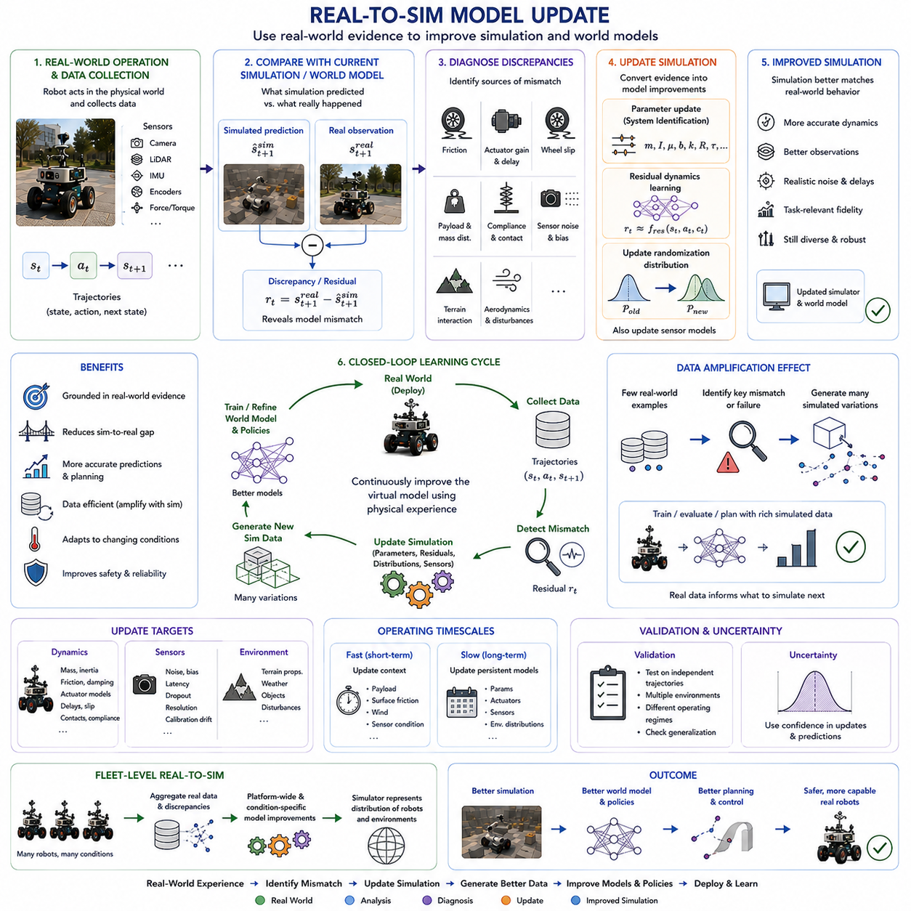{width="7.268055555555556in" height="7.268055555555556in"}

Real-to-Sim model update reverses the usual direction of Sim2Real transfer by using observations from deployed physical systems to improve the simulation and world models that originally supported training. Instead of treating simulation as a fixed source of synthetic experience, this approach treats it as an evolving model whose parameters, distributions, and learned dynamics can be corrected whenever real-world evidence reveals systematic inaccuracies.

The process begins when a robot executes actions in the physical environment and records states, observations, actions, and resulting transitions. The existing simulator or simulation-trained world model predicts what should have occurred under the same conditions. Differences between predicted and measured outcomes expose the parts of the virtual model that do not adequately represent the deployed system.

These discrepancies may originate from many sources. Friction coefficients, actuator gains, control latency, wheel slip, payload distribution, compliance, contact behavior, sensor noise, terrain interaction, aerodynamic effects, or environmental disturbances may differ from their simulated assumptions. Real-to-Sim updating attempts to convert these observed discrepancies into concrete changes that make subsequent simulation more representative of physical operation.

System identification provides one direct mechanism for performing this update. Real trajectories can be used to estimate parameters such as mass, inertia, friction, damping, actuator response, wheel radius, or delay. Once identified, these parameters can replace nominal simulator values. The resulting simulation produces transitions that better approximate the measured dynamics of the physical robot rather than relying exclusively on engineering specifications.

Not every discrepancy can be corrected through explicit simulator parameters. Complex contact, deformation, terrain interaction, actuator nonlinearities, or other unmodeled effects may remain even after parameter calibration. In such cases, residual dynamics models can augment the simulator by learning the systematic difference between simulated predictions and real transitions, effectively adding a learned correction layer to the existing physical model.

The update can also modify the distributions used for domain randomization. Before deployment, parameter ranges may be selected from engineering estimates or broad assumptions. Real-world data provides evidence about which portions of these ranges are actually relevant. Randomization distributions can therefore be shifted, narrowed, expanded, or reshaped while retaining enough diversity to preserve robustness against conditions that have not yet been observed.

Sensor simulation is another important target for Real-to-Sim updating. Real cameras, LiDAR, radar, IMUs, encoders, and force sensors exhibit characteristic noise, bias, latency, dropout, calibration drift, resolution limits, and environmental sensitivities. Comparing physical sensor streams with synthetic observations allows the simulator to reproduce these imperfections more realistically, improving perception and world-model training using synthetic data.

Updating the simulator does not necessarily mean constructing a perfect digital replica of every physical detail. The objective is to improve the aspects of simulation that materially influence prediction, planning, control, or representation learning. A task-relevant simulator may therefore remain simplified while accurately reproducing the transition characteristics and observation statistics that matter for the deployed Physical AI system.

Real-world trajectories can also reveal previously missing operating regimes. A robot may encounter terrain, contacts, payloads, object configurations, weather, disturbances, or failure modes that were absent from the original simulation dataset. These experiences can be reconstructed or approximated in simulation, allowing the system to generate many additional variations around rare but important physical events without repeatedly exposing hardware to them.

This capability creates an important data amplification effect. A relatively small number of expensive real-world examples can identify a meaningful failure or mismatch, after which simulation can generate thousands of related trajectories. The world model or control policy can then train on this expanded experience. Real data therefore serves not only as training data itself but also as information that determines what synthetic data should be generated next.

Real-to-Sim updating can operate at multiple timescales. Rapid updates may modify temporary context such as payload, surface friction, wind, or sensor conditions for short-term simulation and planning. Slower updates can revise persistent simulator parameters, actuator models, sensor characteristics, or environment distributions after accumulating sufficient evidence. This separation prevents transient events from unnecessarily changing long-term simulator knowledge.

Uncertainty is important when deciding whether a simulator update is justified. A discrepancy observed once may result from sensor noise or an unusual disturbance rather than a persistent modeling error. Repeated observations, confidence estimates, parameter posterior distributions, and statistical residual analysis can help determine whether evidence is strong enough to modify the simulator or whether the existing model should be retained.

Validation must follow each meaningful update. A simulator can match the data used for calibration while becoming less accurate in other operating conditions. Updated parameters or residual models should therefore be evaluated against independent real trajectories, multiple environments, and relevant operating regimes. The objective is not merely to minimize calibration error but to improve predictive correspondence across the deployment distribution.

The updated simulator can then regenerate training trajectories for the world model. Because these trajectories incorporate physical evidence collected after deployment, they are more representative than the original synthetic dataset. Retraining or fine-tuning with the improved simulation can strengthen future-state prediction, uncertainty estimation, counterfactual rollouts, and action-conditioned reasoning without requiring equivalent quantities of new physical interaction.

Planning and control also benefit from this improvement. Candidate actions evaluated in an updated simulation or internal world model are tested against dynamics that more closely resemble the deployed robot. This can improve trajectory feasibility, collision prediction, stability estimation, energy prediction, and model predictive control. As the virtual model becomes better grounded, imagined futures become more useful for real decisions.

Fleet operation can extend Real-to-Sim updating beyond a single robot. Multiple deployed systems can contribute trajectories from different environments, payloads, hardware conditions, and operating scenarios. Aggregated discrepancies reveal both platform-wide modeling errors and environment-specific variations. The resulting simulator can evolve from representing one nominal robot toward representing a distribution of real robots and physical conditions.

A complete learning loop therefore emerges: simulation generates initial experience, the world model learns predictive dynamics, the robot is deployed, real observations reveal discrepancies, and those discrepancies update the simulator. The improved simulator generates new experience, which refines the world model and policies before another deployment cycle. Each iteration increases the connection between virtual training and accumulated physical evidence.

This loop also changes the role of simulation within Physical AI development. Simulation is no longer only a pre-deployment engineering tool that becomes less relevant after the robot enters service. It becomes a persistent component of the deployed learning system, continuously informed by field data and continuously producing new virtual experience for testing, adaptation, planning, and future model improvement.

Real-to-Sim model update therefore closes the feedback path that is missing from one-directional Sim2Real transfer. Real-world experience identifies where virtual assumptions are inaccurate, system identification and residual learning convert those discrepancies into model corrections, and updated simulation amplifies the resulting knowledge. Together, these mechanisms create a continually improving cycle between simulation, world models, and physical reality.

현실-시뮬레이션 모델 갱신(Real-to-Sim Model Update)은 실제 배치된 물리 시스템에서 얻은 관측을 이용하여 원래 학습을 지원했던 시뮬레이션(Simulation)과 월드 모델(World Model)을 개선함으로써 일반적인 Sim2Real 전이 방향을 역전시키는 과정이다. 시뮬레이션을 고정된 합성 경험(Synthetic Experience)의 공급원으로 취급하는 대신, 실제 환경의 증거가 체계적인 부정확성을 드러낼 때마다 파라미터(Parameter), 분포(Distribution), 학습된 동역학(Learned Dynamics)을 수정할 수 있는 진화하는 모델(Evolving Model)로 다룬다.

이 과정은 로봇이 실제 물리 환경에서 행동(Action)을 실행하고 상태(State), 관측(Observation), 행동, 그리고 그 결과로 발생하는 전이(Transition)를 기록하면서 시작된다. 기존 시뮬레이터(Simulator) 또는 시뮬레이션에서 학습된 월드 모델은 동일한 조건에서 어떤 결과가 발생했어야 하는지를 예측한다. 예측된 결과와 실제 측정 결과 사이의 차이는 가상 모델(Virtual Model)이 실제 배치 시스템을 충분히 표현하지 못하는 부분을 드러낸다.

이러한 불일치(Discrepancy)는 다양한 원인에서 발생할 수 있다. 마찰계수(Friction Coefficient), 액추에이터 이득(Actuator Gain), 제어 지연(Control Latency), 바퀴 슬립(Wheel Slip), 페이로드 분포(Payload Distribution), 순응성(Compliance), 접촉 거동(Contact Behavior), 센서 노이즈(Sensor Noise), 지형 상호작용(Terrain Interaction), 공기역학적 효과(Aerodynamic Effects), 환경 외란(Environmental Disturbances) 등이 시뮬레이션에서 가정한 값과 다를 수 있다. 현실-시뮬레이션 갱신은 이러한 관측된 차이를 이후 시뮬레이션이 실제 물리 운용을 더 잘 표현하도록 하는 구체적인 변경 사항으로 변환하려 한다.

시스템 식별(System Identification)은 이러한 갱신을 수행하는 직접적인 메커니즘 중 하나를 제공한다. 실제 궤적(Real Trajectory)을 이용하여 질량(Mass), 관성(Inertia), 마찰(Friction), 감쇠(Damping), 액추에이터 응답(Actuator Response), 바퀴 반경(Wheel Radius), 지연(Delay) 등의 파라미터를 추정할 수 있다. 식별된 파라미터는 기존 시뮬레이터의 명목값(Nominal Value)을 대체할 수 있다. 그 결과 시뮬레이션은 공학적 사양(Engineering Specification)에만 의존하지 않고 실제 로봇에서 측정된 동역학을 더 정확하게 근사하는 전이를 생성한다.

모든 불일치를 명시적인 시뮬레이터 파라미터를 통해 보정할 수 있는 것은 아니다. 복잡한 접촉(Complex Contact), 변형(Deformation), 지형 상호작용, 액추에이터 비선형성(Actuator Nonlinearity) 또는 기타 모델링되지 않은 효과(Unmodeled Effects)는 파라미터 보정 이후에도 남을 수 있다. 이러한 경우 잔차 동역학 모델(Residual Dynamics Model)은 시뮬레이션 예측과 실제 전이 사이의 체계적인 차이를 학습함으로써 시뮬레이터를 보강하고, 기존 물리 모델 위에 학습된 보정 계층(Learned Correction Layer)을 추가할 수 있다.

갱신 과정은 도메인 랜덤화(Domain Randomization)에 사용되는 분포도 수정할 수 있다. 배치 이전에는 공학적 추정이나 광범위한 가정을 바탕으로 파라미터 범위를 선택할 수 있다. 실제 환경 데이터는 이러한 범위 가운데 어떤 부분이 실제로 중요한지에 대한 증거를 제공한다. 따라서 아직 관측되지 않은 조건에 대한 강건성(Robustness)을 유지하기 위한 충분한 다양성을 보존하면서 랜덤화 분포(Randomization Distribution)를 이동하거나, 좁히거나, 확장하거나, 형태를 변경할 수 있다.

센서 시뮬레이션(Sensor Simulation) 역시 현실-시뮬레이션 갱신의 중요한 대상이다. 실제 카메라(Camera), 라이다(LiDAR), 레이더(Radar), 관성 측정 장치(IMU), 인코더(Encoder), 힘 센서(Force Sensor)는 고유한 노이즈, 바이어스(Bias), 지연(Latency), 데이터 누락(Dropout), 보정 드리프트(Calibration Drift), 해상도 한계(Resolution Limit), 환경 민감도(Environmental Sensitivity)를 가진다. 실제 센서 스트림과 합성 관측(Synthetic Observation)을 비교하면 시뮬레이터가 이러한 불완전성을 더욱 현실적으로 재현하도록 만들 수 있으며, 이를 통해 합성 데이터를 이용한 인지(Perception)와 월드 모델 학습을 개선할 수 있다.

시뮬레이터를 갱신한다는 것이 반드시 모든 물리적 세부 사항을 완벽하게 복제한 디지털 복제본(Digital Replica)을 구축한다는 의미는 아니다. 목표는 예측(Prediction), 계획(Planning), 제어(Control), 표현 학습(Representation Learning)에 실질적으로 영향을 미치는 시뮬레이션 요소를 개선하는 것이다. 따라서 작업 관련 시뮬레이터(Task-Relevant Simulator)는 단순화된 구조를 유지하면서도 실제 배치된 피지컬 AI(Physical AI) 시스템에 중요한 전이 특성(Transition Characteristics)과 관측 통계(Observation Statistics)를 정확하게 재현할 수 있다.

실제 환경 궤적은 기존 시뮬레이션 데이터셋에 존재하지 않았던 운용 영역(Operating Regime)을 발견할 수도 있다. 로봇은 원래 시뮬레이션 데이터셋에 포함되지 않았던 지형, 접촉, 페이로드, 객체 구성(Object Configuration), 날씨(Weather), 외란, 고장 모드(Failure Mode)를 경험할 수 있다. 이러한 경험을 시뮬레이션에서 재구성하거나 근사함으로써 하드웨어를 위험한 상황에 반복적으로 노출하지 않고도 드물지만 중요한 실제 사건 주변의 수많은 변형을 생성할 수 있다.

이러한 능력은 중요한 데이터 증폭 효과(Data Amplification Effect)를 만들어낸다. 상대적으로 적은 수의 비용이 높은 실제 환경 사례를 통해 의미 있는 실패나 불일치를 식별한 후, 시뮬레이션에서 이와 관련된 수천 개의 궤적을 생성할 수 있다. 이후 월드 모델이나 제어 정책(Control Policy)은 이렇게 확장된 경험을 이용하여 학습할 수 있다. 따라서 실제 데이터는 그 자체로 학습 데이터가 될 뿐만 아니라 다음에 어떤 합성 데이터를 생성해야 하는지를 결정하는 정보로도 작동한다.

현실-시뮬레이션 갱신은 여러 시간 척도(Time Scale)에서 수행될 수 있다. 빠른 갱신(Rapid Update)은 단기 시뮬레이션과 계획을 위해 페이로드, 노면 마찰(Surface Friction), 바람(Wind), 센서 조건과 같은 일시적인 문맥(Context)을 수정할 수 있다. 더 느린 갱신(Slower Update)은 충분한 증거가 축적된 이후 지속적인 시뮬레이터 파라미터, 액추에이터 모델, 센서 특성 또는 환경 분포를 수정할 수 있다. 이러한 분리는 일시적인 사건이 장기적인 시뮬레이터 지식을 불필요하게 변경하는 것을 방지한다.

시뮬레이터 갱신이 정당한지를 결정할 때 불확실성(Uncertainty)이 중요하다. 한 번 관측된 불일치는 지속적인 모델링 오류가 아니라 센서 노이즈나 특이한 외란으로 인해 발생했을 수 있다. 반복 관측(Repeated Observation), 신뢰도 추정(Confidence Estimate), 파라미터 사후 분포(Parameter Posterior Distribution), 통계적 잔차 분석(Statistical Residual Analysis)을 활용하면 시뮬레이터를 수정하기에 충분한 증거가 존재하는지, 아니면 기존 모델을 유지해야 하는지를 판단할 수 있다.

의미 있는 갱신 이후에는 검증(Validation)이 반드시 수행되어야 한다. 시뮬레이터가 보정에 사용된 데이터에는 잘 일치하면서 다른 운용 조건에서는 오히려 정확도가 떨어질 수 있기 때문이다. 따라서 갱신된 파라미터 또는 잔차 모델은 독립적인 실제 궤적, 다양한 환경, 관련 운용 영역을 대상으로 평가해야 한다. 목표는 단순히 보정 오차(Calibration Error)를 최소화하는 것이 아니라 실제 배치 분포(Deployment Distribution) 전반에서 예측의 대응 관계(Predictive Correspondence)를 개선하는 것이다.

갱신된 시뮬레이터는 이후 월드 모델을 위한 학습 궤적(Training Trajectory)을 다시 생성할 수 있다. 이러한 궤적에는 배치 이후 수집된 실제 물리적 증거가 반영되므로 원래의 합성 데이터셋보다 실제 환경을 더 잘 표현한다. 개선된 시뮬레이션을 이용한 재학습(Retraining) 또는 미세조정(Fine-Tuning)은 동일한 양의 새로운 물리적 상호작용을 요구하지 않으면서 미래 상태 예측(Future-State Prediction), 불확실성 추정, 반사실적 롤아웃(Counterfactual Rollout), 행동 조건부 추론(Action-Conditioned Reasoning)을 강화할 수 있다.

계획과 제어 역시 이러한 개선의 혜택을 얻는다. 갱신된 시뮬레이션 또는 내부 월드 모델에서 평가되는 후보 행동(Candidate Action)은 실제 배치된 로봇과 더욱 유사한 동역학을 기준으로 검증된다. 이를 통해 궤적 실행 가능성(Trajectory Feasibility), 충돌 예측(Collision Prediction), 안정성 추정(Stability Estimation), 에너지 예측(Energy Prediction), 모델 예측 제어(Model Predictive Control)를 개선할 수 있다. 가상 모델이 실제 환경에 더 잘 기반하게 될수록 상상된 미래(Imagined Future)는 실제 의사결정에 더욱 유용해진다.

플릿 운용(Fleet Operation)은 현실-시뮬레이션 갱신을 단일 로봇 이상으로 확장할 수 있다. 여러 실제 배치 시스템이 서로 다른 환경, 페이로드, 하드웨어 상태, 운용 시나리오에서 수집한 궤적을 제공할 수 있다. 집계된 불일치는 플랫폼 전체에 공통된 모델링 오류와 환경별 변동(Environment-Specific Variation)을 모두 드러낸다. 이를 통해 시뮬레이터는 하나의 명목 로봇을 표현하는 수준에서 실제 로봇과 물리 조건의 분포를 표현하는 방향으로 발전할 수 있다.

따라서 완전한 학습 루프(Complete Learning Loop)가 형성된다. 시뮬레이션은 초기 경험을 생성하고, 월드 모델은 예측 동역학(Predictive Dynamics)을 학습하며, 로봇은 실제 환경에 배치되고, 실제 관측은 불일치를 발견하며, 이러한 불일치는 다시 시뮬레이터를 갱신한다. 개선된 시뮬레이터는 새로운 경험을 생성하고, 다음 배치 주기 이전에 월드 모델과 정책을 다시 개선한다. 각 반복 과정은 가상 학습(Virtual Training)과 축적된 물리적 증거 사이의 연결을 강화한다.

이러한 루프는 피지컬 AI 개발에서 시뮬레이션의 역할도 변화시킨다. 시뮬레이션은 더 이상 로봇이 실제 서비스에 투입된 이후 중요성이 감소하는 배치 이전의 공학 도구(Pre-Deployment Engineering Tool)에 머물지 않는다. 대신 현장 데이터(Field Data)에 의해 지속적으로 갱신되고, 테스트(Testing), 적응(Adaptation), 계획, 향후 모델 개선을 위한 새로운 가상 경험을 지속적으로 생성하는 실제 배치 학습 시스템(Deployed Learning System)의 영구적인 구성요소가 된다.

따라서 현실-시뮬레이션 모델 갱신은 단방향 Sim2Real 전이(One-Directional Sim2Real Transfer)에 부족했던 피드백 경로(Feedback Path)를 완성한다. 실제 환경 경험은 가상 환경의 어떤 가정이 부정확한지를 식별하고, 시스템 식별과 잔차 학습(Residual Learning)은 이러한 차이를 모델 보정(Model Correction)으로 변환하며, 갱신된 시뮬레이션은 그 결과로 얻어진 지식을 대규모로 증폭한다. 이러한 메커니즘의 결합은 시뮬레이션, 월드 모델, 물리적 현실 사이에서 지속적으로 개선되는 순환 구조(Continually Improving Cycle)를 형성한다.

##  

## 14.08. Few Shot Dynamics Adaptation

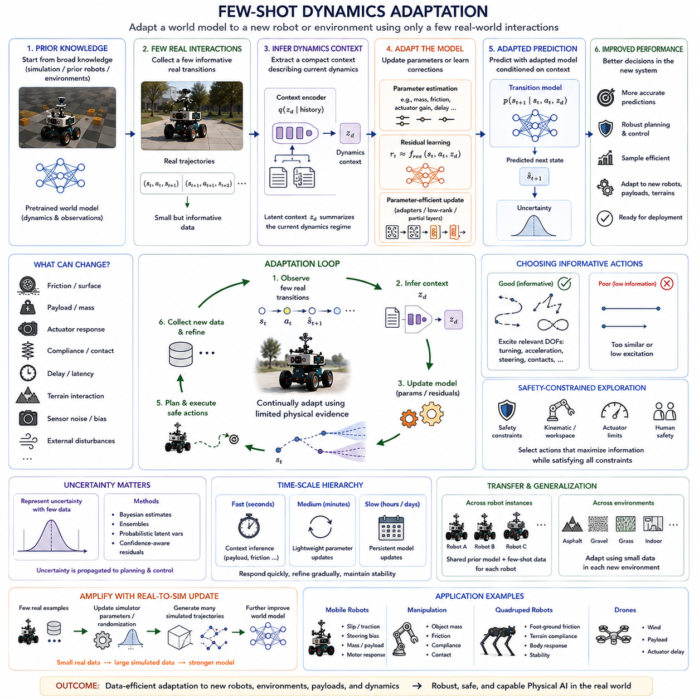{width="7.268055555555556in" height="7.268055555555556in"}

Few-shot dynamics adaptation enables a world model to adjust to a new physical system or operating condition using only a small number of real-world interaction trajectories. Rather than retraining dynamics from scratch, the system begins with broad knowledge acquired from simulation, prior robots, or previous environments and rapidly modifies the relevant parts of its predictive model using limited physical evidence.

The central assumption is that many physical environments share common dynamics structure even though specific parameters differ. Geometry, kinematic constraints, rigid-body relationships, and general action-effect patterns may remain similar, while friction, payload, actuator response, compliance, delay, or terrain interaction changes. Few-shot adaptation exploits this shared structure and concentrates learning on the smaller set of factors responsible for the new behavior.

A typical adaptation episode begins with a pretrained world model and a short sequence of real transitions ((s_t,a_t,s_{t+1})). These observations provide evidence about how the current system responds to actions. Instead of requiring thousands of trajectories, the model extracts a compact dynamics context from several informative transitions and uses that context to condition predictions for subsequent states and candidate actions.

This context can be represented as a latent variable (z_d) describing the current dynamics regime. An encoder may infer (z_d) from recent state-action histories, after which the transition model predicts (p(s_{t+1}\|s_t,a_t,z_d)). The latent representation does not need to correspond directly to individual physical parameters; it only needs to encode information that allows the model to distinguish dynamics relevant to accurate future prediction.

Explicit parameter estimation provides another form of few-shot adaptation. When the model contains interpretable quantities such as mass, friction, actuator gain, wheel radius, damping, or latency, a small number of carefully selected trajectories can update these parameters. The world model then retains its existing structure while replacing uncertain nominal values with estimates derived from the newly observed physical system.

Residual adaptation can further reduce the amount of required real data. A simulation-trained or analytical base model provides the primary transition prediction, while a lightweight residual component learns the discrepancy observed in the new environment. Because this correction is often substantially simpler than the complete dynamics function, useful adaptation may be achieved from far fewer samples than would be required for full model retraining.

Meta-learning provides a more general mechanism for preparing models for rapid adaptation. During training, the world model can experience many simulated dynamics regimes, robot configurations, payloads, terrains, and actuator characteristics. The training objective is not merely to perform well in these domains but to learn parameters or representations that can be efficiently adjusted when a previously unseen dynamics regime appears.

Domain randomization naturally supports this preparation. By varying mass, friction, inertia, control delay, terrain, sensor properties, and external disturbances during simulation, the model experiences a broad family of possible physical worlds. Few-shot adaptation then becomes the process of locating the current real system within this learned dynamics space rather than discovering its physical behavior entirely from the beginning.

The informativeness of adaptation data is often more important than its quantity. Repeatedly observing nearly identical motions may reveal little about unknown dynamics. Carefully chosen actions that excite relevant degrees of freedom can expose friction, acceleration response, steering characteristics, contact behavior, or latency more efficiently. Active system identification can therefore select actions specifically to reduce uncertainty about the current dynamics.

However, informative exploration must remain safe. A robot cannot freely execute arbitrary excitation trajectories merely because they improve parameter estimation. Candidate adaptation actions should respect stability, collision, actuator, workspace, and human-safety constraints. A world model can evaluate possible information-gathering actions before execution and select trajectories that balance identification value with physical risk.

Uncertainty estimation is particularly important when only a few observations are available. The model should not become highly confident after seeing a small and potentially unrepresentative dataset. Bayesian parameter estimates, ensembles, probabilistic latent variables, or confidence-aware residual models can represent remaining uncertainty and propagate it into predicted futures used by planning and control.

Few-shot adaptation can operate without changing the main network weights. A context encoder may infer the current dynamics from recent history while the pretrained transition model remains fixed. This approach can be fast and resistant to catastrophic forgetting. Alternatively, parameter-efficient updates may modify only selected layers, adapters, low-dimensional parameters, or residual modules while preserving the majority of the pretrained world model.

Different adaptation mechanisms can operate at different timescales. Immediate context inference can respond within several transitions to changes such as payload or surface friction. Lightweight parameter updates can refine predictions over longer episodes, while persistent model updates may occur only after repeated evidence confirms a systematic change. This hierarchy balances rapid response with long-term model stability.

For mobile robots, a few short trajectories may reveal changes in wheel slip, steering bias, effective mass, motor response, or surface friction. The adapted world model can then correct predictions of velocity, yaw rate, acceleration, and displacement. This is valuable when a robot moves between asphalt, gravel, grass, slopes, indoor floors, or changing payload conditions without extensive recalibration.

For manipulation systems, a few interactions may reveal object mass, friction, compliance, grasp response, or contact characteristics. For quadrupeds, short locomotion sequences can provide evidence about foot-ground friction, terrain compliance, body response, and stability. Although the physical variables differ across embodiments, each system uses limited interaction to infer which dynamics regime currently applies.

Few-shot adaptation also supports transfer across robot instances. Robots of the same platform may differ because of manufacturing tolerances, wear, calibration, batteries, tires, joints, or actuator characteristics. A shared world model can provide common dynamics knowledge, while a small amount of data from each individual robot identifies instance-specific behavior. This enables fleet deployment without independently training a complete dynamics model for every machine.

Real-to-Sim updating can amplify the value of these few physical examples. Once limited real trajectories reveal the approximate dynamics regime, simulator parameters or randomization distributions can be adjusted accordingly. Simulation can then generate many related trajectories around the identified region, allowing further refinement of the world model without requiring an equivalent increase in expensive physical interaction.

The resulting process forms a rapid adaptation loop: observe a few real transitions, infer the current dynamics context, update parameters or residuals, predict future consequences, execute safe actions, and use new observations to refine the estimate. As evidence accumulates, uncertainty decreases and the model becomes increasingly specialized to the current robot and environment while retaining transferable prior knowledge.

Few-shot dynamics adaptation therefore turns broad simulation experience into rapidly customizable physical intelligence. Instead of expecting one fixed model to represent every possible real-world condition, the world model learns how to adapt itself from limited evidence. Combined with domain randomization, system identification, residual learning, uncertainty estimation, and Real-to-Sim feedback, it provides a data-efficient path toward Physical AI systems that can quickly adjust to new robots, environments, payloads, and dynamics.

퓨샷 동역학 적응(Few-Shot Dynamics Adaptation)은 소수의 실제 환경 상호작용 궤적(Real-World Interaction Trajectory)만을 이용하여 월드 모델(World Model)이 새로운 물리 시스템이나 운용 조건에 적응할 수 있도록 한다. 동역학(Dynamics)을 처음부터 다시 학습하는 대신, 시스템은 시뮬레이션(Simulation), 이전 로봇(Prior Robot), 또는 이전 환경에서 획득한 광범위한 지식으로 시작하고 제한된 물리적 증거를 이용하여 예측 모델(Predictive Model)의 관련 부분을 빠르게 수정한다.

핵심적인 가정은 구체적인 파라미터(Parameter)가 다르더라도 많은 물리 환경이 공통된 동역학 구조(Dynamics Structure)를 공유한다는 것이다. 기하학(Geometry), 운동학적 제약(Kinematic Constraints), 강체 관계(Rigid-Body Relationships), 일반적인 행동-결과 패턴(Action-Effect Patterns)은 유사하게 유지될 수 있지만, 마찰(Friction), 페이로드(Payload), 액추에이터 응답(Actuator Response), 순응성(Compliance), 지연(Delay), 지형 상호작용(Terrain Interaction)은 달라질 수 있다. 퓨샷 적응은 이러한 공유 구조를 활용하고 새로운 거동의 원인이 되는 더 작은 요인 집합에 학습을 집중한다.

일반적인 적응 에피소드(Adaptation Episode)는 사전 학습된 월드 모델(Pretrained World Model)과 짧은 실제 전이(Real Transition) 시퀀스 ((s_t,a_t,s_{t+1}))로 시작한다. 이러한 관측은 현재 시스템이 행동에 어떻게 반응하는지에 대한 증거를 제공한다. 수천 개의 궤적을 요구하는 대신, 모델은 몇 개의 정보성이 높은 전이(Informative Transition)에서 압축된 동역학 문맥(Dynamics Context)을 추출하고 이를 이용해 이후 상태와 후보 행동(Candidate Action)에 대한 예측을 조건화한다.

이러한 문맥은 현재 동역학 영역(Dynamics Regime)을 설명하는 잠재 변수(Latent Variable) (z_d)로 표현할 수 있다. 인코더(Encoder)는 최근의 상태-행동 이력(State-Action History)으로부터 (z_d)를 추론하고, 이후 전이 모델(Transition Model)은 (p(s_{t+1}\|s_t,a_t,z_d))를 예측할 수 있다. 잠재 표현(Latent Representation)이 개별 물리 파라미터와 직접적으로 대응할 필요는 없으며, 정확한 미래 예측에 필요한 동역학을 구별할 수 있는 정보를 인코딩하면 충분하다.

명시적 파라미터 추정(Explicit Parameter Estimation)은 또 다른 형태의 퓨샷 적응을 제공한다. 모델에 질량(Mass), 마찰, 액추에이터 이득(Actuator Gain), 바퀴 반경(Wheel Radius), 감쇠(Damping), 지연(Latency)과 같이 해석 가능한 물리량이 포함되어 있다면, 소수의 신중하게 선택된 궤적으로 이러한 파라미터를 갱신할 수 있다. 이후 월드 모델은 기존 구조를 유지하면서 불확실한 명목값(Nominal Value)을 새롭게 관측된 물리 시스템에서 추정한 값으로 대체한다.

잔차 적응(Residual Adaptation)은 필요한 실제 데이터의 양을 더욱 줄일 수 있다. 시뮬레이션에서 학습된 모델이나 해석적 기본 모델(Analytical Base Model)이 주요 전이 예측을 제공하고, 경량 잔차 구성요소(Lightweight Residual Component)가 새로운 환경에서 관측된 차이를 학습한다. 이러한 보정값은 전체 동역학 함수보다 상당히 단순한 경우가 많으므로 전체 모델을 재학습할 때보다 훨씬 적은 샘플로 유용한 적응을 달성할 수 있다.

메타 학습(Meta-Learning)은 모델이 빠른 적응을 수행할 수 있도록 사전에 준비하는 보다 일반적인 메커니즘을 제공한다. 학습 과정에서 월드 모델은 다양한 시뮬레이션 동역학 영역, 로봇 구성(Robot Configuration), 페이로드, 지형, 액추에이터 특성을 경험할 수 있다. 학습 목표는 단순히 이러한 도메인(Domain)에서 높은 성능을 달성하는 것이 아니라, 이전에 경험하지 못한 동역학 영역이 나타났을 때 효율적으로 조정할 수 있는 파라미터 또는 표현(Representation)을 학습하는 것이다.

도메인 랜덤화(Domain Randomization)는 이러한 준비 과정을 자연스럽게 지원한다. 시뮬레이션에서 질량, 마찰, 관성(Inertia), 제어 지연(Control Delay), 지형, 센서 특성(Sensor Properties), 외부 외란(External Disturbances)을 변화시키면 모델은 가능한 물리 세계의 광범위한 집합을 경험한다. 이후 퓨샷 적응은 물리적 거동을 처음부터 새롭게 발견하는 과정이 아니라, 학습된 동역학 공간(Learned Dynamics Space)에서 현재 실제 시스템이 어디에 위치하는지를 찾아가는 과정이 된다.

적응 데이터(Adaptation Data)에서는 데이터의 양보다 정보성(Informativeness)이 더 중요할 수 있다. 거의 동일한 움직임을 반복해서 관측하면 알려지지 않은 동역학에 관한 정보를 거의 얻지 못할 수 있다. 관련 자유도(Degree of Freedom)를 충분히 가진하도록 신중하게 선택된 행동은 마찰, 가속 응답(Acceleration Response), 조향 특성(Steering Characteristics), 접촉 거동(Contact Behavior), 지연을 더욱 효율적으로 드러낼 수 있다. 따라서 능동 시스템 식별(Active System Identification)은 현재 동역학에 대한 불확실성을 감소시키도록 특별히 행동을 선택할 수 있다.

그러나 정보성이 높은 탐색(Informative Exploration)은 반드시 안전하게 수행되어야 한다. 로봇은 단지 파라미터 추정을 개선한다는 이유만으로 임의의 가진 궤적(Excitation Trajectory)을 자유롭게 실행할 수 없다. 후보 적응 행동(Candidate Adaptation Action)은 안정성(Stability), 충돌(Collision), 액추에이터 한계(Actuator Limit), 작업 공간(Workspace), 인간 안전(Human Safety)과 관련된 제약을 준수해야 한다. 월드 모델은 실행 전에 가능한 정보 수집 행동을 평가하여 식별 가치(Identification Value)와 물리적 위험(Physical Risk) 사이의 균형을 이루는 궤적을 선택할 수 있다.

소수의 관측만 사용할 수 있는 경우 불확실성 추정(Uncertainty Estimation)은 특히 중요하다. 모델은 작고 잠재적으로 대표성이 부족한 데이터셋을 관측했다는 이유만으로 지나치게 높은 확신을 가져서는 안 된다. 베이지안 파라미터 추정(Bayesian Parameter Estimation), 앙상블(Ensemble), 확률적 잠재 변수(Probabilistic Latent Variable), 신뢰도 인식 잔차 모델(Confidence-Aware Residual Model)은 남아 있는 불확실성을 표현하고 이를 계획 및 제어에 사용되는 미래 예측으로 전파할 수 있다.

퓨샷 적응은 주 네트워크 가중치(Main Network Weights)를 변경하지 않고도 수행할 수 있다. 문맥 인코더(Context Encoder)가 최근 이력으로부터 현재 동역학을 추론하는 동안 사전 학습된 전이 모델은 고정된 상태로 유지될 수 있다. 이러한 접근은 빠르게 동작하면서 파국적 망각(Catastrophic Forgetting)에 강할 수 있다. 또는 대부분의 사전 학습 월드 모델을 유지하면서 선택된 계층(Layer), 어댑터(Adapter), 저차원 파라미터(Low-Dimensional Parameter), 잔차 모듈(Residual Module)만 수정하는 파라미터 효율적 갱신(Parameter-Efficient Update)을 사용할 수도 있다.

서로 다른 적응 메커니즘은 서로 다른 시간 척도(Time Scale)에서 작동할 수 있다. 즉각적인 문맥 추론(Immediate Context Inference)은 몇 번의 전이만으로 페이로드나 노면 마찰 변화에 대응할 수 있다. 경량 파라미터 갱신(Lightweight Parameter Update)은 더 긴 에피소드에 걸쳐 예측을 정교화하고, 지속적인 모델 갱신(Persistent Model Update)은 반복적인 증거가 체계적인 변화를 확인한 이후에만 수행될 수 있다. 이러한 계층 구조는 빠른 대응과 장기적인 모델 안정성(Model Stability) 사이의 균형을 제공한다.

모바일 로봇(Mobile Robot)의 경우 몇 개의 짧은 궤적만으로도 바퀴 슬립(Wheel Slip), 조향 바이어스(Steering Bias), 유효 질량(Effective Mass), 모터 응답(Motor Response), 노면 마찰의 변화를 파악할 수 있다. 적응된 월드 모델은 이후 속도(Velocity), 요 레이트(Yaw Rate), 가속도(Acceleration), 변위(Displacement)의 예측을 보정할 수 있다. 이는 광범위한 재보정 없이 로봇이 아스팔트, 자갈, 잔디, 경사면, 실내 바닥 또는 변화하는 페이로드 조건 사이를 이동할 때 유용하다.

매니퓰레이션 시스템(Manipulation System)에서는 몇 번의 상호작용만으로 객체 질량(Object Mass), 마찰, 순응성, 파지 응답(Grasp Response), 접촉 특성(Contact Characteristics)을 파악할 수 있다. 4족 보행 로봇(Quadruped)에서는 짧은 보행 시퀀스(Locomotion Sequence)를 통해 발-지면 마찰(Foot-Ground Friction), 지형 순응성(Terrain Compliance), 몸체 응답(Body Response), 안정성에 관한 증거를 얻을 수 있다. 임바디먼트(Embodiment)에 따라 물리 변수가 달라지지만, 각 시스템은 제한된 상호작용을 통해 현재 어떤 동역학 영역이 적용되는지를 추론한다.

퓨샷 적응은 서로 다른 로봇 인스턴스(Robot Instance) 사이의 전이도 지원한다. 동일한 플랫폼의 로봇이라도 제조 공차(Manufacturing Tolerance), 마모(Wear), 보정(Calibration), 배터리, 타이어, 관절, 액추에이터 특성에 따라 차이가 발생할 수 있다. 공유 월드 모델(Shared World Model)은 공통 동역학 지식을 제공하고, 각각의 로봇에서 수집한 소량의 데이터는 개별 인스턴스 특유의 거동을 식별한다. 이를 통해 모든 로봇마다 완전한 동역학 모델을 독립적으로 학습하지 않고도 플릿 배치(Fleet Deployment)가 가능하다.

현실-시뮬레이션 갱신(Real-to-Sim Updating)은 이러한 소수의 물리적 사례가 가지는 가치를 증폭할 수 있다. 제한된 실제 궤적을 통해 대략적인 동역학 영역을 파악하면 이에 따라 시뮬레이터 파라미터(Simulator Parameter) 또는 랜덤화 분포(Randomization Distribution)를 조정할 수 있다. 이후 시뮬레이션은 식별된 영역 주변에서 많은 관련 궤적을 생성하여 비용이 높은 물리적 상호작용을 동일한 비율로 증가시키지 않고도 월드 모델을 더욱 정교하게 개선할 수 있다.

결과적으로 빠른 적응 루프(Rapid Adaptation Loop)가 형성된다. 소수의 실제 전이를 관측하고, 현재 동역학 문맥을 추론하며, 파라미터 또는 잔차(Residual)를 갱신하고, 미래 결과를 예측한 뒤 안전한 행동을 실행하며, 새로운 관측을 이용해 추정값을 다시 개선한다. 증거가 축적됨에 따라 불확실성은 감소하고 모델은 전이 가능한 사전 지식(Transferable Prior Knowledge)을 유지하면서 현재 로봇과 환경에 점점 더 특화된다.

따라서 퓨샷 동역학 적응은 광범위한 시뮬레이션 경험을 빠르게 맞춤화할 수 있는 물리 지능(Physical Intelligence)으로 전환한다. 하나의 고정된 모델이 가능한 모든 실제 환경 조건을 표현할 것으로 기대하는 대신, 월드 모델은 제한된 증거로 스스로 적응하는 방법을 학습한다. 도메인 랜덤화, 시스템 식별(System Identification), 잔차 학습(Residual Learning), 불확실성 추정, 현실-시뮬레이션 피드백(Real-to-Sim Feedback)과 결합하면 새로운 로봇, 환경, 페이로드, 동역학에 빠르게 적응할 수 있는 데이터 효율적인(Data-Efficient) 피지컬 AI(Physical AI)를 구축하는 경로를 제공한다.

##  

## 14.09. Continuous Field Adaptation

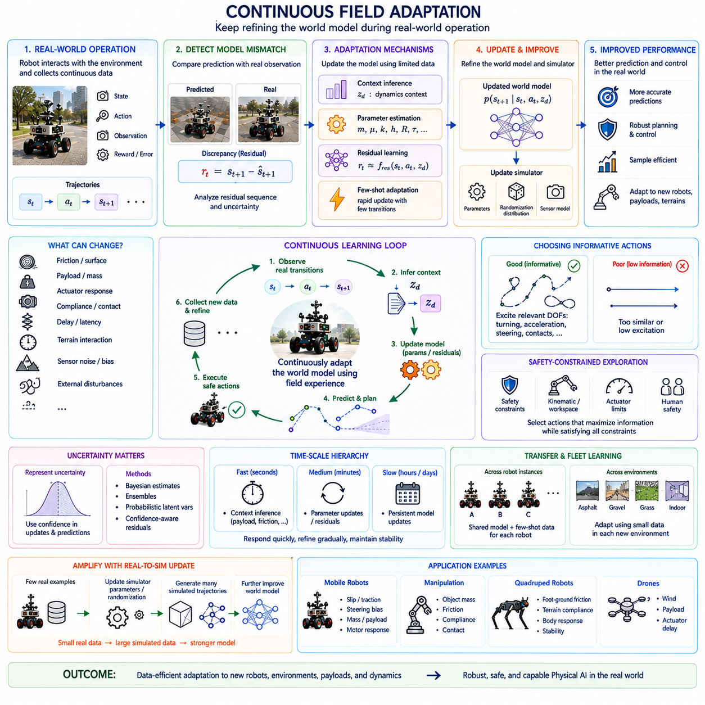{width="7.268055555555556in" height="7.268055555555556in"}

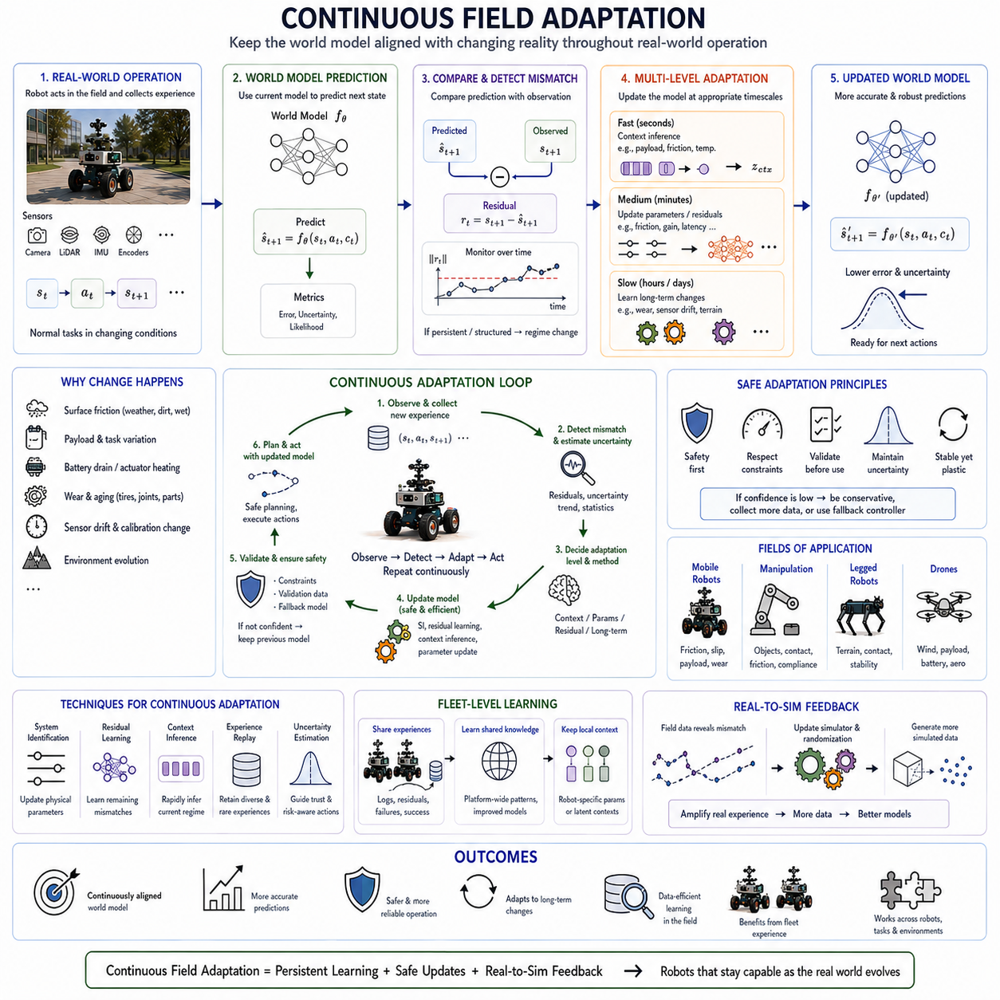{width="7.268055555555556in" height="7.268055555555556in"}

Continuous field adaptation extends world-model learning beyond initial deployment by allowing a Physical AI system to keep refining its internal dynamics model throughout real-world operation. Rather than assuming that Sim2Real transfer ends after calibration, the robot treats field experience as a continuing source of evidence. Predictions, actions, observations, and errors collected during normal operation become inputs for maintaining alignment between the world model and changing physical reality.

Real operating environments are inherently non-stationary. Surface friction changes with weather and contamination, payload varies between tasks, batteries discharge, actuators heat up, tires and mechanical components wear, sensors drift, and surrounding environments evolve. A dynamics model that accurately represents the robot at deployment can therefore become progressively inaccurate unless the system detects and adapts to these changes.

The fundamental adaptation signal remains prediction error. Given state (s_t) and action (a_t), the world model predicts (\\hat{s}\*{t+1}), while the physical system produces an observed state (s\*{t+1}). The residual (r_t=s_{t+1}-\\hat{s}_{t+1}) provides evidence about model mismatch. Continuous adaptation analyzes sequences of these residuals rather than reacting blindly to every individual discrepancy.

This distinction is important because not every prediction error represents a genuine change in dynamics. Sensor noise, temporary disturbances, state-estimation errors, unusual contacts, or communication delays can produce isolated residuals. Persistent or structured errors provide stronger evidence that the operating regime has changed. Statistical monitoring and uncertainty estimation can therefore determine whether adaptation is justified before modifying the model.

Field adaptation can occur at multiple levels. Fast context inference may identify temporary conditions such as increased payload, slippery terrain, wind, or actuator temperature without modifying permanent model parameters. Intermediate adaptation can update residual models or selected parameters, while slower learning can revise persistent dynamics knowledge after repeated evidence demonstrates that a long-term change has occurred.

This multi-timescale organization protects model stability. If every temporary event immediately changed the complete neural dynamics model, the system could suffer catastrophic forgetting or unstable behavior. Separating rapidly changing context variables from slowly changing model parameters allows the robot to respond quickly to local conditions while retaining physical knowledge accumulated through simulation, laboratory testing, and previous field operation.

System identification provides an interpretable component of continuous adaptation. Repeated trajectories can update estimates of friction, actuator gain, latency, effective mass, damping, wheel radius, or other physically meaningful quantities. When these parameters explain the observed mismatch, the world model can adapt through compact parameter updates rather than modifying a large number of neural-network weights.

Residual dynamics learning addresses discrepancies that explicit parameters cannot adequately explain. The nominal model continues to provide the major physical prediction, while a learned residual captures systematic errors caused by terrain interaction, compliance, slip, backlash, contact complexity, or other unmodeled effects. As field data accumulates, the residual component can be refined while preserving the stable structure of the base model.

Few-shot adaptation is valuable when conditions change suddenly. A robot entering a new terrain type or receiving a substantially different payload may need useful predictions after only several transitions. A context encoder or lightweight adaptation module can infer the new dynamics regime from recent history and rapidly condition the world model before enough data exists for more permanent parameter updates.

Continuous adaptation must also address the stability-plasticity tradeoff. Plasticity allows the model to incorporate new evidence, while stability preserves previously learned knowledge. Excessive stability prevents useful adaptation, whereas excessive plasticity causes recent observations to overwrite broadly valid knowledge. Replay buffers, regularization, parameter-efficient updates, modular adaptation, and protected base models can help balance these competing requirements.

Experience replay can preserve representative trajectories from previous operating conditions. When the model is updated using recent field data, selected older experiences can be included so that improved performance in the current environment does not severely degrade predictions for previously encountered conditions. The replay distribution itself may be managed to retain rare, safety-critical, or dynamically diverse experiences.

Uncertainty provides another safeguard. The model should estimate not only a future state but also confidence in that prediction. Rising uncertainty can indicate unfamiliar terrain, sensor degradation, unusual payloads, or dynamics outside previous experience. Planning can respond by lowering speed, increasing obstacle margins, avoiding aggressive maneuvers, requesting additional observations, or temporarily relying more strongly on conservative controllers.

Adaptation should therefore be tightly connected to safety supervision. Newly updated dynamics should not immediately control unrestricted behavior simply because they reduce recent prediction error. Candidate model updates can be checked against physical constraints, validation trajectories, safety envelopes, or fallback models. If confidence is insufficient, the system can retain the previous verified model while collecting additional evidence.

For mobile robots, continuous adaptation can track changing relationships among commanded velocity, wheel rotation, slip, yaw response, acceleration, and displacement. A robot moving from indoor flooring to asphalt, gravel, wet surfaces, slopes, or loose terrain may require different corrections. Payload changes and tire wear can further modify these relationships during months of field operation.

Manipulation systems face similar variation through changing objects, contacts, joint friction, gripper wear, and compliance. Legged robots encounter terrain-dependent foot contact, impact behavior, and stability changes. Drones experience wind, payload, battery, and aerodynamic variation. Continuous field adaptation applies the same general principle across embodiments: compare expected transitions with observed physical consequences and update only what evidence supports.

Fleet learning can greatly expand the available adaptation experience. Multiple robots operating in different locations can contribute dynamics observations, residual patterns, failures, and successful adaptations. Shared learning can identify changes that are common across a hardware platform while preserving local context for environment-specific behavior. Each robot can therefore benefit from physical experience collected by other members of the fleet.

However, fleet aggregation requires distinguishing universal knowledge from robot-specific differences. Manufacturing tolerances, component wear, sensor calibration, and maintenance history may make two nominally identical robots behave differently. A hierarchical world model can maintain shared global dynamics knowledge while storing instance-specific parameters or latent contexts that specialize predictions for each individual platform.

Field observations can also feed back into simulation through Real-to-Sim updating. Persistent residuals and newly discovered operating regimes can modify simulator parameters, sensor models, domain-randomization distributions, or residual augmentation models. Simulation can then generate many variations around important field conditions, amplifying limited real experience into a larger training and validation dataset.

The complete architecture becomes a continual Real-to-Sim-to-Real learning cycle. Robots operate and collect evidence, world models detect mismatch, adaptation updates local dynamics, field data improves simulation, and simulation generates additional experience for model refinement. Updated models are redeployed and evaluated again, creating repeated interaction between virtual learning and physical operation rather than a single transfer event.

Continuous field adaptation therefore transforms the world model into a persistent operational memory of physical behavior. It preserves useful prior knowledge while tracking changes that matter for future prediction, planning, and control. By combining context inference, system identification, residual learning, uncertainty estimation, replay, safety validation, fleet experience, and Real-to-Sim feedback, Physical AI can remain calibrated as robots, tasks, hardware, and environments evolve.

지속적 현장 적응(Continuous Field Adaptation)은 피지컬 AI(Physical AI) 시스템이 실제 환경에서 운용되는 전체 기간 동안 내부 동역학 모델(Dynamics Model)을 지속적으로 개선할 수 있도록 함으로써 월드 모델(World Model)의 학습을 초기 배치(Initial Deployment) 이후까지 확장한다. Sim2Real 전이가 초기 보정(Calibration) 이후 종료된다고 가정하는 대신, 로봇은 현장 경험(Field Experience)을 지속적인 증거의 원천으로 활용한다. 정상 운용 과정에서 축적되는 예측(Prediction), 행동(Action), 관측(Observation), 오차(Error)는 월드 모델과 변화하는 물리적 현실 사이의 정합성(Alignment)을 유지하는 데 사용된다.

실제 운용 환경(Real Operating Environment)은 본질적으로 비정상적(Non-Stationary)이다. 날씨와 오염에 따라 노면 마찰(Surface Friction)이 변화하고, 작업에 따라 페이로드(Payload)가 달라지며, 배터리는 방전되고, 액추에이터(Actuator)는 가열되며, 타이어와 기계 부품은 마모되고, 센서는 드리프트(Drift)하며, 주변 환경 역시 변화한다. 따라서 배치 시점에는 로봇을 정확하게 표현했던 동역학 모델도 이러한 변화를 탐지하고 적응하지 않는다면 점차 부정확해질 수 있다.

기본적인 적응 신호(Adaptation Signal)는 여전히 예측 오차(Prediction Error)이다. 상태 (s_t)와 행동 (a_t)가 주어지면 월드 모델은 (\\hat{s}\*{t+1})을 예측하고, 실제 물리 시스템은 관측 상태 (s\*{t+1})을 생성한다. 잔차(Residual) (r_t=s_{t+1}-\\hat{s}_{t+1})는 모델 불일치(Model Mismatch)에 관한 증거를 제공한다. 지속적 적응은 각각의 차이에 즉각 반응하기보다 이러한 잔차의 시퀀스(Sequence)를 분석한다.

이러한 구분이 중요한 이유는 모든 예측 오차가 실제 동역학 변화를 의미하는 것은 아니기 때문이다. 센서 노이즈(Sensor Noise), 일시적인 외란(Temporary Disturbance), 상태 추정 오류(State-Estimation Error), 비정상적인 접촉(Unusual Contact), 통신 지연(Communication Delay)은 고립된 잔차를 발생시킬 수 있다. 반면 지속적이거나 구조적인 오차(Persistent or Structured Error)는 운용 동역학 영역(Operating Regime)이 변화했다는 더 강력한 증거를 제공한다. 따라서 통계적 모니터링(Statistical Monitoring)과 불확실성 추정(Uncertainty Estimation)을 통해 모델을 수정하기 전에 실제 적응이 필요한지를 판단할 수 있다.

현장 적응(Field Adaptation)은 여러 수준에서 수행될 수 있다. 빠른 문맥 추론(Fast Context Inference)은 영구적인 모델 파라미터를 변경하지 않고도 증가한 페이로드, 미끄러운 지형, 바람(Wind), 액추에이터 온도와 같은 일시적인 조건을 식별할 수 있다. 중간 수준의 적응은 잔차 모델(Residual Model)이나 선택된 파라미터를 갱신할 수 있으며, 더 느린 학습은 반복적인 증거를 통해 장기적인 변화가 확인된 이후 지속적인 동역학 지식(Persistent Dynamics Knowledge)을 수정할 수 있다.

이러한 다중 시간 척도 구성(Multi-Timescale Organization)은 모델 안정성(Model Stability)을 보호한다. 모든 일시적인 사건이 즉시 전체 신경 동역학 모델(Neural Dynamics Model)을 변경한다면 시스템은 파국적 망각(Catastrophic Forgetting)이나 불안정한 거동을 경험할 수 있다. 빠르게 변화하는 문맥 변수(Context Variable)와 천천히 변화하는 모델 파라미터를 분리하면 로봇은 시뮬레이션, 실험실 테스트, 이전 현장 운용에서 축적한 물리 지식을 유지하면서도 지역적 조건에 빠르게 대응할 수 있다.

시스템 식별(System Identification)은 지속적 적응의 해석 가능한 구성요소를 제공한다. 반복적으로 수집되는 궤적(Trajectory)을 이용하여 마찰, 액추에이터 이득(Actuator Gain), 지연(Latency), 유효 질량(Effective Mass), 감쇠(Damping), 바퀴 반경(Wheel Radius) 또는 기타 물리적으로 의미 있는 값의 추정치를 갱신할 수 있다. 이러한 파라미터가 관측된 불일치를 설명할 수 있다면 월드 모델은 대규모 신경망 가중치를 변경하는 대신 압축된 파라미터 갱신(Parameter Update)을 통해 적응할 수 있다.

잔차 동역학 학습(Residual Dynamics Learning)은 명시적인 파라미터만으로 충분히 설명할 수 없는 불일치를 처리한다. 명목 모델(Nominal Model)은 계속해서 주요 물리적 예측을 제공하고, 학습된 잔차는 지형 상호작용(Terrain Interaction), 순응성(Compliance), 슬립(Slip), 백래시(Backlash), 복잡한 접촉(Contact Complexity), 기타 모델링되지 않은 효과(Unmodeled Effects)로 인해 발생하는 체계적인 오차를 포착한다. 현장 데이터가 축적되면 기본 모델의 안정적인 구조를 유지하면서 잔차 구성요소를 지속적으로 개선할 수 있다.

퓨샷 적응(Few-Shot Adaptation)은 조건이 갑작스럽게 변화할 때 유용하다. 로봇이 새로운 종류의 지형에 진입하거나 상당히 다른 페이로드를 탑재하면 몇 번의 전이만으로도 유용한 예측을 생성해야 할 수 있다. 문맥 인코더(Context Encoder) 또는 경량 적응 모듈(Lightweight Adaptation Module)은 최근 이력으로부터 새로운 동역학 영역을 빠르게 추론하여 더 영구적인 파라미터 갱신을 수행하기에 충분한 데이터가 축적되기 전에 월드 모델을 조건화할 수 있다.

지속적 적응은 안정성-가소성 절충(Stability-Plasticity Tradeoff)도 해결해야 한다. 가소성(Plasticity)은 모델이 새로운 증거를 받아들이도록 하고, 안정성(Stability)은 이전에 학습한 지식을 보존한다. 안정성이 지나치게 높으면 유용한 적응이 어려워지고, 가소성이 지나치게 높으면 최근 관측이 광범위하게 유효한 기존 지식을 덮어쓸 수 있다. 재현 버퍼(Replay Buffer), 정규화(Regularization), 파라미터 효율적 갱신(Parameter-Efficient Update), 모듈식 적응(Modular Adaptation), 보호된 기본 모델(Protected Base Model)은 이러한 상충 관계의 균형을 유지하는 데 활용될 수 있다.

경험 재현(Experience Replay)은 이전 운용 조건에서 수집된 대표적인 궤적을 보존할 수 있다. 최근 현장 데이터를 이용하여 모델을 갱신할 때 선택된 과거 경험을 함께 사용하면 현재 환경에서의 성능 향상이 이전에 경험했던 조건의 예측 성능을 심각하게 저하시키는 것을 방지할 수 있다. 재현 분포(Replay Distribution) 자체도 희귀하거나 안전에 중요하거나 동역학적으로 다양한 경험을 유지하도록 관리할 수 있다.

불확실성(Uncertainty)은 또 다른 안전장치를 제공한다. 모델은 미래 상태뿐만 아니라 해당 예측에 대한 신뢰도(Confidence)도 추정해야 한다. 불확실성이 증가하면 익숙하지 않은 지형, 센서 성능 저하(Sensor Degradation), 비정상적인 페이로드 또는 기존 경험 범위를 벗어난 동역학을 의미할 수 있다. 계획(Planning)은 이에 대응하여 속도를 낮추고, 장애물 여유 거리(Obstacle Margin)를 확대하며, 공격적인 기동을 피하고, 추가 관측을 요청하거나 일시적으로 보수적인 제어기(Conservative Controller)에 더 크게 의존할 수 있다.

따라서 적응은 안전 감독(Safety Supervision)과 긴밀하게 연결되어야 한다. 새롭게 갱신된 동역학 모델이 최근의 예측 오차를 감소시켰다는 이유만으로 즉시 제한 없는 행동을 제어해서는 안 된다. 후보 모델 갱신(Candidate Model Update)은 물리적 제약(Physical Constraints), 검증 궤적(Validation Trajectory), 안전 영역(Safety Envelope), 대체 모델(Fallback Model)을 기준으로 검사할 수 있다. 신뢰도가 충분하지 않다면 시스템은 추가적인 증거를 수집하는 동안 이전에 검증된 모델을 유지할 수 있다.

모바일 로봇(Mobile Robot)의 경우 지속적 적응은 명령 속도(Commanded Velocity), 바퀴 회전(Wheel Rotation), 슬립, 요 응답(Yaw Response), 가속도(Acceleration), 변위(Displacement) 사이에서 변화하는 관계를 추적할 수 있다. 실내 바닥에서 아스팔트, 자갈, 젖은 노면, 경사면 또는 느슨한 지형으로 이동하는 로봇은 서로 다른 보정값을 필요로 할 수 있다. 페이로드 변화와 타이어 마모(Tire Wear)는 수개월의 현장 운용 과정에서 이러한 관계를 추가적으로 변화시킬 수 있다.

매니퓰레이션 시스템(Manipulation System) 역시 변화하는 객체, 접촉, 관절 마찰(Joint Friction), 그리퍼 마모(Gripper Wear), 순응성으로 인해 유사한 변화를 경험한다. 보행 로봇(Legged Robot)은 지형에 따른 발 접촉(Foot Contact), 충격 거동(Impact Behavior), 안정성 변화를 경험하며, 드론(Drone)은 바람, 페이로드, 배터리, 공기역학적 변화(Aerodynamic Variation)의 영향을 받는다. 지속적 현장 적응은 임바디먼트(Embodiment)에 관계없이 예상된 전이와 실제 물리적 결과를 비교하고 증거가 뒷받침하는 부분만 갱신한다는 동일한 원리를 적용한다.

플릿 학습(Fleet Learning)은 활용 가능한 적응 경험을 크게 확장할 수 있다. 서로 다른 장소에서 운용되는 여러 로봇이 동역학 관측(Dynamics Observation), 잔차 패턴(Residual Pattern), 실패(Failure), 성공적인 적응 사례를 공유할 수 있다. 공유 학습(Shared Learning)은 환경별 거동을 위한 지역적 문맥(Local Context)을 유지하면서 하드웨어 플랫폼 전체에서 공통적으로 나타나는 변화를 식별할 수 있다. 따라서 각각의 로봇은 플릿의 다른 로봇들이 수집한 물리적 경험에서도 이점을 얻을 수 있다.

그러나 플릿 집계(Fleet Aggregation)에서는 보편적인 지식(Universal Knowledge)과 로봇별 차이(Robot-Specific Difference)를 구분해야 한다. 제조 공차(Manufacturing Tolerance), 부품 마모(Component Wear), 센서 보정(Sensor Calibration), 유지보수 이력(Maintenance History)으로 인해 명목상 동일한 두 로봇도 서로 다르게 동작할 수 있다. 계층형 월드 모델(Hierarchical World Model)은 공유되는 전역 동역학 지식(Global Dynamics Knowledge)을 유지하면서 개별 플랫폼의 예측을 특화하는 인스턴스별 파라미터(Instance-Specific Parameter) 또는 잠재 문맥(Latent Context)을 저장할 수 있다.

현장 관측(Field Observation)은 현실-시뮬레이션 갱신(Real-to-Sim Updating)을 통해 다시 시뮬레이션으로 피드백될 수도 있다. 지속적인 잔차와 새롭게 발견된 운용 영역은 시뮬레이터 파라미터(Simulator Parameter), 센서 모델(Sensor Model), 도메인 랜덤화 분포(Domain-Randomization Distribution), 잔차 보강 모델(Residual Augmentation Model)을 수정하는 데 활용할 수 있다. 이후 시뮬레이션은 중요한 현장 조건 주변에서 다양한 변형을 생성하여 제한된 실제 경험을 더 큰 학습 및 검증 데이터셋으로 증폭할 수 있다.

전체 아키텍처는 결국 지속적인 현실-시뮬레이션-현실 학습 순환(Continual Real-to-Sim-to-Real Learning Cycle)을 형성한다. 로봇은 실제 환경에서 운용되며 증거를 수집하고, 월드 모델은 불일치를 탐지하며, 적응 과정은 지역 동역학(Local Dynamics)을 갱신한다. 현장 데이터는 다시 시뮬레이션을 개선하고, 시뮬레이션은 모델 개선을 위한 추가 경험을 생성한다. 갱신된 모델은 다시 배치되고 평가되면서 가상 학습(Virtual Learning)과 실제 물리적 운용 사이의 반복적인 상호작용을 형성한다.

따라서 지속적 현장 적응은 월드 모델을 물리적 거동에 대한 지속적인 운용 기억(Persistent Operational Memory)으로 변화시킨다. 미래 예측, 계획, 제어에 중요한 변화를 추적하면서 기존의 유용한 사전 지식(Prior Knowledge)을 보존한다. 문맥 추론, 시스템 식별, 잔차 학습, 불확실성 추정, 경험 재현, 안전 검증(Safety Validation), 플릿 경험(Fleet Experience), 현실-시뮬레이션 피드백을 결합함으로써 피지컬 AI는 로봇, 작업, 하드웨어, 환경이 지속적으로 변화하는 상황에서도 현실에 맞게 보정된 상태를 유지할 수 있다.

##  

## 14.10. Sim2Real World Model Adaptation [w/Code]

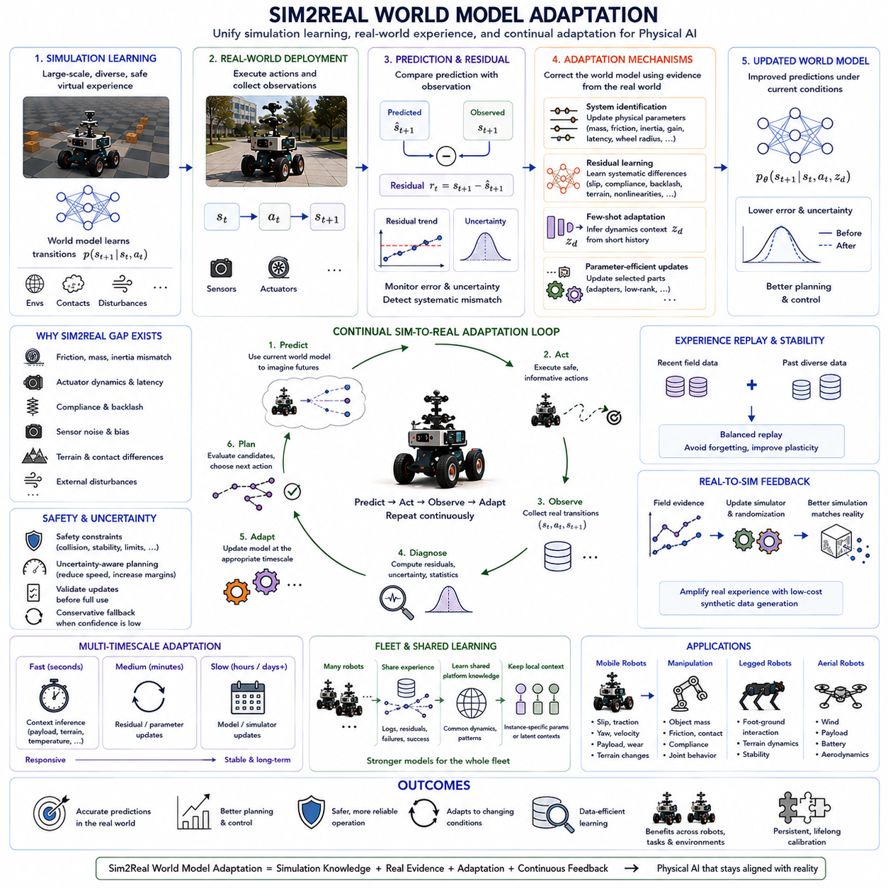{width="7.268055555555556in" height="7.268055555555556in"}

Sim2Real world model adaptation integrates simulation learning, real-world observation, dynamics identification, residual correction, and continual adaptation into a unified framework for Physical AI. Instead of treating simulation and reality as separate stages, the world model becomes a persistent predictive system that transfers prior knowledge to physical robots and continuously corrects itself as new evidence is collected during deployment.

The process begins with large-scale simulation, where robots can experience diverse states, actions, environments, contacts, and disturbances without the cost or risk of equivalent physical interaction. A world model learns the transition structure (p(s_{t+1}\|s_t,a_t)), developing reusable knowledge about how actions influence future states. This simulated experience provides the predictive prior required before physical deployment.

Simulation alone cannot perfectly reproduce reality. Differences in friction, mass distribution, actuator response, latency, compliance, sensor characteristics, terrain, contacts, and external disturbances create a Sim2Real gap. Domain randomization reduces dependence on any single simulator configuration by exposing the model to distributions of possible dynamics, observations, and environmental conditions during training.

When the robot enters the real world, each executed action becomes an experiment that evaluates the accuracy of the learned model. Given state (s_t) and action (a_t), the world model predicts (\\hat{s}\*{t+1}), while sensors observe the physical outcome (s\*{t+1}). The residual (r_t=s_{t+1}-\\hat{s}_{t+1}) provides a direct signal describing disagreement between imagined and observed dynamics.

Individual residuals should not automatically trigger model changes. Sensor noise, temporary disturbances, estimation errors, or unusual contacts may create isolated discrepancies. Persistent residual patterns, increasing predictive uncertainty, or repeated errors across related trajectories provide stronger evidence of systematic mismatch. Adaptation therefore requires both error monitoring and confidence estimation before modifying learned dynamics.

System identification converts some of these discrepancies into interpretable physical parameters. Real trajectories can refine estimates of mass, inertia, friction, damping, actuator gain, wheel radius, control latency, or contact characteristics. Updating these quantities preserves the structure of the existing dynamics model while replacing uncertain simulation assumptions with values grounded in measurements from the deployed robot.

Residual dynamics learning complements parameter identification by modeling effects that are difficult to describe explicitly. A nominal physics or simulation model generates the primary prediction, while a learned residual component estimates systematic differences caused by slip, deformation, backlash, complex contact, terrain interaction, or actuator nonlinearities. The resulting hybrid model combines known physics with learned corrections.

Few-shot dynamics adaptation enables rapid response when operating conditions change before sufficient data exists for extensive retraining. A short sequence of state-action transitions can be encoded into a latent dynamics context (z_d), allowing predictions to become conditioned on the current payload, terrain, actuator behavior, or other hidden properties. The model adapts by identifying the current dynamics regime within previously learned experience.

Adaptation can therefore occur through several complementary mechanisms. Explicit parameters represent physically interpretable changes, latent context captures hidden operating conditions, residual models compensate for unmodeled effects, and parameter-efficient updates refine selected components of the world model. The appropriate mechanism depends on the amount of available data, uncertainty, computational resources, and persistence of the observed change.

These mechanisms naturally operate at different time scales. Context inference can react within seconds to changing friction or payload. Residual and parameter updates can refine predictions over minutes or operating episodes. Persistent network or simulator updates can occur over hours, days, or longer periods after repeated evidence confirms lasting changes. This hierarchy combines responsiveness with long-term stability.

Uncertainty estimation is essential throughout this process. A world model should represent not only its predicted future but also how reliable that prediction is under the current conditions. When observations move outside previously experienced dynamics, uncertainty should rise. Planning can then reduce speed, increase safety margins, avoid aggressive actions, collect additional information, or temporarily rely on conservative fallback controllers.

Safety constraints must remain active while the system learns. Adaptation actions that provide useful information may also create physical risk, so exploration cannot be optimized only for learning efficiency. Candidate actions should respect collision avoidance, stability, actuator limits, workspace constraints, and human safety. The system should prefer trajectories that provide informative dynamics observations while remaining inside verified operational envelopes.

Experience replay helps solve the stability-plasticity problem created by continual learning. Recent observations must influence the model enough to track new conditions, but they should not erase broadly useful knowledge obtained from simulation and previous environments. Representative historical trajectories can therefore be mixed with new field data so that adaptation improves current performance without causing catastrophic forgetting.

Real-world experience can also update the simulator itself. Identified parameters, residual patterns, sensor statistics, and newly encountered operating regimes can modify simulation physics, observation models, and domain-randomization distributions. This Real-to-Sim update makes subsequent synthetic trajectories more representative of actual deployment while preserving the scalability and safety advantages of virtual data generation.

The improved simulator can amplify limited physical experience. A small number of real trajectories may reveal a new terrain interaction, actuator characteristic, payload condition, or failure mode. Once reconstructed in simulation, thousands of related variations can be generated for training and validation. Real data thus determines where additional synthetic experience is most valuable rather than serving only as direct training samples.

Planning closes the adaptation loop. The updated world model predicts multiple possible futures under candidate actions, evaluates their consequences, and selects an appropriate action. Physical execution produces another observation, which tests those predictions and provides additional evidence. Prediction, action, observation, adaptation, and replanning therefore form a continuous closed loop grounded in interaction with reality.

For mobile robots, this framework can adapt predictions of velocity, yaw, acceleration, slip, and displacement across asphalt, gravel, grass, slopes, wet surfaces, and changing payloads. Manipulators can adapt to object mass, friction, compliance, contact, and joint behavior. Quadrupeds can adjust to foot-ground interaction and terrain dynamics, while aerial robots can compensate for payload, wind, battery, and aerodynamic changes.

Fleet deployment expands adaptation beyond a single robot. Multiple systems can contribute trajectories collected under different environments, tasks, hardware conditions, and operating histories. Shared models can learn platform-wide dynamics while instance-specific parameters or latent contexts preserve differences among individual robots. Field experience consequently becomes a distributed source of knowledge for improving the entire fleet.

The complete architecture forms a continual Sim-to-Real-to-Sim-to-Real cycle. Simulation provides broad initial experience, domain randomization builds robustness, physical deployment reveals remaining mismatches, system identification and residual learning correct the model, few-shot inference enables rapid local adaptation, and field evidence updates simulation. Improved simulation then generates new experience for another round of world-model refinement.

Sim2Real world model adaptation therefore changes transfer from a one-time deployment procedure into a lifelong calibration process. The world model begins with scalable virtual knowledge but remains grounded through prediction errors, uncertainty, physical measurements, and continual feedback. By repeatedly connecting simulation, prediction, adaptation, planning, and real-world experience, Physical AI can maintain useful internal models as robots, hardware, tasks, and environments evolve.

Sim2Real 월드 모델 적응(Sim2Real World Model Adaptation)은 시뮬레이션 학습(Simulation Learning), 실제 환경 관측(Real-World Observation), 동역학 식별(Dynamics Identification), 잔차 보정(Residual Correction), 지속적 적응(Continual Adaptation)을 하나의 통합된 피지컬 AI(Physical AI) 프레임워크로 결합한다. 시뮬레이션과 현실을 서로 분리된 단계로 취급하는 대신, 월드 모델(World Model)은 사전 지식(Prior Knowledge)을 실제 로봇으로 전이하고 배치 과정에서 새로운 증거가 수집될 때마다 스스로를 지속적으로 보정하는 영속적인 예측 시스템(Persistent Predictive System)이 된다.

이 과정은 대규모 시뮬레이션(Large-Scale Simulation)에서 시작되며, 여기에서 로봇은 동일한 규모의 물리적 상호작용에 필요한 비용이나 위험 없이 다양한 상태(State), 행동(Action), 환경(Environment), 접촉(Contact), 외란(Disturbance)을 경험할 수 있다. 월드 모델은 전이 구조(Transition Structure) (p(s_{t+1}\|s_t,a_t))를 학습하여 행동이 미래 상태에 어떻게 영향을 미치는지에 관한 재사용 가능한 지식을 형성한다. 이러한 시뮬레이션 경험(Simulated Experience)은 실제 환경 배치 이전에 필요한 예측 사전 지식(Predictive Prior)을 제공한다.

시뮬레이션만으로 현실을 완벽하게 재현할 수는 없다. 마찰(Friction), 질량 분포(Mass Distribution), 액추에이터 응답(Actuator Response), 지연(Latency), 순응성(Compliance), 센서 특성(Sensor Characteristics), 지형(Terrain), 접촉, 외부 외란의 차이는 Sim2Real 격차(Sim2Real Gap)를 발생시킨다. 도메인 랜덤화(Domain Randomization)는 학습 과정에서 가능한 동역학, 관측, 환경 조건의 다양한 분포에 모델을 노출함으로써 특정한 하나의 시뮬레이터 구성(Simulator Configuration)에 대한 의존성을 감소시킨다.

로봇이 실제 환경에 진입하면 실행되는 각각의 행동은 학습된 모델의 정확성을 평가하는 하나의 실험이 된다. 상태 (s_t)와 행동 (a_t)가 주어지면 월드 모델은 (\\hat{s}\*{t+1})을 예측하고, 센서는 실제 물리적 결과 (s\*{t+1})을 관측한다. 잔차(Residual) (r_t=s_{t+1}-\\hat{s}_{t+1})는 상상된 동역학(Imagined Dynamics)과 실제로 관측된 동역학(Observed Dynamics) 사이의 불일치를 직접적으로 나타내는 신호를 제공한다.

개별적인 잔차가 발생했다고 해서 자동으로 모델을 변경해서는 안 된다. 센서 노이즈(Sensor Noise), 일시적인 외란(Temporary Disturbance), 추정 오류(Estimation Error), 비정상적인 접촉(Unusual Contact)으로 인해 고립된 불일치가 발생할 수 있다. 지속적인 잔차 패턴(Persistent Residual Pattern), 증가하는 예측 불확실성(Predictive Uncertainty), 관련 궤적에서 반복되는 오차는 체계적인 불일치(Systematic Mismatch)에 대한 더욱 강한 증거를 제공한다. 따라서 적응에는 학습된 동역학을 변경하기 전에 오차 모니터링(Error Monitoring)과 신뢰도 추정(Confidence Estimation)이 모두 필요하다.

시스템 식별(System Identification)은 이러한 불일치 가운데 일부를 해석 가능한 물리 파라미터(Physical Parameter)로 변환한다. 실제 궤적을 통해 질량(Mass), 관성(Inertia), 마찰, 감쇠(Damping), 액추에이터 이득(Actuator Gain), 바퀴 반경(Wheel Radius), 제어 지연(Control Latency), 접촉 특성(Contact Characteristics)의 추정값을 개선할 수 있다. 이러한 값의 갱신은 기존 동역학 모델의 구조를 유지하면서 불확실했던 시뮬레이션 가정을 실제 배치된 로봇에서 측정된 값으로 대체한다.

잔차 동역학 학습(Residual Dynamics Learning)은 명시적으로 설명하기 어려운 효과를 모델링함으로써 파라미터 식별(Parameter Identification)을 보완한다. 명목 물리 모델(Nominal Physics Model) 또는 시뮬레이션 모델은 주요 예측을 생성하고, 학습된 잔차 구성요소는 슬립(Slip), 변형(Deformation), 백래시(Backlash), 복잡한 접촉(Complex Contact), 지형 상호작용(Terrain Interaction), 액추에이터 비선형성(Actuator Nonlinearity)으로 인해 발생하는 체계적인 차이를 추정한다. 그 결과 하이브리드 모델(Hybrid Model)은 알려진 물리 법칙과 학습된 보정을 결합한다.

퓨샷 동역학 적응(Few-Shot Dynamics Adaptation)은 광범위한 재학습을 수행하기에 충분한 데이터가 축적되기 전에 운용 조건이 변화했을 때 빠르게 대응할 수 있도록 한다. 짧은 상태-행동 전이(State-Action Transition) 시퀀스를 잠재 동역학 문맥(Latent Dynamics Context) (z_d)로 인코딩하면 현재 페이로드, 지형, 액추에이터 거동 또는 기타 숨겨진 특성을 조건으로 예측을 수행할 수 있다. 모델은 이전에 학습된 경험 안에서 현재의 동역학 영역(Dynamics Regime)을 식별함으로써 적응한다.

따라서 적응은 여러 상호 보완적인 메커니즘을 통해 수행될 수 있다. 명시적 파라미터(Explicit Parameter)는 물리적으로 해석 가능한 변화를 표현하고, 잠재 문맥(Latent Context)은 숨겨진 운용 조건을 포착하며, 잔차 모델(Residual Model)은 모델링되지 않은 효과를 보상하고, 파라미터 효율적 갱신(Parameter-Efficient Update)은 월드 모델의 선택된 구성요소를 개선한다. 적절한 메커니즘은 이용 가능한 데이터의 양, 불확실성, 계산 자원(Computational Resources), 관측된 변화의 지속성에 따라 결정된다.

이러한 메커니즘은 자연스럽게 서로 다른 시간 척도(Time Scale)에서 작동한다. 문맥 추론(Context Inference)은 마찰이나 페이로드 변화에 수초 이내로 대응할 수 있다. 잔차 및 파라미터 갱신은 수분 또는 운용 에피소드(Operating Episode)에 걸쳐 예측을 개선할 수 있다. 지속적인 네트워크 또는 시뮬레이터 갱신은 반복적인 증거가 장기적인 변화를 확인한 이후 수시간, 수일 또는 그 이상의 기간에 걸쳐 수행될 수 있다. 이러한 계층 구조는 빠른 대응성과 장기적인 안정성을 결합한다.

불확실성 추정(Uncertainty Estimation)은 이 전체 과정에서 필수적이다. 월드 모델은 예측된 미래뿐만 아니라 현재 조건에서 해당 예측이 얼마나 신뢰할 수 있는지도 표현해야 한다. 관측 결과가 이전에 경험했던 동역학의 범위를 벗어나면 불확실성이 증가해야 한다. 계획(Planning)은 이에 따라 속도를 낮추고, 안전 여유(Safety Margin)를 확대하며, 공격적인 행동을 피하고, 추가 정보를 수집하거나, 일시적으로 보수적인 대체 제어기(Conservative Fallback Controller)에 의존할 수 있다.

시스템이 학습하는 동안에도 안전 제약(Safety Constraint)은 지속적으로 활성화되어야 한다. 유용한 정보를 제공하는 적응 행동(Adaptation Action)이 물리적인 위험을 발생시킬 수도 있기 때문에 탐색(Exploration)은 학습 효율성만을 기준으로 최적화할 수 없다. 후보 행동(Candidate Action)은 충돌 회피(Collision Avoidance), 안정성(Stability), 액추에이터 한계(Actuator Limit), 작업 공간 제약(Workspace Constraint), 인간 안전(Human Safety)을 준수해야 한다. 시스템은 검증된 운용 범위(Verified Operational Envelope) 내부에 머물면서 동역학에 관한 유용한 관측을 제공하는 궤적을 우선적으로 선택해야 한다.

경험 재현(Experience Replay)은 지속 학습(Continual Learning)에서 발생하는 안정성-가소성 문제(Stability-Plasticity Problem)를 해결하는 데 도움을 준다. 새로운 조건을 추적하기 위해 최근 관측이 모델에 충분히 영향을 주어야 하지만, 시뮬레이션과 이전 환경에서 얻은 광범위하게 유용한 지식을 지워서는 안 된다. 따라서 대표적인 과거 궤적(Historical Trajectory)을 새로운 현장 데이터(Field Data)와 함께 사용하여 현재 성능을 개선하면서 파국적 망각(Catastrophic Forgetting)을 방지할 수 있다.

실제 환경 경험은 시뮬레이터 자체를 갱신하는 데에도 사용될 수 있다. 식별된 파라미터, 잔차 패턴, 센서 통계(Sensor Statistics), 새롭게 발견된 운용 영역은 시뮬레이션 물리(Simulation Physics), 관측 모델(Observation Model), 도메인 랜덤화 분포(Domain-Randomization Distribution)를 수정할 수 있다. 이러한 현실-시뮬레이션 갱신(Real-to-Sim Update)은 가상 데이터 생성의 확장성과 안전성이라는 장점을 유지하면서 이후 생성되는 합성 궤적(Synthetic Trajectory)을 실제 배치 환경에 더욱 가깝게 만든다.

개선된 시뮬레이터는 제한된 물리적 경험을 증폭할 수 있다. 소수의 실제 궤적만으로도 새로운 지형 상호작용, 액추에이터 특성, 페이로드 조건 또는 고장 모드(Failure Mode)를 발견할 수 있다. 이를 시뮬레이션에서 재구성하면 학습과 검증을 위해 관련된 수천 개의 변형을 생성할 수 있다. 따라서 실제 데이터는 단순한 직접 학습 샘플로 사용되는 것을 넘어 추가적인 합성 경험을 어느 영역에서 생성하는 것이 가장 가치 있는지를 결정한다.

계획은 이러한 적응 루프(Adaptation Loop)를 완성한다. 갱신된 월드 모델은 후보 행동에 따른 여러 가능한 미래를 예측하고 그 결과를 평가하여 적절한 행동을 선택한다. 실제 물리적 실행은 다시 새로운 관측을 생성하고, 이는 기존 예측을 검증하면서 추가적인 증거를 제공한다. 따라서 예측, 행동, 관측, 적응, 재계획(Replanning)은 현실과의 상호작용에 기반한 지속적인 폐쇄 루프(Continuous Closed Loop)를 형성한다.

모바일 로봇(Mobile Robot)의 경우 이러한 프레임워크는 아스팔트, 자갈, 잔디, 경사면, 젖은 노면, 변화하는 페이로드에서 속도(Velocity), 요(Yaw), 가속도(Acceleration), 슬립, 변위(Displacement)의 예측을 적응시킬 수 있다. 매니퓰레이터(Manipulator)는 객체 질량(Object Mass), 마찰, 순응성, 접촉, 관절 거동(Joint Behavior)에 적응할 수 있다. 4족 보행 로봇(Quadruped)은 발-지면 상호작용(Foot-Ground Interaction)과 지형 동역학(Terrain Dynamics)에 적응할 수 있으며, 비행 로봇(Aerial Robot)은 페이로드, 바람, 배터리, 공기역학적 변화(Aerodynamic Change)를 보상할 수 있다.

플릿 배치(Fleet Deployment)는 이러한 적응을 단일 로봇 이상으로 확장한다. 여러 시스템은 서로 다른 환경, 작업, 하드웨어 상태, 운용 이력(Operating History)에서 수집한 궤적을 제공할 수 있다. 공유 모델(Shared Model)은 플랫폼 전체에 공통적인 동역학을 학습하고, 인스턴스별 파라미터(Instance-Specific Parameter) 또는 잠재 문맥은 개별 로봇 사이의 차이를 유지한다. 결과적으로 현장 경험은 전체 플릿을 개선하기 위한 분산형 지식원(Distributed Knowledge Source)이 된다.

전체 아키텍처는 지속적인 시뮬레이션-현실-시뮬레이션-현실 순환(Continual Sim-to-Real-to-Sim-to-Real Cycle)을 형성한다. 시뮬레이션은 광범위한 초기 경험을 제공하고, 도메인 랜덤화는 강건성(Robustness)을 형성하며, 실제 배치는 남아 있는 불일치를 드러낸다. 시스템 식별과 잔차 학습은 모델을 보정하고, 퓨샷 추론(Few-Shot Inference)은 빠른 지역적 적응(Local Adaptation)을 가능하게 하며, 현장 증거는 다시 시뮬레이션을 갱신한다. 개선된 시뮬레이션은 다음 월드 모델 개선을 위한 새로운 경험을 생성한다.

따라서 Sim2Real 월드 모델 적응은 전이(Transfer)를 일회성 배치 절차에서 평생 보정 과정(Lifelong Calibration Process)으로 변화시킨다. 월드 모델은 확장 가능한 가상 지식(Virtual Knowledge)으로 시작하지만 예측 오차, 불확실성, 물리적 측정(Physical Measurement), 지속적인 피드백을 통해 현실에 계속 기반한다. 시뮬레이션, 예측, 적응, 계획, 실제 환경 경험을 반복적으로 연결함으로써 피지컬 AI는 로봇, 하드웨어, 작업, 환경이 변화하더라도 유용하고 현실에 정합된 내부 모델(Internal Model)을 지속적으로 유지할 수 있다.
