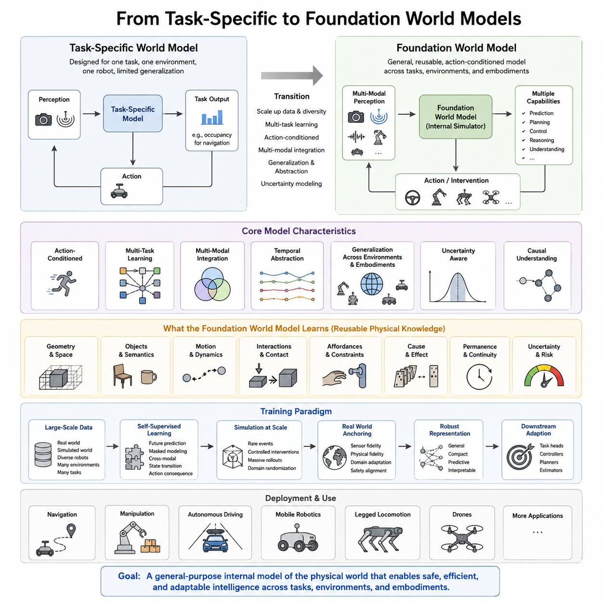
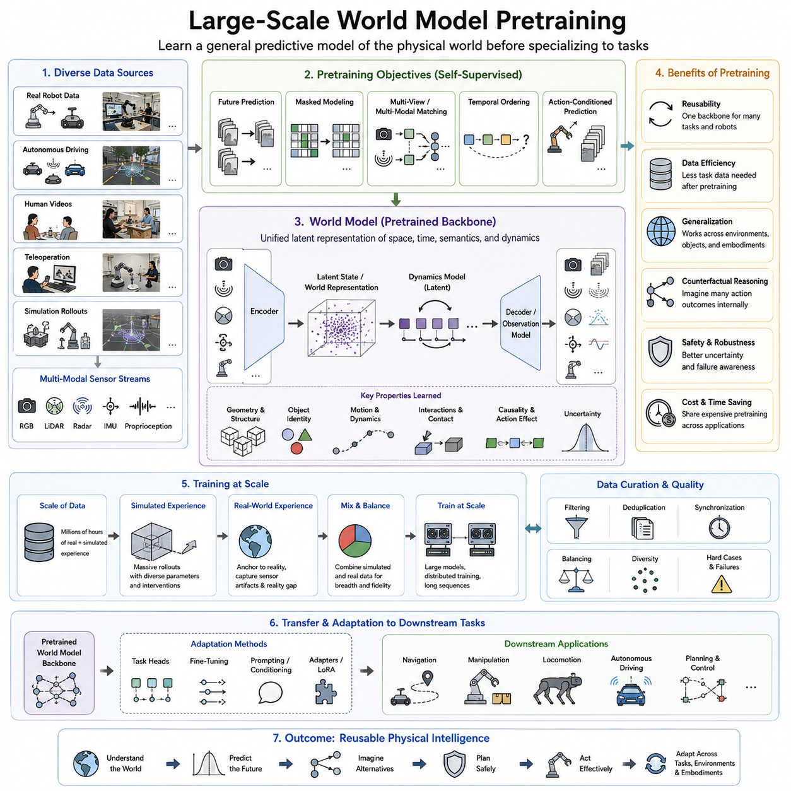
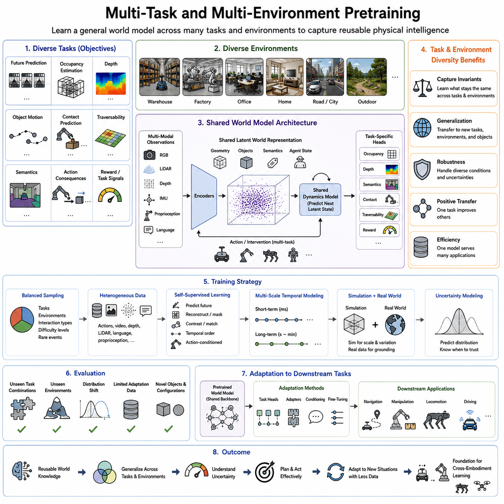
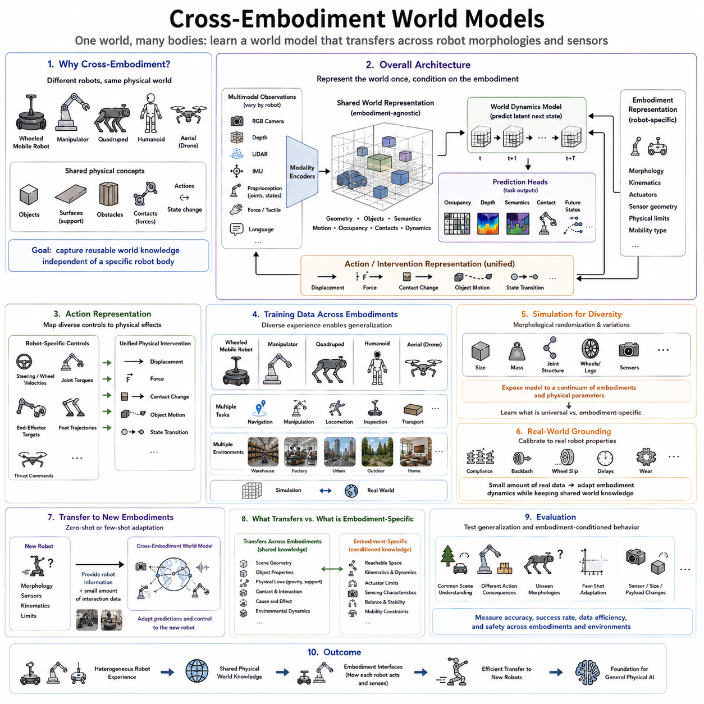
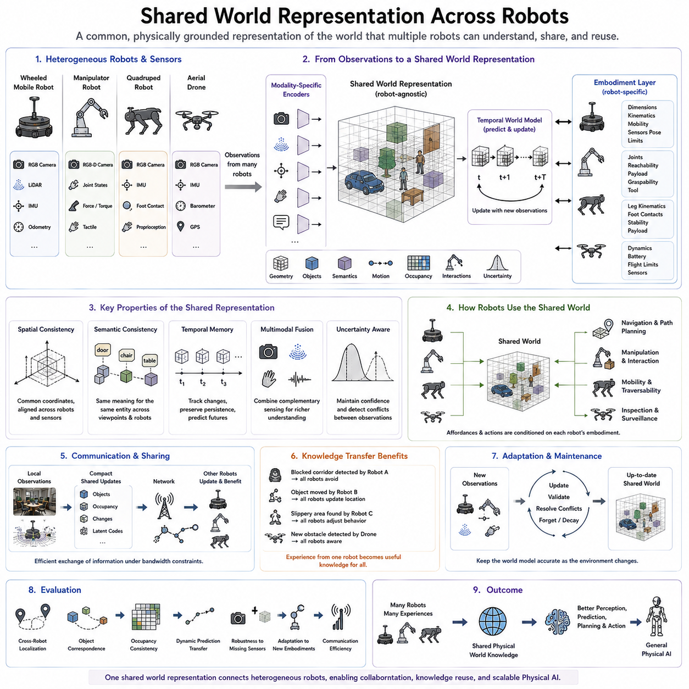
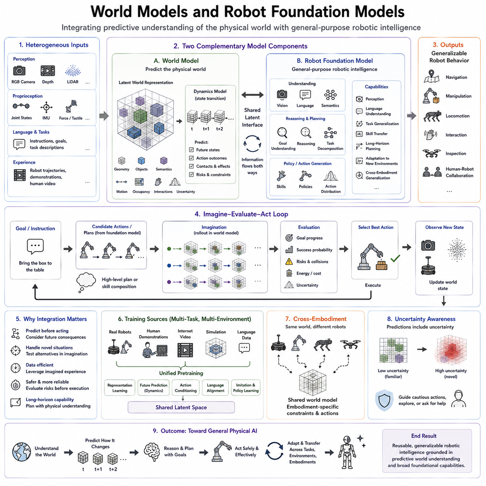
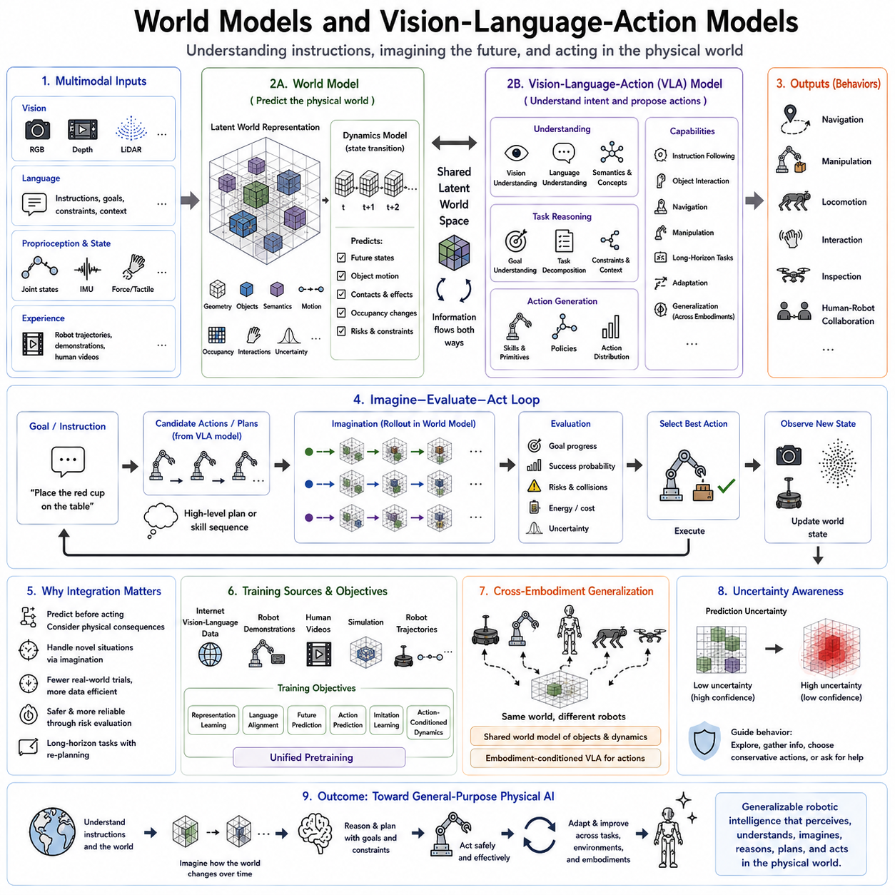
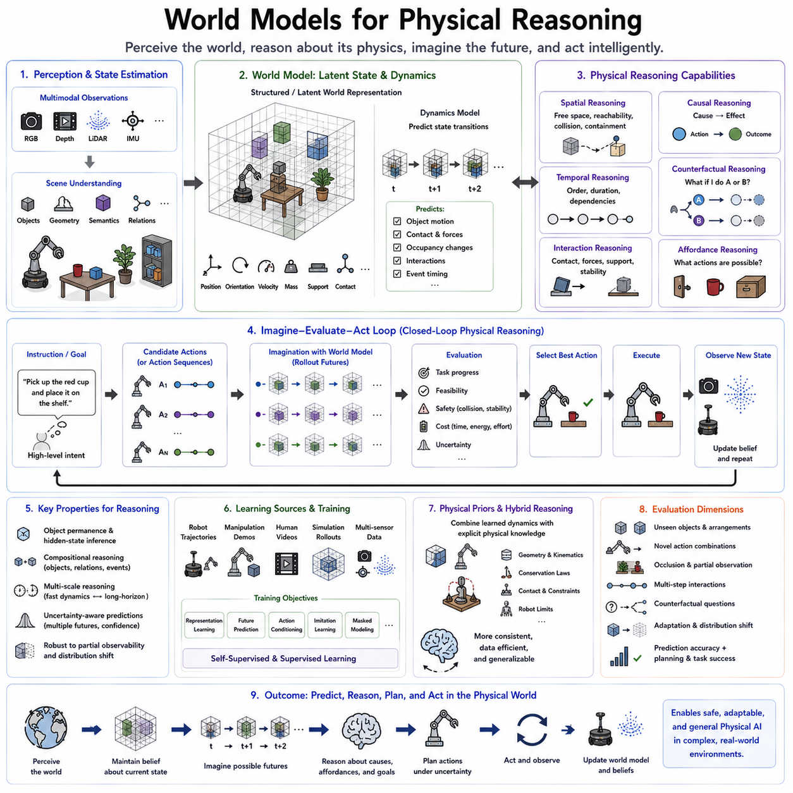
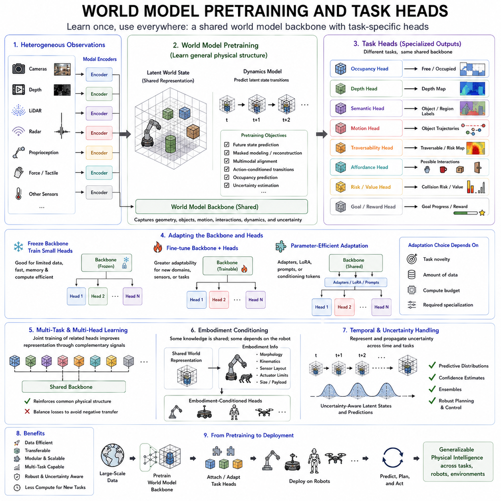
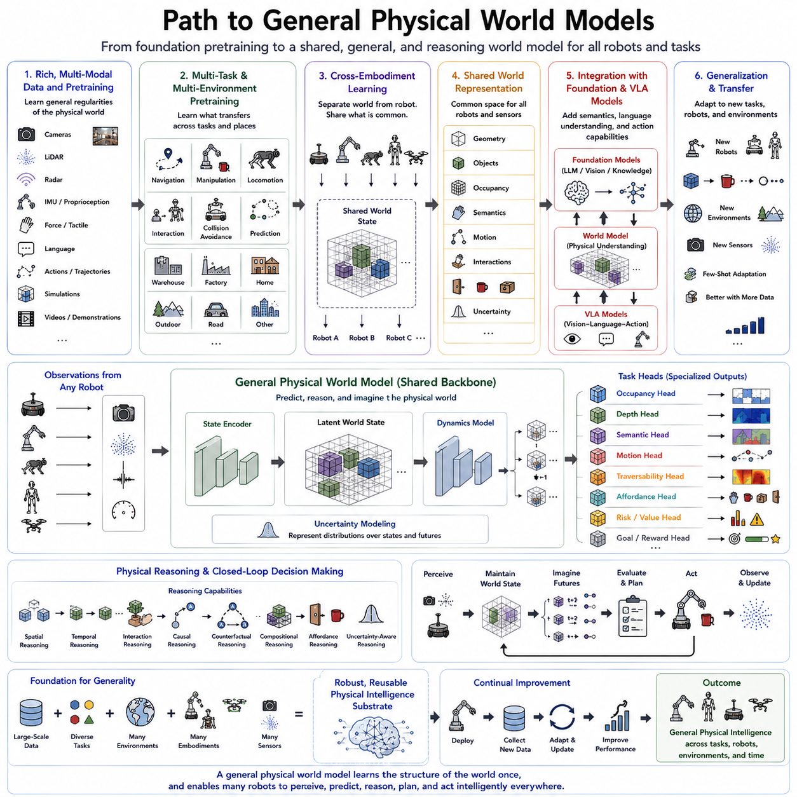

**Volume 07. World Models for Physical AI**

# Chapter 15. World Model to Foundation Model Strategy

## 15.01. From Task Specific to Foundation World Models

{width="7.268055555555556in" height="7.268055555555556in"}

Early world models for robotics were typically designed around a narrowly defined task, environment, sensor configuration, and embodiment. A navigation model might predict local occupancy, while a manipulation model might estimate object motion after a grasp. Such specialization can provide excellent performance within its operating domain, but the learned representation often captures only the aspects of the physical world required by the original task.

A foundation world model pursues a broader objective. Instead of learning only the dynamics needed for one controller or one robot, it attempts to acquire reusable representations of objects, geometry, motion, interaction, causality, uncertainty, and temporal evolution. These representations can then support multiple downstream capabilities, including perception, prediction, planning, control, reasoning, and adaptation across different physical environments and tasks.

The transition begins by separating world knowledge from task-specific outputs. In a conventional pipeline, perception features may be optimized directly for a particular prediction or control objective. A foundation-oriented architecture instead learns a shared latent state that preserves information useful for many objectives. Navigation, manipulation, collision prediction, traversability estimation, or interaction reasoning can subsequently operate through specialized heads built on the common representation.

Scale is important because physical environments contain enormous variation. A model trained only in a warehouse may associate particular floor textures, object arrangements, or motion patterns with specific outcomes. Training across factories, homes, roads, outdoor terrain, laboratories, and simulated environments encourages the model to identify more general regularities. The objective is not simply more data, but broader coverage of the factors that determine how physical states evolve.

Multitask learning provides another path toward foundation capability. A shared model can simultaneously learn future-state prediction, occupancy estimation, object motion, semantic understanding, action effects, contact events, and other physical properties. Each objective constrains the internal representation differently. Their combination encourages the latent space to capture persistent structure rather than features that happen to solve only one narrowly specified benchmark or robotic behavior.

Foundation world models must also represent actions because physical intelligence depends on intervention rather than passive observation alone. The model should distinguish what is likely to happen naturally from what would happen if an agent accelerates, turns, grasps, pushes, opens, lifts, or releases something. Action-conditioned prediction therefore transforms a general predictive model into an internal simulator capable of comparing alternative futures before committing to physical execution.

Temporal abstraction becomes increasingly important as the scope of the model expands. Low-level dynamics describe rapid changes such as wheel motion, contact, joint movement, or short-term object displacement, while higher-level dynamics describe events such as entering a room, completing a manipulation stage, or reaching a navigation goal. A foundation world model should connect these temporal scales so that immediate physical consequences remain consistent with longer-horizon behavioral predictions.

Generalization also requires separating universal physical structure from embodiment-specific characteristics. A wheeled robot, quadruped, manipulator, humanoid, and aerial robot possess different action spaces and constraints, yet they inhabit worlds governed by many shared concepts such as free space, obstacles, support, collision, motion, object permanence, and cause and effect. Shared representations can encode these common properties while embodiment-specific modules describe how each platform can influence them.

Multimodal sensing further strengthens the transition from specialized models toward general physical representations. Cameras provide appearance and semantic information, LiDAR and depth sensors contribute geometry, radar captures motion under difficult visibility, and proprioceptive signals describe the agent itself. Language can add conceptual and task context. A foundation model should integrate these signals into a coherent state rather than treating every modality as an isolated prediction problem.

The resulting representation does not need to reconstruct every observable detail. For Physical AI, usefulness depends more strongly on preserving information relevant to future interaction. A world model may therefore compress textures or visually insignificant details while retaining geometry, object identity, motion, affordances, contact relationships, uncertainty, and action consequences. This predictive abstraction distinguishes a useful internal model from a system that merely reproduces sensory observations.

Self-supervised learning is particularly suitable for this transition because robotic and video data contain abundant supervision in their temporal structure. Future observations, masked regions, cross-modal correspondence, state transitions, and action consequences can provide learning signals without exhaustive manual annotation. Large collections of real and simulated trajectories can therefore become training material for learning reusable physical representations before any specific downstream task has been selected.

Simulation can expand this learning process by exposing the model to rare events, diverse environments, controlled interventions, and large numbers of trajectories. Real-world data then anchors the learned dynamics to actual sensor characteristics and physical behavior. Rather than treating simulation and reality as separate domains, a foundation strategy can combine them while learning which aspects of the representation remain stable and which dynamics require adaptation to the deployed environment.

Uncertainty becomes more important as generality increases. A task-specific model can be optimized around a relatively constrained operating distribution, whereas a foundation model is expected to encounter unfamiliar objects, environments, actions, and embodiments. It must therefore represent not only predicted futures but also confidence in those predictions. Recognizing uncertain or out-of-distribution states allows downstream planners to reduce speed, gather information, choose safer actions, or invoke fallback mechanisms.

A practical architecture can combine a large pretrained world-model backbone with lightweight task-specific components. The backbone learns spatial, temporal, semantic, physical, and causal structure from large-scale experience, while task heads specialize this knowledge for occupancy prediction, navigation, manipulation, risk estimation, control, or other applications. This arrangement mirrors the broader foundation-model principle: expensive general representation learning is shared, while adaptation to individual tasks becomes comparatively efficient.

The move toward foundation world models therefore represents more than increasing parameter count. It changes the purpose of the model from solving one prediction problem to acquiring reusable knowledge about how physical environments are structured, how they change, and how actions modify them. The progression from task-specific dynamics to multitask, multimodal, multi-environment, and eventually cross-embodiment learning establishes the conceptual bridge toward general physical world models.

## 15.02. Large Scale World Model Pretraining

{width="7.268055555555556in" height="7.268055555555556in"}

Large-scale world model pretraining extends the foundation-model paradigm into physical intelligence by learning reusable representations of environments, dynamics, objects, interactions, and action consequences before specialization for individual robotic tasks. Rather than training a new dynamics model for every application, a sufficiently broad pretrained model can provide a common predictive backbone from which navigation, manipulation, locomotion, planning, and control systems can be adapted.

The central resource for this approach is not simply a large dataset but a diverse collection of physical experience. Training data may contain robot trajectories, autonomous driving sequences, human videos, manipulation demonstrations, simulation rollouts, teleoperation records, and multimodal sensor streams. Diversity across environments, objects, behaviors, viewpoints, and operating conditions encourages the model to discover regularities that remain useful beyond the circumstances represented by any single dataset.

Temporal data distinguishes world model pretraining from conventional static representation learning. Individual images provide information about appearance and geometry, but sequences reveal how states evolve. By observing transitions across time, the model can learn motion, persistence, interaction, contact, occlusion, deformation, and longer-term event structure. When actions are available, the training process can additionally associate interventions with their resulting changes in the physical state.

Large-scale pretraining therefore requires a representation capable of integrating heterogeneous observations. Cameras may provide RGB video, LiDAR may describe three-dimensional structure, radar may contribute velocity information, and IMUs or joint sensors may represent ego-motion and proprioception. These modalities do not necessarily need identical encoders, but their representations should eventually support a coherent internal state in which spatial, temporal, semantic, and physical relationships can be jointly modeled.

Self-supervised objectives make this scale practical because most physical data does not contain manually produced labels. A model can learn by predicting future latent states, reconstructing masked information, matching representations across views or modalities, estimating temporal ordering, or predicting the consequences of observed actions. The world itself therefore provides much of the supervision, allowing very large collections of sensor and trajectory data to contribute to representation learning without exhaustive annotation.

Prediction in latent representation space can substantially reduce the computational burden of pretraining. Reconstructing every pixel of every future frame may force the model to allocate capacity to texture, lighting, and other details that are not essential for physical reasoning. A latent predictive objective can instead emphasize persistent structures such as object identity, geometry, motion, interaction, and state transitions, while suppressing unpredictable or task-irrelevant sensory details.

However, generative objectives remain useful when detailed observations are important. Future video generation, occupancy reconstruction, depth prediction, or multimodal reconstruction can force the model to retain rich information about possible futures. A large-scale system may therefore combine latent predictive, generative, contrastive, reconstruction, and action-conditioned objectives rather than relying on a single learning signal. Their balance determines what kinds of physical information emerge in the pretrained representation.

Action-conditioned pretraining is especially important for Physical AI because observation alone does not fully reveal controllable dynamics. If trajectories include steering commands, velocities, joint commands, forces, gripper actions, or other interventions, the model can learn how alternative actions influence future states. This enables counterfactual prediction in which several candidate action sequences can be imagined and evaluated internally before a robot executes one of them in the real environment.

Simulation provides an important mechanism for scaling such action-rich experience. Millions of controlled interactions can be generated without damaging hardware, endangering people, or consuming large amounts of real-world operating time. Parameters such as mass, friction, lighting, terrain, object configuration, sensor noise, and actuator behavior can be varied systematically, exposing the pretrained model to combinations that may be rare or difficult to collect in physical deployments.

Real-world data remains essential because simulated environments cannot perfectly reproduce physical systems. Sensor artifacts, actuator delays, mechanical wear, unmodeled contacts, environmental variability, and human behavior introduce discrepancies that simulation may not capture. Large-scale pretraining can therefore mix simulated and real trajectories, using simulation for coverage and controlled variation while real-world experience anchors representations and transition dynamics to the conditions encountered during deployment.

Data quality becomes increasingly important as dataset size grows. Repeated, corrupted, poorly synchronized, or highly redundant trajectories can consume training compute without proportionally improving the model. Effective pretraining therefore depends on data curation, synchronization, filtering, balancing, and sampling strategies that preserve meaningful diversity. Rare interactions, failures, unusual terrain, difficult lighting, and safety-critical situations may deserve greater representation than their natural frequency would otherwise provide.

Scaling also applies to model capacity and computational resources. Larger architectures can represent more complex relationships across objects, modalities, time horizons, and environments, but increasing parameter count alone does not guarantee a better world model. Model scale must be matched with sufficient data diversity, effective learning objectives, temporal context, and optimization. The useful scaling target is the amount of reusable physical structure captured by the representation rather than model size by itself.

Long temporal context presents a particular challenge. Physical behavior contains fast events such as contact and actuator response as well as slower processes such as navigation, task progression, and human interaction. Processing every observation at identical temporal resolution becomes expensive over long trajectories. Hierarchical representations, temporal abstraction, memory mechanisms, and compressed latent states can allow pretrained world models to connect immediate dynamics with longer-horizon environmental evolution.

Pretraining should also expose the model to uncertainty rather than presenting the physical world as deterministic. Multiple futures may be plausible because of incomplete observations, stochastic interactions, hidden variables, or the behavior of other agents. Learning distributions over possible futures allows the model to represent ambiguity instead of averaging incompatible outcomes. This capability becomes critical when the pretrained model is later used for planning, collision avoidance, or risk-sensitive decision making.

After pretraining, the learned world representation can be adapted through task-specific heads, fine-tuning, prompting, conditioning, or lightweight adaptation modules. A navigation system may extract traversability and future occupancy, while a manipulation system may use the same underlying knowledge for object interaction and contact prediction. The economic and engineering advantage comes from reusing expensive pretraining across many downstream systems instead of rebuilding physical knowledge separately for every robot application.

The ultimate objective of large-scale world model pretraining is therefore to convert heterogeneous physical experience into transferable predictive knowledge. Real and simulated data, multiple sensors, diverse environments, temporal sequences, and action-conditioned interactions collectively teach the model how physical states are organized and how they evolve. This pretrained knowledge forms the scalable foundation required for multi-task, multi-environment, and eventually cross-embodiment world models capable of supporting increasingly general Physical AI.

## 15.03. Multi Task and Multi Environment Pretraining

{width="7.268055555555556in" height="7.268055555555556in"}

Multi-task and multi-environment pretraining expands a world model beyond the assumptions of a single robotic application. Instead of learning only navigation in one warehouse or manipulation on one workbench, the model experiences many objectives and operating domains during pretraining. This diversity encourages the internal representation to capture reusable physical structure rather than correlations that are useful only for one task, scene, or deployment configuration.

Multi-task pretraining exposes the same model to different prediction and interaction objectives. These may include future-state prediction, occupancy estimation, object motion, depth, semantic structure, contact prediction, traversability, action consequences, and reward-related signals. Each objective emphasizes different properties of the environment, while their combination encourages the shared representation to preserve information useful for multiple forms of physical reasoning.

The central architectural principle is a shared world representation combined with task-dependent outputs. Multimodal observations can first be encoded into a common latent state representing geometry, objects, motion, semantics, and agent state. Shared dynamics modules then predict how this state evolves, while specialized heads decode information needed for individual tasks. Knowledge learned from one objective can consequently improve representations used by other objectives.

Multi-environment pretraining introduces a second dimension of diversity. A Physical AI system may eventually operate in warehouses, factories, offices, homes, roads, construction areas, fields, or unstructured outdoor terrain. Training across such environments prevents the world model from treating one scene distribution as the definition of reality. Instead, it must discover which environmental properties remain stable and which properties vary with context.

This distinction between invariant and environment-specific structure is fundamental to generalization. Concepts such as free space, collision, support, object persistence, motion, and cause and effect can remain meaningful across many domains, even though their visual appearance differs dramatically. Floor materials, illumination, weather, object categories, terrain geometry, traffic patterns, and human activity may vary, requiring the representation to preserve common physical principles while accommodating local differences.

Task and environment diversity interact rather than forming independent training dimensions. Navigation in a warehouse, navigation outdoors, manipulation in a factory, and manipulation in a home expose different combinations of physical constraints. A sufficiently diverse training matrix allows the model to encounter the same concept under multiple conditions. This helps separate essential physical relationships from accidental correlations associated with a particular dataset or application.

Balanced sampling is therefore critical. If most training trajectories come from one environment or one task, a large dataset can still produce a strongly biased model. Pretraining pipelines can balance tasks, environments, interaction types, difficulty levels, and rare events so that dominant datasets do not overwhelm smaller but informative sources. Sampling strategies can also emphasize failures, unusual interactions, difficult terrain, or safety-critical situations that contain disproportionate learning value.

The training objectives must accommodate missing labels and heterogeneous data. Some trajectories may contain actions, others only video, while certain datasets may provide depth, LiDAR, language, semantic labels, or proprioception. Rather than discarding incomplete data, a multimodal world model can use objectives appropriate to the information available in each sample. Self-supervised prediction provides a common learning mechanism across these heterogeneous sources.

Action-conditioned learning becomes particularly valuable when tasks differ. Driving, mobile navigation, manipulation, and locomotion use very different control spaces, but each produces transitions in the physical world. By learning relationships between actions and resulting states, the model can develop a more general concept of intervention. Task-specific action encoders can map different command structures into representations that interact with a shared predictive dynamics model.

Temporal diversity is equally important. Some tasks require millisecond-scale sensitivity to contact or actuator response, whereas others depend on events evolving over seconds or minutes. Multi-task pretraining should therefore represent several temporal scales rather than assuming a single prediction horizon. Short-horizon dynamics can support stabilization and collision avoidance, while longer-horizon representations can describe navigation progress, interaction sequences, and task completion.

Multi-environment data also exposes the model to different uncertainty regimes. A structured factory may provide predictable geometry and motion, while outdoor environments can contain changing terrain, weather, vegetation, and poorly observed regions. Human-populated environments introduce additional behavioral uncertainty. Learning across these conditions helps the model associate confidence with context and recognize when predictions become unreliable because the current situation differs from familiar experience.

Simulation can efficiently enlarge the task-environment training matrix. The same robot can perform many tasks across thousands of procedurally generated scenes while physics parameters, sensor properties, objects, terrain, and disturbances are varied. Simulation also permits systematic interventions and failures that would be expensive or unsafe to reproduce physically. Real-world trajectories then provide the grounding needed to prevent the shared model from becoming dependent on simulation-specific regularities.

An important consequence of this strategy is positive transfer. Learning object motion may improve manipulation prediction, while learning occupancy and geometry can benefit navigation and collision reasoning. However, negative transfer is also possible when objectives compete or environments demand incompatible representations. Model capacity, modular components, task conditioning, mixture mechanisms, and carefully designed losses can help preserve shared knowledge without forcing every task to use exactly the same internal features.

Evaluation must therefore test more than average performance across the training datasets. A useful pretrained world model should transfer to unseen combinations of known tasks and environments and, ideally, to environments or objectives not represented during training. Performance under distribution shift, limited adaptation data, sensor changes, and novel object configurations reveals whether the model has learned reusable physical structure or merely memorized a large collection of domains.

After pretraining, task adaptation can be performed with lightweight heads, adapters, conditioning signals, or selective fine-tuning. Because much of the geometry, dynamics, semantics, interaction knowledge, and uncertainty representation already exists in the shared backbone, new applications may require substantially less task-specific data. This transforms pretraining from a collection of independent models into a common physical knowledge infrastructure supporting multiple robotic systems.

Multi-task and multi-environment pretraining therefore provides a major step from large-scale world model learning toward foundation-level physical intelligence. By combining diverse objectives with diverse operating domains, the model is pressured to identify what remains useful across tasks and environments. The resulting shared representation provides the basis for subsequent cross-embodiment learning, where world knowledge must generalize not only across what a robot does and where it operates, but also across different kinds of robots themselves.

## 15.04. Cross Embodiment World Models

{width="7.268055555555556in" height="7.268055555555556in"}

Cross-embodiment world models extend the foundation world model concept beyond individual robot platforms. A conventional model is often trained around one embodiment, such as a wheeled mobile robot, manipulator, quadruped, humanoid, or aerial robot. Cross-embodiment modeling instead seeks representations of the physical world that remain useful when the agent's morphology, sensors, actuators, kinematics, dynamics, and action spaces change.

The motivation comes from an important separation between the world and the agent acting within it. Robots may have very different bodies, yet they encounter many of the same physical concepts: objects occupy space, surfaces provide support, obstacles constrain motion, contacts transfer forces, and actions produce state transitions. A reusable world model should capture these shared structures without unnecessarily binding them to the mechanical configuration of one particular robot.

Embodiment still matters because every robot observes and influences the world differently. A mobile robot moves through planar space, a manipulator changes objects through articulated motion, a quadruped interacts through repeated foot contacts, and a drone moves freely through three-dimensional space. The world representation can therefore be shared while embodiment-specific information describes sensing geometry, reachable states, action capabilities, physical constraints, and interaction mechanisms.

A useful architecture separates shared world state from embodiment state. The shared component can encode geometry, objects, semantics, motion, occupancy, contact relationships, and environmental dynamics. An embodiment representation can encode morphology, joint configuration, dimensions, sensor placement, actuator characteristics, kinematic limits, or mobility type. Predictions are then conditioned on both representations so that common physical knowledge is interpreted according to the capabilities of the current robot.

Action representation is one of the central challenges. Steering commands, wheel velocities, joint torques, end-effector targets, foot trajectories, and thrust commands cannot be directly represented by one fixed action vector. Cross-embodiment models therefore need mappings from platform-specific controls into a more transferable representation of physical intervention, while preserving enough detail to predict how each embodiment actually changes its own state and the surrounding environment.

One approach is to describe actions through their intended physical effects. Instead of treating a command only as a motor value, the model may represent displacement, force, contact change, object motion, or desired state transition. Such abstractions can reveal similarities between apparently different behaviors. A mobile base moving toward an object and a manipulator moving its end effector toward the same object use different actuators but share meaningful spatial and interaction relationships.

Cross-embodiment learning also requires diverse training experience. Data should ideally cover multiple robot morphologies, sensor configurations, tasks, environments, and interaction styles. Shared situations are particularly valuable because different embodiments can reveal complementary aspects of the same physical structure. A manipulator provides rich contact interactions, a mobile robot provides large-scale spatial experience, and a quadruped provides information about terrain, support, balance, and repeated contact dynamics.

Multimodal representations help connect these heterogeneous platforms. Cameras, depth sensors, LiDAR, force sensing, IMUs, joint states, and language may appear in different combinations across robots. Modality-specific encoders can transform available observations into a shared latent world representation, while missing-modality training can reduce dependence on a fixed sensor suite. The objective is not identical sensory input but a compatible representation of the underlying physical situation.

Canonical spatial representations can provide another bridge across embodiments. Three-dimensional scene representations, occupancy fields, object-centric states, or other agent-independent coordinate systems can describe the environment separately from the robot's own configuration. Embodiment-specific transformations then connect this common spatial representation to local sensor frames, body frames, manipulability regions, reachable areas, or collision geometry required for actual planning and control.

The dynamics model must distinguish environmental dynamics from embodiment dynamics. Object motion, gravity, support relationships, and many forms of collision belong primarily to the external world, while acceleration limits, joint response, balance, steering behavior, and actuator delays depend strongly on the platform. Factorizing these components allows transferable environmental knowledge to be reused while smaller embodiment-dependent modules learn how a particular robot participates in those dynamics.

Simulation is especially valuable for cross-embodiment pretraining because many robot morphologies can be generated and operated under controlled conditions. Different dimensions, masses, joint structures, wheel configurations, sensor locations, and actuator properties can be systematically varied. Such morphological randomization exposes the model to a continuum of embodiments rather than a few fixed machines, encouraging it to learn which relationships are universal and which must remain conditioned on embodiment parameters.

Real-world grounding remains necessary because physical robots introduce properties that simulation cannot completely reproduce. Mechanical compliance, backlash, wheel slip, actuator saturation, sensor misalignment, communication delay, wear, and complex contact behavior can differ across platforms. Limited real trajectories from a new robot can therefore be used to identify embodiment-specific dynamics while retaining the broader environmental representation learned from many other robots and simulations.

A major goal is zero-shot or few-shot transfer to a previously unseen embodiment. A strong cross-embodiment world model should not require complete retraining whenever a new robot is introduced. Given information about its morphology, sensors, kinematics, and a relatively small amount of interaction data, the model should adapt its predictions to the new platform. The amount of new experience required becomes an important measure of the quality of the shared representation.

Transfer must nevertheless respect physical capability differences. Knowledge that an object can be moved does not imply that every robot can move it, and a route traversable by a drone may be impossible for a wheeled platform. Cross-embodiment generalization therefore should not erase embodiment constraints. It should combine shared knowledge about the world with explicit reasoning about reachability, mobility, payload, contact, stability, sensing, and other platform-specific limitations.

Evaluation should consequently measure both shared prediction and embodiment-conditioned behavior. Tests can examine whether the model understands common scene dynamics across robots, predicts different consequences for different actions, transfers to unseen morphologies, and adapts using limited data. Performance should also be tested when sensor configurations, dimensions, payloads, or actuator characteristics differ from those encountered during pretraining.

Cross-embodiment world models ultimately transform heterogeneous robot experience into shared physical knowledge. Instead of maintaining isolated models for mobile robots, manipulators, quadrupeds, humanoids, and aerial systems, a common predictive foundation can represent the world while specialized embodiment interfaces describe how each machine senses and acts within it. This provides a critical bridge from multi-task and multi-environment pretraining toward shared world representations across robots and increasingly general Physical AI.

## 15.05. Shared World Representation Across Robots

{width="7.268055555555556in" height="7.268055555555556in"}

A shared world representation across robots aims to encode physical environments in a form that can be understood and reused by many robotic platforms. Instead of allowing every robot to construct an entirely independent internal model, heterogeneous systems can map their observations into a compatible representation of geometry, objects, semantics, motion, occupancy, interactions, and uncertainty. This creates a common knowledge layer between perception and robot-specific behavior.

The key principle is to distinguish the state of the world from the state of the robot. Environmental properties such as object location, free space, surface geometry, dynamic obstacles, semantic identity, and physical relationships can be represented independently of a particular machine. Robot-specific properties such as pose, dimensions, joints, payload, reachability, sensor placement, and mobility constraints can then be represented separately and related to the shared world state when required.

This separation allows heterogeneous robots to interpret the same environment according to their own capabilities. A narrow mobile robot may identify a corridor as traversable, while a larger platform may determine that the same corridor is inaccessible. A manipulator may interpret an object in terms of graspability, while a drone may treat it primarily as an obstacle. The underlying world representation can remain common even when the resulting affordances and actions differ.

Spatial consistency is therefore fundamental. Observations collected from different viewpoints, sensors, and robots must refer to compatible physical locations and entities. Shared coordinate systems, three-dimensional scene representations, bird's-eye-view structures, occupancy fields, object-centric maps, or learned latent spatial representations can provide this common reference. Robot-specific transformations connect local sensor and body frames to the shared representation.

Semantic consistency is equally important because robots should attach compatible meaning to shared entities. If one robot identifies a structure as a door, another robot should be able to associate its observations with the same semantic concept even if its camera viewpoint or sensor suite differs. Object identity, category, attributes, functional roles, and relationships can therefore become persistent components of the shared representation rather than temporary outputs of individual perception pipelines.

A useful shared representation must also be temporal. Physical environments change as people move, objects are manipulated, doors open, vehicles travel, and robots themselves alter the scene. The representation should preserve both persistent structure and dynamic state, allowing observations collected at different times to update rather than simply overwrite one another. Temporal memory can distinguish stable world knowledge from transient events and support prediction of future environmental states.

Multimodal fusion enables robots with different sensing systems to contribute to the same model. One platform may provide RGB cameras and LiDAR, another may use depth cameras and tactile sensing, while another may contribute radar, IMU, or proprioceptive information. Modality-specific encoders can transform these heterogeneous measurements into compatible latent features, allowing complementary observations to improve a common representation without requiring identical hardware across the fleet.

Uncertainty should accompany shared information because observations from different robots are not equally reliable. Sensor noise, occlusion, localization error, environmental change, or limited viewpoints can create conflicting estimates. Rather than forcing all measurements into a single deterministic state, the representation can preserve confidence and uncertainty. New observations can then strengthen, revise, or challenge existing beliefs according to their reliability and temporal relevance.

Shared representation does not necessarily mean a single centralized map stored in one computer. The concept can support centralized, distributed, hierarchical, or hybrid architectures. Individual robots may maintain local world states while exchanging selected features, object information, occupancy updates, or compressed latent representations. A fleet-level model can aggregate persistent knowledge while local models preserve high-frequency information required for real-time perception and control.

Communication constraints strongly influence what should be shared. Raw camera and LiDAR streams contain rich information but require substantial bandwidth, while compact semantic objects, occupancy updates, latent features, or changes to an existing world state can be transmitted more efficiently. A practical system therefore needs representations that preserve decision-relevant physical information while reducing redundant data, enabling collaboration even under intermittent or bandwidth-limited communication.

The representation must also distinguish shared environmental knowledge from embodiment-conditioned affordances. A staircase, narrow passage, heavy object, or elevated platform exists independently of the robot observing it, but whether it is traversable, reachable, liftable, or safe depends on embodiment. The shared layer can describe physical properties, while robot-specific reasoning combines those properties with morphology, payload, kinematics, stability, and mobility constraints.

Learning such representations benefits from observations of the same or similar environments by multiple robots. Cross-view and cross-robot correspondence can encourage different encoders to produce compatible representations of common objects and places. Predictive objectives can further require that shared latent states support future-state estimation regardless of which robot supplied the observations, promoting representations that describe underlying world dynamics rather than platform-specific sensor appearance.

A shared world representation also enables knowledge transfer between robots without requiring each platform to experience every situation directly. If one robot discovers a blocked corridor, slippery region, changed object location, or new obstacle, that information can become available to other robots operating in the same environment. At larger scales, accumulated experience can provide reusable priors about terrain, object interactions, environmental dynamics, and recurring hazards.

However, shared knowledge must remain adaptable because the world is not static. Information can become outdated as environments are rearranged, temporary obstacles disappear, or operating conditions change. Representations therefore require mechanisms for temporal validity, update, forgetting, conflict resolution, and version consistency. A world state should be treated as an evolving belief constructed from distributed observations rather than an immutable map of permanent facts.

Evaluation should test whether different robots produce compatible representations and whether information acquired by one platform improves another platform's prediction or decision making. Important tests include cross-robot localization, object correspondence, shared occupancy consistency, transfer of dynamic predictions, robustness to missing sensors, and adaptation to new embodiments. Communication efficiency and the usefulness of transferred knowledge are also critical system-level measures.

Shared world representation across robots therefore provides an informational bridge between cross-embodiment modeling and general robot foundation models. Heterogeneous robots can retain their own sensors, bodies, controllers, and operational constraints while accessing a common predictive description of the physical environment. As experience accumulates across platforms, this shared representation can evolve into reusable physical memory and knowledge that supports increasingly general perception, prediction, planning, and action across Physical AI systems.

## 15.06. World Models and Robot Foundation Models

{width="7.268055555555556in" height="7.268055555555556in"}

World models and robot foundation models address complementary aspects of general Physical AI. A world model learns how the physical environment is represented and how its state may evolve, while a robot foundation model aims to provide reusable capabilities across many robotic tasks, environments, and embodiments. Their integration connects predictive understanding of the world with general-purpose perception, reasoning, planning, and action.

A robot foundation model can be viewed as a broadly pretrained computational foundation for robotic intelligence. Instead of constructing separate models for navigation, manipulation, locomotion, interaction, and other behaviors, large-scale pretraining creates representations and capabilities that can be adapted to multiple applications. Such models may integrate vision, language, proprioception, actions, demonstrations, and robot trajectories within a common learning architecture.

World models contribute something particularly important to this foundation: an internal representation of physical dynamics. Recognizing an object or understanding a language instruction does not by itself explain what will happen when the robot pushes, grasps, accelerates, turns, or makes contact with the environment. A predictive world model represents state transitions and action consequences, allowing robotic intelligence to reason about possible futures rather than reacting only to current observations.

The two model classes therefore operate at different but overlapping levels. A robot foundation model can provide semantic knowledge, task understanding, transferable skills, and action generation, while a world model provides spatial, temporal, physical, and causal structure. When connected, semantic reasoning can be grounded in predicted physical consequences. The robot can interpret what should be achieved while also estimating whether candidate actions are physically feasible and what outcomes they may produce.

A shared latent representation can form the interface between these capabilities. Multimodal observations from cameras, depth sensors, LiDAR, proprioception, force sensing, and language can be encoded into a structured or learned world state. A dynamics model predicts how this state changes over time, while foundation-model components use the representation for task interpretation, reasoning, policy generation, or planning. Information can flow repeatedly between prediction and action selection.

This integration supports an imagine-evaluate-act process. Given a goal, the robot foundation model can generate candidate actions or higher-level plans. The world model can roll these candidates forward internally to estimate future states, interactions, risks, and progress toward the goal. Candidate futures can then be evaluated, allowing the system to select an action based not only on learned behavioral patterns but also on predicted consequences in the current physical situation.

Such an architecture can reduce dependence on purely reactive policies. End-to-end policies can perform well when deployment conditions resemble their training distribution, but unexpected obstacles, object configurations, failures, or interactions may require explicit consideration of alternative futures. A world model provides a predictive workspace in which the foundation model can test possibilities before committing to actions that may be difficult, costly, or unsafe to reverse.

World models can also improve data efficiency for robot foundation models. Real robot interaction is expensive because hardware time, human supervision, safety procedures, maintenance, and physical reset operations are required. Once a sufficiently accurate world model has been learned, parts of policy learning and planning can occur through imagined trajectories. These synthetic experiences cannot completely replace real data, but they can increase the value obtained from collected physical experience.

Conversely, robot foundation models can strengthen world models by providing richer semantic and task context. A purely geometric dynamics model may predict that an object will move after contact without understanding its functional role or why that movement matters. Semantic representations learned from large-scale vision, language, and robot data can identify objects, relationships, intentions, and task relevance, allowing the world model to focus prediction on information that is meaningful for intelligent behavior.

Language can provide a particularly useful bridge. Instructions such as moving an object, opening a container, avoiding a restricted area, or delivering an item describe desired changes in the world rather than raw motor commands. A foundation model can interpret these goals semantically, while the world model evaluates physical state transitions required to achieve them. This connects abstract intent with geometry, dynamics, affordances, constraints, and predicted action consequences.

The combination becomes even more powerful when trained across multiple tasks and environments. Navigation trajectories teach spatial structure and mobility, manipulation data provides contact and object interaction, locomotion contributes support and terrain dynamics, and human or robot video supplies broad visual experience. A common pretrained architecture can integrate these experiences so that semantic knowledge, physical prediction, and action competence improve together rather than remaining isolated capabilities.

Cross-embodiment learning further extends this relationship. Different robots require different low-level actions, yet much of their knowledge about objects, geometry, motion, causality, and environmental change can be shared. The world model can provide an embodiment-independent description of the physical situation, while robot foundation model components condition planning and control on morphology, kinematics, sensors, payload, reachability, and other embodiment-specific constraints.

Uncertainty is essential when world-model predictions influence foundation-model actions. The robot should distinguish familiar situations with reliable predictions from novel conditions where imagined futures are uncertain. Predictive distributions, confidence estimates, novelty detection, or ensembles can expose uncertainty to the planner or policy. The foundation model can then choose conservative actions, gather additional observations, request assistance, or use fallback behavior rather than relying blindly on uncertain predictions.

Training can be organized around a combination of representation learning, future prediction, action conditioning, reconstruction, language alignment, imitation, and control objectives. Not every dataset must contain every signal. Video can teach visual dynamics, robot trajectories can teach action consequences, language can provide semantic structure, and simulation can generate controlled physical interactions. Joint or staged pretraining can progressively connect these sources into a reusable physical intelligence foundation.

Deployment may use different computational partitions depending on the robot. Large-scale pretraining and extensive imagined rollouts can occur on powerful compute infrastructure, while compact representations, predictive modules, policies, or task heads operate on edge hardware. Hierarchical designs can also separate fast local control from slower predictive reasoning. The foundation model therefore need not execute every component at maximum scale during every control cycle.

Evaluation should examine whether integration actually improves physical intelligence rather than simply combining two large models. Relevant capabilities include prediction accuracy, planning success, adaptation to unseen environments, long-horizon task completion, data efficiency, uncertainty calibration, and robustness under distribution shift. Tests should determine whether world-model predictions improve action selection and whether foundation-model semantics make prediction more useful for downstream behavior.

World models and robot foundation models ultimately converge around a common objective: reusable intelligence that can understand the physical world, anticipate how it will change, and choose actions that produce desired outcomes. The world model supplies predictive physical structure, while the robot foundation model supplies broad semantic, reasoning, and behavioral capability. Their integration forms a major architectural step toward general-purpose robotic systems that can perceive, imagine, reason, plan, adapt, and act across increasingly diverse Physical AI applications.

## 15.07. World Models and Vision Language Action Models

{width="7.268055555555556in" height="7.268055555555556in"}

Vision-Language-Action models connect visual perception and language understanding directly to robotic actions, providing a powerful framework for general-purpose robot behavior. World models add a complementary capability by representing how the physical environment evolves over time. Their integration enables a robot not only to interpret what it sees and what it is asked to do, but also to anticipate the physical consequences of possible actions before execution.

A Vision-Language-Action model, or VLA, typically receives visual observations together with language instructions and produces actions or action representations. Large-scale pretraining allows such models to associate objects, scenes, instructions, tasks, and behaviors across diverse data. This creates a semantic pathway from human intent to robot behavior, but direct action generation alone does not necessarily provide an explicit mechanism for predicting how the world will change after each candidate action.

A world model provides this predictive component. Given the current state and a possible action, it estimates future states, object motion, contact events, occupancy changes, environmental interactions, and other consequences. Instead of mapping observation and language directly to a single action, an integrated system can generate several plausible actions and use the world model to imagine their outcomes. Prediction therefore becomes an intermediate reasoning process between understanding and execution.

The integration can be organized around a shared latent world representation. Visual observations are encoded into representations of geometry, objects, semantics, motion, and spatial relationships, while language specifies goals, constraints, or task context. Action representations describe possible interventions. The world model predicts transitions within this shared space, allowing vision, language, action, and physical dynamics to interact through a common representation rather than remaining isolated processing streams.

Language is especially useful because many robotic instructions describe desired changes to the physical world. Commands such as placing an object on a table, opening a drawer, moving through a doorway, or avoiding a person specify goals and constraints rather than exact actuator commands. A VLA model can translate these instructions into candidate behaviors, while the world model evaluates whether the predicted state transitions actually satisfy the intended semantic goal.

Visual information provides the grounding required to connect these instructions to the current environment. Objects must be localized, relationships understood, obstacles identified, and relevant state changes detected. A world model extends this visual grounding through time by representing not only what currently exists but also what may exist after interaction. The resulting representation connects present perception, intended future state, and the sequence of actions required to move between them.

Action conditioning creates the critical link between VLA policies and predictive dynamics. The same visual scene can evolve differently depending on whether the robot waits, moves, grasps, pushes, rotates, or releases an object. By conditioning predictions on candidate actions, the world model estimates these alternative futures. The VLA component can then compare predicted outcomes with the language-defined objective and choose actions whose consequences are most consistent with the requested task.

This creates an imagine-evaluate-act loop. The VLA model proposes candidate actions or short action sequences, the world model rolls them forward, and an evaluator measures expected task progress, physical feasibility, safety, cost, and uncertainty. The best candidate is executed, new observations update the world state, and the process repeats. Such closed-loop reasoning combines the flexibility of learned policies with explicit prediction of changing physical conditions.

Long-horizon tasks particularly benefit from this integration. A command such as retrieving an object from another room may require navigation, obstacle avoidance, localization, reaching, grasping, transport, and placement. Directly predicting a long sequence of low-level actions can accumulate errors. A world model can maintain predicted intermediate states and allow the VLA system to repeatedly re-plan as observations change, connecting high-level semantic goals with shorter physically grounded action segments.

World models can also provide counterfactual reasoning for VLA systems. The robot can estimate what would happen if it selected a different grasp, approached an object from another direction, moved around an obstacle, or delayed an interaction. These counterfactual futures do not need to be physically executed. Internal evaluation can reject actions that appear inefficient, unstable, unsafe, or unlikely to satisfy the instruction, reducing costly trial and error in the real environment.

Uncertainty is essential because imagined futures are not always reliable. Occluded objects, unfamiliar environments, ambiguous instructions, novel interactions, or poorly modeled dynamics can increase prediction uncertainty. An integrated system should expose this uncertainty to action selection. When confidence is low, the VLA model can choose information-gathering actions, slow down, observe from another viewpoint, select a conservative alternative, or request human clarification instead of executing an uncertain plan.

The relationship is bidirectional because VLA representations can also improve world modeling. Vision-language pretraining provides semantic knowledge about objects, activities, relationships, and functional concepts that may be difficult to learn from robot trajectories alone. Language can identify which aspects of a scene matter for the current task, helping the world model allocate predictive capacity toward relevant objects, interactions, constraints, and possible state changes rather than treating all observable details equally.

Training can combine internet-scale vision-language data with robot demonstrations, action trajectories, human videos, simulation, and multimodal sensor sequences. Vision-language data contributes semantic breadth, while robot and simulation data provide physically grounded state transitions and action consequences. Objectives may include representation learning, language alignment, future prediction, action prediction, imitation, masked modeling, and action-conditioned dynamics, creating complementary supervision for a unified architecture.

Cross-embodiment training can further separate semantic intent from robot-specific execution. The instruction to move an object can apply to a mobile manipulator, humanoid, or other capable platform even though their motor commands differ. A shared world model represents objects and desired physical changes, while embodiment-conditioned VLA components translate those changes into actions compatible with each robot's morphology, reachability, sensors, kinematics, and control interface.

Deployment can use hierarchical computation to balance reasoning quality and real-time constraints. High-level language interpretation, task decomposition, and longer world-model rollouts may operate at a slower rate, while short-horizon prediction and control run rapidly near the robot. This separation allows expensive predictive reasoning to guide behavior without requiring the entire foundation-scale architecture to execute during every low-level control update.

Evaluation should measure whether the world model makes VLA behavior more physically grounded and reliable. Relevant tests include instruction-following success, action prediction, future-state accuracy, long-horizon completion, recovery from unexpected changes, counterfactual selection, uncertainty calibration, and generalization to new environments or embodiments. The critical question is whether imagined physical consequences improve decisions compared with direct vision-language-to-action mapping alone.

World models and Vision-Language-Action models therefore provide two complementary foundations for increasingly general robotic intelligence. VLA models connect perception and language to behavior, while world models connect current states and actions to possible futures. Their integration creates a system that can understand an instruction, perceive the physical situation, imagine alternative outcomes, evaluate risks and progress, and select grounded actions, forming an important path toward adaptable and general-purpose Physical AI.

## 15.08. World Models for Physical Reasoning

{width="7.268055555555556in" height="7.268055555555556in"}

Physical reasoning requires an intelligent system to understand not only what exists in an environment but also how physical entities interact, move, constrain one another, and respond to actions. World models provide this capability by representing states and predicting transitions through time. For Physical AI, this transforms perception from recognition of the present into reasoning about what can happen next and why particular outcomes may occur.

A physical world can be represented as interacting entities with properties such as position, orientation, geometry, velocity, mass, support, contact, and functional relationships. Rather than treating observations as unrelated pixels or sensor measurements, a world model can organize them into a structured or latent state. Physical reasoning then operates over this representation to infer relationships, predict changes, and determine which aspects of the scene are relevant to future action.

Spatial reasoning forms one foundation of this capability. A robot must understand free space, containment, proximity, relative position, visibility, reachability, and collision relationships. These properties determine whether a path is traversable, an object is accessible, or an action is geometrically feasible. World models can maintain spatial relationships through time, allowing reasoning to remain consistent even when objects move, observations become occluded, or the robot changes viewpoint.

Temporal reasoning extends this representation from static geometry to evolving processes. Physical events have ordering, duration, and dependency: an object must be grasped before it can be lifted, a door must open before a robot can pass through it, and braking must begin before a collision can be avoided. Predictive state transitions allow the model to connect current conditions with intermediate and future states, supporting reasoning over sequences rather than isolated observations.

Interaction reasoning concerns how entities influence one another through contact and forces. Pushing an object may translate or rotate it, grasping changes its relation to the robot, and stepping on unstable terrain may alter support and balance. A useful world model should capture these interaction patterns without requiring an exact analytical simulation of every physical quantity. Learned representations can approximate the consequences most relevant to perception, planning, and control.

Causal reasoning adds another layer by distinguishing correlation from intervention. Observing that two objects move together does not necessarily explain which action caused the change. Action-conditioned world models can compare what is expected to happen naturally with what may happen after a robot intervenes. This provides a basis for reasoning about cause and effect, enabling the system to ask how different actions could intentionally transform the current physical state.

Counterfactual reasoning follows naturally from this predictive structure. Before acting, a robot can consider alternatives such as moving left instead of right, grasping from another direction, applying less force, or waiting for a moving obstacle to pass. The world model can generate predicted outcomes for these alternatives, allowing the system to compare possibilities internally. Physical reasoning therefore becomes a process of evaluating futures rather than merely selecting reactions.

Object permanence and hidden-state inference are also essential because robots rarely observe the complete world. Objects may disappear behind obstacles, internal mechanisms may be invisible, and sensor coverage may be incomplete. A world model can maintain latent beliefs about unobserved entities and states based on previous observations and learned dynamics. When new evidence appears, these beliefs can be updated instead of reconstructing the entire scene from the latest observation alone.

Affordance reasoning connects physical properties with possible actions. A surface may support placement, a handle may permit pulling, an opening may allow passage, and an object may be graspable from particular directions. Affordances are not purely properties of objects because they depend on the capabilities of the acting robot. World models can combine environmental representation with embodiment information to predict which interactions are feasible for a specific platform.

Compositional reasoning becomes important in complex scenes where outcomes depend on multiple relationships simultaneously. Moving one object may expose another, opening a container may create access to its contents, and changing support may destabilize a stack. Representing objects, relations, actions, and transitions compositionally allows knowledge learned from simpler interactions to support reasoning about new combinations rather than requiring every possible physical situation to appear during training.

Physical reasoning must operate across multiple spatial and temporal scales. Fast reasoning may be required for contact, balance, obstacle avoidance, or actuator response, while slower reasoning supports navigation, manipulation sequences, and long-horizon tasks. Hierarchical world models can connect these scales by representing detailed local dynamics together with abstract events and task states, reducing the need to predict every future moment at the same resolution.

Uncertainty is fundamental because physical predictions are rarely exact. Friction may be unknown, objects may be partially observed, people may behave unpredictably, and learned dynamics may encounter unfamiliar situations. A reasoning system should therefore represent multiple plausible futures or confidence in predicted outcomes. Uncertainty-aware world models allow planners to distinguish robust actions from choices whose success depends on assumptions that are weakly supported by current evidence.

Physical reasoning can also combine learned dynamics with explicit physical priors. Geometry, kinematic constraints, conservation principles, contact structure, or known robot limits can constrain predictions, while learned components capture complex effects that are difficult to model analytically. Such hybrid reasoning can improve consistency and data efficiency by preventing the model from having to rediscover every physical relationship exclusively from experience.

Language and semantic knowledge can guide physical reasoning by identifying goals and relevant entities. An instruction such as placing a fragile object safely on a stable surface contains concepts that must ultimately be grounded in physical states and consequences. Semantic models can identify what matters, while the world model evaluates support, reachability, motion, collision risk, and possible future states. This links abstract reasoning with physically executable behavior.

Training physical reasoning requires experience containing meaningful state changes rather than static recognition alone. Robot trajectories, manipulation demonstrations, navigation sequences, human videos, simulation rollouts, and multimodal sensor data expose models to temporal and causal structure. Self-supervised future prediction and action-conditioned learning can extract supervision directly from these sequences, while simulation can systematically generate interventions, failures, and rare physical configurations.

Evaluation should test whether the model can reason beyond memorized trajectories. Useful benchmarks should include unseen object arrangements, novel action combinations, occlusion, changed physical properties, multi-step interactions, counterfactual questions, and distribution shifts. Success should be measured not only by prediction accuracy but also by whether the learned physical representation improves planning, adaptation, safety, and completion of tasks requiring multiple dependent state transitions.

World models for physical reasoning ultimately provide an internal computational space in which Physical AI can connect perception, dynamics, causality, affordances, uncertainty, and action. Instead of responding directly to each observation, a robot can maintain beliefs about the world, infer hidden states, imagine interventions, compare alternative futures, and revise its predictions after new evidence. This predictive reasoning capability forms a central foundation for increasingly autonomous and general physical intelligence.

## 15.09. World Model Pretraining and Task Heads

{width="7.268055555555556in" height="7.268055555555556in"}

World model pretraining separates the expensive process of learning general physical structure from the comparatively lightweight process of adapting that knowledge to individual robotic tasks. A shared pretrained backbone learns representations of geometry, objects, motion, interactions, temporal dynamics, and uncertainty from broad experience. Task heads then transform this reusable representation into outputs required for navigation, manipulation, prediction, planning, or control.

The central idea is that many robotic tasks depend on the same underlying physical information even when their final outputs differ. Collision avoidance requires geometry and motion, manipulation requires objects and contact relationships, and navigation requires free space and traversability. Instead of relearning these properties independently, a pretrained world model can encode them once within a common latent representation that multiple task-specific components subsequently reuse.

Pretraining begins by converting heterogeneous observations into a latent world state. Cameras, depth sensors, LiDAR, radar, proprioception, force sensing, and other modalities may use separate encoders before their information is fused. The resulting representation should preserve stable and predictive properties of the environment rather than merely reproduce raw sensory input. This latent state becomes the shared informational interface between large-scale pretraining and downstream specialization.

A dynamics component extends the representation through time by learning how latent states change. Given a current state, temporal context, and possibly an action, the model predicts future latent states or distributions over possible futures. Training objectives can include future-state prediction, masked modeling, reconstruction, multimodal alignment, occupancy prediction, or action-conditioned transitions. Together they encourage the backbone to capture reusable spatial and temporal regularities.

After pretraining, task heads provide specialized interpretations of the shared world state. An occupancy head may estimate whether regions of space are free or occupied, while a motion head predicts trajectories of dynamic objects. A semantic head can classify objects or regions, and a traversability head can determine where a particular robot can move. These outputs differ substantially, yet they can all depend on the same pretrained representation of the environment.

Task heads can also support higher-level physical reasoning. A collision-risk head may estimate future danger, an affordance head may identify possible interactions, and a value or reward head may estimate progress toward a goal. Planning components can query these predictions when comparing candidate actions. The pretrained world model therefore acts as a common predictive substrate, while heads expose selected aspects of its knowledge in forms suitable for particular decisions.

The distinction between backbone and head is not always absolute. Some applications may freeze most pretrained parameters and train only a small output module, while others may fine-tune selected layers together with the task head. Adapter modules, low-rank updates, prompts, conditioning tokens, or mixture mechanisms can provide intermediate strategies. The appropriate method depends on task novelty, available data, compute constraints, and the required degree of specialization.

Freezing the backbone is attractive when downstream data is limited. Because the general representation remains unchanged, a relatively small task dataset can train a lightweight head without destroying previously learned physical knowledge. This approach also reduces computation and makes it practical to deploy several task heads over the same backbone. However, performance may be limited when the new task requires physical information that pretraining did not preserve sufficiently.

Fine-tuning provides greater adaptability by allowing the representation itself to change. A robot operating on unusual terrain, manipulating deformable objects, or using a new sensor configuration may require features that differ from those emphasized during pretraining. Selective fine-tuning can adapt relevant parts of the world model while protecting broadly useful knowledge. Careful optimization is necessary to avoid catastrophic forgetting or excessive specialization to a small downstream dataset.

Multi-head learning can further exploit relationships among tasks. Occupancy, depth, semantics, motion, contact, and risk predictions constrain the representation in complementary ways. Jointly training several heads can improve the backbone when their objectives reinforce common physical structure. At the same time, incompatible objectives may cause negative transfer, requiring loss balancing, task conditioning, modular routing, or partially separated representations to prevent one task from degrading another.

Task heads can be embodiment-independent or embodiment-conditioned. Object identity and general scene geometry may be shared across robots, whereas traversability, reachability, stability, graspability, or payload feasibility depend on the acting platform. Embodiment information such as dimensions, morphology, kinematics, sensor placement, and actuator limits can therefore condition selected heads while leaving the underlying environmental representation broadly reusable across heterogeneous robots.

A modular backbone-and-head architecture also supports different temporal resolutions. Fast heads can estimate collision risk, local occupancy, contact, or short-horizon motion at high frequency, while slower heads reason about task progress, long-horizon prediction, or semantic events. Both can access representations derived from the same world model. This allows computation to be allocated according to the temporal demands of each task instead of executing every prediction at the same rate.

Uncertainty should propagate from the pretrained representation into downstream heads. A task prediction may appear precise even when the underlying world state is poorly observed or outside the training distribution. Confidence estimates, predictive distributions, ensembles, or uncertainty-aware latent states can help heads distinguish reliable knowledge from uncertain inference. Planning and control systems can then react conservatively when downstream predictions depend on uncertain world-model states.

Task-head adaptation can greatly improve data efficiency because downstream learning starts from structured physical knowledge rather than raw observations. A new task may require examples showing how existing concepts should be interpreted rather than relearning objects, geometry, motion, and temporal structure from the beginning. This becomes increasingly valuable as robot applications multiply, because the cost of large-scale pretraining can be amortized across many specialized capabilities.

The same architecture supports continual expansion. New task heads can be added as requirements emerge without necessarily rebuilding the complete system. A robot fleet might initially use occupancy, navigation, and collision heads, then later add manipulation, anomaly detection, interaction prediction, or inspection capabilities. If the shared representation is sufficiently general, these additions become extensions of an existing physical knowledge foundation rather than isolated learning projects.

Evaluation should distinguish the quality of the pretrained backbone from the quality of individual task heads. Linear probing, frozen-backbone evaluation, few-shot adaptation, full fine-tuning, and transfer to unseen environments can reveal how much useful information is already present in the representation. Downstream task performance should then measure whether specialized heads can effectively extract and adapt this knowledge under realistic data and computational constraints.

World model pretraining and task heads therefore establish a scalable architecture for Physical AI in which general physical knowledge and application-specific intelligence are learned at different levels. Large-scale pretraining creates a reusable predictive backbone, while lightweight or selectively adapted heads translate its latent knowledge into task-relevant outputs. This separation enables efficient transfer, modular expansion, multi-task operation, and progressive specialization without repeatedly relearning the physical world from scratch.

## 15.10. Path to General Physical World Models

{width="7.268055555555556in" height="7.268055555555556in"}

A general physical world model is not created by simply scaling a task-specific predictive model. It emerges through a progression in which the model gradually separates reusable physical knowledge from task-, environment-, and embodiment-specific information. The structure of this chapter follows that progression from foundation-world-model pretraining toward a shared predictive system capable of supporting many robots, tasks, environments, and forms of physical reasoning.

The first requirement is a sufficiently general internal representation of the physical world. The model must encode more than visual appearance: it should represent geometry, objects, spatial relationships, motion, interactions, temporal state, affordances, and uncertainty. Earlier world-model approaches may focus on particular representations such as BEV, occupancy, video, or latent dynamics, but a general model must be able to connect these perspectives into a reusable representation of the underlying physical state.

Large-scale pretraining provides the foundation for this generalization. Instead of learning from one robot and one task, the model can absorb diverse observations, trajectories, demonstrations, videos, simulations, and multimodal sensor data. Cameras, LiDAR, radar, IMU, proprioception, language, and action information expose the model to different aspects of physical reality. The objective is not simply to increase dataset size, but to make the learned representation capture regularities that remain meaningful across different sources.

Multi-task and multi-environment pretraining then forces the model to distinguish general physical structure from local correlations. Navigation, manipulation, locomotion, interaction, collision avoidance, and prediction may require different outputs, yet they share concepts such as space, motion, contact, support, objects, and causality. Training across warehouses, factories, roads, homes, outdoor terrain, and other environments helps the model identify what remains invariant while adapting to changing visual and physical contexts.

The next transition is cross-embodiment learning. A general physical world model should not assume that the observing or acting machine is always the same robot. Wheeled robots, manipulators, quadrupeds, humanoids, drones, and other platforms experience the world through different sensors, morphologies, kinematics, and action spaces. The model therefore needs to separate shared world state from embodiment-specific capability, allowing common physical knowledge to be interpreted according to the constraints of each robot.

A shared world representation provides the bridge across these embodiments. Different robots can map their observations into compatible representations of objects, geometry, occupancy, semantics, motion, interactions, and uncertainty. This representation should remain useful even when sensor configurations or viewpoints differ. Robot-specific information can then determine reachability, traversability, stability, graspability, payload feasibility, and other affordances without requiring the underlying environmental representation to be rebuilt for every platform.

Integration with robot foundation models and Vision-Language-Action models extends the world model from prediction toward general-purpose intelligence. Foundation models contribute semantic knowledge, task understanding, language grounding, and transferable behavioral capabilities, while the world model provides predictive physical structure. Their combination allows a robot to interpret a goal, understand the current situation, imagine possible futures, evaluate consequences, and select actions that are grounded in the physical environment.

Physical reasoning becomes the central capability connecting these components. A general world model should support spatial, temporal, interaction, causal, counterfactual, compositional, and affordance reasoning. It should infer hidden states when observations are incomplete, predict how actions alter the environment, and compare alternative futures before execution. Uncertainty must remain part of this reasoning process so that the system can distinguish reliable predictions from situations requiring additional observation or conservative behavior.

Pretraining and task heads provide a practical mechanism for scaling this architecture. A shared backbone can learn general physical structure once, while specialized heads extract information for occupancy, depth, semantics, motion, traversability, affordances, risk, reward, planning, or control. Some applications may freeze the backbone and train lightweight heads, while others may selectively fine-tune or adapt the representation. This separation allows new capabilities to be added without repeatedly relearning the physical world from the beginning.

The path to generality also requires continual adaptation and transfer. A world model should improve when it encounters new environments, objects, robots, sensors, and interaction patterns while preserving previously learned knowledge. Simulation can provide broad experience and controlled physical variation, while real-world data can correct residual dynamics and embodiment-specific effects. Few-shot adaptation, uncertainty-aware learning, and continuous model updates allow the shared representation to remain useful as deployment conditions change.

General physical world models must ultimately support a closed-loop process rather than prediction in isolation. The system perceives the environment, maintains an internal world state, predicts possible futures, evaluates actions, plans under uncertainty, acts, and incorporates new observations into the next prediction cycle. This connects the capabilities developed throughout the roadmap: representation, prediction, multimodal fusion, action conditioning, causal reasoning, physics-informed modeling, planning, Sim2Real adaptation, and foundation-model transfer.

The final objective is therefore not a single universal robot policy, but a reusable physical intelligence substrate. Such a model would provide common predictive knowledge across tasks, environments, embodiments, and modalities while allowing specialized components to adapt that knowledge to particular operational requirements. The progression from task-specific models to general physical world models represents a shift from learning isolated behaviors toward building an internal model of physical reality that can continuously support perception, prediction, reasoning, planning, adaptation, and action across Physical AI systems.
