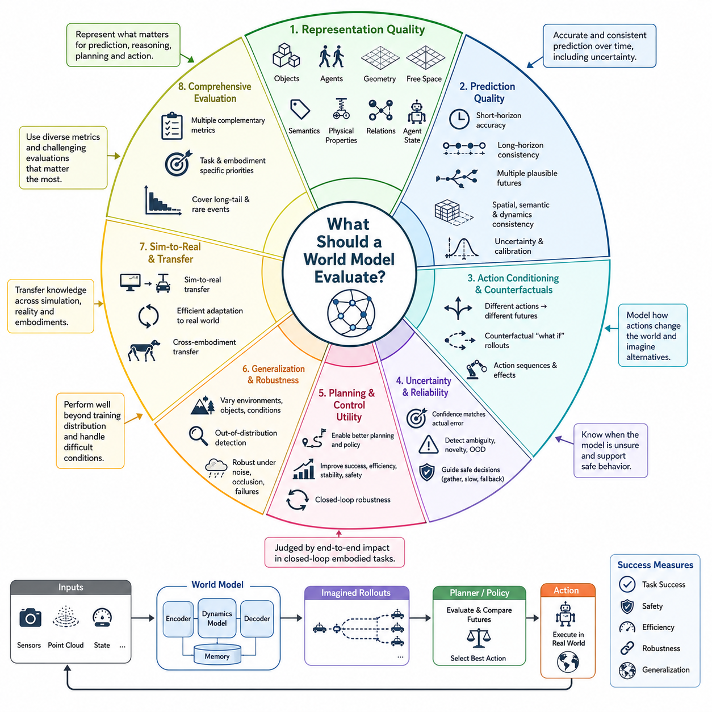
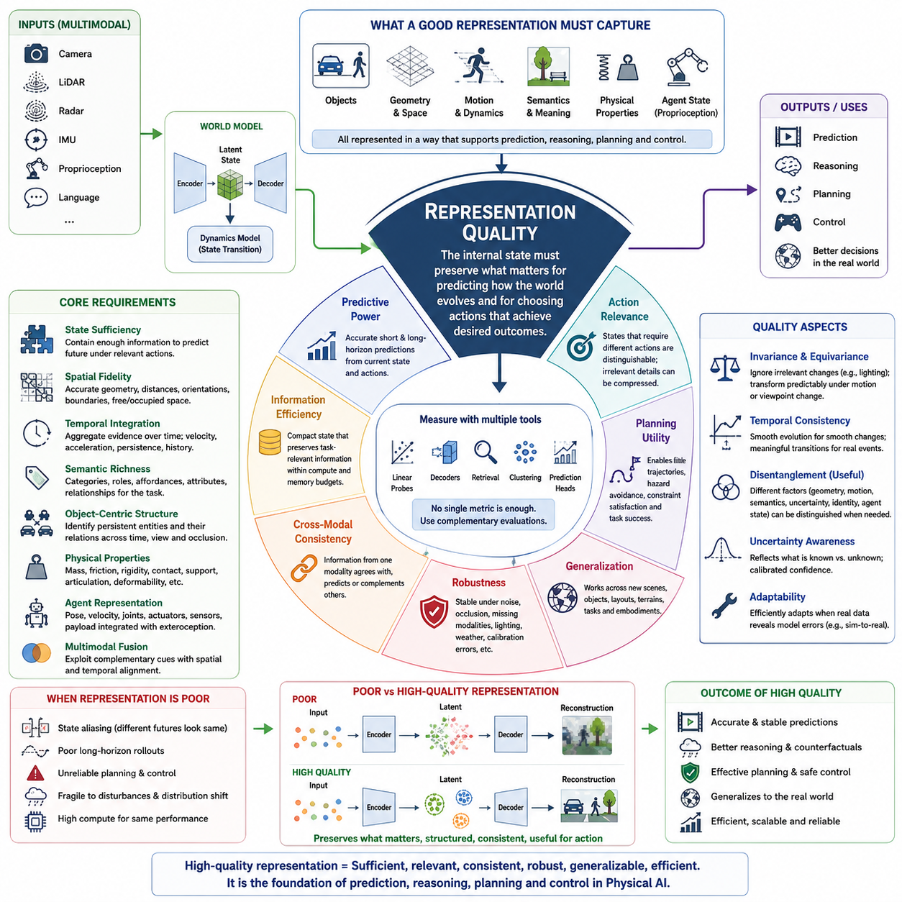
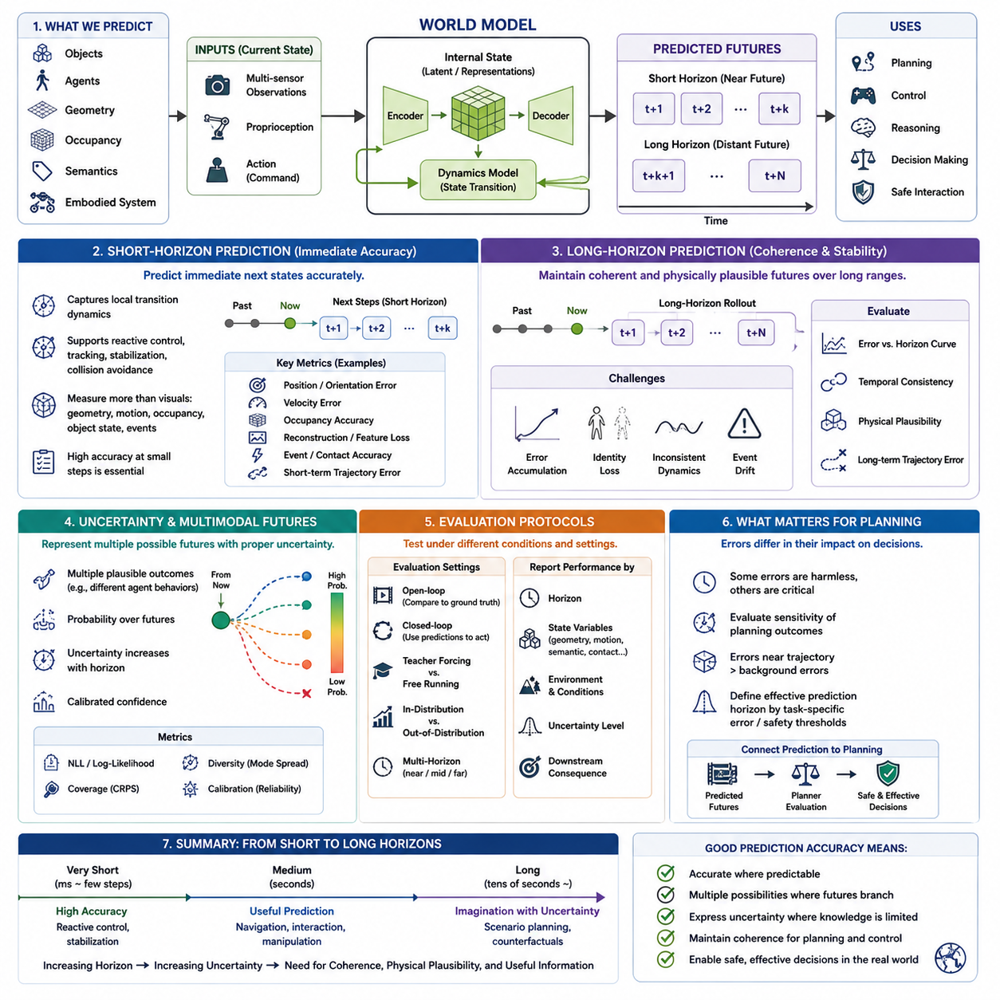
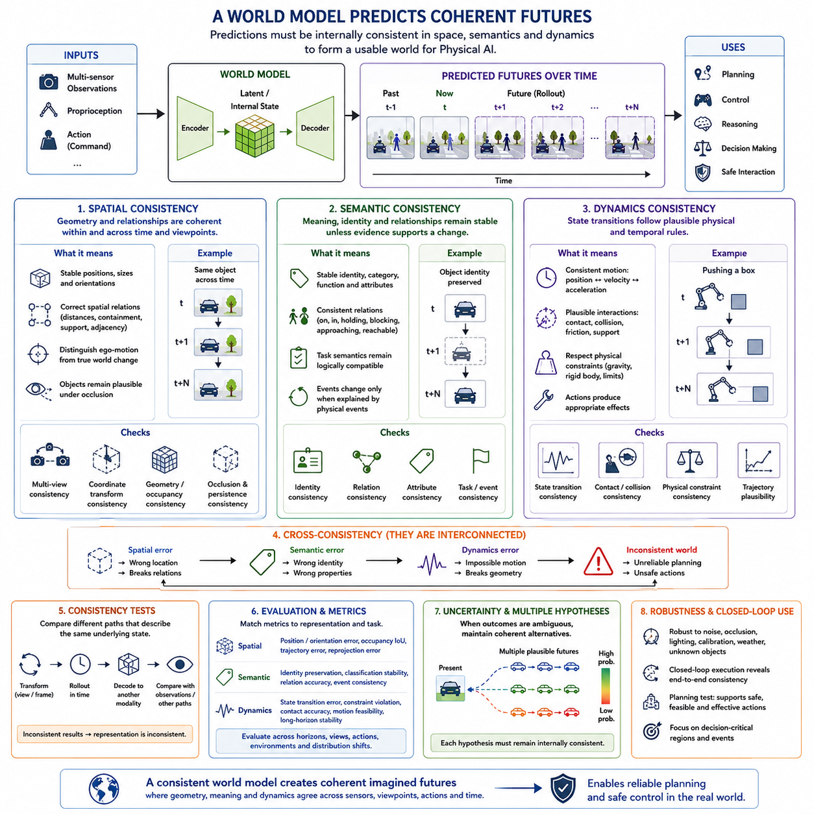
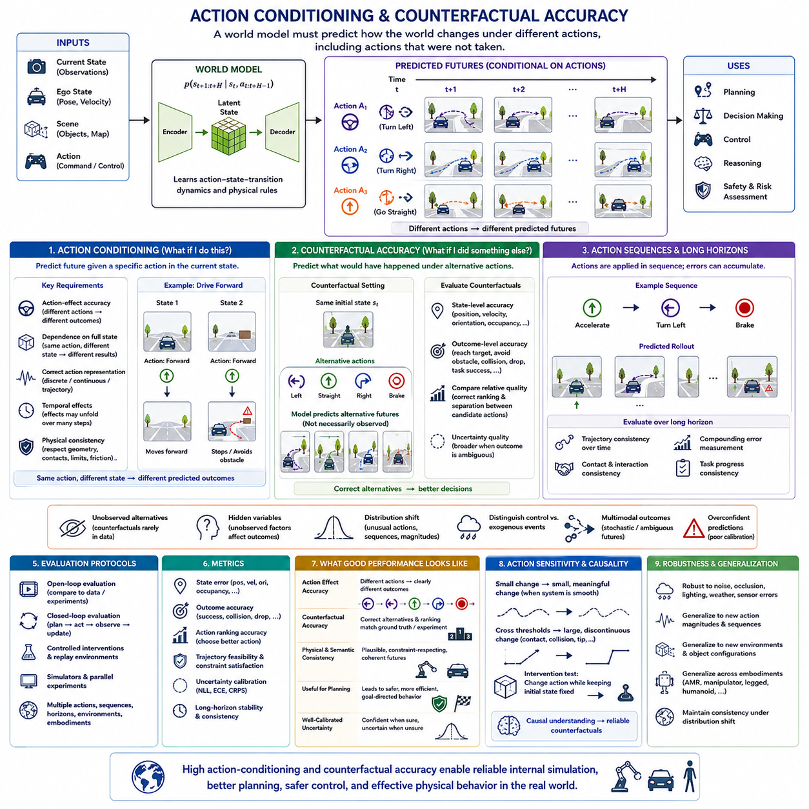
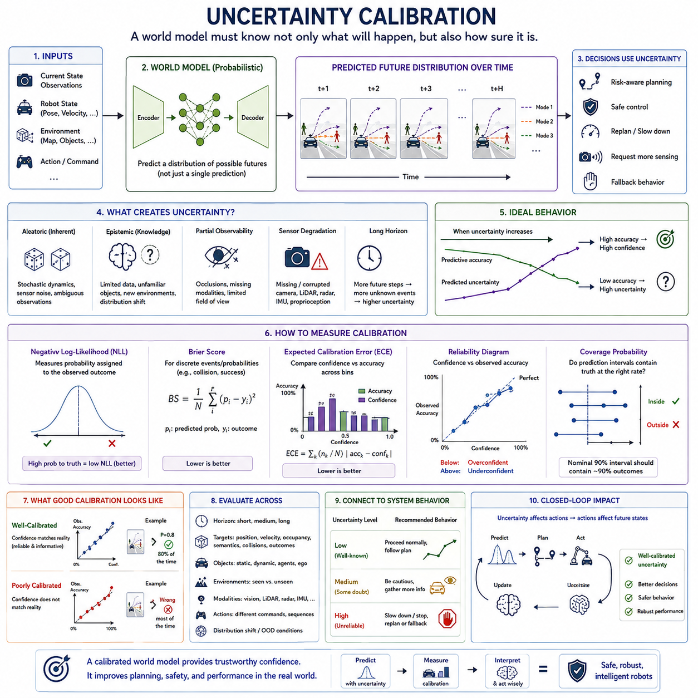
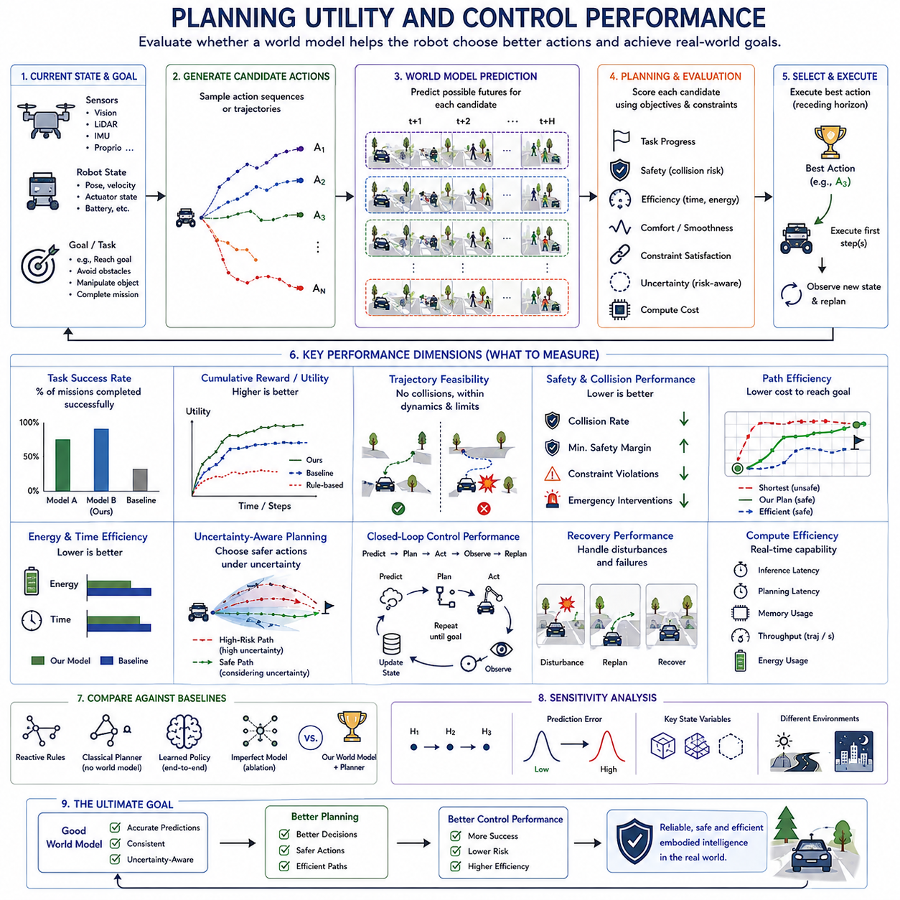
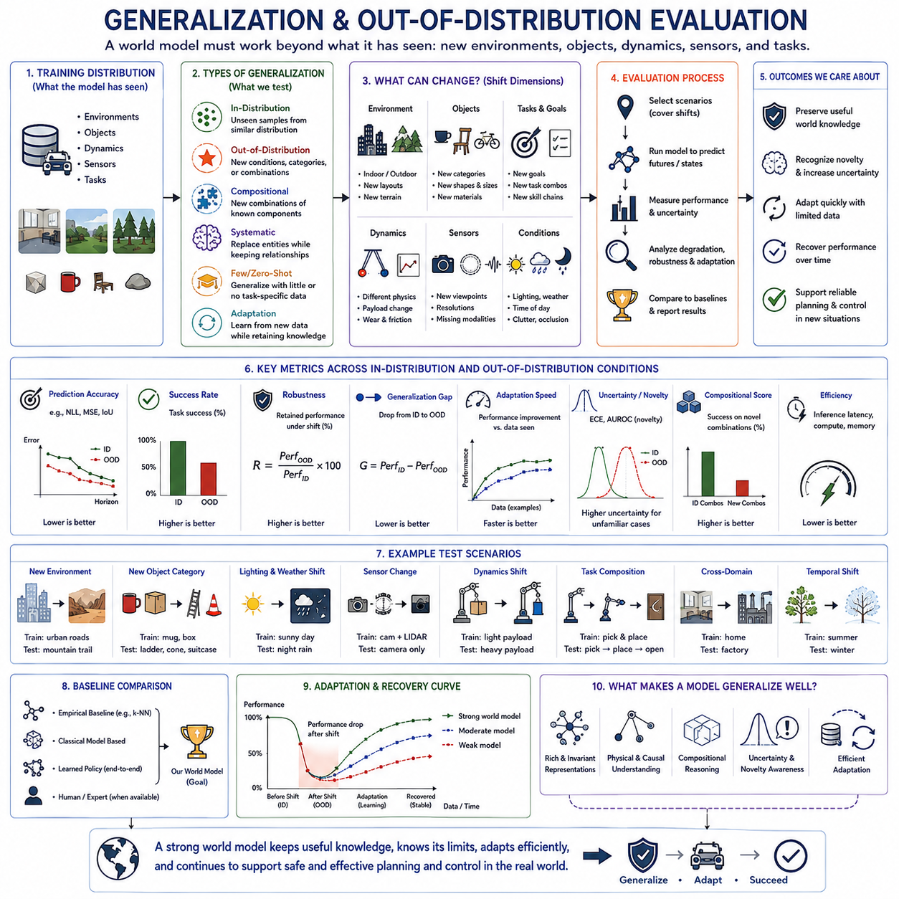
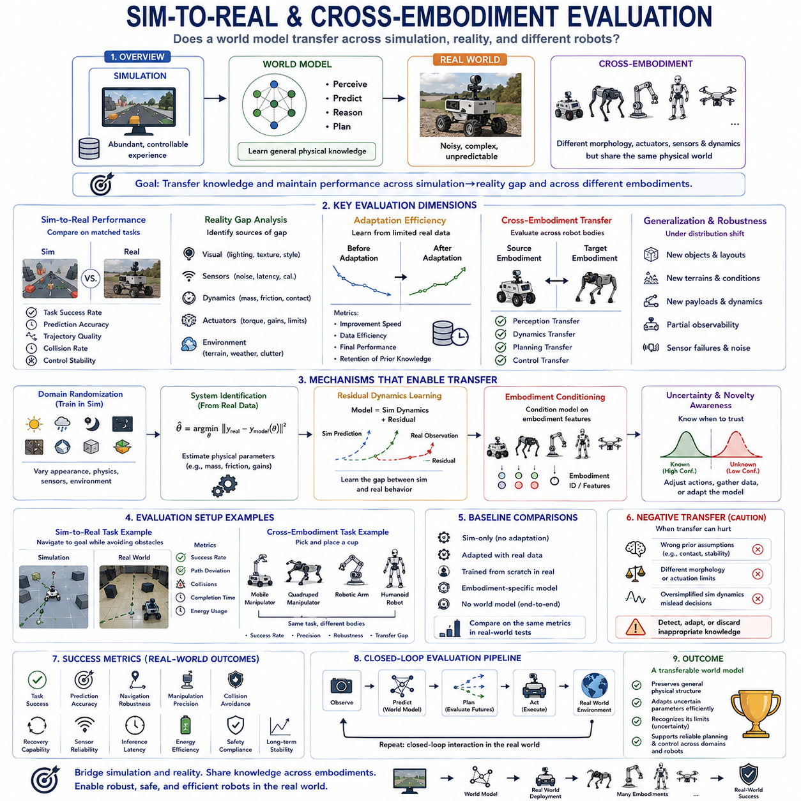
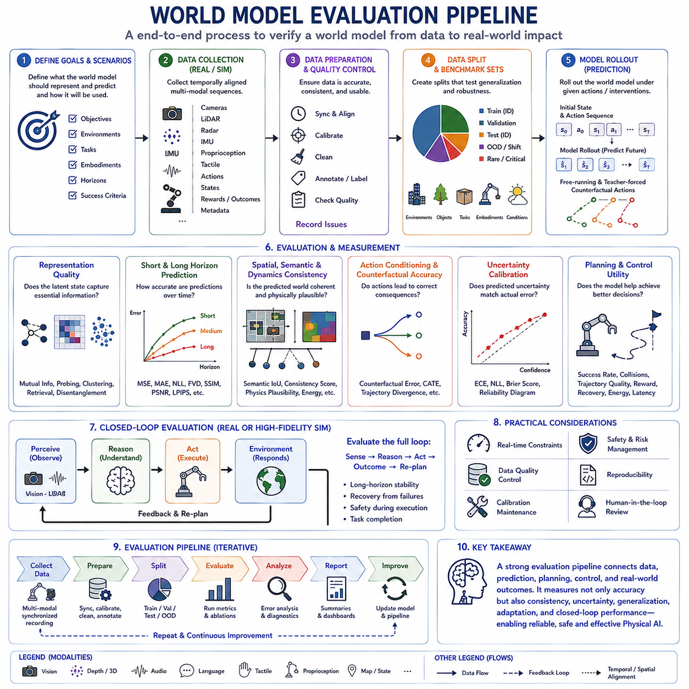

**Volume 07. World Models for Physical AI**


# Chapter 16. Evaluation of World Models

##  

## 16.01. What Should a World Model Evaluate

{width="7.268055555555556in" height="7.268055555555556in"}

Evaluating a world model requires more than measuring whether it can predict the next observation accurately. A useful world model must construct an internal representation that captures the aspects of the environment required for prediction, reasoning, planning, and action. Evaluation should therefore examine whether the model represents relevant physical state and whether that representation supports reliable future behavior.

The first evaluation target is representation quality. A world model should encode information about objects, agents, geometry, free space, motion, physical properties, semantic relationships, and the state of the embodied agent itself. The representation does not need to reconstruct every observable detail, but it should preserve information that is important for understanding how the environment can evolve.

Representation quality must also be evaluated according to task relevance. Two internal states may appear different at the pixel level while being functionally equivalent for navigation or manipulation. Conversely, visually similar scenes may require very different actions because of hidden geometry, friction, velocity, object identity, or interaction constraints. Evaluation must therefore measure whether useful physical distinctions remain accessible.

Prediction accuracy is another fundamental dimension. A world model should estimate how its internal state changes through time, including the evolution of dynamic objects, the agent, and environmental conditions. Short-horizon prediction evaluates immediate transition accuracy, while long-horizon prediction reveals whether small errors accumulate until the imagined future becomes physically or semantically inconsistent.

Long-horizon evaluation should not require one exact future when the environment is inherently uncertain. Multiple futures may be plausible because other agents can choose different actions or because observations provide incomplete information. A strong world model should represent this branching structure rather than averaging incompatible possibilities into an unrealistic prediction. Evaluation should therefore consider distributions of plausible futures.

Spatial consistency measures whether predicted states maintain coherent geometry across locations, viewpoints, sensors, and time. Objects should occupy compatible positions, free space should remain geometrically meaningful, and motion should respect the spatial structure of the environment. For BEV, occupancy, 3D, and multimodal representations, this consistency is essential because planning depends directly on spatial relationships.

Semantic consistency asks whether entities retain meaningful identities, attributes, and relationships as the world evolves. A pedestrian should not arbitrarily become an obstacle category, an open passage should not become inaccessible without evidence, and persistent objects should remain associated across observations. Semantic stability becomes particularly important when language or high-level task context is integrated into the model.

Dynamics consistency evaluates whether predicted changes obey plausible temporal and physical relationships. Velocity, acceleration, contact, collision, friction, support, articulation, and other interactions should evolve coherently. A prediction may look visually convincing while violating the mechanics needed for control. Physical AI therefore requires evaluation criteria that distinguish perceptual realism from dynamically usable prediction.

Action conditioning adds another critical requirement. A physical agent does not merely observe how the world changes; its actions cause some of those changes. Evaluation should determine whether different candidate actions generate appropriately different predicted futures. Steering, braking, grasping, pushing, walking, or manipulating should alter predicted state according to the consequences expected from each action sequence.

Counterfactual accuracy extends action-conditioned evaluation by asking whether the model can reliably answer questions such as what would happen if the agent turned left instead of right, reduced speed, selected another grasp, or avoided contact. Such imagined alternatives may never appear together in recorded data, yet planning depends on comparing them. Counterfactual evaluation therefore tests the model as an internal simulator.

Uncertainty must be evaluated alongside prediction. A model that produces accurate predictions but assigns unjustified confidence can be dangerous when deployed in the physical world. Evaluation should determine whether predicted confidence corresponds to actual error likelihood and whether uncertainty increases appropriately under ambiguous observations, unfamiliar environments, sensor degradation, stochastic dynamics, or long prediction horizons.

Calibration provides a practical way to examine this relationship between confidence and correctness. Predictions assigned similar confidence should exhibit similar empirical reliability. Evaluation should distinguish uncertainty caused by noisy or ambiguous observations from uncertainty caused by limited model knowledge. This distinction can help determine whether the agent should proceed, gather more information, slow down, or invoke a safer fallback behavior.

A world model should ultimately be evaluated by its utility for planning and control. Lower prediction error does not necessarily produce better actions because some errors are irrelevant while small errors near safety boundaries can be critical. Evaluation should therefore measure whether imagined rollouts allow a planner or policy to select trajectories that improve task completion, efficiency, stability, collision avoidance, and constraint satisfaction.

Planning-based evaluation also exposes errors that conventional prediction metrics may hide. A model can achieve good average reconstruction or latent prediction scores while systematically misrepresenting rare obstacles, contact transitions, narrow passages, or rapidly moving agents. These errors may occupy only a small portion of the observation space but dominate real-world risk and therefore deserve disproportionate attention during evaluation.

Generalization is essential because Physical AI systems operate beyond the exact conditions represented in training data. Evaluation should vary environments, layouts, objects, lighting, weather, terrain, payloads, dynamics, sensor configurations, and task combinations. The objective is not merely to test memorization but to determine whether the learned representation captures transferable regularities of the physical world.

Out-of-distribution evaluation should examine both performance degradation and the model\'s awareness of that degradation. Encountering an unfamiliar object, terrain type, embodiment, sensor failure, or interaction regime should not silently produce confident but unreliable predictions. A robust world model should either generalize correctly or expose sufficient uncertainty for downstream planning and safety mechanisms to react appropriately.

For world models intended to bridge simulation and reality, evaluation must measure whether knowledge learned from simulated environments remains useful after deployment. Sim-to-real tests should compare predicted dynamics, representation quality, uncertainty, and planning performance across the domain boundary. Evaluation should also determine how efficiently the model can adapt when real observations reveal systematic errors in simulated assumptions.

Cross-embodiment evaluation becomes important as world models evolve toward foundation-scale Physical AI. A useful shared world representation should preserve transferable environmental knowledge while accommodating differences in robot morphology, sensors, actuators, dynamics, and action spaces. Success is not identical behavior across robots, but the ability to reuse physical knowledge while adapting embodiment-specific predictions and controls.

Evaluation must also consider temporal robustness under closed-loop operation. Predictions influence actions, actions change future observations, and those observations become inputs to subsequent predictions. Small modeling errors can therefore alter the trajectory of the entire system. Closed-loop testing reveals whether a model remains useful after its own decisions begin changing the distribution of states that it encounters.

No single metric can fully characterize world-model quality. Pixel reconstruction, latent similarity, occupancy accuracy, trajectory error, semantic consistency, calibration, physical constraint violation, planning success, and control performance measure different properties. Evaluation should combine complementary metrics rather than reducing world-model capability to one benchmark score, especially when comparing architectures with different internal representations.

The importance of each metric should depend on the intended embodiment and task. Autonomous driving may emphasize occupancy, motion forecasting, collision risk, and multi-agent behavior, while manipulation may emphasize contact dynamics, object state, grasp consequences, and precise geometry. Quadrupeds may require terrain and stability prediction, whereas aerial robots may emphasize six-degree-of-freedom dynamics and environmental disturbances.

Evaluation datasets should consequently include ordinary operation, difficult transitions, rare events, and deliberately challenging conditions. Average-case performance alone can conceal failures at exactly the moments when accurate modeling matters most. Long-tail interactions, partial observability, occlusion, sensor degradation, abrupt motion, changing surfaces, and novel combinations of familiar factors should form explicit parts of a comprehensive evaluation regime.

An effective evaluation framework should finally connect internal model quality with external embodied competence. Representation, prediction, consistency, action conditioning, uncertainty, generalization, sim-to-real transfer, and planning utility are not isolated objectives; together they determine whether the model provides a trustworthy internal basis for intelligent action. This broad perspective defines world-model evaluation as testing useful understanding rather than prediction alone.

월드 모델(World Model)을 평가한다는 것은 단순히 다음 관측값(Observation)을 정확하게 예측할 수 있는지를 측정하는 것보다 훨씬 넓은 의미를 가진다. 유용한 월드 모델(World Model)은 예측(Prediction), 추론(Reasoning), 계획(Planning), 행동(Action)에 필요한 환경의 핵심 요소를 내부 표현(Internal Representation)으로 구성해야 한다. 따라서 평가는 모델이 관련된 물리적 상태(Physical State)를 적절히 표현하고, 그 표현이 신뢰할 수 있는 미래 행동을 지원하는지를 함께 살펴보아야 한다.

첫 번째 평가 대상은 표현 품질(Representation Quality)이다. 월드 모델(World Model)은 객체(Object), 에이전트(Agent), 기하 구조(Geometry), 자유 공간(Free Space), 움직임(Motion), 물리적 속성(Physical Properties), 의미적 관계(Semantic Relationships), 그리고 체화된 에이전트(Embodied Agent) 자체의 상태에 관한 정보를 인코딩(Encode)해야 한다. 모든 관측 세부사항을 완벽하게 복원할 필요는 없지만, 환경이 어떻게 변화할 수 있는지를 이해하는 데 중요한 정보는 보존해야 한다.

표현 품질(Representation Quality)은 또한 작업 관련성(Task Relevance)에 따라 평가되어야 한다. 두 내부 상태(Internal States)가 픽셀 수준(Pixel Level)에서는 서로 다르게 보이더라도 내비게이션(Navigation)이나 조작(Manipulation)에서는 기능적으로 동일할 수 있다. 반대로 시각적으로 유사한 장면도 숨겨진 기하 구조, 마찰(Friction), 속도(Velocity), 객체 정체성(Object Identity), 상호작용 제약(Interaction Constraints)에 따라 전혀 다른 행동이 필요할 수 있다. 따라서 유용한 물리적 차이가 내부 표현에서 유지되는지를 평가해야 한다.

예측 정확도(Prediction Accuracy)는 또 다른 핵심 평가 차원이다. 월드 모델(World Model)은 동적 객체(Dynamic Object), 에이전트, 환경 조건(Environmental Conditions)을 포함하여 내부 상태가 시간에 따라 어떻게 변화하는지를 추정해야 한다. 단기 예측(Short-Horizon Prediction)은 즉각적인 상태 전이(Transition)의 정확성을 평가하고, 장기 예측(Long-Horizon Prediction)은 작은 오류가 누적되어 상상된 미래가 물리적 또는 의미적으로 일관성을 잃는지를 보여준다.

장기 예측 평가(Long-Horizon Evaluation)는 환경 자체가 본질적으로 불확실한 경우 하나의 정확한 미래만을 요구해서는 안 된다. 다른 에이전트가 서로 다른 행동을 선택하거나 관측 정보가 불완전하기 때문에 여러 미래가 동시에 가능할 수 있다. 강력한 월드 모델(World Model)은 서로 양립할 수 없는 가능성을 비현실적인 하나의 평균값으로 만드는 대신 이러한 분기 구조(Branching Structure)를 표현해야 한다. 따라서 평가는 가능한 미래의 분포(Distribution of Plausible Futures)를 고려해야 한다.

공간적 일관성(Spatial Consistency)은 예측된 상태가 위치, 시점(Viewpoint), 센서(Sensor), 시간에 걸쳐 일관된 기하 구조를 유지하는지를 측정한다. 객체는 서로 호환되는 위치를 유지해야 하고, 자유 공간은 기하학적으로 의미가 있어야 하며, 움직임은 환경의 공간 구조를 따라야 한다. 조감도(BEV, Bird\'s-Eye View), 점유(Occupancy), 3차원(3D), 멀티모달(Multimodal) 표현에서는 계획이 공간적 관계에 직접 의존하기 때문에 이러한 일관성이 특히 중요하다.

의미적 일관성(Semantic Consistency)은 환경이 변화하는 동안 개체(Entity)가 의미 있는 정체성, 속성(Attribute), 관계(Relationship)를 유지하는지를 평가한다. 보행자(Pedestrian)가 임의로 다른 장애물 범주로 변해서는 안 되고, 열린 통로가 근거 없이 접근 불가능한 공간으로 바뀌어서도 안 되며, 지속적으로 존재하는 객체는 관측 사이에서 연결되어야 한다. 언어(Language) 또는 고수준 작업 맥락(High-Level Task Context)이 모델에 통합될수록 의미적 안정성(Semantic Stability)은 더욱 중요해진다.

동역학 일관성(Dynamics Consistency)은 예측된 변화가 타당한 시간적·물리적 관계를 따르는지를 평가한다. 속도(Velocity), 가속도(Acceleration), 접촉(Contact), 충돌(Collision), 마찰(Friction), 지지(Support), 관절 운동(Articulation) 등의 상호작용은 일관되게 변화해야 한다. 예측 결과가 시각적으로 그럴듯하더라도 제어(Control)에 필요한 역학을 위반할 수 있다. 따라서 피지컬 AI(Physical AI)는 지각적 사실성(Perceptual Realism)과 동역학적으로 활용 가능한 예측(Dynamically Usable Prediction)을 구분하는 평가 기준을 필요로 한다.

행동 조건화(Action Conditioning)는 또 하나의 핵심 요구사항을 추가한다. 물리적 에이전트(Physical Agent)는 단순히 세계의 변화를 관찰하는 것이 아니라 자신의 행동을 통해 일부 변화를 직접 발생시킨다. 따라서 서로 다른 후보 행동(Candidate Actions)이 적절하게 서로 다른 미래 상태를 생성하는지를 평가해야 한다. 조향(Steering), 제동(Braking), 파지(Grasping), 밀기(Pushing), 보행(Walking), 조작(Manipulation)은 각각의 행동 시퀀스(Action Sequence)에 예상되는 결과에 따라 예측 상태를 변화시켜야 한다.

반사실적 정확도(Counterfactual Accuracy)는 행동 조건화 평가(Action-Conditioned Evaluation)를 확장하여, 에이전트가 오른쪽 대신 왼쪽으로 회전했다면 어떻게 되었을지, 속도를 줄였다면 어떻게 되었을지, 다른 파지 방법을 선택했다면 어떻게 되었을지, 또는 접촉을 피했다면 어떤 결과가 발생했을지를 모델이 신뢰성 있게 예측할 수 있는지를 평가한다. 이러한 대안은 기록된 데이터에 동시에 존재하지 않을 수 있지만 계획(Planning)은 이들을 비교해야 한다. 따라서 반사실적 평가는 월드 모델을 내부 시뮬레이터(Internal Simulator)로서 시험한다.

불확실성(Uncertainty)은 예측 자체와 함께 평가되어야 한다. 정확한 예측을 생성하더라도 근거 없이 높은 신뢰도(Confidence)를 부여하는 모델은 실제 물리 환경에 배치될 경우 위험할 수 있다. 따라서 예측 신뢰도가 실제 오류 가능성과 대응하는지, 그리고 모호한 관측, 익숙하지 않은 환경, 센서 성능 저하(Sensor Degradation), 확률적 동역학(Stochastic Dynamics), 긴 예측 구간에서 불확실성이 적절하게 증가하는지를 평가해야 한다.

보정(Calibration)은 신뢰도와 정확성 사이의 관계를 평가하는 실용적인 방법을 제공한다. 비슷한 신뢰도를 부여받은 예측들은 실제 환경에서도 유사한 수준의 신뢰성을 보여야 한다. 또한 평가는 잡음이 많거나 모호한 관측 때문에 발생하는 불확실성과 모델의 지식 부족으로 발생하는 불확실성을 구분해야 한다. 이러한 구분은 에이전트가 계속 진행할지, 추가 정보를 수집할지, 속도를 줄일지, 또는 보다 안전한 대체 행동(Fallback Behavior)을 실행할지를 결정하는 데 활용될 수 있다.

월드 모델(World Model)은 궁극적으로 계획 및 제어(Planning and Control)에 얼마나 유용한지를 통해 평가되어야 한다. 낮은 예측 오류(Prediction Error)가 반드시 더 좋은 행동으로 이어지는 것은 아니다. 일부 오류는 작업에 거의 영향을 주지 않지만 안전 경계(Safety Boundary) 주변의 작은 오류는 매우 중요할 수 있기 때문이다. 따라서 상상된 롤아웃(Imagined Rollout)이 계획기(Planner)나 정책(Policy)으로 하여금 작업 성공률, 효율성, 안정성, 충돌 회피(Collision Avoidance), 제약조건 만족(Constraint Satisfaction)을 향상시키는 궤적(Trajectory)을 선택하도록 하는지를 평가해야 한다.

계획 기반 평가(Planning-Based Evaluation)는 기존 예측 지표가 숨길 수 있는 오류도 드러낸다. 모델이 평균적인 복원(Reconstruction) 또는 잠재 예측(Latent Prediction) 점수에서는 좋은 성능을 보이면서도 희귀 장애물(Rare Obstacles), 접촉 전이(Contact Transitions), 좁은 통로(Narrow Passages), 빠르게 움직이는 에이전트를 체계적으로 잘못 표현할 수 있다. 이러한 오류는 전체 관측 공간에서 작은 비중을 차지하더라도 실제 환경의 위험을 지배할 수 있으므로 평가에서 더 큰 중요성을 부여해야 한다.

일반화(Generalization)는 피지컬 AI(Physical AI) 시스템이 학습 데이터에 포함된 조건을 넘어 실제 환경에서 동작하기 때문에 필수적이다. 평가는 환경, 배치(Layout), 객체, 조명, 날씨, 지형, 적재 하중(Payload), 동역학, 센서 구성, 작업 조합 등을 변화시켜 수행해야 한다. 목적은 단순한 암기(Memorization)를 시험하는 것이 아니라 학습된 표현이 물리 세계의 전이 가능한 규칙(Transferable Regularities)을 포착하고 있는지를 확인하는 것이다.

분포 외 평가(Out-of-Distribution Evaluation)는 성능 저하뿐 아니라 모델이 그러한 성능 저하를 스스로 인식하는지도 살펴보아야 한다. 익숙하지 않은 객체, 지형 유형, 체화 형태(Embodiment), 센서 고장, 새로운 상호작용 영역을 만났을 때 모델이 자신감은 높지만 신뢰할 수 없는 예측을 조용히 생성해서는 안 된다. 강건한 월드 모델(Robust World Model)은 올바르게 일반화하거나, 그렇지 못할 경우 하위 계획 및 안전 메커니즘이 대응할 수 있을 만큼 충분한 불확실성을 나타내야 한다.

시뮬레이션(Simulation)과 현실(Reality)을 연결하도록 설계된 월드 모델에서는 시뮬레이션 환경에서 학습한 지식이 실제 배치 이후에도 유용하게 유지되는지를 평가해야 한다. 시뮬레이션-현실(Sim-to-Real) 평가는 도메인 경계(Domain Boundary)를 넘어 예측 동역학, 표현 품질, 불확실성, 계획 성능을 비교해야 한다. 또한 실제 관측이 시뮬레이션 가정의 체계적인 오류를 보여줄 때 모델이 얼마나 효율적으로 적응하는지도 평가해야 한다.

교차 체화 평가(Cross-Embodiment Evaluation)는 월드 모델이 파운데이션 규모(Foundation Scale)의 피지컬 AI로 발전하면서 중요해진다. 유용한 공유 세계 표현(Shared World Representation)은 로봇의 형태(Morphology), 센서, 액추에이터(Actuator), 동역학, 행동 공간(Action Space)의 차이를 수용하면서도 전이 가능한 환경 지식을 유지해야 한다. 성공의 기준은 모든 로봇이 동일하게 행동하는 것이 아니라 물리적 지식을 재사용하면서 체화 형태별 예측과 제어에 적응할 수 있는 능력이다.

평가는 폐루프 동작(Closed-Loop Operation)에서의 시간적 강건성(Temporal Robustness)도 고려해야 한다. 예측은 행동에 영향을 주고, 행동은 미래 관측을 변화시키며, 그 관측은 다시 다음 예측의 입력이 된다. 따라서 작은 모델링 오류(Modeling Error)가 전체 시스템의 궤적을 변화시킬 수 있다. 폐루프 시험(Closed-Loop Testing)은 모델 자신의 결정이 이후에 마주치는 상태 분포를 변화시키기 시작한 이후에도 모델이 계속 유용하게 동작하는지를 보여준다.

단일 지표(Single Metric)만으로 월드 모델의 품질을 완전히 설명할 수는 없다. 픽셀 복원(Pixel Reconstruction), 잠재 유사도(Latent Similarity), 점유 정확도(Occupancy Accuracy), 궤적 오류(Trajectory Error), 의미적 일관성, 보정, 물리적 제약 위반(Physical Constraint Violation), 계획 성공률, 제어 성능은 각각 서로 다른 특성을 측정한다. 특히 서로 다른 내부 표현을 사용하는 아키텍처(Architecture)를 비교할 때는 월드 모델의 능력을 하나의 벤치마크 점수로 축소하기보다 상호보완적인 여러 지표를 결합해야 한다.

각 지표의 중요성은 목표로 하는 체화 형태(Embodiment)와 작업(Task)에 따라 달라져야 한다. 자율주행(Autonomous Driving)은 점유, 움직임 예측, 충돌 위험, 다중 에이전트 행동(Multi-Agent Behavior)을 강조할 수 있고, 조작은 접촉 동역학, 객체 상태, 파지 결과, 정밀한 기하 구조를 강조할 수 있다. 4족 보행 로봇(Quadruped)은 지형 및 안정성 예측이 중요하며, 비행 로봇(Aerial Robot)은 6자유도 동역학(Six-Degree-of-Freedom Dynamics)과 환경 외란(Environmental Disturbance)이 중요할 수 있다.

따라서 평가 데이터셋(Evaluation Dataset)은 일반적인 동작뿐 아니라 어려운 상태 전이, 희귀 사건(Rare Events), 의도적으로 구성된 도전적 조건을 포함해야 한다. 평균적인 상황에서의 성능만 평가하면 정확한 모델링이 가장 필요한 순간의 실패를 감출 수 있다. 롱테일 상호작용(Long-Tail Interaction), 부분 관측 가능성(Partial Observability), 가림(Occlusion), 센서 성능 저하, 급격한 움직임, 변화하는 표면, 익숙한 요소들의 새로운 조합은 포괄적인 평가 체계에 명시적으로 포함되어야 한다.

효과적인 평가 프레임워크(Evaluation Framework)는 최종적으로 내부 모델 품질(Internal Model Quality)을 외부의 체화된 능력(Embodied Competence)과 연결해야 한다. 표현, 예측, 일관성, 행동 조건화, 불확실성, 일반화, 시뮬레이션-현실 전이(Sim-to-Real Transfer), 계획 유용성(Planning Utility)은 서로 독립된 목표가 아니다. 이 요소들이 결합되어야 지능적 행동을 위한 신뢰할 수 있는 내부 기반을 제공할 수 있으며, 이러한 관점에서 월드 모델 평가는 단순한 예측 능력이 아니라 유용한 세계 이해(Useful World Understanding)를 검증하는 과정으로 정의될 수 있다.

:::

##  

## 16.02. Representation Quality

{width="7.268055555555556in" height="7.268055555555556in"}

Representation quality determines whether a world model has learned an internal state that captures the information needed to understand and interact with the physical environment. A useful representation should not merely compress sensory observations. It should organize information so that relevant objects, geometry, motion, semantics, physical properties, and agent states remain accessible for prediction, reasoning, planning, and control.

In Physical AI, representation quality must be judged by usefulness rather than visual fidelity alone. A representation may discard textures, colors, or background details that have little influence on future actions while preserving obstacle boundaries, traversable space, object motion, contact conditions, and task-relevant semantics. Good representations therefore perform selective abstraction, retaining information according to its importance for embodied behavior.

A fundamental requirement is state sufficiency. The internal representation should contain enough information about the current environment to predict future states under relevant actions. If important variables such as velocity, object pose, terrain condition, contact state, or agent configuration are omitted, two apparently similar representations may evolve differently. Such state aliasing limits both prediction accuracy and planning reliability.

Spatial information is particularly important because physical agents operate through geometric relationships. Representation quality should therefore evaluate whether positions, distances, orientations, boundaries, free space, occupied regions, and object relationships are preserved accurately enough for downstream tasks. BEV, occupancy, voxel, point-based, and latent representations may encode geometry differently, but each should support meaningful spatial reasoning.

Temporal information must also be represented because a single observation rarely provides a complete physical state. Motion direction, velocity, acceleration, object persistence, and interaction history often require information accumulated across multiple observations. A high-quality representation should integrate temporal evidence into a state that distinguishes static appearance from dynamic behavior and supports predictions over both short and long horizons.

Semantic quality measures whether the representation captures what entities are and how they relate to the task. Objects may need categories, functional roles, affordances, attributes, and relationships rather than simple visual identities. For a robot, recognizing a surface as a table is useful, but understanding that an object can be placed on it or that an opening can be traversed may provide substantially greater value for planning.

Object-centric structure can improve representation quality by separating persistent entities from changing observations. Instead of encoding an entire scene as an undifferentiated feature tensor, a model may represent objects, agents, surfaces, regions, and their relationships explicitly or implicitly. Evaluation should determine whether entities remain identifiable through motion, occlusion, viewpoint changes, interactions, and temporary disappearance from sensor observations.

Physical properties represent another dimension that conventional perception metrics may overlook. Mass, friction, rigidity, deformability, support, articulation, contact state, and other properties can strongly influence future transitions without being directly visible. A world model intended for physical reasoning should encode such properties when they affect prediction or control, either explicitly as variables or implicitly within a learned latent representation.

The agent itself must be represented as part of the world state. Position, orientation, velocity, joint configuration, actuator condition, sensor state, payload, and other proprioceptive information influence how actions change the environment. Representation quality therefore includes the degree to which exteroceptive observations and proprioception are integrated into a coherent agent-centered or world-centered internal state.

Multimodal world models introduce additional requirements. Camera, LiDAR, radar, IMU, proprioception, language, and other modalities observe different aspects of the same physical environment. A strong representation should exploit complementary information while maintaining spatial and temporal alignment. Evaluation should examine whether the shared representation becomes more informative rather than merely concatenating unrelated modality-specific features.

Cross-modal consistency is especially valuable when individual sensors are incomplete or degraded. Geometry inferred from cameras should remain compatible with LiDAR observations, motion inferred from visual sequences should agree with inertial information, and semantic context should not contradict physical evidence. Representation quality can therefore be evaluated by testing whether information from one modality predicts, explains, or complements information from another.

Latent representations present a special evaluation challenge because their dimensions may have no direct human interpretation. Reconstruction quality alone is insufficient because a latent state can reconstruct observations while failing to preserve variables needed for action. Evaluation should instead test whether relevant properties can be decoded, predicted, compared, or exploited by downstream planners and policies without requiring unnecessarily complex transformations.

Linear probes, lightweight prediction heads, nearest-neighbor retrieval, clustering, and task-specific decoders can provide practical measurements of latent representation quality. If important state variables can be recovered using simple mappings, the latent space may contain well-organized task-relevant structure. However, probe performance should be interpreted carefully because powerful probes can compensate for weaknesses in the underlying representation.

Representation quality also includes invariance and equivariance. Some changes in observation should not significantly alter the internal state, while others should transform it predictably. Lighting variation or sensor noise may ideally leave geometric understanding stable, whereas translation, rotation, object motion, or changes in agent pose should produce structured changes. Evaluation should distinguish desirable invariance from harmful loss of physically relevant information.

Temporal consistency provides another important criterion. Representations of the same persistent object or region should evolve smoothly when the physical state changes smoothly, while genuine events should produce meaningful transitions. Excessive latent instability makes prediction difficult, whereas excessive smoothness can hide important events such as contact, collision, grasp completion, slipping, or sudden changes in another agent\'s behavior.

Disentanglement can be useful when different factors of the physical world must support independent reasoning. Geometry, semantics, motion, uncertainty, object identity, and agent state need not occupy perfectly separated dimensions, but the representation should allow downstream components to distinguish them when necessary. Evaluation can examine whether changes in one physical factor produce understandable and appropriately localized changes in the internal state.

Compression efficiency should be considered together with information preservation. World models often operate under limited memory, bandwidth, latency, and compute budgets, especially on embodied edge systems. The best representation is therefore not necessarily the largest one. A compact latent state that preserves task-relevant information can be superior to a high-dimensional representation that retains redundant sensory details but increases computational cost.

Robustness tests determine whether representation quality survives realistic disturbances. Sensor noise, occlusion, missing modalities, lighting changes, weather, viewpoint variation, calibration errors, unfamiliar objects, and partial observations should not cause catastrophic changes in the internal state. When information genuinely becomes unavailable, the representation should reflect uncertainty rather than inventing an unjustifiably confident interpretation.

Generalization tests whether learned representations capture reusable structure instead of memorizing training environments. A representation should remain useful across new scenes, objects, layouts, terrain conditions, tasks, and potentially different robot embodiments. Strong performance under distribution shift suggests that the model has learned more general physical regularities rather than relying primarily on correlations specific to its training dataset.

Action relevance provides one of the strongest tests of representation quality. If two states require different actions, the representation should preserve the distinctions necessary to separate them. Conversely, observational differences that do not affect feasible actions may be compressed away. This connects representation learning directly to affordances, controllability, reachability, collision constraints, and other concepts that determine what an embodied agent can actually do.

Prediction provides another operational evaluation. A representation is valuable when future latent or physical states can be predicted accurately from the current representation and candidate actions. If prediction requires reconstructing large amounts of missing information, the representation may be inadequate. Long-horizon rollout stability is especially informative because weak state representations often reveal themselves through rapidly accumulating prediction errors.

Planning utility ultimately connects representation quality with embodied intelligence. A representation that achieves excellent reconstruction or semantic scores but produces poor trajectories is insufficient for a world model used in Physical AI. Evaluation should measure whether planners operating on the representation can identify feasible actions, anticipate hazards, compare alternative futures, satisfy constraints, and complete tasks efficiently and safely.

No single representation metric is sufficient across all world models. Explicit BEV or occupancy models can be evaluated using geometric and semantic ground truth, while latent predictive architectures may require probes, prediction tests, consistency measures, and downstream task evaluation. Representation quality should therefore be assessed through multiple complementary measurements matched to the architecture, embodiment, environment, and intended use.

The most meaningful definition of representation quality is consequently functional: the internal state should preserve what matters for predicting how the physical world evolves and for selecting actions that achieve desired outcomes. High-quality representations combine sufficient physical information, abstraction, temporal coherence, multimodal consistency, robustness, generalization, and computational efficiency, forming the foundation upon which prediction, reasoning, planning, and control can operate reliably.

표현 품질(Representation Quality)은 월드 모델(World Model)이 물리적 환경(Physical Environment)을 이해하고 상호작용하는 데 필요한 정보를 포착하는 내부 상태(Internal State)를 학습했는지를 결정한다. 유용한 표현은 단순히 센서 관측(Sensory Observation)을 압축하는 것에 그쳐서는 안 된다. 관련 객체(Object), 기하 구조(Geometry), 움직임(Motion), 의미 정보(Semantics), 물리적 속성(Physical Properties), 에이전트 상태(Agent State)를 예측(Prediction), 추론(Reasoning), 계획(Planning), 제어(Control)에 활용할 수 있도록 구조화해야 한다.

피지컬 AI(Physical AI)에서 표현 품질은 시각적 충실도(Visual Fidelity)만이 아니라 실제 활용성(Usefulness)을 기준으로 평가해야 한다. 표현은 미래 행동에 거의 영향을 주지 않는 텍스처(Texture), 색상, 배경 세부정보를 제거하면서 장애물 경계, 주행 가능 공간(Traversable Space), 객체 움직임, 접촉 조건(Contact Conditions), 작업 관련 의미 정보(Task-Relevant Semantics)를 보존할 수 있다. 따라서 좋은 표현은 체화 행동(Embodied Behavior)에 대한 중요도에 따라 정보를 선택적으로 추상화(Selective Abstraction)한다.

기본적인 요구사항은 상태 충분성(State Sufficiency)이다. 내부 표현에는 관련 행동(Action)이 주어졌을 때 미래 상태를 예측하는 데 충분한 현재 환경 정보가 포함되어야 한다. 속도(Velocity), 객체 자세(Object Pose), 지형 상태(Terrain Condition), 접촉 상태(Contact State), 에이전트 구성(Agent Configuration)과 같은 중요한 변수가 누락되면 겉으로 유사한 두 표현이 서로 다른 방식으로 변화할 수 있다. 이러한 상태 혼동(State Aliasing)은 예측 정확도와 계획 신뢰성을 모두 제한한다.

물리적 에이전트(Physical Agent)는 기하학적 관계(Geometric Relationships)를 기반으로 동작하기 때문에 공간 정보(Spatial Information)는 특히 중요하다. 따라서 표현 품질은 위치, 거리, 방향(Orientation), 경계, 자유 공간(Free Space), 점유 영역(Occupied Regions), 객체 간 관계가 하위 작업(Downstream Task)에 충분할 정도로 정확하게 보존되는지를 평가해야 한다. 조감도(BEV), 점유(Occupancy), 복셀(Voxel), 포인트 기반(Point-Based), 잠재 표현(Latent Representation)은 서로 다른 방식으로 기하 정보를 인코딩하지만 모두 의미 있는 공간 추론(Spatial Reasoning)을 지원해야 한다.

단일 관측만으로 완전한 물리적 상태를 파악하기 어려운 경우가 많기 때문에 시간 정보(Temporal Information)도 표현되어야 한다. 움직임 방향, 속도, 가속도(Acceleration), 객체 지속성(Object Persistence), 상호작용 이력(Interaction History)은 여러 관측에서 누적된 정보를 필요로 한다. 높은 품질의 표현은 이러한 시간적 증거를 하나의 상태로 통합하여 정적인 외형과 동적 행동을 구별하고 단기 및 장기 예측을 모두 지원해야 한다.

의미적 품질(Semantic Quality)은 표현이 개체(Entity)의 정체와 작업과의 관계를 얼마나 잘 포착하는지를 측정한다. 객체는 단순한 시각적 정체성뿐 아니라 범주(Category), 기능적 역할(Functional Role), 어포던스(Affordance), 속성(Attribute), 관계(Relationship)를 필요로 할 수 있다. 로봇이 어떤 표면을 테이블로 인식하는 것도 유용하지만, 물체를 그 위에 놓을 수 있거나 특정 개구부를 통과할 수 있다는 사실을 이해하는 것은 계획에 훨씬 더 큰 가치를 제공할 수 있다.

객체 중심 구조(Object-Centric Structure)는 지속적으로 존재하는 개체와 변화하는 관측을 분리함으로써 표현 품질을 향상시킬 수 있다. 전체 장면을 구분되지 않은 하나의 특징 텐서(Feature Tensor)로 인코딩하는 대신 모델은 객체, 에이전트, 표면, 영역과 그 관계를 명시적 또는 암묵적으로 표현할 수 있다. 평가는 움직임, 가림(Occlusion), 시점 변화(Viewpoint Change), 상호작용, 센서 관측에서의 일시적인 소실 상황에서도 개체가 계속 식별 가능한지를 확인해야 한다.

물리적 속성(Physical Properties)은 기존 지각 평가 지표(Perception Metrics)가 간과할 수 있는 또 다른 차원이다. 질량(Mass), 마찰(Friction), 강성(Rigidity), 변형 가능성(Deformability), 지지(Support), 관절 특성(Articulation), 접촉 상태와 같은 속성은 직접 관측되지 않더라도 미래 상태 전이에 큰 영향을 미칠 수 있다. 물리적 추론(Physical Reasoning)을 위한 월드 모델은 이러한 속성이 예측이나 제어에 영향을 준다면 명시적인 변수 또는 학습된 잠재 표현 내부에 이를 인코딩해야 한다.

에이전트 자체도 세계 상태(World State)의 일부로 표현되어야 한다. 위치, 방향, 속도, 관절 구성(Joint Configuration), 액추에이터 상태(Actuator Condition), 센서 상태, 적재 하중(Payload), 기타 고유수용성 정보(Proprioceptive Information)는 행동이 환경을 변화시키는 방식에 영향을 준다. 따라서 표현 품질에는 외수용성 관측(Exteroceptive Observation)과 고유수용감각(Proprioception)이 일관된 에이전트 중심(Agent-Centered) 또는 세계 중심(World-Centered)의 내부 상태로 통합되는 정도도 포함된다.

멀티모달 월드 모델(Multimodal World Model)은 추가적인 요구사항을 가진다. 카메라(Camera), 라이다(LiDAR), 레이더(Radar), 관성측정장치(IMU), 고유수용감각, 언어(Language) 등의 모달리티(Modality)는 동일한 물리 환경의 서로 다른 측면을 관측한다. 강력한 표현은 상호보완적인 정보를 활용하면서 공간적·시간적 정렬(Spatial and Temporal Alignment)을 유지해야 한다. 평가는 공유 표현(Shared Representation)이 단순히 서로 관련 없는 모달리티별 특징을 연결하는 것이 아니라 실제로 더 풍부한 정보를 갖게 되는지를 확인해야 한다.

교차 모달 일관성(Cross-Modal Consistency)은 개별 센서 정보가 불완전하거나 성능이 저하될 때 특히 중요하다. 카메라에서 추론된 기하 구조는 라이다 관측과 일치해야 하고, 영상 시퀀스에서 추론된 움직임은 관성 정보(Inertial Information)와 부합해야 하며, 의미적 맥락(Semantic Context)은 물리적 증거와 모순되어서는 안 된다. 따라서 하나의 모달리티 정보가 다른 모달리티 정보를 예측하거나 설명하고 보완할 수 있는지를 시험하여 표현 품질을 평가할 수 있다.

잠재 표현(Latent Representation)은 각 차원에 직접적인 인간 해석이 존재하지 않을 수 있기 때문에 특별한 평가 문제가 발생한다. 잠재 상태가 관측을 복원하면서도 행동에 필요한 변수를 보존하지 못할 수 있으므로 복원 품질(Reconstruction Quality)만으로는 충분하지 않다. 대신 관련 속성을 디코딩(Decode), 예측, 비교하거나 하위 계획기(Planner)와 정책(Policy)이 지나치게 복잡한 변환 없이 활용할 수 있는지를 평가해야 한다.

선형 프로브(Linear Probe), 경량 예측 헤드(Lightweight Prediction Head), 최근접 이웃 검색(Nearest-Neighbor Retrieval), 군집화(Clustering), 작업별 디코더(Task-Specific Decoder)는 잠재 표현 품질을 실용적으로 측정하는 방법을 제공한다. 중요한 상태 변수를 간단한 매핑(Mapping)을 통해 복원할 수 있다면 잠재 공간(Latent Space)이 작업 관련 구조를 잘 조직하고 있을 가능성이 있다. 그러나 강력한 프로브가 기본 표현의 약점을 보완할 수 있기 때문에 프로브 성능은 신중하게 해석해야 한다.

표현 품질에는 불변성(Invariance)과 등변성(Equivariance)도 포함된다. 관측의 일부 변화는 내부 상태를 크게 변화시키지 않아야 하지만, 다른 변화는 예측 가능한 방식으로 내부 표현을 변화시켜야 한다. 조명 변화나 센서 노이즈는 기하학적 이해를 안정적으로 유지하는 것이 바람직한 반면, 이동(Translation), 회전(Rotation), 객체 움직임, 에이전트 자세 변화는 구조적인 변화를 만들어야 한다. 평가는 바람직한 불변성과 물리적으로 중요한 정보의 손실을 구별해야 한다.

시간적 일관성(Temporal Consistency)은 또 하나의 중요한 기준이다. 동일하게 지속되는 객체나 영역의 표현은 물리 상태가 부드럽게 변화할 때 함께 연속적으로 변화해야 하며, 실제 사건이 발생하면 의미 있는 상태 전이가 나타나야 한다. 지나친 잠재 상태 불안정성(Latent Instability)은 예측을 어렵게 하지만, 지나친 평활화(Smoothing)는 접촉, 충돌, 파지 완료, 미끄러짐(Slipping), 다른 에이전트의 갑작스러운 행동 변화와 같은 중요한 사건을 숨길 수 있다.

분리 표현(Disentanglement)은 물리 세계의 서로 다른 요소에 대해 독립적인 추론이 필요할 때 유용할 수 있다. 기하 구조, 의미 정보, 움직임, 불확실성(Uncertainty), 객체 정체성, 에이전트 상태가 반드시 완전히 분리된 차원에 존재할 필요는 없지만, 필요한 경우 하위 구성요소가 이들을 구별할 수 있어야 한다. 평가는 하나의 물리적 요소 변화가 내부 상태에서 이해 가능하고 적절하게 국소화된 변화를 만드는지를 확인할 수 있다.

압축 효율성(Compression Efficiency)은 정보 보존(Information Preservation)과 함께 고려해야 한다. 월드 모델은 특히 체화된 엣지 시스템(Embodied Edge System)에서 제한된 메모리, 대역폭(Bandwidth), 지연시간(Latency), 연산 자원(Compute Budget)으로 동작하는 경우가 많다. 따라서 가장 좋은 표현이 반드시 가장 큰 표현인 것은 아니다. 작업 관련 정보를 보존하는 압축된 잠재 상태는 중복된 센서 정보를 유지하면서 계산 비용을 증가시키는 고차원 표현보다 우수할 수 있다.

강건성 시험(Robustness Test)은 현실적인 교란(Disturbance)에서도 표현 품질이 유지되는지를 평가한다. 센서 노이즈, 가림, 모달리티 누락(Missing Modality), 조명 변화, 날씨, 시점 변화, 보정 오류(Calibration Error), 익숙하지 않은 객체, 부분 관측(Partial Observation)이 내부 상태에 치명적인 변화를 일으켜서는 안 된다. 정보가 실제로 사용할 수 없게 된 경우에는 근거 없이 확신하는 해석을 만들어내는 대신 표현 자체가 불확실성을 반영해야 한다.

일반화(Generalization)는 학습된 표현이 훈련 환경을 암기하는 대신 재사용 가능한 구조를 포착하는지를 시험한다. 표현은 새로운 장면, 객체, 배치(Layout), 지형 조건, 작업, 그리고 잠재적으로 서로 다른 로봇 체화 형태(Robot Embodiment)에서도 유용성을 유지해야 한다. 분포 변화(Distribution Shift) 상황에서 강력한 성능을 보인다면 모델이 훈련 데이터셋에 특화된 상관관계보다 더 일반적인 물리적 규칙(Physical Regularities)을 학습했음을 의미한다.

행동 관련성(Action Relevance)은 표현 품질을 평가하는 가장 강력한 방법 중 하나이다. 서로 다른 행동이 필요한 두 상태라면 표현은 이들을 구분하는 데 필요한 차이를 보존해야 한다. 반대로 실행 가능한 행동에 영향을 주지 않는 관측 차이는 압축하여 제거할 수 있다. 이는 표현 학습(Representation Learning)을 어포던스, 제어 가능성(Controllability), 도달 가능성(Reachability), 충돌 제약(Collision Constraints) 등 체화된 에이전트가 실제로 무엇을 할 수 있는지를 결정하는 개념과 직접 연결한다.

예측(Prediction)은 또 다른 실질적인 평가 방법을 제공한다. 현재 표현과 후보 행동(Candidate Action)으로부터 미래의 잠재 상태 또는 물리 상태를 정확하게 예측할 수 있을 때 그 표현은 가치가 있다. 예측 과정에서 누락된 정보를 대량으로 다시 복원해야 한다면 해당 표현은 충분하지 않을 수 있다. 장기 롤아웃 안정성(Long-Horizon Rollout Stability)은 약한 상태 표현이 빠르게 누적되는 예측 오류를 통해 드러나는 경우가 많기 때문에 특히 중요한 평가 요소이다.

계획 유용성(Planning Utility)은 궁극적으로 표현 품질을 체화 지능(Embodied Intelligence)과 연결한다. 뛰어난 복원 점수나 의미적 평가 점수를 얻더라도 좋지 않은 궤적(Trajectory)을 생성한다면 피지컬 AI에 사용되는 월드 모델의 표현으로는 충분하지 않다. 평가는 표현을 사용하는 계획기가 실행 가능한 행동을 식별하고, 위험을 예측하며, 대안적인 미래를 비교하고, 제약조건을 만족시키면서 작업을 효율적이고 안전하게 완료할 수 있는지를 측정해야 한다.

모든 월드 모델에 적용할 수 있는 단일 표현 지표(Representation Metric)는 존재하지 않는다. 명시적 조감도(BEV) 또는 점유 모델(Occupancy Model)은 기하학적·의미적 정답 데이터(Ground Truth)를 이용해 평가할 수 있지만, 잠재 예측 아키텍처(Latent Predictive Architecture)는 프로브, 예측 시험, 일관성 측정, 하위 작업 평가가 필요할 수 있다. 따라서 표현 품질은 아키텍처, 체화 형태, 환경, 목표 용도에 맞는 여러 상호보완적 측정 방법을 통해 평가해야 한다.

결국 표현 품질(Representation Quality)의 가장 의미 있는 정의는 기능적(Functional)이다. 내부 상태는 물리 세계가 어떻게 변화할지를 예측하고 원하는 결과를 달성할 행동을 선택하는 데 중요한 정보를 보존해야 한다. 높은 품질의 표현은 충분한 물리 정보, 추상화(Abstraction), 시간적 일관성, 멀티모달 일관성, 강건성, 일반화, 계산 효율성(Computational Efficiency)을 결합하며, 이를 통해 예측, 추론, 계획, 제어가 신뢰성 있게 작동할 수 있는 기반을 형성한다.

##  

## 16.03. Short and Long Horizon Prediction Accuracy

{width="7.268055555555556in" height="7.268055555555556in"}

Prediction accuracy is a central measure of whether a world model has learned useful dynamics rather than merely a compact description of the present. For Physical AI, prediction should estimate how objects, agents, geometry, occupancy, semantics, and the embodied system itself evolve through time. Evaluation must therefore examine accuracy across multiple horizons rather than relying only on one-step prediction.

Short-horizon prediction evaluates the model\'s ability to estimate states immediately following the current state. These predictions may span milliseconds, control cycles, frames, or several near-future steps depending on the embodiment. High short-horizon accuracy indicates that the model captures local transition dynamics sufficiently well to support reactive control, collision avoidance, tracking, stabilization, and model predictive control.

Short-horizon evaluation should measure more than visual similarity between predicted and observed frames. A prediction can appear realistic while placing an obstacle slightly incorrectly, estimating velocity poorly, or missing an important contact transition. Physical AI requires metrics sensitive to geometry, motion, occupancy, object state, semantic events, and other variables whose errors can directly affect subsequent actions.

Long-horizon prediction evaluates whether the world model can maintain coherent imagined futures over extended sequences of state transitions. This is substantially more difficult because predictions become inputs to subsequent predictions, allowing small errors to accumulate. Errors in position, velocity, object identity, interaction state, or latent variables can compound until the predicted trajectory diverges significantly from the actual evolution of the environment.

Error accumulation is therefore one of the most important properties to measure. A model may achieve excellent one-step accuracy while becoming unreliable after repeated rollout. Evaluation should examine how prediction error grows as the horizon increases and whether degradation is gradual or catastrophic. The resulting error-versus-horizon curve often reveals limitations that cannot be observed from a single average prediction score.

Long-horizon quality also requires temporal consistency. Predicted objects should maintain identity and physically plausible motion rather than appearing, disappearing, or changing properties without cause. Persistent geometry should remain stable, while dynamic elements should evolve continuously unless an actual event produces a discontinuity. Temporal coherence is especially important when imagined trajectories are used directly by planners.

Prediction horizons should be interpreted according to the dynamics of the task rather than through a universal number of frames or seconds. Stabilizing a legged robot may require accurate predictions over very short intervals, while navigation may require several seconds of anticipation. Manipulation may need precise contact prediction near the present together with longer-term estimates of object configurations and task progress.

Multi-horizon evaluation can explicitly test predictions at several future offsets. Instead of reporting only next-state error, evaluation may measure near, intermediate, and distant predictions separately. This reveals whether a model is optimized primarily for immediate transitions or whether it maintains meaningful structure over time. Such measurements are particularly useful when comparing recurrent, autoregressive, parallel, and hierarchical predictive architectures.

Autoregressive world models face a distinctive long-horizon problem because every predicted state becomes part of the context used for the next prediction. Small inaccuracies therefore change the input distribution encountered during rollout. Evaluation should distinguish teacher-forced performance, where ground-truth states remain available, from free-running rollout performance, where the model must continue entirely from its own previous predictions.

Parallel or direct multi-horizon models avoid some autoregressive accumulation by predicting several future states directly from a shared context. However, independent future predictions can become temporally inconsistent. Evaluation should therefore test both accuracy at each horizon and consistency between horizons. A set of individually plausible predictions is insufficient if the predicted sequence cannot describe one coherent evolution of the physical world.

Deterministic prediction metrics are appropriate when future evolution is largely determined by the current state and action. Position error, orientation error, velocity error, occupancy accuracy, reconstruction loss, feature distance, and trajectory deviation can quantify different aspects of performance. The selected metric should reflect the state variables that matter for the downstream task rather than simply those that are easiest to measure.

Many physical environments, however, have inherently uncertain or multimodal futures. Pedestrians may choose different paths, objects may respond differently to uncertain contact, and partially observed agents may execute unknown actions. In such cases, evaluating only the distance between one prediction and one realized future unfairly penalizes plausible alternatives and can encourage models to average multiple possibilities into unrealistic states.

Probabilistic evaluation should therefore assess whether the model assigns appropriate probability to the set of plausible futures. Likelihood-based measures, distributional distances, coverage, diversity, and calibration can complement deterministic errors. The objective is not to predict every possible future equally, but to represent important alternatives with probabilities that reflect the model\'s available evidence and uncertainty.

Best-of-many evaluation can determine whether at least one predicted trajectory corresponds closely to the realized future, but it should not be used alone. A model could generate many unrealistic possibilities and still obtain a favorable best-case result. Prediction quality should consider accuracy together with diversity, probability assignment, physical validity, and coverage of meaningful future modes.

Spatial prediction accuracy is particularly important for navigation and collision avoidance. Small errors in object position, free-space boundaries, occupancy, or predicted trajectories can alter whether a path appears safe. Evaluation should therefore examine spatial errors relative to safety margins and object geometry rather than treating all locations equally. Errors near the planned trajectory often matter more than distant background errors.

Dynamics accuracy examines whether motion evolves according to plausible transition rules. Predicted velocity, acceleration, rotation, contact, frictional behavior, articulation, and interaction effects should remain consistent with observations and physical constraints. Long-horizon evaluation can expose subtle dynamics errors because small biases in acceleration or turning rate may produce large positional deviations after repeated transitions.

Semantic prediction accuracy concerns changes in meaningful scene and task states. A world model may need to predict whether a door becomes open, an object becomes grasped, a region becomes blocked, or a task stage is completed. Such discrete or relational events can be more important for planning than pixel-level differences and should therefore be evaluated explicitly when they influence available actions.

Action-conditioned prediction requires evaluation under different candidate actions. The model should predict not only what is likely to happen naturally, but how the world changes because of the agent\'s intervention. Short-horizon tests can measure immediate action effects, while long-horizon rollouts can examine whether sequences of actions produce coherent consequences. This directly connects prediction accuracy with counterfactual reasoning and planning.

Evaluation should also separate open-loop predictive accuracy from closed-loop usefulness. In open-loop evaluation, predicted trajectories are compared against recorded future trajectories without allowing predictions to influence the environment. Closed-loop evaluation allows the planner to act using the model, producing new states that depend on previous predictions. The latter can reveal compounding failures that offline prediction benchmarks may underestimate.

Distribution shift further complicates horizon-based evaluation. Prediction error may grow much faster in unfamiliar environments, under new object configurations, sensor degradation, unusual terrain, or unseen interaction patterns. Measuring error across horizons under both in-distribution and out-of-distribution conditions helps determine whether long-term predictive stability reflects genuine learned dynamics or familiarity with training data.

Uncertainty should generally increase as the prediction horizon extends because more unknown events can influence distant futures. Evaluation should determine whether the model\'s confidence decreases appropriately as errors and ambiguity grow. A model that produces increasingly inaccurate long-horizon predictions while maintaining high confidence is less useful than one that recognizes the limits of its predictive horizon and communicates them to the planner.

The concept of an effective prediction horizon is therefore useful. Rather than asking whether a model predicts accurately at an arbitrary fixed time, evaluation can determine how far into the future its predictions remain within task-specific error, uncertainty, or safety thresholds. Different components of the same world model may have different effective horizons for geometry, motion, semantics, contact, and other state variables.

Prediction accuracy should ultimately be connected to planning sensitivity. Some prediction errors have little influence on action selection, whereas others can reverse the preferred decision. Evaluation can perturb predicted futures or compare planning outcomes under different prediction errors to identify which state variables and horizons matter most. This provides a more functional measure than averaging every prediction error equally.

A comprehensive evaluation should consequently report prediction performance as a function of horizon, state variable, environment, uncertainty, and downstream consequence. Short-horizon accuracy demonstrates local dynamics fidelity, while long-horizon stability tests accumulated consistency and useful imagination. Together they reveal whether a world model can transform present observations and actions into reliable predictions over the time scales required by Physical AI.

The ultimate goal is not unlimited prediction into an arbitrarily distant future. As uncertainty grows, precise prediction eventually becomes impossible and unnecessary. A capable world model should instead remain accurate where prediction is feasible, represent multiple possibilities where the future branches, express uncertainty where knowledge becomes insufficient, and preserve enough temporal coherence for planning and control to make safe and effective decisions.

예측 정확도(Prediction Accuracy)는 월드 모델(World Model)이 단순히 현재 상태를 압축하여 표현하는 것을 넘어 유용한 동역학(Dynamics)을 학습했는지를 판단하는 핵심 척도이다. 피지컬 AI(Physical AI)에서 예측은 객체(Object), 에이전트(Agent), 기하 구조(Geometry), 점유(Occupancy), 의미 정보(Semantics), 그리고 체화 시스템(Embodied System) 자체가 시간에 따라 어떻게 변화하는지를 추정해야 한다. 따라서 평가는 단일 단계 예측에만 의존하지 않고 여러 시간 범위(Horizon)에 걸친 정확도를 함께 검토해야 한다.

단기 예측(Short-Horizon Prediction)은 현재 상태 직후에 이어지는 상태를 모델이 얼마나 정확하게 추정하는지를 평가한다. 이러한 예측 범위는 체화 형태(Embodiment)에 따라 밀리초, 제어 주기(Control Cycle), 프레임(Frame), 또는 가까운 미래의 여러 단계가 될 수 있다. 높은 단기 예측 정확도는 모델이 반응형 제어(Reactive Control), 충돌 회피(Collision Avoidance), 추적(Tracking), 안정화(Stabilization), 모델 예측 제어(Model Predictive Control)를 지원할 정도로 국소 상태 전이 동역학(Local Transition Dynamics)을 충분히 포착하고 있음을 의미한다.

단기 예측 평가는 예측 영상과 실제 영상 사이의 시각적 유사성(Visual Similarity)만 측정해서는 안 된다. 예측 결과가 현실적으로 보이더라도 장애물 위치가 조금 잘못되거나, 속도를 부정확하게 추정하거나, 중요한 접촉 전이(Contact Transition)를 놓칠 수 있다. 피지컬 AI는 이후 행동에 직접적인 영향을 줄 수 있는 기하 구조, 움직임, 점유 상태, 객체 상태, 의미적 사건(Semantic Event) 등의 오류에 민감한 평가 지표를 필요로 한다.

장기 예측(Long-Horizon Prediction)은 월드 모델이 연속적인 상태 전이에 걸쳐 일관된 상상 미래(Imagined Future)를 유지할 수 있는지를 평가한다. 이는 예측 결과가 이후 예측의 입력으로 사용되어 작은 오류가 누적될 수 있기 때문에 훨씬 어렵다. 위치, 속도, 객체 정체성(Object Identity), 상호작용 상태(Interaction State), 잠재 변수(Latent Variable)의 오류가 누적되면 예측 궤적이 실제 환경의 변화로부터 크게 벗어날 수 있다.

따라서 오류 누적(Error Accumulation)은 측정해야 할 가장 중요한 특성 중 하나이다. 모델이 뛰어난 단일 단계 예측 정확도를 보이면서도 반복적인 롤아웃(Rollout) 이후에는 신뢰할 수 없게 될 수 있다. 평가는 예측 범위가 증가함에 따라 오류가 어떻게 증가하는지, 그리고 성능 저하가 점진적인지 급격한지를 살펴보아야 한다. 이러한 시간 범위별 오류 곡선(Error-versus-Horizon Curve)은 하나의 평균 예측 점수만으로는 발견하기 어려운 한계를 보여준다.

장기 예측 품질(Long-Horizon Quality)은 시간적 일관성(Temporal Consistency)도 요구한다. 예측된 객체는 원인 없이 나타나거나 사라지고 속성이 변하는 것이 아니라 정체성과 물리적으로 타당한 움직임을 유지해야 한다. 지속적인 기하 구조는 안정적으로 유지되어야 하며, 동적 요소는 실제 사건으로 인한 불연속이 발생하지 않는 한 연속적으로 변화해야 한다. 이러한 시간적 일관성은 상상된 궤적이 계획기(Planner)에 직접 사용될 때 특히 중요하다.

예측 범위(Prediction Horizon)는 보편적인 프레임 수나 시간으로 정의하기보다 작업의 동역학에 따라 해석해야 한다. 보행 로봇(Legged Robot)의 안정화는 매우 짧은 구간에 대한 정확한 예측을 요구할 수 있지만, 내비게이션(Navigation)은 수 초 이후의 상황까지 예측해야 할 수 있다. 조작(Manipulation)은 현재에 가까운 정밀한 접촉 예측과 함께 장기적인 객체 구성(Object Configuration) 및 작업 진행 상태(Task Progress)에 대한 예측이 필요할 수 있다.

다중 시간 범위 평가(Multi-Horizon Evaluation)는 여러 미래 시점에 대한 예측을 명시적으로 시험할 수 있다. 다음 상태의 오류만 보고하는 대신 가까운 미래, 중간 미래, 먼 미래의 예측 성능을 각각 측정할 수 있다. 이를 통해 모델이 즉각적인 상태 전이에 주로 최적화되어 있는지 또는 시간의 흐름에 따라 의미 있는 구조를 유지하는지를 확인할 수 있다. 이러한 측정은 순환형(Recurrent), 자기회귀형(Autoregressive), 병렬형(Parallel), 계층형(Hierarchical) 예측 아키텍처를 비교할 때 특히 유용하다.

자기회귀 월드 모델(Autoregressive World Model)은 각각의 예측 상태가 다음 예측을 위한 문맥(Context)의 일부가 되기 때문에 장기 예측에서 독특한 문제를 가진다. 작은 부정확성도 롤아웃이 진행되면서 모델이 접하는 입력 분포(Input Distribution)를 변화시킨다. 따라서 평가는 실제 정답 상태(Ground-Truth State)를 계속 제공하는 교사 강제(Teacher Forcing) 성능과 모델 자신의 이전 예측만으로 계속 진행하는 자유 실행 롤아웃(Free-Running Rollout) 성능을 구분해야 한다.

병렬형 또는 직접 다중 시간 범위 모델(Direct Multi-Horizon Model)은 공유 문맥(Shared Context)으로부터 여러 미래 상태를 직접 예측함으로써 자기회귀적 오류 누적의 일부를 피할 수 있다. 그러나 각각 독립적으로 생성된 미래 예측이 시간적으로 일관되지 않을 수 있다. 따라서 평가는 각 시간 범위의 정확성과 시간 범위 사이의 일관성을 함께 시험해야 한다. 개별적으로 그럴듯한 예측들의 집합이라도 물리 세계의 하나의 일관된 변화를 설명하지 못한다면 충분하지 않다.

결정론적 예측 지표(Deterministic Prediction Metrics)는 현재 상태와 행동으로부터 미래 변화가 대부분 결정되는 경우에 적합하다. 위치 오류(Position Error), 방향 오류(Orientation Error), 속도 오류(Velocity Error), 점유 정확도(Occupancy Accuracy), 복원 손실(Reconstruction Loss), 특징 거리(Feature Distance), 궤적 편차(Trajectory Deviation) 등을 통해 서로 다른 성능 요소를 정량화할 수 있다. 선택되는 지표는 단순히 측정하기 쉬운 변수가 아니라 하위 작업(Downstream Task)에 중요한 상태 변수를 반영해야 한다.

그러나 많은 물리 환경은 본질적으로 불확실하거나 다중 모드 미래(Multimodal Future)를 가진다. 보행자는 서로 다른 경로를 선택할 수 있고, 객체는 불확실한 접촉에 따라 다르게 반응할 수 있으며, 부분적으로 관측된 에이전트는 알려지지 않은 행동을 수행할 수 있다. 이러한 상황에서 하나의 예측과 실제로 실현된 하나의 미래 사이의 거리만 평가하면 타당한 대안을 부당하게 낮게 평가하고 여러 가능성을 비현실적인 평균 상태로 만드는 모델을 유도할 수 있다.

따라서 확률적 평가(Probabilistic Evaluation)는 모델이 가능한 미래들의 집합에 적절한 확률을 할당하는지를 평가해야 한다. 우도 기반 측정(Likelihood-Based Measure), 분포 거리(Distributional Distance), 커버리지(Coverage), 다양성(Diversity), 보정(Calibration)은 결정론적 오류 지표를 보완할 수 있다. 목표는 가능한 모든 미래를 동일하게 예측하는 것이 아니라 모델이 이용할 수 있는 증거와 불확실성에 따라 중요한 대안에 적절한 확률을 부여하는 것이다.

다수 중 최선 평가(Best-of-Many Evaluation)는 예측된 여러 궤적 중 최소 하나가 실제로 실현된 미래와 얼마나 가깝게 일치하는지를 판단할 수 있지만 이것만을 단독으로 사용해서는 안 된다. 모델이 많은 비현실적인 가능성을 생성하면서도 우연히 좋은 최선 결과를 얻을 수 있기 때문이다. 따라서 예측 품질은 정확도뿐 아니라 다양성, 확률 할당(Probability Assignment), 물리적 타당성(Physical Validity), 의미 있는 미래 모드(Future Mode)의 포괄 범위를 함께 고려해야 한다.

공간 예측 정확도(Spatial Prediction Accuracy)는 내비게이션과 충돌 회피에서 특히 중요하다. 객체 위치, 자유 공간 경계, 점유 상태 또는 예측 궤적의 작은 오류도 특정 경로가 안전한지에 대한 판단을 변화시킬 수 있다. 따라서 모든 위치의 오류를 동일하게 취급하기보다 안전 여유(Safety Margin)와 객체 기하 구조를 기준으로 공간적 오류를 평가해야 한다. 계획된 궤적 주변의 오류는 멀리 떨어진 배경 영역의 오류보다 훨씬 중요할 수 있다.

동역학 정확도(Dynamics Accuracy)는 움직임이 타당한 상태 전이 규칙(Transition Rules)에 따라 변화하는지를 평가한다. 예측된 속도, 가속도(Acceleration), 회전(Rotation), 접촉(Contact), 마찰 거동(Frictional Behavior), 관절 운동(Articulation), 상호작용 효과(Interaction Effects)는 관측 및 물리적 제약조건과 일관되어야 한다. 장기 평가는 가속도나 회전율(Turning Rate)의 작은 편향이 반복적인 상태 전이 이후 큰 위치 편차를 발생시킬 수 있기 때문에 미세한 동역학 오류를 드러낼 수 있다.

의미적 예측 정확도(Semantic Prediction Accuracy)는 의미 있는 장면 및 작업 상태가 어떻게 변화하는지를 평가한다. 월드 모델은 문(Door)이 열리는지, 객체가 파지(Grasp)되는지, 특정 영역이 차단되는지, 또는 작업 단계(Task Stage)가 완료되는지를 예측해야 할 수 있다. 이러한 이산적 또는 관계적 사건(Discrete or Relational Event)은 픽셀 수준의 차이보다 계획에 더 중요할 수 있으므로 사용 가능한 행동에 영향을 준다면 명시적으로 평가해야 한다.

행동 조건부 예측(Action-Conditioned Prediction)은 서로 다른 후보 행동(Candidate Action)에 대해 평가되어야 한다. 모델은 자연적으로 발생할 가능성이 높은 변화뿐 아니라 에이전트의 개입(Intervention)에 의해 세계가 어떻게 변화하는지도 예측해야 한다. 단기 시험은 즉각적인 행동 효과를 측정할 수 있고, 장기 롤아웃은 행동 시퀀스(Action Sequence)가 일관된 결과를 생성하는지를 평가할 수 있다. 이는 예측 정확도를 반사실적 추론(Counterfactual Reasoning) 및 계획과 직접 연결한다.

평가는 개방 루프 예측 정확도(Open-Loop Predictive Accuracy)와 폐루프 유용성(Closed-Loop Usefulness)도 구분해야 한다. 개방 루프 평가에서는 예측이 환경에 영향을 주지 않는 상태에서 기록된 미래 궤적과 예측 궤적을 비교한다. 폐루프 평가에서는 계획기가 모델을 이용해 실제 행동을 수행하고 이전 예측에 따라 새로운 상태가 생성된다. 후자는 오프라인 예측 벤치마크(Offline Prediction Benchmark)가 과소평가할 수 있는 누적 실패를 발견할 수 있다.

분포 변화(Distribution Shift)는 시간 범위 기반 평가를 더욱 복잡하게 만든다. 익숙하지 않은 환경, 새로운 객체 구성, 센서 성능 저하(Sensor Degradation), 비정상적인 지형, 학습되지 않은 상호작용 패턴에서는 예측 오류가 훨씬 빠르게 증가할 수 있다. 분포 내(In-Distribution) 및 분포 외(Out-of-Distribution) 조건 모두에서 시간 범위에 따른 오류를 측정하면 장기적인 예측 안정성이 실제로 학습된 동역학에서 발생하는지 아니면 훈련 데이터에 대한 익숙함에서 발생하는지를 판단할 수 있다.

더 먼 미래에는 더 많은 알려지지 않은 사건이 영향을 줄 수 있기 때문에 일반적으로 예측 범위가 증가할수록 불확실성(Uncertainty)도 증가해야 한다. 평가는 오류와 모호성이 증가함에 따라 모델의 신뢰도(Confidence)가 적절하게 감소하는지를 확인해야 한다. 장기 예측이 점점 부정확해지는데도 높은 신뢰도를 유지하는 모델은 자신의 예측 한계를 인식하고 이를 계획기에 전달하는 모델보다 실제 활용성이 낮다.

따라서 유효 예측 범위(Effective Prediction Horizon)라는 개념이 유용하다. 임의로 고정된 특정 시간까지 모델이 정확하게 예측하는지를 묻는 대신, 작업별 오류, 불확실성 또는 안전 임계값(Safety Threshold) 이내에서 예측이 얼마나 먼 미래까지 신뢰성을 유지하는지를 평가할 수 있다. 동일한 월드 모델에서도 기하 구조, 움직임, 의미 정보, 접촉 및 기타 상태 변수에 따라 서로 다른 유효 예측 범위를 가질 수 있다.

예측 정확도는 궁극적으로 계획 민감도(Planning Sensitivity)와 연결되어야 한다. 일부 예측 오류는 행동 선택에 거의 영향을 주지 않지만 다른 오류는 최적 행동 선택을 완전히 뒤집을 수 있다. 예측된 미래를 교란하거나 서로 다른 예측 오류에서 계획 결과를 비교함으로써 어떤 상태 변수와 시간 범위가 가장 중요한지를 확인할 수 있다. 이는 모든 예측 오류를 동일하게 평균화하는 것보다 기능적인 평가 방법을 제공한다.

포괄적인 평가는 시간 범위, 상태 변수, 환경, 불확실성, 하위 작업 결과(Downstream Consequence)에 따른 예측 성능을 함께 보고해야 한다. 단기 예측 정확도는 국소 동역학 충실도(Local Dynamics Fidelity)를 보여주며, 장기 예측 안정성(Long-Horizon Stability)은 누적된 일관성과 유용한 상상 능력(Useful Imagination)을 시험한다. 이 두 가지를 함께 평가함으로써 월드 모델이 현재의 관측과 행동을 피지컬 AI가 필요로 하는 시간 범위의 신뢰할 수 있는 미래 예측으로 변환할 수 있는지를 판단할 수 있다.

궁극적인 목표는 임의로 먼 미래까지 무제한으로 예측하는 것이 아니다. 불확실성이 증가하면 정확한 예측은 결국 불가능해지며 반드시 필요하지도 않다. 유능한 월드 모델은 예측 가능한 영역에서는 정확성을 유지하고, 미래가 분기하는 경우에는 여러 가능성을 표현하며, 지식이 부족해지는 영역에서는 불확실성을 나타내고, 계획 및 제어가 안전하고 효과적인 결정을 내릴 수 있을 정도의 시간적 일관성(Temporal Coherence)을 유지해야 한다.

##  

## 16.04. Spatial Semantic and Dynamics Consistency

{width="7.268055555555556in" height="7.268055555555556in"}

A world model must do more than predict individual future states accurately; those predictions must remain internally consistent. Spatial, semantic, and dynamics consistency describe whether predicted entities remain geometrically coherent, retain meaningful identities and relationships, and evolve according to plausible transition rules. Together, these properties determine whether an imagined future forms a usable world rather than a collection of independently plausible predictions.

Spatial consistency concerns the geometric organization of the predicted environment. Objects, agents, surfaces, obstacles, free space, and the embodied system should maintain compatible positions, orientations, sizes, and spatial relationships. If an object occupies one location in one representation but another incompatible location in a related prediction, the world model cannot provide a reliable basis for navigation, manipulation, or collision avoidance.

Consistency must be maintained not only within a single predicted state but also across time. A stationary object should remain at a stable world location even as the robot moves and its sensor viewpoint changes. A moving object should follow a continuous trajectory unless evidence indicates an abrupt transition. This requires the model to distinguish changes caused by ego-motion from genuine changes occurring independently in the surrounding environment.

Coordinate systems create an important challenge for spatial evaluation. Sensor coordinates, ego-centric representations, world coordinates, BEV grids, occupancy volumes, and object-centric representations may encode the same physical scene differently. Evaluation should determine whether transformations between these representations preserve geometry and whether predictions remain mutually compatible after accounting for changes in viewpoint, pose, and coordinate frame.

Multiview consistency provides another test of spatial understanding. Objects observed by different cameras or sensors should correspond to the same underlying physical entities and geometry. A world model should not create incompatible structures merely because an object is viewed from another angle. For multimodal systems, camera, LiDAR, radar, and other spatial observations should converge toward a coherent estimate of the shared environment.

Spatial consistency becomes especially important under occlusion and partial observability. Objects can disappear temporarily behind obstacles or outside the sensor field of view without ceasing to exist. A capable world model should preserve appropriate beliefs about persistent entities and their possible locations. Evaluation can therefore test whether hidden objects remain geometrically plausible until new observations confirm, update, or invalidate the model\'s previous belief.

Semantic consistency concerns the stability of meaning across observations and predicted futures. Objects should preserve identity, category, functional role, attributes, and relationships unless evidence supports a genuine change. A vehicle should not arbitrarily become another semantic category, and a manipulable object should not lose its functional properties merely because its viewpoint, illumination, or surrounding context changes.

Object identity is particularly important for interaction and long-horizon reasoning. A robot may observe an object, lose sight of it, and later encounter it from another viewpoint. The world model should determine whether the observations correspond to the same persistent entity. Identity consistency supports object permanence, memory, tracking, task progress, and reasoning about the consequences of earlier interactions.

Semantic consistency also includes relationships between entities. Concepts such as inside, on top of, attached to, blocking, supporting, approaching, reachable, or occupied may directly affect action selection. These relationships should change only when relevant physical events occur. For example, an object represented as grasped should remain associated with the manipulator until release, slip, collision, or another transition explains the change.

Task semantics extend consistency beyond conventional object categories. Physical AI may need to represent whether a region is traversable, a grasp is stable, a container is open, a destination has been reached, or a manipulation stage has been completed. Evaluation should determine whether these task-relevant states remain logically compatible with geometry, observations, actions, and previously predicted events throughout a rollout.

Dynamics consistency concerns whether state transitions follow coherent temporal and physical rules. Positions should evolve consistently with velocity, velocity with acceleration, and articulated configurations with feasible motion. Contacts, collisions, support relationships, friction, deformation, and other interactions should produce plausible consequences. A visually realistic prediction that violates these transition relationships may still be unusable for physical reasoning.

Physical constraints provide useful signals for evaluating dynamics consistency. Objects should not pass through solid barriers without an appropriate interaction, unsupported objects should respond plausibly to gravity, and rigid bodies should maintain appropriate structural properties. Depending on the task, conservation principles, kinematic limits, actuator constraints, contact conditions, and stability requirements can provide additional tests of whether predicted dynamics remain physically credible.

Action consistency links dynamics directly to the embodied agent. Similar states receiving different actions should evolve differently when those actions have different physical effects, while repeated execution of comparable actions under comparable conditions should produce compatible transitions. Steering, braking, grasping, pushing, lifting, or walking commands should generate consequences that agree with the modeled geometry, object state, and physical interaction conditions.

The three forms of consistency are tightly coupled. Spatial errors can create semantic errors when an object is associated with the wrong location or entity. Semantic errors can produce incorrect dynamics when the model assigns the wrong physical properties or functional role. Dynamics errors can eventually destroy spatial consistency by moving objects along impossible trajectories. Evaluation should therefore examine their interactions rather than treating them as completely independent properties.

Consistency can be tested through cycle relationships. A predicted state may be transformed between viewpoints, propagated through time, decoded into another modality, or rolled forward and compared with later observations. If different computational paths describing the same underlying state produce incompatible results, the internal representation is inconsistent. Cycle-based tests can reveal weaknesses even when direct prediction metrics appear satisfactory.

Temporal rollout evaluation is particularly effective because inconsistencies often amplify over time. Small spatial drift can break object associations, incorrect identities can corrupt semantic memory, and minor dynamics biases can generate impossible interactions after many prediction steps. Measuring consistency as a function of rollout horizon therefore provides information about the structural stability of the world model, not merely its immediate prediction accuracy.

Metrics should be matched to the representation being evaluated. Spatial consistency may use position, orientation, occupancy, geometric overlap, trajectory, or reprojection errors. Semantic consistency may use identity preservation, classification stability, relation accuracy, or event consistency. Dynamics evaluation may examine state-transition errors, physical constraint violations, contact accuracy, motion feasibility, and long-horizon trajectory stability.

However, consistency cannot always be reduced to comparisons against a single ground-truth future. In stochastic or partially observable environments, several spatial configurations, semantic interpretations, or dynamic outcomes may remain plausible. Evaluation should distinguish impossible inconsistency from legitimate uncertainty. A world model should be allowed to maintain multiple coherent hypotheses when available observations cannot determine which one is correct.

Uncertainty should therefore accompany consistency evaluation. When object identity, hidden geometry, interaction outcome, or future motion is ambiguous, the model should express reduced confidence rather than committing strongly to an arbitrary state. Consistency means that each plausible hypothesis should remain internally coherent, while probabilities can change as new evidence becomes available. This is particularly important during long-horizon prediction.

Robustness tests should examine consistency under sensor noise, missing observations, occlusion, calibration errors, lighting changes, weather, unfamiliar objects, and distribution shift. A robust world model should maintain its core spatial and semantic structure when irrelevant observations change. When disturbances genuinely affect the physical state, the representation should update appropriately rather than preserving consistency by ignoring important evidence.

Closed-loop evaluation reveals whether consistency is sufficient for actual behavior. A planner may repeatedly query the world model, choose an action, observe the resulting environment, and update its internal state. In this process, spatial, semantic, and dynamics errors influence future actions and observations. A model that appears consistent in offline prediction can become unstable when its own predictions affect the states encountered during operation.

Planning provides a functional test of consistency. A geometrically coherent model should support collision-free trajectories, a semantically coherent model should preserve task constraints and object relationships, and a dynamically coherent model should distinguish feasible actions from impossible ones. When all three forms of consistency are maintained, imagined rollouts become substantially more useful for comparing candidate plans and anticipating their consequences.

Evaluation should emphasize consistency near decision-critical regions and events. A minor geometric inconsistency in distant background scenery may have little consequence, whereas a small error near an obstacle or grasp point can change the selected action. Similarly, semantic mistakes involving irrelevant objects may matter less than incorrect identification of a pedestrian, target object, traversable region, or safety constraint.

Generalization provides an additional test because memorized correlations can appear consistent within familiar environments. New layouts, viewpoints, objects, terrain, embodiments, and interaction combinations reveal whether the model has learned reusable spatial structure, semantic relationships, and dynamics. Consistency that survives distribution shift provides stronger evidence that the model has captured meaningful regularities of the physical world.

Ultimately, spatial, semantic, and dynamics consistency should be evaluated as complementary properties of one evolving internal world. Geometry determines where entities exist, semantics describes what they are and how they relate, and dynamics determines how those states can change. A strong world model keeps these layers mutually compatible across sensors, viewpoints, actions, and time, creating coherent imagined futures that can reliably support Physical AI planning and control.

월드 모델(World Model)은 개별 미래 상태(Future State)를 정확하게 예측하는 것만으로는 충분하지 않으며, 이러한 예측들이 내부적으로 일관성(Internal Consistency)을 유지해야 한다. 공간적 일관성(Spatial Consistency), 의미적 일관성(Semantic Consistency), 동역학 일관성(Dynamics Consistency)은 예측된 개체(Entity)가 기하학적으로 일관성을 유지하고, 의미 있는 정체성과 관계를 보존하며, 타당한 상태 전이 규칙(Transition Rules)에 따라 변화하는지를 설명한다. 이 세 가지 특성은 상상된 미래(Imagined Future)가 독립적으로 그럴듯한 예측들의 집합이 아니라 실제로 활용 가능한 하나의 세계를 구성하는지를 결정한다.

공간적 일관성(Spatial Consistency)은 예측된 환경의 기하학적 구성(Geometric Organization)에 관한 것이다. 객체(Object), 에이전트(Agent), 표면(Surface), 장애물(Obstacle), 자유 공간(Free Space), 체화 시스템(Embodied System)은 서로 호환되는 위치, 방향(Orientation), 크기, 공간적 관계를 유지해야 한다. 하나의 표현에서는 객체가 특정 위치에 있지만 관련된 다른 예측에서는 서로 양립할 수 없는 위치에 존재한다면, 월드 모델은 내비게이션(Navigation), 조작(Manipulation), 충돌 회피(Collision Avoidance)를 위한 신뢰할 수 있는 기반을 제공할 수 없다.

일관성은 하나의 예측 상태 내부뿐만 아니라 시간의 흐름에 따라서도 유지되어야 한다. 정지된 객체는 로봇이 이동하여 센서 시점(Sensor Viewpoint)이 변화하더라도 안정적인 세계 좌표상의 위치를 유지해야 한다. 움직이는 객체는 갑작스러운 상태 전이를 나타내는 증거가 없는 한 연속적인 궤적(Trajectory)을 따라야 한다. 이를 위해 모델은 자기 운동(Ego-Motion)에 의해 발생한 변화와 주변 환경에서 독립적으로 발생한 실제 변화를 구분할 수 있어야 한다.

좌표계(Coordinate System)는 공간 평가에서 중요한 문제를 만든다. 센서 좌표(Sensor Coordinates), 자기 중심 표현(Ego-Centric Representation), 세계 좌표(World Coordinates), 조감도 격자(BEV Grid), 점유 공간(Occupancy Volume), 객체 중심 표현(Object-Centric Representation)은 동일한 물리적 장면을 서로 다른 방식으로 인코딩할 수 있다. 평가는 이러한 표현 사이의 변환이 기하 구조를 보존하는지, 그리고 시점, 자세(Pose), 좌표 프레임(Coordinate Frame)의 변화를 고려한 이후에도 예측들이 서로 일치하는지를 확인해야 한다.

다중 시점 일관성(Multiview Consistency)은 공간 이해(Spatial Understanding)를 평가하는 또 다른 방법이다. 서로 다른 카메라나 센서에서 관측된 객체는 동일한 실제 물리적 개체와 기하 구조에 대응해야 한다. 월드 모델은 단순히 객체를 다른 각도에서 관측했다는 이유만으로 서로 양립할 수 없는 구조를 생성해서는 안 된다. 멀티모달 시스템(Multimodal System)에서는 카메라(Camera), 라이다(LiDAR), 레이더(Radar) 등의 공간 관측이 하나의 일관된 공유 환경(Shared Environment) 추정으로 수렴해야 한다.

공간적 일관성은 가림(Occlusion)과 부분 관측 가능성(Partial Observability) 상황에서 특히 중요해진다. 객체는 장애물 뒤에 가려지거나 센서 시야(Field of View)를 벗어나 일시적으로 보이지 않을 수 있지만 실제로 존재하지 않게 된 것은 아니다. 유능한 월드 모델은 지속적으로 존재하는 개체와 가능한 위치에 대한 적절한 믿음(Belief)을 유지해야 한다. 따라서 평가는 새로운 관측이 이전 믿음을 확인하거나 수정 또는 무효화할 때까지 숨겨진 객체가 기하학적으로 타당한 상태로 유지되는지를 시험할 수 있다.

의미적 일관성(Semantic Consistency)은 관측과 예측된 미래 전반에 걸쳐 의미가 안정적으로 유지되는지를 다룬다. 객체는 실제 변화를 뒷받침하는 증거가 없는 한 정체성(Identity), 범주(Category), 기능적 역할(Functional Role), 속성(Attribute), 관계(Relationship)를 유지해야 한다. 차량이 임의로 다른 의미 범주로 변해서는 안 되며, 조작 가능한 객체(Manipulable Object)가 단순히 시점, 조명 또는 주변 맥락이 달라졌다는 이유만으로 기능적 특성을 잃어서도 안 된다.

객체 정체성(Object Identity)은 상호작용(Interaction)과 장기 추론(Long-Horizon Reasoning)에서 특히 중요하다. 로봇은 어떤 객체를 관측한 후 시야에서 놓쳤다가 나중에 다른 시점에서 다시 발견할 수 있다. 월드 모델은 이러한 관측들이 동일하게 지속되는 개체(Persistent Entity)에 해당하는지를 판단해야 한다. 정체성 일관성(Identity Consistency)은 객체 영속성(Object Permanence), 메모리(Memory), 추적(Tracking), 작업 진행 상태(Task Progress), 이전 상호작용의 결과에 대한 추론을 지원한다.

의미적 일관성에는 개체 사이의 관계도 포함된다. 내부(Inside), 위에 놓임(On Top of), 부착(Attached), 차단(Blocking), 지지(Supporting), 접근(Approaching), 도달 가능(Reachable), 점유(Occupied)와 같은 개념은 행동 선택에 직접적인 영향을 줄 수 있다. 이러한 관계는 관련된 물리적 사건이 발생했을 때만 변화해야 한다. 예를 들어 파지된 상태(Grasped)로 표현된 객체는 해제(Release), 미끄러짐(Slip), 충돌 또는 다른 상태 전이가 변화를 설명할 때까지 매니퓰레이터(Manipulator)와의 관계를 유지해야 한다.

작업 의미론(Task Semantics)은 기존의 객체 범주를 넘어 일관성의 범위를 확장한다. 피지컬 AI(Physical AI)는 특정 영역이 주행 가능한지(Traversable), 파지가 안정적인지, 컨테이너(Container)가 열려 있는지, 목적지에 도달했는지, 조작 단계가 완료되었는지를 표현해야 할 수 있다. 평가는 이러한 작업 관련 상태가 전체 롤아웃(Rollout)에 걸쳐 기하 구조, 관측, 행동(Action), 이전에 예측된 사건과 논리적으로 일치하는지를 확인해야 한다.

동역학 일관성(Dynamics Consistency)은 상태 전이가 일관된 시간적·물리적 규칙에 따라 이루어지는지를 다룬다. 위치는 속도(Velocity)와 일관되게 변화하고, 속도는 가속도(Acceleration)와 일치하며, 관절 구성(Articulated Configuration)은 실행 가능한 움직임에 따라 변화해야 한다. 접촉(Contact), 충돌(Collision), 지지 관계, 마찰(Friction), 변형(Deformation) 등의 상호작용도 타당한 결과를 만들어야 한다. 시각적으로 사실적인 예측이라도 이러한 상태 전이 관계를 위반한다면 물리적 추론(Physical Reasoning)에 활용하기 어려울 수 있다.

물리적 제약조건(Physical Constraints)은 동역학 일관성을 평가하는 유용한 신호를 제공한다. 적절한 상호작용 없이 객체가 고체 장벽을 통과해서는 안 되며, 지지되지 않은 객체는 중력(Gravity)에 타당하게 반응해야 하고, 강체(Rigid Body)는 적절한 구조적 특성을 유지해야 한다. 작업에 따라 보존 법칙(Conservation Principles), 운동학적 한계(Kinematic Limits), 액추에이터 제약(Actuator Constraints), 접촉 조건, 안정성 요구사항 등을 추가하여 예측 동역학의 물리적 타당성을 평가할 수 있다.

행동 일관성(Action Consistency)은 동역학을 체화된 에이전트와 직접 연결한다. 유사한 상태에서 물리적 효과가 서로 다른 행동이 적용된다면 상태도 서로 다르게 변화해야 하며, 유사한 조건에서 유사한 행동을 반복적으로 수행한다면 서로 호환되는 상태 전이가 발생해야 한다. 조향(Steering), 제동(Braking), 파지(Grasping), 밀기(Pushing), 들어 올리기(Lifting), 보행(Walking) 명령은 모델링된 기하 구조, 객체 상태, 물리적 상호작용 조건에 부합하는 결과를 생성해야 한다.

세 가지 형태의 일관성은 서로 밀접하게 연결되어 있다. 객체가 잘못된 위치나 개체와 연결되면 공간적 오류가 의미적 오류를 발생시킬 수 있다. 모델이 잘못된 물리적 속성이나 기능적 역할을 부여하면 의미적 오류가 잘못된 동역학을 만들 수 있다. 동역학 오류는 결국 객체를 불가능한 궤적으로 이동시켜 공간적 일관성을 파괴할 수 있다. 따라서 평가는 이들을 완전히 독립적인 특성으로 취급하기보다 서로 간의 상호작용을 함께 검토해야 한다.

일관성은 순환 관계(Cycle Relationship)를 통해서도 시험할 수 있다. 예측된 상태를 서로 다른 시점으로 변환하거나, 시간에 따라 전파하거나, 다른 모달리티(Modality)로 디코딩(Decoding)하거나, 미래로 롤아웃한 후 이후의 관측과 비교할 수 있다. 동일한 기본 상태를 설명하는 서로 다른 계산 경로(Computational Path)가 서로 양립할 수 없는 결과를 생성한다면 내부 표현(Internal Representation)에 일관성 문제가 존재한다. 이러한 순환 기반 시험(Cycle-Based Test)은 직접적인 예측 지표가 우수한 경우에도 숨겨진 약점을 발견할 수 있다.

시간적 롤아웃 평가(Temporal Rollout Evaluation)는 일관성 문제가 시간에 따라 증폭되는 경우가 많기 때문에 특히 효과적이다. 작은 공간 드리프트(Spatial Drift)가 객체 연결을 무너뜨릴 수 있고, 잘못된 정체성이 의미적 메모리(Semantic Memory)를 손상시킬 수 있으며, 미세한 동역학 편향(Dynamics Bias)이 많은 예측 단계 이후 불가능한 상호작용을 만들 수 있다. 따라서 롤아웃 시간 범위(Rollout Horizon)에 따른 일관성을 측정하면 단순한 즉각적 예측 정확도를 넘어 월드 모델의 구조적 안정성(Structural Stability)을 평가할 수 있다.

평가 지표(Metrics)는 평가 대상 표현에 맞게 선택되어야 한다. 공간적 일관성은 위치, 방향, 점유, 기하학적 중첩(Geometric Overlap), 궤적 또는 재투영 오류(Reprojection Error)를 사용할 수 있다. 의미적 일관성은 정체성 유지, 분류 안정성(Classification Stability), 관계 정확도(Relation Accuracy), 사건 일관성(Event Consistency)을 이용할 수 있다. 동역학 평가는 상태 전이 오류, 물리적 제약 위반, 접촉 정확도, 움직임 실행 가능성(Motion Feasibility), 장기 궤적 안정성(Long-Horizon Trajectory Stability)을 검토할 수 있다.

그러나 일관성을 항상 하나의 정답 미래(Ground-Truth Future)와 비교하여 평가할 수 있는 것은 아니다. 확률적(Stochastic)이거나 부분 관측 가능한 환경에서는 여러 공간 구성, 의미적 해석 또는 동적 결과가 동시에 타당할 수 있다. 따라서 평가는 불가능한 불일치(Impossible Inconsistency)와 정당한 불확실성(Legitimate Uncertainty)을 구분해야 한다. 이용 가능한 관측만으로 어떤 상태가 정확한지 결정할 수 없다면 월드 모델이 여러 개의 일관된 가설(Coherent Hypotheses)을 유지하는 것을 허용해야 한다.

따라서 불확실성(Uncertainty)은 일관성 평가와 함께 고려되어야 한다. 객체 정체성, 숨겨진 기하 구조, 상호작용 결과 또는 미래 움직임이 모호할 경우 모델은 임의의 상태에 강하게 확신하기보다 낮은 신뢰도(Confidence)를 나타내야 한다. 일관성이란 각각의 타당한 가설이 내부적으로 일관된 상태를 유지하는 것을 의미하며, 새로운 증거가 제공되면 각 가설의 확률이 변화할 수 있다. 이는 특히 장기 예측(Long-Horizon Prediction)에서 중요하다.

강건성 시험(Robustness Test)은 센서 노이즈, 관측 누락, 가림, 보정 오류(Calibration Error), 조명 변화, 날씨, 익숙하지 않은 객체, 분포 변화(Distribution Shift)에서도 일관성이 유지되는지를 평가해야 한다. 강건한 월드 모델(Robust World Model)은 중요하지 않은 관측이 변화하더라도 핵심 공간 및 의미 구조를 유지해야 한다. 반대로 교란이 실제 물리적 상태를 변화시킨 경우에는 중요한 증거를 무시하여 기존 일관성을 억지로 유지하기보다 내부 표현을 적절하게 갱신해야 한다.

폐루프 평가(Closed-Loop Evaluation)는 일관성이 실제 행동에 충분한지를 보여준다. 계획기(Planner)는 월드 모델을 반복적으로 질의하고, 행동을 선택하고, 그 결과로 나타나는 환경을 관측한 후 내부 상태를 갱신할 수 있다. 이 과정에서 공간적, 의미적, 동역학적 오류는 이후의 행동과 관측에 영향을 미친다. 따라서 오프라인 예측(Offline Prediction)에서는 일관적으로 보이는 모델도 자신의 예측이 실제 운용 중 마주치는 상태에 영향을 주기 시작하면 불안정해질 수 있다.

계획(Planning)은 일관성에 대한 기능적 평가 방법을 제공한다. 기하학적으로 일관된 모델은 충돌 없는 궤적(Collision-Free Trajectory)을 지원해야 하고, 의미적으로 일관된 모델은 작업 제약조건(Task Constraints)과 객체 관계를 유지해야 하며, 동역학적으로 일관된 모델은 실행 가능한 행동과 불가능한 행동을 구분해야 한다. 세 가지 형태의 일관성이 모두 유지되면 상상된 롤아웃(Imagined Rollout)은 후보 계획(Candidate Plan)을 비교하고 그 결과를 예측하는 데 훨씬 더 유용해진다.

평가는 의사결정에 중요한 영역과 사건(Decision-Critical Regions and Events) 주변의 일관성을 특히 강조해야 한다. 멀리 떨어진 배경의 작은 기하학적 불일치는 거의 영향을 주지 않을 수 있지만 장애물이나 파지 지점(Grasp Point) 근처의 작은 오류는 선택되는 행동을 바꿀 수 있다. 마찬가지로 중요하지 않은 객체의 의미적 오류보다 보행자(Pedestrian), 목표 객체(Target Object), 주행 가능 영역(Traversable Region), 안전 제약조건(Safety Constraint)을 잘못 식별하는 것이 훨씬 중요하다.

일반화(Generalization)는 익숙한 환경에서 암기된 상관관계가 일관된 것처럼 보일 수 있기 때문에 추가적인 평가 방법을 제공한다. 새로운 배치(Layout), 시점, 객체, 지형, 체화 형태(Embodiment), 상호작용 조합은 모델이 재사용 가능한 공간 구조, 의미적 관계, 동역학을 실제로 학습했는지를 보여준다. 분포 변화에서도 유지되는 일관성은 모델이 물리 세계의 의미 있는 규칙(Meaningful Regularities)을 포착했다는 더 강력한 증거가 된다.

궁극적으로 공간적 일관성(Spatial Consistency), 의미적 일관성(Semantic Consistency), 동역학 일관성(Dynamics Consistency)은 하나의 지속적으로 변화하는 내부 세계(Internal World)를 구성하는 상호보완적인 특성으로 평가되어야 한다. 기하 구조(Geometry)는 개체가 어디에 존재하는지를 결정하고, 의미 정보(Semantics)는 그것이 무엇이며 서로 어떤 관계를 가지는지를 설명하며, 동역학(Dynamics)은 이러한 상태가 어떻게 변화할 수 있는지를 결정한다. 강력한 월드 모델은 센서, 시점, 행동, 시간 전반에서 이 세 계층을 상호 일관되게 유지함으로써 피지컬 AI(Physical AI)의 계획 및 제어를 신뢰성 있게 지원할 수 있는 일관된 상상 미래(Coherent Imagined Futures)를 생성한다.

##  

## 16.05. Action Conditioning and Counterfactual Accuracy

{width="7.268055555555556in" height="7.268055555555556in"}

Action conditioning is a fundamental requirement for evaluating a world model because a physical environment does not evolve independently of the agent. The agent\'s actions influence future states, and a useful world model must represent this relationship accurately. Evaluation should therefore determine whether the model can predict how the world changes under different actions rather than merely forecasting what is likely to happen without intervention.

An action-conditioned world model represents transitions as a function of the current state and an action, allowing the model to estimate a future state after a specific intervention. The action may be a discrete command, continuous control signal, motor command, trajectory segment, or higher-level behavioral instruction. Evaluation should examine whether changes in the action produce corresponding and physically meaningful changes in the predicted future.

The first requirement is action-effect accuracy. If two actions have different physical consequences, the world model should generate distinguishable future predictions. Steering left and steering right should produce different trajectories, while accelerating and braking should produce different velocity and position changes. Similarly, grasping, pushing, lifting, or releasing an object should result in state transitions that correspond to the intended physical interaction.

Action conditioning must also preserve consistency with the current state. The same action can produce different outcomes depending on the environment, object configuration, agent pose, velocity, contact condition, or surrounding obstacles. A forward command on an unobstructed surface differs from the same command near an obstacle or on a steep slope. Evaluation should therefore test whether the predicted action effect depends appropriately on the complete relevant state.

Action representation introduces another evaluation dimension. Continuous control systems may represent steering angle, acceleration, wheel velocity, joint torque, or end-effector motion, while other systems may use discrete actions or learned action embeddings. The evaluation framework should consider whether the representation preserves distinctions that are physically meaningful and whether small changes in action produce appropriately structured changes in predicted outcomes.

Temporal action effects are equally important. Actions often have consequences that unfold over multiple time steps rather than immediately. A steering command changes heading first and position later, while a grasp command may produce contact, attachment, and subsequent object motion. Evaluation should therefore measure both immediate action effects and the consistency of their consequences across longer rollouts.

Counterfactual accuracy extends action-conditioned prediction by evaluating hypothetical alternatives. Instead of asking only what happened after the recorded action, the model is asked what would have happened if a different action had been selected. This provides a direct test of whether the world model has learned actionable dynamics rather than merely memorizing correlations between observed states and observed futures.

A counterfactual prediction can be expressed as a comparison between alternative futures generated from the same initial state. The model may be asked to predict what happens if the robot turns left rather than right, brakes rather than accelerates, chooses another grasp, takes another route, or avoids contact with an object. The important requirement is that the alternatives remain grounded in the same underlying physical state.

Counterfactual accuracy should be evaluated at both the state and outcome levels. At the state level, the model should predict differences in position, velocity, orientation, occupancy, object configuration, or other relevant variables. At the outcome level, the predicted alternative should lead to the correct qualitative consequence, such as avoiding an obstacle, reaching a target, dropping an object, or causing a collision.

The quality of counterfactual prediction depends strongly on the validity of the initial state representation. If important hidden variables are missing, the model may generate incorrect alternatives even when its action-transition mechanism is otherwise well designed. Evaluation should therefore consider whether counterfactual errors originate from poor state estimation, incorrect action representation, inadequate dynamics modeling, or insufficient uncertainty modeling.

Action-conditioned prediction should also respect physical constraints. A predicted action effect should remain compatible with geometry, actuator limits, contact conditions, friction, stability, and other physical properties. A model that predicts a visually plausible future but allows an object to move through an obstacle or a robot to perform an impossible maneuver has poor counterfactual accuracy from the perspective of Physical AI.

Comparing action effects provides a useful relative metric. Absolute prediction error may be difficult to interpret when several futures are plausible, but the model should at least preserve the correct ordering and separation between candidate actions. If one action is physically safer than another, the predicted futures should reflect that difference. If two actions are nearly equivalent, the model should avoid inventing a large difference without supporting evidence.

Counterfactual evaluation becomes especially important for planning because planners compare possible actions before selecting one. A world model that accurately predicts the observed trajectory but cannot distinguish the consequences of alternative actions has limited planning value. The planner needs an internal simulator capable of evaluating actions that were not actually executed and selecting among their predicted consequences.

Open-loop and closed-loop evaluation should be distinguished. Open-loop counterfactual evaluation compares predicted alternative futures against available data or controlled experiments. Closed-loop evaluation allows a planner to select actions using the model and then observes the resulting real environment. Closed-loop testing reveals whether counterfactual predictions remain useful when prediction errors influence subsequent actions and therefore change the states encountered later.

Counterfactual datasets are challenging because alternative actions are often not simultaneously observed. A recorded trajectory may show what happened after one steering command but provide no direct evidence of what would have happened after another command at the same moment. Evaluation can therefore use controlled interventions, replay environments, simulators, parallel experiments, or carefully constructed datasets containing multiple action alternatives.

The distinction between interpolation and extrapolation is important. A model may accurately predict actions that are common in its training data while failing when an action magnitude, sequence, or combination is unusual. Evaluation should therefore include familiar actions, novel action magnitudes, new action sequences, and combinations of previously observed actions. This reveals whether the learned transition model captures compositional dynamics.

Action sequences introduce additional complexity because the consequence of one action changes the state in which the next action is applied. Evaluation should therefore test not only isolated actions but sequences such as accelerate-then-brake, turn-then-accelerate, grasp-then-lift, or approach-then-stop. Long-horizon action sequences are particularly useful for identifying compounding errors in the transition model.

The model should also distinguish controllable effects from exogenous events. Some changes in the environment are caused by the agent, while others result from pedestrians, other robots, weather, terrain, or stochastic processes. Action-conditioned evaluation should determine whether the model correctly attributes changes to the agent\'s intervention rather than incorrectly assuming that every future transition is controllable.

Uncertainty is essential for counterfactual prediction because hypothetical futures may be ambiguous. If multiple outcomes are physically plausible, the model should represent them rather than collapsing them into a single average future. Evaluation should examine whether uncertainty changes appropriately across different actions and whether actions that introduce greater risk or ambiguity produce appropriately broader predictive distributions.

Counterfactual calibration is therefore as important as counterfactual accuracy. A model should be confident when the consequences of an action are well supported by learned dynamics and observations, but it should communicate uncertainty when the action is unfamiliar, the state is partially observed, or the outcome depends on unknown external factors. Overconfident counterfactual predictions can cause planners to select unsafe actions.

Action-conditioned evaluation should include intervention sensitivity. Small changes in an action should produce small and physically meaningful changes in the predicted outcome when the underlying system is locally smooth. Conversely, actions that cross meaningful thresholds, such as contact, collision, tipping, or grasp failure, may produce discontinuous consequences. A good model should represent both smooth sensitivity and genuine physical transitions.

Causal interpretation is closely related to counterfactual accuracy. A model that has learned correlations may predict that an action is associated with an outcome without understanding that the action actually causes the transition. Intervention-based evaluation helps distinguish these cases by changing the action while holding the relevant initial state fixed. Correct responses to such interventions provide stronger evidence of causal action modeling.

The evaluation should also consider action equivalence and symmetry when appropriate. Different low-level commands may produce nearly identical physical outcomes, while symmetric actions in symmetric environments should produce correspondingly symmetric futures. Recognizing these relationships can reveal whether the representation captures underlying dynamics instead of memorizing individual command patterns.

Generalization across embodiments provides another important test. The same conceptual action, such as moving toward an object, may be implemented through wheel velocity on an AMR, joint motion on a manipulator, leg commands on a quadruped, or body motion on a humanoid. A transferable world model should preserve the relevant environmental consequences while adapting the action representation to the embodiment-specific dynamics.

Evaluation should ultimately connect action-conditioned and counterfactual accuracy to planning utility. A model is valuable when its predicted alternatives help a planner choose better actions, avoid hazards, satisfy constraints, and achieve tasks efficiently. Prediction metrics should therefore be complemented by measures such as action ranking accuracy, trajectory feasibility, collision prediction, task success, safety margin, and downstream control performance.

A comprehensive evaluation should test action-conditioned prediction across multiple horizons, action types, environments, embodiments, and uncertainty levels. It should compare observed futures with predicted futures, but also compare alternative futures against controlled interventions and evaluate how prediction errors affect planning. This reveals whether the model merely predicts what happens or actually understands how actions change what can happen.

The ultimate criterion is whether the world model functions as a reliable internal simulator for decision making. It should take a current state, apply candidate actions internally, generate physically and semantically coherent futures, represent uncertainty where necessary, and allow a planner to compare those futures before acting. High action-conditioning and counterfactual accuracy therefore transform a predictive world model into a model that can support intervention, planning, and intelligent physical behavior.

행동 조건화(Action Conditioning)는 물리적 환경(Physical Environment)이 에이전트(Agent)와 독립적으로 변화하는 것이 아니기 때문에 월드 모델(World Model)을 평가하는 데 있어 기본적인 요구사항이다. 에이전트의 행동(Action)은 미래 상태(Future State)에 영향을 주며, 유용한 월드 모델은 이러한 관계를 정확하게 표현해야 한다. 따라서 평가는 단순히 개입(Intervention)이 없는 상태에서 어떤 일이 일어날지를 예측하는 것을 넘어, 서로 다른 행동에 따라 세계가 어떻게 변화하는지를 모델이 예측할 수 있는지를 확인해야 한다.

행동 조건화 월드 모델(Action-Conditioned World Model)은 현재 상태와 행동의 함수로 상태 전이(State Transition)를 표현하여 특정 개입 이후의 미래 상태를 추정할 수 있도록 한다. 행동은 이산 명령(Discrete Command), 연속 제어 신호(Continuous Control Signal), 모터 명령(Motor Command), 궤적 구간(Trajectory Segment), 또는 상위 수준의 행동 지시(Behavioral Instruction)가 될 수 있다. 평가는 행동의 변화가 예측된 미래에 상응하는 물리적이고 의미 있는 변화를 만들어내는지를 살펴보아야 한다.

첫 번째 요구사항은 행동 효과 정확도(Action-Effect Accuracy)이다. 서로 다른 물리적 결과를 갖는 두 행동이라면 월드 모델은 서로 구별되는 미래를 생성해야 한다. 왼쪽 조향(Steering Left)과 오른쪽 조향(Steering Right)은 서로 다른 궤적을 만들어야 하며, 가속(Acceleration)과 제동(Braking)은 서로 다른 속도와 위치 변화를 만들어야 한다. 마찬가지로 객체를 파지(Grasping), 밀기(Pushing), 들어 올리기(Lifting), 놓기(Releasing) 등의 행동은 의도된 물리적 상호작용에 대응하는 상태 전이를 생성해야 한다.

행동 조건화는 현재 상태와의 일관성도 유지해야 한다. 동일한 행동이라도 환경, 객체 구성(Object Configuration), 에이전트 자세(Agent Pose), 속도, 접촉 조건(Contact Condition), 주변 장애물에 따라 결과가 달라질 수 있다. 장애물이 없는 평탄한 표면에서의 전진 명령은 장애물 근처나 가파른 경사면에서 동일한 명령을 내렸을 때와 다른 결과를 갖는다. 따라서 평가는 예측된 행동 효과가 관련된 전체 상태에 적절하게 의존하는지를 시험해야 한다.

행동 표현(Action Representation)은 또 다른 평가 차원을 제공한다. 연속 제어 시스템은 조향각(Steering Angle), 가속도, 바퀴 속도(Wheel Velocity), 관절 토크(Joint Torque), 말단장치(End-Effector) 움직임 등을 표현할 수 있으며, 다른 시스템은 이산 행동이나 학습된 행동 임베딩(Action Embedding)을 사용할 수 있다. 평가 프레임워크는 표현이 물리적으로 의미 있는 차이를 보존하는지, 그리고 행동의 작은 변화가 예측된 결과에 적절하게 구조화된 변화를 만들어내는지를 고려해야 한다.

시간적 행동 효과(Temporal Action Effect)도 동일하게 중요하다. 행동의 결과는 즉시 나타나는 것이 아니라 여러 시간 단계에 걸쳐 전개되는 경우가 많다. 조향 명령은 먼저 진행 방향을 변화시키고 이후 위치를 변화시키며, 파지 명령은 접촉, 부착(Attachment), 이후의 객체 움직임을 순차적으로 발생시킬 수 있다. 따라서 평가는 즉각적인 행동 효과뿐만 아니라 더 긴 롤아웃(Longer Rollout)에서 그 결과가 일관되게 유지되는지도 측정해야 한다.

반사실적 정확도(Counterfactual Accuracy)는 행동 조건부 예측(Action-Conditioned Prediction)을 확장하여 가상의 대안을 평가한다. 기록된 행동 이후 실제로 발생한 일을 묻는 것에서 벗어나, 만약 다른 행동을 선택했다면 어떻게 되었을지를 모델에 질문한다. 이는 월드 모델이 관측된 상태와 미래 사이의 상관관계를 단순히 암기한 것이 아니라 실제로 행동 가능한 동역학(Actionable Dynamics)을 학습했는지를 직접 시험한다.

반사실적 예측(Counterfactual Prediction)은 동일한 초기 상태에서 생성된 서로 다른 미래를 비교하는 형태로 표현할 수 있다. 로봇이 오른쪽 대신 왼쪽으로 회전했다면, 가속 대신 제동했다면, 다른 파지 방법을 선택했다면, 다른 경로를 택했다면, 또는 객체와의 접촉을 피했다면 어떻게 되었을지를 예측하도록 모델에 요구할 수 있다. 중요한 요구사항은 이러한 대안들이 동일한 기본 물리 상태(Underlying Physical State)에 기반해야 한다는 것이다.

반사실적 정확도는 상태 수준(State Level)과 결과 수준(Outcome Level) 모두에서 평가해야 한다. 상태 수준에서는 위치, 속도, 방향, 점유(Occupancy), 객체 구성 또는 기타 관련 변수의 차이를 모델이 예측해야 한다. 결과 수준에서는 예측된 대안이 장애물 회피, 목표 도달, 객체 낙하, 충돌 발생과 같은 올바른 질적 결과(Qualitative Consequence)로 이어지는지를 확인해야 한다.

반사실적 예측의 품질은 초기 상태 표현의 타당성에 크게 의존한다. 중요한 숨겨진 변수가 누락되면 행동-전이 메커니즘(Action-Transition Mechanism)이 제대로 설계되어 있더라도 모델은 잘못된 대안을 생성할 수 있다. 따라서 평가는 반사실적 오류가 잘못된 상태 추정(State Estimation), 잘못된 행동 표현, 불충분한 동역학 모델링(Dynamics Modeling), 또는 부족한 불확실성 모델링(Uncertainty Modeling)에서 발생하는지를 구분해야 한다.

행동 조건부 예측은 물리적 제약조건(Physical Constraint)도 준수해야 한다. 예측된 행동 효과는 기하 구조, 액추에이터 한계(Actuator Limits), 접촉 조건, 마찰, 안정성(Stability), 기타 물리적 속성과 일치해야 한다. 시각적으로 그럴듯한 미래를 예측하면서도 객체가 장애물을 통과하거나 로봇이 불가능한 동작을 수행하도록 허용한다면, 피지컬 AI(Physical AI)의 관점에서 그 모델은 낮은 반사실적 정확도를 가진다.

행동 효과를 비교하는 것은 유용한 상대적 지표(Relative Metric)를 제공한다. 여러 미래가 가능할 경우 절대적인 예측 오류만으로는 결과를 해석하기 어려울 수 있지만, 모델은 최소한 후보 행동 사이의 올바른 순서와 차이를 유지해야 한다. 하나의 행동이 다른 행동보다 물리적으로 더 안전하다면 예측된 미래도 그 차이를 반영해야 한다. 반대로 두 행동이 거의 동일하다면 근거 없이 큰 차이를 만들어서는 안 된다.

반사실적 평가는 계획(Planning)에 특히 중요하다. 계획기는 하나의 행동을 선택하기 전에 여러 가능한 행동을 비교하기 때문이다. 관측된 궤적은 정확하게 예측하지만 대안 행동의 결과를 구별하지 못하는 월드 모델은 계획 측면에서 제한적인 가치를 가진다. 계획기는 실제로 실행되지 않은 행동을 평가하고 그 예측된 결과를 비교하여 최적의 행동을 선택할 수 있는 내부 시뮬레이터(Internal Simulator)를 필요로 한다.

개방 루프(Open-Loop)와 폐루프(Closed-Loop) 평가도 구분해야 한다. 개방 루프 반사실적 평가는 예측된 대안 미래를 이용 가능한 데이터 또는 통제된 실험과 비교한다. 폐루프 평가는 계획기가 월드 모델을 사용하여 행동을 선택하고 실제 환경에서 그 결과를 관찰하도록 한다. 폐루프 시험은 반사실적 예측 오류가 이후 행동에 영향을 미치고, 그 결과 이후에 마주치는 상태 자체를 변화시키는 상황에서도 예측이 유용한지를 보여준다.

반사실적 데이터셋(Counterfactual Dataset)은 대안 행동이 동시에 관측되는 경우가 드물기 때문에 구축하기 어렵다. 기록된 하나의 궤적은 특정 순간에 하나의 조향 명령 이후 어떤 일이 발생했는지는 보여주지만, 동일한 순간에 다른 조향 명령을 내렸다면 어떤 일이 발생했을지는 직접 보여주지 않는다. 따라서 평가는 통제된 개입(Controlled Intervention), 재생 환경(Replay Environment), 시뮬레이터, 병렬 실험(Parallel Experiment), 또는 여러 행동 대안을 포함하도록 신중하게 구성된 데이터셋을 활용할 수 있다.

보간(Interpolation)과 외삽(Extrapolation)의 구분도 중요하다. 모델은 학습 데이터에서 자주 등장하는 행동을 정확하게 예측하면서도 행동의 크기, 시퀀스, 조합이 익숙하지 않을 때 실패할 수 있다. 따라서 평가는 익숙한 행동, 새로운 행동 크기, 새로운 행동 시퀀스, 기존에 관측된 행동들의 새로운 조합을 모두 포함해야 한다. 이를 통해 학습된 전이 모델이 조합 가능한 동역학(Compositional Dynamics)을 실제로 포착했는지를 확인할 수 있다.

행동 시퀀스(Action Sequence)는 하나의 행동이 다음 행동이 적용되는 상태를 변화시키기 때문에 추가적인 복잡성을 만든다. 따라서 평가는 개별 행동뿐 아니라 가속 후 제동, 회전 후 가속, 파지 후 들어 올리기, 접근 후 정지와 같은 행동 시퀀스를 시험해야 한다. 장기 행동 시퀀스(Long-Horizon Action Sequence)는 전이 모델에서 누적되는 오류를 식별하는 데 특히 유용하다.

모델은 또한 제어 가능한 효과(Controllable Effect)와 외생적 사건(Exogenous Event)을 구분해야 한다. 환경의 일부 변화는 에이전트에 의해 발생하지만 다른 변화는 보행자, 다른 로봇, 날씨, 지형, 확률적 과정(Stochastic Process)에 의해 발생할 수 있다. 행동 조건부 평가는 모델이 에이전트의 개입에 의해 발생한 변화를 올바르게 귀속하는지, 또는 모든 미래 전이를 잘못해서 제어 가능한 것으로 간주하는지를 확인해야 한다.

불확실성은 반사실적 예측에서 필수적이다. 가상의 미래에는 여러 가지 결과가 가능할 수 있기 때문이다. 여러 결과가 물리적으로 타당하다면 모델은 이를 하나의 평균적인 미래로 축소하지 않고 표현해야 한다. 평가는 서로 다른 행동에 따라 불확실성이 적절하게 변화하는지, 그리고 더 큰 위험이나 모호성을 초래하는 행동이 더 넓은 예측 분포(Predictive Distribution)를 적절하게 생성하는지를 확인해야 한다.

따라서 반사실적 보정(Counterfactual Calibration)은 반사실적 정확도만큼 중요하다. 모델은 학습된 동역학과 관측에 의해 행동의 결과가 충분히 뒷받침될 때는 높은 신뢰도를 가져야 하지만, 행동이 익숙하지 않거나 상태가 부분적으로 관측되었거나 결과가 알려지지 않은 외부 요인에 의존하는 경우에는 불확실성을 전달해야 한다. 지나치게 자신감 있는 반사실적 예측은 계획기가 위험한 행동을 선택하도록 만들 수 있다.

행동 조건부 평가는 개입 민감도(Intervention Sensitivity)도 포함해야 한다. 기본 시스템이 국소적으로 부드럽게 변화하는 경우 행동의 작은 변화는 예측된 결과에 작고 물리적으로 의미 있는 변화를 만들어야 한다. 반대로 접촉, 충돌, 전복(Tipping), 파지 실패(Grasp Failure)와 같은 의미 있는 임계점을 넘어서는 행동은 불연속적인 결과를 만들 수 있다. 좋은 모델은 이러한 부드러운 민감성과 실제 물리적 전이를 모두 표현할 수 있어야 한다.

인과적 해석(Causal Interpretation)은 반사실적 정확도와 밀접하게 관련된다. 상관관계만 학습한 모델은 특정 행동이 특정 결과와 연관되어 있다고 예측할 수 있지만, 실제로 그 행동이 상태 전이를 발생시키는 원인이라는 사실을 이해하지 못할 수 있다. 개입 기반 평가(Intervention-Based Evaluation)는 관련 초기 상태를 고정한 채 행동을 변경함으로써 이러한 경우를 구분하는 데 도움을 준다. 이러한 개입에 올바르게 반응한다는 것은 인과적 행동 모델링(Causal Action Modeling)의 더 강력한 증거가 된다.

평가는 적절한 경우 행동 등가성(Action Equivalence)과 대칭성(Symmetry)도 고려해야 한다. 서로 다른 저수준 명령이 거의 동일한 물리적 결과를 만들 수 있으며, 대칭적인 환경에서 대칭적인 행동은 그에 상응하는 대칭적인 미래를 만들어야 한다. 이러한 관계를 인식할 수 있는지는 모델이 개별 명령 패턴을 암기하는 것이 아니라 underlying dynamics, 즉 기본 동역학을 포착하고 있는지를 보여줄 수 있다.

체화 형태 간 일반화(Cross-Embodiment Generalization)는 또 다른 중요한 평가 방법이다. 객체를 향해 이동한다는 동일한 개념적 행동은 AMR에서는 바퀴 속도로, 매니퓰레이터(Manipulator)에서는 관절 운동으로, 4족 보행 로봇(Quadruped)에서는 다리 명령으로, 휴머노이드(Humanoid)에서는 신체 움직임으로 구현될 수 있다. 전이 가능한 월드 모델(Transferable World Model)은 체화 형태에 따른 행동 표현에 적응하면서도 환경에 미치는 관련 결과를 보존해야 한다.

평가는 궁극적으로 행동 조건부 정확도와 반사실적 정확도를 계획 유용성(Planning Utility)과 연결해야 한다. 모델은 예측된 대안이 계획기로 하여금 더 나은 행동을 선택하고, 위험을 피하고, 제약조건을 만족시키며, 작업을 효율적으로 달성하도록 할 때 가치가 있다. 따라서 예측 지표는 행동 순위 정확도(Action Ranking Accuracy), 궤적 실행 가능성(Trajectory Feasibility), 충돌 예측(Collision Prediction), 작업 성공률(Task Success), 안전 여유(Safety Margin), 하위 제어 성능(Downstream Control Performance)과 같은 지표로 보완되어야 한다.

포괄적인 평가는 여러 시간 범위, 행동 유형, 환경, 체화 형태, 불확실성 수준에서 행동 조건부 예측을 시험해야 한다. 관측된 미래와 예측된 미래를 비교하는 것뿐만 아니라 대안 미래를 통제된 개입과 비교하고, 예측 오류가 계획에 어떤 영향을 미치는지도 평가해야 한다. 이를 통해 모델이 단순히 무엇이 발생하는지를 예측하는 것인지, 아니면 행동이 무엇을 발생시킬 수 있는지를 실제로 이해하는지를 확인할 수 있다.

궁극적인 기준은 월드 모델이 의사결정(Decision Making)을 위한 신뢰할 수 있는 내부 시뮬레이터로 기능하는지 여부이다. 월드 모델은 현재 상태를 입력받고, 후보 행동을 내부적으로 적용하며, 물리적·의미적으로 일관된 미래를 생성하고, 필요한 경우 불확실성을 표현하며, 실제 행동을 수행하기 전에 계획기가 이러한 미래들을 비교할 수 있도록 해야 한다. 따라서 높은 행동 조건화 정확도와 반사실적 정확도는 예측 중심의 월드 모델을 개입(Intervention), 계획, 지능적 물리 행동(Intelligent Physical Behavior)을 지원할 수 있는 모델로 발전시킨다.

##  

## 16.06. Uncertainty Calibration

{width="7.268055555555556in" height="7.268055555555556in"}

Uncertainty calibration evaluates whether a world model\'s confidence accurately reflects the reliability of its predictions. A model should not only predict a future state, trajectory, or outcome but also indicate how certain it is about that prediction. In Physical AI, this distinction is essential because an incorrect but highly confident prediction can be more dangerous than an uncertain prediction that appropriately signals the need for caution, additional sensing, replanning, or fallback behavior.

A well-calibrated model should be confident when its predictions are consistently accurate and uncertain when prediction errors are likely. If a model assigns 80% confidence to a set of predictions, approximately 80% of those predictions should satisfy the corresponding reliability criterion over repeated cases. Calibration therefore connects predicted confidence with observed error rather than treating confidence as an independent score. The central question is whether uncertainty provides meaningful information about when the model is likely to be correct or wrong.

World-model uncertainty can arise from different sources. Ambiguous observations, sensor noise, partial observability, and stochastic physical processes can create uncertainty even when the model has learned the environment well. Limited training coverage, unfamiliar objects, new environments, and distribution shift can create uncertainty because the model lacks sufficient knowledge. Evaluation should therefore consider whether the model\'s uncertainty increases appropriately when observations become ambiguous or when the situation moves beyond the conditions represented in training data.

Probabilistic prediction provides a natural framework for calibration because the model can represent a distribution over possible future states rather than producing only a single estimate. For example, an autonomous robot may predict several possible pedestrian trajectories, each with a different probability. The evaluation should determine whether the realized future falls within the predicted distribution at the expected frequency and whether the distribution is sufficiently concentrated when the future is predictable. This balances reliability with useful sharpness.

Negative Log-Likelihood (NLL) is a useful metric for evaluating probabilistic predictions because it measures how much probability the model assigns to the observed outcome. A model receives a stronger score when it assigns high probability to futures that actually occur while avoiding excessive probability on incorrect outcomes. However, NLL combines aspects of accuracy and uncertainty, so it should be interpreted together with calibration-specific measurements rather than treated as a complete measure of confidence quality.

Brier Score provides another approach for evaluating probabilistic predictions, particularly when outcomes can be represented as discrete events. It measures the difference between predicted probabilities and the actual observed outcomes. In world-model evaluation, it can be useful for events such as collision, successful grasp, task completion, obstacle appearance, or other discrete transitions. Its interpretation is straightforward because errors in probability assignment are directly penalized.

Expected Calibration Error (ECE) compares predicted confidence with empirical accuracy across confidence ranges. Predictions can be grouped into confidence bins, and the difference between average confidence and observed correctness can then be measured for each group. A small ECE indicates that confidence and observed reliability are closely aligned. However, ECE depends on binning choices and may conceal important behavior within individual confidence ranges, so reliability diagrams and complementary metrics remain useful.

Reliability diagrams provide a visual and statistical way to examine calibration. Predicted confidence is placed on one axis and observed accuracy on the other, with perfect calibration represented by an ideal diagonal relationship. A model that consistently lies above or below this relationship may be underconfident or overconfident. For Physical AI, identifying systematic overconfidence is especially important because excessive confidence can cause planners and controllers to trust unreliable predictions.

Coverage probability evaluates whether prediction intervals or regions contain the realized outcomes at the expected rate. For example, if a model produces a nominal 90% prediction interval, approximately 90% of observed outcomes should fall within that interval under comparable conditions. Coverage can be evaluated for positions, trajectories, occupancy, depth, velocity, or other predicted quantities. Good coverage demonstrates reliability, but excessively broad intervals may be uninformative, so coverage should be considered together with sharpness.

The relationship between coverage and confidence is particularly important for long-horizon prediction. As the prediction horizon increases, uncertainty generally grows because more unknown events can influence the future. A calibrated world model should therefore expand its predictive distribution appropriately over time rather than maintaining artificially narrow confidence intervals. Evaluation should measure whether uncertainty growth corresponds to actual error growth across short, medium, and long horizons.

Uncertainty calibration should also be evaluated across different prediction targets. A model may be well calibrated for object position but poorly calibrated for velocity, occupancy, semantic state, collision probability, or task outcome. Similarly, uncertainty may behave differently for static objects, dynamic agents, contact events, and partially observed regions. Evaluation should therefore examine calibration by state variable, object type, scene, and task rather than relying only on one aggregate score.

Multi-future prediction introduces another important calibration problem. Some physical situations genuinely have several plausible outcomes. A pedestrian may continue forward, stop, or turn; another robot may select different routes; an object may move differently after uncertain contact. A good model should distribute probability across meaningful alternatives rather than collapsing them into an average future. Evaluation should therefore consider whether important modes are covered while avoiding excessive probability on unrealistic possibilities.

Calibration must also be tested under distribution shift and unfamiliar conditions. A model trained on familiar environments may produce highly confident predictions when encountering new terrain, objects, weather, sensor configurations, or interaction patterns. Such confidence may be unjustified even if average in-distribution calibration is excellent. Evaluation should therefore compare calibration between familiar and unfamiliar conditions and determine whether the model appropriately communicates reduced knowledge.

Sensor degradation provides another practical test. Missing or corrupted camera, LiDAR, radar, IMU, or proprioceptive information should generally increase uncertainty when the missing information affects prediction reliability. A multimodal world model should not maintain the same confidence after losing a critical sensing modality unless redundant information genuinely supports the prediction. Calibration can therefore be used as an indicator of whether the model recognizes changes in sensor reliability.

Uncertainty should also influence system behavior. Calibration is not useful merely because a confidence number is statistically accurate; the confidence must support appropriate downstream decisions. When uncertainty becomes high near an obstacle, during ambiguous interaction, or under unfamiliar conditions, the planner may need to slow down, gather additional observations, choose a safer trajectory, replan, or stop. Evaluation should therefore connect calibration metrics with risk-aware planning and control behavior.

Closed-loop evaluation is especially important because uncertainty affects actions, and actions affect subsequent observations. An overconfident world model may cause a planner to select aggressive actions, producing states in which its original uncertainty becomes even more consequential. A well-calibrated model can instead communicate uncertainty early enough for the system to adapt. Evaluation should therefore examine whether confidence estimates remain meaningful after repeated prediction, planning, execution, and observation cycles.

The ultimate purpose of uncertainty calibration is to make the world model\'s confidence trustworthy for Physical AI. NLL, Brier Score, ECE, reliability diagrams, and coverage probability provide complementary measurements, but none alone is sufficient. A strong evaluation should examine confidence across horizons, prediction targets, environments, modalities, actions, and distribution shifts, then connect those measurements to planning, control, safety, and recovery. A well-calibrated world model does not merely know what it predicts; it provides a useful indication of when those predictions can be trusted.

불확실성 보정(Uncertainty Calibration)은 월드 모델(World Model)의 확신도(Confidence)가 예측의 신뢰성(Reliability)을 정확하게 반영하는지를 평가한다. 모델은 미래 상태, 궤적(Trajectory), 결과를 예측하는 것뿐만 아니라 해당 예측을 얼마나 확신하는지도 나타내야 한다. 피지컬 AI(Physical AI)에서는 이러한 구분이 필수적이다. 잘못된 예측을 높은 확신으로 제시하는 것은 주의, 추가 센싱(Additional Sensing), 재계획(Replanning), 또는 대체 행동(Fallback Behavior)이 필요함을 적절히 알리는 불확실한 예측보다 더 위험할 수 있기 때문이다.

잘 보정된 모델은 예측이 지속적으로 정확할 때 높은 확신을 가져야 하며, 예측 오류가 발생할 가능성이 높을 때는 불확실성을 나타내야 한다. 예를 들어 모델이 어떤 예측 집합에 대해 80%의 확신도를 부여한다면, 반복적인 사례에서 대략 80%의 예측이 해당 신뢰성 기준을 만족해야 한다. 따라서 보정(Calibration)은 확신도를 독립적인 점수로 취급하는 것이 아니라 예측된 확신도와 실제 오류 사이의 관계를 연결한다. 핵심 질문은 불확실성이 모델이 언제 정확하고 언제 잘못될 가능성이 높은지를 의미 있게 알려주는가이다.

월드 모델(World Model)의 불확실성은 서로 다른 원인에서 발생할 수 있다. 모호한 관측(Ambiguous Observation), 센서 노이즈(Sensor Noise), 부분 관측 가능성(Partial Observability), 확률적 물리 과정(Stochastic Physical Process)은 모델이 환경을 충분히 학습했더라도 불확실성을 발생시킬 수 있다. 제한적인 학습 범위, 익숙하지 않은 객체, 새로운 환경, 분포 변화(Distribution Shift)는 모델이 충분한 지식을 갖고 있지 않기 때문에 불확실성을 발생시킬 수 있다. 따라서 평가는 관측이 모호해지거나 상황이 훈련 데이터에 포함된 조건을 벗어날 때 모델의 불확실성이 적절하게 증가하는지를 확인해야 한다.

확률적 예측(Probabilistic Prediction)은 모델이 하나의 추정값만 생성하는 대신 가능한 미래 상태에 대한 분포(Distribution)를 표현할 수 있기 때문에 보정에 적합한 자연스러운 프레임워크를 제공한다. 예를 들어 자율 로봇은 보행자에 대해 여러 개의 가능한 궤적을 서로 다른 확률로 예측할 수 있다. 평가는 실제로 발생한 미래가 예상된 빈도로 예측 분포 안에 포함되는지, 그리고 미래가 예측 가능할 때 분포가 충분히 집중되는지를 확인해야 한다. 이는 신뢰성(Reliability)과 유용한 첨예도(Sharpness) 사이의 균형을 평가한다.

음의 로그 우도(Negative Log-Likelihood, NLL)는 확률적 예측을 평가하는 유용한 지표로, 모델이 실제로 관측된 결과에 얼마나 많은 확률을 할당했는지를 측정한다. 실제로 발생한 미래에 높은 확률을 부여하면서 잘못된 결과에는 과도한 확률을 부여하지 않는 모델이 더 좋은 평가를 받는다. 그러나 NLL은 정확성과 불확실성의 요소를 함께 포함하기 때문에 완전한 확신 품질의 측정값으로 취급하기보다는 보정에 특화된 다른 측정값과 함께 해석해야 한다.

브라이어 점수(Brier Score)는 확률적 예측을 평가하는 또 다른 방법이며, 특히 결과를 이산적 사건(Discrete Event)으로 표현할 수 있을 때 유용하다. 이 점수는 예측 확률과 실제 관측 결과 사이의 차이를 측정한다. 월드 모델 평가에서는 충돌(Collision), 성공적인 파지(Successful Grasp), 작업 완료(Task Completion), 장애물 출현, 기타 이산적 전이(Discrete Transition)와 같은 사건에 활용할 수 있다. 확률 할당의 오류를 직접적으로 벌점화하기 때문에 해석이 비교적 간단하다.

예상 보정 오류(Expected Calibration Error, ECE)는 예측된 확신도와 경험적 정확도(Empirical Accuracy)를 여러 확신도 범위에서 비교한다. 예측을 확신도 구간(Confidence Bin)으로 그룹화하고 각 구간에서 평균 확신도와 실제 정확도의 차이를 측정한다. 작은 ECE는 확신도와 관측된 신뢰성이 밀접하게 일치한다는 것을 의미한다. 그러나 ECE는 구간을 어떻게 설정하느냐에 영향을 받으며 개별 확신도 범위 안의 중요한 특성을 숨길 수 있으므로 신뢰성 다이어그램(Reliability Diagram)과 보완적인 지표를 함께 사용하는 것이 유용하다.

신뢰성 다이어그램(Reliability Diagram)은 보정을 시각적·통계적으로 검토하는 방법을 제공한다. 예측 확신도는 한 축에, 관측된 정확도는 다른 축에 표시하며, 완벽한 보정은 이상적인 대각선 관계로 나타난다. 모델이 이 관계보다 지속적으로 위나 아래에 위치한다면 과소확신(Underconfidence) 또는 과대확신(Overconfidence)을 나타낼 수 있다. 피지컬 AI에서는 체계적인 과대확신을 발견하는 것이 특히 중요하다. 과도한 확신은 계획기(Planner)와 제어기가 신뢰할 수 없는 예측을 신뢰하도록 만들 수 있기 때문이다.

커버리지 확률(Coverage Probability)은 예측 구간(Prediction Interval) 또는 예측 영역(Prediction Region)이 실제 결과를 예상된 비율로 포함하는지를 평가한다. 예를 들어 모델이 명목상 90% 예측 구간을 생성한다면, 유사한 조건에서 관측된 결과의 약 90%가 그 구간 안에 포함되어야 한다. 커버리지는 위치, 궤적, 점유(Occupancy), 깊이(Depth), 속도 또는 기타 예측 변수에 대해 평가할 수 있다. 높은 커버리지는 신뢰성을 보여주지만 지나치게 넓은 구간은 유용하지 않을 수 있으므로 커버리지는 첨예도와 함께 고려해야 한다.

커버리지와 확신도의 관계는 장기 예측(Long-Horizon Prediction)에서 특히 중요하다. 예측 범위가 증가하면 더 많은 알려지지 않은 사건이 미래에 영향을 줄 수 있기 때문에 일반적으로 불확실성도 증가한다. 따라서 보정된 월드 모델은 인위적으로 좁은 확신 구간을 유지하는 대신 시간에 따라 예측 분포를 적절하게 확장해야 한다. 평가는 단기, 중기, 장기 시간 범위에서 불확실성 증가가 실제 오류 증가와 일치하는지를 측정해야 한다.

불확실성 보정은 다양한 예측 대상에 대해서도 평가해야 한다. 모델은 객체 위치에서는 잘 보정되어 있을 수 있지만 속도, 점유, 의미적 상태(Semantic State), 충돌 확률(Collision Probability), 작업 결과(Task Outcome)에서는 제대로 보정되지 않을 수 있다. 마찬가지로 정적 객체, 동적 에이전트, 접촉 사건(Contact Event), 부분적으로 관측된 영역에서도 불확실성이 다르게 나타날 수 있다. 따라서 평가는 하나의 종합 점수에만 의존하지 않고 상태 변수, 객체 유형, 장면, 작업별로 보정을 검토해야 한다.

다중 미래 예측(Multi-Future Prediction)은 또 다른 중요한 보정 문제를 제기한다. 일부 물리적 상황에서는 실제로 여러 가지 가능한 결과가 존재한다. 보행자는 계속 전진하거나 멈추거나 방향을 바꿀 수 있고, 다른 로봇은 서로 다른 경로를 선택할 수 있으며, 객체는 불확실한 접촉 이후 서로 다른 방식으로 움직일 수 있다. 좋은 모델은 이러한 의미 있는 대안에 확률을 분배해야 하며, 여러 가능성을 하나의 평균적인 미래로 축소해서는 안 된다. 따라서 평가는 중요한 미래 모드(Future Mode)가 포함되는 동시에 비현실적인 가능성에는 과도한 확률을 부여하지 않는지를 확인해야 한다.

보정은 분포 변화와 익숙하지 않은 조건에서도 시험해야 한다. 익숙한 환경에서 학습된 모델은 새로운 지형, 객체, 날씨, 센서 구성 또는 상호작용 패턴을 만났을 때 높은 확신도의 예측을 생성할 수 있다. 평균적인 분포 내(In-Distribution) 보정이 뛰어나더라도 이러한 확신은 정당하지 않을 수 있다. 따라서 평가는 익숙한 조건과 익숙하지 않은 조건 사이의 보정을 비교하고, 모델이 지식 부족을 적절하게 전달하는지를 확인해야 한다.

센서 성능 저하(Sensor Degradation)는 또 다른 실용적인 평가 방법이다. 카메라, 라이다(LiDAR), 레이더(Radar), IMU, 고유수용감각(Proprioception) 정보가 누락되거나 손상되었을 때 해당 정보가 예측 신뢰성에 영향을 준다면 일반적으로 불확실성이 증가해야 한다. 멀티모달 월드 모델(Multimodal World Model)은 중요한 센싱 모달리티(Sensing Modality)를 잃은 이후에도 실제로 중복된 정보가 예측을 뒷받침하지 않는 한 동일한 확신도를 유지해서는 안 된다. 따라서 보정은 모델이 센서 신뢰도의 변화를 인식하는지를 나타내는 지표로 활용될 수 있다.

불확실성은 시스템의 행동에도 영향을 주어야 한다. 보정이 단순히 통계적으로 정확한 확신도 숫자를 제공하는 것만으로는 충분하지 않으며, 그 확신도가 적절한 하위 의사결정(Downstream Decision)을 지원해야 한다. 장애물 근처, 모호한 상호작용, 익숙하지 않은 환경에서 불확실성이 높아지면 계획기는 속도를 줄이거나, 추가 관측을 수집하거나, 더 안전한 궤적을 선택하거나, 재계획하거나, 정지해야 할 수 있다. 따라서 평가는 보정 지표와 위험 인지형 계획(Risk-Aware Planning) 및 제어 행동(Control Behavior)을 연결해야 한다.

폐루프 평가(Closed-Loop Evaluation)는 불확실성이 행동에 영향을 주고 행동이 다시 이후 관측에 영향을 미치기 때문에 특히 중요하다. 과도하게 자신감 있는 월드 모델은 계획기가 공격적인 행동을 선택하도록 만들 수 있으며, 그 결과 최초의 불확실성이 더욱 중요한 상태에 도달할 수 있다. 반면 잘 보정된 모델은 시스템이 적절하게 적응할 수 있을 만큼 충분히 이른 시점에 불확실성을 전달할 수 있다. 따라서 평가는 반복적인 예측, 계획, 실행, 관측 사이클 이후에도 확신도 추정이 의미를 유지하는지를 확인해야 한다.

불확실성 보정의 궁극적인 목적은 피지컬 AI를 위해 월드 모델의 확신을 신뢰할 수 있도록 만드는 것이다. NLL, 브라이어 점수(Brier Score), ECE, 신뢰성 다이어그램, 커버리지 확률은 서로 다른 측면을 측정하는 상호보완적인 방법이지만 어느 하나만으로는 충분하지 않다. 강력한 평가에서는 시간 범위, 예측 대상, 환경, 모달리티, 행동, 분포 변화 전반에서 확신도를 검토하고, 그 결과를 계획, 제어, 안전(Safety), 복구(Recovery)와 연결해야 한다. 잘 보정된 월드 모델은 단순히 무엇을 예측하는지만 아는 것이 아니라, **그 예측을 언제 신뢰할 수 있는지를 유용하게 알려주는 모델**이다.

##  

## 16.07. Planning Utility and Control Performance

{width="7.268055555555556in" height="7.268055555555556in"}

Planning utility and control performance provide one of the strongest tests of whether a world model is actually useful for Physical AI. A model may achieve excellent representation quality, prediction accuracy, spatial consistency, action conditioning, and uncertainty calibration while still failing to help a robot choose good actions. The central question therefore changes from "Can the model predict the future?" to "Can the model use its predicted futures to select actions that successfully accomplish a task?"

Planning utility measures how effectively a planner can use the world model to imagine, compare, and select alternative future trajectories. The model should provide predictions that are sufficiently accurate, temporally coherent, and uncertainty-aware for the planner to distinguish desirable trajectories from unsafe or ineffective ones. Evaluation should therefore examine whether better world-model predictions actually lead to better decisions rather than assuming that lower prediction error automatically produces higher planning performance.

A useful planning evaluation begins with candidate trajectories or action sequences generated from the same initial state. The world model predicts their possible consequences, while a planner evaluates factors such as task progress, safety, efficiency, energy consumption, time, constraint satisfaction, and expected utility. The selected trajectory can then be compared with the trajectory that actually produces the best outcome. This establishes a direct relationship between world-model prediction, planning evaluation, action selection, and real-world task performance.

Task success rate is one of the most important metrics because the ultimate purpose of planning is to accomplish meaningful objectives. A robot may produce smooth trajectories and achieve low prediction error while repeatedly failing to reach its destination, manipulate an object, avoid hazards, or complete a mission. Success should therefore be evaluated at the level of the complete task and across repeated trials. Long-horizon mission success is particularly important because short-term decisions can appear correct while producing failure later.

Cumulative reward or utility provides a more continuous measure of planning quality. Instead of evaluating only whether a task succeeds or fails, cumulative performance can account for progress, efficiency, safety, energy, time, and other objectives throughout the trajectory. However, the reward function itself must be interpreted carefully because a planner can optimize a poorly specified proxy. Planning evaluation should therefore compare measured utility with the intended physical objective and include hard safety or operational constraints where appropriate.

Trajectory feasibility is another essential criterion. A trajectory predicted to have high utility is useful only if the robot can actually execute it within its kinematic, dynamic, actuator, geometric, and environmental constraints. Evaluation should examine whether planned paths contain collisions, excessive curvature, unreachable configurations, unstable motions, actuator saturation, or other violations. A world model that produces attractive but physically impossible futures is not sufficiently useful for control.

Safety and collision performance should receive particular attention because small prediction errors near decision boundaries can have disproportionately large consequences. Evaluation can measure collision rate, minimum safety margin, constraint violations, emergency interventions, and recovery behavior. A model should help the planner distinguish between trajectories that are merely short and trajectories that remain safe under uncertainty. This connects planning utility directly to the reliability requirements of Physical AI.

Path efficiency evaluates how effectively the planner reaches its objective without unnecessary motion. Depending on the task, useful measures include path length, travel time, energy consumption, number of actions, computational cost, or deviation from an efficient reference trajectory. These metrics should not be optimized independently of safety and task success. The preferred trajectory is generally not the shortest possible path, but the path that provides an appropriate trade-off among performance, safety, energy, time, and robustness.

Energy and time efficiency become increasingly important for embodied systems operating under limited resources. A world model should help a planner anticipate the future energy and time consequences of candidate actions rather than optimizing only immediate progress. For mobile robots, unnecessary acceleration, detours, or repeated corrections can significantly increase energy consumption. For aerial or legged systems, inefficient motion can also reduce operational endurance and stability. Evaluation should therefore measure resource efficiency together with task completion.

Uncertainty-aware planning performance is especially important when the world model provides probabilistic futures. A planner should not simply select the trajectory with the highest predicted average utility if that trajectory has a significant probability of catastrophic failure. Evaluation should examine whether uncertainty estimates improve risk-sensitive action selection, allow safer alternatives to be chosen, and support appropriate replanning when confidence decreases. This connects uncertainty calibration directly to practical planning value.

Closed-loop control performance provides a stronger test than open-loop trajectory comparison. In an open-loop evaluation, a predicted trajectory can be compared with a recorded future without allowing prediction errors to influence subsequent actions. In closed-loop operation, the robot repeatedly predicts, selects an action, executes it, observes the resulting state, and replans. This creates a feedback loop in which model errors affect future states. A useful world model should remain effective within this loop rather than only producing accurate offline predictions.

Model Predictive Control (MPC) provides a natural framework for evaluating this property. At each control cycle, the world model can predict several candidate futures, evaluate their expected consequences, select the best trajectory, execute only the first action or short action segment, and then update the state using new observations. Evaluation can measure whether this repeated predict--plan--act--observe cycle improves stability, task success, safety, recovery, and efficiency. The value of the world model is therefore demonstrated through repeated decisions rather than a single prediction.

Recovery performance is another important dimension because real environments inevitably contain disturbances and prediction failures. A strong world model should help the controller recognize when the current trajectory is becoming invalid and select an alternative before failure becomes unavoidable. Evaluation can include recovery from unexpected obstacles, localization errors, dynamic-agent changes, actuator disturbances, sensor degradation, and model mismatch. The ability to recover gracefully can be more important than achieving the best nominal trajectory under ideal conditions.

Planning performance should also be compared against appropriate baselines. A world-model-based planner should demonstrate measurable advantages over reactive rules, conventional planners, learned policies, or planners operating without predictive modeling. Comparisons should use the same environments, initial states, constraints, computational budgets, and evaluation criteria whenever possible. The purpose is not simply to show that the world model can plan, but to establish whether its predictive representation provides additional decision-making value.

The relationship between prediction accuracy and planning performance should be examined explicitly. Lower prediction error does not always produce better planning because errors have different consequences for decision making. A small error in distant background geometry may be irrelevant, while a small error near an obstacle or contact point can change the optimal action. Evaluation should therefore measure planning sensitivity to prediction errors and determine which state variables and prediction horizons have the greatest influence on decisions.

Planning should also be evaluated across different horizons. Short-horizon planning may be sufficient for reactive obstacle avoidance or stabilization, whereas navigation, manipulation, and mission-level autonomy require longer-term reasoning. A world model should provide useful predictions over the horizon relevant to the task. Evaluation can compare success rate, utility, safety, and control stability as the planning horizon increases, revealing whether longer imagination actually improves decisions or instead introduces accumulated model error.

Computational efficiency is part of practical planning utility because a theoretically excellent world model is of limited value if predictions cannot be generated within the required control cycle. Evaluation should therefore consider inference latency, planning latency, memory consumption, GPU or CPU utilization, energy consumption, and the number of candidate trajectories that can be evaluated within available compute. For Physical AI, planning quality must be considered together with real-time feasibility.

The final evaluation should connect planning utility with actual control outcomes. A world model becomes valuable when its predictions help the robot select feasible actions, achieve tasks, avoid collisions, manage energy and time, respond to uncertainty, and recover from disturbances. The strongest evidence is therefore obtained when improvements in world-model quality produce measurable improvements in closed-loop task performance. Planning utility and control performance transform world-model evaluation from a prediction benchmark into an evaluation of embodied intelligence.

계획 유용성(Planning Utility)과 제어 성능(Control Performance)은 월드 모델(World Model)이 실제로 피지컬 AI(Physical AI)에 유용한지를 평가하는 가장 강력한 방법 중 하나이다. 모델이 뛰어난 표현 품질(Representation Quality), 예측 정확도(Prediction Accuracy), 공간적 일관성(Spatial Consistency), 행동 조건화(Action Conditioning), 불확실성 보정(Uncertainty Calibration)을 달성하더라도 로봇이 좋은 행동을 선택하는 데 도움을 주지 못할 수 있다. 따라서 핵심 질문은 "모델이 미래를 예측할 수 있는가?"에서 "모델이 예측한 미래를 활용하여 작업을 성공적으로 수행할 행동을 선택할 수 있는가?"로 전환된다.

계획 유용성(Planning Utility)은 계획기(Planner)가 월드 모델을 사용하여 서로 다른 미래 궤적을 상상하고 비교하며 선택할 수 있는 정도를 측정한다. 모델은 계획기가 바람직한 궤적과 안전하지 않거나 비효율적인 궤적을 구분할 수 있도록 충분히 정확하고, 시간적으로 일관되며, 불확실성을 인식하는 예측을 제공해야 한다. 따라서 평가는 낮은 예측 오류가 자동으로 높은 계획 성능을 의미한다고 가정하기보다, 더 나은 월드 모델의 예측이 실제로 더 나은 의사결정으로 이어지는지를 확인해야 한다.

유용한 계획 평가(Planning Evaluation)는 동일한 초기 상태에서 생성된 후보 궤적(Candidate Trajectory) 또는 행동 시퀀스(Action Sequence)로부터 시작한다. 월드 모델은 각각의 가능한 결과를 예측하고, 계획기는 작업 진행도(Task Progress), 안전성(Safety), 효율성(Efficiency), 에너지 소비(Energy Consumption), 시간, 제약조건 만족(Constraint Satisfaction), 기대 효용(Expected Utility) 등의 요소를 평가한다. 이후 선택된 궤적을 실제로 가장 좋은 결과를 만들어내는 궤적과 비교할 수 있다. 이를 통해 월드 모델의 예측, 계획 평가, 행동 선택, 실제 환경의 작업 성능 사이의 직접적인 관계를 확립할 수 있다.

작업 성공률(Task Success Rate)은 계획의 궁극적인 목적이 의미 있는 작업을 달성하는 것이기 때문에 가장 중요한 지표 중 하나이다. 로봇이 부드러운 궤적을 생성하고 낮은 예측 오류를 달성하더라도 목적지 도달, 객체 조작, 위험 회피 또는 임무 완료에 반복적으로 실패할 수 있다. 따라서 성공 여부는 전체 작업 수준에서 여러 번의 반복 시험을 통해 평가해야 한다. 장기 임무 성공(Long-Horizon Mission Success)은 특히 중요하다. 단기적인 행동은 올바르게 보이더라도 이후에는 실패로 이어질 수 있기 때문이다.

누적 보상(Cumulative Reward) 또는 효용(Utility)은 계획 품질을 보다 연속적으로 측정할 수 있는 방법을 제공한다. 단순히 작업의 성공 또는 실패만 평가하는 대신 궤적 전체에서 작업 진행, 효율성, 안전성, 에너지, 시간 및 기타 목표를 고려할 수 있다. 그러나 보상 함수 자체를 신중하게 해석해야 한다. 계획기가 잘못 정의된 대리 목표(Proxy)를 최적화할 수 있기 때문이다. 따라서 계획 평가는 측정된 효용과 의도된 물리적 목표를 비교하고, 필요한 경우 명시적인 안전 또는 운용 제약조건을 포함해야 한다.

궤적 실행 가능성(Trajectory Feasibility)은 또 다른 필수적인 평가 기준이다. 높은 효용을 가진 것으로 예측된 궤적도 로봇이 실제로 운동학적(Kinematic), 동역학적(Dynamic), 액추에이터(Actuator), 기하학적, 환경적 제약조건 내에서 실행할 수 있어야 유용하다. 평가는 경로에 충돌, 과도한 곡률, 도달할 수 없는 구성(Unreachable Configuration), 불안정한 움직임, 액추에이터 포화(Actuator Saturation) 또는 기타 제약조건 위반이 포함되는지를 확인해야 한다. 매력적이지만 물리적으로 불가능한 미래를 생성하는 월드 모델은 제어에 충분히 유용하지 않다.

안전성과 충돌 성능(Safety and Collision Performance)은 특히 중요하다. 의사결정 경계(Decision Boundary) 주변의 작은 예측 오류가 불균형적으로 큰 결과를 만들 수 있기 때문이다. 평가는 충돌률, 최소 안전 여유(Minimum Safety Margin), 제약조건 위반, 비상 개입(Emergency Intervention), 복구 행동(Recovery Behavior) 등을 측정할 수 있다. 월드 모델은 단순히 짧은 궤적과 안전한 궤적을 구분하는 것이 아니라 불확실성 아래에서도 안전성을 유지하는 궤적을 계획기가 구별하도록 지원해야 한다. 이는 계획 유용성을 피지컬 AI의 신뢰성 요구사항과 직접 연결한다.

경로 효율성(Path Efficiency)은 불필요한 움직임 없이 얼마나 효과적으로 목표를 달성하는지를 평가한다. 작업에 따라 경로 길이, 이동 시간, 에너지 소비, 행동 횟수, 계산 비용, 효율적인 기준 궤적(Efficient Reference Trajectory)으로부터의 편차 등을 사용할 수 있다. 그러나 이러한 지표는 안전성과 작업 성공을 독립적으로 최적화해서는 안 된다. 일반적으로 선호되는 궤적은 단순히 가장 짧은 경로가 아니라 성능, 안전성, 에너지, 시간, 강건성(Robustness) 사이에서 적절한 균형을 제공하는 경로이다.

에너지 및 시간 효율성(Energy and Time Efficiency)은 제한된 자원으로 작동하는 체화 시스템(Embodied System)에서 점점 더 중요해진다. 월드 모델은 계획기가 단순히 즉각적인 진행만을 최적화하는 것이 아니라 후보 행동이 미래의 에너지와 시간에 미칠 영향을 예상하도록 지원해야 한다. 이동 로봇에서는 불필요한 가속, 우회 또는 반복적인 보정이 에너지 소비를 크게 증가시킬 수 있다. 비행 로봇이나 보행 로봇에서도 비효율적인 움직임은 운용 지속시간과 안정성을 감소시킬 수 있다. 따라서 평가는 작업 완료와 함께 자원 효율성을 측정해야 한다.

불확실성 인지 계획(Uncertainty-Aware Planning) 성능은 월드 모델이 확률적 미래를 제공할 때 특히 중요하다. 계획기는 하나의 궤적이 예측 평균 효용이 가장 높다는 이유만으로 선택해서는 안 된다. 해당 궤적에 치명적인 실패 가능성이 상당히 존재할 수 있기 때문이다. 평가는 불확실성 추정이 위험 민감 행동 선택(Risk-Sensitive Action Selection)을 향상시키고, 더 안전한 대안을 선택하도록 하며, 확신도가 감소할 때 적절한 재계획(Replanning)을 지원하는지를 확인해야 한다. 이를 통해 불확실성 보정은 실제 계획 가치와 직접 연결된다.

폐루프 제어 성능(Closed-Loop Control Performance)은 개방 루프 궤적 비교보다 더 강력한 평가를 제공한다. 개방 루프 평가에서는 예측 궤적을 기록된 미래와 비교하면서 예측 오류가 이후 행동에 영향을 미치지 않는다. 그러나 폐루프 운용에서는 로봇이 반복적으로 예측하고, 행동을 선택하고, 행동을 실행하고, 결과 상태를 관측한 후 다시 계획한다. 이 과정에서 모델 오류는 이후 상태에 영향을 미친다. 유용한 월드 모델은 오프라인 예측에서만 정확한 것이 아니라 이러한 피드백 루프 안에서도 지속적으로 효과적으로 작동해야 한다.

모델 예측 제어(Model Predictive Control, MPC)는 이러한 특성을 평가하기 위한 자연스러운 프레임워크를 제공한다. 각 제어 주기(Control Cycle)에서 월드 모델은 여러 후보 미래를 예측하고, 그 예상 결과를 평가하며, 최적의 궤적을 선택하고, 첫 번째 행동 또는 짧은 행동 구간만 실행한 후 새로운 관측을 이용해 상태를 갱신할 수 있다. 평가는 이러한 반복적인 예측--계획--행동--관측(Predict--Plan--Act--Observe) 사이클이 안정성, 작업 성공률, 안전성, 복구, 효율성을 향상시키는지를 측정할 수 있다. 따라서 월드 모델의 가치는 단일 예측이 아니라 반복적인 의사결정을 통해 입증된다.

복구 성능(Recovery Performance)은 실제 환경에서 교란(Disturbance)과 예측 실패가 불가피하기 때문에 또 하나의 중요한 평가 차원이다. 강력한 월드 모델은 현재 궤적이 더 이상 유효하지 않게 되는 상황을 제어기가 인식하도록 돕고, 실패가 불가피해지기 전에 대체 행동을 선택하도록 지원해야 한다. 평가는 예상하지 못한 장애물, 위치 추정 오류(Localization Error), 동적 에이전트의 변화, 액추에이터 교란, 센서 성능 저하, 모델 불일치(Model Mismatch) 등으로부터의 복구를 포함할 수 있다. 이상적인 조건에서 최고의 명목 궤적(Nominal Trajectory)을 달성하는 것보다 안정적으로 복구하는 능력이 더 중요할 수 있다.

계획 성능은 적절한 기준선(Baseline)과 비교해야 한다. 월드 모델 기반 계획기는 반응형 규칙(Reactive Rule), 기존 계획기(Conventional Planner), 학습된 정책(Learned Policy), 또는 예측 모델 없이 작동하는 계획기보다 측정 가능한 장점을 보여야 한다. 가능하다면 동일한 환경, 초기 상태, 제약조건, 계산 예산(Computational Budget), 평가 기준을 사용하여 비교해야 한다. 목적은 단순히 월드 모델이 계획할 수 있다는 것을 보여주는 것이 아니라, 월드 모델의 예측 표현이 실제로 추가적인 의사결정 가치를 제공하는지를 확인하는 것이다.

예측 정확도와 계획 성능 사이의 관계도 명시적으로 검토해야 한다. 낮은 예측 오류가 항상 더 나은 계획으로 이어지는 것은 아니다. 오류는 의사결정에 서로 다른 영향을 미치기 때문이다. 먼 배경의 기하 구조에서 발생하는 작은 오류는 중요하지 않을 수 있지만 장애물이나 접촉 지점(Contact Point) 근처의 작은 오류는 최적 행동을 바꿀 수 있다. 따라서 평가는 예측 오류에 대한 계획 민감도(Planning Sensitivity)를 측정하고 어떤 상태 변수와 예측 범위가 의사결정에 가장 큰 영향을 미치는지를 확인해야 한다.

계획은 서로 다른 시간 범위에서도 평가해야 한다. 단기 계획(Short-Horizon Planning)은 반응형 장애물 회피나 안정화에 충분할 수 있지만, 내비게이션, 조작, 임무 수준 자율성(Mission-Level Autonomy)은 장기적인 추론을 필요로 한다. 월드 모델은 해당 작업에 필요한 시간 범위에서 유용한 예측을 제공해야 한다. 평가에서는 계획 범위가 증가함에 따라 성공률, 효용, 안전성, 제어 안정성이 어떻게 변화하는지를 비교할 수 있다. 이를 통해 더 긴 상상이 실제 의사결정을 향상시키는지, 아니면 누적된 모델 오류를 증가시키는지를 확인할 수 있다.

계산 효율성(Computational Efficiency)은 실제 계획 유용성의 일부이다. 이론적으로 뛰어난 월드 모델이라도 필요한 제어 주기 내에서 예측을 생성할 수 없다면 실용적인 가치가 제한된다. 따라서 평가는 추론 지연시간(Inference Latency), 계획 지연시간(Planning Latency), 메모리 사용량, GPU 또는 CPU 사용률, 에너지 소비, 이용 가능한 계산 자원 내에서 평가할 수 있는 후보 궤적의 수 등을 고려해야 한다. 피지컬 AI에서는 계획 품질을 실시간 실행 가능성(Real-Time Feasibility)과 함께 평가해야 한다.

최종적인 평가는 계획 유용성을 실제 제어 결과와 연결해야 한다. 월드 모델은 그 예측이 로봇이 실행 가능한 행동을 선택하고, 작업을 달성하며, 충돌을 피하고, 에너지와 시간을 관리하고, 불확실성에 대응하며, 교란으로부터 복구하도록 도울 때 가치가 있다. 따라서 가장 강력한 증거는 월드 모델 품질의 향상이 폐루프 작업 성능의 측정 가능한 향상으로 이어지는 경우에 얻어진다. 계획 유용성과 제어 성능은 월드 모델 평가를 단순한 예측 벤치마크에서 체화 지능(Embodied Intelligence)에 대한 평가로 확장한다.

##  

## 16.08. Generalization and Out of Distribution Evaluation

{width="7.268055555555556in" height="7.268055555555556in"}

Generalization is a fundamental property of a world model because Physical AI systems must operate in environments that are never perfectly identical to their training conditions. A model may achieve excellent prediction, consistency, action conditioning, uncertainty calibration, and planning performance on familiar data while failing when objects, environments, dynamics, sensors, or tasks change. Generalization evaluation therefore asks whether the internal world representation captures reusable physical structure rather than memorizing correlations specific to the training distribution.

In-distribution generalization provides the first baseline for this evaluation. The model is tested on previously unseen samples that remain statistically similar to the training distribution. This measures whether the model can generalize beyond individual training examples without requiring a major change in the underlying environment. Although this is necessary, it is not sufficient for Physical AI because real deployment frequently introduces new combinations of conditions that are poorly represented by conventional random train-test splits.

Out-of-distribution evaluation deliberately changes important aspects of the environment or task. New object categories, unfamiliar layouts, different terrain, altered lighting, novel sensor configurations, changed dynamics, new interaction patterns, or unseen task combinations can expose weaknesses hidden by standard benchmarks. The objective is not simply to measure how much performance decreases, but to determine whether the model preserves useful world knowledge when superficial conditions change while the underlying physical principles remain applicable.

Distribution shift can occur gradually or abruptly. Gradual shift may result from changing weather, lighting, wear, seasonal conditions, increasing clutter, or progressive changes in payload and dynamics. Abrupt shift may occur when a robot enters an unfamiliar environment, encounters a new object category, loses a sensing modality, or experiences a previously unseen interaction. Evaluation should therefore test both gradual adaptation and sudden novelty, because a world model intended for long-term deployment must handle both forms of change.

Generalization should be evaluated across the major dimensions of the physical world rather than through a single aggregate test. Environment variation can include indoor, outdoor, industrial, natural, and previously unseen spaces. Object variation can include new shapes, sizes, materials, textures, articulated structures, and deformable objects. Task variation can involve new goals or new combinations of known skills. Sensor variation can include viewpoint, resolution, calibration, missing modalities, and different sensor configurations.

Compositional generalization is especially important because many novel situations are combinations of familiar components. A model may have observed a particular object, terrain, action, and obstacle independently during training but never encountered their specific combination. A useful world model should combine previously learned representations and dynamics to reason about the new configuration. Evaluation should therefore separate genuinely new physical concepts from new combinations of concepts that the model should reasonably be able to construct from existing knowledge.

Systematic generalization tests whether learned relationships remain consistent when entities or configurations are replaced. If a model learns that a robot can move around an obstacle, that relationship should remain valid when the obstacle changes size, appearance, or position within reasonable physical limits. Similarly, learned interaction rules should transfer across objects that share relevant physical properties. Such tests reveal whether the model has learned underlying structure rather than memorized specific object identities or scene layouts.

World models provide a particularly useful mechanism for generalization because they represent entities, states, dynamics, interactions, and transitions that can potentially be reused across situations. A model that learns only surface appearance may fail when colors, textures, viewpoints, or backgrounds change. A model that captures deeper spatial and dynamic relationships can preserve useful predictions even when observations look substantially different. Generalization evaluation should therefore examine whether the model\'s internal state retains the variables that remain relevant across environments.

Causal and physical structure can further improve out-of-distribution generalization. Correlations that are reliable in the training environment may disappear when the environment changes, while physical mechanisms such as gravity, collision, support, friction, and actuator constraints often remain applicable. Evaluation should test whether predictions under interventions and unfamiliar conditions remain consistent with learned mechanisms. This helps distinguish models that have learned transferable dynamics from models that primarily exploit accidental statistical regularities.

Generalization should also include few-shot, zero-shot, and adaptation-based evaluation. In zero-shot settings, the model receives a new task, object, or environment without task-specific examples and must rely on previously learned knowledge or instructions. Few-shot evaluation provides a small number of examples and measures how efficiently the model adapts. These tests reveal whether the world model can reuse its internal representation instead of requiring extensive retraining whenever conditions change.

Out-of-distribution performance should be evaluated together with uncertainty and novelty detection. A model should not simply produce confident predictions in every unfamiliar situation. When it encounters conditions outside its learned competence, uncertainty should increase or a novelty detector should identify the change. This distinction is critical because a model that fails gracefully by recognizing unfamiliarity may be safer and more useful than a model with slightly higher average accuracy but severe overconfidence under distribution shift.

Evaluation should also measure recovery and adaptation rather than only immediate performance degradation. When a new environment or physical condition appears, the system may initially make errors but subsequently improve through additional observations or limited adaptation. Useful metrics therefore include adaptation speed, retained performance, recovery rate, data efficiency, and final performance after adaptation. A strong world model should learn from new evidence while preserving previously useful knowledge rather than repeatedly relearning the entire world.

A rigorous generalization benchmark should finally prevent information leakage between training and evaluation conditions. Randomly splitting nearly identical frames, trajectories, objects, or environments can produce artificially high scores because the test set still contains information strongly related to training data. Stronger evaluation separates environments, object identities, task structures, time periods, sensor configurations, or dynamic regimes according to the intended generalization question. The goal is to determine whether the model can apply learned world knowledge to genuinely new situations.

The most meaningful result is therefore not a single generalization score but a performance profile across in-distribution, distribution-shifted, out-of-distribution, compositional, systematic, few-shot, zero-shot, and adaptive conditions. These results should be examined together with prediction accuracy, uncertainty calibration, planning utility, safety, and computational cost. A world model demonstrates strong generalization when it preserves useful physical understanding, recognizes the limits of that understanding, adapts efficiently when necessary, and continues to support reliable planning and control beyond the situations explicitly represented in its training experience.

일반화(Generalization)는 피지컬 AI(Physical AI) 시스템이 학습 조건과 완전히 동일하지 않은 환경에서 작동해야 하기 때문에 월드 모델(World Model)의 기본적인 특성이다. 모델은 익숙한 데이터에서 뛰어난 예측, 일관성, 행동 조건화, 불확실성 보정, 계획 성능을 달성하면서도 객체, 환경, 동역학, 센서 또는 작업이 변화하면 실패할 수 있다. 따라서 일반화 평가는 내부 세계 표현(Internal World Representation)이 훈련 분포에 특화된 상관관계를 암기하는 것이 아니라 재사용 가능한 물리적 구조(Reusable Physical Structure)를 포착하는지를 묻는다.

분포 내 일반화(In-Distribution Generalization)는 이러한 평가의 첫 번째 기준선을 제공한다. 모델은 훈련 분포와 통계적으로 유사하지만 이전에 보지 못한 샘플을 대상으로 시험된다. 이는 기본적인 환경 조건이 크게 변화하지 않는 상황에서 개별 훈련 사례를 넘어 일반화할 수 있는지를 측정한다. 그러나 이는 피지컬 AI에 충분하지 않다. 실제 배치에서는 기존의 무작위 훈련-테스트 분할(Random Train-Test Split)으로는 충분히 표현되지 않는 새로운 조건들의 조합이 자주 등장하기 때문이다.

분포 외 평가(Out-of-Distribution Evaluation)는 환경이나 작업의 중요한 요소를 의도적으로 변화시킨다. 새로운 객체 범주, 익숙하지 않은 배치(Layout), 다른 지형, 변화된 조명, 새로운 센서 구성, 변경된 동역학, 새로운 상호작용 패턴 또는 보지 못했던 작업 조합은 표준 벤치마크가 숨기고 있는 약점을 드러낼 수 있다. 목적은 단순히 성능이 얼마나 감소하는지를 측정하는 것이 아니라, 기본적인 물리 원칙(Physical Principle)은 그대로 적용되는 상황에서 표면적인 조건이 변화하더라도 모델이 유용한 세계 지식(World Knowledge)을 유지하는지를 확인하는 것이다.

분포 변화(Distribution Shift)는 점진적으로 또는 갑작스럽게 발생할 수 있다. 점진적인 변화는 날씨, 조명, 장비 마모(Wear), 계절 조건, 증가하는 복잡도(Clutter), 적재 하중(Payload) 및 동역학의 점진적인 변화에서 발생할 수 있다. 갑작스러운 변화는 로봇이 익숙하지 않은 환경에 진입하거나, 새로운 객체 범주를 만나거나, 하나의 센싱 모달리티(Sensing Modality)를 잃거나, 이전에 관측하지 못한 상호작용을 경험할 때 발생할 수 있다. 따라서 평가는 장기간 배치되는 월드 모델이 두 가지 변화 형태를 모두 처리할 수 있도록 점진적인 적응과 갑작스러운 새로운 상황을 함께 시험해야 한다.

일반화는 하나의 종합 테스트가 아니라 물리 세계의 주요 변화 차원 전반에서 평가되어야 한다. 환경 변화에는 실내, 실외, 산업, 자연 및 이전에 보지 못한 공간이 포함될 수 있다. 객체 변화에는 새로운 형상, 크기, 재질, 텍스처, 관절 구조(Articulated Structure), 변형 가능한 객체(Deformable Object)가 포함될 수 있다. 작업 변화에는 새로운 목표 또는 기존 기술(Skill)의 새로운 조합이 포함될 수 있다. 센서 변화에는 시점(Viewpoint), 해상도, 보정(Calibration), 모달리티 누락, 서로 다른 센서 구성이 포함될 수 있다.

조합적 일반화(Compositional Generalization)는 특히 중요하다. 새로운 상황의 상당 부분은 익숙한 구성요소들이 새로운 방식으로 결합된 형태이기 때문이다. 모델은 훈련 과정에서 특정 객체, 지형, 행동, 장애물을 각각 관측했지만 이들이 특정한 방식으로 결합된 상황은 한 번도 경험하지 않았을 수 있다. 유용한 월드 모델은 이전에 학습한 표현과 동역학을 결합하여 새로운 구성을 추론할 수 있어야 한다. 따라서 평가는 실제로 새로운 물리적 개념과 기존 지식으로부터 합리적으로 구성할 수 있는 새로운 개념 조합을 구분해야 한다.

체계적 일반화(Systematic Generalization)는 개체나 구성이 변경되더라도 학습된 관계가 일관되게 유지되는지를 평가한다. 예를 들어 모델이 로봇이 장애물 주변을 이동할 수 있다는 사실을 학습했다면, 합리적인 물리적 범위 안에서 장애물의 크기, 외형, 위치가 바뀌더라도 해당 관계가 유지되어야 한다. 마찬가지로 학습된 상호작용 규칙은 관련된 물리적 속성을 공유하는 다른 객체에도 적용되어야 한다. 이러한 시험은 모델이 특정 객체의 정체성이나 장면 배치를 암기한 것이 아니라 기본 구조(Underlying Structure)를 학습했는지를 보여준다.

월드 모델은 개체, 상태, 동역학, 상호작용, 전이(Transition)를 표현하기 때문에 일반화를 위한 특히 유용한 메커니즘을 제공한다. 표면적인 외형만 학습한 모델은 색상, 텍스처, 시점 또는 배경이 변경되면 실패할 수 있다. 반면 더 깊은 공간적 관계와 동적 관계를 포착한 모델은 관측 결과가 크게 달라지더라도 유용한 예측을 유지할 수 있다. 따라서 일반화 평가는 모델의 내부 상태가 환경 사이에서도 계속 관련성을 유지하는 변수를 보존하는지를 검토해야 한다.

인과적 구조(Causal Structure)와 물리적 구조(Physical Structure)는 분포 외 일반화를 더욱 향상시킬 수 있다. 훈련 환경에서 안정적인 상관관계가 환경이 변화하면 사라질 수 있는 반면, 중력(Gravity), 충돌(Collision), 지지(Support), 마찰(Friction), 액추에이터 제약(Actuator Constraints)과 같은 물리적 메커니즘은 계속 적용되는 경우가 많다. 평가는 개입(Intervention)과 익숙하지 않은 조건에서도 예측이 학습된 메커니즘과 일관되는지를 시험해야 한다. 이를 통해 모델이 전이 가능한 동역학(Transferable Dynamics)을 학습했는지, 아니면 우연한 통계적 규칙(Statistical Regularities)에 주로 의존하는지를 구분할 수 있다.

일반화에는 소수 샷(Few-Shot), 제로 샷(Zero-Shot), 적응 기반 평가(Adaptation-Based Evaluation)도 포함해야 한다. 제로 샷 상황에서는 모델이 작업별 예제 없이 새로운 작업, 객체 또는 환경을 제공받고 기존에 학습한 지식이나 지시를 이용하여 문제를 해결해야 한다. 소수 샷 평가에서는 제한된 수의 예제를 제공하고 얼마나 효율적으로 적응하는지를 측정한다. 이러한 시험은 환경이 변화할 때마다 전체를 다시 학습하는 대신 월드 모델이 내부 표현을 재사용할 수 있는지를 보여준다.

분포 외 성능은 불확실성(Uncertainty) 및 새로움 탐지(Novelty Detection)와 함께 평가해야 한다. 모델은 익숙하지 않은 모든 상황에서도 단순히 높은 확신도의 예측을 생성해서는 안 된다. 학습된 능력 범위를 벗어난 조건을 만났을 때 불확실성이 증가하거나 새로움 탐지기가 이러한 변화를 식별해야 한다. 이는 모델이 분포 변화 상황에서 과도한 확신을 보이며 실패하는 것보다, 익숙하지 않은 상황을 인식하고 점진적으로 실패하는 것이 더 안전하고 유용할 수 있기 때문에 매우 중요하다.

평가는 즉각적인 성능 저하뿐만 아니라 복구(Recovery)와 적응(Adaptation)도 측정해야 한다. 새로운 환경이나 물리적 조건이 나타나면 시스템은 처음에는 오류를 발생시킬 수 있지만 추가 관측이나 제한적인 적응을 통해 이후 성능을 향상시킬 수 있다. 따라서 유용한 지표에는 적응 속도(Adaptation Speed), 유지 성능(Retained Performance), 복구율(Recovery Rate), 데이터 효율성(Data Efficiency), 적응 이후 최종 성능이 포함된다. 강력한 월드 모델은 새로운 증거를 학습하면서 기존에 유용한 지식을 보존해야 하며, 세계 전체를 반복적으로 다시 학습해서는 안 된다.

엄격한 일반화 벤치마크는 마지막으로 훈련 조건과 평가 조건 사이의 정보 누출(Information Leakage)을 방지해야 한다. 거의 동일한 프레임, 궤적, 객체 또는 환경을 무작위로 분할하면 테스트 세트에도 훈련 데이터와 강하게 관련된 정보가 포함될 수 있기 때문에 인위적으로 높은 점수가 나타날 수 있다. 보다 강력한 평가에서는 일반화의 목적에 따라 환경, 객체 정체성, 작업 구조, 시간 구간, 센서 구성 또는 동적 영역을 분리한다. 목적은 모델이 학습한 세계 지식을 실제로 새로운 상황에 적용할 수 있는지를 확인하는 것이다.

따라서 가장 의미 있는 결과는 하나의 일반화 점수가 아니라 분포 내, 분포 변화, 분포 외, 조합적, 체계적, 소수 샷, 제로 샷, 적응 조건 전반에 걸친 성능 프로파일이다. 이러한 결과는 예측 정확도(Prediction Accuracy), 불확실성 보정, 계획 유용성(Planning Utility), 안전성(Safety), 계산 비용(Computational Cost)과 함께 검토해야 한다. 월드 모델은 학습 경험에 명시적으로 포함된 상황을 넘어 유용한 물리적 이해를 유지하고, 그 이해의 한계를 인식하며, 필요할 때 효율적으로 적응하고, 새로운 상황에서도 신뢰할 수 있는 계획과 제어를 계속 지원할 때 강력한 일반화 능력을 갖추었다고 평가할 수 있다.

##  

## 16.09. Sim to Real and Cross Embodiment Evaluation

{width="7.268055555555556in" height="7.268055555555556in"}

Sim-to-real and cross-embodiment evaluation tests whether a world model can transfer learned knowledge beyond the conditions in which it was trained. A model may perform well inside simulation or on one robot platform while failing when exposed to real sensors, real dynamics, hardware limitations, or a different body structure. The essential question is whether the model has learned general physical relationships that remain useful across simulation, reality, and embodiments rather than memorizing platform-specific correlations.

Sim-to-real evaluation begins by comparing performance between a simulated environment and the corresponding real-world environment. The same or closely matched tasks, objects, actions, and environmental conditions should be evaluated in both domains. Differences in task success, prediction accuracy, trajectory quality, collision rate, recovery behavior, and control stability reveal how much performance is lost when the learned world model moves from simulation into physical operation. The real world should ultimately provide the decisive validation of transfer quality.

The simulation-to-reality gap arises from many sources, including differences in visual appearance, lighting, textures, sensor noise, latency, calibration, friction, mass, actuator behavior, contact dynamics, and unmodeled environmental effects. A world model that predicts accurately in simulation may therefore become systematically biased in reality. Evaluation should identify which aspects of the gap produce the largest degradation and determine whether the model can recognize and compensate for those differences rather than treating them as random prediction errors.

Domain randomization provides one strategy for testing and improving transfer robustness. Simulation can deliberately vary textures, lighting, materials, object properties, dynamics, sensor characteristics, and environmental conditions so that the model encounters a broader range of possible situations during training. Evaluation should determine whether such variation improves real-world performance without substantially damaging the model\'s ability to represent useful structure. The objective is not maximum simulation diversity, but diversity that produces transferable knowledge.

Real-world adaptation provides a complementary evaluation dimension. Instead of requiring the model to learn everything from real data, a pretrained world model can update selected parameters, residual dynamics, normalization factors, or other components using a limited amount of real-world experience. Evaluation should measure how quickly performance improves, how much real data is required, and whether adaptation preserves previously learned capabilities. Efficient adaptation is particularly valuable when real-world data are expensive, slow to collect, or potentially hazardous.

System identification is closely related to sim-to-real evaluation because some simulation parameters can be estimated from real observations. Physical quantities such as mass, friction, damping, actuator gains, payload, or contact properties may differ from their simulated values. A useful world model should allow these differences to be identified and incorporated into its predictions. Evaluation can therefore compare performance before and after parameter adaptation and determine whether observed real-world errors are reduced systematically.

Residual dynamics learning provides another mechanism for bridging simulation and reality. Instead of replacing the complete simulated dynamics model, the system can learn the difference between predicted simulation behavior and observed real behavior. This approach is useful when the simulation captures the major physical structure correctly but cannot perfectly model complex contacts, deformation, friction, actuator behavior, or environmental disturbances. Evaluation should determine whether learned residuals improve prediction and control while remaining stable outside the specific conditions used for adaptation.

Cross-embodiment evaluation asks whether the knowledge represented by a world model can transfer between physically different robots. A wheeled mobile robot, quadruped, manipulator, humanoid, autonomous vehicle, and aerial robot have different morphology, actuators, sensors, kinematics, dynamics, and control spaces. Nevertheless, they interact with a shared physical world. A transferable world model should preserve useful representations of space, objects, interactions, and physical principles while adapting the action and state interpretation to the embodiment.

Embodiment-specific differences must not simply be ignored. The same high-level action, such as approaching an object, can correspond to wheel velocities for an AMR, joint trajectories for a manipulator, leg motions for a quadruped, or body motion for a humanoid. Cross-embodiment evaluation should therefore distinguish shared knowledge from embodiment-specific parameters. The objective is to reuse common world knowledge while conditioning dynamics, actions, morphology, and control on the robot that is actually executing the behavior.

Cross-embodiment transfer can be evaluated at several levels. Perception transfer examines whether objects, spatial relationships, and scene semantics remain consistent across robot platforms. Dynamics transfer examines whether physical relationships can be reused after adapting morphology and actuation. Planning transfer examines whether the same world representation supports useful reasoning about future states. Control transfer evaluates whether the resulting plans can be converted into executable actions for each embodiment.

A particularly important test is whether transfer works with limited target-domain data. A strong foundation-level world model should not require complete retraining whenever it encounters a new robot or environment. Few-shot adaptation can measure performance after only a small amount of target-embodiment experience, while zero-shot evaluation can test whether the model can operate using existing knowledge and embodiment information alone. These tests reveal whether the learned representation is genuinely reusable.

Evaluation should also examine negative transfer. Reusing knowledge is not always beneficial when the source and target domains differ in important ways. A learned prior that is appropriate for a wheeled robot may be harmful for a legged robot if it incorrectly constrains assumptions about contact, stability, or motion. Similarly, simulation knowledge based on simplified dynamics may produce poor decisions in a real system with strong compliance or complex contact. A robust evaluation should identify when knowledge should be reused, adapted, or discarded.

Uncertainty is therefore essential in transfer evaluation. When the target environment or embodiment differs substantially from training conditions, the world model should recognize that its predictions may be less reliable. Confidence should decrease when observations, dynamics, morphology, or action spaces are unfamiliar. This allows the planner or controller to gather additional information, reduce action aggressiveness, invoke a fallback policy, or trigger adaptation instead of blindly applying an inappropriate prior.

Closed-loop evaluation provides the strongest test of transfer because prediction errors can affect subsequent actions and observations. A model may appear accurate when its predictions are evaluated independently, yet fail once those predictions influence planning and control. Sim-to-real and cross-embodiment evaluation should therefore include repeated observe--predict--plan--act cycles in which the robot operates under real physical conditions. Task success, safety, stability, efficiency, and recovery should be measured throughout the complete interaction.

Transfer performance should be compared against meaningful baselines. Useful comparisons include simulation-only models, models adapted with real data, models trained directly in the target domain, embodiment-specific models, and models without explicit world modeling. The purpose is to determine whether shared world knowledge actually reduces data requirements, accelerates adaptation, improves robustness, or enables deployment across multiple robots. A successful transfer strategy should provide measurable benefits rather than merely demonstrating technical compatibility.

The most important metrics should connect transfer quality to real-world outcomes. These include task success rate, prediction error, navigation robustness, manipulation precision, collision avoidance, recovery capability, sensor reliability, inference latency, energy efficiency, safety compliance, and long-term stability. Performance should be measured before and after adaptation and across different target embodiments. The resulting transfer gap shows how much capability is retained when the model moves away from its original training conditions.

Ultimately, sim-to-real and cross-embodiment evaluation should determine whether a world model captures what remains physically meaningful across domains and what must be adapted to each specific system. Simulation provides scalable and controllable experience, while real-world data expose noise, friction, latency, failures, and embodiment-specific interactions. A strong world model connects these domains by preserving general physical structure, adapting uncertain parameters efficiently, recognizing transfer limits, and supporting reliable planning and control across different robots and real-world environments.

시뮬레이션-현실 전이(Sim-to-Real)와 체화 형태 간 평가(Cross-Embodiment Evaluation)는 월드 모델(World Model)이 학습된 조건을 넘어 지식을 전이할 수 있는지를 시험한다. 모델은 시뮬레이션 내부나 하나의 로봇 플랫폼에서는 뛰어난 성능을 보이면서도 실제 센서, 실제 동역학, 하드웨어 제약, 또는 다른 신체 구조에 노출되면 실패할 수 있다. 핵심 질문은 모델이 플랫폼별 상관관계를 암기한 것인지, 아니면 시뮬레이션, 현실, 서로 다른 체화 형태에 걸쳐 유지되는 일반적인 물리적 관계를 학습했는지를 확인하는 것이다.

시뮬레이션-현실 평가(Sim-to-Real Evaluation)는 시뮬레이션 환경과 그에 대응하는 실제 환경의 성능을 비교하는 것에서 시작한다. 동일하거나 밀접하게 대응되는 작업, 객체, 행동, 환경 조건을 두 영역에서 평가해야 한다. 작업 성공률, 예측 정확도, 궤적 품질, 충돌률, 복구 행동, 제어 안정성의 차이를 통해 학습된 월드 모델이 시뮬레이션에서 실제 물리적 운용으로 이동할 때 얼마나 많은 성능을 잃는지를 확인할 수 있다. 궁극적으로 실제 환경이 전이 품질의 결정적인 검증을 제공해야 한다.

시뮬레이션-현실 격차(Simulation-to-Reality Gap)는 시각적 외형, 조명, 텍스처, 센서 노이즈, 지연시간(Latency), 보정(Calibration), 마찰(Friction), 질량(Mass), 액추에이터 동작, 접촉 동역학(Contact Dynamics), 모델링되지 않은 환경 효과 등 다양한 원인에서 발생한다. 따라서 시뮬레이션에서 정확하게 예측하는 월드 모델도 현실에서는 체계적인 편향(Systematic Bias)을 나타낼 수 있다. 평가는 이러한 격차의 어떤 요소가 가장 큰 성능 저하를 발생시키는지를 식별하고, 모델이 이를 단순한 무작위 예측 오류로 처리하는 것이 아니라 인식하고 보정할 수 있는지를 확인해야 한다.

도메인 랜덤화(Domain Randomization)는 전이 강건성(Transfer Robustness)을 시험하고 향상시키는 하나의 방법이다. 시뮬레이션에서 텍스처, 조명, 재질, 객체 속성, 동역학, 센서 특성, 환경 조건을 의도적으로 변화시켜 학습 과정에서 더 넓은 범위의 가능한 상황을 경험하도록 할 수 있다. 평가는 이러한 변형이 실제 환경 성능을 향상시키는 동시에 유용한 구조를 표현하는 모델의 능력을 크게 손상시키지 않는지를 확인해야 한다. 목표는 시뮬레이션의 다양성을 최대화하는 것이 아니라 전이 가능한 지식(Transferable Knowledge)을 만들어내는 의미 있는 다양성을 확보하는 것이다.

실세계 적응(Real-World Adaptation)은 상호보완적인 평가 차원을 제공한다. 모든 것을 실제 데이터로 처음부터 학습하도록 요구하는 대신, 사전학습된 월드 모델이 제한된 실제 경험을 사용하여 일부 파라미터, 잔여 동역학(Residual Dynamics), 정규화 요소(Normalization Factor) 또는 기타 구성요소를 갱신할 수 있다. 평가는 성능이 얼마나 빠르게 향상되는지, 얼마나 많은 실제 데이터가 필요한지, 그리고 적응 과정에서 기존에 학습된 능력이 유지되는지를 측정해야 한다. 실제 데이터가 비용이 높거나 수집 속도가 느리거나 잠재적으로 위험한 경우 효율적인 적응은 특히 중요하다.

시스템 식별(System Identification)은 일부 시뮬레이션 파라미터를 실제 관측으로부터 추정할 수 있기 때문에 시뮬레이션-현실 평가와 밀접하게 관련된다. 질량, 마찰, 감쇠(Damping), 액추에이터 게인(Actuator Gain), 적재 하중(Payload), 접촉 특성(Contact Property)과 같은 물리량은 시뮬레이션 값과 실제 값 사이에 차이가 있을 수 있다. 유용한 월드 모델은 이러한 차이를 식별하고 자신의 예측에 반영할 수 있어야 한다. 평가는 파라미터 적응 전후의 성능을 비교하여 실제 환경에서 관측된 오류가 체계적으로 감소하는지를 확인할 수 있다.

잔여 동역학 학습(Residual Dynamics Learning)은 시뮬레이션과 현실 사이의 차이를 줄이는 또 다른 방법이다. 완전한 시뮬레이션 동역학 모델을 대체하는 대신 시뮬레이션에서 예측된 행동과 실제 환경에서 관측된 행동 사이의 차이를 학습할 수 있다. 이는 시뮬레이션이 주요 물리 구조는 정확하게 표현하지만 복잡한 접촉, 변형(Deformation), 마찰, 액추에이터 동작, 환경 교란(Environmental Disturbance)을 완벽하게 모델링하지 못하는 경우 유용하다. 평가는 학습된 잔여 항(Residual)이 예측과 제어를 향상시키면서 적응에 사용된 특정 조건을 벗어나서도 안정적으로 유지되는지를 확인해야 한다.

체화 형태 간 평가(Cross-Embodiment Evaluation)는 월드 모델에 표현된 지식이 서로 다른 물리적 로봇 사이에서 전이될 수 있는지를 묻는다. 바퀴형 이동 로봇(Wheeled Mobile Robot), 4족 보행 로봇(Quadruped), 매니퓰레이터(Manipulator), 휴머노이드(Humanoid), 자율주행차(Autonomous Vehicle), 비행 로봇(Aerial Robot)은 서로 다른 형태, 액추에이터, 센서, 운동학, 동역학, 제어 공간을 가진다. 그럼에도 이들은 하나의 공유된 물리 세계와 상호작용한다. 전이 가능한 월드 모델은 로봇의 체화 형태에 따라 행동과 상태의 해석을 조정하면서도 공간, 객체, 상호작용, 물리적 원리에 대한 유용한 표현을 유지해야 한다.

체화 형태별 차이를 단순히 무시해서는 안 된다. 객체에 접근한다는 동일한 상위 수준 행동(High-Level Action)도 AMR에서는 바퀴 속도, 매니퓰레이터에서는 관절 궤적, 4족 보행 로봇에서는 다리 움직임, 휴머노이드에서는 신체 움직임으로 구현될 수 있다. 따라서 체화 형태 간 평가에서는 공유 지식(Shared Knowledge)과 체화 형태별 파라미터(Embodiment-Specific Parameter)를 구분해야 한다. 목표는 공통적인 세계 지식을 재사용하면서 실제 행동을 수행하는 로봇에 맞춰 동역학, 행동, 형태, 제어를 조건화하는 것이다.

체화 형태 간 전이(Cross-Embodiment Transfer)는 여러 수준에서 평가할 수 있다. 지각 전이(Perception Transfer)는 객체, 공간적 관계, 장면 의미(Scene Semantics)가 서로 다른 로봇 플랫폼에서도 일관되게 유지되는지를 평가한다. 동역학 전이(Dynamics Transfer)는 형태와 작동 방식(Actuation)을 조정한 이후에도 물리적 관계를 재사용할 수 있는지를 평가한다. 계획 전이(Planning Transfer)는 동일한 세계 표현이 미래 상태에 대한 유용한 추론을 여러 로봇에서 지원하는지를 평가한다. 제어 전이(Control Transfer)는 생성된 계획을 각 체화 형태에서 실행 가능한 행동으로 변환할 수 있는지를 평가한다.

특히 중요한 시험은 제한된 대상 도메인 데이터만으로 전이가 가능한지를 확인하는 것이다. 기초 수준의 강력한 월드 모델(Foundation-Level World Model)은 새로운 로봇이나 환경을 만날 때마다 전체를 다시 학습할 필요가 없어야 한다. 소수 샷 적응(Few-Shot Adaptation)은 적은 양의 대상 체화 경험만 제공했을 때의 성능을 측정할 수 있으며, 제로 샷 평가(Zero-Shot Evaluation)는 기존 지식과 체화 정보를 이용하는 것만으로 새로운 로봇에서 작동할 수 있는지를 시험할 수 있다. 이러한 시험은 학습된 표현이 실제로 재사용 가능한지를 보여준다.

평가는 부정적 전이(Negative Transfer)도 검토해야 한다. 지식을 재사용하는 것이 항상 유리한 것은 아니며, 원천 도메인(Source Domain)과 대상 도메인(Target Domain)이 중요한 측면에서 서로 다르면 오히려 해로울 수 있다. 예를 들어 바퀴형 로봇에 적합한 학습된 사전 지식(Prior)은 접촉, 안정성, 움직임에 대한 가정을 잘못 제한하여 4족 로봇에 해로울 수 있다. 마찬가지로 단순화된 동역학을 기반으로 한 시뮬레이션 지식은 높은 순응성(Compliance)이나 복잡한 접촉을 가진 실제 시스템에서 잘못된 의사결정을 만들 수 있다. 강건한 평가는 지식을 재사용해야 하는 경우와 적응하거나 폐기해야 하는 경우를 구분해야 한다.

따라서 불확실성(Uncertainty)은 전이 평가에서 필수적이다. 대상 환경이나 체화 형태가 학습 조건과 크게 다를 경우 월드 모델은 자신의 예측이 덜 신뢰할 수 있다는 사실을 인식해야 한다. 관측, 동역학, 형태 또는 행동 공간(Action Space)이 익숙하지 않을 때 확신도(Confidence)는 감소해야 한다. 이를 통해 계획기(Planner)나 제어기는 추가 정보를 수집하거나, 행동의 공격성을 낮추거나, 대체 정책(Fallback Policy)을 사용하거나, 적응을 시작할 수 있으며 부적절한 사전 지식을 무조건 적용하는 것을 피할 수 있다.

폐루프 평가(Closed-Loop Evaluation)는 예측 오류가 이후 행동과 관측에 영향을 미칠 수 있기 때문에 전이 성능에 대한 가장 강력한 시험을 제공한다. 모델은 독립적으로 예측을 평가할 때는 정확해 보이지만 그 예측이 실제 계획과 제어에 영향을 미치기 시작하면 실패할 수 있다. 따라서 시뮬레이션-현실 및 체화 형태 간 평가에서는 실제 물리 조건에서 로봇이 반복적으로 관측--예측--계획--행동(Observe--Predict--Plan--Act) 사이클을 수행하도록 해야 한다. 전체 상호작용 과정에서 작업 성공, 안전성, 안정성, 효율성, 복구 능력을 측정해야 한다.

전이 성능은 의미 있는 기준선(Baseline)과 비교해야 한다. 유용한 비교 대상에는 시뮬레이션 전용 모델(Simulation-Only Model), 실제 데이터로 적응한 모델, 대상 도메인에서 직접 학습한 모델, 체화 형태별 모델(Embodiment-Specific Model), 명시적인 월드 모델이 없는 모델이 포함될 수 있다. 목적은 공유된 세계 지식이 실제로 필요한 데이터의 양을 줄이고, 적응을 가속하며, 강건성을 향상시키거나, 여러 로봇에 걸친 배치를 가능하게 하는지를 확인하는 것이다. 성공적인 전이 전략은 단순히 기술적으로 호환된다는 것을 보여주는 것이 아니라 측정 가능한 이점을 제공해야 한다.

가장 중요한 지표는 전이 품질을 실제 환경의 결과와 연결해야 한다. 여기에는 작업 성공률, 예측 오류, 내비게이션 강건성(Navigation Robustness), 조작 정밀도(Manipulation Precision), 충돌 회피, 복구 능력, 센서 신뢰성, 추론 지연시간, 에너지 효율성, 안전 규정 준수(Safety Compliance), 장기 안정성이 포함된다. 성능은 적응 전후에 측정하고 서로 다른 대상 체화 형태에서도 비교해야 한다. 이렇게 얻어진 전이 격차(Transfer Gap)는 모델이 원래의 학습 조건에서 벗어났을 때 얼마나 많은 능력을 유지하는지를 보여준다.

궁극적으로 시뮬레이션-현실 및 체화 형태 간 평가는 월드 모델이 서로 다른 도메인에서도 물리적으로 의미 있는 것과 각 시스템에 맞게 적응해야 하는 것을 구분할 수 있는지를 확인해야 한다. 시뮬레이션은 확장 가능하고 통제된 경험을 제공하는 반면, 실제 환경은 노이즈, 마찰, 지연, 실패, 체화 형태별 상호작용을 드러낸다. 강력한 월드 모델은 일반적인 물리 구조를 보존하고, 불확실한 파라미터를 효율적으로 적응시키며, 전이의 한계를 인식하고, 서로 다른 로봇과 실제 환경에서 신뢰할 수 있는 계획과 제어를 지원함으로써 이 두 영역을 연결한다.

##  

## 16.10. World Model Evaluation Pipeline [w/Code]

{width="7.268055555555556in" height="7.268055555555556in"}

A world model evaluation pipeline should transform evaluation from a collection of isolated metrics into a repeatable process that connects data, prediction, measurement, diagnosis, and improvement. The purpose is not simply to assign a score to a model, but to determine whether its internal representation, future prediction, action conditioning, uncertainty, planning, and control behavior are reliable enough for Physical AI. The pipeline should therefore evaluate the model progressively, from fundamental representation quality to real-world closed-loop performance.

The first stage is to define evaluation goals, scenarios, and success criteria before collecting or analyzing data. The evaluation should specify what the world model is expected to represent and predict, which environments and embodiments are included, what prediction horizons matter, and which downstream decisions depend on the predictions. Scenarios should cover normal operation as well as difficult, rare, and safety-critical conditions. Clear evaluation objectives prevent the pipeline from becoming a collection of disconnected metrics without a defined engineering purpose.

Data collection should provide temporally aligned sequences rather than isolated observations. Real robot trajectories should contain multimodal sensing, actions, robot states, rewards or task outcomes when available, and metadata describing the environment and embodiment. Cameras, LiDAR, radar, IMU, proprioception, tactile sensing, and other modalities should be synchronized accurately enough to support spatial and temporal reasoning. Long sequences are particularly important because a world model must be evaluated not only on immediate states but also on how predictions evolve over time.

Data preparation is a critical quality-control stage because synchronization, calibration, annotation, and sensor consistency directly influence evaluation validity. The collected sequences should be checked for missing data, timing errors, incorrect coordinate transforms, corrupted sensor measurements, and inconsistent labels. Actions and resulting states must be aligned correctly so that action-conditioned prediction and counterfactual evaluation are meaningful. Data quality problems should be recorded explicitly rather than silently removed, because they may reveal weaknesses in the sensing or operational pipeline itself.

The prepared data should then be separated into appropriate evaluation subsets. Training, validation, and test data must be isolated to prevent information leakage, while out-of-distribution conditions should be separated deliberately according to the intended generalization question. Splits may differ by environment, object identity, task, time period, embodiment, sensor configuration, or dynamic regime. Rare events such as collisions, failures, unusual interactions, and difficult environmental conditions should receive explicit representation because average-case samples alone cannot characterize world-model reliability.

The next stage is model rollout, in which the world model is exposed to the same initial conditions and, when appropriate, the same action sequence as the reference trajectory. The model should generate predicted states over multiple future horizons rather than only predicting the next observation. Both teacher-forced and free-running rollouts can be evaluated to distinguish local transition accuracy from accumulated prediction error. For action-conditioned models, alternative actions should also be rolled out to evaluate whether the model correctly represents different possible futures.

Prediction and representation measurements should cover several complementary dimensions. Representation quality examines whether the internal state preserves information needed for physical reasoning. Short- and long-horizon prediction evaluates future-state accuracy and error accumulation. Spatial, semantic, and dynamics consistency tests whether the predicted world remains coherent. Action conditioning and counterfactual accuracy examine whether interventions produce the correct consequences, while uncertainty calibration determines whether confidence corresponds to actual reliability. These dimensions form the core technical evaluation layer of the pipeline.

The evaluation should then connect model predictions to planning and control. Candidate futures can be generated and evaluated by a planner to determine whether the world model helps select safe, feasible, efficient, and successful actions. Closed-loop tests should execute selected actions in the environment, observe the resulting state, and repeat the prediction--planning--action cycle. Metrics should therefore include task success, collision avoidance, trajectory quality, recovery capability, control stability, energy efficiency, inference latency, and other real-world outcomes. This stage determines whether predictive quality translates into embodied utility.

Generalization, out-of-distribution, and sim-to-real evaluation should be performed as deliberate stress tests rather than optional extensions. The model should be tested with new environments, objects, tasks, sensor conditions, dynamics, and embodiments. Simulation-trained models should be compared with real-world behavior, while cross-embodiment tests should determine whether shared world knowledge survives changes in morphology, actuation, and sensing. These evaluations reveal whether the model has learned transferable physical structure rather than memorizing training-specific correlations.

Results should be aggregated at several levels so that important failure patterns are not hidden by a single overall score. Performance can be summarized by prediction horizon, object type, scene, task, environment, embodiment, uncertainty level, and operating condition. Curves showing error growth over time, calibration behavior, adaptation performance, and degradation under distribution shift are often more informative than one scalar metric. The evaluation should preserve both average performance and critical-case behavior, particularly for safety-relevant Physical AI systems.

Error analysis and diagnosis should convert evaluation results into explanations of why the model succeeds or fails. A prediction error may originate from representation weakness, sensor misalignment, insufficient temporal context, incorrect dynamics, action encoding, uncertainty estimation, or distribution shift. Ablation studies can identify which modalities, architectural components, training data, or objectives contribute to performance. This diagnostic stage is essential because improving a world model requires understanding the source of failure rather than simply increasing model size or training duration.

The final stages are reporting, improvement, and continuous re-evaluation. Results should be recorded in reproducible summaries, dashboards, benchmark tables, and diagnostic reports that preserve model versions, datasets, configurations, metrics, and evaluation conditions. The findings should then guide improvements to data collection, representation design, training strategy, uncertainty modeling, planning, and safety rules. After an update, the complete evaluation process should be repeated to detect regressions. A mature world-model evaluation pipeline therefore becomes a continuous loop: collect, prepare, split, roll out, measure, analyze, report, improve, and evaluate again.

The ultimate purpose of this pipeline is to establish evidence that a world model can support reliable physical intelligence rather than merely achieve high offline prediction scores. A strong evaluation process connects internal representation to prediction, prediction to action, action to planning, planning to control, and control to real-world outcomes. It should reveal not only how well the model performs under familiar conditions, but also how it behaves over long horizons, under uncertainty, after distribution shifts, across embodiments, and during closed-loop operation. In this form, evaluation becomes an engineering mechanism for progressively converting a predictive model into a reliable world model for Physical AI.

월드 모델 평가 파이프라인(World Model Evaluation Pipeline)은 평가를 서로 분리된 지표들의 집합에서 벗어나 데이터(Data), 예측(Prediction), 측정(Measurement), 진단(Diagnosis), 개선(Improvement)을 연결하는 반복 가능한 프로세스로 전환해야 한다. 목적은 단순히 모델에 점수를 부여하는 것이 아니라, 내부 표현(Internal Representation), 미래 예측(Future Prediction), 행동 조건화(Action Conditioning), 불확실성(Uncertainty), 계획(Planning), 제어(Control)가 피지컬 AI(Physical AI)를 지원할 만큼 신뢰할 수 있는지를 확인하는 것이다. 따라서 파이프라인은 기본적인 표현 품질(Representation Quality)에서 실제 환경의 폐루프 성능(Closed-Loop Performance)까지 단계적으로 모델을 평가해야 한다.

첫 번째 단계는 데이터를 수집하거나 분석하기 전에 평가 목표(Evaluation Goal), 시나리오(Scenario), 성공 기준(Success Criteria)을 정의하는 것이다. 평가에서는 월드 모델이 무엇을 표현하고 예측해야 하는지, 어떤 환경과 체화 형태(Embodiment)를 포함할 것인지, 어떤 예측 시간 범위(Prediction Horizon)가 중요한지, 그리고 어떤 하위 의사결정(Downstream Decision)이 예측에 의존하는지를 명확하게 정의해야 한다. 시나리오는 정상적인 운용뿐만 아니라 어렵고 드물며 안전에 중요한 조건까지 포함해야 한다. 명확한 평가 목표는 파이프라인이 정의된 엔지니어링 목적 없이 서로 연결되지 않은 지표들의 집합으로 변질되는 것을 방지한다.

데이터 수집(Data Collection)은 고립된 관측(Observation)이 아니라 시간적으로 정렬된 시퀀스(Sequence)를 제공해야 한다. 실제 로봇 궤적에는 멀티모달 센싱(Multimodal Sensing), 행동(Action), 로봇 상태(Robot State), 가능한 경우 보상(Reward) 또는 작업 결과(Task Outcome), 그리고 환경과 체화 형태를 설명하는 메타데이터(Metadata)가 포함되어야 한다. 카메라(Camera), LiDAR, 레이더(Radar), IMU, 고유수용감각(Proprioception), 촉각 센싱(Tactile Sensing) 및 기타 모달리티는 공간적·시간적 추론을 지원할 수 있을 정도로 정확하게 동기화되어야 한다. 월드 모델은 즉각적인 상태뿐만 아니라 시간이 지나면서 예측이 어떻게 변화하는지도 평가해야 하기 때문에 긴 시퀀스가 특히 중요하다.

데이터 준비(Data Preparation)는 평가의 유효성에 직접적인 영향을 미치기 때문에 중요한 품질 관리 단계(Quality-Control Stage)이다. 수집된 시퀀스는 누락된 데이터, 시간 동기화 오류(Timing Error), 잘못된 좌표 변환(Coordinate Transform), 손상된 센서 측정값, 일관되지 않은 라벨을 검사해야 한다. 행동과 그 결과 상태는 정확하게 정렬되어야 행동 조건부 예측(Action-Conditioned Prediction)과 반사실적 평가(Counterfactual Evaluation)가 의미를 가질 수 있다. 데이터 품질 문제는 단순히 조용히 제거하기보다 명시적으로 기록해야 한다. 이러한 문제가 센싱 또는 실제 운용 파이프라인 자체의 약점을 나타낼 수도 있기 때문이다.

준비된 데이터는 적절한 평가 하위 집합(Evaluation Subset)으로 분리해야 한다. 정보 누출(Information Leakage)을 방지하기 위해 훈련(Training), 검증(Validation), 테스트(Test) 데이터는 분리되어야 하며, 분포 외 조건(Out-of-Distribution Condition)은 의도한 일반화(Generalization) 질문에 따라 별도로 구성해야 한다. 분할은 환경, 객체 정체성(Object Identity), 작업, 시간 구간, 체화 형태, 센서 구성, 동적 영역(Dynamic Regime)에 따라 달라질 수 있다. 충돌, 실패, 비정상적인 상호작용, 어려운 환경 조건과 같은 희귀 사건(Rare Event)은 명시적으로 포함해야 한다. 평균적인 사례만으로는 월드 모델의 신뢰성을 충분히 설명할 수 없기 때문이다.

다음 단계는 모델 롤아웃(Model Rollout)으로, 월드 모델에 동일한 초기 조건과 필요한 경우 기준 궤적(Reference Trajectory)과 동일한 행동 시퀀스를 제공한다. 모델은 다음 관측 하나만 예측하는 것이 아니라 여러 미래 시간 범위에 걸쳐 미래 상태를 생성해야 한다. 교사 강제(Teacher-Forced) 롤아웃과 자유 실행(Free-Running) 롤아웃을 모두 평가하여 국소적인 상태 전이 정확도(Local Transition Accuracy)와 누적되는 예측 오류를 구분할 수 있다. 행동 조건부 모델의 경우 대안 행동(Alternative Action)도 롤아웃하여 모델이 서로 다른 가능한 미래를 올바르게 표현하는지를 평가해야 한다.

예측 및 표현 측정(Prediction and Representation Measurement)은 여러 상호보완적인 차원을 포함해야 한다. 표현 품질(Representation Quality)은 내부 상태가 물리적 추론에 필요한 정보를 보존하는지를 평가한다. 단기 및 장기 예측(Short- and Long-Horizon Prediction)은 미래 상태의 정확도와 오류 누적을 평가한다. 공간적, 의미적, 동역학적 일관성(Spatial, Semantic, and Dynamics Consistency)은 예측된 세계가 일관성을 유지하는지를 시험한다. 행동 조건화와 반사실적 정확도(Counterfactual Accuracy)는 개입이 올바른 결과를 만들어내는지를 평가하고, 불확실성 보정(Uncertainty Calibration)은 확신도가 실제 신뢰성과 일치하는지를 평가한다. 이러한 차원들이 파이프라인의 핵심 기술 평가 계층(Core Technical Evaluation Layer)을 구성한다.

평가는 모델의 예측을 계획 및 제어와 연결해야 한다. 후보 미래(Candidate Future)를 생성하고 계획기(Planner)가 이를 평가하도록 하여 월드 모델이 안전하고, 실행 가능하며, 효율적이고 성공적인 행동을 선택하도록 도움을 주는지를 확인할 수 있다. 폐루프 시험(Closed-Loop Test)에서는 선택된 행동을 실제 환경에서 실행하고, 결과 상태를 관측한 후 다시 예측--계획--행동(Prediction--Planning--Action) 사이클을 반복해야 한다. 따라서 평가 지표에는 작업 성공률(Task Success), 충돌 회피(Collision Avoidance), 궤적 품질(Trajectory Quality), 복구 능력(Recovery Capability), 제어 안정성(Control Stability), 에너지 효율성(Energy Efficiency), 추론 지연시간(Inference Latency), 기타 실제 환경 결과가 포함되어야 한다. 이 단계에서 예측 품질이 체화된 유용성(Embodied Utility)으로 전환되는지를 확인할 수 있다.

일반화(Generalization), 분포 외 평가(Out-of-Distribution Evaluation), 시뮬레이션-현실 전이(Sim-to-Real Evaluation)는 선택적인 확장이 아니라 의도적으로 설계된 스트레스 테스트(Stress Test)로 수행해야 한다. 모델은 새로운 환경, 객체, 작업, 센서 조건, 동역학, 체화 형태에서 시험되어야 한다. 시뮬레이션에서 학습된 모델은 실제 환경에서의 행동과 비교해야 하며, 체화 형태 간 평가(Cross-Embodiment Evaluation)는 형태, 작동 방식(Actuation), 센싱이 변화하더라도 공유된 세계 지식(Shared World Knowledge)이 유지되는지를 확인해야 한다. 이러한 평가는 모델이 훈련 데이터에 특화된 상관관계를 암기한 것이 아니라 전이 가능한 물리적 구조(Transferable Physical Structure)를 학습했는지를 보여준다.

결과는 하나의 종합 점수로 중요한 실패 패턴이 숨겨지지 않도록 여러 수준에서 집계해야 한다. 성능은 예측 시간 범위, 객체 유형, 장면, 작업, 환경, 체화 형태, 불확실성 수준, 운용 조건에 따라 요약할 수 있다. 시간에 따른 오류 증가, 보정 행동, 적응 성능, 분포 변화에 따른 성능 저하를 보여주는 곡선은 하나의 단일 지표보다 더 많은 정보를 제공하는 경우가 많다. 평가에서는 평균 성능뿐만 아니라 특히 안전과 관련된 피지컬 AI 시스템에서 중요한 핵심 사례(Critical-Case) 성능도 보존해야 한다.

오류 분석 및 진단(Error Analysis and Diagnosis)은 평가 결과를 모델이 왜 성공하거나 실패하는지에 대한 설명으로 전환해야 한다. 예측 오류는 표현의 약점, 센서 정렬 오류(Sensor Misalignment), 불충분한 시간적 문맥(Temporal Context), 잘못된 동역학, 행동 인코딩(Action Encoding), 불확실성 추정, 분포 변화 등에서 발생할 수 있다. 절제 실험(Ablation Study)은 어떤 모달리티, 아키텍처 구성요소, 학습 데이터 또는 학습 목적이 성능에 기여하는지를 확인할 수 있다. 이 진단 단계는 단순히 모델 크기나 학습 시간을 증가시키는 것보다 실패의 원인을 이해하는 것이 월드 모델 개선에 더 중요하기 때문에 필수적이다.

마지막 단계는 보고(Reporting), 개선(Improvement), 지속적인 재평가(Continuous Re-Evaluation)이다. 결과는 모델 버전, 데이터셋, 설정, 지표, 평가 조건을 보존하는 재현 가능한 요약( reproducible Summary), 대시보드(Dashboard), 벤치마크 표(Benchmark Table), 진단 보고서(Diagnostic Report)로 기록해야 한다. 이후 결과는 데이터 수집, 표현 설계, 학습 전략, 불확실성 모델링, 계획, 안전 규칙의 개선을 유도해야 한다. 모델을 업데이트한 후에는 전체 평가 프로세스를 다시 수행하여 성능 저하(Regression)를 확인해야 한다. 따라서 성숙한 월드 모델 평가 파이프라인은 **수집(Collect) → 준비(Prepare) → 분할(Split) → 롤아웃(Roll Out) → 측정(Measure) → 분석(Analyze) → 보고(Report) → 개선(Improve) → 재평가(Evaluate Again)**의 지속적인 순환 구조가 된다.

이 파이프라인의 궁극적인 목적은 월드 모델이 단순히 높은 오프라인 예측 점수(Offline Prediction Score)를 달성하는 것이 아니라 신뢰할 수 있는 물리적 지능(Physical Intelligence)을 지원할 수 있다는 증거를 확립하는 것이다. 강력한 평가 프로세스는 내부 표현을 예측으로, 예측을 행동으로, 행동을 계획으로, 계획을 제어로, 제어를 실제 환경의 결과로 연결한다. 또한 모델이 익숙한 조건에서 얼마나 잘 작동하는지만이 아니라 장기 시간 범위, 불확실성, 분포 변화, 서로 다른 체화 형태, 폐루프 운용에서 어떻게 행동하는지도 보여주어야 한다. 이러한 형태의 평가는 월드 모델 평가를 단순한 예측 벤치마크에서 벗어나 피지컬 AI를 위한 신뢰할 수 있는 월드 모델로 점진적으로 발전시키는 엔지니어링 메커니즘으로 전환한다.
