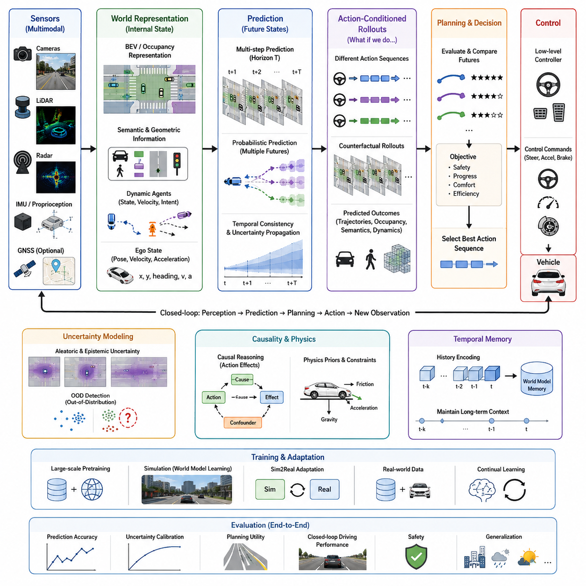
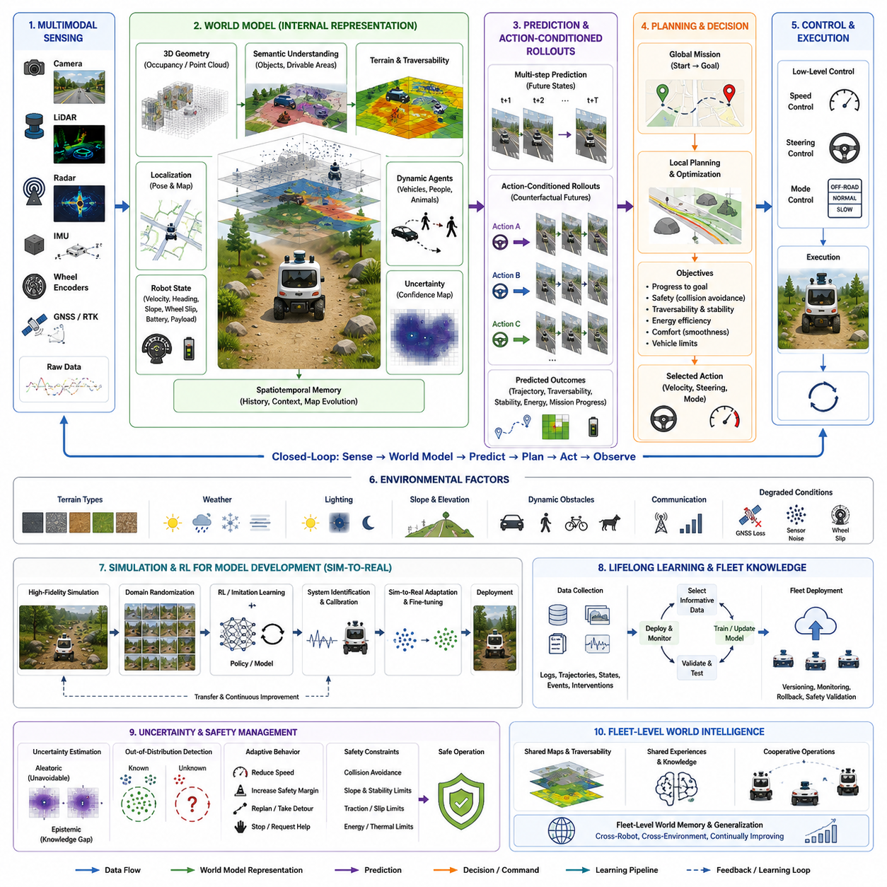
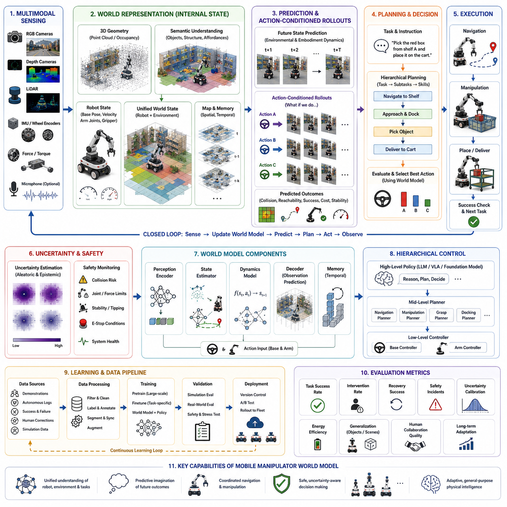
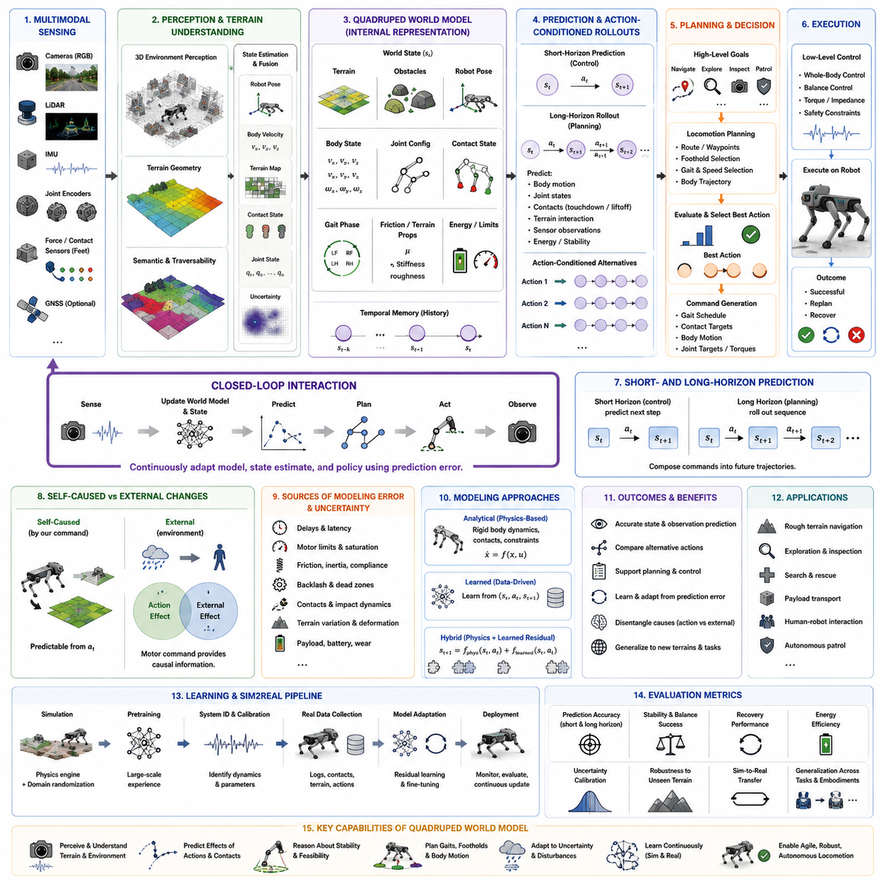
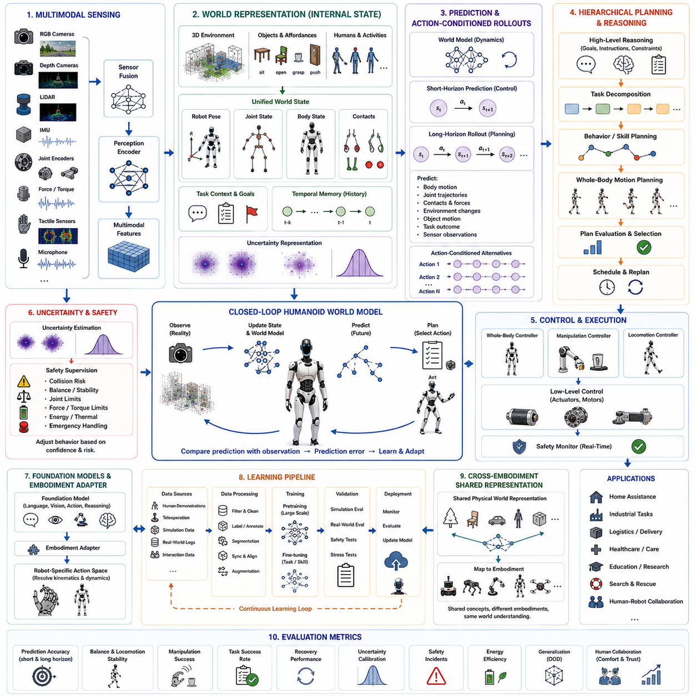
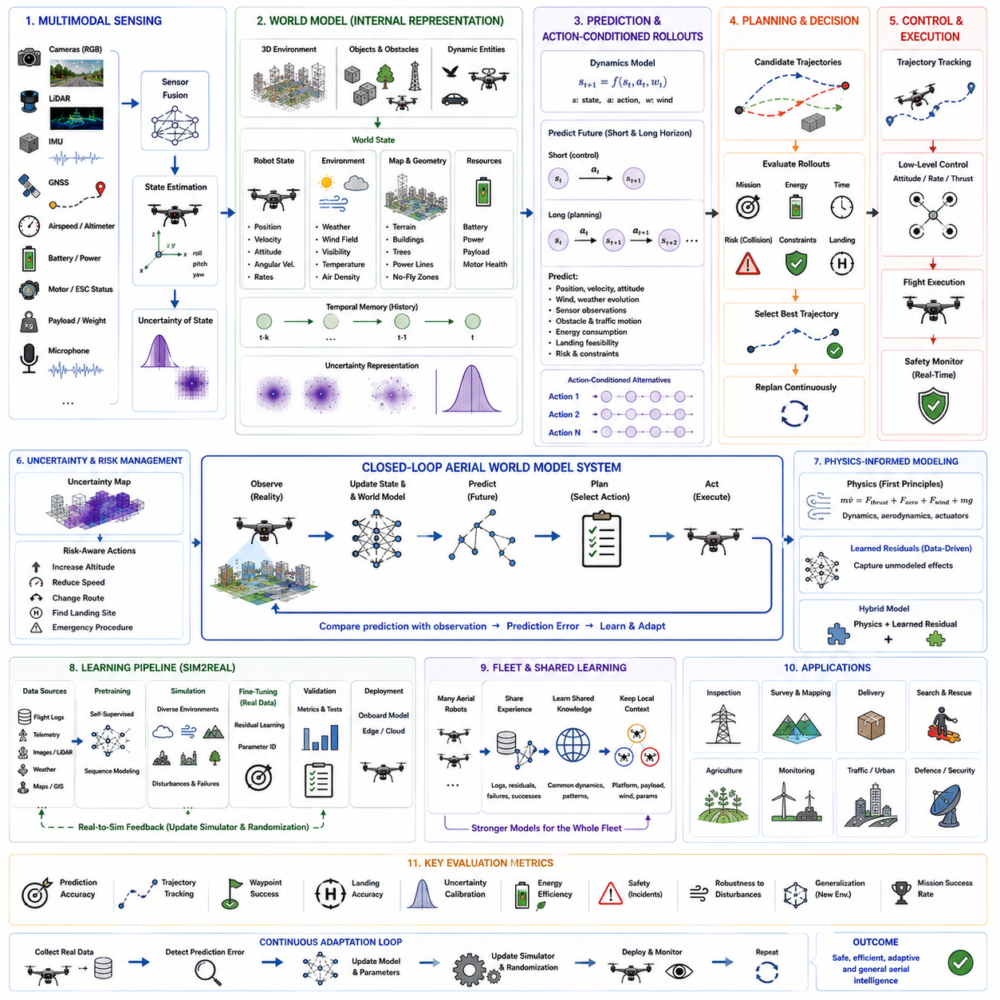
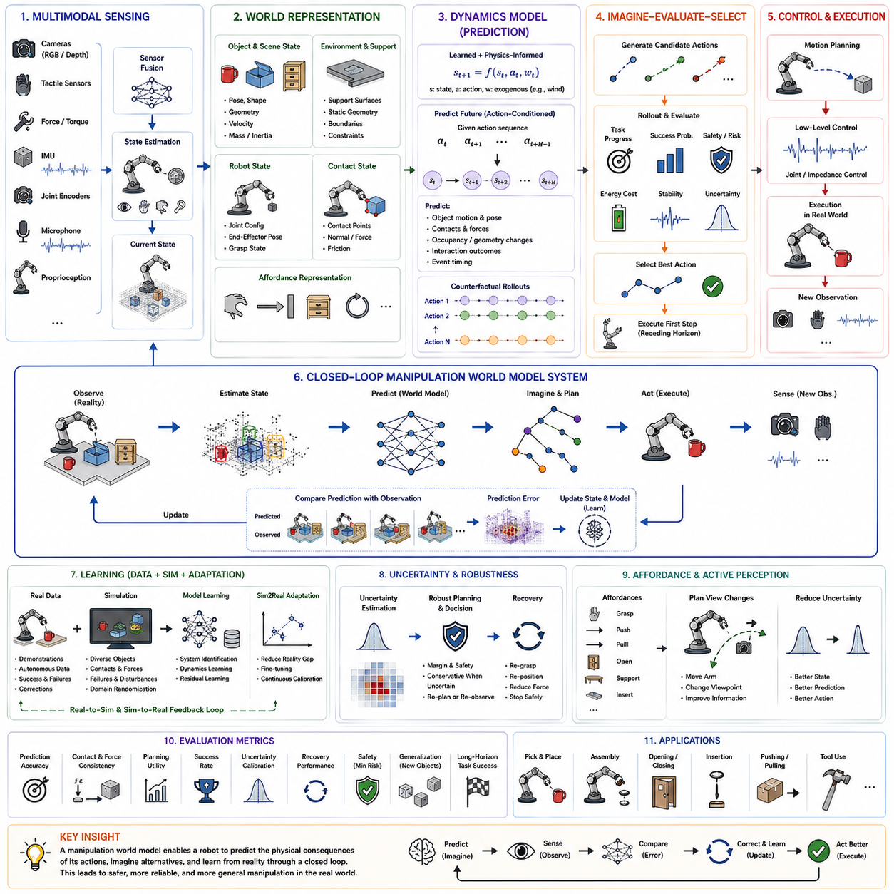
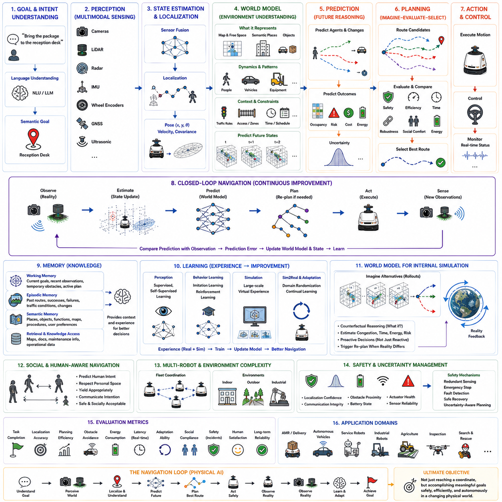
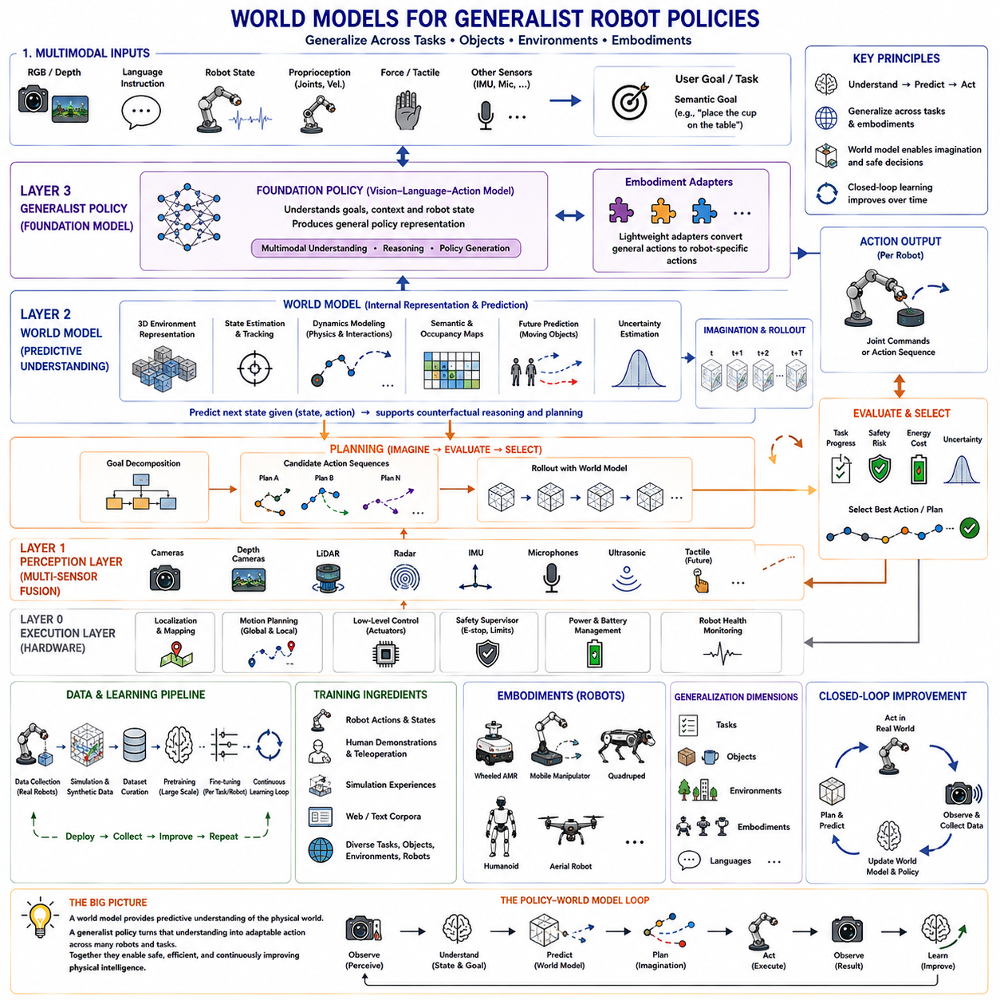
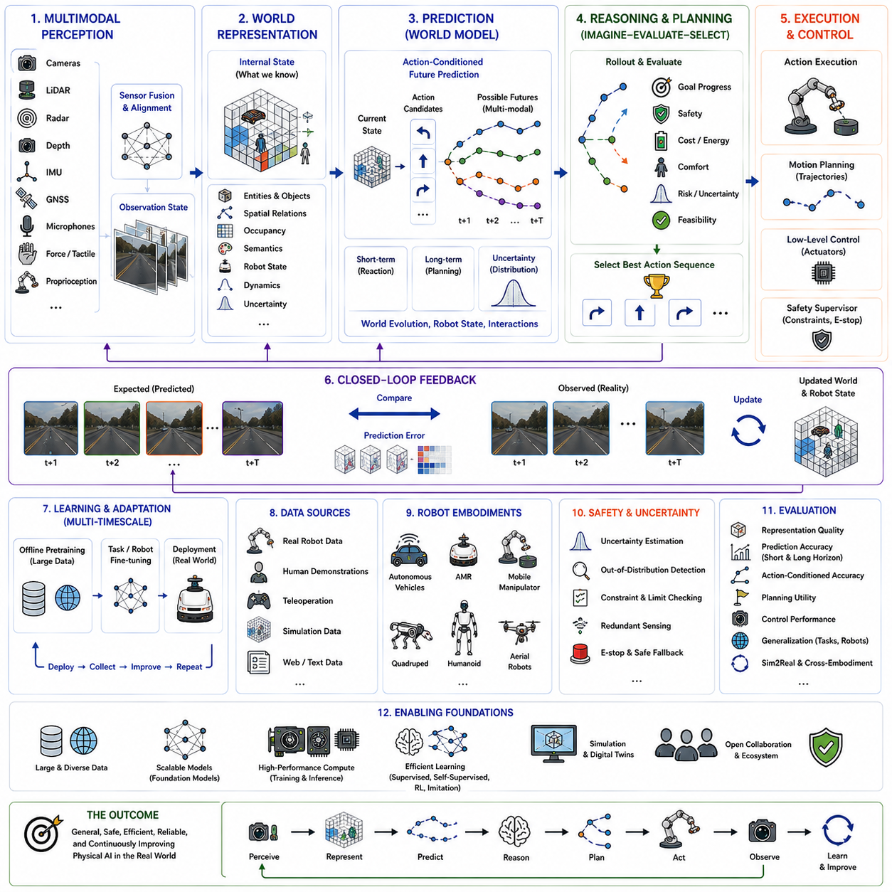

**Volume 07. World Models for Physical AI**

# Chapter 17. Case Studies

## 17.01. Autonomous Driving World Models

{width="7.268055555555556in" height="7.268055555555556in"}

자율주행(Autonomous Driving)은 월드 모델(world model)의 중요한 사례 연구로 볼 수 있다. 차량은 동적인 물리적 환경 안에서 지속적으로 환경을 추론하고, 미래를 예측하며, 행동해야 하기 때문이다. 현재 프레임에서 객체를 식별하는 기존의 인지(perception) 시스템과 달리, 자율주행 월드 모델은 도로, 차량, 보행자, 기반시설, 움직임 및 관련 의미적 맥락(semantic context)에 대한 내부 표현(internal representation)을 지속적으로 유지한다. 따라서 관측(observation)을 미래 상태 예측(future-state prediction)으로 연결하고, 궁극적으로 의사결정(decision making)과 제어(control)까지 연결한다. 이 사례는 월드 모델의 내부 표현, 예측, 행동 조건화(action conditioning), 계획(planning), 불확실성 추정(uncertainty estimation), 실제 환경 적응(real-world adaptation)으로 이어지는 전체적인 발전 구조를 자연스럽게 통합한다.

자율주행 월드 모델의 입력은 본질적으로 다중 모달(multimodal)이면서 부분적으로 관측 가능한(partially observable) 특성을 가진다. 카메라(camera)는 풍부한 시각적·의미적 정보를 제공하고, LiDAR는 기하학적 구조를 제공하며, 레이더(radar)는 이동 및 거리 측정에 대한 상호보완적인 정보를 제공한다. IMU와 차량 자기 상태 정보(proprioception)는 자차(ego vehicle)의 움직임을 설명한다. GNSS는 사용 가능한 경우 전역 위치 추정(global localization)을 제공할 수 있다. 이러한 신호들은 공통된 표현으로 변환되기 전에 시간적·공간적으로 정렬되어야 한다. BEV(Bird\'s-Eye View) 또는 점유(occupancy) 기반 표현은 차량을 중심으로 이러한 정보를 구성하여 정적 인프라와 동적 에이전트를 공간적으로 일관된 월드 상태(world state) 안에 표현할 수 있도록 한다.

유용한 월드 상태(world state)는 단순히 객체의 종류와 위치만 포함해서는 안 된다. 공간적 기하(spatial geometry), 의미적 특성(semantic properties), 시간적 변화(temporal evolution), 그리고 관련 에이전트의 동역학(dynamics)을 함께 표현해야 한다. 도로 경계, 차선, 교차로, 교통 신호, 차량, 보행자 및 장애물은 이러한 상태를 구성하는 서로 다른 요소이며, 속도, 가속도, 진행 방향, 의도(intent), 상호작용 패턴(interaction patterns)은 그 시간적 차원을 설명한다. 차량은 모든 숨겨진 변수를 직접 관측할 수 없기 때문에, 모든 상태 변수가 정확하게 알려져 있다고 가정하기보다는 세계에 대한 믿음(belief)을 유지해야 한다. 따라서 불확실성(uncertainty)은 자율주행 월드 모델링에서 본질적인 요소가 된다.

예측(prediction)은 내부 표현(internal representation)을 가능한 미래 상태들로 변환한다. 주행 월드 모델은 다음 상태(next state), 여러 미래 상태(multiple future states), 또는 주변 에이전트와 자차의 여러 가능한 궤적(multiple possible trajectories)을 예측할 수 있다. 여러 단계 예측(multi-step prediction)은 특히 중요하다. 주행 의사결정은 바로 다음 프레임에만 의존하는 것이 아니라 시간에 따라 전개되는 결과에 의존하기 때문이다. 그러나 장기 롤아웃(long rollout)에서는 예측 오류가 누적될 수 있으므로 시간적 일관성(temporal consistency)과 불확실성 전파(uncertainty propagation)가 점점 더 중요해진다. 확률적 예측(probabilistic prediction)은 보행자가 횡단하거나, 차량이 차선을 변경하거나, 다른 운전자가 예상하지 못하게 제동하는 것처럼 여러 결과가 가능한 경우 서로 다른 미래를 표현할 수 있다.

행동 조건화(action conditioning)는 예측을 수동적인 미래 예측(passive forecasting)에서 개입을 고려하는 모델링(intervention-aware modeling)으로 확장한다. 월드 모델은 가속, 제동, 조향, 차선 변경 및 기타 제어 명령을 포함하여 자차의 특정 행동에 따라 환경이 어떻게 변화할 것인지를 표현해야 한다. 이를 통해 시스템은 특정 행동 시퀀스를 실행할 경우 어떤 일이 발생할지를 질문하는 반사실적 롤아웃(counterfactual rollout)을 수행할 수 있다. 이러한 상상된 미래(imagined futures)는 실제 물리적 환경에서 행동하기 전에 여러 대안을 비교하는 기반을 제공한다. 따라서 상태(state), 행동(action), 전이(transition)의 관계는 월드 모델링과 자율주행 차량 제어 사이를 연결하는 핵심적인 다리가 된다.

계획(planning)은 원시 관측(raw observation)에 직접 의존하기보다 예측된 미래를 기반으로 수행될 수 있다. 시스템은 후보 궤적(candidate trajectory)을 상상하고, 예상되는 결과를 평가하며, 진행성, 승차감, 효율성 및 안전성 사이의 균형을 고려하여 실행할 행동 시퀀스를 선택할 수 있다. 모델 예측 제어(MPC, Model Predictive Control)는 월드 모델을 사용하여 미래 상태를 반복적으로 예측하고 유한한 시간 범위(finite horizon)에서 행동을 최적화하는 하나의 방법이 될 수 있다. 잠재 공간 계획(latent-space planning)은 모든 미래 관측을 픽셀 공간에서 복원하는 대신 학습된 표현(learned representation)에서 예측과 평가를 수행함으로써 계산량을 줄일 수 있다.

불확실성을 고려한 계획(uncertainty-aware planning)은 예측이 완벽하게 신뢰할 수 없는 환경에서 자율주행이 이루어지기 때문에 필수적이다. 우연적 불확실성(aleatoric uncertainty)은 본질적으로 예측하기 어려운 행동에서 발생할 수 있으며, 인식론적 불확실성(epistemic uncertainty)은 모델의 지식이 제한되어 있음을 나타낼 수 있다. 따라서 잘 보정된(calibrated) 월드 모델은 높은 신뢰도로 예측할 수 있는 상황과 충분한 근거가 없는 상황을 구분해야 한다. 분포 외 탐지(OOD detection, Out-of-Distribution Detection)는 새로운 환경이나 행동을 식별할 수 있으며, 불확실성 전파(uncertainty propagation)는 장기 예측에서 증가하는 모호성을 계획 과정에 반영할 수 있도록 한다. 그 결과 예측 결과가 불확실할 때 계획기가 보다 보수적으로 행동하도록 만들 수 있으며, 모든 예측을 동일하게 신뢰하는 문제를 피할 수 있다.

자율주행 월드 모델은 인과적 구조(causal structure)와 물리 기반 구조(physics-informed structure)의 이점도 얻을 수 있다. 순수한 상관관계 기반 모델(purely correlational model)은 특정 시각적 패턴이 특정 결과에 앞서 나타난다는 사실을 학습할 수 있지만, 왜 그러한 결과가 발생하는지를 정확하게 표현하지 못할 수 있다. 인과적 표현(causal representation)과 개입 기반 예측(intervention-based prediction)은 행동과 상호작용의 효과에 대한 추론을 향상시킬 수 있다. 물리적 사전 지식(physical priors)은 차량의 움직임, 가속, 제동, 마찰, 접촉 및 기타 동역학과 관련된 제약을 추가로 제공한다. 학습된 표현과 해석적 또는 물리 기반 구성요소를 결합하면 물리적으로 의미 있는 행동의 일관성을 향상시키고, 이를 학습하는 데 필요한 데이터의 양을 줄일 수 있다.

따라서 전체 아키텍처는 센싱(sensing)에서 내부 상태(internal state), 예측(prediction), 계획(planning), 제어(control)로 이어지는 계층적 변환으로 볼 수 있다. 다중 모달 관측(multimodal observation)은 BEV, 점유(occupancy) 또는 잠재 상태(latent state)와 같은 공간-시간 표현(spatial-temporal representation)으로 인코딩된다. 시간적 메모리(temporal memory)는 필요한 맥락을 유지하고, 동역학 모델(dynamics model)은 해당 상태가 어떻게 변화할지를 예측한다. 행동 조건화 구성요소(action-conditioned component)는 가능한 미래를 생성하며, 계획 계층(planning layer)은 이러한 미래를 평가한 후 제어 명령을 생성한다. 실제 차량에서 얻어지는 피드백은 새로운 관측을 제공하며, 이를 통해 내부 모델이 지속적으로 갱신되는 인지--예측--계획--행동(perception--prediction--planning--action)의 폐루프(closed-loop)가 형성된다.

주요 과제 중 하나는 환경, 날씨, 교통 패턴, 차량 플랫폼 및 지리적 지역에 걸친 일반화(generalization)이다. 하나의 주행 환경에서 학습된 월드 모델은 전체적인 재학습 없이 새로운 도시, 도로 구조, 조명 조건 및 상호작용 패턴으로 전이될 수 있어야 한다. 대규모 사전학습(large-scale pretraining), 다중 환경 학습(multi-environment learning), 공유 표현(shared representation), 실제 데이터 기반 적응(real-world data adaptation)은 이러한 능력을 확보하기 위한 가능한 경로를 제공한다. Sim2Real 방법은 시뮬레이션에서 동역학을 학습하고, 실제 관측을 이용해 해당 동역학을 적응시키며, 실제 배포 과정에서 생성되는 데이터에 따라 모델을 지속적으로 갱신함으로써 시뮬레이션과 실제 주행 환경을 연결할 수 있다.

궁극적으로 자율주행 월드 모델은 객체 탐지 정확도(object-detection accuracy)나 시각적 예측 품질(visual prediction quality)만으로 평가되어서는 안 된다. 실제적인 가치는 내부 표현이 정확한 미래 예측, 행동 조건화 추론(action-conditioned reasoning), 불확실성 보정(uncertainty calibration), 계획의 실용성(planning utility), 안전한 제어(safe control), 그리고 강건한 일반화(robust generalization)를 지원할 수 있는지에 의해 결정된다. 따라서 평가는 표현 품질과 예측 정확도를 실제 주행 성능과 연결해야 한다. 이러한 관점에서 자율주행은 월드 모델이 단순한 인지 구성요소를 넘어서는 대표적인 사례가 된다. 월드 모델은 다중 모달 센싱(multimodal sensing), 물리적 추론(physical reasoning), 미래 상상(future imagination), 계획(planning), 행동(action)을 지속적인 폐루프 물리 AI 시스템(closed-loop Physical AI system) 안에서 연결하는 내부 예측 모델(internal predictive model)로 기능한다.

## 17.02. AMR and Outdoor Robot World Models

{width="7.268055555555556in" height="7.268055555555556in"}

자율 이동 로봇(Autonomous Mobile Robots, AMRs)은 기존의 실내 자동화보다 덜 구조화되고 예측하기 어려운 환경에서 지속적으로 작동해야 하기 때문에 독특한 월드 모델링(world modeling) 문제를 제공한다. 실외 AMR은 단순히 장애물이 어디에 있는지를 이해하는 것뿐만 아니라, 지형, 날씨, 식생, 경사, 노면, 차량, 사람, 통신 상태 등이 이동성(mobility)에 어떤 영향을 미치는지를 이해해야 한다. 따라서 월드 모델(world model)은 주변 환경과 로봇 자체의 물리적 상태를 함께 표현하는 내부 표현(internal representation)이 되며, 변화하는 운용 환경에서 위치 추정(localization), 예측(prediction), 계획(planning), 제어(control), 임무 수행(mission execution)을 지원한다.

실외 AMR의 센싱 시스템(sensing system)은 본질적으로 다중 모달(multimodal)이다. 카메라는 시각적·의미적 정보를 제공하고, LiDAR는 3차원 기하학적 정보를 제공하며, 레이더(radar)는 강건한 거리 및 움직임 정보를 제공할 수 있다. IMU와 휠 엔코더(wheel encoder)는 차량의 움직임을 설명하며, GNSS 또는 RTK는 위성 신호가 충분할 경우 전역 위치(global positioning)를 제공할 수 있다. 이러한 신호들은 일관된 상태 표현(state representation)으로 통합되기 전에 동기화(synchronization)되고 보정(calibration)되며 융합(fusion)되어야 한다. 유용한 실외 월드 모델은 지형 기하(terrain geometry), 주행 가능성(traversability), 장애물, 동적 에이전트(dynamic agents), 위치 추정 신뢰도(localization confidence), 차량 속도, 진행 방향, 경사 및 계획된 움직임이 물리적으로 가능한지를 결정하는 기타 변수들을 함께 표현해야 한다.

지형(terrain)은 일반적인 자율주행 환경에서는 상대적으로 덜 두드러지는 추가적인 차원을 제공한다. 아스팔트(asphalt), 자갈(gravel), 흙(soil), 잔디(grass), 진흙(mud), 모래(sand), 암석(rocks), 물웅덩이(puddles) 및 기타 노면은 견인력(traction), 진동(vibration), 휠 슬립(wheel slip), 에너지 소비(energy consumption), 제동 거동(stopping behavior)에서 매우 다른 특성을 나타낼 수 있다. 따라서 월드 모델은 단순히 시각적으로 인식되는 지형의 종류뿐만 아니라, 그러한 지형이 예상되는 물리적 결과에 어떤 영향을 미치는지도 표현해야 한다. 지형 분류(terrain classification)는 기하학적 정보와 차량 상태 추정(vehicle-state estimation)을 결합하여 주행 가능성(traversability)을 추론할 수 있다. 시각적으로 통과할 수 있는 것처럼 보이는 노면이라도 급경사, 높은 적재량, 낮은 마찰 또는 누적된 휠 슬립이 결합되면 안전하지 않을 수 있다.

실외 환경은 날씨와 조명(illumination)의 영향을 크게 받는다. 비, 눈, 안개, 먼지, 직사광선, 그림자 및 야간 조건은 각각의 센서 성능을 서로 다른 방식으로 저하시킬 수 있다. 따라서 강건한 월드 모델(robust world model)은 하나의 센싱 모달리티(sensing modality)에 완전히 의존해서는 안 된다. 다중 모달 융합(multimodal fusion)은 하나의 센서가 신뢰하기 어려워질 때 다른 센서의 정보가 이를 보완할 수 있도록 하며, 불확실성 추정(uncertainty estimation)은 현재 환경 조건에서 통합된 상태가 더 이상 충분히 신뢰할 수 없는 시점을 나타낼 수 있다. 모델은 무엇이 존재한다고 판단하는지뿐만 아니라 현재 환경에서 그 판단이 얼마나 신뢰할 수 있는지도 인식해야 한다.

실외 AMR 월드 모델에서의 예측(prediction)은 이동 객체를 예측하는 것 이상으로 확장된다. 모델은 지형, 차량 상태 및 주변 에이전트가 미래 시간 범위(future horizon)에서 어떻게 변화할지를 추정할 수 있다. 차량의 속도, 진행 방향, 위치 추정 신뢰도, 휠 슬립, 주행 가능성, 장애물의 위치 또는 임무와 관련된 환경 조건의 변화를 예측할 수 있다. 다단계 예측(multi-step prediction)을 사용하면 플래너(planner)가 현재 관측에만 반응하는 것이 아니라 몇 초 후에도 경로가 계속 실행 가능한지를 평가할 수 있다. 제동 거리, 경사, 느슨한 노면 또는 좁은 통로가 반응 지연의 비용을 높이는 환경에서는 이러한 능력이 특히 중요하다.

행동 조건화(action conditioning)는 월드 모델을 이동 의사결정(mobility decision)과 직접 연결한다. 로봇의 행동과 무관한 하나의 미래를 예측하는 대신, 모델은 서로 다른 행동이 미래 상태를 어떻게 변화시킬 수 있는지를 평가할 수 있다. 전진 또는 후진, 조향 방향, 속도 선택 또는 정상(normal), 저속(slow), 오프로드(off-road)와 같은 운용 모드는 서로 다른 예측 결과를 만들어낼 수 있다. 반사실적 롤아웃(counterfactual rollout)을 통해 시스템은 이러한 대안을 실제로 실행하기 전에 서로 비교할 수 있다. 따라서 월드 모델은 후보 행동을 실행하기 전에 예상되는 지형 상호작용, 장애물의 움직임, 차량 안정성, 에너지 소비 및 임무 진행 상황을 검토하는 내부 시뮬레이터(internal simulator)가 될 수 있다.

실외 로봇을 위한 계획(planning)은 전역 임무 목표(global mission objective)와 지역적 물리적 제약(local physical constraints)을 함께 고려해야 한다. 전역 플래너(global planner)는 목적지를 향한 경로를 결정할 수 있으며, 지역 플래너(local planner)는 지형, 장애물, 경사, 견인력 및 차량 동역학(vehicle dynamics)을 지속적으로 평가한다. 월드 모델은 기하학적으로 가능한 경로뿐만 아니라 물리적으로 주행 가능한 궤적을 선택하는 데 필요한 예측 정보를 제공한다. 계획의 목적에는 목표를 향한 진행, 부드러운 움직임, 에너지 효율, 안정적인 지형 주행, 장애물 회피 및 차량 한계의 유지 등이 포함될 수 있다. 충돌, 충돌 직전 상황, 과도한 휠 슬립, 차량 고립(stuck), 주행 가능 영역 이탈 또는 경사와 안정성 한계 초과와 같은 부정적 결과는 의사결정 과정에 반영되어야 한다.

시뮬레이션(simulation)과 강화학습(Reinforcement Learning, RL)은 실제 환경에서 어려운 지형을 탐색하는 데 발생하는 높은 비용과 위험 때문에 실외 로봇 월드 모델을 개발하는 중요한 경로를 제공한다. 고정밀 물리 시뮬레이션(high-fidelity physics simulation)은 다양한 지형, 날씨, 센서 노이즈(sensor noise) 및 차량 동역학 상황을 대규모로 생성할 수 있다. 도메인 랜덤화(domain randomization)는 배포 전에 모델이나 정책(policy)이 다양한 조건에 노출되도록 할 수 있으며, 커리큘럼 학습(curriculum learning)은 작업의 난이도를 점진적으로 높일 수 있다. 이후 시스템은 시스템 식별(system identification), 보정(calibration), 도메인 적응(domain adaptation) 및 실제 데이터 기반 미세 조정(fine-tuning)을 통해 Sim2Real 적응을 수행할 수 있다. 이를 통해 시뮬레이션 경험과 실제 물리적 배포 사이에 지속적인 연결 고리를 형성할 수 있다.

배포(deployment)가 이루어진 이후에는 실외 AMR 자체가 지속적인 월드 모델 데이터의 원천이 될 수 있다. 정상적인 운용 과정에서 센서 스트림, 주행 궤적, 차량 상태, 위치 정보, 고장, 인간 개입 및 비정상적인 환경 이벤트를 수집할 수 있다. 이러한 데이터는 시뮬레이션이나 초기 학습 단계에서 존재하지 않았던 코너 케이스(corner case)를 발견할 수 있도록 한다. 이후 평생 학습 루프(lifelong learning loop)는 가치가 높은 사례를 선택하고, 모델을 개선하며, 업데이트된 버전을 검증하고, 통제된 배포(controlled deployment)를 통해 로봇 플릿(fleet)에 배포할 수 있다. 이러한 과정은 개별 로봇의 경험을 공유된 플릿 지식(shared fleet knowledge)으로 전환하면서 버전 관리(version control), 모니터링(monitoring), 롤백(rollback) 및 안전 검증(safety validation)을 유지할 수 있도록 한다.

월드 모델은 또한 불확실성(uncertainty)과 성능 저하 조건(degraded conditions)에서도 작동해야 한다. 실외 로봇은 일시적인 GNSS 손실, LiDAR 또는 카메라 성능 저하, 휠 슬립, 변화하는 지형, 통신 중단 또는 익숙하지 않은 환경을 경험할 수 있다. 모델은 겉보기에는 정밀하지만 실제로는 신뢰할 수 없는 상태를 생성하기보다는 신뢰도 추정치(confidence estimate)를 유지하고 학습된 분포를 벗어난 상황을 식별해야 한다. 불확실성이 높아지면 플래너는 속도를 낮추거나, 안전 여유(safety margin)를 증가시키거나, 보다 보수적인 경로를 선택하거나, 정지하거나, 인간의 지원을 요청할 수 있다. 이를 통해 환경에 대한 신뢰도와 잠재적인 결과에 따라 독립적인 운용 수준을 변화시키는 적응형 자율성(adaptive autonomy)을 구현할 수 있다.

플릿 수준(fleet level)에서는 여러 실외 AMR이 지도, 주행 가능성 정보, 환경 관측, 학습된 동역학 및 운용 경험을 공유할 수 있다. 하나의 로봇이 어려운 지형 조건을 경험하면 동일한 지역 또는 유사한 환경에서 운용되는 다른 로봇에게 도움이 되는 정보를 제공할 수 있다. 따라서 공유된 월드 표현(shared world representation)은 개별 로봇의 지역적 모델(local model)에서 플릿 수준의 월드 메모리(fleet-level world memory)로 발전할 수 있다. 이는 협력적 내비게이션(coordinated navigation), 플릿 규모 학습(fleet-scale learning), 이기종 로봇 협력(heterogeneous robot cooperation) 및 서로 다른 실외 로봇 플랫폼에 걸쳐 점점 더 일반화되는 물리적 지능(physical intelligence)의 기반을 제공한다.

궁극적인 목표는 단순히 익숙한 실외 경로를 주행할 수 있는 AMR을 만드는 것이 아니라, 변화하는 환경을 이해하고 그에 따라 자신의 행동을 적응시킬 수 있는 예측 기반 물리 지능 시스템(predictive physical intelligence system)을 구축하는 것이다. 이러한 시스템은 다중 모달 인지(multimodal perception), 위치 추정(localization), 지형 이해(terrain understanding), 시간적 메모리(temporal memory), 예측 동역학(predictive dynamics), 행동 조건화 미래 상상(action-conditioned imagination), 불확실성 추정(uncertainty estimation), 계획(planning), 제어(control), 시뮬레이션(simulation), Sim2Real 적응(Sim2Real adaptation) 및 평생 학습(lifelong learning)을 통합한다. 결과적으로 실외 AMR은 월드 모델이 센싱(sensing)과 물리적 행동(physical action) 사이를 연결하는 핵심적인 사례가 된다. 로봇은 실제 환경에서 행동을 실행하기 전에 무엇이 일어나고 있는지, 다음에 무엇이 일어날 수 있는지, 그리고 무엇을 해야 하는지를 추론할 수 있게 된다.

## 17.03. Mobile Manipulator World Models

{width="7.268055555555556in" height="7.268055555555556in"}

모바일 매니퓰레이터(mobile manipulator)는 자율주행(navigation)과 로봇 조작(manipulation)을 결합하기 때문에, 이동 로봇이나 고정형 매니퓰레이터 어느 한쪽만 다루는 것보다 근본적으로 더 복잡한 월드 모델링(world modeling) 문제를 만든다. 로봇은 자신의 위치가 어디인지, 주변 환경이 어떻게 구성되어 있는지, 어떤 객체가 중요한지, 그리고 자신의 이동 플랫폼과 매니퓰레이터가 어떻게 함께 주변 환경과 상호작용할 수 있는지를 이해해야 한다. 따라서 유용한 월드 모델(world model)은 위치 추정(localization), 장면 이해(scene understanding), 내비게이션(navigation), 객체 어포던스(object affordance), 작업 추론(task reasoning), 조작 계획(manipulation planning), 안전(safety)을 하나의 예측 프레임워크(predictive framework) 안에서 연결해야 한다. 이동성과 조작의 결합은 정확한 도킹(docking)과 플랫폼 안정성(platform stability)을 특히 중요하게 만든다.

모바일 매니퓰레이터의 월드 상태(world state)는 환경과 로봇의 구현체(embodiment)를 모두 표현해야 한다. 카메라와 깊이 센서(depth sensor)는 시각적·기하학적 정보를 제공하고, LiDAR는 이동 플랫폼의 위치 추정과 매핑(localization and mapping)을 지원할 수 있다. IMU와 휠 엔코더(wheel encoder)는 움직임에 대한 정보를 제공하며, 힘 및 토크 센싱(force and torque sensing)은 조작 과정에서 발생하는 물리적 접촉에 대한 정보를 제공한다. 따라서 내부 표현(internal representation)은 로봇의 자세(pose), 지도(map), 객체 위치, 객체 기하(object geometry), 의미적 속성(semantic properties), 팔의 구성(arm configuration), 그리퍼 상태(gripper state), 관련 접촉 조건(contact conditions)을 포함해야 한다. 이러한 구성요소들은 시간적으로 일관성을 유지해야 하며, 이를 통해 내비게이션과 조작이 동일한 물리적 장면에 대한 공통된 이해를 기반으로 작동할 수 있다.

핵심적인 능력은 통합된 장면 이해(unified scene understanding)이다. 모바일 매니퓰레이터는 창고를 이동하고, 작업 셀(workcell)에 접근하며, 대상 객체를 식별하고, 해당 객체가 잡을 수 있는지 판단한 다음, 올바른 위치에 도달한 후 객체를 조작할 수 있다. 월드 모델은 포인트 클라우드(point cloud)나 점유 지도(occupancy map)와 같은 기하학적 표현과 객체의 정체성(identity), 어포던스(affordance), 작업 관련성(task relevance)과 같은 의미적 정보를 연결해야 한다. 이를 통해 로봇은 단순히 객체가 존재한다는 사실뿐만 아니라, 그 객체를 잡을 수 있는지, 적절한 파지(grasp)가 가능한 위치가 어디인지, 그리고 조작 이후 어떤 결과가 발생할 수 있는지를 추론할 수 있다.

시간적 메모리(temporal memory)는 조작이 순차적인 물리적 과정(sequential physical process)이기 때문에 특히 중요하다. 로봇은 각각의 카메라 프레임을 독립적인 문제로 처리하는 대신 이전 관측, 움직임, 접촉, 파지 시도 및 작업 진행 상황을 기억해야 한다. 시간적 월드 모델(temporal world model)은 이동 플랫폼이 움직인 이후 장면이 어떻게 변화했는지, 접촉 이후 객체가 어떻게 이동했는지, 이전 조작 시도가 성공했는지 실패했는지에 대한 정보를 유지할 수 있다. 이러한 과거 정보는 예측(prediction)을 위한 맥락을 제공하며, 새로운 관측이 들어올 때 로봇이 자신의 내부 상태(internal state)를 수정할 수 있도록 한다.

예측(prediction)은 환경의 변화와 로봇의 구현체 동역학(embodiment dynamics)을 모두 포함해야 한다. 예를 들어 모델은 작업 셀을 향해 이동할 때 로봇의 자세가 어떻게 변화할지, 객체를 잡았을 때 객체가 어떻게 움직일지, 그리고 서로 다른 팔의 궤적(arm trajectory)이 충돌 위험이나 도달 가능성(reachability)에 어떤 영향을 미칠지를 예측할 수 있다. 행동 조건화 예측(action-conditioned prediction)을 통해 시스템은 실행하기 전에 서로 다른 내비게이션 및 조작 행동을 비교할 수 있다. 후보 행동은 플랫폼을 이동시키거나, 팔의 구성을 변경하거나, 다른 파지를 선택하거나, 플랫폼과 팔의 움직임을 결합하는 것일 수 있다. 이후 반사실적 롤아웃(counterfactual rollout)을 통해 학습된 월드 모델 안에서 이러한 행동의 예상 결과를 추정할 수 있다.

따라서 계획(planning)은 계층적(hierarchical)이면서 협조적(coordinated)이어야 한다. 상위 수준의 작업 플래너(high-level task planner)는 객체를 가져와 다른 위치로 전달하라는 명령을 해석할 수 있으며, 하위 수준 플래너(lower-level planner)는 내비게이션 경로, 도킹 위치, 파지 구성(grasp configuration), 역기구학(inverse kinematics), 충돌 없는 궤적(collision-free trajectory)을 결정한다. 월드 모델은 이러한 계획 계층들이 서로 정보를 교환할 수 있도록 공통된 예측 상태(predictive state)를 제공한다. 내비게이션과 조작을 독립적인 모듈로 처리하는 대신, 시스템은 선택한 플랫폼 위치가 충분한 도달 가능성을 제공하는지, 계획된 팔의 움직임이 실행 과정 전체에서 안전한지를 함께 평가할 수 있다.

실제 환경에서의 조작(real-world manipulation)은 인지만으로 제거할 수 없는 불확실성(uncertainty)을 발생시킨다. 객체의 자세 추정(object pose estimation)은 부정확할 수 있고, 객체가 부분적으로 가려질 수 있으며, 표면이 미끄러울 수 있고, 접촉력이 예상과 다르게 나타날 수 있다. 따라서 로봇은 불확실성 추정(uncertainty estimation)과 복구 메커니즘(recovery mechanism)을 필요로 한다. 신뢰도가 낮아지면 더 느린 움직임, 추가 관측, 다른 파지 선택, 재계획(replanning) 또는 인간 지원(human assistance)을 수행할 수 있다. 안전 감독(safety supervision)은 충돌 위험, 관절 한계(joint limit), 힘 및 토크 한계, 비상 정지(emergency stop) 조건, 시스템 상태를 지속적으로 감시해야 한다. 모바일 매니퓰레이터는 자율 이동의 위험과 물리적 조작의 위험을 동시에 가지고 있기 때문에 이러한 기능이 특히 중요하다.

모방학습(imitation learning)과 로봇 파운데이션 모델(robot foundation model)은 범용 모바일 조작(general-purpose mobile manipulation)을 구현하기 위한 중요한 경로를 제공한다. 시연 데이터(demonstration)는 인지, 파지 선택, 동작 실행 및 복구와 같이 수작업으로 명시하기 어려운 협조적 행동을 포착할 수 있다. 정책(policy)은 RGB 및 깊이 관측, 로봇 관절 상태, 그리퍼 정보, 힘 측정값, 행동(action), 작업 결과(task outcome)로부터 학습할 수 있다. 보다 광범위한 파운데이션 모델 아키텍처에서는 다중 모달 관측(multimodal observation)과 언어 명령(language instruction)을 함께 처리하여 내비게이션, 조작 및 시스템 행동을 생성할 수 있다. 이는 작업 특화 정책(task-specific policy)에서 객체, 장면, 작업 및 로봇 구현체 전반에 일반화할 수 있는 모델로 발전하는 경로를 제공한다.

월드 모델과 로봇 파운데이션 모델(robot foundation model)의 관계는 상호보완적(complementary)이어야 한다. 파운데이션 모델은 의미적 추론(semantic reasoning), 작업 해석(task interpretation), 일반적인 정책 생성을 제공할 수 있는 반면, 월드 모델은 공간 상태 추정(spatial state estimation), 예측 동역학(predictive dynamics), 미래 상태 모델링(future-state modeling), 점유 및 의미 지도(occupancy and semantic maps), 불확실성 추정(uncertainty estimation)을 제공한다. 구현체 어댑터(embodiment adapter)는 일반적인 정책 표현을 특정 로봇의 실행 공간(execution space)으로 변환할 수 있다. 이러한 분리는 동일한 상위 수준 지능을 서로 다른 이동 플랫폼, 매니퓰레이터, 그리퍼 및 센서 구성에 적용할 수 있도록 하면서도 각 로봇 구현체에 필요한 물리적 제약을 유지할 수 있도록 한다.

학습은 배포 이후에도 지속되어야 한다. 시연 데이터, 자율 운용 로그, 성공 및 실패한 조작 시도, 복구 행동, 수정 과정, 시뮬레이션 데이터는 지속적인 학습 파이프라인(continuous learning pipeline)에 통합될 수 있다. 시뮬레이션과 합성 데이터(synthetic data)는 대규모 다양성을 제공할 수 있으며, 실제 로봇 데이터는 실제 동역학, 센서 노이즈, 마찰, 지연(latency), 구현체 특유의 상호작용을 포착한다. 결합된 데이터는 사전학습(pretraining), 작업 특화 미세 조정(task-specific fine-tuning), 검증(validation), 통제된 배포(controlled deployment)를 지원할 수 있다. 특히 서로 다른 구현체에서 수집된 데이터는 중요하다. 서로 다른 로봇 신체에서 공통적으로 나타나는 행동을 공유함으로써 모델이 하나의 물리적 플랫폼에 지나치게 의존하지 않는 표현을 학습하도록 도움을 줄 수 있기 때문이다.

궁극적인 목표는 인지(perception), 월드 표현(world representation), 예측(prediction), 계획(planning), 행동(action), 관측(observation)이 지속적으로 서로를 강화하는 폐루프 모바일 조작 시스템(closed-loop mobile manipulation system)을 구축하는 것이다. 로봇은 다중 모달 관측을 받아 내부 월드 상태를 갱신하고, 가능한 미래를 예측하며, 내비게이션과 조작의 대안을 평가하고, 행동을 실행한 후 그 결과로 얻어진 새로운 관측을 이용하여 자신의 모델을 수정한다. 따라서 평가는 단순한 작업 성공(task success)을 넘어 개입 빈도(intervention frequency), 복구 성공률(recovery success), 안전 사고(safety incident), 불확실성 보정(uncertainty calibration), 에너지 효율(energy efficiency), 일반화(generalization), 인간 협업 품질(human collaboration quality), 장기 적응(long-term adaptation)을 포함해야 한다. 이러한 형태에서 모바일 매니퓰레이터 월드 모델은 일반 지능(general intelligence)과 물리적 실행(physical execution) 사이를 연결하는 핵심적인 다리가 되며, 로봇이 환경이 현재 어떠한 상태인지, 다음에 무엇이 일어날 수 있는지, 그리고 자신의 신체를 어떻게 활용하여 의도된 작업을 안전하게 수행할 수 있는지를 추론할 수 있도록 한다.

## 17.04. Quadruped World Models

{width="7.268055555555556in" height="7.268055555555556in"}

4족 보행 로봇(quadruped robot)은 이동이 로봇의 신체(body), 다리(legs), 지면(ground) 사이의 지속적인 상호작용에 직접적으로 의존하기 때문에 독특한 월드 모델링(world modeling) 문제를 제시한다. 바퀴형 로봇과 달리 4족 보행 로봇은 이동하는 동안 발 디딤점(foothold), 접촉 상태(contact state), 신체 안정성(body stability), 보행 패턴 전환(gait transition), 지면 반력(ground reaction force), 지형 기하(terrain geometry)를 함께 추론해야 한다. 따라서 월드 모델(world model)은 외부 환경과 로봇의 구현체(embodiment)를 모두 표현하고, 인지(perception)와 지형 이해(terrain understanding)를 보행 동역학(locomotion dynamics), 예측(prediction), 계획(planning), 저수준 제어(low-level control)와 연결해야 한다.

4족 보행 월드 모델의 센싱 시스템(sensing system)은 본질적으로 다중 모달(multimodal)이다. 카메라는 시각적·의미적 정보를 제공하고, LiDAR는 기하학적 구조와 고도 정보를 제공할 수 있다. IMU 측정값은 신체 움직임을 설명하며, 관절 엔코더(joint encoder)는 각 다리의 구성을 제공한다. 힘 또는 접촉 센싱(force or contact sensing)은 발이 신체를 지지하고 있는지, 미끄러지고 있는지, 또는 지면과의 접촉을 잃고 있는지를 알려줄 수 있다. 필요에 따라 GNSS는 추가적인 전역 위치 추정(global localization)을 제공할 수 있다. 이러한 관측들은 동기화되고 융합되어 지형, 장애물, 로봇 자세, 관절 구성, 접촉 상태, 움직임 및 불확실성(uncertainty)을 포함하는 일관된 내부 상태(coherent internal state)로 통합되어야 한다.

지형 이해(terrain understanding)는 동일한 명령이 서로 다른 지면에서 매우 다른 결과를 만들어낼 수 있기 때문에 특히 중요하다. 평탄한 포장도로, 자갈, 암석, 진흙, 모래, 계단, 경사면 및 변형 가능한 지형(deformable terrain)은 발 디딤점 선택, 보행 안정성, 견인력(traction), 에너지 소비에 서로 다른 요구사항을 부과한다. 따라서 유용한 월드 모델은 지형 기하와 함께 보행에 관련된 특성까지 표현해야 한다. 주행 가능성(traversability)은 단순한 시각적 분류 문제가 아니며, 로봇이 안정적인 접촉을 유지하고 지형 위에서 이동하는 동안 충분한 힘을 생성할 수 있는지를 함께 고려해야 한다.

내부 월드 상태(internal world state)는 지형과 로봇 구현체(embodiment) 사이의 관계를 명시적으로 표현해야 한다. 4족 보행 로봇은 어떤 발이 지지 상태(stance)에 있는지, 어떤 발이 공중에 있는 상태(swing)에 있는지, 다음 발 디딤점이 어디에 있는지, 그리고 개별 다리가 지면에 접촉하거나 접촉을 해제할 때 신체가 어떻게 움직일 것인지를 추정해야 할 수 있다. 모델은 이전 접촉, 신체 움직임, 지형 관측 및 보행 단계(gait phase)에 대한 시간적 메모리(temporal memory)를 유지할 수 있다. 이를 통해 로봇은 일시적인 센서 관측과 지속적인 환경 구조를 구별하고, 새로운 측정값이 들어올 때 물리적 상태에 대한 자신의 믿음(belief)을 갱신할 수 있다.

예측(prediction)은 이동이 본질적으로 동적인 과정이기 때문에 핵심적인 능력이 된다. 현재 상태와 후보 모터 명령(motor command) 또는 보행 명령(gait command)이 주어졌을 때, 월드 모델은 다음 신체 상태, 관절 구성, 접촉 조건 및 센서 결과를 예측해야 한다. 단기 예측(short-horizon prediction)은 균형 유지와 저수준 제어를 지원할 수 있으며, 장기 예측 롤아웃(long-horizon rollout)은 발 디딤점 선택, 보행 계획, 경로 계획, 에너지 기반 내비게이션(energy-aware navigation)을 지원할 수 있다. 접촉 이벤트는 갑작스럽게 변화할 수 있기 때문에, 예측은 발 착지(touchdown), 미끄러짐(slip), 충격(impact), 지형 변형(terrain deformation), 지지력 상실(loss of support)로 인해 발생하는 불연속적인 변화까지 고려해야 한다.

행동 조건화 모델링(action-conditioned modeling)은 4족 보행 로봇이 실제로 행동하기 전에 서로 다른 이동 전략을 비교할 수 있도록 한다. 후보 행동에는 보행 패턴 변경, 발걸음 타이밍 조정, 다른 발 디딤점 선택, 신체 자세 조정, 속도 변경 또는 다른 경로 선택 등이 포함될 수 있다. 반사실적 롤아웃(counterfactual rollout)은 이러한 대안들이 안정성, 에너지 소비, 이동 진행도(progress), 접촉 신뢰성(contact reliability)에 어떤 영향을 미치는지를 추정할 수 있다. 이를 통해 로봇은 현재 지형 관측에 단순히 반응하는 대신, 어떤 행동이 안정적인 이동을 유지할 가능성이 가장 높은지를 내부적으로 질문할 수 있는 예측 메커니즘을 갖게 된다.

계획(planning)과 제어(control)는 계층적으로 작동해야 한다. 상위 수준 시스템(high-level system)은 내비게이션(navigation), 검사(inspection), 탐색(exploration), 순찰(patrol), 수색(search), 배송(delivery)과 같은 임무 행동을 결정할 수 있으며, 이동 계획기(locomotion planner)는 실행 가능한 경로, 발 디딤점, 신체 움직임, 보행 패턴 및 복구 행동(recovery behavior)을 결정한다. 이후 저수준 제어기(low-level controller)는 이러한 결정을 관절 위치(joint position), 속도, 토크, 접촉력(contact force), 균형 보정(balance correction)으로 변환한다. 월드 모델은 이러한 계층들을 연결하는 공통 상태와 예측된 결과를 제공한다. 이러한 분리를 통해 전략적 의사결정과 동적인 보행 제어가 서로 무관한 하위 시스템으로 작동하지 않고 협조적으로 유지될 수 있다.

물리 기반 모델링(physics-informed modeling)은 4족 보행 로봇의 행동이 역학(mechanics)에 강하게 제약되기 때문에 특히 유용하다. 강체 운동(rigid-body motion), 중력(gravity), 마찰(friction), 접촉력(contact force), 액추에이터 한계(actuator limits), 관절 기하(joint geometry), 보존 법칙(conservation principles)은 물리적으로 타당한 상태를 예측하기 위한 유용한 구조를 제공한다. 하이브리드 월드 모델(hybrid world model)은 해석적 동역학(analytical dynamics)과 학습 기반 구성요소를 결합하여 지형에 따른 상호작용, 컴플라이언스(compliance), 모델링되지 않은 액추에이터 거동, 복잡한 접촉 전환(contact transition)처럼 정확하게 모델링하기 어려운 효과를 표현할 수 있다. 물리는 구조를 제공하고, 학습은 실제 운용에서 관측되는 변화를 포착한다.

불확실성(uncertainty)은 예측과 보행 의사결정 모두에 통합되어야 한다. 센서 노이즈, 불완전한 지형 추정, 알려지지 않은 마찰, 변화하는 지면 조건, 액추에이터의 한계 및 예상하지 못한 접촉 이벤트는 미래 상태를 불확실하게 만들 수 있다. 따라서 월드 모델은 신뢰도(confidence)를 추정하고 예측 궤적(predicted trajectory)에 불확실성을 전파해야 한다. 신뢰도가 낮아지면 4족 보행 로봇은 속도를 낮추거나, 안정성 여유(stability margin)를 높이거나, 보다 보수적인 발 디딤점을 선택하거나, 보행 패턴을 변경하거나, 재계획(replanning)을 수행하거나, 복구 절차(recovery)를 시작할 수 있다. 이를 통해 로봇은 내부 물리 모델의 신뢰도에 따라 행동을 조절하는 불확실성 인지 보행(uncertainty-aware locomotion)을 구현할 수 있다.

시뮬레이션(simulation)과 Sim2Real 적응(Sim2Real adaptation)은 위험한 실제 보행 데이터를 대규모로 수집하는 것이 비용과 위험 측면에서 어렵기 때문에 중요한 개발 경로를 제공한다. 물리 시뮬레이션(physics simulation)은 다양한 지형, 접촉, 보행 패턴, 외란(disturbance), 실패 상황을 생성할 수 있으며, 도메인 랜덤화(domain randomization)는 학습 시스템이 물리적 파라미터와 환경의 다양한 변화를 경험하도록 할 수 있다. 이후 실제 환경의 관측 데이터는 시스템 식별(system identification), 잔차 동역학 학습(residual dynamics learning), 보정(calibration), 모델 적응(model adaptation)에 활용될 수 있다. 이러한 루프를 통해 시뮬레이션에서 얻은 지식은 실제 물리적 증거에 의해 수정될 수 있으며, 월드 모델이 실제 로봇과 지형에 지속적으로 정렬된 상태를 유지할 수 있다.

4족 보행 월드 모델은 궁극적으로 범용 다족 보행 물리 AI(general legged Physical AI)의 기반으로 발전할 수 있다. 대규모 다중 모달 사전학습(large-scale multimodal pretraining)은 지형, 움직임, 접촉, 행동 및 결과 사이의 공통적인 관계를 학습할 수 있으며, 크로스 임바디먼트 학습(cross-embodiment learning)은 일반적인 물리 구조와 특정 로봇의 특성을 분리할 수 있다. 공유 표현(shared representation)은 서로 다른 로봇 신체에서 기하, 점유(occupancy), 의미 정보(semantics), 움직임, 상호작용, 어포던스(affordance), 불확실성을 표현할 수 있다. 이러한 관점에서 4족 보행 로봇은 더 광범위한 물리적 월드 모델이 미래를 예측하고, 추론하고, 상상하는 방법을 학습하는 하나의 구현체(embodiment)가 된다.

궁극적인 목표는 센싱(sensing), 월드 상태 추정(world-state estimation), 예측(prediction), 계획(planning), 보행 제어(locomotion control), 관측(observation)이 서로를 지속적으로 갱신하는 폐루프 4족 보행 시스템(closed-loop quadruped system)을 구축하는 것이다. 로봇은 환경을 관측하고, 지형과 접촉 조건을 추정하며, 서로 다른 행동에 따른 가능한 미래 상태를 예측하고, 이동 전략을 선택한 다음 이를 실행하고, 그 결과로 얻어진 관측을 이용하여 내부 모델을 수정한다. 따라서 평가는 단순한 내비게이션 성공 여부를 넘어 예측 정확도, 안정성, 복구 성능, 에너지 효율, 불확실성 보정, 익숙하지 않은 지형에 대한 강건성, Sim2Real 전이, 작업 및 로봇 구현체 전반의 일반화 능력까지 고려해야 한다. 이러한 형태에서 4족 보행 월드 모델은 물리적 이해(physical understanding)와 적응형 보행(adaptive locomotion), 자율 행동(autonomous behavior)을 연결하는 핵심적인 예측 계층(predictive layer)이 된다.

## 17.05. Humanoid World Models

{width="7.268055555555556in" height="7.268055555555556in"}

휴머노이드 로봇(humanoid robot)은 인간을 위해 설계된 환경과 상호작용하도록 형태(morphology)가 설계되어 있기 때문에 물리 AI(Physical AI)에서 가장 까다로운 월드 모델링(world modeling) 문제 중 하나를 제시한다. 휴머노이드는 주변 세계를 이해하고, 균형을 유지하며, 복잡한 공간을 보행하고, 객체를 조작하고, 도구를 사용하고, 사람과 소통하며, 엄격한 물리적 제약 안에서 수많은 관절을 동시에 협조적으로 제어해야 한다. 따라서 휴머노이드의 월드 모델(world model)은 인지(perception), 공간 이해(spatial understanding), 신체 상태(body state), 접촉 동역학(contact dynamics), 예측(prediction), 추론(reasoning), 전신 계획(whole-body planning), 제어(control)를 하나의 지속적으로 갱신되는 내부 표현(internal representation) 안에서 연결해야 한다. 이러한 특성 때문에 휴머노이드는 범용 물리 지능(general-purpose physical intelligence)을 연구하는 데 특히 중요한 구현체(embodiment)가 된다.

휴머노이드 월드 모델(humanoid world model)은 하나의 센서만으로는 전체 물리적 상황을 설명할 수 없기 때문에 다중 모달 센싱(multimodal sensing)을 필요로 한다. RGB 및 깊이 카메라(RGB and depth cameras)는 시각적·기하학적 정보를 제공하고, LiDAR는 3차원 구조와 위치 추정(localization)에 기여할 수 있다. IMU 측정값은 신체 움직임을 설명하며, 관절 엔코더(joint encoder)는 자기수용감각(proprioception) 상태를 제공하고, 힘·토크·촉각 센서(force, torque, and tactile sensors)는 객체 및 환경과의 접촉을 알려준다. 마이크(microphone)는 음성 및 음향 맥락(acoustic context)을 제공할 수 있다. 이러한 관측들은 동기화되고 융합되어 환경, 사람, 객체, 로봇 자세, 관절 구성, 접촉 조건, 작업 맥락(task context), 불확실성(uncertainty)을 포함하는 공통 표현(common representation)으로 통합되어야 한다.

내부 월드 표현(internal world representation)은 외부 공간과 로봇 자신의 구현체(embodiment)를 결합해야 한다. 휴머노이드는 객체와 사람이 어디에 있는지를 알아야 할 뿐만 아니라, 자신의 팔이 객체에 도달할 수 있는지, 발이 계획된 움직임을 지지할 수 있는지, 전신 움직임(whole-body motion)이 동적으로 안정적인지를 판단해야 한다. 이러한 표현에는 3차원 기하(three-dimensional geometry), 의미적 객체(semantic objects), 어포던스(affordances), 인간의 활동(human activity), 로봇 자세(robot pose), 관절 상태(joint state), 접촉 상태(contact state), 시간적 이력(temporal history)이 포함될 수 있다. 이러한 통합 상태(unified state)를 유지하면 인지, 내비게이션(navigation), 조작(manipulation), 상호작용(interaction)이 서로 분리된 작업 특화 표현(task-specific representation)이 아니라 공통된 물리적 이해를 기반으로 작동할 수 있다.

예측(prediction)은 휴머노이드의 행동이 긴밀하게 결합된 전신 동역학(whole-body dynamics)을 포함하기 때문에 특히 중요하다. 발의 위치를 변경하면 균형에 영향을 미치고, 이는 다시 몸통 움직임, 팔의 궤적(arm trajectory), 객체를 잡는 능력에 영향을 줄 수 있다. 마찬가지로 물체를 들고 팔을 움직이면 신체의 무게 중심(center of mass)과 안정성 요구사항이 변화할 수 있다. 따라서 월드 모델은 미래의 신체 상태, 환경 변화, 접촉 이벤트, 객체 움직임, 작업 결과(task consequence)를 예측해야 한다. 단기 예측(short-horizon prediction)은 균형 유지와 실시간 제어(real-time control)를 지원할 수 있으며, 장기 예측(long-horizon prediction)은 보행, 조작, 작업 계획(task planning), 복구(recovery)를 지원할 수 있다.

행동 조건화 예측(action-conditioned prediction)은 휴머노이드가 실제로 행동하기 전에 여러 행동 대안을 평가할 수 있도록 한다. 모델은 서로 다른 보행 경로, 발 디딤점(foothold), 신체 자세, 파지 구성(grasp configuration), 팔 궤적, 힘 명령(force command), 도구 사용 전략(tool-use strategy)을 고려하고 그 결과를 추정할 수 있다. 반사실적 롤아웃(counterfactual rollout)은 내부적인 "만약 그렇다면(what if)" 메커니즘을 제공한다. 로봇이 다른 방식으로 발을 내딛는다면 어떻게 될 것인지, 다른 방향에서 접근한다면 어떻게 될 것인지, 자세를 변경하거나 다른 힘을 가한다면 어떤 결과가 발생할지를 예측할 수 있다. 이러한 예측 능력을 통해 계획(planning)은 현재 장면뿐만 아니라 각 후보 행동이 만들어낼 것으로 예상되는 미래 상태를 기반으로 행동을 선택할 수 있다.

휴머노이드 계획(humanoid planning)은 작업이 서로 다른 수준의 추상화(abstraction)에서 수행되기 때문에 계층적(hierarchical)이어야 한다. 상위 수준의 추론 시스템(high-level reasoning system)은 특정 위치로 객체를 이동하라는 명령을 해석할 수 있으며, 작업 계획(task planning)은 이를 내비게이션, 객체 식별, 접근, 파지, 운반, 배치, 검증으로 분해할 수 있다. 이후 모션 계획(motion planning)은 실행 가능한 신체 및 팔 궤적을 생성하고, 전신 제어(whole-body control)는 다리, 몸통, 팔, 손을 협조적으로 제어한다. 월드 모델은 이러한 계획 계층 사이의 일관성을 유지하는 데 필요한 공통 상태와 미래 예측을 제공한다. 이러한 아키텍처는 추론(reasoning), 계획(planning), 행동 생성(action generation), 저수준 안전 제어(low-level safe control)가 연결되는 보다 광범위한 물리 AI 구조와 밀접하게 관련된다.

전신 상호작용(whole-body interaction)은 불확실성과 안전(safety)을 휴머노이드 월드 모델의 핵심 구성요소로 만든다. 사람의 행동은 예측하기 어려울 수 있고, 객체는 부분적으로 관측될 수 있으며, 접촉력은 예상과 다를 수 있고, 보행이나 조작 과정에서 로봇의 동적 상태가 빠르게 변화할 수 있다. 따라서 모델은 예측된 상태뿐만 아니라 그 예측에 대한 신뢰도(confidence)도 표현해야 한다. 불확실성이 증가하면 로봇은 속도를 낮추거나, 안전 여유(clearance)를 증가시키거나, 추가적인 관측을 수행하거나, 보다 안정적인 자세를 선택하거나, 재계획(replanning)을 수행하거나, 인간의 지원을 요청할 수 있다. 런타임 안전(runtime safety)은 관절 한계(joint limits), 힘 한계(force limits), 충돌 위험(collision risk), 균형(balance), 액추에이터 상태(actuator condition), 비상 대응(emergency handling) 및 기타 물리적 제약을 지속적으로 감독해야 한다.

휴머노이드 월드 모델은 범용 파운데이션 모델(general-purpose foundation model)과 구현체 특화 제어(embodiment-specific control) 사이를 연결하는 다리로도 활용될 수 있다. 파운데이션 모델은 언어 이해(language understanding), 의미적 추론(semantic reasoning), 작업 분해(task decomposition), 일반적인 행동 지식을 제공할 수 있는 반면, 월드 모델은 공간 상태(spatial state), 물리적 동역학(physical dynamics), 미래 예측(future prediction), 불확실성을 유지한다. 구현체 어댑터(embodiment adapter)는 "걷기(walk)", "도달(reach)", "잡기(grasp)", "운반(carry)", "건네주기(hand over)"와 같은 일반적인 의도를 특정 로봇의 궤적과 제어 명령으로 변환할 수 있다. 이러한 분리는 크로스 임바디먼트 학습(cross-embodiment learning)을 지원하며, 공유된 지능(shared intelligence)을 유지하면서도 특정 휴머노이드 플랫폼의 운동학(kinematics), 센서, 액추에이터 및 능력에 맞게 실행을 조정할 수 있도록 한다.

이러한 모델을 개발하기 위해서는 시연(demonstration), 시뮬레이션(simulation), 실제 환경 운용(real-world operation)으로부터의 학습이 필수적이다. 인간의 시연과 원격조작(teleoperation)은 보행, 도달, 파지, 도구 사용, 상호작용 및 복구와 같은 협조적 행동의 사례를 제공할 수 있다. 시뮬레이션은 물리적 실험의 비용과 위험을 줄이면서 대규모의 다양한 경험을 생성할 수 있다. 이후 실제 환경의 데이터는 마찰, 컴플라이언스(compliance), 센서 노이즈, 지연(latency), 액추에이터 한계, 접촉 동역학(contact dynamics)의 실제 영향을 제공한다. 지속적인 학습 루프(continuous learning loop)는 이러한 데이터 소스를 사전학습(pretraining), 작업 특화 미세 조정(task-specific fine-tuning), 검증(validation), 배포(deployment), 모델 업데이트(model update)를 통해 결합할 수 있으며, 휴머노이드가 새로운 작업과 환경을 경험하면서 지속적으로 개선될 수 있도록 한다.

크로스 임바디먼트 학습(cross-embodiment learning)은 휴머노이드가 더 넓은 물리 AI 시스템군(family of Physical AI systems)의 하나이기 때문에 특히 중요하다. 공유 월드 모델(shared world model)은 특정 로봇 형태와 무관하게 객체, 움직임, 접촉, 힘, 공간적 관계, 행동, 상태 전이(state transition)와 같은 공통적인 물리적 개념을 표현할 수 있어야 한다. 동일한 상위 수준 행동 표현(high-level action representation)은 바퀴형 로봇, 4족 보행 로봇, 매니퓰레이터, 모바일 매니퓰레이터 또는 휴머노이드에 서로 다르게 매핑될 수 있다. 휴머노이드의 경우 이러한 매핑은 공유된 작업의 의미적·물리적 의미를 유지하면서 협조적인 전신 움직임, 관절 궤적, 파지 행동 및 접촉 행동을 생성하게 된다.

궁극적인 목표는 센싱(sensing), 월드 상태 추정(world-state estimation), 예측(prediction), 추론(reasoning), 계획(planning), 전신 행동(whole-body action), 관측(observation)이 서로를 지속적으로 갱신하는 폐루프 휴머노이드 시스템(closed-loop humanoid system)을 구축하는 것이다. 로봇은 환경을 관측하고, 자신의 물리적 상태와 주변 객체 및 사람의 상태를 추정하며, 가능한 미래를 예측하고, 행동 대안을 평가하고, 선택된 행동을 실행한 다음, 그 결과로 얻어진 관측을 자신의 예측과 비교한다. 이때 발생하는 예측 오류(prediction error)는 적응(adaptation)과 학습(learning)을 위한 정보가 된다. 따라서 평가는 단순한 작업 성공(task success)을 넘어 예측 정확도(prediction accuracy), 균형 및 보행 안정성(balance and locomotion stability), 조작 성공(manipulation success), 복구 성능(recovery performance), 불확실성 보정(uncertainty calibration), 안전 사고(safety incidents), 에너지 효율(energy efficiency), 인간 협업(human collaboration), 일반화(generalization), 장기 적응(long-term adaptation)을 포함해야 한다. 이러한 형태에서 휴머노이드 월드 모델은 인간의 물리적 세계에서 인지하고, 미래를 상상하고, 추론하고, 계획하고, 행동하며, 지속적으로 적응할 수 있는 범용 물리 AI(general-purpose Physical AI)로 발전하기 위한 핵심적인 경로가 된다.

## 17.06. Aerial Robot World Models

{width="7.268055555555556in" height="7.268055555555556in"}

항공 로봇(aerial robot)은 3차원 공간을 매우 동적으로 이동하면서 환경으로부터 물리적인 지지를 거의 받지 않기 때문에 독특한 월드 모델링(world modeling) 문제를 제시한다. 지상 로봇과 달리 항공 로봇은 고도, 속도, 자세(attitude), 바람, 공기역학적 효과(aerodynamic effects), 배터리 상태, 탑재량(payload), 장애물, 항공 교통, 착륙 가능한 위치를 지속적으로 추론해야 한다. 따라서 월드 모델(world model)은 다중 모달 인지(multimodal perception)를 비행 상태 추정(flight-state estimation), 환경 예측(environmental prediction), 행동 조건화 동역학(action-conditioned dynamics), 위험 평가(risk assessment), 궤적 계획(trajectory planning), 실시간 제어(real-time control)와 연결해야 한다.

항공 로봇의 센싱 시스템(sensing system)은 본질적으로 다중 모달(multimodal)이며 비행 조건에 크게 의존한다. 카메라는 시각적·의미적 정보를 제공하고, LiDAR는 3차원 기하와 장애물 구조를 제공할 수 있다. IMU 측정값은 자세와 가속도에 대한 고주파 정보를 제공하며, GNSS는 위성 신호를 사용할 수 있는 경우 전역 위치 추정(global localization)을 지원할 수 있다. 대기 속도(airspeed), 고도(altitude), 배터리 상태, 모터 상태, 탑재량 상태와 같은 추가 정보는 중요한 자기 상태 정보(proprioceptive context)를 제공할 수 있다. 월드 모델은 이러한 관측을 통합하여 주변 환경과 항공기의 물리적 상태를 모두 설명하는 일관된 상태(coherent state)를 구성해야 한다.

내부 표현(internal representation)은 비행과 가장 관련성이 높은 3차원 기하와 동역학을 표현해야 한다. 건물, 타워, 나무, 교량, 지형과 같은 정적 구조물은 다른 항공기, 차량, 조류, 사람과 같은 동적 객체와 함께 표현될 수 있다. 모델은 또한 바람, 날씨, 가시성, 비행 제한 구역(restricted region), 통신 상태, 잠재적인 착륙 지점에 대한 정보를 유지해야 한다. 항공 비행은 환경 변화에 매우 민감하기 때문에 공간적 표현만으로는 충분하지 않다. 월드 모델은 환경과 차량 상태가 시간에 따라 어떻게 변화하는지, 그리고 이러한 변화가 미래의 비행 가능성(flight feasibility)에 어떤 영향을 미치는지를 표현해야 한다.

예측(prediction)은 항공 로봇이 현재 관측에 단순히 반응하는 것이 아니라 미래의 비행 상태를 예측해야 하기 때문에 핵심적인 기능이다. 월드 모델은 미래 위치, 속도, 자세, 센서 관측, 바람과 날씨의 변화, 에너지 소비, 장애물 움직임, 항공 교통의 행동, 착륙 지점의 실행 가능성을 예측할 수 있다. 단기 예측(short-horizon prediction)은 안정화(stabilization)와 즉각적인 충돌 회피(immediate collision avoidance)를 지원할 수 있으며, 장기 예측(long-horizon prediction)은 임무 계획(mission planning)과 궤적 최적화(trajectory optimization)를 지원할 수 있다. 여러 미래가 가능하기 때문에 모델은 하나의 결정론적 결과(deterministic outcome)를 가정하기보다 확률 분포(distribution)나 여러 대안 궤적(alternative trajectories)을 표현해야 한다.

행동 조건화 예측(action-conditioned prediction)을 통해 항공 로봇은 실제 실행 전에 후보 비행 행동을 평가할 수 있다. 가능한 행동 시퀀스에는 속도, 고도, 진행 방향(heading), 가속도, 제동, 호버링(hovering), 웨이포인트(waypoint) 선택 또는 비상 기동(emergency maneuver)의 변경이 포함될 수 있다. 월드 모델은 계획 시간 범위(planning horizon) 동안 각각의 후보 시퀀스를 롤아웃(rollout)하고, 그 결과로 발생하는 항공기 상태, 환경과의 상호작용, 에너지 소비, 장애물과의 거리, 위험도, 임무 진행 상황을 예측할 수 있다. 이를 통해 내부 비행 시뮬레이터(internal flight simulator)가 형성되며, 로봇은 즉각적인 반응 제어에만 의존하지 않고 예상 효용(expected utility)을 기준으로 여러 대안을 비교하고 행동을 선택할 수 있다.

계획(planning)은 상상(imagination), 평가(evaluation), 행동 선택(action selection)의 과정으로 구성될 수 있다. 후보 궤적을 생성하고, 월드 모델을 통해 롤아웃하며, 임무 보상(mission reward), 에너지 비용, 시간 또는 거리, 안전 위험(safety risk), 제약 위반(constraint violation), 착륙 가능성, 예측 신뢰도(prediction confidence)를 기준으로 평가한다. 플래너(planner)는 허용 가능한 효용(acceptable utility)이 가장 높은 궤적을 선택하고, 새로운 관측을 얻기 전에는 즉각적인 행동 또는 짧은 제어 구간만 실행한다. 이러한 모델 예측 구조(model-predictive structure)를 통해 항공 로봇은 새로운 정보가 들어올 때마다 지속적으로 재계획(replan)할 수 있으며, 변화하는 바람, 항공 교통, 장애물, 차량 상태에 보다 강건하게 대응할 수 있다.

불확실성(uncertainty)은 예측 오류가 빠르게 안전 문제로 이어질 수 있기 때문에 항공 로봇에서 특히 중요하다. 바람 외란(wind disturbance), 불완전한 공기역학 모델, GNSS 성능 저하, 센서 노이즈, 지연(latency), 알려지지 않은 장애물 움직임, 배터리 변화, 부정확한 상태 추정은 모두 예측된 미래를 변화시킬 수 있다. 따라서 월드 모델은 예측된 궤적과 함께 불확실성 지도(uncertainty map)와 신뢰도 추정치(confidence estimate)를 유지해야 한다. 불확실성이 증가하면 플래너는 안전 여유(safety margin)를 확대하고, 속도를 낮추며, 고도를 변경하고, 보다 안전한 경로를 선택하거나, 공격적인 기동을 피하고, 실행 가능한 착륙 지점을 탐색하거나, 비상 절차(emergency procedure)를 시작할 수 있다. 따라서 위험 인지 계획(risk-aware planning)은 독립적인 안전 계층이 아니라 월드 모델의 통합적인 기능이 된다.

물리 기반 모델링(physics-informed modeling)은 비행 동역학(flight dynamics)이 물리 법칙에 강하게 제약되기 때문에 항공 월드 모델의 중요한 기반이 된다. 질량, 관성, 중력, 추력(thrust), 공기역학적 힘(aerodynamic force), 항력(drag), 액추에이터 한계(actuator limit), 에너지 소비가 항공기의 움직임을 결정한다. 해석적 동역학(analytical dynamics)은 구조화된 근사 모델을 제공할 수 있으며, 학습 기반 잔차 모델(learned residual model)은 바람과의 상호작용, 탑재량에 따른 거동, 액추에이터 성능 저하, 환경에 따른 공기역학적 효과처럼 정확하게 모델링하기 어려운 영향을 표현할 수 있다. 따라서 하이브리드 접근법(hybrid approach)은 물리적 일관성(physical consistency)과 데이터 기반 적응(data-driven adaptation)을 결합하여 계산적으로 실용적인 월드 모델을 유지하면서 실제 비행 경험을 통해 정확도를 향상시킬 수 있다.

학습(training)은 대규모 비행 데이터, 자기지도학습(self-supervised learning), 시뮬레이션(simulation), 실제 환경 적응(real-world adaptation)을 결합할 수 있다. 비행 로그(flight log)는 관측, 행동, 상태, 결과의 시퀀스를 제공하며, 이를 통해 모델은 미래 상태와 센서 관측을 예측하는 방법을 학습할 수 있다. 시뮬레이션은 실제 실험보다 훨씬 낮은 비용으로 다양한 환경, 날씨 조건, 외란, 장애물 구성, 고장 상황을 생성할 수 있다. 이후 실제 환경 데이터는 시스템 식별(system identification), 미세 조정(fine-tuning), 잔차 학습(residual learning), 보정(calibration)을 통해 모델을 개선할 수 있다. 이를 통해 Sim2Real과 Real-to-Sim 피드백 과정이 형성되며, 시뮬레이션은 확장 가능한 경험을 제공하고 물리적 증거는 지속적으로 모델을 수정하게 된다.

항공 월드 모델은 플릿 수준 학습(fleet-level learning)에도 참여할 수 있다. 여러 항공기가 비행 로그, 학습된 잔차 모델, 실패 사례, 성공적인 궤적, 환경 패턴, 모델 업데이트를 공유할 수 있다. 공유 학습(shared learning)은 공통적인 동역학을 식별하면서도 개별 항공기, 탑재량, 운용 조건에 대한 지역적 파라미터(local parameter) 또는 잠재적 맥락(latent context)을 유지할 수 있다. 이러한 접근은 질량, 추진 시스템, 배터리 특성, 센서 구성, 탑재량이 서로 다른 항공 플랫폼에서 특히 유용하다. 따라서 플릿 수준의 월드 메모리(fleet-level world memory)는 개별 비행 경험을 재사용 가능한 지식으로 전환하면서도 플랫폼 특화 적응(platform-specific adaptation)을 유지할 수 있다. 동일한 Sim2Real 프레임워크는 지속적인 보정(continuous calibration)과 실제 운용 조건에 대한 장기적인 정렬(long-term alignment)을 지원할 수 있다.

월드 모델은 궁극적으로 센싱(sensing), 상태 추정(state estimation), 예측(prediction), 상상(imagination), 계획(planning), 제어(control), 실행(execution), 피드백(feedback)을 연결하는 항공 자율성(aerial autonomy)의 재사용 가능한 예측 계층(predictive layer)을 제공한다. 그 효과는 드론이 임무를 완료했는지만으로 평가해서는 안 되며, 예측 정확도(prediction accuracy), 비행 정밀도(flight precision), 궤적 복원(trajectory reconstruction), 웨이포인트 성공률(waypoint success), 착륙 정확도(landing accuracy), 불확실성 보정(uncertainty calibration), 에너지 효율(energy efficiency), 안전성(safety), 외란에 대한 강건성(robustness to disturbances), 새로운 환경에 대한 일반화(generalization)를 함께 평가해야 한다. 궁극적으로 바람직한 아키텍처는 지속적인 폐루프(continuous closed loop)로 구성된다. 행동을 실행하고, 새로운 상태를 관측하며, 예측과 실제를 비교하고, 예측 오류(prediction error)를 측정하고, 상태와 모델을 업데이트하며, 이후의 의사결정을 개선하는 과정이다. 이러한 형태에서 항공 로봇은 월드 모델이 보다 안전하고 효율적이며 적응적이고 점점 더 일반화된 물리 AI(Physical AI)를 지원할 수 있는 매우 동적인 구현체가 된다.

## 17.07. World Models for Manipulation

{width="7.268055555555556in" height="7.268055555555556in"}

로봇 조작(robot manipulation)은 단순히 객체를 인식하는 것만으로는 성공적인 상호작용을 보장할 수 없고, 로봇이 객체를 접촉하고, 잡고, 밀고, 당기고, 삽입하고, 이동시켰을 때 어떤 일이 발생할지를 예측해야 하기 때문에 특히 중요한 월드 모델링(world modeling) 문제이다. 따라서 조작 월드 모델(manipulation world model)은 인지(perception)를 객체 상태(object state), 접촉 기하(contact geometry), 물리적 상호작용(physical interaction), 어포던스(affordance), 행동 조건화 동역학(action-conditioned dynamics), 작업 결과(task outcome)와 연결해야 한다. 핵심 목적은 실제 물리적 세계에서 행동을 실행하기 전에 그 행동의 결과를 예측하는 것이며, 이를 통해 보다 안전하고 효과적인 조작이 가능해진다.

내부 표현(internal representation)은 환경의 모든 세부사항을 복원하려 하기보다 조작에 중요한 물리적 변수들을 표현해야 한다. 객체의 위치, 자세, 속도, 질량, 지지 조건, 접촉 상태, 기하학적 구조, 어포던스는 중요한 상태(state) 구성요소가 된다. 모델은 또한 로봇의 구성(configuration), 말단효과기 자세(end-effector pose), 파지 상태(grasp state), 관련 환경 제약(environmental constraints)을 표현해야 한다. 이러한 표현은 공간적 구조와 물리적 상호작용을 연결하여 로봇이 도달 가능성(reachability), 충돌(collision), 포함(containment), 지지(support), 파지(grasping), 밀기(pushing), 열기(opening) 및 기타 행동 가능성을 추론할 수 있도록 한다.

상태 추정(state estimation)은 조작이 부분적으로 관측 가능한 환경(partially observable environment)에서 수행되는 경우가 많기 때문에 특히 중요하다. 객체는 로봇의 팔에 의해 가려지거나, 다른 객체 뒤에 숨거나, 변화하는 시점에서 관측될 수 있다. 또한 접촉은 시각 정보만으로는 직접 얻을 수 없는 정보를 제공할 수 있다. 따라서 카메라, 깊이, 촉각, 힘, 토크, 자기수용감각(proprioceptive) 관측은 추정된 상태를 지속적으로 보정해야 한다. 정확한 현재 상태는 정확한 예측의 기반이 되며, 예측 오류는 내부 모델이나 상태 추정을 업데이트해야 한다는 신호가 될 수 있다. 이를 통해 지속적인 센서-운동 추정 루프(sensorimotor estimation loop)가 형성된다.

동역학 모델(dynamics model)은 행동(action)에 따라 물리적 장면이 어떻게 변화할지를 예측한다. 현재 상태와 행동이 주어지면 모델은 객체의 움직임, 접촉 및 힘의 변화, 점유 상태의 변화, 상호작용, 이벤트 발생 시점 등을 예측할 수 있다. 조작은 접촉 동역학(contact dynamics)에 특히 민감하다. 마찰(friction), 컴플라이언스(compliance), 기하학적 구조 또는 접촉 위치의 작은 차이가 매우 다른 결과를 만들어낼 수 있기 때문이다. 따라서 강체 구조(rigid-body structure), 접촉 제약(contact constraints), 마찰 법칙(friction laws), 보존 법칙(conservation principles), 기하학적 실행 가능성(geometric feasibility)과 같은 물리 기반 사전 지식(physics-informed priors)을 학습된 상호작용 모델과 결합하면 물리적 타당성(physical plausibility)과 예측 효율성을 향상시킬 수 있다.

행동 조건화 예측(action-conditioned prediction)은 조작 월드 모델을 수동적인 관찰자(passive observer)에서 내부 시뮬레이터(internal simulator)로 전환시키는 핵심 메커니즘이다. 서로 다른 행동은 서로 다른 미래를 만들어낼 수 있으므로, 로봇은 실행 전에 여러 파지 방법, 접근 방향, 밀기 동작, 삽입 전략, 힘 프로파일(force profile)을 평가할 수 있다. 모델은 여러 개의 상상 롤아웃(imagined rollout)을 수행하고 예상되는 결과를 비교할 수 있다. 이를 통해 로봇은 행동 A 대신 행동 B를 사용하면 어떤 일이 일어날지를 질문하는 반사실적 추론(counterfactual reasoning)을 수행할 수 있다. 이러한 예측은 작업 진행도를 최대화하면서 충돌, 불안정성, 과도한 힘 또는 실패 위험을 줄이는 행동을 선택하도록 유도할 수 있다.

조작 계획(manipulation planning)은 자연스럽게 상상--평가--행동(imagine--evaluate--act) 구조를 따른다. 작업 목표(task goal)는 후보 행동 또는 행동 시퀀스로 분해되고, 이러한 행동들은 월드 모델을 통해 롤아웃된다. 예측된 미래는 작업 진행도, 실행 가능성, 안전성, 비용, 불확실성, 예상 결과를 기준으로 평가된다. 가장 적절한 행동이 물리적 환경에서 실행되고, 이후 새로운 관측을 통해 월드 상태가 업데이트된다. 조작 모델은 모든 접촉 이벤트를 완벽하게 예측할 수 없기 때문에 이러한 폐루프(closed loop)가 중요하다. 지속적인 재계획(continuous replanning)을 통해 실제 객체의 움직임, 접촉 상태 또는 작업 결과가 예측과 달라지는 경우에도 로봇이 대응할 수 있다.

어포던스 추론(affordance reasoning)은 객체와 행동 사이를 연결하는 의미적 계층(semantic layer)을 제공한다. 객체를 단순히 기하학이나 범주(category)로만 표현하는 대신, 월드 모델은 물리적으로 그리고 의미적으로 가능한 행동을 표현할 수 있다. 컵은 잡기(grasping)를 제공하고, 서랍은 당기기(pulling)를 제공하며, 문은 열기(opening)를 제공하고, 표면은 객체를 지지하는 기능을 제공할 수 있다. 이러한 어포던스는 기하학, 접촉 조건, 로봇의 도달 가능성, 작업 맥락에 따라 달라진다. 능동적 인지(active perception)는 또한 행동을 통해 더 나은 정보를 얻을 수 있도록 한다. 불확실성 때문에 신뢰할 수 있는 조작이 어려운 경우 로봇이 의도적으로 시점을 변경하거나 상호작용 상태를 변화시켜 추가 정보를 얻을 수 있다.

조작 예측과 계획 과정에서는 접촉 중심 상호작용(contact-rich interaction)이 본질적으로 가변적이기 때문에 불확실성(uncertainty)을 전파해야 한다. 마찰, 컴플라이언스, 객체 질량, 숨겨진 기하, 센서 노이즈, 액추에이터 거동, 작은 위치 오차는 모두 행동의 결과를 변화시킬 수 있다. 따라서 월드 모델은 모든 상황을 하나의 결정론적 예측(deterministic prediction)으로 강제하기보다 여러 개의 가능한 미래를 표현해야 한다. 그러면 계획기는 충분한 안전 여유(safety margin)와 강건한 결과(robust outcome)를 갖는 행동을 선호할 수 있다. 불확실성이 지나치게 높아지면 로봇은 추가 관측을 수행하거나, 파지를 수정하거나, 힘 또는 속도를 낮추거나, 재계획하거나, 결과를 충분히 이해하지 못한 행동을 실행하는 대신 정지할 수 있다.

학습(learning)은 실제 조작 경험을 시뮬레이션(simulation) 및 물리 기반 모델링(physics-based modeling)과 결합해야 한다. 실제 로봇의 시연(real-robot demonstration), 자율 주행 궤적(autonomous trajectory), 성공 및 실패한 상호작용, 수정 개입(corrective intervention)은 실제 접촉 거동에 대한 중요한 정보를 제공한다. 시뮬레이션은 훨씬 더 큰 규모로 다양한 객체 구성, 접촉 조건, 외란(disturbance), 희귀한 실패 사례를 생성할 수 있다. 시스템 식별(system identification), 도메인 랜덤화(domain randomization), 잔차 동역학 학습(residual dynamics learning), Sim2Real 적응(Sim2Real adaptation)을 통해 시뮬레이션과 실제 물리적 상호작용 사이의 차이를 줄일 수 있다. 이를 통해 실제 운용에서 발생하는 예측 오류가 월드 모델과 관련 정책을 개선하기 위한 학습 신호가 되는 지속적인 학습 과정(continuous learning process)이 형성된다.

궁극적인 조작 아키텍처(ultimate manipulation architecture)는 인지(perception), 상태 추정(state estimation), 월드 표현(world representation), 동역학 예측(dynamics prediction), 어포던스 추론(affordance reasoning), 반사실적 상상(counterfactual imagination), 계획(planning), 제어(control), 학습(learning)이 함께 작동하는 폐루프 물리 추론 시스템(closed-loop physical reasoning system)이다. 월드 모델은 객체를 성공적으로 잡거나 배치했는지만으로 평가해서는 안 되며, 예측 정확도(prediction accuracy), 접촉 및 힘의 일관성(contact and force consistency), 계획 효용(planning utility), 불확실성 보정(uncertainty calibration), 복구 성능(recovery performance), 안전성(safety), 일반화(generalization), 장기 작업 완료(long-horizon task completion)를 함께 평가해야 한다. 이러한 형태에서 조작은 물리 AI(Physical AI)의 대표적인 응용 사례가 된다. 로봇은 물리적 세계를 인지하고, 가능한 행동의 결과를 예측하며, 내부적으로 여러 대안을 평가하고, 실제 환경에서 행동한 후, 예측과 관측을 비교하고, 미래의 상호작용을 개선하기 위해 지속적으로 학습한다.

## 17.08. World Models for Navigation

{width="7.268055555555556in" height="7.268055555555556in"}

내비게이션(navigation)은 물리 AI(Physical AI)의 가장 기본적인 능력 중 하나이다. 복잡한 환경을 목적에 맞게 이동하면서 의미 있는 목표를 달성할 수 있도록 하기 때문이다. 전통적인 내비게이션은 주로 장애물을 회피하면서 한 좌표에서 다른 좌표로 이동하는 데 초점을 맞춘다. 물리 AI는 이를 목표 지향 내비게이션(goal-directed navigation)으로 확장하여, 로봇이 인간의 의도를 이해하고, 환경적 맥락을 해석하며, 불확실성을 추론하고, 전략을 적응시키며, 경험을 통해 지속적으로 개선할 수 있도록 한다. 따라서 내비게이션은 인지(perception), 월드 모델링(world modeling), 계획(planning), 행동(action), 물리적 작업 수행(physical task execution)을 연결하는 핵심 능력이 된다.

목표 지향 내비게이션(goal-directed navigation)은 좌표보다 의도(intent)를 이해하는 것에서 시작한다. 사람은 일반적으로 목적지를 기하학적 좌표로 설명하지 않고, 패키지를 접수 데스크로 가져가기, 사용 가능한 충전 스테이션 찾기, 비상구 찾기, 특정 생산 라인 점검하기와 같이 의미적으로 표현한다. 이러한 지시는 직접적인 위치 정보를 제공하지 않는다. 로봇은 적절한 목적지를 결정하기 위해 언어 이해(language understanding), 의미적 지식(semantic knowledge), 지도(map), 환경 관측(environmental observation), 상황 정보(contextual information)를 결합해야 한다. 따라서 목적지 선택 자체가 단순한 경로 계획의 입력이 아니라 추론 문제(reasoning problem)가 된다.

인지(perception)는 현재 환경을 이해하는 데 필요한 증거를 제공한다. 카메라, LiDAR, 레이더, 깊이 센서, 초음파 센서, IMU, 휠 엔코더, GNSS 및 기타 센서들은 자유 공간(free space), 장애물, 지형, 동적 객체, 의미적 맥락, 로봇 자신의 움직임을 관측한다. 어떤 하나의 모달리티(modality)도 모든 조건에서 항상 신뢰할 수 있는 것은 아니므로 센서 융합(sensor fusion)은 서로 다른 센서의 상호보완적인 장점을 결합한다. 비전(vision)은 풍부한 의미 정보를 제공하고, LiDAR는 정확한 기하 정보를 제공하며, 레이더는 비, 안개, 먼지, 눈과 같은 조건에서 강건성을 제공한다. 관성 및 자기수용감각(proprioceptive) 센싱은 움직임 정보를 제공한다. 이러한 결과는 내비게이션 의사결정을 지원하는 통합된 표현(unified representation)이 된다.

위치 추정(localization)은 관측을 로봇이 어디에 있고 어떻게 움직이고 있는지에 대한 추정값으로 변환한다. 전통적인 접근법은 특징 매칭(feature matching), 확률적 필터링(probabilistic filtering), 그래프 최적화(graph optimization), 스캔 매칭(scan matching), 시각적 주행거리 추정(visual odometry), LiDAR SLAM, 관성 융합(inertial fusion), GNSS 등을 사용한다. 물리 AI는 이를 의미적 이해(semantic understanding), 학습된 시각 표현(learned visual representation), 신경망 기반 장소 인식(neural place recognition), 다중 모달 모델(multimodal model), 평생 매핑(lifelong mapping)으로 확장한다. 로봇은 단순히 수치적인 좌표를 아는 것을 넘어 사무실, 하역장, 병원 병동, 생산 셀, 충전 스테이션과 같은 의미 있는 위치를 인식할 수 있다. 지도 역시 정적인 점유 격자(static occupancy grid)에서 위상적(topological), 의미적(semantic), 지속적으로 갱신되는 공간 메모리(spatial memory)로 발전한다.

월드 모델(world model)은 단순한 기존 지도보다 더 풍부한 표현을 제공한다. 객체가 어디에 위치하는지만 표현하는 것이 아니라 객체 간의 관계, 동역학(dynamics), 운용 제약(operational constraints), 인간 활동 패턴, 가능한 미래 상태까지 표현하기 때문이다. 내비게이션 월드 모델(navigation world model)은 특정 시간에 엘리베이터가 혼잡해진다는 것, 복도가 유지보수 장비로 자주 막힌다는 것, 창고 배치가 생산 일정에 따라 변화한다는 것 등을 학습할 수 있다. 또한 환경의 이력을 유지하고 조건이 앞으로 어떻게 변화할지를 예측할 수 있다. 따라서 내비게이션은 현재의 지도에 반응하는 것에서 변화하는 물리적 세계를 추론하는 것으로 발전한다.

경로 계획(path planning)은 목표를 실행 가능한 경로로 변환한다. 다익스트라 알고리즘(Dijkstra\'s algorithm), A\*, RRT(Rapidly-exploring Random Trees), PRM(Probabilistic Roadmaps), 그래프 최적화(graph optimization)와 같은 전통적인 방법은 결정론적 환경에서 여전히 중요한 역할을 한다. 월드 모델과 물리 AI는 여기에 학습된 비용 함수(learned cost), 의미적 추론(semantic reasoning), 예측(prediction), 강화학습(reinforcement learning), 동적 최적화(dynamic optimization)를 추가한다. 전역 계획(global planning)은 전체적인 경로를 결정하고, 지역 계획(local planning)은 새롭게 관측되는 장애물, 동적 에이전트, 지형, 교통 및 환경 변화에 지속적으로 경로를 적응시킨다. 지속적인 재계획(continuous replanning)을 통해 처음에는 최적이었던 경로가 실행 불가능해지는 경우에도 로봇은 복구할 수 있다.

예측(prediction)은 내비게이션을 반응적인 장애물 회피에서 선제적인 의사결정(proactive decision making)으로 전환한다. 로봇은 보행자, 차량, 지게차, 다른 로봇 및 기타 동적 에이전트의 미래 궤적을 예측하고, 후보 경로가 이들과 어떻게 상호작용할지를 평가할 수 있다. 의미적 추론(semantic reasoning)은 서로 다른 장애물에 서로 다른 대응이 필요하기 때문에 중요하다. 영구적인 벽은 회피해야 하지만, 일시적으로 점유된 복도는 기다리는 것이 적절할 수 있으며, 예측 가능한 지게차는 교통 인지형 협조(traffic-aware coordination)를 통해 대응할 수 있다. 따라서 월드 모델은 객체의 움직임뿐만 아니라 내비게이션 의사결정의 결과까지 예측한다.

사회적 내비게이션(social navigation)은 이러한 추론을 인간 행동까지 확장한다. 수학적으로 충돌이 없는 궤적이라도 개인 공간(personal space), 보행 방향, 집단 행동, 줄서기, 상호작용 예절에 대한 기대를 위반한다면 불편하거나 방해가 될 수 있다. 인간 인지형 내비게이션(human-aware navigation)은 보행자의 의도를 추정하고, 대인 거리를 존중하며, 적절하게 양보하고, 움직임이나 다중 모달 상호작용(multimodal interaction)을 통해 로봇의 의도를 전달한다. 이를 통해 내비게이션은 순수한 기하학적 최적화에서 물리적으로 안전하면서도 사회적으로 적절한 행동으로 발전한다.

메모리(memory)는 내비게이션 지능이 동일한 문제를 반복적으로 처음부터 해결하지 않고 경험을 축적할 수 있도록 한다. 작업 메모리(working memory)는 현재 목표, 최근 관측, 일시적인 장애물, 현재의 계획 맥락을 유지한다. 에피소드 메모리(episodic memory)는 성공적인 경로, 실패, 교통 조건, 환경 변화 등을 기록한다. 의미 메모리(semantic memory)는 장소, 객체, 기능, 사용자 선호, 운용 절차에 대한 지식을 저장한다. 검색 메커니즘(retrieval mechanism)은 지도, 유지보수 정보, 시설 문서 또는 과거 운용 데이터도 제공할 수 있다. 따라서 메모리는 축적된 경험을 기반으로 지속적으로 개선되는 내비게이션 능력을 만들어낸다.

학습(learning)은 수작업으로 설계된 알고리즘을 넘어 내비게이션을 더욱 발전시킨다. 지도학습(supervised learning)은 인지와 의미적 분할(semantic segmentation)을 지원하고, 자기지도학습(self-supervised learning)은 강건한 표현을 학습하며, 모방학습(imitation learning)은 전문가의 내비게이션 행동을 학습하고, 강화학습(reinforcement learning)은 불확실한 환경에서 순차적 의사결정을 최적화한다. 시뮬레이션(simulation)은 실제 환경에서 물리적으로 수집하기에는 비용이 높거나 위험한 대규모 내비게이션 경험을 생성할 수 있으며, 도메인 랜덤화(domain randomization)는 실제 환경으로의 전이를 향상시킨다. 이후 지속 학습(continual learning)은 배포된 로봇이 원래의 학습 분포에만 의존하지 않고 변화하는 인프라, 인간 행동, 날씨, 교통, 운용 조건에 적응할 수 있도록 한다.

월드 모델은 내부 시뮬레이션(internal simulation)을 위한 핵심 메커니즘을 제공한다. 실제로 이동하기 전에 로봇은 여러 경로를 상상하고, 미래 점유 상태를 예측하며, 혼잡도를 추정하고, 에너지 소비를 평가하고, 상호작용을 예상하며, 가능한 결과를 비교할 수 있다. 반사실적 롤아웃(counterfactual rollout)을 사용하면 모든 대안을 실제로 시험하지 않고도 서로 다른 경로나 행동을 선택했을 때 어떤 일이 일어날지를 질문할 수 있다. 따라서 계획은 상상--평가--선택(imagine--evaluate--select) 과정으로 수행될 수 있으며, 예측된 미래를 사용하여 더 안전하고 효율적이며 강건한 행동을 선택할 수 있다. 이후 새로운 관측은 모델을 수정하고, 실제 환경이 예측과 다를 경우 재계획을 발생시킨다.

내비게이션은 파운데이션 모델(foundation model)과 언어 조건화 추론(language-conditioned reasoning)과도 점점 더 긴밀하게 연결된다. 대규모 비전-언어 모델(Large Vision-Language Model)은 명령을 해석하고, 랜드마크를 식별하며, 공간적 관계를 이해하고, 의미적 목표를 물리적 환경과 연결할 수 있다. 상위 수준 모델은 임무를 내비게이션, 검사, 충전, 복구, 보고와 같은 하위 작업으로 분해할 수 있으며, 월드 모델은 변화하는 물리적 상태를 유지한다. 이를 통해 내비게이션은 고립된 경로 추종 기능이 아니라 더 긴 자율 임무의 일부가 된다. 로봇은 현재 경로가 여전히 원래 목표를 만족하는지, 환경 변화로 인해 새로운 전략이 필요한지를 지속적으로 확인한다.

다중 로봇(multi-robot), 실내(indoor), 실외(outdoor) 환경은 추가적인 복잡성을 가져온다. 플릿 내비게이션(fleet navigation)은 교통 관리, 협력적 계획(cooperative planning), 작업 할당(task allocation), 통신, 우선순위 스케줄링(priority scheduling), 교착 상태 방지(deadlock prevention)를 필요로 한다. 실외 로봇은 GNSS 성능 저하, 다양한 지형, 날씨, 식생, 차량, 자전거 이용자, 변화하는 도로 조건에 대응해야 한다. 실내 로봇은 복도, 엘리베이터, 문, 좁은 통로, 변화하는 가구 배치, 인간의 이동, 제한적인 GNSS 가용성을 처리해야 한다. 모든 경우에 지속적인 월드 모델(persistent world model)은 로봇이 지역적 관측을 축적된 공간 지식 및 예측된 환경 변화와 결합할 수 있도록 한다.

안전(safety)과 평가는 단순히 목적지에 도착했는지를 넘어 확장되어야 한다. 내비게이션 시스템은 위치 추정 신뢰도(localization confidence), 장애물과의 거리, 액추에이터 상태, 통신 무결성(communication integrity), 배터리 상태, 센서 신뢰성, 불확실성을 지속적으로 감시한다. 중복 센싱(redundant sensing), 비상 정지(emergency stop), 고장 탐지(fault detection), 안전한 복구(safe recovery), 불확실성 인지 계획(uncertainty-aware planning)은 신뢰할 수 있는 운용을 유지하는 데 도움을 준다. 평가는 작업 완료(task completion), 위치 추정 정확도(localization accuracy), 계획 효율성(planning efficiency), 장애물 회피, 에너지 소비, 지연시간(latency), 적응성(adaptation), 사회적 준수(social compliance), 안전성(safety), 인간 만족도(human satisfaction), 장기 신뢰성(long-term reliability)을 고려해야 한다. 궁극적인 목표는 단순히 하나의 좌표에 도달하는 것이 아니라, 변화하는 물리적 세계에서 의미 있는 목표를 안전하고 효율적으로 자율적으로 달성하는 것이다.

## 17.09. World Models for Generalist Robot Policies

{width="7.268055555555556in" height="7.268055555555556in"}

범용 로봇 정책(generalist robot policy)은 특정 작업에 특화된 로봇 제어(task-specific robot control)에서 벗어나 다양한 작업, 객체, 환경 및 로봇 구현체(embodiment)에서 작동할 수 있는 정책으로 전환하는 중요한 단계이다. 그 목적은 단순히 여러 개의 궤적(trajectory)을 기억하는 것이 아니라, 관측(observation), 목표(goal), 행동(action), 물리적 결과(physical outcome) 사이에서 재사용 가능한 관계를 학습하는 것이다. 월드 모델(world model)은 환경에 대한 내부 표현(internal representation)을 제공하고 서로 다른 행동에 따라 환경이 어떻게 변화할지를 예측함으로써 이러한 접근법을 강화한다. 따라서 두 요소의 결합은 범용 정책 학습(generalist policy learning)을 예측(prediction), 추론(reasoning), 계획(planning), 물리적 상호작용(physical interaction)과 연결한다.

범용 정책(generalist policy)은 기존의 일반적인 제어기보다 훨씬 풍부한 정보를 입력으로 받아야 한다. 시스템에 따라 입력에는 이미지, 깊이(depth), 언어 명령(language instruction), 로봇 상태(robot state), 관절 위치와 속도, 힘 또는 촉각 정보, 기타 센서 관측이 포함될 수 있다. 이러한 다중 모달리티(multimodality)는 정책이 로봇이 무엇을 관측하고 있는지뿐만 아니라 무엇을 수행하도록 요구받고 있는지도 이해할 수 있도록 공동으로 표현될 수 있다. 비전 전용 모델(vision-only model)에서 비전-언어-행동 모델(vision-language-action model), 그리고 다중 모달 체화 모델(multimodal embodied model)로 이어지는 발전은 입력 공간(input space)이 확장되어 왔음을 보여준다. 목표는 의미적 이해(semantic understanding)를 실행 가능한 물리적 행동(executable physical behavior)과 연결하는 것이다.

월드 모델은 범용 정책에 필요한 물리적 맥락(physical context)을 제공한다. 관측을 직접 행동으로 매핑하는 대신, 시스템은 환경, 로봇 상태, 객체, 공간적 관계, 동역학(dynamics), 불확실성(uncertainty)을 표현하는 내부 상태를 유지할 수 있다. 그리고 후보 행동에 따라 가능한 미래 상태를 예측할 수 있다. 여기에는 "지금 어떤 행동을 실행해야 하는가?"라고 묻는 정책과 "이 행동을 실행하면 어떤 일이 일어날 가능성이 높은가?"라고 추가로 질문할 수 있는 월드 모델 기반 정책 사이의 중요한 차이가 존재한다. 후자는 상상(imagination), 반사실적 추론(counterfactual reasoning), 보다 신뢰성 높은 장기 행동(long-horizon behavior)을 위한 기반을 제공한다.

작업 간 일반화(generalization across tasks)를 위해서는 모델이 작업 특화 표면 패턴(task-specific surface pattern)이 아니라 재사용 가능한 물리적 개념(reusable physical concept)을 포착해야 한다. 컵 잡기(grasping a cup), 서랍 열기(opening a drawer), 버튼 누르기(pressing a button), 객체 배치하기(placing an object), 도구 조작하기(manipulating a tool)는 서로 다른 객체와 궤적을 사용하지만, 접촉(contact), 도달 가능성(reachability), 힘(force), 지지(support), 움직임(motion), 목표 달성(goal achievement)과 같은 근본적인 개념을 공유한다. 범용 정책은 다양한 시연(demonstration)과 경험으로부터 이러한 공통 구조를 학습할 수 있다. 월드 모델은 이러한 구조를 상태 전이(state transition)와 예측된 결과(predicted consequence)를 중심으로 조직하여 하나의 작업에서 학습한 지식이 관련된 다른 작업에도 기여하도록 한다.

구현체 간 일반화(generalization across embodiments)는 또 다른 중요한 과제를 제시한다. 바퀴형 AMR, 모바일 매니퓰레이터(mobile manipulator), 4족 보행 로봇(quadruped), 휴머노이드(humanoid), 항공 로봇(aerial robot)은 서로 다른 센서, 운동학(kinematics), 행동 공간(action space), 동역학(dynamics), 물리적 능력을 가진다. 따라서 유용한 범용 아키텍처는 공유 지식(shared knowledge)과 구현체 특화 실행(embodiment-specific execution)을 분리해야 한다. 공통 월드 표현(common world representation)은 객체, 움직임, 공간적 관계, 상호작용, 작업 의미(task semantics)를 표현하고, 구현체 어댑터(embodiment adapter)는 일반적인 행동이나 의도(intent)를 각 로봇의 특정 행동 공간으로 변환할 수 있다. 이를 통해 각 로봇의 물리적 제약을 유지하면서 새로운 구현체로의 제로샷(zero-shot) 또는 소수샷(few-shot) 전이를 가능하게 한다.

정책 아키텍처(policy architecture)는 공유 백본(shared backbone)과 특화된 실행 인터페이스(specialized execution interface)를 중심으로 구성될 수 있다. 파운데이션 모델(foundation model)은 시각, 언어, 상태 표현을 결합하여 일반적인 정책 표현(general policy representation)을 생성할 수 있으며, 경량 구현체 어댑터(lightweight embodiment adapter)는 이를 로봇 특화 행동으로 변환한다. 작업 특화 헤드(task-specific head)는 보행, 조작, 파지, 도구 사용, 검사, 상호작용 등을 위한 행동을 추가로 특화할 수 있다. 이러한 구조는 하나의 기본 정책이 여러 작업을 지원할 수 있도록 하면서, 새로운 로봇이나 응용 분야가 추가될 때 필요한 새로운 데이터와 엔지니어링 작업을 줄여준다.

월드 모델 기반 계획(world-model-based planning)은 범용 정책을 즉각적인 행동 생성(immediate action generation)을 넘어 확장한다. 정책은 후보 행동 시퀀스를 생성하고, 월드 모델은 이러한 행동을 미래로 롤아웃(rollout)하여 그 결과를 예측할 수 있다. 시스템은 선택된 행동을 실행하기 전에 작업 진행도(task progress), 안전성(safety), 에너지 소비(energy consumption), 안정성(stability), 불확실성, 예상 성공 가능성을 평가할 수 있다. 이러한 상상--평가--선택(imagine--evaluate--select) 과정은 실제 운용 중에도 반복적으로 수행될 수 있다. 관측된 결과가 예측과 다를 경우 시스템은 상태 추정(state estimate)을 갱신하고, 재계획(replanning)을 수행하며, 필요하다면 정책 또는 월드 모델을 적응시킨다. 이를 통해 예측과 행동 사이에 폐루프 관계(closed-loop relationship)가 형성된다.

장기 작업(long-horizon task)에서는 이러한 예측 능력이 특히 중요하다. 범용 정책은 객체로 이동하고, 객체를 식별하고, 잡고, 운반하고, 배치하고, 결과를 검증하는 일련의 작업을 수행해야 할 수 있다. 초기 단계에서 발생한 작은 오류도 누적되어 결국 실패로 이어질 수 있다. 월드 모델은 시간적 맥락(temporal context)을 유지하고, 중간 상태(intermediate state)를 예측하며, 현재의 궤적이 최종 목표와 여전히 일치하는지를 평가할 수 있다. 각각의 행동을 독립적으로 처리하는 대신, 시스템은 행동 시퀀스 전체를 추론하고 미래의 결과가 현재의 의사결정에 영향을 미치도록 할 수 있다.

범용 정책을 학습하려면 단순히 유사한 시연 데이터를 더 많이 수집하는 것이 아니라 다양한 데이터가 필요하다. 중요한 데이터 구성요소에는 대규모 다중 모달 시퀀스(large-scale multimodal sequence), 로봇 행동과 상태, 인간 시연 및 원격조작(teleoperation), 시뮬레이션 데이터, 웹 및 텍스트 코퍼스(web and text corpus), 서로 다른 로봇, 작업, 환경, 운용 조건, 희귀 이벤트를 포함하는 경험이 있다. 데이터의 다양성이 중요한 이유는 하나의 시각적 구성과 하나의 행동 사이의 좁은 매핑을 학습하는 것을 방지하고 다양한 변화를 경험하도록 하기 때문이다. 따라서 데이터 품질, 동기화(synchronization), 큐레이션(curation), 커버리지(coverage)는 범용 정책 개발의 핵심적인 구성요소가 된다.

시뮬레이션(simulation)과 실제 환경 경험(real-world experience)은 지속적인 학습 루프(continuous learning loop)를 구성해야 한다. 시뮬레이션은 객체, 환경, 동역학, 외란(disturbance), 실패 상황에서 대규모 다양성을 제공할 수 있으며, 실제 로봇 데이터는 실제 센서 노이즈, 지연(latency), 접촉 거동(contact behavior), 구현체 특화 효과(embodiment-specific effect)를 제공한다. 사전학습(pretraining)을 통해 광범위한 능력을 형성한 다음 특정 작업이나 로봇을 대상으로 미세 조정(fine-tuning)을 수행할 수 있다. 이후 배포(deployment)는 새로운 궤적과 실패 사례를 생성하고, 이를 다음 학습 과정에 포함할 수 있다. 이러한 배포--수집--개선--반복(deploy--collect--improve--repeat) 사이클을 통해 범용 정책과 월드 모델은 초기 학습 이후 고정된 상태로 남지 않고 지속적으로 발전할 수 있다.

범용 정책은 상호작용 학습(interactive learning)과 지속 학습(continual learning)의 이점도 얻을 수 있다. 정적인 시연 데이터만으로는 로봇이 실제 배포 환경에서 마주하게 될 모든 상태를 포함할 수 없다. DAgger와 같은 상호작용 모방학습(interactive imitation learning) 방법은 학습된 정책이 생성한 상태를 수집하고, 정책이 원하는 행동에서 벗어나는 상황에 대해 전문가의 수정(expert correction)을 확보함으로써 이러한 문제를 해결한다. 강화학습(reinforcement learning)은 자율적인 경험을 통해 행동을 추가로 최적화할 수 있으며, 파운데이션 모델은 중요한 실패 사례를 식별하고 학습 데이터를 구성하는 데 도움을 줄 수 있다. 이러한 접근법은 로봇 자신의 경험이 데이터셋의 일부가 되고 정책의 운용 분포(operational distribution)를 점진적으로 확장하는 학습 과정을 만든다.

결과적으로 이러한 아키텍처는 계층적인 물리 AI 시스템(layered Physical AI system)으로 이해할 수 있다. 다중 모달 인지(multimodal perception)는 관측을 제공하고, 월드 모델은 상태를 유지하면서 물리적 변화를 예측하며, 범용 파운데이션 모델은 의미적 이해와 정책 생성을 제공하고, 구현체 어댑터는 공유 표현을 로봇 특화 행동으로 변환한다. 실행 계층(execution layer)은 모션 계획(motion planning), 저수준 제어(low-level control), 안전 감독(safety supervision), 전력 관리(power management), 로봇 상태 모니터링(robot health monitoring)을 제공한다. 이러한 분리를 통해 지능은 여러 로봇 사이에서 공유하면서도 물리적 실행은 각 플랫폼의 능력과 안전 요구사항에 의해 제약될 수 있다.

따라서 평가는 익숙한 작업에서의 성능만이 아니라 일반화 능력(generalization)을 측정해야 한다. 중요한 평가 차원에는 작업 일반화(task generalization), 구현체 전이(embodiment transfer), 객체 일반화(object generalization), 언어 일반화(language generalization), 환경 강건성(environmental robustness), 장기 작업 성능(long-horizon task performance), 협조(coordination), 안전성(safety), 추론 효율성(inference efficiency), 데이터 효율성(data efficiency), 확장성(scalability)이 포함된다. 강력한 범용 정책은 신뢰성 있는 실행을 유지하면서 경험하지 않은 작업, 로봇, 객체, 환경으로 전이되는 능력을 보여야 한다. 월드 모델은 여기에 예측 정확도(prediction accuracy), 불확실성 보정(uncertainty calibration), 행동 조건화 예측(action-conditioned prediction), 계획 효용(planning utility), 예측된 물리적 결과와 실제 관측 결과 사이의 일관성(consistency)을 추가적인 평가 차원으로 제공한다.

궁극적인 목표는 월드 모델링(world modeling)과 정책 학습(policy learning)이 서로를 강화하는 범용 로봇 시스템(generalist robot system)을 구축하는 것이다. 정책은 물리적 세계에서 행동하며 관측과 경험을 생성하고, 월드 모델은 이러한 경험을 표현하고 예측하는 방법을 학습하며, 예측은 계획과 행동 선택을 개선하고, 배포는 새로운 데이터를 생성하며, 이러한 데이터는 다시 정책과 월드 모델을 개선한다. 시간이 지나면서 여러 로봇, 작업, 환경, 구현체에서 축적된 지식은 점점 더 일반화된 물리 지능(general physical intelligence)을 지원할 수 있다. 이러한 아키텍처에서 월드 모델은 물리적 세계에 대한 예측적 이해(predictive understanding)를 제공하고, 범용 정책은 이러한 이해를 다양한 로봇과 작업에 적용 가능한 적응형 행동(adaptable action)으로 변환한다.

## 17.10. End to End Physical AI World Model [w/Code]

{width="7.268055555555556in" height="7.268055555555556in"}

Physical AI는 인지(perception), 세계 표현(world representation), 예측, 추론, 계획, 행동, 학습이 하나의 연속적인 루프로 연결될 때 종단간(end-to-end) 시스템이 됩니다. 세계 모델은 독립된 예측 모듈이 아니라, 로봇이 관측하는 것과 물리적 세계에 대해 로봇이 믿고 있는 것, 그리고 다음에 일어날 수 있는 일을 서로 연결하는 내부 계층입니다. 따라서 종단간 아키텍처는 원시 멀티모달 관측 데이터를 근거 있는(grounded) 행동으로 변환하는 동시에, 그 행동의 결과를 지속적으로 활용하여 내부 상태를 업데이트하고 향후 의사결정을 개선합니다.

이 과정은 멀티모달 인지(multimodal perception)에서 시작됩니다. 물리적 환경은 단 하나의 센서로는 충분히 기술될 수 없기 때문입니다. 카메라는 시각적·의미론적 정보를 제공하고, LiDAR, 레이더, 깊이 센서, IMU, GNSS, 마이크, 힘 센서, 촉각 센서, 고유수용감각(proprioception)은 기하학, 움직임, 접촉, 로봇 상태에 대한 보완적인 정보를 제공합니다. 이러한 관측 데이터들은 융합되기 전에 시간적·공간적으로 정렬되어야 합니다. 목표는 개별 센서가 노이즈가 많거나, 성능이 저하되거나, 지연되거나, 일시적으로 사용 불가능한 상태가 되더라도 여전히 유용한, 일관된 관측 상태를 구성하는 것입니다.

다음 단계는 세계 표현(world representation)으로, 원시 관측 데이터가 의미 있는 내부 상태로 변환됩니다. 세계 모델은 개체(entities), 공간적 관계, 점유(occupancy), 의미론, 움직임, 상호작용, 물리적 속성, 불확실성을 표현할 수 있습니다. 응용 분야에 따라 이러한 표현은 이미지, BEV(Bird\'s-Eye-View) 특징, 점유 구조(occupancy structures), 잠재 임베딩(latent embeddings), 객체 중심(object-centric) 상태, 또는 이들의 혼합 표현을 사용할 수 있습니다. 중요한 요건은 이 표현이 단순히 현재 관측을 재구성하는 데 그치지 않고, 미래 상태를 예측하고 이후의 추론 및 계획을 지원하는 데 필요한 정보를 보존해야 한다는 것입니다.

예측(prediction)은 세계 모델에 그 핵심 능력을 부여합니다. 현재 상태와 가능한 행동이 주어졌을 때, 모델은 물리적 세계와 로봇이 시간이 지남에 따라 어떻게 변화할지 추정해야 합니다. 단기 예측은 실시간 제어와 즉각적인 반응을 지원하고, 장기 예측은 계획 수립과 전략적 의사결정을 지원합니다. 미래는 종종 다중 양상(multimodal)을 띠기 때문에, 모델은 단일한 결정론적 궤적을 가정하기보다는 대안이 되는 여러 미래를 표현해야 합니다. 이러한 예측에는 불확실성이 함께 제시되어야 하며, 이를 통해 이후 의사결정에서 신뢰할 수 있는 예측과 제대로 파악되지 않은 상황을 구분할 수 있어야 합니다.

행동 조건부 예측(action-conditioned prediction)은 내부 세계 모델을 물리적 의사결정과 직접적으로 연결합니다. 자연스럽게 일어날 일만 예측하는 대신, 모델은 서로 다른 후보 행동 하에서 무엇이 일어날 수 있는지를 예측합니다. 따라서 로봇은 대안이 되는 궤적, 파지(grasp) 동작, 발 디딤(footholds), 경로, 제어 명령을 실행하기 전에 서로 비교할 수 있습니다. 이는 시스템이 반사실적(counterfactual) 추론을 수행하고, 서로 다른 행동이 안전성, 과제 진행, 에너지, 안정성, 또는 상호작용 결과에 어떤 영향을 미칠 수 있는지 질문할 수 있는 내부 시뮬레이션 능력을 만들어냅니다. 그 결과 예측 계층은 수동적인 예측 메커니즘이 아니라 계획의 능동적인 구성 요소가 됩니다.

계획(planning)은 상상-평가-선택(imagine-evaluate-select) 과정을 통해 이러한 예측된 미래를 활용합니다. 후보 행동 시퀀스가 생성되어 세계 모델을 통해 앞으로 전개(roll forward)되며, 그런 다음 과제 진행, 안전성, 비용, 에너지, 불확실성, 실현 가능성, 예상 결과에 따라 평가됩니다. 실행을 위해 가장 수용 가능한 행동이 선택되며, 나머지 후보들은 조건이 바뀔 경우를 위한 대안으로 남습니다. 모델 예측 제어(MPC), 궤적 샘플링, 잠재 공간 계획, 가치 예측, 최적화 기법 모두 이 예측적 기반 위에서 작동할 수 있습니다. 따라서 계획 계층은 학습된 물리적 이해를 실행 가능한 의사결정으로 전환합니다.

실행(execution)은 내부 모델과 물리적 세계 사이의 연결을 완성합니다. 선택된 의사결정은 로봇별 궤적, 액추에이터 명령, 내비게이션 명령, 파지 동작, 비행 제어, 또는 그 밖의 개체(embodiment)에 따른 행동으로 변환되어야 합니다. 세계 모델과 플래너가 완벽한 예측을 보장할 수 없기 때문에, 저수준 제어와 안전 감독은 여전히 필수적입니다. 관절 한계, 충돌 경계, 힘 한계, 안정성 여유, 전력 가용성, 통신 상태, 비상 정지 조건과 같은 제약들은 실행 중에 반드시 강제되어야 합니다. 따라서 Physical AI는 학습된 지능과 결정론적 안전 메커니즘 사이의 긴밀한 협력을 필요로 합니다.

실행 이후, 로봇은 결과를 관측하고 현실을 자신의 예측과 비교합니다. 예측된 결과와 관측된 결과 사이의 차이는 예측 오차(prediction error)가 되며, 이는 잘못된 상태 추정, 누락된 동역학, 불확실한 매개변수, 또는 예상치 못한 환경 변화에 대한 귀중한 정보를 제공합니다. 이 피드백은 내부 세계 상태를 업데이트하고 즉각적인 재계획을 촉발할 수 있습니다. 더 긴 기간에 걸쳐서는, 누적된 오차와 경험이 세계 모델, 정책(policy), 인지 시스템, 또는 개체별 어댑터를 개선하기 위한 학습 데이터가 될 수도 있습니다. 그 결과는 일방향적인 인지-행동 파이프라인이 아니라 폐루프(closed-loop) 시스템입니다.

학습(learning)은 여러 시간 척도에 걸쳐 작동합니다. 오프라인 사전학습(pretraining)은 크고 다양한 멀티모달 데이터셋으로부터 일반적인 표현을 확립할 수 있으며, 과제별 미세조정(fine-tuning)은 특정 로봇, 환경, 목표에 맞게 시스템을 적응시킵니다. 시뮬레이션은 확장 가능한 경험을 제공할 수 있고, 도메인 무작위화(domain randomization)는 모델을 다양한 변화에 노출시킬 수 있으며, Sim2Real 적응은 시뮬레이션된 행동과 실제 행동 간의 불일치를 줄일 수 있습니다. 이후 실제 세계 배포는 새로운 궤적, 실패 사례, 복구 행동, 환경 조건들을 제공합니다. 이러한 경험들은 학습 파이프라인으로 다시 돌아가 배포-수집-개선-반복(deploy-collect-improve-repeat) 주기를 만들어냅니다.

일반적인 종단간 아키텍처는 또한 서로 다른 로봇 개체(embodiment)를 지원해야 합니다. 자율주행차, AMR, 모바일 매니퓰레이터, 사족보행 로봇, 휴머노이드, 항공 로봇, 매니퓰레이션 시스템은 센서, 동역학, 행동 공간, 안전 제약이 서로 다름에도 불구하고 동일한 세계 모델 원리가 이들 모두에 적용될 수 있습니다. 공유된 표현과 범용 정책(generalist policies)은 공통의 지능을 제공할 수 있는 한편, 개체별 어댑터는 공유된 의도를 실현 가능한 행동으로 변환합니다. 이러한 분리는 각 로봇의 물리적 특성과 한계를 보존하면서도 개체 간(cross-embodiment) 전이를 가능하게 합니다.

안전성, 불확실성, 평가는 모델이 학습된 이후에만 추가되는 것이 아니라 전체 파이프라인에 걸쳐 통합되어야 합니다. 신뢰할 수 있는 시스템은 불확실성을 모니터링하고, 분포 외(out-of-distribution) 조건을 감지하며, 예측 보정(calibration)을 평가하고, 물리적 제약을 검증하며, 안전한 대체(fallback) 행동을 유지해야 합니다. 평가는 표현 품질, 단기 및 장기 지평선에 걸친 예측 정확도, 공간적·의미론적 일관성, 행동 조건부 및 반사실적 정확도, 계획 유용성, 제어 성능, 일반화, Sim2Real 전이, 개체 간 행동을 살펴봐야 합니다. 이러한 차원들은 세계 모델이 단순히 예측 모델로서 정확한지가 아니라, Physical AI에 실제로 유용한지를 규정합니다.

따라서 전체 아키텍처는 하나의 연속적인 순환으로 이해될 수 있습니다: 물리적 세계를 인지하고, 그 상태를 추정하고 표현하며, 가능한 미래를 예측하고, 결과에 대해 추론하며, 행동 시퀀스를 계획하고, 안전하게 실행하며, 결과를 관측하고, 기대와 현실 사이의 차이로부터 학습하는 순환입니다. 세계 모델은 이 순환의 중심적인 예측 기억(predictive memory) 역할을 하며, 정책과 계획 계층은 예측을 목적 있는 행동으로 전환합니다. 크고 다양한 데이터, 확장 가능한 아키텍처, 고성능 컴퓨팅, 효율적인 학습, 시뮬레이션, 개방형 협력, 안전 메커니즘은 이 시스템이 확장될 수 있게 합니다. 최종 목표는 실제 세계에서 작동하는, 일반적이고, 안전하며, 효율적이고, 신뢰할 수 있으며, 지속적으로 개선되는 Physical AI입니다.
